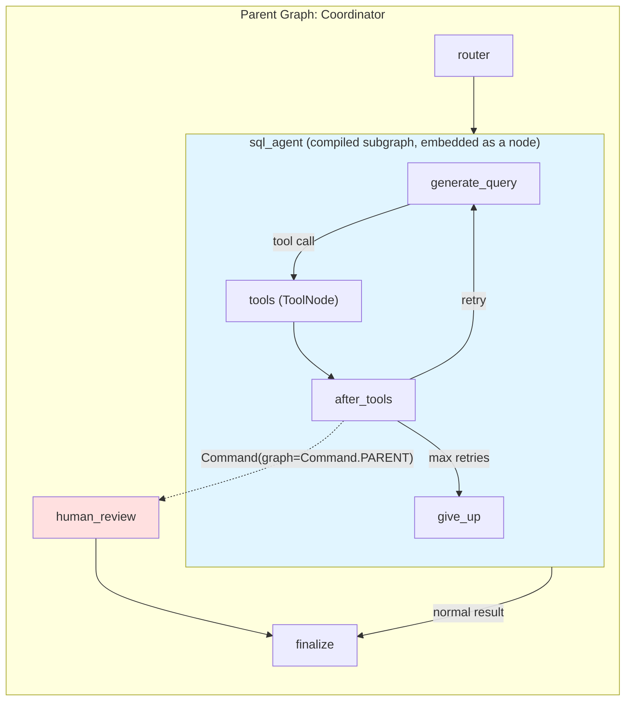
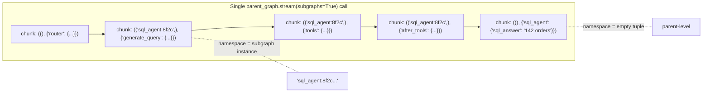
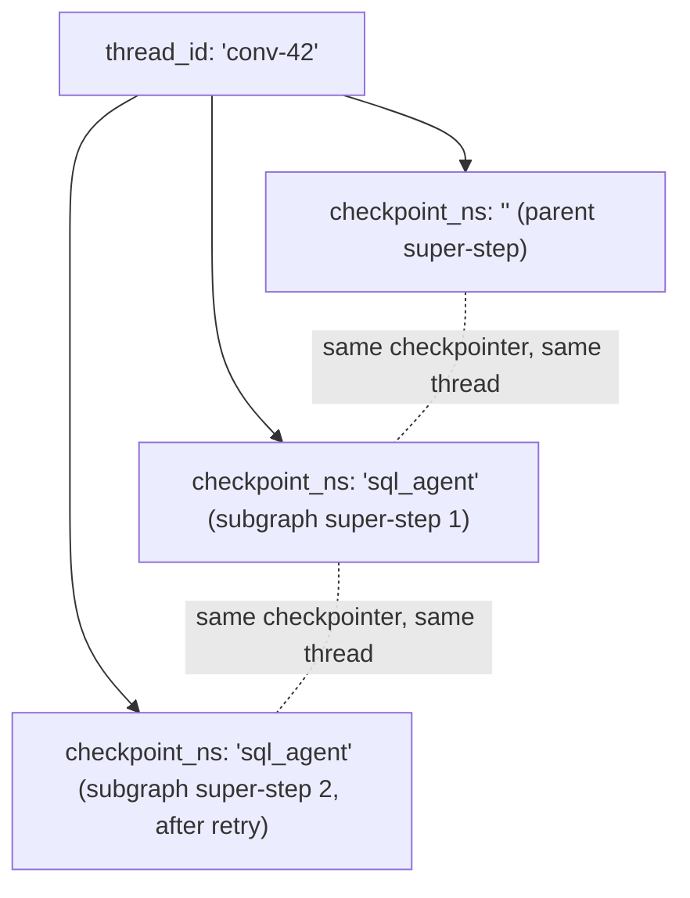

# Chapter 15: Subgraphs & Composition

> "Composition is the mechanism by which complexity becomes tractable." — anonymous systems engineer, paraphrased on a thousand whiteboards

## Learning Objectives

By the end of this chapter, you will be able to:

- Define precisely what a LangGraph **subgraph** is — a fully compiled `StateGraph` used as a single node inside a parent graph — and explain why composition beats one enormous flat graph
- Choose correctly between the two subgraph integration modes: **shared state schema** (direct embedding via `add_node`) and **different state schemas** (a wrapper node that translates state across the boundary)
- Invoke a compiled subgraph directly — outside of any parent — for unit testing and standalone reuse
- Predict exactly how `stream_mode` values and event chunks propagate from a subgraph's internal execution up through the parent's `.stream()` call, including the role of the `subgraphs=True` flag and namespace tuples
- Explain how checkpointing behaves across a parent/subgraph boundary: when the subgraph shares the parent's checkpointer automatically, when it doesn't, and how `thread_id` and `checkpoint_ns` scope state per subgraph instance
- Use `Command(graph=Command.PARENT)` inside a node running *within* a subgraph to route execution in the **parent** graph — implementing early-exit and escalation patterns that a subgraph cannot express on its own
- Decide, with a clear rubric, when a unit of work deserves to be its own subgraph versus staying a plain node or a simple helper function
- Encapsulate a full specialized agent (with its own internal tool-calling loop and routing) as an independently testable, independently compilable subgraph, and wire it into a parent coordinator graph

## Prerequisites for the Chapter

This chapter assumes you've completed:

- **[Chapter 2: StateGraph & State Management](./02-stategraph-and-state-management.md)** — you're comfortable defining state schemas with `TypedDict`, dataclasses, or Pydantic, and you understand reducers (formalized in **[Chapter 6](./06-reducers.md)**)
- **[Chapter 5: Commands & Dynamic Control](./05-commands-and-dynamic-control.md)** — you've used `Command(goto=..., update=...)` to combine routing and state updates inside a single node; this chapter extends that mechanism across a graph boundary
- **[Chapter 7: Compilation & Execution](./07-compilation-and-execution.md)** — you know that `.compile()` turns a `StateGraph` builder into a runnable `CompiledStateGraph`, and that this compiled object exposes `.invoke()`, `.stream()`, and friends, just like any other LangChain Runnable
- **[Chapter 9: Checkpointing & Durable Execution](./09-checkpointing-and-durable-execution.md)** — you understand checkpointers, `thread_id`, and how state snapshots are persisted between super-steps
- **[Chapter 11: Streaming](./11-streaming.md)** — you know the `stream_mode` values (`"values"`, `"updates"`, `"messages"`, `"custom"`, `"debug"`) and what each yields
- **[Chapter 14: Multi-Agent Systems](./14-multi-agent-systems.md)** — you've built a coordinator/supervisor graph that dispatches to specialized agent nodes; this chapter shows you how to give one of those agents real internal structure instead of a single flat function

The core insight this chapter builds toward: **a compiled `StateGraph` is just a Runnable.** Anything you can pass to `add_node` — a function, a `Runnable`, a chain — you can also pass a compiled graph. LangGraph was designed for this from day one; composition isn't a bolted-on feature, it's the same mental model applied recursively.

---

## 1. Why Compose Graphs at All?

Every graph you've built so far in this course has been **flat**: one `StateGraph`, one state schema, a handful of nodes wired together with edges and conditional routing. That works fine up to a point. But consider what happens as a real system grows:

- Your multi-agent coordinator from Chapter 14 now has a SQL agent, a research agent, a summarization agent, and a customer-lookup agent — each with its own retry logic, its own tool loop, its own error handling.
- You want to **unit test** the SQL agent's retry behavior without spinning up the entire coordinator, the routing logic, and the other three agents.
- You want to **reuse** the research agent in two unrelated parent graphs — one that does competitive analysis, one that does customer support escalation — without copy-pasting fifteen nodes and duplicating bug fixes across both copies.
- Your coordinator graph, drawn out, has become a wall of thirty nodes and edges that no one on the team can read at a glance, even though logically it's only "four agents plus a router."

Flat composition doesn't fail — it just stops being *legible*. Every large software system solves this problem the same way: put a boundary around a self-contained unit of behavior, give it a clean interface, and let callers treat it as a black box. Functions do this for code. Microservices do this for infrastructure. **Subgraphs do this for LangGraph.**

The payoff is threefold:

1. **Encapsulation** — the SQL agent's internal retry loop, its tool bindings, its private scratch state (`retries`, `last_error`) never leak into the coordinator's state schema or its authors' mental model.
2. **Reusability** — a compiled subgraph is just an object. Import it, embed it in two different parents, done.
3. **Independent testability** — `sql_agent_graph.invoke(...)` runs and asserts against the subgraph alone, with no coordinator, no other agents, and a fast, focused test.

## 2. What Exactly Is a Subgraph?

A subgraph is nothing exotic: **it is a `StateGraph` that has already been `.compile()`d, used as a node inside a different (parent) `StateGraph`.**

```python
from langgraph.graph import StateGraph, START, END

# Step 1: build and compile a graph, exactly as you've done every chapter so far.
sub_builder = StateGraph(SubState)
sub_builder.add_node("step_one", step_one_fn)
sub_builder.add_node("step_two", step_two_fn)
sub_builder.add_edge(START, "step_one")
sub_builder.add_edge("step_one", "step_two")
sub_builder.add_edge("step_two", END)
compiled_subgraph = sub_builder.compile()   # <-- this is now a "subgraph" once embedded

# Step 2: use the compiled graph as a node in a *different* StateGraph.
parent_builder = StateGraph(ParentState)
parent_builder.add_node("intake", intake_fn)
parent_builder.add_node("delegate", compiled_subgraph)   # <-- the subgraph, as a node
parent_builder.add_node("finalize", finalize_fn)
parent_builder.add_edge(START, "intake")
parent_builder.add_edge("intake", "delegate")
parent_builder.add_edge("delegate", "finalize")
parent_builder.add_edge("finalize", END)
parent_graph = parent_builder.compile()
```

That's it. There is no special `add_subgraph()` method, no separate registration step, no distinct class. `CompiledStateGraph` implements the same Runnable contract (`invoke`, `ainvoke`, `stream`, `astream`, `batch`) as any node function, so `add_node("delegate", compiled_subgraph)` works precisely because LangGraph's execution engine treats "a callable that maps state in to state out" as the fundamental unit — and a compiled graph satisfies that contract just as well as a plain Python function does.

What makes this genuinely powerful, rather than just syntactic sugar, is what happens **inside** that node during execution: instead of running one function body, the engine runs the subgraph's own internal Pregel loop — its own nodes, its own conditional edges, its own super-steps — and only surfaces the *result* (and, as you'll see in Section 5, optionally the intermediate events) to the parent.

There's exactly one design decision that determines how much plumbing you need at the boundary: **do the parent's and the subgraph's state schemas overlap enough to share a channel directly, or are they incompatible?** That decision produces the two integration modes below.

## 3. Integration Mode 1: Shared State Schema (Direct Embedding)

If the subgraph's state schema shares one or more keys with the parent's state schema — and, critically, those shared keys mean the *same thing* in both places — you can add the compiled subgraph directly as a node. No wrapper function needed.

```python
from typing import TypedDict, Annotated
from langgraph.graph.message import add_messages

# Both parent and subgraph agree on `messages` as a shared channel.
class ParentState(TypedDict):
    messages: Annotated[list, add_messages]
    user_id: str

class ResearchState(TypedDict):
    messages: Annotated[list, add_messages]
    sources_found: int

research_builder = StateGraph(ResearchState)
research_builder.add_node("search", search_fn)
research_builder.add_node("synthesize", synthesize_fn)
research_builder.add_edge(START, "search")
research_builder.add_edge("search", "synthesize")
research_builder.add_edge("synthesize", END)
research_subgraph = research_builder.compile()

parent_builder = StateGraph(ParentState)
parent_builder.add_node("research", research_subgraph)   # direct embedding
parent_builder.add_edge(START, "research")
parent_builder.add_edge("research", END)
parent_graph = parent_builder.compile()
```

When you call `parent_graph.invoke({"messages": [...], "user_id": "u1"})`, LangGraph does the following at the `"research"` node:

1. Projects the parent state down onto the subgraph's schema — it hands the subgraph the keys it declares (`messages`, `sources_found` if present) and ignores the rest (`user_id`).
2. Runs the subgraph's own internal Pregel loop to completion (or until it interrupts — see Chapter 12).
3. Merges the subgraph's *output* state back into the parent's state using the parent's own reducers. Because `messages` uses `add_messages` in both schemas, new messages the subgraph appended get appended into the parent's message list too, rather than overwriting it.

Notice that `sources_found` exists only in the subgraph's schema — that's fine. Extra subgraph-only keys are simply invisible to the parent; they don't need to appear in `ParentState` at all. The requirement is only that keys **the parent needs to see** are named and typed compatibly on both sides.

This mode is the simplest possible composition — genuinely "drop a compiled graph in as a node" — but it has a real constraint: the parent and subgraph schemas are coupled by name. Rename `messages` to `chat_history` in the subgraph and the direct embedding silently breaks (the parent will just never see subgraph output, because the key vanished). That coupling is exactly why Mode 2 exists.

## 4. Integration Mode 2: Different State Schemas (Wrapper Node Pattern)

Most real subgraphs — especially ones meant to be genuinely reusable across unrelated parents — have a state schema shaped for their *own* internal bookkeeping (retry counters, scratch variables, partial SQL queries) that has no business existing in the parent's schema, and a parent whose schema has no reason to know about any of it. In that case, wrap the subgraph invocation in an ordinary node function that performs an explicit **translation** at the boundary: parent state in, subgraph input; subgraph output, parent state update.

```python
class CoordinatorState(TypedDict):
    user_request: str
    sql_answer: str | None

class SQLAgentState(TypedDict):
    messages: Annotated[list, add_messages]
    question: str
    sql_query: str | None
    result: str | None
    retries: int

sql_agent_graph = build_sql_agent()  # a compiled StateGraph(SQLAgentState) — see Section 9 below

def run_sql_agent(state: CoordinatorState) -> dict:
    """Wrapper node: translates CoordinatorState -> SQLAgentState -> CoordinatorState."""
    sub_input: SQLAgentState = {
        "messages": [HumanMessage(content=state["user_request"])],
        "question": state["user_request"],
        "sql_query": None,
        "result": None,
        "retries": 0,
    }
    sub_output = sql_agent_graph.invoke(sub_input)
    return {"sql_answer": sub_output["result"]}

coordinator_builder = StateGraph(CoordinatorState)
coordinator_builder.add_node("sql_agent", run_sql_agent)   # a *function*, not the subgraph itself
```

Notice the crucial difference from Mode 1: `add_node("sql_agent", run_sql_agent)` registers a plain Python function, not `sql_agent_graph` directly. The function happens to call `.invoke()` on a compiled graph in its body, but as far as the parent's Pregel loop is concerned, `"sql_agent"` is an ordinary node like any other from Chapter 3 — it receives `CoordinatorState`, returns a partial `CoordinatorState` update, and the fact that a whole nested graph executed in between is an implementation detail.

This is the mode you'll reach for most often in production multi-agent systems, because independently developed agents rarely converge on identical state shapes by accident, and forcing them to would recreate exactly the tight coupling composition is supposed to eliminate.

**A configuration detail that matters:** if you want the subgraph invocation inside the wrapper to participate in the parent's tracing, callbacks, or (as covered in Section 6 below) checkpointing, accept `config` in the wrapper's signature and thread it through:

```python
from langchain_core.runnables import RunnableConfig

def run_sql_agent(state: CoordinatorState, config: RunnableConfig) -> dict:
    sub_input = {"messages": [HumanMessage(content=state["user_request"])], ...}
    sub_output = sql_agent_graph.invoke(sub_input, config)   # pass config through!
    return {"sql_answer": sub_output["result"]}
```

Skip this and the subgraph invocation runs as an orphaned, untraced call — it still works, but you lose LangSmith visibility into what happened inside it (covered fully in **Chapter 20**), and, as you'll see in Section 6, you lose checkpointer propagation too.

## 5. Invoking a Subgraph Directly (Testing & Standalone Reuse)

Because a compiled subgraph is a fully-fledged Runnable, nothing stops you from calling it on its own, entirely outside any parent graph. This is the single biggest practical benefit of subgraph encapsulation: you get a **unit-testable component**.

```python
def test_sql_agent_retries_on_syntax_error():
    result = sql_agent_graph.invoke({
        "messages": [HumanMessage(content="How many orders shipped last week?")],
        "question": "How many orders shipped last week?",
        "sql_query": None,
        "result": None,
        "retries": 0,
    })
    assert result["result"] is not None
    assert result["retries"] <= 3     # the agent's own internal retry cap

def test_sql_agent_streams_intermediate_tool_calls():
    chunks = list(sql_agent_graph.stream(
        {"messages": [...], "question": "...", "sql_query": None, "result": None, "retries": 0},
        stream_mode="updates",
    ))
    node_names = {name for chunk in chunks for name in chunk}
    assert "execute_query" in node_names
```

Notice these tests never construct a `CoordinatorState`, never mock the router, and never touch the other three agents in the coordinator. That's the point: the subgraph's public contract is exactly its own state schema, and testing against that contract is both faster and far more precise than spinning up the whole system and asserting on end-to-end behavior (formalized further in **Chapter 17: Testing LangGraph Applications**).

The same property enables **standalone reuse**: a "research subgraph" built once, tested once, can be imported and embedded into a competitive-analysis parent graph and a customer-support-escalation parent graph without either parent's team touching its internals — they only need to know its input/output contract, exactly as if it were a well-documented library function.

## 6. Streaming Through Subgraphs

Chapter 11 established that `.stream(stream_mode=...)` yields chunks as the parent graph's nodes complete their super-steps. The natural question once a node *is* an entire subgraph: do you only see the subgraph's node as a single opaque step, or can you see inside it while it runs?

By default, **you only see the outside.** A subgraph embedded as a node looks, from the parent's `.stream()` perspective, like any other node: one chunk, emitted when the whole subgraph finishes (or, for `stream_mode="values"`, when the parent's state updates after that node completes). Everything that happened inside — the subgraph's own intermediate node executions — is invisible unless you ask for it.

To surface subgraph-internal events, pass `subgraphs=True` to `.stream()`:

```python
for chunk in parent_graph.stream(
    {"user_request": "How many orders shipped last week?", "sql_answer": None},
    stream_mode="updates",
    subgraphs=True,
):
    print(chunk)
```

With `subgraphs=True`, every yielded item becomes a `(namespace, chunk)` tuple instead of a bare chunk:

```python
((), {"intake": {...}})                                   # parent-level node, empty namespace
(("sql_agent:8f2c...",), {"generate_query": {...}})        # subgraph-internal node
(("sql_agent:8f2c...",), {"execute_query": {...}})         # subgraph-internal node
((), {"sql_agent": {"sql_answer": "142 orders"}})          # parent sees the wrapper node's output
```

The **namespace tuple** identifies which graph emitted the chunk — an empty tuple `()` means "the parent graph itself"; a tuple like `("sql_agent:8f2c...",)` means "inside the subgraph running as the `sql_agent` node, invocation instance `8f2c...`." That instance suffix matters the moment a subgraph is invoked more than once concurrently — for example, if the coordinator fans out the same research subgraph over a list of sub-questions using `Send` (Chapter 13's parallel-execution machinery) — each parallel instance gets its own namespace so you can tell their streamed events apart.

This behavior applies uniformly across `stream_mode` values: `"messages"` mode lets you watch LLM tokens stream out of a node buried three subgraphs deep; `"updates"` mode lets you watch every internal state delta; `"debug"` mode surfaces the full internal task graph. The one caveat is Mode 2 (the wrapper-node pattern from Section 4): if the wrapper node calls `sql_agent_graph.invoke(...)` synchronously inside its body rather than using `.stream()` itself, the *parent's* stream will only ever show that node as a single opaque unit — `subgraphs=True` cannot see inside a subgraph invocation that wasn't itself part of the parent's streaming call chain. To get token-level or step-level visibility into a Mode 2 subgraph, the wrapper node needs to consume `sql_agent_graph.stream(...)` internally and re-emit what it needs (commonly via `get_stream_writer()` for custom events, covered in Chapter 11) — direct embedding (Mode 1) gets this propagation for free precisely because the parent's Pregel engine is driving the subgraph's execution itself, not a wrapper function.

## 7. Checkpointing & thread_id Scoping Across Parent/Child

Chapter 9 established that a checkpointer persists a state snapshot after every super-step, keyed by `thread_id`, so a graph can crash and resume from its last checkpoint. Subgraphs raise an obvious question: whose checkpointer applies inside the nested graph?

**The rule for direct embedding (Mode 1):** compile the subgraph *without* passing it a checkpointer of its own.

```python
# Correct for embedding: no checkpointer here.
research_subgraph = research_builder.compile()

parent_graph = parent_builder.compile(checkpointer=checkpointer)
```

When the subgraph has no checkpointer of its own and is embedded directly as a node, LangGraph automatically propagates the **parent's** checkpointer down into it. The subgraph's internal state after each of its own internal super-steps gets persisted as part of the same checkpoint stream, under the same `thread_id`, distinguished by a `checkpoint_ns` (checkpoint namespace) value that encodes the node path — conceptually `"sql_agent"`, or `"sql_agent:<task_id>"` if there are multiple concurrent instances. This is what makes a parent graph that pauses *inside* a subgraph (say, because the subgraph itself calls `interrupt()` — Chapter 12) resumable: the checkpoint captures exactly which subgraph node was paused, with exactly what internal state, nested under the same thread.

You can inspect this directly:

```python
state = parent_graph.get_state(config, subgraphs=True)
for task in state.tasks:
    if task.state is not None:      # a nested subgraph currently paused/active
        print(task.name, task.state.values)   # the subgraph's own internal state snapshot
```

**If you instead compile the subgraph with its own explicit checkpointer**, that checkpointer takes precedence — the subgraph checkpoints independently of whatever the parent is doing. This is exactly what you want for **standalone testing and reuse** (Section 5): a subgraph under test often wants its own throwaway `MemorySaver` and its own `thread_id`, with no parent graph in the picture at all.

**For the wrapper-node pattern (Mode 2), there is no automatic propagation.** The subgraph invocation inside the wrapper function is a plain nested `.invoke()` call from the engine's point of view — it is not part of the parent's Pregel loop, so the parent's checkpointer has no way to reach into it automatically. Two consequences follow:

- If you want the subgraph's internal steps checkpointed at all, you must compile it with its own checkpointer explicitly and manage a `thread_id` for it yourself (often derived from the parent's, e.g., `f"{parent_thread_id}:sql_agent"`, so runs stay traceable and distinguishable).
- If you *do* pass `config` through from the wrapper (as recommended in Section 4) and the subgraph shares the parent's checkpointer instance, you can get equivalent-looking persistence, but you are responsible for the namespacing discipline that Mode 1 gives you automatically — this is one more reason Mode 1 is preferred whenever the schemas can reasonably be made to overlap.

The practical takeaway: **thread_id identifies a conversation/run; checkpoint_ns identifies where inside a (possibly nested) graph that checkpoint belongs.** Mode 1 gets both for free from the parent. Mode 2 requires you to think about both explicitly.

## 8. Command(graph=Command.PARENT) Revisited

Chapter 5 introduced `Command(goto=..., update=...)` as a way to fuse a routing decision and a state update into one return value from a node, replacing a separate conditional-edge function. Inside a subgraph, that mechanism has one more trick: a node can target the **parent** graph's nodes, not just its own subgraph's, by passing `graph=Command.PARENT`.

```python
from langgraph.types import Command

def execute_query(state: SQLAgentState) -> Command:
    query = state["sql_query"]
    if references_restricted_table(query):
        # Escalate immediately — skip the rest of this subgraph's retry loop
        # AND skip the coordinator's normal post-agent routing — jump straight
        # to a human-review node that lives in the PARENT graph.
        return Command(
            goto="human_review",
            update={"escalation_reason": f"Query touches restricted table: {query}"},
            graph=Command.PARENT,
        )
    result = run_query(query)
    return Command(update={"result": result})
```

Without `graph=Command.PARENT`, `goto="human_review"` would be resolved against the **subgraph's own** node names and fail (or route nowhere useful) — the SQL agent subgraph has no node called `human_review`; that node lives in the coordinator. Setting `graph=Command.PARENT` tells the routing engine: *resolve this `goto` target, and apply this `update`, one level up the composition stack* — directly against the parent graph's own node registry and state schema.

This is the mechanism behind genuine **early-exit and escalation patterns**: a specialized agent, partway through its own internal loop, discovers something that makes continuing its own logic pointless — a policy violation, a need for human sign-off, a signal that a *different* top-level agent should take over — and it can act on that discovery immediately, without first running to the end of its own subgraph, returning control to the coordinator, and hoping the coordinator's own routing logic happens to catch the case. The subgraph reaches up and redirects the parent's control flow directly.

Two constraints worth internalizing:

- **This requires Mode 1 (direct embedding).** `Command(graph=Command.PARENT)` relies on the subgraph executing as a genuinely nested part of the parent's own Pregel loop — the same mechanism that lets the parent's checkpointer propagate down (Section 7). A subgraph invoked manually inside a Mode 2 wrapper function via `.invoke()` has no parent to reach into from the engine's perspective at that point — from inside that nested `.invoke()` call, there simply *is* no enclosing graph; the wrapper node itself is the parent, and the subgraph doesn't know it exists.
- **The `update` dict must be expressible in the parent's state schema.** Just like Mode 1's ordinary state merging (Section 3), whatever keys you set in `update` need to mean the same thing — and exist — in the parent's schema, since they'll be merged there using the parent's reducers.

This is the composition-aware evolution of the `Command` pattern you learned in Chapter 5: routing and update, fused together, now able to cross a graph boundary in the upward direction.

## 9. When to Reach for Subgraphs vs. Plain Nodes

Subgraphs are a genuine tool, not a default. Reaching for one prematurely just adds a schema-translation boundary and a debugging layer of indirection for no benefit. Use this rubric:

**Reach for a subgraph when:**

- The unit of work is **genuinely reusable** across more than one parent graph — a "research subgraph" invoked by both a support-escalation coordinator and a competitive-intelligence coordinator is the textbook case.
- The unit of work is one of the **specialized agents in a multi-agent system** (Chapter 14) and has earned enough internal complexity to deserve its own name: its own tool-calling loop with retries, its own conditional routing between "call another tool" and "answer now," its own internal error recovery. A specialized agent that's genuinely just "one LLM call with a system prompt" does not need this — a plain node is simpler and just as testable.
- You need **independent unit testing** of a component's internal behavior (retry counts, tool-selection logic) without standing up the rest of the system.
- You want to **hide internal state** (scratch variables, retry counters, intermediate drafts) from a parent's schema entirely, keeping the parent's mental model small.
- You anticipate needing the **early-exit-to-parent** pattern from Section 8 — a component that must sometimes redirect the top-level flow, not just report back to its immediate caller.

**Stay with a plain node when:**

- The logic is a single LLM call, a single tool call, or a short linear sequence with no internal branching worth naming.
- There's exactly one parent and no realistic prospect of reuse elsewhere — introducing a second state schema and a translation boundary for a component used in exactly one place is pure overhead.
- The internal steps genuinely need to share the parent's state and reducers directly, and forcing an artificial schema boundary would only add friction with no corresponding benefit (in that case, Mode 1's direct embedding — or even just more nodes in the flat parent graph — beats manufacturing indirection).

A useful gut check borrowed from ordinary software design: if you find yourself describing a chunk of a graph as "**the** X agent" or "**the** research step" — with a definite article, as a noun with its own identity — that's usually a subgraph. If you're describing it as "**this bit** that formats the prompt," that's a plain node.

---

## Examples

The clearest way to see subgraphs earn their keep is a full worked example: taking the SQL agent from Chapter 14's multi-agent coordinator — until now presumably a single, growing node function — and giving it the internal structure it actually deserves: its own state, its own tool-calling loop, and its own compiled graph, tested in isolation and then embedded into the parent coordinator.

### Building the SQL Agent as an independent subgraph

```python
from typing import TypedDict, Annotated, Literal
from langchain_core.messages import HumanMessage, AIMessage, ToolMessage, SystemMessage
from langchain_core.tools import tool
from langgraph.graph import StateGraph, START, END
from langgraph.graph.message import add_messages
from langgraph.prebuilt import ToolNode


class SQLAgentState(TypedDict):
    messages: Annotated[list, add_messages]
    question: str
    sql_query: str | None
    result: str | None
    retries: int


@tool
def run_sql_query(query: str) -> str:
    """Execute a read-only SQL query against the analytics warehouse and return the result."""
    return execute_against_warehouse(query)   # your actual DB call lives here


SQL_TOOLS = [run_sql_query]
MAX_RETRIES = 3


def generate_query(state: SQLAgentState) -> dict:
    """LLM turn: draft a SQL query (as a tool call) or, on a later pass, the final answer."""
    llm_with_tools = sql_llm.bind_tools(SQL_TOOLS)
    system = SystemMessage(content=(
        "You are a SQL analyst agent. Given a question, call run_sql_query with a "
        "read-only SELECT statement. If a previous query failed, look at the error "
        "in the last ToolMessage and correct the query."
    ))
    response = llm_with_tools.invoke([system] + state["messages"])
    return {"messages": [response]}


def route_after_generate(state: SQLAgentState) -> Literal["tools", "give_up", "__end__"]:
    last = state["messages"][-1]
    if getattr(last, "tool_calls", None):
        if state["retries"] >= MAX_RETRIES:
            return "give_up"
        return "tools"
    return "__end__"   # the LLM answered directly, no more tool calls needed


def after_tools(state: SQLAgentState) -> dict:
    """Bookkeeping after a tool call: bump the retry counter if the query errored."""
    last_tool_msg = state["messages"][-1]
    update: dict = {}
    if isinstance(last_tool_msg, ToolMessage) and last_tool_msg.status == "error":
        update["retries"] = state["retries"] + 1
    else:
        update["result"] = last_tool_msg.content
    return update


def give_up(state: SQLAgentState) -> dict:
    return {"result": "I couldn't produce a working query after several attempts."}


sub_builder = StateGraph(SQLAgentState)
sub_builder.add_node("generate_query", generate_query)
sub_builder.add_node("tools", ToolNode(SQL_TOOLS))
sub_builder.add_node("after_tools", after_tools)
sub_builder.add_node("give_up", give_up)

sub_builder.add_edge(START, "generate_query")
sub_builder.add_conditional_edges(
    "generate_query",
    route_after_generate,
    {"tools": "tools", "give_up": "give_up", "__end__": END},
)
sub_builder.add_edge("tools", "after_tools")
sub_builder.add_edge("after_tools", "generate_query")   # loop back until answer or give-up
sub_builder.add_edge("give_up", END)

# No checkpointer here — see Section 7: when embedded (Mode 1), the parent's
# checkpointer is inherited automatically. For standalone use, compile a second
# copy with its own MemorySaver, or pass one in for this specific test run.
sql_agent_graph = sub_builder.compile()
```

### Testing it in isolation — no coordinator required

```python
result = sql_agent_graph.invoke({
    "messages": [HumanMessage(content="How many orders shipped last week?")],
    "question": "How many orders shipped last week?",
    "sql_query": None,
    "result": None,
    "retries": 0,
})
assert result["result"] is not None
```

### Embedding it into the parent coordinator (Mode 2 — schemas differ)

```python
class CoordinatorState(TypedDict):
    user_request: str
    next_agent: str
    sql_answer: str | None
    research_answer: str | None


def run_sql_agent(state: CoordinatorState, config: RunnableConfig) -> dict:
    sub_input: SQLAgentState = {
        "messages": [HumanMessage(content=state["user_request"])],
        "question": state["user_request"],
        "sql_query": None,
        "result": None,
        "retries": 0,
    }
    sub_output = sql_agent_graph.invoke(sub_input, config)
    return {"sql_answer": sub_output["result"]}


coordinator_builder = StateGraph(CoordinatorState)
coordinator_builder.add_node("router", router_fn)
coordinator_builder.add_node("sql_agent", run_sql_agent)       # wrapper node — Mode 2
coordinator_builder.add_node("research_agent", run_research_agent)
coordinator_builder.add_edge(START, "router")
coordinator_builder.add_conditional_edges(
    "router",
    lambda s: s["next_agent"],
    {"sql": "sql_agent", "research": "research_agent"},
)
coordinator_builder.add_edge("sql_agent", END)
coordinator_builder.add_edge("research_agent", END)

coordinator_graph = coordinator_builder.compile(checkpointer=checkpointer)
```

Notice what the coordinator's author never had to think about: retry counts, SQL-specific tool bindings, or the shape of a `ToolMessage` error. All of that is fully encapsulated inside `sql_agent_graph`, tested against its own contract, and exposed to the coordinator as nothing more than "give me a question, I'll give you `sql_answer`."

### Adding the escalation path with Command(graph=Command.PARENT)

To let the SQL agent bypass its own retry loop *and* the coordinator's normal end-of-agent routing when it detects a restricted table, switch the subgraph to Mode 1 (shared `messages` key) and add an escalation branch:

```python
def after_tools(state: SQLAgentState) -> dict | Command:
    last_tool_msg = state["messages"][-1]
    if isinstance(last_tool_msg, ToolMessage) and "restricted_table" in str(last_tool_msg.content):
        return Command(
            goto="human_review",              # a node that lives in the PARENT coordinator
            update={"escalation_reason": "SQL agent queried a restricted table"},
            graph=Command.PARENT,
        )
    if isinstance(last_tool_msg, ToolMessage) and last_tool_msg.status == "error":
        return {"retries": state["retries"] + 1}
    return {"result": last_tool_msg.content}
```

With this in place, and `sql_agent_graph` embedded directly as `coordinator_builder.add_node("sql_agent", sql_agent_graph)`, a single restricted-table hit jumps straight to `human_review` in the coordinator — no further SQL retries, no coordinator-level post-processing of a "successful" (but sensitive) query.

---

## Diagrams







---

## Real-World Scenarios

**Scenario 1 — The reusable research subgraph.** A platform team builds a "research subgraph" (query decomposition → parallel web search → source ranking → synthesis) once, compiled and tested in isolation. Six months later, two unrelated product teams each need "go research something and summarize it" as a step in their own, otherwise completely different, coordinator graphs — one for a sales-intelligence tool, one for an internal documentation assistant. Because the research subgraph was built with a clean, minimal input/output contract (`{"topic": str} -> {"summary": str, "sources": list[str]}`), both teams embed it via the Mode 2 wrapper pattern in an afternoon, with zero changes to the subgraph itself. A bug fix to source deduplication, made once inside the subgraph, propagates to both parent systems on their next deploy.

**Scenario 2 — Escalation from inside a specialized agent.** A financial-services company's multi-agent coordinator (Chapter 14) routes requests to a "transactions agent" subgraph with its own internal tool loop over a payments API. Mid-loop, the transactions agent's tool call returns a result indicating a transaction over the regulatory reporting threshold. Rather than finish its own internal answer-formatting steps and report back normally — which would let the coordinator's ordinary routing carry the (unflagged) answer straight to the end user — the node handling that tool result returns `Command(goto="compliance_review", update={"flag_reason": "..."}, graph=Command.PARENT)`. Because the transactions agent is embedded via Mode 1, that jump lands squarely on the coordinator's `compliance_review` node, and the flagged transaction never reaches a user-facing response without a human in the loop — precisely the pattern from Section 8.

**Scenario 3 — Testing an agent in CI without touching the LLM budget.** The SQL agent subgraph from this chapter's worked example is tested in CI by invoking `sql_agent_graph.invoke(...)` directly, with `sql_llm` swapped for a fake chat model that returns scripted tool calls (Chapter 17 covers this mocking technique in depth). Because the subgraph never depended on the coordinator's router or the other three agents, this test runs in milliseconds, with no network calls, and fails fast and specifically when someone changes the retry logic — long before the change would have surfaced as a mysterious coordinator-level integration test failure.

---

## Best Practices

- **Default to Mode 2 (wrapper node) unless the schemas genuinely already align.** Forcing schema overlap just to use Mode 1's direct embedding creates hidden coupling that's harder to see than an explicit translation function.
- **Compile reusable subgraphs without a checkpointer** and let embedding parents supply one — this keeps the subgraph portable across parents with different persistence needs, and is what makes automatic checkpointer propagation (Section 7) work when embedded directly.
- **Thread `config` through every wrapper node's subgraph `.invoke()` call.** Skipping this silently drops tracing, callbacks, and (if you want it) checkpointer propagation in Mode 2.
- **Keep a subgraph's state schema minimal and its own.** Only the keys the parent genuinely needs to read or write should risk overlapping with the parent's schema (relevant mainly to Mode 1); everything else is private scratch state, and should stay that way.
- **Test every subgraph standalone before ever embedding it.** A subgraph that isn't independently testable hasn't actually bought you the main benefit of building one.
- **Use `subgraphs=True` deliberately, not by default, in production streaming endpoints.** It's invaluable for debugging and for UIs that want to show "the SQL agent is now running query 2 of 3," but it multiplies the volume of chunks a consumer has to filter — namespace-filter aggressively downstream if you turn it on.
- **Reserve `Command(graph=Command.PARENT)` for genuine escalation/early-exit semantics**, not as a general-purpose way to avoid returning results normally — overusing it turns the parent's control flow into something that can be redirected from deep inside any subgraph, which is powerful but easy to make unreadable.
- **Name subgraph-as-node entries after the role, not the implementation** (`"sql_agent"`, not `"sql_subgraph_v2"`) — the parent graph's diagram should read as a description of the workflow, not an inventory of which pieces happen to be subgraphs internally.

## Common Mistakes

- **Renaming a key inside a Mode 1 subgraph without updating the parent.** Because direct embedding relies on name-matched channels, a rename (e.g., `messages` → `chat_history`) inside the subgraph doesn't raise an error — the parent simply stops seeing that piece of subgraph output, and the bug manifests as "the agent ran but its answer never showed up," which is confusing to debug.
- **Expecting `Command(graph=Command.PARENT)` to work from a Mode 2 wrapper node.** Since the wrapper's `.invoke()` call is a nested, standalone execution from the engine's perspective, there is no parent for the routing engine to resolve `goto` against inside that call — this either raises an error or silently does nothing useful, depending on version. If you need the escalation pattern, use Mode 1.
- **Compiling a subgraph with its own checkpointer and then embedding it in a parent that also has one.** The subgraph's explicit checkpointer takes precedence over inheritance, which is sometimes exactly what you want (an intentionally independently-persisted component) but is often an accident — the symptom is that the subgraph's state doesn't show up when you inspect the parent's checkpoint history.
- **Forgetting to pass `config` through a Mode 2 wrapper's `.invoke()` call**, silently losing LangSmith traces for everything that happens inside the subgraph — the parent's trace shows one flat node with no visibility into what it actually did.
- **Assuming `subgraphs=True` is required to get subgraph output at all.** It isn't — a subgraph embedded as a node always contributes its final result to the parent's stream by default. `subgraphs=True` only affects whether you also see the subgraph's *internal* intermediate steps.
- **Over-decomposing.** Turning every three-line node function into its own `StateGraph` "for consistency" adds a schema-translation boundary and a mental indirection layer to something that never needed either — apply the rubric from Section 9 before reaching for a subgraph.
- **Ignoring namespace collisions under parallel fan-out.** If a subgraph is invoked multiple times concurrently (e.g., via `Send` from Chapter 13), each instance gets its own `checkpoint_ns`/namespace suffix — code that naively assumes "there's only ever one `sql_agent` checkpoint" will misbehave the first time two instances run at once.

---

## Summary

- A **subgraph** is simply a compiled `StateGraph` used as a node inside a parent graph — composition, not one flat graph, because a `CompiledStateGraph` satisfies the same Runnable contract (`invoke`/`stream`/etc.) as any node function.
- **Mode 1 (shared schema, direct embedding)** — `add_node("name", compiled_subgraph)` — works when parent and subgraph agree on shared channel names and semantics; state merges through the parent's own reducers automatically.
- **Mode 2 (different schemas, wrapper node)** — a plain node function calls `subgraph.invoke(translated_input, config)` and returns a translated update — the right default for genuinely reusable, independently-designed subgraphs.
- A compiled subgraph can be **invoked directly**, with no parent at all, which is what makes subgraphs independently unit-testable and reusable across unrelated parent graphs.
- **Streaming** through a subgraph requires `subgraphs=True` to surface internal events as `(namespace, chunk)` tuples; without it, a subgraph looks like one opaque node from the parent's `.stream()` call — and this propagation only happens automatically for Mode 1.
- **Checkpointing** propagates automatically from parent to subgraph when the subgraph is compiled *without* its own checkpointer and embedded directly (Mode 1); `thread_id` stays shared while `checkpoint_ns` scopes each nested graph's checkpoints. Mode 2 requires you to thread `config` through manually to get equivalent behavior.
- **`Command(graph=Command.PARENT)`** lets a node inside a Mode-1 subgraph route execution (and merge an update) into the **parent** graph directly — the mechanism behind early-exit and escalation patterns — and does not work from a Mode 2 wrapper's isolated `.invoke()` call.
- Reach for a subgraph when a component is **reusable, independently testable, or complex enough to deserve its own identity** (especially a specialized agent from Chapter 14's multi-agent patterns); stay with a plain node when it's a short, single-purpose, single-parent piece of logic.

---

## Knowledge Check

1. A teammate adds `parent_builder.add_node("agent", compiled_subgraph)` directly, and the parent graph runs without error, but a field the subgraph clearly updates never appears in the parent's final state. What is the most likely cause, and how would you confirm it?
2. Explain, in your own words, why `Command(graph=Command.PARENT)` works when a subgraph is embedded via Mode 1 but does not work when the same subgraph is invoked inside a Mode 2 wrapper node's function body.
3. You compile a subgraph with `sub_builder.compile(checkpointer=MemorySaver())` and then embed it directly as a node in a parent that is compiled with its own PostgreSQL checkpointer. Whose checkpointer actually persists the subgraph's internal state during a parent run, and why might this be a mistake if unintentional?
4. Write the shape of the tuple you'd expect to see from `parent_graph.stream(input, stream_mode="updates", subgraphs=True)` for a chunk produced by a node named `"execute_query"` running inside a subgraph embedded as `"sql_agent"`, assuming it's the only concurrent invocation of that subgraph.
5. Give one concrete example (not from this chapter) of a component that should be a subgraph under the Section 9 rubric, and one that should stay a plain node — and justify each with at least one rubric criterion.
6. In the wrapper-node pattern (Mode 2), what specifically do you lose by omitting the `config: RunnableConfig` parameter from the wrapper function and calling `subgraph.invoke(sub_input)` without it?

---

## Hands-on Exercises

1. **Encapsulate an agent from your own multi-agent system.** Take one specialized agent you built while working through Chapter 14 (or a simplified stand-in) and refactor it into its own `StateGraph` with an explicit state schema, a tool-calling loop, and a retry cap. Compile it standalone and write at least two unit tests that invoke it directly — one for the success path, one that forces the retry/give-up path — with no coordinator involved.

2. **Wire it into a parent coordinator two ways.** First, embed your new subgraph using the Mode 2 wrapper pattern, translating between a `CoordinatorState` and your agent's own schema. Then, as a second exercise, redesign the schemas so the two share a `messages` channel and re-embed it using Mode 1's direct `add_node`. Compare: what changed in how much code you had to write at the boundary, and what did you gain or lose in terms of coupling?

3. **Add an escalation path.** Pick a condition inside your subgraph's tool-execution node that should bypass the rest of the subgraph's own logic entirely (a policy violation, a cost threshold, an error the agent can't recover from) and implement it with `Command(graph=Command.PARENT)`, routing to a new parent-level node you add for this purpose. Then stream the whole run with `stream_mode="updates", subgraphs=True` and confirm you can see the namespaced chunk immediately before the jump to the parent-level node in the output.

---

## Further Reading

- [LangGraph Documentation — Subgraphs](https://docs.langchain.com/oss/python/langgraph/subgraphs) — official guide to composing graphs, including the shared-schema and different-schema patterns covered in this chapter
- [LangGraph Documentation — Streaming](https://docs.langchain.com/oss/python/langgraph/streaming) — full reference for `stream_mode` values and the `subgraphs` flag
- [LangGraph Documentation — Persistence](https://docs.langchain.com/oss/python/langgraph/persistence) — checkpointer propagation, `thread_id`, and `checkpoint_ns` in depth
- [LangGraph Documentation — Multi-Agent Systems](https://docs.langchain.com/oss/python/langgraph/multi-agent) — handoff patterns, including `Command(graph=Command.PARENT)` for cross-graph routing
- [LangGraph GitHub Repository](https://github.com/langchain-ai/langgraph) — source of truth for `CompiledStateGraph`, `Command`, and the Pregel execution engine referenced throughout this chapter
- Related chapter in this course: **[Chapter 14: Multi-Agent Systems](./14-multi-agent-systems.md)** — the coordinator/specialized-agent pattern this chapter's worked example builds directly on
- Related chapter in this course: **[Chapter 9: Checkpointing & Durable Execution](./09-checkpointing-and-durable-execution.md)** — the checkpointer and `thread_id` fundamentals extended in Section 7

---

<div style="display:flex;justify-content:space-between;align-items:center;">
  <a href="./14-multi-agent-systems.md">← Previous: Multi-Agent Systems</a>
  <a href="./00-index.md">🏠 Index</a>
  <a href="./16-advanced-routing-patterns.md">Next: Advanced Routing Patterns →</a>
</div>
