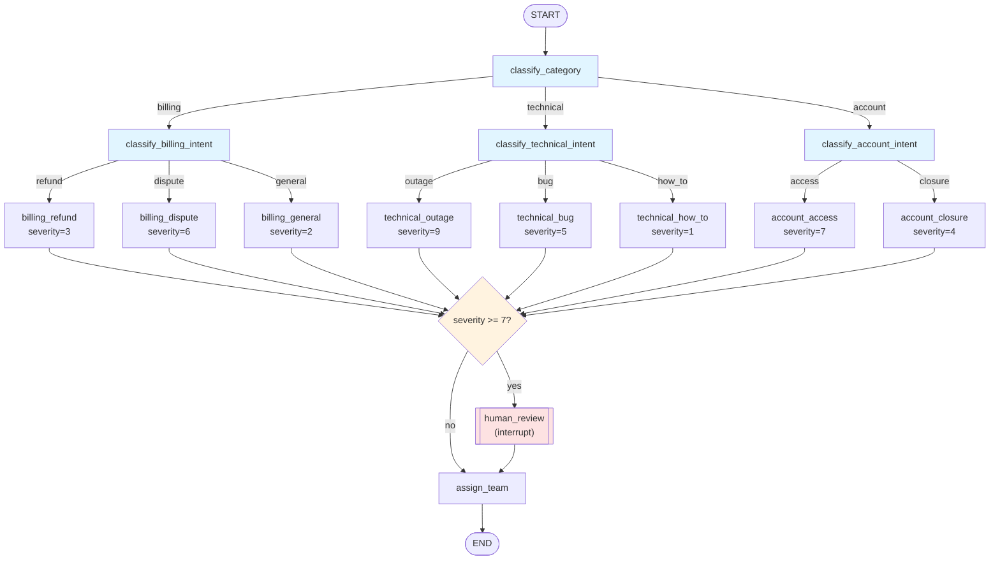

# Chapter 16: Advanced Routing Patterns

> "A graph is not a flowchart you draw once — it's a decision structure you keep proving correct." — a lesson every LangGraph engineer learns the first time a router silently sends state to the wrong handler.

## Learning Objectives

By the end of this chapter, you will be able to:

- Build **nested conditional routing** — multi-level decision trees where a conditional edge's destination is itself a node that performs another conditional routing (domain → sub-intent → handler)
- Construct graphs **programmatically from configuration** — registering a variable number of nodes, tools, or agents at build time instead of hardcoding every `add_node`/`add_edge` call
- Implement a **production-grade map-reduce graph** using the `Send` API (Chapter 13) with proper **error isolation**, so one bad item in a fan-out cannot crash the entire invocation
- Decide, with a clear rule rather than a guess, when to use **`Command`-based routing** versus **`add_conditional_edges`** in the same graph — and why mixing them carelessly produces graphs that lie about their own control flow
- Implement **multi-tier approval/escalation state machines** (auto-approve, manager approval, director approval) that combine routing trees with `interrupt()` from Chapter 12
- Design and trace a full **support-ticket triage graph** that combines nested routing, dynamic construction, and a severity-based human-review escalation path

---

## Prerequisites for the Chapter

This chapter is the capstone of Phase 3 and assumes you're fluent with everything that came before it:

- **[Chapter 4: Edges & Routing](./04-edges-and-routing.md)** — normal edges, `add_conditional_edges`, and the `path_map` argument
- **[Chapter 5: Commands & Dynamic Control](./05-commands-and-dynamic-control.md)** — `Command(goto=..., update=...)` and routing decisions made from inside a node
- **[Chapter 6: Reducers](./06-reducers.md)** — how `Annotated[list, operator.add]`-style reducers merge concurrent state updates, which is essential for the map-reduce pattern in this chapter
- **[Chapter 12: Human-in-the-Loop](./12-human-in-the-loop.md)** — `interrupt()`, pausing a run for human input, and resuming with `Command(resume=...)`
- **[Chapter 13: Parallel Execution](./13-parallel-execution.md)** — the `Send` API for dynamic fan-out, and how reducers merge fanned-out results back together
- **[Chapter 15: Subgraphs & Composition](./15-subgraphs-and-composition.md)** — composing graphs as nodes, which matters here because some of the "handler" nodes in a routing tree are often compiled subgraphs in real systems

No new setup is required — everything in this chapter is standard `langgraph` (plus a checkpointer for the interrupt-based examples, exactly as in Chapter 12). The code in this chapter is written for conceptual clarity and correctness against the LangGraph Python API; it is not executed as part of this course, so treat it as a precise blueprint to adapt, not a copy-paste script.

---

## 1. Recap: The Routing Primitives You Already Have

Before combining them into sophisticated structures, it's worth lining up the four routing primitives side by side, because this chapter is fundamentally about *composing* them correctly rather than introducing new ones.

| Primitive | Declared where | Decided when | Visible in `draw_mermaid()`? | Best for |
|---|---|---|---|---|
| `add_edge(a, b)` | Graph construction | Fixed at compile time | Always | Unconditional "always goes here next" transitions |
| `add_conditional_edges(a, path_fn, path_map)` | Graph construction | Runtime, but the *routing function* is a separate, testable callable | Yes, via `path_map` | Deterministic, business-rule-driven branching that you want to reason about and test independently of node logic |
| `Command(goto=...)` | Inside a node function | Runtime, computed as part of the node's own work | Only if the node's return type is annotated `Command[Literal[...]]` | Routing decisions that are inseparable from the node's own computation (e.g., an LLM call that decides both a state update *and* the next step in one response) |
| `Send(node, state)` | Inside a routing function or node | Runtime, one `Send` per fanned-out unit of work | Shows the target node, not the cardinality | Dynamic fan-out where the *number* of parallel branches depends on runtime data (Chapter 13) |

The single biggest source of confusion in real LangGraph codebases is not any one of these primitives — it's **using more than one to answer the same question**. A graph where node `A` both returns `Command(goto="B")` *and* has `add_conditional_edges("A", ...)` declared against it has two competing descriptions of what happens after `A`. LangGraph resolves this deterministically (a `Command`'s `goto` takes precedence over declared edges for that transition), but a reader of the graph definition has no way to know that just from looking at `add_conditional_edges("A", ...)` — they have to also read the body of `A` to discover the conditional edge is dead code. Section 5 turns this observation into a concrete rule.

With that groundwork, let's build up to genuinely nested, dynamic, and hybrid routing structures.

---

## 2. Nested Conditional Routing: Multi-Level Decision Trees

### 2.1 Why flatten routing into a single mega-router fails

A tempting first design for "route a support ticket" is one giant router function:

```python
def route_everything(state: TicketState) -> str:
    if state["category"] == "billing" and state["sub_intent"] == "refund":
        return "billing_refund"
    elif state["category"] == "billing" and state["sub_intent"] == "dispute":
        return "billing_dispute"
    elif state["category"] == "technical" and state["sub_intent"] == "outage":
        return "technical_outage"
    # ... 15 more branches, three more categories, and growing
```

This works for a demo and becomes unmaintainable in production. Every new sub-intent means editing one sprawling function that mixes unrelated business domains. It's untestable in isolation (you can't unit-test "billing routing" without also importing technical and account logic), and it violates the same single-responsibility principle you already apply to node functions.

### 2.2 The nested pattern: a tree of small routers

The fix is to mirror the *natural hierarchy* of the decision with a **tree of conditional edges**, where each level's destination is itself a node that performs its own, narrower conditional routing:

```python
from typing import TypedDict, Literal, Optional
from langgraph.graph import StateGraph, START, END


class TicketState(TypedDict):
    ticket_id: str
    text: str
    category: Optional[Literal["billing", "technical", "account"]]
    sub_intent: Optional[str]
    assigned_team: Optional[str]


# --- Level 1: domain classification ---

def classify_category(state: TicketState) -> dict:
    # In production this is an LLM call with structured output (Chapter 8).
    # Kept deterministic here for clarity.
    text = state["text"].lower()
    if "charge" in text or "invoice" in text or "refund" in text:
        category = "billing"
    elif "error" in text or "down" in text or "crash" in text:
        category = "technical"
    else:
        category = "account"
    return {"category": category}


def route_by_category(state: TicketState) -> str:
    return state["category"]


# --- Level 2a: billing sub-router (its own conditional routing) ---

def classify_billing_intent(state: TicketState) -> dict:
    text = state["text"].lower()
    if "refund" in text:
        sub_intent = "refund"
    elif "dispute" in text or "wrong" in text:
        sub_intent = "dispute"
    else:
        sub_intent = "general"
    return {"sub_intent": sub_intent}


def route_billing_intent(state: TicketState) -> str:
    return state["sub_intent"]


def billing_refund(state: TicketState) -> dict:
    return {"assigned_team": "billing-refunds"}


def billing_dispute(state: TicketState) -> dict:
    return {"assigned_team": "billing-disputes"}


def billing_general(state: TicketState) -> dict:
    return {"assigned_team": "billing-general"}
```

The graph wiring makes the nesting explicit:

```python
graph = StateGraph(TicketState)

graph.add_node("classify_category", classify_category)
graph.add_node("classify_billing_intent", classify_billing_intent)
graph.add_node("billing_refund", billing_refund)
graph.add_node("billing_dispute", billing_dispute)
graph.add_node("billing_general", billing_general)

graph.add_edge(START, "classify_category")

# Level 1 conditional edge: category -> a domain sub-router node
graph.add_conditional_edges(
    "classify_category",
    route_by_category,
    {
        "billing": "classify_billing_intent",
        "technical": "classify_technical_intent",   # defined analogously
        "account": "classify_account_intent",       # defined analogously
    },
)

# Level 2 conditional edge: sub-intent -> a specific leaf handler.
# This is a *second* conditional edge whose source node ("classify_billing_intent")
# was itself the *destination* of the level-1 conditional edge above.
graph.add_conditional_edges(
    "classify_billing_intent",
    route_billing_intent,
    {
        "refund": "billing_refund",
        "dispute": "billing_dispute",
        "general": "billing_general",
    },
)

graph.add_edge("billing_refund", END)
graph.add_edge("billing_dispute", END)
graph.add_edge("billing_general", END)
```

This is the whole idea of nested conditional routing: **a conditional edge is not required to land on a "final" handler node — it can land on another router node**, and that node can run its own `add_conditional_edges` call. Nothing in LangGraph distinguishes "router nodes" from "worker nodes" structurally; the nesting emerges purely from how you wire `add_conditional_edges` calls to chain into each other. Section 7's full worked example extends this to three domains and a shared escalation path.

### 2.3 Depth, fan-in, and testability considerations

A few practical rules keep nested trees maintainable as they grow:

- **Each router function should be a pure function of state**, taking no dependencies beyond the state dict, so you can unit-test `route_by_category({"category": "billing"}) == "billing"` without constructing a graph or mocking an LLM at all.
- **Watch your recursion limit.** Each level of nesting is one more super-step (Chapter 7) on the path from `START` to a leaf. A three-level tree (domain → sub-intent → handler) plus a final aggregation node is only 4-5 steps deep, well within the default recursion limit — but a design that nests six or seven levels for a rarely-taken path is a sign the tree should be flattened or the classification should happen in a single richer LLM call instead.
- **Converge leaves back to a shared node when they share follow-up logic.** In Section 7's worked example, every leaf handler across all three domains routes to a single `escalation_check` node rather than each leaf duplicating the severity-check logic. This fan-in keeps the escalation rule defined exactly once.
- **Prefer `path_map` even when the returned string already equals the node name.** `add_conditional_edges("classify_category", route_by_category, {"billing": "classify_billing_intent", ...})` is more verbose than omitting the map and letting the returned string double as the destination name, but the explicit map is what makes `.get_graph().draw_mermaid()` render every branch — omit it and LangGraph can only infer destinations it has actually seen taken during a real run, which produces incomplete diagrams for branches your test data hasn't exercised yet.

---

## 3. Dynamic Graph Construction: Building Graphs from Configuration

### 3.1 The problem: pluggable, config-driven systems

Nested routing trees in Section 2 assumed a fixed, known set of categories and handlers written directly into the code. Real platforms often need the *set of routes itself* to come from configuration — a multi-tenant system where each tenant enables a different subset of specialist agents, a plugin architecture where new tools/domains are added via a config file or database row rather than a code change, or a feature-flagged rollout where a new handler exists in code but is only wired into the graph for tenants in a beta cohort.

Hardcoding `add_node`/`add_edge` calls for every possible handler doesn't scale to this. Instead, you build the graph **programmatically**, looping over a configuration structure to decide which nodes exist and how they connect.

### 3.2 Pattern: building `add_node`/`add_conditional_edges` calls from config

```python
from dataclasses import dataclass
from typing import Callable
from langgraph.graph import StateGraph, START, END


@dataclass
class HandlerConfig:
    name: str                       # unique node name, also the routing key
    system_prompt: str
    model_name: str = "gpt-4o-mini"


def make_handler_node(cfg: HandlerConfig) -> Callable[[TicketState], dict]:
    """Factory that closes over one handler's config and returns a node function
    with the standard (state) -> dict signature LangGraph expects."""

    def handler_node(state: TicketState) -> dict:
        # In production: call an LLM configured with cfg.system_prompt / cfg.model_name.
        return {"assigned_team": cfg.name, "handled_by_model": cfg.model_name}

    handler_node.__name__ = f"handle_{cfg.name}"
    return handler_node


def build_triage_graph(handler_configs: list[HandlerConfig]):
    graph = StateGraph(TicketState)
    graph.add_node("classify_category", classify_category)
    graph.add_edge(START, "classify_category")

    path_map: dict[str, str] = {}
    for cfg in handler_configs:
        graph.add_node(cfg.name, make_handler_node(cfg))
        graph.add_edge(cfg.name, END)
        path_map[cfg.name] = cfg.name

    def route_dynamic(state: TicketState) -> str:
        # Falls back to a default handler if the classified category
        # has no configured handler for this tenant.
        return state["category"] if state["category"] in path_map else "fallback"

    graph.add_conditional_edges("classify_category", route_dynamic, path_map)
    return graph.compile()


# Tenant A enables three handlers; Tenant B enables five (including a
# "fraud_review" specialist Tenant A hasn't purchased). The *code* is
# identical — only the config list differs.
tenant_a_graph = build_triage_graph([
    HandlerConfig(name="billing", system_prompt="..."),
    HandlerConfig(name="technical", system_prompt="..."),
    HandlerConfig(name="account", system_prompt="..."),
])

tenant_b_graph = build_triage_graph([
    HandlerConfig(name="billing", system_prompt="..."),
    HandlerConfig(name="technical", system_prompt="..."),
    HandlerConfig(name="account", system_prompt="..."),
    HandlerConfig(name="fraud_review", system_prompt="..."),
    HandlerConfig(name="vip_escalation", system_prompt="..."),
])
```

Three details make this pattern correct rather than merely clever:

1. **Closures, not shared mutable state.** `make_handler_node` returns a fresh function that closes over that *specific* `cfg`. A common bug is writing the loop body inline (`for cfg in configs: def handler(state): return {"assigned_team": cfg.name} ...`) without a factory function — every node then closes over the same loop variable `cfg`, and by the time any node actually executes, `cfg` has already advanced to the last item in the loop. Wrapping the closure-creation in its own function (`make_handler_node`) captures the correct value at each iteration, exactly the same "late-binding closure" trap Python developers hit with loops in list comprehensions and `lambda`s elsewhere.
2. **Deduplicate node names before building.** `add_node` raises if you register the same name twice (or silently overwrites in some versions — never rely on that). Validate `len({c.name for c in handler_configs}) == len(handler_configs)` before looping, so a config error surfaces as a clear validation failure at build time, not a confusing runtime routing bug.
3. **"Dynamic" means dynamic at *build* time, not per-invocation.** A `CompiledGraph` object has fixed topology from the moment `.compile()` returns — there is no API to add a node to an already-compiled graph mid-run. If your FastAPI service needs different graphs for different tenants, compile one `CompiledGraph` per distinct configuration once (e.g., at startup or on first request, cached by a hash of the config) and reuse it across requests for that tenant. Rebuilding and recompiling the graph inside the hot request path on every call is wasted work and, at scale, meaningful added latency.

### 3.3 When dynamic construction is (and isn't) the right tool

Dynamic construction earns its complexity when the *set* of routing destinations genuinely varies across deployments, tenants, or environments. It's the wrong tool when you're really just trying to avoid typing out `add_edge` calls for a small, fixed, well-known set of handlers — in that case, explicit code (Section 2's style) is more readable, more greppable, and easier for a new engineer to trace than a config file plus a factory function. Reach for Section 3.2's pattern when you can point to a genuine axis of variation (tenant, feature flag, plugin registry); don't reach for it out of a general aesthetic preference for "configurable" code.

---

## 4. Map-Reduce Revisited: Production `Send()` Patterns with Error Isolation

Chapter 13 introduced `Send` for dynamic fan-out — mapping a variable number of parallel branches over runtime data, with a reducer merging results back together. This section turns that primitive into a **complete, production-hardened map-reduce graph**: a map step, isolated per-item workers, and a reduce step that survives individual item failures.

### 4.1 The shape of the pattern

```python
import operator
from typing import Annotated, TypedDict
from langgraph.graph import StateGraph, START, END
from langgraph.types import Send


class ItemResult(TypedDict):
    item_id: str
    status: Literal["ok", "error"]
    output: Optional[str]
    error: Optional[str]


class MapReduceState(TypedDict):
    items: list[dict]                                    # the raw input batch
    results: Annotated[list[ItemResult], operator.add]    # merged across all Send branches
    summary: Optional[dict]


def fan_out(state: MapReduceState) -> list[Send]:
    """The 'map' step: one Send per item, each carrying just that item's data."""
    return [
        Send("process_item", {"item": item})
        for item in state["items"]
    ]
```

Note that `process_item`'s per-branch state (`{"item": item}`) is intentionally a *narrow slice*, not the full `MapReduceState` — each `Send` invocation runs the target node with its own private view built from the payload you pass, merged against the graph's overall schema. This is the same isolation Chapter 13 covered: branches don't see each other's items and can't accidentally clobber each other's work-in-progress.

### 4.2 The worker node: where error isolation actually happens

This is the part production systems get wrong by omission. If `process_item` lets an exception propagate, **LangGraph does not silently skip that one branch** — an unhandled exception in any node, including one invoked via `Send`, aborts the entire super-step and the whole `.invoke()`/`.stream()` call raises. A single malformed item (a null field, a downstream API timeout, a rate limit on one call among a hundred) takes down the *entire* batch, not just its own branch. Error isolation is something you must build deliberately, by catching failures inside the node and encoding them into state as data rather than letting them become uncaught exceptions:

```python
def process_item(state: dict) -> dict:
    item = state["item"]
    try:
        # The actual per-item work: an LLM call, an external API call,
        # a database write — anything that can fail independently.
        output = risky_transform(item)
        return {
            "results": [
                ItemResult(item_id=item["id"], status="ok", output=output, error=None)
            ]
        }
    except Exception as exc:
        # Swallow the exception *here* and turn it into data. This is what
        # keeps one bad item from crashing the other 99 in-flight branches.
        return {
            "results": [
                ItemResult(item_id=item["id"], status="error", output=None, error=str(exc))
            ]
        }
```

The `results` field's `operator.add` reducer (Chapter 6) is what makes this safe under concurrency: every parallel branch appends its own single-element list, and LangGraph merges all of them into one combined list once every fanned-out branch for that super-step completes — regardless of whether each branch's outcome was `"ok"` or `"error"`.

### 4.3 The reduce node: separating signal from failure

```python
def reduce_results(state: MapReduceState) -> dict:
    successes = [r for r in state["results"] if r["status"] == "ok"]
    failures = [r for r in state["results"] if r["status"] == "error"]

    summary = {
        "total": len(state["results"]),
        "succeeded": len(successes),
        "failed": len(failures),
        "failure_rate": len(failures) / len(state["results"]) if state["results"] else 0.0,
        "failed_item_ids": [f["item_id"] for f in failures],
    }
    return {"summary": summary}


graph = StateGraph(MapReduceState)
graph.add_node("process_item", process_item)
graph.add_node("reduce_results", reduce_results)

# The map step is expressed as a conditional edge whose path function
# returns a *list* of Send objects instead of a single destination string.
graph.add_conditional_edges(START, fan_out, ["process_item"])
graph.add_edge("process_item", "reduce_results")
graph.add_edge("reduce_results", END)

compiled = graph.compile()
```

### 4.4 Beyond try/except: complementary reliability tools

Catching exceptions inside `process_item` handles *expected, permanent* failures gracefully (bad input data, business-rule violations). For *transient* failures (a flaky network call, a rate-limited API), combine this pattern with the `RetryPolicy` you can attach per node — `graph.add_node("process_item", process_item, retry=RetryPolicy(max_attempts=3))` — so LangGraph retries the node automatically before your `except` block ever needs to record it as a permanent failure. Chapter 18 covers retry policies and broader resilience patterns in depth; here, the point is that error isolation (this section) and retry policies solve different problems and are usually used together: retries reduce how often a failure reaches your `except` block at all, and the isolation pattern guarantees that when a failure does reach it, it degrades one item's result rather than the whole batch.

A production reduce node commonly acts on `summary["failure_rate"]` too — for example, routing to a human-review or alerting node if more than some threshold of items failed, rather than silently returning a batch that's mostly errors as if it succeeded. That threshold-driven branching is exactly the escalation pattern Section 6 formalizes for approval flows, and the same idea applies here: a reduce node can end in a conditional edge just as easily as any other node.

---

## 5. Combining Command-Based Routing with Conditional Edges

### 5.1 The decision rule

Both mechanisms can coexist in one graph — most non-trivial production graphs use both — but they should never both answer the routing question for the *same* transition. Use this rule:

> **If the routing decision can be computed from state alone, by a function with no side effects, declare it with `add_conditional_edges`. If the routing decision is inseparable from work the node is already doing — most often, output an LLM already produced in the same call — return it as `Command(goto=...)` from inside the node.**

| Situation | Use |
|---|---|
| Business rule branching on a field already in state (amount, category, severity) | `add_conditional_edges` |
| An LLM call whose structured output includes both a state update *and* "what should happen next" in a single response | `Command(goto=..., update=...)` |
| A router whose logic you want to unit-test in isolation, without invoking any node | `add_conditional_edges` |
| A supervisor/coordinator node in a multi-agent system (Chapter 14) picking the next specialist based on its own reasoning | `Command(goto=...)` |
| A fixed, always-taken transition | `add_edge` |

### 5.2 Why mixing them at the same decision point is dangerous

Consider a node that both issues `Command(goto="B")` under some internal condition, *and* has `add_conditional_edges("A", some_router, {...})` declared against it for other cases:

```python
def node_a(state: State) -> Command[Literal["b", "c"]] | dict:
    if state["urgent"]:
        return Command(goto="b", update={"handled_urgently": True})
    return {"checked": True}   # falls through to declared conditional edges


graph.add_conditional_edges("a", route_a, {"normal": "c", "special": "d"})
```

This *works* — LangGraph applies the `Command`'s `goto` when the node returns one, and falls back to evaluating `route_a` against the declared `path_map` when it returns a plain dict. But now a reader has to open `node_a`'s source to discover that `"d"` is even a reachable destination from here in some cases while `"b"` is reachable in others *not represented in `route_a` at all*. This is the "hard-to-trace control flow" this chapter's brief warns about: the graph definition (`add_conditional_edges` call) and the actual runtime behavior have diverged, and nothing on the `add_conditional_edges` line signals that divergence.

**The practical boundary that avoids this:** pick one mechanism *per node*, not per graph. If a node ever needs `Command(goto=...)` for even one of its branches, route *all* of that node's outgoing transitions via `Command`, and don't also declare `add_conditional_edges` from it. Conversely, if a node's routing is fully declared via `add_conditional_edges`, don't have it return `Command(goto=...)` for a "special case" — add another explicit branch to the router function instead. This keeps the question "what can happen after node X?" answerable by looking at exactly one place.

### 5.3 Making `Command`-based routing visible in the graph

When a node uses `Command(goto=...)`, annotate its return type so LangGraph can still describe the possible destinations without having actually executed every branch:

```python
from langgraph.types import Command
from typing import Literal

def supervisor(state: SupervisorState) -> Command[Literal["billing_agent", "technical_agent", "account_agent"]]:
    decision = llm_with_structured_output.invoke(state["messages"])
    return Command(
        goto=decision.next_agent,
        update={"messages": [decision.rationale_message]},
    )

graph.add_node("supervisor", supervisor)
# No add_conditional_edges needed here — the Literal annotation is what
# lets .get_graph().draw_mermaid() render edges to all three agents,
# even though only one is taken on any given run.
```

Without the `Command[Literal[...]]` annotation, `.get_graph().draw_mermaid()` can only draw destinations the graph has actually observed being taken (or none at all, depending on version), producing a diagram that silently under-represents the graph's real behavior. Since this chapter is explicitly about keeping nested and hybrid routing *traceable*, treat this annotation as mandatory whenever a node's `goto` target varies — not an optional nicety.

### 5.4 A hybrid graph in practice

A realistic multi-agent support system: a `Command`-driven supervisor decides which specialist agent handles a turn (its decision is a byproduct of one LLM call, so `Command` is the right fit — Section 5.1's rule), while each specialist agent's *internal* "should this escalate?" check is a small, independently testable business rule best expressed as `add_conditional_edges`:

```python
graph.add_node("supervisor", supervisor)                 # Command-driven
graph.add_node("billing_agent", billing_agent)
graph.add_node("technical_agent", technical_agent)
graph.add_node("account_agent", account_agent)
graph.add_node("escalation_check", escalation_check)
graph.add_node("human_review", human_review)
graph.add_node("finalize", finalize)

for agent in ("billing_agent", "technical_agent", "account_agent"):
    graph.add_edge(agent, "escalation_check")

# Declarative: a pure function of severity, easy to unit-test in isolation.
graph.add_conditional_edges(
    "escalation_check",
    lambda state: "human_review" if state["severity"] >= 8 else "finalize",
    {"human_review": "human_review", "finalize": "finalize"},
)
```

The supervisor's routing is intrinsic to its own LLM call (`Command`); the escalation check is a deterministic threshold with nothing to do with any node's internal logic (`add_conditional_edges`). Each transition in this graph has exactly one place that decides it — that's the property to optimize for, not "using fewer lines of code" or "using the newer-feeling API everywhere."

---

## 6. State-Machine Patterns for Multi-Tier Approval and Escalation

### 6.1 Modeling approval tiers as a routing tree

A common enterprise requirement — auto-approve small amounts, require a manager for a middle band, require a director above that — is naturally a **routing tree whose leaves are either an automatic decision or an `interrupt()`**:

```python
from langgraph.types import interrupt, Command
from typing import Literal


class ApprovalState(TypedDict):
    request_id: str
    amount: float
    tier: Optional[Literal["auto", "manager", "director"]]
    decision: Optional[Literal["approved", "rejected"]]
    decided_by: Optional[str]


def classify_tier(state: ApprovalState) -> dict:
    amount = state["amount"]
    if amount < 100:
        tier = "auto"
    elif amount <= 1000:
        tier = "manager"
    else:
        tier = "director"
    return {"tier": tier}


def route_by_tier(state: ApprovalState) -> str:
    return state["tier"]


def auto_approve(state: ApprovalState) -> dict:
    return {"decision": "approved", "decided_by": "system:auto-approval-rule"}


def manager_review(state: ApprovalState) -> dict:
    response = interrupt({
        "request_id": state["request_id"],
        "amount": state["amount"],
        "tier": "manager",
        "prompt": f"Approve spend of ${state['amount']:.2f}?",
    })
    # response is whatever the resuming Command(resume=...) call supplies —
    # by convention here, a dict like {"approved": True, "approver": "jsmith"}
    return {
        "decision": "approved" if response["approved"] else "rejected",
        "decided_by": response["approver"],
    }


def director_review(state: ApprovalState) -> dict:
    response = interrupt({
        "request_id": state["request_id"],
        "amount": state["amount"],
        "tier": "director",
        "prompt": f"Director approval required for ${state['amount']:.2f}.",
    })
    return {
        "decision": "approved" if response["approved"] else "rejected",
        "decided_by": response["approver"],
    }
```

Wiring the tree:

```python
graph = StateGraph(ApprovalState)
graph.add_node("classify_tier", classify_tier)
graph.add_node("auto_approve", auto_approve)
graph.add_node("manager_review", manager_review)
graph.add_node("director_review", director_review)

graph.add_edge(START, "classify_tier")
graph.add_conditional_edges(
    "classify_tier",
    route_by_tier,
    {"auto": "auto_approve", "manager": "manager_review", "director": "director_review"},
)
graph.add_edge("auto_approve", END)
graph.add_edge("manager_review", END)
graph.add_edge("director_review", END)

# interrupt() requires a checkpointer, exactly as in Chapter 12 — without one,
# there is no durable point to pause at and resume from.
checkpointer = MemorySaver()
compiled = graph.compile(checkpointer=checkpointer)
```

### 6.2 Resuming an interrupted tier

The calling application drives the pause/resume cycle precisely as Chapter 12 described, just now with tier-specific payloads:

```python
config = {"configurable": {"thread_id": "req-4471"}}

result = compiled.invoke({"request_id": "req-4471", "amount": 450.0}, config=config)
# result contains an interrupt payload: {"tier": "manager", "amount": 450.0, ...}
# because classify_tier routed this request to manager_review, which paused.

# ... later, once a manager has actually reviewed the request in your UI ...
final = compiled.invoke(
    Command(resume={"approved": True, "approver": "jsmith"}),
    config=config,
)
# final["decision"] == "approved", final["decided_by"] == "jsmith"
```

### 6.3 Generalizing to N tiers and cross-tier escalation

Two extensions come up constantly in real approval systems:

- **More tiers than three.** The pattern doesn't change shape as you add tiers — it's still one classification node, one conditional edge, and one node per tier (auto-decision or `interrupt()`). What changes is that the classification function's thresholds should live in configuration (tying back to Section 3), not be hardcoded numeric literals, since finance/policy teams change these bands far more often than engineers change code.
- **Escalation *within* a tier.** A manager reviewing a request might themselves decide it needs director sign-off (e.g., they're uncomfortable approving it despite it being under the $1,000 threshold). Model this as the `manager_review` node's resume payload including an `"escalate": true` option, and have the node return `Command(goto="director_review")` in that case instead of finalizing — a clean example of Section 5's rule in action: this particular next-step decision (stay vs. escalate) is inseparable from the human response the node just received, so `Command` is the right mechanism here even though the *initial* tier classification above it correctly used `add_conditional_edges`.

```python
def manager_review(state: ApprovalState) -> Command[Literal["director_review", "__end__"]]:
    response = interrupt({...})
    if response.get("escalate"):
        return Command(goto="director_review", update={"tier": "director"})
    return Command(
        goto="__end__",
        update={
            "decision": "approved" if response["approved"] else "rejected",
            "decided_by": response["approver"],
        },
    )
```

This tier-escalation transition is intentionally implemented with `Command` even though the *initial* routing tree above it uses `add_conditional_edges` — exactly the hybrid pattern Section 5.4 describes, applied to a state-machine domain instead of a multi-agent one.

---

## Examples

### Full Worked Example: A Support-Ticket Triage Graph

This example combines every pattern from this chapter into one graph: **nested routing** (category → sub-intent → handler), **dynamic construction** (the account-domain handlers are registered from a config list), and a **severity-based escalation path** that interrupts for human review — closing the loop back to Chapter 12.

#### State

```python
from typing import TypedDict, Literal, Optional
from langgraph.graph import StateGraph, START, END
from langgraph.types import Command, interrupt
from langgraph.checkpoint.memory import MemorySaver


class TriageState(TypedDict):
    ticket_id: str
    text: str
    category: Optional[Literal["billing", "technical", "account"]]
    sub_intent: Optional[str]
    assigned_team: Optional[str]
    severity: Optional[int]           # 1 (trivial) .. 10 (critical)
    escalated: bool
    human_decision: Optional[str]
```

#### Level 1: domain classification

```python
def classify_category(state: TriageState) -> dict:
    text = state["text"].lower()
    if any(w in text for w in ("charge", "invoice", "refund", "billed")):
        category = "billing"
    elif any(w in text for w in ("error", "down", "crash", "500", "outage")):
        category = "technical"
    else:
        category = "account"
    return {"category": category, "escalated": False}


def route_by_category(state: TriageState) -> str:
    return state["category"]
```

#### Level 2: per-domain sub-intent classification (nested routers)

```python
def classify_billing_intent(state: TriageState) -> dict:
    text = state["text"].lower()
    if "refund" in text:
        return {"sub_intent": "refund"}
    if "dispute" in text or "unauthorized" in text:
        return {"sub_intent": "dispute"}
    return {"sub_intent": "general"}


def classify_technical_intent(state: TriageState) -> dict:
    text = state["text"].lower()
    if "down" in text or "outage" in text or "500" in text:
        return {"sub_intent": "outage"}
    if "bug" in text or "error" in text:
        return {"sub_intent": "bug"}
    return {"sub_intent": "how_to"}


def classify_account_intent(state: TriageState) -> dict:
    text = state["text"].lower()
    if "locked" in text or "login" in text or "password" in text:
        return {"sub_intent": "access"}
    return {"sub_intent": "closure"}
```

#### Level 3: leaf handlers, computing severity as they assign a team

```python
def billing_refund(state: TriageState) -> dict:
    return {"assigned_team": "billing-refunds", "severity": 3}


def billing_dispute(state: TriageState) -> dict:
    return {"assigned_team": "billing-disputes", "severity": 6}


def billing_general(state: TriageState) -> dict:
    return {"assigned_team": "billing-general", "severity": 2}


def technical_outage(state: TriageState) -> dict:
    return {"assigned_team": "sre-oncall", "severity": 9}


def technical_bug(state: TriageState) -> dict:
    return {"assigned_team": "eng-support", "severity": 5}


def technical_how_to(state: TriageState) -> dict:
    return {"assigned_team": "tech-general", "severity": 1}


def account_access(state: TriageState) -> dict:
    return {"assigned_team": "account-security", "severity": 7}


def account_closure(state: TriageState) -> dict:
    return {"assigned_team": "account-general", "severity": 4}
```

#### The escalation path: a conditional edge into an `interrupt()`

Every leaf handler above converges on one shared node, so the "should a human see this?" rule is defined exactly once (Section 2.3's fan-in guidance):

```python
SEVERITY_ESCALATION_THRESHOLD = 7

def route_escalation(state: TriageState) -> str:
    return "human_review" if state["severity"] >= SEVERITY_ESCALATION_THRESHOLD else "assign_team"


def human_review(state: TriageState) -> dict:
    response = interrupt({
        "ticket_id": state["ticket_id"],
        "category": state["category"],
        "sub_intent": state["sub_intent"],
        "severity": state["severity"],
        "assigned_team": state["assigned_team"],
        "prompt": "Severity is high enough to require human sign-off before routing.",
    })
    return {
        "human_decision": response["decision"],
        "escalated": True,
        # A human reviewer can override the automatically assigned team.
        "assigned_team": response.get("override_team", state["assigned_team"]),
    }


def assign_team(state: TriageState) -> dict:
    # Terminal bookkeeping node — in production this would enqueue the
    # ticket into the assigned team's queue (a DB write or API call).
    return {}
```

#### Wiring it all together

```python
graph = StateGraph(TriageState)

# Level 1
graph.add_node("classify_category", classify_category)

# Level 2 (nested routers)
graph.add_node("classify_billing_intent", classify_billing_intent)
graph.add_node("classify_technical_intent", classify_technical_intent)
graph.add_node("classify_account_intent", classify_account_intent)

# Level 3 (leaves)
graph.add_node("billing_refund", billing_refund)
graph.add_node("billing_dispute", billing_dispute)
graph.add_node("billing_general", billing_general)
graph.add_node("technical_outage", technical_outage)
graph.add_node("technical_bug", technical_bug)
graph.add_node("technical_how_to", technical_how_to)
graph.add_node("account_access", account_access)
graph.add_node("account_closure", account_closure)

# Shared escalation path
graph.add_node("human_review", human_review)
graph.add_node("assign_team", assign_team)

graph.add_edge(START, "classify_category")

graph.add_conditional_edges(
    "classify_category",
    route_by_category,
    {
        "billing": "classify_billing_intent",
        "technical": "classify_technical_intent",
        "account": "classify_account_intent",
    },
)

graph.add_conditional_edges(
    "classify_billing_intent",
    lambda s: s["sub_intent"],
    {"refund": "billing_refund", "dispute": "billing_dispute", "general": "billing_general"},
)
graph.add_conditional_edges(
    "classify_technical_intent",
    lambda s: s["sub_intent"],
    {"outage": "technical_outage", "bug": "technical_bug", "how_to": "technical_how_to"},
)
graph.add_conditional_edges(
    "classify_account_intent",
    lambda s: s["sub_intent"],
    {"access": "account_access", "closure": "account_closure"},
)

# Every leaf converges on the same escalation check.
for leaf in (
    "billing_refund", "billing_dispute", "billing_general",
    "technical_outage", "technical_bug", "technical_how_to",
    "account_access", "account_closure",
):
    graph.add_conditional_edges(
        leaf,
        route_escalation,
        {"human_review": "human_review", "assign_team": "assign_team"},
    )

graph.add_edge("human_review", "assign_team")
graph.add_edge("assign_team", END)

triage_graph = graph.compile(checkpointer=MemorySaver())
```

#### Driving it end-to-end

```python
config = {"configurable": {"thread_id": "ticket-8821"}}

result = triage_graph.invoke(
    {"ticket_id": "ticket-8821", "text": "Our production API has been returning 500 errors for 20 minutes."},
    config=config,
)
# classify_category -> "technical" -> classify_technical_intent -> "outage"
# -> technical_outage (severity=9) -> route_escalation -> 9 >= 7 -> human_review
# The invoke() call above returns with an interrupt payload; no ticket has
# been assigned yet, by design — a live outage waits for a human to confirm
# routing rather than silently auto-assigning at 3am.

final = triage_graph.invoke(
    Command(resume={"decision": "confirmed", "override_team": "sre-oncall-p1"}),
    config=config,
)
# final["assigned_team"] == "sre-oncall-p1", final["escalated"] is True
```

Notice the tree depth on this path: `classify_category` → `classify_technical_intent` → `technical_outage` → `human_review` → `assign_team` — five super-steps, two of them conditional-edge decisions nested inside each other, converging through a single shared escalation gate. That's nested conditional routing, an interrupt-based approval tier, and fan-in convergence, all in one graph, exactly as described across Sections 2, 4, and 6.

---

## Diagrams



The diagram makes the "nesting" concrete: the first conditional edge (out of `classify_category`) lands on three more nodes that *each* run their own conditional edge, and all eight possible leaves converge back through one shared decision point before reaching `assign_team`. The interrupt (`human_review`) sits exactly at the convergence point, so it's evaluated once per ticket no matter which of the eight leaf paths produced it — not duplicated eight times.

---

## Real-World Scenarios

**Scenario 1 — the router that lied.** A fintech team built a loan-approval graph with a single node, `evaluate_application`, that used `Command(goto=...)` to send low-risk applications to `auto_approve`, medium-risk to `manual_review`, and flagged applications to `fraud_check`. Six months later, a new engineer added a fourth path — `regulatory_hold`, for applications from newly-restricted jurisdictions — but did it by adding an `add_conditional_edges("evaluate_application", ...)` call instead of extending the `Command` logic already in the node, because that's what they saw examples of elsewhere in the codebase. The graph compiled without error. In production, `regulatory_hold` was silently unreachable: `evaluate_application` always returned a `Command`, so the declared conditional edges were dead code that never executed, exactly as Section 5.2 describes. Applications that should have been held for compliance review were quietly auto-approved for two weeks before an audit caught it. The fix wasn't just "route jurisdiction correctly" — it was retroactively documenting the one-mechanism-per-node rule so the next engineer wouldn't reach for the wrong primitive out of familiarity.

**Scenario 2 — the map-reduce that took down a nightly batch job.** A data-enrichment pipeline used `Send` to fan out over roughly 2,000 records per night, one worker node per record calling a third-party enrichment API. For the first month, this worked reliably. Then the third-party API started intermittently returning malformed JSON for a small fraction of records — maybe 1 in 500. Because the worker node had no `try/except`, the very first malformed response raised inside a node invoked via `Send`, which aborted the entire super-step and failed the whole 2,000-record batch, including the 1,999 records that would otherwise have succeeded. The on-call engineer's first instinct was to add retries, which reduced the failure rate but didn't eliminate it — some malformed responses were deterministic (a specific record's data reliably confused the third-party parser), so no amount of retrying helped. The actual fix was exactly Section 4.2's pattern: wrap the per-item call in `try/except`, encode failures as `{"status": "error", ...}` results merged by the same reducer as successes, and let the reduce node decide — based on `failure_rate` — whether the batch as a whole needed attention, instead of one bad record deciding that for all 2,000.

---

## Best Practices

- **One routing mechanism per node's outgoing transitions.** If a node ever needs `Command(goto=...)`, don't also declare `add_conditional_edges` from it — pick one so "what happens after this node?" has exactly one place to look (Section 5.2).
- **Keep router functions pure and separately testable.** A router should be `def route(state) -> str`, importable and callable in a unit test with a hand-built state dict, with zero graph or LLM dependencies.
- **Converge nested tree leaves onto shared follow-up nodes** rather than duplicating shared logic (like an escalation check) in every leaf handler — define the rule once (Section 2.3, Section 7).
- **Never let a `Send`-invoked worker node raise an uncaught exception in production.** Catch it, encode the failure as data merged by the same reducer as successes, and let a downstream reduce node decide what a partial failure means for the batch (Section 4.2).
- **Annotate `Command`-returning nodes with `Command[Literal[...]]`** so the graph's visualized structure doesn't understate its real destinations (Section 5.3).
- **Build dynamic graphs from validated configuration, with deduplicated node names and closures created via a factory function** — not inline loop bodies that capture the wrong loop variable (Section 3.2).
- **Treat approval/escalation thresholds as configuration, not code**, so policy changes (a new approval band, a new severity cutoff) don't require an engineering deploy.
- **Compile with a checkpointer whenever any node in the graph can call `interrupt()`** — without one, there's no durable point to pause at (Chapter 12; Section 6.1).
- **Diagram your graph and read it like a stranger would.** Run `.get_graph().draw_mermaid()` after any routing change and check that it still matches your mental model — it's the fastest way to catch a Section 5.2-style divergence before it reaches production.

---

## Common Mistakes

- **Declaring `add_conditional_edges` from a node that also returns `Command(goto=...)`**, creating two competing descriptions of the node's routing where only one (the `Command`) actually takes effect at runtime — the mistake behind Real-World Scenario 1.
- **Letting an uncaught exception inside a `Send`-invoked worker node crash an entire map-reduce batch**, instead of catching it and encoding the failure as a result the reducer can merge alongside successes — the mistake behind Real-World Scenario 2.
- **Writing an inline closure inside a config-driven build loop** (`for cfg in configs: def node(state): return {...cfg...}`) instead of a factory function, so every dynamically created node closes over the same final loop variable rather than its own config.
- **Forgetting the `Command[Literal[...]]` return-type annotation**, leaving `.get_graph().draw_mermaid()` unable to show destinations the graph hasn't happened to take yet — surprising whoever reads the diagram to understand the system.
- **Flattening what should be a nested tree into one router function with a long `if/elif` chain spanning unrelated business domains**, making each domain's routing logic untestable in isolation and every unrelated change a merge-conflict risk.
- **Rebuilding and recompiling a dynamically constructed graph inside a request handler's hot path**, instead of compiling once per distinct configuration and reusing the compiled graph — treating "dynamic at build time" as if it meant "dynamic per request."
- **Hardcoding approval thresholds ($100, $1000) as numeric literals scattered across multiple router functions**, instead of a single configuration source, so a policy change requires hunting down every occurrence.
- **Forgetting to compile with a checkpointer** on a graph that contains an `interrupt()`-calling node anywhere in a nested tree, causing the pause/resume cycle to fail with no durable state to resume from.

---

## Summary

- **Nested conditional routing** builds multi-level decision trees by letting one conditional edge's destination be another node that runs its own `add_conditional_edges` call — domain → sub-intent → handler, with shared follow-up logic pulled into a single convergence node rather than duplicated per leaf.
- **Dynamic graph construction** builds `add_node`/`add_conditional_edges` calls programmatically from configuration, using factory functions to avoid closure-capture bugs and treating "dynamic" as a build-time property of a `CompiledGraph`, not a per-request one.
- **Production map-reduce with `Send`** requires deliberate **error isolation**: catching exceptions inside each fanned-out worker and encoding failures as reducer-merged data, since an uncaught exception in any one branch otherwise aborts the entire batch.
- **`Command` and `add_conditional_edges` can coexist in one graph**, but never for the same node's outgoing transitions — pick declarative routing for pure business rules you want to test in isolation, and `Command` for decisions inseparable from a node's own computation (typically an LLM's structured output).
- **Multi-tier approval/escalation flows** are routing trees whose leaves are either an automatic decision or an `interrupt()` call, requiring a checkpointer, resumed via `Command(resume=...)` exactly as in Chapter 12 — generalizing cleanly to more tiers and cross-tier escalation via `Command(goto=...)` from within a review node.
- The full support-ticket triage example combines every one of these: a three-level nested tree, a config-driven domain, and a single shared severity-based escalation gate that interrupts for human review before assignment.

---

## Knowledge Check

1. A colleague's node returns `Command(goto="review")` under one condition and otherwise falls through to a plain dict return, with `add_conditional_edges` declared against that same node for the fallback case. Explain precisely what will happen at runtime, and why a reader of the graph definition alone might not predict it.
2. You're building a graph where the number of "specialist agent" nodes depends on a per-tenant configuration file. Walk through why writing `for cfg in configs: def node(state): return {"agent": cfg.name}; graph.add_node(cfg.name, node)` directly in the loop body is a bug, and what code change fixes it.
3. In the map-reduce pattern from Section 4, what specifically happens if `process_item` raises an uncaught exception for one item out of a thousand fanned out via `Send`? What is the minimal code change that prevents that one failure from affecting the other 999?
4. Explain, using the decision rule from Section 5.1, why a supervisor node picking the next specialist agent based on an LLM's structured output is a good fit for `Command`, while a "does this severity exceed our threshold?" check is a better fit for `add_conditional_edges`.
5. In the multi-tier approval example (Section 6), why must the graph be compiled with a checkpointer before `manager_review` or `director_review` can be invoked successfully? What would happen if you tried to call `interrupt()` on a graph compiled without one?
6. In the full worked example (support-ticket triage), all eight leaf handlers route through a single `escalation_check`-style conditional edge rather than each leaf checking severity independently. What specifically would be lost — in terms of maintainability, not correctness — if each leaf duplicated that check instead?

---

## Hands-on Exercises

1. **Extend the nested tree.** Starting from the Section 7 worked example, add a fourth top-level category, `"legal"`, with its own `classify_legal_intent` sub-router and at least two leaf handlers (e.g., `legal_subpoena`, `legal_general`). Make sure the new leaves also converge on the shared `escalation_check`/`human_review` path rather than duplicating it, and assign `legal_subpoena` a severity high enough to trigger escalation on every run — verify this by tracing through which nodes execute for a sample input.

2. **Make the account-domain handlers config-driven.** Refactor the `account_access`/`account_closure` handlers from the worked example to be built from a `list[HandlerConfig]` using the factory-function pattern from Section 3.2, so that adding a third account sub-intent (e.g., `"account_billing_change"`) requires only a new config entry, not a new hardcoded function and `add_node` call. Write the validation check that rejects a config list containing two entries with the same `name`.

3. **Harden a map-reduce graph against a systematic failure.** Take the `process_item`/`reduce_results` pattern from Section 4 and modify `reduce_results` so that if `summary["failure_rate"]` exceeds 20%, it routes (via a new conditional edge) to a `human_review` node that calls `interrupt()` with the list of failed item IDs, instead of silently returning a mostly-failed batch as if it succeeded. Then write out, in comments, what state the interrupt payload should contain for a human to make a useful decision, and what `Command(resume=...)` value your `human_review` node should expect back.

---

## Further Reading

- [LangGraph Documentation — Graph API](https://docs.langchain.com/oss/python/langgraph/overview) — canonical reference for `add_conditional_edges`, `Send`, and `Command`
- [LangGraph Application Structure Guide](https://docs.langchain.com/oss/python/langgraph/application-structure) — patterns for organizing larger, multi-module graph codebases, relevant to the dynamic-construction patterns in Section 3
- [LangGraph GitHub Repository](https://github.com/langchain-ai/langgraph) — source of truth for `Command`, `Send`, and reducer behavior when documentation lags a release
- Related chapter in this course: **[Chapter 13: Parallel Execution](./13-parallel-execution.md)** — the original introduction to `Send`-based fan-out this chapter builds production hardening on top of
- Related chapter in this course: **[Chapter 12: Human-in-the-Loop](./12-human-in-the-loop.md)** — full treatment of `interrupt()` and `Command(resume=...)` underlying Section 6's approval tiers
- Related chapter in this course: **[Chapter 18: Error Handling & Resilience](./18-error-handling-and-resilience.md)** — `RetryPolicy` and broader failure-handling patterns that complement this chapter's error-isolation technique

---

<div style="display:flex;justify-content:space-between;align-items:center;">
  <a href="./15-subgraphs-and-composition.md">← Previous: Subgraphs & Composition</a>
  <a href="./00-index.md">🏠 Index</a>
  <a href="./17-testing-langgraph-applications.md">Next: Testing LangGraph Applications →</a>
</div>
