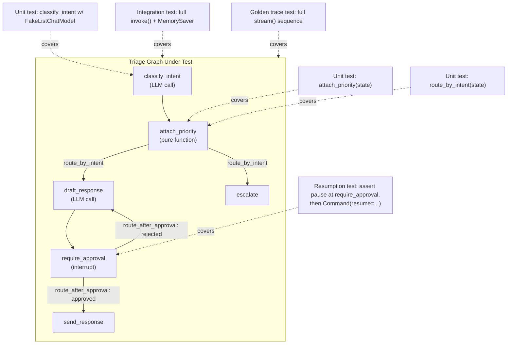
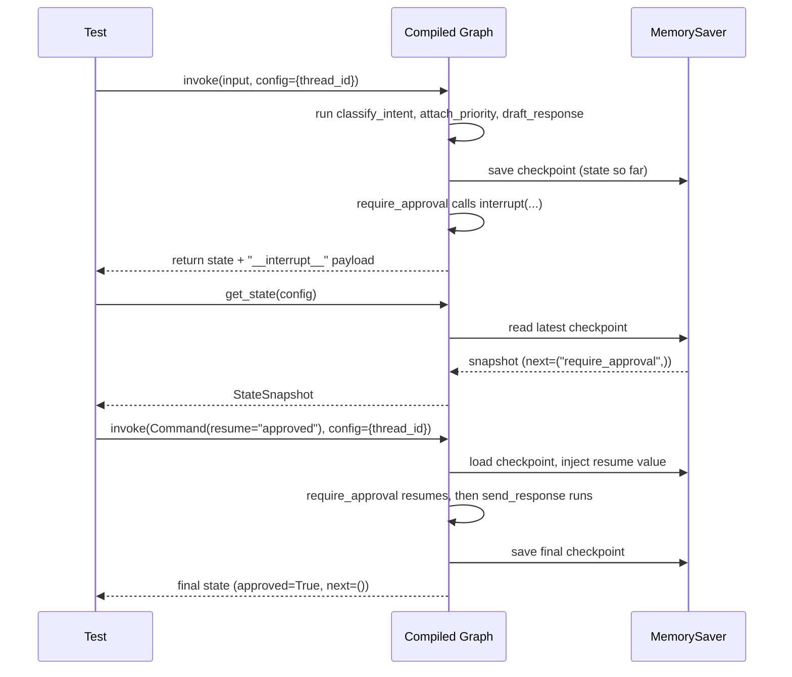

# Chapter 17: Testing LangGraph Applications

> "Testing shows the presence, not the absence, of bugs." — Edsger W. Dijkstra

## Learning Objectives

By the end of this chapter, you will be able to:

- Explain why a LangGraph node's execution contract — `(state) -> partial update` — makes it trivially unit-testable as a pure function, with no graph, no LLM, and no network involved
- Write deterministic tests for LLM-calling nodes using `FakeListChatModel` and `FakeMessagesListChatModel`, eliminating cost, latency, and non-determinism from your test suite
- Compile a real graph with a `MemorySaver` checkpointer and fully mocked dependencies, then assert on final state via `invoke()` and on intermediate state sequences via `stream()`
- Build a snapshot/regression test that captures a graph's full sequence of state transitions and fails loudly the moment behavior drifts from a known-good "golden" trace
- Test checkpointed interrupt-and-resume flows directly: assert a graph actually paused where you expect, then resume it with `Command(resume=...)` and assert the final state
- Unit-test a conditional routing function in complete isolation from the graph that uses it
- Lay out a pytest project structure — fixtures, directories, naming conventions — that scales as a LangGraph application grows from one graph to dozens

## Prerequisites for the Chapter

This chapter assumes you've completed the fundamentals and execution-engine phases of this course, specifically:

- **[Chapter 3: Nodes](./03-nodes.md)** — you know a node is just a callable that receives the current state and returns a partial update; that contract is the entire reason node testing is easy.
- **[Chapter 4: Edges & Routing](./04-edges-and-routing.md)** — conditional edges are backed by a plain function `(state) -> str` (or a list of strings for fan-out); we'll test that function directly.
- **[Chapter 7: Compilation & Execution](./07-compilation-and-execution.md)** — you understand `.compile()`, `.invoke()`, `.stream()`, and the super-step execution loop, since integration tests exercise the compiled graph exactly the way production code does.
- **[Chapter 9: Checkpointing & Durable Execution](./09-checkpointing-and-durable-execution.md)** — you've used `MemorySaver` (and possibly SQLite/Postgres checkpointers) to persist state across steps and resume after a crash. This chapter tests that resumption behavior directly.
- **[Chapter 12: Human-in-the-Loop](./12-human-in-the-loop.md)** — you've called `interrupt()` inside a node to pause a graph for human review and resumed it with `Command(resume=...)`. Section 7 of this chapter is essentially "Chapter 12, but from inside a test."

You should have `pytest` installed (`pip install pytest`) and be comfortable with fixtures, parametrization, and `monkeypatch`. No new LangGraph concepts are introduced here — this chapter is entirely about *how to verify*, with rigor, everything the previous sixteen chapters taught you to *build*.

---

## 1. Why Testing a LangGraph App Is Different From Testing a Chain

If you've tested LCEL chains before, you've probably relied on one of two crutches: hitting a real LLM in CI (slow, expensive, flaky) or mocking at the HTTP layer (brittle, tied to a specific provider's wire format). LangGraph gives you a third, much better option, and it falls directly out of the framework's design.

Recall the node execution contract from Chapter 3:

```
node(state: State) -> dict   # a partial update, merged into state by the reducer
```

A node is not a black box wrapping a chain wrapping an HTTP client. It is **a plain Python function** (or callable) that takes a dictionary-like object in and returns a dictionary-like object out. Nothing about that contract requires a running graph, a compiled `StateGraph`, or a live LLM connection. That single design decision — state in, partial state out, no hidden control flow — is what makes LangGraph applications dramatically easier to test than the equivalent hand-rolled orchestration code, and it's why this chapter can promise "no mocking framework gymnastics" for the majority of your test suite.

The corollary is a decomposition rule you'll return to throughout this chapter:

| Question | Layer to test | What you need |
|---|---|---|
| "Given this state, does this node produce the right update?" | **Node unit test** | The node function + a hand-built dict. Nothing else. |
| "Given this state, does this node produce the right update *when the LLM says X*?" | **Node unit test with a fake LLM** | The node function + `FakeListChatModel`. |
| "Given this state, does routing send execution to the right next node?" | **Routing unit test** | The routing function + a hand-built dict. |
| "Does the whole graph, wired together, produce the right final state for a given input?" | **Integration test** | The compiled graph + `MemorySaver` + fakes for every external dependency. |
| "Does the graph's *sequence* of state transitions stay stable over time?" | **Snapshot/regression test** | The compiled graph + a saved golden trace. |
| "Does the graph actually pause and correctly resume at a human-in-the-loop checkpoint?" | **Resumption test** | The compiled graph + `MemorySaver` + `Command(resume=...)`. |

Nothing in that table requires talking to Anthropic, OpenAI, or any other real provider. That's the point: a well-designed LangGraph test suite runs in milliseconds, entirely offline, and is fully deterministic — a property most agentic systems otherwise struggle badly to achieve.

---

## 2. The LangGraph Testing Pyramid

Classic test pyramids (many fast unit tests, fewer integration tests, a handful of end-to-end tests) apply directly to LangGraph, with one LangGraph-specific layer inserted: **routing tests**, which are cheap and numerous enough to deserve their own tier, and **resumption tests**, which are integration tests but specific enough to call out separately because they exercise the checkpointer's durability guarantees rather than just node logic.

```
                        ▲
                       ╱ ╲
                      ╱ E2E╲          A handful — real LLM, real tools, run manually
                     ╱───────╲        or in a nightly job, never on every commit
                    ╱ Golden  ╲
                   ╱  Traces   ╲      Snapshot/regression tests — one graph, one
                  ╱─────────────╲     known-good trace, catches silent drift
                 ╱  Integration  ╲
                ╱  (fake LLM +    ╲   Full graph + MemorySaver + fakes,
               ╱   MemorySaver)    ╲  asserts final/intermediate state
              ╱───────────────────╲
             ╱   Routing Functions  ╲  Cheap, numerous — pure function tests
            ╱───────────────────────╲
           ╱      Node Functions      ╲ The base of the pyramid — most tests
          ╱───────────────────────────╲ live here, zero graph/LLM involved
```

The overwhelming majority of your tests should sit at the bottom two tiers: node functions and routing functions, tested as plain Python callables. They run in microseconds and pin down business logic precisely. Integration and snapshot tests are fewer in number but essential — they're the only layer that catches wiring mistakes (wrong edge target, missing conditional branch, misconfigured reducer) that unit tests structurally cannot see, since a unit test only ever exercises one function at a time.

---

## 3. Unit Testing Node Functions in Isolation

### 3.1 The baseline case: a node with no LLM or tool call

Consider a small support-ticket triage graph. One of its nodes does pure bookkeeping — no LLM, no I/O:

```python
# app/nodes.py
from typing import TypedDict
from langchain_core.messages import BaseMessage
from typing_extensions import Annotated
from langgraph.graph.message import add_messages


class TriageState(TypedDict):
    messages: Annotated[list[BaseMessage], add_messages]
    ticket_id: str
    intent: str
    priority: str
    draft_response: str
    approved: bool


def attach_priority(state: TriageState) -> dict:
    """Pure bookkeeping node: derive priority from intent, no LLM involved."""
    high_priority_intents = {"outage", "security", "billing_dispute"}
    priority = "high" if state["intent"] in high_priority_intents else "normal"
    return {"priority": priority}
```

Because `attach_priority` is a plain function of `state`, testing it needs nothing but a hand-built dictionary and an assertion — no `StateGraph`, no `.compile()`, no checkpointer:

```python
# tests/unit/test_nodes.py
from app.nodes import attach_priority


def test_attach_priority_flags_billing_dispute_as_high():
    state = {
        "messages": [],
        "ticket_id": "T-100",
        "intent": "billing_dispute",
        "priority": "",
        "draft_response": "",
        "approved": False,
    }

    update = attach_priority(state)

    assert update == {"priority": "high"}


def test_attach_priority_flags_general_question_as_normal():
    state = {
        "messages": [],
        "ticket_id": "T-101",
        "intent": "general_question",
        "priority": "",
        "draft_response": "",
        "approved": False,
    }

    update = attach_priority(state)

    assert update == {"priority": "normal"}
```

Two things are worth calling out because they trip up engineers coming from testing regular request/response services:

1. **You only need the state keys the node actually reads.** `attach_priority` only touches `state["intent"]`; the other keys are present because `TriageState` requires them at the type level, but you could omit them at runtime and the test would still pass (TypedDict is not enforced at runtime — see the Common Mistakes section). Many teams write a small `make_state(**overrides)` helper (Section 9) so tests don't repeat every field.
2. **You assert on the returned partial update, not on some "final" state.** The node returns `{"priority": "high"}` — a *partial* dict — not the whole `TriageState`. The reducer merging that partial into the full state happens inside the compiled graph, which is a separate concern tested in Section 5. Conflating the two is one of the most common node-testing mistakes (see Section 8 below and Common Mistakes).

### 3.2 Nodes with branching logic but still no LLM

Node unit tests are also where you exhaustively cover business-logic edge cases, since they're cheap to write and run instantly:

```python
def test_attach_priority_all_high_priority_intents():
    for intent in ("outage", "security", "billing_dispute"):
        update = attach_priority({"intent": intent, "messages": [],
                                   "ticket_id": "T", "priority": "",
                                   "draft_response": "", "approved": False})
        assert update["priority"] == "high", f"expected high priority for {intent}"
```

This is exactly the kind of exhaustive parametrized coverage that's expensive to get from integration tests (each case would require compiling a graph and driving an LLM through a specific intent) but nearly free at the node level.

---

## 4. Mocking LLM Calls Deterministically

Most interesting nodes call an LLM. The single biggest testing mistake teams make with agentic frameworks is letting test suites hit a real model — it makes tests slow (seconds instead of milliseconds), expensive (API billing on every CI run), and non-deterministic (the same test can pass or fail depending on sampling, provider-side changes, or rate limiting). LangChain Core ships fake chat models specifically to solve this, and they compose cleanly with LangGraph nodes.

### 4.1 Designing nodes so the LLM is injectable

Before you can mock an LLM, the node needs to accept one as a dependency rather than importing a module-level singleton. The idiomatic LangGraph pattern is a **factory function** that closes over the LLM (or any other dependency) and returns the actual node callable:

```python
# app/nodes.py
from langchain_core.language_models.chat_models import BaseChatModel
from langchain_core.messages import HumanMessage, SystemMessage

INTENT_PROMPT = SystemMessage(content=(
    "Classify the customer's message into exactly one of: "
    "billing_dispute, outage, security, general_question. "
    "Respond with only the label."
))


def make_classify_intent_node(llm: BaseChatModel):
    def classify_intent(state: TriageState) -> dict:
        response = llm.invoke([INTENT_PROMPT, *state["messages"]])
        return {"intent": response.content.strip().lower()}

    return classify_intent
```

This is the single most important structural decision in this chapter. If instead you wrote `llm = ChatAnthropic(model="claude-sonnet-4-5")` at module scope inside `app/nodes.py` and referenced it directly in `classify_intent`, every test would need `monkeypatch` or `unittest.mock.patch` to swap it out — workable, but noisier and easier to get wrong (patch the wrong import path, forget to patch one of several call sites). The factory pattern makes the dependency explicit in the function signature, which is both easier to test and easier to read six months later.

### 4.2 `FakeListChatModel`: scripting plain-text responses

`FakeListChatModel` (from `langchain_core.language_models.fake_chat_models`) returns a scripted list of string responses, one per call, in order — exactly what you need for nodes whose node logic only reads `response.content`:

```python
# tests/unit/test_classify_intent.py
from langchain_core.language_models.fake_chat_models import FakeListChatModel
from langchain_core.messages import HumanMessage

from app.nodes import make_classify_intent_node


def test_classify_intent_returns_billing_dispute():
    fake_llm = FakeListChatModel(responses=["billing_dispute"])
    node = make_classify_intent_node(fake_llm)

    state = {
        "messages": [HumanMessage(content="I was charged twice for my subscription!")],
        "ticket_id": "T-200",
        "intent": "",
        "priority": "",
        "draft_response": "",
        "approved": False,
    }

    update = node(state)

    assert update == {"intent": "billing_dispute"}


def test_classify_intent_lowercases_and_strips_whitespace():
    # The fake LLM doesn't need to "know" anything — it just returns
    # whatever string you scripted, letting you test the node's own
    # post-processing logic (strip + lower) in isolation.
    fake_llm = FakeListChatModel(responses=["  OUTAGE \n"])
    node = make_classify_intent_node(fake_llm)

    update = node({"messages": [HumanMessage(content="Everything is down")],
                   "ticket_id": "T-201", "intent": "", "priority": "",
                   "draft_response": "", "approved": False})

    assert update == {"intent": "outage"}
```

`FakeListChatModel` cycles through `responses` in order across successive `.invoke()` calls, and raises once the list is exhausted (unless you construct it with more responses than you need). If a single test drives a node through multiple LLM calls, supply one entry per expected call, in the order you expect them to occur.

### 4.3 `FakeMessagesListChatModel`: scripting tool calls

Plain string responses aren't enough for ReAct-style agent nodes (Chapter 8) that decide to call a tool. For those, script full `AIMessage` objects — including `tool_calls` — with `FakeMessagesListChatModel`:

```python
# tests/unit/test_agent_node.py
from langchain_core.language_models.fake_chat_models import FakeMessagesListChatModel
from langchain_core.messages import AIMessage, HumanMessage, ToolMessage

from app.nodes import make_support_agent_node


def test_agent_node_calls_lookup_order_then_answers():
    fake_llm = FakeMessagesListChatModel(responses=[
        AIMessage(
            content="",
            tool_calls=[{
                "name": "lookup_order",
                "args": {"order_id": "ORD-42"},
                "id": "call_1",
            }],
        ),
        AIMessage(content="Order ORD-42 shipped yesterday and should arrive Friday."),
    ])
    node = make_support_agent_node(fake_llm)

    state = {"messages": [HumanMessage(content="Where's my order ORD-42?")]}

    # First invocation: the fake LLM returns the tool-call message.
    first_update = node(state)
    assert first_update["messages"][-1].tool_calls[0]["name"] == "lookup_order"

    # Simulate ToolNode having appended the tool's result...
    state["messages"] = state["messages"] + first_update["messages"] + [
        ToolMessage(content="shipped yesterday, arriving Friday", tool_call_id="call_1")
    ]

    # Second invocation: the fake LLM returns the final natural-language answer.
    second_update = node(state)
    assert "Friday" in second_update["messages"][-1].content
```

This is the pattern to reach for whenever the node under test is itself the agent's reasoning step in a tool-calling loop — script exactly the sequence of `AIMessage`s the real model would need to produce for the scenario, in order, and drive the node through them one call at a time.

### 4.4 Mocking tools, not just the LLM

Nodes that call tools directly (rather than going through `ToolNode`) need the tool itself faked too. Two options, in order of preference:

- **Dependency injection**, same as the LLM: accept the tool (or a thin service object it wraps) as a parameter, and pass a fake implementation in tests.
- **`monkeypatch`**, when the tool is a third-party integration you don't own the call site for: `monkeypatch.setattr(order_service, "get_status", lambda order_id: "shipped")`.

Prefer injection wherever you control the code — it keeps the fake visible in the test itself instead of hidden behind a patch target that can silently go stale if the import path changes.

---

## 5. Integration Testing Full Graph Invocations

Node and routing unit tests validate logic; they cannot catch a node wired to the wrong edge, a reducer that merges incorrectly, or a conditional edge missing a branch. For that, compile the *real* graph — the same `StateGraph` construction code that runs in production — with every external dependency (LLM, tools) replaced by fakes, and a `MemorySaver` in place of whatever checkpointer production uses.

### 5.1 Building a graph factory for tests

Just as nodes should be built by factories that accept an LLM, the graph itself should be built by a factory that accepts nodes/dependencies, so tests and production share the exact same wiring code:

```python
# app/graph.py
from langgraph.graph import StateGraph, START, END
from langgraph.checkpoint.base import BaseCheckpointSaver

from app.nodes import (
    TriageState,
    make_classify_intent_node,
    attach_priority,
    make_draft_response_node,
    require_approval_node,
    send_response_node,
    escalate_node,
)
from app.routing import route_by_intent, route_after_approval


def build_triage_graph(llm, checkpointer: BaseCheckpointSaver):
    builder = StateGraph(TriageState)

    builder.add_node("classify_intent", make_classify_intent_node(llm))
    builder.add_node("attach_priority", attach_priority)
    builder.add_node("draft_response", make_draft_response_node(llm))
    builder.add_node("require_approval", require_approval_node)
    builder.add_node("send_response", send_response_node)
    builder.add_node("escalate", escalate_node)

    builder.add_edge(START, "classify_intent")
    builder.add_edge("classify_intent", "attach_priority")
    builder.add_conditional_edges(
        "attach_priority",
        route_by_intent,
        {"escalate": "escalate", "draft": "draft_response"},
    )
    builder.add_edge("draft_response", "require_approval")
    builder.add_conditional_edges(
        "require_approval",
        route_after_approval,
        {"approved": "send_response", "rejected": "draft_response"},
    )
    builder.add_edge("send_response", END)
    builder.add_edge("escalate", END)

    return builder.compile(checkpointer=checkpointer)
```

Production code calls `build_triage_graph(real_llm, real_checkpointer)`. Tests call the identical function with fakes. This is the crux of good LangGraph test architecture: **the graph topology under test is never a simplified stand-in — it's the production graph, with only the edges of the system (LLM, tools, persistence backend) swapped out.**

### 5.2 Asserting on final state with `invoke()`

```python
# tests/integration/test_graph_flow.py
from langchain_core.messages import HumanMessage
from langchain_core.language_models.fake_chat_models import FakeListChatModel
from langgraph.checkpoint.memory import MemorySaver
from langgraph.types import Command

from app.graph import build_triage_graph


def test_general_question_flow_reaches_send_response_after_approval():
    fake_llm = FakeListChatModel(responses=[
        "general_question",                     # classify_intent
        "Thanks for reaching out — here's the answer to your question.",  # draft_response
    ])
    checkpointer = MemorySaver()
    graph = build_triage_graph(fake_llm, checkpointer)
    config = {"configurable": {"thread_id": "test-thread-1"}}

    result = graph.invoke(
        {"messages": [HumanMessage(content="How do I reset my password?")],
         "ticket_id": "T-300", "intent": "", "priority": "",
         "draft_response": "", "approved": False},
        config=config,
    )

    # The graph pauses at require_approval — it should NOT have reached send_response yet.
    assert "__interrupt__" in result
    assert result["priority"] == "normal"
    assert "answer to your question" in result["draft_response"]

    # Resume as an approving human reviewer.
    final = graph.invoke(Command(resume="approved"), config=config)

    assert final["approved"] is True
    assert "__interrupt__" not in final
```

### 5.3 Asserting on intermediate states with `stream()`

`invoke()` only shows you the beginning and the end. When the assertion is about *order* — did `attach_priority` really run before `draft_response`? — stream the graph and inspect each super-step:

```python
def test_graph_visits_nodes_in_expected_order_before_interrupt():
    fake_llm = FakeListChatModel(responses=["outage", "We are aware of the outage..."])
    checkpointer = MemorySaver()
    graph = build_triage_graph(fake_llm, checkpointer)
    config = {"configurable": {"thread_id": "test-thread-2"}}

    events = list(graph.stream(
        {"messages": [HumanMessage(content="Nothing works, is this a known outage?")],
         "ticket_id": "T-301", "intent": "", "priority": "",
         "draft_response": "", "approved": False},
        config=config,
        stream_mode="updates",
    ))

    visited_nodes = [list(event.keys())[0] for event in events if "__interrupt__" not in event]

    assert visited_nodes == ["classify_intent", "attach_priority", "draft_response", "require_approval"]
```

`stream_mode="updates"` yields one dict per super-step, keyed by the node(s) that ran — precisely the granularity needed to assert on execution order without caring about the full state payload at each step. (Chapter 11 covers the other `stream_mode` values; `"values"` and `"debug"` are also common choices for integration tests that need the full state snapshot at each step rather than just the delta.)

---

## 6. Snapshot / Regression Testing of State Transitions

Unit and integration tests encode *specific* expectations you thought to write down. But agentic graphs accumulate subtle behavior over dozens of nodes and routing branches, and a change to one prompt, one reducer, or one edge can silently alter behavior somewhere you didn't think to assert on. **Snapshot testing** (borrowed from frontend UI testing, e.g., Jest snapshots) closes that gap: capture the *entire* sequence of state transitions for a fixed input once, save it as a "golden" trace, and fail any future test run where the new trace differs from the saved one — forcing a human to consciously approve the diff.

### 6.1 Capturing a trace

```python
# tests/golden/conftest.py
import json
from pathlib import Path

GOLDEN_DIR = Path(__file__).parent / "snapshots"


def normalize_trace(events: list[dict]) -> list[dict]:
    """Strip volatile fields (ids, timestamps) so traces compare deterministically."""
    normalized = []
    for event in events:
        for node_name, update in event.items():
            clean = {k: v for k, v in update.items() if k not in {"ticket_id"}}
            # Message content is what we care about; message IDs are non-deterministic.
            if "messages" in clean:
                clean["messages"] = [
                    {"type": m.type, "content": m.content} for m in clean["messages"]
                ]
            normalized.append({"node": node_name, "update": clean})
    return normalized
```

### 6.2 Comparing against (or writing) the golden file

```python
# tests/golden/test_regression.py
import json

from langchain_core.language_models.fake_chat_models import FakeListChatModel
from langchain_core.messages import HumanMessage
from langgraph.checkpoint.memory import MemorySaver
from langgraph.types import Command

from app.graph import build_triage_graph
from tests.golden.conftest import GOLDEN_DIR, normalize_trace

GOLDEN_FILE = GOLDEN_DIR / "billing_dispute_flow.json"


def test_billing_dispute_flow_matches_golden_trace(update_golden):
    fake_llm = FakeListChatModel(responses=[
        "billing_dispute",
        "We've reviewed your charge and issued a refund.",
    ])
    checkpointer = MemorySaver()
    graph = build_triage_graph(fake_llm, checkpointer)
    config = {"configurable": {"thread_id": "golden-1"}}

    events = list(graph.stream(
        {"messages": [HumanMessage(content="I was double-charged, please fix it")],
         "ticket_id": "T-999", "intent": "", "priority": "",
         "draft_response": "", "approved": False},
        config=config,
        stream_mode="updates",
    ))
    events += list(graph.stream(Command(resume="approved"), config=config, stream_mode="updates"))

    trace = normalize_trace(events)

    if update_golden:
        GOLDEN_FILE.write_text(json.dumps(trace, indent=2))
        return

    golden = json.loads(GOLDEN_FILE.read_text())
    assert trace == golden, (
        "State transition trace no longer matches the golden snapshot. "
        "If this change is intentional, rerun with --update-golden."
    )
```

The `update_golden` fixture reads a custom `--update-golden` CLI flag (registered in `conftest.py` via `pytest_addoption`), mirroring how snapshot-testing libraries like `syrupy` or Jest support a "write mode." This keeps the mechanism dependency-free — a JSON file and a diff assertion — while giving you the same workflow: **run once to establish the baseline, commit the golden file, and let any future divergence force an explicit, reviewed decision** rather than an unnoticed behavior change reaching production.

Golden-trace tests are deliberately coarse — they will fail on *any* difference, including ones that don't matter (e.g., you added a harmless new state field). That's a feature, not a bug: it puts a human in the loop for every behavioral change to a graph's transition sequence, and the fix each time is either "update the code, this was a real bug" or "the change was intentional, regenerate the golden file."

---

## 7. Testing Checkpointed Resumption (Interrupts and `Command(resume=...)`)

Chapters 9 and 12 built the durability and human-in-the-loop machinery; this section verifies it actually behaves the way production depends on. Two properties matter, and each deserves its own explicit assertion:

1. **The graph stopped exactly where you expect** — not one node early, not one node late.
2. **Resuming with `Command(resume=...)` produces the correct final state** — the interrupted node picks up with the resume value, and execution proceeds correctly from there.

### 7.1 Asserting the pause point

```python
# tests/integration/test_resumption.py
from langchain_core.messages import HumanMessage
from langchain_core.language_models.fake_chat_models import FakeListChatModel
from langgraph.checkpoint.memory import MemorySaver
from langgraph.types import Command

from app.graph import build_triage_graph


def test_graph_pauses_at_require_approval():
    fake_llm = FakeListChatModel(responses=["general_question", "Here's your answer."])
    checkpointer = MemorySaver()
    graph = build_triage_graph(fake_llm, checkpointer)
    config = {"configurable": {"thread_id": "resume-test-1"}}

    result = graph.invoke(
        {"messages": [HumanMessage(content="What's your refund policy?")],
         "ticket_id": "T-400", "intent": "", "priority": "",
         "draft_response": "", "approved": False},
        config=config,
    )

    # 1. The result carries an interrupt payload...
    assert "__interrupt__" in result
    interrupt_payload = result["__interrupt__"][0].value
    assert interrupt_payload["question"] == "Approve this draft response?"

    # 2. ...and the checkpointer's state snapshot confirms *exactly* where
    #    execution is paused, independent of what the return value says.
    snapshot = graph.get_state(config)
    assert snapshot.next == ("require_approval",)
    assert snapshot.values["draft_response"]  # draft was written before pausing
    assert snapshot.values["approved"] is False  # not yet approved
```

Asserting on `graph.get_state(config).next` in addition to the `"__interrupt__"` key in the return value is deliberate redundancy: `next` reports the checkpointer's ground truth about which node(s) are pending, while the interrupt payload is what your application would actually show a human reviewer. A bug that breaks one but not the other (e.g., the interrupt payload is correct but the graph accidentally already advanced past the review node) is exactly the class of bug this test exists to catch.

### 7.2 Asserting correct resumption — both the approve and reject paths

```python
def test_approving_the_draft_completes_the_flow():
    fake_llm = FakeListChatModel(responses=["general_question", "Here's your answer."])
    checkpointer = MemorySaver()
    graph = build_triage_graph(fake_llm, checkpointer)
    config = {"configurable": {"thread_id": "resume-test-2"}}

    graph.invoke(
        {"messages": [HumanMessage(content="What's your refund policy?")],
         "ticket_id": "T-401", "intent": "", "priority": "",
         "draft_response": "", "approved": False},
        config=config,
    )

    final = graph.invoke(Command(resume="approved"), config=config)

    assert final["approved"] is True
    assert graph.get_state(config).next == ()  # fully complete, nothing pending


def test_rejecting_the_draft_routes_back_to_draft_response():
    fake_llm = FakeListChatModel(responses=[
        "general_question",
        "First attempt at an answer.",
        "Revised, better answer.",
    ])
    checkpointer = MemorySaver()
    graph = build_triage_graph(fake_llm, checkpointer)
    config = {"configurable": {"thread_id": "resume-test-3"}}

    graph.invoke(
        {"messages": [HumanMessage(content="What's your refund policy?")],
         "ticket_id": "T-402", "intent": "", "priority": "",
         "draft_response": "", "approved": False},
        config=config,
    )

    # Reviewer rejects -> routing sends us back to draft_response, which
    # calls the LLM again (consuming the *third* scripted response) and
    # pauses at require_approval a second time.
    result = graph.invoke(Command(resume="rejected"), config=config)
    assert "__interrupt__" in result
    assert result["draft_response"] == "Revised, better answer."

    final = graph.invoke(Command(resume="approved"), config=config)
    assert final["approved"] is True
```

Note the second test scripts *three* fake responses, not two — the reject path causes `draft_response` to run a second time, consuming a third LLM call. This is a good illustration of why `FakeListChatModel`'s ordered, consumable responses list is the right tool: it forces you to think through, and explicitly encode, exactly how many times the LLM is expected to be called across a multi-turn interrupt/resume cycle. If your node called the LLM an unexpected extra time (a real, common bug — e.g., accidentally re-running classification on resume), the fake model raises once its scripted responses run out, and the test fails with a clear signal rather than silently calling a real model.

---

## 8. Testing Conditional Routing Logic Separately

Routing functions (Chapter 4) are added via `add_conditional_edges(node, routing_fn, mapping)`. `routing_fn` is `(state) -> str` (or `list[str]` for fan-out) — no different in shape from a node function, and just as testable in isolation:

```python
# app/routing.py
def route_by_intent(state: TriageState) -> str:
    if state["intent"] in {"outage", "security"}:
        return "escalate"
    return "draft"


def route_after_approval(state: TriageState) -> str:
    return "approved" if state["approved"] else "rejected"
```

```python
# tests/unit/test_routing.py
import pytest

from app.routing import route_by_intent, route_after_approval


@pytest.mark.parametrize("intent,expected", [
    ("outage", "escalate"),
    ("security", "escalate"),
    ("billing_dispute", "draft"),
    ("general_question", "draft"),
])
def test_route_by_intent(intent, expected):
    state = {"intent": intent}
    assert route_by_intent(state) == expected


@pytest.mark.parametrize("approved,expected", [(True, "approved"), (False, "rejected")])
def test_route_after_approval(approved, expected):
    assert route_after_approval({"approved": approved}) == expected
```

There is no reason to compile a graph, invoke an LLM, or run a single node to validate this logic. Every branch of a routing function should have a dedicated parametrized case — this is the cheapest, highest-value testing you can do in a LangGraph codebase, and it's exactly the kind of coverage that catches a typo like returning `"escalated"` instead of the `"escalate"` key your conditional-edge mapping actually expects (a mismatch that a unit test catches instantly, but that in an integration test would just look like "the graph silently didn't route where I expected," which is much slower to debug).

---

## 9. Test Organization, Fixtures, and Project Layout

A LangGraph codebase that grows past one graph benefits from a deliberate directory layout and a shared set of fixtures. A structure that scales well:

```
myapp/
├── app/
│   ├── nodes.py
│   ├── routing.py
│   ├── graph.py
│   └── tools.py
└── tests/
    ├── conftest.py              # shared fixtures for the whole suite
    ├── unit/
    │   ├── test_nodes.py
    │   ├── test_routing.py
    │   └── test_agent_node.py
    ├── integration/
    │   ├── test_graph_flow.py
    │   └── test_resumption.py
    └── golden/
        ├── conftest.py          # --update-golden flag, normalize_trace()
        ├── snapshots/
        │   └── billing_dispute_flow.json
        └── test_regression.py
```

A shared `conftest.py` centralizes the fixtures every test tier needs, so individual test modules stay focused on assertions rather than setup boilerplate:

```python
# tests/conftest.py
import uuid

import pytest
from langgraph.checkpoint.memory import MemorySaver

from app.graph import build_triage_graph


@pytest.fixture
def checkpointer():
    """A fresh in-memory checkpointer per test — no shared state leaks across tests."""
    return MemorySaver()


@pytest.fixture
def thread_config():
    """A unique thread_id per test so parallel test runs never collide."""
    return {"configurable": {"thread_id": str(uuid.uuid4())}}


@pytest.fixture
def build_graph(checkpointer):
    """Factory fixture: tests call build_graph(fake_llm) to get a compiled graph
    wired exactly like production, with only the LLM swapped out."""
    def _build(llm):
        return build_triage_graph(llm, checkpointer)
    return _build


def make_state(**overrides) -> dict:
    """Helper for building minimal TriageState dicts in node unit tests,
    filling in sane defaults for keys the test doesn't care about."""
    base = {
        "messages": [],
        "ticket_id": "T-TEST",
        "intent": "",
        "priority": "",
        "draft_response": "",
        "approved": False,
    }
    base.update(overrides)
    return base


def pytest_addoption(parser):
    parser.addoption("--update-golden", action="store_true", default=False,
                      help="Regenerate golden snapshot files instead of comparing against them.")


@pytest.fixture
def update_golden(request):
    return request.config.getoption("--update-golden")
```

With these fixtures in place, an integration test collapses to:

```python
def test_general_question_flow(build_graph, thread_config):
    fake_llm = FakeListChatModel(responses=["general_question", "Here's your answer."])
    graph = build_graph(fake_llm)
    result = graph.invoke({...}, config=thread_config)
    ...
```

A few conventions worth adopting as the suite grows:

- **Mark tiers explicitly** with `pytest.mark.unit`, `pytest.mark.integration`, and `pytest.mark.golden` (registered in `pytest.ini` or `pyproject.toml`), so CI can run `pytest -m "unit or integration"` on every commit and reserve golden/E2E tiers (or a real-LLM smoke suite) for a nightly job.
- **One fixture per fake, not one fixture per test.** A `fake_billing_llm` fixture reused across five tests is easier to reason about than five inline `FakeListChatModel` constructions with subtly different response lists.
- **Never share a `MemorySaver` instance across tests.** It accumulates checkpoints for every thread_id it's ever seen; a fresh instance per test (as in the fixture above) keeps tests hermetic.
- **If your nodes are `async def`**, install `pytest-asyncio` and mark async tests with `@pytest.mark.asyncio` (or set `asyncio_mode = "auto"` in configuration) — the fake chat models support `.ainvoke()` identically to `.invoke()`.

---

## Examples

The sections above build up one running example — a support-ticket triage graph — piece by piece. Here is the same example assembled end-to-end, showing how the layers compose into one coherent test module for a single feature (the billing-dispute path, including its human-approval gate):

```python
# tests/integration/test_billing_dispute_end_to_end.py
import pytest
from langchain_core.messages import HumanMessage
from langchain_core.language_models.fake_chat_models import FakeListChatModel
from langgraph.types import Command

from app.routing import route_by_intent, route_after_approval


# --- Layer 1: routing, tested with zero graph/LLM involvement ---
def test_billing_dispute_routes_to_draft():
    assert route_by_intent({"intent": "billing_dispute"}) == "draft"


def test_approved_routes_to_send():
    assert route_after_approval({"approved": True}) == "approved"


# --- Layer 2: the full graph, fake LLM, real checkpointer, real wiring ---
def test_billing_dispute_end_to_end_with_approval(build_graph, thread_config):
    fake_llm = FakeListChatModel(responses=[
        "billing_dispute",
        "We've reviewed your account and refunded the duplicate charge.",
    ])
    graph = build_graph(fake_llm)

    paused = graph.invoke(
        {"messages": [HumanMessage(content="I was charged twice this month")],
         "ticket_id": "T-500", "intent": "", "priority": "",
         "draft_response": "", "approved": False},
        config=thread_config,
    )

    assert paused["priority"] == "high"                 # billing_dispute -> high priority
    assert "__interrupt__" in paused                     # paused for human review
    assert "refunded" in paused["draft_response"]

    final = graph.invoke(Command(resume="approved"), config=thread_config)

    assert final["approved"] is True
    assert graph.get_state(thread_config).next == ()
```

This single file demonstrates the whole point of the chapter: routing logic, node logic, full-graph wiring, checkpointed pausing, and resumption are each verified at the cheapest layer capable of catching a regression in that specific concern, and only the last test pays the (still-milliseconds-fast, still fully offline) cost of compiling and driving the real graph.

---

## Diagrams

The test tiers from Section 2, mapped onto the actual graph they exercise, make clear which layer catches which class of bug:



And the resumption flow specifically (Section 7), as a sequence of calls between the test, the compiled graph, and the checkpointer:



---

## Real-World Scenarios

**Scenario: a routing regression reaches production because the test suite hit a real model.**

A team building a multi-agent customer-support platform (Chapter 14) wrote integration tests that called their real Anthropic account with a cheap model, reasoning that "testing against the real thing is more realistic." The suite worked for months. Then a prompt template change — adding one clarifying sentence to the intent-classification system prompt — subtly shifted the model's output format: it started returning `"Billing Dispute"` (capitalized, with a space) instead of the previously reliable lowercase `"billing_dispute"`. The routing function did an exact string match against `"billing_dispute"` and silently fell through to the default `"draft"` branch instead of the `"escalate"` branch reserved for high-priority intents.

The tests still passed. Why? Because the real model, on the specific test inputs the team had written, happened to still produce a response containing the substring `"billing"`, and a loosely written assertion (`assert "billing" in result["intent"]`) didn't check the exact routing outcome — it checked that the LLM's *response* was topically plausible. The routing regression itself went completely uncovered, because no test asserted on `route_by_intent`'s output as a unit, and the integration test's assertions were written around the non-deterministic real model's likely phrasing rather than a fixed, known state.

Three weeks later, several billing-dispute tickets that should have been escalated for priority handling were instead routed through the standard, slower response path, and a customer escalation to the CEO surfaced the bug.

**What would have caught this immediately:**

- A **routing unit test** (Section 8) asserting `route_by_intent({"intent": "billing_dispute"}) == "escalate"` fails the instant the classify_intent node starts producing anything other than the exact literal string `"billing_dispute"` — regardless of whether that node is tested with a real or fake LLM.
- A **node unit test with `FakeListChatModel`** (Section 4) pins down exactly what string `classify_intent` extracts from a scripted LLM response, and would have been the first thing to break if the node's own parsing/normalization logic (e.g., forgetting to `.lower()` the response) regressed.
- A **golden-trace test** (Section 6) covering the billing-dispute flow would have shown a diff the moment the trace stopped visiting the `escalate` node for that scenario, forcing a human to notice and approve (or reject) the change before it merged.

**The fix the team implemented:** they kept exactly one small suite of "smoke tests" against a real (cheap) model, run nightly rather than on every commit, purely to catch actual API/provider drift — and moved every other test (the overwhelming majority) onto `FakeListChatModel`/`FakeMessagesListChatModel` with exact-match assertions on routing and node output. CI runtime for the full suite dropped from four minutes to under three seconds, and the exact class of bug described above became untestable-to-miss, because routing correctness was now asserted directly rather than inferred from a real model's incidental phrasing.

---

## Best Practices

- **Test the lowest tier that can catch the bug.** A routing mistake belongs in a routing unit test, not discovered incidentally by an integration test's broader assertions — the lower tier is faster, more precise, and pinpoints the failure immediately.
- **Inject LLMs and tools through factory functions or parameters, never module-level singletons.** This is what makes `FakeListChatModel`/`FakeMessagesListChatModel` substitution trivial instead of requiring `monkeypatch` on import paths.
- **Assert on exact literal values coming out of LLM-calling nodes, not "does it look plausible."** With a fake LLM, there is no excuse for a loose `in` check — you scripted the exact response, so assert the exact parsed result.
- **Give every conditional-edge branch its own parametrized routing test.** They're the cheapest tests in the suite and the ones most likely to catch a typo in a string literal that a conditional-edge mapping depends on.
- **Use a fresh `MemorySaver` (and a fresh `thread_id`) per test.** Shared checkpointer state across tests is a classic source of flaky, order-dependent test failures.
- **Reserve real-LLM tests for a small, separately scheduled smoke suite**, run nightly or pre-release rather than on every commit — never let CI-blocking tests depend on network access or provider uptime.
- **Treat golden-trace files as reviewed artifacts, not generated noise.** A PR that regenerates a golden trace should show the diff in review, exactly like a database migration — someone needs to consciously approve that the new behavior is intentional.
- **Normalize non-deterministic fields (UUIDs, timestamps, message IDs) before snapshot comparison**, or every run will "fail" on irrelevant noise and the technique becomes worthless.

---

## Common Mistakes

- **Testing nodes only through the compiled graph.** This makes every test slow (compile + invoke + reducer merge) and makes failures hard to localize — a failure could be the node's logic, the edge wiring, or the reducer. Test the node function directly first; reserve graph compilation for integration tests that specifically need it.
- **Asserting on the full merged state instead of the node's return value.** A node's contract is its partial update; asserting `update == {"priority": "high"}` is precise, while asserting on some manually-reconstructed "merged state" duplicates the reducer's own logic in your test and is liable to drift out of sync with it.
- **Letting the test suite depend on a real LLM's exact phrasing.** Wording, punctuation, and even capitalization from a real model can and will drift between provider versions and prompt tweaks; only `FakeListChatModel`/`FakeMessagesListChatModel` responses are exact and controlled by you.
- **Forgetting how many times the fake LLM will be called.** A `FakeListChatModel` raises once its scripted responses are exhausted; a node that calls the LLM more times than expected (e.g., an unexpected retry, or a reject-and-redraft loop as in Section 7.2) needs that many entries in the `responses` list, in the correct order.
- **Sharing one checkpointer or one `thread_id` across multiple tests.** Checkpoints accumulate; a later test can inherit state left behind by an earlier one, producing hard-to-reproduce, order-dependent failures. Always use a fresh `MemorySaver` and a unique `thread_id` per test.
- **Treating routing functions as "too simple to test."** They are simple — which is exactly why they're cheap to cover exhaustively, and exactly why an uncovered typo in a returned string (mismatched against the conditional-edge mapping's keys) is embarrassingly easy to ship unnoticed.
- **Writing golden-trace assertions without normalizing volatile fields.** Comparing raw traces that embed message UUIDs or wall-clock timestamps will fail on every single run, training the team to treat golden-trace failures as noise to ignore — which defeats the entire purpose of the technique.
- **Not distinguishing `"__interrupt__"` in the return value from `graph.get_state(config).next`.** Relying on only one of these to confirm a pause point misses the specific class of bug where they disagree (see Section 7.1).

---

## Summary

- A LangGraph **node is a pure function** — `(state) -> partial update` — which makes it directly unit-testable with a hand-built state dict, no graph or LLM required, for nodes with no external dependency.
- **`FakeListChatModel`** (scripted string responses) and **`FakeMessagesListChatModel`** (scripted full messages, including `tool_calls`) let you test LLM-calling and tool-calling nodes deterministically, without cost, latency, or non-determinism.
- **Integration tests** compile the real graph with a **`MemorySaver`** checkpointer and fakes for every external dependency, then assert on final state (`invoke()`) or the exact sequence of intermediate states (`stream()` with `stream_mode="updates"`).
- **Snapshot/regression tests** capture a graph's full state-transition trace for a fixed input and compare it against a saved golden file, catching silent behavioral drift that ad-hoc assertions would miss — at the cost of requiring deliberate, reviewed updates whenever behavior legitimately changes.
- **Resumption tests** directly verify the durability guarantees from Chapters 9 and 12: assert the graph paused exactly where expected (via both the `"__interrupt__"` payload and `graph.get_state(config).next`), then resume with `Command(resume=...)` and assert the final state, including reject-and-retry loops.
- **Routing functions** (`(state) -> str`) are tested exactly like nodes — in complete isolation, with exhaustive parametrized coverage of every possible branch, entirely independent of the graph that wires them in.
- A scalable pytest layout separates **unit**, **integration**, and **golden** test tiers, with shared fixtures (`checkpointer`, `thread_config`, a graph-building factory, and fake LLM builders) centralized in `conftest.py` so every test tier reuses the same setup.

---

## Knowledge Check

1. A node function calls an LLM and returns `{"intent": response.content.strip().lower()}`. Explain, concretely, how you would restructure this node (if at all) to make it testable with `FakeListChatModel`, and why the restructuring (or lack thereof) matters.
2. What is the difference between asserting on a node's *return value* versus asserting on the *graph's merged state* after that node runs? Which one should a node unit test check, and why?
3. You need to test that a graph pauses for human review at exactly the right node. Name two independent signals you can check in a test to confirm this, and explain why checking only one of them could miss a real bug.
4. Why does `FakeListChatModel` raise an error once its scripted `responses` list is exhausted, and how can that behavior itself be turned into a useful test assertion?
5. Describe, in your own words, what a "golden trace" regression test catches that neither a node unit test nor a single integration test's targeted assertions would catch — and what the cost/trade-off of that extra coverage is.
6. A teammate proposes testing a conditional routing function only indirectly, by asserting on the final state of a full graph invocation. What specific class of bug becomes harder to localize with that approach compared to testing the routing function directly?

---

## Hands-on Exercises

1. **Node and routing unit tests from scratch.** Take the `attach_priority` node and `route_by_intent` function from this chapter (or equivalent ones from your own graph) and write a full parametrized test suite covering every intent value your routing mapping supports, plus at least one "unknown intent" case that should fall through to a sensible default. Confirm each test runs in well under a millisecond and requires no LangGraph imports beyond the functions under test.

2. **Build a fake-LLM integration test for an interrupt/resume cycle.** Using `FakeListChatModel`, `MemorySaver`, and `Command(resume=...)`, write an integration test for a two-step approval flow of your own design (it can be a simplified version of the triage graph in this chapter, or a graph from your own project). Assert on both `"__interrupt__"` in the invoke result and `graph.get_state(config).next` to confirm the pause point, then assert the final state after resuming with an approval and, separately, after resuming with a rejection that loops back for a redraft.

3. **Golden-trace regression test with a deliberately introduced bug.** Write a golden-trace test (Section 6) for a small graph of your choosing, generate and commit the baseline JSON file, and confirm the test passes. Then deliberately introduce a small, realistic bug — swap two edge targets, change a prompt string that shifts a fake LLM's scripted response category, or flip a routing condition — and re-run the test without regenerating the golden file. Confirm the test fails with a clear diff, then practice the two legitimate resolution paths: reverting the bug (test passes again) versus regenerating the golden file with `--update-golden` (simulating a deliberate, reviewed behavior change).

---

## Further Reading

- [LangGraph Documentation — Testing and Debugging](https://docs.langchain.com/oss/python/langgraph/overview) — official framework documentation, application structure, and execution model referenced throughout this chapter
- [LangGraph Application Structure Guide](https://docs.langchain.com/oss/python/langgraph/application-structure) — recommended project layouts that pair well with the pytest structure in Section 9
- `langchain_core.language_models.fake_chat_models` source (in the `langchain-core` package) — the definitive reference for `FakeListChatModel`, `FakeMessagesListChatModel`, and `GenericFakeChatModel` constructor options and streaming behavior
- [pytest Documentation — Fixtures](https://docs.pytest.org/en/stable/how-to/fixtures.html) — fixture scoping, factory-as-fixture patterns, and `conftest.py` mechanics used throughout this chapter
- [pytest Documentation — Parametrizing Tests](https://docs.pytest.org/en/stable/how-to/parametrize.html) — the `@pytest.mark.parametrize` pattern used for exhaustive routing-function coverage in Section 8
- [Python `unittest.mock` Documentation](https://docs.python.org/3/library/unittest.mock.html) — `monkeypatch`/`patch` mechanics for the cases in Section 4.4 where dependency injection isn't available
- **[Chapter 9: Checkpointing & Durable Execution](./09-checkpointing-and-durable-execution.md)** and **[Chapter 12: Human-in-the-Loop](./12-human-in-the-loop.md)** — the mechanisms this chapter's resumption tests (Section 7) directly verify
- **[Chapter 20: Observability & Monitoring](./20-observability-and-monitoring.md)** — LangSmith tracing and evaluation datasets extend the ideas in this chapter to production monitoring, closing the loop between pre-deployment tests and live-traffic regression detection

---

<div style="display:flex;justify-content:space-between;align-items:center;">
  <a href="./16-advanced-routing-patterns.md">← Previous: Advanced Routing Patterns</a>
  <a href="./00-index.md">🏠 Index</a>
  <a href="./18-error-handling-and-resilience.md">Next: Error Handling & Resilience →</a>
</div>
