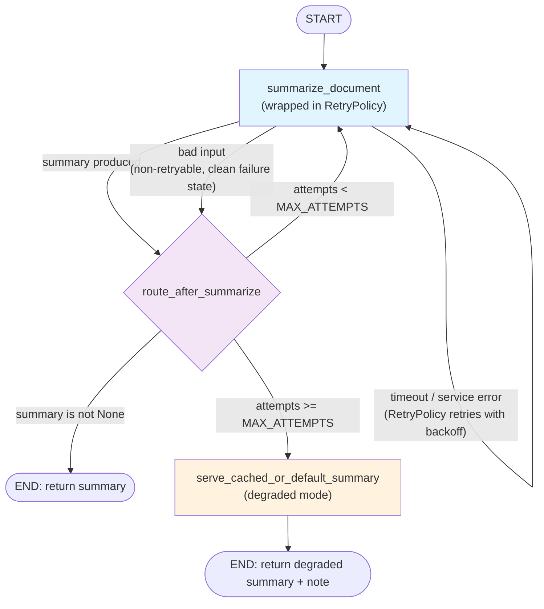
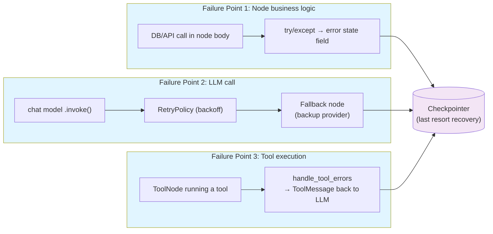

# Chapter 18: Error Handling & Resilience

> "A graph that only works when nothing goes wrong isn't a production system — it's a demo." — the central premise of this chapter.

## Learning Objectives

By the end of this chapter, you will be able to:

- Classify where an error in a LangGraph application actually originates — inside a node's business logic, during an LLM call, or during tool execution via `ToolNode` — and explain why each failure point demands a different handling strategy
- Write node functions that catch expected exceptions and return a **state update representing the failure** instead of letting the exception propagate and crash the run
- Configure `RetryPolicy` on `add_node()` to declaratively retry transient failures with exponential backoff, while explicitly excluding exceptions that should never be retried
- Handle exceptions raised during tool execution using `ToolNode`'s built-in error handling, and choose when to let a tool error surface to the LLM versus hard-fail the graph
- Design fallback/degraded-mode routing so a graph can switch to a backup provider or cached response after a primary path fails repeatedly, instead of failing outright
- Implement timeouts around slow external calls inside a node, and reason correctly about what LangGraph does — and does not — do to your state when a timeout fires
- Apply graceful degradation so a non-critical node's failure produces a partial, best-effort result instead of an all-or-nothing failure
- Use checkpointing (Chapter 9) as your last line of defense: recover a crashed run from its last good state rather than starting over from scratch
- Build a complete "Reliable Production Workflow" that combines retries, timeouts, structured error state, and fallback into one coherent, production-grade node

---

## Prerequisites for the Chapter

This chapter assumes you're comfortable with everything built up through Phase 3 of this course, and leans especially hard on three prior chapters:

- **Chapter 3 (Nodes)**: you know that a node is a function `(state) -> partial_state_update`, and that LangGraph merges whatever a node returns back into the shared State. Everything in this chapter is really just "what should that return value look like when the node's work didn't succeed?"
- **Chapter 4 (Edges & Routing)** and **Chapter 5 (Commands & Dynamic Control)**: fallback routing in this chapter is ordinary conditional-edge logic (or a `Command`) that happens to be triggered by an error flag in state rather than a business decision. If conditional edges are shaky, that will bite you here.
- **Chapter 8 (Tool Calling Patterns)**: you should already know what `ToolNode` is and how it turns an LLM's tool calls into executed tool results appended as `ToolMessage`s. This chapter covers what `ToolNode` does when a tool *raises*, which assumes you know what it does when a tool *succeeds*.
- **Chapter 9 (Checkpointing & Durable Execution)**: this chapter's final safety net — recovering from a hard crash — is not a new mechanism. It's the direct payoff of the checkpointer you configured in Chapter 9. If you skipped it, the "Recovering From Checkpoint" section below will feel like magic instead of an obvious consequence of durable state.
- **Python**: solid command of `try`/`except`/`finally`, custom exception hierarchies, `asyncio.wait_for` and task cancellation, and the standard `logging` module. Nothing here is exotic Python, but it assumes you're fluent, not just familiar.

No new packages beyond `langgraph` itself are required. The worked example uses only the standard library (`asyncio`, `logging`, `time`) plus LangGraph's own `RetryPolicy`, `ToolNode`, and `Command` primitives.

---

## 1. Where Errors Actually Happen in a LangGraph App

Before reaching for any resilience pattern, you need a precise map of *where* things break, because "add a try/except" is not one strategy — it's three different strategies wearing the same name depending on which of these three failure points you're standing at.

### 1.1 Failure point 1: inside a node function's own business logic

This is the most familiar category to you already, because it's identical to any bug in any Python service: a node function calls your database and the connection pool is exhausted, calls an internal microservice and gets a 500, deliberately raises a `ValueError` because an invariant was violated, or divides by zero because someone forgot to guard an edge case. Nothing here is LangGraph-specific — it's the same class of exception you've always handled in a FastAPI route handler or a Celery task. What *is* LangGraph-specific is the consequence of not handling it: an uncaught exception inside a node doesn't just fail one request, it aborts the **entire graph run**, discarding any in-flight work in that super-step.

### 1.2 Failure point 2: during an LLM call

A node that calls a chat model (directly, or via `.bind_tools()`) can fail in ways that have nothing to do with your code:

- **Rate limits** (HTTP 429) — you've exceeded requests-per-minute or tokens-per-minute for your account tier.
- **Timeouts** — the provider's API is slow or hanging, and your client library raises after its configured timeout.
- **Transient 5xx errors** — the provider's infrastructure had a blip.
- **Malformed tool-call JSON** — the model produced a tool call whose arguments don't parse as valid JSON, or don't match the tool's schema (more common with smaller/local models, but it happens even with frontier models under adversarial prompts).
- **Context length exceeded** — the accumulated message history in state grew past the model's context window, which raises a hard error rather than silently truncating.

These are qualitatively different from failure point 1: they're **usually transient** (rate limits and timeouts often succeed on retry a few seconds later) and they're **provider-shaped**, meaning the right response often involves a backoff-and-retry policy, or — if the provider is down, not just slow — a fallback to a different model or provider entirely.

### 1.3 Failure point 3: during tool execution (`ToolNode`)

When a node's job is specifically to execute the tool calls an LLM requested, the failure surface is different again:

- The **tool function itself raises** — a search API times out, a code-execution tool hits a syntax error in generated code, a database-write tool violates a constraint.
- The **arguments are semantically wrong even though they parsed correctly** — the model asked to divide by zero, or passed a file path that doesn't exist.
- The **tool doesn't exist** — the model hallucinated a tool name that isn't in the bound tool list (rarer with modern models, but not impossible).

The key architectural fact here: `ToolNode` sits *between* the LLM and the rest of your graph in the classic ReAct loop, and its output typically gets fed **back to the LLM** as a `ToolMessage` so the model can see what happened and decide what to do next. That changes the calculus completely from failure points 1 and 2: often the *right* response to a tool error isn't to retry or halt — it's to hand the error back to the model as an observation and let it self-correct (try different arguments, pick a different tool, or apologize to the user), exactly the way a human would notice a command failed and try something else.

### 1.4 Why this taxonomy matters

| Failure point | Typical cause | Typical fix |
|---|---|---|
| Node business logic | Bug, DB/API exception, bad invariant | `try/except` returning an error state field; alert/log |
| LLM call | Rate limit, timeout, malformed tool-call JSON, context overflow | `RetryPolicy` with backoff; fallback to backup provider |
| Tool execution (`ToolNode`) | Tool raises, bad arguments, hallucinated tool | `ToolNode`'s error-to-`ToolMessage` handling; let the LLM retry |

Get this classification wrong and you apply the wrong medicine: retrying a `ValueError` caused by a genuine bug in your code three times with exponential backoff just delays the inevitable failure by several seconds while burning API quota on an unrelated retry attempt. Conversely, letting a transient `RateLimitError` propagate and kill the whole graph run — when a five-second backoff would have succeeded — is needless fragility. The rest of this chapter is organized around matching the right mechanism to the right failure point.

---

## 2. try/except Inside Node Functions: Fail Soft, Not Hard

### 2.1 The core principle

The single most important habit this chapter teaches: **a node function should almost never let an exception escape unhandled.** Instead of this —

```python
def fetch_customer_record(state: OrderState) -> dict:
    record = crm_client.get_customer(state["customer_id"])  # can raise
    return {"customer": record}
```

— where a `ConnectionError` from `crm_client` propagates straight out of the node and aborts the entire graph run, write this:

```python
def fetch_customer_record(state: OrderState) -> dict:
    try:
        record = crm_client.get_customer(state["customer_id"])
        return {"customer": record, "error": None}
    except CRMConnectionError as exc:
        logger.warning("CRM lookup failed for customer_id=%s: %s",
                       state["customer_id"], exc)
        return {
            "customer": None,
            "error": {
                "node": "fetch_customer_record",
                "type": type(exc).__name__,
                "message": str(exc),
            },
        }
```

The failure is now **data**, not a control-flow event. It lives in the State object exactly like every other field, which means every mechanism you already have for reasoning about state — reducers, conditional edges, checkpointing, streaming — automatically works for errors too, with zero special-casing.

### 2.2 Pattern: an `error` field in State

Add an explicit, typed slot for failure information to your state schema, right alongside your business fields:

```python
from typing import Optional, TypedDict
from typing_extensions import NotRequired

class ErrorInfo(TypedDict):
    node: str
    type: str
    message: str

class OrderState(TypedDict):
    customer_id: str
    customer: Optional[dict]
    order_total: Optional[float]
    error: NotRequired[Optional[ErrorInfo]]
```

Downstream, a conditional edge inspects `state["error"]` the same way it would inspect any other field:

```python
def route_after_fetch(state: OrderState) -> str:
    if state.get("error") is not None:
        return "handle_failure"
    return "compute_order_total"

graph.add_conditional_edges("fetch_customer_record", route_after_fetch)
```

This is nothing more than the routing you already know from Chapter 4 — the only new idea is that "did the previous node fail?" is just another routing question, answered by reading state, not by catching an exception at the graph level (which LangGraph does not offer, by design — see Section 2.4).

### 2.3 Pattern: an error `ToolMessage`

When the node in question is part of a message-based agent loop (the far more common shape for LLM-facing nodes), the idiomatic failure representation isn't a custom `error` field — it's a `ToolMessage` that reports the failure back into the conversation, so the model itself can see what went wrong and adapt:

```python
from langchain_core.messages import ToolMessage

def call_pricing_api(state: AgentState) -> dict:
    tool_call = state["messages"][-1].tool_calls[0]
    try:
        price = pricing_client.get_price(tool_call["args"]["sku"])
        result = ToolMessage(
            content=f"Price for {tool_call['args']['sku']}: ${price:.2f}",
            tool_call_id=tool_call["id"],
        )
    except SKUNotFoundError as exc:
        result = ToolMessage(
            content=f"Error: {exc}. Ask the user to confirm the SKU and retry.",
            tool_call_id=tool_call["id"],
            status="error",
        )
    return {"messages": [result]}
```

This is precisely the mechanism `ToolNode` uses internally (Section 4), spelled out by hand so you can see what's happening underneath. The `messages` reducer (typically `add_messages`, Chapter 6) appends this `ToolMessage` to history whether it represents success or failure — from the reducer's point of view there is no difference, which is exactly the point: **failure is just another message the model gets to read and reason about**, not a special exit path.

### 2.4 What happens if you don't catch it

It's worth being explicit about the alternative, because the temptation to skip this is real ("it's just a demo," "the happy path is what matters right now"): LangGraph does not have a global "catch any node exception and continue" switch. An uncaught exception inside a node function propagates up through the Pregel execution loop and raises out of `.invoke()`/`.stream()`, ending the run. Whatever partial state existed *before* that super-step is safely preserved in the checkpointer (Section 8) if you've configured one — but the run itself is over, the caller gets an exception, and any node scheduled to run after the failed one simply never executes. For a batch job you re-run overnight, that might be acceptable. For a user-facing chat endpoint sitting behind FastAPI, an uncaught node exception is a 500 the user sees mid-conversation — precisely the outcome every pattern in this chapter exists to avoid.

---

## 3. RetryPolicy: Declarative Retries at Node Registration

Catching an exception and returning an error state update is the right move for failures you've decided are **terminal for this attempt** — the exception is informative, but retrying immediately won't help. Many failures are the opposite: they're **transient**, and simply trying again after a short pause resolves them without any special-case code. That's what `RetryPolicy` is for.

### 3.1 Anatomy of `RetryPolicy`

```python
from langgraph.types import RetryPolicy

graph.add_node(
    "call_llm",
    call_llm_node,
    retry=RetryPolicy(
        max_attempts=4,
        initial_interval=0.5,
        backoff_factor=2.0,
        max_interval=30.0,
        jitter=True,
        retry_on=(RateLimitError, APITimeoutError, ConnectionError),
    ),
)
```

Field by field:

- **`max_attempts`** — the total number of times the node will be invoked for a single super-step before the exception is finally allowed to propagate (i.e., `max_attempts=4` means 1 original attempt + up to 3 retries).
- **`initial_interval`** — how long to wait, in seconds, before the *first* retry.
- **`backoff_factor`** — the multiplier applied to the wait interval after each subsequent failed attempt (2.0 means the wait doubles every time: 0.5s → 1s → 2s → ...).
- **`max_interval`** — a ceiling on the backoff, so a long-running retry sequence doesn't eventually wait minutes between attempts.
- **`jitter`** — when `True`, adds a small random offset to each computed interval, which matters at scale: without jitter, many concurrent graph runs that all started failing at the same instant (e.g., because a provider had a blip) will all retry in perfect lockstep, hammering the recovering service with synchronized spikes instead of a smooth trickle.
- **`retry_on`** — a tuple of exception types (or a predicate function taking the exception and returning `bool`) that determines which exceptions actually trigger a retry. **Any exception not matched here is raised immediately on the first attempt** — `RetryPolicy` does not mean "retry everything."

### 3.2 The most important field: `retry_on`

This is where the failure-point taxonomy from Section 1 pays off directly. You want to retry exceptions that represent **transient, environmental** failures — a dropped connection, a rate limit, a timeout — and you specifically do **not** want to retry exceptions that represent **deterministic bugs or invalid input**, because retrying those wastes time and API budget reproducing the exact same failure three more times before giving up anyway:

```python
retry=RetryPolicy(
    max_attempts=3,
    retry_on=(ConnectionError, TimeoutError, RateLimitError),
    # Deliberately NOT retried: ValueError (bad input), KeyError (bug),
    # AuthenticationError (retrying with the same bad credentials is pointless)
)
```

If you omit `retry_on` entirely, LangGraph applies a sensible default that retries common transient network/connection errors while excluding exception types that almost always indicate a programming error (`ValueError`, `TypeError`, `KeyError`, and similar). Relying on the default is fine for a first pass, but for anything provider-specific (an SDK's own `RateLimitError` or `APIConnectionError` class), be explicit — the default can't know about exception types it's never heard of.

### 3.3 RetryPolicy vs. try/except: use both, for different jobs

These two tools are not competitors — they operate at different layers and compose naturally:

- **`RetryPolicy`** handles the "try the exact same thing again after a pause" case, entirely outside your node's code. It's declarative, so it's visible at a glance on the graph definition, and it doesn't clutter the node function with retry loops.
- **`try/except` inside the node** handles the "this specific exception means we should stop retrying and instead produce a graceful, informative failure state" case — including the case where `RetryPolicy` has exhausted `max_attempts` and the exception has finally propagated out of the node's internal call, and you want to catch it *inside* the node one layer up to convert it into a state update rather than letting it kill the run entirely.

Putting them together, a robust node typically looks like this: `RetryPolicy` retries the transient sub-cases automatically at the LangGraph layer, while a `try/except` inside the function's own body catches the case where retries were exhausted (or the exception wasn't retryable to begin with) and turns it into an `error` field or fallback routing signal instead of an unhandled crash. Section 9's full worked example shows exactly this combination.

---

## 4. Handling Errors in `ToolNode`

### 4.1 `handle_tool_errors`

`ToolNode` (from `langgraph.prebuilt`) has built-in exception handling specifically because tool execution failures are so common and so often *recoverable by the model itself* — a wrong SQL query, an invalid file path, a search query that returns zero results are all things a competent LLM can often correct on the next turn if you just tell it what happened.

```python
from langgraph.prebuilt import ToolNode

tool_node = ToolNode(
    tools=[search_web, run_sql_query, send_email],
    handle_tool_errors=True,  # the default
)
```

With `handle_tool_errors=True` (the default), any exception raised inside a tool function is caught by `ToolNode` itself, and instead of propagating and killing the graph, it's converted into a `ToolMessage` carrying the error text back into the conversation, tagged so the model can distinguish it from a successful result. Functionally, this is exactly the hand-rolled pattern shown in Section 2.3 — `ToolNode` is just doing it for you, uniformly, across every tool you register, so you don't have to wrap each individual tool function in its own `try/except`.

### 4.2 Tuning what gets caught, and how it's phrased

`handle_tool_errors` accepts more than a bare boolean:

- **`False`** — disable the built-in handling entirely; any tool exception propagates and kills the graph run unless you've wrapped the tool function yourself. Choose this when a tool failure genuinely should be a hard stop (e.g., a payment-processing tool where "silently tell the model it failed and let it decide what to do" is the wrong instinct for an operation with real-world side effects).
- **A tuple of exception types** — catch only those specific exceptions and let everything else propagate, mirroring `retry_on`'s philosophy: catch what's recoverable-by-conversation, let genuine bugs surface loudly.
- **A custom message / callable** — override the default error text with something more actionable for the model, e.g., `handle_tool_errors="Tool call failed — check that all required arguments were provided and retry with corrected arguments."` A callable receives the exception and can produce a fully dynamic message (including, say, a suggestion pulled from the exception's own attributes).

### 4.3 Combining `ToolNode`'s handling with `RetryPolicy`

These operate at different levels and are not redundant: `handle_tool_errors` decides what happens *within a single tool execution attempt* (catch and report back to the model, versus propagate), while a `RetryPolicy` on the node that wraps your tool-calling step (or on a lower-level node that does the actual outbound HTTP call before `ToolNode` even sees it) decides whether to *attempt the underlying operation again* before giving up. A common production shape: put `RetryPolicy` on a node performing a flaky outbound call so transient network blips get silently retried, and rely on `ToolNode`'s `handle_tool_errors` for the *remaining* class of errors — genuinely bad arguments, missing resources — that no amount of retrying will fix and that the model itself is best positioned to correct on its next turn.

---

## 5. Fallback Nodes and Degraded-Mode Routing

Retries handle "try the same thing again, it'll probably work this time." Fallbacks handle the case where it *won't* — the primary path is down, not just slow, and the only sane move is to switch to something else: a backup LLM provider, a cached result, a simpler non-LLM heuristic, or an apologetic message to the user. This is ordinary conditional routing (Chapter 4), triggered by a failure signal instead of a business rule.

### 5.1 Tracking failure state

Add a small amount of bookkeeping to your State so the router downstream can see not just "did the last attempt fail" but "has this failed enough times that we should stop trying the primary path":

```python
class AgentState(TypedDict):
    messages: Annotated[list, add_messages]
    primary_attempts: int
    using_fallback: bool
```

### 5.2 The primary node increments the counter on failure

```python
def call_primary_llm(state: AgentState) -> dict:
    try:
        response = primary_model.invoke(state["messages"])
        return {"messages": [response]}
    except (RateLimitError, APIConnectionError, APITimeoutError) as exc:
        logger.warning("Primary provider failed (attempt %d): %s",
                       state["primary_attempts"] + 1, exc)
        return {"primary_attempts": state["primary_attempts"] + 1}
```

Note this node returns *no* new message on failure — only the incremented counter. The conversation history is untouched, so whichever path runs next (another primary attempt, or the fallback) sees a clean, unmodified `messages` list to work from.

### 5.3 A conditional edge chooses primary vs. fallback

```python
MAX_PRIMARY_ATTEMPTS = 3

def route_after_primary(state: AgentState) -> str:
    last_message_added = len(state["messages"]) > 0 and state["messages"][-1].type == "ai"
    if last_message_added:
        return "respond"  # success — the primary LLM produced an answer
    if state["primary_attempts"] >= MAX_PRIMARY_ATTEMPTS:
        return "call_fallback_llm"  # give up on primary, degrade
    return "call_primary_llm"  # try primary again

graph.add_conditional_edges(
    "call_primary_llm",
    route_after_primary,
    {"respond": "respond", "call_fallback_llm": "call_fallback_llm", "call_primary_llm": "call_primary_llm"},
)
```

### 5.4 The fallback node: a backup provider, clearly marked

```python
def call_fallback_llm(state: AgentState) -> dict:
    logger.error("Primary LLM exhausted %d attempts — switching to fallback provider.",
                 state["primary_attempts"])
    response = fallback_model.invoke(state["messages"])
    return {"messages": [response], "using_fallback": True}
```

The `using_fallback` flag is important beyond internal bookkeeping — surface it. A response silently generated by a weaker or differently-tuned backup model, with the caller none the wiser, is a subtle production trap: quality regressions get reported as "the model got dumber" with no obvious trail back to a provider outage that happened three days ago. Log it, include it in traces (Chapter 20), and consider surfacing a lightweight note to the end user ("this response was generated using a backup system due to a temporary service issue") when it matters for trust.

This exact pattern generalizes cleanly beyond "LLM provider is down": the same primary-attempts-then-route-to-fallback shape works for "primary vector store is unreachable → fall back to a keyword search," "primary payment processor times out → route to secondary processor," or "specialized fine-tuned model errors → fall back to a general-purpose model with a more detailed prompt."

---

## 6. Timeouts: Bounding How Long a Node Can Run

### 6.1 LangGraph doesn't hand you a magic `timeout=` kwarg

Unlike `RetryPolicy`, there's no first-class `add_node("name", fn, timeout=10)` parameter that wraps a node in a deadline for you. That's a deliberate gap, not an oversight: LangGraph doesn't know whether your node function is a synchronous blocking call, an async coroutine, or something spawning genuine subprocess work — and "how do I make this run 10 seconds instead of 30" is a different mechanical problem in each of those cases. The responsibility for bounding a node's runtime lives in **your node's own code**, using ordinary Python tools. This is a good thing to internalize early, because reaching for a nonexistent framework knob and not finding it is a common point of confusion for engineers new to LangGraph.

### 6.2 The `asyncio.wait_for` pattern (async nodes)

For an async node calling a slow external API, wrap the call directly:

```python
import asyncio

async def call_external_api(state: WorkflowState) -> dict:
    try:
        result = await asyncio.wait_for(
            slow_client.fetch(state["query"]),
            timeout=8.0,
        )
        return {"result": result, "error": None}
    except asyncio.TimeoutError:
        logger.warning("call_external_api exceeded 8s timeout for query=%r",
                       state["query"])
        return {"result": None, "error": {"type": "timeout", "node": "call_external_api"}}
```

`asyncio.wait_for` cancels the underlying coroutine when the deadline passes and raises `asyncio.TimeoutError` in the awaiting code — exactly the shape of exception `try/except` (Section 2) or `RetryPolicy`'s `retry_on` (Section 3) is built to handle. In fact, you'll frequently combine both: retry a timeout a couple of times with `RetryPolicy` (maybe the API just had a slow second), and only convert it into a permanent error/fallback state once retries are exhausted.

### 6.3 For synchronous, blocking code

If the node calls a blocking, non-async client (a common case with older SDKs or ORMs), you can't `asyncio.wait_for` a plain function call directly — it needs to run in a separate thread or process so it can actually be interrupted:

```python
from concurrent.futures import ThreadPoolExecutor, TimeoutError as FutureTimeoutError

_executor = ThreadPoolExecutor(max_workers=8)

def call_blocking_api(state: WorkflowState) -> dict:
    future = _executor.submit(blocking_client.fetch, state["query"])
    try:
        result = future.result(timeout=8.0)
        return {"result": result, "error": None}
    except FutureTimeoutError:
        logger.warning("call_blocking_api timed out for query=%r", state["query"])
        return {"result": None, "error": {"type": "timeout", "node": "call_blocking_api"}}
```

Note the sharp edge here: `future.result(timeout=...)` raising doesn't actually stop the underlying thread from running the blocking call to completion in the background — Python has no safe, general way to forcibly kill a thread. It stops *your node* from waiting on it any longer, which is usually what you want (bounding the graph's latency), but be aware the abandoned call may still complete (and its side effects, like a database write, may still land) after your node has already moved on. For operations with real side effects, make sure the downstream system is idempotent or design the call to be safely abandon-able before relying on this pattern.

### 6.4 What happens to State when a timeout fires

This is the detail engineers most often get wrong: **a timeout does not roll anything back.** Whatever state updates earlier nodes in the same run already committed are still there — LangGraph's execution model commits a node's state update as soon as that node returns, checkpoint-by-checkpoint (Chapter 9), regardless of what happens later in the run. A timeout is just an exception (or, if you catch it as shown above, a regular state update) from the *current* node's perspective; it has no special graph-level rollback behavior. Concretely:

- If you **catch** the timeout inside the node (as in 6.2/6.3 above), the node simply returns whatever error-shaped update you wrote, and execution continues to whatever edge/router is configured next — same as any other handled failure in Section 2.
- If you **don't catch it** and let `asyncio.TimeoutError` propagate out of the node, it behaves exactly like any other uncaught exception (Section 2.4): the run aborts, and the checkpointer preserves state as of the last successfully completed super-step — the timed-out node's own (non-)update is simply never committed.

Either way, "the node timed out" is not a special graph event with unique semantics — it's an ordinary exception, and every pattern in this chapter (catch it, retry it, route around it) applies to it identically.

---

## 7. Graceful Degradation: Partial Results Over Hard Failures

### 7.1 The principle

Not every node's success is equally load-bearing. A workflow assembling a financial report from several specialized sub-agents (recall the multi-agent coordinator pattern from Chapter 14) might have a Data-Retrieval Agent whose output is essential — no data, no report — and a Visualization Agent whose chart is a nice-to-have. If the chart-generation step fails because the charting library choked on an edge-case data shape, the *correct* production behavior is almost never "fail the entire report request." It's: **return the report, note that the chart is missing, and move on.**

### 7.2 Worked pattern: report generation with an optional visualization step

```python
class ReportState(TypedDict):
    query: str
    data: Optional[dict]
    report_text: Optional[str]
    chart_image: Optional[bytes]
    degraded_notes: list[str]

def generate_visualization(state: ReportState) -> dict:
    try:
        chart = chart_renderer.render(state["data"])
        return {"chart_image": chart}
    except ChartRenderError as exc:
        logger.warning("Visualization step failed, continuing without a chart: %s", exc)
        return {
            "chart_image": None,
            "degraded_notes": state["degraded_notes"] + [
                "Chart could not be generated for this report; showing text summary only."
            ],
        }

def finalize_report(state: ReportState) -> dict:
    text = state["report_text"]
    if state["degraded_notes"]:
        text += "\n\n---\n" + "\n".join(f"⚠️ {note}" for note in state["degraded_notes"])
    return {"report_text": text}
```

Two things make this genuinely graceful rather than just "swallowing an error and hoping no one notices":

1. **The failure is visible to the end consumer**, not hidden — the `degraded_notes` list flows into the final answer as an explicit caveat, so a user (or an automated caller checking `degraded_notes`) can tell the difference between "there's no meaningful chart for this data" and "the chart failed to render." Silent degradation, where the caller has no way to know a piece was skipped, is a worse failure mode than an honest error, because it erodes trust invisibly.
2. **The failure doesn't cascade.** `generate_visualization` catches its own exception and returns a clean update rather than letting `ChartRenderError` propagate and take down `finalize_report`, the data retrieval work already done, and every token already spent generating `report_text` along with it.

### 7.3 Deciding what's degradable

Not every node deserves this treatment — the whole point is that some steps genuinely are load-bearing (Section 5's LLM-call fallback is what you reach for there instead: the primary answer *is* the product, so you replace it with a backup rather than omit it). A simple test: **if the node's output is referenced by name in the final response the user asked for, it's probably load-bearing (retry/fallback); if it's supplementary polish that enriches an already-complete answer, it's probably degradable (catch, note, continue).** Chart in Section 7.2: degradable. Data retrieval that the report is *about*: load-bearing.

---

## 8. Recovering From Checkpoint After a Hard Failure

Everything above is about **preventing** an unhandled crash. This section is about what happens when, despite your best efforts, one still happens — a node you didn't anticipate raises an exception type you didn't add to any `retry_on`, or the whole process gets OOM-killed by the container orchestrator mid-run. This is where the checkpointing you built in **Chapter 9** stops being "durability infrastructure" in the abstract and becomes the thing that saves the day.

### 8.1 The mental model shift

Without a checkpointer, a crash mid-graph means exactly what it sounds like: the in-memory state is gone, and the only recovery is starting the whole workflow over from `START`, discarding every already-completed node's work — every LLM call already paid for, every tool already executed, every partial result already computed.

With a checkpointer configured (`MemorySaver` for development, a `SqliteSaver` or `PostgresSaver` for production, all covered in depth in Chapter 9), the picture changes completely: **LangGraph persists the state after every completed super-step**, keyed by `thread_id`. A crash doesn't erase progress — it just means the run stopped advancing. The state as of the last successfully completed node is sitting durably in your checkpoint store, waiting.

```
Without checkpointing:        crash = total loss, restart from START
With checkpointing:           crash = paused at last good super-step, resumable
```

### 8.2 Resuming a crashed run

Recovery is almost anticlimactic in its simplicity — it's the exact same call you'd use to continue any interrupted graph (the same mechanism Chapter 12's human-in-the-loop pauses use):

```python
config = {"configurable": {"thread_id": "order-48213"}}

# The process crashed partway through this run last time it was invoked.
# Simply invoking again with the same thread_id picks up from the last checkpoint.
result = graph.invoke(None, config=config)
```

Passing `None` as the input (rather than a fresh initial state) tells LangGraph "don't start over — resume from wherever `thread_id` last left off." The graph re-enters its execution loop starting at the node that comes *after* the last one whose state update was successfully checkpointed, with every field of state exactly as it was, no re-running of already-completed nodes, no re-charging a payment API that already succeeded, no re-asking an LLM a question it already answered.

### 8.3 Automatic vs. manual resume

Two operational patterns follow directly from this:

- **Automatic retry-from-checkpoint**: a supervising process (a Celery task, a Kubernetes Job with restart policy, a simple retry loop around `.invoke()`) catches the exception that ended the run, waits briefly, and calls `.invoke(None, config=config)` again with the same `thread_id`. If the failure was transient (the same class of thing `RetryPolicy` targets, just at the whole-run level instead of per-node), this alone often resolves it — combine it with your own backoff so you're not hammering a struggling downstream service.
- **Manual inspection-then-resume**: for failures worth a human look before resuming — a payment workflow that hit an unexpected state, say — use `graph.get_state(config)` to inspect exactly what state the run stopped at, decide what (if anything) needs correcting, optionally call `graph.update_state(config, {...})` to patch the state by hand (correcting a bad value, clearing a stale error flag), and only then call `.invoke(None, config=config)` to continue from the corrected state. This is the same `get_state`/`update_state` toolkit Chapter 12 uses for human review — a hard crash and a deliberate human-approval pause are, underneath, the same durable-state mechanism serving two different purposes.

### 8.4 The reframe this gives you

This is the payoff worth internalizing: checkpointing turns "the whole workflow crashed, we lost everything, start over" into "the workflow paused at a known-good point, and can be retried — automatically or with a human glancing at it first — from exactly there." Every pattern earlier in this chapter (retries, timeouts, fallback, graceful degradation) is about minimizing how often you need this last line of defense. Checkpointing is what makes it survivable on the rare occasion none of them were enough.

---

## 9. Examples: A Complete "Reliable Production Workflow"

Bringing every mechanism in this chapter together, here's a single, coherent node — a document-summarization step that calls a flaky external summarization API — engineered the way you'd actually ship it: bounded by a timeout, retried through `RetryPolicy` for transient failures, defensively catching everything else, and falling back to a cached/default response after repeated failure. It's deliberately over-engineered relative to a toy example, because that's the point: this is what "production-grade" looks like once every concern in this chapter is actually addressed at once, not just discussed in isolation.

```python
import asyncio
import logging
import time
from typing import Annotated, Optional, TypedDict

from langgraph.graph import StateGraph, START, END
from langgraph.types import RetryPolicy
from langgraph.checkpoint.memory import MemorySaver

logger = logging.getLogger("reliable_workflow")

# --- Simulated external dependency -----------------------------------------

class SummarizerTimeoutError(Exception):
    """Raised when the summarization API doesn't respond in time."""


class SummarizerServiceError(Exception):
    """Raised when the summarization API returns a 5xx or connection error."""


class SummarizerBadInputError(Exception):
    """Raised when the input document is invalid — never worth retrying."""


async def flaky_summarizer_api_call(document: str) -> str:
    """Stand-in for a real, occasionally-unreliable external HTTP call."""
    ...  # real implementation would call `httpx`/`aiohttp` here


# --- State -------------------------------------------------------------------

class SummaryState(TypedDict):
    document: str
    summary: Optional[str]
    summary_attempts: int
    using_cached_fallback: bool
    degraded_notes: list[str]


# --- Cache used for the degraded-mode fallback --------------------------------

_SUMMARY_CACHE: dict[str, str] = {}


def _cache_key(document: str) -> str:
    return document[:120]  # a real system would hash the full document


# --- Node 1: the primary summarization call, timeout-bounded and retried -----

async def summarize_document(state: SummaryState) -> dict:
    """
    Calls the external summarizer with:
      - an 8-second timeout on each individual attempt (Section 6)
      - RetryPolicy (registered below) handling transient failures with backoff
      - a try/except boundary converting *anything* unexpected into a clean
        state update instead of an uncaught crash (Section 2)
    """
    try:
        summary = await asyncio.wait_for(
            flaky_summarizer_api_call(state["document"]),
            timeout=8.0,
        )
        _SUMMARY_CACHE[_cache_key(state["document"])] = summary
        return {
            "summary": summary,
            "summary_attempts": state["summary_attempts"] + 1,
        }

    except asyncio.TimeoutError:
        # Transient by nature — let RetryPolicy's retry_on catch this and
        # retry with backoff. We re-raise as SummarizerTimeoutError so the
        # RetryPolicy below (matched on our own exception types) applies
        # uniformly regardless of the underlying transport's exception type.
        logger.warning(
            "summarize_document: timeout on attempt %d for document starting %r",
            state["summary_attempts"] + 1, state["document"][:40],
        )
        raise SummarizerTimeoutError("summarizer API timed out after 8s") from None

    except SummarizerBadInputError as exc:
        # Not transient — retrying identical bad input wastes attempts.
        # Fail this attempt permanently with a clear error state instead.
        logger.error("summarize_document: bad input, not retrying: %s", exc)
        return {
            "summary": None,
            "summary_attempts": state["summary_attempts"] + 1,
            "degraded_notes": state["degraded_notes"] + [
                f"Document could not be summarized: {exc}"
            ],
        }

    except Exception as exc:  # noqa: BLE001 — deliberate catch-all boundary
        # Anything truly unexpected: log it with full context for later
        # debugging, and let RetryPolicy have a shot at it if it matches
        # SummarizerServiceError; otherwise this node returns a clean
        # failure state instead of crashing the graph.
        logger.exception("summarize_document: unexpected error: %s", exc)
        if isinstance(exc, SummarizerServiceError):
            raise
        return {
            "summary": None,
            "summary_attempts": state["summary_attempts"] + 1,
            "degraded_notes": state["degraded_notes"] + [
                "Summarization failed due to an unexpected internal error."
            ],
        }


# --- Node 2: fallback to a cached or default summary --------------------------

def serve_cached_or_default_summary(state: SummaryState) -> dict:
    key = _cache_key(state["document"])
    cached = _SUMMARY_CACHE.get(key)
    if cached is not None:
        logger.warning("Serving cached summary after %d failed attempts.",
                        state["summary_attempts"])
        note = "Summary served from cache due to a temporary service outage."
        summary = cached
    else:
        logger.error("No cached summary available after %d failed attempts; "
                      "serving a generic fallback.", state["summary_attempts"])
        note = "Live summarization is temporarily unavailable; showing a generic notice."
        summary = "A summary could not be generated at this time. Please try again shortly."

    return {
        "summary": summary,
        "using_cached_fallback": True,
        "degraded_notes": state["degraded_notes"] + [note],
    }


# --- Routing: retry, give up to fallback, or proceed --------------------------

MAX_ATTEMPTS = 3

def route_after_summarize(state: SummaryState) -> str:
    if state["summary"] is not None:
        return "done"
    if state["summary_attempts"] >= MAX_ATTEMPTS:
        return "fallback"
    return "retry"

graph = StateGraph(SummaryState)

graph.add_node(
    "summarize_document",
    summarize_document,
    retry=RetryPolicy(
        max_attempts=3,
        initial_interval=1.0,
        backoff_factor=2.0,
        max_interval=15.0,
        jitter=True,
        retry_on=(SummarizerTimeoutError, SummarizerServiceError),
    ),
)
graph.add_node("serve_cached_or_default_summary", serve_cached_or_default_summary)

graph.add_edge(START, "summarize_document")
graph.add_conditional_edges(
    "summarize_document",
    route_after_summarize,
    {
        "done": END,
        "retry": "summarize_document",
        "fallback": "serve_cached_or_default_summary",
    },
)
graph.add_edge("serve_cached_or_default_summary", END)

compiled = graph.compile(checkpointer=MemorySaver())

# --- Invocation ---------------------------------------------------------------

config = {"configurable": {"thread_id": "doc-77213"}}
initial_state: SummaryState = {
    "document": "…full document text…",
    "summary": None,
    "summary_attempts": 0,
    "using_cached_fallback": False,
    "degraded_notes": [],
}

final_state = compiled.invoke(initial_state, config=config)
print(final_state["summary"])
if final_state["degraded_notes"]:
    print("Degraded:", final_state["degraded_notes"])
```

Walk through what this buys you, layer by layer:

1. **`RetryPolicy` on `summarize_document`** retries `SummarizerTimeoutError`/`SummarizerServiceError` automatically, with exponential backoff and jitter, up to 3 attempts per graph-level invocation of the node — entirely outside your function body.
2. **The `asyncio.wait_for` timeout inside the node** guarantees no single attempt hangs indefinitely, bounding the node's own worst-case latency independent of whatever `RetryPolicy` layer sits above it.
3. **The internal `try/except`** distinguishes retryable failures (re-raised so `RetryPolicy` sees them) from non-retryable ones (`SummarizerBadInputError`, converted straight into a clean failure state) and from truly unexpected exceptions (logged with full context via `logger.exception`, never left to crash the graph silently).
4. **The `route_after_summarize`/fallback pair** tracks attempts *at the graph level too* (via `summary_attempts` in state, incremented independently of `RetryPolicy`'s own internal attempt count) and, once the primary path is exhausted, routes to a degraded-mode node serving a cached or generic response — the user gets *something* rather than an error page.
5. **`degraded_notes`** carries an honest, visible record of what happened, exactly as in Section 7 — nothing here fails silently.
6. **The `MemorySaver` checkpointer** means that even if the entire process were killed mid-retry-loop, re-invoking with `thread_id="doc-77213"` and `input=None` would resume exactly where it left off, per Section 8 — this example composes with, rather than replaces, checkpoint-based recovery.

---

## Diagrams

The following traces exactly how the example above handles a run where the primary summarizer fails twice, succeeds on a later note, and — in the branch where it never succeeds — degrades gracefully to a cached response:



And the broader picture of where each resilience mechanism in this chapter attaches to the three failure points from Section 1:



---

## Real-World Scenarios

**Scenario 1 — Customer-support agent surviving an LLM provider outage.** A support-triage graph calls the primary LLM provider on every user turn. One afternoon, the provider has a 40-minute partial outage affecting a subset of regions. Without the pattern in Section 5, every in-flight conversation in the affected region returns a hard error to the user mid-conversation — a terrible experience for something as visible as customer support. With a `primary_attempts` counter, a `RetryPolicy` absorbing the first few transient failures, and a fallback route to a secondary provider after 3 failed attempts, the vast majority of conversations continue uninterrupted, with only a logged `using_fallback: true` flag (invisible to the user, visible in LangSmith traces) marking which turns were served by the backup. The on-call engineer sees a spike in fallback usage in observability (Chapter 20) and can proactively investigate before a single user files a complaint.

**Scenario 2 — A container OOM-kill during a long research agent run.** A multi-agent research workflow (Chapter 14) runs for several minutes, fanning out to multiple specialized sub-agents and aggregating their findings. Midway through, the Kubernetes pod is OOM-killed due to an unrelated memory leak in a co-located sidecar. Because the graph was compiled with a `PostgresSaver` checkpointer (Chapter 9), every sub-agent's completed work up to that point survived in the checkpoint table. The orchestrating service's retry logic detects the failed pod, spins up a replacement, and re-invokes `graph.invoke(None, config={"configurable": {"thread_id": run_id}})`. The already-completed sub-agents' results are not recomputed — the run resumes from the next un-executed node, saving several minutes of LLM cost and wall-clock time versus restarting from scratch.

**Scenario 3 — A degraded analytics report during a partial data-source outage.** An internal analytics platform (echoing the capstone patterns in Chapter 21) assembles a daily report from three independent nodes: sales figures (critical), a trend chart (nice-to-have), and a "related news" sidebar pulled from a third-party news API (nice-to-have). One morning, the news API is completely down. Following Section 7's graceful-degradation pattern, the "related news" node catches its own failure and appends a `degraded_notes` entry rather than failing the whole report; the chart renders fine; the final report reaches stakeholders on time with a single line noting the missing news sidebar — instead of the entire morning report pipeline failing and nobody receiving anything until an engineer manually intervenes.

---

## Best Practices

- **Classify every failure before deciding how to handle it.** Ask: is this transient (retry), permanent-but-recoverable-by-degrading (fallback/graceful degradation), or a genuine bug (log loudly, fail the attempt, do not retry)? Applying the wrong strategy to the wrong category is the root cause of most bad error-handling code.
- **Never let a node function's exceptions propagate by accident.** Either handle them explicitly and return a state update, or make the decision to let `RetryPolicy` or an uncaught crash handle them a deliberate one — not an oversight from forgetting a `try/except`.
- **Be surgical with `retry_on`.** Retrying `ValueError`s from bad input, or `KeyError`s from a genuine bug, three times with backoff just delays an inevitable, identical failure while burning latency and quota. Retry only what environment/timing changes might actually fix.
- **Always set `jitter=True` for anything that might fail at scale concurrently.** Synchronized retry storms against a recovering service are a self-inflicted second outage.
- **Track failure counts in State, not in module-level globals or closures.** State is what gets checkpointed, inspected, and reasoned about — a retry counter living outside State disappears on crash-recovery and can't be inspected via `get_state()`.
- **Make degradation visible.** A `degraded_notes`/`using_fallback` field costs nothing and turns "silently worse" into "transparently good-enough," which is the difference between a user trusting your system after an incident and a user who stops trusting it after discovering a hidden gap.
- **Bound every external call with an explicit timeout.** LangGraph will not do this for you; an unbounded call inside a node is a latent hang waiting for the one day the downstream service stalls instead of erroring cleanly.
- **Log at the point of failure, not just at the point of final give-up.** By the time you're in the fallback node, you've lost the specific exception details from each individual failed attempt unless you logged them as they happened.
- **Treat checkpointing as your last line of defense, not your first.** Retries, timeouts, and fallbacks should absorb the overwhelming majority of failures; checkpoint-based recovery exists for the residual cases none of those anticipated — design for that residual to be small, but always assume it's non-zero.
- **Test your failure paths as deliberately as your happy path** (Chapter 17) — mock the flaky dependency to fail in exactly the ways this chapter describes, and assert the graph produces the state you expect, not just that the happy path works.

---

## Common Mistakes

- **Wrapping the entire node body in a bare `except Exception: return {}`**, silently discarding the actual error and returning an empty update that downstream nodes interpret as a valid (if empty) success — actively hiding the failure instead of representing it in state.
- **Setting `retry_on` too broadly** (e.g., `retry_on=(Exception,)`), which retries every failure including genuine bugs, wasting `max_attempts` worth of latency reproducing a deterministic error before finally giving up — indistinguishable, from the user's point of view, from no retry policy at all except slower.
- **Forgetting that `RetryPolicy` re-invokes the entire node function from scratch on each attempt.** If the node has a side effect that isn't idempotent (e.g., "send an email" before the code that might throw), a retry can trigger that side effect multiple times. Structure nodes so the retryable part is isolated from non-idempotent side effects, or make the side effect itself idempotent (e.g., via an idempotency key).
- **Assuming a timeout rolls back state.** As covered in Section 6.4, it does not — state updates already committed by earlier nodes in the run stay committed. Relying on an implicit rollback that doesn't exist leads to surprising half-completed states.
- **Building fallback logic that never gets exercised in normal operation**, so the first time it actually runs is during a real incident — by then, a typo in the fallback node (never triggered in months of testing) turns a graceful degradation into a second failure on top of the first. Exercise fallback paths in tests (Chapter 17) and, ideally, periodically in production via chaos-style fault injection.
- **Treating `ToolNode`'s `handle_tool_errors=True` default as "the tool call basically always works."** It converts a raised exception into a `ToolMessage`, but the model still has to notice the error and decide to retry with different arguments — if your system prompt doesn't tell the model that tool errors are recoverable and it should adapt, some models will simply give up or hallucinate a plausible-looking answer instead of retrying.
- **Losing exception context by re-raising a generic exception without `from exc`** (or without logging the original traceback first), making later debugging of "why did this retry loop eventually fail" much harder than it needs to be.
- **Confusing a `RetryPolicy`'s internal attempt count with a graph-level state field tracking attempts.** They serve different purposes (Section 9's example deliberately uses both) — conflating them leads to routing logic that either gives up too early or retries far more times than intended.

---

## Summary

- Errors in a LangGraph app arise from three distinct places — **node business logic**, **LLM calls**, and **tool execution via `ToolNode`** — and each demands a different primary tool: `try/except` returning error state, `RetryPolicy` with provider-aware backoff, and `handle_tool_errors` feeding failures back to the model, respectively.
- The core discipline of this chapter: **turn failures into state updates, not propagating exceptions**, so every existing mechanism for reasoning about state (routing, checkpointing, streaming, testing) automatically works for failures too.
- **`RetryPolicy`** on `add_node()` declaratively retries transient failures with configurable `max_attempts`, exponential `backoff_factor`, and jittered intervals — and its `retry_on` field is the single most important setting, distinguishing "worth retrying" from "a bug, don't bother."
- **Fallback nodes**, driven by an ordinary conditional edge reading a failure counter from state, let a graph degrade to a backup provider, a cached value, or a simpler heuristic after the primary path is exhausted, rather than failing the whole run.
- **Timeouts are your responsibility**, implemented with `asyncio.wait_for` (async) or a thread/process pool with a `.result(timeout=...)` (sync) — LangGraph has no built-in per-node deadline, and a timeout has no special rollback semantics: it's just another exception.
- **Graceful degradation** — returning a partial, best-effort result with a visible note instead of a hard failure — is the right instinct for non-critical nodes, while critical nodes should get retries/fallback instead of being silently omitted.
- **Checkpointing (Chapter 9) is the ultimate safety net**: it turns "the whole workflow crashed and all progress is lost" into "the workflow paused at a known-good point and can be resumed, automatically or with human inspection, from exactly there" — the payoff of durable execution applied to the worst-case scenario every other pattern in this chapter tries to prevent.

---

## Knowledge Check

1. A node calls an internal microservice that occasionally returns a 503, and separately, sometimes raises a `KeyError` because of a bug in how the node parses the response. Explain why these two failures should **not** be handled with the same `RetryPolicy.retry_on` configuration, and describe how you'd configure the node to treat them differently.
2. Trace through what happens, step by step, if a node wrapped in `RetryPolicy(max_attempts=3, retry_on=(TimeoutError,))` raises a `TimeoutError` on every attempt. What does the graph run's final outcome look like, and what would you need to add to the node itself to avoid an uncaught exception reaching the caller?
3. `ToolNode`'s `handle_tool_errors=True` converts a tool's exception into a `ToolMessage`. Explain why this is usually the *right* default for tool-calling agents, and describe a specific kind of tool (give an example) where you'd deliberately set `handle_tool_errors=False` instead.
4. A teammate says, "I added a 10-second timeout inside my node using `asyncio.wait_for`, so now if that node is slow, the whole graph state resets back to what it was before this run started." What's wrong with this statement? What does actually happen to state when the timeout fires?
5. Describe the difference between the "graceful degradation" pattern (Section 7) and the "fallback node" pattern (Section 5). Give one example scenario for each where using the *other* pattern instead would be a mistake.
6. Your production graph crashed due to an unhandled exception type you hadn't anticipated, but you have a `PostgresSaver` checkpointer configured. Walk through exactly what commands/calls you'd use to (a) inspect the state the run stopped at, (b) optionally correct a bad field, and (c) resume execution — and explain what would happen differently if no checkpointer had been configured at all.

---

## Hands-on Exercises

1. **Build a retrying, fallback-capable weather node.** Write a small graph with a single state field `city: str` and `forecast: Optional[str]`. Create a node `fetch_forecast` that simulates a flaky API (e.g., using `random.random()` to fail roughly half the time by raising a custom `WeatherServiceError`). Register it with a `RetryPolicy` (`max_attempts=3`, retrying only on `WeatherServiceError`). Add a `route_after_fetch` conditional edge and a `serve_default_forecast` fallback node that returns a hardcoded string like `"Forecast unavailable; assume seasonal average."` when the primary node is still failing after all retries. Run the graph enough times to observe both the success path and the fallback path triggering.

2. **Add a timeout and prove state isn't rolled back.** Extend Exercise 1: make `fetch_forecast` an async node that calls a coroutine sleeping for a random duration between 0 and 15 seconds before "succeeding," wrapped in `asyncio.wait_for(..., timeout=5.0)`. Add an earlier node, `log_request`, that runs before `fetch_forecast` and appends a timestamp to a `request_log: list[str]` state field. After a run where `fetch_forecast` times out, inspect the final state (or the checkpoint via `get_state()`) and confirm `request_log` still contains the entry `log_request` wrote — demonstrating that a later node's timeout does not erase an earlier node's committed state update.

3. **Simulate a crash and recover from checkpoint.** Build a three-node linear graph (`step_one` → `step_two` → `step_three`) with a `PostgresSaver` or `SqliteSaver` checkpointer (or `MemorySaver` if you're keeping it in-process, though that won't survive a real process restart — worth noting why in your write-up). Make `step_two` raise an uncaught exception the first time you run it (e.g., gate it behind an environment variable you toggle). Invoke the graph, observe the crash, then fix/toggle the condition and re-invoke with `graph.invoke(None, config=config)` using the same `thread_id`. Use `graph.get_state(config)` before and after to confirm `step_one`'s work was preserved and `step_one` was not re-executed on resume.

---

## Further Reading

- [LangGraph Documentation — Error Handling](https://docs.langchain.com/oss/python/langgraph/overview) — official conceptual overview; check the "Durable Execution" and "Persistence" sections for the authoritative description of `RetryPolicy` and checkpointing semantics
- [LangGraph Application Structure Guide](https://docs.langchain.com/oss/python/langgraph/application-structure) — how error-handling nodes fit into a larger production application layout
- [LangGraph GitHub Repository](https://github.com/langchain-ai/langgraph) — source of truth for `RetryPolicy`, `ToolNode`, and checkpointer implementations; reading the actual retry/backoff source is the fastest way to confirm current default behavior for your installed version
- [LangSmith Documentation](https://docs.smith.langchain.com/) — for tracing retries, fallbacks, and degraded runs in production (previewed here, covered fully in Chapter 20)
- Nygard, Michael T., *Release It! Design and Deploy Production-Ready Software* — the classic text on circuit breakers, timeouts, and bulkheads; the resilience vocabulary this chapter applies to LangGraph specifically originates here
- Related chapter in this course: **[Chapter 9: Checkpointing & Durable Execution](./09-checkpointing-and-durable-execution.md)** — the mechanism underpinning Section 8 of this chapter
- Related chapter in this course: **[Chapter 17: Testing LangGraph Applications](./17-testing-langgraph-applications.md)** — how to write tests that deliberately exercise the failure paths built in this chapter

---

<div style="display:flex;justify-content:space-between;align-items:center;">
  <a href="./17-testing-langgraph-applications.md">← Previous: Testing LangGraph Applications</a>
  <a href="./00-index.md">🏠 Index</a>
  <a href="./19-production-deployment.md">Next: Production Deployment →</a>
</div>
