# Chapter 20: Observability & Monitoring

> "You can't fix what you can't see, and in a graph with conditional routing, a supervisor, and three specialized agents, 'what happened' is not a question logs alone can answer." — the one-sentence reason this chapter exists

## Learning Objectives

By the end of this chapter, you will be able to:

- Explain precisely why graph-based agentic systems need a fundamentally richer observability story than simple request/response APIs — non-determinism, multi-step execution, conditional routing, and long-running interrupted runs each defeat traditional log-and-metric monitoring in a different way
- Enable LangSmith tracing for a LangGraph application with environment variables alone, with no code changes to the graph itself
- Describe exactly what LangSmith captures automatically for a single graph run: per-node spans, per-LLM-call prompts/completions/token counts, per-tool-call inputs/outputs, and the routing decisions that connect them
- Attach `thread_id`, `user_id`, environment, and custom tags to a run via `RunnableConfig`, and use them to filter and search traces in the LangSmith UI
- Read a nested trace tree to find which node produced a bad output, diff two traces of the same input to spot where they diverged, and recognize the repeated-node signature of an infinite routing loop
- Break down latency and token cost per node across a multi-agent workflow, and explain why cost multiplies faster in multi-agent systems than in single-agent ones
- Design alerting rules specific to LangGraph — per-node error rates, checkpoint-store latency, interrupts stuck past a threshold, recursion-limit hits — and explain why generic "5xx rate" API alerts miss all of them
- Emit custom progress events from inside a node with `get_stream_writer()` and complement LangSmith traces with structured, node-scoped logging
- Instrument a multi-agent analytics assistant end-to-end with LangSmith tracing and tags, then use the resulting trace tree to diagnose a slow, incorrect production run

---

## Prerequisites for the Chapter

This chapter closes **Phase 4: Production** alongside Chapters 17–19, and it leans on nearly everything you've built so far:

- **Compilation & Execution** (Chapter 7) — you understand the super-step execution loop and recursion limits; this chapter shows you how to *see* that loop happening in a live trace instead of reasoning about it abstractly.
- **Streaming** (Chapter 11) — you've used `stream_mode="custom"` and `get_stream_writer()` to push progress updates to a UI; this chapter reuses that exact mechanism for a second purpose, emitting events that show up as annotations alongside your traces.
- **Human-in-the-Loop** (Chapter 12) — you know that `interrupt()` can pause a run indefinitely waiting on a human; this chapter treats "a run has been paused too long" as a first-class alerting condition, not just a UX detail.
- **Multi-Agent Systems** (Chapter 14) — you've built a coordinator/supervisor dispatching to specialized agents; this chapter's worked example instruments exactly that kind of system, because multi-agent workflows are where untracked cost and latency multiply fastest.
- **Error Handling & Resilience** (Chapter 18) — you've added retries, fallbacks, and timeouts to nodes; this chapter shows you how to confirm those mechanisms are actually firing in production, rather than trusting that they are.
- **Production Deployment** (Chapter 19) — your graph is now running behind FastAPI (or the LangGraph Platform runtime), with `langgraph.json`, Docker, and environment-based configuration in place. This chapter assumes that deployed service exists and adds the missing piece: knowing what it's doing once real traffic hits it.

You'll need a LangSmith account (a free tier exists) and an API key to follow the worked example, though every concept in this chapter — trace trees, latency breakdowns, alerting design — applies whether or not you've signed up yet. No code in this chapter has been executed against a live LangSmith project; treat every example as a faithful description of the API shape, not a verified transcript.

---

## 1. Why Graph-Based Agentic Systems Need a Different Kind of Observability

### 1.1 The request/response mental model breaks down

If your prior production experience is FastAPI services calling a database, your observability instincts are probably: log the request, log the response, measure p50/p95/p99 latency, alert on 5xx rate. That toolkit works because a request/response API has a property LangGraph agents don't: **a single call produces a single, deterministic-shaped unit of work.** You know in advance roughly what happened between request and response — a handler ran, maybe a query executed, a response serialized. The variance is in *how long* it took and *whether* it errored, not in *what code path ran*.

A compiled LangGraph run has none of that predictability, for four compounding reasons:

**1. Non-deterministic LLM outputs.** The same input to the same graph can produce a different sequence of tool calls, a different routing decision, or a different final answer on two separate runs, because the LLM node's output is sampled, not computed. A generic APM tool that captures "the endpoint returned 200 in 340ms" tells you nothing about *which* of several possible paths through the graph actually executed, or whether the LLM's output was even reasonable.

**2. Multi-step, multi-node execution.** A single `/chat` request might traverse a supervisor node, hand off to a specialized agent, execute two tool calls, loop back through the agent once more, and only then produce a final answer — five or six discrete units of computation (Chapter 3) behind what looks, from the outside, like one HTTP response. A single "request duration" metric collapses all of that into one number, hiding which of the six steps actually consumed the 4 seconds your user waited.

**3. Conditional routing that's hard to predict statically.** Chapter 4 taught you that edges can be conditional, and Chapter 16 showed genuinely complex, nested dispatch logic. Reading the *source code* of a routing function tells you what paths are *possible*; it does not tell you which path a *specific production run* actually took, especially when the routing decision itself depends on an LLM's structured output. You cannot answer "why did user 4471's request get routed to the refund agent instead of the billing agent" by re-reading code — you need to see what state existed at the moment the routing function ran, for that specific run.

**4. Long-running, paused executions.** Chapter 12's `interrupt()` means a "request" can span not just multiple nodes but multiple *wall-clock days*, paused waiting on human approval, then resumed via `Command(resume=...)` from a completely different process, possibly on a different machine. A monitoring model built around "a request starts, some work happens, a response comes back" has no natural place to put a run that's 90% complete but paused since Tuesday. Is that a stuck process? A slow human? A checkpoint that silently failed to persist? Nothing in a request-duration histogram can tell you which.

Put together: for a LangGraph service, **"it returned 200 in 340ms" is necessary but nowhere near sufficient.** The question that matters in production is "what actually happened inside the graph for this run" — which nodes executed, in what order, with what inputs and outputs, and why the router sent execution where it did. That is a tracing problem, not a metrics problem, and it's why LangSmith (built by the LangChain team specifically for this) is the primary tool of this chapter rather than a generic APM.

### 1.2 Tracing vs. metrics vs. logs — where each one fits

It's worth being precise about the three pillars of observability and where each earns its keep in a LangGraph service, because none of them replaces the others:

| Signal | Answers | Granularity | Tool in this chapter |
|---|---|---|---|
| **Traces** | "What exactly happened during this one run, step by step?" | Per-run, per-node, per-LLM-call, per-tool-call | LangSmith |
| **Metrics** | "How is the system behaving in aggregate, over time?" | Aggregated across many runs (error rate, p95 latency, cost/hour) | LangSmith's monitoring dashboards, or metrics exported to Prometheus/Datadog |
| **Logs** | "What did my own application code say was happening, in its own words?" | Free-text, developer-authored, inside a node's execution | Standard structured logging (Section 8), correlated with trace/run IDs |

The rest of this chapter builds all three, in that order, because traces are the foundation the other two lean on — a metric like "error rate per node" is really just an aggregation over many traces, and a useful log line is one that can be correlated back to the trace it came from via a shared run ID.

---

## 2. Enabling LangSmith Tracing: Environment Variables Only

### 2.1 The minimal setup

The single most valuable property of LangSmith integration is that it requires **zero changes to your graph's code.** Tracing is enabled entirely through environment variables, read once at process startup by the LangChain/LangGraph runtime:

```bash
# .env (or your deployment's secret/environment configuration from Chapter 19)
LANGSMITH_TRACING=true
LANGSMITH_API_KEY=lsv2_pt_your_api_key_here
LANGSMITH_PROJECT=analytics-assistant-prod
LANGSMITH_ENDPOINT=https://api.smith.langchain.com   # default; override for the EU region or self-hosted instances
```

- **`LANGSMITH_TRACING=true`** — the master switch. With this unset or `false`, none of the tracing machinery runs, and there is effectively zero overhead. This is the one flag you'll toggle per environment: `true` in staging/production, and typically `false` in unit tests (Chapter 17) unless a specific test is verifying trace behavior itself.
- **`LANGSMITH_API_KEY`** — authenticates trace uploads to your LangSmith workspace. Treat it exactly like any other production secret from Chapter 19's environment configuration section — never commit it, inject it via your deployment platform's secret store.
- **`LANGSMITH_PROJECT`** — the project namespace traces land in inside the LangSmith UI. Use a distinct project per environment (`analytics-assistant-dev`, `analytics-assistant-staging`, `analytics-assistant-prod`) so a developer poking around locally never pollutes the production trace stream you rely on for alerting.
- **`LANGSMITH_ENDPOINT`** — almost always left at the default; only relevant if you're on a regional or self-hosted LangSmith deployment.

You will also see the older variable names `LANGCHAIN_TRACING_V2`, `LANGCHAIN_API_KEY`, and `LANGCHAIN_PROJECT` in existing codebases and older documentation — these are the predecessor names from before LangSmith was split out as its own product, and the runtime still honors them as aliases. New projects should use the `LANGSMITH_*` names; if you're maintaining an older service, there's no urgency to rename them, but be aware both forms do the same thing and mixing them (e.g., setting `LANGCHAIN_API_KEY` but `LANGSMITH_PROJECT`) usually still works because both are read by the same underlying client, though it's cleaner to pick one family and stay consistent.

### 2.2 What "no code changes" actually means

Because tracing hooks into the LangChain callback system that every `Runnable`, chat model, and tool already participates in, and because a compiled LangGraph graph is itself built from that same `Runnable` infrastructure (Chapter 1), simply having these environment variables set at process start is enough for a graph like this to be fully traced:

```python
from langgraph.graph import StateGraph, END
from langgraph.checkpoint.postgres import PostgresSaver

# ... same graph construction from every prior chapter, completely unmodified ...
graph = builder.compile(checkpointer=checkpointer)

# This single .invoke() call now produces a full trace tree in LangSmith,
# with no tracing-specific code anywhere in this file.
result = graph.invoke(
    {"messages": [HumanMessage(content="What were Q2 sales by region?")]},
    config={"configurable": {"thread_id": "thread-8841"}},
)
```

This is deliberate: LangSmith is designed so that turning on observability is an *operational* decision (set some environment variables in your deployment config from Chapter 19), not a *code* decision that developers have to remember to wire into every new node. The only code you'll add in this chapter is for the parts that go *beyond* automatic capture — metadata/tags (Section 3) and custom events (Section 8).

### 2.3 Sampling in high-volume production

Tracing every single run adds network overhead (each span is uploaded to LangSmith) and, at very high request volumes, cost (LangSmith's pricing scales with trace volume on paid tiers). For a service handling a modest volume, trace 100% of runs — the debugging value vastly outweighs the overhead. For a high-throughput service, consider:

- Tracing 100% of runs that error or take longer than a threshold (achievable by wrapping calls and conditionally attaching trace metadata, or via LangSmith's sampling configuration).
- A fixed sampling rate (e.g., 10% of all runs) for steady-state visibility, combined with 100% tracing triggered by specific tags (e.g., always trace runs tagged `debug-session` or from a specific `user_id` under investigation).

The tradeoff is explicit: undersampling means the one production incident you actually need a trace for might be the 90% you didn't capture. Most teams start at 100% and only introduce sampling once trace volume becomes a measurable cost line item.

---

## 3. What Gets Captured Automatically for a LangGraph Run

Once tracing is enabled, a single `graph.invoke()` or `graph.stream()` call produces one **root run** in LangSmith, containing a nested tree of **child runs** that mirrors the graph's actual execution — not its static definition, its *actual, dynamic path* through the nodes for that specific input. This is the critical distinction from reading source code: the trace shows you what happened, not what could happen.

For a typical tool-calling or multi-agent graph, LangSmith automatically captures, with no manual instrumentation:

### 3.1 Per-node execution spans

Every node function (Chapter 3) that runs becomes a span in the trace, showing:

- The node's name (taken from the graph definition)
- Its exact start time and duration
- The **input state** the node received (or the relevant slice of it) and the **partial state update** it returned
- Whether it raised an exception, and the full stack trace if so

This alone answers a question that's nearly impossible to answer from logs: "the graph produced a wrong final answer — which node's output was actually wrong?" You don't have to guess; you expand the node span and read exactly what it received and returned.

### 3.2 Per-LLM-call spans, nested inside the node that made them

Any chat model call inside a node — even one buried inside an LCEL chain (Chapter 1's prerequisite material) — shows up as its own child span, with:

- The exact **prompt** sent (full message list, including system prompt, prior turns, and any tool results threaded back in)
- The exact **completion** received, including `tool_calls` if the model requested any
- **Token counts**: prompt tokens, completion tokens, and total, which LangSmith uses to compute per-call and aggregate cost (Section 6)
- Model name and provider, latency for that specific call, and any model-level parameters (temperature, max_tokens) that were set

This is the single richest debugging signal in the whole trace tree: when an agent behaves strangely, the first thing to check is almost always "what exact prompt did the LLM actually see, and what did it actually say back" — and that's captured automatically, verbatim, with no logging code required in your node.

### 3.3 Per-tool-call spans

Each tool invocation from a `ToolNode` (Chapter 8) — including parallel tool calls from a single LLM turn — appears as its own span showing the tool's name, the exact arguments the LLM supplied, the tool's return value, and its execution latency. If a tool raises an exception, that's captured as an error on the span, distinguishable from an LLM error or a node-logic error elsewhere in the trace.

### 3.4 Routing decisions

Conditional edges (Chapter 4) and `Command`-based dynamic routing (Chapter 5) don't produce their own visible span by default (a routing function is usually a fast, non-LLM Python function), but their *effect* — which node executed next — is visible directly from the shape of the trace tree: you see node A's span, followed immediately by node C's span (not node B's), which tells you unambiguously that whatever routing function sat between them chose C. Combined with node A's captured output (Section 3.1), you can usually reconstruct *why* the router chose that path, since routing functions almost always inspect the immediately preceding node's output.

### 3.5 Super-steps and the execution loop

Because LangGraph executes in discrete super-steps (Chapter 7), the trace tree's nesting and ordering directly exposes the loop structure: a ReAct-style agent that calls a tool three times before answering shows up as three repetitions of `agent → tools` sibling-pairs under the root run, in sequence. This is precisely how you visually distinguish "the agent needed three tool calls to gather enough information" (three *different* tool calls, with different arguments, moving the conversation forward) from "the agent is stuck in an infinite loop" (Section 5.3) — the trace tree makes the difference visually obvious in a way that a flat log stream does not.

---

## 4. Run Metadata and Tags: Making Traces Findable

Automatic capture solves "what happened in this one trace." The next problem is scale: a production analytics assistant serving hundreds of users produces thousands of traces a day, and "what happened in this one trace" is useless if you can't first *find* the trace that corresponds to the incident you're investigating. LangSmith solves this with **metadata** and **tags**, both attached via the same `RunnableConfig` you already use for `thread_id` (Chapter 9's checkpointing) and recursion limits (Chapter 7).

### 4.1 Attaching metadata and tags at invocation time

```python
from langchain_core.messages import HumanMessage

config = {
    "configurable": {
        "thread_id": "thread-8841",       # already required for checkpointing (Chapter 9)
    },
    "metadata": {
        "user_id": "user-4471",
        "environment": "production",
        "org_id": "acme-corp",
        "app_version": "2.3.1",
    },
    "tags": ["analytics-assistant", "supervisor-v2", "tier:paid"],
}

result = graph.invoke(
    {"messages": [HumanMessage(content="What were Q2 sales by region?")]},
    config=config,
)
```

Everything under `metadata` and every entry in `tags` is attached to the resulting root run (and, importantly, propagates down to every child span — every node, LLM call, and tool call in that run's trace inherits the same metadata and tags). This propagation is what makes filtering useful: you don't have to separately tag the LLM call inside the billing agent node — tagging the top-level invocation is enough.

### 4.2 Why `thread_id` belongs in traces too

You already send `thread_id` for an entirely different reason — it's how the checkpointer (Chapter 9) knows which persisted conversation state to load. LangSmith automatically picks it up from `configurable.thread_id` and uses it to group traces: in the LangSmith UI, you can pull up every run that ever happened on `thread-8841`, in chronological order, which is invaluable for a multi-turn conversation where a user reports "it gave me a wrong answer on my third message" — you need to see the two turns *before* it, not just the one that misbehaved.

### 4.3 Filtering and searching in the LangSmith UI

With metadata and tags attached consistently, the LangSmith UI's filter bar lets you construct queries like:

- `metadata.user_id = "user-4471"` — every run for one specific user, useful when a single customer reports an issue
- `metadata.environment = "production" AND tags CONTAINS "tier:paid"` — isolate paid-tier production traffic from free-tier or staging noise
- `error = true AND metadata.environment = "production"` — every failed production run, the first query you'd run when an alert (Section 7) fires
- `tags CONTAINS "supervisor-v2"` — every run that went through a specific version of your routing logic, useful for A/B comparing two supervisor prompt versions during a rollout

**Practical rule:** decide your metadata schema once, early, and apply it consistently at every `graph.invoke()`/`graph.stream()` call site in your FastAPI layer (Chapter 19) — ideally in one shared helper function, not copy-pasted at every route handler, so a schema change (e.g., adding `request_id`) only needs to happen in one place.

---

## 5. Reading the Trace Tree: Debugging a Production Graph

This is where the payoff of Sections 2–4 becomes concrete. Three debugging patterns come up constantly once a LangGraph service is live.

### 5.1 Finding which node produced a bad output

A user reports the analytics assistant answered with the wrong number. Your process:

1. Filter LangSmith by `metadata.user_id` and the approximate timestamp to find the run.
2. Open the root run and look at the trace tree — the sequence of node spans in the order they executed.
3. Expand the **final** node's span first (usually where the user-facing answer was assembled) and check its input — was the *input it received* already wrong, or did this node itself mangle a correct input into a wrong output?
4. If the input was already wrong, walk backward up the tree, one node at a time, repeating the same question, until you find the span whose *output* is wrong even though its *input* was correct. That node is the culprit.
5. Expand that node's nested LLM-call span (Section 3.2) and read the exact prompt and completion — often the "bug" is not a code defect at all but the LLM misreading ambiguous data in the prompt, which is only visible because the exact prompt text is captured.

This linear walk is only possible because every node's input and output were captured automatically — without tracing, this same investigation requires re-running the whole request locally with print statements sprinkled through every node and hoping the bug reproduces.

### 5.2 Comparing two traces of the same input

Non-determinism (Section 1.1) means the same question can occasionally produce different graph behavior. When a bug is reported as "sometimes it works, sometimes it doesn't" for what looks like the same input, pull up two traces of that same (or a near-identical) input side by side in LangSmith's comparison view and diff:

- **Where do the trace trees first diverge?** — the first node whose output differs between the two runs is almost always where the actual root cause lives; everything downstream of that point differing is just a consequence.
- **Did the routing path itself differ?** — one run went `supervisor → sql_agent → END` while the other went `supervisor → sql_agent → chart_agent → END`; that's the supervisor's routing decision differing, so the LLM call *inside the supervisor node* (not downstream) is where to look first.
- **Did token counts or latency differ substantially** at the same node — a sudden jump often indicates the prompt grew (e.g., an unbounded message list, Chapter 10's memory management) or a tool started returning a much larger payload than before.

### 5.3 Spotting an infinite routing loop

Chapter 7 introduced `GraphRecursionError` as the safety net that eventually stops a graph that never reaches `END`. In production, you want to catch this *before* it hits the recursion limit and burns through your token budget getting there. The trace tree signature of an incipient infinite loop is visually distinctive once you know to look for it:

- The same two or three node names repeating in the exact same order, over and over, deep into the trace (10, 20, 30+ repetitions instead of the 2-4 you'd expect for a healthy ReAct loop)
- Each repetition's LLM-call span shows a **near-identical prompt and a near-identical completion** to the one before it — the model is asking for the same tool with the same arguments repeatedly, or the router keeps sending the run back to the same node because the state it's inspecting never actually changes
- The run's total duration and total token count climbing steeply relative to a typical successful run of the same graph, without a proportionally more complex final answer to show for it

The fix is almost never "raise the recursion limit" — that only delays the failure and increases the cost of each occurrence. The fix is in the routing logic or the node itself: a conditional edge that fails to notice the model has stopped making progress, or a tool whose result the agent misinterprets as "I still need to call this again." The trace tree is what tells you *which* of those two it is, by showing you the exact state at each repetition.

```mermaid
flowchart TD
    subgraph HEALTHY["Healthy ReAct loop (trace tree shape)"]
        direction TB
        A1[agent: asks for weather] --> T1[tools: get_weather Lisbon]
        T1 --> A2[agent: asks for currency]
        T2b[tools: convert_currency EUR to USD]
        A2 --> T2b
        T2b --> A3[agent: final answer, no tool_calls]
    end

    subgraph LOOP["Infinite loop (trace tree shape)"]
        direction TB
        B1[agent: calls lookup_customer id=42] --> S1[tools: lookup_customer id=42]
        S1 --> B2[agent: calls lookup_customer id=42]
        B2 --> S2[tools: lookup_customer id=42]
        S2 --> B3[agent: calls lookup_customer id=42]
        B3 --> S3["... repeats until GraphRecursionError"]
    end

    style LOOP fill:#3a1f1f,stroke:#c0392b
    style HEALTHY fill:#1f3a2a,stroke:#2ecc71
```



The healthy trace shows *different* tool calls with *different* arguments, converging toward a final answer with no more `tool_calls`. The looping trace shows the *identical* tool call, with *identical* arguments, repeating — a pattern that's obvious in the trace tree within seconds, but nearly invisible in a flat text log unless you happen to grep for the exact repeated string.

---

## 6. Latency and Cost Tracking Across a Multi-Agent Workflow

### 6.1 Per-node latency breakdown

Every span in a LangSmith trace carries its own start time and duration, which means the trace tree is automatically also a **latency waterfall**: you can see, for a single run, exactly how much of the total wall-clock time was spent in the supervisor's routing decision versus the SQL agent's database query versus the chart-rendering agent's LLM call. This turns "the request took 6.2 seconds, why?" from a guessing exercise into a direct read: LangSmith's trace view typically renders this as a horizontal timeline, so a node or LLM call that dominates total latency is visually obvious as the longest bar.

This matters more in LangGraph than in a typical API because latency is not just additive across sequential nodes — it's also *multiplicative with retries* (Chapter 18): a node wrapped in a retry policy that fails twice before succeeding shows up as three LLM-call spans back to back, and without the trace, that would look indistinguishable from "one slow call" in an aggregate latency metric.

### 6.2 Token usage and cost aggregation

Because every LLM-call span captures prompt and completion token counts (Section 3.2), LangSmith can roll these up to the run level, giving you total tokens and estimated cost for one entire graph execution — not just one LLM call. For a **multi-agent** workflow (Chapter 14), this rollup is the difference between an approximate guess and an actual number, because cost is incurred at every layer:

- The **supervisor's** routing decision is itself an LLM call (however small the prompt) — one cost line item per turn, even before any specialized agent runs.
- Each **specialized agent** invoked makes its own LLM call(s), often with its own large system prompt describing its specific tools and responsibilities — a cost line item *per agent invoked*, not per user request.
- Each agent's **tool calls** may themselves wrap an LLM call (e.g., a "summarize these rows" tool that calls a smaller model internally) — easy to forget when estimating cost from the outside.
- If the supervisor **hands off to more than one specialized agent** in sequence to answer a single user question (e.g., SQL agent to pull numbers, then chart agent to visualize them, then insights agent to summarize), the *same user request* now pays for three separate agent-sized prompts, each with its own system prompt overhead, rather than one.

This is why multi-agent systems can have cost profiles that surprise teams used to single-agent chatbots: a single user question that fans out to three specialized agents can cost 3-5x what an equivalent single-agent answer would, even though the user experience ("I asked one question") looks identical from the outside. LangSmith's per-run cost rollup, filtered by `tags CONTAINS "analytics-assistant"` over a day or week, is the concrete number that turns "multi-agent systems cost more" from a vague warning into a specific dollar figure you can put in a capacity plan.

### 6.3 Aggregate dashboards

Beyond individual traces, LangSmith's project-level monitoring view aggregates latency and cost across all runs in a project over a time window, letting you track:

- p50/p95/p99 latency **per node name**, not just per overall run — so you can tell whether a latency regression after a deploy is isolated to the `chart_agent` node or spread across the whole graph
- Total token spend per day/week, broken down by tag — e.g., comparing spend for `tier:paid` vs `tier:free` traffic, or spend attributable to a specific `app_version` tag during a canary rollout
- Run volume and error rate trends over time, which feed directly into the alerting rules in Section 7

---

## 7. Alerting Patterns for a Production LangGraph Service

Generic API alerting — HTTP 5xx rate, p99 latency, request volume — still has a place (your FastAPI layer from Chapter 19 still serves plain HTTP), but it's insufficient on its own because a LangGraph run can be "successful" at the HTTP level (200 OK returned) while being badly broken at the graph level (wrong node hit, stuck in a loop that only *just* stayed under the recursion limit, or an interrupt nobody ever resumed). The alerting rules below are specific to what can go wrong *inside* the graph, and each is paired with why a generic API monitor would miss it.

| Alert | Trigger condition | Why generic API monitoring misses it |
|---|---|---|
| **Elevated error rate per node** | A specific node's error rate (from trace data, not HTTP status) exceeds a threshold (e.g., >2% of invocations over 15 minutes) | The HTTP response can still be 200 if a node's error is caught by a fallback (Chapter 18) — the user gets a degraded-but-successful-looking answer while one specific node is quietly failing at an elevated rate |
| **Checkpoint-store latency spike** | Writes/reads to your `PostgresSaver`/`SqliteSaver` (Chapter 9) exceed a latency threshold | This is infrastructure, not application, latency — a generic "API is slow" alert doesn't tell you *whether* the slowness is your LLM provider, your checkpoint database, or your own node logic; a dedicated metric on checkpoint I/O isolates it immediately |
| **Runs stuck at an interrupt too long** | A run has been paused at `interrupt()` (Chapter 12) longer than an expected SLA (e.g., 4 hours for an approval queue meant to be same-business-day) | An interrupted run isn't an error — it's *waiting*, by design. It never produces an HTTP error, never times out, and never appears in a latency histogram (the request that triggered the interrupt already returned). You need a dedicated query against checkpoint state — "list threads paused at an interrupt with no resume in N hours" — run on a schedule, since nothing else surfaces it |
| **Recursion-limit hits** | `GraphRecursionError` count exceeds a threshold over a time window | This does surface as an HTTP error, but treating it identically to "database connection failed" hides the actual signal: recursion-limit hits specifically indicate a routing/loop-termination bug (Section 5.3), which needs a different on-call runbook (check recent traces for the loop pattern) than a generic 500 |
| **Token spend anomaly** | Aggregate token cost per hour/day deviates sharply from baseline (e.g., 2-3x a rolling average) | A generic API monitor has no concept of token cost at all; this alert only exists because LangSmith rolls up token usage per run (Section 6.2) — without it, a cost anomaly (e.g., a prompt-injection loop causing runaway tool calls) is invisible until the bill arrives |
| **Elevated tool-call failure rate for one specific tool** | One named tool's error rate spikes, isolated from the graph's overall error rate | An upstream API a tool depends on (Chapter 8) degrading doesn't necessarily fail the whole graph run if a fallback exists — but you still want to know that specific dependency is unhealthy before its fallback also breaks |

**How to wire these in practice:** LangSmith exposes run data via its API, so these conditions are typically implemented as a scheduled job (or LangSmith's built-in alerting/monitoring rules, where available on your plan) that queries recent runs — filtered by the tags and metadata from Section 4 — and pushes to whatever paging system (PagerDuty, Opsgenie, Slack webhook) your team already uses for Chapter 19's deployment alerts. The interrupt-SLA and recursion-limit checks specifically require querying your **checkpointer**, not just LangSmith, since "how long has this thread been paused" is a question about persisted state (Chapter 9), not about any single trace.

---

## 8. Custom Instrumentation: Stream Writer Events and Structured Logging

LangSmith traces are excellent for "what happened, in detail, after the fact." Two situations call for something in addition: giving a user-facing UI live progress *during* a long-running node (which a trace, viewed after the run in the LangSmith UI, doesn't help with), and giving your own on-call engineers log lines that read naturally in whatever log aggregation tool (CloudWatch, Datadog, Loki) you already use, correlated back to the trace that produced them.

### 8.1 `get_stream_writer()` for custom progress events

Chapter 11 introduced `stream_mode="custom"` and `get_stream_writer()` as the mechanism for a node to emit arbitrary, application-defined events mid-execution — originally framed as a way to drive a "thinking..." progress indicator in a chat UI. The exact same mechanism doubles as lightweight custom instrumentation, since every emitted event is also visible as an annotation on the corresponding node's span in LangSmith (in addition to being streamed live to whatever client is consuming `graph.stream(..., stream_mode="custom")`):

```python
from langgraph.config import get_stream_writer

def sql_agent_node(state: AnalyticsState) -> dict:
    writer = get_stream_writer()

    writer({"event": "sql_agent_started", "query_intent": state["query_intent"]})

    writer({"event": "sql_generated", "sql": generated_sql})
    rows = run_query(generated_sql)

    writer({
        "event": "sql_agent_completed",
        "row_count": len(rows),
        "elapsed_ms": elapsed_ms,
    })

    return {"query_results": rows}
```

Two things make this genuinely useful beyond the streaming-UI use case from Chapter 11:

- It gives you a **coarse progress signal inside a single node**, which LangSmith's automatic per-node span (Section 3.1) does not — the span shows you the node's total duration only *after* it finishes, while custom events let you (or a live dashboard) see "SQL generated, now executing" *while* the node is still running, which matters for a node that legitimately takes 10+ seconds (a large query, a slow downstream API).
- It's a natural place to emit **business-meaningful checkpoints** that a generic latency span can't express — `"row_count": 0` on a query that should have returned data is a strong signal something's wrong with the generated SQL, and it's visible immediately rather than requiring you to open the tool-call span and read raw output.

### 8.2 Structured logging inside nodes

Custom events via `get_stream_writer()` are for progress/business signals meant to be consumed live or attached to a trace. For everything else engineers reach for `logging`/`structlog` for — a definitive record in your existing log pipeline, greppable independent of LangSmith, retained per your existing log-retention policy — add conventional structured logging inside nodes, correlated back to the trace via the run's identifiers:

```python
import structlog
from langchain_core.runnables import RunnableConfig

logger = structlog.get_logger()

def sql_agent_node(state: AnalyticsState, config: RunnableConfig) -> dict:
    # thread_id and any custom metadata set at invocation time (Section 4)
    # are available here via config, so every log line can be tied back
    # to the exact LangSmith trace that produced it.
    log = logger.bind(
        node="sql_agent",
        thread_id=config["configurable"].get("thread_id"),
        user_id=config.get("metadata", {}).get("user_id"),
    )

    log.info("sql_agent.started", query_intent=state["query_intent"])

    try:
        sql = generate_sql(state["query_intent"])
        rows = run_query(sql)
    except Exception:
        log.exception("sql_agent.query_failed", sql=sql)
        raise

    log.info("sql_agent.completed", row_count=len(rows))
    return {"query_results": rows}
```

The `bind()` call is doing the important work: every subsequent log line from this node automatically carries `node`, `thread_id`, and `user_id`, so when an on-call engineer is staring at a log aggregator during an incident, they can filter to one `thread_id` and get a chronological, human-readable narrative that complements — rather than duplicates — the structured trace tree sitting in LangSmith for that same run. Neither replaces the other: the trace tree is exhaustive and automatically captured but requires opening the LangSmith UI; the log lines are sparser and hand-authored but live in whatever tool your team already has open during an incident.

---

## 9. Worked Example: Instrumenting the Multi-Agent Analytics Assistant

This section instruments the multi-agent analytics assistant pattern from Chapter 14 — a supervisor node dispatching to three specialized agents (a SQL agent that queries a data warehouse, a chart agent that produces visualizations, and an insights agent that writes a natural-language summary) — with everything from Sections 2–8, then walks through diagnosing a production incident using the resulting traces.

### 9.1 State schema and graph shape (recap)

```python
from typing import Annotated, Literal
from typing_extensions import TypedDict
from langchain_core.messages import AnyMessage
from langgraph.graph.message import add_messages


class AnalyticsState(TypedDict):
    messages: Annotated[list[AnyMessage], add_messages]
    query_intent: str
    query_results: list[dict] | None
    chart_spec: dict | None
    final_summary: str | None
    next_agent: Literal["sql_agent", "chart_agent", "insights_agent", "end"]
```

```python
from langgraph.graph import StateGraph, START, END

builder = StateGraph(AnalyticsState)
builder.add_node("supervisor", supervisor_node)
builder.add_node("sql_agent", sql_agent_node)
builder.add_node("chart_agent", chart_agent_node)
builder.add_node("insights_agent", insights_agent_node)

builder.add_edge(START, "supervisor")
builder.add_conditional_edges(
    "supervisor",
    lambda state: state["next_agent"],
    {
        "sql_agent": "sql_agent",
        "chart_agent": "chart_agent",
        "insights_agent": "insights_agent",
        "end": END,
    },
)
builder.add_edge("sql_agent", "supervisor")
builder.add_edge("chart_agent", "supervisor")
builder.add_edge("insights_agent", "supervisor")

graph = builder.compile(checkpointer=checkpointer)
```

The supervisor is invoked repeatedly, deciding each time whether more specialized work is needed or the run is complete — the exact coordinator/handoff pattern from Chapter 14, which is precisely the shape that makes cost and latency non-obvious from the outside (Section 6.2): a single user question might route through the supervisor four times before reaching `END`.

### 9.2 Wiring in tracing metadata at the FastAPI boundary

Following Section 4's recommendation to centralize metadata assignment in one place rather than scattering it across route handlers:

```python
from fastapi import FastAPI, Depends
from langchain_core.messages import HumanMessage

app = FastAPI()

def build_run_config(thread_id: str, user_id: str, org_id: str) -> dict:
    return {
        "configurable": {"thread_id": thread_id},
        "metadata": {
            "user_id": user_id,
            "org_id": org_id,
            "environment": settings.ENVIRONMENT,   # from Chapter 19's config
            "app_version": settings.APP_VERSION,
        },
        "tags": ["analytics-assistant", f"env:{settings.ENVIRONMENT}"],
    }


@app.post("/analytics/query")
async def query(request: QueryRequest, ctx: RequestContext = Depends(get_context)):
    config = build_run_config(request.thread_id, ctx.user_id, ctx.org_id)
    result = await graph.ainvoke(
        {"messages": [HumanMessage(content=request.question)], "next_agent": "sql_agent"},
        config=config,
    )
    return {"summary": result["final_summary"], "chart_spec": result.get("chart_spec")}
```

Every trace this endpoint produces is now findable by `user_id`, `org_id`, environment, and the `analytics-assistant` tag — exactly the filters described in Section 4.3.

### 9.3 The incident: a slow, wrong answer

A support ticket comes in: a paid-tier customer (`org_id: acme-corp`) asked "What were Q2 sales by region, broken down by product line?" and, after nearly 9 seconds, got back a chart with the *right* regions but *wrong* numbers — noticeably lower than the customer's own internal dashboard shows for the same quarter.

**Step 1 — find the trace.** Filter LangSmith by `metadata.org_id = "acme-corp"` and the reported time window; the 8.9-second run stands out immediately against a typical 2-3 second baseline for this endpoint (visible from the project's aggregate latency dashboard, Section 6.3).

**Step 2 — read the latency waterfall (Section 6.1).** The trace tree shows: `supervisor` (0.4s) → `sql_agent` (1.1s) → `supervisor` (0.3s) → `chart_agent` (0.6s) → `supervisor` (0.4s) → `sql_agent` (5.8s, second call) → `supervisor` (0.3s) → `insights_agent` (0.9s) → `END`. The `sql_agent` ran **twice** — once early, once again taking 5.8 seconds, more than half the entire run's latency.

**Step 3 — inspect why `sql_agent` ran twice.** Expanding the `supervisor` span immediately before the second `sql_agent` call shows its LLM call's completion: the supervisor decided more data was needed because the chart agent's input was missing a `product_line` breakdown — the first `sql_agent` call only queried region-level totals, not the region-by-product-line breakdown the user actually asked for. This is a real finding: the supervisor's routing logic *correctly* noticed the gap and asked for more data, which explains the extra latency but is not itself the bug.

**Step 4 — find the wrong-numbers bug.** Expanding the second `sql_agent` call's nested LLM-call span (Section 3.2) shows the exact generated SQL query. The `WHERE` clause reads `quarter = 'Q2' AND fiscal_year = 2025` — but the custom event emitted via `get_stream_writer()` (Section 8.1) for this node, visible as an annotation on the span, logged `"row_count": 340` where a healthy Q2 query for this customer typically returns roughly 1,200 rows (a number the on-call engineer knows from having seen prior successful traces for the same `org_id`). The generated SQL's date filter is technically valid but is excluding a subset of records — the `fiscal_year` column, it turns out from further investigation prompted by this exact number, uses the customer's *custom* fiscal calendar (starting in February) while the query the LLM generated assumed a standard January-start calendar, silently dropping a month of Q2 data.

**Step 5 — confirm via structured logs.** The structured log lines from Section 8.2, filtered by the same `thread_id` in the log aggregator, corroborate the trace: `sql_agent.completed row_count=340` for the second call, versus `row_count=1200` visible in an earlier successful trace for the same organization pulled up for comparison (Section 5.2) — the side-by-side diff makes the discrepancy undeniable rather than a hunch.

**Root cause and fix:** the SQL-generation prompt inside `sql_agent_node` didn't account for organizations with custom fiscal calendars, a fact stored in `org_id`'s configuration but never passed into the prompt. The fix — passing the organization's fiscal calendar configuration explicitly into the SQL-generation prompt, and adding a regression test (Chapter 17) using a custom-fiscal-calendar fixture org — was directly informed by three separate pieces of evidence the trace tree surfaced: the latency waterfall (which node was slow), the routing decision (why it ran twice, which was *not* the bug), and the nested LLM-call span plus custom event (the generated SQL and the suspiciously low row count that pointed straight at the actual defect).

This is the payoff of the whole chapter in one incident: none of steps 2 through 5 required reproducing the bug locally, adding print statements, or guessing. Every fact needed to root-cause it was already sitting in a trace that was captured automatically, by environment variables set once in Chapter 19's deployment configuration.

---

## Examples

**Minimal tracing enablement (Section 2):**

```bash
export LANGSMITH_TRACING=true
export LANGSMITH_API_KEY=lsv2_pt_...
export LANGSMITH_PROJECT=my-graph-dev
```

**Tagging a run for later filtering (Section 4):**

```python
config = {
    "configurable": {"thread_id": "thread-123"},
    "metadata": {"user_id": "user-77", "environment": "staging"},
    "tags": ["canary-rollout", "supervisor-v3"],
}
graph.invoke(input_state, config=config)
```

**Emitting a custom progress/instrumentation event (Section 8):**

```python
from langgraph.config import get_stream_writer

def slow_node(state: State) -> dict:
    writer = get_stream_writer()
    writer({"event": "stage_1_complete", "rows_fetched": 512})
    # ... more work ...
    return {"result": "..."}
```

**Programmatically listing runs stuck at an interrupt (conceptual, for the alerting job in Section 7):**

```python
from datetime import datetime, timedelta, timezone

STALE_AFTER = timedelta(hours=4)

def find_stale_interrupts(checkpointer, project_tag: str) -> list[str]:
    """Return thread_ids whose latest checkpoint is an unresolved interrupt
    older than STALE_AFTER. Illustrative shape only — the exact checkpointer
    query API depends on your backend (Chapter 9)."""
    stale = []
    for thread_id, checkpoint in checkpointer.list_paused_threads(tag=project_tag):
        if checkpoint.paused_at < datetime.now(timezone.utc) - STALE_AFTER:
            stale.append(thread_id)
    return stale
```

---

## Diagrams

Observability data flow for a production LangGraph service, tying together Sections 2–8:

```mermaid
flowchart LR
    subgraph APP["Your LangGraph Service (Ch. 19 deployment)"]
        FE[FastAPI route] --> G[graph.invoke / graph.ainvoke]
        G --> N1[Node: supervisor]
        N1 --> N2[Node: specialized agent]
        N2 --> CP[(Checkpointer\nChapter 9)]
    end

    N1 -- traces via callback system --> LS[LangSmith]
    N2 -- traces via callback system --> LS
    N2 -- get_stream_writer custom events --> LS
    N2 -- structured logs --> LOG[(Log aggregator)]

    LS --> DASH[Trace tree / latency / cost dashboards]
    LS --> ALERTS[Scheduled alert queries\nerror rate, cost anomaly]
    CP --> ALERTS2[Scheduled alert queries\nstale interrupts]

    ALERTS --> PAGE[PagerDuty / Slack]
    ALERTS2 --> PAGE

    style LS fill:#1f2d3a,stroke:#4a90d9
    style APP fill:#1f3a2a,stroke:#2ecc71
```



---

## Real-World Scenarios

**Scenario 1 — Silent cost creep after a prompt change.** A team ships a new version of a specialized agent's system prompt intended to improve answer quality by instructing it to "double-check your work by re-querying if results seem incomplete." Two weeks later, the monthly LLM bill is 40% higher with no proportional increase in traffic. Without per-run token rollups (Section 6.2) tagged by `app_version`, this would take a manual audit to even notice. With tagging in place, filtering LangSmith by `tags CONTAINS "app_version:2.4.0"` versus the prior version shows the new prompt's "double-check" instruction is triggering a second SQL query on roughly 60% of runs — technically working as instructed, but far more aggressively than intended, and the fix is a small revision to the prompt's threshold for when a re-query is actually warranted.

**Scenario 2 — An interrupt that nobody resumed.** A document-approval workflow (Chapter 12) pauses at `interrupt()` waiting for a manager's sign-off. The manager left the company and their pending approvals were never reassigned. Without an alert on stale interrupts (Section 7), the run simply sits paused indefinitely — no error, no timeout, nothing in any dashboard, because from the system's perspective it's behaving exactly as designed (a human hasn't responded yet). A scheduled query against the checkpointer for threads paused longer than a business-day SLA is the only mechanism that surfaces this as an actionable incident rather than a document quietly lost in a queue for months.

**Scenario 3 — Debugging "it's slow" with only a latency number.** A dashboard shows p95 latency for the analytics assistant creeping up over a week, with no code deploys in that window. The generic metric alone doesn't explain why. Per-node latency breakdowns (Section 6.1), filtered to the same time window, show the increase is isolated entirely to the `chart_agent` node's underlying chart-rendering tool call — traced back to an upstream charting API the team depends on, which had quietly increased its own response time. Nothing else in the graph changed; without node-level granularity, the team would have looked at their own code first and wasted a debugging cycle before considering an external dependency.

---

## Best Practices

- **Enable LangSmith tracing in every non-local environment by default.** The cost of tracing is low relative to the cost of debugging a production incident blind; treat `LANGSMITH_TRACING=true` as a standard part of your Chapter 19 deployment configuration, not an opt-in debugging tool you remember to turn on after something breaks.
- **Standardize your metadata schema in one shared config-building function**, as in Section 9.2, rather than letting each route handler decide independently what to attach — schema drift across call sites is what makes filtering unreliable later.
- **Always tag with environment and a stable app/feature identifier.** At minimum, every run should be filterable by `environment` and by the logical feature/graph it belongs to — these two are what let you isolate "is this a staging noise issue or a real production issue" in seconds.
- **Use separate LangSmith projects per environment**, not just tags, for the strongest isolation — a developer running the graph locally against a shared API key should never be able to trigger a production alert or pollute a production cost dashboard.
- **Correlate custom logs with trace/thread IDs**, as in Section 8.2 — a log line with no way to find the corresponding trace is far less useful during an incident than one that's one click away from the full trace tree.
- **Alert on graph-specific conditions, not just HTTP-level ones** (Section 7) — per-node error rate, checkpoint latency, stale interrupts, and recursion-limit hits catch failure modes that a 5xx-rate alert structurally cannot.
- **Compare traces, don't just read one in isolation**, when debugging non-deterministic behavior (Section 5.2) — a single trace tells you what happened once; a diff against a known-good trace of similar input tells you where behavior actually diverged.
- **Review token/cost rollups per agent, not just per graph**, especially in multi-agent systems (Section 6.2) — the aggregate number hides which specific specialized agent is the expensive one, and that's usually the one worth optimizing first.
- **Treat trace retention like any other production data retention decision** — decide up front, consistent with your organization's data-handling policies, how long traces (which may contain user prompts and LLM outputs) are retained in LangSmith, and whether any inputs need redaction before they're traced at all.

---

## Common Mistakes

- **Turning on tracing only after an incident, not before.** Tracing has no memory — it can't retroactively show you what happened in a run that completed before `LANGSMITH_TRACING` was set. Treat it as always-on infrastructure, not an emergency response tool.
- **Inconsistent or missing metadata across call sites.** If one route handler tags `user_id` and another forgets to, half your production traffic becomes unfilterable by the dimension you need most during an incident. Centralize metadata construction (Section 9.2).
- **Alerting only on HTTP error rate and assuming that covers the graph.** As Section 7 lays out, a graph can be deeply broken (stuck loop, stale interrupt, one node silently failing behind a fallback) while every HTTP response remains a clean 200 — generic API alerting will stay silent through all of it.
- **Confusing a legitimate multi-turn agent loop with an infinite loop when skimming a trace quickly.** Not every repeated node name is a bug — a ReAct agent calling three genuinely different tools in sequence will also show repeated `agent`/`tools` pairs. The distinguishing signal is whether the *arguments and outputs* are actually changing between repetitions (Section 5.3), not just whether the node name repeats.
- **Ignoring per-node cost breakdowns in multi-agent systems** and only watching total spend — by the time an aggregate number looks alarming, you've lost the ability to tell which specific agent or prompt change caused it without going back through weeks of traces.
- **Logging sensitive data into custom events or structured logs without the same care applied to trace data.** A `get_stream_writer()` event or a log line is just as capable of leaking a customer's PII into a third-party tool or a long-retention log store as a captured LLM prompt is — apply the same redaction/retention policy across all three channels, not just to LangSmith traces.
- **Treating `GraphRecursionError` as a generic error to catch-and-retry.** Retrying a run that hit the recursion limit without first checking its trace for the loop pattern (Section 5.3) usually just reproduces the same expensive, wrong loop a second time.
- **Never revisiting sampling decisions as traffic grows.** A sampling rate chosen when a service had light traffic can quietly leave the majority of production runs untraced once volume grows tenfold, right when the aggregate dashboards (Section 6.3) matter most.

---

## Summary

- Graph-based agentic systems need observability beyond request/response metrics because **non-deterministic LLM outputs, multi-node execution, conditional routing, and long-running interrupted runs** all make "what actually happened" unanswerable from an HTTP status code and a duration alone.
- **LangSmith tracing is enabled entirely through environment variables** (`LANGSMITH_TRACING`, `LANGSMITH_API_KEY`, `LANGSMITH_PROJECT`) with zero changes to graph code, and automatically captures per-node spans, per-LLM-call prompts/completions/token counts, per-tool-call inputs/outputs, and — implicitly, through trace-tree shape — every routing decision the graph made.
- **Metadata and tags** (`thread_id`, `user_id`, `environment`, custom tags) attached via `RunnableConfig` at invocation time propagate to every child span and are what make thousands of daily traces searchable rather than merely captured.
- **Reading a trace tree** lets you walk backward from a bad final output to the exact node that produced it, diff two traces of similar input to find where non-deterministic behavior diverged, and visually recognize an infinite routing loop by its repeated-node, unchanging-argument signature.
- **Latency and cost roll up per node and per run**, and multi-agent systems (Chapter 14) are where untracked cost multiplies fastest — every specialized agent invoked adds its own prompt overhead, so a single user question can cost several times what a single-agent answer would.
- **Alerting for LangGraph needs graph-specific conditions** — per-node error rate, checkpoint-store latency, interrupts stuck past an SLA, and recursion-limit hits — none of which a generic HTTP-error-rate alert will ever catch, because a broken graph can still return a clean 200.
- **`get_stream_writer()`** (Chapter 11) doubles as lightweight custom instrumentation, and **structured, trace-correlated logging** inside nodes complements — rather than duplicates — the automatically captured trace tree.

---

## Knowledge Check

1. A colleague argues that since your FastAPI endpoint already logs request/response pairs and tracks p95 latency, adding LangSmith tracing is redundant. Give two specific LangGraph failure modes from Section 1 that this existing monitoring would completely miss, and explain why.
2. You enable `LANGSMITH_TRACING=true` but forget to set `LANGSMITH_PROJECT`. What's the practical consequence for a team running both a staging and a production deployment of the same graph?
3. Explain, using the trace-tree signature from Section 5.3, how you would distinguish a genuinely necessary third tool call in a ReAct loop from the early signs of an infinite routing loop, using only what's visible in the trace tree.
4. A multi-agent analytics assistant's monthly LLM bill increases 3x after a supervisor prompt change, with no increase in user traffic. Walk through, step by step, how you would use LangSmith's per-node cost rollups (not just the total run cost) to find the specific cause.
5. Why does "a run paused at `interrupt()` for six hours" require a fundamentally different detection mechanism than "a slow HTTP request"? What would you have to query, and where, to detect it?
6. You're asked to add a custom event via `get_stream_writer()` inside a node that already emits structured log lines via `structlog`. Explain the distinct purpose each one serves, and why removing either one would lose something the other doesn't provide.

---

## Hands-on Exercises

1. **Instrument a two-node graph from scratch.** Take any simple graph from an earlier chapter (e.g., the ReAct tool-calling loop from Chapter 8), set the three `LANGSMITH_*` environment variables against a free-tier LangSmith account, and invoke it with a `RunnableConfig` that attaches a `thread_id`, a `user_id` in `metadata`, and at least two custom `tags`. Open the resulting trace in the LangSmith UI and identify: the root run, each node's child span, and the nested LLM-call span showing the exact prompt sent to the model.

2. **Reproduce and diagnose a routing loop.** Deliberately write a small, broken conditional edge that routes back to the same node regardless of that node's output (e.g., a routing function that always returns `"tools"` even after the agent has already produced a final answer with no `tool_calls`). Run it against a low recursion limit so it fails fast, examine the resulting trace tree, and write down, in your own words, the specific visual signal (per Section 5.3) that would have told you this was a loop even before it hit `GraphRecursionError`.

3. **Design an alert set for a hypothetical production graph.** For a three-agent supervisor/specialist system of your own design (pick any domain — customer support, code review, travel planning), write out the five alerting rules from Section 7 as if you were configuring them for real: name the specific metric or query for each, the threshold you'd choose, and which on-call runbook step you'd point an engineer to first for each alert. Justify at least one threshold choice with a sentence explaining the tradeoff (e.g., why not a stricter or looser number).

---

## Further Reading

- [LangSmith Documentation](https://docs.smith.langchain.com/) — official guide to tracing, projects, tagging/metadata, and dashboards
- [LangSmith Tracing Concepts](https://docs.smith.langchain.com/observability/concepts) — the run/trace data model this chapter's terminology (root run, child run, span) is built on
- [LangGraph Documentation — Streaming](https://docs.langchain.com/oss/python/langgraph/overview) — covers `stream_mode="custom"` and `get_stream_writer()` referenced from Chapter 11 and reused in Section 8
- [LangSmith Pricing & Usage](https://docs.smith.langchain.com/) — for reasoning about trace volume, sampling, and cost tradeoffs discussed in Section 2.3
- Related chapter in this course: [Chapter 9 — Checkpointing & Durable Execution](./09-checkpointing-and-durable-execution.md) — the persistence layer that Section 7's stale-interrupt alerting queries directly
- Related chapter in this course: [Chapter 14 — Multi-Agent Systems](./14-multi-agent-systems.md) — the coordinator/specialist pattern instrumented in this chapter's worked example
- Related chapter in this course: [Chapter 18 — Error Handling & Resilience](./18-error-handling-and-resilience.md) — the retry/fallback behavior that Section 6.1 notes complicates naive latency interpretation

---

<div style="display:flex;justify-content:space-between;align-items:center;">
  <a href="./19-production-deployment.md">← Previous: Production Deployment</a>
  <a href="./00-index.md">🏠 Index</a>
  <a href="./21-capstone-projects.md">Next: Capstone Projects →</a>
</div>
