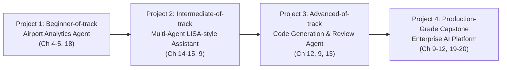
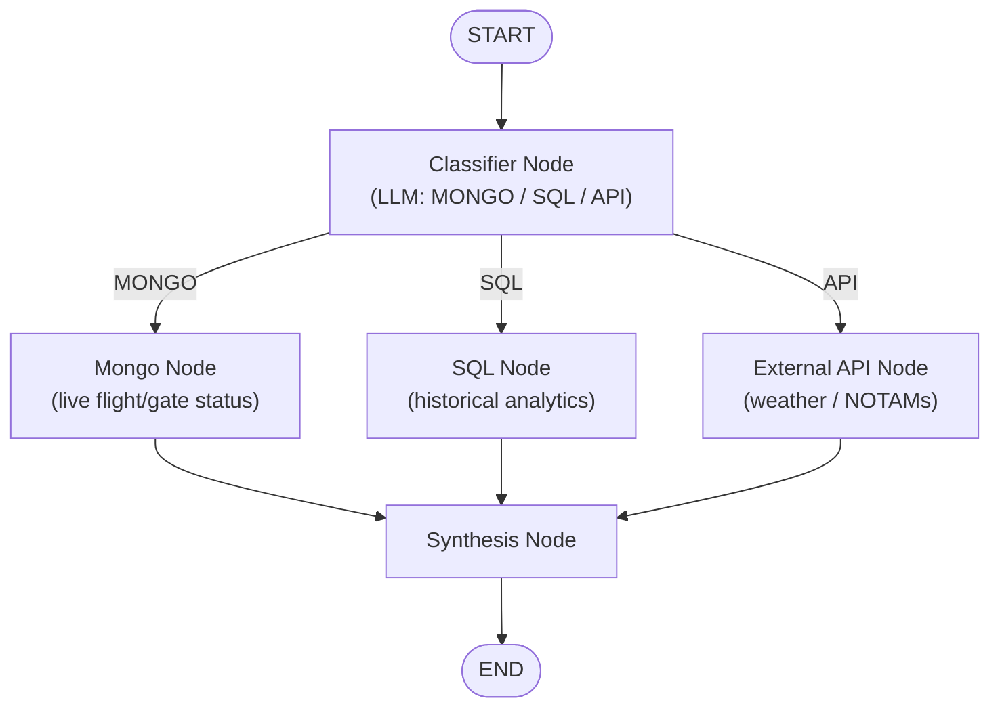
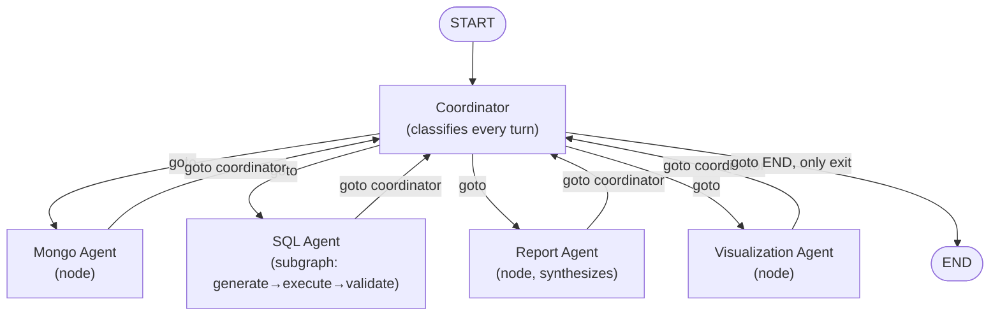
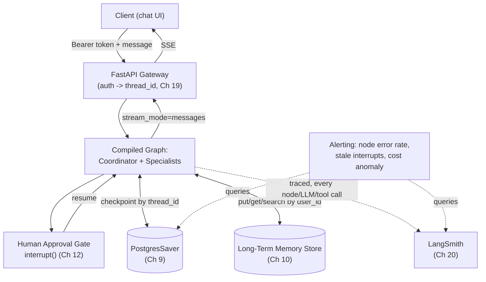

# Chapter 21: Capstone Projects

> "You already run a production assistant on MongoDB, FastAPI, Bedrock, LangChain, and MCP. This chapter's job is not to teach you a new stack — it's to show you what that same stack looks like once LangGraph is the orchestration layer underneath it." — the premise of everything below

## Learning Objectives

By the end of this chapter, you will be able to:

- Select a capstone project scope that exercises a specific tier of LangGraph competency — from a single conditional edge to a fully observable, checkpointed, multi-agent production platform
- Translate the patterns from Chapters 1–20 into a concrete architecture, folder structure, and phased implementation plan for a real system, not a toy graph
- Recognize which earlier chapter governs each architectural decision in a non-trivial LangGraph application, so you can go deep on demand instead of re-deriving patterns from memory
- Refactor the mental model of your own MongoDB/FastAPI/Bedrock/LangChain/MCP assistant into the coordinator/specialist, subgraph, checkpoint, and human-approval shapes this course has been building toward since Chapter 1
- Evaluate a LangGraph system — your own or someone else's — against a production-readiness bar that covers durability, observability, and safe human oversight, not just "does the graph run"

---

## Prerequisites for the Chapter

This chapter assumes the entire course, Chapters 1–20. It does not re-teach any mechanism — every implementation step below cites the specific earlier chapter that covers it in depth, and that citation is where you should go if a step feels unfamiliar rather than treating this chapter as a from-scratch tutorial. In particular, the four Applied Capstone Track projects lean heavily on:

- **Chapter 4 (Edges & Routing)** and **Chapter 5 (Commands & Dynamic Control)** — conditional dispatch and `Command(goto=..., update=...)`, the backbone of every routing decision in this chapter
- **Chapter 9 (Checkpointing & Durable Execution)** — `PostgresSaver`, `thread_id`, and durable resumability, required by three of the four Applied Capstone projects
- **Chapter 10 (Memory Management)** — the `Store` interface for cross-session, cross-thread facts, used by Project 4
- **Chapter 11 (Streaming)** and **Chapter 12 (Human-in-the-Loop)** — SSE token streaming and `interrupt()`/`Command(resume=...)`, both required by Project 3 and Project 4
- **Chapter 14 (Multi-Agent Systems)** and **Chapter 15 (Subgraphs & Composition)** — the coordinator/specialist pattern and the node-vs-subgraph decision rubric, the architectural spine of Project 2
- **Chapter 19 (Production Deployment)** and **Chapter 20 (Observability & Monitoring)** — `langgraph.json`, FastAPI + Docker deployment shape, and LangSmith tracing, both required by Project 4

You do not need to build all four Applied Capstone projects to get value from this chapter, but they are ordered deliberately — each one assumes the patterns the previous one exercised, exactly the way this course's own chapter arc escalates from fundamentals to production.

---

## Part 1: Foundational Tier Projects

These reinforce one concept apiece. They are deliberately small — a few hours of focused work each, not a weekend project — and exist to prove you can wire the *mechanism*, not to demonstrate a production architecture. Treat them as warm-up reps before the Applied Capstone Track in Part 2.

### Beginner: Chat Workflow (State, Nodes, Edges)

Build the smallest graph that still teaches something: a `TypedDict` state with an `add_messages`-reduced `messages` field (Chapter 2, Chapter 6), two or three nodes (a greeting node, an LLM-call node, a formatting node), and plain, unconditional edges wiring them together (Chapter 4). The point of this project isn't the chatbot — it's forcing yourself to internalize that a node is a plain function receiving state and returning a partial update, and that the graph's shape is just data (nodes and edges) compiled once and invoked repeatedly. If you've already built a MongoDB/FastAPI chat assistant with raw LangChain, this project is the "same conversation loop, redrawn as an explicit state machine" exercise — do it anyway; skipping it because it looks trivial is how the state-immutability habits from Chapter 2 fail to stick.

### Beginner: Intent Router (Conditional Routing)

Take the Chat Workflow above and add exactly one decision point: a classifier node whose output routes to one of two or three downstream nodes via `add_conditional_edges` (Chapter 4) — e.g., "small talk" versus "needs a tool" versus "needs escalation." The entire point of this project is distinguishing a **conditional edge** (a separate routing function evaluated after a node completes) from a node that returns a `Command(goto=...)` (Chapter 5) doing the routing itself — build it both ways and compare. This is the single cheapest project in the course for cementing the routing mental model that every later multi-agent and multi-tool system in this chapter depends on.

### Intermediate: Tool Calling Agent (Tools, Commands)

Implement a ReAct-style loop: an LLM node with `bind_tools`, a `ToolNode` (Chapter 8), and a conditional edge (or a `Command`-returning node, Chapter 5) that keeps looping between them until the model stops requesting tool calls. Bind two or three real tools — a calculator, a lookup against a small local dataset, anything with genuine side effects to observe. The concept under test is the tool-calling contract itself: how `tool_calls` show up on an `AIMessage`, how `ToolMessage` results thread back into the conversation, and how a hard iteration cap (foreshadowing Chapter 17's and Chapter 18's failure-mode material) prevents a misbehaving loop from running forever.

### Intermediate: RAG Workflow (Retrieval + State)

Wire a retrieval step into a graph: a node that embeds the user's question, queries a vector store, and writes retrieved chunks into a dedicated state field, followed by a generation node that constructs a grounded prompt from that field and calls the LLM. If you've built RAG before (this repo's companion [RAG course](../rag-course/00-index.md) covers the retrieval mechanics in depth), the LangGraph-specific lesson here is narrow but important: retrieval-as-a-node makes the retrieved-context step independently inspectable via `get_state()` (Chapter 9) and independently testable (Chapter 17) in a way a monolithic LCEL chain does not — you can assert on "what did we retrieve" separately from "what did the model say," which matters enormously once retrieval quality and generation quality need to be debugged separately in production.

### Intermediate: SQL Assistant (Routing + Tools)

Combine the Intent Router and Tool Calling Agent patterns against a single data source: a classifier decides whether a question needs a database lookup at all, and if so, a tool-calling loop generates and executes a read-only SQL query, with a validation step that checks the result looks sane before returning it. This is the direct precursor to the SQL Agent subgraph you'll build properly in Project 2 of the Applied Track — building it first as a flat, single-node tool loop here, before Chapter 15's subgraph machinery is required, makes the later "why does this deserve to be a subgraph" decision (retry logic, private attempt counters) concrete rather than abstract.

### Advanced: Research Agent (Parallel Execution)

Build a graph that fans a research question out into several concurrent sub-searches (Chapter 13) — different search angles, different sources, or different sub-questions derived from the original — and merges the results back together with a reducer before a synthesis node writes the final answer. The concept under test is fan-out/fan-in itself: multiple nodes executing in the same super-step, each writing to the same accumulating state field, and the reducer (not manual coordination code) being what makes the merge safe and order-independent. This project is also the natural place to first hit — and fix — a state-key collision (Chapter 14's Section 9.1 pitfall, previewed here a chapter early) if two parallel branches carelessly write to the same field.

### Advanced: Multi-Agent Coding Assistant (Subgraphs, Coordination)

Assemble a coordinator (Chapter 14) dispatching between at least two specialized agents relevant to a codebase task — e.g., a "planning agent" and a "code-editing agent," or a "test-writing agent" and a "review agent" — with at least one of them modeled as a subgraph (Chapter 15) because it has genuine internal retry/branching logic (generate a patch, run it, retry on failure). This project is the direct rehearsal for Project 3 in the Applied Track, minus the human-approval gate — build it first without `interrupt()` so the coordinator/subgraph/state-boundary mechanics are already second nature before you add a human checkpoint on top of them.

---

## Part 2: The Applied Capstone Track

Four full projects, escalating in difficulty, each explicitly shaped as a generalization of a production MongoDB/FastAPI/Bedrock/LangChain/MCP assistant — the stack you've already shipped — refactored one capability at a time into LangGraph's orchestration model. Build them in order: each project's implementation plan assumes the previous project's patterns are already comfortable.



| Project | Tier | Core Question It Answers | Chapters Exercised |
|---|---|---|---|
| 1 | Beginner-of-track | Can you route a real question to the right backend using conditional edges alone? | 3, 4, 18 |
| 2 | Intermediate-of-track | Can you decompose a monolithic assistant into a coordinator plus specialist agents, some of them subgraphs? | 9, 14, 15 |
| 3 | Advanced-of-track | Can you build an autonomous coding workflow that still puts a human in the loop before anything ships? | 9, 12, 13 |
| 4 | Production-Grade Capstone | Can you ship all of it together — durable, observable, safe — as a real deployable service? | 9–12, 19, 20 |

---

## Project 1: Airport Analytics Agent (Beginner-of-the-Applied-Track)

A natural-language front end over airport operations data, routing each question to whichever backend actually holds the answer — live MongoDB documents, a SQL analytics warehouse, or an external aviation API — using nothing more exotic than a classifier node and a conditional edge.

### Requirements

**Functional**
- Accept natural-language questions about flights and airports: "Is flight DL 118 delayed?", "What was our average taxi time at ORD last quarter?", "What's the current METAR for KATL?"
- Classify each question into exactly one of three backends before doing any real work: **live operational data** (MongoDB — current flight status, gate assignments, recent events), **historical analytics** (SQL warehouse — trends, quarterly rollups, on-time-performance stats), or **external reference data** (a public aviation API — weather, NOTAMs, airport metadata)
- Synthesize whatever the chosen backend returns into a direct, well-formatted natural-language answer
- Handle "I don't know which backend this needs" gracefully — the classifier must have a defined fallback rather than guessing silently

**Non-functional**
- Every backend call must have an explicit timeout; a slow or hung backend must not hang the whole graph indefinitely (Chapter 18)
- Only read-only queries are ever issued against Mongo or SQL — no classifier misfire should be able to reach a write path
- p95 end-to-end latency under 3 seconds for the common case (one backend call, one synthesis call)

### Architecture

A single classifier node fans out via a conditional edge to exactly one of three backend nodes, all of which converge on one synthesis node — the simplest possible shape that still demonstrates real conditional dispatch (Chapter 4) end to end.



### Folder Structure

```
airport-analytics-agent/
├── src/
│   ├── state.py                 # AirportState: TypedDict + reducers
│   ├── graph.py                 # build_graph(): wires nodes + conditional edge
│   ├── nodes/
│   │   ├── classifier.py        # LLM classification -> "mongo" | "sql" | "api"
│   │   ├── mongo_node.py        # live status/gate lookups
│   │   ├── sql_node.py          # read-only analytics queries
│   │   ├── external_api_node.py # aviation weather/NOTAM API calls
│   │   └── synthesis.py         # final NL answer construction
│   ├── clients/
│   │   ├── mongo_client.py      # read-only Mongo connection, query helpers
│   │   ├── sql_client.py        # read-only SQL role, parameterized queries
│   │   └── aviation_api_client.py
│   └── config.py                # Settings: timeouts, backend URLs, model name
├── tests/
│   ├── test_classifier.py
│   ├── test_nodes.py
│   └── test_graph.py
├── requirements.txt
└── README.md
```

### Implementation Plan

1. **Define `AirportState`** — `question: str`, `route: Literal["mongo", "sql", "api"]`, `raw_result: dict | None`, `answer: str | None` (Chapter 2).
2. **Build the classifier node** — a short, single-purpose system prompt (Chapter 14's Section 1.2 framing, applied to a single-agent system: keep it narrow even before you have multiple agents) that outputs exactly one of three labels, with an explicit default (`"mongo"`, the lowest-risk/lowest-latency backend) if the model's output doesn't cleanly parse.
3. **Wire the conditional edge** with `add_conditional_edges` (Chapter 4), mapping each label to its backend node — this is the project's core lesson, so resist the temptation to collapse it into a `Command`-returning node yet (that refactor is a good Extension, not the baseline build).
4. **Implement each backend node** as a thin, read-only client call with an explicit timeout (Chapter 18) and a typed exception boundary — a Mongo timeout, a SQL syntax error, and an API 429 should each produce a distinct, loggable failure rather than an unhandled crash.
5. **Implement the synthesis node** — one LLM call that takes `raw_result` plus the original question and produces the final natural-language answer, explicitly noting the data source (a habit worth building now, since Project 2's Report Agent depends on the same discipline).
6. **Add query-safety guards** at the client layer, not just the prompt layer (Best Practices below) — a classifier misfire should be structurally incapable of reaching a write path, not merely instructed not to.
7. **Test each node in isolation** with a mocked backend client (Chapter 17), then test the full graph end-to-end against a small fixture dataset for all three routes.

### Best Practices

- **Enforce read-only access at the connection layer**, not just in the prompt — use a database role/user with no write grants for both Mongo and SQL, so a hallucinated write query fails at the permissions layer even if it somehow gets generated.
- **Timeout every external call explicitly** (Mongo, SQL, and especially the third-party aviation API, which you don't control) and treat a timeout as a distinct, recoverable error path (Chapter 18), not an unhandled exception that kills the run.
- **Give the classifier a defined fallback route**, never a silent default to "do nothing" — an ambiguous question should still produce *some* answer, ideally with a caveat, rather than a blank response.
- **Log the classification decision alongside the final answer** from day one — when a user reports a wrong answer, "which backend did we even query" is the first diagnostic question, and it's free to capture at classification time.

### Extensions

- **Add a caching layer** in front of the SQL and external API nodes (exact-match keyed on the normalized question, or a semantic cache keyed on embedding similarity) — historical analytics answers and weather/NOTAM lookups are both good candidates for a short TTL cache, and this is a direct preview of the caching layer Project 4 builds properly.
- **Add a visualization node** downstream of the SQL node specifically, producing a chart spec (e.g., Vega-Lite JSON) for "trend"-shaped questions — this is the single-node precursor to the full Visualization Agent in Project 2, and building it here first isolates the chart-generation logic from any multi-agent coordination complexity.

---

## Project 2: Multi-Agent LISA-Style AI Assistant (Intermediate-of-the-Applied-Track)

A direct generalization of a production MongoDB/FastAPI/Bedrock/LangChain/MCP assistant into the coordinator/specialist shape from Chapter 14: a Coordinator dispatching to a Mongo Agent, a SQL Agent, a Report Agent, and a Visualization Agent, with the agent that needs real internal branching built as a subgraph (Chapter 15) rather than a flat node.

### Requirements

**Functional**
- Answer multi-part questions that may require live operational data, historical analytics, narrative synthesis, and a chart — in any combination — within a single conversation, potentially across several hops
- **Coordinator**: classify each turn and route via `Command(goto=...)` (Chapter 5) to exactly one specialist; own the termination decision exclusively (Chapter 14, Section 8)
- **Mongo Agent**: bounded, single-round tool call(s) against live MongoDB collections — modeled as a plain node, since it has no internal retry/branching logic worth naming (Chapter 15, Section 9's rubric)
- **SQL Agent**: generate → execute → validate → retry against the analytics warehouse — modeled as a **subgraph** specifically because this internal branching is real (Chapter 15, Section 2)
- **Report Agent**: synthesize whatever Mongo/SQL results are already in shared state into one narrative answer, explicitly attributing each figure to its source store
- **Visualization Agent**: turn already-gathered tabular results into a chart specification for the frontend
- If your production assistant already groups tools behind separate MCP servers (a Mongo server, a SQL/warehouse server), reuse that boundary directly as the specialist boundary (Chapter 14's Best Practices) — this project is a genuine refactor target, not a from-scratch rebuild, for a reader with your background

**Non-functional**
- The conversation must survive a process restart mid-hop — checkpoint with `PostgresSaver` (Chapter 9), not `MemorySaver`
- A hop counter must hard-cap the number of coordinator→specialist round trips per user turn, with a graceful fallback message on breach (Chapter 14, Section 9.2) — never rely on the recursion limit alone
- Every specialist's shared-state output field must be named per-agent (`mongo_results`, `sql_results`, `chart_spec`) — never a generic `results` key (Chapter 14, Section 9.1)

### Architecture

The static graph is deliberately minimal — every specialist routes back to the coordinator, and the coordinator alone ever routes to `END`, exactly matching Chapter 14's single-owner termination rule.



### Folder Structure

```
lisa-multi-agent-assistant/
├── src/
│   └── lisa/
│       ├── state.py                 # AnalyticsState: shared schema, per-agent fields
│       ├── graph.py                 # build_graph(): assembles coordinator + specialists
│       ├── coordinator.py           # routing-only node, hop counter, termination owner
│       ├── agents/
│       │   ├── mongo_agent.py       # plain node, bounded tool-call round
│       │   ├── sql_agent/
│       │   │   ├── state.py         # SQLAgentState: private attempts/last_error
│       │   │   ├── subgraph.py      # generate_sql -> execute_sql -> validate_result
│       │   │   └── wrapper.py       # translates AnalyticsState <-> SQLAgentState
│       │   ├── report_agent.py      # pure synthesis node
│       │   └── visualization_agent.py
│       ├── mcp_clients/
│       │   ├── mongo_server_client.py   # reuses existing MCP Mongo server boundary
│       │   └── sql_server_client.py     # reuses existing MCP SQL server boundary
│       └── config.py
├── tests/
│   ├── test_coordinator_routing.py
│   ├── test_sql_agent_subgraph.py   # standalone, no coordinator (Ch 15, Section 5)
│   └── test_full_graph.py
├── requirements.txt
└── README.md
```

### Implementation Plan

1. **Design `AnalyticsState`** first, on paper, before writing any node — decide exactly which fields are shared (`messages`, `mongo_results`, `sql_results`, `chart_spec`, `handoff_count`) versus agent-private, per Chapter 14's Section 4 rule of thumb ("what did we find out" is shared; "how did we get there" is private).
2. **Build the Coordinator node** with a short, single-purpose classification prompt and a `handoff_count`-based circuit breaker (Chapter 14, Section 3) — get this working against a stub that always routes to a single fake specialist before building any real specialist.
3. **Build the Mongo Agent as a plain node** — one bounded tool-call round against your existing (or a stand-in) MCP Mongo server, returning `Command(goto="coordinator", update={"mongo_results": ...})`.
4. **Build the SQL Agent as a subgraph** (Chapter 15) — its own `SQLAgentState` with a private `attempts` counter, a `generate_sql → execute_sql → validate_result` internal loop, compiled *without* its own checkpointer so it inherits the parent's when embedded (Chapter 15, Section 7). Test it standalone first, with no coordinator in the picture (Chapter 15, Section 5).
5. **Wrap the SQL Agent as a parent-graph node** using the wrapper pattern (Chapter 15, Section 4) if its schema doesn't overlap with `AnalyticsState`, translating only the final `query`/`rows` across the boundary.
6. **Build the Report Agent and Visualization Agent** as plain synthesis nodes reading already-gathered shared state — neither one calls a data-source tool itself, following the "gatherer agents feed one synthesizer" shape from Chapter 14, Section 7.
7. **Assemble the full graph**, compile with `PostgresSaver` (Chapter 9), and drive a multi-hop request end to end (e.g., "compare this month's Mongo event volume against last quarter's SQL revenue trend, and chart it") tracing the coordinator's routing decisions turn by turn.
8. **Add the hop-counter circuit breaker and single-owner termination check** as first-class tests (Chapter 14, Section 9), not an afterthought — deliberately construct an input that would loop forever without the cap and confirm the graceful fallback fires.

### Best Practices

- **Default to supervisor-decides routing** (Chapter 14, Section 5.3) for this project; reserve explicit handoff tools for a specific, measured hot path only after profiling shows the extra coordinator round trip is a real cost.
- **Name every specialist's shared output field after the agent**, and enforce this in code review the moment a new specialist is added — this is the cheapest possible defense against the silent-overwrite bug in Chapter 14, Section 9.1.
- **Model an agent as a subgraph only once it has earned it** — the Mongo Agent's simplicity (one bounded tool round) is not an oversight; forcing it into a subgraph "for consistency" adds a schema-translation boundary with no corresponding benefit (Chapter 15, Section 9).
- **Reuse your existing MCP server boundaries as specialist boundaries.** If your production assistant already exposes a Mongo MCP server and a SQL MCP server, this refactor is "one agent per MCP server," not a redesign from scratch.

### Extensions

- **Add a fifth specialist** (a Research/Web Agent, following the shape in Chapter 14, Section 7.1) and confirm you only need to touch the Coordinator's prompt to wire it in — no existing specialist's code should need to change, proving the supervisor-decides pattern's core promise.
- **Introduce one explicit-handoff fast path** (Chapter 14, Section 5.2) — e.g., let the Mongo Agent hand off directly to the Report Agent when it detects both result fields are already populated — and measure the latency saved against the extra coordinator round trip it replaces.

---

## Project 3: Code Generation & Review Agent (Advanced-of-the-Applied-Track)

An autonomous coding workflow — Planner → Code Generator → Test Generator → Reviewer — that always stops for a human before anything reaches version control, using the dynamic `interrupt()` pattern from Chapter 12 as a genuine safety gate, not a UI decoration.

### Requirements

**Functional**
- Given a feature request or bug description plus access to a real (sandboxed) project directory, produce: a short implementation plan, a code diff implementing it, generated tests covering the change, and an automated review pass (static analysis plus an LLM critique) before any human sees it
- The Reviewer must be able to send work **back** to the Code Generator with specific, structured feedback (a routing loop, capped — see Non-functional) rather than only ever approving or rejecting outright
- A human must explicitly approve the final diff before a commit/push tool is ever invoked — no exceptions, and the approval payload must contain the diff, the generated tests, and the reviewer's notes, so a human never has to leave the approval surface to make an informed call (Chapter 12, Section "Common Mistakes")
- On rejection, route back to the Code Generator with the human's feedback appended to context, up to a small retry cap

**Non-functional**
- All tool execution (`read_file`, `edit_file`, `run_tests`, `git_diff`, `git_commit`) is sandboxed to an explicit allowlisted project root, with path-traversal checks rejecting any `../` escape — built and adversarially tested *before* any model is wired to it
- The Generator↔Reviewer retry loop has a hard cap with a graceful "needs human triage" fallback (Chapter 14's hop-counter pattern, applied here to a two-node loop instead of a coordinator)
- The approval pause must survive a process restart — a human reviewing a diff might take hours; the graph must be checkpointed with a durable backend (Chapter 9), not `MemorySaver`
- The `git_commit` side effect must execute **exactly once**, after the human's decision is known, never as a side effect that could replay on resume (Chapter 12, Section 6.2)

### Architecture

The Reviewer branches three ways: straight through on approval, back to the Generator on requested changes (capped), or to the human approval gate when a diff is ready to ship. The gate itself only ever proceeds to `commit` after `Command(resume=...)`.

```mermaid
flowchart TD
    START([START]) --> PLAN["Planner"]
    PLAN --> GEN["Code Generator"]
    GEN --> TEST["Test Generator"]
    TEST --> REV["Reviewer"]
    REV -->|changes requested\n(capped retries)| GEN
    REV -->|ready to ship| APPR["Human Approval\ninterrupt()"]
    APPR -->|resume: approved| COMMIT["Commit Node\n(git commit/push)"]
    APPR -->|resume: rejected| GEN
    COMMIT --> END([END])
```

### Folder Structure

```
code-review-agent/
├── src/
│   ├── state.py                 # CodeReviewState: plan, diff, tests, review_notes,
│   │                             #   retry_count, approved
│   ├── graph.py                 # build_graph(): wires the loop + interrupt gate
│   ├── nodes/
│   │   ├── planner.py
│   │   ├── code_generator.py    # produces/edits the diff via sandboxed tools
│   │   ├── test_generator.py
│   │   ├── reviewer.py          # static analysis + LLM critique, Command routing
│   │   ├── human_approval.py    # interrupt() gate — payload: diff+tests+notes
│   │   └── commit.py            # side effect lives strictly after the gate
│   ├── tools/
│   │   ├── read_file.py
│   │   ├── edit_file.py
│   │   ├── run_tests.py
│   │   └── git_tools.py         # git_diff, git_commit
│   ├── sandbox.py               # path allowlisting, traversal rejection
│   └── checkpointer.py          # PostgresSaver/SqliteSaver factory
├── tests/
│   ├── test_sandbox_adversarial.py   # built and passing BEFORE model wiring
│   ├── test_reviewer_routing.py
│   └── test_interrupt_resume_cycle.py
├── requirements.txt
└── README.md
```

### Implementation Plan

1. **Build and adversarially test the sandbox first**, before any model is connected — deliberately feed it `../../etc/passwd`-style paths and confirm rejection, per the security-critical-first discipline this course has emphasized since tool-calling patterns were introduced (Chapter 8).
2. **Define `CodeReviewState`** — `plan`, `diff`, `test_code`, `review_notes: list[str]`, `retry_count: int`, `approved: bool | None` (Chapter 2).
3. **Build the linear planner → generator → test-generator chain** first, with plain edges (Chapter 4), and confirm it produces a plausible diff and test file for a simple, real bug before adding any looping or gating logic.
4. **Build the Reviewer node** to return a `Command` routing to one of three destinations — `code_generator` (with `review_notes` updated and `retry_count` incremented), `human_approval`, or (only after the retry cap is hit) a dedicated "needs human triage" path — using the same capped-loop discipline as Chapter 14's Section 9.2 infinite-loop fix, applied to a two-node loop instead of a multi-agent mesh.
5. **Add the human approval gate** with a dynamic `interrupt()` call (Chapter 12, Section 4.2) — condition it on whatever your team decides genuinely warrants review (every diff, or only diffs above a size/risk threshold), and construct a self-sufficient payload: the full diff, the generated tests, and the reviewer's notes.
6. **Place the `commit` node strictly after the approval gate**, never before it, and verify by deliberately tracing a resume cycle that `git_commit` fires exactly once — this is Chapter 12, Section 6.2's side-effect-replay pitfall, and it is the single most consequential correctness property in this entire project.
7. **Compile with a durable checkpointer** (`SqliteSaver` for local development, `PostgresSaver` for anything a real reviewer's multi-hour turnaround must survive — Chapter 9) and drive the full submit → pause → review → resume lifecycle exactly as Chapter 12's Section 5 describes, including a simulated process restart between submission and approval.
8. **Wire the FastAPI two-endpoint shape** (submit, decide) from Chapter 12's Example 2 if you want to expose this as a real service rather than a local script.

### Best Practices

- **Never trust the model as the only safety layer for tool execution.** The sandbox boundary is a security control, not a prompt instruction — test it adversarially, independent of any LLM call, before wiring the model to it (Chapter 8's tool-calling security posture, reinforced here).
- **Cap the Generator↔Reviewer loop explicitly**, and make the "giving up, needs a human to triage from scratch" path visible rather than an opaque `GraphRecursionError` — the same lesson Chapter 14 teaches for multi-agent handoff loops applies just as directly to a two-node review loop.
- **Keep everything before `interrupt()` free of side effects**, or push them strictly after it (Chapter 12, Section 6.2) — `git_commit` is exactly the kind of non-idempotent action that must never risk firing twice on replay.
- **Make the approval payload self-sufficient.** A reviewer approving a diff should never need to open a separate terminal to see the test output or the reviewer agent's own concerns — include all of it in the `interrupt()` payload.
- **Use a durable checkpointer, not `MemorySaver`, the moment a human is in the approval loop** — a real reviewer's response time is measured in hours, not milliseconds, and `MemorySaver` cannot survive even a routine app restart in that window (Chapter 9, Chapter 12).

### Extensions

- **Add a second, security-focused reviewer running in parallel** with the primary code reviewer (fan-out/fan-in, Chapter 13), merging both sets of findings into the human approval payload before the gate — a direct application of Chapter 13's parallel-execution pattern to a review pipeline instead of a research pipeline.
- **Persist reviewer style/policy preferences in long-term memory** (Chapter 10's `Store`) keyed by repository or team, so recurring feedback ("we always want docstrings on public functions") doesn't have to be re-taught to the Reviewer on every single run — a preview of the memory architecture Project 4 formalizes.

---

## Project 4: Enterprise AI Platform (Production-Grade Capstone)

The "everything together" project. Every pattern from Chapters 9 through 20 that a real production LangGraph service needs, deployed the way Chapter 19 teaches, observed the way Chapter 20 teaches. This is deliberately the most detailed spec in this chapter — treat it as the centerpiece of your portfolio and the direct target architecture for evolving your existing MongoDB/FastAPI/Bedrock/LangChain/MCP assistant.

### Requirements

**Functional**
- A FastAPI backend exposing authenticated `/invoke` and `/stream` (SSE, `stream_mode="messages"`) endpoints backed by a compiled, checkpointed multi-agent graph (Chapter 19, Section 5)
- A coordinator/specialist core (Chapter 14) reused directly from Project 2's shape, extended with: a **long-term memory layer** (Chapter 10's `Store`) so user preferences and durable facts survive across threads, not just within one; and a **human-approval gate** (Chapter 12) in front of any consequential action a specialist proposes (a write-scoped tool call, a report distributed externally, anything analogous to Project 3's commit gate)
- Full **LangSmith observability** (Chapter 20): tracing enabled via environment variables with zero graph-code changes, `thread_id`/`user_id`/`environment` metadata attached at every invocation, and at least one custom `get_stream_writer()` event per specialist node for business-meaningful progress signals
- A minimal **evaluation harness**: a golden set of representative multi-turn scenarios (including at least one that exercises the approval gate and one that exercises long-term memory recall) run against the system on every meaningful change

**Non-functional**
- `thread_id` is **never** client-supplied — derived server-side from the authenticated identity (Chapter 19, Section 5.3)
- The app layer is fully stateless: any instance can serve any `thread_id`, which requires `AsyncPostgresSaver` (Chapter 9, Chapter 19, Section 8), not `MemorySaver`, in every non-local environment
- Alerting covers graph-specific failure modes, not just HTTP error rate: per-node error rate, checkpoint-store latency, interrupts stuck past an SLA, recursion-limit hits, and token-spend anomalies (Chapter 20, Section 7)
- Deployed via Docker with all environment-dependent values (checkpointer backend, model choice, LangSmith project, rate limits) externalized to a single typed `Settings` object (Chapter 19, Section 7) — no hardcoded values anywhere in `graph.py`

### Architecture



### Folder Structure

```
enterprise-ai-platform/
├── langgraph.json                   # manifest for CLI/Platform tooling (optional, Ch 19)
├── docker/
│   ├── Dockerfile
│   └── docker-compose.yaml          # app + Postgres, local/staging parity
├── src/
│   └── platform/
│       ├── graph.py                 # build_graph(): no FastAPI imports (Ch 19, Section 2)
│       ├── state.py                 # PlatformState: shared + per-agent fields
│       ├── coordinator.py           # routing, hop counter, sole termination owner
│       ├── agents/
│       │   ├── mongo_agent.py
│       │   ├── sql_agent/           # subgraph, per Project 2 / Ch 15
│       │   ├── report_agent.py
│       │   └── action_agent.py      # proposes consequential actions -> approval gate
│       ├── approval/
│       │   └── human_approval.py    # interrupt() gate, self-sufficient payload
│       ├── memory/
│       │   ├── store.py             # Store factory: InMemoryStore (dev) / PostgresStore (prod)
│       │   └── extract_facts.py     # LLM-based fact extraction into long-term memory
│       ├── checkpointer.py          # AsyncPostgresSaver factory (Ch 9, Ch 19)
│       └── config.py                # typed Settings (Ch 19, Section 7)
├── app/
│   ├── main.py                      # FastAPI lifespan, /invoke, /stream (SSE)
│   ├── deps.py                      # auth dependency, server-side thread_id derivation
│   └── schemas.py
├── observability/
│   ├── tracing_config.py            # LANGSMITH_* env wiring, shared metadata builder
│   └── eval/
│       ├── golden_scenarios.jsonl   # multi-turn scenarios incl. approval + memory recall
│       └── run_eval.py
├── alerting/
│   └── stale_interrupts_job.py      # scheduled query against the checkpointer (Ch 20, Section 7)
├── tests/
│   ├── test_graph.py
│   ├── test_approval_gate.py
│   └── test_memory_recall.py
└── README.md
```

### Implementation Plan

1. **Start from Project 2's coordinator/specialist graph** and extract `graph.py` into a builder function with zero FastAPI imports (Chapter 19, Section 2) — this separation is what makes every later step (CLI tooling, testing, containerization) cheap.
2. **Add the long-term memory layer** (Chapter 10): a `Store` factory (`InMemoryStore` for dev/tests, a persistent backend for prod), a namespacing scheme keyed by `user_id` (e.g., `(user_id, "preferences")`), and a node that reads relevant memories at the start of a turn and writes newly-learned facts back at the end — never dumping raw transcripts into long-term storage.
3. **Add the human-approval gate** (Chapter 12) in front of whichever specialist(s) propose consequential actions, following Project 3's discipline exactly: dynamic `interrupt()`, side effects strictly after the pause, a self-sufficient payload.
4. **Compile with `AsyncPostgresSaver`** (Chapter 9) and confirm — via a real test, not an assumption — that a paused approval survives a full process restart.
5. **Build the FastAPI wrapper** (Chapter 19, Section 5): a `Settings` object, a checkpointer factory selected by `checkpointer_backend`, server-derived `thread_id` from an auth dependency, and both `/invoke` and `/stream` (SSE, `stream_mode="messages"`) endpoints, with the graph compiled once in `lifespan`, never per-request.
6. **Wire LangSmith tracing** (Chapter 20, Section 2) via environment variables only — zero code changes to `graph.py` — and centralize `metadata`/`tags` construction (`user_id`, `environment`, `app_version`) in one shared config-building function used by every route handler (Chapter 20, Section 9.2).
7. **Add at least one `get_stream_writer()` custom event per specialist node** for a business-meaningful progress signal (e.g., row counts from the SQL agent, per Chapter 20, Section 8.1), and correlate structured log lines to `thread_id` for on-call debuggability.
8. **Build the golden evaluation harness** (Chapter 20's evaluation framing plus this course's testing chapter, Chapter 17): 15–30 representative multi-turn scenarios, explicitly including one that exercises the approval gate's pause/resume cycle and one that exercises long-term memory recall across two separate threads for the same user. Run it before and after every meaningful change.
9. **Containerize** with Docker (Chapter 19, Section 6): multi-stage build, no secrets baked into any layer, all environment-dependent values injected at container-run time.
10. **Wire alerting** (Chapter 20, Section 7) beyond generic HTTP monitoring: per-node error rate from trace data, checkpoint-store latency, a scheduled job querying the checkpointer for interrupts stuck past an SLA, recursion-limit hit counts, and token-spend anomalies — each with an explicit threshold and an on-call runbook pointer.
11. **Load-test the deployed service**: confirm the app layer's statelessness directly (Chapter 19, Section 5's exercise 3) by running two instances against the same Postgres backend and confirming a conversation started on one instance continues correctly on the other.

### Best Practices

- **Build and validate each layer independently before wiring them together** — coordinator/specialists, then memory, then approval gate, then checkpointing, then the FastAPI wrapper, then tracing, then alerting — exactly the layered discipline Chapter 19's Best Practices recommends, applied at platform scale.
- **Treat the golden evaluation set as a first-class, versioned artifact**, run on every change, not a one-time check — this is doubly important here because the system now has both an approval gate and long-term memory, either of which can regress silently without a scenario that specifically exercises it.
- **Never let `thread_id` be client-supplied**, and never let the approval gate's payload omit context a human would need — both are the same underlying discipline (don't trust the client; don't make the human work for information the system already has) applied to two different boundaries.
- **Alert on graph-specific conditions, not just HTTP error rate.** A stuck interrupt or a per-node error rate spike behind a working fallback will never show up as a 5xx — Chapter 20's Section 7 table is not optional reading for this project.
- **Externalize every tunable value** — model choice, checkpointer backend, approval-gate thresholds, cache TTLs, LangSmith project name — to `Settings`, and write down in the README exactly which trade-offs you made and why (e.g., "approval required above $X or for any external-facing action; below that, autonomous"), because that judgment call is the actual point of this capstone.

### Extensions

- **Add model routing** (Chapter 19, Section 6 preview): route simple classification/coordinator calls to a cheaper, faster model and reserve the larger model for specialist synthesis, measuring the cost delta via LangSmith's per-node cost rollup (Chapter 20, Section 6.2).
- **Add a second, independent LLM-as-judge evaluation pass** on top of the golden-set harness, and reconcile disagreements between the two evaluation methods as a documented judgment call, not a discarded discrepancy.
- **Deploy to a real (even low-traffic) cloud environment** with basic autoscaling, and document the cold-start and connection-pool-sizing behavior you observe scaling from zero (Chapter 19, Section 8.3).
- **Extend long-term memory with semantic search** (Chapter 10, Section 5) so recall isn't limited to exact-namespace lookups — measure whether it changes how often the assistant correctly surfaces an old preference without the user re-stating it.

---

## Real-World Scenarios

**Scenario 1 — The refactor that actually shipped.** A team running a single-agent MongoDB/FastAPI/Bedrock assistant with nine bolted-on tools and a 1,800-token system prompt (the exact trajectory Chapter 14 opens with) used Project 2's plan almost verbatim: they mapped their existing MCP tool servers directly onto specialist boundaries, built the SQL path as a subgraph because it already had ad hoc retry logic scattered through one giant function, and shipped the coordinator in two weeks. The single highest-value change wasn't the multi-agent split itself — it was discovering, once specialists were isolated, that their "SQL retry" logic had a latent bug that silently discarded the second of two required WHERE clauses on retry. The bug had been live in production for months, undetectable in a monolithic agent because there was no isolated place to write a test against just that logic (Chapter 15, Section 5).

**Scenario 2 — The approval gate that paid for itself in one incident.** A team building an internal ops assistant added Project 3's human-approval pattern late, almost as an afterthought, in front of a "restart this service" tool. Three weeks after shipping, an LLM misread an ambiguous log excerpt and confidently proposed restarting a *different*, healthy service than the one the user actually asked about. Because the diff (in this case, the proposed action plus its justification) sat behind `interrupt()` with the full reasoning attached, the on-call engineer caught the mismatch in the approval payload in under ten seconds and rejected it — no incident, no postmortem, just a rejected proposal and a routed-back retry. The team's own retrospective conclusion, almost word for word: "the gate is worth it the first time it catches something, and it always eventually catches something."

**Scenario 3 — Long-term memory closing a support loop.** An assistant built on Project 4's pattern started persisting user-stated preferences (preferred report format, a recurring "always flag anomalies above 10%" instruction) into the `Store`, namespaced by `user_id`. Support tickets complaining "I already told it this, why do I have to say it every time" dropped to near zero within a month for the specific preference categories the team had bothered to extract — the fix wasn't a smarter model, it was giving the system somewhere durable to put facts that don't belong to any one conversation.

---

## Best Practices (Cross-Project Rollup)

- **Match every architectural decision to the chapter that teaches it, don't improvise a new pattern mid-project.** Conditional routing (Ch 4), `Command` (Ch 5), checkpointing (Ch 9), memory (Ch 10), streaming (Ch 11), human-in-the-loop (Ch 12), multi-agent coordination (Ch 14), subgraphs (Ch 15) — each has a settled, battle-tested shape in this course; reinventing one under deadline pressure is how the pitfalls each chapter warns about get reintroduced.
- **Build the security/safety boundary before the model, every time.** The sandbox in Project 3, the read-only database roles in Project 1, the server-derived `thread_id` in Project 4 — in every case, the non-negotiable boundary is built and adversarially tested *before* any LLM is wired to it, never treated as a prompt-level suggestion.
- **Name shared state fields per-agent and cap every loop explicitly**, from the very first multi-node project onward — both habits are nearly free to build in early and expensive to retrofit after a silent-overwrite bug or a runaway `GraphRecursionError` in production.
- **Use a durable checkpointer the moment a human or a real backend restart is in the picture.** `MemorySaver` is correct for local iteration in every one of these projects and wrong the instant an approval, a multi-hour wait, or more than one process instance enters the picture.
- **Treat observability as infrastructure, not a debugging afterthought**, especially once Project 2 introduces multi-agent cost multiplication and Project 3/4 introduce approval gates that can silently stall — both failure modes are invisible to generic HTTP monitoring and require the LangSmith-specific alerting patterns from Chapter 20.
- **Write down your trade-offs.** Every project above has at least one genuine judgment call (which questions warrant human approval, what belongs in long-term memory, when a specialist earns subgraph status) — documenting *why* you drew the line where you did is what turns a working system into a portfolio piece a reviewer can actually evaluate.

---

## Common Mistakes

- **Skipping the Foundational Tier because it "looks too simple."** The single-concept projects in Part 1 are where the habits that prevent Applied Track bugs actually get built — a team that jumps straight to Project 2 without ever having deliberately broken and fixed a state-key collision in a small project tends to reproduce that exact bug at production scale instead.
- **Modeling every specialist as a subgraph "for consistency."** Chapter 15's rubric exists precisely to stop this — a specialist with no internal branching (the Mongo Agent in Project 2) gains nothing from subgraph status and loses simplicity.
- **Treating the recursion limit as a design safety mechanism** instead of a last-resort net, in both the multi-agent loop (Project 2) and the generator/reviewer loop (Project 3) — by the time it fires, every failed hop's tokens are already spent; the real fix is always an explicit, cheap-to-check counter evaluated before the next LLM call.
- **Placing a side effect before an `interrupt()` call** — the commit in Project 3, any notification or write-path action in Project 4 — and discovering only in testing (or worse, production) that it fires twice on resume, because the node replays from the top rather than resuming mid-function (Chapter 12, Section 6.2).
- **Using `MemorySaver` past the prototype stage** in any project with a human-approval gate or a multi-instance deployment target — it silently loses exactly the state these projects depend on most, with no error, just quietly "forgotten" progress.
- **Building the FastAPI/observability/deployment layer (Project 4) before the graph logic is solid.** Production plumbing amplifies whatever correctness or safety gaps already exist in the graph — it doesn't fix them.
- **Dumping raw conversation transcripts into long-term memory** instead of extracted, structured facts (Chapter 10) — this doesn't scale, degrades retrieval quality, and makes "what does the system actually believe about this user" impossible to audit.

---

## Summary

- The Foundational Tier (Part 1) exists to cement one mechanism at a time — state/nodes/edges, conditional routing, tool calling, retrieval-as-state, parallel fan-out/fan-in, subgraph coordination — before any of them are combined under real architectural pressure.
- The Applied Capstone Track (Part 2) escalates through exactly the shape a real MongoDB/FastAPI/Bedrock/LangChain/MCP assistant grows into over time: a single conditional router (**Airport Analytics Agent**), a coordinator/specialist system with a subgraph-modeled agent (**Multi-Agent LISA-Style Assistant**), an autonomous workflow gated by genuine human approval (**Code Generation & Review Agent**), and a fully durable, observable, memory-equipped production platform (**Enterprise AI Platform**).
- Every implementation step across all four Applied Track projects cites the specific earlier chapter that teaches it — use those citations as a lookup table when a step feels unfamiliar, rather than re-deriving the mechanism from scratch.
- The security/safety boundary (read-only database roles, sandboxed tool execution, server-derived `thread_id`, human approval gates) is built and adversarially tested *before* any model is connected to it, in every project — this is the one discipline that recurs without exception.
- The Enterprise AI Platform is deliberately the most detailed spec because it's the project most worth finishing for a portfolio: it demonstrates checkpointing, streaming, human approval, long-term memory, and observability working together as one deployable system, not four separate demos.

---

## Knowledge Check

1. Project 2 models the Mongo Agent as a plain node and the SQL Agent as a subgraph, even though both are "specialist agents" in the same coordinator. Using Chapter 15's rubric, justify this asymmetry, and describe what would have to change about the Mongo Agent's requirements before it would deserve subgraph status too.
2. In Project 3, the implementation plan insists the sandbox be built and adversarially tested *before* any model is wired to it. Why is testing it after connecting the model insufficient, even if the model behaves correctly in every observed test run?
3. A reviewer looks at your Project 4 submission and asks: "your approval gate has been open for six hours on one thread — how would you even know?" Walk through exactly what infrastructure (from which chapter) makes that detectable, and why a generic HTTP-latency dashboard would never surface it.
4. Project 1's classifier routes to Mongo, SQL, or an external API. Explain why "enforce read-only access at the connection layer" is a stronger guarantee than "instruct the classifier never to generate a write query," and describe a concrete failure mode the connection-layer guard prevents that the prompt-level instruction does not.
5. Compare the hop-counter circuit breaker in Project 2 (coordinator ↔ specialists) and the retry cap in Project 3 (generator ↔ reviewer). What do they have in common structurally, and why does Chapter 14 insist the recursion limit alone is never a sufficient substitute for either?
6. You're asked to justify, to a non-technical stakeholder, why Project 4 needs long-term memory (Chapter 10) *in addition to* checkpointed short-term state (Chapter 9) rather than just a longer-lived thread. Give the one-sentence distinction that would make this clear to someone who has never heard the terms "thread_id" or "Store."

---

## Hands-on Exercises

1. **Extend the Airport Analytics Agent (Project 1) to add caching and a visualization node.** Add a semantic cache in front of the SQL node keyed on embedding similarity of the normalized question, with a documented TTL and an explicit note on the staleness risk you're accepting. Then add a visualization node downstream of the SQL node specifically for "trend" questions, producing a chart spec. Confirm the classifier's routing decision is unaffected by either addition — both should be purely additive to the SQL branch.

2. **Extend the Multi-Agent LISA-Style Assistant (Project 2) with a sixth specialist and an explicit-handoff fast path.** Add a Research/Web Agent following Chapter 14 Section 7.1's shape, touching only the Coordinator's prompt to wire it in. Separately, implement one explicit-handoff tool (Chapter 14, Section 5.2) between two existing specialists for a specific, well-understood case, and measure the latency difference against always routing through the coordinator.

3. **Extend the Code Generation & Review Agent (Project 3) with a parallel security reviewer.** Add a second reviewer node that runs concurrently with the primary code reviewer (Chapter 13's fan-out/fan-in), merging both sets of findings into the human approval payload. Confirm via a deliberately-crafted adversarial diff that a security-relevant finding the primary reviewer would have missed surfaces in the merged payload before the human ever sees it.

4. **Extend the Enterprise AI Platform (Project 4) with a stale-interrupt alert and a load test.** Implement the scheduled job from Chapter 20, Section 7 that queries the checkpointer for threads paused at an interrupt longer than a chosen SLA, and wire it to a Slack webhook or equivalent. Then run the two-instance load test from Chapter 19's exercises against your deployed platform, confirming a conversation started on one instance — including one that hits the approval gate — continues correctly when resumed against the other instance.

---

## Further Reading

- [LangGraph Documentation](https://docs.langchain.com/oss/python/langgraph/overview) — the canonical reference for every primitive (`Command`, `interrupt`, checkpointers, `Store`, subgraphs) these four projects compose
- [LangGraph Application Structure Guide](https://docs.langchain.com/oss/python/langgraph/application-structure) — the project layout convention Project 4's folder structure follows directly
- [LangGraph Multi-Agent Systems Guide](https://docs.langchain.com/oss/python/langgraph/multi-agent) — supervisor, network, and hierarchical topologies referenced throughout Project 2
- [LangSmith Documentation](https://docs.smith.langchain.com/) — tracing, tagging, and alerting mechanics underlying Project 4's observability requirements
- Related chapter in this course: **[Chapter 14: Multi-Agent Systems](./14-multi-agent-systems.md)** — the coordinator/specialist pattern Project 2 builds on directly
- Related chapter in this course: **[Chapter 15: Subgraphs & Composition](./15-subgraphs-and-composition.md)** — the node-vs-subgraph rubric applied throughout Projects 2–4
- Related chapter in this course: **[Chapter 12: Human-in-the-Loop](./12-human-in-the-loop.md)** — the `interrupt()`/`Command(resume=...)` lifecycle Project 3 and Project 4 both depend on
- Related chapter in this course: **[Chapter 19: Production Deployment](./19-production-deployment.md)** and **[Chapter 20: Observability & Monitoring](./20-observability-and-monitoring.md)** — the deployment shape and tracing/alerting patterns Project 4 assembles into one platform
- This repository's companion [RAG course](../rag-course/00-index.md) — for going deeper on retrieval mechanics than the RAG Workflow foundational project covers

---

<div style="display:flex;justify-content:space-between;align-items:center;">
  <a href="./20-observability-and-monitoring.md">← Previous: Observability & Monitoring</a>
  <a href="./00-index.md">🏠 Index</a>
  <a href="./22-interview-preparation.md">Next: Interview Preparation →</a>
</div>
