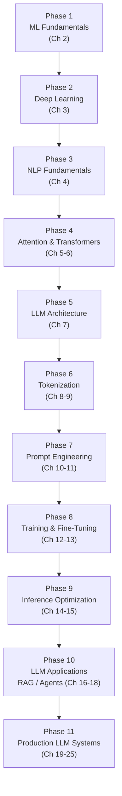

# Chapter 1: Introduction & Prerequisites

*You can already make an LLM answer a question. This course is about understanding why it answered the way it did — and what to do when it doesn't.*

## Learning Objectives

By the end of this chapter, you will be able to:

- Articulate, in concrete terms, the gap between *using* an LLM and *understanding* one — and name at least four engineering decisions that gap currently forces you to make blindly
- Self-assess your readiness across three axes (Python, math, LLM-usage familiarity) and know exactly which chapters will fill any gaps
- Explain the 11-phase learning roadmap this course follows, and why each phase is a hard dependency for the one after it
- Set up a working Python environment (PyTorch, Transformers, tiktoken, NumPy, Jupyter, Sentence-Transformers) capable of running every code example in this course
- Describe what CPU-only readers can expect to run locally, and where a GPU (or free-tier Colab/Kaggle GPU) becomes worth using
- Predict, phase by phase, what new engineering capability you unlock — so you can track your own progress independent of the chapter numbers
- Explain the study habits (build the projects, don't skip the math, revisit earlier chapters) that most reliably separate learners who finish this course with real capability from those who finish with a vague sense of familiarity

---

## Prerequisites for This Chapter

This is the entry chapter — there is no previous chapter, and nothing here assumes you've read anything else in this course. What it *does* assume, based on the audience this course is written for, is:

- **Software engineering fundamentals.** You're comfortable writing Python (functions, classes, list comprehensions, basic NumPy), calling REST APIs, using `pip`/virtual environments, and reading a stack trace. You don't need to be a Python expert — just fluent enough that seeing `torch.matmul(Q, K.transpose(-2, -1))` doesn't make you close the laptop.
- **Practical LLM usage.** You've called a chat completion API (OpenAI, Anthropic, or similar), written prompts, and you have at least a rough idea of what a "token" is, what "temperature" does, and what RAG or an "agent" refers to at a high level. You don't need to know *why* any of it works — that's the entire point of this course.
- **No prior ML/DL/math background is assumed.** Linear algebra, probability, and the calculus you need for backpropagation are all taught from scratch starting in [Chapter 2](./02-machine-learning-fundamentals.md). If you've never seen a dot product or a gradient, you are still in the right place — Section 2 below will tell you exactly what to expect and when.

If any of the software-engineering assumptions above feel shaky, this course will still work, but you'll move faster if you shore up basic Python first — there's no shortage of free resources for that, and it's outside this course's scope.

---

## 1. Why This Course Exists

### 1.1 The gap, stated plainly

If you're reading this, you've probably already shipped something with an LLM in it. Maybe it's a support chatbot, a RAG pipeline over internal docs, an agent that calls a few tools, or a fine-tuned classifier squeezed behind a FastAPI endpoint. You know how to write a system prompt, how to chunk documents, how to parse a tool-call response, maybe even how to spin up vLLM. None of that is in question.

Here's the gap: you can do all of that *without knowing what happens between the moment your prompt leaves your code and the moment tokens start streaming back*. For most applications, that's fine — the API is a black box by design, and treating it as one is a legitimate engineering choice for a lot of work. But at some point, almost every engineer who works seriously with LLMs hits a wall where the black box stops being enough:

- Your RAG chatbot's latency **triples** after a few turns of conversation, and you don't know whether that's the retriever, the prompt size, or something structural about how the model processes long context.
- You're asked to choose between **GPTQ, AWQ, and GGUF** quantization for a model you're about to self-host, and every blog post gives a different, confident-sounding answer with no explanation of the actual trade-off.
- Your agent framework's default `temperature=0.7` and `top_p=1.0` were "probably fine" until a downstream evaluator started flagging inconsistent outputs, and you have no principled way to reason about what to change.
- A teammate asks "why does doubling the context window increase memory usage so much more than doubling the batch size?" and you genuinely don't know — you've never heard of a KV cache.
- Leadership asks whether to fine-tune a smaller model or keep prompting a larger one, and you have no framework for that decision beyond "let's try both and see."

None of these are exotic scenarios. They are the ordinary Tuesday-afternoon questions that come up once you're operating LLM systems past the prototype stage. Answering them well — not by trial and error, not by copying whatever a blog post recommended last month, but by *reasoning from how the model actually works* — is what this course is for.

### 1.2 What understanding buys you, concretely

To make this less abstract, here is a direct list of engineering capabilities this course unlocks, each tied to a specific mechanism you'll learn and the chapter that teaches it:

| Capability | Mechanism you'll understand | Chapter |
|---|---|---|
| Debug why latency grows non-linearly with context length | Self-attention's O(n²) cost, KV cache growth | [5](./05-attention-and-self-attention.md), [7](./07-llm-architecture-and-decoding.md) |
| Choose a quantization format for a deployment target | INT8/GPTQ/AWQ/GGUF trade-offs (accuracy vs. speed vs. hardware) | [15](./15-quantization-and-speculative-decoding.md) |
| Tune sampling parameters deliberately instead of copying defaults | Softmax, temperature, top-k/top-p mechanics | [9](./09-sampling-and-generation-strategies.md) |
| Reason about context window vs. KV cache memory trade-offs | Decoder-only architecture, attention memory footprint | [7](./07-llm-architecture-and-decoding.md), [14](./14-inference-optimization.md) |
| Decide fine-tune vs. prompt vs. RAG for a given problem | Pretraining/SFT/RLHF pipeline, LoRA mechanics, retrieval trade-offs | [12](./12-pretraining-and-fine-tuning.md), [13](./13-parameter-efficient-fine-tuning.md), [16](./16-rag-and-vector-databases.md) |
| Explain token costs and truncation behavior to a product manager | BPE/tokenizer mechanics, vocabulary design | [8](./08-tokenization-deep-dive.md) |
| Design an agent that fails gracefully instead of looping forever | ReAct loop internals, tool-calling mechanics | [11](./11-tool-calling-and-structured-output.md), [17](./17-agents-and-multi-agent-systems.md) |
| Explain a production incident at the architecture level, not "the model was being weird" | The full stack, tokenizer → transformer → sampler → API | Every phase, cumulatively |

The throughline: **every one of these is currently a place where you either guess, copy a default, or escalate to someone else.** After this course, they become places where you reason from first principles.

### 1.3 What this course deliberately does *not* do

This is not a course on prompt engineering tricks, framework tutorials (LangChain today, something else next year), or how to get a specific model to behave. Those things change monthly and are covered lightly, in their proper place (Phases 7 and 10), as *applications* of the underlying mechanics — not as the point of the course. The point is durable: the Transformer architecture, attention, tokenization, and the training/inference pipeline have been stable substrates since 2017, and everything you build on top of them will keep changing under your feet. Understanding the substrate is what doesn't go stale.

---

## 2. Self-Assessment: Are You Ready?

Answer honestly — there's no scoring gate here, just a map of where you'll need to lean in.

### 2.1 Python comfort

Rate yourself against each of these. If you can do it without looking anything up, check it.

- [ ] Write a function with default arguments, `*args`/`**kwargs`, and type hints
- [ ] Create a class with an `__init__` and at least one method, and explain what `self` is
- [ ] Use NumPy to create an array, reshape it, and multiply two matrices
- [ ] Read a Python stack trace and identify which line actually raised the exception
- [ ] Create and activate a virtual environment, and explain why you'd want one
- [ ] Make an HTTP request with `requests` or an SDK client and handle a non-200 response

**If you checked 4+**: you're ready. Proceed as planned.
**If you checked 2-3**: you'll manage, but budget extra time for the code examples in Chapters 2-3; consider a short Python refresher in parallel.
**If you checked 0-1**: pause and spend a week on Python fundamentals first — this course assumes you can read and modify code without that being the hard part.

### 2.2 Math comfort

This is the one people worry about most, so the honest answer is: **you need none of it yet.** Rate yourself anyway, purely so you know what's coming.

- [ ] I can compute a dot product of two vectors by hand
- [ ] I know what a matrix multiplication produces (shapes, not just the mechanics)
- [ ] I can explain what a derivative measures, intuitively
- [ ] I know what a probability distribution is and that probabilities sum to 1
- [ ] I've heard the term "gradient descent" and have a rough mental picture of it

**If you checked all 5**: [Chapter 2](./02-machine-learning-fundamentals.md)'s math primer will be a fast refresher for you.
**If you checked 0**: also fine. [Chapter 2](./02-machine-learning-fundamentals.md) teaches vectors, matrices, and dot products from a blank page; [Chapter 3](./03-deep-learning-fundamentals.md) teaches derivatives and gradients the same way, always paired with a plain-language intuition and a worked numeric example before any notation. Nobody is assumed to arrive with this — it is taught, not assumed, and it's taught exactly once, early, so later chapters can build on it without re-deriving it.

The one thing worth being honest with yourself about: if formulas make you want to skip the section entirely, resist that urge specifically in Chapters 2-3. Everything after Chapter 6 leans on that foundation, and skimming it is the single most common reason people "finish" a course like this without being able to actually reason about a model's behavior later.

### 2.3 LLM usage familiarity

- [ ] I've called a chat completion API (OpenAI, Anthropic, or similar) programmatically, not just through a chat UI
- [ ] I can explain what a token roughly is, even informally ("a token is not quite a word")
- [ ] I know what a system prompt is and how it differs from a user message
- [ ] I've built or configured at least a basic RAG pipeline or used a framework that does (LangChain, LlamaIndex, etc.)
- [ ] I've heard of "temperature" and "top-p" as generation settings, even if I don't know exactly what they do mathematically

**If you checked 3+**: you're squarely in this course's intended audience.
**If you checked 0-2**: spend an afternoon with any major provider's API quickstart before starting — this course explains *why* prompts, tokens, and API parameters behave the way they do, but assumes you've encountered them as a user first.

---

## 3. The 11-Phase Roadmap: Why the Order Matters

The [course index](./00-index.md) organizes the 25 chapters into 10 milestone phases. Zoomed in one level further, the actual *conceptual* dependency chain — the one that determines why you can't shuffle the order — has 11 links. Each phase is a prerequisite for the next not by course design but because the *concepts themselves* depend on each other. Below is the chain, with the "why can't I skip this" reasoning made explicit for each link.



**Phase 1 → 2: ML Fundamentals → Deep Learning.** You can't understand *why* a neural network is a good idea until you understand the general problem it's solving — learning a function from data, generalization, overfitting, bias-variance. Deep learning is a specific, very successful *family* of solutions to that general problem; the general problem has to come first or "why do we need so many layers" has no grounding.

**Phase 2 → 3: Deep Learning → NLP Fundamentals.** Before you can appreciate why Transformers were a breakthrough, you need to see what came before them and why it fell short — bag-of-words, Word2Vec, RNNs/LSTMs processing text one token at a time. Deep learning (backprop, gradients, loss functions) is the machinery that trains *all* of these, including the older, weaker ones. You need that machinery in hand before you can see precisely where classic NLP hit its ceiling.

**Phase 3 → 4: NLP Fundamentals → Attention & Transformers.** The Transformer wasn't invented in a vacuum — it was invented to solve a specific, named pain point of RNNs (sequential processing, vanishing gradients over long sequences, no way to look far back efficiently). If you haven't seen that pain point demonstrated first, "attention" arrives as an arbitrary trick instead of an obvious answer to a problem you've just watched fail.

**Phase 4 → 5: Attention & Transformers → LLM Architecture.** Every modern LLM (GPT, Llama, Claude, Qwen, Mistral) is a decoder-only Transformer with specific modifications (RoPE, KV cache, particular normalization choices). You cannot understand *why* those modifications exist without first knowing the vanilla Transformer they're modifying.

**Phase 5 → 6: LLM Architecture → Tokenization.** The architecture defines what a "token" even is structurally — a row in an embedding table, a position the model attends over, an entry in a fixed vocabulary. Tokenization (BPE, WordPiece, SentencePiece) is the algorithm that decides *which* strings become which tokens, and that decision only makes sense once you know what a token has to be able to do inside the architecture.

**Phase 6 → 7: Tokenization → Prompt Engineering.** Prompt engineering is, underneath the techniques, engineering around tokenization and sampling behavior — why few-shot examples cost tokens, why certain delimiters confuse a tokenizer, why "count to 10" sometimes fails on models with certain tokenizers. Skipping straight to prompting techniques (which most practitioners do) is exactly the "using without understanding" gap this course exists to close.

**Phase 7 → 8: Prompt Engineering → Training & Fine-Tuning.** Once you can reliably get a *pretrained* model to do what you want via prompting, you're equipped to recognize the cases prompting *can't* solve — and those are precisely the cases fine-tuning (SFT, RLHF, DPO, LoRA) exists for. Understanding training also requires everything from Phases 1-2 (loss functions, gradients, optimizers) applied at LLM scale.

**Phase 8 → 9: Training & Fine-Tuning → Inference Optimization.** You can't reason about inference optimizations (quantization, speculative decoding, PagedAttention) without knowing what's actually being optimized — the same forward pass, weights, and KV cache mechanics that training and architecture chapters established. Quantization in particular is a direct consequence of how weights are represented after training.

**Phase 9 → 10: Inference Optimization → LLM Applications (RAG/Agents).** Production RAG and agent systems make constant latency/cost/quality trade-offs — how many documents to retrieve, how many agent steps to allow, whether to batch requests — and those trade-offs are inference-optimization decisions in disguise. Building agents before understanding inference cost is how teams end up with agent loops that are correct but financially and operationally unsustainable.

**Phase 10 → 11: LLM Applications → Production LLM Systems.** Finally, you can't productionize (observability, security, cost controls, evaluation) a system whose components — retrieval, generation, tool calls — you don't yet understand well enough to instrument correctly. Production engineering is the last mile precisely because it wraps everything built in the previous ten phases.

The pattern across all eleven links is the same: **each phase answers the "why" that the next phase's practitioners usually take on faith.** That's the gap from Section 1, phase by phase.

---

## 4. What You'll Be Able to Do After Each Phase

A concrete preview, so you can track your own progress independent of chapter numbers:

| Phase | After completing it, you can... |
|---|---|
| 1. ML Fundamentals | Explain bias-variance trade-off; pick a classical algorithm (regression, trees, clustering) for a given problem; read a confusion matrix |
| 2. Deep Learning | Explain what backpropagation actually computes; describe what Adam does differently from plain SGD; explain why deep networks need non-linear activations |
| 3. NLP Fundamentals | Explain why Word2Vec embeddings work; describe RNN/LSTM limitations; explain why "attention" was needed before ever seeing its math |
| 4. Attention & Transformers | Draw the full Transformer architecture from memory, labeling every block (multi-head attention, LayerNorm, residual connections, feed-forward) |
| 5. LLM Architecture | Trace a prompt through tokenizer → embeddings → transformer layers → logits → sampled token; explain RoPE and KV cache well enough to reason about context-length/latency trade-offs |
| 6. Tokenization | Implement a BPE tokenizer from scratch; explain token economics (why some languages/formats cost more tokens); choose sampling parameters deliberately |
| 7. Prompt Engineering | Design a prompt with structured output and a tool-calling flow that fails predictably rather than silently |
| 8. Training & Fine-Tuning | Explain pretraining vs. SFT vs. RLHF vs. DPO; fine-tune a small model with LoRA/QLoRA and know why it works with so few trainable parameters |
| 9. Inference Optimization | Explain how vLLM's PagedAttention and continuous batching improve throughput; choose a quantization format (GPTQ/AWQ/GGUF) for a given deployment target |
| 10. LLM Applications | Build a RAG pipeline and a ReAct-style agent, and diagnose why either one is returning bad results at the architecture level |
| 11. Production LLM Systems | Deploy a streaming LLM API with rate limiting, caching, observability, and security controls, and reason about its cost per request |

---

## 5. Environment Setup

You'll want a working Python environment before Chapter 2's first code example. Here's the minimum viable setup.

### 5.1 Python version

Use **Python 3.10 or newer**. Most of the libraries this course relies on (`torch`, `transformers`) have dropped support for older versions, and newer Python has better error messages for the kind of shape-mismatch bugs you'll hit when working with tensors.

```bash
python3 --version   # should print 3.10.x or higher
```

### 5.2 Create an isolated environment

Don't install these packages into your system Python — use a virtual environment so this course's dependencies never collide with anything else on your machine.

```bash
python3 -m venv llm-course-env
source llm-course-env/bin/activate     # on Windows: llm-course-env\Scripts\activate
```

### 5.3 Install the core libraries

```bash
pip install --upgrade pip
pip install torch transformers tiktoken numpy jupyter sentence-transformers
```

What each one is for, so the install list isn't a black box either:

| Package | Used for | First needed in |
|---|---|---|
| `torch` | Tensor math, autograd, the substrate everything else sits on | Chapter 3 |
| `transformers` | Loading pretrained models/tokenizers (Hugging Face) | Chapter 4 |
| `tiktoken` | OpenAI's BPE tokenizer, for hands-on tokenization exercises | Chapter 8 |
| `numpy` | Vector/matrix arithmetic before we bring in `torch`'s autograd | Chapter 2 |
| `jupyter` | Interactive notebooks for the worked examples | Chapter 2 onward |
| `sentence-transformers` | Pretrained embedding models for NLP/RAG exercises | Chapter 4, 16 |

Verify the install:

```bash
python3 -c "import torch, transformers, tiktoken, numpy; print('torch', torch.__version__); print('transformers', transformers.__version__); print('OK')"
```

### 5.4 CPU vs. GPU — what to actually expect

This is the question that stops people before they start, so let's be direct about it: **you do not need a GPU for the vast majority of this course.**

- **Chapters 2-11 (ML fundamentals through prompt engineering/tool calling)**: every code example is designed to run comfortably on a laptop CPU in seconds to low minutes. You're working with toy datasets, small tensors, tiny pretrained models (things like `all-MiniLM-L6-v2` or `distilgpt2`), and tokenizer internals — none of this needs a GPU.
- **Chapter 12-13 (training/fine-tuning)**: conceptual understanding and small-scale LoRA fine-tuning of a small model (in the 100M-1B parameter range) can run on CPU, slowly, or on a free-tier Colab/Kaggle GPU comfortably. A local consumer GPU (8GB+ VRAM) makes this pleasant rather than merely possible.
- **Chapter 14-15 (inference optimization: vLLM, quantization)**: some of vLLM's headline features (continuous batching, PagedAttention) are demonstrated conceptually and with small models; running them meaningfully at production scale benefits from GPU access, but the *concepts* — which is the actual point of this course — are teachable and testable without one.
- **Chapter 24 (capstone)**: if you want to deploy a genuinely production-shaped system with a self-hosted model, budget for either a cloud GPU instance (a single L4/A10 is plenty for a 7-8B model at INT4/INT8) or lean on hosted inference APIs, which is a legitimate and common architectural choice.

If you don't have local GPU access, **Google Colab's free tier** and **Kaggle Notebooks' free GPU quota** are both sufficient for every exercise in this course that benefits from a GPU. Note it here once so you don't need to solve it again per chapter.

---

## 6. Worked Example: Verifying Your Environment End-to-End

Rather than just checking package versions, let's verify the whole pipeline works by loading a real tokenizer and a real tiny model, and running one forward pass — the exact operation you'll be doing (at growing scale) for the rest of this course.

```python
# verify_environment.py
import torch
from transformers import AutoTokenizer, AutoModelForCausalLM

print(f"PyTorch version: {torch.__version__}")
print(f"CUDA available:  {torch.cuda.is_available()}")
device = "cuda" if torch.cuda.is_available() else "cpu"
print(f"Using device:    {device}")

# distilgpt2 is a small (82M parameter) GPT-2 variant -- fast enough for a CPU smoke test
model_name = "distilgpt2"
tokenizer = AutoTokenizer.from_pretrained(model_name)
model = AutoModelForCausalLM.from_pretrained(model_name).to(device)

prompt = "The gap between using an LLM and understanding one is"
inputs = tokenizer(prompt, return_tensors="pt").to(device)

print(f"\nPrompt: {prompt!r}")
print(f"Token IDs: {inputs['input_ids'].tolist()[0]}")
print(f"Token count: {inputs['input_ids'].shape[1]}")

with torch.no_grad():
    output_ids = model.generate(
        **inputs,
        max_new_tokens=12,
        do_sample=False,   # greedy decoding -- deterministic, reproducible output
    )

generated_text = tokenizer.decode(output_ids[0], skip_special_tokens=True)
print(f"\nGenerated: {generated_text!r}")
```

**Expected output** (exact token IDs and continuation text will vary slightly by `transformers` version, but the shape of the output should match):

```
PyTorch version: 2.3.0
CUDA available:  False
Using device:    cpu

Prompt: 'The gap between using an LLM and understanding one is'
Token IDs: [464, 7625, 1022, 1262, 281, 27140, 44, 290, 4547, 530, 318]
Token count: 11

Generated: 'The gap between using an LLM and understanding one is that the former is a lot more complex'
```

Three things worth noticing already, as a preview of chapters to come:

1. **"LLM" became more than one token** (`27140, 44` — this exact splitting is a tokenizer artifact you'll fully understand in Chapter 8). Uncommon words and acronyms routinely split into multiple sub-word tokens; this is exactly why token counts don't match word counts, a detail every cost-conscious LLM engineer eventually needs.
2. **`do_sample=False`** gave you a deterministic, greedy output — the model always picked its single highest-probability next token. Chapter 9 explains exactly what changes (and why you'd want it to) once you turn sampling back on.
3. **This ran on CPU in a couple of seconds** for an 82M-parameter model. Production LLMs are 1,000-1,000,000x larger — the *mechanism* you just exercised is identical; only the scale, and the infrastructure needed to serve that scale (Phase 9), changes.

If this script runs and prints something similar, your environment is ready for the rest of the course.

---

## 7. How to Use This Course

- **Build the projects, don't just read about them.** Every phase from Chapter 5 onward pairs with a small project (tokenizer visualizer, next-token predictor, LoRA fine-tune, RAG chatbot, research agent — see the [course index](./00-index.md) timeline). Reading an explanation of KV cache and *watching* memory usage grow as you increase context length in your own script are different levels of understanding; only one of them survives being asked a follow-up question in a design review.
- **Don't skip the math sections**, even in Chapters 2-3 where it's tempting. They're written to be self-contained and are the one investment that pays off in every single later chapter — attention (Chapter 5), backpropagation through billions of parameters (Chapter 12), and even quantization error analysis (Chapter 15) are all, underneath, applications of the same handful of ideas taught once, early, and never re-derived from scratch later.
- **Revisit earlier chapters when later ones reference them.** This course is written so that, e.g., Chapter 14 (inference optimization) assumes you remember KV cache from Chapter 7 rather than re-explaining it. If a concept feels hazy when it's referenced again, that's a signal to go back, not a sign the later chapter is badly written.
- **Use the knowledge checks honestly.** They're not graded, but if you can't answer a chapter's knowledge check without looking anything up, that's useful information — it means the *next* chapter's dependency on this one hasn't fully landed yet.
- **Expect roughly 8-10 weeks** at 1.5-2 hours/day, per the [course index timeline](./00-index.md#estimated-learning-timeline-8-10-weeks), or 5-6 weeks compressed. This chapter and Chapter 2 are the slowest start; the pace usually picks up once the math primer is behind you.

---

## Real-World Scenario

**Scenario:** An engineer, Priya, ships a RAG-based support chatbot. In testing with short conversations, it's fast — sub-second responses. Three weeks after launch, support tickets start coming in about the bot "hanging" during longer troubleshooting conversations, sometimes taking 8-10 seconds per response by turn six or seven of a conversation.

Priya's first instinct, having only ever *used* LLM APIs, is to suspect the vector database (maybe retrieval is slow) or the network (maybe it's a regional latency spike). She adds logging around the retrieval call and the API call separately. The retrieval call is consistently fast — under 50ms. The API call itself is what's slow, and it's getting *slower* as the conversation grows, even though each individual user message is short.

Without understanding what's happening inside the model, this looks like a mystery: the *input* per turn isn't growing much, so why would *latency per turn* grow? The honest answer available to her at this point is "I don't know, let me ask the vendor" — which is a real, common, and expensive failure mode: escalating an architectural question to someone else because the underlying mechanism was never learned.

The actual cause, which this course covers directly (Chapters 5 and 7): every turn, the model has to attend over the *entire conversation history* — the whole growing context, not just the new message — and self-attention's cost grows roughly quadratically with sequence length. Worse, without prefix/KV caching configured correctly on the serving side, the model may be recomputing attention over the *entire* prior conversation from scratch on every single new turn, rather than reusing what it already computed. That's the actual mechanism behind "it gets slower as the conversation grows" — not a network blip, not the vector database, but a direct, predictable consequence of how attention and the KV cache work.

Once Priya understands this (Chapter 7's KV cache section, Chapter 14's inference optimization), the fix set becomes obvious and targeted: verify the serving stack (e.g., vLLM) is actually reusing the KV cache across turns instead of recomputing it, cap conversation history length or summarize older turns, and set expectations with product about latency scaling with context length as an inherent trade-off — not a bug to be silently "fixed" by throwing more compute at it.

**The lesson:** the black-box version of this engineer spends a week guessing and escalating. The systems-engineer version diagnoses the mechanism in an afternoon, because the mechanism was never a mystery to begin with. That gap is precisely what the next twenty-four chapters close.

---

## Best Practices

- **Do the self-assessment in Section 2 honestly, once, and move on** — it's a map, not a gate. Nobody needs a perfect score to start Chapter 2.
- **Set up your environment (Section 5) before Chapter 2**, not when you first hit a code block — debugging a broken `pip install` mid-lesson breaks flow far more than doing it now, in a chapter with no other content competing for your attention.
- **Keep a running note of "things I don't fully understand yet"** as you go. This course is cumulative by design; a note like "still fuzzy on why softmax needs the /√d scaling" from Chapter 5 is exactly the kind of thing that resolves itself naturally by Chapter 7 — but only if you tracked it instead of quietly moving on.
- **Prefer the small/local models suggested in each chapter's examples** (`distilgpt2`, `all-MiniLM-L6-v2`, etc.) over jumping straight to the largest model you can access. The mechanism is identical at every scale; the small models just let you iterate in seconds instead of minutes, which matters far more for learning than for production.
- **Treat the knowledge checks and exercises as load-bearing**, not optional flourishes at the end of the chapter — they are where the "I read about it" gap and the "I can reason about it" gap actually get closed.

---

## Common Mistakes

- **Skipping Chapters 2-3 because "I've built LLM apps, I don't need ML basics."** This is the single most common mistake for this course's exact audience. Practical LLM-application experience and understanding *why* a transformer works are almost entirely non-overlapping skills — you can have deep expertise in one and none in the other. The math and ML fundamentals chapters are short and specifically scoped to what later chapters need; skipping them tends to surface later as confusion in Chapter 5 or 7 that's much more expensive to debug retroactively.
- **Jumping straight to Chapter 16 (RAG) or 17 (Agents)** because that's the "useful" part. Those chapters assume you already understand tokenization, attention, and context windows well enough to reason about chunking, retrieval quality, and agent loop cost — skipping ahead means re-learning those chapters' content in a much less structured way, mid-crisis, during an actual production incident.
- **Treating this as a reading-only course.** Reading about backpropagation and running the actual three-line gradient computation in Chapter 3 produce very different levels of retention. The code examples are short precisely so there's no excuse not to run them.
- **Assuming you need a GPU to start, and stalling on infrastructure before writing a line of course code.** As Section 5.4 covers, you don't — for the first eleven chapters, in particular, a laptop is sufficient.
- **Ignoring the "what you'll be able to do" table in Section 4** as a progress check. Without some way to measure "am I actually gaining capability or just turning pages," it's easy to reach Chapter 20 and realize a concept from Chapter 5 never actually landed.

---

## Summary

- This course exists to close the gap between **using** LLMs (prompting, RAG, agents) and **understanding** them well enough to debug, optimize, and design LLM systems instead of guessing or cargo-culting defaults.
- You don't need prior ML or math background — that's taught from scratch starting in Chapter 2 — but you do need working Python and hands-on LLM-usage familiarity, both self-assessed in Section 2.
- The course follows an **11-phase roadmap** (ML → Deep Learning → NLP → Attention/Transformers → LLM Architecture → Tokenization → Prompt Engineering → Training/Fine-Tuning → Inference Optimization → LLM Applications → Production Systems), where each phase is a genuine conceptual prerequisite for the next, not just a pedagogical ordering choice.
- Your environment needs Python 3.10+, a virtual environment, and `torch transformers tiktoken numpy jupyter sentence-transformers` — and **the large majority of this course runs comfortably on a CPU**; GPU access (including free Colab/Kaggle tiers) only starts to matter from Chapter 12 onward.
- The habits that separate people who finish this course with real capability from people who finish with vague familiarity: build the projects, don't skip the math, and revisit earlier chapters when later ones reference them.

---

## Knowledge Check

1. Name three concrete engineering decisions (not covered by "just knowing more ML in general") that understanding LLM internals directly improves, and identify which phase of the roadmap teaches the mechanism behind each one.
2. Why must Phase 3 (NLP Fundamentals) come before Phase 4 (Attention & Transformers) specifically — what would be missing if you read the Transformer chapter first?
3. You score 2/6 on the Python self-assessment and 5/6 on the LLM-usage self-assessment. What does this course recommend you do before starting Chapter 2, and why?
4. Explain, in your own words, why an 82M-parameter model like `distilgpt2` is a legitimate tool for learning transformer mechanics even though no one would deploy it in production.
5. A colleague says "I don't need the math chapters, I'll just learn the math I need when a later chapter uses it." What's the specific risk with that approach, given how this course is structured?
6. In the Real-World Scenario, why did Priya's initial hypotheses (vector database, network latency) fail to explain the symptom, and what category of mechanism did the actual explanation come from?

---

## Hands-On Exercise

1. Complete the three self-assessment checklists in Section 2 honestly. Write down, for each of the three areas, one concrete gap you found (or write "none" if you checked everything).
2. Set up your environment following Section 5: create a virtual environment, install the six packages, and run the version-check one-liner. Paste the output into a notes file you'll keep for this course.
3. Run the full `verify_environment.py` script from Section 6.
   - Change the prompt to something of your own choosing, keep `do_sample=False`, and re-run it. Note how many tokens your prompt produced versus how many words it contains — are they equal?
   - Change `max_new_tokens` to `30` and re-run. Does generation quality noticeably degrade the longer it runs? (You're not expected to explain *why* yet — Chapter 9 covers that — just observe it.)
4. Re-read the "What You'll Be Able to Do After Each Phase" table (Section 4). Pick the single row that excites you most, and write one sentence on why — you'll revisit this note at the end of the course to see if it changed.
5. **Bonus:** If you have access to a GPU (local, Colab, or Kaggle), rerun the verification script there and compare the wall-clock time for the `model.generate()` call against your CPU run. This is your first hands-on data point for the CPU-vs-GPU discussion in Section 5.4 — keep the numbers, you'll have much bigger ones to compare against by Chapter 14.

---

## Further Reading

- Jay Alammar & Maarten Grootendorst, *Hands-On Large Language Models* (O'Reilly, 2024) — the most approachable practitioner-oriented book covering exactly the "using to understanding" transition this course is built around
- Lewis Tunstall, Leandro von Werra, Thomas Wolf, *Natural Language Processing with Transformers* (O'Reilly, 2022) — deeper, code-first treatment of the Hugging Face ecosystem you just installed in Section 5
- Ian Goodfellow, Yoshua Bengio, Aaron Courville, *Deep Learning* (MIT Press, free online at [deeplearningbook.org](https://www.deeplearningbook.org/)) — the canonical deep learning reference for when Chapters 2-3 want more rigor than a single chapter can offer
- [Hugging Face NLP Course](https://huggingface.co/learn/nlp-course) — free, hands-on, and uses the exact `transformers` library this course is built on
- Andrej Karpathy, [*Neural Networks: Zero to Hero*](https://karpathy.ai/zero-to-hero.html) (video series) — builds backpropagation and a GPT from raw Python/PyTorch on screen; an excellent companion once you reach Chapters 3 and 6
- Stanford [CS224N (NLP with Deep Learning)](http://web.stanford.edu/class/cs224n/) and [CS25 (Transformers United)](https://web.stanford.edu/class/cs25/) — free lecture materials that go deeper than this course's pace allows, useful once you know which topic you want to go deeper on
- 3Blue1Brown, [*Neural Networks* video series](https://www.3blue1brown.com/topics/neural-networks) — the best visual intuition available for the linear algebra and gradient concepts Chapters 2-3 formalize
- [PyTorch official tutorials](https://pytorch.org/tutorials/) — reference documentation for the library that underlies almost every code example in this course

---

<div style="display:flex;justify-content:space-between;align-items:center;">
  <span></span>
  <a href="./00-index.md">🏠 Index</a>
  <a href="./02-machine-learning-fundamentals.md">Next: Machine Learning Fundamentals →</a>
</div>
