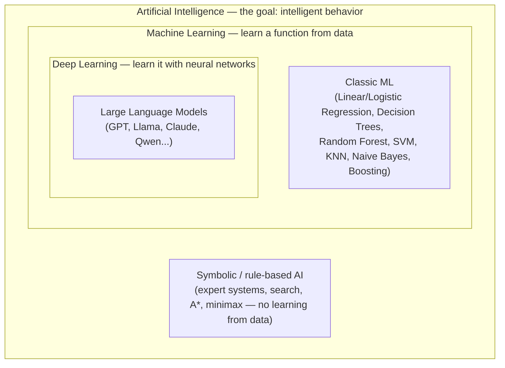

# Chapter 2: Machine Learning Fundamentals

*Before you can understand why a transformer predicts the next token, you need to understand why any model predicts anything at all.*

## Learning Objectives

By the end of this chapter, you will be able to:

- Explain the AI ⊃ ML ⊃ DL nesting precisely, and place LLMs correctly within it
- Distinguish supervised, unsupervised, and reinforcement learning, with a concrete example of each
- Define features, labels, and the train/validation/test split, and explain why each split exists
- Diagnose a model as underfitting or overfitting from its bias-variance behavior
- Compute accuracy, precision, recall, F1 score, and MSE/MAE from a confusion matrix by hand
- Choose an appropriate classic ML algorithm for a given problem shape, and justify the choice
- Perform vector/matrix operations (dot product, matrix multiplication) that underlie every neural network layer
- Explain, at an intuitive level, why gradients — not just derivatives — are the mechanism that lets models learn

---

## Prerequisites for This Chapter

Chapter 1 got your environment set up and gave you the roadmap: ten phases, twenty-five chapters, ending with you being able to explain and operate a production LLM system end to end. You now know *where* this course is going. This chapter starts building the foundation it stands on.

Nothing here requires a GPU, a training run, or even much code. What it requires is a shift in mental model: you already think like a software engineer, where you write explicit rules ("if the email contains 'viagra', mark as spam") and the computer executes them deterministically. Machine learning inverts that. Instead of writing the rules, you show the computer thousands of examples and let it *infer* the rules statistically. Every concept in this chapter — features, labels, training splits, bias/variance, evaluation metrics, classic algorithms, and the math underneath — exists to answer one question: **how do we responsibly let a machine infer rules from data, and how do we know if it inferred good ones?**

That question is exactly the one you'll be asking, at a much larger scale, about GPT, Llama, and Claude from Chapter 3 onward. A large language model is not a fundamentally different kind of thing from the classifiers in this chapter — it is the same statistical learning idea, scaled up by roughly nine orders of magnitude in parameters and data, running on a different family of algorithms (neural networks, starting next chapter). If this chapter feels almost too basic given that you're here for LLMs, resist that instinct — every term introduced here (loss, overfitting, validation set, gradient) reappears, unchanged in meaning, when you're debugging a fine-tuning run in Chapter 12.

No new software setup is required. A Python REPL or notebook (from your Chapter 1 environment) is useful for the worked examples but not mandatory to follow along.

---

## 1. What Is AI? The AI ⊃ ML ⊃ DL Nesting

### 1.1 The intuition first

Say the word "AI" to ten different people and you'll get ten different mental pictures: a chess engine, a self-driving car, a chatbot, a robot from a movie. That's because **Artificial Intelligence (AI)** is not one technique — it's a *goal*: making a machine behave in ways that would be considered intelligent if a human did them. AI is the destination, not the vehicle.

**Machine Learning (ML)** is one vehicle for reaching that destination — arguably the most successful one in the last fifteen years. Instead of a human explicitly programming intelligent behavior rule by rule, ML lets a system learn a function from data: show it enough examples of inputs and correct outputs, and it statistically discovers the mapping between them.

**Deep Learning (DL)** is a sub-family of ML that uses a specific class of models — artificial neural networks, particularly ones with many ("deep") layers — to learn that mapping. It is not a different goal or a different philosophy from ML; it's a specific, extremely effective architectural choice within ML.

### 1.2 Why the nesting matters, concretely



Every box is a strict subset of the box around it:

- **AI is the superset**: it includes things that aren't ML at all. A chess engine using minimax search with hand-coded heuristics is "AI" (it exhibits intelligent behavior) but classically involved *no learning from data* — a human encoded the strategy directly. Rule-based expert systems from the 1980s are the same: intelligent-seeming behavior, zero statistical learning.
- **ML is a subset of AI**: it specifically means learning the behavior from data rather than hand-coding it. Classic algorithms like Linear Regression, Decision Trees, and SVMs (Section 7) are ML, but they are *not* Deep Learning — they don't use neural networks.
- **DL is a subset of ML**: it is ML that specifically uses (typically deep, multi-layered) neural networks as the learning mechanism, covered starting Chapter 3.
- **LLMs sit inside all three, at the deepest point of the nesting.** A large language model is: an AI system (it exhibits intelligent-seeming behavior — conversation, reasoning, code generation) that is built using Machine Learning (it learned its behavior from data, specifically by predicting the next token across trillions of words of text) using Deep Learning specifically (a Transformer, which is a particular neural network architecture covered in Chapter 6). There is no part of a modern LLM's core capability that was hand-coded rule by rule — the "rules" of grammar, facts, and reasoning patterns it exhibits were all *induced statistically* from data, the same way a much smaller Logistic Regression model induces "spam vs. not spam" rules from a mailbox.

This is why Chapter 1 said you don't need prior ML experience but you do need this chapter: everything from here to Chapter 25 is elaborating on the innermost box. Get the outer boxes straight now, and the rest of the course is a zoom-in, not a topic change.

### 1.3 A word on terminology drift

In casual usage today, "AI" often colloquially means "generative AI / LLMs" specifically — that's a symptom of LLMs' visibility, not a redefinition of the term. Precision matters in this course: when you say "AI" in a design review, know whether you mean the umbrella term or specifically the deep-learning-based generative system you're integrating. Using them interchangeably is a common source of miscommunication with non-technical stakeholders, and occasionally with technical ones too.

---

## 2. The Three Learning Paradigms

Machine learning splits into three main paradigms based on *what kind of feedback the learning process gets*. Getting this taxonomy solid now pays off directly in Chapter 12, where you'll learn that LLM training is actually a **sequence of all three**, applied in stages.

### 2.1 Supervised Learning

**Definition:** the model learns from labeled examples — each input comes with the "correct answer" attached. The model's job is to learn a function that maps inputs to outputs accurately enough to generalize to new, unseen inputs.

**Concrete example:** predicting house prices. You have historical data: for 10,000 houses, you know the square footage, number of bedrooms, location, and — crucially — the price it actually sold for (the label). You train a model on these input-output pairs. Given a *new* house's square footage/bedrooms/location (no price attached), the model predicts a price. Every time the model is wrong during training, you can measure exactly how wrong (predicted $410K vs. actual $450K) and nudge the model to do better next time.

**Where you've already used this without calling it that:** classifying an email as spam/not-spam, tagging a support ticket by category, predicting churn — all supervised, because historical labeled examples exist.

**Foreshadowing:** the vast majority of an LLM's usable behavior — its ability to follow instructions, format outputs in JSON, refuse harmful requests — comes from **Supervised Fine-Tuning (SFT)** in Chapter 12: humans write example (instruction, ideal response) pairs, and the model is supervised-trained on them, exactly like the house-price model above, just with text instead of numbers.

### 2.2 Unsupervised Learning

**Definition:** the model learns from data that has *no* labels — there's no "correct answer" given. Instead, the model finds structure, patterns, or groupings that exist in the data on its own.

**Concrete example:** customer segmentation. An e-commerce company has purchase histories for 500,000 customers but no predefined "customer type" labels. A clustering algorithm (like k-means) groups customers into, say, 5 clusters based on purchasing patterns — cluster 1 might turn out to be "frequent small purchases," cluster 2 "rare large purchases," and so on. Nobody told the algorithm these categories existed; it discovered them from the structure of the data.

**Where this shows up in LLMs:** the initial **pretraining** stage (Chapter 12) of an LLM is often described loosely as "unsupervised" — the model is shown raw internet text with no human-provided labels, and it learns statistical structure (grammar, facts, reasoning patterns) purely from next-token prediction. Technically, next-token prediction is *self-supervised* (Section 2.4) rather than purely unsupervised, but the "no human labeled this" spirit is the same, and it's why pretraining can scale to trillions of tokens — nobody has to hand-label the internet.

### 2.3 Reinforcement Learning (RL)

**Definition:** the model (called an **agent**) learns by taking actions in an environment and receiving a **reward signal** — not a labeled "correct answer" for each input, but feedback on how good or bad an outcome was. The agent's goal is to learn a policy (a strategy for choosing actions) that maximizes cumulative reward over time, often through trial and error.

**Concrete example:** a game-playing agent learning to play a video game. It doesn't get told "the correct move in this exact frame is 'jump'" (that would be supervised learning). Instead, it tries moves, observes that some sequences of moves lead to a higher score (positive reward) and others lead to losing a life (negative reward), and gradually learns a policy that favors reward-generating action sequences. AlphaGo and classic Atari-playing agents are the canonical examples.

**Foreshadowing:** Chapter 12 covers **RLHF (Reinforcement Learning from Human Feedback)** — the stage where an LLM's raw next-token-prediction abilities get shaped into being *helpful, harmless, and honest*. Human raters compare pairs of model responses and say which is better; that preference signal trains a **reward model**, and the LLM is then updated via RL (specifically, algorithms like PPO, or more modern alternatives like DPO) to produce responses the reward model scores highly. This is precisely the "agent takes actions, receives reward signal, adjusts policy" loop described above — the "environment" is a conversation, the "actions" are which tokens to generate, and the "reward" comes from a model trained on human preferences. Keep this mental model in your pocket; Chapter 12 will feel like a rerun of this section with more machinery attached.

### 2.4 A quick note on the boundary case: self-supervised learning

You'll encounter this term constantly in LLM contexts, so it's worth flagging now even though it's not one of the three "big" paradigms. **Self-supervised learning** generates its own labels *from* the data, with no human annotation. Next-token prediction is the textbook example: given the sentence "The cat sat on the ___", the "label" for predicting the missing word is just... the next word in the original text, which you already have. No human sat down and labeled "cat" → "sat." The data labels itself. This is why LLM pretraining can consume the entire scrapable internet — the supervision is free, generated automatically from raw text.

### 2.5 Comparison at a glance

| Paradigm | Feedback signal | Goal | LLM connection |
|---|---|---|---|
| Supervised | Labeled (input, correct output) pairs | Learn accurate input→output mapping | Supervised Fine-Tuning (SFT), Ch. 12 |
| Unsupervised | No labels; find structure | Discover patterns/groupings | Related concept behind embeddings, Ch. 4 |
| Self-supervised | Labels generated automatically from the data itself | Learn general representations | Pretraining via next-token prediction, Ch. 12 |
| Reinforcement Learning | Reward signal from actions taken | Maximize cumulative reward | RLHF / DPO alignment stage, Ch. 12 |

---

## 3. Features, Labels, and the Anatomy of a Training Example

### 3.1 Features

A **feature** is a measurable input variable the model uses to make a prediction. If you're predicting house prices, your features might be: square footage, number of bedrooms, zip code, year built, distance to nearest school. Collectively, one house's features form a **feature vector** — literally a list of numbers, e.g. `[1800, 3, 94107, 1998, 0.4]`.

This should sound familiar if you've touched embeddings already (or will, in Chapter 4 of this course) — an embedding *is* a feature vector, just one that a neural network learned to construct automatically instead of a human hand-picking "square footage" and "bedrooms." **Feature engineering** — the classic-ML-era practice of a human manually deciding and computing which numbers matter — is precisely the step deep learning largely automated away, which is one reason DL displaced classic ML for unstructured data like text and images.

### 3.2 Labels

A **label** (also called the **target** or **ground truth**) is the correct answer associated with a training example — the thing the model is trying to predict. In the house-price example, the label is the actual sale price. In a spam classifier, the label is `spam` or `not spam`. Labels only exist in supervised learning (Section 2.1) — by definition, unsupervised learning has none.

### 3.3 One training example, fully anatomized

```
Training example #4,217
┌─────────────────────────────────────────┐
│ Features (x):                            │
│   sqft        = 1,800                    │
│   bedrooms    = 3                        │
│   zip_code    = 94107                    │
│   year_built  = 1998                     │
│   dist_school = 0.4 miles                │
├─────────────────────────────────────────┤
│ Label (y):                                │
│   sale_price  = $452,000                  │
└─────────────────────────────────────────┘
```

The entire supervised learning process, at its core, is: given thousands of `(x, y)` pairs like this, find a function `f` such that `f(x) ≈ y`, and — this is the part that separates ML from simple curve-fitting exercises — such that `f` also produces good predictions on houses it has *never seen*. That last requirement is what the rest of this chapter is really about.

---

## 4. Training, Validation, and Test Sets — Why Three Splits?

### 4.1 The problem: you can't grade your own homework

If you train a model on all 10,000 house examples and then evaluate how well it predicts prices *on those same 10,000 houses*, you'll get a misleadingly great score. The model can partly "memorize" quirks of the specific data it saw rather than learning the general relationship between house features and price. It's the equivalent of a student memorizing the answer key instead of learning the material — they'll ace that exact test and fail a new one covering the same material with different questions.

### 4.2 The standard three-way split

```
                     All labeled data (100%)
                              │
        ┌─────────────────────┼─────────────────────┐
        ▼                     ▼                     ▼
   Training Set          Validation Set          Test Set
     (~70-80%)              (~10-15%)             (~10-15%)
        │                     │                     │
  Model learns          Tune hyperparameters,   Final, one-time
  parameters from        pick best model         "real world"
  this data              variant, catch          performance
                          overfitting early        estimate
```

- **Training set**: the data the model actually learns from — its parameters get adjusted based on this data, repeatedly, until performance stabilizes.
- **Validation set**: held-out data the model never trains on directly, used *during development* to make decisions — which model architecture, which hyperparameters (e.g., how many trees in a Random Forest, what learning rate), when to stop training. Because you look at validation performance repeatedly while iterating, you can — subtly — end up indirectly overfitting to the validation set too, by picking whichever configuration happens to score best on it.
- **Test set**: touched exactly once, at the very end, after all decisions are locked in. It's your best honest estimate of how the model will perform on genuinely new data in production. If you find yourself going back to tweak the model *after* looking at test performance, you've effectively turned the test set into a second validation set — a subtle and common mistake (see Section on Common Mistakes).

### 4.3 Why this matters even more for LLMs

This exact discipline — never evaluate on data used for training or tuning — is precisely why you'll see terms like "held-out validation loss," "benchmark contamination," and "test set leakage" discussed seriously in LLM research (Chapters 12, 20, and 25). A frontier lab spending millions of dollars training a model faces the same conceptual risk as your house-price toy example: if benchmark questions leak into the training data, the model appears smarter than it is, and nobody finds out until it fails in production on genuinely novel inputs. The scale changed by nine orders of magnitude; the discipline required did not change at all.

---

## 5. Bias-Variance Trade-off, Underfitting, and Overfitting

### 5.1 Two ways a model can be wrong

Imagine fitting a curve through a scatter of data points that roughly follow a gentle upward wave, with some random noise.

```
UNDERFITTING (High Bias)         GOOD FIT                    OVERFITTING (High Variance)
Model too simple                 Model matches the             Model too complex,
                                  true underlying pattern       memorizes noise

  y                                y                              y
  │  •    •                       │  •    •                      │  •    •
  │ •  ─────────  •                │ •   ╱‾╲    •                 │ •╱╲  ╱╲╲ •
  │•  straight line •              │•   ╱   ╲   •                 │╱  ╲╱  ╲╲╲•
  │  •    •    •                   │  •         •                 │•    •   ╲╲
  │_______________ x               │_______________ x              │_______________ x

  Misses the curve entirely.       Captures the real trend,        Wiggles through every
  Bad on training AND              ignores individual              single point, including
  test data.                       noisy points.                   the noise. Great on
                                                                     training, bad on test.
```

- **Underfitting** happens when the model is too simple to capture the true pattern in the data — like trying to fit a straight line through data that's clearly curved. It performs poorly *even on the training data* it learned from. This is a **high bias** problem: the model has a strong, wrong assumption baked in (e.g., "the relationship must be linear") and no amount of more data fixes that — you need a more expressive model or better features.
- **Overfitting** happens when the model is so flexible that it starts fitting the *noise* in the training data, not just the signal. It looks fantastic on training data — often near-perfect — but performs poorly on new, unseen data because it learned quirks specific to the training set rather than the general pattern. This is a **high variance** problem: small changes in the training data would produce a wildly different fitted curve, because the model is overly sensitive to the specific sample it saw.
- **The good fit** sits between these extremes: complex enough to capture the real signal, constrained enough to ignore noise.

### 5.2 The bias-variance trade-off, formally stated in plain language

Every model's total prediction error can be conceptually decomposed into three sources:

```
Total Error  =  Bias²  +  Variance  +  Irreducible Noise
```

- **Bias**: error from wrong assumptions in the model (underfitting territory). High-bias models are simple and consistent but consistently *wrong* in the same way.
- **Variance**: error from sensitivity to the specific training data sample (overfitting territory). High-variance models are flexible but *inconsistent* — retrain on a slightly different sample and you get a different model.
- **Irreducible noise**: randomness inherent in the data itself (measurement error, genuinely unpredictable factors) that no model, however good, can eliminate.

The trade-off: as you increase model complexity (more features, deeper trees, more neural network layers), bias tends to go down (the model can represent more complex true relationships) but variance tends to go up (the model has more freedom to fit noise). There is no single "more complex is always better" or "simpler is always better" — the right complexity level depends on how much data you have and how noisy it is. This exact trade-off is why Chapter 3 spends real time on regularization techniques (dropout, weight decay) in neural networks — they exist specifically to fight the variance side of this trade-off when models get very large, which they always do in the LLM world.

### 5.3 A validation-curve view of the same idea

```
   Error
     │
     │╲                                              ╱
     │ ╲                                            ╱
     │  ╲                                          ╱      ← Validation/Test Error
     │   ╲                                        ╱
     │    ╲                                      ╱
     │     ╲___                            _____╱
     │         ╲__________________________╱
     │                                                     ← Training Error
     │_____________________________________________________
              Low complexity                High complexity
              (Underfitting)   Sweet spot    (Overfitting)
```

Training error nearly always keeps falling as complexity increases (the model can always fit its own training data better with more freedom). Validation/test error falls at first — as the model captures real signal — then rises again once the model starts memorizing noise instead of learning pattern. The **sweet spot** is the complexity level at the bottom of that validation-error curve, and finding it (via the validation set from Section 4) is one of the central practical skills in applied ML.

---

## 6. Evaluation Metrics: How Do We Know a Model Is Good?

"Accuracy" is the metric most people reach for first, and it's frequently the wrong one. This section builds up the full toolkit.

### 6.1 The confusion matrix

For a binary classifier (e.g., "is this email spam?"), every prediction falls into exactly one of four buckets:

| | Predicted: Spam | Predicted: Not Spam |
|---|---|---|
| **Actual: Spam** | True Positive (TP) | False Negative (FN) |
| **Actual: Not Spam** | False Positive (FP) | True Negative (TN) |

- **True Positive**: correctly caught spam.
- **True Negative**: correctly let through a real email.
- **False Positive**: flagged a real email as spam (a "false alarm" — annoying, the user misses an important email).
- **False Negative**: let spam through (an actual spam email lands in the inbox).

### 6.2 Worked numeric example

Suppose your spam classifier is run against 200 labeled test emails, and the results break down as:

```
                    Predicted Spam   Predicted Not Spam
Actual Spam              70                 30           (100 actual spam emails)
Actual Not Spam          10                 90           (100 actual real emails)
```

So: TP = 70, FN = 30, FP = 10, TN = 90.

**Accuracy** — overall fraction correct:
```
Accuracy = (TP + TN) / Total = (70 + 90) / 200 = 160 / 200 = 0.80  →  80%
```

**Precision** — of everything flagged as spam, how much actually was spam? (Measures how much you can trust a "spam" prediction.)
```
Precision = TP / (TP + FP) = 70 / (70 + 10) = 70 / 80 = 0.875  →  87.5%
```

**Recall** (a.k.a. Sensitivity or True Positive Rate) — of all the actual spam, how much did you catch? (Measures how thorough the classifier is.)
```
Recall = TP / (TP + FN) = 70 / (70 + 30) = 70 / 100 = 0.70  →  70%
```

**F1 Score** — the harmonic mean of precision and recall, useful when you want one number that balances both (and refuses to reward a model that's great at one while ignoring the other):
```
F1 = 2 × (Precision × Recall) / (Precision + Recall)
   = 2 × (0.875 × 0.70) / (0.875 + 0.70)
   = 2 × 0.6125 / 1.575
   = 1.225 / 1.575
   ≈ 0.778  →  77.8%
```

**Why precision/recall matter more than accuracy here:** imagine instead a classifier that just predicts "not spam" for *everything*. On a dataset that's 95% real email, 5% spam, that lazy classifier scores **95% accuracy** while catching zero spam — recall of 0%. Accuracy alone would call that a great model. This is the classic **class imbalance** trap, and it's exactly why precision, recall, and F1 exist: they force you to look at performance *per class*, not just in aggregate. In production LLM contexts, the same trap reappears in Chapter 20 when evaluating safety classifiers — a guardrail model that never flags anything looks "accurate" on a mostly-benign traffic stream while providing zero actual protection.

### 6.3 The precision/recall trade-off

These two metrics usually pull in opposite directions. Making a spam filter more aggressive (lower the threshold for flagging spam) catches more real spam (recall ↑) but also misfires on more legitimate email (precision ↓). Which one you prioritize is a *product decision*, not a purely technical one: a medical diagnostic test wants very high recall (missing a real disease case is catastrophic, false alarms are merely inconvenient); an email spam filter tolerates lower recall in exchange for high precision (users are far more annoyed by a real email getting buried than by an occasional spam email slipping through).

### 6.4 Regression metrics: MSE and MAE

Confusion matrices apply to classification (discrete categories). For regression (predicting a continuous number, like the house price from Section 3), you instead measure how far off the predictions are numerically.

**Mean Absolute Error (MAE)** — average of the absolute differences between predicted and actual values:
```
MAE = (1/n) × Σ |yᵢ - ŷᵢ|
```

**Mean Squared Error (MSE)** — average of the *squared* differences, which penalizes large errors disproportionately more than small ones:
```
MSE = (1/n) × Σ (yᵢ - ŷᵢ)²
```

**Tiny worked example**, 3 houses:

| Actual price | Predicted price | Absolute error | Squared error |
|---|---|---|---|
| $400,000 | $420,000 | $20,000 | 400,000,000 |
| $500,000 | $480,000 | $20,000 | 400,000,000 |
| $300,000 | $360,000 | $60,000 | 3,600,000,000 |

```
MAE = (20,000 + 20,000 + 60,000) / 3 = 100,000 / 3 ≈ $33,333
MSE = (400,000,000 + 400,000,000 + 3,600,000,000) / 3 = 4,400,000,000 / 3 ≈ 1,466,666,667
```

Notice how the third house — with a much bigger $60,000 error — barely moves the MAE but dominates the MSE (because 60,000² is 9x larger than 20,000², not just 3x). That's the practical difference: **MSE punishes big mistakes harder**, making it more sensitive to outliers, while **MAE treats every dollar of error equally**. You'll meet MSE again explicitly in Chapter 3 as one of the standard **loss functions** neural networks minimize during training via gradient descent — the "training" process for a regression neural network is, at its core, repeatedly adjusting weights to push MSE (or a close relative) down.

---

## 7. Classic Algorithms Survey

Before deep learning, this was the entire toolkit for supervised ML (and much of it remains the *right* choice today — deep learning is not universally superior; it's superior specifically for unstructured, high-dimensional data like text, images, and audio, with enough data to justify the complexity). You should be able to look at a tabular business problem and know, roughly, where to start.

### 7.1 Linear Regression

**Intuition:** fits a straight line (or hyperplane, in higher dimensions) through the data to predict a *continuous* numeric value. "Predicted price = w₁×sqft + w₂×bedrooms + ... + b" — literally a weighted sum of features plus a bias term. Every coefficient `w` tells you how much that feature moves the prediction.

**When to use:** the relationship between features and target is roughly linear, you want a highly interpretable model (you can read the coefficients directly), and you have a regression problem (predicting a number).

### 7.2 Logistic Regression

**Intuition:** despite the name, this is a *classification* algorithm, not regression. It computes a weighted sum like linear regression, then squashes the result through a **sigmoid function** to produce a probability between 0 and 1 (e.g., "88% probability this is spam"), then thresholds that probability into a class.

**When to use:** binary (or multi-class, via extensions) classification where you want probability estimates, interpretability, and a strong, fast baseline before reaching for anything fancier. This sigmoid squashing function reappears, unchanged, as the final step of a neural network's binary output layer in Chapter 3 — logistic regression is, in a real sense, a one-layer neural network.

### 7.3 Decision Trees

**Intuition:** learns a sequence of if/else questions ("Is sqft > 1500? → Is bedrooms > 2? → ...") that splits the data into progressively purer groups, ending at a prediction. Visually, it looks exactly like a flowchart, which makes it the most human-interpretable ML model in common use.

**When to use:** you need an explainable model (you can literally show a business stakeholder the tree), your data has non-linear relationships or feature interactions, and you're not yet worried about overfitting (a single deep decision tree overfits notoriously easily — see Section 5).

### 7.4 Random Forest

**Intuition:** trains *many* decision trees, each on a random subset of the data and a random subset of features, and averages their predictions (or takes a majority vote for classification). This is called **ensembling** or **bagging**. Individually, each tree might overfit wildly to its particular random slice of data; averaged together, their individual mistakes tend to cancel out.

**When to use:** you want the flexibility of decision trees without their overfitting fragility, tabular data with a moderate number of features, and you're willing to trade some interpretability (you can't visualize 200 trees at once) for better generalization.

### 7.5 Support Vector Machines (SVM)

**Intuition:** finds the boundary (hyperplane) that separates classes with the **maximum margin** — the widest possible "no man's land" between the closest points of each class. With the "kernel trick," it can also draw non-linear boundaries by implicitly projecting data into a higher-dimensional space where a linear boundary becomes possible.

**When to use:** classification problems with a clear margin of separation, moderate-sized datasets (SVMs scale poorly to very large datasets), and especially high-dimensional but relatively small data (a classic historical use case: text classification with word-count features, before embeddings existed).

### 7.6 K-Nearest Neighbors (KNN)

**Intuition:** the simplest algorithm on this list — to classify a new point, look at the `k` closest points in the training data (by some distance metric) and take a majority vote of their labels. There's no real "training" phase; all the work happens at prediction time.

**When to use:** small-to-medium datasets, when the decision boundary is highly irregular/non-linear and you don't want to assume a particular functional form, and you're less concerned about prediction-time speed (it must scan — or use an indexed structure to search — the training set every time). Note the direct conceptual echo here of vector similarity search in Chapter 16 — retrieval-augmented generation's core retrieval step is, mechanically, a nearest-neighbor search, just over embedding vectors instead of raw features.

### 7.7 Naive Bayes

**Intuition:** applies Bayes' theorem (formalized in Section 8.2) under a deliberately simplifying — "naive" — assumption that all features are independent of each other given the class. Despite that assumption being almost always technically false, it works surprisingly well in practice, especially for text.

**When to use:** text classification (spam filtering, sentiment analysis) with word-count or word-presence features, when you need something extremely fast to train and reasonably accurate, and as a strong, cheap baseline before trying anything more sophisticated.

### 7.8 Gradient Boosting (and friends: XGBoost, LightGBM, CatBoost)

**Intuition:** like Random Forest, it's an ensemble of decision trees — but instead of training them independently and averaging (bagging), it trains them **sequentially**, where each new tree is trained specifically to correct the errors ("residuals") of the ensemble so far. The name comes from using gradient descent (Section 8.4) to decide, at each step, in what direction to correct the previous errors.

**When to use:** you want the best possible predictive accuracy on structured/tabular data and are willing to trade training time and some interpretability for it — gradient boosting variants (XGBoost, LightGBM) routinely win tabular-data competitions and remain the default strong baseline for tabular ML even in an era dominated by deep learning elsewhere.

### 7.9 Comparison table

| Algorithm | Task type | Interpretability | Handles non-linearity | Typical use case |
|---|---|---|---|---|
| Linear Regression | Regression | High | No | Predicting a continuous value from roughly linear relationships |
| Logistic Regression | Classification | High | No (linear decision boundary) | Fast, interpretable binary/multi-class baseline |
| Decision Tree | Both | Very high | Yes | Explainable model, quick prototyping |
| Random Forest | Both | Medium | Yes | Robust general-purpose tabular model |
| SVM | Both (mainly classification) | Low-Medium | Yes (with kernels) | High-dimensional, moderate-size, clear-margin data |
| KNN | Both | Medium | Yes | Small datasets, irregular decision boundaries |
| Naive Bayes | Classification | Medium | No (assumes independence) | Text classification, fast baselines |
| Gradient Boosting | Both | Low | Yes | Best-in-class tabular data accuracy |

---

## 8. Mathematics Primer

You do not need a math degree for this course, and you especially don't need to derive proofs. What you need is enough fluency to read an equation in Chapter 3 (backpropagation) or Chapter 5 (attention) and understand *what operation it's describing*, not just pattern-match symbols. This section is deliberately intuition-first.

### 8.1 Linear Algebra: vectors, matrices, and the dot product

**Vectors.** You already met these in Section 3 — a feature vector is just an ordered list of numbers, e.g., `x = [1800, 3, 94107, 1998, 0.4]`. Geometrically, you can think of a vector as an arrow from the origin to a point in space; algebraically, it's just a list you do arithmetic with.

**The dot product** of two equal-length vectors multiplies corresponding elements and sums the results:

```
a = [a₁, a₂, a₃]
b = [b₁, b₂, b₃]

a · b = a₁b₁ + a₂b₂ + a₃b₃
```

Numeric example: `a = [2, 3, 1]`, `b = [4, 0, 5]`
```
a · b = (2×4) + (3×0) + (1×5) = 8 + 0 + 5 = 13
```

Why this matters for everything downstream: a single "neuron" in a neural network (Chapter 3) computes almost nothing but a dot product between its input vector and its weight vector, plus a bias. Attention scores in a Transformer (Chapter 5) are computed as dot products between Query and Key vectors. The dot product is arguably the single most-executed mathematical operation in the entire deep learning stack — GPUs are, in a real sense, dot-product machines at massive scale.

**Matrices** are rectangular grids of numbers — you can think of a matrix as a stack of row vectors (or column vectors). **Matrix multiplication** is, mechanically, a systematic application of the dot product: each entry of the output matrix is the dot product of a row from the first matrix and a column from the second.

**Worked numeric example.** Multiply a 2×3 matrix `A` by a 3×2 matrix `B`:

```
A = [ 1  2  3 ]        B = [ 7   8  ]
    [ 4  5  6 ]            [ 9  10  ]
                            [ 11 12  ]
```

`A` is 2×3 (2 rows, 3 columns), `B` is 3×2 (3 rows, 2 columns). For multiplication to be valid, the inner dimensions must match (A's columns = B's rows: 3 = 3 ✓), and the result will be 2×2 (outer dimensions: A's rows × B's columns).

```
Result[0][0] = (row 0 of A) · (col 0 of B) = (1×7) + (2×9) + (3×11) = 7 + 18 + 33 = 58
Result[0][1] = (row 0 of A) · (col 1 of B) = (1×8) + (2×10) + (3×12) = 8 + 20 + 36 = 64
Result[1][0] = (row 1 of A) · (col 0 of B) = (4×7) + (5×9) + (6×11) = 28 + 45 + 66 = 139
Result[1][1] = (row 1 of A) · (col 1 of B) = (4×8) + (5×10) + (6×12) = 32 + 50 + 72 = 154

Result = [ 58   64 ]
         [ 139  154]
```

In Python, this is one line: `A @ B` (NumPy) — but knowing the mechanics matters, because in Chapter 3 you'll see that **an entire neural network layer is exactly this operation**: a matrix of inputs multiplied by a matrix of learned weights, producing the next layer's inputs. When people say a modern LLM "has 70 billion parameters," those parameters are, overwhelmingly, entries in a large collection of weight matrices being multiplied against activation vectors, over and over, layer after layer. Everything in this subsection scales up, unchanged in kind, to models with matrices containing billions of entries.

### 8.2 Probability: distributions, conditional probability, Bayes' theorem

**A probability distribution** describes how likely each possible outcome is. For a fair six-sided die, the distribution assigns 1/6 probability to each face — this is a *discrete uniform* distribution. LLMs produce a probability distribution over their entire vocabulary (Chapter 9) at every single generation step — e.g., "given everything so far, there's a 40% chance the next token is 'cat', 15% chance it's 'dog', ..." — and sampling from that distribution is literally how text generation works.

**Conditional probability**, written `P(A | B)`, is "the probability of A, *given that* B has already happened/is already true." Example: `P(rain today | it's cloudy this morning)` is higher than the plain, unconditioned `P(rain today)`. Conditional probability is the mathematical language for "next-token prediction": an LLM computes `P(next token | all previous tokens)` — the probability of each possible next token, conditioned on everything generated so far. That single conditional probability distribution, applied one token at a time, is the entire generative mechanism behind every LLM you've ever used.

**Bayes' theorem** relates a conditional probability to its reverse:

```
P(A | B) = [ P(B | A) × P(A) ] / P(B)
```

**Tiny worked example** (the classic medical-test illustration, because it's the clearest way to feel *why* Bayes' theorem is useful): a disease affects 1% of a population (`P(Disease) = 0.01`). A test correctly identifies the disease 90% of the time when present (`P(Positive | Disease) = 0.90`) but also has a 5% false-positive rate on healthy people (`P(Positive | No Disease) = 0.05`). If you test positive, what's the actual probability you have the disease?

```
P(Disease | Positive) = [ P(Positive | Disease) × P(Disease) ] / P(Positive)

P(Positive) = P(Positive | Disease) × P(Disease) + P(Positive | No Disease) × P(No Disease)
            = (0.90 × 0.01) + (0.05 × 0.99)
            = 0.009 + 0.0495
            = 0.0585

P(Disease | Positive) = (0.90 × 0.01) / 0.0585 = 0.009 / 0.0585 ≈ 0.154  →  ~15.4%
```

Even with a "90% accurate" test, a positive result only means a ~15% actual chance of disease — because the disease is rare, false positives from the large healthy population outnumber true positives from the small diseased population. This is precisely the *class imbalance* intuition from Section 6.2, now expressed through Bayes' theorem instead of a confusion matrix — the two are two views of the same underlying issue. Naive Bayes (Section 7.7) applies this exact theorem directly as its classification mechanism.

### 8.3 Statistics: mean, variance, standard deviation

**Mean** is the familiar average: sum of values divided by count.

**Variance** measures how spread out values are from the mean — average of the squared deviations from the mean:
```
Variance = (1/n) × Σ (xᵢ - mean)²
```

**Standard deviation** is simply the square root of variance, which brings the units back to the same scale as the original data (variance of "dollars" gives you "dollars²", which is hard to interpret; square-rooting it gives you back "dollars").

**Quick numeric example:** values `[2, 4, 4, 4, 5, 5, 7, 9]`
```
Mean = (2+4+4+4+5+5+7+9) / 8 = 40 / 8 = 5

Variance = [(2-5)² + (4-5)² + (4-5)² + (4-5)² + (5-5)² + (5-5)² + (7-5)² + (9-5)²] / 8
         = [9 + 1 + 1 + 1 + 0 + 0 + 4 + 16] / 8
         = 32 / 8
         = 4

Standard deviation = √4 = 2
```

Why this matters downstream: normalization techniques you'll meet constantly starting Chapter 3 — **Batch Normalization**, **Layer Normalization** (a load-bearing component of every Transformer block) — work by taking a batch of values, computing their mean and standard deviation, and rescaling them to have mean 0 and standard deviation 1. That's it; there's no deeper mystery once you have this section's definitions solid. "Normalize the activations" in a Transformer paper is doing exactly the arithmetic you just did by hand.

### 8.4 Calculus: derivatives and gradients (intuition, not proofs)

**The derivative** of a function tells you its instantaneous *rate of change* — if you nudge the input slightly, how much (and in which direction) does the output move? Think of driving a car: if position is a function of time, the derivative of that function is your speed (and its sign tells you whether you're moving forward or backward). If a function's derivative at a point is `0`, the function is momentarily flat there — neither increasing nor decreasing — which is exactly what happens at a minimum or maximum.

This single fact — **the derivative is zero at a minimum** — is the entire reason derivatives matter for machine learning. If you have a "how wrong is my model" function (a **loss function**, like the MSE from Section 6.4) and you want to find the model parameters that make it as small as possible, you're hunting for the point where that function's derivative (with respect to each parameter) is zero — or, in practice, for large complex functions, you iteratively nudge parameters in the direction that *decreases* the loss, a little bit at a time.

**The gradient** is the natural generalization of the derivative to functions of *many* variables at once — exactly the situation a real model is in, since it has many parameters (weights), not just one. The gradient is a vector containing the derivative of the loss with respect to *each individual parameter*, and it points in the direction of steepest *increase* of the function. So, to decrease the loss, you move each parameter a small step in the *opposite* direction of the gradient. That procedure — compute the gradient, take a small step opposite to it, repeat — is called **gradient descent**, and it is, without exaggeration, the optimization algorithm that trains almost every neural network in existence, including every LLM. Chapter 3 covers this in full mechanical detail, including the **backpropagation** algorithm that efficiently computes these gradients across many layers. Everything you need to understand that chapter's math is contained in this one paragraph's intuition: derivative = rate of change, zero derivative = flat spot = candidate minimum, gradient = multi-variable derivative pointing "uphill," and training = walking downhill, step by step, forever chasing a lower loss.

### 8.5 What's genuinely optional

You do not need to be able to *compute* a gradient by hand for a complex function, derive backpropagation from scratch, or memorize distribution formulas beyond what's above. Frameworks (PyTorch, in Chapter 3) compute gradients automatically via **automatic differentiation**. What you need — and now have — is the ability to read "we minimize the loss via gradient descent" or "attention computes a dot product between Q and K" and know exactly what arithmetic is being described, so the *architecture* discussions in later chapters aren't obscured by unfamiliar notation.

---

## Real-World Scenario

**Scenario:** a mid-size e-commerce company wants to predict which customers are likely to churn (stop buying) in the next 30 days, so the retention team can proactively reach out with a discount offer. A data scientist is handed 3 years of customer transaction history, labeled with whether each customer churned or not.

**Applying this chapter's concepts, step by step:**

1. **Framing:** this is a **supervised learning** problem (Section 2.1) — historical labels exist ("churned" / "not churned"), and the goal is to predict that label for new customers.
2. **Features:** the data scientist engineers features (Section 3.1): days since last purchase, average order value, number of support tickets filed, whether the customer used a discount code last time, tenure as a customer.
3. **Splitting the data:** the historical customer base is split into training (70%), validation (15%), and test (15%) sets (Section 4), stratified so churned/non-churned customers appear proportionally in each split — otherwise a small test set might, by unlucky chance, contain almost no churned examples, making the evaluation meaningless.
4. **Choosing an algorithm:** given tabular data with likely non-linear feature interactions (e.g., "high support tickets AND low tenure" might matter more together than either alone) and a strong desire for accuracy over pure interpretability, the team picks **Gradient Boosting** (Section 7.8) as their primary model, with **Logistic Regression** (Section 7.2) trained alongside as an interpretable baseline the business team can sanity-check against.
5. **Evaluating:** churned customers are only 8% of the base — a severe class imbalance (Section 6.2). The team correctly avoids "accuracy" as the headline metric (a model predicting "never churns" would score 92% accuracy while being useless) and instead reports **precision, recall, and F1** on the churn class specifically, computed from a confusion matrix (Section 6.1) on the held-out test set.
6. **Diagnosing a problem:** the first gradient boosting model shows 98% training accuracy but only 71% test accuracy — a textbook **overfitting** signature (Section 5.1). The team responds by limiting tree depth and adding regularization, re-tuning against the *validation* set (never the test set), and the gap closes to a healthier 89% training / 85% test.
7. **Shipping:** the final model, evaluated exactly once on the untouched test set, is deployed, and its predicted churn probabilities (a direct output of the sigmoid-style scoring underlying these models — Section 7.2) feed a dashboard the retention team uses daily.

Every single decision in that story is a direct application of a concept from this chapter, and it's the same decision-making skeleton you'll use later when deciding, e.g., whether to fine-tune an LLM with LoRA (Chapter 13) versus just improving your prompts (Chapter 10) — the specific tools change, the underlying reasoning about labeled data, splits, overfitting, and metrics does not.

---

## Best Practices

- **Always hold out a test set you touch exactly once.** The moment you make a modeling decision based on test-set performance, it has become a validation set, and your "final" performance estimate is now optimistic and untrustworthy.
- **Stratify your splits for imbalanced classes.** Random splitting can, by chance, produce a test set with almost none of your minority class; stratified splitting preserves class proportions across train/validation/test.
- **Choose metrics that match the business cost of errors**, not just whatever is easiest to compute. A false negative and a false positive are rarely equally costly — decide which matters more *before* you start optimizing, not after seeing the numbers.
- **Start with the simplest model that could plausibly work** (Logistic Regression, a single Decision Tree) as a baseline before reaching for Random Forest, Gradient Boosting, or neural networks. If the simple model already performs adequately, you've saved yourself weeks of unnecessary complexity — a lesson that applies just as much to "should I fine-tune an LLM or just write a better prompt" later in this course.
- **Plot the training-vs-validation error curve (Section 5.3) whenever you tune model complexity.** It's the fastest way to see whether you're underfitting, overfitting, or near the sweet spot, and it's far more informative than staring at a single accuracy number.
- **Report a confusion matrix alongside any single summary metric.** A single number like "F1 = 0.78" hides *how* the model is wrong; the confusion matrix shows you the specific error pattern (e.g., "we're missing a lot of positives" vs. "we're crying wolf too often").

---

## Common Mistakes

- **Evaluating on training data and calling it "accuracy."** This measures memorization, not generalization, and will always look better than real-world performance will be.
- **Leaking test data into training**, often subtly — e.g., normalizing/scaling the *entire* dataset (mean and standard deviation computed across train + test together) before splitting, which lets information about the test set's distribution quietly influence the training process.
- **Optimizing accuracy on an imbalanced dataset** without checking precision/recall per class, leading to a model that looks excellent on paper and is useless in production (the "always predict the majority class" trap from Section 6.2).
- **Treating the validation set as disposable and touching the test set repeatedly during development** — this slowly turns your test set into a second validation set, and your final reported number becomes an overly optimistic fiction.
- **Reaching for the most complex algorithm first** ("let's use Gradient Boosting / a neural network") without trying a simple linear/logistic baseline, making it impossible to tell whether the complexity is actually earning its keep.
- **Confusing correlation in features with causation in the real world** — a model finding that "customers who contact support churn more" doesn't mean support contact *causes* churn; it may mean dissatisfied customers both contact support and churn, driven by a shared underlying cause. Classic ML models are excellent at finding correlational patterns and say nothing about causal structure.
- **Ignoring the bias-variance trade-off when debugging poor performance** — adding more data fixes high-variance (overfitting) problems but does little for high-bias (underfitting) ones, and vice versa for adding model complexity; misdiagnosing which regime you're in wastes significant time.

---

## Summary

- **AI ⊃ ML ⊃ DL**: AI is the goal (intelligent behavior), ML is learning that behavior from data instead of hand-coding it, and DL is the neural-network-based subset of ML. LLMs sit at the innermost point of this nesting — they are AI, achieved via ML, specifically via DL.
- The three learning paradigms — **supervised** (labeled examples), **unsupervised** (find structure, no labels), and **reinforcement learning** (reward signal from actions) — reappear, largely unchanged in concept, as the three stages of modern LLM training: SFT, pretraining's self-supervised objective, and RLHF, all covered in Chapter 12.
- **Features** are the inputs, **labels** are the correct answers; the **train/validation/test split** exists specifically to get an honest, non-self-graded measure of how well a model generalizes to data it has never seen.
- **Underfitting** (high bias) means the model is too simple; **overfitting** (high variance) means it's too sensitive to the noise in its specific training sample. The bias-variance trade-off is the central tension every model-complexity decision navigates.
- **Accuracy alone is often misleading**, especially under class imbalance; **precision, recall, F1, and the confusion matrix** give a fuller, more honest picture for classification, while **MSE/MAE** serve the same role for regression.
- The **classic algorithm toolkit** (Linear/Logistic Regression, Decision Trees, Random Forest, SVM, KNN, Naive Bayes, Gradient Boosting) remains the right choice for most structured/tabular problems, and understanding when to reach for each is a durable skill independent of the deep learning wave.
- The **math primer** — dot products and matrix multiplication (linear algebra), conditional probability and Bayes' theorem (probability), mean/variance/standard deviation (statistics), and derivatives/gradients (calculus) — is not abstract theory; it is the literal, unchanged mechanics behind every neural network layer, loss function, and training step from Chapter 3 onward.

**This is the last purely classical-ML chapter in this course.** From Chapter 3 onward, every chapter builds toward neural networks and, eventually, the Transformer architecture that underlies every modern LLM. The vocabulary you now have — features, labels, overfitting, gradients, loss functions, evaluation metrics — does not get replaced going forward; it gets *reused*, applied to a much larger and more specific kind of model.

---

## Knowledge Check

1. Explain, in your own words, why a symbolic chess engine using minimax search is "AI" but not "ML." Then explain why every modern LLM is simultaneously AI, ML, and DL.
2. RLHF is described in this chapter as "reinforcement learning applied to LLMs." Map each part of the classic RL definition (agent, action, environment, reward signal) onto the RLHF setting as best you can with only this chapter's information.
3. A model achieves 99.2% accuracy on a fraud-detection dataset where only 0.5% of transactions are actually fraudulent. Is this model good? What additional metrics would you demand before answering, and why?
4. Sketch (in words or an ASCII drawing) what the training-error and validation-error curves look like as model complexity increases, and label the underfitting region, the overfitting region, and the sweet spot.
5. Given a 2×2 matrix `A = [[2, 0], [1, 3]]` and a 2×2 matrix `B = [[1, 4], [2, 1]]`, compute `A @ B` by hand, showing each dot product.
6. A rare disease affects 0.2% of a population. A test is 95% accurate at detecting it when present, and has a 3% false-positive rate. Using Bayes' theorem, compute the probability that a person who tests positive actually has the disease. What does this result imply about deploying screening tests for very rare conditions?

---

## Hands-On Exercise

Using Python (NumPy and scikit-learn, both standard in most ML environments — install with `pip install numpy scikit-learn` if needed):

1. **Build a tiny labeled dataset.** Create a small synthetic dataset of 100 samples with 2 features and a binary label, using `sklearn.datasets.make_classification(n_samples=100, n_features=2, n_classes=2, random_state=42)`.
2. **Split it** into training (70%), validation (15%), and test (15%) sets using `sklearn.model_selection.train_test_split` (called twice — once to carve off the test set, once to split the remainder into train/validation). Use `stratify=y` and explain in a comment why that matters here.
3. **Train three classifiers** on the training set: `LogisticRegression`, `DecisionTreeClassifier` (try one with `max_depth=None` and one with `max_depth=2`), and `RandomForestClassifier`.
4. **Evaluate each** on the validation set using `accuracy_score`, `precision_score`, `recall_score`, and `f1_score` from `sklearn.metrics`, and print a confusion matrix using `confusion_matrix`.
5. **Diagnose overfitting**: for the unrestricted decision tree, compare its training accuracy to its validation accuracy. If the gap is large, you've reproduced Section 5.1's overfitting scenario firsthand. Compare that gap to the `max_depth=2` tree's gap.
6. **Pick a winner** based on validation performance, then — and only then — evaluate it once on the test set and report that number as your final estimate.
7. **Write a short paragraph** (3-5 sentences) explaining which model you chose, which metric drove the decision, and whether you observed underfitting or overfitting in any of the three models.

---

## Further Reading

- Hastie, Tibshirani, Friedman — *The Elements of Statistical Learning* (free PDF available from the authors) — the canonical rigorous reference for everything in Sections 5-7 of this chapter
- Andrew Ng — *Machine Learning* (Coursera / Stanford CS229) — the most widely taken introductory ML course, covering this chapter's content in much greater depth and with derivations
- Aurélien Géron — *Hands-On Machine Learning with Scikit-Learn, Keras, and TensorFlow* — practical, code-first treatment of everything in Section 7, directly usable alongside the Hands-On Exercise above
- scikit-learn official documentation — [User Guide](https://scikit-learn.org/stable/user_guide.html) — precise, example-rich reference for every classic algorithm and metric mentioned in this chapter
- 3Blue1Brown — *Essence of Linear Algebra* (YouTube series) — the best available visual intuition for vectors, matrices, and matrix multiplication from Section 8.1
- 3Blue1Brown — *Essence of Calculus* (YouTube series) — matching visual intuition for derivatives and gradients from Section 8.4
- Google's *Machine Learning Crash Course* — a free, fast, practically-oriented refresher covering bias/variance, evaluation metrics, and classic algorithms with interactive exercises

---

<div style="display:flex;justify-content:space-between;align-items:center;">
  <a href="./01-introduction-and-prerequisites.md">← Previous: Introduction & Prerequisites</a>
  <a href="./00-index.md">🏠 Index</a>
  <a href="./03-deep-learning-fundamentals.md">Next: Deep Learning Fundamentals →</a>
</div>
