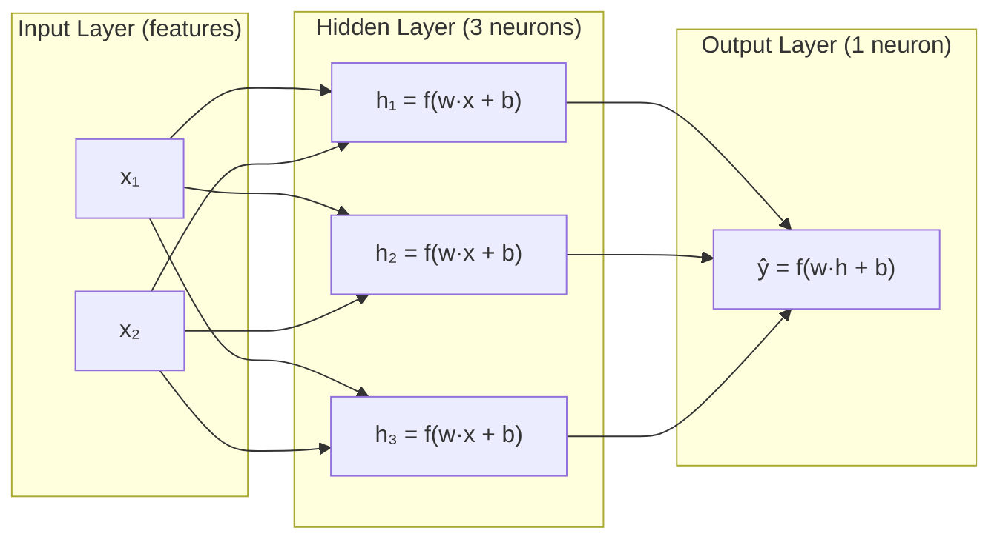

# Chapter 3: Deep Learning Fundamentals

*Every multi-billion-parameter LLM you call through an API is, underneath the marketing, a very large stack of the same four-line training loop you are about to learn by hand.*

## Learning Objectives

By the end of this chapter, you will be able to:

- Explain the artificial neuron (weighted sum + bias + activation) and why stacking them into layers creates a neural network
- Explain *why* nonlinear activation functions are mathematically required for a network to learn anything beyond a straight line, and derive this from first principles
- Compare ReLU, GELU, Sigmoid, and Tanh — their formulas, shapes, gradient behavior, and where each is used in practice, including why GELU is the modern default in transformer architectures
- Manually compute a forward pass through a small feed-forward network using explicit weight matrices and numbers
- Explain backpropagation as "credit assignment" via the chain rule, and manually compute at least one gradient through two layers of a tiny network
- Compare batch, stochastic, and mini-batch gradient descent, and reason about the learning-rate trade-off
- Explain what Momentum, Adam, and AdamW each add on top of plain SGD, and why AdamW is the standard optimizer for training transformer-based LLMs
- Choose the correct loss function (Cross-Entropy, MSE, or MAE) for a given task, and explain why Cross-Entropy is the loss behind next-token prediction in every LLM

---

## Prerequisites for This Chapter

This chapter builds directly on **[Chapter 2: Machine Learning Fundamentals](./02-machine-learning-fundamentals.md)**. Specifically, you will be using:

- **Vectors and matrices, and the dot product** — a neural network layer is nothing more than a matrix multiplication plus a vector addition. If `A · B = Σ AᵢBᵢ` doesn't feel automatic yet, re-read Chapter 2, Section on linear algebra before continuing — every forward pass in this chapter is built from it.
- **The gradient / calculus intuition** — Chapter 2 introduced the idea that a derivative tells you "how much does the output change if I nudge the input a little," and that a gradient is just that idea generalized to many inputs at once (a vector of partial derivatives pointing "uphill"). Backpropagation (Section 7) is that exact idea, applied layer by layer.
- **Loss functions and metrics** — Chapter 2 introduced the general concept of a loss function as "a number that says how wrong the model currently is." This chapter names the three loss functions you'll actually use constantly (Cross-Entropy, MSE, MAE) and explains precisely when each applies.
- **The bias-variance framing and overfitting** — you'll see these ideas resurface when we discuss learning rate and batch size trade-offs.

No new software setup is required. The worked examples in this chapter are done by hand with a calculator's worth of arithmetic — the point is to *see* the machinery, not to run a training script yet. (You'll do that starting in Chapter 12.)

---

## 1. From Linear Models to Neurons

Chapter 2 ended with classical algorithms like linear regression and logistic regression: a weighted sum of inputs, optionally passed through a squashing function, produces a prediction. That single equation —

```
y = w₁x₁ + w₂x₂ + ... + wₙxₙ + b
```

— is already 90% of what a "neuron" is. Deep learning didn't invent a fundamentally new mathematical primitive; it took this one primitive, gave it a nonlinear twist, and then repeated it thousands or billions of times in layered, learnable arrangements. That's genuinely the whole idea. Everything else in this chapter — activation functions, backpropagation, optimizers — exists to make that repetition *learnable at scale*.

Why does repeating a simple thing produce something as capable as GPT-4 or Claude? Because complex functions can be built out of simple, composable pieces — the same way a handful of transistor logic gates compose into a CPU capable of running a web browser. A single logistic regression can only draw one straight decision boundary. Stack enough neurons in enough layers, with a nonlinearity between them, and the network can approximate *any* continuous function to arbitrary precision — this is the **Universal Approximation Theorem**, and it's the theoretical bedrock that justifies calling neural networks "general-purpose learning machines" rather than "fancy linear regression."

---

## 2. The Artificial Neuron: Weighted Sum, Bias, and Activation

### 2.1 A brief history nod

The artificial neuron traces back to the **Perceptron**, proposed by Frank Rosenblatt in 1958 — a simple binary classifier loosely inspired by how a biological neuron fires when accumulated input signal crosses a threshold. The original perceptron could only learn *linearly separable* patterns (Minsky and Papert's 1969 book *Perceptrons* famously proved it couldn't even learn XOR), which stalled neural network research for over a decade. The fix — adding hidden layers and a nonlinear activation function, trained via backpropagation (popularized by Rumelhart, Hinton, and Williams in 1986) — is exactly the architecture this chapter builds up to. Every modern neural network, from a 3-layer toy classifier to a 100-layer LLM, is a direct descendant of that fix.

### 2.2 The anatomy of one neuron

A single artificial neuron does exactly three things, in order:

1. **Weighted sum**: multiply each input by a learned weight and add them up.
2. **Add a bias**: add one more learned number that doesn't depend on the input at all.
3. **Apply an activation function**: pass the result through a nonlinear function.

```
Inputs        Weights
  x₁ ────────▶ w₁  ─┐
  x₂ ────────▶ w₂  ─┤
  x₃ ────────▶ w₃  ─┼──▶  Σ (weighted sum) ──▶ + b (bias) ──▶ f( ) (activation) ──▶ output a
  ...              ─┤
  xₙ ────────▶ wₙ  ─┘
```

Formally:

```
z = w₁x₁ + w₂x₂ + ... + wₙxₙ + b   =  w·x + b     (the "pre-activation")
a = f(z)                                          (the neuron's output)
```

- `x` is the input vector (could be raw features, or the output of a previous layer).
- `w` is the neuron's weight vector — one learned number per input, capturing "how much do I care about this input."
- `b` is the bias — a learned offset, letting the neuron shift its decision boundary independent of the inputs (without it, every neuron's decision boundary would be forced through the origin).
- `f` is the activation function (Section 5) — without it, this is just linear regression with extra steps.
- `a`, the neuron's output ("activation"), becomes an input to the next layer, or the final prediction if this is the output layer.

**Every weight and bias in this equation is a learnable parameter.** Training a neural network *is* the process of searching for the values of every `w` and `b` in the entire network that minimize the loss function (Section 10). A model like GPT-3 has 175 billion of these numbers; a model like Claude or GPT-4 has more. The math per-parameter never changes — only the count does.

---

## 3. Stacking Neurons: Layers, Depth, and the Multilayer Perceptron

One neuron can only draw one decision line. To do anything interesting, you arrange many neurons side-by-side into a **layer**, and stack multiple layers in sequence — the output of layer *i* becomes the input of layer *i+1*. This is called a **Multilayer Perceptron (MLP)**, or a fully-connected feed-forward network.



A few vocabulary terms that will recur for the rest of the course:

- **Input layer**: not really a computing layer — just the raw feature vector fed in (e.g., token embeddings, in later chapters).
- **Hidden layer**: any layer between input and output. "Hidden" simply means its output isn't the final answer, not that it's mysterious.
- **Depth**: the number of layers. "Deep learning" literally means "machine learning with many stacked layers" — there's no more mystical meaning than that.
- **Width**: the number of neurons in a given layer.
- **Fully-connected / Dense layer**: every neuron in layer *i* receives input from every neuron in layer *i-1*, as drawn above. Transformer feed-forward blocks (Chapter 6) are exactly this.

Layers are implemented as matrix operations, not neuron-by-neuron loops — one matrix multiplication computes an entire layer's weighted sums for every neuron at once. This is *why* deep learning runs efficiently on GPUs: GPUs are purpose-built for exactly this kind of large parallel matrix multiplication.

```
Layer output vector:   a = f(W·x + b)

W = weight matrix, shape (num_neurons_in_layer, num_inputs)
x = input vector,  shape (num_inputs,)
b = bias vector,   shape (num_neurons_in_layer,)
f = activation function, applied elementwise
```

We'll use this exact notation for the worked example in Section 6.

---

## 4. Why Nonlinearity Is Non-Negotiable

Here is the single most important fact in this chapter, and it's easy to state precisely.

**Claim**: stacking any number of purely *linear* layers is mathematically identical to a single linear layer.

**Proof sketch**: suppose layer 1 computes `a = W₁x + b₁` and layer 2 (with no activation function) computes `y = W₂a + b₂`. Substitute:

```
y = W₂(W₁x + b₁) + b₂
  = (W₂W₁)x + (W₂b₁ + b₂)
  = W_combined · x + b_combined
```

`W₂W₁` is just another matrix, and `W₂b₁ + b₂` is just another vector. No matter how many linear layers you stack — 2, 20, or 200 — the composition collapses algebraically into one equivalent linear layer, `y = W_combined·x + b_combined`. You would get the exact same representational power (and limitations) as a single linear regression, while paying the compute cost of 200 layers. All that depth would be wasted.

**The fix**: insert a nonlinear function `f` between every pair of layers, so that `y = f(W₂ · f(W₁x + b₁) + b₂)`. Because `f` is not linear, this expression can no longer be algebraically collapsed into a single matrix multiplication. Each added layer now genuinely increases what the network can represent — curved decision boundaries, XOR-like patterns, and eventually functions as complex as "predict the next word in a sentence."

```
Without nonlinearity:          With nonlinearity:
  straight line only             curves, folds, arbitrary shapes

      │                              │      ___
      │      /                       │     /   \
      │    /                         │    |     |
      │  /                           │     \___/
      │/                             │
──────┼──────                  ──────┼──────
```

This is why an activation function is not a stylistic choice — it is the mathematical reason a "deep" network is more powerful than a shallow one at all.

---

## 5. Activation Functions in Detail

An activation function takes the pre-activation `z = w·x + b` (any real number) and squashes or reshapes it into the neuron's actual output `a`. Below are the four you will encounter constantly, with formula, shape, and where each is used.

### 5.1 Sigmoid

```
σ(z) = 1 / (1 + e^(-z))            range: (0, 1)
```

```
 1 ┤                    ●●●●●●●●●
   │               ●●●●●
   │            ●●
0.5┤          ●
   │        ●●
   │   ●●●●
 0 ┤●●●
   └────────────┼────────────────
               z=0
```

- Squashes any input into a probability-like range `(0, 1)`.
- Historically the default for the output layer of a binary classifier (and, before ReLU, for hidden layers too).
- **Weakness**: for large positive or negative `z`, the curve is nearly flat — the gradient is close to zero. Chained across many layers during backpropagation, this causes the **vanishing gradient problem**: gradients shrink toward zero as they propagate backward, and early layers stop learning. This is a major reason sigmoid was phased out of hidden layers in deep networks.
- **Still used today**: as the final activation for binary classification outputs, and inside gates in LSTMs (Chapter 4).

### 5.2 Tanh (hyperbolic tangent)

```
tanh(z) = (e^z - e^(-z)) / (e^z + e^(-z))      range: (-1, 1)
```

```
 1 ┤                    ●●●●●●●●●
   │               ●●●●●
   │            ●●
 0 ┤          ●
   │        ●●
   │   ●●●●
-1 ┤●●●
   └────────────┼────────────────
               z=0
```

- Same S-shape as sigmoid, but zero-centered — outputs range from -1 to 1 instead of 0 to 1.
- Zero-centering helps gradients flow more symmetrically during training compared to sigmoid, which is why tanh often outperformed sigmoid in hidden layers of pre-2015 networks (classic RNNs, in particular — see Chapter 4).
- **Same core weakness as sigmoid**: it still saturates (flattens) for large `|z|`, so it still suffers from vanishing gradients in deep stacks.

### 5.3 ReLU (Rectified Linear Unit)

```
ReLU(z) = max(0, z)
```

```
   │                    ╱
   │                  ╱
   │                ╱
 0 ┤●●●●●●●●●●●●●●●
   └────────────┼────────────────
               z=0
```

- For `z > 0`, it's simply the identity function (slope 1, no saturation, no vanishing gradient on the positive side).
- For `z ≤ 0`, output is exactly 0.
- Became the default hidden-layer activation from roughly 2012 onward (the AlexNet era of deep learning) precisely because it doesn't saturate for positive inputs, making deep networks dramatically easier to train than with sigmoid/tanh.
- **Weakness — the "dying ReLU" problem**: if a neuron's weighted sum is consistently negative during training, its gradient is *exactly* zero (flat line for `z<0`), so it stops receiving any gradient signal and never updates again — it "dies" permanently. You'll see this exact mechanic in the backpropagation worked example (Section 7).

### 5.4 GELU (Gaussian Error Linear Unit)

```
GELU(z) = z · Φ(z)      where Φ(z) is the standard normal cumulative distribution function
```

```
   │                    ╱
   │                  ╱
   │                ╱
 0 ┤      ╲___   ╱
   │          ╲_╱
   └────────────┼────────────────
               z=0
```

- Looks like a *smoothed* ReLU: for large positive `z` it behaves almost identically to ReLU (slope approaching 1), but instead of a hard corner at `z=0`, it curves smoothly, and it allows a small amount of *negative* output for small negative `z` before flattening toward zero.
- **Why this smoothness matters**: the hard "kink" in ReLU at `z=0` means its derivative jumps discontinuously from 0 to 1 — a discontinuity that isn't a problem for a single neuron, but adds a subtle jaggedness to the loss landscape when you have billions of them, especially in networks trained with very large batches and many layers, like transformers. GELU's smooth, continuously differentiable curve gives cleaner, more stable gradients during training at that scale, and it also probabilistically "gates" each unit's own output by its own magnitude (weighting by `Φ(z)` — how likely a standard normal variable would be less than `z`) rather than making a hard zero/nonzero cutoff.
- **Why it's the modern transformer default**: GELU is used in the feed-forward blocks of **BERT**, **GPT-2/3/4-family models**, and most subsequent transformer LLMs, because empirically it gives smoother optimization and slightly better downstream task performance than ReLU at transformer scale, at negligible extra compute cost (it's more expensive per-element than ReLU, but that's irrelevant against the cost of the surrounding matrix multiplications). When you reach Chapter 6 (Transformer Architecture) and see the feed-forward sublayer inside every transformer block, assume GELU (or its close cousin, **SwiGLU**, used in LLaMA-family models) unless stated otherwise.

### 5.5 Side-by-side comparison

| Activation | Formula | Range | Saturates? | Typical use today |
|---|---|---|---|---|
| **Sigmoid** | `1/(1+e⁻ᶻ)` | (0, 1) | Yes, both sides | Binary classification output layer, gates in LSTMs |
| **Tanh** | `(eᶻ-e⁻ᶻ)/(eᶻ+e⁻ᶻ)` | (-1, 1) | Yes, both sides | Classic RNN/LSTM hidden states |
| **ReLU** | `max(0, z)` | [0, ∞) | Only negative side (hard zero) | CNNs, general-purpose deep nets |
| **GELU** | `z · Φ(z)` | (~-0.17, ∞) | Effectively no (smooth, small negative tail) | Transformer feed-forward layers (BERT, GPT-family) |

---

## 6. Feed-Forward Networks: A Worked Forward Pass

Let's make Section 3's matrix notation completely concrete with real numbers. We'll build a tiny network: **2 inputs → hidden layer of 3 neurons (ReLU) → output layer of 1 neuron (Sigmoid)** — small enough to compute entirely by hand, structurally identical to a full-size feed-forward network.

### 6.1 Setup

**Input:**
```
x = [1.0, 0.5]
```

**Layer 1 (hidden, 3 neurons, ReLU activation):**
```
        [ 0.2   0.8 ]
W₁  =   [ 0.5  -0.3 ]        b₁ = [ 0.1, 0.0, -0.5 ]
        [-0.1   0.4 ]
```

**Layer 2 (output, 1 neuron, Sigmoid activation):**
```
W₂ = [0.6, -0.4, 0.9]        b₂ = 0.05
```

### 6.2 Step 1 — Layer 1 pre-activation: `z₁ = W₁x + b₁`

```
z₁[0] = (0.2)(1.0) + (0.8)(0.5) + 0.1  = 0.20 + 0.40 + 0.10 = 0.70
z₁[1] = (0.5)(1.0) + (-0.3)(0.5) + 0.0 = 0.50 - 0.15 + 0.00 = 0.35
z₁[2] = (-0.1)(1.0) + (0.4)(0.5) + -0.5 = -0.10 + 0.20 - 0.50 = -0.40

z₁ = [0.70, 0.35, -0.40]
```

### 6.3 Step 2 — Layer 1 activation: `a₁ = ReLU(z₁)`

```
ReLU(0.70)  = 0.70
ReLU(0.35)  = 0.35
ReLU(-0.40) = 0.00     ← negative input is zeroed out entirely

a₁ = [0.70, 0.35, 0.00]
```

Notice neuron 3 got clipped to exactly zero. Hold onto that — it becomes important in the backpropagation example next.

### 6.4 Step 3 — Layer 2 pre-activation: `z₂ = W₂·a₁ + b₂`

```
z₂ = (0.6)(0.70) + (-0.4)(0.35) + (0.9)(0.00) + 0.05
   = 0.42 - 0.14 + 0.00 + 0.05
   = 0.33
```

### 6.5 Step 4 — Layer 2 activation: `ŷ = σ(z₂)`

```
σ(0.33) = 1 / (1 + e^(-0.33)) = 1 / (1 + 0.7189) = 1 / 1.7189 ≈ 0.5817
```

**Final prediction: `ŷ ≈ 0.582`** — e.g., "58.2% probability of the positive class," if this were a binary classifier.

That's the entire forward pass: two matrix-multiply-plus-bias steps, two activation functions, done. A 96-layer LLM forward pass through billions of parameters is this exact same sequence of operations, repeated far more times with far larger matrices, plus attention (Chapter 5) mixed in between the feed-forward blocks.

---

## 7. Backpropagation: Credit Assignment via the Chain Rule

### 7.1 The intuition first

Suppose the network above was wrong — the true label was `y = 1` (positive class), but it predicted `ŷ ≈ 0.582`. Somewhere among the 6 weights in `W₁`, the 3 biases in `b₁`, the 3 weights in `W₂`, and the 1 bias `b₂` — 13 numbers total — some contributed more to this error than others. **Backpropagation is the algorithm that answers, precisely and efficiently, "how much did each individual weight contribute to the final error?"** This is often called the **credit assignment problem**, and the chain rule from calculus is the tool that solves it.

The chain rule says: if `z` depends on `y`, and `y` depends on `x`, then the effect of `x` on `z` is the *product* of the effect of `x` on `y` and the effect of `y` on `z`:

```
dz/dx = dz/dy · dy/dx
```

A neural network is a chain of exactly this kind of dependency: the loss depends on the output activation, which depends on the output pre-activation, which depends on the hidden activation, which depends on the hidden pre-activation, which depends on the weight. Backpropagation just walks that chain backward, multiplying local derivatives together at each step, layer by layer, reusing work already computed for later layers — which is why it's efficient rather than requiring a fresh, expensive computation per parameter.

```
Forward pass (compute values):
  x ──▶ z₁ ──▶ a₁ ──▶ z₂ ──▶ ŷ ──▶ L (loss)

Backward pass (compute gradients, walking right-to-left):
  ∂L/∂x ◀── ∂L/∂z₁ ◀── ∂L/∂a₁ ◀── ∂L/∂z₂ ◀── ∂L/∂ŷ ◀── ∂L/∂L = 1
```

### 7.2 Worked example: computing two real gradients by hand

We'll continue the exact network from Section 6, with true label `y = 1`, using **binary cross-entropy loss** (Section 10):

```
L = -[y·ln(ŷ) + (1-y)·ln(1-ŷ)]
```

Since `y = 1`, this simplifies to `L = -ln(ŷ) = -ln(0.5817) ≈ 0.5417`.

**Step 1 — gradient of loss with respect to the output pre-activation `z₂`.**

This is a famous, clean result: when you pair a sigmoid output with binary cross-entropy loss, the combined gradient collapses to simply:

```
∂L/∂z₂ = ŷ - y = 0.5817 - 1 = -0.4183
```

(This clean cancellation is *why* sigmoid + cross-entropy is such a common pairing — the chain rule through `σ` and `ln` cancels out the messy terms algebraically.)

**Step 2 — gradient with respect to `W₂[0]`** (the weight connecting hidden neuron 1, `a₁[0]=0.70`, to the output):

```
∂L/∂W₂[0] = ∂L/∂z₂ · a₁[0] = (-0.4183)(0.70) = -0.2928
```

**Interpretation**: this weight should be *increased* slightly (gradient descent moves opposite the gradient — Section 8), because a more positive contribution from this neuron would have pushed `ŷ` toward the correct label of 1.

**Step 3 — propagate the gradient back into the hidden layer, to `a₁[0]`:**

```
∂L/∂a₁[0] = ∂L/∂z₂ · W₂[0] = (-0.4183)(0.6) = -0.2510
```

**Step 4 — push it through the ReLU activation, to `z₁[0]`.** The derivative of ReLU is 1 where `z>0` and 0 where `z≤0`. Since `z₁[0] = 0.70 > 0`:

```
∂a₁[0]/∂z₁[0] = 1        (ReLU derivative, positive side)
∂L/∂z₁[0] = ∂L/∂a₁[0] · 1 = -0.2510
```

**Step 5 — finally, the gradient with respect to `W₁[0][0]`** (the weight connecting input `x₁=1.0` to hidden neuron 1):

```
∂L/∂W₁[0][0] = ∂L/∂z₁[0] · x[0] = (-0.2510)(1.0) = -0.2510
```

That -0.2510 is the answer to "how much did this specific weight, buried two layers deep, contribute to the final error?" — computed via five short multiplications, each reusing a value computed in the step before it. That reuse is the entire efficiency trick of backpropagation: without it, you'd need to numerically perturb each of the 13 parameters individually and re-run the forward pass 13 times just to estimate these same gradients — computationally infeasible at LLM scale, where "13" becomes "billions."

### 7.3 The dying-neuron case, made concrete

Now repeat Steps 3-5 for hidden neuron 3, whose pre-activation was `z₁[2] = -0.40` — the one ReLU zeroed out in Section 6.3.

```
∂L/∂a₁[2] = ∂L/∂z₂ · W₂[2] = (-0.4183)(0.9) = -0.3765

∂a₁[2]/∂z₁[2] = 0        (ReLU derivative, negative side — flat line, zero slope)

∂L/∂z₁[2] = ∂L/∂a₁[2] · 0 = 0
```

Even though the upstream gradient flowing *into* this neuron (`-0.3765`) was substantial, ReLU's flat region multiplies it by exactly zero. **Every weight feeding into hidden neuron 3 gets a gradient of exactly zero on this example**, and will not update at all from this training step. If a neuron ends up in this regime consistently across most training examples, it's the "dying ReLU" problem from Section 5.3 in action, observed directly in the math rather than just asserted.

---

## 8. Gradient Descent: Batch, Stochastic, and Mini-Batch

Backpropagation tells you the gradient — the direction of steepest *increase* in loss for each parameter. **Gradient descent** is the (much simpler) rule for actually updating each parameter using that gradient:

```
w_new = w_old - η · (∂L/∂w)
```

`η` (eta) is the **learning rate** — a single number controlling how big a step to take. The minus sign is what makes this *descent*: you step opposite the gradient, downhill toward lower loss.

### 8.1 Three variants, differing only in how much data informs each step

| Variant | Gradient computed over | Update frequency | Trade-off |
|---|---|---|---|
| **Batch Gradient Descent** | The *entire* training dataset | Once per full pass (epoch) | Accurate, stable gradient direction, but slow — one dataset-wide pass per single weight update, and infeasible when the dataset doesn't fit in memory |
| **Stochastic Gradient Descent (SGD)** | A *single* training example | Once per example | Extremely fast updates, but noisy — the gradient from one example is a rough, high-variance estimate of the "true" direction |
| **Mini-Batch Gradient Descent** | A small batch (e.g., 32, 256, or several thousand examples) | Once per batch | The practical default: averages out much of SGD's noise while staying far more frequent and memory-friendly than full-batch. Batch size becomes a tunable hyperparameter. |

Every LLM you have ever used was trained with mini-batch gradient descent — at a batch size that, for frontier models, can span millions of tokens per step, spread across thousands of GPUs. The algorithm is identical to what's described above; only the batch size and the hardware orchestration around it changed.

### 8.2 The learning-rate trade-off

```
Loss
 │╲                                          Too high (η too large):
 │ ╲    ╱╲      ╱╲                           overshoots the minimum,
 │  ╲  ╱  ╲    ╱  ╲    ╱╲                    can bounce indefinitely
 │   ╲╱    ╲  ╱    ╲  ╱  ╲                   or even diverge (loss grows)
 │          ╲╱      ╲╱    ╲___
 └───────────────────────────────▶ training steps

Loss
 │╲
 │ ╲__                                       Too low (η too small):
 │    ╲___                                   crawls toward the minimum,
 │        ╲____                              wastes enormous compute time,
 │             ╲______________               may get stuck in a shallow
 └───────────────────────────────▶ training steps    local dip along the way

Loss
 │╲
 │ ╲_
 │   ╲__                                     Well-tuned η:
 │      ╲___                                 steady, efficient descent
 │          ╲______
 └───────────────────────────────▶ training steps
```

Picture the loss function as a landscape (a "loss landscape") with hills and valleys in the space of all possible weight values, and gradient descent as a ball rolling downhill:

- **Learning rate too high**: each step is a huge leap. The ball overshoots the valley floor, lands partway up the *opposite* wall, and can bounce back and forth — or, in the worst case, gain energy each bounce and diverge (loss increases without bound, often visible in training logs as loss suddenly spiking to `NaN`).
- **Learning rate too low**: each step is a tiny shuffle. The ball does head toward the valley, but so slowly that training that should take hours takes weeks, and it's more likely to get trapped in a shallow local dip that a bigger step would have rolled straight through.
- **Well-tuned learning rate**: steady, efficient progress toward the minimum — this is why practically every training run you'll encounter in this course uses a **learning-rate schedule** (warmup then decay) rather than one fixed value, a topic we'll return to concretely in Chapter 12 when we cover LLM pretraining.

---

## 9. Optimizers: From SGD to AdamW

Plain gradient descent (Section 8) is the conceptual foundation, but production training almost never uses it exactly as written — each of the following optimizers fixes a specific, concrete weakness of the one before it.

### 9.1 SGD (plain)

```
w_new = w_old - η · g          where g = ∂L/∂w (the current gradient)
```

**Weakness**: treats every step as if the past didn't happen. If the loss landscape has a narrow, steep ravine (common in real networks with many parameters), plain SGD oscillates across the ravine walls instead of moving smoothly along its floor toward the minimum.

### 9.2 SGD with Momentum

```
v_new = β · v_old + (1-β) · g            (v = "velocity," an exponential moving average of past gradients)
w_new = w_old - η · v_new
```

**What it adds**: it accumulates a "velocity" from past gradients (typically `β ≈ 0.9`), so the update isn't just this step's gradient but a smoothed running direction — like a ball rolling downhill that has built up momentum, rather than a ball whose direction is decided fresh at every single step. This damps the ravine-oscillation problem and speeds convergence in consistent directions.

### 9.3 Adam (Adaptive Moment Estimation)

Adam adds two ideas on top of momentum simultaneously:

1. **First moment** (like momentum above) — a running average of the gradient itself.
2. **Second moment** — a running average of the *squared* gradient, used to give **each parameter its own adaptive learning rate**. Parameters with a history of large gradients get their effective step size shrunk; parameters with small, infrequent gradients get their effective step size boosted.

```
m_new = β₁·m_old + (1-β₁)·g              (first moment: mean of gradients)
v_new = β₂·v_old + (1-β₂)·g²             (second moment: mean of squared gradients)
w_new = w_old - η · m_new / (√v_new + ε)  (per-parameter adaptive step)
```

**What it adds over Momentum**: every individual weight effectively gets its own personalized learning rate that adapts automatically over training, instead of one global `η` applied uniformly to 13 (or 13 billion) very differently-scaled parameters. This made Adam dramatically more robust to learning-rate choice and dominant across deep learning by the mid-2010s.

### 9.4 AdamW (Adam with Decoupled Weight Decay)

**Weight decay** is a regularization technique (foreshadowed by the bias-variance discussion in Chapter 2): it nudges every weight slightly toward zero at each step, discouraging any single weight from growing unnecessarily large and helping prevent overfitting. Classic Adam implements this by simply adding a weight-decay penalty term directly into the gradient `g` before it flows into the momentum and adaptive-scaling machinery above — which means the *adaptive* second-moment term ends up scaling the weight-decay penalty too, in a way that Adam's original authors did not intend and that noticeably hurts generalization in practice.

**AdamW's fix**: decouple weight decay from the gradient-based adaptive update entirely. The weight decay is applied as its own separate, plain subtraction, *after* the Adam update, unaffected by the per-parameter adaptive scaling:

```
w_new = w_old - η · m_new / (√v_new + ε) - η · λ · w_old
                └────── Adam update ──────┘   └ weight decay, applied cleanly ┘
```

**Why AdamW is the standard optimizer for training transformer-based LLMs**: transformer training involves an enormous number of parameters with wildly different gradient scales (embedding weights, attention projections, feed-forward weights all behave differently), and generalization quality is highly sensitive to weight decay being applied correctly. Every major open pretraining recipe — GPT-family, LLaMA-family, and virtually every other modern LLM — uses AdamW (or a close variant) specifically because the decoupled weight decay produces measurably better-generalizing models than Adam's coupled version at this scale. You'll see AdamW's hyperparameters (`η`, `β₁`, `β₂`, `λ`) as explicit configuration knobs when we cover pretraining and fine-tuning hyperparameters in **Chapter 12**.

| Optimizer | Adds over previous | Core benefit |
|---|---|---|
| **SGD** | (baseline) | Simple, works, but oscillates in ravines and treats all parameters identically |
| **Momentum** | Running average of gradients | Smooths oscillation, accelerates consistent-direction progress |
| **Adam** | Running average of squared gradients → per-parameter adaptive learning rate | Robust to learning-rate choice, handles differently-scaled parameters well |
| **AdamW** | Decoupled weight decay | Correct, effective regularization at scale → the default for training transformer LLMs |

---

## 10. Loss Functions: Cross-Entropy, MSE, and MAE

The loss function is the single number gradient descent is trying to minimize — it defines what "wrong" means for your specific task. Choosing the wrong one silently misdirects training even if every other piece of the pipeline is correct.

### 10.1 Mean Squared Error (MSE) — for regression

```
MSE = (1/n) · Σ (yᵢ - ŷᵢ)²
```

- Squares the error, so it penalizes large mistakes disproportionately harder than small ones (an error of 10 contributes 100 to the sum; an error of 1 contributes only 1).
- Use when predicting a continuous number (price, temperature, a similarity score) and large errors are meaningfully worse than small ones.
- **Sensitive to outliers** — a single wildly wrong prediction can dominate the entire loss and distort training.

### 10.2 Mean Absolute Error (MAE) — for regression, outlier-robust

```
MAE = (1/n) · Σ |yᵢ - ŷᵢ|
```

- Penalizes error linearly rather than quadratically — an error of 10 contributes 10, not 100.
- Use when your regression data has occasional extreme outliers you don't want to dominate training (e.g., delivery time predictions with rare multi-day delays).
- Trade-off: its gradient has a constant magnitude regardless of how close you already are to the correct answer, which can make final convergence less precise than MSE's naturally shrinking gradient near zero error.

### 10.3 Cross-Entropy Loss — for classification

For binary classification (as used throughout Sections 6-7):

```
L = -[y·ln(ŷ) + (1-y)·ln(1-ŷ)]
```

For multi-class classification over `K` classes (predicting one of `K` mutually exclusive categories), it generalizes to:

```
L = -Σₖ yₖ · ln(ŷₖ)          (sum over all K classes; yₖ is 1 for the true class, 0 otherwise)
```

- Measures the divergence between the model's predicted probability distribution and the true distribution (which is a "one-hot" spike of probability 1 on the correct class, 0 everywhere else).
- Heavily penalizes **confident, wrong** predictions: if the true class had probability 0.001 assigned to it, `-ln(0.001) ≈ 6.9` — a large loss. A confident, correct prediction near probability 1.0 gives loss near zero. This asymmetric shape is exactly the training signal you want: "being unsure is fine, being confidently wrong is heavily punished."

**Why this is the loss function behind every LLM's next-token prediction — explicitly.** An LLM's core training task is: given the preceding tokens, predict a probability distribution over the *entire vocabulary* (commonly 50,000-150,000+ possible tokens) for what the next token is, then compare that distribution against the one true next token that actually appeared in the training text. That is *exactly* the multi-class cross-entropy setup above, with `K` = vocabulary size and the "true class" being whichever token actually came next. Every time you've seen the term **"perplexity"** used to describe LLM quality, it is a direct, simple transformation of this exact cross-entropy loss (perplexity = `e^(cross-entropy)`). When you reach **Chapter 7** (LLM architecture) and **Chapter 12** (pretraining), the training objective described there — "minimize the cross-entropy between predicted and actual next tokens across the training corpus" — is precisely the loss function introduced here, just computed over a vocabulary-sized output instead of the single number in our worked example.

### 10.4 Choosing the right loss function

| Task | Loss function | Why |
|---|---|---|
| Predicting a continuous number, errors roughly Gaussian | **MSE** | Penalizes large errors more, smooth gradient near the optimum |
| Predicting a continuous number, outliers present | **MAE** | Doesn't let rare extreme errors dominate training |
| Binary classification | **Binary Cross-Entropy** | Matches probability outputs, heavily penalizes confident wrong answers |
| Multi-class classification (including next-token prediction) | **Categorical Cross-Entropy** | Same reasoning, generalized to K classes — the exact loss training every LLM |

---

## Real-World Scenario

**Scenario**: A team fine-tunes an internal support-ticket classifier — a small feed-forward network on top of pretrained embeddings — to route tickets into one of 12 categories. During week one, training loss decreases nicely for the first 500 steps, then plateaus at a stubbornly mediocre value while validation accuracy stays flat around 60%, far below the 90%+ they expected.

Debugging step by step:

1. **They inspect activations layer-by-layer** and find that in the first hidden layer, roughly 40% of ReLU neurons output exactly zero for *every* example in a validation batch — not just some examples, all of them. These neurons are dead: their weighted sum is negative for essentially every input they see, so ReLU zeroes them and, per Section 7.3, their gradient is *exactly* zero on every step — they can never recover on their own.
2. **Root cause**: the team had initialized all biases to a large negative value (a leftover default from an earlier experiment tuned for a different architecture), pushing most neurons' pre-activations negative from the very first forward pass, before training even had a chance to correct it.
3. **The fix, and why it worked**: they re-initialized biases near zero and switched the hidden-layer activation from ReLU to **GELU**. GELU's small negative tail (Section 5.4) means even neurons with a somewhat negative pre-activation still pass through a small nonzero gradient, giving the optimizer a path to recover instead of a hard zero-gradient wall. Combined with the bias fix, dead-neuron rate dropped from ~40% to under 2%, and validation accuracy jumped to 91% within another 300 training steps — with no other change to the architecture, data, or optimizer.
4. **Bonus finding**: while investigating, they also discovered the model had been trained with plain Adam and a fairly aggressive weight-decay value, which — because of Adam's coupled weight decay (Section 9.4) — was silently shrinking exactly the large, useful weights of their best-performing neurons more aggressively than intended. Switching to **AdamW** with the same nominal weight-decay value produced a small but consistent additional accuracy gain, because the decay was now applied uniformly rather than distorted by each parameter's adaptive scaling.

**Lesson**: "the loss plateaued" is a symptom, not a diagnosis. The tools in this chapter — inspecting activations for dead neurons, checking activation function choice, checking optimizer/weight-decay interaction — are exactly the debugging vocabulary that separates "restart training and hope" from "find the actual mechanism and fix it," and they apply identically whether the network has 13 parameters or 13 billion.

---

## Best Practices

- **Default to GELU (or SwiGLU) for transformer-style feed-forward blocks**, and ReLU as a fast, simple default for other general-purpose hidden layers — don't reach for sigmoid/tanh in hidden layers of deep networks unless you have a specific architectural reason (e.g., LSTM gates).
- **Match the loss function to the task**, not to habit: cross-entropy for any classification task (including next-token prediction), MSE for outlier-tolerant regression, MAE when outliers should be down-weighted.
- **Use mini-batch gradient descent by default**, and treat batch size as a real hyperparameter — too small reintroduces SGD's noisiness, too large can reduce the beneficial regularizing noise and demands more memory.
- **Use AdamW, not plain Adam, for anything transformer-related** — the decoupled weight decay measurably improves generalization at this scale, which is why it's the field-wide default (foreshadowing Chapter 12).
- **Watch for dead neurons and vanishing/exploding gradients** by inspecting activation statistics during training, not just the final loss curve — a healthy-looking loss curve can hide a large fraction of "dead" capacity.
- **Tune learning rate before almost anything else** when a model isn't training well — it's the single hyperparameter most likely to cause either divergence (too high) or apparent "it's not learning" (too low).
- **Initialize weights and biases deliberately** (e.g., Xavier/He initialization, near-zero biases) rather than reusing defaults from an unrelated architecture — Section-Real-World-Scenario's root cause was exactly a stale, mismatched bias initialization.

---

## Common Mistakes

- **Forgetting the activation function entirely**, or using a linear activation between every layer — per Section 4, this collapses the whole network into a single linear model no matter how many layers you stack, and training will plateau at roughly linear-regression-level performance with no obvious error message telling you why.
- **Using MSE for a classification task**, or cross-entropy for a plain regression task — the model will still "train" (loss will go down), but the gradient signal is subtly mismatched to the actual objective, producing a worse model than the loss curve alone would suggest.
- **Setting the learning rate far too high**, seeing the loss spike to `NaN`, and assuming the code is broken rather than diagnosing an optimizer/learning-rate problem — always try lowering the learning rate by 10x as a first diagnostic step before suspecting the implementation.
- **Ignoring dead ReLU neurons** because the aggregate loss still looks acceptable — a substantial fraction of "wasted" capacity can hide inside a model whose overall metrics look fine, until you scale up or shift the data distribution and the wasted capacity starts to matter.
- **Using plain SGD or plain Adam by default on transformer architectures** out of habit, without considering AdamW's decoupled weight decay — a detail invisible in the loss curve early in training but consequential for generalization.
- **Confusing "gradient" with "loss."** The loss is a single number describing how wrong the model is right now; the gradient is a *direction* (one number per parameter) describing which way to move each parameter to reduce that loss. Conflating the two makes debugging backpropagation confusing.
- **Treating batch size purely as a memory-constraint knob** rather than an optimization choice — batch size interacts with learning rate and gradient noise in ways that affect final model quality, not just training speed.

---

## Summary

- A neural network is built from **artificial neurons** — weighted sum + bias + activation — stacked into **layers** and composed into a **multilayer network**, a direct architectural descendant of the 1958 Perceptron.
- **Nonlinear activation functions are mathematically required**: without them, any number of stacked layers collapses algebraically into one linear function (Section 4's proof). ReLU is the fast general-purpose default; **GELU is the modern default in transformer feed-forward blocks** because its smoothness produces more stable gradients at scale.
- A **forward pass** is nothing more than repeated `activation(W·x + b)` steps — you computed one by hand in Section 6, and it is structurally identical to a forward pass through a 100-billion-parameter LLM.
- **Backpropagation** solves the credit-assignment problem — "how much did each weight contribute to the error?" — via the **chain rule**, propagating gradients backward layer by layer, reusing computation at every step. You computed real gradients by hand in Section 7, including watching a dead ReLU neuron receive a gradient of exactly zero.
- **Gradient descent** (batch, stochastic, or mini-batch) uses those gradients to update weights; the **learning rate** trades off overshooting versus painfully slow convergence.
- **Optimizers** (SGD → Momentum → Adam → AdamW) progressively add memory of past gradients, per-parameter adaptive scaling, and correctly decoupled weight decay — with **AdamW as the field-wide standard for training transformer-based LLMs**.
- **Loss functions** (MSE, MAE, Cross-Entropy) define what "wrong" means for a given task; **Cross-Entropy is specifically the loss function behind next-token prediction in every LLM**, and perplexity is a direct transformation of it.

**You have now seen the exact training loop — forward pass, loss, backward pass, optimizer step — that trains every neural network in this course, including multi-billion-parameter LLMs. The scale changes; this loop does not.**

---

## Knowledge Check

1. Prove, in your own words (using the algebra from Section 4), why a 50-layer neural network with no activation functions between layers is no more powerful than a single-layer linear model.
2. A colleague argues sigmoid should be the default hidden-layer activation because "it worked fine for the original neural networks." What specific gradient-related problem should you point them to, and why does ReLU or GELU avoid it?
3. Walk through the backpropagation worked example in Section 7 again, but this time compute `∂L/∂W₁[1][1]` (the weight connecting `x₂` to hidden neuron 2) by hand, reusing the intermediate values already computed in the chapter.
4. Explain, in one or two sentences, what Momentum adds over plain SGD, what Adam adds over Momentum, and what AdamW adds over Adam.
5. Why is cross-entropy loss, rather than MSE, the correct choice for training an LLM to predict the next token? What would go structurally wrong if you tried to train next-token prediction with MSE instead?
6. Your training loss decreases smoothly for 1,000 steps, then suddenly jumps to `NaN` at step 1,001. Name the two most likely root causes discussed in this chapter, and the first diagnostic step you'd take for each.

---

## Hands-On Exercise

Work entirely by hand (calculator allowed, no code required) using this tiny network:

**Input:** `x = [2.0, -1.0]`

**Layer 1 (hidden, 2 neurons, ReLU):**
```
W₁ = [[0.4, 0.3],       b₁ = [0.05, -0.10]
      [-0.2, 0.6]]
```

**Layer 2 (output, 1 neuron, Sigmoid):**
```
W₂ = [0.7, -0.5]        b₂ = 0.02
```

**Tasks:**

1. Compute the full forward pass by hand: `z₁`, `a₁ = ReLU(z₁)`, `z₂`, `ŷ = σ(z₂)`. Show every intermediate number, following the format of Section 6.
2. Assume the true label is `y = 0`. Compute the binary cross-entropy loss `L = -ln(1-ŷ)`.
3. Compute `∂L/∂z₂` using the rule `∂L/∂z₂ = ŷ - y` from Section 7.2.
4. Backpropagate to compute `∂L/∂W₂[0]` and `∂L/∂W₁[0][0]`, showing every chain-rule step explicitly (mirror Section 7.2's Steps 2-5).
5. Check whether either hidden neuron is in ReLU's "dead" zone (`z₁ ≤ 0`) for this specific input, and if so, confirm by hand that the gradient flowing to its incoming weights is exactly zero.
6. **Bonus**: Recompute the entire forward pass using GELU instead of ReLU for the hidden layer (you can approximate `Φ(z)` using a standard normal CDF table or the approximation `Φ(z) ≈ σ(1.702z)`). Does the "dead neuron" from step 5 still produce exactly zero output under GELU? What does that tell you about GELU's practical advantage?

---

## Further Reading

- Rumelhart, Hinton, Williams, *"Learning representations by back-propagating errors"* (1986) — the paper that popularized backpropagation for training multilayer networks
- Hendrycks & Gimpel, *"Gaussian Error Linear Units (GELUs)"* (2016) — the original GELU paper, including the empirical case for using it in transformer-style architectures
- Loshchilov & Hutter, *"Decoupled Weight Decay Regularization"* (2019, the AdamW paper) — the precise argument for why decoupling weight decay from Adam's adaptive update improves generalization
- Kingma & Ba, *"Adam: A Method for Stochastic Optimization"* (2015) — the original Adam paper
- 3Blue1Brown, *"Neural Networks"* video series (YouTube) — the best available visual and intuitive walkthrough of forward pass, gradient descent, and backpropagation
- *Deep Learning* (Ian Goodfellow, Yoshua Bengio, Aaron Courville), Chapters 6-8 — the rigorous textbook treatment of feed-forward networks, backpropagation, and optimization
- Karpathy, *"Yes you should understand backprop"* (blog post) and his `micrograd` repository — a from-scratch, minimal backpropagation implementation worth reading line by line
- CS231n (Stanford), *"Neural Networks"* lecture notes — clear, widely-used course notes covering everything in this chapter with additional visualizations

---

<div style="display:flex;justify-content:space-between;align-items:center;">
  <a href="./02-machine-learning-fundamentals.md">← Previous: Machine Learning Fundamentals</a>
  <a href="./00-index.md">🏠 Index</a>
  <a href="./04-nlp-fundamentals.md">Next: NLP Fundamentals →</a>
</div>
