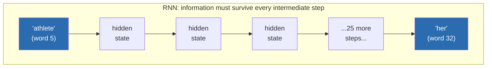

# Chapter 4: NLP Fundamentals

*Before Transformers, there was thirty years of clever engineering to make computers deal with the fact that language is messy, ambiguous, and — worst of all — ordered.*

## Learning Objectives

By the end of this chapter, you will be able to:

- Trace the classic text-processing pipeline from raw text to tokens, and explain what each stage does
- Distinguish stemming from lemmatization with a concrete example, and know when each is appropriate
- Explain what POS tagging and Named Entity Recognition do, and why both are still used inside modern NLP pipelines today
- Explain why one-hot encoding is a poor representation for words, and what the distributional hypothesis proposes instead
- Compare Word2Vec, GloVe, and FastText: how each is trained, what each is good at, and why FastText handles words a model has never seen before
- Describe how classic (pre-Transformer) systems approached text classification, sentiment analysis, question answering, machine translation, and summarization, and name the shared limitation of bag-of-words approaches
- Explain how an RNN processes a sequence and maintains a hidden state, and why this improves on bag-of-words for tasks that depend on word order
- Articulate the two specific failure modes of RNNs — sequential computation and vanishing gradients — that motivate the invention of attention in Chapter 5

---

## Prerequisites for This Chapter

This chapter builds directly on **[Chapter 3: Deep Learning Fundamentals](./03-deep-learning-fundamentals.md)**, where you learned:

- What a neuron is, how activation functions introduce nonlinearity, and how a network is organized into layers
- How a network learns via a training loop: forward pass → loss → backward pass (backpropagation) → weight update
- What a gradient is, and, importantly for this chapter, what it means for a gradient to *vanish* as it is propagated backward through many layers or many steps

You'll need all three of those ideas here. Word embeddings (Section 5) are not hand-designed lookup tables — they are the learned weights of a small neural network trained with exactly the forward-pass/loss/backward-pass loop you saw in Chapter 3. And the "vanishing gradient" problem that made training deep networks hard in Chapter 3 is the *exact same mathematical phenomenon* that cripples RNNs on long sequences in Section 8 of this chapter — same disease, different patient.

No new setup is required. Code snippets in this chapter use plain Python and, optionally, `nltk`/`spacy`/`gensim` if you want to run them yourself (`pip install nltk spacy gensim`).

---

## 1. The Classic Text Processing Pipeline

Before any statistics or neural networks touch a piece of text, it has to be broken down into pieces a program can iterate over. This pipeline predates deep learning entirely — it's the same scaffolding search engines, spell checkers, and spam filters have used for decades, and pieces of it are still running inside production NLP systems today.

```
Raw text
   │
   ▼
Sentence Segmentation   →  split a document into sentences
   │
   ▼
Word Tokenization       →  split each sentence into words/punctuation
   │
   ▼
(Sub-word) Tokenization →  split words into smaller pieces models can share across vocabulary
   │
   ▼
Tokens → IDs            →  map each piece to an integer for the model to consume
```

**Sentence segmentation** sounds trivial — split on `.`, `!`, `?` — until you meet "Dr. Smith paid $3.50 for the U.S. flag." A naive splitter fragments that into nonsense. Real sentence segmenters use rules and statistical models to know that "Dr." doesn't end a sentence but the period after "flag" does.

**Word tokenization** splits a sentence into words and punctuation marks: `"I can't wait!"` → `["I", "ca", "n't", "wait", "!"]` (note how `can't` splits into two tokens in many tokenizers, because "n't" carries its own grammatical meaning — a negation).

**Sub-word tokenization** is the step that matters most for everything else in this course, and we are deliberately not going deep on it here. For now, know that a word like "unhappiness" might be split further into pieces like `["un", "happi", "ness"]` so that a fixed, manageable vocabulary (tens of thousands of pieces) can still represent millions of possible words by combining pieces. This lets a model handle a word it has never seen ("unfollowability") by decomposing it into pieces it *has* seen. We are using the word "tokens" loosely and informally in this chapter — the full mechanics of Byte-Pair Encoding, WordPiece, and SentencePiece, and why modern LLMs are built entirely around this idea, is the subject of an entire dedicated chapter: **[Chapter 8: Tokenization Deep Dive](./08-tokenization-deep-dive.md)**. Everything in *this* chapter treats "tokens" as roughly "words," which is a simplification good enough for classic NLP but one you should mentally flag for revision later.

**Tokens → IDs** is the final mechanical step: every unique token in the vocabulary gets assigned an integer, so `"the"` might become `id=17`, `"cat"` might become `id=4821`. This is where Section 4 picks up — because the integer itself (`4821`) is a terrible representation of meaning, and fixing that is the central idea of this chapter.

---

## 2. Classical Preprocessing Techniques

Once text is tokenized, classic NLP pipelines applied a series of normalization steps to reduce noise and vocabulary size before feeding tokens into statistical models. Even though modern LLMs skip most of these (a Transformer learns to handle raw sub-word tokens directly), you will still encounter these techniques constantly in production systems — search indexing, log analysis, lightweight classifiers, and feature engineering for non-LLM ML models.

### 2.1 Stop Word Removal

**Stop words** are extremely common words — "the," "is," "at," "which," "a" — that carry little discriminating meaning for many tasks. A classic bag-of-words classifier counts word frequencies to distinguish document topics; if every document is dominated by counts of "the" and "is," those counts drown out the words that actually differentiate topics. Removing stop words before counting sharpens the signal.

```
Before: "The cat is sitting on the mat"
After:  ["cat", "sitting", "mat"]
```

The trade-off: stop word removal can destroy meaning-bearing structure. "To be or not to be" becomes an empty list. Modern deep learning models almost never remove stop words — the model learns to down-weight uninformative words on its own, and function words like "not" can flip a sentence's entire meaning (Section 6 will show exactly this failure mode with negation).

### 2.2 Stemming vs. Lemmatization

Both techniques try to collapse different inflected forms of a word ("running," "runs," "ran") down to one representative form, so that a statistical model treats them as the "same" word for counting purposes. They differ sharply in *how*.

**Stemming** applies crude, rule-based suffix-stripping — fast, but linguistically unaware. It chops off common endings without understanding grammar.

**Lemmatization** looks up the word's dictionary base form (its *lemma*) using vocabulary and grammatical knowledge — usually part-of-speech aware, slower, but linguistically correct.

Here's the same word processed by both, showing exactly where they diverge:

| Input word | Stemming (Porter stemmer) | Lemmatization |
|---|---|---|
| `running` | `run` | `run` |
| `ran` | `ran` | `run` |
| `runs` | `run` | `run` |
| `better` | `better` | `good` |
| `studies` | `studi` | `study` |

Notice two things. First, on `running`, both agree — this is the easy case that makes people think they're interchangeable. Second, on `ran` and `better`, they diverge badly: the stemmer, being a dumb suffix-stripper, doesn't know that "ran" is the past tense of "run" (there's no suffix to strip — it's an *irregular* form), and it doesn't know "better" is the comparative of "good" at all. The lemmatizer, because it uses an actual vocabulary and grammatical rules, gets both right. Also notice `studi` — the stemmer produces a string that isn't even a real English word, which is normal for stemmers and can look alarming the first time you see it.

**When to use which:** stemming is faster and fine for coarse tasks like search-engine indexing, where matching "studies" and "studying" to the same bucket matters more than grammatical precision. Lemmatization is preferred whenever the *correctness* of the base form matters — for instance, feeding cleaned text into a rule-based grammar checker or a linguistic feature extractor.

### 2.3 Part-of-Speech (POS) Tagging

POS tagging assigns a grammatical role — noun, verb, adjective, adverb, preposition, etc. — to every token in a sentence, based on both the word itself and its surrounding context (the same word can be different parts of speech in different sentences).

```
Sentence: "The old man the boats."

Word:  The   old   man   the   boats
POS:   DET   ADJ   VERB  DET   NOUN
```

That sentence is a classic linguistics trick — "man" is usually a noun, but here it's used as a verb (meaning "to staff/operate"), and only correct POS tagging (informed by context — "the" right before it signals a noun *should* follow, but "boats" right after signals this "man" must be the verb) resolves the ambiguity. POS tags feed directly into parsers (which build a sentence's grammatical tree), into lemmatizers (knowing a word is a verb tells the lemmatizer which base form to look up), and into information extraction pipelines that only care about, say, all the verbs in a legal contract.

### 2.4 Named Entity Recognition (NER)

NER scans text and labels spans of tokens that refer to real-world entities — people, organizations, locations, dates, monetary amounts — with a category tag.

```
Input:  "Satya Nadella announced that Microsoft will invest $10 billion in OpenAI by 2026."

Output: [Satya Nadella]_PERSON announced that [Microsoft]_ORG will invest [$10 billion]_MONEY
        in [OpenAI]_ORG by [2026]_DATE.
```

NER is the backbone of countless production systems: resume parsers extracting candidate names and companies, financial compliance tools flagging monetary amounts and dates in contracts, and search engines building structured knowledge panels from unstructured news text. Note that NER, like POS tagging, still runs today as a fast, cheap, deterministic-ish preprocessing pass even in LLM-based pipelines — it's often cheaper and more reliable to run a dedicated NER model to extract structured entities than to ask an LLM to do it via a prompt, especially at high volume.

---

## 3. Why One-Hot Encoding Fails

Preprocessing gives us clean tokens. Now we need to turn each token into numbers a model can compute with. The naive approach, historically the first one tried, is **one-hot encoding**.

Suppose your vocabulary has 50,000 words. One-hot encoding represents each word as a vector of length 50,000, with a single `1` at that word's assigned index and `0` everywhere else.

```
Vocabulary (simplified to 6 words): [cat, kitten, dog, spreadsheet, run, happy]

"cat"         → [1, 0, 0, 0, 0, 0]
"kitten"      → [0, 1, 0, 0, 0, 0]
"spreadsheet" → [0, 0, 0, 1, 0, 0]
```

This has three fatal problems for any real system:

1. **Size.** A real vocabulary is 50,000–100,000+ words. Every single word becomes a 50,000-dimensional vector that is almost entirely zeros. That's enormous memory waste for information that's mostly "not this word."

2. **Sparsity.** Because nearly every value is zero, there's no way to do meaningful arithmetic. You can't add, average, or compare these vectors and get anything sensible out — a dot product between any two *different* one-hot vectors is always exactly `0`.

3. **No notion of similarity — this is the real killer.** Compute the similarity between `"cat"` and `"kitten"` using these vectors: their dot product is `0`. Now compute the similarity between `"cat"` and `"spreadsheet"`: also `0`. **Under one-hot encoding, "cat" and "kitten" are exactly as unrelated as "cat" and "spreadsheet."** There is no dimension, no geometry, nothing in the representation that encodes "these two words tend to mean similar things." Every word is equally, maximally distant from every other word. A model working from one-hot vectors has to relearn every relationship between every pair of words from scratch, with zero head start from the representation itself.

This is exactly the same one-hot-vs-dense contrast the RAG course's embeddings chapter makes about arbitrary word IDs — "dog = 482, puppy = 9,013" carries no relationship either. The fix is the same idea in both places: **replace sparse, arbitrary representations with dense vectors positioned by meaning.**

---

## 4. The Distributional Hypothesis

If one-hot vectors encode zero relationship between words, we need a way to *learn* relationships automatically, without a human hand-labeling "cat is similar to kitten" for every pair of words in the language (that doesn't scale past a dictionary's worth of entries, let alone slang, jargon, and new words).

The idea that unlocked this, formulated by linguist J.R. Firth in 1957, is the **distributional hypothesis**:

> **Words that occur in similar contexts tend to have similar meanings.**

Consider filling in the blank in these two sentences:

```
"I fed my ___ some kibble this morning."
"I fed my ___ some kibble this morning."
```

You'd naturally fill that blank with "dog," "cat," or "kitten" — all words that share the property of appearing near "fed," "kibble," and "morning" in real text. You would never fill it with "spreadsheet," "democracy," or "Tuesday" — those words simply don't co-occur with "kibble" in the sentences humans actually write. If you scan millions of real sentences and tally, for every word, *which words tend to appear near it*, words like "dog," "cat," and "kitten" end up with nearly identical co-occurrence statistics, while "spreadsheet" ends up with a completely different profile. That shared statistical fingerprint — not any hand-coded rule about biology or pets — is the raw material every word embedding technique in this chapter turns into a vector.

This single idea is the intuition behind every embedding method that follows: Word2Vec, GloVe, FastText, and, eventually, the contextual embeddings inside Transformers themselves (Chapter 6 onward). They differ in *how* they turn co-occurrence statistics into vectors, not in the underlying insight.

---

## 5. Word Embeddings: Dense Vectors With Geometry

A **word embedding** replaces the one-hot vector with a short, dense vector — typically 50 to 300 numbers instead of 50,000 — where every position holds a meaningful (if individually uninterpretable) real number, learned from data using the distributional hypothesis.

```
One-hot "cat":     [0, 0, 0, 0, ..., 1, ..., 0, 0]      (50,000 dimensions, one 1)
Embedding "cat":   [0.21, -0.53, 0.02, 0.87, ..., -0.14] (300 dimensions, all meaningful)
```

Crucially, the *geometry* of the resulting vector space now encodes relationships. Words used in similar contexts end up close together:

```
distance(embedding("cat"), embedding("kitten"))       →  small (close)
distance(embedding("cat"), embedding("spreadsheet"))  →  large (far)
```

And, famously, relationships between words become consistent *directions* you can do arithmetic with — the same emergent structure you'd see plotted for `king`/`queen`/`man`/`woman` in a 2D toy embedding space:

```
vector("king") - vector("man") + vector("woman") ≈ vector("queen")
```

Nobody programmed a "royalty" dimension or a "gender" dimension. This structure *emerged* purely from training a model to predict context from massive amounts of text, which is exactly the neural training loop you studied in Chapter 3: define a task, define a loss, run forward/backward passes, update weights, repeat over billions of examples. The "model" being trained here is small and the "task" is deliberately simple — but it's a real neural network learning real weights via real backpropagation. The rest of this section covers the three techniques that made this practical at scale: Word2Vec, GloVe, and FastText.

### 5.1 Word2Vec (2013): Learning Embeddings From a Prediction Task

Word2Vec, introduced by Mikolov et al. at Google in 2013, turns the distributional hypothesis into a concrete, trainable neural network task. It never directly counts co-occurrences — instead, it trains a small neural network to solve a *fake* prediction task, and then throws away the network's output and keeps only its internal weights, because those weights turn out to be exactly the dense embeddings we want. There are two variants, mirror images of each other:

**CBOW (Continuous Bag of Words):** given the surrounding context words, predict the missing middle word.

```
Context: ["The", "sat", "on", "the", "mat"]  →  predict the missing word: "cat"
```

**Skip-gram:** the reverse — given one word, predict its surrounding context words.

```
Word: "cat"  →  predict likely nearby words: "The", "sat", "on", "mat"
```

Neither task is the actual goal. Nobody cares whether the model can correctly guess "cat" from context, or vice versa. The goal is what the network is *forced to learn internally* in order to get good at that task: to solve it well across millions of sentences, the network must arrange word vectors so that words appearing in similar contexts land near each other in vector space — which is precisely the distributional hypothesis, operationalized as a training objective. Once training finishes, you discard the prediction head and keep the hidden-layer weight matrix — one row per vocabulary word — as your embedding table. CBOW trains faster and works well for frequent words; skip-gram is slower but tends to do better on rare words, because it generates more training pairs per occurrence of a rare word.

### 5.2 GloVe (2014): Learning From Global Co-occurrence Statistics

GloVe (Global Vectors, Stanford, Pennington et al. 2014) takes a different route to the same destination. Instead of Word2Vec's local prediction task (sliding a small window over text one sentence at a time), GloVe starts by building one giant **co-occurrence matrix** for the entire corpus: a table where cell `(i, j)` counts how many times word `i` and word `j` appeared near each other, tallied across the *whole* dataset up front.

```
                cat   kitten  dog   spreadsheet
        cat  [   -     843    412        2      ]
     kitten  [  843     -     201        0      ]
        dog  [  412    201     -         1      ]
spreadsheet  [   2       0      1        -      ]
```

GloVe then factorizes this matrix — a linear-algebra technique that finds a smaller set of dense vectors such that the dot product of any two word-vectors approximates the (log of the) co-occurrence count between those two words. "cat" and "kitten" co-occur constantly, so their vectors are pushed to have a high dot product (i.e., point in similar directions); "cat" and "spreadsheet" almost never co-occur, so their vectors are pushed apart. The practical difference from Word2Vec: GloVe explicitly leverages *global* corpus statistics computed once, while Word2Vec learns incrementally from *local* context windows. In practice, the two produce embeddings of broadly similar quality, and the choice between them was often more about training infrastructure and available pretrained vectors than a fundamental quality gap.

### 5.3 FastText (2016): Sub-word-Aware Embeddings

Both Word2Vec and GloVe share a hard limitation: they only know about whole words that appeared in the training corpus. If your model was trained without ever seeing the word "unfollowable," it has no vector for it at all — this is the classic **out-of-vocabulary (OOV)** problem, and it's especially painful for morphologically rich languages (heavy use of prefixes/suffixes, like Finnish or Turkish) and for any domain with typos, slang, or made-up product names.

FastText (Facebook AI Research, Bojanowski et al. 2016) fixes this by representing each word as a bag of **character n-grams** in addition to the whole word itself. For example, "kitten" (with boundary markers) might decompose into 3-grams like:

```
"kitten" → <ki, kit, itt, tte, ten, en>, plus the whole word "kitten"
```

Each n-gram gets its own learned vector, and a word's final embedding is the sum (or average) of the vectors for all its n-grams. This has an immediate, powerful consequence: a never-seen word like "kittenish" shares n-grams (`kit`, `itt`, `tte`, `ten`) with "kitten," so FastText can produce a *reasonable* embedding for it on the fly, by composing the n-gram vectors it already knows — even though the exact word "kittenish" never appeared in training. Word2Vec and GloVe simply cannot do this; they would return nothing, or a generic fallback "unknown word" vector, for any word outside their fixed vocabulary.

### 5.4 Comparison Table

| Technique | Year | Core mechanism | Strength | Weakness |
|---|---|---|---|---|
| **Word2Vec** | 2013 | Neural net trained on local context-prediction task (CBOW/skip-gram) | Fast to train, captures strong local semantic/syntactic relationships (king − man + woman ≈ queen) | Whole-word only; fails completely on out-of-vocabulary words |
| **GloVe** | 2014 | Matrix factorization over global corpus co-occurrence counts | Leverages entire corpus statistics directly; often strong on word-analogy benchmarks | Whole-word only; same OOV failure as Word2Vec; needs the full co-occurrence matrix in memory |
| **FastText** | 2016 | Word2Vec-style training, but on character n-grams instead of whole words | Handles OOV words and typos gracefully via sub-word composition; strong for morphologically rich languages | Slightly more expensive to train/store (many more n-gram vectors); sub-word signal can be noisy for short words |

All three share the same fundamental ceiling, which the next sections build toward: **every word gets exactly one fixed vector, regardless of context.** "Bank" gets one embedding whether the sentence is about a river bank or a savings bank. Resolving *that* limitation is what contextual embeddings inside Transformers eventually do (Chapter 6) — but that's getting ahead of ourselves. First, we need to see how the pre-Transformer era coped without them.

---

## 6. Classic NLP Problems, Pre-Transformer

With tokens, preprocessing, and embeddings in hand, here's how five foundational NLP problems were tackled before Transformers existed, and where each approach broke down.

**Text Classification** (e.g., routing support tickets to a department): represent a document as a **bag-of-words** — a vector of word counts or TF-IDF scores, ignoring word order entirely — and feed it into a classical classifier (Naive Bayes, logistic regression, SVM). *Limitation:* "bag of words" is a literal description — order is completely discarded, so "not good, terrible" and "not terrible, good" can produce near-identical feature vectors despite opposite meaning.

**Sentiment Analysis** (positive/negative/neutral): often the same bag-of-words/TF-IDF machinery as text classification, sometimes augmented with a hand-built lexicon of positive/negative words (e.g., "great" = +1, "awful" = −1) that gets summed. *Limitation:* this famously breaks on negation and intensifiers. "This movie is not good" contains the positive word "good," and a naive lexicon-sum approach can score it positive — the word "not" needs to be understood as flipping everything after it, which requires modeling *order and structure*, not just presence of words.

**Question Answering**: classic systems relied heavily on **keyword/lexical matching** — find the passage with the highest word overlap with the question, then apply hand-built pattern rules or shallow statistical models to extract an answer span. *Limitation:* a question like "What company did the person who founded Tesla previously start?" requires multi-hop reasoning connecting facts across the text, not just matching overlapping keywords — lexical overlap systems have no mechanism for that kind of chained inference.

**Machine Translation**: **Statistical Machine Translation (SMT)**, dominant through the 2000s, learned phrase-to-phrase translation probabilities from huge bilingual corpora (e.g., European Parliament proceedings, translated into all EU languages) and stitched translated phrases together with a language model to keep the output fluent. *Limitation:* SMT struggled badly with long-range reordering — languages that put verbs in very different positions (e.g., German's verb-final subordinate clauses) required the system to reorder words across long spans, and phrase-based stitching handled short-range reordering far better than long-range.

**Summarization**: pre-Transformer systems were almost entirely **extractive** — score every sentence in a document by some heuristic (word frequency, position in the document, overlap with the title) and concatenate the top-scoring sentences verbatim as the "summary." *Limitation:* extractive summaries can only ever be a subset of the original sentences; they cannot paraphrase, compress two sentences into one, or generate a genuinely novel sentence that synthesizes information the way a human abstract would.

Look at the pattern across all five: nearly every limitation traces back to the same root cause — **these approaches either ignore word order entirely (bag-of-words) or handle it only in short, local windows (phrase-based SMT).** That observation is exactly what motivates the next section.

---

## 7. Why Order Matters: Enter Sequence Models

Bag-of-words throws away order completely. Word2Vec/GloVe/FastText embeddings are an improvement — each word now has a meaningful vector — but a sentence is still typically used as an unordered *set* or *average* of its word vectors in the simplest pipelines, which still loses order. Yet plainly, order carries meaning:

```
"The dog bit the man."
"The man bit the dog."
```

Identical bag-of-words representation (same multiset of words: `{the, the, dog, bit, man}` appears twice each way). Wildly different meaning. Any model that can't distinguish these two sentences is fundamentally broken for a huge range of real tasks — translation, question answering, and sentiment analysis (as you saw with negation above) all depend on getting order right.

### 7.1 The Recurrent Neural Network (RNN)

The **Recurrent Neural Network** was the dominant architecture for handling ordered sequences before Transformers. The core idea: process the sequence **one token at a time**, and carry a running summary — the **hidden state** — forward from each step to the next.

```
        h₀              h₁              h₂              h₃
         │               │               │               │
         ▼               ▼               ▼               ▼
      ┌─────┐         ┌─────┐         ┌─────┐         ┌─────┐
x₁ →  │ RNN │  h₁ →   │ RNN │  h₂ →   │ RNN │  h₃ →   │ RNN │  → h₄
      │cell │         │cell │         │cell │         │cell │
      └─────┘         └─────┘         └─────┘         └─────┘
        ▲                ▲               ▲               ▲
       "The"            "dog"           "bit"           "man"
```

At each time step `t`, the RNN cell takes two inputs — the embedding of the current word `xₜ` and the hidden state carried over from the previous step `h_{t-1}` — and produces a new hidden state `hₜ`:

```
hₜ = f(W · xₜ + U · h_{t-1} + b)
```

where `f` is a nonlinear activation function (the same kind of activation function from Chapter 3), and `W`, `U`, `b` are learned weight matrices/bias, shared across every time step. Intuitively, `hₜ` is the network's evolving "memory" of everything it has read so far, compressed into one fixed-size vector, updated word by word. By the time the RNN reaches "man" at the end of "The dog bit the man," `h₃` in principle encodes something like "so far: a dog performed a biting action, and the object was a man" — order-dependent information that a bag-of-words average simply cannot represent, because the RNN's hidden state at any point depends on the *sequence* of updates that produced it, not just which words were present.

This is a genuine, important advance: RNNs (and their more capable variant, **LSTMs** — Long Short-Term Memory networks, which add gating mechanisms to better control what the hidden state remembers and forgets) let a model finally be sensitive to word order, and they powered real production systems for sentiment analysis, machine translation (as "Neural Machine Translation," replacing phrase-based SMT), and text generation throughout the early-to-mid 2010s.

### 7.2 Worked Example: Tracing the Hidden State

Let's trace what happens, conceptually, feeding "not good" into an RNN one word at a time, to see how the hidden state actually resolves the negation problem that broke lexicon-sum sentiment analysis in Section 6.

```
Step 1: input = "not"
        h1 = f(W·embed("not") + U·h0 + b)
        → h1 encodes: "a negation has just occurred, expect it to flip whatever comes next"

Step 2: input = "good"
        h2 = f(W·embed("good") + U·h1 + b)
        → h2 combines "good" together WITH the memory that a negation preceded it,
          producing a hidden state that reflects "negated positive" ≈ overall negative
```

Because `h2` is computed *from* `h1` (not independently), the model's final representation of "not good" is contextual — it depends on the order in which the words arrived, not merely on which words are present. This is the mechanism that fixes the negation failure from Section 6. A trained sentiment classifier sitting on top of `h2` can now correctly output "negative," where a bag-of-words lexicon-sum could not.

---

## 8. The Central Problem: Why RNNs Weren't Enough

RNNs fixed the order problem. But they introduced — or rather, never solved — two problems of their own, and these two problems are the entire reason the field moved to attention and Transformers. Understanding them precisely is the single most important takeaway of this chapter, because Chapter 5 opens by solving exactly this.

### 8.1 Problem One: Strictly Sequential Computation

Look again at the diagram in Section 7.1. To compute `h₃`, the RNN *must* first have computed `h₂`, which required `h₁`, which required `h₀`. There is no way to skip ahead — every hidden state has a hard data dependency on the one before it.

This matters enormously for hardware. GPUs are extraordinarily good at doing thousands of independent computations *in parallel*, but a strict, step-by-step dependency chain like an RNN's forward pass cannot be parallelized across time steps — step 500 simply cannot start until step 499 finishes, no matter how many GPU cores are sitting idle. For a training corpus of billions of words, and especially for long documents, this sequential bottleneck makes RNNs slow to train and slow to run at scale, in a way that has nothing to do with model quality and everything to do with the architecture's fundamental shape.

### 8.2 Problem Two: Vanishing Gradients Over Long Sequences

This is the same vanishing gradient phenomenon from Chapter 3, showing up in a new setting. When an RNN is trained, the error signal (gradient) from a late time step has to be propagated *backward through every single earlier time step* to update the weights responsible for early words — this process is literally called **backpropagation through time**. And just as gradients can shrink to near-zero as they're propagated backward through many stacked layers of a deep feedforward network (Chapter 3), they can shrink to near-zero as they're propagated backward through many stacked *time steps* of a long sequence — mathematically, it's the same repeated-multiplication-of-small-numbers problem, just unrolled across time instead of across depth.

The practical consequence: information from early in a long sequence gets diluted, and eventually effectively "forgotten," by the time the RNN reaches the end. Consider this sentence:

```
"The trophy that the athlete, who had trained for a decade despite repeated injuries 
 and setbacks that would have discouraged almost anyone else, finally lifted above her 
 head in triumph after the race, was made of solid gold."
```

To correctly resolve what "her" refers to, and to correctly connect "lifted" back to its subject "the athlete," a model needs to carry information about "the athlete" all the way from word 5 to word 30-plus, across an intervening clause stuffed with unrelated detail. An RNN's hidden state is a single fixed-size vector, repeatedly overwritten at every step — by the time it has processed the interjected clause about injuries and setbacks, the signal about "the athlete" has been diluted by dozens of intervening updates, and the gradient connecting "her" back to "athlete" during training has shrunk close to zero. In practice, RNNs (even LSTMs, which mitigate but do not eliminate this) become noticeably less reliable the longer the gap between a piece of information and the point where it's needed.



Every arrow in that chain is a place where the signal about "the athlete" can degrade a little further. Twenty-five compounding degradations later, the connection is often too weak to reliably influence the model's behavior at word 32.

### 8.3 The Bridge to Chapter 5

Stack these two problems together and you get the central limitation of the entire pre-Transformer era of deep learning for NLP:

- RNNs process tokens **strictly sequentially** — slow, and impossible to parallelize across a GPU, which becomes a serious wall as datasets and models scale up.
- RNNs suffer **vanishing gradients over long sequences** — causing them to effectively forget information from early in a long input by the time they reach the end.

Both problems share a single root cause: forcing a model to represent *all* relevant context by squeezing it through one fixed-size hidden state, updated one token at a time, with no direct path back to any earlier token except through that narrow, repeatedly-overwritten channel.

**Chapter 5 introduces the mechanism that solves exactly this problem: attention.** Instead of forcing information to survive a long relay race through hidden states, attention gives every position in a sequence a direct, weighted connection to every other position — no relay, no dilution, and, crucially, no strict sequential dependency standing in the way of GPU parallelism. That single architectural change is the hinge point this entire course pivots on: everything from Chapter 6's Transformer onward is a consequence of taking attention seriously.

---

## Real-World Scenario

A team at a mid-sized e-commerce company builds a customer review analysis pipeline in 2015, using exactly the classic stack from this chapter: NLTK for tokenization and stemming, a hand-built stop word list, TF-IDF features feeding a logistic regression sentiment classifier, and a small LSTM for aspect extraction ("is this review about shipping, quality, or price?").

The system works reasonably well on short reviews ("Great price, fast shipping!" → correctly positive). But the team notices a consistent failure pattern on longer reviews:

```
"I was skeptical after reading some negative reviews about durability, and honestly 
the first unit I received did have a minor defect, but after contacting support — 
who I have to say were incredibly patient and helpful throughout — and receiving a 
replacement, which arrived faster than expected and worked perfectly, I have to say 
I'm genuinely impressed with this company overall."
```

The LSTM sentiment classifier, trained on this and similar reviews, frequently mis-scores long, mixed-sentiment reviews like this one as negative — apparently anchoring on the early negative-sounding clauses ("skeptical," "negative reviews," "defect") and failing to properly weigh the strongly positive resolution at the end, twenty-plus words later. The team initially assumes it's a training data problem and collects more labeled examples, which helps only marginally.

The real cause, diagnosed later once attention-based models became available for comparison, was exactly the vanishing-gradient forgetting problem from Section 8: the hidden state carrying "skeptical... defect" forward gets progressively diluted by the time the LSTM reaches "genuinely impressed," and the gradient signal connecting the final sentiment label back to that early negative framing dominates disproportionately, distorting the model's learned behavior on long, structurally complex reviews. Swapping the sentiment classifier for an attention-based model later resolved the issue almost entirely, because attention lets the model directly weigh "genuinely impressed" as the dominant, closer-to-final signal without that information having to survive a long relay through a single hidden state.

---

## Best Practices

- **Still use POS tagging and NER as fast, cheap preprocessing** even in LLM-based pipelines — extracting structured entities with a dedicated model is often more reliable and far cheaper at scale than prompting an LLM for the same extraction.
- **Choose stemming vs. lemmatization deliberately**, not by default — use stemming for high-volume, coarse tasks like search indexing; use lemmatization when grammatical correctness of the base form matters downstream.
- **Don't remove stop words before feeding text to a neural model** (embeddings, RNNs, Transformers) — modern models use function words as real signal (e.g., "not," "very"); stop-word removal is a bag-of-words-era technique that actively hurts models that use word order.
- **Match your embedding technique to your OOV risk.** If your domain has heavy neologisms, typos, product codes, or a morphologically rich language, prefer FastText (or a modern sub-word tokenizer, Chapter 8) over plain Word2Vec/GloVe.
- **Recognize the "bag-of-words ceiling" early.** If a task's correctness depends on negation, multi-hop reasoning, or long-range structure, a bag-of-words or simple averaged-embedding approach will silently plateau — that's a signal to reach for a sequence model or, in a modern stack, a Transformer.
- **When debugging a sequence model's failures on long inputs**, always check whether the failure correlates with input length — a classifier that degrades specifically on long inputs is exhibiting the vanishing-gradient symptom described in Section 8, not a data-quality problem.

---

## Common Mistakes

- **Treating stemming and lemmatization as interchangeable.** They frequently agree on regular words and diverge sharply on irregular forms ("ran," "better") — silently using the wrong one for a task that needs grammatical correctness (e.g., a downstream grammar tool) produces subtly broken output.
- **Applying one-hot encoding (or arbitrary integer IDs) directly as model input** and being surprised that a model can't generalize between related words — this is precisely the "cat is as unrelated to kitten as to spreadsheet" trap from Section 3.
- **Averaging word embeddings into a single sentence vector and expecting order-sensitive behavior.** Averaging Word2Vec/GloVe vectors is still, fundamentally, a bag-of-words operation at the sentence level — it inherits the same negation and word-order blindness as classic bag-of-words methods.
- **Assuming a bigger classic model (more LSTM layers, bigger hidden state) fixes the vanishing gradient problem.** It delays the symptom somewhat but does not remove the root cause — the fixed-size, sequentially-updated hidden state is a structural bottleneck, not a capacity problem.
- **Forgetting that Word2Vec/GloVe/FastText all produce one fixed vector per word regardless of context** — using them for a task where word sense disambiguation matters ("bank" the river vs. "bank" the institution) will silently blend both senses into one average-ish vector, degrading downstream accuracy.
- **Ignoring the OOV problem until it causes a production incident.** A Word2Vec/GloVe-based system with a fixed vocabulary will silently return an "unknown word" fallback vector for any unseen word — a new product name, a typo, slang — quietly degrading quality rather than raising an error.

---

## Summary

- Raw text passes through a pipeline — sentence segmentation → word tokenization → sub-word tokenization → integer IDs — before any model can compute with it; the sub-word tokenization step is previewed here and covered fully in Chapter 8.
- Classical preprocessing (stop word removal, stemming vs. lemmatization, POS tagging, NER) reduces noise and extracts structure, and several of these techniques (POS tagging, NER) remain useful even in modern, LLM-based pipelines.
- **One-hot encoding** is a broken representation for words: huge, sparse, and utterly blind to similarity — "cat" and "kitten" are as unrelated as "cat" and "spreadsheet" under one-hot.
- The **distributional hypothesis** — words in similar contexts have similar meaning — is the idea underlying every dense word embedding technique, replacing hand-labeled similarity with statistics learned from massive text corpora.
- **Word2Vec** (CBOW/skip-gram) learns embeddings via a local context-prediction task; **GloVe** learns them by factorizing a global co-occurrence matrix; **FastText** adds sub-word (character n-gram) awareness, solving the out-of-vocabulary problem the other two cannot.
- Classic pre-Transformer NLP systems (bag-of-words classifiers, lexicon-based sentiment, keyword-matching QA, phrase-based SMT, extractive summarization) shared a common weakness: ignoring or only locally handling word order.
- **RNNs** process a sequence step by step, maintaining a hidden state that makes the model sensitive to order — a genuine advance over bag-of-words — but this design has two structural flaws: computation is **strictly sequential** (no GPU parallelism across time steps) and gradients **vanish over long sequences** (causing the model to effectively forget distant context).
- These two flaws are precisely what **attention**, introduced in Chapter 5, was invented to solve.

---

## Knowledge Check

1. Explain, using the "cat"/"kitten"/"spreadsheet" example, exactly why one-hot encoding fails to represent word similarity — be specific about what the dot product between two one-hot vectors always equals.
2. Run "running," "ran," and "better" through both a stemmer and a lemmatizer in your head (or in code). On which of these three does the choice of technique matter most, and why?
3. Why does Word2Vec discard the network it trains and keep only the internal weights? What is the actual "product" of Word2Vec training?
4. A colleague wants to use plain Word2Vec embeddings for a chat product that deals heavily with newly coined slang and misspellings. What specific technical problem will they run into, and which embedding technique from this chapter would you recommend instead, and why?
5. In your own words, describe what an RNN's hidden state `hₜ` represents at time step `t`, and explain why this makes RNNs sensitive to word order in a way that averaged word embeddings are not.
6. Name the two specific, structural problems with RNNs that motivate attention, and explain why they share a common root cause.

---

## Hands-On Exercise

Work through this exercise using Python with `nltk` (`pip install nltk` and run `nltk.download('punkt')`, `nltk.download('averaged_perceptron_tagger')`, `nltk.download('wordnet')`) and, optionally, `gensim` for a pretrained Word2Vec/GloVe model.

**Part A — Preprocessing pipeline.** Take this sentence: `"The researchers, who had been studying the effects for years, finally published their surprising findings."`

1. Tokenize it into words.
2. Run both a stemmer (`nltk.stem.PorterStemmer`) and a lemmatizer (`nltk.stem.WordNetLemmatizer`) on every token. Print both outputs side by side and identify every word where the two disagree.
3. Run POS tagging (`nltk.pos_tag`) on the tokenized sentence and identify the subject and main verb of the sentence using the tags.

**Part B — Embedding similarity.** Using a pretrained embedding model (`gensim.downloader` has `word2vec-google-news-300` and `glove-wiki-gigaword-100` available for download):

1. Load a pretrained Word2Vec or GloVe model.
2. Compute the similarity between `("cat", "kitten")`, `("cat", "spreadsheet")`, and `("king", "queen")`. Confirm the scores match your intuition.
3. Try the classic analogy: compute `vector("king") - vector("man") + vector("woman")` and find the closest real word to the result (`model.most_similar(positive=["king", "woman"], negative=["man"])` in `gensim`). Does it return "queen"?
4. Try looking up a made-up word, like `"blorptastic"`. Confirm it raises a `KeyError` (out-of-vocabulary) — this is the exact OOV failure Section 5.3 describes. If you have FastText available (`gensim.models.fasttext`), repeat the lookup and observe that it *does* return a vector.

**Part C — Written reflection.** In 3-5 sentences, explain why the long sentence used in Part A (with its embedded relative clause "who had been studying the effects for years") would be a harder case for an RNN's hidden state to handle correctly than a short sentence, connecting your answer explicitly to Section 8.2.

---

## Further Reading

- Mikolov et al., ["Efficient Estimation of Word Representations in Vector Space"](https://arxiv.org/abs/1301.3781) (2013) — the original Word2Vec paper
- Pennington, Socher, Manning, ["GloVe: Global Vectors for Word Representation"](https://nlp.stanford.edu/pubs/glove.pdf) (2014) — the original GloVe paper, Stanford NLP
- Bojanowski et al., ["Enriching Word Vectors with Subword Information"](https://arxiv.org/abs/1607.04606) (2016) — the original FastText paper
- Hochreiter & Schmidhuber, ["Long Short-Term Memory"](https://www.bioinf.jku.at/publications/older/2604.pdf) (1997) — the original LSTM paper, addressing (but not eliminating) RNN vanishing gradients
- Jurafsky & Martin, [*Speech and Language Processing*](https://web.stanford.edu/~jurafsky/slp3/) (free online draft) — the standard NLP textbook covering tokenization, POS tagging, NER, and classic language models in full depth
- [spaCy 101](https://spacy.io/usage/spacy-101) — practical documentation for running tokenization, POS tagging, and NER in production-grade pipelines
- [Gensim Word2Vec Tutorial](https://radimrehurek.com/gensim/models/word2vec.html) — hands-on documentation for training and using Word2Vec models
- Christopher Olah, ["Understanding LSTM Networks"](https://colah.github.io/posts/2015-08-Understanding-LSTMs/) — the clearest visual explanation of how LSTMs extend the basic RNN hidden state

---

<div style="display:flex;justify-content:space-between;align-items:center;">
  <a href="./03-deep-learning-fundamentals.md">← Previous: Deep Learning Fundamentals</a>
  <a href="./00-index.md">🏠 Index</a>
  <a href="./05-attention-and-self-attention.md">Next: Attention Mechanisms & Self-Attention →</a>
</div>
