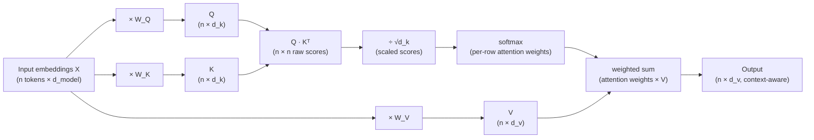
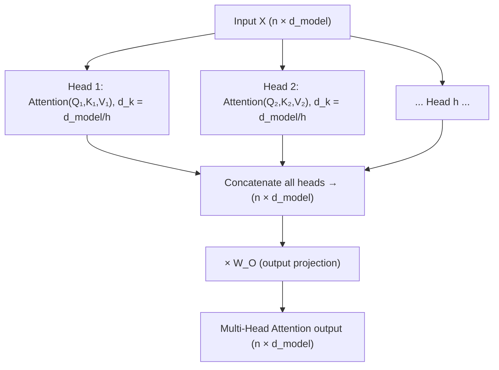

# Chapter 5: Attention Mechanisms & Self-Attention

> *"Attention is, in some sense, exactly the mechanism that lets a model decide what to look at — and everything built on top of the Transformer is downstream of that one idea."*

## Learning Objectives

By the end of this chapter, you will be able to:

- Explain, in plain language, why RNN/LSTM sequence-to-sequence models needed attention before Transformers existed
- Describe how Bahdanau/Luong attention let a decoder "look back" at encoder hidden states instead of relying on one fixed context vector
- Explain Query, Key, and Value vectors using a concrete retrieval analogy, and state precisely what each one represents
- Derive and compute the scaled dot-product attention formula `softmax(QKᵀ / √d_k) V` by hand on a toy example
- Distinguish causal (masked) self-attention from bidirectional self-attention and explain why GPT needs one and BERT needs the other
- Explain cross-attention and how it differs from self-attention
- Explain why multi-head attention exists and how heads split, compute, and recombine
- State the computational complexity of self-attention and why it matters for context-window cost

---

## Prerequisites for This Chapter

This chapter builds directly on two earlier chapters:

- **[Chapter 4: NLP Fundamentals](./04-nlp-fundamentals.md)**, which ended by identifying a specific, painful limitation: RNNs and LSTMs process a sequence **one token at a time**, carrying information forward through a hidden state. This works reasonably well for short sequences, but two problems compound as sequences get longer — (1) **vanishing gradients**, where the influence of an early token on the loss shrinks exponentially by the time gradients propagate back through dozens of time steps, making long-range dependencies hard to learn, and (2) **sequential computation**, where token 50 cannot be processed until tokens 1–49 have been processed, one at a time, making training and inference slow and hard to parallelize on modern GPUs. Chapter 4 closed with the open question: *is there a way to let a model directly relate any two tokens in a sequence, regardless of distance, without marching through every token in between?* This chapter answers that question.
- **[Chapter 2: Machine Learning Fundamentals](./02-machine-learning-fundamentals.md)**, specifically **matrix multiplication** and the **dot product** of two vectors. You should be comfortable with the fact that `A · B = Σ Aᵢ·Bᵢ` produces a single number measuring how aligned two vectors are, and that multiplying a `(n × d)` matrix by a `(d × d)` matrix produces an `(n × d)` matrix. Every formula in this chapter is built from those two operations — nothing more exotic is required.

No new setup is required. The worked example below can be reproduced with pen and paper, or in a few lines of NumPy if you prefer to check your arithmetic.

---

## 1. The Motivating Problem: One Fixed Vector Cannot Hold a Sentence

Recall the classic RNN-based **sequence-to-sequence (seq2seq)** architecture used for machine translation before 2015: an **encoder** RNN reads the source sentence one word at a time, updating its hidden state at every step, and after the last word, its final hidden state — a single fixed-size vector — is handed to a **decoder** RNN as "everything you need to know about the source sentence." The decoder then generates the translation one word at a time, conditioned only on that one vector and whatever it has generated so far.

This works passably for short sentences. It falls apart for long ones. Think about compressing a 40-word sentence into a single 512-number vector and asking the decoder to reconstruct a faithful translation from it 30 words later — by the time the decoder needs to translate the last few words, the encoder's memory of the sentence's opening has been diluted by every word that came after it. This is the same vanishing-gradient story from Chapter 4, now viewed from the inference side: **a single fixed-length "context vector" is an information bottleneck.** No matter how the encoder is trained, cramming an arbitrarily long sentence into one fixed-size vector throws information away, and it throws away more information the longer the sentence gets.

```
Encoder RNN:  "The"→"agreement"→"on"→"the"→"European"→"Economic"→"Area"→"was"→"signed"→"in"→"August"→"1992"
                                                                                                    │
                                                                                                    ▼
                                                                                     [ one 512-dim vector ]
                                                                                                    │
                                                                                                    ▼
Decoder RNN:                                          "L'accord" ← "sur" ← "l'espace" ← ... ← must reconstruct
                                                                                                the WHOLE sentence
                                                                                                from this one vector
```

This is the exact problem attention was invented to solve — not inside a Transformer (which didn't exist yet), but bolted onto the RNN encoder-decoder architecture itself.

---

## 2. Attention's First Appearance: Bahdanau and Luong Attention

In 2014, Dzmitry Bahdanau, Kyunghyun Cho, and Yoshua Bengio published *"Neural Machine Translation by Jointly Learning to Align and Translate,"* proposing a fix: instead of forcing the decoder to work from one fixed context vector, **keep every one of the encoder's hidden states around** (one per source word), and let the decoder, at each step of generating the output, compute a weighted combination of *all* of them — weighted by how relevant each encoder hidden state is to the word it's about to generate.

Concretely, at each decoding step:

1. The decoder's current hidden state is compared against **every** encoder hidden state, producing a relevance/alignment score for each one.
2. Those scores are normalized (via softmax) into a probability distribution — the **attention weights**.
3. A **context vector** for this specific decoding step is built as the weighted sum of all encoder hidden states, using those attention weights.
4. The decoder uses this step-specific context vector (not a single fixed one) to help produce the next output word.

This is a genuine breakthrough in framing: rather than encoding the source sentence once and hoping that single summary suffices for the entire translation, the model learns to **look back and re-weight the source sentence differently at every single output step.** When translating the word "signed" in the example above, attention might place most of its weight on the encoder hidden states for "was" and "signed"; when translating "in August 1992," it shifts weight toward the encoder states for the date. The model *learns* this alignment from data — nobody hand-codes which words align to which.

A year later, Minh-Thang Luong, Hieu Pham, and Christopher Manning published *"Effective Approaches to Attention-based Neural Machine Translation"* (2015), simplifying and generalizing the scoring function (introducing the "dot," "general," and "concat" scoring variants) and popularizing the terms **"global attention"** (attend to all encoder states, as above) and **"local attention"** (attend to a small window). Luong's dot-product scoring — literally just `decoder_state · encoder_state` — is the direct ancestor of the dot-product attention you'll compute by hand in Section 5.

**Why this mattered, and why it wasn't enough.** Bahdanau/Luong attention solved the information-bottleneck problem: the decoder could now access *any* encoder hidden state directly, with a learned weighting, instead of squeezing everything through one vector. Translation quality jumped noticeably, especially on longer sentences. But notice what *didn't* change: the encoder was still an RNN, still processing the source sentence strictly left-to-right, one token at a time, still vulnerable to the sequential-computation bottleneck from Chapter 4. Attention was **bolted onto** a fundamentally sequential architecture — it fixed the *memory* problem but not the *speed* problem. The next conceptual leap, taken by Vaswani et al. in 2017, was to ask a more radical question: what if attention wasn't just a patch on top of an RNN, but the *entire* mechanism a model uses to relate tokens to each other — with no RNN underneath it at all? That question produces **self-attention**, the subject of the rest of this chapter, and its full architectural realization, the Transformer, in Chapter 6.

---

## 3. Self-Attention: Query, Key, Value — The Library Catalog Analogy

Bahdanau attention related two *different* sequences: a decoder state to encoder states. **Self-attention** applies the same idea *within a single sequence* — every token looks at every other token in the same sequence (including itself) and decides how much to "pay attention" to each one when building its own updated representation.

Here's the intuition before any math. Imagine a library catalog search:

- **Query (Q)** — what you're searching for right now. You walk up to the catalog and type in what you're looking for: *"books about 19th-century French history."*
- **Key (K)** — the label/index card attached to every book, describing what that book is about. Every book in the library has one, whether or not anyone is currently searching.
- **Value (V)** — the actual content of the book — what you get to read if you decide this book is relevant.

You compare your **query** against every book's **key** to get a relevance score (how well does "19th-century French history" match this book's label?). Books with a strong match get a high score; irrelevant books get a low score. You don't check out *only* the single best-matching book — instead, imagine you take a **blend** of every book's content, weighted by how relevant each one was. A book that matched perfectly contributes almost all of its content to your blended result; a book that barely matched contributes almost nothing.

That is exactly self-attention. For every token in a sequence:

1. It produces a **Query** vector — "what information am I looking for from the rest of the sequence?"
2. Every token (including itself) also produces a **Key** vector — "here's a summary of what information I hold."
3. Every token also produces a **Value** vector — "here's the actual content I'll contribute if you decide I'm relevant."
4. The token's query is compared against every other token's key to get relevance scores, which are normalized into weights.
5. The token's new representation is the weighted blend of every token's **Value** vector, using those weights.

Every token does this *simultaneously and independently* — token 5's query doesn't wait for token 4 to finish. This is precisely what breaks the sequential bottleneck from Chapter 4: instead of information flowing token-by-token through a chain of hidden states, every token can directly query every other token's content in a single parallel computation, no matter how far apart they are in the sequence.

Critically, Q, K, and V are not three arbitrary copies of the input — they are three **different learned linear projections** of the same input embedding, produced by three separate weight matrices `W_Q`, `W_K`, and `W_V` that are learned during training:

```
Q = X · W_Q
K = X · W_K
V = X · W_V
```

where `X` is the matrix of input token embeddings (one row per token). The model *learns* what makes a good query, a good key, and a good value for the task at hand — nobody hand-designs these projections.

---

## 4. The Scaled Dot-Product Attention Formula

Putting the library analogy into an exact formula, from Vaswani et al. (2017), *"Attention Is All You Need"*:

```
                    (  Q Kᵀ  )
Attention(Q,K,V) = softmax( ──────── ) V
                    (  √d_k  )
```

Let's take this apart piece by piece.

### 4.1 `Q Kᵀ` — the raw relevance scores

`Q` is an `(n × d_k)` matrix (n tokens, each a `d_k`-dimensional query vector). `Kᵀ` is `K` transposed, shape `(d_k × n)`. Multiplying them gives an `(n × n)` matrix where entry `(i, j)` is `qᵢ · kⱼ` — the **dot product** between token i's query and token j's key.

Why does a dot product measure "relevance"? Recall from Chapter 2 that the dot product of two vectors is large and positive when they point in similar directions (are numerically aligned across most dimensions), near zero when they're unrelated/orthogonal, and negative when they point in opposing directions. If the model has learned to encode "the query for a verb looking for its subject" and "the key for a noun that is a subject" as vectors that point in a similar direction, their dot product will be large — exactly the "strong catalog match" from the library analogy. The entire relevance-scoring step is nothing more exotic than a large batch of dot products, computed all at once via matrix multiplication.

### 4.2 `/ √d_k` — why scaling is necessary

As the dimensionality `d_k` of the query/key vectors grows, the dot product `q · k` (a sum of `d_k` individual products) grows roughly in proportion to `d_k` in expectation — more terms being summed means larger typical magnitudes, even for random vectors. If those raw scores get large, the softmax function (next section) becomes extremely "peaky": one score dominates, its softmax probability approaches 1, and every other score's gradient approaches 0. Training grinds to a halt because gradients can't flow through a saturated softmax.

Dividing every score by `√d_k` counteracts exactly this growth — for vectors with roughly unit variance per component, the dot product's variance scales with `d_k`, so dividing by its square root renormalizes the scores back to a stable range regardless of dimensionality. This single division is a small detail with an outsized practical consequence: without it, self-attention becomes numerically unstable and much harder to train, especially as models scale to larger hidden dimensions.

### 4.3 `softmax(...)` — turning scores into a weighted-average distribution

Softmax converts a row of arbitrary real-valued scores into a probability distribution — all values between 0 and 1, summing to exactly 1 — via:

```
softmax(zᵢ) = e^zᵢ / Σⱼ e^zⱼ
```

This is exactly the "weight" step in the library analogy: after softmax, row `i` of the attention matrix tells you precisely how much of token `i`'s new representation should come from each other token's Value vector. Because it's exponential, softmax also naturally *amplifies* the gap between a strong match and a weak one — a raw score just slightly higher than another can translate into a noticeably higher attention weight, which is what lets attention behave "sharply" (concentrating on a few genuinely relevant tokens) rather than spreading attention evenly and uselessly across everything.

### 4.4 `... V` — the weighted blend

Multiplying the `(n × n)` softmax weight matrix by `V` (shape `(n × d_v)`) produces the final `(n × d_v)` output: row `i` is the weighted sum of every token's Value vector, weighted by how much attention token `i` pays to each token. This is the final step of the library analogy — you don't return the single best-matching book, you return a relevance-weighted blend of every book's content.

Put together, one call to `Attention(Q, K, V)` transforms every token's representation into a new representation that has "looked at" every other token in the sequence and pulled in exactly the information it needed, weighted by relevance — computed for every token in parallel, in one matrix multiplication.

---

## 5. Fully Worked Numeric Example — Computing Self-Attention by Hand

This is the heart of the chapter. We'll use a tiny toy sentence — **"The cat sat"** — with 3 tokens and 4-dimensional embeddings (real models use hundreds or thousands of dimensions; 4 is chosen purely so every number is checkable by hand).

### 5.1 Setup: input embeddings

Assume the embeddings below already include positional information (Chapter 6 covers positional encoding in detail — for now, just treat these as the model's input vectors for each token):

| Token | Embedding `x` |
|---|---|
| "The" (x₁) | `[1, 0, 1, 0]` |
| "cat" (x₂) | `[0, 1, 0, 1]` |
| "sat" (x₃) | `[1, 1, 0, 0]` |

Stacked into a matrix `X` (3 rows × 4 columns).

### 5.2 Step 1 — Project into Q, K, V using learned weight matrices

In a real model, `W_Q`, `W_K`, `W_V` are learned by gradient descent. Here we pick fixed toy values so the arithmetic is exact and reproducible. Each is a `4 × 4` matrix (`d_model = d_k = d_v = 4` for this single-head example — Section 10 shows what changes with multiple heads):

```
W_Q =            W_K =            W_V =
[1 0 0 0]        [1 0 1 0]        [1 0 0 1]
[0 1 0 0]        [0 1 0 0]        [0 1 0 1]
[1 0 1 0]        [0 0 1 0]        [1 0 1 0]
[0 1 0 1]        [1 0 0 1]        [0 0 1 1]
```

Computing `Q = X · W_Q` (each output row is the sum of the `W_Q` rows corresponding to the nonzero positions in that token's embedding — e.g., for `x₁ = [1,0,1,0]`, take `W_Q` row 0 + `W_Q` row 2):

| Token | Q | K | V |
|---|---|---|---|
| x₁ "The" | `[2, 0, 1, 0]` | `[1, 0, 2, 0]` | `[2, 0, 1, 1]` |
| x₂ "cat" | `[0, 2, 0, 1]` | `[1, 1, 0, 1]` | `[0, 1, 1, 2]` |
| x₃ "sat" | `[1, 1, 0, 0]` | `[1, 1, 1, 0]` | `[1, 1, 0, 2]` |

*(Verify one yourself: `q₂ = x₂·W_Q` where `x₂ = [0,1,0,1]` has nonzero entries at positions 1 and 3, so `q₂ = W_Q row1 + W_Q row3 = [0,1,0,0] + [0,1,0,1] = [0,2,0,1]`. ✓)*

### 5.3 Step 2 — Raw attention scores: `Q Kᵀ`

Every entry is a dot product between a Query row and a Key row. There are 3×3 = 9 dot products:

```
           k₁=[1,0,2,0]   k₂=[1,1,0,1]   k₃=[1,1,1,0]
q₁=[2,0,1,0]:   4              2              3
q₂=[0,2,0,1]:   0              3              2
q₃=[1,1,0,0]:   1              2              2
```

For example, `q₁ · k₁ = (2×1)+(0×0)+(1×2)+(0×0) = 4`.

### 5.4 Step 3 — Scale by `√d_k`

Here `d_k = 4`, so `√d_k = 2`. Divide every score by 2:

```
           k₁     k₂     k₃
q₁:       2.0    1.0    1.5
q₂:       0.0    1.5    1.0
q₃:       0.5    1.0    1.0
```

### 5.5 Step 4 — Softmax each row

Applying `softmax` independently to each row (using `e ≈ 2.71828`):

**Row 1** `[2.0, 1.0, 1.5]` → `e^2.0=7.389, e^1.0=2.718, e^1.5=4.482` → sum `= 14.589`
→ softmax = **`[0.5066, 0.1863, 0.3071]`**

**Row 2** `[0.0, 1.5, 1.0]` → `e^0.0=1.000, e^1.5=4.482, e^1.0=2.718` → sum `= 8.200`
→ softmax = **`[0.1220, 0.5465, 0.3315]`**

**Row 3** `[0.5, 1.0, 1.0]` → `e^0.5=1.649, e^1.0=2.718, e^1.0=2.718` → sum `= 7.085`
→ softmax = **`[0.2326, 0.3837, 0.3837]`**

Read Row 1 as: *"When 'The' builds its new representation, it draws 50.7% of its attention from itself, 18.6% from 'cat', and 30.7% from 'sat'."* Each row is a full probability distribution (sums to 1.0 — check: `0.5066+0.1863+0.3071 = 1.0000`).

### 5.6 Step 5 — Weighted sum of Value vectors

Multiply the softmax weight matrix by `V` — each output row is the weighted blend of `v₁, v₂, v₃`:

```
out₁ = 0.5066·v₁ + 0.1863·v₂ + 0.3071·v₃
     = 0.5066·[2,0,1,1] + 0.1863·[0,1,1,2] + 0.3071·[1,1,0,2]
     ≈ [1.320, 0.494, 0.693, 1.494]

out₂ = 0.1220·v₁ + 0.5465·v₂ + 0.3315·v₃
     = 0.1220·[2,0,1,1] + 0.5465·[0,1,1,2] + 0.3315·[1,1,0,2]
     ≈ [0.576, 0.878, 0.669, 1.878]

out₃ = 0.2326·v₁ + 0.3837·v₂ + 0.3837·v₃
     = 0.2326·[2,0,1,1] + 0.3837·[0,1,1,2] + 0.3837·[1,1,0,2]
     ≈ [0.849, 0.767, 0.616, 1.767]
```

These three 4-dimensional vectors — `out₁`, `out₂`, `out₃` — are the final self-attention output for "The," "cat," and "sat" respectively. Every one of them is now a blend of information from *all three* tokens, weighted by learned relevance — not a hand-off from a sequential chain of hidden states, but a direct, parallel computation across the whole sequence. This is the number you'd feed into the next layer of a Transformer (after the residual connection and layer norm you'll meet in Chapter 6).

### 5.7 Diagram of the full computation flow



---

## 6. Causal (Masked) Self-Attention

The example above let every token attend to every other token, including tokens that come *after* it — "The" was allowed to attend to "cat" and "sat." That's fine for a model that sees the whole sentence at once, but it's fatal for an **autoregressive, GPT-style model** that generates text one token at a time, left to right. If token 1 were allowed to attend to token 3 during training, the model would effectively be shown the answer before being asked to predict it — the model would learn to "cheat" by peeking at future tokens, and at actual generation time those future tokens don't exist yet anyway.

The fix is **causal masking** (also called a "look-ahead mask"): before applying softmax, set every score `(i, j)` where `j > i` (a future token relative to position i) to `-∞`. Since `e^-∞ = 0`, those positions receive exactly zero attention weight after softmax — position `i` can only ever attend to positions `≤ i`.

```
Mask matrix (● = allowed to attend, ✗ = masked to -∞)
              "The"  "cat"  "sat"
"The"  →       ●      ✗      ✗
"cat"  →       ●      ●      ✗
"sat"  →       ●      ●      ●
```

Applying this mask to our worked example changes the result for the first two tokens:

- **Row 1 ("The")**: only `k₁` is visible. The scaled score row `[2.0, -∞, -∞]` softmaxes to `[1.0, 0.0, 0.0]` — "The" can only attend to itself. `out₁_causal = v₁ = [2, 0, 1, 1]`, a dramatic change from the bidirectional `[1.320, 0.494, 0.693, 1.494]` computed in Section 5.
- **Row 2 ("cat")**: `k₁` and `k₂` are visible, `k₃` is masked. The scaled row `[0.0, 1.5, -∞]` softmaxes over just the first two values: `e^0.0=1.0, e^1.5=4.482`, sum `=5.482` → `[0.1825, 0.8175, 0.0]`. `out₂_causal = 0.1825·v₁ + 0.8175·v₂ ≈ [0.365, 0.818, 1.000, 1.818]` — noticeably different from the bidirectional `[0.576, 0.878, 0.669, 1.878]`.
- **Row 3 ("sat")**: all three tokens are visible either way (it's the last token, nothing comes after it), so `out₃_causal = out₃ = [0.849, 0.767, 0.616, 1.767]` — unchanged.

This is exactly the mechanism that makes GPT-style generation well-defined: at generation time, token `i` genuinely has no future tokens to see, and causal masking during training guarantees the model was never trained to depend on information it won't have at inference time. Every decoder-only LLM you interact with — GPT, Claude, Llama, Qwen — uses causal self-attention in every layer.

---

## 7. Cross-Attention

Self-attention relates a sequence to *itself*. **Cross-attention** relates *two different sequences*: the **Query** comes from one sequence, while the **Key** and **Value** come from a different sequence entirely. The formula is identical — `softmax(QKᵀ/√d_k)V` — only the *source* of Q versus K/V changes.

This is precisely the mechanism used in the original encoder-decoder Transformer (Chapter 6) for tasks like translation: the **decoder** generates queries from what it has produced so far, and attends over **keys and values produced by the encoder** from the source sentence. Compare this to Section 2 — cross-attention is the direct, parallelizable descendant of Bahdanau/Luong attention: instead of an RNN decoder comparing its hidden state against a list of RNN encoder hidden states one dot product at a time, cross-attention computes the same "which source tokens are relevant to what I'm producing now" relationship as one matrix multiplication, decoupled from any sequential RNN. You'll also see cross-attention in multimodal models, where a language decoder's queries attend over keys/values produced by an image encoder.

```
Self-attention:                          Cross-attention:
Q, K, V all from sequence A              Q from sequence A (decoder)
                                          K, V from sequence B (encoder)

   A ──┬── W_Q ──▶ Q                        A ──── W_Q ──▶ Q
       ├── W_K ──▶ K   (same source)        B ──┬── W_K ──▶ K   (different source)
       └── W_V ──▶ V                            └── W_V ──▶ V
```

---

## 8. Bidirectional vs. Causal Self-Attention

Section 6 already showed *how* masking changes the computation; here's the architectural contrast in one place, since it's a frequent point of confusion:

| | **Bidirectional self-attention** | **Causal self-attention** |
|---|---|---|
| Used by | BERT-style encoder models | GPT-style decoder-only LLMs |
| Each token can attend to | Every token in the sequence, before and after | Only itself and earlier tokens |
| Good for | Understanding tasks: classification, NER, extractive QA, producing embeddings — where the whole input is available at once | Generation tasks: producing text one token at a time, where future tokens genuinely don't exist yet |
| Training objective it pairs with | Masked language modeling (predict a randomly hidden token using both left and right context) | Next-token prediction (predict token `i+1` using only tokens `≤ i`) |
| Can it generate text autoregressively? | Not naturally — it was trained assuming full bidirectional context is always available | Yes — this is exactly what it's built for |

The practical takeaway for you as an engineer: if you need rich contextual *understanding* of a fixed piece of text (e.g., an embedding model for retrieval — Chapter 16), bidirectional attention is usually the better fit, because every token gets to use the full sentence, both before and after it, when building its representation. If you need to *generate* new text token by token, causal attention is a structural requirement, not a stylistic choice — bidirectional attention would leak future information you don't have yet at generation time.

---

## 9. Multi-Head Attention

### 9.1 Why one attention computation isn't enough

A single attention computation produces exactly one weighted blend per token, governed by one learned notion of "relevance." But language has many *simultaneous* kinds of relevant relationships between tokens: which noun a pronoun refers to (coreference), which noun is the subject of which verb (syntax), which words are simply near each other (local context), which words share a topic (semantics). Forcing all of that into a single set of attention weights per token means these different relationship types have to compete for space in one softmax distribution — a compromise that loses signal.

**Multi-head attention** runs several attention computations — "heads" — in parallel, each with its own learned `W_Q`, `W_K`, `W_V` projections, so each head is free to specialize. In practice (and confirmed by interpretability research on trained Transformers), different heads do learn to track different things — one head might attend strongly from a pronoun to its antecedent noun several tokens back, another might attend mostly to the immediately preceding token, another might specialize in matching verbs to their subjects.

### 9.2 How heads split, compute, and recombine

Rather than running `h` completely independent full-size attention computations (which would be `h` times more expensive), the standard design **splits the model dimension** `d_model` into `h` heads of size `d_k = d_model / h` each, runs scaled dot-product attention independently within each smaller slice, then concatenates the results and applies one more learned projection:

```
head_i = Attention(Q·W_Qi, K·W_Ki, V·W_Vi)      for i = 1 ... h,  each with d_k = d_model / h

MultiHead(Q,K,V) = Concat(head_1, ..., head_h) · W_O
```

Concretely, if our toy example's `d_model = 4` used **2 heads** instead of 1, each head would work with `d_k = 2`-dimensional Q/K/V — head 1 might use just the first two columns' worth of learned projections, head 2 the other two — each head computing its own independent `softmax(QKᵀ/√d_k)V` (note `√d_k` is now `√2`, not `√4`, since each head's vectors are smaller). The two heads' `(n × 2)` outputs are concatenated side by side back into an `(n × 4)` matrix, then passed through a final learned output projection `W_O` (shape `d_model × d_model`) that lets the model recombine information across heads before passing it to the next layer.

The total computational cost stays comparable to one full-size attention computation, because each head does proportionally less work on a smaller slice — the benefit is architectural diversity (multiple independent relevance patterns), not extra raw compute. Real LLMs use far more heads than 2: GPT-3 uses 96 heads per layer at its largest size, and modern open-weight models commonly use 32–64.



---

## 10. Computational Complexity: Why Self-Attention Is `O(n²)`

Look back at Section 5.3: computing `Q Kᵀ` for a sequence of `n` tokens produces an `n × n` matrix of pairwise scores — because every token computes a relevance score against every other token. That means both the compute cost and the memory cost of a single attention layer scale **quadratically** with sequence length: doubling the context window from 4K to 8K tokens doesn't double the attention cost, it roughly **quadruples** it (`n² ` scaling: `(2n)² = 4n²`).

This is the single most important complexity fact to internalize in this chapter, because it explains an enormous amount of what you'll see later in this course:

- Why **long context windows are expensive** to serve, disproportionately so as they grow (Chapter 7).
- Why naïvely materializing the full `n × n` attention matrix becomes a memory bottleneck at long sequence lengths, and why **FlashAttention** (Chapter 14) exists specifically to compute the *same* mathematical result without ever fully materializing that `n × n` matrix in slow memory, using tiling and recomputation to trade memory bandwidth for a bit of extra compute.
- Why techniques like **KV caching** (Chapter 7), **PagedAttention** (Chapter 14), and sparse/linear attention variants are active, high-value engineering areas — they all exist to blunt the practical cost of this one quadratic term. Every dollar-per-million-tokens pricing decision you've seen from LLM providers is, underneath, partly a consequence of this `O(n²)` fact.

RNNs, by contrast, are `O(n)` in sequence length (one step per token) but pay for that with sequential, non-parallelizable computation and vanishing gradients. Self-attention traded a *worse asymptotic complexity* for *full parallelizability and direct long-range access* — and at the sequence lengths and hardware available since 2017, that trade has overwhelmingly paid off, which is exactly why the Transformer displaced RNNs despite the quadratic cost.

---

## Real-World Scenario

**Scenario:** An engineering team is building a document-summarization feature and debugging why their fine-tuned model's summaries ignore key facts stated early in very long documents (12,000+ tokens), even though the same facts are correctly picked up in shorter documents.

A team member initially suspects a data problem — maybe the fine-tuning set was biased toward short documents. But profiling reveals something more structural: the model's context window was trained predominantly on sequences well under 4,000 tokens, and while self-attention *in principle* lets any token attend to any other token regardless of distance (that was the whole point of Section 1–5), the *learned* attention patterns at training time never had to route information across 12,000-token distances — the softmax weights the model learned to produce simply weren't shaped by data that exercised attention at that range. Additionally, the team discovers their inference server was silently truncating the earliest tokens once the sequence exceeded a configured window, because of how positional encoding and KV cache allocation were set up (Chapter 7) — early facts were being architecturally dropped, not just under-attended.

**The fix:** the team (1) explicitly confirms the model's supported context length and verifies no silent truncation is happening in the serving stack, (2) adds long-document examples to fine-tuning data so attention patterns are actually exercised across long ranges during training, and (3) considers a retrieval step (Chapter 16) to bring the most relevant early-document facts closer to the point of generation, since even correctly functioning long-range self-attention still has to compete against `n²` many other token pairs for relevance — attention weight is a *finite, normalized* resource per query, not an unlimited one.

**Lesson:** understanding that self-attention is *architecturally* capable of relating any two tokens regardless of distance — unlike an RNN — does not guarantee a *trained* model will actually use that capability well at every distance it's deployed on. Complexity numbers and architecture diagrams describe capability; training data and serving configuration determine whether that capability is actually realized in production.

---

## Best Practices

- **Always be explicit about which attention variant a component uses** (causal vs. bidirectional, self- vs. cross-attention) when reading model documentation or code — the same formula, `softmax(QKᵀ/√d_k)V`, behaves completely differently depending on the mask and the source of Q vs. K/V.
- **Never forget the `√d_k` scaling term** if you're implementing attention from scratch, even for a quick prototype — omitting it is a subtle bug that manifests as unstable training, not a crash, making it easy to miss.
- **Reason about context-length cost in `O(n²)` terms**, not `O(n)`, when estimating latency/cost changes from increasing prompt or context window size — a 4x longer prompt is not a 4x cost increase, it's closer to 16x for the attention component specifically.
- **Match the attention pattern to the task**: bidirectional attention (BERT-style) for understanding/embedding tasks where the full input is available upfront; causal attention (GPT-style) for autoregressive generation. Don't assume one is a strict upgrade over the other — they're suited to different jobs.
- **When debugging "the model ignores information at the start/end of a long prompt,"** consider both the architectural capability (can attention even reach that distance given the trained context length?) and the serving configuration (is truncation silently happening?) before assuming it's a prompting problem.
- **Think of multi-head attention as an ensemble of relevance functions**, not a single mechanism repeated redundantly — when interpreting attention visualizations, expect different heads to show qualitatively different patterns.

---

## Common Mistakes

- **Confusing "self-attention" with "attention" generally.** Bahdanau/Luong attention (Section 2) predates self-attention and is a *cross*-sequence mechanism bolted onto an RNN; self-attention (Section 3 onward) relates a sequence to itself and requires no RNN. They share a mathematical family but are historically and architecturally distinct.
- **Forgetting the scaling factor `√d_k`** when implementing or reasoning about attention by hand — this is the single most common arithmetic mistake when replicating the formula, and it silently degrades training stability rather than throwing an error.
- **Assuming causal masking only matters at training time.** It's also what defines correct *inference-time* behavior for autoregressive generation — without it, there's no well-defined way to generate token `i` without already knowing tokens after it.
- **Treating multi-head attention as "just doing attention multiple times for accuracy."** The heads don't each redundantly try to find the "one true" attention pattern — they're structurally forced (via the dimension split) to specialize on smaller sub-spaces of the representation, which is the actual source of their value.
- **Underestimating the `O(n²)` cost of long context.** Engineers new to LLM internals often reason about context length linearly ("twice the tokens, twice the cost") when the attention component specifically scales quadratically — this leads to badly wrong latency and cost projections for long-context applications.
- **Mixing up Query/Key/Value roles when reading code.** All three are produced by nearly identical-looking linear layers (`nn.Linear(d_model, d_k)`), so it's easy to misread which projection feeds which role — always check variable names or trace the formula rather than assuming from shape alone, since Q, K, and V often share the same shape.

---

## Summary

- RNN-based sequence-to-sequence models compressed an entire source sentence into one fixed-size context vector, which became an information bottleneck for long sentences — and the RNN's sequential processing made both training and inference slow (Chapter 4's problem, restated).
- **Bahdanau (2014)** and **Luong (2015)** attention fixed the bottleneck by letting a decoder compute a learned, per-step weighted combination over *all* encoder hidden states instead of one fixed vector — a breakthrough in quality, but still bolted onto a sequential RNN.
- **Self-attention** relates every token in a sequence to every other token (including itself) using three learned projections — **Query** (what I'm looking for), **Key** (what I contain, as a label), and **Value** (what I actually contribute) — directly analogous to a library catalog search.
- The formula `Attention(Q,K,V) = softmax(QKᵀ/√d_k)V` computes relevance via dot products, stabilizes those scores by scaling with `√d_k`, normalizes them into a weighted-average distribution via softmax, and produces the final output as a relevance-weighted blend of Value vectors.
- **Causal (masked) self-attention** zeroes out attention to future positions, which is what makes autoregressive, GPT-style generation well-defined; **bidirectional self-attention** (BERT-style) allows full-context attention and suits understanding tasks instead.
- **Cross-attention** reuses the identical formula but draws Queries from one sequence and Keys/Values from a different sequence — the direct, parallelizable descendant of Bahdanau/Luong attention.
- **Multi-head attention** runs several smaller attention computations in parallel on split slices of the model dimension, letting different heads specialize in different relationship types, then recombines them with a learned output projection.
- Self-attention is **`O(n²)`** in sequence length — a foundational fact that explains why long context windows are expensive and why techniques like FlashAttention and PagedAttention (Chapter 14) exist.

You now have every mathematical building block needed for a Transformer layer. Chapter 6 assembles them into the full architecture.

---

## Knowledge Check

1. In your own words, explain the "information bottleneck" problem that Bahdanau/Luong attention solved, and explain what specifically was *not* solved by that fix (i.e., why self-attention was still a further leap forward).
2. Write out the scaled dot-product attention formula from memory, and explain in one sentence each what the `Q·Kᵀ`, `/√d_k`, and `softmax(...)` steps individually accomplish.
3. Using the library catalog analogy, explain what would go wrong (conceptually) if a model used the same vector for both Query and Key for every token — i.e., why does the model need three separate learned projections rather than one?
4. Given a 6-token sequence, draw (or describe) the causal mask matrix. How many entries are masked to `-∞` in total, and why does that number grow the way it does as sequence length increases?
5. A colleague says, "Multi-head attention is just running the same attention computation 8 times for redundancy, like an ensemble of 8 identical models voting." What's wrong with this description, and how would you correct it?
6. Sequence length doubles from 2,000 to 4,000 tokens. Explain quantitatively (not just "it gets more expensive") what happens to the size of the attention score matrix and to the attention computation's cost, and name one production technique (previewed in this chapter) designed specifically to reduce the practical impact of this scaling.

---

## Hands-On Exercise

Reproduce the worked example from Section 5 independently, then extend it:

1. Using the same 3 toy embeddings (`x₁=[1,0,1,0]`, `x₂=[0,1,0,1]`, `x₃=[1,1,0,0]`) and the same `W_Q`, `W_K`, `W_V` matrices given in Section 5.2, recompute `Q`, `K`, and `V` yourself by hand (or in NumPy) and confirm you get the same values shown in the table.
2. Recompute the raw score matrix `QKᵀ`, the scaled scores (÷ `√d_k`), and the softmax weights for all three rows. Confirm each row sums to 1.0.
3. Compute the final weighted-sum outputs `out₁`, `out₂`, `out₃` and confirm they match Section 5.6 (small rounding differences are fine).
4. Now apply the **causal mask** from Section 6 and recompute `out₁` and `out₂`. Confirm `out₁_causal` equals `v₁` exactly, and explain in one sentence why that must always be true for the *first* token in any causally masked sequence, regardless of the specific embeddings used.
5. **In NumPy**, write a ~15-line function `attention(Q, K, V, mask=None)` that implements `softmax(QKᵀ/√d_k + mask)V`, where `mask` is either `None` or a matrix of `0`s and `-inf`s. Run it on the Section 5 data with `mask=None` and again with the causal mask, and confirm your code's output matches your by-hand calculations.
6. **Bonus:** Split the same `d_model=4` example into 2 heads of `d_k=2` (e.g., head 1 uses columns 0–1 of Q/K/V, head 2 uses columns 2–3). Recompute attention independently for each head (remember: `√d_k` is now `√2`, not `√4`) and concatenate the two `(3×2)` outputs back into a `(3×4)` result. Compare it to the single-head output from Section 5 — they will differ, because splitting changes what each head "sees," which is precisely the point of Section 9.

---

## Further Reading

- Bahdanau, Cho, Bengio — [*"Neural Machine Translation by Jointly Learning to Align and Translate"*](https://arxiv.org/abs/1409.0473) (2014) — the original attention mechanism, bolted onto an RNN encoder-decoder
- Luong, Pham, Manning — [*"Effective Approaches to Attention-based Neural Machine Translation"*](https://arxiv.org/abs/1508.04025) (2015) — global vs. local attention, and the dot-product scoring variant that directly foreshadows self-attention
- Vaswani et al. — [*"Attention Is All You Need"*](https://arxiv.org/abs/1706.03762) (2017) — the paper that introduced self-attention, multi-head attention, and the Transformer architecture covered fully in Chapter 6
- Devlin et al. — [*"BERT: Pre-training of Deep Bidirectional Transformers for Language Understanding"*](https://arxiv.org/abs/1810.04805) (2018) — the canonical bidirectional self-attention model referenced in Section 8
- Jay Alammar — [*"The Illustrated Transformer"*](https://jalammar.github.io/illustrated-transformer/) — the most widely recommended visual walkthrough of Q/K/V and multi-head attention
- Harvard NLP — [*"The Annotated Transformer"*](https://nlp.seas.harvard.edu/annotated-transformer/) — the "Attention Is All You Need" paper reproduced alongside a working PyTorch implementation, line by line
- Dao, Fu, Ermon, Rudra, Ré — [*"FlashAttention: Fast and Memory-Efficient Exact Attention with IO-Awareness"*](https://arxiv.org/abs/2205.14135) (2022) — how the `O(n²)` cost from Section 10 is addressed in production inference engines, covered fully in Chapter 14
- Stanford CS25: Transformers United — [publicly available lecture recordings and slides](https://web.stanford.edu/class/cs25/) — deep dives on attention variants and applications beyond NLP

---

<div style="display:flex;justify-content:space-between;align-items:center;">
  <a href="./04-nlp-fundamentals.md">← Previous: NLP Fundamentals</a>
  <a href="./00-index.md">🏠 Index</a>
  <a href="./06-transformer-architecture.md">Next: The Transformer Architecture →</a>
</div>
