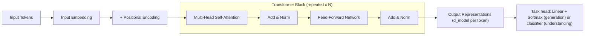
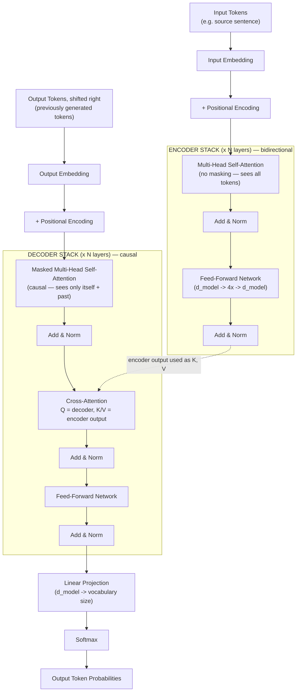

# Chapter 6: The Transformer Architecture

*Every LLM you have ever called through an API — GPT-4, Claude, Llama, Qwen, Gemini — is a descendant of one diagram published in a 2017 paper. This chapter builds that diagram, piece by piece, until you can draw it yourself with nothing but a blank page and a pen.*

## Learning Objectives

By the end of this chapter, you will be able to:

- Explain why self-attention alone is permutation-invariant, and why position information must therefore be injected explicitly into the model
- Describe how sinusoidal positional encoding gives every position in a sequence a unique, consistent signature across the embedding dimensions
- Explain why residual (skip) connections are what make it possible to train networks with dozens to nearly a hundred stacked layers
- Explain what Layer Normalization normalizes, why it suits variable-length text sequences better than Batch Normalization, and the difference between Pre-LN and Post-LN placement
- Describe the distinct job of the position-wise feed-forward sublayer versus the job of the attention sublayer inside a Transformer block
- Compare encoder-only (BERT), decoder-only (GPT), and encoder-decoder (T5 / original Transformer) architectures, and pick the right family for a given task
- Trace the exact shape of a tensor through one full Transformer block, from token embedding to block output
- **Draw and label the complete Transformer architecture from memory** — every block, every sublayer, every arrow — well enough to explain it on a whiteboard in an interview or a design review

---

## Prerequisites for This Chapter

This chapter builds directly on **[Chapter 5: Attention Mechanisms & Self-Attention](./05-attention-and-self-attention.md)**. Before continuing, you should already be comfortable with:

- **Query, Key, Value (Q/K/V) vectors** — how a token's embedding is projected into three different learned roles: what it's looking for (Q), what it advertises about itself (K), and what it actually contributes if attended to (V)
- **Scaled dot-product attention** — computing `softmax(QK^T / √d_k) V` to produce a weighted blend of Value vectors for every token, weighted by Query-Key compatibility
- **Causal masking** — preventing a token from attending to future tokens by setting masked positions to `-∞` before the softmax, which is what makes autoregressive generation possible
- **Multi-head attention** — running several smaller attention operations ("heads") in parallel on different learned projections of Q/K/V, then concatenating the results, so the model can attend to different kinds of relationships simultaneously

If any of those four bullets feel shaky, go back to Chapter 5 first — this chapter treats "multi-head self-attention" as a single well-understood building block and spends its energy on everything *around* that block: how position gets in, how the network stays trainable at depth, and how blocks stack into the full architecture that every modern LLM inherits.

---

## 1. From Attention to an Architecture: What's Still Missing

Chapter 5 gave you the single most important computation in modern AI: attention lets every token look at every other token and pull in exactly the information it needs, weighted by relevance. But attention by itself is not a usable neural network yet. Three problems remain:

**Problem 1 — Attention has no idea what order the tokens came in.** Attention is fundamentally a *set* operation: it computes compatibility scores between vectors and produces weighted averages. Nothing about the softmax-weighted-sum computation cares whether a token was first, last, or in the middle. Shuffle the input tokens, and attention produces the same set of outputs, just re-ordered to match — it never notices the shuffle happened. Human language is not a bag of words: "the dog bit the man" and "the man bit the dog" contain identical tokens and would receive *identical* per-token attention computations. We need a way to tell the model where each token sits.

**Problem 2 — Stacking many attention layers is numerically unstable.** A single attention layer plus a small feed-forward layer is not powerful enough to model the depth of pattern in real language. Every serious Transformer stacks many such blocks — 12 in BERT-base, 96 in GPT-3, well over 100 in today's largest frontier models. Naively stacking that many layers of matrix multiplications causes gradients to explode or vanish during training, and activations can drift to extreme magnitudes layer over layer. Something has to keep the signal well-behaved across dozens of layers.

**Problem 3 — Attention only mixes information *across* tokens; nothing transforms information *within* a token.** Attention decides *which* other tokens' information to borrow, but the blending it performs is a fairly simple weighted average of Value vectors. There is no step that takes a token's now-enriched representation and applies a rich, nonlinear transformation to it.

The rest of this chapter solves each of these problems in turn — **positional encoding** for Problem 1, **residual connections + Layer Normalization** for Problem 2, and the **feed-forward sublayer** for Problem 3 — and then shows how the solved pieces assemble into the exact architecture from the 2017 paper "Attention Is All You Need," which is still the direct ancestor of every LLM you use today.

---

## 2. The Full Transformer Pipeline: Bird's-Eye View

Before diving into each component, look at the whole shape of the pipeline. This is the skeleton every later chapter (KV cache, RoPE, decoder-only architectures) will hang details on:

```
Input Tokens
     │
     ▼
Input Embedding            (token ID → dense vector, size d_model)
     │
     ▼
+ Positional Encoding       (inject order information, same size d_model)
     │
     ▼
┌─────────────────────────────┐
│  Multi-Head Self-Attention  │  ← mixes information ACROSS tokens
│         Add & Norm          │  ← residual connection + LayerNorm
│      Feed-Forward Network   │  ← transforms information WITHIN each token
│         Add & Norm          │  ← residual connection + LayerNorm
└─────────────────────────────┘
     │  (repeated N times, N=6 in the original paper, N=96+ in large LLMs)
     ▼
Output representations (size d_model per token, same shape as the input)
```

Notice the shape discipline: whatever `d_model` you start with (512 in the original paper; 4096, 8192, or larger in modern LLMs) is the shape every sublayer outputs too. That constancy is not an accident — it's the entire reason you can stack N identical blocks on top of each other without needing a different block design for each depth. Section 9 proves this with real numbers.



Sections 3 through 6 zoom into each piece of this diagram. Section 7 reassembles them into one block. Section 8 shows the three architectural "shapes" (encoder-only, decoder-only, encoder-decoder) built from this same block. Section 10 gives you the full labeled diagram to memorize.

---

## 3. Positional Encoding: Giving the Model a Sense of Order

### 3.1 Proving the problem to yourself

Take the sentence "cat sat mat" (pretend these are three tokens) and its shuffled version "mat cat sat". Self-attention computes, for every token, a Query vector and compares it against every other token's Key vector via a dot product. Those dot products depend only on the *content* of the token embeddings — nothing in `Q · K` looks up "am I token #1 or token #3?" If you feed in the same three token embeddings in a different order, attention re-computes the exact same pairwise compatibility scores between the same pairs of vectors; the outputs come out permuted in the same way the inputs were permuted, but no *new* information about order is created anywhere. Formally, self-attention is a **permutation-equivariant** function: permute the input tokens, and the output tokens permute identically, with no changes to their actual content.

This matters enormously for language, where order carries meaning: "the dog bit the man" and "the man bit the dog" contain the exact same multiset of tokens. Without an explicit signal for position, a pure attention stack cannot distinguish who bit whom.

### 3.2 The fix: inject position as a vector, added to the embedding

The original Transformer's solution is elegant: compute a separate vector for each position (position 0, position 1, position 2, …), of the exact same dimensionality as the token embedding (`d_model`), and **add it element-wise** to the token embedding before the first layer:

```
final_input[i] = token_embedding[i] + positional_encoding[i]
```

Now every token's vector carries a blended signal of "what word this is" and "where in the sequence this word sits." Since addition happens before any attention or feed-forward computation, every downstream layer automatically has access to positional information without any redesign of the attention math itself.

### 3.3 Sinusoidal positional encoding

The original paper's specific choice is **sinusoidal positional encoding**: for position `pos` and embedding dimension index `i`, define

```
PE(pos, 2i)   = sin( pos / 10000^(2i / d_model) )
PE(pos, 2i+1) = cos( pos / 10000^(2i / d_model) )
```

In plain language: each dimension of the positional vector oscillates as a sine or cosine wave as you move through positions, and each dimension oscillates at a *different frequency* — early dimensions cycle quickly (useful for distinguishing nearby positions), later dimensions cycle slowly (useful for distinguishing far-apart positions). Every position from 0 to the maximum sequence length ends up with a unique combination of sine/cosine values across all `d_model` dimensions — like a fingerprint built from many overlapping clocks ticking at different speeds.

This specific choice has two nice properties the authors cared about:

1. **It generalizes to sequence lengths not seen during training** — because sine/cosine are defined for any position, not just the ones observed during training, unlike a lookup table that only has entries for positions it was trained with.
2. **Relative positions become a linear function of the encoding** — because of the trigonometric identity `sin(a+b) = sin(a)cos(b) + cos(a)sin(b)`, the encoding of position `pos + k` can be expressed as a fixed linear transformation of the encoding of position `pos`. This gives the model an easier time learning to attend based on relative offsets ("the token two positions back") rather than only absolute positions.

```
Position 0:  [sin(0/1), cos(0/1), sin(0/100), cos(0/100), ...]  =  [0.00, 1.00, 0.00, 1.00, ...]
Position 1:  [sin(1/1), cos(1/1), sin(1/100), cos(1/100), ...]  =  [0.84, 0.54, 0.01, 1.00, ...]
Position 2:  [sin(2/1), cos(2/1), sin(2/100), cos(2/100), ...]  =  [0.91,-0.42, 0.02, 1.00, ...]
```

Notice the fast-changing first pair of columns versus the barely-changing later pair — that's the multi-frequency fingerprint in action.

### 3.4 Alternatives you'll meet later

Sinusoidal encoding is a fixed, non-learned function. Other designs exist and matter a great deal in practice:

- **Learned absolute positional embeddings** (used in BERT, GPT-2): a trainable embedding table indexed by position, exactly like the token embedding table, learned end-to-end. Simple, but does not generalize beyond the maximum position seen in training.
- **Rotary Positional Embeddings (RoPE)** (used in GPT-NeoX, Llama, Qwen, and most modern open LLMs): instead of adding a positional vector, RoPE *rotates* the Q and K vectors by an angle proportional to position before the dot product, which bakes relative position directly into the attention score computation. Chapter 7 covers RoPE in depth, including why it became the dominant choice for long-context decoder-only LLMs.

For now, the important idea to retain is architectural, not the specific formula: **self-attention has no built-in notion of order, so every Transformer variant must inject position somewhere** — whether by addition before the first layer (sinusoidal, learned) or by modifying the attention computation itself (RoPE).

---

## 4. Residual Connections: How 96 Layers Can Train at All

### 4.1 The intuition

Imagine passing a whispered message through 96 people in a line, where each person is allowed to slightly rephrase the message before passing it on. By person 96, the message may be unrecognizable — small distortions compound. Now imagine each person instead says: *"here's the original message, plus my one-sentence suggested edit."* The original message survives intact all the way to the end, and every person's contribution is an additive adjustment rather than a full rewrite. That second version is a residual connection.

Formally, instead of a layer computing `output = Layer(x)`, a residual (skip) connection computes:

```
output = x + Layer(x)
```

The layer only needs to learn the *change* to apply to `x`, not how to reconstruct the entirety of `x` from scratch. If a layer would ideally do nothing at all, it just needs to learn to output values near zero — a far easier thing for a randomly-initialized network to learn than the identity function through an arbitrary nonlinear transformation.

### 4.2 Why this matters for training deep networks

During backpropagation, gradients must flow from the loss all the way back through every layer to update early-layer weights. Consider the gradient of `output = x + Layer(x)` with respect to `x`:

```
d(output)/dx = I + d(Layer(x))/dx
```

That leading identity matrix `I` guarantees a direct, undiminished path for the gradient signal to flow backward through the addition, regardless of what happens inside `Layer(x)`. Stack this across N layers, and every layer contributes an additive "highway" the gradient can travel down without being forced through N consecutive matrix multiplications that could shrink it toward zero (vanishing gradients) or blow it up (exploding gradients). This is exactly the mechanism that made deep residual networks (ResNets, 2015) trainable at depths of 100+ layers in computer vision, and it's the same mechanism the Transformer borrows to make 12-, 96-, or 100+-layer stacks of attention and feed-forward blocks trainable at all.

Without residual connections, Transformers deeper than a handful of layers were empirically very difficult to train well. With them, depth becomes primarily an engineering and compute decision rather than a "can we even get gradients to the bottom layer" problem.

### 4.3 Where the residual connections live

In the standard Transformer block, there are exactly two residual connections per block — one around the attention sublayer, one around the feed-forward sublayer:

```
x1 = x + MultiHeadAttention(x)
x2 = x1 + FeedForward(x1)
```

(This is a simplified view before LayerNorm placement, which Section 5 refines.)

---

## 5. Layer Normalization: Stabilizing Deep Stacks

### 5.1 What LayerNorm normalizes

Residual connections keep gradients flowing, but they don't stop the raw *magnitude* of activations from drifting as you add more and more residual contributions layer after layer. Layer Normalization (LayerNorm) is the mechanism that keeps activation magnitudes well-behaved.

For a single token's vector `x` of dimension `d_model` (e.g., 512, 4096, whatever the model's hidden size is), LayerNorm computes:

```
LayerNorm(x) = γ * (x - μ) / sqrt(σ² + ε) + β
```

where `μ` and `σ²` are the mean and variance computed **across the d_model features of that one token**, `γ` and `β` are learned scale and shift parameters (same size as `x`), and `ε` is a small constant for numerical stability. The critical detail: this normalization happens **independently for each token position**, using only that token's own feature values — it does not look at other tokens in the sequence, and it does not look at other examples in the batch.

### 5.2 Why not Batch Normalization?

Batch Normalization, the workhorse of computer vision, normalizes each *feature* across all examples **in a batch** (and, for sequence data, often across the sequence dimension too). This creates two problems for text:

1. **Variable-length sequences.** Batches of sentences have different lengths, requiring padding. Computing batch statistics over padded positions either requires masking complexity or pollutes the statistics with padding artifacts.
2. **Batch-size dependence at inference.** Autoregressive generation frequently runs with a batch size of 1 (one user, one request). Batch Normalization's statistics become unstable or meaningless with a batch size of 1, since there's no "batch" to average over.

LayerNorm sidesteps both problems entirely: its statistics are computed per-token, so they don't depend on batch size, sequence length, or padding at all. This is a big part of why LayerNorm (and its modern lighter-weight cousin, **RMSNorm**, used in Llama and many current LLMs, which drops the mean-centering step and normalizes only by root-mean-square) became the standard for sequence models, while BatchNorm remains the standard for vision models with fixed-size, large-batch inputs.

### 5.3 Pre-LN vs. Post-LN: a modern architecture detail

The original 2017 paper places LayerNorm *after* the residual addition — this is called **Post-LN**:

```
x1 = LayerNorm(x + MultiHeadAttention(x))
x2 = LayerNorm(x1 + FeedForward(x1))
```

Most modern LLMs (GPT-2 onward, GPT-3, Llama, and the majority of current open models) instead normalize the input *before* it enters the sublayer, and add the residual using the *un-normalized* `x` — this is **Pre-LN**:

```
x1 = x + MultiHeadAttention(LayerNorm(x))
x2 = x1 + FeedForward(LayerNorm(x1))
```

Pre-LN keeps the residual "highway" from Section 4 completely clean of any normalization operation, which empirically produces much more stable gradients at very large depth and removes the need for the carefully-tuned learning-rate warmup schedules that Post-LN models require to avoid early-training divergence. The trade-off is a small amount of representational capacity, generally considered a good deal at the depths (dozens to hundreds of layers) modern LLMs operate at. When you read a modern model's architecture spec and see "Pre-LN" or "RMSNorm applied before attention and before the FFN," this is the detail being referenced.

---

## 6. The Feed-Forward Sublayer: Per-Token Nonlinear Transformation

### 6.1 What it is

Every Transformer block contains, alongside its attention sublayer, a remarkably simple component: a two-layer fully-connected network (an MLP), applied **independently and identically to every token position**:

```
FFN(x) = Linear2( Activation( Linear1(x) ) )
```

In the original paper, `Linear1` projects from `d_model` up to a much larger intermediate size `d_ff` (512 → 2048, a 4x expansion), an activation function is applied (ReLU in the original paper; GELU, SwiGLU, or similar in most modern LLMs), and `Linear2` projects back down from `d_ff` to `d_model`. The 4x expansion-then-contraction ratio has remained a remarkably durable design choice across seven-plus years of Transformer variants.

The word **position-wise** is the key detail: the exact same two weight matrices are applied to every token in the sequence, one token at a time, with no mixing between token positions inside this sublayer. Token 1's FFN computation has zero knowledge of token 2's vector — it's a per-token operation, not a per-sequence one.

### 6.2 What it contributes, versus what attention contributes

This is the conceptual split worth memorizing:

| Sublayer | What it mixes | Plain-language job |
|---|---|---|
| **Multi-Head Attention** | Information **across tokens** | "Given everything else in the sequence, what should I borrow and blend into my own representation?" |
| **Feed-Forward Network** | Information **within one token's own vector** | "Given what I now know after attention, what nonlinear transformation should I apply to refine my representation?" |

Attention is a *routing and mixing* mechanism — it decides which tokens' information flows where. The FFN is a *processing* mechanism — once a token has gathered the context it needs via attention, the FFN gets to apply a rich, learned, nonlinear function to that enriched vector, independently of every other token. Neither sublayer alone is expressive enough; alternating attention (mix across tokens) and FFN (transform within a token), block after block, is what lets deep Transformers build up increasingly abstract representations.

It's also worth knowing, as a production intuition: **the FFN sublayers hold the majority of a Transformer's parameters.** With a 4x expansion factor, the two FFN weight matrices (`d_model × d_ff` and `d_ff × d_model`) typically account for roughly two-thirds of a block's total parameter count, with attention's Q/K/V/output projections making up the rest. When people say "LLMs are mostly memorization stored in dense feed-forward layers, with attention doing the routing," this parameter split is part of what they mean.

---

## 7. Assembling One Transformer Block

Putting Sections 3–6 together (using the modern Pre-LN convention), a single Transformer block is:

```python
def transformer_block(x, params):
    # x: shape (seq_len, d_model) — one row per token

    # --- Sublayer 1: attention, mixing information across tokens ---
    normed = layer_norm(x, params.ln1)
    attn_out = multi_head_self_attention(normed, params.attn)   # from Chapter 5
    x = x + attn_out                                             # residual connection

    # --- Sublayer 2: feed-forward, transforming information within each token ---
    normed = layer_norm(x, params.ln2)
    ffn_out = feed_forward(normed, params.ffn)                  # Linear -> Activation -> Linear
    x = x + ffn_out                                              # residual connection

    return x   # shape (seq_len, d_model) — identical shape to the input
```

Because the output shape exactly matches the input shape, this function can be called N times in a row — once per layer — with no change to its signature. That shape invariance is precisely what allows a "12-layer model" and a "96-layer model" to be built from the *same* block definition, differing only in how many times it's stacked (plus, in practice, `d_model`, `d_ff`, and the number of heads, which also stay constant across all layers within one model).

---

## 8. Encoder-Only, Decoder-Only, and Encoder-Decoder Architectures

The block from Section 7 is a shared building material. The original 2017 paper assembles it into two stacks — an **encoder** stack and a **decoder** stack — connected together. But it turns out you can build a fully useful model from *either half alone*, and each half is good at different things.

### 8.1 The encoder: bidirectional understanding

An **encoder** block uses ordinary (unmasked) self-attention: every token can attend to every other token in the sequence, including tokens that come *after* it. This gives the encoder a genuinely **bidirectional** view of the input — when encoding the word "bank" in "I sat by the river bank," the encoder can look both left ("river") and right (whatever follows) to disambiguate meaning.

**BERT** (Bidirectional Encoder Representations from Transformers) is the canonical encoder-only architecture: it stacks encoder blocks only, pretrains with a "masked language modeling" objective (hide random tokens, predict them using full bidirectional context), and produces rich token/sequence representations well suited to **understanding** tasks — classification, named entity recognition, semantic search embeddings, extractive question answering. BERT is not designed to generate open-ended text one token at a time; it sees the whole input at once.

### 8.2 The decoder: causal generation

A **decoder** block, as introduced in Chapter 5, uses **masked (causal) self-attention**: each token can only attend to itself and tokens before it, never tokens after it. This unidirectional constraint is exactly what makes autoregressive generation coherent and well-defined — at generation time, the tokens "after" the current position don't exist yet, so training the model to ever rely on them would create a mismatch between training and inference.

**GPT** (Generative Pre-trained Transformer) is the canonical decoder-only architecture: it stacks decoder blocks only (dropping the cross-attention sublayer described next, since there's no separate encoder to attend to), pretrains with a "predict the next token" objective over raw text, and is naturally suited to **generation** tasks — open-ended text completion, chat, code generation, reasoning traces. Every major LLM you interact with through an API — GPT-4, Claude, Llama, Qwen, Gemini, Mistral — is architecturally a decoder-only descendant of this half of the diagram. Chapter 7 goes deep into exactly how these modern decoder-only models differ from the original 2017 decoder (RoPE instead of sinusoidal encoding, KV caching, RMSNorm, grouped-query attention, and more).

### 8.3 The encoder-decoder: sequence-to-sequence transformation

The **original Transformer paper** and later models like **T5** and **BART** keep both stacks, connected by a third attention sublayer inside each decoder block: **cross-attention**, where the decoder's Query vectors attend to the encoder's output Key/Value vectors. This lets the decoder, while generating each output token, look back at a full bidirectional encoding of the entire input sequence.

This architecture shines at **sequence-to-sequence** tasks where the input and output are genuinely different sequences that need to be related to each other — machine translation (encode the source-language sentence bidirectionally, decode the target-language sentence causally while attending back to the source), summarization, and structured input-to-output transformations. The decoder block in this setup contains three sublayers, not two: masked self-attention (attend to previously generated output tokens), cross-attention (attend to the encoder's output), and the feed-forward network — each wrapped in its own residual connection and LayerNorm.

### 8.4 Comparison table

| Architecture | Attention type | Pretraining objective | Canonical model | Best suited for |
|---|---|---|---|---|
| **Encoder-only** | Bidirectional self-attention | Masked language modeling | BERT | Classification, NER, embeddings, extractive QA — "understanding" tasks that see the whole input at once |
| **Decoder-only** | Causal (masked) self-attention | Next-token prediction | GPT (and Llama, Claude, Qwen, Gemini, …) | Open-ended generation, chat, code, reasoning — anything produced token-by-token |
| **Encoder-decoder** | Bidirectional encoder + causal decoder + cross-attention | Denoising / span corruption (T5) or translation pairs | T5, BART, original Transformer | Sequence-to-sequence tasks: translation, summarization, structured transformation |

The field's center of gravity has moved heavily toward decoder-only architectures over the last several years — a single decoder-only model, given the right prompt, can imitate understanding tasks (via prompting) and sequence-to-sequence tasks (via instructions), which simplified the ecosystem around one architectural family. But the underlying building block — attention + residual + LayerNorm + FFN — is identical across all three; only the attention masking pattern and the presence/absence of cross-attention differ.

---

## 9. Worked Example: Tracing Shapes Through a Transformer Block

Abstract descriptions are useful, but nothing builds confidence like watching real numbers flow through the pipeline. Let's trace a tiny, concrete example end to end.

**Setup:** 3 input tokens, `d_model = 8`, 2 attention heads (so each head has dimension `d_model / num_heads = 4`), and an FFN expansion to `d_ff = 32` (4x, matching the original paper's ratio).

### Step 1 — Input Embedding

Token IDs for "The cat sat" are looked up in an embedding table, producing one 8-dimensional vector per token:

```
X shape: (3, 8)     — 3 tokens, 8 features each
```

### Step 2 — Add Positional Encoding

A sinusoidal (or learned) positional vector of shape `(3, 8)` — one row per position 0, 1, 2 — is computed and added elementwise:

```
X = X + PositionalEncoding      shape stays: (3, 8)
```

### Step 3 — Multi-Head Self-Attention

`X` is linearly projected into Q, K, V, each of shape `(3, 8)`, then split into 2 heads of dimension 4:

```
Q, K, V per head: (3, 4)     — one for each of the 2 heads

Per-head attention:
  scores = Q @ K.T / sqrt(4)         shape: (3, 3)   — every token's compatibility with every token
  weights = softmax(scores)          shape: (3, 3)
  head_output = weights @ V          shape: (3, 4)

Concatenate the 2 heads:             shape: (3, 4) + (3, 4) -> (3, 8)
Output projection (W_O, 8x8):        shape: (3, 8)
```

### Step 4 — Add & Norm (first residual + LayerNorm)

```
X = X + AttentionOutput            shape: (3, 8)   — residual connection
X = LayerNorm(X)                   shape: (3, 8)   — normalized per-token, across the 8 features
```

### Step 5 — Feed-Forward Network

```
Linear1 (W1: 8x32):    X @ W1      shape: (3, 8) @ (8, 32)  -> (3, 32)
Activation (ReLU/GELU): elementwise, shape stays (3, 32)
Linear2 (W2: 32x8):    (...) @ W2   shape: (3, 32) @ (32, 8) -> (3, 8)
```

### Step 6 — Add & Norm (second residual + LayerNorm)

```
X = X + FeedForwardOutput          shape: (3, 8)   — residual connection
X = LayerNorm(X)                   shape: (3, 8)   — final block output
```

### The takeaway

| Step | Operation | Output shape |
|---|---|---|
| 1 | Input Embedding | (3, 8) |
| 2 | + Positional Encoding | (3, 8) |
| 3 | Multi-Head Self-Attention | (3, 8) |
| 4 | Add & Norm | (3, 8) |
| 5 | Feed-Forward Network | (3, 8) |
| 6 | Add & Norm | (3, 8) |

The shape never changes: **(3, 8) in, (3, 8) out**, across the entire block. This is exactly the shape-invariance property flagged in Section 7 — it's why you can stack this exact block N times (N=6 in the original paper; N=32, N=96, or more in modern LLMs) with zero structural changes between layers, only different learned weights at each depth. In a real model, replace 3 tokens with a context window of thousands to hundreds of thousands of tokens, and 8 dimensions with `d_model` values like 4096 or 8192 — the shape-tracing logic is identical, just at scale.

---

## 10. The Full Architecture (Draw This From Memory)

This is the diagram to internalize. It is the original encoder-decoder Transformer from "Attention Is All You Need" — every decoder-only LLM you use today is architecturally the right-hand half of this picture, minus cross-attention.



Notes for memorizing this diagram:

- **Two symmetric stacks**, each built from the exact block you traced in Section 9, repeated N times.
- The **encoder** has 2 sublayers per block (self-attention, feed-forward), each wrapped in Add & Norm.
- The **decoder** has 3 sublayers per block (masked self-attention, cross-attention, feed-forward), each wrapped in Add & Norm.
- **Cross-attention** is the only place the encoder and decoder stacks touch: the decoder's Queries attend to the encoder's final output, used as Keys and Values.
- The **final Linear + Softmax** projects the last decoder layer's output (still shape `d_model` per token) up to vocabulary size, producing a probability distribution over the next token.
- A **decoder-only model** (GPT, Llama, Claude, Qwen) is this diagram with the entire encoder stack and the cross-attention sublayer deleted — just Input Embedding → Positional Encoding → [Masked Self-Attention → Add & Norm → FFN → Add & Norm] × N → Linear → Softmax. Chapter 7 zooms into exactly how modern decoder-only LLMs differ from this original 2017 design — RoPE instead of sinusoidal positional encoding, RMSNorm instead of LayerNorm, KV caching for efficient generation, and architectural tweaks like grouped-query attention.

---

## Real-World Scenario

A mid-sized fintech company builds an internal tool to extract structured fields (payer, payee, amount, date) from scanned invoice text using a small custom Transformer encoder trained from scratch on their own document corpus — a reasonable choice, since they have domain-specific documents and want to avoid API costs at high volume.

An engineer implements the attention and feed-forward sublayers correctly, gets the model training and the loss decreasing, and ships it to a staging environment. Extraction accuracy on the internal test set looks decent — around 78% field-level accuracy — enough to seem plausible, but noticeably worse than a similarly-sized off-the-shelf BERT checkpoint on the same data (91%).

During a code review, a teammate notices the input pipeline builds token embeddings and feeds them straight into the first attention layer — there's no positional encoding step anywhere in the code. The model is technically a valid neural network and does learn *something* useful (co-occurrence statistics between fields and nearby words still help), but it is architecturally blind to word order. On invoices where "Amount Due: $500, Amount Paid: $500" and "Amount Paid: $500, Amount Due: $500" appear, the model frequently mixes up which figure is which — because without positional encoding, self-attention has no way to distinguish the sentence "Amount Due: $500, Amount Paid: $0" from a shuffled version where the two clauses swap places relative to nearby anchor words. The bug is far from an outright crash — the model trains, the loss goes down, the metrics look plausible — which is exactly why it survived through implementation and into a staging accuracy comparison before being caught.

Adding sinusoidal positional encoding (a five-line fix) and retraining closes almost the entire accuracy gap, bringing the model to 89%. The lesson generalizes far beyond this one company: **positional encoding is easy to forget precisely because its absence doesn't produce an error — it produces a silently degraded model that still appears to be learning.** Any time you implement or debug a Transformer from lower-level building blocks rather than a vetted library, positional encoding is one of the first things to verify is actually present and actually being added before the first attention layer.

---

## Best Practices

- **Verify positional information is actually reaching the first layer** whenever implementing or debugging a Transformer below the framework level — this is the single easiest piece to silently omit, and its absence degrades quality without throwing an error (see the scenario above).
- **Default to Pre-LN placement** (`x + Sublayer(LayerNorm(x))`) for any new deep Transformer stack — it is dramatically more forgiving of learning-rate choices and initialization than Post-LN at depths beyond a handful of layers, which is why virtually every modern LLM uses it.
- **Match the architecture family to the task**, not the other way around: reach for encoder-only (BERT-style) for classification/understanding/embeddings, decoder-only (GPT-style) for open-ended generation, and encoder-decoder (T5-style) only when you have a genuine, structurally distinct input-to-output sequence transformation like translation.
- **Respect the shape invariance of a Transformer block** when modifying an architecture — any change to a sublayer (a new attention variant, a new FFN activation) must still emit the same `(seq_len, d_model)` shape it consumed, or stacking N layers breaks.
- **Keep the FFN expansion ratio near the well-tested 4x default** unless you have a specific, benchmarked reason to change it — it has survived essentially unchanged from the 2017 paper through today's frontier models because it reliably balances capacity against compute cost.
- **Use RMSNorm or LayerNorm, never Batch Normalization, for sequence models** with variable-length inputs or small/batch-size-1 inference workloads — the per-token statistics of LayerNorm/RMSNorm are what make Transformers robust to inference-time batch size.

---

## Common Mistakes

- **Forgetting positional encoding entirely**, or adding it after (rather than before) the first attention layer, silently degrading order-sensitivity without any training error — the scenario above is a direct illustration.
- **Confusing "attention mixes tokens" with "FFN mixes tokens."** The feed-forward sublayer is strictly position-wise — it never looks at any other token's vector. Believing the FFN provides any cross-token mixing leads to incorrect assumptions about model capacity and incorrect debugging when a model fails at tasks requiring long-range mixing (the fix is almost always in the attention sublayer or the number of layers, not the FFN).
- **Mismatching Pre-LN and Post-LN conventions when porting weights or code** between model families — swapping LayerNorm placement without also adjusting for the different residual-stream statistics it produces can silently destabilize a fine-tuning run.
- **Assuming encoder-decoder cross-attention is "the same as" self-attention.** Cross-attention's Query comes from the decoder, but its Key and Value come from the encoder's output — conflating the two, or accidentally wiring self-attention weights into a cross-attention sublayer, produces a model that appears to run but never actually looks back at the source sequence.
- **Choosing decoder-only for a pure classification task** (or encoder-only for open-ended generation) out of familiarity bias rather than fit — an autoregressive decoder can be coaxed into classification via prompting, but a purpose-built bidirectional encoder is typically both more accurate and dramatically cheaper for that task, as in the scenario above.
- **Treating `d_ff` and `d_model` as independent hyperparameters to tune freely** without understanding that the ~4x ratio is empirically load-bearing — arbitrarily shrinking `d_ff` relative to `d_model` starves the per-token transformation capacity described in Section 6, often without an obvious symptom besides a quality plateau.

---

## Summary

- Self-attention alone is **permutation-equivariant** — it has no built-in notion of token order — so **positional encoding** must inject position explicitly, either by adding a sinusoidal or learned vector to the embedding, or (in modern models) by rotating Q/K vectors via RoPE (Chapter 7).
- **Residual connections** (`x + Sublayer(x)`) give gradients a direct, undiminished path backward through arbitrarily many stacked layers, which is the mechanism that makes training 12-, 96-, or 100+-layer Transformers feasible at all.
- **Layer Normalization** normalizes each token's feature vector independently (mean/variance across the `d_model` dimension, per token), which — unlike Batch Normalization — works cleanly regardless of batch size or sequence length; **Pre-LN** placement (normalize before each sublayer) is the modern default for training stability at depth.
- The **feed-forward sublayer** is a position-wise 2-layer MLP (typically expanding to 4x `d_model` and back) that transforms information *within* each token, complementing attention's job of mixing information *across* tokens.
- One Transformer block — attention, add & norm, feed-forward, add & norm — preserves its input shape exactly, which is what allows stacking N identical blocks to build arbitrarily deep models.
- **BERT** (encoder-only, bidirectional) suits understanding tasks; **GPT** (decoder-only, causal) suits generation and is the direct ancestor of virtually every modern LLM; **T5 / the original Transformer** (encoder-decoder, with cross-attention) suits sequence-to-sequence tasks like translation.
- Chapter 7 zooms into exactly how GPT, Llama, Claude, and Qwen — all decoder-only descendants of the right half of the Section 10 diagram — differ from this original 2017 design.

---

## Knowledge Check

1. Prove to yourself, in your own words, that self-attention is permutation-equivariant. Then explain precisely where and how positional encoding breaks that equivariance.
2. Write the sinusoidal positional encoding formula for `PE(pos, 2i)` and `PE(pos, 2i+1)`, and explain why different dimensions use different frequencies.
3. Derive (in words, not full calculus) why `output = x + Layer(x)` gives gradients an easier path backward than `output = Layer(x)` alone. Why does this matter more at 96 layers than at 2 layers?
4. Layer Normalization computes statistics "across the feature dimension per token." Contrast this precisely with what Batch Normalization computes, and explain why the difference matters for a decoder generating one token at a time with batch size 1.
5. A colleague says, "the feed-forward sublayer is where tokens exchange information with each other, just like attention." Correct this statement, explaining specifically what each sublayer does and does not mix.
6. You need to build a system that classifies support tickets into 20 categories. Another team suggests fine-tuning a decoder-only GPT-style model via prompting. Using the Section 8 comparison table, argue for or against this choice, and name the architecture family you'd actually reach for.

---

## Hands-On Exercise

**Part 1 — Draw from memory.**

On a blank sheet of paper (or empty drawing app — no notes, no looking back at Section 10), draw and label the complete original Transformer architecture:

1. Input tokens → Input Embedding → + Positional Encoding, on both the encoder and decoder sides.
2. The encoder block: Multi-Head Self-Attention → Add & Norm → Feed-Forward → Add & Norm, stacked ×N.
3. The decoder block: Masked Multi-Head Self-Attention → Add & Norm → Cross-Attention → Add & Norm → Feed-Forward → Add & Norm, stacked ×N.
4. The connection between the encoder's final output and the decoder's cross-attention sublayer (label which is Q and which is K/V).
5. The final Linear projection → Softmax → output token probabilities.

Then open Section 10 and check your sketch block by block. Note every block you missed, mislabeled, or placed in the wrong order — that list is your personal study list for this chapter. Repeat the exercise from scratch a day later without looking at your notes; most people need 2–3 attempts before the diagram is fully automatic.

**Part 2 — Shape tracing by hand.**

Using the worked example in Section 9 as a template, trace shapes for a slightly larger toy configuration: 5 tokens, `d_model = 16`, 4 attention heads, `d_ff = 64`. Write out the shape at every step (embedding, positional encoding, Q/K/V, per-head attention scores, concatenation, output projection, first Add & Norm, FFN Linear1, activation, FFN Linear2, second Add & Norm). Confirm that the final shape matches the input shape exactly.

**Part 3 — Architecture selection.**

For each of the following tasks, name which architecture family (encoder-only, decoder-only, or encoder-decoder) you would reach for and justify it in one sentence using Section 8: (a) semantic search over a document corpus, (b) an open-domain chatbot, (c) English-to-French translation, (d) spam/not-spam email classification, (e) code autocomplete.

---

## Further Reading

- Vaswani, A. et al., ["Attention Is All You Need"](https://arxiv.org/abs/1706.03762) (2017) — the paper this entire chapter is built from; read it once now, then again after Chapter 7 to appreciate how much and how little has changed
- Devlin, J. et al., ["BERT: Pre-training of Deep Bidirectional Transformers for Language Understanding"](https://arxiv.org/abs/1810.04805) (2018) — the canonical encoder-only architecture and masked language modeling objective
- Radford, A. et al., ["Improving Language Understanding by Generative Pre-Training"](https://cdn.openai.com/research-covers/language-unsupervised/language_understanding_paper.pdf) (GPT, 2018) — the original decoder-only, generative pretraining paper that founded the GPT lineage
- Raffel, C. et al., ["Exploring the Limits of Transfer Learning with a Unified Text-to-Text Transformer"](https://arxiv.org/abs/1910.10683) (T5, 2019) — the canonical modern encoder-decoder architecture and its unifying text-to-text framing
- Xiong, R. et al., ["On Layer Normalization in the Transformer Architecture"](https://arxiv.org/abs/2002.04745) (2020) — the paper formally analyzing why Pre-LN trains more stably than Post-LN at depth
- Alammar, J., ["The Illustrated Transformer"](https://jalammar.github.io/illustrated-transformer/) — the most widely recommended visual walkthrough of this exact architecture; excellent as a second pass after this chapter
- ["The Annotated Transformer" (Harvard NLP)](http://nlp.seas.harvard.edu/annotated-transformer/) — the original paper reproduced alongside a working PyTorch implementation, line by line
- Karpathy, A., ["Let's build GPT: from scratch, in code, spelled out"](https://www.youtube.com/watch?v=kCc8FmEb1nY) — a from-scratch implementation video that builds exactly the decoder-only half of this chapter's diagram in runnable code

---

<div style="display:flex;justify-content:space-between;align-items:center;">
  <a href="./05-attention-and-self-attention.md">← Previous: Attention Mechanisms & Self-Attention</a>
  <a href="./00-index.md">🏠 Index</a>
  <a href="./07-llm-architecture-and-decoding.md">Next: LLM Architecture: Decoder-Only Models, KV Cache & RoPE →</a>
</div>
