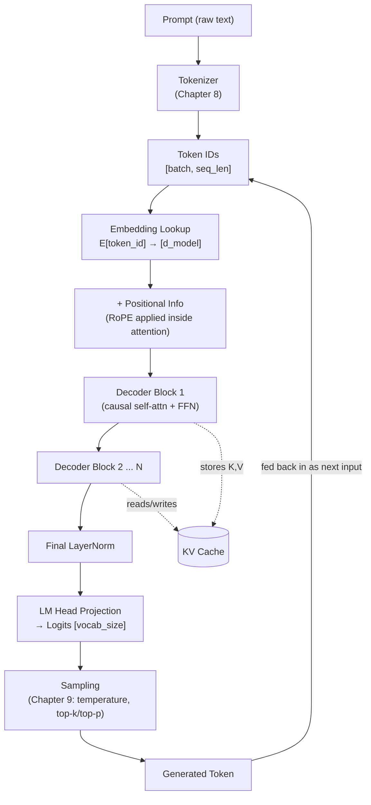

# Chapter 7: LLM Architecture: Decoder-Only Models, KV Cache & RoPE

*Every model you call by name — GPT-4, Claude, Llama, Qwen, Mistral, Gemini — is, at its core, the same idea repeated: one stack of causal-masked decoder blocks, a table of learned vectors, and a loop that predicts one token at a time. This chapter takes the generic Transformer block from Chapter 6 and turns it into the specific machine that powers every modern LLM.*

## Learning Objectives

By the end of this chapter, you will be able to:

- Explain why GPT, Llama, Claude, and nearly every modern general-purpose LLM abandoned the encoder-decoder architecture in favor of a decoder-only stack
- Define "context window" precisely and explain why it is fundamentally limited by the compute and memory cost of self-attention
- Describe the token embedding matrix as a learned lookup table with shape `[vocab_size, d_model]`, not a computed function
- Trace positional encoding's evolution from sinusoidal, to learned absolute, to Rotary Position Embeddings (RoPE), and explain why RoPE generalizes better to longer sequences
- Explain the core inefficiency the KV cache solves, and calculate its memory footprint for a real model size and context length
- Describe how the final hidden state becomes logits over the vocabulary, ready for sampling
- Draw and narrate the full inference pipeline — prompt to tokenizer to embeddings to transformer stack to logits to sampling to generated token — from memory

---

## Prerequisites for This Chapter

This chapter builds directly on **Chapter 6: The Transformer Architecture**, where you learned:

- The full Transformer block: multi-head self-attention, residual connections, LayerNorm, and the feed-forward sublayer
- How self-attention computes Query, Key, and Value projections and combines them into a weighted sum over the sequence (from **Chapter 5: Attention Mechanisms & Self-Attention**)
- The original encoder-decoder architecture (as used for translation), including cross-attention between the decoder and the encoder's output
- Sinusoidal positional encoding, the original mechanism for injecting sequence order into a Transformer that otherwise has no notion of position

If any of those feel shaky, revisit Chapters 5–6 before continuing — everything below assumes you can already draw one Transformer block and explain what happens inside it. This chapter does not re-derive self-attention; it re-arranges the blocks you already know into the specific shape used by production LLMs, and adds the three pieces of machinery — RoPE, the KV cache, and the logits/sampling handoff — that generic Transformer diagrams usually gloss over.

---

## 1. From Encoder-Decoder to Decoder-Only: Why the Encoder Disappeared

### 1.1 What the original Transformer was built for

The 2017 "Attention Is All You Need" Transformer was designed for **machine translation** — a task with two genuinely different sequences: a source sentence (say, French) and a target sentence (English). That task shape naturally suggested two stacks:

- An **encoder** that reads the *entire* source sentence at once, with unrestricted (bidirectional) self-attention — every French word can attend to every other French word, because the whole sentence is known upfront.
- A **decoder** that generates the English translation one word at a time, using causal self-attention over what it has generated so far, plus **cross-attention** into the encoder's output to "look up" relevant parts of the source sentence.

BERT (2018) took just the encoder half and became the workhorse for classification, embeddings, and understanding tasks — it never generates text, it only produces contextual representations. GPT (2018) took just the decoder half — minus the cross-attention, since there was no separate source sequence anymore — and became the workhorse for open-ended generation.

### 1.2 Why general-purpose LLMs kept only the decoder

Modern LLMs are not solving translation. They are solving a single, more general task: **given everything so far, predict the next token.** "Everything so far" can be a system prompt, a user question, retrieved documents, a partial answer, or all of the above concatenated into one stream. There is no clean "source vs. target" split — there's just one sequence that grows one token at a time.

Once the task is "predict the next token given the prior tokens," you don't need two different attention mechanisms:

- You don't need a **separate bidirectional encoder pass** over the prompt, because by the time the model predicts token *i*, causal self-attention already lets token *i* see every token before it — including the *entire prompt*. The prompt gets "understood" for free, as a side effect of predicting the first output token; no dedicated encoder stage is required.
- You don't need **cross-attention**, because there's no second sequence to attend into — the prompt and the generation live in the *same* sequence, attended to with the *same* self-attention mechanism.

The result is architectural simplification with no loss of capability for generation:

```
Encoder-Decoder (T5, original Transformer)      Decoder-Only (GPT, Llama, Claude, Qwen)
┌─────────────┐   ┌─────────────┐                ┌─────────────────────────────┐
│   Encoder   │──▶│   Decoder   │                │   One causal-masked stack    │
│ (bidirect.) │   │ (causal +   │                │  [prompt tokens | generated  │
│             │   │ cross-attn) │                │   tokens] — all self-attn,   │
└─────────────┘   └─────────────┘                │   all causally masked        │
  reads source      generates target             └─────────────────────────────┘
  Two attention types, two stacks                One attention type, one stack
```

This single-stack design turned out to also **scale better** empirically — the scaling law studies behind GPT-2 and GPT-3 (Chapter 23 has the full reading list) showed that a simple, uniform decoder-only stack, made deeper and wider and fed more data, kept improving smoothly and predictably. A simpler, more uniform architecture is also easier to parallelize across thousands of GPUs during pretraining, since every layer does the same kind of computation. That combination — conceptual simplicity, empirical scaling, and engineering uniformity — is why essentially every frontier general-purpose LLM today (GPT-4, Claude, Llama 3, Qwen 2, Mistral, Gemini) is decoder-only. Encoder-only and encoder-decoder models still exist and thrive for specific tasks — BERT-family models for embeddings and classification, T5-family models for some structured seq2seq tasks — but for "hold a conversation and write anything," decoder-only won.

### 1.3 The causal mask, revisited

Recall from Chapter 6 that causal (or "autoregressive") masking prevents token *i* from attending to any token *j > i*. In a decoder-only LLM, this single mechanism does two jobs at once:

1. **During training**, it lets the model process an entire document in one parallel forward pass while still only ever "seeing the past" at each position — this is what makes next-token-prediction pretraining efficient at scale (every position in the sequence produces a training signal simultaneously).
2. **During inference**, it's what makes generation *causally consistent* — token *i* is generated using exactly the information a real reader would have had at that point, which is exactly the assumption sampling (Chapter 9) and generation rely on.

Everything else in this chapter is about making that one causal-masked stack fast, long-context-capable, and correctly aware of token order.

---

## 2. The Decoder-Only Stack, End to End

Before diving into each component, here is the full shape of a modern decoder-only LLM, layer by layer:

```
Input token ids  →  [batch, seq_len]
        │
        ▼
Token Embedding Lookup  →  [batch, seq_len, d_model]
        │  (+ positional information — see Section 4)
        ▼
┌───────────────────────────────┐
│   Decoder Block × N            │
│   ┌───────────────────────┐   │
│   │ LayerNorm              │   │
│   │ Causal Self-Attention  │◀──┼── uses KV cache (Section 5)
│   │ + Residual             │   │
│   │ LayerNorm              │   │
│   │ Feed-Forward (MLP)     │   │
│   │ + Residual             │   │
│   └───────────────────────┘   │
└───────────────────────────────┘
        │
        ▼
Final LayerNorm
        │
        ▼
Output Projection ("LM head")  →  [batch, seq_len, vocab_size]  = Logits (Section 6)
```

`N` is the number of stacked decoder blocks — 12 for GPT-2 small, 96 for GPT-3, 32 for Llama-2-7B, 80 for Llama-2-70B. Every block is structurally identical; stacking more of them (and widening `d_model`) is most of what "scaling up" an LLM means in practice. The rest of this chapter walks through the pieces that a generic "Transformer block" diagram from Chapter 6 doesn't fully specify: how tokens become vectors, how those vectors know their position, how attention is made fast across a growing sequence, and how the final vector becomes a probability distribution over the vocabulary.

---

## 3. Context Window: Why LLMs Can't Just Attend to Infinite Text

### 3.1 Definition

The **context window** is the maximum number of tokens a model can attend to in a single forward pass. For most chat-style APIs, this is a *shared* budget: **input tokens (system prompt + conversation history + retrieved documents) plus output tokens you're generating must together fit inside the context window.** If a model's context window is 128K tokens and your prompt consumes 120K tokens, you have roughly 8K tokens of budget left for the model's response — request more than that and you'll hit a hard error or truncation, depending on the API.

### 3.2 Why it's limited: self-attention is quadratic

Chapters 5–6 covered the mechanics of self-attention: every token computes a Query, and compares it against the Key of every *other* token in the sequence to decide how much attention to pay to each. For a sequence of length `n`, that means computing and storing an attention score for every one of the `n × n` token pairs. Both the compute cost and the memory cost of a single self-attention layer scale as **O(n²)**:

| Sequence length (`n`) | Attention score pairs (`n²`) | Relative cost vs. 2K baseline |
|---|---|---|
| 2,048 | ~4.2 million | 1× |
| 8,192 (4×) | ~67 million | 16× |
| 32,768 (16×) | ~1.07 billion | 256× |
| 131,072 (64×) | ~17.2 billion | 4,096× |

Doubling the context length doesn't double the cost of attention — it **quadruples** it. This is why context windows didn't casually grow from 2K to 1M tokens as a simple config change; it took real architectural and systems engineering — sparse/local attention variants, FlashAttention's memory-efficient computation (Chapter 14), and techniques like RoPE-based length extrapolation (Section 5) — to make long context windows economically viable at all. It is also precisely why the KV cache (Section 5) becomes such a critical piece of engineering: even once you can *compute* attention over a long sequence, you still have to *store* the intermediate results efficiently, or memory becomes the bottleneck before compute does.

### 3.3 Real numbers, to ground the concept

| Model | Context window | Notes |
|---|---|---|
| GPT-2 (2019) | 1,024 tokens | ~700 words |
| GPT-3 (2020) | 2,048 tokens | ~1,500 words |
| GPT-3.5-turbo (early) | 4,096 tokens | Original ChatGPT-era limit |
| Llama 2 (2023) | 4,096 tokens | |
| GPT-4 Turbo / GPT-4o | 128,000 tokens | ~100,000 words, roughly a short novel |
| Llama 3.1 | 128,000 tokens | |
| Claude (Sonnet/Opus family) | 200,000 tokens | Roughly 500 pages of text |
| Gemini 1.5/2.x | up to 1–2 million tokens | Uses architectural tricks beyond plain dense attention at this scale |

Two practical takeaways that matter for how you build systems on top of these models: first, a bigger context window is not "free" — providers charge for every input token, and latency generally grows with context length because there is more to attend over per generated token. Second, a large context window doesn't guarantee the model *uses* the middle of a long context well (the well-known "lost in the middle" effect) — this is why RAG (Chapter 16) retrieves a small, relevant slice of text rather than always stuffing the entire corpus into the window, even when the window is technically large enough to fit it.

---

## 4. Vocabulary & Token Embeddings: A Lookup Table, Not a Computation

### 4.1 The embedding matrix

Before any attention happens, a raw token id (an integer, produced by the tokenizer — full mechanics in Chapter 8) has to become a vector the network can compute with. This is done with an **embedding matrix**:

```
E ∈ ℝ^(vocab_size × d_model)
```

- `vocab_size` is the number of distinct tokens the tokenizer can produce — for example, 50,257 for GPT-2, 32,000 for the original Llama, 128,256 for Llama 3.
- `d_model` is the model's hidden dimension — 768 for GPT-2 small, 4,096 for Llama-2-7B, 8,192 for Llama-2-70B.

Getting the embedding for token id `t` is **not a computation** — it is a **row lookup**: `embedding(t) = E[t, :]`. There's no matrix multiplication, no activation function, nothing to "run." The network simply reads out row `t` of a big table. That table, however, is a completely ordinary **learned parameter matrix** — it starts randomly initialized like every weight matrix in the network and is updated by gradient descent during training, just like the attention and feed-forward weights. There is nothing hand-crafted about it; the model *learns* which vector best represents each token purely from how that token behaves in context across the entire training corpus — this is the same distributional intuition behind Word2Vec-style embeddings, just learned end-to-end as part of a much larger network rather than trained standalone (see the RAG course's [Chapter 4: Embeddings Fundamentals](../rag-course/04-embeddings-fundamentals.md) if you want the deep dive on embeddings as a concept).

### 4.2 A concrete size, to make it tangible

Llama 3's vocabulary is 128,256 tokens; its smaller variant uses `d_model = 4,096`. The embedding matrix alone is:

```
128,256 × 4,096 = 525,336,576 parameters ≈ 525M parameters
```

That's larger than the *entire* BERT-base model (110M parameters) — just for the table that converts token ids into vectors, before a single Transformer block has run. Many architectures **tie** this embedding matrix with the final output projection (Section 6) — using the *same* `[vocab_size, d_model]` matrix (transposed) to go from hidden state back to vocabulary logits — which halves the memory cost of this component. Whether weights are tied or not is a specific architectural choice you'll see called out in model configs (`tie_word_embeddings` in Hugging Face configs, for example).

### 4.3 What the embedding does *not* encode

Crucially, the embedding lookup for the word "bank" is identical whether it appears in "river bank" or "bank account" — the raw embedding carries only *identity*, not context or position. Disambiguating "bank" happens later, inside the self-attention layers, once the token can see its neighbors. And position — whether this "bank" is the 3rd token or the 300th — is not encoded by the embedding lookup at all. That's the job of positional information, covered next.

---

## 5. Positional Information: From Sinusoidal to RoPE

### 5.1 Why position must be injected explicitly

Self-attention, by itself, is **permutation-invariant** — nothing in the Query/Key/Value math distinguishes "the dog bit the man" from "the man bit the dog" if you strip out position, because attention only looks at *content* similarity between tokens, not *where* they sit in the sequence. Every Transformer-family model needs some explicit mechanism to inject "this token is at position 5" into the computation. Chapter 6 introduced the original solution; here's the fuller evolution.

### 5.2 Absolute positional encoding (recap) and its limits

The original Transformer added a fixed sinusoidal vector — a deterministic function of the position index — directly onto each token embedding before the first layer. GPT-2 and early GPT-3 instead used a **learned absolute positional embedding**: a second `[max_position, d_model]` table, conceptually identical in mechanism to the token embedding table, but indexed by *position* instead of *token identity*, and added to the token embedding.

Both approaches share the same weakness: they encode **absolute** position ("you are token #47"), baked in additively at the input. Two consequences follow:

- The model must effectively *learn*, from training data, that "token 5 relative to token 3" behaves the same as "token 105 relative to token 103" — the relationship is only implicit, reconstructed indirectly through the network's weights, not built into the mechanism.
- The model can only ever handle positions it saw during training. A model with a learned absolute positional embedding table sized for 2,048 positions has *no representation at all* for position 2,049 — there's no row in the table to look up. Length generalization beyond the trained context window is essentially impossible.

### 5.3 The RoPE intuition

**Rotary Position Embeddings (RoPE)**, introduced in the RoFormer paper (2021) and used by Llama, Qwen, Mistral, and most modern open-weight LLMs, takes a fundamentally different approach: instead of **adding** a position vector to the token embedding, RoPE **rotates** the Query and Key vectors by an angle that is proportional to their position in the sequence, *right before* the attention dot product is computed.

Picture a 2D vector as a clock hand. RoPE takes each Query and Key vector (in practice, split into 2D pairs of dimensions) and rotates it — like turning the clock hand — by an angle `θ · position`, where `θ` is a fixed frequency and `position` is the token's index in the sequence:

```
Token at position 0:  Key vector unrotated        →  angle = 0°
Token at position 1:  Key vector rotated by θ      →  angle = θ
Token at position 2:  Key vector rotated by 2θ     →  angle = 2θ
Token at position 5:  Key vector rotated by 5θ     →  angle = 5θ
```

The elegant part is what happens when you then take the dot product of a rotated Query at position `m` against a rotated Key at position `n` (which is exactly what attention does). Because rotation is a linear, angle-preserving operation, the dot product's value depends only on the *difference in rotation angle* — which is proportional to `m - n`, the **relative distance** between the two tokens — not on `m` and `n` individually:

```
rotate(Q, m) · rotate(K, n)  =  f(Q, K, m − n)
```

In plain terms: two tokens that are 3 positions apart produce the same relative-position signal in their attention score whether they're at positions (2, 5) or at positions (500, 503). The model never has to *learn* this relative-position invariance from data the way an absolute encoding requires — it's a **built-in mathematical property** of the rotation. This is precisely why RoPE-based models extrapolate to longer sequences more gracefully than absolute-position models: the rotation is well-defined at any position, not limited to a fixed lookup table, and the quantity attention actually cares about — relative offset — behaves consistently no matter how far into the sequence you are. (In practice, going *far* beyond the trained context length still degrades quality and typically needs extrapolation techniques like position interpolation or NTK-aware scaling — but the *starting point* is far more favorable than with a fixed absolute-position table that has no representation at all past its trained length.)

### 5.4 Where RoPE is applied

RoPE is not applied to the token embedding once, at the bottom of the network, the way absolute positional encodings are. It's applied to the **Query and Key vectors inside every attention layer**, every time attention is computed — Values are left untouched. This matters mechanically: RoPE has no separate learned parameter table at all (unlike the token embedding or a learned absolute positional embedding) — it's a fixed geometric transformation, computed from the position index using sine/cosine functions of varying frequency across the head dimension, applied on the fly.

```
Sinusoidal (original)      Learned absolute (GPT-2/3)      RoPE (Llama, Qwen, Mistral, ...)
──────────────────────      ─────────────────────────       ────────────────────────────────
ADD fixed sin/cos vector    ADD learned vector table          ROTATE Q and K vectors
to embedding, once,         to embedding, once,                inside every attention layer,
at the input                at the input                       by angle ∝ position
Encodes absolute position   Encodes absolute position          Encodes RELATIVE position
Fails past training length  Fails past training length          Generalizes better to longer
                                                                 sequences
```

---

## 6. The KV Cache: Not Recomputing What Hasn't Changed

### 6.1 The inefficiency, made concrete

Generation is autoregressive: the model produces one token, appends it to the sequence, and runs another forward pass to produce the next one — repeated until it stops. Consider generating the fourth word of a response, having already generated three:

- **Without caching**, the forward pass to produce token 4 would recompute the Key and Value projections for tokens 1, 2, 3, *and* 4 — even though tokens 1–3 are unchanged from the previous step. Producing token 5 would then recompute K/V for tokens 1–5. Every single generation step redundantly redoes work it already did in every prior step.
- The Key and Value projections for a given token, at a given layer, are a **pure function of that token's embedding and its position** — nothing about token 1's Key vector changes when token 4 gets appended to the sequence. Recomputing it is pure waste.

The **KV cache** fixes this: after computing the Key and Value tensors for a token at a given layer, the model **stores** them. On the next generation step, it computes K and V for *only the newest token*, and attends against the *concatenation of the cache plus the new token's own K/V*. The Query for the new token still has to be computed fresh (it depends only on the new token, so that's cheap and unavoidable), but the expensive part — reprocessing every prior token — disappears entirely.

```
Without KV cache (step 4):                With KV cache (step 4):
Recompute K,V for tokens [1,2,3,4]        Reuse cached K,V for tokens [1,2,3]
Attend token 4's Q against all 4          Compute K,V for token 4 only
                                           Attend token 4's Q against cache + new K,V
   O(n) redundant K/V computation             O(1) new K/V computation per step
```

This turns each generation step's attention cost from "reprocess the whole sequence" into "process one new token and look up the rest" — the difference between re-reading an entire book to add one sentence versus just writing the new sentence and keeping the book open to where you left off.

### 6.2 What the cache costs: a worked example

The KV cache isn't free — it trades **compute** for **memory**, and that memory bill grows with every generated token. Let's compute it for a concrete, realistic model: a 7B-parameter model shaped like Llama-2-7B.

**Model configuration:**
- Layers: 32
- Attention heads: 32
- Head dimension: 128 (so `d_model` = 32 × 128 = 4,096)
- Precision: bf16 (2 bytes per number)
- Context length for this calculation: 4,096 tokens
- Batch size: 1 (one request at a time, for now)

**Step 1 — size of K and V per token, per layer.** At each layer, one token produces a Key vector and a Value vector, each of size `num_heads × head_dim` = `d_model` = 4,096 numbers. Combined, that's:

```
K + V per token per layer = 2 × 4,096 = 8,192 numbers
```

**Step 2 — convert to bytes.** In bf16, each number is 2 bytes:

```
8,192 numbers × 2 bytes = 16,384 bytes ≈ 16 KB per token, per layer
```

**Step 3 — multiply across all layers.** The cache exists independently at every one of the 32 layers:

```
16 KB × 32 layers = 512 KB per token, across the whole model
```

**Step 4 — multiply across the context length.** For a full 4,096-token context:

```
512 KB × 4,096 tokens = 2,097,152 KB = 2,048 MB = 2 GiB
```

**The general formula**, for reference:

```
KV cache bytes = 2 (K and V) × num_layers × num_heads × head_dim × seq_len × batch_size × bytes_per_value
```

So for this 7B model at 4,096 tokens of context, **a single request consumes roughly 2 GiB of GPU memory just for the KV cache** — separate from, and in addition to, the ~14 GB (in bf16) needed just to hold the model's own 7 billion weights. Two consequences follow directly, and both are why this chapter's content is a prerequisite for Chapter 14's inference-optimization material:

1. **Memory scales linearly with context length and with batch size (concurrent requests).** Double the context to 8,192 tokens, and the cache doubles to 4 GiB *per request*. Serve 16 concurrent requests at 4,096 tokens each, and you need roughly 32 GiB just for caches — often more than the model weights themselves consume, especially at high concurrency or long context. This is precisely the problem vLLM's **PagedAttention** (Chapter 14) is built to manage efficiently, by treating the KV cache like paged virtual memory instead of one large contiguous allocation per request.
2. **This is also why techniques like Grouped-Query Attention (GQA) and Multi-Query Attention (MQA)** — used in Llama 2 70B, Llama 3, and Mistral — exist: they reduce the *number of distinct K/V heads* (sharing K/V projections across multiple Query heads), directly shrinking this formula's `num_heads` term for K/V specifically, cutting cache size by several times with only a small quality cost. You'll see the full trade-off analysis in Chapter 14–15.

### 6.3 What the KV cache does *not* change

It's worth being precise about scope: the KV cache is a pure **inference-time optimization** — it changes nothing about training (where the entire sequence is processed in parallel in one pass anyway, so there's no "previous step" to cache from) and it changes nothing about the model's *outputs* — a model with or without a KV cache produces mathematically identical logits at every step. It only changes *how much redundant computation* is required to get there.

---

## 7. Logits: The Final Scoreboard Over the Vocabulary

After the token's representation has passed through all `N` decoder blocks and a final LayerNorm, you have a single vector of size `d_model` — the model's best internal summary of "what should come next," condensed into, say, 4,096 numbers for a 7B model. That vector is not yet usable — it doesn't correspond to any token. One last linear projection, often called the **LM head** (language modeling head), maps it into vocabulary space:

```
final hidden state  [d_model]        →  LM head (linear layer)  →  logits  [vocab_size]
        e.g. [4,096]                     weight shape [vocab_size, d_model]      e.g. [128,256]
```

The result — **logits** — is one raw, unbounded real number *per vocabulary token*, representing how strongly the model favors that token as the next one. A logit of 8.2 for "the" and 1.1 for "banana" means the model currently favors "the" far more, but logits are not probabilities yet — they can be negative, they don't sum to anything meaningful, and they carry no calibrated sense of "how confident" the model is in absolute terms. Turning this vector of ~128,256 raw scores into an actual probability distribution — and then into one chosen token — is exactly the softmax-and-sampling machinery covered in full in **Chapter 9: Sampling & Generation Strategies**. For now, the important fact to carry forward is simply: **logits are where the Transformer's job ends and the sampling algorithm's job begins.**

---

## 8. The Full Pipeline, Start to Finish

Putting Sections 1–7 together, here is the complete path from a user's prompt to one generated token — and the loop that repeats it:



Trace it once in words: text is broken into discrete units by the **tokenizer**; each unit's id is used to **look up** a row in the embedding matrix; that vector, together with **RoPE**'s rotation of Q/K inside each attention layer, flows through **N stacked decoder blocks**, each reusing the growing **KV cache** so it never reprocesses earlier tokens' Keys and Values; the final vector is projected into **logits** over the whole vocabulary; **sampling** turns those logits into one chosen token; and that token is appended to the sequence and fed back in as input for the next step. Repeat until a stop condition (an end-of-sequence token, a length limit, a stop sequence) is met. Every response you've ever gotten from an LLM API was produced by running this loop, one token at a time, however fast the provider's infrastructure makes it feel.

---

## 9. Worked Example: Tracing "The capital of France is" Through the Stack

To make Section 8 concrete, walk through a tiny, simplified example with a hypothetical small model (`d_model = 8`, 2 decoder blocks, tiny vocabulary) generating one word:

1. **Prompt:** `"The capital of France is"`
2. **Tokenizer** (Chapter 8 mechanics) splits this into token ids, say `[464, 6864, 273, 4881, 318]` — 5 tokens.
3. **Embedding lookup:** each id becomes an 8-dimensional vector by reading the corresponding row of the `[vocab_size, 8]` embedding matrix. Result: a `[5, 8]` matrix.
4. **Decoder blocks:** each of the 2 blocks applies causal self-attention (Query for token 5, `"is"`, attends over Keys for all 5 tokens including itself; RoPE has rotated each Q/K by an angle proportional to its position, so the model implicitly knows `"is"` is 4 positions after `"The"`), then a feed-forward sublayer, with residual connections and LayerNorm throughout — exactly the Chapter 6 block, repeated twice. Along the way, the K and V tensors for all 5 tokens are written into the KV cache at each layer.
5. **Final LayerNorm + LM head:** the hidden state at the *last* position (`"is"`) — the only position that matters for predicting what comes next — is projected from `[8]` to `[vocab_size]` logits.
6. **Sampling** (Chapter 9) picks the highest-scoring plausible token — for a well-trained model, likely `"Paris"`.
7. **Feed back in:** the sequence becomes `"The capital of France is Paris"`. On the *next* step, only `"Paris"`'s K/V need to be computed fresh at each layer — the KV cache already holds K/V for the first 5 tokens from step 4, so this next step is far cheaper than reprocessing the whole sentence.

This is the entire generation mechanism, however large the real model — the only things that change at scale are the sizes of the numbers (`d_model` in the thousands, `vocab_size` in the hundreds of thousands, dozens to hundreds of layers) and the engineering required to make each step fast (KV cache, FlashAttention, batching — Chapter 14).

---

## Real-World Scenario

**Scenario:** A team is building an internal document-QA assistant on top of a self-hosted 7B open-weight model, serving it with a naive Hugging Face `generate()` loop (no KV cache reuse across a conversation, no batching) directly from a Flask endpoint. In testing with short, one-off questions, latency looks acceptable — a few seconds per response. In production, once users start having multi-turn conversations with growing context (each new message re-sends the full conversation history) and multiple users hit the service concurrently, two things go wrong:

1. **Latency degrades non-linearly as conversations grow.** Because the naive serving code reprocesses the entire conversation history from scratch on every turn instead of reusing a persistent KV cache across turns, a 10-turn conversation with a few thousand tokens of history takes dramatically longer per turn than turn 1 did — the team initially assumes this is "the model getting slower," but it's actually the O(n²) attention cost over an ever-growing, ever-*re-processed* sequence, compounded by throwing away and recomputing K/V for tokens that never changed.
2. **The service runs out of GPU memory under concurrent load**, even though the model weights alone fit comfortably. Once several users are mid-conversation simultaneously, each holding a KV cache proportional to their conversation length (Section 6.2's formula, multiplied by however many concurrent sessions are live), total KV cache memory spikes past what's available — and the failure mode is an ugly out-of-memory crash that kills unrelated requests too, not a graceful "please wait."

**The fix:** the team migrates from the naive `generate()` loop to **vLLM**, which manages the KV cache explicitly via PagedAttention (allocating and freeing cache memory in fixed-size blocks, much like an OS manages RAM pages), supports **continuous batching** (new requests join a batch mid-flight instead of waiting for the current batch to finish), and reuses cached K/V across turns of the same conversation via prefix caching. Per-turn latency stops degrading with conversation length, and the service can serve many more concurrent users on the same GPU without OOM crashes. Chapter 14 covers exactly how vLLM does this — but the reason the fix works at all traces directly back to the KV cache mechanics in Section 6 of this chapter: once you understand that K/V for unchanged tokens shouldn't be recomputed, and that the cache's memory footprint scales linearly with both context length and concurrent requests, the failure mode above stops being mysterious and becomes a straightforward capacity-planning problem.

---

## Best Practices

- **Think in tokens, not words, when reasoning about context windows** — a model's stated context limit (e.g., 128K) is a token count, and English text averages roughly 0.75 words per token, so budget accordingly (Chapter 8 covers tokenization economics in depth).
- **Remember input + output share one budget** for most chat APIs — leave explicit headroom for the response, especially for tasks that generate long outputs (summarization of a long document, code generation), or the API will truncate or reject the request.
- **When self-hosting, size GPU memory for weights *and* KV cache, not just weights** — use the Section 6.2 formula with your actual model config, max context length, and expected concurrency to estimate peak KV cache memory before committing to hardware.
- **Prefer models and serving stacks that implement GQA/MQA and PagedAttention for long-context or high-concurrency deployments** — the KV cache math in this chapter is exactly why these features matter operationally, not just academically.
- **Don't assume a large context window means uniform attention quality across it** — retrieval and careful prompt structuring (Chapters 10 and 16) still matter even at 128K–1M token windows, because of well-documented "lost in the middle" effects.
- **When comparing architectures, check the positional encoding scheme**, not just parameter count — a RoPE-based model will generally behave more gracefully near and slightly beyond its trained context length than an older learned-absolute-position model.

---

## Common Mistakes

- **Assuming context window and "memory" are the same thing.** A 128K-token context window does not mean the model "remembers" your earlier conversation the way a database would — every token of history must be re-sent and re-processed (or served from a cache) on every turn; there's no persistent state on the server between independent API calls unless you (or your serving stack) explicitly manage one.
- **Treating the embedding matrix as something the model "computes."** It's a lookup, full stop — this matters when reasoning about model size (a huge vocabulary meaningfully inflates parameter count even before any Transformer block runs) and about why two completely different tokens can never share partial credit the way, say, subword overlap might suggest.
- **Confusing absolute and relative positional encoding when reasoning about long-context behavior.** If you're debugging why a model degrades or fails outright on inputs longer than its trained context length, the answer is very different depending on whether it uses a fixed learned absolute positional table (which literally has no row for out-of-range positions) versus RoPE (which degrades more gracefully because the underlying rotation is defined at any position, even if quality still drops from distribution shift at extreme lengths).
- **Forgetting that the KV cache costs memory that scales with concurrency, not just with model size.** Teams size GPU memory for the model weights and are surprised when the service falls over under concurrent load — the cache, not the weights, is often the first thing to exhaust memory in production serving.
- **Assuming a "reasoning" or "thinking" step in the model is architecturally different from ordinary generation.** Under the hood, chain-of-thought text, tool-call syntax, and the final answer are all just tokens generated one at a time through the exact same decoder-only loop described in this chapter — nothing about the architecture changes based on what the tokens "mean."
- **Ignoring that logits are not probabilities.** Directly comparing raw logit values across models, or across prompts, as if they were calibrated confidence scores is a common analysis mistake — they only become a proper probability distribution after softmax, and even then, calibration is a separate property that has to be checked, not assumed (a preview of themes covered further in Chapter 20 on evaluation).

---

## Summary

- Modern LLMs (GPT, Llama, Claude, Qwen) are **decoder-only**: a single stack of causal-masked self-attention blocks, dropping the encoder and cross-attention because generation from one growing sequence doesn't need a separate bidirectional pass over a fixed input — causal self-attention already lets later tokens see everything earlier, including the whole prompt.
- The **context window** is the shared input+output token budget a model can attend over in one pass; it's fundamentally limited because self-attention's compute and memory cost scale as **O(n²)** in sequence length.
- The **token embedding matrix** (`[vocab_size, d_model]`) is a learned lookup table, not a computed function — retrieving a token's vector is a row read, and the matrix itself trains like any other weight matrix in the network.
- Positional encoding evolved from **sinusoidal** and **learned absolute** embeddings (added once, at the input, encoding absolute position) to **RoPE** (applied inside every attention layer, rotating Q/K by an angle proportional to position, so that attention naturally encodes **relative** distance — a key reason RoPE-based models generalize better near and beyond their trained context length).
- The **KV cache** stores previously computed Key/Value tensors so each new generation step only computes K/V for the newest token, avoiding redundant recomputation over the whole sequence — but its memory footprint scales linearly with context length **and** concurrent requests, which is why it's central to inference-optimization systems like vLLM (Chapter 14).
- The final hidden state is projected into **logits** — one raw score per vocabulary token — which sampling (Chapter 9) turns into an actual next token; the Transformer's job ends at logits, and the generation algorithm's job begins there.
- The full loop — tokenizer → embeddings (+ positional info) → N decoder blocks (with KV cache) → final LayerNorm → logits → sampling → generated token, fed back in — is the mechanism behind every response any LLM API has ever produced.

---

## Knowledge Check

1. Explain, in your own words, why a decoder-only model doesn't need a separate encoder pass to "understand" the prompt before it starts generating. What specific mechanism makes this work?
2. A model's context window is listed as 32,768 tokens. Your system prompt plus retrieved documents plus conversation history total 30,000 tokens. What is your effective output budget, and what happens if you request a 5,000-token response?
3. Why is doubling the sequence length more than twice as expensive for self-attention? Write out the relationship in terms of `n`.
4. Describe, step by step, why RoPE's rotation of Query and Key vectors causes the attention dot product to depend on relative position rather than absolute position. Why does this help with generalizing to longer sequences?
5. Using the formula from Section 6.2, calculate the KV cache size (in GiB) for a model with 40 layers, 40 heads, head_dim 128, running at bf16, for a context length of 8,192 tokens and batch size of 2. Show your work.
6. A colleague says, "Logits are basically probabilities — token X had a logit of 12, so the model was very confident about it." What's wrong with this statement, and what step is missing?

---

## Hands-On Exercise

Using a small open-weight model locally (e.g., via Hugging Face `transformers`, such as `gpt2` or `TinyLlama/TinyLlama-1.1B-Chat-v1.0`), do the following:

1. **Inspect the embedding matrix.** Load the model and print the shape of its token embedding weight (in `transformers`, typically `model.get_input_embeddings().weight.shape`). Confirm it matches `[vocab_size, d_model]` for that model's published config, and compute how many parameters that single matrix accounts for.
2. **Measure the KV-cache effect directly.** Generate a ~200-token continuation from a prompt twice: once with `use_cache=True` (the default) and once with `use_cache=False`, timing both with Python's `time.perf_counter()`. Report the wall-clock difference and explain it in terms of Section 6's redundant-recomputation argument.
3. **Compute your own KV cache estimate.** Look up (or infer from the model's config: `num_hidden_layers`, `num_attention_heads`, `hidden_size`) the values needed for the Section 6.2 formula for your chosen model, and calculate the KV cache size for a 2,048-token context at fp16/bf16. Compare it to the model's total weight size in memory.
4. **Inspect raw logits.** Run one forward pass (not `generate()`, just a direct model call) on a short prompt, grab the logits for the final position, and print the 5 highest values *before* any softmax. Then apply softmax yourself (`torch.softmax`) and print the corresponding top-5 probabilities. Confirm the ranking is identical but the raw logit values are not probabilities (they won't sum to 1, and some may be negative).
5. **Write up, in 3–4 sentences**, what you'd expect to change about your Section 3 answer if you swapped this small model for one using RoPE and a context length 10× longer — referencing what you did in step 2 and step 3.

---

## Further Reading

- Radford et al., *"Language Models are Unsupervised Multitask Learners"* (GPT-2, 2019) — establishes the decoder-only, next-token-prediction recipe used by essentially every modern general-purpose LLM
- Brown et al., *"Language Models are Few-Shot Learners"* (GPT-3, 2020) — the scaling-law paper that made "just make the decoder-only stack bigger" a credible strategy
- Su et al., *"RoFormer: Enhanced Transformer with Rotary Position Embedding"* (2021) — the original RoPE paper; Section 3 of the paper has the full rotation derivation referenced in Section 5 of this chapter
- Touvron et al., *"LLaMA: Open and Efficient Foundation Language Models"* (2023) — the architecture (RoPE, RMSNorm, SwiGLU) most current open-weight decoder-only LLMs descend from
- Vaswani et al., *"Attention Is All You Need"* (2017) — for re-grounding the encoder-decoder baseline this chapter contrasts against (Chapter 6's primary reference)
- [Hugging Face Transformers documentation on `generate()` and caching](https://huggingface.co/docs/transformers/main/en/llm_tutorial) — practical, code-level treatment of KV caching in a widely used library
- Kwon et al., *"Efficient Memory Management for Large Language Model Serving with PagedAttention"* (vLLM, 2023) — the systems paper that operationalizes everything Section 6 covers about KV cache memory pressure; full treatment in Chapter 14

---

<div style="display:flex;justify-content:space-between;align-items:center;">
  <a href="./06-transformer-architecture.md">← Previous: The Transformer Architecture</a>
  <a href="./00-index.md">🏠 Index</a>
  <a href="./08-tokenization-deep-dive.md">Next: Tokenization Deep Dive →</a>
</div>
