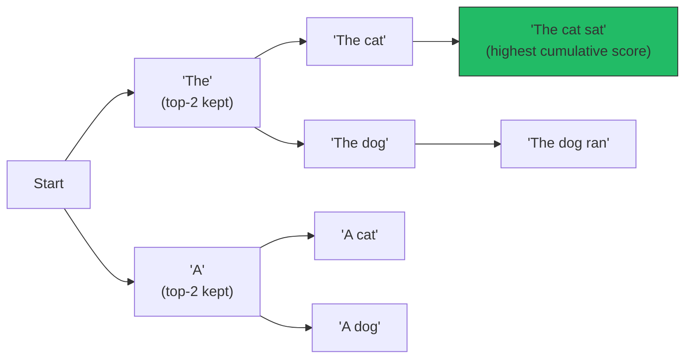

# Chapter 9: Sampling & Generation Strategies

*The model doesn't "decide" what to say next — it hands you a probability distribution over its entire vocabulary and someone has to decide how to turn that into a single token. That someone is the sampling algorithm, and it's more consequential than most engineers assume.*

## Learning Objectives

By the end of this chapter, you will be able to:

- Convert a raw logit vector into a probability distribution using softmax, by hand, for a small vocabulary
- Explain precisely why dividing logits by a temperature `T` before softmax sharpens or flattens the resulting distribution
- Implement and reason about top-k and top-p (nucleus) filtering, and explain why top-p adapts better to varying model confidence than top-k does
- Describe the standard order of operations chat APIs use when temperature, top-k, and top-p are combined
- Compare greedy decoding, sampling, and beam search, and choose the right one for a given generation task
- Explain — at a conceptual level — why speculative decoding speeds up generation without changing what the model would have said anyway
- Diagnose and fix degenerate repetition using repetition/frequency penalties
- Select sensible temperature/top-p defaults for code generation, factual Q&A, creative writing, and brainstorming, and justify the choice

---

## Prerequisites for This Chapter

This chapter sits at the very end of Phase 3 ("LLM Internals") and assumes you've completed:

- **[Chapter 7: LLM Architecture](./07-llm-architecture-and-decoding.md)** — you know that the final operation of every forward pass through a decoder-only transformer is a linear projection (the "LM head") that turns the last hidden state into a vector of **logits** — one raw, unbounded real number per vocabulary entry. Everything in this chapter starts exactly where Chapter 7 left off: you have a logit vector, and now you need a token.
- **[Chapter 8: Tokenization Deep Dive](./08-tokenization-deep-dive.md)** — you know that the vocabulary is a fixed, finite list of token IDs (BPE/tiktoken-style subwords), typically 30K–200K entries, and that "generating text" really means "picking one token ID at a time, then feeding it back in as input for the next step." Sampling is the decision procedure for that pick.

If you can already say "the model outputs logits over the vocabulary, and I feed the next token back in autoregressively," you have everything you need to start this chapter.

---

## 1. From Logits to Probabilities: The Softmax Function

### 1.1 Why logits alone aren't useful

At the end of a forward pass, the transformer's LM head produces one number per vocabulary entry — a **logit**. A logit of `4.0` for the token "sat" and `0.5` for "danced" tells you "sat" is relatively more likely, but the numbers themselves are not probabilities. They aren't bounded between 0 and 1, they don't sum to anything meaningful, and they can be negative. You cannot hand a sampler a logit vector and say "pick according to these numbers" — you first need to convert them into a proper probability distribution: non-negative, summing to exactly 1.

That conversion is the **softmax function**, and it's the single most-used function in this entire course that you've probably never had to write by hand.

### 1.2 The formula

For a logit vector `z = [z₁, z₂, ..., zₙ]` over `n` vocabulary tokens, the softmax probability of token `i` is:

```
              e^(zᵢ)
softmax(z)ᵢ = ────────
              Σⱼ e^(zⱼ)
```

In plain language: exponentiate every logit (which guarantees every value becomes positive), then divide each by the sum of all the exponentiated values (which guarantees they sum to 1). Exponentiation also has a useful side effect: it exaggerates differences — a logit that's just slightly larger than another becomes *disproportionately* more probable, which is exactly the "confident but not absolute" behavior you want from a language model.

A practical implementation detail worth knowing: naively computing `e^z` for large logits can overflow floating-point range. Every production implementation subtracts the maximum logit from all logits first (`z - max(z)`), which produces mathematically identical probabilities but keeps every exponent ≤ 0 and numerically stable. If you ever write `torch.softmax` or `scipy.special.softmax` from scratch, this is why the reference implementations look slightly more complicated than the formula above.

### 1.3 Worked example

Suppose the prompt is `"The cat ___"` and the model's LM head produces logits over a toy 6-token vocabulary of plausible next words:

| Token | Logit `z` |
|---|---|
| `sat` | 4.0 |
| `ran` | 3.0 |
| `jumped` | 2.5 |
| `slept` | 2.0 |
| `meowed` | 1.0 |
| `danced` | 0.5 |

Step 1 — exponentiate each logit:

| Token | `e^z` |
|---|---|
| `sat` | e⁴·⁰ = 54.598 |
| `ran` | e³·⁰ = 20.086 |
| `jumped` | e²·⁵ = 12.182 |
| `slept` | e²·⁰ = 7.389 |
| `meowed` | e¹·⁰ = 2.718 |
| `danced` | e⁰·⁵ = 1.649 |

Step 2 — sum them: `54.598 + 20.086 + 12.182 + 7.389 + 2.718 + 1.649 = 98.622`

Step 3 — divide each by the sum:

| Token | Probability |
|---|---|
| `sat` | 54.598 / 98.622 = **0.5537** (55.4%) |
| `ran` | 20.086 / 98.622 = **0.2037** (20.4%) |
| `jumped` | 12.182 / 98.622 = **0.1235** (12.3%) |
| `slept` | 7.389 / 98.622 = **0.0749** (7.5%) |
| `meowed` | 2.718 / 98.622 = **0.0276** (2.8%) |
| `danced` | 1.649 / 98.622 = **0.0167** (1.7%) |

These six numbers now sum to 1.0 and form a valid probability distribution. Everything from this point forward in the chapter — temperature, top-k, top-p, greedy decoding, beam search — is a different strategy for turning *this exact distribution* into a single chosen token. We'll reuse these six tokens and this same base distribution (T = 1.0, no filtering) as the reference point for every technique below.

```python
import numpy as np

logits = np.array([4.0, 3.0, 2.5, 2.0, 1.0, 0.5])
tokens = ["sat", "ran", "jumped", "slept", "meowed", "danced"]

def softmax(z):
    z = z - np.max(z)          # numerical stability trick
    exp_z = np.exp(z)
    return exp_z / exp_z.sum()

probs = softmax(logits)
for t, p in zip(tokens, probs):
    print(f"{t:>8}: {p:.4f}")
```

---

## 2. Temperature: Sharpening or Flattening the Distribution

### 2.1 Intuition first

Temperature is the "confidence dial" on generation. Picture the probability distribution above as a landscape — a tall, narrow peak at `sat` and a long, low tail toward `danced`. Temperature reshapes that landscape *before* it gets normalized into probabilities:

- **Low temperature (`T < 1`)** pushes the peak up and the tail down — the model becomes more confident, more deterministic, more likely to always pick the same "obvious" answer.
- **High temperature (`T > 1`)** flattens the landscape toward a plateau — every option becomes more competitive, increasing randomness and giving the tail tokens a real shot at being picked.
- **`T = 1`** leaves the distribution exactly as softmax naturally produced it (the table in Section 1.3).

This is why "temperature" is a good name: it's borrowed from statistical mechanics, where higher thermal energy makes particles more likely to jump into higher-energy (less probable) states.

### 2.2 The formula

Temperature is applied to the **logits**, before softmax:

```
                    e^(zᵢ / T)
softmax(z, T)ᵢ = ─────────────────
                  Σⱼ e^(zⱼ / T)
```

Dividing every logit by `T` scales the *gaps* between logits. Divide by a number less than 1 (e.g., `T = 0.5`, equivalent to multiplying by 2) and the gaps widen, so after exponentiation the largest logit dominates even more. Divide by a number greater than 1 (e.g., `T = 1.5`) and the gaps shrink, so after exponentiation the logits look more similar to each other, and softmax produces a flatter distribution.

Note `T = 0` is a special, undefined case mathematically (division by zero) — in practice, `T = 0` is implemented as **greedy decoding** (Section 6): always take the single highest-probability token, skipping the sampling step entirely.

### 2.3 Worked comparison: T = 0.5, T = 1.0, T = 1.5 on the same logits

Using the same six logits from Section 1.3 (`[4.0, 3.0, 2.5, 2.0, 1.0, 0.5]`):

| Token | T = 0.5 (sharper) | T = 1.0 (baseline) | T = 1.5 (flatter) |
|---|---|---|---|
| `sat` | **0.8286** (82.9%) | 0.5537 (55.4%) | **0.4206** (42.1%) |
| `ran` | 0.1122 (11.2%) | 0.2037 (20.4%) | 0.2160 (21.6%) |
| `jumped` | 0.0413 (4.1%) | 0.1235 (12.3%) | 0.1549 (15.5%) |
| `slept` | 0.0152 (1.5%) | 0.0749 (7.5%) | 0.1108 (11.1%) |
| `meowed` | 0.0021 (0.2%) | 0.0276 (2.8%) | 0.0569 (5.7%) |
| `danced` | 0.0008 (0.1%) | 0.0167 (1.7%) | 0.0408 (4.1%) |

Read this table left to right and watch the shape change: at `T = 0.5`, `sat` alone commands 83% of the probability mass and the tail is nearly extinguished — the model behaves almost greedily. At `T = 1.5`, `sat` drops to 42% and every other token gains meaningfully — the model has real odds of generating `slept`, `meowed`, or even `danced`, producing more surprising, varied text.

This single table is the entire intuition behind "turn temperature down for factual answers, turn it up for creative writing" — it's not a vague heuristic, it's a direct, computable reshaping of the same distribution.

```python
def softmax_with_temperature(logits, T):
    scaled = logits / T
    scaled = scaled - np.max(scaled)
    exp_z = np.exp(scaled)
    return exp_z / exp_z.sum()

for T in [0.5, 1.0, 1.5]:
    probs = softmax_with_temperature(logits, T)
    print(f"T={T}:", np.round(probs, 4))
```

---

## 3. Truncation Sampling: Top-k

### 3.1 Intuition

Even after temperature reshaping, the full distribution still assigns *some* nonzero probability to every one of the (potentially 100,000+) tokens in the vocabulary — including tokens that are obviously wrong for the context. Given enough generation steps, a model will occasionally sample from that long, mostly-nonsensical tail, producing an out-of-place word. **Top-k sampling** fixes this crudely but effectively: keep only the `k` tokens with the highest probability, discard everything else, and renormalize the remaining probabilities so they sum to 1 again.

### 3.2 Worked example: top-k = 3

Starting from the `T = 1.0` baseline distribution:

| Token | Original probability | Kept? |
|---|---|---|
| `sat` | 0.5537 | ✅ (rank 1) |
| `ran` | 0.2037 | ✅ (rank 2) |
| `jumped` | 0.1235 | ✅ (rank 3) |
| `slept` | 0.0749 | ❌ discarded |
| `meowed` | 0.0276 | ❌ discarded |
| `danced` | 0.0167 | ❌ discarded |

Sum of the kept probabilities: `0.5537 + 0.2037 + 0.1235 = 0.8809`. Renormalize by dividing each by that sum:

| Token | Renormalized probability |
|---|---|
| `sat` | 0.5537 / 0.8809 = **0.6288** |
| `ran` | 0.2037 / 0.8809 = **0.2312** |
| `jumped` | 0.1235 / 0.8809 = **0.1402** |

The sampler now picks from just these three options — `slept`, `meowed`, and `danced` have a mathematically exact **zero** chance of being generated, regardless of how the tail looked before truncation.

### 3.3 The problem: a fixed `k` doesn't adapt

Top-k's weakness is baked into its definition: `k` is a constant, chosen ahead of time, that doesn't know anything about *how confident the model is at this particular step*. Section 4.3 shows exactly why that's a problem.

---

## 4. Truncation Sampling: Top-p (Nucleus Sampling)

### 4.1 Intuition

Instead of fixing *how many* tokens to keep, top-p (also called **nucleus sampling**) fixes *how much cumulative probability mass* to keep. Sort tokens by probability, descending, and keep adding them to a "nucleus" set until their cumulative probability crosses a threshold `p` (commonly 0.9–0.95). Discard everything outside the nucleus, renormalize, and sample from what remains.

The key difference from top-k: the **size** of the nucleus set changes from step to step depending on the actual shape of the distribution. When the model is very confident (one or two tokens dominate), the nucleus is small. When the model is genuinely uncertain (many tokens are plausible), the nucleus grows to include more of them. Top-k cannot do this — its cutoff is always exactly `k` tokens, confident step or not.

### 4.2 Worked example: top-p = 0.9

Using the same `T = 1.0` baseline distribution, sorted descending (it already is) and accumulated:

| Token | Probability | Cumulative | Included in nucleus? |
|---|---|---|---|
| `sat` | 0.5537 | 0.5537 | ✅ |
| `ran` | 0.2037 | 0.7574 | ✅ |
| `jumped` | 0.1235 | 0.8809 | ✅ (still < 0.9) |
| `slept` | 0.0749 | 0.9558 | ✅ (this token pushes cumulative *past* 0.9, so it's included) |
| `meowed` | 0.0276 | 0.9834 | ❌ excluded |
| `danced` | 0.0167 | 1.0000 | ❌ excluded |

Nucleus = `{sat, ran, jumped, slept}`, total mass `0.9558`. Renormalize:

| Token | Renormalized probability |
|---|---|
| `sat` | 0.5537 / 0.9558 = **0.5793** |
| `ran` | 0.2037 / 0.9558 = **0.2131** |
| `jumped` | 0.1235 / 0.9558 = **0.1292** |
| `slept` | 0.0749 / 0.9558 = **0.0784** |

Notice this nucleus contains **four** tokens, not three — top-p included `slept` because the distribution at this step wasn't concentrated enough for the top three tokens alone to cross 90%. Top-k = 3 would have cut `slept` off arbitrarily, even though it's a perfectly reasonable next word.

### 4.3 Why top-p adapts and top-k doesn't: a second example

Now consider a different generation step where the model is *extremely* confident — say, completing `"The capital of France is ___"` with logits `[10.0, 1.0, 1.0, 1.0, 1.0, 1.0]` over tokens `[Paris, Rome, Berlin, Madrid, Lisbon, Vienna]`.

Softmax gives:

| Token | Probability |
|---|---|
| `Paris` | **0.99938** (99.94%) |
| `Rome` | 0.000123 |
| `Berlin` | 0.000123 |
| `Madrid` | 0.000123 |
| `Lisbon` | 0.000123 |
| `Vienna` | 0.000123 |

- **Top-p = 0.9**: cumulative probability after just `Paris` is already `0.99938 ≥ 0.9`. Nucleus = `{Paris}` only. The sampler will pick `Paris` with 100% certainty after renormalization. Correct behavior — the model isn't guessing, so there's nothing to sample.
- **Top-k = 3**: regardless of how confident the model is, top-k *always* keeps exactly 3 tokens — here, `Paris`, `Rome`, and `Berlin` (an arbitrary tie-break among the four 0.000123-probability tokens). After renormalization, `Rome` and `Berlin` each still get roughly a 1-in-8,000 chance of being sampled. Across a long generation (thousands of tokens per response, millions of responses per day in production), that non-zero tail risk on an obviously wrong token adds up to real, visible mistakes.

This is precisely the failure mode nucleus sampling was designed to fix, and it's the core argument of Holtzman et al.'s *"The Curious Case of Neural Text Degeneration"* (2019) — the paper that introduced top-p (see Further Reading). Fixed-size truncation is blind to the model's actual confidence at each step; probability-mass truncation is not.

---

## 5. Combining Temperature and Top-p: The Real-World Default

Almost every production chat API (OpenAI, Anthropic, Cohere, open-source servers like vLLM and llama.cpp) exposes both `temperature` and `top_p` as independent parameters, and applies them together, in this order:

```
1. Take the raw logits from the model's forward pass.
2. Divide by temperature T           →  reshape confidence (Section 2)
3. Apply softmax                     →  get a probability distribution
4. Apply top-p filtering (nucleus)   →  truncate the long tail (Section 4)
   (some stacks apply top-k as a coarse pre-filter before top-p)
5. Renormalize the surviving probabilities
6. Sample one token from the result
```

```
Logits ──▶ ÷T ──▶ softmax ──▶ [optional top-k prefilter] ──▶ top-p filter ──▶ renormalize ──▶ sample ──▶ token
```

Why both, instead of just one? They solve different problems:

- **Temperature** reshapes *how peaked or flat* the whole distribution is — it changes the relative odds between tokens that survive filtering.
- **Top-p** decides *which tokens are even eligible* to be sampled at all — it removes the long, low-probability tail regardless of how temperature reshaped it.

A common, well-tested default across many chat products is **`temperature ≈ 0.7`, `top_p ≈ 0.9`** — mild sharpening plus a generous but bounded nucleus. Raising temperature without a top-p cap re-opens the tail that top-p was suppressing (high temperature flattens the distribution, which can *grow* the nucleus at a fixed `p`, letting more marginal tokens back in) — this is why the two parameters interact, and why "just crank temperature to 2.0 for more creativity" is a common way to get incoherent output instead: without top-p (or top-k) bounding the tail, a flattened distribution gives real sampling probability to tokens that are outright wrong for the context.

---

## 6. Greedy Decoding vs Sampling

**Greedy decoding** skips probability entirely: at every step, take the single highest-probability token (equivalent to `T → 0`, argmax over logits). No randomness, no `top_p`, no seed needed — the same prompt always produces the exact same output.

| | Greedy Decoding | Sampling (temperature/top-k/top-p) |
|---|---|---|
| Determinism | Fully deterministic, reproducible | Stochastic (unless seeded) |
| Output diversity | None — same prompt, same output, every time | Varies run to run |
| Failure mode | **Repetition loops** — greedy tends to lock into "the the the the..." or repeat entire phrases, because the locally-best token at each step is often the token that continues an already-started repetitive pattern | Occasional incoherence or off-topic tokens if temperature/top-p are set too permissively |
| Best for | Tasks with one clearly correct answer where you need reproducibility: classification-style outputs, deterministic tool-call argument generation, regression testing of prompts | Open-ended generation: chat, creative writing, brainstorming, anything where "one best answer" doesn't exist |

The repetition problem with greedy decoding is well documented and is a major motivation for sampling-based approaches in general — Holtzman et al. (2019) show that greedy and beam search (Section 7) both systematically produce lower-quality, more repetitive continuations than nucleus sampling, even though they're "picking the most probable" tokens at every step. Locally optimal choices compound into globally bad text — a pattern experienced engineers will recognize from greedy algorithms in general.

---

## 7. Beam Search: Optimal Sequences, Wrong Tool for Chat

### 7.1 How it works

Greedy decoding only ever tracks one candidate sequence. **Beam search** tracks the top `B` (the "beam width") highest-scoring partial sequences at every step, instead of collapsing to one immediately:



At each step, beam search expands every one of the `B` current sequences by every possible next token, scores all the resulting candidates by cumulative log-probability, and keeps only the top `B` overall — pruning the rest. At the end, it returns the highest-scoring complete sequence. This explores far more of the possibility space than greedy (which is really "beam search with `B = 1`"), and it can find a globally higher-probability sequence that a purely greedy, step-by-step choice would have missed.

### 7.2 Why it's good for bounded, "correct-answer" tasks

Beam search shines when there is a **narrow band of acceptable outputs** and correctness matters more than variety — machine translation, extractive/abstractive summarization, speech-to-text transcription. In these tasks, "the sequence with the highest overall probability" really is close to "the best translation," and exploring several candidate sequences before committing helps avoid a single early misstep that greedy decoding would be locked into.

### 7.3 Why chat-style LLMs mostly don't use it

For open-ended generation, maximizing sequence probability is not the same as maximizing text *quality*. Human-written text is not the highest-probability continuation at every point — humans introduce surprising word choices, tangents, and variety that a probability-maximizing search actively avoids. Beam search, by construction, gravitates toward the "safest," most generic, most repetitive high-probability phrasing — the same degeneration problem as greedy decoding, just spread across a wider (but still probability-maximizing) search. This is precisely why essentially no production chat API exposes a `beam_width` parameter for chat completions: modern instruction-tuned chat models are decoded with sampling (temperature + top-p, Section 5), not beam search. Beam search still matters in this course — it reappears in dedicated translation/summarization contexts and some older encoder-decoder pipelines — but for the conversational LLMs this course focuses on, it's a tool you should recognize, not reach for by default.

---

## 8. Speculative Decoding (Preview)

*(Full treatment, including implementation details and throughput math, is in [Chapter 15: Quantization & Speculative Decoding](./15-quantization-and-speculative-decoding.md). This section gives you the conceptual model now, since it directly builds on the sampling mechanics you just learned.)*

### 8.1 The problem: generation is sequential and memory-bound

Autoregressive generation produces one token per forward pass through the *entire* model, and each pass must wait for the previous token before it can start (you need token `t` to generate token `t+1`). For a large model, each forward pass is expensive, and you pay that cost once per output token — even though, for large models, each individual forward pass is bottlenecked more by memory bandwidth (loading weights) than by actual compute, meaning much of the hardware's compute capacity sits idle during normal one-token-at-a-time decoding.

### 8.2 The trick: draft, then verify in parallel

**Speculative decoding** exploits that idle compute. A small, fast **draft model** (say, a distilled or much smaller version of the same model family) generates several candidate tokens ahead — e.g., 4–8 tokens — using ordinary autoregressive sampling. Then the large **target model** runs a *single* forward pass over the *entire draft sequence at once* (this is possible because, given a fixed sequence, computing logits for all positions in parallel is exactly what transformers are good at — it's the same computation used during training). That one parallel pass produces the target model's own logits at every one of those positions, as if it had generated them itself.

The target model then walks through the draft tokens left to right and **accepts** each one only if it's consistent with what the target model's own distribution says at that position (via a rejection-sampling rule that exactly preserves the target's output distribution — see Chapter 15 for the precise math). It accepts a run of matching tokens, and the moment a draft token disagrees, it stops accepting, discards the rest of the draft, and samples the *correct* token itself from its own distribution at that position — then the draft model starts over from there.

```
Draft model (small, fast):    "The"  "cat"  "sat"  "on"   "purple"
Target model (verifies once): "The"  "cat"  "sat"  "on"   "the"
                                ✅     ✅     ✅     ✅    ❌ mismatch → reject "purple",
                                                              target samples its own token here
Result: 4 tokens accepted "for free" + 1 token sampled normally = 5 tokens for ~1 target forward pass
```

### 8.3 Why this doesn't change the output distribution

This is the detail engineers most often get wrong: speculative decoding is **not** an approximation. The accepted tokens are validated against — and, on mismatch, replaced by tokens sampled from — the target model's own exact probability distribution at each position, using a rejection-sampling scheme designed specifically to guarantee the final output has the *identical* distribution as if the target model had generated every token by itself, one at a time, with ordinary sampling. The draft model only ever influences *how many tokens get proposed and checked per target forward pass* — never *which tokens are ultimately accepted*. The speedup comes purely from doing the expensive part (the target model's forward pass) less often per output token, by batching several speculative positions into one pass, not from cutting any corners on correctness.

---

## 9. Repetition Penalty and Frequency Penalty

Even with temperature and top-p well-tuned, models can fall into short repetition loops ("I think that I think that I think that...") — a token or phrase becomes locally probable enough that, once it appears, the model keeps re-selecting it. Two related mechanisms directly counteract this by modifying logits *before* softmax, based on what's already been generated in the current output:

- **Frequency penalty (additive, OpenAI-style)**: subtract `penalty × count(token)` from a token's logit, where `count(token)` is how many times it has already appeared in the generated text so far. The more a token has been repeated, the harder it becomes to select again — this scales with repetition frequency, not just presence.
- **Presence penalty (additive, OpenAI-style)**: subtract a flat `penalty` from a token's logit if it has appeared **at all** (regardless of how many times) — this discourages reusing *any* previously seen token, nudging the model toward new vocabulary rather than specifically punishing heavy repeaters.
- **Repeat penalty (multiplicative, common in llama.cpp/Hugging Face `repetition_penalty`)**: divide the logit by the penalty (if positive) or multiply it (if negative) for every token already generated — functionally similar in effect to the additive penalties, just parameterized differently (typical values are `1.0` = no penalty, `1.1`–`1.3` = mild-to-moderate correction).

All three are cheap, effective patches applied directly to the logit vector, upstream of temperature and top-p in the pipeline from Section 5. Overuse causes the opposite failure: the model starts avoiding ordinary, necessary repeated words (like "the" or a character's name) just to satisfy the penalty, producing stilted or oddly-varied phrasing.

---

## 10. Practical Tuning Guide

There's no universal "correct" setting — the right values depend on how much the task rewards a single correct-ish answer versus rewards variety. Use this table as a starting point, not gospel — always validate against your own use case.

| Task Type | Temperature | Top-p | Reasoning |
|---|---|---|---|
| **Code generation** | 0.0 – 0.3 | 0.9 – 1.0 | Code has strict syntactic and logical correctness requirements; there's usually one "obviously right" next token (a matching bracket, a known API name). Low temperature minimizes the chance of a syntactically-broken but "creative" completion. Top-p is often left high or unused because temperature alone already does most of the work at this range. |
| **Factual Q&A** | 0.0 – 0.3 | 0.9 | Facts don't benefit from creativity — you want the model's single best-supported answer, not an exploratory alternative. Low temperature reduces hallucination risk by keeping the model close to its highest-confidence tokens. |
| **General chatbot / assistant** | 0.6 – 0.8 | 0.9 – 0.95 | Needs to sound natural and non-repetitive across long conversations without straying into incoherence. This is the most common "default" range across production chat products. |
| **Creative writing** | 0.9 – 1.2 | 0.95 – 0.98 | Rewards novelty, unexpected phrasing, and variety over strict correctness — a wider, flatter distribution with a generous nucleus produces more surprising, less generic prose. Accept some risk of local incoherence in exchange. |
| **Brainstorming / idea generation** | 1.0 – 1.3 | 0.95 – 1.0 | The goal is breadth of options, not precision — you want many *different* candidate ideas across repeated calls, so a wide nucleus and a flatter distribution are desirable even at the cost of some individually low-quality suggestions. |
| **Translation / summarization** | 0.0 – 0.3, or beam search | n/a (or narrow if sampling) | Bounded, "correct answer" tasks (Section 7.2) — determinism and faithfulness to source content matter more than lexical variety. |

---

## Real-World Scenario

**The support-bot repetition bug.** A team ships an internal customer-support chatbot on top of an open-weight model served with vLLM. During testing, everything looks fine on short exchanges. Two weeks after launch, support engineers start reporting that on long back-and-forth tickets, the bot occasionally gets stuck: it responds with the exact same sentence, verbatim, three or four times in a row, then trails off. Users assume the bot is "broken" and escalate to a human.

The team's first hypothesis is a bug in their conversation-history management — maybe the same message is being appended to the context twice. They check the logs: the prompt is correct, no duplication. The actual cause turns out to be their generation config: to keep responses "safe and predictable," someone had set `temperature=0.0` (effectively greedy decoding) with no repetition penalty, reasoning that a support bot shouldn't be "creative." That's a reasonable instinct for reducing hallucination — but greedy decoding on long contexts is exactly the setup that produces the repetition-loop failure mode from Section 6: once the model's argmax token at some step happens to restart a phrase it already said, greedy decoding has no mechanism to escape, because the locally-best token at every subsequent step keeps re-selecting the same continuation.

The fix has two parts, matching the Factual Q&A row of the tuning guide plus the fix from Section 9: raise temperature slightly to `0.3` and add a mild `frequency_penalty` (around `0.3`, OpenAI-style) so that a token which has already been used gets a small logit discount on future steps — enough to break ties in favor of a *different* next token before a loop can fully form, without meaningfully increasing hallucination risk. The team also adds `top_p=0.9` as a tail-safety net. The repetition loops disappear in the next deployment, and the fix required changing three generation parameters — zero lines of application code.

**Lesson:** "deterministic" and "safe" are not the same property. Greedy decoding buys you reproducibility, but it actively increases the risk of a specific, well-documented failure mode (repetition loops) on longer generations — a small amount of temperature plus a repetition penalty is often the *more* reliable choice for production quality, even when your instinct says "turn down all the randomness."

---

## Best Practices

- **Never tune temperature and top-p in isolation** — they interact (Section 5). Test the combination you'll actually ship, not each parameter independently.
- **Default to temperature + top-p over top-k** for most modern chat use cases — top-p's adaptivity (Section 4.3) makes it a strictly better default than a fixed `k` in nearly every scenario, unless you have a specific reason to bound the *count* of candidates (e.g., constrained decoding with a small, known set of valid next tokens).
- **Use low temperature (or greedy) plus a repetition penalty together**, not low temperature alone, for deterministic-feeling tasks — this avoids the repetition-loop failure mode from the Real-World Scenario above while keeping output close to the model's best guess.
- **Reserve beam search for bounded-answer tasks** — translation, summarization, transcription — where sequence-level probability maximization is actually the goal, not chat.
- **Set and log a `seed`** whenever reproducibility matters (debugging, regression-testing prompts, A/B comparisons) — most APIs and inference servers support a seed parameter that makes sampling deterministic *given the same seed and inputs*, without giving up sampling's other benefits.
- **Match settings to task type explicitly** (Section 10) rather than using one global default across an entire application — a single "temperature=0.7 for everything" setting is a common source of both low-creativity brainstorming features and inconsistent factual answers in the same product.
- **Re-tune after a model swap.** The same temperature/top-p values do not transfer cleanly across model families or even model versions — a newer model's logit distributions can be sharper or flatter by default, changing how the same nominal settings behave in practice.

---

## Common Mistakes

- **Treating temperature as the only knob.** Cranking temperature to 1.5–2.0 without a top-p or top-k cap re-opens the long tail of implausible tokens (Section 5), producing incoherent output that gets blamed on "the model being bad" rather than on the missing tail-truncation.
- **Using a fixed top-k across wildly different prompts.** A `k` tuned for creative brainstorming (e.g., `k=100`) applied to a factual-lookup prompt lets in far more implausible tokens than the model's actual confidence warrants at that step — exactly the adaptivity failure from Section 4.3.
- **Assuming greedy decoding is "safe" because it's deterministic.** As shown in the Real-World Scenario, greedy decoding is *more* prone to repetition loops on long generations than lightly-sampled alternatives, not less.
- **Using beam search for open-ended chat.** Produces generically "safe," repetitive, low-personality text — beam search optimizes sequence probability, and the most probable sequence is rarely the most interesting one for open-ended generation (Section 7.3).
- **Setting repetition/frequency penalties too aggressively.** Overcorrecting causes the model to avoid necessary repeated words (character names, technical terms, the word "the"), producing stilted, unnaturally varied prose — tune incrementally and read outputs, don't set-and-forget a large penalty value.
- **Forgetting that temperature=0 doesn't guarantee identical output across different hardware/batch configurations.** Floating-point non-associativity across different batch sizes or GPU kernels can produce tiny numeric differences that occasionally flip an argmax tie — "deterministic" in a single fixed configuration is not the same guarantee as "deterministic across any infrastructure change."
- **Confusing speculative decoding with an approximation technique.** It's easy to assume a "fast draft model" must be trading off quality for speed. As Section 8.3 explains, it isn't — the acceptance rule is mathematically constructed to exactly reproduce the target model's own output distribution.

---

## Summary

- Softmax converts a raw logit vector into a valid probability distribution: exponentiate, then normalize by the sum.
- **Temperature** divides logits by `T` before softmax — `T < 1` sharpens the distribution (more deterministic), `T > 1` flattens it (more random); `T → 0` is equivalent to greedy decoding.
- **Top-k** keeps a fixed number of the highest-probability tokens and renormalizes; simple, but blind to how confident the model actually is at each step.
- **Top-p (nucleus sampling)** keeps the smallest set of tokens whose cumulative probability exceeds `p`, adapting the size of that set to the model's actual confidence — a small nucleus when confident, a larger one when uncertain. This is why it's generally preferred over top-k in production.
- Chat APIs typically apply **temperature, then softmax, then top-p filtering, then renormalize, then sample** — the two parameters interact and should be tuned together.
- **Greedy decoding** is deterministic but prone to repetition loops on longer generations; **sampling** trades determinism for diversity and reduces (though doesn't eliminate) that risk.
- **Beam search** tracks multiple candidate sequences to maximize overall sequence probability — excellent for bounded-answer tasks like translation/summarization, poor for open-ended chat because it gravitates toward generic, repetitive high-probability text.
- **Speculative decoding** uses a small draft model to propose several tokens, verified by the target model in one parallel forward pass — it speeds up generation without altering the output distribution, because acceptance is governed by the target model's own exact probabilities (full detail in Chapter 15).
- **Repetition/frequency penalties** directly discount the logits of already-used tokens, providing a cheap, effective fix for degenerate repetition loops.
- Tune temperature/top-p per task: low for code/facts, moderate for general chat, higher for creative/brainstorming work (Section 10).

---

## Knowledge Check

1. Given logits `[3.0, 2.0, 2.0, 0.0]` over 4 tokens, compute the softmax probabilities by hand (show your exponentials and the normalizing sum).
2. Explain, without using the word "randomness," what dividing logits by `T = 0.5` does to the *gaps between logits* and why that changes the shape of the resulting distribution.
3. A colleague sets `top_k=5` for a chatbot and complains it still occasionally produces bizarre, off-topic words on some turns but not others. Using the concept from Section 4.3, explain why a fixed `k` behaves inconsistently across turns and what changing to `top_p` would fix.
4. Why does a production chat API typically apply temperature *before* top-p filtering rather than the reverse, or in place of it? What would go wrong if you used only top-p with temperature fixed at a very high value and no cap?
5. Explain why beam search, despite exploring more candidate sequences than greedy decoding, still tends to produce bland or repetitive text for open-ended generation. What property of the task determines whether beam search is a good fit?
6. A teammate says: "Speculative decoding must lower output quality slightly, since we're using a smaller, weaker model to help generate." Correct this misunderstanding using the acceptance-rule argument from Section 8.3.

---

## Hands-On Exercise

Using the toy 6-token vocabulary and logits from Section 1.3 (`sat=4.0, ran=3.0, jumped=2.5, slept=2.0, meowed=1.0, danced=0.5`):

1. **Implement softmax with temperature** in Python (or extend the snippet from Section 2.3) and print the resulting distribution for `T = 0.3, 0.7, 1.0, 1.3, 2.0`. Confirm that the probability assigned to `sat` decreases monotonically as `T` increases.
2. **Implement top-k filtering** as a function that takes a probability distribution and `k`, returns the renormalized top-k distribution. Run it with `k = 1, 2, 4, 6` on the `T = 1.0` baseline and observe how it converges to the full (unfiltered) distribution as `k` approaches the vocabulary size.
3. **Implement top-p filtering** as a function that takes a probability distribution and `p`, returns the renormalized nucleus. Run it with `p = 0.5, 0.75, 0.9, 0.99` and record how many tokens end up in the nucleus at each threshold.
4. **Construct your own "confident" and "uncertain" logit vectors** (like the France/Paris example in Section 4.3 vs. the original cat example) and run both through your top-k(k=3) and top-p(p=0.9) implementations side by side. Write one paragraph explaining, using your own numbers, why the nucleus size differs between the two cases while top-k's size never does.
5. **Bonus:** Combine your temperature and top-p functions into a single pipeline function `sample(logits, T, p)` that follows the order of operations from Section 5, and run it 1,000 times at `T=0.8, p=0.9` on the baseline logits, tallying how often each token gets sampled. Compare the empirical frequencies to the theoretical renormalized probabilities you computed by hand — they should converge as the number of trials grows.

---

## Further Reading

- Holtzman, Buys, Du, Forbes, Choi, *"The Curious Case of Neural Text Degeneration"* (2019) — [arXiv:1904.09751](https://arxiv.org/abs/1904.09751) — the paper that introduced top-p/nucleus sampling and diagnosed exactly why greedy and beam search degenerate on open-ended generation.
- Leviathan, Kalman, Matias, *"Fast Inference from Transformers via Speculative Decoding"* (2023) — [arXiv:2211.17192](https://arxiv.org/abs/2211.17192) — the core speculative decoding paper; full treatment in Chapter 15.
- Chen et al. (DeepMind), *"Accelerating Large Language Model Decoding with Speculative Sampling"* (2023) — [arXiv:2302.01318](https://arxiv.org/abs/2302.01318) — an independently-developed, closely related formulation of speculative decoding.
- Fan, Lewis, Dauphin, *"Hierarchical Neural Story Generation"* (2018) — [arXiv:1805.04833](https://arxiv.org/abs/1805.04833) — introduced top-k sampling for open-ended text generation, the direct predecessor to nucleus sampling.
- OpenAI API Reference — [Chat Completions: `temperature`, `top_p`, `frequency_penalty`, `presence_penalty`](https://platform.openai.com/docs/api-reference/chat/create) — the parameter definitions and default values used by one of the most widely integrated production chat APIs.
- Hugging Face Transformers documentation, [*"Text Generation Strategies"*](https://huggingface.co/docs/transformers/generation_strategies) — practical, code-first coverage of greedy, sampling, beam search, and contrastive search decoding as implemented in `model.generate()`.
- vLLM documentation, [*"Sampling Parameters"*](https://docs.vllm.ai/en/latest/api_reference/sampling_params.html) — how these exact parameters are exposed and combined in a production-grade inference server, including seed support.

---

<div style="display:flex;justify-content:space-between;align-items:center;">
  <a href="./08-tokenization-deep-dive.md">← Previous: Tokenization Deep Dive</a>
  <a href="./00-index.md">🏠 Index</a>
  <a href="./10-prompt-engineering.md">Next: Prompt Engineering →</a>
</div>
