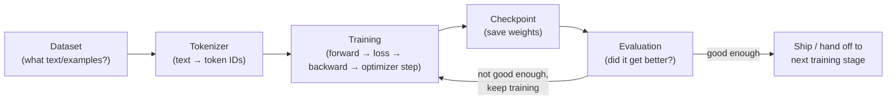
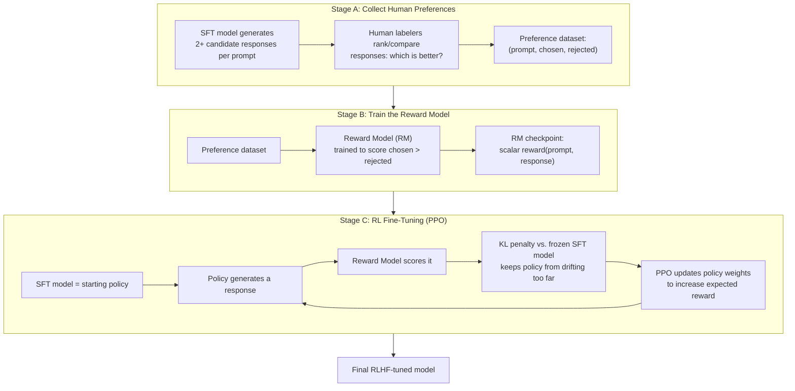
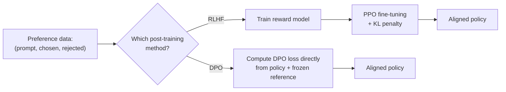

# Chapter 12: Pretraining, SFT, RLHF & DPO

> *A base model is a brilliant, encyclopedic improviser with no idea it's supposed to be helpful. Everything in this chapter is the story of how it's taught otherwise.*

## Learning Objectives

By the end of this chapter, you will be able to:

- Explain why the training loop introduced in Chapter 3 (forward pass → loss → backward pass → optimizer step) is reused, unchanged, at every stage of LLM training — only the data and the loss target change
- Describe the next-token-prediction objective and explain why such a simple objective, applied at trillion-token scale, produces broad emergent capability
- Explain why a raw "base model" is fluent but not aligned — and why that's a direct, predictable consequence of what it was trained to do
- Describe continued pretraining / domain adaptation and when it's worth doing before instruction tuning
- Explain Supervised Fine-Tuning (SFT) and why it is the step that turns a completion engine into something that behaves like an assistant
- Trace the full three-stage RLHF pipeline: preference data collection → reward model training → PPO fine-tuning with a KL penalty
- Derive the intuition behind DPO's loss function and explain why it eliminates the separate reward model and the RL loop entirely
- Compare RLHF and DPO on complexity, stability, and compute cost, and explain why much of the industry shifted toward DPO-style methods

---

## Prerequisites for This Chapter

This chapter assumes you're comfortable with two things from earlier in the course:

- **Chapter 3 (Deep Learning Fundamentals)** — the training loop itself: a forward pass produces predictions, a loss function scores how wrong those predictions were, backpropagation computes gradients, and an optimizer (SGD, Adam, etc.) nudges the weights to reduce the loss. Every stage in this chapter — pretraining, SFT, and the fine-tuning step inside RLHF/DPO — runs *exactly* that loop. Nothing mechanically new happens here. What changes, stage to stage, is only **what data goes in** and **what the loss function is computed against**.
- **Chapter 11 (Tool Calling & Structured Output)** — you already know how to *use* an instruction-following, tool-calling assistant model: you send a system prompt, a user message, maybe a tool schema, and the model reliably produces a helpful, on-topic, correctly formatted response. This chapter answers the question that raises: **how does a model learn to behave that way in the first place?** A model fresh off pretraining cannot reliably do any of what Chapter 11 assumes — it has to be built through the pipeline described below.

If you can already explain "loss function" and "gradient descent" in your own words, and you've used an instruction-tuned chat model via an API, you have everything you need for this chapter.

---

## 1. The Recurring Shape: Dataset → Tokenizer → Training → Checkpoint → Evaluation

Before diving into pretraining, SFT, RLHF, and DPO individually, notice that every single one of them is a rerun of the *same five-step pipeline*. Once you see this shape, the rest of the chapter is just "what changes in each box."



Map this against what you already know from Chapter 3:

| Pipeline step | What it means, mechanically | Chapter 3 concept it reuses |
|---|---|---|
| **Dataset** | A collection of examples the model will learn from | The training set |
| **Tokenizer** | Converts raw text into integer token IDs the model's embedding layer can consume | Unchanged from Chapter 8 — same tokenizer, same vocabulary, across all stages |
| **Training** | Forward pass → compute loss → backpropagate → optimizer step, repeated over many batches | The training loop, verbatim |
| **Checkpoint** | Save the current weights to disk so training can resume, be compared, or be shipped | Standard practice for any long-running training job |
| **Evaluation** | Run held-out data or benchmarks through the model to measure whether it actually improved | Validation loss / metrics, generalized to LLM-specific benchmarks later |

What changes between pretraining, SFT, RLHF, and DPO is **never** the shape above. It is always one or both of:

1. **What's in the Dataset box** (raw internet text vs. curated instructions vs. human preference comparisons), and
2. **What loss is computed in the Training box** (next-token cross-entropy vs. next-token cross-entropy on a narrower slice of tokens vs. a reward-weighted policy-gradient loss vs. a preference-pair loss).

Keep that framing in mind — it's the throughline that stops this chapter from feeling like four unrelated topics.

---

## 2. Stage 1: Pretraining — Learning to Predict the Next Token at Scale

### 2.1 The objective, in plain language

Pretraining teaches a model to do exactly one thing: **given some text, guess the next token.** That's it. Feed it "The capital of France is" and it should assign high probability to "Paris". Feed it "def factorial(n):\n    if n ==" and it should assign high probability to "0". There is no instruction, no notion of a "task," no reward for being helpful — just: given everything so far, what token comes next?

This is called **next-token prediction**, or **causal language modeling**. Formally, for a sequence of tokens `x₁, x₂, ..., x_T`, the model is trained to maximize the probability it assigns to each token given everything before it:

```
L_pretrain = -Σ_t  log P(x_t | x_1, x_2, ..., x_{t-1})
```

That's the cross-entropy loss you already know from Chapter 3, applied at every single token position in every document, across a dataset of **trillions of tokens** of raw text and code scraped from the web, books, code repositories, and other sources.

### 2.2 Why does something this simple produce so much capability?

This is the single most surprising fact in all of LLM training, so it's worth sitting with it. "Predict the next word" sounds like a party trick, not the foundation of a system that can write code, translate languages, and explain quantum mechanics. Here's the intuition for why it works:

To get *good* at predicting the next token across a sufficiently large and varied corpus, the model is forced to implicitly learn an enormous amount about the world — not because anyone told it to, but because prediction accuracy demands it:

- **Grammar and syntax** — to predict "he ___" is followed by a verb, not another pronoun, the model must learn parts of speech and sentence structure, purely from exposure.
- **Facts** — to predict that "The capital of France is" is followed by "Paris" far more often than "Berlin," the model must encode that fact somewhere in its weights.
- **Reasoning patterns** — to correctly continue "If x = 5 and y = x + 3, then y =", the model must track state and perform the arithmetic, or it will predict the wrong next token.
- **Style and register** — legal text, casual chat, poetry, and Python code all have distinct statistical "shapes." Predicting well across all of them means learning to recognize and match the shape it's currently in.
- **Long-range structure** — predicting the punchline of a joke, or the closing bracket of deeply nested code, requires tracking dependencies far back in the context.

None of these are separate training objectives. They are all *necessary side effects* of getting good at the one objective: minimizing next-token cross-entropy loss over an enormous, diverse corpus. This is why the field talks about **emergent capability** — abilities like multi-step arithmetic, translation, or code completion were never explicitly targeted; they showed up because they were instrumentally useful for the model to get better at the only thing it was ever asked to do.

### 2.3 Why the resulting "base model" is bad at being an assistant

Here's the part that surprises engineers who only ever interact with instruction-tuned chat models: a freshly pretrained **base model** is often *not* a good assistant, even though it's extremely knowledgeable. Ask it a question, and it might:

- Continue your question with more questions, instead of answering it (because that's a common pattern in forum data)
- Refuse nothing, including requests for harmful content (because the internet contains plenty of unfiltered continuations of harmful requests)
- Wander off-topic, ramble, or trail off mid-thought (because that's how a lot of raw text actually behaves)
- Complete "Translate this to French:" with a *list of ten more translation exercises* rather than the translation itself, if that's the pattern most represented in its training data

None of this is a bug. **The base model is doing exactly what it was trained to do**: model the statistical distribution of internet text. That distribution includes helpful Q&A pairs, but it also includes unhelpful, evasive, off-topic, unsafe, and downright bizarre continuations — because that's what's actually on the internet. A prompt like `"How do I pick a lock?"` has plausible continuations ranging from a locksmith's tutorial to a suspicious forum thread to a work of crime fiction, and the base model has no built-in preference for which one you wanted. It is a **next-token completion engine**, not an assistant — the assistant behavior is a separate, deliberate step layered on top, which is the rest of this chapter.

```
Base model prompt:  "Q: What's the best way to learn Python?\nA:"

Plausible completion #1: "Practice daily, build small projects, and read others' code."
Plausible completion #2: "Q: What's the best way to learn Guitar?\nA: ..."   (continues the FAQ pattern instead of answering!)
Plausible completion #3: "This is a great question that many beginners ask.
                           In this article, we'll explore..."               (blog-post voice, not a direct answer)
```

All three are statistically plausible continuations of internet text following that prompt. The base model has no mechanism to prefer completion #1 — that preference has to be *taught*.

---

## 3. Stage 1.5: Continued Pretraining / Domain Adaptation

Before jumping to instruction tuning, it's worth knowing about an optional intermediate step that reuses the exact same next-token-prediction objective, just on a narrower dataset.

**Continued pretraining** (also called domain-adaptive pretraining) takes an already-pretrained base model and continues training it — same architecture, same loss (next-token cross-entropy), same optimizer setup — but on a much smaller, domain-specific corpus: legal contracts, medical literature, a company's internal codebase, financial filings, or a specific programming language's ecosystem.

Why do this instead of jumping straight to instruction tuning?

- **Shift the model's default distribution.** A general base model has seen relatively little legal boilerplate compared to, say, Reddit posts. A few billion additional tokens of legal text nudge the model's internal representations to be more fluent in that domain's vocabulary, phrasing conventions, and implicit facts (e.g., what "the party of the second part" typically refers to) before it ever sees an instruction.
- **Cheaper than pretraining from scratch.** You're not re-learning grammar or general reasoning — you're specializing an already-capable model, so continued pretraining needs orders of magnitude fewer tokens (millions to low billions, versus trillions) and far less compute than a fresh pretraining run.
- **It composes with what comes next.** Continued pretraining doesn't replace SFT/RLHF/DPO — it's a distribution shift you apply *before* them, so the instruction-tuning stage starts from a model that's already fluent in the target domain.

The pipeline shape is identical to Section 1 — Dataset (domain corpus) → Tokenizer (same tokenizer as the original model) → Training (next-token cross-entropy) → Checkpoint → Evaluation (perplexity on held-out domain text, or downstream task accuracy) — it's simply pretraining's loop run again on a smaller, targeted dataset, using the base model's weights as the starting point instead of random initialization.

A word of caution: continued pretraining on a narrow corpus for too long can cause **catastrophic forgetting** of general capability — this is why the amount of continued pretraining is usually kept modest relative to the size of the original pretraining run, and mixed with some general data to preserve broad competence.

---

## 4. Stage 2: Supervised Fine-Tuning (SFT) — Teaching the Model to Behave Like an Assistant

### 4.1 The core idea

Supervised Fine-Tuning (SFT), also called **instruction tuning**, is the step that turns a raw completion engine into something that behaves like an assistant. The mechanism is almost anticlimactically simple: you take the pretrained base model and continue training it — using the *exact same* next-token-prediction loss — but now on a curated dataset of **(prompt, ideal response)** pairs, written or vetted by humans (or, increasingly, generated by a stronger model and filtered/edited by humans).

```
Example SFT training pair:

Prompt:   "What's the best way to learn Python?"
Response: "Start with small, concrete projects rather than reading straight
           through a book. Build something you personally want — a script
           that renames your files, a simple to-do app — and look things up
           as you get stuck. Practice consistency (even 20 minutes daily)
           matters more than long, infrequent sessions."
```

During training, the model sees the prompt and response concatenated together, but the loss is typically computed **only over the response tokens** (the prompt tokens are masked out of the loss, though the model still attends to them as context). This detail matters: you don't want to spend gradient signal teaching the model to "predict" the user's question — you only want to teach it to produce a good response *given* that question. Everything else — the tokenizer, the forward pass, the backward pass, the optimizer step — is identical to pretraining.

### 4.2 Why this works

Recall from Section 2.3 that the base model already "knows how" to write a good answer like the one above — that pattern exists plenty of times in its pretraining data. What it lacks is a strong, *consistent* preference for producing that pattern specifically in response to a direct question, rather than one of the many other plausible continuations. SFT doesn't teach new facts or new syntax so much as it **narrows the model's response distribution** toward "always behave like a helpful, direct-answering assistant," using a relatively small but high-quality dataset (tens of thousands to a few hundred thousand examples is common, versus trillions of tokens for pretraining).

You can think of pretraining as teaching the model the entire *language* — vocabulary, grammar, facts, style, reasoning patterns — and SFT as teaching it *which register of that language to consistently speak in*: the assistant register, not the random-internet-text register.

### 4.3 What SFT does *not* fix

SFT alone gets you a model that follows instructions and answers directly — a genuine, large leap over the base model. But it has real limits:

- It only ever tells the model "produce this exact response" — it never tells the model "this response is better than that one, by this much." There's no notion of *comparative* quality.
- It's entirely dependent on the quality of the humans (or model) who wrote the target responses. If the ideal responses are subtly mediocre, evasive, or verbose, the model faithfully learns to be subtly mediocre, evasive, or verbose.
- It has no mechanism for expressing nuanced preferences like "be concise" vs. "be thorough," or safety trade-offs like "refuse this specific harmful request but not a superficially similar benign one" — these require *comparing* candidate responses, not just imitating one written example.

This is exactly the gap that RLHF and DPO were built to close.

---

## 5. Stage 3: RLHF — Aligning with Human Preferences via Reinforcement Learning

### 5.1 The intuition: why go beyond SFT?

SFT teaches the model to imitate a fixed set of "gold" responses. But for many prompts, there's no single correct answer — there's a *spectrum* of acceptable responses, and what humans actually want is often easier to express as a **comparison** ("Response A is better than Response B") than as a single ideal response you'd have to write from scratch for every possible prompt. RLHF is built entirely around collecting and exploiting that kind of comparative signal.

The full pipeline has three distinct stages, each with its own dataset, its own training run, and its own checkpoint:



### 5.2 Stage A — Collecting human preference comparisons

Take the SFT model from Section 4 and, for a given prompt, sample two or more different candidate responses (different random seeds, different sampling temperatures — see Chapter 9). Show these candidates, side by side, to human labelers, and ask a simple comparative question: **"Which of these responses is better?"** (Sometimes labelers rank more than two, or rate on multiple axes like helpfulness, honesty, and harmlessness — but the atomic unit of data is a comparison, not a single ideal answer.)

This produces a dataset of triples: `(prompt, chosen_response, rejected_response)`. Comparative judgments like this are usually faster and more consistent for humans to produce than writing a perfect response from scratch — it's much easier to say "A is more helpful than B" than to author the single best possible answer.

### 5.3 Stage B — Training the reward model

The preference dataset from Stage A is used to train a **separate model**, the **reward model (RM)**, whose job is to take a `(prompt, response)` pair and output a single scalar score predicting how much a human would like that response. It's typically initialized from the SFT model's weights (swap the final language-modeling head for a regression head that outputs one number) and trained with a loss that pushes the score of the chosen response above the score of the rejected response:

```
L_RM = -log σ( r(x, y_chosen) - r(x, y_rejected) )
```

where `r(x, y)` is the reward model's scalar score for prompt `x` and response `y`, and `σ` is the sigmoid function. This loss is minimized when the reward model assigns a *much* higher score to the human-preferred response than to the rejected one — the bigger that gap, the smaller (more confident) the loss.

At the end of Stage B, you have a standalone model that can score *any* `(prompt, response)` pair with a number, without needing a human in the loop for every evaluation. That's the whole point: it's a learned, automatable proxy for human judgment.

### 5.4 Stage C — Fine-tuning the policy with PPO and a KL penalty

Now the SFT model (renamed the **policy** in RL terminology) is fine-tuned to produce responses that the reward model scores highly. This is genuine reinforcement learning: the policy generates a response (the "action"), the reward model scores it (the "reward"), and an RL algorithm — almost always **PPO (Proximal Policy Optimization)** — updates the policy's weights to increase expected future reward.

Here's the critical subtlety, and the reason this stage is notoriously fragile: **if you only maximize reward model score, the policy will learn to game the reward model.** Reward models are imperfect proxies for real human preference, and an RL optimizer is very good at finding and exploiting the reward model's blind spots — producing text that scores artificially high on the RM but is repetitive, nonsensical, or eerily gamed (e.g., stuffing in phrases the RM over-values) rather than genuinely good. This failure mode is called **reward hacking**.

The fix is a **KL-divergence penalty** added to the reward signal, measuring how far the current policy's output distribution has drifted from the original SFT model (kept frozen as a fixed **reference model** throughout this stage):

```
reward_total = r(x, y) - β · KL[ π_policy(y|x) ‖ π_ref(y|x) ]
```

- `r(x, y)` is the reward model's score — "how much does the reward model like this response?"
- `KL[π_policy ‖ π_ref]` measures how different the current policy's response distribution is from the frozen SFT reference model's distribution, for that same prompt.
- `β` is a tunable coefficient controlling how strongly drift is penalized.

Intuitively: the policy is allowed to shift its behavior toward higher-reward responses, but it pays a "distance penalty" for straying too far from what the original, sane SFT model would have said. This keeps the optimization anchored to a distribution of text that's still fluent, on-topic, and recognizably assistant-like, rather than letting PPO wander into some degenerate high-reward-but-nonsensical corner of output space.

### 5.5 Worked example: a simplified reward model scoring pass

To make Stage B concrete, imagine a (drastically simplified) reward model that has learned to weigh three properties of a response — directness, correctness, and length-appropriateness — and combines them into a scalar score. For the prompt *"What's the boiling point of water at sea level?"*, two candidate responses might score like this:

| Response | Directness | Correctness | Length-appropriateness | Reward score `r(x,y)` |
|---|---|---|---|---|
| A: "100°C (212°F) at standard atmospheric pressure." | 0.95 | 1.00 | 0.90 | **2.35** (sum, illustrative) |
| B: "Great question! Water is a fascinating substance with many properties across different conditions, and its boiling point can vary..." (never actually gives the number) | 0.10 | 0.00 | 0.20 | **0.30** |

Plugging these into the reward-model loss from Section 5.3:

```
L_RM = -log σ(r(x, y_A) - r(x, y_B)) = -log σ(2.35 - 0.30) = -log σ(2.05) ≈ -log(0.886) ≈ 0.121
```

A small loss, because the reward model already confidently ranks A above B — exactly what you want it to learn from a human labeler who picked A as the chosen response. If the reward model had instead scored them close together (say, 1.2 vs. 1.1), the loss would be much larger, pushing training to widen that gap. During Stage C, the policy is then nudged, prompt by prompt, toward generating responses that look more like A and less like B — while the KL penalty stops it from over-correcting into, say, terse non-answers that happen to also score well on "directness" alone.

---

## 6. Stage 3, Alternative Path: DPO — Direct Preference Optimization

### 6.1 The problem RLHF's complexity creates

The RLHF pipeline in Section 5 works, and it's what produced early breakthroughs like InstructGPT. But it has three moving, interacting parts, each with its own failure modes: a reward model that can be miscalibrated or exploited, a PPO loop that is notoriously sensitive to hyperparameters and prone to instability (rewards collapsing, policies diverging, training runs needing to be restarted), and a KL penalty coefficient that needs careful tuning to balance reward-seeking against staying close to the reference model. Running all three reliably at scale is a genuine engineering undertaking, requiring specialized RL infrastructure most teams don't otherwise need.

**Direct Preference Optimization (DPO)**, introduced by Rafailov et al. in 2023, asks: can we get the same *outcome* — a policy that prefers human-chosen responses over rejected ones, without drifting too far from the SFT model — without training a separate reward model and without running RL at all?

### 6.2 The key insight

DPO's insight is mathematical, but the consequence is simple to state: the RLHF objective in Section 5.4 (maximize reward, penalized by KL divergence from the reference model) has a **closed-form optimal policy** in terms of the reward function. Rafailov et al. show that this relationship can be algebraically inverted — instead of first fitting a reward model and then searching for the policy that's optimal under it, you can substitute the reward model *out* of the equation entirely and write a loss function that operates **directly on the policy's own token probabilities**, using preference pairs alone:

```
L_DPO(θ) = -log σ( β · [ (log π_θ(y_w|x) - log π_ref(y_w|x))
                        - (log π_θ(y_l|x) - log π_ref(y_l|x)) ] )
```

Where:
- `y_w` is the human-preferred ("winning") response, `y_l` is the rejected ("losing") response, for the same prompt `x`
- `π_θ` is the model currently being trained (the policy); `π_ref` is the frozen SFT model (same role as the reference model in RLHF's KL term)
- `log π(y|x)` is the sum of log-probabilities the model assigns to each token of response `y` given prompt `x` — a quantity you can compute directly from a forward pass, no reward model needed
- `β` again controls how strongly the model is pushed to separate preferred from rejected, analogous to the KL coefficient in RLHF

Read the term inside the brackets as: *"how much more (in log-probability) does the current policy prefer the winning response over the reference model's preference for it, compared to how much more it prefers the losing response over the reference model's preference for it."* Training pushes this quantity up — which means: increase the likelihood of the preferred response and decrease the likelihood of the rejected response, **relative to what the frozen reference model would have done**, not in absolute terms. That relative framing is exactly what plays the role the KL penalty played in RLHF, except now it's baked directly into the loss rather than bolted on as a separate regularization term computed from RL rollouts.

There is no reward model. There is no PPO. There is no environment, no rollout sampling loop, no advantage estimation. It's a **supervised-style loss** computed directly from two forward passes (policy and frozen reference) over a batch of `(prompt, chosen, rejected)` triples — the *same kind of preference data* RLHF's Stage A already collects, but skipping straight from that data to a policy update.

### 6.3 Why this simplification is attractive

- **Fewer moving parts.** One model being trained (the policy) plus one frozen reference — no separate reward model to train, validate, and keep in sync with the policy as it updates.
- **More stable training.** DPO's loss is a well-behaved, differentiable function of the policy's own log-probabilities — it's optimized with ordinary gradient descent, the same way SFT is, rather than the more brittle machinery of policy-gradient RL (no reward variance, no advantage estimation, no PPO clipping ratios to tune).
- **Lower compute and engineering cost.** No need to run inference-time rollouts against a reward model during training, no need to maintain RL-specific infrastructure — DPO training loops look almost identical to an SFT training loop, just with paired examples and a different loss function.
- **Same data requirement as RLHF's Stage A.** Since DPO consumes the same `(prompt, chosen, rejected)` preference triples that RLHF's reward-model stage already needs, teams that were going to collect preference data anyway can plug it directly into DPO and skip Stages B and C of the RLHF pipeline entirely.

### 6.4 Worked example: a toy preference-pair margin calculation

Suppose, for prompt `x = "Summarize this contract clause in one sentence."`, we have a preferred response `y_w` and a rejected response `y_l` (the rejected one being needlessly verbose and vague). Assume these (illustrative, simplified) summed log-probabilities under the current policy `π_θ` and the frozen reference model `π_ref`:

| Quantity | Value |
|---|---|
| `log π_θ(y_w | x)` (policy, preferred response) | −18.2 |
| `log π_ref(y_w | x)` (reference, preferred response) | −19.4 |
| `log π_θ(y_l | x)` (policy, rejected response) | −22.1 |
| `log π_ref(y_l | x)` (reference, rejected response) | −20.5 |

First compute each response's **implicit reward margin** relative to the reference model (this quantity, `β · (log π_θ - log π_ref)`, is exactly what DPO's derivation shows behaves like an implicit reward, without ever training a reward model — using `β = 1` here for simplicity):

```
implicit_reward(y_w) = log π_θ(y_w|x) - log π_ref(y_w|x) = -18.2 - (-19.4) =  1.2
implicit_reward(y_l) = log π_θ(y_l|x) - log π_ref(y_l|x) = -22.1 - (-20.5) = -1.6
```

The policy has moved the preferred response's probability *up* relative to the reference (+1.2) and moved the rejected response's probability *down* relative to the reference (−1.6) — exactly the direction we want. Now compute the DPO loss for this single pair:

```
margin = implicit_reward(y_w) - implicit_reward(y_l) = 1.2 - (-1.6) = 2.8

L_DPO = -log σ(β · margin) = -log σ(1 · 2.8) = -log σ(2.8) ≈ -log(0.943) ≈ 0.059
```

A small loss — because the policy already strongly separates the two responses in the desired direction. If, before this training step, the policy had instead had `implicit_reward(y_w) = 0.1` and `implicit_reward(y_l) = 0.3` (barely separated, and in the wrong order relative to what we want), the margin would be `0.1 - 0.3 = -0.2`, giving `L_DPO = -log σ(-0.2) ≈ -log(0.450) ≈ 0.799` — a much larger loss, and a much stronger gradient pushing the policy to increase `y_w`'s relative log-probability and decrease `y_l`'s. This is the entire DPO training signal, applied across a large batch of preference triples, with backpropagation and an optimizer step exactly as in Chapter 3's training loop.

---

## 7. RLHF vs. DPO: Choosing a Post-Training Method



| Dimension | RLHF (Reward Model + PPO) | DPO |
|---|---|---|
| **Moving parts** | Three stages: preference collection, reward model, RL loop | Two stages: preference collection, direct policy loss |
| **Separate reward model?** | Yes — trained, validated, and must stay well-calibrated throughout RL training | No — the "reward" is implicit in the policy's own log-probabilities vs. the reference model |
| **Training stability** | Prone to instability: reward hacking, PPO hyperparameter sensitivity, reward/KL balance tuning | Comparable to standard supervised fine-tuning — a well-behaved, differentiable loss, no RL-specific instability |
| **Compute cost** | Higher — requires sampling rollouts, scoring them with the reward model, and running PPO updates, on top of the reward model's own training run | Lower — one forward pass through the policy and one (frozen, no-gradient) forward pass through the reference model per batch, then ordinary backprop |
| **Engineering complexity** | Needs RL-specific infrastructure (rollout sampling, advantage estimation, PPO clipping) most application teams don't otherwise maintain | Reuses ordinary supervised training infrastructure — same shape as SFT, different loss function |
| **Data requirement** | `(prompt, chosen, rejected)` preference triples | Same `(prompt, chosen, rejected)` preference triples |
| **Historical role** | The method behind InstructGPT and the first wave of aligned chat models; still used, and often combined with newer preference methods, at the largest labs | Rapidly adopted across the open-source ecosystem (and increasingly in industry) once it was shown to match or approach RLHF's alignment quality with far less operational overhead |

**Why the shift toward DPO-style methods happened:** once Rafailov et al. demonstrated that a much simpler, more stable loss function achieved comparable alignment results on the *same preference data* RLHF already required, teams without dedicated RL infrastructure had little reason to maintain a separate reward model and an unstable PPO loop. This doesn't mean RLHF disappeared — some of the largest labs still use PPO-based pipelines (sometimes layered with newer refinements), and reward models remain useful for other purposes (e.g., filtering or re-ranking candidate outputs at inference time, or as part of more elaborate hybrid pipelines). But for most teams doing post-training today, DPO and its close relatives (IPO, KTO, and other "direct alignment" variants) are the pragmatic default, precisely because they trade a small amount of theoretical flexibility for a large reduction in moving parts.

---

## 8. The Full Pipeline, End to End

Putting Sections 2 through 7 together, here is the complete journey from raw text to an aligned, instruction-following model, with the Dataset → Tokenizer → Training → Checkpoint → Evaluation loop from Section 1 made explicit at every stage:

```mermaid
flowchart TD
    subgraph PT["Stage 1: Pretraining"]
        PT_D["Dataset:\ntrillions of tokens,\nraw web text + code"] --> PT_T["Tokenizer\n(BPE, fixed vocab)"]
        PT_T --> PT_TR["Training:\nnext-token cross-entropy\nover ALL tokens"]
        PT_TR --> PT_C["Checkpoint:\nBase Model"]
        PT_C --> PT_E["Evaluation:\nperplexity, few-shot\nbenchmarks"]
    end

    PT_E --> CP

    subgraph CP["Stage 1.5: Continued Pretraining (optional)"]
        CP_D["Dataset:\nnarrow domain corpus\n(legal, code, medical...)"] --> CP_T["Tokenizer\n(same as base model)"]
        CP_T --> CP_TR["Training:\nnext-token cross-entropy\non domain text"]
        CP_TR --> CP_C["Checkpoint:\nDomain-Adapted Base"]
        CP_C --> CP_E["Evaluation:\ndomain perplexity"]
    end

    CP_E --> SFT
    PT_E -.skip if not needed.-> SFT

    subgraph SFT["Stage 2: Supervised Fine-Tuning"]
        SFT_D["Dataset:\n(prompt, ideal response)\npairs, human-curated"] --> SFT_T["Tokenizer\n(same tokenizer)"]
        SFT_T --> SFT_TR["Training:\nnext-token cross-entropy\non RESPONSE tokens only"]
        SFT_TR --> SFT_C["Checkpoint:\nSFT Model"]
        SFT_C --> SFT_E["Evaluation:\nhuman/automated\nresponse quality"]
    end

    SFT_E --> CHOICE{"RLHF or DPO?"}

    subgraph RLHF_S["Stage 3a: RLHF"]
        RL_D["Dataset:\n(prompt, chosen, rejected)\npreference comparisons"] --> RL_RM["Train Reward Model\n(separate model)"]
        RL_RM --> RL_TR["Training:\nPPO policy updates\n+ KL penalty vs. SFT model"]
        RL_TR --> RL_C["Checkpoint:\nRLHF Model"]
        RL_C --> RL_E["Evaluation:\nhuman preference win-rate"]
    end

    subgraph DPO_S["Stage 3b: DPO"]
        DPO_D["Dataset:\n(prompt, chosen, rejected)\npreference comparisons"] --> DPO_T["Tokenizer\n(same tokenizer)"]
        DPO_T --> DPO_TR["Training:\nDPO loss on policy vs.\nfrozen reference (= SFT model)"]
        DPO_TR --> DPO_C["Checkpoint:\nDPO Model"]
        DPO_C --> DPO_E["Evaluation:\nhuman preference win-rate"]
    end

    CHOICE -->|"reward model +\nPPO infra available"| RLHF_S
    CHOICE -->|"simpler, more stable\npipeline preferred"| DPO_S

    RL_E --> FINAL["Aligned, instruction-following,\nassistant-behaving model"]
    DPO_E --> FINAL
```



Notice that every subgraph reuses the same five boxes from Section 1 — only their contents change. That repetition is the entire point of this chapter: you already knew the training loop; everything here is what dataset and loss you plug into it, stage by stage.

---

## Real-World Scenario

**Scenario:** A mid-sized software company wants to build an internal coding assistant fine-tuned on their own codebase and coding conventions, and aligned to prefer their house style (e.g., specific error-handling patterns, internal library usage, comment conventions).

**Stage 1 — they don't pretrain from scratch.** Pretraining a base model from zero costs many millions of dollars and requires web-scale data the company doesn't have. Instead, they start from an existing open-weights base model (e.g., a Llama or Qwen base checkpoint) that already encodes broad programming knowledge from its original pretraining run.

**Stage 1.5 — continued pretraining on their codebase.** They run a modest continued-pretraining pass (next-token prediction, same loss as Stage 1) over their internal monorepo — a few hundred million tokens of code, comments, and internal documentation — to shift the model's fluency toward their specific frameworks, internal API names, and idioms. This is far cheaper than full pretraining because it's a much smaller dataset and starts from already-capable weights.

**Stage 2 — SFT on curated (prompt, ideal completion) pairs.** Senior engineers curate a dataset of realistic prompts ("write a function that validates a webhook signature using our internal `AuthUtil` library") paired with example completions that follow house style. SFT nudges the model to consistently produce completions in that style, rather than the generic style it would otherwise default to.

**Stage 3 — DPO on internal code-review preferences, not full RLHF.** Rather than stand up a separate reward model and a PPO training loop (which requires RL expertise and infrastructure the team doesn't have), they collect a modest preference dataset: for a given prompt, generate two candidate completions from the SFT model, and have senior engineers pick which one they'd approve in a real code review. This gives `(prompt, chosen, rejected)` triples directly usable by DPO — skipping the reward model and RL loop entirely, and reusing the same training infrastructure they already built for SFT.

**Outcome:** the final model, at a fraction of the cost and complexity of a from-scratch RLHF pipeline, reliably produces completions that are fluent in the company's internal frameworks (from continued pretraining), directly follow instructions (from SFT), and match house code-review preferences (from DPO) — without ever needing to train or maintain a separate reward model.

---

## Best Practices

- **Never skip straight to RLHF/DPO without a solid SFT stage first.** Preference-based methods fine-tune an *existing* behavior distribution — if the SFT model can't produce a good response at all, there's nothing for preference tuning to sharpen.
- **Keep the reference/frozen model identical to the SFT checkpoint** used to generate the preference pairs (for both RLHF's KL term and DPO's loss) — a mismatched reference model changes what "drift" even means and destabilizes training.
- **Invest disproportionately in preference-data quality**, not just quantity. A modest number of careful, consistent human comparisons produces a better reward signal (for either RLHF or DPO) than a large volume of noisy or inconsistent labels — both methods are only as good as the preferences they're trained on.
- **Monitor for reward hacking during RLHF** by periodically eyeballing generated samples, not just watching the reward curve climb — a rising reward score with degrading actual response quality is the textbook symptom.
- **Tune the KL coefficient (`β` in both RLHF and DPO) deliberately**, and treat it as a genuine hyperparameter search, not a constant to set once — too small and the model drifts into gamed, low-quality outputs; too large and it barely moves from the SFT baseline.
- **Default to DPO (or a close relative) unless you have a specific reason to need full RLHF** — dedicated RL infrastructure, a desire to reuse the reward model for other purposes (re-ranking, filtering), or research needs that require the flexibility of an explicit reward model.
- **Re-run evaluation at every checkpoint**, not just at the end — pretraining perplexity, SFT response quality, and preference-tuning win-rate against the previous stage's checkpoint are all cheap sanity checks that catch regressions before they compound into the next stage.

---

## Common Mistakes

- **Treating the base model as "the LLM" and being surprised by unsafe or off-topic outputs.** That behavior is the expected, undiluted consequence of a model trained purely on next-token prediction over internet text — not a defect to patch at inference time, but a gap that pretraining was never designed to close.
- **Computing the SFT loss over the entire sequence, including prompt tokens.** This wastes gradient signal teaching the model to predict tokens it will never need to generate (the user's own question) and can subtly bias the model's behavior; the loss should be masked to response tokens only.
- **Running PPO without a KL penalty, or with it tuned too weakly.** This is the single most common cause of catastrophic reward hacking in RLHF — the policy finds and exploits reward model blind spots, producing high-scoring but low-quality or nonsensical text.
- **Using a reference model in DPO that doesn't match the model that generated the preference pairs.** If the preference data was collected from one SFT checkpoint but the frozen reference in the DPO loss is a different checkpoint, the implicit reward margins no longer mean what the derivation assumes, degrading training quality in subtle, hard-to-diagnose ways.
- **Assuming DPO is strictly "better" than RLHF.** DPO is *simpler and more stable*, which is why it's now the pragmatic default for most teams — but it is not a strict quality upgrade in every setting; some labs still find value in an explicit, reusable reward model, particularly when they need to score or filter outputs beyond training (e.g., best-of-N re-ranking at inference time).
- **Collecting preference data with inconsistent or poorly instructed labelers.** Both RLHF's reward model and DPO's loss are only as good as the preference signal feeding them — noisy or contradictory human judgments produce a noisy alignment signal no matter how well-implemented the downstream method is.
- **Forgetting that continued pretraining can cause catastrophic forgetting.** Training too long, or too narrowly, on a domain corpus can erode general capability that the base model had before — always mix in some general data or cap the continued-pretraining budget, and evaluate on general benchmarks afterward, not just domain benchmarks.

---

## Summary

- Every training stage in this chapter reuses the same five-step pipeline from Chapter 3's training loop — **Dataset → Tokenizer → Training → Checkpoint → Evaluation** — and the same forward-pass/loss/backward-pass/optimizer-step mechanics. Only the data and loss target change, stage to stage.
- **Pretraining** trains a model on trillions of tokens with a single objective — next-token cross-entropy prediction — which forces the model to implicitly learn grammar, facts, reasoning, and style as side effects of getting good at prediction. The resulting **base model** is fluent but not aligned: it's modeling the full distribution of internet text, unhelpful and unsafe continuations included.
- **Continued pretraining / domain adaptation** reuses the exact same next-token objective on a narrower domain corpus, shifting the base model's distribution before instruction tuning, at far lower cost than pretraining from scratch.
- **SFT (instruction tuning)** fine-tunes the base model on curated `(prompt, ideal response)` pairs, computing the same cross-entropy loss but only over response tokens — this is the step that produces assistant-like behavior.
- **RLHF** is a three-stage pipeline: collect human preference comparisons → train a separate **reward model** to predict those preferences → fine-tune the policy with **PPO** to maximize reward, held in check by a **KL-divergence penalty** against the frozen SFT model to prevent reward hacking.
- **DPO** derives a loss function that optimizes the policy directly on preference pairs, with no separate reward model and no RL loop — the "reward" is implicit in the gap between the policy's and the frozen reference model's log-probabilities for the chosen vs. rejected response.
- DPO's simplicity, stability, and lower engineering cost drove much of the industry's shift toward DPO-style methods for post-training, though RLHF/PPO pipelines remain in use, especially where an explicit, reusable reward model has value beyond training itself.
- All of the above assumes **full-parameter** fine-tuning — updating every weight in the model. Chapter 13 introduces LoRA, QLoRA, and PEFT as a dramatically cheaper alternative for adapting a model without touching most of its parameters.

---

## Knowledge Check

1. A base model, when prompted with a direct question, sometimes responds with a list of related questions instead of an answer. Explain *why* this happens, in terms of what the pretraining objective actually optimizes for — this is not a bug to be fixed at inference time, but a predictable consequence of something specific. Name it.
2. In SFT, why is the loss computed only over the response tokens rather than the full prompt-plus-response sequence? What would go wrong, or be wasted, if you computed it over the whole sequence?
3. Walk through RLHF's three stages in order, and for each stage, state: (a) what dataset feeds it, and (b) what gets produced as output. Where exactly does the KL-divergence penalty get applied, and what failure mode is it specifically designed to prevent?
4. In DPO's loss function, what role does the frozen reference model `π_ref` play? What would happen to training if you removed it entirely and just tried to maximize `log π_θ(y_w|x) - log π_θ(y_l|x)` with no reference term?
5. Using the numbers from Section 6.4's worked example, recompute the DPO loss if `implicit_reward(y_w)` had instead been `0.5` and `implicit_reward(y_l)` had been `1.9` (i.e., the policy currently prefers the *rejected* response). Is the resulting loss larger or smaller than the original 0.059, and does that match your intuition about what the loss should do in that case?
6. Give two concrete reasons a team with a working DPO pipeline might still choose to invest in a full RLHF setup with an explicit reward model, rather than treating DPO as a strict, one-way upgrade.

---

## Hands-On Exercise

You will not train a full-scale model in this exercise — that's infeasible on a laptop — but you will build and reason about the exact data structures and loss computations each stage depends on, which is where most real-world debugging actually happens.

**Part 1 — Build a tiny SFT dataset.** Write 5 `(prompt, ideal_response)` pairs for a narrow assistant persona of your choosing (e.g., a Python code-review bot, a customer-support triage bot). For each pair, write out which tokens you'd mask out of the loss (the prompt) and which you'd include (the response) — be explicit about where the boundary is, especially if your prompt template includes special tokens like `<|user|>` / `<|assistant|>`.

**Part 2 — Build a tiny preference dataset.** For 3 of your 5 prompts from Part 1, write a *second*, deliberately worse response (too verbose, off-topic, or subtly wrong) alongside your original "ideal" response. This gives you 3 `(prompt, chosen, rejected)` triples — the same shape of data both RLHF's reward model and DPO consume.

**Part 3 — Compute a DPO loss by hand.** For one of your 3 preference triples, invent plausible (illustrative) summed log-probabilities for `log π_θ(y_w|x)`, `log π_ref(y_w|x)`, `log π_θ(y_l|x)`, and `log π_ref(y_l|x)` — pick numbers that reflect a policy that has *already* started preferring the chosen response somewhat, but not overwhelmingly. Using `β = 1`, compute:
   - The implicit reward margin for each response
   - The final margin (chosen minus rejected)
   - `L_DPO = -log σ(β · margin)`

Then recompute the same loss with `β = 0.1` and `β = 5`. What does increasing `β` do to how sharply the loss punishes a small preference margin? Relate your answer back to `β`'s role as a stand-in for the KL penalty coefficient in RLHF.

**Part 4 — Reflection.** In 3-4 sentences, explain in your own words why the data you built in Part 2 (comparisons) is easier for a human labeler to produce reliably than the data you built in Part 1 (a from-scratch ideal response) — and why that difference in labeling difficulty is part of the motivation for preference-based methods existing at all.

---

## Further Reading

- Ouyang et al., *"Training language models to follow instructions with human feedback"* (2022) — the InstructGPT paper; the canonical description of the SFT → reward model → PPO pipeline this chapter walks through
- Christiano et al., *"Deep Reinforcement Learning from Human Preferences"* (2017) — the earlier RLHF/preference-learning lineage that InstructGPT builds directly on
- Schulman et al., *"Proximal Policy Optimization Algorithms"* (2017) — the PPO paper; the RL algorithm used in RLHF's Stage C fine-tuning
- Rafailov et al., *"Direct Preference Optimization: Your Language Model is Secretly a Reward Model"* (2023) — the DPO paper; derives the loss function covered in Section 6
- Stiennon et al., *"Learning to Summarize from Human Feedback"* (2020) — an earlier, more contained RLHF case study (summarization) that's easier to follow end-to-end than the full InstructGPT pipeline
- Touvron et al., *"Llama 2: Open Foundation and Fine-Tuned Chat Models"* (2023) — describes a production-scale pretraining → SFT → RLHF pipeline in detail, including practical lessons on reward modeling and safety
- Hugging Face, *"RLHF"* and *"DPO Trainer"* documentation (TRL library) — practical, code-level walkthroughs of implementing both pipelines
- Hugging Face, *"Illustrating Reinforcement Learning from Human Feedback"* (blog post) — an accessible visual explainer covering the same three-stage RLHF pipeline as Section 5

---

<div style="display:flex;justify-content:space-between;align-items:center;">
  <a href="./11-tool-calling-and-structured-output.md">← Previous: Tool Calling & Structured Output</a>
  <a href="./00-index.md">🏠 Index</a>
  <a href="./13-parameter-efficient-fine-tuning.md">Next: LoRA, QLoRA & PEFT →</a>
</div>
