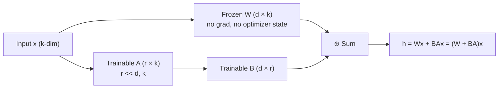

# Chapter 13: LoRA, QLoRA & PEFT

*Why teams with a single GPU can still fine-tune a 70-billion-parameter model — and why full fine-tuning was never really the plan.*

## Learning Objectives

By the end of this chapter, you will be able to:

- Explain precisely why full fine-tuning of a multi-billion-parameter model costs far more memory than just storing its weights, in terms of gradients and Adam optimizer state
- Describe the general idea of adapters and where LoRA, prefix-tuning, and prompt-tuning fit under the PEFT umbrella
- Derive the LoRA forward pass `(W + BA)x` from first principles and explain the "low intrinsic rank" hypothesis that justifies it
- Compute trainable-parameter counts and memory savings for a LoRA adapter versus full fine-tuning, for a concrete matrix size and for a full 7B model
- Explain how QLoRA combines 4-bit quantization of frozen weights with full-precision LoRA adapters to fine-tune large models on a single consumer GPU
- Apply a clear decision framework to choose between fine-tuning, prompt engineering, and RAG for a given problem
- Attach a LoRA adapter to a real Hugging Face model using the `peft` library, and explain what changes when you merge it back into the base weights
- Identify the most common mistakes teams make when adopting LoRA/QLoRA in production

---

## Prerequisites for This Chapter

This chapter builds directly on **[Chapter 12: Pretraining, SFT, RLHF & DPO](./12-pretraining-and-fine-tuning.md)**, which walked through the full training pipeline — pretraining on raw text, supervised fine-tuning (SFT) on instruction data, and alignment via RLHF or DPO — under the implicit assumption that every stage updates *every* parameter of the model (**full fine-tuning**). That chapter left an open problem: full fine-tuning of a 7B, 13B, or 70B model requires GPU memory far beyond what a single consumer or prosumer card provides. This chapter is the answer to that problem.

You'll also need:

- **Matrix multiplication and matrix dimensions** from **[Chapter 2: Machine Learning Fundamentals](./02-machine-learning-fundamentals.md)** — specifically, that multiplying a `(d × k)` matrix by a `k`-dimensional vector produces a `d`-dimensional vector, and that the number of trainable values in a matrix is just its row count times its column count. Everything in Section 5's worked example is arithmetic built on that one fact.
- A basic sense of what a **weight matrix** inside a transformer layer is (the `Q`, `K`, `V`, and output projection matrices in attention, and the up/down projections in the feed-forward block) — covered in **[Chapter 6](./06-transformer-architecture.md)**.

No new tooling is required to *read* this chapter. To run the code examples, you'll want Python 3.9+ with `torch`, `transformers`, `peft`, and (for the QLoRA example) `bitsandbytes` installed — installation is one `pip install` command, shown in Section 9.

---

## 1. The Problem: Full Fine-Tuning Doesn't Fit

### 1.1 It's not just the weights

If you asked a software engineer "how much memory does it take to load a 7-billion-parameter model?", the intuitive answer is: multiply parameter count by bytes-per-parameter. In 16-bit precision (2 bytes per parameter), that's `7e9 × 2 bytes ≈ 14 GB`. That fits comfortably on a single 24 GB consumer GPU (like an RTX 4090) with room to spare for inference.

But **fine-tuning is not inference.** Fine-tuning means running backpropagation and an optimizer step on every parameter, and both of those require *additional* memory that has nothing to do with the weights themselves:

| Component | What it is | Typical size (per parameter) |
|---|---|---|
| **Weights** | The parameters themselves | 2 bytes (fp16/bf16) |
| **Gradients** | `∂Loss/∂W` for every weight, computed during backprop, needed before the optimizer step | 2 bytes (fp16/bf16) |
| **Optimizer state (Adam)** | First moment `m` (momentum) and second moment `v` (variance) — Adam's whole mechanism depends on tracking these two running statistics *per parameter*, kept in fp32 for numerical stability | 4 + 4 = 8 bytes (fp32) |
| **Master weight copy** | Mixed-precision training keeps an fp32 "master" copy of the weights that the optimizer actually updates, then casts down to fp16/bf16 for the forward/backward pass | 4 bytes (fp32) |

Add it up: `2 + 2 + 8 + 4 = 16 bytes per parameter` — and that's *before* counting activation memory (the intermediate values saved during the forward pass so backprop can use them, which scales with batch size and sequence length, not just parameter count).

### 1.2 Why this specifically breaks down for large models

```
Full fine-tuning memory, 7B model, mixed precision, Adam optimizer:

  Weights (fp16):            7e9 × 2 bytes  =  14 GB
  Gradients (fp16):          7e9 × 2 bytes  =  14 GB
  Adam state m, v (fp32):    7e9 × 8 bytes  =  56 GB
  Master weights (fp32):     7e9 × 4 bytes  =  28 GB
  ─────────────────────────────────────────────────
  Subtotal (weights + optimizer only):       112 GB
  + activations, gradient buffers, CUDA overhead...
```

112 GB before a single activation tensor is allocated — for a model whose *weights alone* take 14 GB. That's an **8x memory multiplier**, and it's why full fine-tuning of a 7B model already requires multiple 80 GB datacenter GPUs (A100/H100) with model or optimizer state sharding (ZeRO, FSDP) across them. Scale to 70B and the numbers scale linearly: over 1 TB of memory just for weights and optimizer state.

This is not a hypothetical. The QLoRA paper (Dettmers et al., 2023) states it plainly: standard 16-bit full fine-tuning of a 65B-parameter model requires **more than 780 GB of GPU memory** — roughly ten A100-80GB GPUs, before you've trained on a single example. For an individual engineer, a startup, or even most enterprise teams without a dedicated ML infrastructure budget, that number is simply out of reach.

### 1.3 The real question this raises

If you can't afford to update every parameter, the natural question is: **do you need to?** When you fine-tune a pretrained model on a new task, you're not teaching it language from scratch — the base model already knows grammar, facts, and reasoning patterns from pretraining (Chapter 12). Fine-tuning is closer to *steering* an already-capable model toward a narrower behavior. That's a much smaller amount of new information than the model's full parameter count would suggest, and it's the empirical basis for the parameter-efficient techniques this chapter is about.

---

## 2. Adapters: Freeze the Giant, Train Something Small

The general idea predates LoRA by several years (adapter modules go back to Houlsby et al., 2019, in NLP transfer learning). The recipe is simple:

1. Take a pretrained model and **freeze every one of its original weights** — no gradients computed, no optimizer state allocated for them.
2. **Insert small, new trainable modules** at specific points in the network (e.g., a small bottleneck feed-forward block after each transformer layer's attention and MLP blocks).
3. During fine-tuning, only the new, small modules receive gradient updates. The forward pass still flows through the entire frozen network, but only a tiny fraction of the total parameters are trainable.

```
Frozen pretrained layer (100% of params, 0% trainable)
        │
        ▼
┌───────────────────┐
│  Transformer Block │ ← frozen weights, no gradient, no optimizer state
└───────────────────┘
        │
        ▼
┌───────────────────┐
│   Adapter Module    │ ← small, newly initialized, THIS is what trains
│  (tiny bottleneck)   │
└───────────────────┘
        │
        ▼
      output
```

The payoff: optimizer state and gradients are only needed for the adapter's parameters — often less than 1% of the total model size — so the 8x memory multiplier from Section 1 now applies to a tiny number, not to billions.

The original bottleneck-adapter design added new layers *in sequence* with the frozen network, which adds a small amount of inference latency (every forward pass now runs through the extra layers). LoRA, covered next, improves on this by avoiding new layers altogether.

---

## 3. PEFT: The Umbrella Term

**PEFT (Parameter-Efficient Fine-Tuning)** is the umbrella term for *any* fine-tuning method that updates a small subset of parameters (or a small number of newly added parameters) while keeping the vast majority of the pretrained model frozen. Adapters (Section 2) are one PEFT family. Others you'll encounter:

| Method | Core idea |
|---|---|
| **Adapters** (Houlsby et al.) | Insert small bottleneck feed-forward layers between frozen transformer blocks |
| **Prefix-tuning** | Prepend a small number of trainable "virtual token" vectors directly to the key/value activations of every attention layer, steering behavior without touching any original weight |
| **Prompt-tuning** | An even lighter version: prepend trainable *soft prompt* embeddings only at the input layer, leaving every internal layer untouched |
| **LoRA** | Freeze each weight matrix; learn a low-rank *update* to it, added at inference time (Section 4 — this is the workhorse of modern PEFT) |
| **QLoRA** | LoRA, but the frozen base model is stored in 4-bit precision (Section 7) |

**Hugging Face's `peft` library** (the one used in Section 9's code) implements nearly all of these behind a single, consistent API — you configure a method-specific config object (`LoraConfig`, `PrefixTuningConfig`, `PromptTuningConfig`, ...) and call one function, `get_peft_model()`, to wrap any base model with it. LoRA has become the dominant choice in practice because it adds zero inference-time architectural change once merged (Section 10) and consistently matches full fine-tuning quality at a fraction of the cost — which is why the rest of this chapter focuses on it.

---

## 4. LoRA: The Core Insight

### 4.1 The plain-language version

Instead of asking "how do I update this 4096×4096 weight matrix efficiently?", LoRA (Low-Rank Adaptation, Hu et al., 2021) asks a different question: **"does the *update* to this matrix even need to be full-rank?"**

Here's the intuition. Imagine the pretrained weight matrix `W` as a big, richly detailed painting the model learned over trillions of tokens of pretraining. Adapting that model to a new task — say, responding in a particular format, or specializing in medical text — doesn't require repainting the whole canvas. It requires a comparatively simple, low-complexity *correction layer* on top: nudge some directions, leave most of the painting untouched. LoRA's bet is that this correction can be captured by a **low-rank matrix** — one that can be written as the product of two much smaller matrices — without meaningfully hurting task performance.

### 4.2 The formal mechanism

Take any pretrained weight matrix `W` of shape `(d × k)` (for example, a `4096 × 4096` attention projection matrix). Full fine-tuning would learn a full update `ΔW`, also `(d × k)`, and use `W + ΔW` at inference time.

LoRA instead:

1. **Freezes `W` completely** — it never receives a gradient, never has optimizer state allocated.
2. **Introduces two new, much smaller trainable matrices:**
   - `A`, of shape `(r × k)`
   - `B`, of shape `(d × r)`
   - where `r` (the **rank**) is a small number — typically 4, 8, 16, or 64 — chosen to be far smaller than `d` and `k`.
3. **Approximates the update** as `ΔW ≈ BA`, the matrix product of `B` and `A`, which has shape `(d × r) × (r × k) = (d × k)` — the same shape as `W`, but constructed from far fewer numbers.
4. **The forward pass becomes:**

```
h = (W + BA)x  =  Wx + BAx
```

`W` is frozen and contributes `Wx` exactly as it always did. The new low-rank path computes `Ax` (projecting the input down into a small `r`-dimensional space), then `B(Ax)` (projecting back up to the original output dimension), and adds that correction on top. Only `A` and `B` receive gradients during training.

In practice, `B` is initialized to all zeros (so `BA = 0` and the model behaves exactly like the unmodified pretrained model at the very start of training — no disruptive random perturbation), while `A` is initialized with small random values. The learned output is also typically scaled by `α / r` for a hyperparameter `α` (LoRA "alpha") that controls how strongly the adapter's contribution is weighted relative to the frozen path — more on this in Section 6.

### 4.3 Diagram: the LoRA decomposition

```
                         INPUT  x   (k-dimensional vector)
                            │
              ┌─────────────┴──────────────┐
              │                             │
              ▼                             ▼
   ┌───────────────────────┐      ┌───────────────────┐
   │   W   (d × k)          │      │    A   (r × k)      │
   │   FROZEN — pretrained   │      │    TRAINABLE          │
   │   no gradient, no       │      │    "compress to r-dim"│
   │   optimizer state        │      └───────────────────┘
   └───────────────────────┘                │  Ax  (r-dimensional, r ≪ d, k)
              │  Wx  (d-dim)                 ▼
              │                    ┌───────────────────┐
              │                    │    B   (d × r)      │
              │                    │    TRAINABLE          │
              │                    │    "expand back to d" │
              │                    └───────────────────┘
              │                              │  B(Ax) = BAx   (d-dim)
              └───────────────┬──────────────┘
                              ▼
                         h = Wx + BAx
                       = (W + BA) x
```



### 4.4 Why this works: the low intrinsic rank hypothesis

This isn't just a convenient trick — it's backed by an empirical observation from the LoRA paper (and earlier work on "intrinsic dimensionality" of fine-tuning, Aghajanyan et al., 2020): **the weight updates needed to adapt a large pretrained model to a new downstream task tend to have a low "intrinsic rank."** In plain terms, even though `ΔW` is *mathematically allowed* to be any full-rank `d × k` matrix, the updates that actually emerge from fine-tuning real tasks concentrate almost all of their useful signal in a small number of directions — a handful of dozens of dimensions capture nearly all of the benefit, and the rest is close to redundant.

This matches a broader pattern in deep learning: heavily overparameterized networks tend to have far lower-dimensional "effective" learning surfaces than their raw parameter count suggests, because pretraining has already done the hard work of building a rich, general-purpose representation. Fine-tuning doesn't need to relearn that representation — it needs to *rotate and reweight it slightly* for the new task, and slight rotations in a rich space are, empirically, low-rank operations. The LoRA paper confirms this directly: on GPT-3, ranks as small as `r = 1` or `r = 2` already recover a meaningful fraction of full fine-tuning quality, and `r = 8` or `r = 16` are typically sufficient to match full fine-tuning performance on most tasks tested.

---

## 5. Worked Example: Trainable Parameters, Full Fine-Tuning vs. LoRA

### 5.1 A single 4096×4096 matrix

Consider one attention projection matrix of a typical mid-sized LLM (Llama-2-7B's hidden size is 4096, so its `Q`, `K`, `V`, and output projections are all `4096 × 4096`).

**Full fine-tuning:**

```
Trainable parameters = d × k = 4096 × 4096 = 16,777,216   (≈ 16.8 million)
```

**LoRA at rank r = 8:**

```
A: (r × k) = (8 × 4096)  =  32,768 parameters
B: (d × r) = (4096 × 8)  =  32,768 parameters
─────────────────────────────────────────────
Total trainable = 32,768 + 32,768 = 65,536 parameters   (≈ 65.5 thousand)
```

**Reduction factor:**

```
16,777,216 / 65,536 = 256
```

LoRA trains **256x fewer parameters** for this single matrix, while still producing a full-shape `(4096 × 4096)` update — it's just constrained to rank 8 instead of rank 4096. In percentage terms, LoRA is training `65,536 / 16,777,216 ≈ 0.39%` of what full fine-tuning would train, for this matrix.

Applying the 16-bytes-per-parameter memory multiplier from Section 1 (weights + gradients + Adam state, ignoring the master-weight copy for LoRA since the frozen `W` needs none of that):

```
Full fine-tuning optimizer+gradient memory for this matrix:
   16.8M params × 16 bytes  ≈  268 MB

LoRA optimizer+gradient memory for this matrix:
   65.5K params × 16 bytes  ≈  1.05 MB
```

### 5.2 Generalizing to a full 7B model

A model like Llama-2-7B has 32 transformer layers, each with a `Q`, `K`, `V`, and output projection (all `4096 × 4096`) plus larger MLP matrices. A common, cost-effective LoRA configuration targets just the attention projections — say `Q` and `V` — across all 32 layers:

```
Matrices targeted:     Q and V,  32 layers  =  64 matrices
Trainable params/matrix (r=8):     65,536
Total LoRA trainable params:       64 × 65,536  =  4,194,304  (≈ 4.2 million)

Total model parameters:            ~7,000,000,000  (7 billion)

Fraction trainable:                4.2M / 7,000M  ≈  0.06%
```

Even being generous and applying LoRA to *every* linear projection in *every* layer (attention projections and the larger MLP up/down projections) at rank 16, published LoRA configurations for 7B-class models typically land trainable parameters in the range of **0.1% to 3%** of total model size — comfortably matching the commonly cited "LoRA trains less than 1% of the parameters" figure from the original paper's GPT-3 experiments, while empirically matching or coming very close to full fine-tuning quality on most downstream tasks. This is the number that makes LoRA fine-tuning of a 7B model feasible on a single 24 GB consumer GPU: the base model's frozen weights need no gradient or optimizer memory at all, and the trainable adapter parameters are small enough that their optimizer state adds only a few tens of megabytes rather than tens of gigabytes.

---

## 6. LoRA Hyperparameters You'll Actually Tune

| Hyperparameter | What it controls | Typical values / guidance |
|---|---|---|
| **`r` (rank)** | The bottleneck dimension of `A` and `B`; higher `r` = more expressive updates, more trainable params | 4–64 is common; 8 or 16 is a strong default starting point for instruction fine-tuning |
| **`alpha` (α)** | A scaling factor applied to the LoRA output, typically as `α / r`; controls how strongly the adapter's correction influences the frozen forward pass | Often set to `2× r` (e.g., `r=8, α=16`) as a starting heuristic; higher α = stronger adapter influence |
| **`target_modules`** | Which weight matrices in the model get a LoRA adapter attached (e.g., only `q_proj`/`v_proj`, or all linear layers including MLP) | Attention-only is cheaper and often sufficient; adding MLP projections increases capacity and cost |
| **`dropout`** | Regularization applied to the LoRA path during training, to reduce overfitting on small fine-tuning datasets | 0.05–0.1 is common |

Increasing `r` doesn't just add parameters — it increases the rank ceiling of what the adapter can express. If your task genuinely needs a richer, more complex behavioral shift (e.g., a large change in output format, tone, and reasoning style simultaneously), a higher rank may close a quality gap that a low rank can't. If your task is narrow (e.g., "always answer in this JSON schema"), a low rank is usually already sufficient — and the LoRA paper's own ablations found diminishing, sometimes negative, returns from pushing rank far higher than needed, since more trainable capacity on a small fine-tuning dataset also means more capacity to overfit it.

---

## 7. QLoRA: Quantize the Frozen Giant, Train in Full Precision on Top

### 7.1 The remaining bottleneck

LoRA solves the gradient-and-optimizer-state memory problem (Section 1) beautifully — but it does nothing about the memory needed to simply **hold the frozen base model's weights in memory** to run the forward pass. A 70B-parameter model at 16-bit precision still needs `70e9 × 2 bytes = 140 GB` just to load, regardless of how few parameters you're training. That alone is out of reach for any single consumer or prosumer GPU (typically 16–48 GB of VRAM).

### 7.2 QLoRA's combination

QLoRA (Dettmers et al., 2023) closes this gap with one additional idea, layered on top of everything in Sections 4–6: **store the frozen base model's weights in 4-bit precision instead of 16-bit**, while keeping the small LoRA adapter matrices (`A` and `B`) and their gradient computations in a higher-precision format (typically bfloat16).

```
                 QLoRA Memory Model
┌──────────────────────────────────────────────────┐
│  Frozen base model weights  →  4-bit (NF4)          │  ~4x smaller than fp16
│  ── forward pass: dequantized to bf16 on the fly ──   │
│                                                        │
│  LoRA adapter A, B          →  bf16 (full precision)  │  tiny, needs gradients
│  Gradients for A, B         →  bf16                   │  tiny
│  Adam optimizer state       →  fp32, but only for A,B  │  tiny
└──────────────────────────────────────────────────┘
```

This is why QLoRA slashes memory so effectively: the *overwhelming majority* of a large model's memory footprint is the frozen weights sitting idle, waiting to be multiplied against activations. Since those weights never receive a gradient in LoRA, there's no numerical-stability reason they need to stay at 16-bit precision at rest — they only need to be reconstructed at reasonable precision transiently, during the forward/backward matrix multiplication itself. The tiny adapter matrices, which *do* need gradients and *do* accumulate optimizer state, stay at full working precision, so training stability is preserved exactly where it matters.

QLoRA's specific quantization scheme (**NF4**, "4-bit NormalFloat") and its supporting tricks — **double quantization** (quantizing the quantization constants themselves, saving a bit more memory) and **paged optimizers** (spilling optimizer state to CPU memory when GPU memory spikes, using NVIDIA's unified memory feature) — are quantization implementation details covered in full in **[Chapter 15: Quantization & Speculative Decoding](./15-quantization-and-speculative-decoding.md)**. For this chapter, the important takeaway is the *combination pattern*: quantize what's frozen and doesn't need gradients; keep full precision only where gradients flow.

### 7.3 The headline result

The QLoRA paper's flagship claim: fine-tuning a **65B-parameter model** — which required more than **780 GB** of GPU memory under standard 16-bit full fine-tuning (Section 1.2) — becomes possible on a **single 48 GB GPU**, with no measurable loss in downstream task quality compared to full 16-bit fine-tuning. That's roughly a **16x memory reduction**, moving a task from "needs a multi-GPU datacenter cluster" to "fits on one prosumer-adjacent card." At smaller scale, QLoRA is routinely used to fine-tune 7B and 13B models on a single consumer GPU with 16–24 GB of VRAM — the exact hardware budget most individual engineers and small teams actually have.

---

## 8. When to Fine-Tune vs. Prompt Engineer vs. RAG

LoRA and QLoRA make fine-tuning dramatically cheaper — but "cheaper" doesn't mean "always the right tool." Before reaching for either, ask what kind of problem you actually have.

| Approach | Best for | Not suited for | Iteration speed | Cost |
|---|---|---|---|---|
| **Prompt engineering** ([Ch. 10](./10-prompt-engineering.md)) | One-off or evolving task specification; instructions that change often; tasks where a strong base/instruct model already performs well with the right framing | Teaching a *stable*, repeatable new behavior needed across thousands/millions of calls where prompt length/cost adds up; deeply specialized domain style the base model resists via prompting alone | Fastest — edit text, redeploy immediately | Lowest — no training, only inference/token cost |
| **RAG** ([Ch. 16](./16-rag-and-vector-databases.md)) | Injecting **fresh or proprietary factual knowledge** the model wasn't trained on (this week's documents, your internal wiki, live data) without changing how the model *behaves* | Changing tone, style, output format, or reasoning approach — RAG adds facts to the context, it doesn't change the model's underlying behavior | Fast — update the retrieval corpus, no retraining | Moderate — retrieval infra + extra context tokens per call |
| **Fine-tuning (LoRA/QLoRA)** | Teaching a **stable new behavior, style, or output format at scale** — e.g., always responding in a strict internal JSON schema, adopting a specific brand voice, specializing in a narrow domain's reasoning patterns, reducing reliance on long few-shot prompts to cut per-call token cost | Injecting facts that change weekly (you'd have to retrain constantly); a task that a well-crafted prompt already solves reliably | Slowest — requires a training run, evaluation, and redeployment per change | Highest of the three, but LoRA/QLoRA bring it down enormously vs. full fine-tuning |

**A simple decision heuristic:**

1. **Does the model already do this well with a good prompt?** If yes, stop — you don't need fine-tuning.
2. **Is the problem "the model doesn't know this fact/document"?** That's a knowledge gap — reach for RAG, not fine-tuning.
3. **Is the problem "the model doesn't behave/format/reason the way I need it to, consistently, across many inputs, and no amount of prompting fixes it reliably"?** That's a genuine fine-tuning problem — and LoRA/QLoRA are almost always the right entry point rather than full fine-tuning.
4. **These are not mutually exclusive.** A very common production pattern is a LoRA-fine-tuned model (for consistent behavior/format) that is *also* fed retrieved context via RAG (for fresh facts) and *still* wrapped in a well-designed prompt (for per-call task framing). Fine-tuning changes *how* the model behaves; RAG changes *what* it knows; prompting changes *what you're asking for right now*.

---

## 9. Hands-On: Attaching a LoRA Adapter with Hugging Face `peft`

### 9.1 Setup

```bash
pip install torch transformers peft accelerate datasets
```

### 9.2 Attaching a LoRA adapter to a causal language model

```python
from transformers import AutoModelForCausalLM, AutoTokenizer
from peft import LoraConfig, get_peft_model, TaskType

model_name = "meta-llama/Llama-2-7b-hf"  # any causal LM works the same way

tokenizer = AutoTokenizer.from_pretrained(model_name)
base_model = AutoModelForCausalLM.from_pretrained(
    model_name,
    torch_dtype="bfloat16",
    device_map="auto",
)

# Configure the LoRA adapter: rank, scaling, and which matrices to attach to.
lora_config = LoraConfig(
    r=8,                              # rank -- see Section 6
    lora_alpha=16,                    # scaling factor, alpha/r applied to adapter output
    target_modules=["q_proj", "v_proj"],   # attach adapters only to Q and V projections
    lora_dropout=0.05,
    bias="none",
    task_type=TaskType.CAUSAL_LM,
)

# Wrap the frozen base model with trainable LoRA adapters.
model = get_peft_model(base_model, lora_config)

# Confirms exactly the kind of arithmetic from Section 5: a tiny fraction of
# total parameters are trainable; everything else is frozen.
model.print_trainable_parameters()
# Example output:
# trainable params: 4,194,304 || all params: 6,742,609,920 || trainable%: 0.0622
```

That `print_trainable_parameters()` output is the real-world confirmation of the Section 5.2 math: roughly 4.2M trainable parameters out of 6.7B total, matching the "Q and V across 32 layers at rank 8" configuration almost exactly.

### 9.3 Training loop (conceptual)

Once wrapped, the model behaves like any other Hugging Face model for training purposes — `peft` handles freezing the base weights and routing gradients only through `A` and `B` internally. A minimal training loop using the `Trainer` API:

```python
from transformers import TrainingArguments, Trainer
from datasets import load_dataset

dataset = load_dataset("your_org/instruction_dataset", split="train")

def tokenize(example):
    return tokenizer(example["text"], truncation=True, max_length=1024)

tokenized_dataset = dataset.map(tokenize, batched=True)

training_args = TrainingArguments(
    output_dir="./lora-adapter-checkpoint",
    per_device_train_batch_size=4,
    gradient_accumulation_steps=4,
    num_train_epochs=3,
    learning_rate=2e-4,          # LoRA typically tolerates a higher LR than full fine-tuning
    bf16=True,
    logging_steps=10,
    save_strategy="epoch",
)

trainer = Trainer(
    model=model,
    args=training_args,
    train_dataset=tokenized_dataset,
)

trainer.train()

# Only the small adapter weights are saved here -- typically a few MB to
# a few tens of MB, not gigabytes, because peft only persists A and B.
model.save_pretrained("./lora-adapter-final")
```

### 9.4 The QLoRA version: 4-bit base model + LoRA on top

```python
import torch
from transformers import AutoModelForCausalLM, BitsAndBytesConfig
from peft import LoraConfig, get_peft_model, prepare_model_for_kbit_training

# Quantize the frozen base model to 4-bit NF4 at load time (Section 7).
bnb_config = BitsAndBytesConfig(
    load_in_4bit=True,
    bnb_4bit_quant_type="nf4",
    bnb_4bit_compute_dtype=torch.bfloat16,   # dequantized dtype used during matmuls
    bnb_4bit_use_double_quant=True,
)

base_model = AutoModelForCausalLM.from_pretrained(
    "meta-llama/Llama-2-7b-hf",
    quantization_config=bnb_config,
    device_map="auto",
)

# Required prep step: casts norm layers, enables gradient checkpointing,
# and ensures the model is ready to accept LoRA adapters on top of 4-bit weights.
base_model = prepare_model_for_kbit_training(base_model)

lora_config = LoraConfig(
    r=16, lora_alpha=32, target_modules=["q_proj", "v_proj"],
    lora_dropout=0.05, bias="none", task_type="CAUSAL_LM",
)

model = get_peft_model(base_model, lora_config)
model.print_trainable_parameters()
# The base model now occupies roughly a quarter of its original fp16 footprint,
# while the trainable adapter parameters remain in full bf16 precision.
```

The rest of the training loop from Section 9.3 is unchanged — this is the entire practical difference between "LoRA" and "QLoRA" in code: one extra `BitsAndBytesConfig` at model-load time.

---

## 10. Merging Adapters vs. Keeping Them Separate

Once training finishes, you have two deployment options, and the right choice depends on how you plan to serve the model.

### 10.1 Merge for a single-purpose deployment

If you're deploying one fine-tuned model for one purpose, **merge the adapter into the base weights**:

```python
from peft import PeftModel, AutoPeftModelForCausalLM

# Load the base model + adapter, then fold BA into W permanently.
merged_model = AutoPeftModelForCausalLM.from_pretrained("./lora-adapter-final")
merged_model = merged_model.merge_and_unload()

merged_model.save_pretrained("./merged-model-for-deployment")
```

Internally, `merge_and_unload()` performs exactly the arithmetic from Section 4.2 — `W' = W + BA` — computed once, offline, and written back into the original weight matrix's shape. After merging:

- Inference has **zero extra latency or parameters** compared to the original, unmodified base model — there is no separate adapter forward pass at all anymore, just a single ordinary matrix multiply against `W'`.
- The model can be loaded, quantized, and served with any standard inference stack (vLLM, TGI, llama.cpp) exactly like an unmodified checkpoint, because architecturally it *is* an unmodified checkpoint with different numbers in `W`.
- The trade-off: you lose the ability to swap behaviors at runtime. `W'` is now a fixed, single-purpose model.

### 10.2 Keep adapters separate for multi-task serving

If you're serving **many different fine-tuned behaviors from the same base model** — a customer-support persona, a code-formatting persona, a summarization persona — keeping adapters unmerged is usually the better architecture:

```
                One frozen 7B base model in GPU memory
                              │
        ┌─────────────────────┼─────────────────────┐
        ▼                     ▼                     ▼
  LoRA adapter A         LoRA adapter B         LoRA adapter C
  (support tone,          (code formatting,      (summarization,
   few MB)                 few MB)                few MB)
```

Because each adapter is only a few megabytes (Section 5), you can hold dozens of task-specific adapters in memory *simultaneously*, alongside a single shared copy of the expensive frozen base model, and switch which adapter is active per-request — this is exactly the pattern vLLM's multi-LoRA serving support and Hugging Face's `peft` adapter-swapping APIs are built around. This gives you the memory footprint of one base model plus a handful of megabytes per additional task, instead of one full model copy per task.

The rule of thumb: **merge when you know you're deploying exactly one behavior forever; keep adapters separate when you're serving multiple behaviors from shared infrastructure, or when you expect to keep iterating on the adapter.**

---

## Real-World Scenario

A mid-sized SaaS company builds an internal tool that converts natural-language support tickets into a strict, internal JSON schema for their ticketing system (`{"category": ..., "priority": ..., "summary": ..., "tags": [...]}`). Initially, this is a prompt-engineering problem: a well-crafted system prompt with a few-shot example gets a general-purpose hosted LLM to emit correct JSON about 92% of the time.

At scale — 40,000 tickets a day — three problems emerge. First, the few-shot examples in every prompt add roughly 400 extra input tokens per call, which becomes a meaningful line item in the monthly API bill at that volume. Second, the 8% failure rate (malformed JSON, missing fields, occasional schema drift) requires a brittle regex-based validation-and-retry layer that itself adds latency and complexity. Third, the team wants to move to a smaller, self-hosted open model for cost reasons, but the smaller model follows the few-shot format far less reliably than the large hosted one.

The team recognizes this is squarely a fine-tuning problem, not a bigger-prompt problem: they need a **stable, repeatable output behavior** applied to **tens of thousands of similar inputs**, exactly the profile from Section 8's decision table. They collect 3,000 historical tickets with verified-correct JSON outputs and fine-tune a 7B open model using **QLoRA** on a single 24 GB GPU: 4-bit quantized base model, rank-16 LoRA adapters on the attention and MLP projections, three epochs, roughly two hours of training. They evaluate against a held-out set of 500 tickets: JSON validity climbs to 99.6%, and because the adapter has internalized the schema, the few-shot examples are no longer needed in the prompt at all — cutting per-call input tokens by roughly 35%. They merge the adapter into the base weights (Section 10.1) for the single deployed model, and serve it with vLLM. Total fine-tuning compute cost: under $10 of GPU time on a rented instance. The team explicitly notes that RAG was never the right tool here — there was no factual knowledge gap, only a formatting/behavior gap — which is why they didn't reach for it.

---

## Best Practices

- **Start with LoRA (or QLoRA if memory-constrained) before ever considering full fine-tuning.** Full fine-tuning is rarely justified for adapting an existing capable base model to a narrower task; reserve it for genuinely building or substantially re-training a foundation model.
- **Target attention projections first, add MLP projections only if quality demands it.** `q_proj`/`v_proj`-only LoRA is cheaper and often sufficient; expand `target_modules` incrementally and re-evaluate rather than defaulting to "every linear layer" from the start.
- **Set `alpha` proportional to `r` (commonly `alpha = 2r`) as a starting default**, then tune based on validation performance rather than guessing rank and alpha independently.
- **Always hold out a validation set and track task-specific metrics**, not just training loss — LoRA's small trainable parameter count makes overfitting to a small fine-tuning set a real risk, especially at higher ranks.
- **Use QLoRA specifically when base-model memory, not gradient/optimizer memory, is your bottleneck** — if the base model already fits comfortably with room for LoRA's small overhead, plain LoRA in bf16 avoids the (modest) quality risk and compute overhead of on-the-fly dequantization.
- **Decide merge-vs-keep-separate (Section 10) before you architect your serving layer**, not after — it changes whether you need multi-adapter routing infrastructure.
- **Version and store adapters like code artifacts.** Because they're a few megabytes, checkpoint every meaningful training run, tag them with the base model version and hyperparameters used, and keep a record of which adapter is live in production.
- **Re-run the Section 8 decision framework whenever requirements change.** A fine-tuned formatting adapter and a RAG pipeline for fresh facts are not competitors — most production systems eventually need both, plus a well-designed prompt on top.

---

## Common Mistakes

- **Reaching for fine-tuning to fix a knowledge gap.** If the model gives outdated or wrong facts, fine-tuning a LoRA adapter on new documents is the wrong tool — that knowledge will be stale again the moment reality changes, and you'd have to retrain repeatedly. That's what RAG (Chapter 16) is for.
- **Reaching for fine-tuning before trying a better prompt.** A surprising fraction of "the model won't do X" problems are solved by a clearer, better-structured prompt (Chapter 10) at zero training cost. Fine-tune only after prompting has genuinely been exhausted.
- **Setting rank far higher than the task needs "to be safe."** Higher rank means more trainable parameters, more risk of overfitting a small fine-tuning dataset, and more memory/compute — with the LoRA paper's own ablations showing diminishing or negative returns well before rank reaches the hundreds.
- **Forgetting to attach LoRA to enough of the network for the task's complexity.** Attention-only LoRA is a reasonable default, but tasks requiring larger behavioral shifts sometimes need MLP projections included too — evaluate rather than assume the default configuration is always sufficient.
- **Quantizing the base model with QLoRA and expecting activation-level numerical behavior identical to full precision.** 4-bit quantization introduces small approximation error; the QLoRA paper shows this is usually negligible for final task quality, but it's not literally zero, and extremely precision-sensitive tasks should be validated empirically rather than assumed safe.
- **Deploying an unmerged adapter through an inference stack that doesn't support LoRA natively**, causing either an error or a silent, slow fallback path that recomputes the low-rank forward pass inefficiently at every request. Confirm your serving framework's LoRA support (vLLM's multi-LoRA support, TGI, etc.) before choosing to keep adapters unmerged.
- **Treating "LoRA" and "QLoRA" as interchangeable when writing memory-budget plans.** LoRA still requires the full-precision base model to fit in memory; QLoRA is the one that solves that specific constraint. Confusing the two leads to an out-of-memory failure at model-load time, not training time.

---

## Summary

- **Full fine-tuning is memory-expensive far beyond the weights themselves**: gradients and Adam optimizer state (momentum + variance, kept in fp32) plus a master fp32 weight copy add roughly 16 bytes of memory per parameter on top of the weights, an 8x multiplier that puts full fine-tuning of multi-billion-parameter models out of reach for most individual GPUs.
- **Adapters** freeze the pretrained model and train only small, newly inserted modules; **PEFT** is the umbrella term covering adapters, prefix-tuning, prompt-tuning, and LoRA.
- **LoRA** freezes each weight matrix `W` and learns a low-rank update `BA` (with `B` of shape `d × r` and `A` of shape `r × k`, `r ≪ d, k`), so the forward pass becomes `(W + BA)x = Wx + BAx`. This works because fine-tuning updates for a pretrained model empirically have low "intrinsic rank" — a small number of directions capture nearly all the useful adaptation.
- **Worked example:** a `4096 × 4096` matrix has 16.8M full fine-tuning parameters versus 65,536 LoRA parameters at `r=8` — a 256x reduction — and a realistic 7B-model LoRA configuration trains roughly 0.06%–3% of total parameters depending on target modules and rank.
- **QLoRA** stores the frozen base model in 4-bit precision while keeping LoRA adapter matrices and their gradients in higher precision, cutting the base model's memory footprint by roughly 4x on top of LoRA's own savings — enabling fine-tuning of models as large as 65B parameters on a single 48 GB GPU, versus the 780+ GB that standard full fine-tuning requires.
- **Decision framework**: fine-tune for stable new behavior/style/format at scale; prompt engineer for one-off, fast-iterating task specification; use RAG to inject fresh or proprietary facts without changing model behavior — and expect production systems to combine all three.
- **After training**, merge the adapter into the base weights (`W' = W + BA`) for zero-overhead single-purpose deployment, or keep adapters separate to serve many task-specific behaviors from one shared frozen base model.

---

## Knowledge Check

1. A colleague says "Adam optimizer state doesn't matter much for memory — it's the model weights that dominate." Using the numbers from Section 1, explain precisely why this is wrong for full fine-tuning, and give the approximate multiplier.
2. Write out the LoRA forward-pass equation `h = (W + BA)x` and identify, for each of `W`, `B`, and `A`, whether it is frozen or trainable, and what shape it has in terms of `d`, `k`, and `r`.
3. For a weight matrix of shape `2048 × 2048`, compute the number of trainable parameters under full fine-tuning versus LoRA at `r = 4`. What is the reduction factor?
4. Explain, in your own words, the "low intrinsic rank" hypothesis that justifies LoRA. Why does it matter that the base model was already pretrained, rather than being randomly initialized?
5. A teammate wants to fine-tune a 70B model on a single 24 GB consumer GPU using plain LoRA (not QLoRA), keeping the base model at bf16. Will this fit? Walk through the memory math and explain what QLoRA specifically changes to make it feasible.
6. Your team has a chatbot that needs to (a) always respond in your company's specific tone and (b) always cite the latest internal product documentation, which changes weekly. Which techniques from this chapter and from Chapter 16 would you combine, and why would using only one of them fail?

---

## Hands-On Exercise

Using the code patterns from Section 9 as your starting point:

1. Pick a small open causal LM you can run locally or on a free-tier GPU (e.g., `gpt2`, `TinyLlama/TinyLlama-1.1B-Chat-v1.0`, or `Qwen/Qwen2.5-0.5B`). Load it and print its total parameter count.
2. Attach a `LoraConfig` with `r=8`, `lora_alpha=16`, targeting the model's attention projection layers (inspect `model.named_modules()` to find the correct names for your chosen model — they won't all be called `q_proj`/`v_proj`).
3. Call `model.print_trainable_parameters()` and manually verify the trainable count against the Section 5 formula: `2 × d × r` per targeted matrix (assuming square `d × d` matrices), summed across every matrix you targeted.
4. Change `r` to 32 and re-run. By what factor did the trainable parameter count grow? Does it match your expectation from the formula?
5. **Bonus:** Fine-tune your LoRA-wrapped model for a handful of steps on a tiny synthetic dataset (even 20-30 short example texts) of a distinctive style (e.g., "always answer in pirate-speak" or "always respond in valid JSON with keys `answer` and `confidence`"). Generate text before and after training with the same prompt, and confirm the adapter visibly changed the output behavior. Then call `merge_and_unload()` and confirm the merged model produces the same output as the unmerged adapter version, verifying that merging is numerically equivalent to keeping the adapter separate.

---

## Further Reading

- Hu, Edward J. et al., ["LoRA: Low-Rank Adaptation of Large Language Models"](https://arxiv.org/abs/2106.09685) (2021) — the original LoRA paper; Section 4 of this chapter is a direct expansion of its core idea
- Dettmers, Tim et al., ["QLoRA: Efficient Finetuning of Quantized LLMs"](https://arxiv.org/abs/2305.14314) (2023) — the QLoRA paper, including the 780GB/48GB headline result cited in Section 7.3
- Aghajanyan, Armen et al., ["Intrinsic Dimensionality Explains the Effectiveness of Language Model Fine-Tuning"](https://arxiv.org/abs/2012.13255) (2020) — the empirical basis for the "low intrinsic rank" hypothesis referenced in Section 4.4
- Houlsby, Neil et al., ["Parameter-Efficient Transfer Learning for NLP"](https://arxiv.org/abs/1902.00751) (2019) — the original bottleneck adapter paper referenced in Section 2
- [Hugging Face PEFT Documentation](https://huggingface.co/docs/peft/index) — official docs for the `peft` library used throughout Section 9, including `LoraConfig`, `get_peft_model`, and multi-adapter serving
- [Hugging Face `bitsandbytes` Documentation](https://huggingface.co/docs/bitsandbytes/index) — the quantization backend behind `BitsAndBytesConfig` and QLoRA's 4-bit NF4 loading
- Raschka, Sebastian, ["Practical Tips for Finetuning LLMs Using LoRA"](https://magazine.sebastianraschka.com/p/practical-tips-for-finetuning-llms) — a widely cited, practitioner-oriented guide to rank/alpha/target-module tuning decisions
- [Hugging Face PEFT Multi-LoRA / vLLM LoRA Serving Documentation](https://docs.vllm.ai/en/latest/features/lora.html) — the multi-adapter serving pattern referenced in Section 10.2

---

<div style="display:flex;justify-content:space-between;align-items:center;">
  <a href="./12-pretraining-and-fine-tuning.md">← Previous: Pretraining, SFT, RLHF & DPO</a>
  <a href="./00-index.md">🏠 Index</a>
  <a href="./14-inference-optimization.md">Next: Inference Optimization: vLLM, FlashAttention & PagedAttention →</a>
</div>
