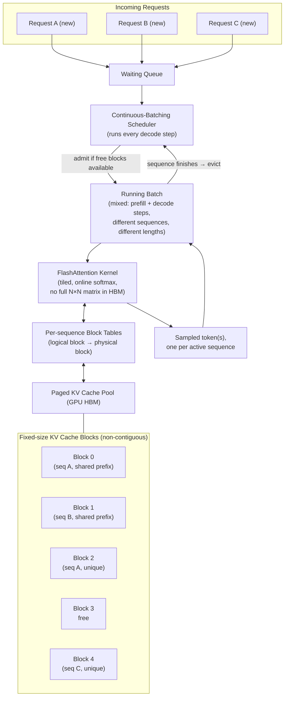

# Chapter 14: Inference Optimization: vLLM, FlashAttention & PagedAttention

*You already know how to `pip install vllm` and get a fast server. This chapter is about why the defaults you've been trusting actually work — so that when p99 latency spikes at 3am, you can reason about the system instead of guessing at flags.*

## Learning Objectives

By the end of this chapter, you will be able to:

- Explain why autoregressive LLM inference is fundamentally memory-bandwidth-bound rather than compute-bound, and derive a rough tokens/second ceiling from a model's weight size and a GPU's HBM bandwidth
- Explain why naive KV cache allocation wastes GPU memory, and how that waste directly limits achievable batch size and throughput
- Contrast static batching and continuous batching, and explain why continuous batching is the single biggest throughput lever in modern serving engines
- Explain prefix caching and calculate the latency/cost savings it produces for shared-prefix workloads
- Distinguish tensor parallelism from pipeline parallelism, and choose the right one (or combination) for a given hardware topology
- Explain FlashAttention's IO-aware tiling and online softmax, and why it reduces memory traffic without reducing FLOPs
- Explain PagedAttention's virtual-memory analogy and compute, from first principles, how many more concurrent requests it lets you serve on a fixed GPU budget
- Read a vLLM-style serving architecture diagram and map each component (scheduler, KV cache manager, attention kernel) to the concept that motivates it

---

## Prerequisites for This Chapter

This chapter assumes you've completed:

- **Chapter 7 (LLM Architecture: Decoder-Only Models, KV Cache & RoPE)** — you should already know *what* the KV cache is: cached key/value projections from previous tokens that let autoregressive decoding avoid recomputing attention over the entire prefix at every step, and that it grows linearly with sequence length and batch size. This chapter assumes that mental model and asks: *given that the KV cache is unavoidable and grows, how do we manage it efficiently at scale?*
- **Chapter 13 (LoRA, QLoRA & PEFT)** — you now know how to produce a fine-tuned model cheaply. This chapter is the natural next step: once you *have* a model — base or fine-tuned — you still have to serve it to real users, at acceptable latency, at acceptable cost, under real concurrent load. Training optimizes the one-time cost of producing weights; inference optimization optimizes the recurring, compounding cost of using them, millions of times, forever.

No new setup is required, but if you want to follow along with real numbers, having `vllm` installed (`pip install vllm`) and access to any CUDA GPU (even a single consumer card) will let you inspect logs that reference the exact concepts in this chapter — GPU KV cache blocks, prefix cache hit rate, and scheduler batch size.

---

## 1. Why Naive LLM Inference Is Slow and Expensive

### 1.1 The intuition: you're not compute-limited, you're grocery-run-limited

Imagine a chef who has to walk to the pantry, fetch one ingredient, walk back, use it, then walk to the pantry again for the next ingredient — one trip per ingredient, never carrying more than one item at a time. The chef is fast at chopping and cooking (compute), but the kitchen's total throughput is governed entirely by how many trips to the pantry (memory) they make and how far away the pantry is (bandwidth), not by how fast they can chop.

This is almost exactly the situation a GPU is in during autoregressive text generation. Every time the model generates a single new token, it must:

1. Read every weight matrix in the model from GPU high-bandwidth memory (HBM) into the compute cores, layer by layer
2. Read the KV cache (all previously computed keys/values for this sequence) from HBM
3. Do a comparatively tiny amount of arithmetic (a handful of matrix-vector products, since we're only producing *one* new token's worth of activations)
4. Write the new KV cache entries back to HBM

Step 3 — the actual computation — is cheap. Steps 1, 2, and 4 — moving data between HBM and the compute cores — dominate wall-clock time. This is the definition of being **memory-bandwidth bound**: the bottleneck is bytes-per-second moved, not floating-point-operations-per-second available.

### 1.2 Putting numbers on it

Take a 13B-parameter model in FP16 (2 bytes/parameter): weight size ≈ 13B × 2 bytes ≈ **26 GB**. Serving on an NVIDIA A100 (80 GB, ~2 TB/s HBM bandwidth, ~312 TFLOPS FP16 dense compute):

- To generate **one token for one sequence** (batch size 1), the GPU must stream essentially the entire 26 GB of weights through its compute units at least once (plus a much smaller KV cache read).
- Time to read 26 GB at 2 TB/s ≈ 26 / 2000 seconds ≈ **13 ms**, just for the weight read.
- That puts a hard ceiling of roughly **1000 ms / 13 ms ≈ 77 tokens/second** for batch size 1 — regardless of how fast the GPU's compute cores are, because they spend most of their time idle, waiting for weights to arrive from HBM.
- Meanwhile the actual compute for that single token is tiny: a decode step's FLOPs are roughly `2 × params` per token ≈ 26 GFLOPs, which a 312 TFLOPS GPU could finish in **under 0.1 ms**. The GPU's math units are idle over 99% of the time during single-request decoding.

This is the core insight that motivates almost everything else in this chapter: **the fix for a memory-bandwidth-bound workload is to do more useful work per byte read** — i.e., process many sequences' tokens in the same pass over the weights, so the fixed cost of reading 26 GB is amortized across dozens or hundreds of tokens instead of one. That's exactly what batching buys you, which is why Section 2 (continuous batching) is the highest-leverage optimization in this whole chapter.

### 1.3 The KV cache adds a second, compounding problem

The KV cache is what makes autoregressive decoding tractable at all — instead of recomputing attention over the full prefix at every step (which would be quadratic in the number of steps), you cache the K/V projections of every past token and just append to them. But the cache itself is a growing memory liability:

- It grows **linearly with sequence length** (every generated token adds one more slot to the cache, for every layer)
- It grows **linearly with batch size** (every concurrent sequence needs its own cache)
- Naive implementations don't know in advance how long a sequence will run, so they conservatively **pre-allocate a large contiguous block** of GPU memory per request — often sized to the model's maximum context length — "just in case" the sequence grows that long.

That last point is the crux of the memory-waste problem this chapter spends real time solving (Section 6): most requests never come close to using their reserved space, but naive allocators can't safely give that unused space to another request, because it's not contiguous with anything else, and freeing/reallocating contiguous blocks on the fly is exactly the fragmentation problem that operating-systems memory management solved decades ago — a solution vLLM borrows almost verbatim.

### 1.4 Serial or small-batch serving wastes the GPU's actual strength

A GPU's entire value proposition is massive parallelism: thousands of cores doing the same operation across many independent pieces of data simultaneously. If you serve requests one at a time, or in small fixed batches with idle padding, you're using a machine built for parallelism in a nearly serial way — throwing away the one advantage a GPU has over a CPU for this workload. Sections 2–6 are all, at bottom, strategies to keep the GPU doing large, well-utilized, parallel batches of work as continuously as possible.

---

## 2. Continuous Batching

### 2.1 Static batching and why it wastes GPU cycles

The naive way to batch LLM requests looks like traditional ML serving: collect a fixed-size batch of N requests, run them all forward together until every one of them finishes (hits an end-of-sequence token or a max-length limit), then return all N results and start a fresh batch. This is **static batching**.

The problem is that generation lengths are wildly uneven. One request might need 20 tokens, another 800. In a static batch, the *entire batch* is held hostage by whichever sequence finishes last — every already-finished sequence still occupies a GPU batch slot doing nothing but processing padding tokens, and no new request can be admitted until the whole batch drains.

```
STATIC BATCHING (batch size = 4, waits for the longest sequence)

step:        0    5   10   15   20   25   30   35   40
Request A:   |====done
Request B:   |=========done
Request C:   |==============done
Request D:   |========================================done (longest)
GPU slot 1:  [ A tokens ][ ---- idle/padding ---------------- ]
GPU slot 2:  [   B tokens    ][ ---- idle/padding ----------- ]
GPU slot 3:  [     C tokens      ][ --- idle/padding -------- ]
GPU slot 4:  [              D tokens                          ]
                                                                ^ new batch (E,F,G,H) can only start here
```

Slots 1–3 are wasting GPU cycles from the moment their sequence finishes until D finally finishes — and requests E, F, G, H sit in a queue the entire time, even though there was free capacity as soon as A finished at step 5.

### 2.2 Continuous batching: refill slots at every step

**Continuous batching** (the technique vLLM, TGI, and SGLang all implement) removes the "wait for the whole batch" rule entirely. At *every single decoding step*, the scheduler:

1. Checks which sequences in the running batch just finished (hit EOS or their length limit) and evicts them, freeing their KV cache memory immediately
2. Checks the incoming request queue and admits as many new requests as there is now free KV cache capacity for
3. Runs one forward pass over the resulting mixed batch — some sequences might be on their 3rd generated token, others on their 400th, others just starting their prefill

```
CONTINUOUS BATCHING (slots refilled the instant they free up)

step:        0    5   10   15   20   25   30   35   40
GPU slot 1:  [ A ][ E======================done ][ I==...
GPU slot 2:  [ B===][ F===============done ][ J=========...
GPU slot 3:  [ C========][ G=======done ][ K================...
GPU slot 4:  [ D========================================done][ L...
```

The GPU is never idle waiting for stragglers, and a new request's wait time is bounded by "until the next scheduler step," not "until the entire current batch drains." This is why continuous batching is credited as the single largest throughput improvement in the vLLM paper and in production reports from serving teams — often cited as multiple-times higher throughput than static batching at the same latency target, because it converts wasted idle slots directly into useful token generation.

### 2.3 Why this needs a per-request, not per-batch, mental model

Continuous batching only works if the underlying attention/KV-cache implementation can handle a batch where every sequence is at a *different* position and a *different* length simultaneously — which is precisely what PagedAttention (Section 6) is designed to support efficiently. Static-batching-era serving code assumed uniform, synchronized batches; continuous batching requires the memory manager to treat every sequence's KV cache as an independent, dynamically growing and shrinking resource. This is why vLLM's scheduler and its memory manager are co-designed — one enables the other.

---

## 3. Prefix Caching

### 3.1 The intuition: don't re-read the same paragraph a thousand times

Many production workloads repeat the same long prefix across thousands of requests: a fixed system prompt, a set of few-shot examples, a long document that many users ask different questions about, or a shared "house style" instruction block. Without prefix caching, every one of those requests re-runs the *full* prefill computation over that shared prefix from scratch — recomputing identical K/V projections that were already computed (and thrown away) for the previous request.

**Prefix caching** keeps the KV cache entries for a shared prefix around (indexed by a hash of the token sequence) so that any new request beginning with that exact same prefix can skip straight to computing only its unique suffix — no whole-prefix recomputation.

```
Request 1: [====== 1,500-token system prompt ======][ user question A ]
                        ↓ compute once, cache it
Request 2: [====== same 1,500-token system prompt ======][ user question B ]
                        ↓ reuse cached KV blocks, only compute question B
Request 3: [====== same 1,500-token system prompt ======][ user question C ]
                        ↓ reuse cached KV blocks, only compute question C
```

### 3.2 The savings, with numbers

Suppose a support chatbot uses a 1,500-token system prompt (product docs, tone instructions, tool schemas) in front of every user query, and serves 10,000 requests/day. Assume prefill throughput of roughly 5,000 tokens/second on the serving GPU for this model (a reasonable order-of-magnitude figure for a mid-size model on a modern accelerator).

- **Without prefix caching**: every request pays 1,500 / 5,000 s ≈ **300 ms** of prefill time just to re-process the identical system prompt, before it even starts on the actual user question. Across 10,000 requests/day, that's `10,000 × 0.3s ≈ 3,000 GPU-seconds/day` (≈ 50 minutes of pure GPU time) spent recomputing something that never changes.
- **With prefix caching**: the system prompt's KV cache is computed once and reused. Each subsequent request only pays prefill cost for its own short question (say 20–50 tokens, ~5–10 ms) — a **~30–60x reduction** in prefill latency and GPU-seconds for the shared portion, on this workload.
- The user-visible effect is a large drop in **time-to-first-token (TTFT)**, which is often the dominant contributor to perceived latency for short-answer queries.

Prefix caching composes naturally with PagedAttention: shared prefix blocks can be referenced (copy-on-write) by multiple sequences' block tables simultaneously, so the cache doesn't need to be duplicated in memory per request — see Section 6.4.

### 3.3 Where it breaks down

Prefix caching only helps when prefixes are **byte-for-byte identical** up to some point (same tokens, same order) — a single-character difference early in the prompt invalidates the shared cache from that point onward. It also has a memory cost: cached prefixes consume KV cache blocks that could otherwise serve new unique requests, so serving engines apply eviction policies (e.g., LRU) once cache pressure builds. It's a throughput/latency win for the *common* pattern of repeated system prompts and few-shot templates, not a free lunch for arbitrary traffic.

---

## 4. Tensor Parallelism vs. Pipeline Parallelism

Once a model no longer fits comfortably (with room for KV cache and activations) on a single GPU, you must split it across multiple GPUs. There are two structurally different ways to do this, and picking the wrong one for your hardware topology can cost you most of the throughput you were trying to gain.

### 4.1 Tensor Parallelism (TP): split the width

**Tensor parallelism** splits individual weight matrices — and therefore individual layers' computation — across GPUs. For example, a feed-forward layer's weight matrix might be split column-wise so GPU 0 computes one half of the output features and GPU 1 computes the other half; the two halves are then combined (via an all-reduce or all-gather communication step) before moving to the next operation.

- Every GPU participates in computing **every layer**, just a slice of it.
- This requires **frequent, low-latency communication** between GPUs — often multiple synchronization points *per layer* — so it demands a very fast interconnect: NVLink/NVSwitch within a single server node (hundreds of GB/s, low latency), not a standard Ethernet/InfiniBand link across nodes.
- **When to prefer it**: within a single multi-GPU node where NVLink is available. This is the default choice for serving a large model across, say, 4 or 8 GPUs in one box — vLLM's `tensor_parallel_size` argument implements exactly this.

### 4.2 Pipeline Parallelism (PP): split the depth

**Pipeline parallelism** instead splits the model's *layers* into contiguous chunks, and assigns each chunk to a different GPU (or group of GPUs) — GPU 0 owns layers 1–10, GPU 1 owns layers 11–20, and so on. Data flows through them like an assembly line: GPU 0 finishes its chunk and hands the activations to GPU 1, which continues, and so on to the final GPU.

- Communication happens only **at the boundaries between chunks** (once per micro-batch per boundary), which is far less frequent than TP's per-layer synchronization — so PP tolerates slower interconnects (including cross-node networking) much better than TP does.
- The cost is **pipeline bubbles**: GPU 1 cannot start until GPU 0 hands it the first micro-batch, and GPU 0 sits idle once it has fed everything through, unless you keep a steady stream of micro-batches flowing (the same "keep the pipeline full" problem as CPU instruction pipelines). Badly tuned pipeline parallelism can leave GPUs idle a significant fraction of the time.
- **When to prefer it**: across nodes (where interconnect bandwidth is much lower than NVLink), or for very deep models where even a single layer's weights don't justify TP's communication overhead, or when combined with TP for very large multi-node deployments (TP within a node, PP across nodes — the standard recipe used by Megatron-LM and adopted by large-scale vLLM/TGI multi-node deployments).

### 4.3 A simple decision rule

```
                     Fast intra-node interconnect (NVLink)?
                                    │
                 ┌──────────────Yes┴No───────────────┐
                 ▼                                     ▼
   Use Tensor Parallelism                 Use Pipeline Parallelism
   within the node (per-layer split,                 across nodes
   heavy communication OK)               (per-chunk split, communication
                 │                         only at chunk boundaries)
                 └──────────── combine for very large models ─────────┘
                          (TP inside each node, PP between nodes)
```

For most single-node inference serving (the common case for models up to ~70B on a single 8-GPU node), tensor parallelism alone is the standard choice. Pipeline parallelism becomes relevant once the model — or your latency/throughput target — forces you across node boundaries.

---

## 5. FlashAttention: IO-Aware Attention

### 5.1 Recall the quadratic cost problem

Chapters 5–6 introduced the uncomfortable fact that self-attention's compute and memory cost scale as **O(n²)** in sequence length `n`, because every token attends to every other token, producing an n×n attention score matrix. For short sequences this is fine; for long-context workloads (32K, 128K, 1M tokens) it becomes the dominant cost. FlashAttention doesn't change the O(n²) FLOP count meaningfully — it changes *where* those n² numbers live while they're being computed, and that turns out to matter enormously.

### 5.2 The real bottleneck: HBM traffic, not FLOPs

A standard ("eager") attention implementation computes attention in three separate steps, materializing the full result of each step in GPU HBM before moving to the next:

1. Compute `S = QKᵀ` (the full n×n score matrix) → **write it to HBM**
2. **Read it back** from HBM, apply softmax → **write the result back** to HBM
3. **Read it back again**, multiply by `V` to get the output → write final output

For a sequence of length n=8,192, that score matrix has 8,192² ≈ 67 million entries *per attention head, per layer, per sequence in the batch*. Reading and writing that matrix multiple times, for every head and every layer, saturates HBM bandwidth well before the GPU's compute units are anywhere near their FLOP ceiling — the classic memory-bandwidth-bound pattern from Section 1, now inside the attention operation itself.

### 5.3 The fix: tile it, and never materialize the full matrix

GPUs have a small amount of extremely fast on-chip memory (SRAM) sitting right next to the compute cores — roughly an order of magnitude higher bandwidth than HBM, but only megabytes in size (versus tens of gigabytes of HBM). FlashAttention's insight is to restructure the attention computation so it operates on small **tiles** of Q, K, V that fit entirely inside SRAM, and never write the full n×n intermediate matrix to HBM at all:

- Load a small block of Q and a small block of K/V into fast SRAM
- Compute the partial attention scores and partial output for just that tile, entirely within SRAM
- Combine that tile's contribution into a running output using an **online (incremental) softmax** — a numerically-careful running update rule that lets you compute a correct softmax over the full row *without ever seeing the full row at once*, by rescaling previously-accumulated partial sums as new, larger tile-maximums are discovered
- Move to the next tile, repeat, and only write the final combined output for that row to HBM once — never the intermediate n×n scores

The net effect: the same mathematical result as standard attention (this is an exact, not approximate, algorithm), but with HBM reads/writes reduced from something that scales with the full n×n matrix to something that scales with the much smaller number of tiles needed to cover it. The original paper reports multi-fold reductions in memory reads/writes and correspondingly large wall-clock speedups (roughly 2–4x faster attention, and dramatically extended feasible context lengths), even though the raw FLOP count is essentially unchanged — direct confirmation that memory traffic, not compute, was the bottleneck all along.

### 5.4 Why this matters for you as a serving engineer

FlashAttention (and FlashAttention-2/3, which further optimize GPU occupancy and work partitioning) is the reason long-context serving is viable at all on commodity hardware today, and it ships as the default attention kernel in vLLM and virtually every serious inference engine — you don't implement it yourself, but understanding *why* it exists tells you why context length and attention kernel choice matter so much for both latency and the maximum batch size you can fit (less HBM traffic and less peak memory pressure from intermediate matrices leaves more headroom for KV cache — connecting directly to Section 6).

---

## 6. PagedAttention: OS-Style Virtual Memory for the KV Cache

### 6.1 The analogy: virtual memory paging

Decades ago, operating systems faced a strikingly similar problem to the one LLM serving engines face today: processes need memory of unpredictable, varying size, and allocating each process one large contiguous chunk of physical memory leads to **fragmentation** — free memory scattered in gaps too small or too oddly-placed to satisfy the next request, even though the *total* free memory is plenty.

The solution operating systems converged on decades ago is **virtual memory paging**: divide physical memory into small, fixed-size **pages**, let a process's logical address space be made up of pages that are *not* physically contiguous, and maintain a **page table** that maps each logical page to wherever its physical page actually lives. Any free page, anywhere, can satisfy any process's next allocation.

**PagedAttention**, vLLM's core contribution, applies exactly this idea to the KV cache:

- The KV cache for a sequence is divided into fixed-size **blocks** (e.g., 16 tokens' worth of K/V vectors per block)
- Blocks are allocated **non-contiguously** in GPU memory — a sequence's 5th block might physically sit anywhere in the memory pool, with no relationship to where its 4th block sits
- Each sequence keeps a small **block table** — its own "page table" — mapping logical block index (0, 1, 2, ...) to physical block location
- The attention kernel is modified to read K/V through this block table indirection, so computation works correctly even though the cache isn't one contiguous buffer

### 6.2 Why this fixes both waste problems from Section 1

- **No more over-reservation.** Instead of reserving a request's *maximum possible* sequence length up front, vLLM allocates blocks **on demand**, one block at a time, as the sequence actually grows. A request that finishes after 80 tokens only ever consumes `ceil(80/16) = 5` blocks, not a max-length reservation.
- **No more unusable gaps.** Because any free block can satisfy any request's next block need (they're all the same fixed size, and non-contiguous), there's no external fragmentation — a freed block from a finished short request can immediately serve a completely different, longer request's 40th block.
- **The only waste left is internal fragmentation within the last block of each sequence** — at most `block_size − 1` tokens' worth of unused space per sequence (e.g., up to 15 tokens out of a 16-token block), which is a small, bounded, and predictable overhead rather than the unbounded, workload-dependent waste of naive contiguous allocation.

### 6.3 Worked example: how many more concurrent requests does this buy you?

Let's quantify this concretely, using the same 13B model and A100 80GB setup from Section 1.

**Setup:**
- Model weights (FP16): 26 GB
- Reserve for activations/framework/CUDA context overhead: 4 GB
- **Memory available for the KV cache pool: 80 − 26 − 4 = 50 GB**
- Model config: 40 layers, hidden size 5,120 (so 40 attention heads × 128 head dim)
- KV cache per token per layer = 2 (K and V) × hidden size × 2 bytes (FP16) = 2 × 5,120 × 2 = 20,480 bytes
- **KV cache per token, all layers combined** = 20,480 × 40 = 819,200 bytes ≈ **0.8 MB/token**
- Assume a max supported context length of 2,048 tokens

**Naive contiguous allocation** (reserve for the worst case up front, per request):

```
Per-request reservation = 2,048 tokens × 0.8 MB/token ≈ 1,638 MB (~1.6 GB)
Max concurrent requests = 50 GB / 1.6 GB ≈ 31 requests
```

**PagedAttention** (allocate only what's actually used, in 16-token blocks):

Assume this is a chat workload where the average completed request uses about 450 tokens total (e.g., ~150 prompt tokens + ~300 generated tokens) — typical for many production chat/assistant workloads, far below the 2,048-token ceiling almost all requests never approach.

```
Per-request average usage = 450 tokens × 0.8 MB/token ≈ 360 MB
  (plus negligible internal fragmentation: at most 15 tokens ≈ 12 MB per sequence)
Max concurrent requests = 50 GB / 360 MB ≈ 139 requests
```

**Result: ≈139 vs. ≈31 concurrent requests on the *same* GPU — roughly a 4–5x increase in achievable batch size**, purely from eliminating reservation waste. Since throughput in a memory-bandwidth-bound, batching-friendly workload scales roughly with how many sequences you can pack into one pass over the model weights (Section 1.2), this translates directly into a comparable-order throughput improvement — consistent with the vLLM paper's reported 2–4x throughput gains over prior serving systems on realistic workloads (and larger gains on workloads with especially high length variance, where naive over-reservation is at its worst).

### 6.4 Bonus: sharing blocks across sequences (copy-on-write)

Because blocks are referenced through a block table rather than owned outright, multiple sequences can point to the **same physical block** when they share identical content:

- **Shared prefixes** (Section 3): every request using the same system prompt can point its first several logical blocks at the same physical blocks, only allocating new physical blocks once content diverges.
- **Beam search / parallel sampling**: multiple candidate continuations from the same prompt share the prompt's blocks and only fork into separate physical blocks at the point where their generated tokens start to differ (**copy-on-write**, the same technique `fork()` uses in OS process memory).

This is the same mechanism that makes prefix caching efficient in practice — it isn't a separate memory system bolted on top of PagedAttention, it's a direct consequence of the block-table indirection PagedAttention already provides.

### 6.5 vLLM-style serving architecture



Read this diagram left to right: requests wait in a queue, the scheduler admits them into a continuously-refilled running batch (Section 2) whenever KV cache blocks are available, the attention kernel computes attention using FlashAttention's tiled algorithm (Section 5) while indirecting through per-sequence block tables into a shared, non-contiguous pool of fixed-size KV cache blocks (Section 6), and blocks can be shared across sequences with identical prefixes (Sections 3 and 6.4). Every box in this diagram exists because of a specific bottleneck identified earlier in this chapter — that's not a coincidence; it's the whole design philosophy of modern LLM serving engines.

---

## 7. Putting It All Together: The Modern High-Throughput Serving Stack

None of these techniques work in isolation as well as they work stacked together — each one removes a bottleneck that would otherwise limit the others:

```
┌─────────────────────────────────────────────────────────────────┐
│  CONTINUOUS BATCHING                                             │
│  Keeps the GPU fed with a large, ever-refilled batch, converting │
│  the memory-bandwidth-bound single-request problem (Sec 1) into  │
│  a throughput-efficient batched one.                             │
├─────────────────────────────────────────────────────────────────┤
│  PAGED KV CACHE (PagedAttention)                                  │
│  Lets that batch be much larger, by eliminating reservation      │
│  waste and fragmentation (Sec 6) — more concurrent sequences fit  │
│  in the same GPU memory, feeding more work into continuous       │
│  batching above.                                                  │
├─────────────────────────────────────────────────────────────────┤
│  PREFIX CACHING                                                   │
│  Reuses PagedAttention's block-sharing mechanism (Sec 6.4) to     │
│  skip recomputation of repeated prefixes, freeing both compute    │
│  and memory for genuinely new work (Sec 3).                      │
├─────────────────────────────────────────────────────────────────┤
│  FLASHATTENTION                                                   │
│  Makes every individual attention computation inside that large, │
│  mixed batch cheap in HBM traffic, regardless of how long any    │
│  one sequence in the batch has grown (Sec 5).                    │
├─────────────────────────────────────────────────────────────────┤
│  TENSOR / PIPELINE PARALLELISM                                    │
│  Scales the whole stack above across multiple GPUs (and nodes)   │
│  once a single GPU can't hold the model, or the batch, alone     │
│  (Sec 4).                                                         │
└─────────────────────────────────────────────────────────────────┘
```

This is, in essence, the architecture shared by vLLM, Hugging Face TGI, and SGLang — they differ in implementation details and scheduling heuristics, but they all attack the same five bottlenecks identified in this chapter. Chapter 15 builds on this stack with two more levers that attack the *compute* side directly: quantization (shrinking the weights so there's less to read from HBM in the first place) and speculative decoding (getting more useful tokens per expensive forward pass).

---

## Real-World Scenario

**Scenario:** A team is serving a fine-tuned 13B assistant model (produced with QLoRA, per Chapter 13) behind an internal support-ticket triage API. Every request includes the same 1,200-token instructions-and-taxonomy system prompt, and traffic is bursty — quiet for minutes, then a spike of 40 simultaneous requests when a new batch of tickets lands.

Their first deployment uses a naive HF `transformers` `generate()` loop behind FastAPI, one request at a time, with a max context length reserved per request "to be safe." Under a burst, p99 latency blows up to over 30 seconds, GPU utilization graphs show long idle stretches between short compute bursts, and the team assumes they need more GPUs.

They switch to vLLM instead of adding hardware. Three effects show up immediately in the metrics:

1. **Continuous batching** absorbs the 40-request burst directly — instead of queuing behind a fixed batch, requests join the running batch step-by-step as capacity frees up, and GPU utilization (visible in vLLM's Prometheus metrics as `gpu_cache_usage` and running/waiting request counts) stays consistently high instead of spiky.
2. **Prefix caching** (enabled by default in recent vLLM versions) means the 1,200-token system prompt is computed once and reused across all 40 requests — the logs show a prefix cache hit rate near 100% for this workload, and time-to-first-token drops sharply since most requests only pay prefill cost for their short ticket text.
3. **PagedAttention's** more efficient KV cache packing means the same A100 that could barely sustain 6–8 concurrent naive requests now comfortably handles the full 40-request burst without an out-of-memory event, because memory is allocated per actual usage rather than per worst-case reservation.

No new hardware was purchased. p99 latency during bursts drops from >30s to under 3s, and the team's postmortem doc lists "we were solving a memory-management problem with more GPUs" as the root-cause lesson — a mistake this chapter's Section 6 exists specifically to prevent.

---

## Best Practices

- **Batch, don't serialize.** If you're still calling `model.generate()` per-request in a loop, that's the single biggest inefficiency you can fix — switch to a serving engine (vLLM, TGI, SGLang) that implements continuous batching before reaching for more hardware.
- **Enable prefix caching explicitly if your workload has repeated prefixes** (shared system prompts, few-shot templates, RAG contexts reused across queries) — check your serving engine's flag (e.g., vLLM's `--enable-prefix-caching`) since it isn't always on by default in every version, and confirm hit rate via metrics rather than assuming it's working.
- **Choose tensor parallelism for intra-node, pipeline parallelism for inter-node**, and only combine them once a single node's GPUs (even with TP) can't hold the model plus your target KV cache headroom.
- **Budget GPU memory explicitly**: weights + activation overhead + KV cache pool should be a deliberate calculation (Section 6.3), not a "see if it fits" experiment — this tells you your realistic maximum concurrency before you go to production.
- **Tune KV cache block size and `gpu_memory_utilization`** for your actual traffic's length distribution — very short average sequence lengths benefit from smaller blocks (less internal fragmentation waste); long, uniform sequences can use larger blocks with less bookkeeping overhead.
- **Watch the right metrics**: GPU KV cache usage percentage, number of running vs. waiting requests, prefix cache hit rate, and time-to-first-token vs. time-per-output-token separately — a single "average latency" number hides which bottleneck (prefill vs. decode, memory vs. compute) you actually have.
- **Re-benchmark after every model or hardware change.** Weight size, hidden size, and layer count all feed directly into the KV-cache-per-token formula (Section 6.3) — a model swap changes your safe concurrency ceiling even if nothing else in your deployment changes.

---

## Common Mistakes

- **Assuming more GPUs fixes a batching problem.** As the Real-World Scenario shows, low GPU utilization from serial or small-batch serving looks identical to "we don't have enough compute" on a shallow read of the dashboards, but the fix is architectural (continuous batching), not more hardware.
- **Reserving max-context KV cache per request "to be safe."** This is the exact naive-allocation waste Section 6 quantifies — it silently caps your achievable concurrency far below what the GPU's actual memory could support.
- **Using tensor parallelism across nodes without fast interconnect.** TP's per-layer communication pattern assumes NVLink-class bandwidth; running it over standard networking between nodes turns every layer into a communication stall, and throughput can end up *worse* than not parallelizing at all.
- **Forgetting that FlashAttention is exact, not approximate**, and worrying it trades quality for speed — it doesn't; the output is mathematically identical to standard attention, so there's no accuracy tax to weigh against the speed and memory gains.
- **Assuming prefix caching works across requests with even slightly different prefixes.** A single differing token near the start of the prompt (a timestamp, a request ID interpolated into the system prompt) silently defeats cache reuse for the entire prefix — keep genuinely-variable content at the *end* of the prompt, not interleaved into the shared prefix.
- **Not monitoring KV cache pressure**, and being surprised by request queuing or evictions under load — a serving engine that's out of KV cache blocks will either queue new requests or (depending on configuration) preempt/evict running ones, and you want to see that coming in your dashboards, not in a user complaint.
- **Conflating pipeline parallelism's "less communication" with "free."** Poorly sized micro-batches create pipeline bubbles that leave GPUs idle a large fraction of the time — PP requires deliberate micro-batch tuning to actually realize its throughput promise, it isn't a drop-in replacement for TP.

---

## Summary

- Autoregressive LLM inference is **memory-bandwidth bound**: every generated token requires re-reading the full model's weights (and the KV cache) from HBM, so wall-clock throughput is governed by bytes moved, not FLOPs available — a hard ceiling batching exists specifically to amortize.
- The **KV cache** grows linearly with sequence length and batch size, and naive implementations reserve worst-case contiguous blocks per request, wasting most of that reservation for the typical, much-shorter-than-max sequence.
- **Continuous batching** refills GPU batch slots the instant a sequence finishes, instead of waiting for the whole static batch to drain — this alone is the largest throughput lever in modern serving engines.
- **Prefix caching** reuses already-computed KV cache entries for identical shared prompt prefixes, cutting prefill compute and time-to-first-token dramatically for workloads with repeated system prompts or templates.
- **Tensor parallelism** splits individual layers across GPUs (needs fast intra-node interconnect like NVLink); **pipeline parallelism** splits the model's layers across GPUs/nodes (tolerates slower interconnects, but risks pipeline bubbles) — production multi-node deployments typically combine both.
- **FlashAttention** restructures attention into small SRAM-resident tiles with an online softmax, avoiding ever materializing the full O(n²) attention matrix in slow HBM — same FLOPs, dramatically less memory traffic, which is the real bottleneck.
- **PagedAttention** applies OS-style virtual memory paging to the KV cache: fixed-size, non-contiguous blocks addressed through a per-sequence block table, eliminating both over-reservation and fragmentation, and enabling copy-on-write block sharing across sequences (beam search, shared prefixes) — the worked example in Section 6.3 showed roughly a 4–5x increase in achievable concurrent requests on the same GPU from this mechanism alone.
- These techniques compose into a single stack — continuous batching, paged KV cache, prefix caching, FlashAttention, and tensor/pipeline parallelism — which is the shared architectural foundation of vLLM, TGI, and SGLang.

---

## Knowledge Check

1. Explain, in your own words, why LLM inference is "memory-bandwidth bound" rather than "compute bound," and describe what would have to change about the workload (not the hardware) to make it compute bound instead.
2. A colleague proposes fixing high p99 latency under load by adding a second GPU and running two independent naive `generate()` loops in parallel. Using this chapter's concepts, explain why switching to a continuous-batching serving engine on the *existing* single GPU might outperform that plan.
3. Walk through why a naive serving system that pre-allocates each request's KV cache to the model's maximum context length wastes memory, and explain concretely how PagedAttention avoids that waste without ever changing the actual attention math.
4. Your team is deploying a 70B model across 8 GPUs in a single server with NVLink. Would you reach for tensor parallelism, pipeline parallelism, or both? Now suppose you need to span two such 8-GPU servers connected by a standard datacenter network — how does your answer change and why?
5. FlashAttention doesn't reduce the number of floating-point operations attention requires. Explain what it does reduce, and why that's the thing that actually mattered for wall-clock speed.
6. Using the formula from Section 6.3 (`2 × num_layers × hidden_size × bytes_per_element` per token), estimate the KV cache memory required for a single 4,000-token request on a 32-layer, 4,096-hidden-size model running in FP16. Then estimate how many such requests could run concurrently in 40 GB of KV-cache-dedicated memory.

---

## Hands-On Exercise

**Part 1 — Reproduce the memory budget math.** Pick a real open model you can inspect the config for (e.g., any Llama, Mistral, or Qwen checkpoint's `config.json` on Hugging Face — look for `num_hidden_layers`, `hidden_size` or `num_attention_heads` × `head_dim`, and the model's parameter count). Using the method from Sections 1.2 and 6.3:

1. Calculate the model's FP16 weight size in GB.
2. Calculate KV cache bytes-per-token for that model.
3. Pick a GPU (state its HBM size and bandwidth — use published A100/H100/L4/consumer-GPU specs) and compute how much memory is left over for the KV cache pool after weights and a reasonable activation/overhead reservation.
4. Compute the naive max-context-reservation concurrency ceiling vs. a PagedAttention-style average-usage concurrency estimate (pick a realistic average sequence length for a workload of your choosing), and report the improvement factor — reproduce the style of Section 6.3's worked example with your own numbers.

**Part 2 — Observe it live (if you have GPU access).** Install vLLM (`pip install vllm`), serve any small open model (e.g., a 1–3B parameter model if your GPU is modest), and:

1. Fire a burst of concurrent requests at it (a simple Python script with `asyncio` + `aiohttp`, or `vllm`'s own benchmark scripts) that share a long, identical system prompt but different short user messages.
2. Check the server logs/metrics for KV cache usage percentage, running vs. waiting request counts, and (if enabled) prefix cache hit rate.
3. Compare time-to-first-token when the prefix is genuinely identical across requests versus when you vary even a single early token of the prompt across requests — confirm you can observe prefix caching helping or failing to help, matching Section 3.3's explanation.

**Part 3 — Written reflection (no GPU required).** In 200–300 words, explain to a hypothetical junior engineer why "just add more GPUs" is not always the right response to high inference latency, using at least three concepts from this chapter (memory-bandwidth-bound decoding, continuous batching, PagedAttention) to justify the explanation.

---

## Further Reading

- Dao, Tri, et al., *"FlashAttention: Fast and Memory-Efficient Exact Attention with IO-Awareness"* (2022) — the original paper introducing tiled, IO-aware attention and online softmax; also see the FlashAttention-2 and FlashAttention-3 follow-up papers for further GPU-occupancy optimizations
- Kwon, Woosuk, et al., *"Efficient Memory Management for Large Language Model Serving with PagedAttention"* (2023) — the vLLM paper; introduces PagedAttention, continuous batching's role in the system, and the throughput benchmarks referenced throughout this chapter
- [vLLM Documentation](https://docs.vllm.ai/) — official docs covering serving architecture, `tensor_parallel_size`/`pipeline_parallel_size` configuration, prefix caching flags, and Prometheus metrics referenced in this chapter's Real-World Scenario
- [Hugging Face Text Generation Inference (TGI) Documentation](https://huggingface.co/docs/text-generation-inference) — an alternative serving engine implementing the same core ideas (continuous batching, paged/optimized KV cache) with different scheduling heuristics, useful for comparison
- Shoeybi, Mohammad, et al., *"Megatron-LM: Training Multi-Billion Parameter Language Models Using Model Parallelism"* (2019) — the foundational paper on combining tensor and pipeline parallelism at scale, still the reference architecture most multi-GPU training and serving frameworks follow
- [NVIDIA A100/H100 Datasheets](https://www.nvidia.com/en-us/data-center/) — official HBM bandwidth and FLOP specifications, useful for redoing this chapter's worked examples with current-generation hardware numbers
- Zheng, Lianmin, et al., *"SGLang: Efficient Execution of Structured Language Model Programs"* (2024) — a newer serving engine building on the same continuous-batching/paged-cache foundation with additional structured-generation optimizations, useful as a comparison point for how the ideas in this chapter continue to evolve

---

<div style="display:flex;justify-content:space-between;align-items:center;">
  <a href="./13-parameter-efficient-fine-tuning.md">← Previous: LoRA, QLoRA & PEFT</a>
  <a href="./00-index.md">🏠 Index</a>
  <a href="./15-quantization-and-speculative-decoding.md">Next: Quantization & Speculative Decoding →</a>
</div>
