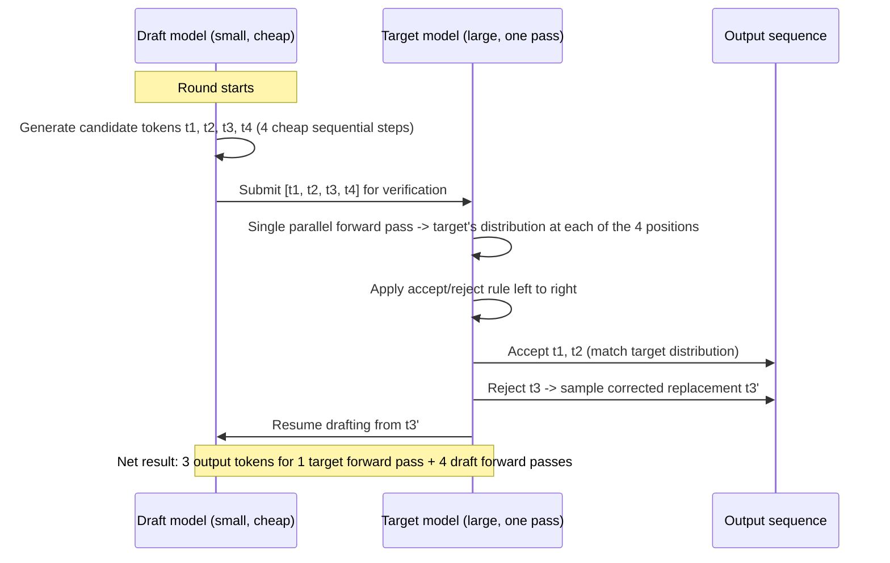

# Chapter 15: Quantization & Speculative Decoding

*Two of the highest-leverage tricks in production LLM serving have almost nothing to do with the model's architecture — they exploit how numbers are stored and how GPUs spend idle time.*

## Learning Objectives

By the end of this chapter, you will be able to:

- Explain, in terms of memory-bandwidth-bound inference (Chapter 14), *why* reducing weight precision directly increases decode throughput
- Compute a model's memory footprint at FP16, INT8, and INT4 for a given parameter count
- Explain why neural network weights tolerate reduced precision well, and why a small number of "outlier" values are the exception that breaks naive quantization
- Contrast GPTQ's layer-wise, error-minimizing approach with AWQ's activation-aware channel protection, and explain why each beats naive round-to-nearest quantization
- Describe GGUF's role in making LLMs runnable on laptops and edge devices, and read a quant name like `Q4_K_M` correctly
- Walk through the full speculative decoding draft-verify loop and explain why it provably preserves the target model's output distribution
- Compute an expected speedup from speculative decoding given a draft model's acceptance rate and draft length
- Choose a quantization format + serving strategy for a given hardware/latency/quality constraint, and justify the choice

---

## Prerequisites for This Chapter

This chapter builds directly on two earlier chapters — make sure both are fresh:

- **Chapter 14 (Inference Optimization)** established that autoregressive decoding is **memory-bandwidth-bound**: generating each token requires reading every weight of the model from GPU memory, and the GPU's compute units sit mostly idle waiting for those bytes to arrive. The roofline argument from that chapter — throughput is capped by bytes-moved-per-second, not FLOPs-per-second, during decode — is the entire reason quantization works as a speed technique, not just a memory-saving one. If a weight takes half as many bytes to read, decode gets roughly twice as fast for that memory-bound portion of the work.
- **Chapter 9 (Sampling & Generation Strategies)** previewed speculative decoding as a way to generate more than one token per expensive forward pass. This chapter gives you the full mechanism, the math behind why it's exact (not an approximation), and how to size the expected speedup.

If either of those two ideas — "decode is bottlenecked on reading weights from memory" and "a cheap draft model can propose tokens for a big model to check" — feels shaky, it's worth a quick re-read before continuing, because everything below is built on top of them.

---

## 1. Why Quantization Works: Redundancy and Precision Tolerance

### 1.1 The plain-language version

A model trained from scratch typically stores its weights as 32-bit floating point (FP32) or, more commonly today, as 16-bit floats — either FP16 or BF16. Each individual weight is a number like `-0.0234871`, stored with enough precision to represent that value to roughly 7 (FP32) or 3-4 (FP16/BF16) significant decimal digits.

Here's the key empirical observation the entire field of quantization rests on: **you don't need that much precision for most of those numbers.** A large language model has billions of weights, and they are collectively redundant — many individual weights could be nudged by a small amount without measurably changing the model's output, because the network's behavior emerges from the *aggregate* effect of enormous numbers of weights working together, not from any single weight being exactly right to the fourth decimal place. This is the same intuition as JPEG compression: an image doesn't need every pixel stored losslessly for a human to perceive it as the same picture, because natural images are statistically redundant. Trained neural network weights turn out to have an analogous kind of redundancy.

**Quantization** exploits this by representing each weight with fewer bits — 8 bits (INT8) or even 4 bits (INT4) instead of 16 or 32 — accepting a small, controlled amount of rounding error in exchange for a much smaller model.

### 1.2 Why this also makes inference *faster*, not just smaller

This is the connection back to Chapter 14 that's easy to gloss over. During decode, the GPU must stream every weight out of high-bandwidth memory (HBM) for every token generated. If weights are stored in FP16 (2 bytes each), a 7B-parameter model requires reading roughly 14 GB per forward pass. If those same weights are quantized to INT4 (0.5 bytes each), the same forward pass requires reading roughly 3.5 GB — a **4x reduction in bytes moved**, which, in a regime where the bottleneck genuinely is bytes-per-second off HBM, translates directly into up to a 4x increase in achievable decode throughput (in practice somewhat less, because dequantization and other overheads eat into the theoretical gain, but the direction and rough magnitude hold).

This is the single most important sentence in this section: **quantization is a memory-bandwidth optimization first, and a memory-capacity optimization second.** Engineers who've only used quantization to "make a model fit on my GPU" are missing half the story — it also makes the tokens/second number better, for exactly the reason Chapter 14 taught you to look for.

### 1.3 Why naive quantization can still break things

If redundancy is so forgiving, why not just round every weight to the nearest representable INT4 value and call it done? Because redundancy isn't uniform. Empirically, LLM weight matrices (and especially their *activations* — the intermediate values computed during a forward pass) contain a small number of **outlier values** with unusually large magnitude, concentrated in specific channels. These outliers are disproportionately important to the model's function — they often correspond to attention sinks, rare-but-critical features, or specific dimensions the model has learned to rely on heavily.

Naive uniform quantization picks a single scale factor to map the full range of a weight tensor into, say, 16 buckets (4-bit = 2^4 = 16 possible values). If a handful of outliers stretch that range far wider than where the bulk of the "normal" weights live, the scale factor gets distorted: most weights — the ones that actually carry the bulk of useful signal — get crammed into a handful of buckets with heavy rounding error, while precision is "wasted" on a range that only a few outliers ever use. The result is that a small number of high-magnitude values quietly wreck the quantization quality for everyone else.

This is precisely the problem GPTQ and AWQ each solve, using two different strategies (Sections 3 and 4).

---

## 2. Worked Example: Memory Footprint at FP16, INT8, and INT4

Let's make Section 1.2's claim concrete with real numbers, using a 7B-parameter model (e.g., a Llama-2-7B-class model) as the running example.

**The core formula:** `memory (bytes) = number of parameters × bytes per parameter`

| Precision | Bytes/parameter | 7B model memory footprint | Relative size |
|---|---|---|---|
| FP32 | 4 | 7,000,000,000 × 4 = 28,000,000,000 bytes ≈ **28.0 GB** | 4x (baseline for comparison) |
| FP16 / BF16 | 2 | 7,000,000,000 × 2 = 14,000,000,000 bytes ≈ **14.0 GB** | 2x |
| INT8 | 1 | 7,000,000,000 × 1 = 7,000,000,000 bytes ≈ **7.0 GB** | 1x |
| INT4 | 0.5 | 7,000,000,000 × 0.5 = 3,500,000,000 bytes ≈ **3.5 GB** | 0.5x |

A few things worth internalizing from this table:

- **FP32 is essentially never used for LLM inference** — it's a training-time precision, included above only as the reference point most engineers' intuition starts from.
- Going from FP16 (today's typical serving default) to **INT4 is a 4x reduction** — a 7B model's weights shrink from 14 GB to 3.5 GB. That's the difference between "barely fits on a 16 GB consumer GPU with no room for KV cache" and "fits comfortably with several GB left over for context and batching."
- This table covers **weights only**. Real deployments also need memory for the **KV cache** (Chapter 7/14) and activation buffers, which scale with context length and batch size and are *not* automatically shrunk just because you quantized the weights (unless you also quantize the KV cache, an increasingly common additional optimization). For a rough sanity check at moderate context lengths and batch size 1, KV cache is usually a few GB on top of the weight footprint above — small relative to weights for a 7B model at short-to-medium context, but it can dominate at long context or large batch sizes.
- The same arithmetic scales linearly: a 70B model at INT4 needs roughly `70 × 0.5 = 35 GB` for weights — the reason INT4 quantization is what makes a 70B-class model plausible on a single 40-48 GB GPU at all.

---

## 3. GPTQ: Layer-Wise, Error-Minimizing Quantization

**GPTQ** (Frantar et al., 2022, building on earlier work called Optimal Brain Quantization) is a **post-training quantization (PTQ)** method — it takes an already-trained FP16 model and quantizes it afterward, with no retraining, using only a small calibration dataset (typically a few hundred text samples fed through the model once).

### 3.1 The key idea: don't just round each weight independently

Naive quantization rounds each weight to its nearest representable low-bit value, one weight at a time, ignoring how that weight interacts with all the others in the same layer. GPTQ instead asks a smarter question, layer by layer: *"Given that I'm about to quantize this weight, what values should I pick — for this weight and the ones I haven't quantized yet — to minimize the resulting error in this layer's **output**, not just the error in each individual weight?"*

Concretely, GPTQ processes each layer's weight matrix one column (or small block) at a time. After quantizing a column, it computes the error that quantization introduced in the layer's output, and then **adjusts the remaining, not-yet-quantized weights in that layer to compensate** for that error — nudging them slightly to cancel out the damage the already-quantized columns did to the output. It does this efficiently using second-order information (an approximation of the Hessian of the layer's loss with respect to its weights) computed from the calibration data, which tells it how sensitive the output is to changes in each weight.

### 3.2 Why this beats naive rounding

Two weights can each individually round to values with identical-looking small errors, yet one of those errors matters far more to the model's behavior than the other, because the layer's *output* is a weighted combination of all its inputs and weights — some weights sit in directions the layer's output is highly sensitive to, others sit in directions it barely responds to. Naive independent rounding treats both errors as equally bad. GPTQ's error-compensation approach effectively says "it's fine if this weight's rounding error is large, as long as I adjust its neighbors so the *net effect on the layer's output* stays small" — which is a much better proxy for "did I preserve what this layer actually computes" than "did I preserve every individual number." The result: GPTQ-quantized 4-bit models retain quality close to the original FP16 model on most benchmarks, where naive 4-bit rounding of the same model typically shows a visible, sometimes severe, quality drop.

GPTQ's practical footprint: it's the format behind popular tools like AutoGPTQ and GPTQ-for-LLaMa, runs well on GPU via optimized kernels (ExLlama, ExLlamaV2, Marlin), and is directly supported by serving engines like vLLM and TGI (Chapter 14).

---

## 4. AWQ: Activation-Aware Weight Quantization

**AWQ** (Lin et al., 2023) starts from a different empirical observation than GPTQ, and arrives at 4-bit quality that's often competitive with or better than GPTQ, using a cheaper quantization process.

### 4.1 The key idea: not all weight channels are equally important — and you can tell which ones in advance

Recall from Section 1.3 that outliers tend to concentrate in specific *channels* (specific input/output dimensions of a weight matrix), and recall from Chapter 6/7 that a weight's importance isn't just about its own magnitude — it's about how it interacts with the activations flowing through it. AWQ's insight: a small percentage of weight channels (empirically, often around 1%) are disproportionately important **because they consistently multiply against large-magnitude activations**, not necessarily because the weights themselves are unusually large. A modest weight multiplied by a huge activation still produces a huge contribution to the output — so that weight's precision matters a lot, even though looking at the weight alone wouldn't tell you that.

AWQ identifies these "salient" channels by running the calibration data through the model and observing **activation magnitudes**, not by looking at the weights in isolation. It then protects those salient channels' effective precision — not by leaving them at full FP16 (which would create an inefficient mixed-precision matrix multiply that's awkward for GPU kernels to execute fast), but by applying a **per-channel scaling transformation**: it scales up the salient weight channels (and correspondingly scales down the matching activations, so the mathematical result of the multiplication is unchanged) before quantizing everything uniformly to 4-bit. Because the salient weights are now larger relative to the quantization step size, they get quantized with proportionally less relative error, while non-salient channels are quantized as aggressively as before. The whole tensor stays in one uniform low-bit format — good for hardware efficiency — but the errors that matter most get shrunk.

### 4.2 Why this preserves quality better than uniform quantization

Uniform quantization spends its limited bit budget "democratically" — every weight gets the same treatment regardless of how much it actually matters to the output. AWQ instead spends that budget where it counts: it identifies, via a cheap statistical pass over real activation data (no gradient descent, no backpropagation, no expensive per-layer optimization loop like GPTQ's), which small slice of weights actually drives most of the output variance, and biases the quantization scheme to protect exactly those. This makes AWQ notably cheaper and faster to *produce* a quantized model with (no iterative layer-wise reconstruction), while often matching or slightly beating GPTQ's quality at 4-bit — which is why AWQ has become a common default for quantizing instruction-tuned/chat models for GPU serving.

### 4.3 GPTQ vs. AWQ, side by side

| Aspect | GPTQ | AWQ |
|---|---|---|
| Core mechanism | Layer-wise error-compensated rounding using Hessian-based second-order info | Activation-aware per-channel scaling before uniform rounding |
| Calibration cost | Higher — iterative per-layer reconstruction | Lower — one statistical pass over activations |
| Quantization time | Minutes to hours depending on model size | Typically faster than GPTQ |
| Typical quality at 4-bit | Very good | Very good, often slightly better on chat/instruct models |
| GPU kernel support | ExLlama/ExLlamaV2, Marlin, vLLM, TGI | vLLM, TGI, AutoAWQ |

---

## 5. GGUF: Quantization for CPUs and Edge Devices

GPTQ and AWQ both target **GPU** inference. But a huge fraction of real-world LLM usage happens on hardware with no dedicated accelerator at all — a developer's laptop, a small on-prem appliance, a phone. That's the world **GGUF** and **llama.cpp** were built for.

### 5.1 What GGUF is

GGUF (GPT-Generated Unified Format, the successor to the earlier GGML format) is a **single-file model format** designed by the llama.cpp project for efficient CPU (and consumer GPU, via optional CUDA/Metal/Vulkan backends) inference. A GGUF file bundles the quantized weights, tokenizer, and architecture metadata into one portable artifact — you can copy a single `.gguf` file to a laptop with no internet access and run it, which is a meaningfully different deployment model than the Python-plus-CUDA-plus-driver-stack that GPU serving typically requires.

GGUF supports a whole family of quantization levels, using **k-quants** — a scheme that doesn't apply the same bit-width uniformly to every tensor in the model, but instead allocates bits more carefully depending on which tensors matter more (broadly similar in spirit to AWQ's "not everything deserves equal precision," applied at the tensor-type level rather than the channel level). Common levels you'll see in the wild:

| Quant level | Approx. bits/weight | Typical use |
|---|---|---|
| `Q2_K` | ~2.5 | Smallest, fastest, noticeably lower quality — for extremely constrained hardware |
| `Q4_K_M` | ~4.5 | The most common default — a strong size/quality balance for most laptops |
| `Q5_K_M` | ~5.5 | Better quality, larger, still very usable on CPU |
| `Q6_K` | ~6.5 | Close to FP16 quality, larger footprint |
| `Q8_0` | 8 | Near-lossless relative to FP16, largest of the "quantized" tiers |

### 5.2 Reading the naming convention

The general pattern in a name like `Q4_K_M` is: **`Q<bits>_<variant>`** — `Q4` means roughly 4 bits per weight on average (k-quants mix bit-widths across tensors, so it's an average, not a hard per-weight guarantee), and the suffix (`_S`, `_M`, `_L` for small/medium/large, or `_K` for the k-quant scheme itself) indicates a specific sub-variant tuned for a slightly different point on the size/quality curve. The trade-off is monotonic and intuitive once you see the table above: **lower bit levels are smaller and faster to run, but produce lower-quality output** — more repetition, more subtle reasoning errors, occasional incoherence on harder prompts. There's no universally "correct" level; `Q4_K_M` is a widely used default precisely because it tends to sit at the knee of the size/quality curve for most models and most tasks, but a task that's quality-sensitive (careful reasoning, code generation) often justifies stepping up to `Q5_K_M` or `Q6_K` if the hardware has the RAM to spare.

### 5.3 Why this matters for deployment

GGUF's entire value proposition is: **it lets you run a capable LLM entirely on a CPU** (or a modest consumer GPU with partial offload), with no dependency on a data-center accelerator, no need to keep a GPU warm and billed, and a straightforward single-file deployment story. This is the format of choice for local developer tooling, offline/air-gapped environments, and consumer edge applications — the tier of deployment GPTQ/AWQ don't target at all, since those assume a CUDA-capable GPU is present.

---

## 6. bitsandbytes: On-the-Fly Quantization

The fourth format worth knowing is different in kind from the other three: **bitsandbytes** is a library, not a file format. Rather than producing a separate pre-quantized model artifact, it quantizes weights **at load time, inside the normal Hugging Face Transformers loading path** — you load the FP16 checkpoint as usual and pass a flag (`load_in_8bit=True` or `load_in_4bit=True`), and bitsandbytes handles quantizing the weights into memory on the fly, dequantizing them back to a working precision transparently during each forward pass.

This on-the-fly approach trades some raw inference speed (there's a small dequantization overhead on every forward pass, since the "true" quantized-format kernels used by GPTQ/AWQ aren't in play) for enormous convenience: no separate quantization pipeline or calibration step is required to just try a model at lower memory. It's also the mechanism behind **QLoRA** (Chapter 13) — recall that QLoRA fine-tunes a base model that's been loaded in 4-bit using bitsandbytes' NF4 (NormalFloat4) format, while the small trainable LoRA adapters stay in higher precision, giving you the memory savings of 4-bit weights *during training*, not just inference. That's a capability none of GPTQ, AWQ, or GGUF are designed for — they're inference-only formats.

---

## 7. Comparison Table: GPTQ vs. AWQ vs. GGUF vs. bitsandbytes

| | **GPTQ** | **AWQ** | **GGUF (llama.cpp)** | **bitsandbytes** |
|---|---|---|---|---|
| **What it is** | PTQ algorithm + file format | PTQ algorithm + file format | File format + inference engine | Runtime/on-the-fly quantization library |
| **Primary target hardware** | GPU (data center or consumer) | GPU (data center or consumer) | CPU, plus optional consumer GPU offload | GPU (wherever Transformers/PyTorch runs) |
| **Typical bit-widths** | 4-bit (also 3/8-bit) | 4-bit | 2 to 8-bit (k-quants) | 8-bit and 4-bit (NF4) |
| **Needs a separate quantization step** | Yes, with calibration data | Yes, with calibration data | Yes, one-time conversion | No — quantizes at model load time |
| **Typical use case** | GPU-served chat/completion models at reduced VRAM | Same as GPTQ; often preferred for chat/instruct models | Local/offline/edge inference, laptops, air-gapped environments | Rapid prototyping; QLoRA fine-tuning (Chapter 13) |
| **Quality at 4-bit** | Very good | Very good, often best-in-class | Good, tunable via quant level | Good, but small inference-time overhead from dequant |
| **Speed characteristic** | Fast with dedicated kernels (ExLlama/Marlin) | Fast with dedicated kernels | Fast on CPU relative to FP16-on-CPU; not as fast as native GPU kernels | Slower than pre-quantized formats due to on-the-fly dequant |
| **Serving engine support** | vLLM, TGI, ExLlama | vLLM, TGI, AutoAWQ | llama.cpp, Ollama, LM Studio | Hugging Face Transformers directly |

**The one-line mental model:** *GPTQ and AWQ are for shipping a quantized model to a GPU serving stack; GGUF is for shipping a model to a machine that might not have a GPU at all; bitsandbytes is for when you want quantization without a separate build step — most commonly during fine-tuning (QLoRA) or quick experimentation.*

---

## 8. Speculative Decoding: The Full Mechanism

Chapter 9 introduced the idea; here's the complete loop, the guarantee behind it, and how to size the payoff.

### 8.1 The problem it solves

Chapter 14 established that decoding one token at a time from a large model is memory-bandwidth-bound: each step reads the *entire* model's weights from HBM to produce a single token, and the GPU's compute units are mostly idle while that read happens. That idle compute is the opportunity speculative decoding exploits: if the GPU has spare compute capacity sitting unused during decode, why not use it to check several candidate tokens *at once*, instead of one at a time?

### 8.2 The mechanism

Speculative decoding uses two models:

- A small, fast **draft model** — cheap enough that running it several times in a row costs much less than one forward pass of the target model.
- The original large **target model** — the one whose output quality you actually want to preserve exactly.

The loop, per round:

1. The draft model generates a short sequence of candidate next tokens autoregressively — say, γ = 4 tokens — one at a time, cheaply, because it's small.
2. The target model then runs **one single forward pass** over the entire draft sequence at once, computing what its own probability distribution would have been at each of those 4 positions. This is cheap relative to 4 separate target-model calls because — same bandwidth-bound logic as before — reading the weights from memory dominates the cost, and reading them once to process 4 candidate positions in parallel costs only marginally more than reading them once to process 1 position; the extra compute for the additional positions is nearly free since compute was sitting idle anyway.
3. Going left to right through the 4 candidate tokens, each is **accepted or rejected** using a specific probabilistic rule (Section 8.3) that compares the draft model's probability for that token against the target model's probability for the same token.
4. As soon as a token is rejected (or all γ are accepted), generation stops accepting further draft tokens for this round. A replacement token is then sampled from a **corrected distribution** at that position (described below), and this new token is appended to the output.
5. The loop repeats, with the draft model resuming from the newly extended sequence.



A plain-timeline view of why this is faster, comparing token-by-token decoding against a speculative round that accepts 3 of 4 drafted tokens:

```
Token-by-token (target model alone), 4 tokens:
[--- target fwd ---][--- target fwd ---][--- target fwd ---][--- target fwd ---]
      t1                   t2                   t3                   t4
Total cost: 4 target forward passes

Speculative decoding, one round, 3/4 accepted:
[d][d][d][d][----- target fwd (verifies all 4 at once) -----]
 t1 t2 t3 t4   (t1,t2,t3 accepted; t4 rejected -> replaced with t4')
Total cost: 4 cheap draft passes + 1 target forward pass
Output: 4 tokens (t1, t2, t3, t4')
```

### 8.3 Why the output distribution is provably unchanged

This is the part that separates speculative decoding from a lossy shortcut: it is a form of **exact sampling**, not an approximation. The accept/reject rule is specifically constructed — via a technique closely related to rejection sampling — so that the *marginal distribution of the final output tokens is mathematically identical* to what you'd get by sampling from the target model alone, token by token, with no draft model involved.

Here's the intuition for the rule, at a single position. Let `p(x)` be the draft model's probability of token `x` at this position, and `q(x)` be the target model's probability of the same token at the same position (computed from the single parallel forward pass).

- If `q(x) ≥ p(x)` — the target model likes this token *at least* as much as the draft model did — **always accept it**. The draft didn't over-propose it relative to what the target would have wanted, so keeping it can't distort the target's distribution.
- If `q(x) < p(x)` — the draft model over-proposed this token relative to how much the target model actually wants it — **accept it only with probability `q(x)/p(x)`**, and reject it the rest of the time.
- On rejection, instead of just discarding the token, sample the replacement from a **corrected residual distribution**: `max(0, q(x) - p(x))`, renormalized. This distribution concentrates exactly on the probability mass that the draft model *under*-proposed relative to the target — the tokens the target model wanted more weight on than the draft gave them.

The net effect of "sometimes reject proportionally to how much the draft over-proposed, and when you do, resample from exactly the mass the draft under-proposed" is that the combined accept-or-resample process reproduces `q(x)` exactly, for every token, every time — regardless of how good or bad the draft model is. A weak draft model with a low acceptance rate doesn't corrupt the output quality; it just means more rejections happen, which slows the process back down toward (never below) the target model's own token-by-token speed. This is why speculative decoding is described as a **strictly lossless** latency optimization: worst case, a terrible draft model just wastes some compute and you get roughly target-model-alone speed; it never makes output *worse* than sampling from the target model directly would have.

---

## 9. Worked Example: Estimating the Speedup

Let's turn the acceptance rate into an actual number, using the scenario Chapter 9 previewed: **a draft model proposes 4 tokens per round, and on average 3 are accepted.**

### 9.1 Setting up the cost model

Two simplifying assumptions, both defensible given what Chapter 14 taught about the bandwidth-bound decode regime:

1. **A target-model forward pass that verifies γ candidate tokens in parallel costs approximately the same as a target-model forward pass that generates just 1 token.** This holds because the dominant cost is streaming the weights from HBM once; the extra compute to process a few extra positions in parallel is close to free, since compute was sitting idle during ordinary token-by-token decode anyway.
2. **The draft model's forward pass costs a small fraction, `c`, of the target model's forward pass** — reasonable because draft models are chosen to be 5-15x smaller than the target (e.g., a 1B draft paired with a 7-13B target), and decode cost scales roughly with parameter count for the same reason quantization saves time (Section 1.2). Let's use `c = 0.1` (draft costs 10% of a target pass) as a representative value.

### 9.2 Baseline: target model alone, token by token

To produce 4 tokens with plain autoregressive decoding: **4 target forward passes**, cost = `4 × T` (where `T` is the cost of one target forward pass).

### 9.3 Speculative decoding: one round

To produce the same 4 tokens via speculative decoding, with 3 of 4 drafted tokens accepted on average (so this round typically yields the 3 accepted tokens plus 1 replacement/bonus token = 4 tokens total, matching the baseline for a fair comparison):

- Draft cost: 4 draft forward passes = `4 × c × T = 4 × 0.1 × T = 0.4T`
- Verification cost: 1 target forward pass (verifying all 4 positions at once) = `1 × T`
- **Total round cost: `0.4T + 1T = 1.4T`**

### 9.4 The speedup

```
Speedup = baseline cost / speculative cost = 4T / 1.4T ≈ 2.86x
```

**Roughly a 2.9x speedup** — for producing the same 4 tokens, with a mathematically identical output distribution (Section 8.3), just by adding a small draft model into the loop.

### 9.5 Sanity-checking with the general formula

The example above simplified "3 of 4 accepted on average" into "4 tokens per round" directly. The more rigorous version models acceptance as a per-token probability `α` and computes the **expected** number of tokens produced per round as:

```
E[tokens per round] = (1 − α^(γ+1)) / (1 − α)
```

Plugging in `α = 0.75` (a 75% chance each drafted token individually survives verification) and `γ = 4`:

```
E[tokens] = (1 − 0.75^5) / (1 − 0.75) = (1 − 0.2373) / 0.25 = 0.7627 / 0.25 ≈ 3.05
```

That lines up closely with the "3 accepted, plus 1 bonus token" story used above, confirming the simplified worked example wasn't cheating — it's a reasonable approximation of the more formal expectation.

### 9.6 What actually moves the number

- **Higher acceptance rate → bigger speedup**, up to a ceiling set by draft length `γ` (you can never get more than `γ+1` tokens per round, no matter how good the draft model is).
- **Cheaper draft model (smaller `c`) → bigger speedup**, since the draft passes cost less relative to the one target pass that dominates the round.
- **Diminishing returns on `γ`**: proposing more draft tokens per round only helps if the acceptance rate stays reasonably high; a low acceptance rate means most of those extra draft tokens get thrown away, wasting draft compute for no gain.
- **The regime matters more than any of the above**: this entire analysis assumes the target model's forward pass is memory-bandwidth-bound and the GPU has spare compute to absorb verifying extra positions almost for free. Under heavy batched serving (Chapter 14's continuous batching, where many requests already keep the GPU compute-bound), that spare compute may not exist — see Section 11.

---

## 10. Real-World Scenario

A startup serves a 13B-parameter chat model on a single A10G GPU (24 GB) for an internal support-ticket triage tool. Under normal load — one or two concurrent users, no aggressive batching — p50 latency is fine, but p95 latency for longer responses regularly blows past the 3-second SLA the product team committed to. Profiling (using the mental model from Chapter 14) confirms decode is memory-bandwidth-bound and the GPU's compute utilization sits under 20% throughout generation — there's plenty of idle compute, just not enough memory bandwidth being used efficiently.

The team makes two changes, in order:

**Step 1 — Quantize the target model with AWQ, INT4.** The 13B model's weight footprint drops from ~26 GB (FP16) to roughly ~6.5 GB (INT4), which not only fits comfortably on the A10G with room to spare, but — per Section 1.2 — directly increases raw decode throughput because a quarter as many bytes now need to move per token. They validate quality with task-specific evals (ticket-classification accuracy and a rubric-scored sample of generated triage summaries), not just perplexity, and confirm the quality drop from FP16 to AWQ INT4 is within their tolerance for this use case.

**Step 2 — Add speculative decoding with a small draft model.** They pair the quantized 13B target with a 1.1B draft model from the same model family, sharing the same tokenizer (a hard requirement — Section 12 explains why). On a sample of real triage tickets, they measure an empirical acceptance rate around 0.7-0.8 with a draft length of 5, consistent with the estimate style in Section 9.5, yielding roughly a 2.5-3x additional speedup on top of the quantization win — because the A10G's idle compute (confirmed in profiling) is exactly the resource speculative decoding needs to exploit.

Combined, the two changes bring p95 latency well under the SLA, without changing a single line of the model's actual output-sampling behavior (speculative decoding is exact, per Section 8.3) and without needing a bigger or additional GPU.

---

## 11. Best Practices

- **Measure acceptance rate empirically on your own workload before promising a speedup number.** Acceptance rate depends heavily on how similar the draft and target models' behavior is on your actual traffic, and on sampling temperature (higher temperature generally lowers acceptance rate, since the target's distribution gets flatter and less predictable from a smaller model's perspective).
- **Validate quantized models with task-specific evals, not just perplexity.** A quantized model can show a barely-changed perplexity number while quietly degrading on structured tasks (JSON output, multi-step reasoning, code) that perplexity doesn't probe well.
- **Match draft and target tokenizers/vocabularies exactly.** Speculative decoding's verification step compares token-level probabilities position by position; a draft model with a different vocabulary can't be verified against the target model's distribution at all.
- **Prefer a draft model from the same family as the target where possible** (e.g., a distilled or smaller checkpoint from the same base model lineage) — behavioral similarity drives acceptance rate more than raw draft-model quality in isolation.
- **Use a calibration set representative of your real traffic for GPTQ/AWQ**, not a generic public dataset — quantization quality depends on what activation/weight statistics the calibration pass observes, and those statistics are domain-specific.
- **Reach for GGUF only when there's genuinely no GPU in the deployment target**, or when single-file portability matters more than raw throughput — GPTQ/AWQ on a real GPU will generally outperform GGUF on that same GPU.
- **Re-check VRAM headroom for KV cache after quantizing weights** — shrinking the weights doesn't shrink per-token KV cache growth, and long-context or high-batch workloads can still run out of memory even on a "successfully quantized" model.
- **Treat quantization format choice and serving engine choice (Chapter 14) as a joint decision** — vLLM, TGI, and llama.cpp each support a different subset of GPTQ/AWQ/GGUF, and picking a quant format your serving engine can't run efficiently defeats the purpose.

---

## 12. Common Mistakes

- **Assuming INT4 is "safe" for any model or task without evaluation.** Smaller models (under ~3B parameters) generally have less redundancy to spare and degrade more per bit removed than larger models — a rule of thumb that surprises engineers who only tested quantization on 7B+ models.
- **Quantizing weights but leaving activations at full precision without realizing there's a name for that** (commonly "W4A16" — 4-bit weights, 16-bit activations) — this is usually the right default, but it's worth knowing the terminology so you can read tool documentation and benchmark comparisons correctly.
- **Using a non-representative calibration dataset for GPTQ/AWQ**, e.g. calibrating a model destined for code generation on generic prose — the calibration pass shapes which weights get protected, and a mismatched calibration set protects the wrong things.
- **Pairing a draft model with a different tokenizer than the target**, which silently breaks the verification step's correctness rather than just underperforming.
- **Believing speculative decoding always speeds things up.** Under heavy batched, compute-bound serving (many concurrent requests already saturating GPU compute via continuous batching, Chapter 14), the "spare idle compute" speculative decoding relies on may not exist — verifying extra draft positions competes with other requests' work instead of being free, and the net win shrinks or disappears. It's most valuable in low-batch, latency-sensitive, single-stream scenarios.
- **Confusing "speculative decoding changes what gets generated" with reality.** It's exact sampling (Section 8.3) — a worse draft model only costs you speed, never correctness. Don't avoid it out of a mistaken belief that it's an approximation.
- **Trusting theoretical speedup formulas without measuring wall-clock, end-to-end.** Real systems have overheads (extra memory traffic for two models loaded simultaneously, kernel launch overhead for the small draft steps, batching interactions) that the clean formulas in Section 9 don't capture — always benchmark on real hardware with real traffic before committing to a number in a design doc.
- **Reading `Q4_K_M`-style GGUF names as a hard guarantee of exactly 4 bits everywhere** — k-quants mix precision across tensor types, so the number is an informative average, not a uniform per-weight bit-width.

---

## Summary

- Quantization reduces the number of bits used to store each weight (FP16 → INT8 → INT4), which shrinks memory footprint **and** — because decode is memory-bandwidth-bound (Chapter 14) — directly increases decode throughput.
- It works because trained neural network weights are collectively redundant and tolerant of small rounding errors, but naive uniform rounding can badly hurt quality because a small number of outlier weights/activation channels are disproportionately important.
- **GPTQ** quantizes layer by layer, using calibration data and second-order error information to compensate remaining weights for the error already-quantized weights introduced — minimizing error in the layer's *output*, not just in individual weights.
- **AWQ** identifies a small set of activation-salient weight channels via a cheap statistical pass and protects their effective precision through per-channel scaling, before quantizing everything uniformly — cheaper to produce than GPTQ, often comparable or better quality.
- **GGUF** (llama.cpp) is the format for CPU and edge/consumer-hardware deployment, offering a range of quant levels (`Q2_K` through `Q8_0`) trading size/speed against quality, packaged as a single portable file.
- **bitsandbytes** does on-the-fly quantization inside the normal model-loading path, at some inference-speed cost, and is the mechanism behind QLoRA (Chapter 13) fine-tuning.
- **Speculative decoding** uses a small draft model to propose several candidate tokens, which the large target model verifies in a single parallel forward pass; a carefully designed probabilistic accept/reject rule guarantees the final output distribution exactly matches sampling from the target model alone — it's a lossless latency optimization, not an approximation.
- The achievable speedup depends on acceptance rate, draft length, and the relative cost of draft vs. target forward passes — and shrinks in heavily batched, compute-bound serving regimes where the "spare idle compute" it exploits isn't actually spare.
- Production choices combine a quantization format, a serving engine (Chapter 14), and optionally speculative decoding, selected jointly based on target hardware, latency budget, and quality tolerance (Section 13, next).

---

## 13. Production Decision Framework

Three concrete scenarios, walking through the reasoning rather than just naming a tool.

### Scenario A: GPU cluster, high concurrent load, throughput-sensitive

**Constraints:** multiple A100/H100s, hundreds of concurrent requests, cost-per-token matters more than any single request's latency, quality bar is high (customer-facing product).

**Reasoning:** Chapter 14's continuous batching already keeps these GPUs compute-bound at scale, not memory-bandwidth-bound — the "idle compute" speculative decoding needs is largely consumed by batching many requests together. Speculative decoding's marginal benefit here is smaller and needs careful measurement; it's often skipped in favor of just maximizing batch efficiency. Quantization is still valuable — AWQ or GPTQ INT4/INT8 frees VRAM to run **larger batch sizes** (more concurrent requests per GPU) rather than primarily to speed up any single request, which is the metric that matters for cost-per-token at scale. **Choice: AWQ or GPTQ (INT4/INT8) + vLLM's continuous batching; speculative decoding evaluated case-by-case and often deprioritized.**

### Scenario B: Single consumer GPU, low-batch, latency-sensitive (small team self-hosting)

**Constraints:** one RTX 4090 or A10G, one or a few concurrent users at a time, latency (not aggregate throughput) is the thing users feel, moderate quality tolerance (internal tool, not customer-facing).

**Reasoning:** This is squarely the memory-bandwidth-bound, compute-idle regime Section 8-9 assumed. A GPTQ or AWQ 4-bit quantized model fits comfortably in VRAM with room for a reasonable context window, and — critically — the GPU's idle compute during single-stream decode is exactly what speculative decoding exploits well. **Choice: AWQ or GPTQ INT4 target model + a small same-family draft model + vLLM or TGI, with speculative decoding enabled** — this scenario tends to show close to the full theoretical speedup from Section 9.

### Scenario C: CPU-only edge device (no GPU available at all)

**Constraints:** on-prem appliance or laptop deployment, no accelerator, limited RAM (say 16 GB), offline/air-gapped requirement, moderate-to-low quality tolerance acceptable if it keeps the system usable at all.

**Reasoning:** GPTQ/AWQ are off the table — no GPU to run their kernels efficiently. GGUF via llama.cpp is the only realistic option. Given 16 GB RAM, `Q4_K_M` is a reasonable default starting point; if RAM allows and the task is quality-sensitive (e.g., code generation), step up to `Q5_K_M` or `Q6_K`. Speculative decoding is still worth trying here — CPU compute is the bottleneck, and generating fewer large-model forward passes for the same output length is valuable even without a GPU's idle-compute framing, as long as a compatible small GGUF draft model exists and its own CPU cost is genuinely small relative to the target. **Choice: GGUF `Q4_K_M` (or `Q5_K_M`/`Q6_K` if RAM and quality bar allow) via llama.cpp, with speculative decoding attempted if a compatible small draft model is available.**

The pattern across all three: **hardware determines the format family (GPU → GPTQ/AWQ, no GPU → GGUF, on-the-fly/training → bitsandbytes); load pattern determines whether speculative decoding pays off (low-batch/latency-sensitive → yes, heavily batched/compute-bound → measure first); and quality tolerance determines how aggressive a bit-width to pick within the chosen format.**

---

## Knowledge Check

1. Using Chapter 14's memory-bandwidth-bound argument, explain in your own words why quantizing weights from FP16 to INT4 speeds up decode, not just shrinks memory usage.
2. A colleague proposes quantizing a model by independently rounding each weight to its nearest 4-bit representable value, with one scale factor per tensor. What specific failure mode does this risk, and how do GPTQ and AWQ each address it differently?
3. Compute the FP16 and INT4 memory footprint (in GB) for a 34B-parameter model's weights. Would the INT4 version fit on a single 24 GB consumer GPU, leaving room for KV cache?
4. Why does the speculative decoding accept/reject rule need to be probabilistic (accepting with probability `q(x)/p(x)` when `q(x) < p(x)`) rather than simply "accept if the draft's top token matches the target's top token"? What would go wrong with the simpler rule?
5. A draft model achieves a 60% per-token acceptance rate with a draft length of 5, and its forward pass costs about 8% of the target model's. Using the cost model from Section 9, estimate the speedup versus token-by-token decoding with the target model alone. (Use the simplified "average tokens per round" approach from Section 9.3-9.4.)
6. In which of the three scenarios from Section 13 would you expect speculative decoding to deliver the *smallest* measured speedup relative to its theoretical estimate, and why?

---

## Hands-On Exercise

**Part 1 — Quantize and measure.** Using Hugging Face Transformers + bitsandbytes, load a small open model (e.g., a 1-3B parameter model) three ways: full FP16, `load_in_8bit=True`, and `load_in_4bit=True`. For each, record: (a) GPU/CPU memory used to hold the model, (b) tokens/second generating a fixed 200-token completion for the same prompt, and (c) a qualitative read of output quality on 3-5 prompts you care about. Confirm the memory numbers roughly match the arithmetic from Section 2, scaled to your model's parameter count.

**Part 2 — Simulate speculative decoding's speedup.** Without needing two real models, write a small script that simulates the accept/reject loop from Section 8: model a per-token acceptance probability `α`, a draft length `γ`, and a draft-to-target cost ratio `c`, then Monte Carlo simulate many rounds, tracking (i) average tokens produced per round and (ii) average cost per round. Compare your simulated speedup against the closed-form estimate from Section 9.5, and against the simplified example in Section 9.3-9.4. Then sweep `α` from 0.5 to 0.95 and plot how speedup changes — confirm it matches the "diminishing returns without high acceptance rate" claim from Section 9.6.

**Part 3 (optional, if you have access to a real draft/target pair).** If Hugging Face's `assisted_generation` (or vLLM's speculative decoding support) is available to you, run it with a real small draft model paired against a larger target model from the same family, measure the empirical acceptance rate on a sample of your own prompts, and compare the measured wall-clock speedup against what Section 9's formula predicts for that measured acceptance rate. Note any gap, and try to explain it using the overheads listed in Section 12's "trust wall-clock" mistake.

---

## Further Reading

- Frantar, Ashkboos, Hoefler, Alistarh, *"GPTQ: Accurate Post-Training Quantization for Generative Pre-trained Transformers"* (2022) — the GPTQ paper, layer-wise error-compensated quantization
- Lin, Tang, Tang, Yang, Dang, Gan, Han, *"AWQ: Activation-aware Weight Quantization for LLM Compression and Acceleration"* (2023) — the AWQ paper, activation-salience-driven channel protection
- Leviathan, Kalman, Matias, *"Fast Inference from Transformers via Speculative Decoding"* (2023) — the foundational speculative decoding paper with the accept/reject correctness proof
- Chen, Borgeaud, Irving, Lespiau, Sifre, Jumper, *"Accelerating Large Language Model Decoding with Speculative Sampling"* (2023, DeepMind) — an independently developed, closely related speculative sampling formulation
- Dettmers, Lewis, Belkada, Zettlemoyer, *"LLM.int8(): 8-bit Matrix Multiplication for Transformers at Scale"* (2022) — the outlier-aware INT8 quantization technique behind bitsandbytes' 8-bit path
- Dettmers, Pagnoni, Holtzman, Zettlemoyer, *"QLoRA: Efficient Finetuning of Quantized LLMs"* (2023) — NF4 quantization and the training-time use case referenced in Section 6; connects back to Chapter 13
- [llama.cpp GitHub repository](https://github.com/ggml-org/llama.cpp) and its GGUF format documentation — the reference implementation and quant-level naming conventions from Section 5
- [Hugging Face: Overview of natively supported quantization schemes in Transformers](https://huggingface.co/docs/transformers/en/quantization/overview) — a practical, tool-level comparison of GPTQ, AWQ, bitsandbytes, and others as of their integration into the Transformers library

---

<div style="display:flex;justify-content:space-between;align-items:center;">
  <a href="./14-inference-optimization.md">← Previous: Inference Optimization: vLLM, FlashAttention & PagedAttention</a>
  <a href="./00-index.md">🏠 Index</a>
  <a href="./16-rag-and-vector-databases.md">Next: RAG & Vector Databases →</a>
</div>
