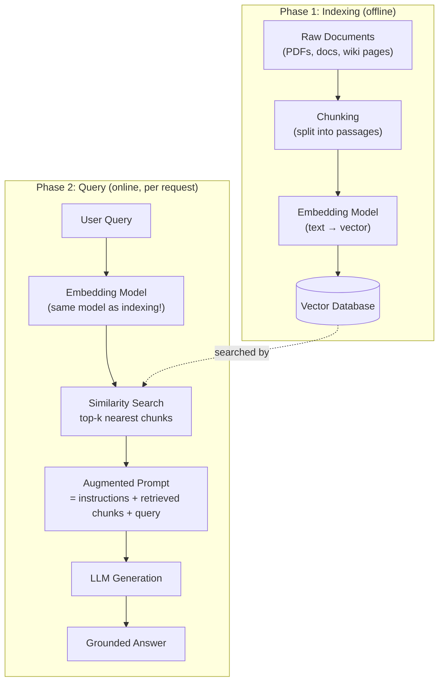
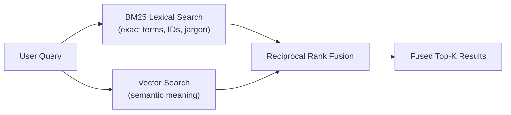
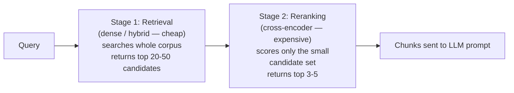

# Chapter 16: RAG & Vector Databases

> *An LLM's weights are a snapshot of the internet up to some training cutoff. RAG is how you hand it today's newspaper.*

## Learning Objectives

By the end of this chapter, you will be able to:

- Explain why parametric knowledge (baked into model weights) makes LLMs stale, blind to private data, and prone to confident hallucination — and how retrieval fixes that
- Draw and explain the two-phase RAG pipeline: offline indexing (documents → chunks → embeddings → vector store) and online querying (query → embedding → retrieve → augmented prompt → generate)
- Recap, at working-knowledge level, why embeddings turn "similar meaning" into "nearby vectors," and compute cosine similarity by hand on a small example
- Compare FAISS, Chroma, Qdrant/Milvus/Weaviate/Pinecone, and pgvector, and pick the right one for a given project's scale and infrastructure
- Explain hybrid search (dense + sparse/BM25) and why combining them catches failure modes that neither retriever catches alone
- Explain what a reranker (cross-encoder) does, why it's a second-stage step, and when the added latency is worth the precision gain
- Recognize when RAG is the wrong tool — and reach for fine-tuning, tool calling, or plain long-context prompting instead
- Build a minimal "chat with a PDF" pipeline end to end

---

## Prerequisites for This Chapter

This chapter builds on two threads from earlier in the course:

- **[Chapter 11: Tool Calling & Structured Output](./11-tool-calling-and-structured-output.md)** — RAG and tool calling are sibling techniques for giving an LLM information it doesn't have natively. Tool calling lets the model *invoke* an action at inference time (call an API, run a calculation); RAG *pre-fetches* relevant text and stuffs it into the prompt before generation even starts. Section 8 of this chapter draws the line between them precisely.
- **Chapters 5–7 (Attention, Transformer Architecture, LLM Architecture)** — you should already know that a transformer produces contextual representations of tokens, that self-attention lets every token weigh every other token, and that a model's context window is finite (Chapter 7). RAG exists partly *because* the context window is finite and because model weights are frozen after training — retrieval is how you work around both constraints without retraining anything.

You should also recall from Chapter 7 that "what the model knows" is entirely a function of what got compressed into its weights during pretraining — nothing more, nothing less. That single fact is the motivating problem for this entire chapter.

**A note on scope:** this repository contains a separate, dedicated [**20-chapter RAG course**](../rag-course/00-index.md) that goes far deeper than this chapter — chunking strategies, advanced retrieval (MMR, multi-query, self-query, parent-document retrieval), RAG architectures (CRAG, GraphRAG, RAPTOR, Agentic RAG), production concerns, and evaluation methodology. This chapter is intentionally a **concise working-knowledge overview** that connects RAG to the rest of *this* course's narrative (transformers, embeddings, context limits) and tells you when to reach for it versus alternatives. Wherever this chapter says "for depth, see...", that other course is where the depth lives.

---

## 1. The Motivation: Why RAG Exists

### 1.1 Parametric knowledge and its three failure modes

Everything an LLM "knows" is **parametric knowledge** — patterns compressed into billions of weight values during pretraining (Chapter 12). There is no lookup table inside the model, no database it queries; every fact it produces is reconstructed from statistical regularities learned from training text, the same way the model reconstructs grammar or reasoning patterns. This has three consequences that matter enormously for any real application:

1. **Staleness.** Training has a cutoff date. Anything that happened after that date — a new product release, a stock price, this morning's news — simply isn't in the weights. Ask the model about it and it either says "I don't know" (the honest, rare outcome) or confidently makes something up (the common, dangerous outcome).

2. **No access to private or proprietary data.** A model trained on public internet text has never seen your company's internal wiki, your customer database, or last week's support tickets. It cannot answer questions about information it was never shown, no matter how well it reasons.

3. **Confident hallucination outside training distribution.** This is the sharpest edge of the problem. When an LLM doesn't know something, it typically doesn't emit uncertainty — it emits fluent, well-formatted, *wrong* text, because generation is fundamentally "predict the next plausible token," and plausible-sounding wrong answers are just as easy to generate as plausible-sounding right ones. A model has no built-in mechanism to say "I have no evidence for this" unless it's explicitly trained or prompted to hedge — and even then, it's guessing at its own uncertainty, not measuring it against a source of truth.

### 1.2 The fix: retrieve, then generate

**Retrieval-Augmented Generation (RAG)**, introduced by Lewis et al. in 2020, sidesteps all three problems with one architectural idea: instead of relying solely on what's frozen in the weights, **fetch relevant text from an external, updatable knowledge source at query time, and inject it directly into the prompt as context before the model generates its answer.**

The model's generation capability (fluent, coherent language) stays exactly as it is — untouched, unretrained. What changes is what it's allowed to *look at* while generating. This is the same conceptual move that tool calling makes (Chapter 11): give the model access to information beyond its weights, on demand, rather than trying to cram everything into the weights themselves. RAG's version of "access" is a search step; tool calling's version is a function call. Section 8 returns to this comparison.

Grounding an answer in retrieved text also gives you something parametric knowledge never offers: **citability.** If the model's answer is built from three retrieved passages, you can show the user exactly which passages, and a human can verify them — turning "trust the model" into "verify the source," a categorically more auditable posture for anything used in production.

---

## 2. The Two-Phase RAG Pipeline

RAG systems split cleanly into two phases that run at completely different times, on completely different triggers.

**Phase 1 — Indexing (offline, batch, runs whenever your knowledge base changes):** documents are collected, split into smaller pieces ("chunks"), each chunk is converted into a vector via an embedding model, and those vectors are stored in a vector database alongside the original text. This can take minutes to hours and runs asynchronously — a user is never waiting on it.

**Phase 2 — Query (online, per-request, runs every time a user asks a question):** the user's query is embedded with the *same* embedding model used at indexing time, the vector database is searched for the most similar stored chunks, those chunks are inserted into a prompt template alongside the original question, and the augmented prompt is sent to the LLM to generate a grounded answer. This has to happen in the low hundreds of milliseconds, because a real user is waiting on the other end.



Two details worth internalizing now because they cause the majority of real-world RAG bugs later:

- **The embedding model must be identical across both phases.** Indexing-time vectors and query-time vectors must live in the same coordinate system, or similarity comparisons become meaningless. This is covered in depth in the [RAG course, Chapter 4](../rag-course/04-embeddings-fundamentals.md#8-real-world-scenario), including a full case study of what happens when a team gets this wrong.
- **Indexing is a data pipeline; querying is a request handler.** They have entirely different performance budgets, failure modes, and operational concerns — you monitor and scale them separately.

---

## 3. Embeddings: A Working-Knowledge Recap

Chapters 4–7 of this course already built the deep machinery here (word embeddings, contextual representations, the distributional hypothesis); the [RAG course's Chapter 4](../rag-course/04-embeddings-fundamentals.md) covers the embedding-model landscape (OpenAI, BGE, E5, MTEB) in full depth. This section is a two-paragraph refresher of exactly what RAG needs from that machinery.

An **embedding** is a fixed-length vector of real numbers assigned to a piece of text such that texts with similar meaning map to vectors that are close together in space, and texts with different meaning map to vectors that are far apart. A model learns this mapping during training, driven by the same intuition behind word embeddings from Chapter 4: text that occurs in similar contexts tends to mean similar things, so the model organizes its vector space to put such text near each other. Once a passage is a vector, "is this passage relevant to my question?" becomes a pure geometry question — "how close are these two points?" — answerable in milliseconds even across millions of stored vectors.

The standard way to measure "close" for text embeddings is **cosine similarity** — the cosine of the angle between two vectors, ignoring their magnitude:

```
                A · B
cosine(A, B) = ───────      range: -1 (opposite) to 1 (identical direction)
               ‖A‖ ‖B‖
```

Cosine similarity is magnitude-invariant, which matters because a vector's length often correlates with incidental factors like text length rather than meaning — you want to compare *direction* (meaning), not size. Most embedding models are trained and benchmarked with cosine similarity as the intended metric, and it's the default distance function you'll configure in nearly every vector database below.

---

## 4. Vector Databases

A vector database is purpose-built storage and search infrastructure for embeddings: given a query vector, it returns the top-k most similar stored vectors in milliseconds, even across billions of entries, using **Approximate Nearest Neighbor (ANN)** indexing (HNSW graphs, IVF clustering, and similar structures) rather than comparing the query against every stored vector one by one. A regular relational database can't do this efficiently — B-tree and hash indexes are built around orderable scalar values, and "similarity" between two 768-dimensional points isn't something a B-tree can index.

You do not need to implement ANN algorithms yourself; you need to know which system to reach for. Here's the landscape:

| System | Type | Best for | Trade-offs |
|---|---|---|---|
| **FAISS** | In-memory library (Meta) | Learning, prototyping, offline experiments, research-scale corpora | No built-in persistence/server/filtering — you write the plumbing yourself |
| **Chroma** | Embedded, developer-friendly | Small-to-medium apps, local development, fast "chat with my docs" prototypes | Simple API, less built for massive-scale multi-tenant production |
| **Qdrant** | Production vector DB (self-hosted or cloud) | Production RAG needing rich metadata filtering + hybrid search | Operationally you run/scale a service (or use their managed cloud) |
| **Milvus** | Production vector DB, highly scalable | Very large corpora (billions of vectors), enterprise scale | Heavier operational footprint; more moving parts to run well |
| **Weaviate** | Production vector DB with built-in hybrid search | Teams wanting dense + sparse search and modules (e.g., built-in rerankers) out of the box | Managed cloud or self-hosted; another service to operate |
| **Pinecone** | Fully managed cloud vector DB | Teams that want zero infrastructure ops and predictable scaling | Usage-based cost; vendor lock-in considerations |
| **pgvector** | Postgres extension | Teams already running Postgres who want vectors alongside relational data, one fewer system to operate | Scales less far than purpose-built vector DBs at extreme volume; ANN performance depends on Postgres tuning |

**Decision heuristic:** start with **FAISS or Chroma** for learning and prototyping — zero infrastructure, fast iteration. Move to **Qdrant, Milvus, or Weaviate** when you need production-grade filtering, scaling, and multi-tenancy. Reach for **pgvector** specifically when you already run Postgres and want to avoid standing up a second database system for a moderate-scale use case. Reach for **Pinecone** when you want someone else to operate the infrastructure entirely. (Full depth — HNSW/IVF/PQ internals, metadata pre-filtering vs. post-filtering, namespaces — is in the [RAG course, Chapter 6](../rag-course/06-vector-databases.md).)

---

## 5. Worked Example: Retrieval by Hand

Let's make the query-time search step concrete with numbers small enough to check by hand. Suppose we've already indexed three short chunks, and — for illustration only — collapsed their embeddings down to 4 dimensions (real models use hundreds or thousands):

| Chunk | Text | Vector |
|---|---|---|
| C1 | "Refunds are processed within 5–7 business days." | `[0.90, 0.10, 0.05, 0.02]` |
| C2 | "To cancel a subscription, go to Account Settings." | `[0.10, 0.85, 0.05, 0.05]` |
| C3 | "Our API rate limit is 100 requests per minute." | `[0.05, 0.05, 0.95, 0.10]` |

A user asks: **"How long does it take to get my money back?"** Its embedding (same model) turns out to be:

```
Q = [0.88, 0.15, 0.04, 0.03]
```

Computing cosine similarity between `Q` and each chunk:

```
cosine(Q, C1) ≈ 0.997   ← highest — "refunds" and "money back" land near each other in vector space
cosine(Q, C2) ≈ 0.31
cosine(Q, C3) ≈ 0.09
```

Notice the query shares **zero exact words** with C1 ("money back" vs. "Refunds... processed"), yet it scores highest — this is semantic retrieval doing exactly what it's for. The system returns C1 as the top-1 chunk, and the augmented prompt sent to the LLM becomes roughly:

```
System: Answer the question using only the context below. If the context doesn't
contain the answer, say you don't know.

Context:
"Refunds are processed within 5–7 business days."

Question: How long does it take to get my money back?
```

The LLM now generates from grounded text instead of from parametric memory — it doesn't need to have memorized this company's refund policy; it just needs to read the sentence in front of it and answer well, which is exactly the kind of task transformers are excellent at (Chapter 6).

**Where a dense-only search would have missed:** if the user instead asked *"What's the status of ticket #REQ-88213?"*, none of these embeddings encode that literal ticket ID meaningfully — embeddings are good at meaning, not exact tokens/IDs. A pure vector search might retrieve something vaguely "support-ticket-shaped" but miss the one chunk that literally contains `REQ-88213`. That gap is exactly what Section 6 exists to close.

---

## 6. Hybrid Search: Dense + Sparse

Dense retrieval (the embedding-based search above) is excellent at conceptual/semantic matches — synonyms, paraphrases, "car repair" matching "automobile maintenance" with zero shared words. It is comparatively weak at **exact lexical matches**: product codes, error strings, part numbers, legal citation numbers, acronyms, or rare jargon that the embedding model never learned a strong representation for. A classic **sparse** lexical retriever — **BM25** (a refinement of TF-IDF, scoring documents by weighted exact-term overlap) — has exactly the opposite strengths and weaknesses: it will find `INV-2024-88213` every time because it's matching the literal token, but it has no notion that "cancel" and "terminate" mean the same thing.

**Hybrid search** runs both retrievers over the same query and fuses their ranked results, most commonly with **Reciprocal Rank Fusion (RRF)** — which sidesteps the problem that BM25 scores and cosine similarities live on different, incomparable scales by fusing purely on each document's *rank position* in each list rather than its raw score:

```
RRF_score(d) = Σ  1 / (k + rank_i(d))     — summed over each retriever i, k is a small constant (commonly 60)
```



Most production vector databases (Qdrant, Weaviate, Elasticsearch/OpenSearch, Pinecone) offer hybrid search as a built-in query mode you configure rather than hand-roll. Treat hybrid search as close to a **default-on** technique for any real corpus — it's a near-free upgrade whenever your documents contain product codes, IDs, names, or domain-specific jargon alongside ordinary prose, which describes almost every real-world knowledge base.

---

## 7. Rerankers: A Second-Stage Precision Pass

The retrievers above — dense vector search, BM25, hybrid fusion — are all **bi-encoders**: the query and every document are embedded *independently*, ahead of time for documents, and compared afterward with a cheap similarity function. That independence is exactly what makes them fast enough to search millions of chunks in milliseconds — document vectors are precomputed once and reused for every future query.

A **reranker** (typically a **cross-encoder**) throws that independence away on purpose, for a small, carefully bounded set of candidates. It concatenates the query and one specific candidate document together — feeding `[query, document]` as a single joint input through a transformer — so every token of the query can attend directly to every token of the document (and vice versa) before producing one relevance score. This joint attention produces a materially more accurate relevance judgment than comparing two independently-computed vectors, precisely *because* it isn't independent — but it also means the score cannot be precomputed; it must be run fresh for every query-document pair, which makes it far too slow to run over an entire corpus.

The resolution is a **two-stage retrieve-then-rerank pipeline**:



Stage 1 is **recall-oriented**: cast a wide, cheap net across the whole corpus, optimizing for "is the right chunk somewhere in this candidate set" rather than perfect ordering. Stage 2 is **precision-oriented**: spend the expensive cross-encoder pass only on that small candidate set (20–50 items), reordering them accurately and keeping only the true top 3–5 to actually send into the LLM's prompt. The added latency is typically tens to a few hundred milliseconds for a candidate set of that size — usually a worthwhile trade for a real, measurable jump in answer quality, since the LLM's final answer is only as good as the chunks it's given.

---

## 8. When RAG Is *Not* the Right Tool

RAG is powerful, but it's not the universal answer to "the model doesn't know X." Three common situations call for something else entirely:

1. **Stable knowledge that rarely changes and needs consistent behavior across many inputs.** If you need a model to reliably follow a specific tone, format, or a large body of stable domain knowledge (not the kind of thing that changes weekly) across thousands of varied inputs, **fine-tuning** (Chapters 12–13: SFT, LoRA, QLoRA) bakes that behavior directly into the weights, avoiding the latency and retrieval-quality dependency of a retrieval step on every single request. RAG and fine-tuning are not mutually exclusive — many production systems fine-tune for *behavior/format* and use RAG for *facts* — but if your need is purely "behave this way, every time," fine-tuning is often the more reliable and cheaper-per-request solution.

2. **Tasks needing real-time computation or side effects.** RAG retrieves *text* — it cannot compute today's currency conversion, book a meeting, or query a live database for an exact row. That's **tool calling**'s job (Chapter 11): the model calls a function that executes real logic and returns a precise, computed result. A common failure pattern is trying to "RAG" your way to an answer that actually requires code execution or an API call — retrieval will surface a *description* of how something works, not the live, computed answer itself.

3. **Content small enough to just put in the prompt.** If your entire knowledge source is a handful of pages and comfortably fits inside the model's context window (Chapter 7), skip retrieval entirely and paste it directly into the prompt. Retrieval exists to solve the problem of a knowledge base too large to fit in context — if that constraint doesn't apply, the extra infrastructure (embedding model, vector database, retrieval logic) is pure overhead with no benefit, and you also avoid the failure mode where retrieval misses a chunk it should have returned.

A useful mental checklist: *does the answer depend on external, possibly-changing knowledge too large to fit in the prompt?* → RAG. *Does it depend on computing something or taking an action right now?* → tool calling. *Does it depend on the model behaving/formatting a certain way consistently?* → fine-tuning. *Does everything relevant fit in the context window anyway?* → skip retrieval, just prompt.

---

## Real-World Scenario

A mid-size SaaS company builds an internal support-chatbot RAG system over its 400-page product documentation and 3 years of resolved support tickets. Early results are strong for conceptual questions ("how do I reset a user's password") but noticeably weak for a specific class of query: agents pasting in a raw error code like `ERR_SYNC_4471` and asking what it means.

Debugging reveals the expected pattern from this chapter: the pure dense-vector retriever embeds `ERR_SYNC_4471` into a vector that's *vaguely* similar to other error-related passages, but it has no mechanism for exact-token matching — the specific 4471 code carries no distinguishable semantic content to an embedding model that was trained on natural language, not error taxonomies. The fix follows Section 6 exactly: the team adds a BM25 lexical index alongside the existing vector index, fuses both with RRF, and error-code queries immediately start retrieving the exact documentation passage every time, because BM25 matches the literal token even though the embedding model never understood it as meaningful. They additionally add a lightweight cross-encoder reranking pass (Section 7) over the fused top-20, since several documentation pages mention multiple error codes in passing, and the reranker reliably pushes the passage that specifically *defines* `ERR_SYNC_4471` to the top over passages that merely reference it. Total added latency: about 150ms — judged well worth it against the alternative of support agents getting wrong or missing answers for a whole category of query.

---

## Best Practices

- **Match chunk size to how the answer will actually be used** — chunks that are too large dilute relevance and waste context tokens; chunks that are too small lose surrounding context the LLM needs to answer well. (Chunking strategy in depth: [RAG course, Chapter 5](../rag-course/05-chunking-strategies.md).)
- **Use the identical embedding model for indexing and querying**, and treat any model swap as a full re-embedding migration, not a config tweak.
- **Default to hybrid search** for any corpus containing IDs, codes, names, or jargon alongside prose — it's close to a free upgrade over dense-only search.
- **Add a reranking pass** whenever your latency budget allows a few hundred extra milliseconds — it's one of the highest quality-per-effort improvements available in a RAG pipeline.
- **Always instruct the LLM to say "I don't know" when the retrieved context doesn't contain the answer** — grounding only helps if the prompt explicitly forbids falling back to parametric guesswork.
- **Choose your vector database by scale and ops burden, not hype** — FAISS/Chroma for prototyping, a managed or self-hosted production DB once you have real filtering/scaling needs.
- **Measure retrieval quality directly** (e.g., Recall@K against a small labeled query set) rather than only judging the final generated answer — a bad answer can come from bad retrieval *or* bad generation, and you need to know which.

---

## Common Mistakes

- **Reaching for RAG when the real need is fine-tuning, tool calling, or just a bigger prompt** — see Section 8; RAG is not a universal fix for "the model doesn't know something."
- **Embedding model mismatch between indexing and querying** — the single most common silent RAG failure; similarity scores from two different models' vector spaces are meaningless even though the numbers look normal.
- **Skipping hybrid search on corpora full of IDs/codes**, then being confused why "obviously findable" exact-match queries return irrelevant results from pure dense retrieval.
- **Treating retrieval as "done" after top-k similarity search** with no reranking, no evaluation, and no fallback for low-confidence retrieval — leaving obvious, cheap precision gains on the table.
- **Not instructing the model to decline when context is insufficient**, so it happily hallucinates an answer even when the retrieved chunks are irrelevant or empty.
- **Over-engineering a prototype** — standing up a production-grade vector database and a multi-stage retrieval pipeline for a dataset that would fit entirely inside a single prompt.

---

## Summary

- LLM knowledge is **parametric** — frozen in weights at training time — making models stale, blind to private data, and prone to confident hallucination outside their training distribution. RAG fixes this by retrieving relevant external text at query time and injecting it into the prompt, grounding generation in verifiable sources.
- RAG has two phases: an **offline indexing phase** (documents → chunks → embeddings → vector store) and an **online query phase** (query → embedding → top-k retrieval → augmented prompt → generation) — and they run on entirely different performance budgets.
- **Embeddings** turn "similar meaning" into "nearby vectors"; **cosine similarity** is the standard metric for comparing them.
- **Vector databases** (FAISS, Chroma for prototyping; Qdrant/Milvus/Weaviate/Pinecone for production; pgvector when you already run Postgres) provide the fast approximate-nearest-neighbor search that makes retrieval practical at scale.
- **Hybrid search** (dense + BM25, fused with RRF) catches both semantic matches and exact lexical matches that embeddings alone miss. **Rerankers** (cross-encoders) add a second, more accurate but more expensive scoring pass over a small candidate set for a precision boost.
- RAG is the wrong tool when knowledge is **stable and needs consistent behavior** (use fine-tuning), when the task needs **real-time computation or side effects** (use tool calling), or when the content **already fits in the context window** (skip retrieval entirely).
- This chapter is a working-knowledge overview. The [dedicated RAG course](../rag-course/00-index.md) in this repository covers chunking strategies, advanced retrieval, RAG architectures (CRAG, GraphRAG, RAPTOR), production RAG, and evaluation in full 20-chapter depth.

---

## Knowledge Check

1. Explain, in your own words, why an LLM can answer confidently and still be completely wrong about something outside its training data. What specifically about how LLMs generate text makes this failure mode so common?
2. Draw the two-phase RAG pipeline from memory, labeling which steps run offline versus online, and explain why that distinction matters operationally.
3. A colleague swaps the query-time embedding model to a newer, better one but leaves the existing vector index untouched. What breaks, and why?
4. You're building a RAG system over a corpus of internal API documentation full of endpoint names like `/v2/users/{id}/sessions`. Would pure dense vector search struggle here? What would you add, and why?
5. Explain why a cross-encoder reranker can't simply replace the first-stage retriever, even though it produces more accurate relevance scores.
6. A product manager asks: "Why don't we just fine-tune the model on our documentation instead of building this whole RAG pipeline?" Give a well-reasoned answer that acknowledges when they'd be right and when RAG is still the better choice.

---

## Hands-On Exercise

Build a minimal **"Chat with a PDF"** RAG pipeline. Keep it small enough to run locally in under an hour.

**Steps:**

1. Pick a PDF (a paper, a manual, a policy document — 5–20 pages is plenty).
2. Extract the text (e.g., `pypdf` or `pdfplumber`) and split it into chunks of roughly 200–400 tokens with a small overlap between consecutive chunks.
3. Embed every chunk with an off-the-shelf embedding model (e.g., `sentence-transformers`'s `all-MiniLM-L6-v2`, or an API model) and store the vectors in **FAISS** or **Chroma** (either is fine for this scale).
4. At query time: embed the user's question with the *same* model, retrieve the top-3 most similar chunks, and construct a prompt that includes those chunks as context plus an explicit instruction: *"Answer only using the context below. If the answer isn't in the context, say you don't know."*
5. Send the augmented prompt to an LLM and print the answer.
6. **Extend it:** add a second retrieval path using `rank_bm25`'s `BM25Okapi` over the same chunks, fuse the two ranked lists with Reciprocal Rank Fusion (Section 6), and compare the top-3 results with and without the hybrid step on a query that includes a specific number, date, or named entity from the PDF.
7. **Bonus:** deliberately ask a question whose answer is *not* in the PDF, and verify the model says it doesn't know rather than guessing — then remove your "answer only using context" instruction and observe what changes.

---

## Further Reading

- **[The full RAG deep-dive: `../rag-course/00-index.md`](../rag-course/00-index.md)** — 20 chapters covering chunking strategies, advanced retrieval (MMR, multi-query, self-query, parent-document), RAG architectures (CRAG, GraphRAG, RAPTOR, Agentic RAG), production RAG, and evaluation. Start here for anything this chapter only summarized.
- Lewis et al., *"Retrieval-Augmented Generation for Knowledge-Intensive NLP Tasks"* (2020) — the original RAG paper that named and formalized this architecture
- [FAISS documentation (Meta AI)](https://faiss.ai/) — the library used for the hands-on exercise's vector index
- [Qdrant documentation](https://qdrant.tech/documentation/) — a representative production-grade vector database with built-in hybrid search and filtering
- [Sentence-Transformers documentation](https://www.sbert.net/) — embedding models and a bundled cross-encoder reranking API
- [MTEB Leaderboard (Hugging Face)](https://huggingface.co/spaces/mteb/leaderboard) — the standard public benchmark for comparing embedding models
- Karpukhin et al., *"Dense Passage Retrieval for Open-Domain Question Answering"* (2020) — the DPR paper underlying most modern dense-retrieval systems

---

<div style="display:flex;justify-content:space-between;align-items:center;">
  <a href="./15-quantization-and-speculative-decoding.md">← Previous: Quantization & Speculative Decoding</a>
  <a href="./00-index.md">🏠 Index</a>
  <a href="./17-agents-and-multi-agent-systems.md">Next: Agents & Multi-Agent Systems →</a>
</div>
