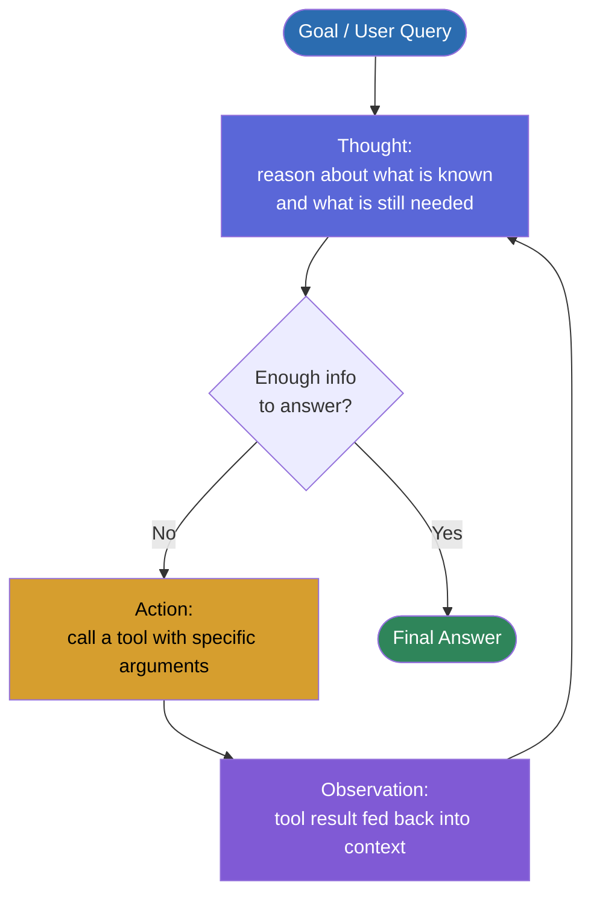
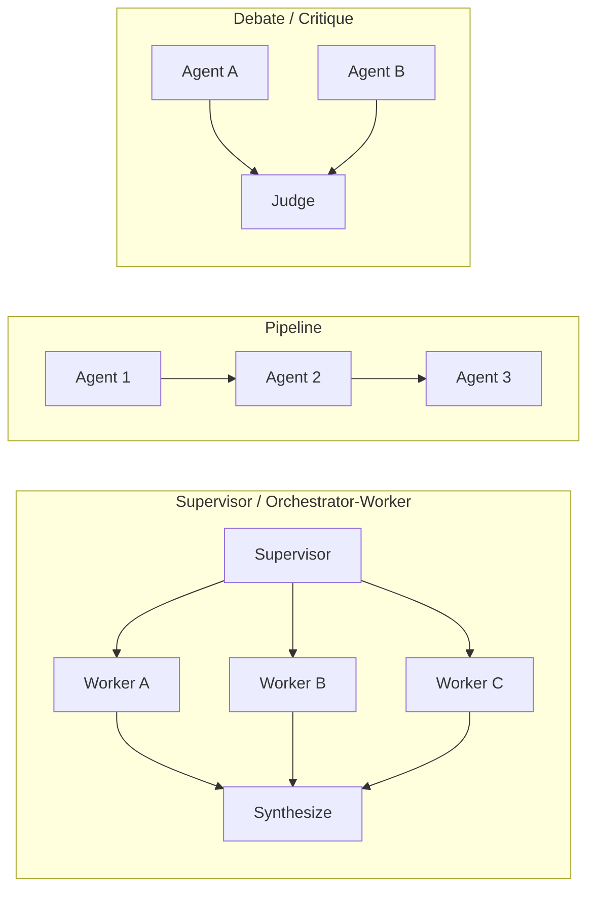

# Chapter 17: Agents & Multi-Agent Systems

*A single tool call answers one question. A loop that keeps calling tools until the goal is met is what turns an LLM into something that can actually get things done.*

## Learning Objectives

By the end of this chapter, you will be able to:

- Define an "agent" precisely, and explain exactly how it differs from a single tool call (Chapter 11) and from developer-scripted prompt chaining (Chapter 10)
- Explain the ReAct pattern (Reasoning + Acting) and trace a Thought → Action → Observation loop step by step for a real task
- Distinguish short-term memory (the context window) from long-term memory (external persistent storage) and explain why agents need both
- Compare pure ReAct planning against Plan-and-Execute planning, and choose the right one for a given task's uncertainty profile
- Describe three multi-agent orchestration topologies — Supervisor/Worker, Pipeline, and Debate/Critique — and know when each is worth its added cost
- Identify the major agent failure modes (infinite loops, tool misuse, compounding errors) and the concrete mitigations for each
- Sketch the architecture of a Research Agent as a lead-in to later capstone work

---

## Prerequisites for This Chapter

This chapter builds directly on two earlier chapters, and the jump from each is the entire point of this chapter:

- **[Chapter 11: Tool Calling & Structured Output](./11-tool-calling-and-structured-output.md)** gave the model access to functions it could call — but every example in that chapter was **one decision**: the model receives a prompt, decides to call `get_weather(city)` or not, gets a result back, and produces a final answer. One round trip. The developer's code, not the model, decided what happened after that.
- **[Chapter 16: RAG & Vector Databases](./16-rag-and-vector-databases.md)** treated retrieval as a **fixed step** wired into a pipeline: query comes in, retriever runs, chunks get stuffed into the prompt, model answers. The model never decided *whether* to retrieve, *when* to retrieve again, or *what else* it might need — the pipeline decided all of that at design time.

This chapter's entire contribution is one idea: **take that single decision, or that fixed pipeline, and put it inside a loop that the model itself controls.** Instead of the developer hard-coding "call the tool, then answer," the model decides, turn by turn, whether it has enough information yet, and if not, what to do next — including treating retrieval (Chapter 16) as just one tool among several it can choose to invoke. That shift from developer-controlled sequencing to model-controlled sequencing is what the word "agent" means in this course.

You should also be comfortable with the context window mechanics from **Chapter 7** (agent memory in Section 4 depends directly on context length limits) and the sampling/generation basics from **Chapter 9** (an agent is still just an LLM generating tokens — nothing about the underlying decoding process changes).

No new infrastructure is required to follow along conceptually. The Python examples in this chapter use plain pseudocode-style functions so you can see the control flow clearly; wiring them to a real framework is the subject of **Chapter 18**.

---

## 1. From Tool Call to Agent: Defining the Loop

### 1.1 Three points on the same spectrum

Software engineers often use "agent," "tool calling," and "chaining prompts" interchangeably. They are not the same thing, and the difference matters for how much autonomy — and how much risk — you're handing to the model. All three sit on one spectrum: **how much control does the developer retain over what happens next?**

```
Developer controls everything          Model controls everything
        │                                          │
        ▼                                          ▼
  Prompt Chaining  →  Single Tool Call  →  Agent (ReAct Loop)  →  Multi-Agent System
  (Ch 10)              (Ch 11)              (this chapter)         (this chapter, §6)
```

- **Prompt chaining (Chapter 10)**: the developer writes code that calls the LLM two, three, or ten times in a **fixed sequence** — "summarize this document, then translate the summary, then extract action items." The *order* of steps is decided in advance, at code-writing time, by a human. The model never decides "should I summarize again?" — it just does what the next line of code tells it to do.
- **Single tool call (Chapter 11)**: the developer gives the model a menu of tools and asks it one question. The model makes **one decision** — which tool (if any) to call, with what arguments — and the developer's code executes that tool and hands the result back for a final answer. It's dynamic in *which* tool gets picked, but it's still exactly one round trip.
- **Agent (this chapter)**: the developer gives the model a menu of tools and a goal, then **hands control of the loop itself to the model**. The model decides not just *which* tool to call, but *whether to call a tool at all*, *how many times*, *in what order*, and *when the goal is satisfied enough to stop*. Nobody wrote down in advance how many steps it would take — the model discovers that as it goes.
- **Multi-agent systems (Section 6)**: the same loop, but now multiple LLM instances each running their own loop, coordinating with each other.

### 1.2 A precise definition

> **An agent is an LLM wrapped in a loop, with access to tools, that decides for itself — turn by turn — what to do next, until it satisfies a goal or hits a stopping condition.**

Every clause in that sentence is load-bearing:

- **"wrapped in a loop"** — there is a `while` loop in the code, not a fixed number of LLM calls.
- **"access to tools"** — exactly the tool-calling mechanics from Chapter 11 (JSON schemas, function names, arguments); nothing new is invented here, it's *reused* inside the loop.
- **"decides for itself"** — the stopping condition and the next action are outputs of the model's own reasoning, not lines of developer code.
- **"until it satisfies a goal or hits a stopping condition"** — the loop needs an exit. Left unchecked, this is also the source of the most common agent failure mode (Section 7).

### 1.3 The minimal agent loop, in code

Stripped to its essence, an agent is remarkably small. Here is the entire control flow, with the tool-calling internals from Chapter 11 treated as a black box (`call_llm_with_tools` returns either a tool call request or a final answer):

```python
def run_agent(goal: str, tools: dict, max_steps: int = 10) -> str:
    conversation = [{"role": "user", "content": goal}]

    for step in range(max_steps):
        response = call_llm_with_tools(conversation, tools=tools)

        if response.type == "final_answer":
            return response.content                      # goal satisfied — exit loop

        # response.type == "tool_call"
        tool_result = tools[response.tool_name](**response.arguments)
        conversation.append({"role": "assistant", "content": response.raw})
        conversation.append({"role": "tool", "content": str(tool_result)})
        # loop back around — the MODEL decides what happens next, not this code

    return "Max steps reached without a final answer."     # stopping condition: iteration cap
```

Compare this to a Chapter 11 single tool call: there, this function would have no `for` loop at all — it would call the LLM once, execute at most one tool, call the LLM a second time for the final answer, and return. The `for step in range(max_steps)` line is the entire delta between "tool calling" and "agent." Everything else in this chapter is about what goes on *inside* that loop and what happens when it goes wrong.

---

## 2. The ReAct Pattern: Reasoning + Acting

### 2.1 The core idea, in plain language

If you hand an LLM a hard, multi-step question and just ask it to answer directly, it either fails or hallucinates a plausible-sounding but wrong answer, because it's trying to do everything — recall facts, reason, and produce a final answer — in one uninterrupted burst of generation with no chance to check its work against reality.

**ReAct** (introduced by Yao et al. in *"ReAct: Synergizing Reasoning and Acting in Language Models,"* 2022) fixes this by interleaving two things the model is good at, one step at a time:

- **Reasoning** — thinking in natural language about what it knows, what it's missing, and what to do next.
- **Acting** — taking a concrete action in the world (almost always a tool call) to get new information.

Instead of "think everything through, then act," the model does "think a little, act a little, observe what happened, think again" — repeatedly. This is much closer to how a human expert actually solves an unfamiliar problem: you don't plan every step of debugging a production incident in advance; you look at one log line, form a hypothesis, check it, and adjust based on what you find.

### 2.2 The three-part cycle

Each iteration of the loop produces three named parts:

| Part | What it is | Who/what produces it |
|---|---|---|
| **Thought** | The model's reasoning, in natural language, about the current state and what to do next | The LLM (as generated text, often inside `<thinking>` tags or a `"thought"` field) |
| **Action** | A concrete step the model decides to take — almost always a tool call with specific arguments | The LLM decides it; the surrounding code (Chapter 11 mechanics) executes it |
| **Observation** | The real-world result of that action — a search result, an API response, an error message | The tool/environment, fed back into the model's context |

The loop repeats: `Thought → Action → Observation → Thought → Action → Observation → ...` until a Thought concludes "I now have enough information to answer" and the model emits a final answer instead of another action.

### 2.3 Why interleaving beats upfront reasoning

The crucial property is that **each Thought is conditioned on the latest Observation** — the model gets to update its beliefs based on real information from the outside world before deciding what to do next, rather than committing to a full plan while still ignorant of how step 1 will turn out. If a web search comes back empty, the model can see that in the Observation and try a different query on the very next Thought — it doesn't have to have anticipated that failure mode in advance. This is the property that makes ReAct *adaptive*, and it's also exactly the property that pure upfront planning (Section 5) lacks.

### 2.4 The ReAct loop as a diagram



Notice the shape: it is a **cycle**, not a straight line. The number of times the loop turns is not fixed in advance — it's determined dynamically by how many Thought/Action/Observation cycles it actually takes to gather enough information, which is precisely what distinguishes this from the fixed-length pipelines of Chapter 10.

---

## 3. Worked Example: A Full ReAct Trace

Let's make Section 2 completely concrete with a real multi-hop question — one that cannot be answered from a single tool call because the second piece of information needed depends on the result of the first.

**Task given to the agent:** *"What was the weather in the city where the 2024 Olympics opening ceremony was held?"*

**Tools available to the agent:**
- `search(query: str) -> str` — a general web search tool
- `get_weather(city: str, date: str) -> str` — a weather lookup tool

Here is the full trace, turn by turn, exactly as it would appear in the agent's growing context window:

```
User: What was the weather in the city where the 2024 Olympics
      opening ceremony was held?

──────────────────────────────────────────────────────────────
Turn 1
Thought: I don't know off the top of my head which city hosted
         the 2024 Olympics opening ceremony. I need to look that
         up before I can check the weather. I'll search for it.
Action: search(query="2024 Olympics opening ceremony host city")
Observation: "The 2024 Summer Olympics opening ceremony was held
              on July 26, 2024, along the Seine river in Paris,
              France — the first opening ceremony in Olympic
              history not held inside a stadium."

──────────────────────────────────────────────────────────────
Turn 2
Thought: Good — the city is Paris, and the ceremony date was
         July 26, 2024. Now I have what I need to look up the
         weather for that specific city and date.
Action: get_weather(city="Paris", date="2024-07-26")
Observation: "Paris, France — July 26, 2024: partly cloudy,
              high of 26°C (79°F), scattered evening showers,
              light wind from the northwest."

──────────────────────────────────────────────────────────────
Turn 3
Thought: I now have both pieces of information the user asked
         for — the host city (Paris) and the weather on the
         relevant date. I can answer directly; no further
         actions are needed.
Final Answer: The 2024 Olympics opening ceremony was held in
              Paris, France on July 26, 2024. The weather that
              day was partly cloudy with a high of 26°C (79°F)
              and scattered evening showers.
```

### 3.1 Why this needed a loop, not one tool call

Look at what happened structurally: the second tool call's *argument* (`city="Paris"`) did not exist anywhere until the first tool call's *result* produced it. A single Chapter-11-style tool call can't do this — the model would have to guess a city name with zero information, or the developer would have had to hard-code "always search first, then always check weather," which breaks the moment a future question has a different shape (e.g., one that needs three lookups, or zero). The loop is what let the model discover, *after seeing Turn 1's Observation*, that it needed exactly one more step — and then discover, *after seeing Turn 2's Observation*, that it needed zero more.

### 3.2 What the stopping condition looked like here

The model itself recognized, in Turn 3's Thought, that both slots of the original question ("which city" and "what weather") were now filled — that recognition, not a step counter or a developer-written rule, is what ended the loop. This is the normal, healthy way an agent loop ends. Section 7 covers what it looks like when that recognition never fires.

---

## 4. Agent Memory: Short-Term vs. Long-Term

An agent that runs for many turns, or across many separate sessions, needs somewhere to keep what it has learned. There are two fundamentally different kinds of memory an agent uses, and confusing them is a common design mistake.

### 4.1 Short-term memory: the context window itself

The simplest and most obvious form of agent memory is **the conversation history in the context window** — every Thought, Action, and Observation from Section 3's trace, sitting in the prompt, visible to the model on every subsequent turn. This is exactly the context window mechanics from **Chapter 7**: it has a hard token limit, and every turn of the loop consumes more of it (the tool results from Turns 1 and 2 in Section 3 are still present when the model generates Turn 3).

This works fine for short tasks. It breaks down for long ones:

- A research agent that runs 40 search-and-read cycles will eventually push its earliest observations out of the context window (or run out of budget/latency tolerance well before that), effectively "forgetting" what it found early on.
- An agent that needs to resume a task tomorrow, in a brand-new API call with an empty context window, has no way to know anything happened yesterday — the conversation history from the previous session simply isn't there anymore.

### 4.2 Long-term memory: external, persistent storage

**Long-term memory** solves both problems by moving important information *out* of the context window into external storage — a vector database (Chapter 16), a structured key-value store, or even a plain file/database row — and retrieving only the relevant slice of it back into context when needed, rather than trying to keep everything in the window at once.

```
┌─────────────────────────────────────────────────────────┐
│                    Short-Term Memory                     │
│         (current context window — Chapter 7)             │
│   Thought → Action → Observation → Thought → Action ...  │
│   Bounded by max context length. Gone when the           │
│   session/conversation ends.                              │
└───────────────────────┬───────────────────────────────────┘
                         │  "this seems worth keeping"
                         ▼
┌─────────────────────────────────────────────────────────┐
│                    Long-Term Memory                       │
│   Vector DB (Chapter 16) or structured key-value store    │
│   Persists across sessions. Retrieved back into the       │
│   context window only when relevant to the current task.  │
└─────────────────────────────────────────────────────────┘
```

Concretely, a long-running research agent might, after finishing a subtask, write a short summary of what it learned into a vector store ("user's company uses vLLM for inference, prefers cost-optimized answers"). Next week, in a brand-new session with an empty context window, the agent's first move can be a retrieval query against that store — using exactly the retrieval mechanics from Chapter 16 — pulling back only the handful of memories relevant to the new task, rather than re-discovering everything from scratch or trying to have kept the entire history in context the whole time.

### 4.3 Why this matters specifically for agents

Single tool calls (Chapter 11) and RAG pipelines (Chapter 16) rarely need long-term memory of this kind — they're typically one-shot, stateless interactions. Agents need it because they're explicitly designed to operate over **long time horizons**: many turns within one session (where short-term memory alone will eventually overflow the context window) and, increasingly, **many sessions** (where short-term memory doesn't survive at all between calls). Long-term memory is what lets an agent behave less like a fresh employee with amnesia every morning and more like a colleague who remembers the project history.

---

## 5. Planning Approaches: ReAct vs. Plan-and-Execute

Section 2's ReAct loop decides its next action **one step at a time**, always conditioned on the latest observation. That's not the only way to structure an agent's decision-making. The alternative is to have the model produce a **plan up front**, then execute it.

### 5.1 Pure ReAct: decide-as-you-go

This is exactly Section 2 and Section 3: at each turn, the model looks at everything so far and decides the single next action. There is no separate "planning" phase — planning and acting are the same loop.

- **Strength**: maximally adaptive. If Turn 1's search comes back with an unexpected result (say, ambiguous host-city information, or a tool error), the very next Thought can react to that immediately.
- **Weakness**: because the model never commits to a multi-step plan, it can **meander** — take a redundant action, second-guess a decision it already made, or wander down an unproductive line of investigation, especially on tasks that would have benefited from a moment of upfront structure.

### 5.2 Plan-and-Execute: plan first, then run the plan

Here, the model (or a dedicated "planner" call) first produces an explicit multi-step plan — a numbered list of subtasks — *before* any tool is called. An "executor" then works through the plan step by step, calling tools as needed. If a step fails or produces a surprising result, the system can trigger **re-planning**: going back to the planner with the new information to revise the remaining steps.

```
Plan-and-Execute:

  1. Planner:  "Step 1: find the host city.
                Step 2: look up the weather for that city/date.
                Step 3: compose the final answer."
  2. Executor: runs Step 1 → gets Paris
  3. Executor: runs Step 2 → gets weather data
  4. Executor: runs Step 3 → produces final answer

  (If Step 2 had failed — e.g., weather API down for that date —
   the executor would return to the Planner to revise the plan,
   rather than silently retrying forever.)
```

- **Strength**: for tasks whose structure is well understood in advance (a fixed checklist, a known number of steps), producing the plan once is more **token- and latency-efficient** than re-reasoning "what should I do next?" from scratch on every single turn — you pay the planning cost once instead of on every iteration.
- **Weakness**: it's **brittle to surprises**. A plan built on an assumption that turns out wrong (e.g., the plan assumed "search will return exactly one city" but it returns three candidates) can leave the executor stuck trying to force an outdated plan onto new reality, unless re-planning is explicitly built in — and re-planning adds back much of the complexity Plan-and-Execute was trying to avoid.

### 5.3 Choosing between them

| Dimension | Pure ReAct | Plan-and-Execute |
|---|---|---|
| Task structure | Unclear, exploratory, likely to surprise | Well-understood, checklist-like |
| Adaptivity to surprises | High — reacts every turn | Lower — needs explicit re-planning |
| Token/latency efficiency | Lower — reasons every turn | Higher — plans once, executes many steps |
| Risk of meandering | Higher on long/ambiguous tasks | Lower, but risk of brittleness instead |
| Good fit | The Section 3 Olympics-weather example; open-ended research | "Refactor these 5 files in this exact order"; known ETL-style workflows |

In practice, many production agent frameworks (previewed here, covered in depth in **Chapter 18**) blend the two: produce a rough upfront plan for efficiency and structure, but treat each plan step as its own small ReAct loop so the agent can still adapt within a step without needing a full re-plan every time something unexpected happens.

---

## 6. Multi-Agent Orchestration Patterns

A single agent loop, no matter how well designed, has a ceiling: one model juggling one context window trying to be researcher, critic, and writer all at once tends to produce mediocre results at each role compared to a model focused on just one. **Multi-agent systems** split the work across multiple LLM instances (often the same underlying model, invoked with different system prompts, tools, and context), each specialized for part of the problem. There are three orchestration topologies worth knowing by name.

### 6.1 Supervisor / Orchestrator-Worker

One "manager" agent receives the overall goal, breaks it into subtasks, **delegates** each subtask to a specialized "worker" agent (each with its own tools and narrower focus), and then **synthesizes** the workers' results into a final answer.

```
User Goal → Supervisor Agent
                 ├── delegates → Worker Agent A (e.g., "Code Search Specialist")
                 ├── delegates → Worker Agent B (e.g., "Docs/RAG Specialist")
                 └── delegates → Worker Agent C (e.g., "Calculator/Data Specialist")
            Supervisor synthesizes A + B + C results → Final Answer
```

This mirrors an engineering-manager-and-ICs structure you already know from org charts: the supervisor doesn't do the low-level work itself, it decides *who* should do *what* and stitches the results together.

### 6.2 Pipeline

Agents run in a **fixed sequence**, each one transforming the previous agent's output before handing it to the next. There's no delegation or back-and-forth — it's a straight line.

```
Draft Agent  →  Fact-Check Agent  →  Style/Tone Agent  →  Final Output
(writes v1)     (flags errors)       (polishes prose)
```

This is structurally the closest of the three to the prompt chaining you already know from Chapter 10 — the difference is that each stage here is a full agent (potentially with its own tools and its own internal ReAct loop) rather than a single LLM call.

### 6.3 Debate / Critique

Multiple agents produce **independent** answers to the same question, or one agent produces an answer while another is explicitly tasked with critiquing it, catching errors that a single pass — even a careful one — would likely miss. A final round reconciles the disagreement into one answer.

```
      ┌──────────────┐        ┌──────────────┐
      │  Agent A      │        │  Agent B      │
      │ (independent  │        │ (independent  │
      │  answer #1)   │        │  answer #2)   │
      └──────┬────────┘        └──────┬────────┘
             │                        │
             └───────────┬────────────┘
                          ▼
                 Critique/Judge Agent
              (compares, flags conflicts,
               produces reconciled answer)
```

This works because LLM errors are often **not perfectly correlated** across independent generations — a mistake one pass makes with high confidence, a second independent pass (or a dedicated critic prompted specifically to look for flaws) frequently catches, in the same spirit as code review catching bugs the original author was blind to.

### 6.4 Comparing the three topologies



### 6.5 When is the added complexity worth it?

Every one of these patterns costs more latency and more tokens (and therefore more money) than a single agent, because you're running multiple LLM loops instead of one. That cost is worth paying when:

- **Supervisor/Worker** is worth it when subtasks genuinely need *different* tools, context, or specialization (e.g., one worker needs codebase search tools, another needs a completely different domain's data) such that one agent trying to hold all of it in a single context/tool set would be worse at each part.
- **Pipeline** is worth it when the stages are genuinely sequential and each benefits from a narrow, focused prompt (a fact-checking agent that only fact-checks is more reliable at fact-checking than one agent trying to draft *and* fact-check *and* polish simultaneously).
- **Debate/Critique** is worth it specifically for **high-stakes correctness** tasks — code that will ship, numbers that will appear in a report, medical or legal content — where the cost of an undetected error outweighs the cost of a second independent pass.

If a single well-designed ReAct agent (Section 2) with good tools already solves the task reliably, adding any of these patterns is pure overhead — multi-agent systems are a response to a specific need (specialization, sequential structure, or error-catching), not a default upgrade.

---

## 7. Agent Failure Modes

Handing control of the loop to the model (Section 1) is exactly what makes agents powerful, and exactly what makes them fail in ways a single tool call never could. Four failure modes show up constantly in practice.

### 7.1 Infinite loops

The agent keeps taking actions — searching, re-searching, calling the same tool with slightly different arguments — without ever converging on "I have enough information now." This happens when the model can't tell the difference between "I made progress but haven't found the final answer yet" and "I am not making progress and should try a different approach or give up."

**Mitigation**: a hard **max iteration limit** (exactly the `max_steps` parameter in Section 1.3's code) is the non-negotiable backstop — every production agent loop needs one. Beyond that, prompting the model to explicitly track "what have I already tried and confirmed does NOT work" in its Thoughts helps it recognize when it's repeating itself rather than progressing.

### 7.2 Tool misuse

The model calls a real tool with **wrong or hallucinated arguments** — a malformed date, a city name that doesn't exist, a SQL query referencing a column that isn't in the schema. Unlike a plain hallucinated *answer* (which a human reading the final text might catch), a hallucinated tool *argument* gets executed against a real system, which can silently return a wrong-but-plausible-looking result, or throw an error the model then has to correctly interpret.

**Mitigation**: strict argument **validation** at the tool-execution layer (reject and return a clear error rather than silently proceeding with a bad argument — the JSON-schema validation mechanics from Chapter 11 are the first line of defense here), plus a **verification step** for consequential actions — e.g., have the agent (or a second agent, per Section 6.3) confirm a generated SQL query's logic before it's actually run against production data.

### 7.3 Compounding errors across many hops

In a long agent run, a small mistake made early — a slightly wrong fact retrieved in Turn 2, a subtly mis-parsed number — doesn't stay contained. Every subsequent Thought treats it as established fact and reasons further on top of it, and the further the run goes, the more downstream conclusions depend on that one bad foundation. By Turn 15, untangling "where did this go wrong" requires reading back through fourteen turns of context that all *look* locally reasonable.

**Mitigation**: keep agent runs as **short as the task allows** (fewer hops means less surface area for an early error to compound across); insert periodic **self-verification** Thoughts ("does this intermediate conclusion still look consistent with everything I've gathered?"); and for genuinely high-stakes runs, add **human-in-the-loop checkpoints** at key junctures rather than letting the agent run unsupervised end-to-end.

### 7.4 Practical mitigations, summarized

| Failure mode | Concrete mitigation |
|---|---|
| Infinite loops | Hard `max_steps` iteration cap; prompt the model to track what it's already tried |
| Tool misuse | Strict schema/argument validation (Chapter 11); verification step before consequential actions |
| Compounding errors | Shorter runs where possible; periodic self-verification Thoughts; human-in-the-loop checkpoints at key decision points |
| (General) | Log every Thought/Action/Observation for post-hoc debugging — an agent trace is your only window into *why* it did what it did |

---

## 8. Project Framing: Sketching a Research Agent

To tie every section above together, consider the shape of a **Research Agent** — take a broad question, gather information from multiple sources, and produce a structured written report. This is deliberately the project previewed in the course roadmap for this phase, and it's a natural lead-in to the capstone material in later chapters.

### 8.1 The three tools it needs

- **`web_search(query: str) -> list[SearchResult]`** — the primary information-gathering tool; the agent will call this repeatedly, in a ReAct loop (Section 2), refining its query based on each Observation.
- **`scratchpad_note(content: str) -> None`** / **`scratchpad_read() -> list[str]`** — a simple append-only long-term-memory tool (Section 4) where the agent writes down facts, quotes, and source URLs as it finds them, rather than relying on everything staying visible in the context window across a long research session. This is exactly what protects the agent from the short-term-memory overflow problem in Section 4.1.
- **`write_final_report(sections: dict) -> str`** — a distinct final step, deliberately separated from the search-and-note-taking loop, whose job is to read everything accumulated in the scratchpad and compose it into a structured, well-organized report rather than a stream-of-consciousness answer.

### 8.2 Why the scratchpad step matters architecturally

Without a scratchpad, a long research run risks exactly the Section 4.1 problem: early findings get pushed out of context by the time the agent has run ten more search cycles, and the final report either forgets them or has to re-search for them redundantly. By explicitly writing notes out to persistent storage as it goes and reading them back in at report-writing time, the agent decouples "how much can I hold in context right now" from "how much have I actually learned in this session" — the same insight as Section 4.2's vector-store example, just scoped to a single long session rather than across multiple sessions.

### 8.3 The overall shape

```
                 ┌─────────────────────────────────────────┐
                 │           ReAct Research Loop             │
                 │                                            │
   Goal ────────►│  Thought → web_search → Observation       │
                 │      │                                      │
                 │      ▼                                      │
                 │  scratchpad_note(finding)                   │
                 │      │                                      │
                 │      └──► loop until "enough coverage"      │
                 └───────────────────┬─────────────────────────┘
                                     ▼
                          write_final_report(scratchpad_read())
                                     ▼
                              Structured Report
```

This is Plan-and-Execute-flavored at the top level (there's a clear final "write the report" step that's distinct from the research loop) but pure ReAct *within* the research loop itself (the agent decides, turn by turn, what to search next based on what it's already found) — exactly the blend described at the end of Section 5.3. You'll build a fuller version of this, wired to a real agent framework, once Chapter 18 introduces the tooling to do it properly.

---

## Real-World Scenario

**Scenario:** A team builds a customer-support agent for a SaaS product. It's given three tools: `search_knowledge_base(query)`, `look_up_account(email)`, and `create_support_ticket(summary, priority)`. It runs as a pure ReAct loop with no iteration cap ("we'll add that later") and no verification before ticket creation ("the model is smart enough").

In week one, a customer asks a genuinely ambiguous question about billing. The agent's Thought concludes it needs account details, calls `look_up_account`, gets back a customer record with two subscriptions on it, and — with no clear way to decide which subscription the question refers to — starts alternating between searching the knowledge base for "multi-subscription billing" and re-checking the account lookup with slightly different arguments, over and over, never quite convincing itself it has enough information to answer. Twenty-three turns later, it's still going, burning tokens on every turn, until it happens to hit an unrelated hardcoded timeout in the surrounding infrastructure.

In week two, a different bug: the agent misreads a customer's message and calls `create_support_ticket(summary="Cancel my account", priority="urgent")` for a customer who was actually asking a *billing question*, not requesting cancellation — a hallucinated argument (Section 7.2) that gets executed against the real ticketing system, and a human agent spends fifteen minutes on the phone confused about why a ticket says "cancel" when the customer never asked for that.

**The fix**, mapping directly onto Section 7's mitigations: the team adds a `max_steps=8` cap so an unproductive loop fails fast and visibly instead of silently spinning; adds a lightweight verification step before `create_support_ticket` specifically ("re-state, in one sentence, what the customer is asking for, and confirm the ticket summary matches it, before actually calling the tool"); and adds a human-in-the-loop review queue for any ticket marked "urgent" before it's actually created. None of these fixes required a smarter model — they required designing for the failure modes that autonomy inherently introduces, which single-tool-call systems (Chapter 11) never had to worry about because they never had enough turns to spin out of control in the first place.

---

## Best Practices

- **Always set a hard iteration cap.** Every agent loop needs a `max_steps` (or equivalent token/time budget) with graceful behavior when it's hit — fail visibly with a partial-progress summary, never spin silently.
- **Validate every tool argument at the execution boundary**, not just at the prompt level — treat every tool call the same way you'd treat untrusted user input to an API, because that's exactly what it is.
- **Log the full Thought/Action/Observation trace** for every run. When an agent produces a wrong final answer, the trace is the only way to find out *which* turn introduced the error — treat it like a distributed trace/log for debugging, not an afterthought.
- **Match the planning style to the task's uncertainty** (Section 5): use Plan-and-Execute for well-understood, checklist-like workflows, and pure ReAct for exploratory or unpredictable tasks. Don't default to one for everything.
- **Add verification steps before consequential actions** — sending an email, creating a ticket, executing a database write — even if the model is usually right; "usually right" is not good enough once an action has an irreversible real-world effect.
- **Use long-term memory deliberately, not everywhere.** Persist facts that need to survive beyond the current context window or session (Section 4); don't reflexively write everything to a vector store, or retrieval-time noise starts crowding out the memories that actually matter.
- **Reach for multi-agent patterns (Section 6) only when a single well-tooled agent has a demonstrated gap** — specialization, strict sequencing, or correctness-critical double-checking — not as a default architecture, since every additional agent multiplies latency and cost.
- **Add human-in-the-loop checkpoints for irreversible or high-stakes actions**, scaled to the blast radius of a mistake — a wrong research summary is cheap to fix after the fact; a wrongly cancelled account is not.

---

## Common Mistakes

- **No iteration limit.** The single most common production incident with agents: an unbounded loop that keeps calling tools, burning tokens and money, because nothing forces it to stop.
- **Confusing a single tool call with an agent.** Wiring up one function and one round trip (Chapter 11) and calling it "an agent" in your architecture diagram — the loop, and the model's control over it, is the entire definition; without it, you have tool calling, not agentic behavior.
- **Trusting tool arguments without validation.** Passing model-generated arguments straight into a real system call (a SQL query, an API request, a file write) without any schema or sanity check, on the assumption that a capable model "wouldn't make that mistake" — it will, eventually, and the blast radius scales with how consequential the tool is.
- **Treating the context window as durable storage.** Relying on "it's earlier in this same conversation" as your only memory strategy for a long-running or multi-session agent, then being surprised when early findings silently fall out of context (Section 4.1) with no error message to warn you.
- **Reaching for multi-agent complexity by default.** Standing up a Supervisor/Worker system for a task a single well-tooled ReAct agent would have handled just as well, paying multiple agents' worth of latency and token cost for no measurable quality gain.
- **Ignoring compounding errors until the final answer is already wrong.** Only checking correctness at the very end of a long run, instead of building in periodic self-verification, so that by the time something looks off, it's unclear which of fifteen prior turns actually caused it.
- **Skipping human review on irreversible actions "because the demo worked."** A model that behaved correctly in ten test runs will eventually misfire on the eleventh — irreversible actions (deleting data, sending customer-facing messages, financial transactions) need a checkpoint regardless of how good the demo looked.

---

## Summary

- An **agent** is an LLM wrapped in a loop with tool access that decides, turn by turn, what to do next — contrasted with a single tool call (Chapter 11, one decision) and prompt chaining (Chapter 10, a developer-fixed sequence).
- **ReAct** (Yao et al., 2022) structures that loop as a repeating **Thought → Action → Observation** cycle, letting the model interleave reasoning with real-world information gathering instead of planning everything upfront in one uninterrupted burst.
- Agents need **short-term memory** (the context window, bounded by Chapter 7's context-length limits) and, for long-running or multi-session tasks, **long-term memory** (external storage like a vector database from Chapter 16 or a structured key-value store) that gets retrieved back into context when relevant.
- **Pure ReAct** (decide-as-you-go) is more adaptive to surprises but can meander; **Plan-and-Execute** (plan upfront, then execute, re-planning on failure) is more efficient for well-understood tasks but brittle when reality doesn't match the plan.
- Three multi-agent topologies solve different problems: **Supervisor/Worker** for specialized delegation, **Pipeline** for fixed sequential transformation, and **Debate/Critique** for catching errors a single pass would miss — each adds latency/cost and is worth it only when a single agent has a demonstrated gap.
- The major **failure modes** are infinite loops, tool misuse, and compounding errors across many hops — mitigated respectively by hard iteration caps, argument validation and verification steps, and shorter runs plus human-in-the-loop checkpoints.
- A **Research Agent** (web search + scratchpad long-term memory + a distinct final-report-writing step) is a concrete architecture that combines nearly every concept in this chapter, and is a direct lead-in to the frameworks covered in Chapter 18.

---

## Knowledge Check

1. A colleague says, "We already have tool calling in our app, so we already have an agent." Explain precisely why that statement is wrong, using the definition from Section 1.2.
2. Walk through the Section 3 worked example and identify: which turn's Observation made a second tool call *possible* that wasn't possible before it? What would have happened if the agent had tried to call `get_weather` in Turn 1 instead?
3. Explain, in your own words, why a research agent that runs for 50 turns needs a scratchpad (long-term memory) even though it never leaves a single conversation/session. What specifically about short-term memory (Section 4.1) makes this necessary?
4. You're building an agent to migrate a codebase's import statements according to a known, fixed set of rules across exactly 12 files. Would you reach for pure ReAct or Plan-and-Execute, and why? Now consider an agent whose job is "investigate why production error rates spiked last night" — would your answer change, and why?
5. A Debate/Critique multi-agent setup roughly doubles (or more) the token cost of answering a question compared to a single agent. Describe a concrete scenario where that cost is clearly worth paying, and one where it clearly isn't.
6. List the three failure modes from Section 7 and, for each, describe a mitigation *other* than the one given as the primary example in this chapter (i.e., think of a second valid mitigation for each).

---

## Hands-On Exercise

**Design a Research Agent architecture** (on paper/in a design doc — no code required, though you're welcome to prototype it) that answers open-ended questions like *"Compare the trade-offs of vLLM, TGI, and TensorRT-LLM for a mid-size inference deployment"* by researching multiple sources and producing a structured report.

Your design must specify:

1. **Tools**: define the exact function signatures for at least a web-search tool, a scratchpad note-taking tool (both write and read), and a final-report-writing tool/step. For each, specify what arguments it takes and what it returns.
2. **The loop structure**: sketch (as a diagram or pseudocode, following Section 1.3's style) how the main ReAct loop decides when to keep searching versus when to stop and move to report-writing. What signal, specifically, tells the agent "I have enough coverage now"?
3. **Memory strategy**: justify why the scratchpad is necessary here (Section 8.2) rather than relying purely on the context window, and describe what a single scratchpad entry should contain (just a URL? A quote? A summary with a source citation?) so the final-report step can produce a well-cited report.
4. **Failure-mode guardrails**: specify a concrete `max_steps` value and justify your choice; describe one verification step you'd add before the final report is returned to the user (e.g., checking that every claim in the report has at least one cited source from the scratchpad).
5. **Stretch goal**: redesign this as a two-agent Supervisor/Worker system, with one "Search Worker" agent per sub-topic (e.g., one worker researching vLLM, one researching TGI, one researching TensorRT-LLM) and a Supervisor that synthesizes their reports. Under what conditions (Section 6.5) would this redesign actually be worth its added cost over the single-agent version from steps 1-4?

---

## Further Reading

- Yao, Shunyu, et al. *"ReAct: Synergizing Reasoning and Acting in Language Models"* (2022) — the foundational paper defining the Thought/Action/Observation loop this chapter is built around
- Wei, Jason, et al. *"Chain-of-Thought Prompting Elicits Reasoning in Large Language Models"* (2022) — the reasoning-focused precursor that ReAct extends with acting
- Wang, Lei, et al. *"Plan-and-Solve Prompting"* (2023) — a representative upfront-planning approach, useful as a concrete contrast to ReAct's decide-as-you-go style
- Shinn, Noah, et al. *"Reflexion: Language Agents with Verbal Reinforcement Learning"* (2023) — self-critique and self-verification mechanisms directly relevant to Section 7's compounding-error mitigation
- [LangGraph documentation](https://langchain-ai.github.io/langgraph/) — production-grade primitives for building ReAct loops, Plan-and-Execute agents, and multi-agent graphs (covered in depth in Chapter 18)
- [Anthropic: "Building Effective Agents"](https://www.anthropic.com/research/building-effective-agents) — a practical engineering-focused treatment of when to use agents vs. simpler workflows, and the orchestration patterns in Section 6
- Wu, Qingyun, et al. *"AutoGen: Enabling Next-Gen LLM Applications via Multi-Agent Conversation"* (2023) — a framework and paper covering Supervisor/Worker and Debate-style multi-agent conversation patterns in practice
- [OpenAI: "A Practical Guide to Building Agents"](https://cdn.openai.com/business-guides-and-resources/a-practical-guide-to-building-agents.pdf) — practitioner-oriented guidance on tool design, guardrails, and failure modes covered in Section 7

---

<div style="display:flex;justify-content:space-between;align-items:center;">
  <a href="./16-rag-and-vector-databases.md">← Previous: RAG & Vector Databases</a>
  <a href="./00-index.md">🏠 Index</a>
  <a href="./18-mcp-and-agent-frameworks.md">Next: MCP, LangGraph & Agent Frameworks →</a>
</div>
