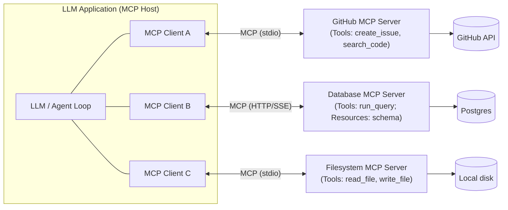
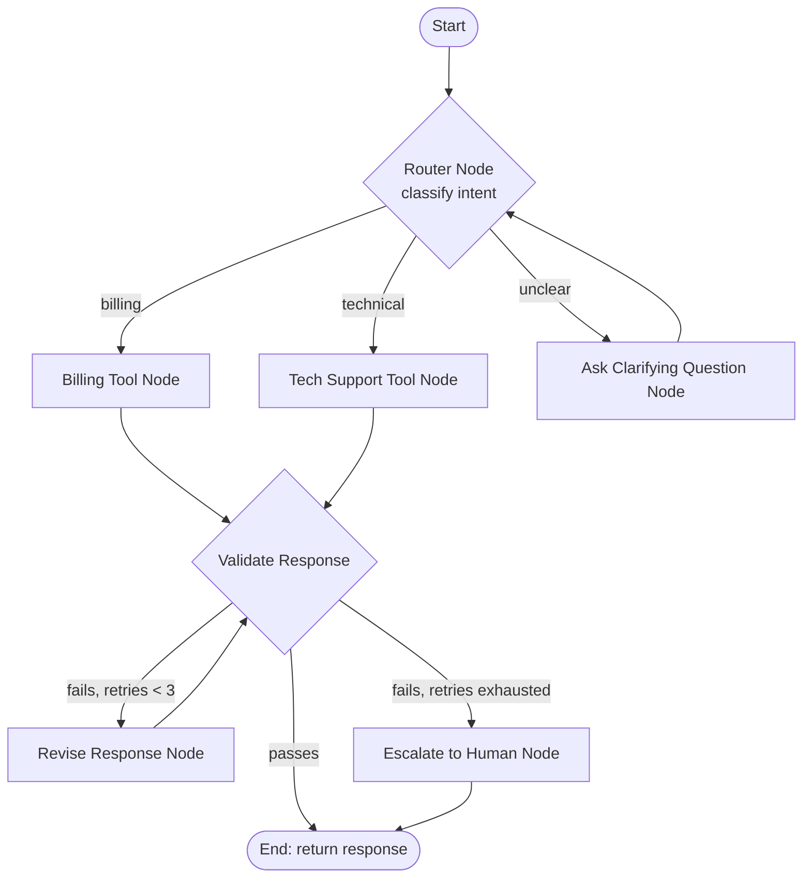
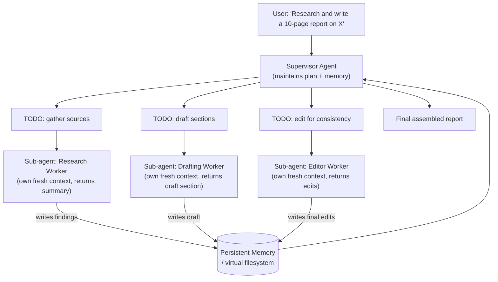

# Chapter 18: MCP, LangGraph & Agent Frameworks

*Chapter 17 gave you the loop an agent runs inside. This chapter gives you the standards and frameworks that let you build, wire up, and scale that loop without reinventing plumbing for every model, every tool, and every workflow shape.*

## Learning Objectives

By the end of this chapter, you will be able to:

- Explain the N×M integration problem that motivated the Model Context Protocol (MCP), and why a standard client-server interface solves it
- Describe MCP's architecture and its three core primitives — Tools, Resources, and Prompts — and write a minimal MCP server exposing each
- Explain why graph-based control flow (nodes, edges, conditional routing, cycles, parallel branches) generalizes the linear ReAct loop for real-world agent workflows
- Build a small LangGraph graph with a router node, conditional edges, and a shared state object
- Explain the DeepAgents pattern — planning, persistent memory, and sub-agent spawning — and why it suits long-horizon tasks better than a flat loop
- Compare a hand-rolled tool-calling loop, LangChain, LangGraph, and MCP-based tool ecosystems, and choose correctly among them for a given system
- Explain how LangGraph checkpointing and MCP resources relate to the short-term/long-term memory concepts from Chapter 17
- Identify common integration mistakes when combining these frameworks (over-abstraction, state bloat, unbounded sub-agent spawning) and how to avoid them

---

## Prerequisites for This Chapter

This chapter builds directly on **Chapter 17: Agents & Multi-Agent Systems**, where you learned:

- The **ReAct loop** — think, act (call a tool), observe the result, repeat — as the basic control structure of an autonomous agent
- **Agent memory**, split conceptually into **short-term memory** (the running conversation/scratchpad within one task) and **long-term memory** (facts, summaries, or embeddings persisted across sessions)
- **Multi-agent orchestration patterns**, in particular the **supervisor/worker pattern**, where a coordinating agent delegates sub-tasks to specialized worker agents and assembles their results

Chapter 17 answered "what shape of loop should an agent run, and how should multiple agents divide labor?" This chapter answers a different question: **what do you actually build that loop and that division of labor** *with*, in production, without writing brittle one-off glue code for every tool and every model you swap in? Two answers dominate the current landscape — MCP for tool/data access, and LangGraph for control flow — and this chapter treats both, plus the DeepAgents pattern that combines them for long-horizon work.

No new setup is required to read this chapter. The code examples use Python; if you want to run them, `pip install mcp langgraph langchain-core` is enough for the snippets shown.

---

## 1. The Integration Problem: Why Every Tool Needs Custom Glue Code

### 1.1 The problem, without any protocol names yet

Imagine you're building an LLM application that needs to read from a Postgres database, search GitHub issues, and read/write files on disk. For each of those three tools, you write:

- A function that calls the underlying API/database driver
- A JSON schema describing the function's parameters, so the model can call it
- Error handling and result formatting specific to that tool
- Auth/credential wiring specific to that tool

That's manageable for one application. Now suppose your company has five LLM applications — a Slack bot, a CLI assistant, an internal dashboard copilot, a customer support agent, and a code review bot — and each of them wants access to some subset of that same set of tools (database, GitHub, filesystem, plus a ticketing system and a search API). Without a standard, **every application re-implements its own version of every tool it needs**, because the glue code lives inside the application, tied to that application's specific model client and prompt format.

Now flip it: suppose you switch your primary model from one vendor's API to another's, or you want the same GitHub tool to work whether it's called by Claude, GPT-4, or a local Llama model. Each model/client has its own function-calling conventions, so the adapter code has to be rewritten again on the *other* side.

This is the **N×M integration problem**: N applications (or models) × M tools/data sources means, in the worst case, N×M pieces of custom integration code. Add a new tool, and every application needs new glue. Add a new application, and it needs glue for every tool it wants.

```
Without a standard:

  App 1 (Claude)  ──custom──▶ Database
  App 1 (Claude)  ──custom──▶ GitHub
  App 1 (Claude)  ──custom──▶ Filesystem
  App 2 (GPT-4)   ──custom──▶ Database     (rewritten, different conventions)
  App 2 (GPT-4)   ──custom──▶ GitHub       (rewritten, different conventions)
  App 3 (Llama)   ──custom──▶ Filesystem   (rewritten again)
  ...                                       N×M custom integrations
```

### 1.2 The analogy: a common port, not a custom cable for every device

You've solved a structurally identical problem before, just in hardware and web APIs:

- Before **USB**, every peripheral (printer, mouse, scanner) needed its own cable and its own port on your computer. USB-C didn't make devices smarter; it defined **one physical and electrical interface** that any compliant device and any compliant host could both implement once, and then any USB-C device works with any USB-C host.
- Before **REST/HTTP standardized web APIs**, integrating two systems meant reading bespoke documentation and writing bespoke clients for each one. A shared interface convention (HTTP verbs, status codes, JSON bodies) meant a generic HTTP client library could talk to *any* REST API, and any REST API could be consumed by *any* HTTP-capable client.

**MCP (Model Context Protocol)**, introduced by Anthropic in late 2024 and since adopted broadly across the industry (OpenAI, Google DeepMind, and major tooling vendors have shipped MCP support), plays the same role for LLM tool/data access. Instead of each application writing custom code to talk to each tool, and each tool writing custom code to be usable by each application:

- A **tool/data source** is wrapped once as an **MCP server** that speaks the standard protocol.
- Any **MCP-compatible client** (any LLM application, any agent framework) can connect to that server, **discover** what it offers, and **invoke** it — with zero tool-specific glue code in the application.

```
With MCP:

  App 1 (Claude)  ──┐
  App 2 (GPT-4)   ──┼──MCP──▶  GitHub MCP Server
  App 3 (Llama)   ──┘

  App 1 (Claude)  ──┐
  App 2 (GPT-4)   ──┼──MCP──▶  Database MCP Server
  App 3 (Llama)   ──┘

                                N + M integrations, not N×M
```

The integration effort collapses from N×M to roughly **N + M**: each tool is wrapped as an MCP server once, and each application implements MCP client support once. Add a new application, and it instantly gets every existing MCP server for free. Add a new tool, and every existing MCP-compatible application can use it without being touched.

This is precisely the same economic argument you already know from plain software engineering: a **standard interface decouples producers from consumers**, so the two sides can evolve independently. MCP is that interface for "give an LLM access to a capability."

---

## 2. MCP Architecture: Client, Server, and Three Primitives

### 2.1 The client-server model

MCP follows a **client-server** architecture, deliberately similar in spirit to the Language Server Protocol (LSP) that already standardized how editors talk to language tooling:

- An **MCP host** is the LLM application itself (e.g., a chat client, an IDE assistant, an agent runtime). The host embeds one or more **MCP clients**.
- Each **MCP client** maintains a 1:1 connection to one **MCP server**.
- An **MCP server** wraps a specific capability — a database, a filesystem, a SaaS API, a search engine — and exposes it through the protocol's standard primitives.
- Transport is pluggable: local servers typically communicate over **stdio** (the host spawns the server as a subprocess), while remote servers use **HTTP with Server-Sent Events (SSE) or streamable HTTP**.



Notice what the host never needs to know: *how* the GitHub server talks to GitHub's API, *how* the database server authenticates to Postgres, or *how* the filesystem server enforces path restrictions. The host only needs to speak MCP. That separation is the entire point — the same separation a REST client gets from not needing to know a server's internal database schema.

### 2.2 The three primitives

MCP servers expose capability through exactly three kinds of primitives. Keeping the taxonomy small is deliberate — it's what makes "discover and use, no custom glue" possible.

| Primitive | What it is | Analogy | Who decides when to use it |
|---|---|---|---|
| **Tools** | Callable functions with typed parameters that perform an action or computation (may have side effects) | A REST API's `POST` endpoint, or a function in your codebase | The **model** decides to call it, based on the conversation (like classic tool/function calling from Chapter 11) |
| **Resources** | Readable, addressable pieces of data or context (files, records, query results) that can be attached to a conversation | A REST API's `GET` endpoint, or a file the model can read | The **application/user** typically decides to attach it (though servers can also let the model list/read resources) |
| **Prompts** | Reusable, parameterized prompt templates a server exposes for common tasks against its own domain | A saved query template, or a snippet library | The **user** typically selects a prompt template from a menu |

A single MCP server commonly exposes several of each. A GitHub MCP server might offer `create_issue` and `search_code` as **tools**, expose `repo://owner/name/README.md` as a **resource**, and ship a `triage_bug_report` **prompt** template that pre-fills a structured investigation prompt.

### 2.3 Discovery: the mechanism that eliminates glue code

The reason MCP avoids custom adapters isn't just "everyone agreed on a format" — it's that the protocol includes **discovery**. When a client connects to a server, it can call `list_tools`, `list_resources`, and `list_prompts`, and the server responds with structured descriptions (name, description, JSON Schema for parameters) of everything it offers. The client — or more precisely, the LLM sitting behind the client — reads those descriptions at runtime and decides what to call, exactly the way it already reads tool schemas in ordinary function calling (Chapter 11). Nothing about a specific tool is hard-coded into the application; the application only needs to know how to render whatever schema comes back.

This is why an MCP-compatible chat client can add a brand-new MCP server (say, a Slack server) and immediately let the model use it — no code change in the client, no redeploy, just a configuration entry pointing at the new server.

---

## 3. MCP in Practice: A Worked Example

Let's build a minimal MCP server in Python using the official `mcp` SDK, exposing one tool and one resource, to see the primitives as real code rather than abstractions.

### 3.1 A minimal server: one Tool, one Resource

```python
# ticket_server.py
from mcp.server.fastmcp import FastMCP

mcp = FastMCP("ticketing-server")

# In-memory "database" for the example
TICKETS = {
    "TICK-101": {"title": "Login page 500 error", "status": "open", "priority": "P1"},
    "TICK-102": {"title": "Typo in footer", "status": "open", "priority": "P4"},
}

# --- TOOL: the model can call this to take an action ---
@mcp.tool()
def create_ticket(title: str, priority: str = "P3") -> str:
    """Create a new support ticket and return its ID.

    Args:
        title: A short description of the issue.
        priority: One of P1 (critical) through P4 (low).
    """
    ticket_id = f"TICK-{len(TICKETS) + 101}"
    TICKETS[ticket_id] = {"title": title, "status": "open", "priority": priority}
    return ticket_id

@mcp.tool()
def resolve_ticket(ticket_id: str) -> str:
    """Mark a ticket as resolved.

    Args:
        ticket_id: The ticket identifier, e.g. 'TICK-101'.
    """
    if ticket_id not in TICKETS:
        raise ValueError(f"Unknown ticket: {ticket_id}")
    TICKETS[ticket_id]["status"] = "resolved"
    return f"{ticket_id} marked resolved"

# --- RESOURCE: readable context the client can attach without a tool call ---
@mcp.resource("tickets://open")
def list_open_tickets() -> str:
    """All currently open tickets, as a readable summary."""
    open_tickets = {k: v for k, v in TICKETS.items() if v["status"] == "open"}
    lines = [f"{tid}: [{t['priority']}] {t['title']}" for tid, t in open_tickets.items()]
    return "\n".join(lines) or "No open tickets."

if __name__ == "__main__":
    mcp.run(transport="stdio")
```

A few things to notice, because they map directly onto the concepts in Section 2:

- `@mcp.tool()` turns a plain Python function into a **Tool** the model can invoke; the docstring and type hints are automatically turned into the JSON Schema description the client's `list_tools` call returns — you did not write JSON Schema by hand.
- `@mcp.resource("tickets://open")` exposes a **Resource** addressable by URI, which a client can read and inject into context (e.g., "here's the current open ticket list") without that being a model-initiated function call.
- The server has no idea which application, model, or client will connect to it. It could be plugged into a Claude-based chat client today and a completely different agent framework tomorrow with zero changes.

### 3.2 What the client side looks like conceptually

A host application connects to this server, lists its capabilities, and hands the tool schemas to the model — the same shape of interaction as Chapter 11's function calling, except the schemas came from a network/subprocess call to the MCP server instead of being hard-coded in your prompt-construction code:

```python
# Simplified: connecting a client to the server above
from mcp import ClientSession, StdioServerParameters
from mcp.client.stdio import stdio_client

server_params = StdioServerParameters(command="python", args=["ticket_server.py"])

async with stdio_client(server_params) as (read, write):
    async with ClientSession(read, write) as session:
        await session.initialize()

        tools = await session.list_tools()          # discovery, no hard-coded schema
        result = await session.call_tool(
            "create_ticket", {"title": "Checkout button unresponsive", "priority": "P2"}
        )
        resource = await session.read_resource("tickets://open")
```

This client code is **identical regardless of which MCP server it's talking to** — the same four calls (`initialize`, `list_tools`, `call_tool`, `read_resource`) work whether the server on the other end wraps a ticketing system, a database, or a filesystem. That uniformity is what N+M integration actually buys you in code, not just in principle.

---

## 4. Beyond the Linear Loop: Why Agent Control Flow Needs a Graph

### 4.1 Where the ReAct loop starts to strain

Chapter 17's ReAct loop is, structurally, a `while` loop: think, pick a tool, act, observe, repeat, until the model decides to stop. That's enough for many tasks. But real production agents routinely need control-flow shapes a single linear loop can't express cleanly:

- **Branching**: "If the user's request is a billing question, go down the billing path; if it's a technical question, go down the technical path" — different logic, possibly different tools and prompts, depending on a condition evaluated mid-task.
- **Cycles with exit conditions**: "Draft a response, run it through a validator; if the validator rejects it, revise and validate again, up to 3 times" — a retry loop that isn't just "call a tool again," it's a sub-workflow with its own state.
- **Parallel fan-out/fan-in**: "Search three different data sources concurrently, then merge the results before continuing" — work that should happen simultaneously, not one tool call after another.
- **Human-in-the-loop pauses**: "Stop and wait for a human approval before executing the irreversible action," then resume exactly where you left off, possibly minutes or hours later.

You *can* force all of this into a flat loop with enough `if` statements and manual state juggling inside the prompt or the orchestration code — many teams do, and it works until the logic has to change, at which point it's an unreadable tangle of conditionals mixed with LLM calls. The alternative is to make the control flow **explicit and structural** rather than implicit and buried in code: represent the workflow as a **graph**.

### 4.2 Nodes, edges, and state

A graph-based agent framework represents an agent as:

- **Nodes** — units of work. A node is typically a function: it might make an LLM call, call a tool, run a validation check, or do plain deterministic computation. Each node reads the current state and returns updates to it.
- **Edges** — control flow between nodes. A **normal edge** always goes from node A to node B. A **conditional edge** inspects the state (or the output of the node it follows) and picks which node to go to next, out of several options — this is how branching and looping are expressed.
- **State** — a shared, structured object (in practice, usually a typed dictionary or a small schema) that flows through the graph. Every node receives the current state and returns a partial update; the framework merges updates back into the state before invoking the next node.

This is the same underlying idea as a **finite state machine** or a **workflow engine** (think Airflow DAGs, but with cycles allowed and an LLM sitting inside some of the nodes) — not a new invention, but a very good fit for agent control flow because "call this tool depending on what the model decided" is naturally a conditional edge, and "retry until validation passes" is naturally a cycle.



Every arrow in that diagram is control flow you'd otherwise have to encode as scattered conditionals inside a monolithic loop function. Drawn as a graph, the same logic is legible at a glance, testable node-by-node, and — critically — inspectable: you can log or pause at any node boundary, because the boundaries are real, not implicit points inside a function body.

---

## 5. LangGraph: Building the Graph in Code

**LangGraph** (from the LangChain team) is the most widely adopted implementation of this graph-based agent model in the Python/JS ecosystem. It gives you a small, explicit API for exactly the three concepts above: define a state schema, add nodes, add edges (including conditional ones), and compile the result into a runnable graph.

### 5.1 A minimal worked example: router + tool nodes

```python
from typing import Literal, TypedDict
from langgraph.graph import StateGraph, START, END

# --- STATE: the shared object flowing through every node ---
class AgentState(TypedDict):
    user_message: str
    intent: str
    response: str

# --- NODES: each is a plain function, state in, partial state out ---
def classify_intent(state: AgentState) -> dict:
    msg = state["user_message"].lower()
    if "refund" in msg or "invoice" in msg:
        intent = "billing"
    elif "error" in msg or "bug" in msg:
        intent = "technical"
    else:
        intent = "unclear"
    return {"intent": intent}

def handle_billing(state: AgentState) -> dict:
    return {"response": f"Routing to billing tools for: {state['user_message']}"}

def handle_technical(state: AgentState) -> dict:
    return {"response": f"Routing to technical support tools for: {state['user_message']}"}

def ask_clarifying_question(state: AgentState) -> dict:
    return {"response": "Could you clarify whether this is a billing or technical issue?"}

# --- CONDITIONAL EDGE: inspects state, picks the next node by name ---
def route_by_intent(state: AgentState) -> Literal["billing", "technical", "unclear"]:
    return state["intent"]

# --- ASSEMBLE THE GRAPH ---
graph = StateGraph(AgentState)
graph.add_node("classify", classify_intent)
graph.add_node("billing", handle_billing)
graph.add_node("technical", handle_technical)
graph.add_node("unclear", ask_clarifying_question)

graph.add_edge(START, "classify")
graph.add_conditional_edges(
    "classify",
    route_by_intent,
    {"billing": "billing", "technical": "technical", "unclear": "unclear"},
)
graph.add_edge("billing", END)
graph.add_edge("technical", END)
graph.add_edge("unclear", END)

app = graph.compile()

result = app.invoke({"user_message": "I was double-charged on my last invoice", "intent": "", "response": ""})
print(result["response"])  # "Routing to billing tools for: I was double-charged..."
```

Map this back to Section 4.2: `AgentState` is the **state**; `classify_intent`, `handle_billing`, `handle_technical`, `ask_clarifying_question` are **nodes**; `add_edge` and `add_conditional_edges` are **edges**, with `route_by_intent` acting as the router shown in the diagram. Nothing here is exotic — it's a state machine with an LLM call (in a real version, `classify_intent` would call the model to classify intent rather than pattern-match keywords) sitting inside one or more nodes.

### 5.2 Where cycles and tool-calling loops fit

A ReAct-style loop is just a graph with a cycle: an `agent` node calls the LLM and decides whether to call a tool; a conditional edge checks "did the model request a tool call?"; if yes, go to a `tools` node that executes it and loops back to `agent`; if no, go to `END`. LangGraph's prebuilt `create_react_agent` helper wires up exactly this shape for you — the same loop from Chapter 17, expressed as a two-node cycle instead of a hand-written `while` loop. The value of doing it this way isn't that it changes what the agent does; it's that retries, max-iteration limits, human-approval pauses, and logging hooks can all be attached to explicit graph edges instead of being threaded through custom loop code by hand.

---

## 6. DeepAgents: Planning, Memory, and Sub-Agents for Long-Horizon Tasks

### 6.1 Why a flat loop breaks down on long tasks

A ReAct loop — even a graph-shaped one with retries and branching — assumes the task fits in one continuous context: think, act, observe, repeat, until done. That works well for "look up this record and summarize it" (minutes, a handful of tool calls). It works poorly for a task like **"research this market and write a 10-page report"**, because:

- The task is long enough that the full history of every search result and draft revision won't fit in the context window, or will crowd out the model's ability to reason about what to do next (recall the attention/context-window mechanics from Chapters 7 and 9 — more tokens in context isn't free, and relevance degrades with length).
- The task naturally decomposes into sub-tasks with very different character — searching for sources, evaluating source quality, drafting a section, editing for consistency — that benefit from focused, separate context rather than one giant intermixed transcript.
- A flat loop has no explicit notion of a **plan** that persists and gets checked off; without one, the agent tends to lose track of what it has already done versus what remains, especially across many tool calls.

### 6.2 The DeepAgents pattern

**DeepAgents** is the emerging pattern (formalized in recent LangChain tooling, but the pattern itself is framework-agnostic) for structuring agents meant to run long-horizon, complex tasks. It combines three ingredients:

1. **Explicit planning** — the agent maintains a visible task list/plan (e.g., a `write_todos`-style tool) that it updates as it works, rather than re-deriving "what have I done so far" from scanning the entire transcript every step.
2. **Persistent memory** — a way to write and read facts, findings, or intermediate artifacts (e.g., a virtual filesystem or a key-value store) that survives across sub-agent calls and isn't blown away when a sub-agent's own context is discarded.
3. **Sub-agent spawning** — the top-level agent, acting as a **supervisor** (Chapter 17), delegates a bounded sub-task to a fresh **worker sub-agent** with its own clean context window, gets back a distilled result, and folds that result into its plan and memory — instead of doing every step itself in one ever-growing transcript.



This is the supervisor/worker multi-agent pattern from Chapter 17, but now with two additions that specifically target *long-horizon* tasks: the supervisor's plan is a first-class, persisted object rather than implicit conversational state, and memory is explicitly external to any single agent's context window, so no individual context has to hold "everything that happened in the whole task" — it only needs "the plan, and pointers into memory for what's relevant right now." The research sub-agent's messy, token-heavy search process never has to enter the supervisor's context at all; only its distilled output does. This is exactly the same context-management motivation behind RAG (Chapter 16): don't put everything in context, put in the *relevant, compressed* thing and fetch the rest on demand.

### 6.3 When you actually need this

Not every agent needs DeepAgents-level structure. A support bot answering one question at a time, or a code-review agent scoped to one pull request, is well served by a single ReAct/LangGraph loop. Reach for explicit planning + persistent memory + sub-agent spawning specifically when a task (a) spans enough steps or tool calls that a flat transcript would blow the context budget or degrade attention quality, (b) decomposes naturally into sub-tasks with different tools/prompts/expertise, or (c) needs to survive interruption and resumption over a long wall-clock duration (hours, not seconds).

---

## 7. Choosing a Framework: Comparison and When to Reach for Each

These are not four competing ways to build the *same* thing — they answer different questions, and production systems commonly use several of them together.

| Approach | What it gives you | Cost | Best for |
|---|---|---|---|
| **Raw API tool-calling loop** (hand-written `while` loop calling the model's messages/tool-use API directly, as in Chapter 11) | Full control over every prompt, every retry, every byte sent to the model; no framework dependency or abstraction to learn | You write and maintain everything: retry logic, state tracking, streaming, error handling | Small number of well-understood agents; teams that want zero "magic" and maximum debuggability; latency- or cost-sensitive paths where every token matters |
| **LangChain** | Batteries-included components — prebuilt chains, document loaders, output parsers, memory classes, integrations with dozens of vector stores/model providers | Abstraction overhead: you're now debugging through a framework's own object model in addition to the model's behavior; can obscure exactly what prompt is being sent | Prototyping quickly, or when you want a specific pre-built integration (e.g., a document loader) and don't need custom control flow |
| **LangGraph** | Explicit control-flow graph — nodes, edges, conditional routing, cycles, checkpointing — for agents whose logic is genuinely non-linear or stateful | You design the graph explicitly, which is more upfront modeling than a linear loop, though it pays for itself once branching/retries appear | Agents with real branching, retries, human-in-the-loop pauses, or multi-agent orchestration; anything you'll need to debug or extend six months from now |
| **MCP-based tool ecosystems** | Standardized, discoverable tool/resource/prompt access, reusable across any MCP-compatible client or framework, maintained independently of your agent's control-flow code | Requires running/trusting MCP servers (your own or third-party); slight overhead vs. an in-process function call | Any tool or data source you want usable from more than one application or framework, or want to source from a growing ecosystem of pre-built servers instead of writing the integration yourself |

**The load-bearing point:** these compose. A LangGraph node can be "call an MCP tool" instead of "call a hand-written Python function" — you get explicit control flow *and* standardized, swappable tool access at the same time. A raw hand-written loop can also call MCP servers directly; MCP has no opinion about what orchestrates the client. The decision "do I use LangGraph?" is independent of the decision "do I get my tools via MCP?" — one is about control flow, the other is about tool/data access. Treating them as a single "pick a framework" decision is the most common category error teams make when adopting these tools.

A rough decision process:

1. **Do multiple applications or frameworks need to use the same tool/data source?** If yes, wrap it as an MCP server regardless of what else you choose.
2. **Does the agent's logic branch, retry, run in parallel, or need to pause for a human?** If yes, model it as a LangGraph graph rather than a flat loop.
3. **Is the task long-horizon and decomposable into sub-tasks with different context needs?** If yes, layer the DeepAgents pattern (planning + memory + sub-agents) on top of your graph, rather than growing one node's context indefinitely.
4. **Is the whole system small, well-understood, and latency-critical, with no branching beyond "call a tool or don't"?** A raw loop may genuinely be less code and less risk than pulling in a framework for logic that fits in twenty lines.

---

## 8. Memory Systems Across Frameworks

Chapter 17 introduced **short-term memory** (the live scratchpad/conversation state for the current task) and **long-term memory** (facts, summaries, or embeddings that persist across sessions, often backed by a vector store — the RAG mechanics from Chapter 16). Both MCP and LangGraph give you concrete, production-grade mechanisms for implementing those concepts, rather than leaving you to hand-roll them.

- **LangGraph checkpointing** persists the graph's **state** object after every node execution to a backing store (in-memory for development, or Postgres/Redis/SQLite for production). This is short-term memory made durable and resumable: if the process crashes mid-graph, or a human-in-the-loop pause lasts three hours, the graph resumes from the last checkpoint with the exact state it had — not by replaying the whole conversation, but by loading the structured state object directly. Checkpointing is also what makes **time travel** (rewinding to an earlier state to try a different path) and **multi-turn conversations** (the same graph invoked repeatedly, each time loading prior state by a thread ID) tractable.
- **MCP resources** are a standardized way to expose exactly the kind of context that long-term memory systems retrieve: a resource can be a vector search result, a document, a database record, or a summary — whatever a server chooses to expose, addressable by URI and readable by any connected client. MCP doesn't implement long-term memory *for* you (it doesn't embed text or run similarity search), but it standardizes how an agent *reaches* whatever memory store you built, the same way it standardizes reaching a database or a filesystem — a memory backend wrapped as an MCP server becomes usable from any MCP-compatible agent, not just the one you originally wired it into.
- The **DeepAgents persistent memory** layer from Section 6 typically sits on top of both: it might be implemented as a LangGraph checkpointed state field (for what's durable within one task's graph) or as an external store reachable via an MCP resource (for what needs to survive across entirely separate agent runs, or be shared across multiple different agents/applications).

The three ideas nest rather than compete: MCP standardizes *how you reach* memory and context; LangGraph standardizes *how state persists and flows* through your control logic; DeepAgents is a *pattern* for organizing planning and sub-agent delegation on top of both, for tasks big enough to need it.

---

## Real-World Scenario

**Scenario:** A mid-sized SaaS company builds an internal "release engineer" agent meant to triage failing CI builds. The first version is a hand-written ReAct loop that (1) reads the CI failure log, (2) searches the codebase for the relevant file, (3) proposes a fix, (4) opens a pull request. It works for simple, single-cause failures.

As adoption grows, three problems surface:

1. **New tools multiply glue code.** The team wants the agent to also query a flaky-test database, check a deployment dashboard, and read Jira tickets for related known issues. Each integration is written as a bespoke Python function with its own auth and error handling, duplicated with slight variations across two other internal bots that also want database and Jira access. This is the N×M problem from Section 1 playing out concretely — three internal applications, four external systems, and every pairing has its own adapter.
2. **The flat loop can't express real triage logic.** Some failures need a retry-with-different-strategy path (rerun the flaky test up to twice before concluding it's a real failure); some need a branch to a completely different diagnostic path depending on whether the failure is a compile error, a test failure, or an infrastructure timeout; and the team wants a human approval gate before the agent is allowed to actually open a PR that touches production deployment config. Encoding all three inside one loop's `if` statements becomes an unmaintainable tangle within a few weeks.
3. **A new "investigate flaky test suites end-to-end" task is too big for one context.** This task means: pull 30 days of CI history, cluster failures by root cause, cross-reference with recent commits, and produce a written report with recommendations — clearly a long-horizon, multi-step research task, not a single triage.

The team's fix maps directly onto this chapter's three tools:

- They wrap the flaky-test database, the deployment dashboard, and Jira as three separate **MCP servers**. All three internal bots (the release-engineer agent and the two others) connect to the same servers — the integration is written once per system instead of once per application.
- They rebuild the triage agent as a **LangGraph** graph: a classifier node routes to a compile-error path, a test-failure path (with a bounded retry cycle for flaky reruns), or an infra-timeout path; a human-approval node gates PR creation, implemented as a graph pause that resumes via a checkpoint when someone clicks "approve" in a Slack message hours later.
- For the flaky-test investigation task, they add a **DeepAgents-style supervisor**: it maintains an explicit plan ("pull history," "cluster failures," "cross-reference commits," "draft report"), spawns a research sub-agent per cluster of failures so each investigation gets a clean context window, and writes findings to a shared memory store (an MCP resource backed by a small internal database) that the supervisor reads back when assembling the final report.

Six months later, a fourth internal tool wants access to the same CI and Jira data — it connects to the existing MCP servers with no new integration work, and it reuses the same LangGraph triage subgraph as a library component instead of reimplementing the branching logic from scratch.

---

## Best Practices

- **Wrap anything more than one application will consume as an MCP server**, even internal-only systems — the N+M savings compound every time a second consumer shows up, and it's far cheaper to do this from the start than to retrofit three bespoke integrations later.
- **Keep MCP tool descriptions precise and example-rich.** The model chooses when to call a tool based purely on its name, description, and parameter schema — vague descriptions ("does stuff with tickets") produce worse tool-selection accuracy than descriptions that state exactly what the tool does and when to use it, the same lesson as tool-calling design in Chapter 11.
- **Model real branching/retry logic as a graph, not nested conditionals inside a loop function.** The moment your loop has more than one "if the model said X, do Y instead" branch, you're already better served by LangGraph's explicit node/edge structure — it will only get harder to read as a flat loop, never easier.
- **Checkpoint state for anything that might pause, retry, or run longer than a single request-response cycle** — human-in-the-loop approval, long-running research tasks, or anything you'll want to resume after a crash. Don't rely on holding state in a single process's memory.
- **Give sub-agents narrow, bounded mandates and a token/step budget.** A supervisor that spawns sub-agents with vague instructions and no limits risks runaway cost and time, the same failure mode as an unbounded ReAct loop, just multiplied across sub-agents.
- **Don't conflate "which framework orchestrates control flow" with "how do I get my tools."** Decide on LangGraph (or a raw loop) for control flow and MCP for tool/data access independently — they compose, and forcing a single "pick one" decision leads to either reinventing MCP's discovery mechanism inside your framework, or reinventing LangGraph's control flow inside your MCP server.
- **Version and pin MCP server contracts** the way you'd version any API — a tool's parameter schema changing out from under a client that already has that schema baked into a cached prompt is a silent breakage, not a loud one.

---

## Common Mistakes

- **Writing a custom adapter per application instead of an MCP server**, even after the second consumer shows up — recreating the N×M problem this chapter opened with, just with extra awareness that a standard existed.
- **Treating LangGraph as mandatory scaffolding for every agent**, including trivial ones with no branching — adding a graph abstraction, checkpointer, and compile step for logic that's genuinely three sequential steps is pure overhead with no payoff.
- **Over-abstracting with a heavy framework (e.g., a large LangChain chain-of-chains) before understanding what a raw tool-calling loop does.** If you can't describe what prompt is actually being sent to the model at each step, the framework is hiding information you need for debugging, not saving you work.
- **Letting graph state grow into a dumping ground.** A state schema that accumulates every intermediate value ever produced, never pruned, defeats the purpose of explicit state management and eventually blows the same context budget a flat loop would have — state should hold what downstream nodes actually need, not a full audit log (keep a separate log/trace for that).
- **Unbounded sub-agent spawning in a DeepAgents-style system.** A supervisor that can recursively spawn sub-agents with no depth or count limit can fan out into a combinatorial explosion of LLM calls on a single ambiguous instruction — always cap depth, count, and total token/cost budget per top-level task.
- **Running third-party MCP servers with more trust than you'd give arbitrary third-party code.** An MCP server has the same access to your data and tools that a normal function call would — a malicious or compromised server can exfiltrate anything it's given access to, or return manipulated tool results designed to hijack the agent's next action (a variant of prompt injection, covered in depth in Chapter 20). Vet and sandbox third-party servers accordingly.
- **Forgetting that checkpointed state needs a thread/session identifier.** Without one, "resume where I left off" resumes the wrong conversation's state, silently mixing context across unrelated tasks or users.

---

## Summary

- The **N×M integration problem** — every application needing custom glue code for every tool, and vice versa — is what the **Model Context Protocol (MCP)** solves, the same way USB-C and REST solved analogous integration explosions in hardware and web APIs.
- MCP defines a **client-server** architecture with three primitives: **Tools** (callable, model-invoked actions), **Resources** (readable, addressable context), and **Prompts** (reusable templates) — with built-in **discovery** so clients need no tool-specific code.
- Real agent workflows need **branching, cycles, and parallel fan-out/fan-in** that a flat ReAct loop expresses poorly; **LangGraph** makes this explicit as a graph of **nodes** (units of work), **edges** (including conditional routing), and a shared **state** object.
- **DeepAgents** extends the supervisor/worker pattern from Chapter 17 with explicit **planning**, **persistent memory**, and bounded **sub-agent spawning**, specifically for long-horizon tasks that would overflow a single flat loop's context.
- A hand-written **tool-calling loop**, **LangChain**, **LangGraph**, and **MCP-based tool ecosystems** answer different questions (raw control, batteries-included components, explicit control flow, standardized tool access respectively) and **compose** rather than compete — a LangGraph node can call an MCP tool.
- **LangGraph checkpointing** and **MCP resources** are concrete production mechanisms for the short-term/long-term memory concepts from Chapter 17: checkpointing persists and resumes state durably; MCP resources standardize how any client reaches a memory or context store.

---

## Knowledge Check

1. Explain the N×M integration problem in your own words, and walk through exactly how MCP's client-server model with discovery reduces it to roughly N+M.
2. What are MCP's three primitives, and for each one, state who typically decides when it gets used (the model, the application, or the user)?
3. Give a concrete agent scenario that needs a **conditional edge** and one that needs a **cycle** in a LangGraph-style graph. For each, explain why a flat ReAct loop would struggle to express it cleanly.
4. Why does a long-horizon task like "research and write a 10-page report" benefit from the DeepAgents pattern (planning + persistent memory + sub-agents) instead of one large ReAct loop with a bigger context window? Connect your answer to what you know about context windows and attention from earlier chapters.
5. A teammate says "we're using LangGraph, so we don't need MCP" (or the reverse: "we're using MCP, so we don't need LangGraph"). Explain why this framing is a mistake, and describe a system that legitimately uses both together.
6. How does LangGraph checkpointing relate to the short-term/long-term memory distinction from Chapter 17? Is checkpointing itself long-term memory, short-term memory, or something else — and why?

---

## Hands-On Exercise

Build a small LangGraph agent that uses an MCP server for its tools, combining both halves of this chapter.

**Part 1 — Build the MCP server.** Using the `ticket_server.py` pattern from Section 3.1, write an MCP server with:
- A `create_ticket(title, priority)` tool
- A `resolve_ticket(ticket_id)` tool
- A `search_tickets(keyword)` tool that returns matching ticket IDs and titles
- A `tickets://open` resource returning the current open ticket list

**Part 2 — Build the LangGraph agent.** Define a graph with:
- A state schema holding at least `user_message`, `plan` (a list of steps), and `result`
- A `classify` node that decides whether the request is "create," "resolve," or "search"
- A conditional edge routing to one of three tool-calling nodes based on that classification, each of which calls into your MCP server (via an MCP client session) rather than a plain Python function
- A retry cycle: if a tool call fails (e.g., `resolve_ticket` on an unknown ID), route back to a `clarify` node that asks for a corrected ticket ID, up to 2 retries, before giving up and reporting failure

**Part 3 — Answer in writing:**
- Which parts of your solution would have been harder to express as a single flat `while` loop instead of a graph? Be specific about which branch or cycle caused the difficulty.
- If a second, unrelated application wanted to reuse your ticketing tools, what exactly would it need to do differently from your LangGraph agent's setup? (Trace through what stays the same and what's application-specific.)
- Where would you add a checkpoint if this agent needed to support "pause and resume tomorrow"? What would need to be in the state for that resume to work correctly?

**Bonus:** Add a second MCP server (e.g., a mock "notifications" server with a `send_notification` tool) and a node that fans out to both the ticketing and notification servers in parallel after a ticket is created, then fans back in before returning a final result to the user — a minimal parallel branch on top of the graph you already built.

---

## Further Reading

- [Model Context Protocol — Official Specification & Docs](https://modelcontextprotocol.io/) — the authoritative source for MCP's architecture, primitives, and transport details
- [MCP Server Examples (Anthropic/community reference servers)](https://github.com/modelcontextprotocol/servers) — real, runnable MCP servers for GitHub, filesystem, Postgres, Slack, and more
- [LangGraph Documentation](https://langchain-ai.github.io/langgraph/) — official guide to graphs, state, checkpointing, and prebuilt agent constructors like `create_react_agent`
- [LangGraph Concepts: Persistence & Checkpointing](https://langchain-ai.github.io/langgraph/concepts/persistence/) — the mechanics behind resumable, durable agent state referenced in Section 8
- [Anthropic Engineering Blog: "Building Effective Agents"](https://www.anthropic.com/engineering/building-effective-agents) — a clear-eyed, non-marketing framing of when workflow patterns (routing, parallelization, orchestrator-worker) are worth the complexity, directly relevant to Sections 4–7
- [LangChain vs. LangGraph vs. Raw API — LangChain Blog](https://blog.langchain.dev/) — ongoing framework-team commentary on when each layer of the stack is warranted (read critically alongside this chapter's comparison table)
- Yao et al., *"ReAct: Synergizing Reasoning and Acting in Language Models"* (2022) — the original ReAct paper underpinning the loop this chapter generalizes into a graph
- [Model Context Protocol announcement — Anthropic](https://www.anthropic.com/news/model-context-protocol) — the original rationale and launch context for MCP, useful for understanding the problem it was designed to solve

---

<div style="display:flex;justify-content:space-between;align-items:center;">
  <a href="./17-agents-and-multi-agent-systems.md">← Previous: Agents & Multi-Agent Systems</a>
  <a href="./00-index.md">🏠 Index</a>
  <a href="./19-production-llm-systems.md">Next: Production LLM Systems: FastAPI, Streaming & Scaling →</a>
</div>
