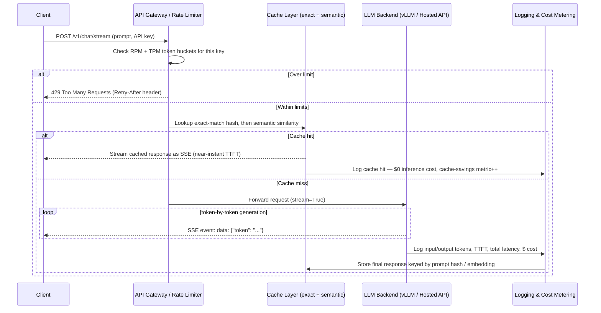
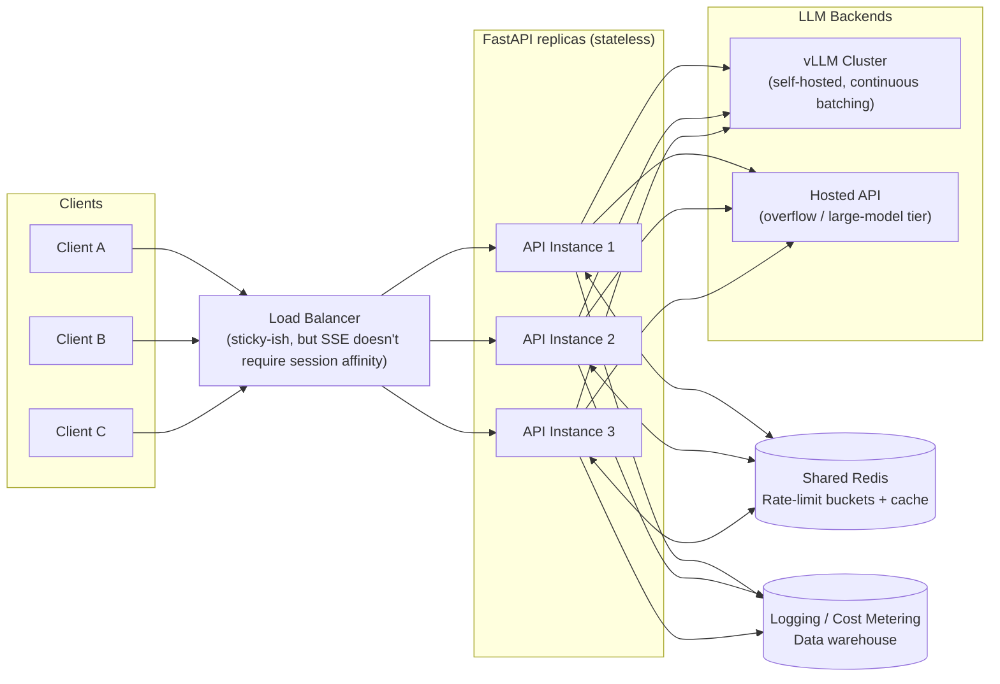

# Chapter 19: Production LLM Systems: FastAPI, Streaming & Scaling

*A working RAG pipeline or agent on your laptop and a production LLM service that survives real traffic are two different engineering problems — this chapter is about the second one.*

## Learning Objectives

By the end of this chapter, you will be able to:

- Design a FastAPI service that wraps an LLM backend (hosted API or self-hosted vLLM server) behind a clean, production-shaped endpoint
- Explain why streaming dramatically improves *perceived* latency even when total generation time is unchanged, and reason precisely about time-to-first-token (TTFT) vs. total completion time
- Choose between Server-Sent Events (SSE) and WebSockets for a given LLM streaming use case, and implement an SSE streaming endpoint in FastAPI
- Implement token-bucket rate limiting on both requests-per-minute and tokens-per-minute, and explain why LLM APIs must limit on both
- Design a multi-layer caching strategy — exact-match, semantic, and provider-side prefix/context caching — and identify the correctness risks of each
- Apply cost-optimization techniques (model routing, batching, caching, prompt trimming) to cut LLM API spend without degrading quality unacceptably
- Treat prompts as versioned, tested, deployable artifacts rather than ad hoc strings scattered through application code

---

## Prerequisites for This Chapter

This chapter assumes you've completed:

- **[Chapter 14: Inference Optimization](./14-inference-optimization.md)** — you should already understand continuous batching, PagedAttention, and **prefix caching** at the serving-engine level (how vLLM reuses KV cache for shared prompt prefixes). This chapter builds on that: prefix caching is a serving-level optimization, and here we look at how an API layer *exposes and complements* it with its own application-level caching.
- **[Chapter 18: MCP, LangGraph & Agent Frameworks](./18-mcp-and-agent-frameworks.md)** — you should be comfortable with the shape of an agent/RAG call graph: a request that may involve multiple LLM calls, tool calls, and retrieval steps before producing a final answer.

Chapters 14 and 18 were about what happens *inside* a single inference call or a single agent run. This chapter is about the layer that sits in front of all of that: the HTTP service real users and real client applications actually talk to, 24/7, under real traffic, with a real budget. Every optimization from Chapter 14 (continuous batching, prefix caching, quantization) still matters here — but now you also have to worry about rate limits, streaming to browsers, caching at the API layer, cost attribution per customer, and safely rolling out a prompt change without breaking production. That is the subject of this chapter.

You should be comfortable with: Python `async`/`await`, basic FastAPI (path operations, Pydantic models, dependency injection), and Docker (for the mental model of "this runs as a container behind a load balancer," even if we don't write Kubernetes manifests here).

---

## 1. From Prototype to Production: The Shape of an LLM API Service

### 1.1 What changes between a notebook and a service

A notebook that calls `client.chat.completions.create(...)` and prints the result is not a production system — it's a script that happens to work once, on your machine, with nobody else hitting it at the same time. Turning that into something you can put behind a domain name and hand to other engineers requires answering questions the notebook never had to:

- What happens when 200 requests arrive in the same second?
- What happens when one user sends a 50,000-token prompt and eats your entire monthly budget in an afternoon?
- What does the client see for the 8 seconds between "request sent" and "response received" — a blank spinner, or something better?
- What happens when the upstream LLM provider returns a 503, or the self-hosted vLLM pod restarts mid-request?
- Who do you charge for these tokens, and how do you know if a single customer is responsible for a cost spike?

None of this is exotic distributed-systems theory — it's the same production discipline you'd apply to any backend service. The twist specific to LLMs is that a single request can be **slow** (seconds, not milliseconds), **expensive** (cost scales with tokens, not just CPU cycles), and **streamed** (the "response" is not one payload but a sequence of chunks arriving over time). Those three properties — slow, token-priced, streamable — shape almost every design decision in this chapter.

### 1.2 The basic shape of a chat endpoint

At the core, every production LLM API wraps the same idea: accept a chat request, forward it to an LLM backend, and return the result. The backend can be a hosted API (OpenAI, Anthropic, etc.) or a self-hosted engine like the vLLM server from Chapter 14, exposed through its OpenAI-compatible `/v1/chat/completions` endpoint. Because both speak (roughly) the same wire protocol, your FastAPI service can often be backend-agnostic:

```python
# app/main.py
from fastapi import FastAPI, Depends, HTTPException
from pydantic import BaseModel, Field
from openai import AsyncOpenAI
import os

app = FastAPI(title="LLM Gateway")

# Point this at api.openai.com, api.anthropic.com (via a compatible shim),
# or your own vLLM server — the client code below doesn't need to change.
llm_client = AsyncOpenAI(
    base_url=os.environ.get("LLM_BASE_URL", "http://vllm-server:8000/v1"),
    api_key=os.environ.get("LLM_API_KEY", "not-needed-for-self-hosted"),
)

class ChatMessage(BaseModel):
    role: str
    content: str

class ChatRequest(BaseModel):
    messages: list[ChatMessage]
    model: str = "meta-llama/Llama-3.1-8B-Instruct"
    max_tokens: int = Field(default=512, le=4096)
    temperature: float = Field(default=0.7, ge=0.0, le=2.0)

class ChatResponse(BaseModel):
    content: str
    input_tokens: int
    output_tokens: int
    latency_ms: float

@app.post("/v1/chat", response_model=ChatResponse)
async def chat(req: ChatRequest, api_key: str = Depends(get_api_key)):
    import time
    start = time.monotonic()
    try:
        completion = await llm_client.chat.completions.create(
            model=req.model,
            messages=[m.model_dump() for m in req.messages],
            max_tokens=req.max_tokens,
            temperature=req.temperature,
        )
    except Exception as exc:
        raise HTTPException(status_code=502, detail=f"upstream LLM error: {exc}")

    return ChatResponse(
        content=completion.choices[0].message.content,
        input_tokens=completion.usage.prompt_tokens,
        output_tokens=completion.usage.completion_tokens,
        latency_ms=(time.monotonic() - start) * 1000,
    )
```

This is deliberately the *simplest possible* version — non-streaming, no cache, no rate limiter — so you can see the skeleton clearly. `get_api_key` is a FastAPI dependency (not shown yet) that authenticates the caller and will double as the hook point for rate limiting in Section 4. Every section from here on adds one production concern on top of this skeleton: first streaming (Sections 2–3), then protection and cost control (Sections 4–6), then operational discipline for the prompts themselves (Section 7).

### 1.3 The full request lifecycle

Before diving into any one piece, it helps to see where each concern sits in the request path. A mature LLM API request typically passes through gateway/rate-limiting, a cache check, the LLM backend itself (streaming tokens back), and logging/cost-metering hooks that fire regardless of whether the response came from cache or from a live model call:



Keep this diagram in mind through the rest of the chapter — Section 3 builds the SSE mechanism the client actually receives on the arrows labeled "stream," Section 4 builds the "Check RPM + TPM" box, Section 5 builds the cache layer, and Section 6 explains why the cache and routing boxes exist at all: they are cost levers, not just latency levers.

---

## 2. Streaming Responses: Why Time-to-First-Token Matters

### 2.1 The problem: LLM generation is slow, and users notice

An LLM produces output one token at a time, autoregressively (Chapter 7). A response of 400 tokens at a generation speed of 40 tokens/second takes **10 seconds** to fully generate, no matter how you serve it. If your API waits for the *entire* completion before sending anything back to the client — the naive, non-streaming approach from Section 1.2 — the user stares at a blank loading spinner for the full 10 seconds, then the whole answer appears at once.

Now compare that to streaming: the server sends each token (or small batch of tokens) to the client the moment it's generated. The user sees the first word appear after perhaps 300–800 milliseconds, and text continues to flow in like someone typing. **The total time to finish generating is identical in both cases** — streaming doesn't make the model faster. What changes is *when the user perceives something happening*.

### 2.2 Time-to-first-token (TTFT) vs. total completion time

These are the two numbers that matter, and they are not the same metric:

- **Time-to-first-token (TTFT)**: wall-clock time from when the request is sent to when the *first* output token/chunk is received by the client. Dominated by queueing delay, prompt processing (the "prefill" pass over your input tokens — this is exactly where Chapter 14's prefix caching helps, since a cached prefix skips re-computing the KV cache for a repeated prefix), and the time to generate one token.
- **Total completion time**: wall-clock time from request sent to the *last* token received — i.e., TTFT plus (tokens generated − 1) × per-token generation time.

```
Non-streaming UX:        [ ......... 10.0s of nothing ......... ][ full answer appears ]
Streaming UX:             [0.4s][ t ][ t ][ t ][ t ][ t ][ t ]...[ t ]  ← text flows in from 0.4s
                           ↑TTFT                                  ↑ total completion time ≈ same 10s
```

Concretely: a chatbot with 40 tokens/second generation speed and a 400-token answer has a total completion time of ~10 seconds either way. But a **non-streaming** client shows "loading..." for 10 seconds, while a **streaming** client shows the first words at ~0.4–0.8 seconds and keeps rendering for the remaining ~9.5 seconds. User research on perceived performance (going back to classic HCI studies, and reconfirmed repeatedly in LLM product analytics) consistently shows that **TTFT is what users rate as "responsiveness,"** not total completion time. A product that streams a 10-second answer starting at 0.5s is perceived as dramatically faster than one that blocks for 10s and dumps the whole thing — even though, measured end to end, they took the same amount of time.

This is why virtually every consumer-facing LLM product (ChatGPT, Claude, Gemini) streams by default, and why "add streaming" is usually the single highest-leverage latency fix you can ship for a chat UI — cheaper than any model or infra optimization, because it doesn't reduce total time at all, it just changes what the user experiences while waiting.

### 2.3 What streaming actually looks like on the wire

Under the hood, streaming means the HTTP response is not a single JSON blob but a sequence of chunks sent over one long-lived connection, each containing a small delta of new text (plus, at hosted-API providers, occasional metadata chunks). Your API layer needs to:

1. Open the connection to the client and keep it alive.
2. As soon as the LLM backend produces a token (or small batch), forward it to the client immediately — don't buffer.
3. Signal completion explicitly (a terminal event/marker) so the client knows generation is finished, distinct from a network drop.
4. Handle client disconnects gracefully (the user closed the tab mid-generation — stop paying for tokens nobody will read).

Two wire protocols dominate for step 1–3: **Server-Sent Events (SSE)** and **WebSockets**. Section 3 compares them and gives you a full FastAPI SSE implementation.

---

## 3. SSE vs. WebSockets for Streaming LLM Output

### 3.1 Server-Sent Events (SSE): one-directional, built on plain HTTP

SSE is a simple, standardized protocol (part of the HTML5 spec, [documented on MDN](https://developer.mozilla.org/en-US/docs/Web/API/Server-sent_events)) for a server to push a stream of text events to a client over a single, long-lived HTTP connection. The wire format is deliberately minimal — each event is a block of `field: value` lines terminated by a blank line:

```
data: {"token": "The"}

data: {"token": " capital"}

data: {"token": " of"}

event: done
data: {"total_tokens": 42, "ttft_ms": 410}

```

Because it's just HTTP with `Content-Type: text/event-stream`, SSE requires **no protocol upgrade, no special client library** (browsers have a native `EventSource` API, though most LLM frontends instead read the raw stream via `fetch` to control headers), and it passes through most standard HTTP infrastructure — load balancers, reverse proxies, corporate firewalls — without special configuration (a few settings, covered in Section 3.4, still need attention). It is **one-directional**: the server pushes, the client only listens on this connection. This maps almost perfectly onto "stream the model's response to the user," which is the overwhelming majority of LLM streaming use cases.

### 3.2 WebSockets: bidirectional, full-duplex

WebSockets establish a persistent, full-duplex connection where *either side* can send messages at any time, independent of a request/response cycle. This matters when the client needs to send data **while the server is still streaming** — for example:

- A "stop generation" / interrupt button that cancels a response mid-stream (technically achievable over SSE too, via closing the connection or a separate cancel endpoint, but WebSockets make it a first-class message rather than a workaround).
- Real-time voice or multi-turn conversational interfaces where the user might start speaking again before the assistant finishes, and both audio streams are in flight simultaneously.
- Collaborative or multiplayer LLM applications where several participants' inputs interleave with model output in the same session.

The cost of that flexibility: WebSockets require a protocol upgrade handshake, don't always traverse older proxies/load balancers as transparently as plain HTTP, need their own reconnection/heartbeat logic, and are simply more machinery to build and operate correctly than SSE.

### 3.3 Comparison table

| Dimension | SSE | WebSockets |
|---|---|---|
| Directionality | Server → client only | Bidirectional, full-duplex |
| Transport | Plain HTTP (`text/event-stream`) | Upgraded TCP connection (`ws://`/`wss://`) |
| Client complexity | Trivial — `fetch`/`EventSource`, no extra library | Needs a WebSocket client, manual reconnect/heartbeat logic |
| Infra compatibility | Works through most standard HTTP proxies/LBs | May need explicit proxy/LB configuration for upgrades |
| Automatic reconnection | Built into `EventSource` (browsers); manual if using raw `fetch` | Manual — you implement reconnect + resume logic |
| Mid-stream client → server messages | Not supported on the same connection (needs a second request) | Native — send a "cancel" or new message anytime |
| Best fit for LLM use case | Streaming a single model response to the UI (the common case) | Interrupt/cancel generation, voice interfaces, multi-party sessions |
| Implementation effort | Low | Moderate to high |

**Rule of thumb:** default to SSE for "stream the assistant's answer to the chat window." Reach for WebSockets only when you have a *specific, bidirectional* requirement — a genuine mid-stream interrupt, or simultaneous two-way audio/data — not because WebSockets feel more "real-time." Most teams that reach for WebSockets for a plain chatbot are paying operational complexity for a bidirectionality they don't actually use.

### 3.4 FastAPI SSE streaming endpoint

Here is a complete, runnable-shaped streaming chat endpoint. It builds directly on the skeleton from Section 1.2, adds `StreamingResponse` with an async generator, measures TTFT for the logging hook described in Section 1.3, and handles client disconnects:

```python
# app/streaming.py
import json
import time
from fastapi import APIRouter, Request, Depends, HTTPException
from fastapi.responses import StreamingResponse
from pydantic import BaseModel
from openai import AsyncOpenAI

router = APIRouter()
llm_client = AsyncOpenAI(base_url="http://vllm-server:8000/v1", api_key="not-needed")


class StreamChatRequest(BaseModel):
    session_id: str
    message: str
    model: str = "meta-llama/Llama-3.1-8B-Instruct"


def sse_pack(data: dict, event: str | None = None) -> str:
    """Format a single SSE event per the spec: optional `event:` line,
    a `data:` line with JSON payload, and a blank-line terminator."""
    lines = []
    if event:
        lines.append(f"event: {event}")
    lines.append(f"data: {json.dumps(data)}")
    return "\n".join(lines) + "\n\n"


@router.post("/v1/chat/stream")
async def chat_stream(
    req: StreamChatRequest,
    request: Request,
    api_key: str = Depends(get_api_key),          # from Section 4 — auth + rate limiting
):
    # Rate limit check (Section 4) and cache lookup (Section 5) happen here,
    # *before* we open the stream — a cache hit can be streamed too, with near-zero TTFT.
    await check_rate_limit(api_key, estimated_tokens=len(req.message) // 4)

    async def event_generator():
        start = time.monotonic()
        first_token_at = None
        collected = []
        try:
            stream = await llm_client.chat.completions.create(
                model=req.model,
                messages=[{"role": "user", "content": req.message}],
                stream=True,
            )
            async for chunk in stream:
                # Stop generating immediately if the client walked away —
                # don't keep paying for tokens nobody will read.
                if await request.is_disconnected():
                    break

                delta = chunk.choices[0].delta.content
                if not delta:
                    continue
                if first_token_at is None:
                    first_token_at = time.monotonic() - start
                collected.append(delta)
                yield sse_pack({"token": delta})

            total_time = time.monotonic() - start
            yield sse_pack(
                {
                    "ttft_ms": round((first_token_at or 0) * 1000, 1),
                    "total_ms": round(total_time * 1000, 1),
                    "output_tokens": len(collected),  # approximate; use usage stats if available
                },
                event="done",
            )
        except Exception as exc:
            yield sse_pack({"error": str(exc)}, event="error")
        finally:
            # Logging/cost-metering hook — fires whether the stream finished,
            # errored, or was cut short by a client disconnect.
            log_usage_and_cost(
                session_id=req.session_id,
                api_key=api_key,
                response_text="".join(collected),
                first_token_latency_s=first_token_at,
            )

    return StreamingResponse(
        event_generator(),
        media_type="text/event-stream",
        headers={
            "Cache-Control": "no-cache",
            "Connection": "keep-alive",
            # Disables buffering on nginx-based reverse proxies, which otherwise
            # hold chunks until a buffer fills — silently destroying your TTFT.
            "X-Accel-Buffering": "no",
        },
    )
```

A minimal browser-side consumer, for context on what receives this:

```javascript
const response = await fetch("/v1/chat/stream", {
  method: "POST",
  headers: { "Content-Type": "application/json", "X-API-Key": apiKey },
  body: JSON.stringify({ session_id: sessionId, message: userMessage }),
});
const reader = response.body.getReader();
const decoder = new TextDecoder();
let buffer = "";
while (true) {
  const { value, done } = await reader.read();
  if (done) break;
  buffer += decoder.decode(value, { stream: true });
  const events = buffer.split("\n\n");
  buffer = events.pop();          // keep any incomplete trailing event
  for (const evt of events) {
    const line = evt.split("\n").find(l => l.startsWith("data: "));
    if (line) appendToChat(JSON.parse(line.slice(6)).token ?? "");
  }
}
```

Two operational details that trip people up in production: (1) if you run behind **nginx**, you need `proxy_buffering off;` (or the `X-Accel-Buffering: no` header above) or it will buffer the whole stream and defeat the point; (2) if you run behind a **load balancer with idle timeouts**, make sure the timeout comfortably exceeds your slowest expected total completion time, or long responses get killed mid-stream.

---

## 4. Rate Limiting: Protecting Your Service and Your Budget

### 4.1 Why rate limiting is not optional for LLM APIs

A traditional REST API rate-limits mostly to prevent abuse and protect shared infrastructure — a request costs roughly the same, whether it's "get user profile" or "list orders." An LLM API has a second, sharper reason: **cost and compute scale with tokens, not requests.** One request with a 30,000-token document pasted into the prompt can cost 100x what a one-line question costs, and can occupy a GPU for proportionally longer. A rate limiter that only counts *requests per minute* lets a single client send one enormous request per minute and blow through a budget that was sized assuming small, typical requests. This is why every serious LLM API — OpenAI, Anthropic, self-hosted gateways alike — enforces limits on **both** requests-per-minute (RPM) **and** tokens-per-minute (TPM), and typically counts a request against **both** input tokens and output tokens (the latter estimated via `max_tokens` or metered after the fact).

### 4.2 The token bucket algorithm, intuitively

Picture a bucket that holds tokens (permission units, not LLM tokens — unfortunate naming collision, but the algorithm predates LLMs by decades). The bucket:

- Has a maximum capacity (the burst limit).
- Refills at a steady rate (e.g., 60 units/minute = 1 unit/second).
- Every request must "spend" units from the bucket equal to its cost before it's allowed through.
- If the bucket doesn't have enough units, the request is rejected (or queued) until it refills.

```
Bucket capacity: 100
Refill rate: 10 units/second
                                                              
  [██████████████████████████████████████████████████████░░]  92/100 units available
       ↑ request costs 8 units → allowed, bucket drops to 84
       ↑ then refills toward 100 at 10/sec, capped at capacity
```

The elegance of token bucket over simpler "N requests per fixed window" counters is that it naturally allows **bursts** up to the bucket's capacity while still enforcing a steady-state average rate — a client that's been idle can send a quick flurry of requests, then must slow down to the refill rate. This matches real usage patterns (a user firing off three quick follow-up questions) far better than a hard "10 requests per 60-second window" wall that resets abruptly at a fixed boundary.

### 4.3 Two buckets per API key: RPM and TPM together

For an LLM API you run **two independent buckets per API key** — one metered in requests, one metered in tokens — and a request must pass both to proceed:

```python
# app/rate_limit.py
import time
import redis.asyncio as redis
from fastapi import HTTPException

r = redis.Redis(host="redis", decode_responses=True)

RPM_LIMIT = 60          # requests per minute per key
TPM_LIMIT = 100_000      # tokens per minute per key

async def _take_token(bucket_key: str, limit_per_min: float, cost: float) -> bool:
    """Redis-backed token bucket using a simple refill-on-read scheme."""
    now = time.time()
    refill_rate = limit_per_min / 60.0  # units per second

    pipe = r.pipeline()
    pipe.hgetall(bucket_key)
    state = (await pipe.execute())[0]

    last_ts = float(state.get("ts", now))
    tokens = float(state.get("tokens", limit_per_min))
    tokens = min(limit_per_min, tokens + (now - last_ts) * refill_rate)

    if tokens < cost:
        return False

    tokens -= cost
    await r.hset(bucket_key, mapping={"tokens": tokens, "ts": now})
    await r.expire(bucket_key, 120)
    return True

async def check_rate_limit(api_key: str, estimated_tokens: int):
    rpm_ok = await _take_token(f"rpm:{api_key}", RPM_LIMIT, cost=1)
    tpm_ok = await _take_token(f"tpm:{api_key}", TPM_LIMIT, cost=estimated_tokens)

    if not rpm_ok:
        raise HTTPException(status_code=429, detail="Request rate limit exceeded",
                             headers={"Retry-After": "1"})
    if not tpm_ok:
        raise HTTPException(status_code=429, detail="Token rate limit exceeded",
                             headers={"Retry-After": "5"})
```

Notes on this design that matter in production:

- **Redis (or another shared store)** is required as soon as you run more than one API replica — an in-process bucket only limits traffic hitting that one instance, which silently multiplies your effective limit by replica count.
- **Estimate input tokens before the call** (a fast tokenizer count, not a network round trip — see Chapter 8) so you can reject an over-budget request *before* paying for an LLM call, and reconcile against the real usage returned by the backend afterward for TPM accounting.
- **Per-user/per-API-key quotas, not global ones** — a global limit lets one noisy customer starve every other customer; keying the bucket by API key (or user ID, or tenant ID) isolates that.
- Return **HTTP 429** with a `Retry-After` header — well-behaved clients back off automatically instead of hammering you harder.

---

## 5. Caching: The Single Best Lever for Both Latency and Cost

Every cache hit is a request that costs $0, takes ~0 GPU time, and can start streaming to the client almost instantly (near-zero TTFT). Caching is where latency optimization and cost optimization are the *same* lever. There are three distinct layers worth building, from simplest/safest to most powerful/riskiest.

### 5.1 Exact-match prompt caching

The simplest possible cache: hash the full prompt (system prompt + conversation history + parameters like `temperature`/`model`), and if you've seen that exact hash before, return the stored response instead of calling the LLM again.

```python
import hashlib, json

def cache_key(model: str, messages: list[dict], temperature: float) -> str:
    payload = json.dumps({"model": model, "messages": messages, "temperature": temperature},
                          sort_keys=True)
    return hashlib.sha256(payload.encode()).hexdigest()
```

This is safe (a cache hit is, by construction, the answer to the *exact same question*) but has limited hit rate in open-ended chat, because two users rarely phrase a question identically. It shines for **high-repetition workloads**: FAQ bots, classification/extraction endpoints where inputs recur, or any system prompt + tool-call pattern that gets invoked with identical arguments repeatedly. Always exclude or normalize non-deterministic fields (timestamps, request IDs) from the hash input, or every request will miss.

### 5.2 Semantic caching

Semantic caching relaxes "exact match" to "close enough": embed the incoming query (Chapter 16's embedding models), search a small vector store of previously answered queries, and if the closest match exceeds a similarity threshold (e.g., cosine similarity > 0.95), serve its stored answer instead of calling the LLM.

```python
async def semantic_cache_lookup(query: str, threshold: float = 0.95):
    query_vec = await embed(query)
    hit = await vector_store.search(query_vec, top_k=1)
    if hit and hit.score >= threshold:
        return hit.metadata["cached_response"]
    return None
```

This captures far more repetition than exact match — "What's your refund policy?" and "How do refunds work?" hit the same cache entry — at the cost of a real correctness risk: if the threshold is even slightly too permissive, or if two queries are *embedding-similar but semantically distinct* ("cancel my subscription" vs. "pause my subscription"), you serve a wrong answer with full confidence. Section 10 (Common Mistakes) covers this failure mode in depth — treat semantic caching as a deliberate quality/cost trade-off you tune and monitor, not a drop-in win.

### 5.3 Provider-side context/prompt caching (connecting back to Chapter 14)

The two caches above live in *your* API layer and cache full responses. There's a third layer that lives *inside the inference engine itself*: caching the KV-cache computation for a repeated prompt **prefix** so the model doesn't recompute attention over tokens it has already processed. You met the serving-engine side of this in Chapter 14 as vLLM's automatic prefix caching (built on PagedAttention) — when many requests share an identical prefix (a long system prompt, a set of few-shot examples, a large tool schema), vLLM reuses the cached KV blocks for that prefix and only computes the new suffix.

Hosted providers expose the same idea as a first-class feature — Anthropic's prompt caching and OpenAI's automatic prompt caching both let you mark (or automatically detect) a stable prefix of your prompt, cache its KV computation server-side, and pay a reduced rate for cache hits on subsequent calls that share that prefix. From your API's perspective, this is "free" latency and cost improvement — you get it by *structuring your prompts* so the stable part (system prompt, tool definitions, retrieved context that doesn't change within a session) comes first and the variable part (the user's latest message) comes last, so the cache prefix stays maximal across calls. It's the same principle as Chapter 14's prefix caching, just paid for and exposed differently depending on whether you're self-hosting or calling a hosted API.

| Cache layer | What it stores | Where it lives | Risk |
|---|---|---|---|
| Exact-match | Full response, keyed by exact prompt hash | Your API layer (Redis/DB) | Low — only ever returns the true answer to that exact input |
| Semantic | Full response, keyed by embedding similarity | Your API layer (vector store) | Medium/high — can serve a wrong-enough answer for a similar-but-different query |
| Prefix/context (provider-side) | KV-cache computation for a shared prompt prefix | Inference engine / provider infrastructure | Low — it's a compute optimization, not an answer-reuse mechanism; correctness unaffected |

---

## 6. Cost Optimization Strategies

Caching (Section 5) is one lever. Here are the other levers production teams pull, usually in combination, to bring LLM spend under control without a blanket downgrade in quality.

### 6.1 Model routing: match model size to query difficulty

Not every query needs your largest, most expensive model. **Model routing** classifies incoming requests by difficulty (a cheap heuristic, a small classifier, or even the smallest LLM in your fleet acting as a triage step) and sends easy queries to a smaller/cheaper model, escalating to a larger model only when needed:

```
"What's 15% of 80?"                      → small/cheap model (trivial arithmetic)
"Summarize this one-paragraph email"      → small/cheap model (simple, low-risk task)
"Debug this race condition in our        → large/expensive model (multi-step reasoning,
 distributed lock implementation"           high cost of a wrong answer)
```

A simple router might use a fast classifier or rule set (query length, presence of code, detected task type) to make an initial routing decision, with an **escalation path**: if the small model's response scores low on a confidence signal (or the user explicitly asks to "try again with a better model"), retry with the larger model. Since a large fraction of real-world traffic to any assistant is simple (greetings, short factual lookups, basic formatting requests), routing even 40–60% of traffic to a model that's 5–10x cheaper produces a substantial blended cost reduction with minimal quality impact on the queries that matter.

### 6.2 Batching non-latency-sensitive requests

Interactive chat requests need low TTFT and can't wait. But plenty of LLM workloads aren't interactive at all — nightly report generation, bulk classification of a backlog of support tickets, embedding a new document corpus. For these, **batch** requests together and submit them through a batch API (OpenAI's and Anthropic's batch endpoints, or your own vLLM server's offline batch mode) rather than firing them one at a time through your low-latency streaming path. Batch processing lets the serving engine maximize GPU utilization (larger effective batch sizes, better continuous-batching throughput — Chapter 14) and hosted providers typically price batch endpoints at a significant discount (commonly ~50% off standard rates) precisely because you're trading latency guarantees for efficiency. The engineering discipline here is simply **routing by SLA**: does this request need an answer in 2 seconds, or is "sometime in the next few hours" acceptable? If the latter, it belongs in the batch lane, not the streaming lane.

### 6.3 Aggressive caching (the connective tissue)

Revisit Section 5 through a pure cost lens: every layer of caching you add — exact-match, semantic, provider-side prefix caching — directly reduces the number of billed tokens processed by the model. Teams that treat caching as a first-class cost-control feature (not just a latency nicety) typically instrument **cache hit rate** and **estimated dollars saved by cache** as dashboard metrics alongside token spend, because the two levers (routing and caching) compound: a well-cached, well-routed system can see 60–80% of "would-be" LLM calls either served from cache or diverted to a cheap model.

### 6.4 Prompt compression and context trimming

Every token in your prompt is a token you pay for and a token that adds latency (more prefill time before the first output token). Common, high-leverage trims:

- **Truncate or summarize conversation history** instead of resending the full transcript on every turn — beyond a certain length, summarize older turns into a compact recap and drop the verbatim text (a technique you'll formalize as agent "memory" in Chapter 17).
- **Trim retrieved context (RAG)** to only the passages actually likely to be used — reranking (Chapter 16) before stuffing everything into the prompt reduces both cost and the risk of the model getting distracted by irrelevant chunks.
- **Strip redundant boilerplate** from system prompts and tool schemas — verbose, over-engineered system prompts are a common, invisible cost tax that compounds across every single request in a session.
- **Use dedicated prompt-compression techniques or smaller "compressor" models** (e.g., LLMLingua-style approaches) for workloads with very large, low-information-density contexts, when simple trimming isn't enough.

None of these should be applied so aggressively that they damage answer quality — the right amount of trimming is an empirical question you validate against your evaluation suite (previewed now, formalized in Chapter 20), not a fixed percentage you apply blindly.

---

## 7. Prompt Versioning: Treating Prompts as Code

### 7.1 Why prompts need the same discipline as application code

A system prompt embedded as a string literal deep in application code is a production liability: nobody can see when it changed, nobody can review a diff before it ships, there's no way to roll it back independently of a full application deploy, and a well-meaning tweak by one engineer can silently regress behavior other parts of the product depend on. The fix is to treat prompts exactly like you treat code:

- **Version-control prompt templates** as their own files (e.g., `prompts/support_agent_v3.yaml`), separate from application logic, so a prompt change produces a reviewable diff.
- **Tag or pin a version** that's actually deployed to production, distinct from `HEAD`/`latest`, so you always know precisely which prompt text generated a given past response — essential for debugging a user complaint about a bad answer three weeks later.
- **Run a regression suite before deploying a prompt change** — a fixed set of representative inputs with expected properties (not necessarily exact-match expected outputs, since LLM output varies) that you re-run against the new prompt version and compare against the old one's scores. Chapter 20 covers how to build this evaluation suite (LLM-as-judge scoring, rule-based checks, human review sampling) in depth; for this chapter, the point is simply that **a prompt change is a deploy**, and deploys need a pre-flight check.
- **Roll back a prompt like any other deploy** — if a new prompt version regresses quality or triggers unexpected behavior in production, you should be able to revert to the previous pinned version in seconds, without a code deploy, the same way you'd roll back a bad application release.

### 7.2 A minimal prompt-versioning setup

```
prompts/
  support_agent/
    v1.yaml       # deprecated — kept for audit trail
    v2.yaml       # previous production version
    v3.yaml       # current production version
    CHANGELOG.md  # what changed and why, per version
```

```yaml
# prompts/support_agent/v3.yaml
version: 3
model_target: "claude-sonnet-4-5"
system_prompt: |
  You are a support agent for Acme Cloud. Answer only questions about
  Acme Cloud products. If asked about anything else, politely redirect.
  Always cite the relevant help-center article ID when available.
changelog: "v3: added explicit citation requirement (fixes ticket #4821 — agent was giving unsourced answers)"
```

```python
# app/prompts.py — load the pinned version, never a mutable "latest" pointer
import yaml

def load_prompt(name: str, version: int) -> dict:
    with open(f"prompts/{name}/v{version}.yaml") as f:
        return yaml.safe_load(f)

ACTIVE_SUPPORT_PROMPT = load_prompt("support_agent", version=3)  # pinned explicitly
```

Wire this into your CI/CD: a pull request that changes `v3.yaml` (or adds `v4.yaml`) triggers your regression suite automatically, the same way a code change triggers unit tests, and the PR is only mergeable once the suite passes and a human has reviewed the diff of the prompt text itself — because prompt wording is the "logic" of the system, even though it looks like plain English.

---

## 8. Scaling the Service Horizontally

Everything above works for one API replica talking to one LLM backend. Real production traffic requires more than one of each, coordinated through shared state:



The key design point: **API instances are stateless** — rate-limit counters and cache entries live in shared Redis (Section 4.3), not in-process, precisely so any replica can serve any request and the load balancer needs no special session affinity for correctness (SSE connections are long-lived per request, but they don't require the *next* request from the same client to hit the same replica). Route between the self-hosted vLLM cluster and a hosted API as an **overflow valve** — send traffic to vLLM up to its capacity, and burst overflow to a hosted API rather than queuing users during a traffic spike, trading a higher per-token cost temporarily for availability.

---

## Real-World Scenario

**Scenario:** A B2B SaaS company ships an AI support assistant embedded in their product. It launches non-streaming, no caching, one rate limit (100 requests/hour per customer, no token limit), and a system prompt hardcoded as a Python string. Three problems surface within the first month:

1. **A single enterprise customer's usage spikes 40x cost overnight.** Their integration team wrote a script that pastes entire multi-megabyte log files into the chat box asking "what's wrong here?" Each request is well under the 100 requests/hour cap — the RPM limit never triggers — but each one is 80,000+ input tokens. The team had no TPM limit, so nothing stopped it. Fix: add a per-key TPM bucket (Section 4.3) sized to the customer's contracted tier, and return a clear 429 with guidance to summarize logs before submission rather than pasting them whole.

2. **Users complain the assistant "feels slow" even though the backend team's dashboards show average latency well within target.** The dashboard was measuring total completion time; users were staring at a blank screen for the full duration because the endpoint was non-streaming. Switching to the SSE pattern from Section 3.4 doesn't change total completion time at all — but user satisfaction scores jump immediately, because TTFT (Section 2.2), not total time, is what users actually feel.

3. **A support engineer edits the system prompt directly in a hotfix PR to address a specific customer complaint, and doesn't realize the change also affects an unrelated intent-classification step that shares the same prompt file.** Two other customers report the assistant misclassifying routine requests as escalations the following week. There was no regression suite and no versioned rollback — the team has to `git blame`, manually diff prompt text, and redeploy an old commit under time pressure. After the incident, they adopt the versioned-prompt structure from Section 7.2 with a regression suite gating any prompt PR, and the next similar fix takes 20 minutes instead of half a day.

**Lesson:** none of these are exotic failures — they're the direct, predictable consequences of skipping token-based rate limiting, streaming, and prompt versioning respectively. Each fix in this chapter maps to a real incident pattern, not a hypothetical one.

---

## Best Practices

- **Rate-limit on tokens, not just requests.** Size TPM limits per pricing tier/customer contract, and estimate input tokens *before* the LLM call so you can reject over-budget requests without paying for them.
- **Stream by default for interactive chat.** The engineering cost is small (Section 3.4) and the perceived-latency win is the highest-leverage UX improvement available to you — bigger, usually, than most model or infra optimizations.
- **Layer your caches** — exact-match for guaranteed-safe reuse, semantic for higher hit rate with a deliberately tuned similarity threshold, and structure prompts (stable content first, variable content last) to maximize provider-side prefix-cache hits.
- **Route by both difficulty and latency SLA** — send easy queries to cheap models, and non-interactive workloads to batch endpoints, rather than treating every request identically.
- **Keep rate-limit and cache state in a shared store (Redis or equivalent)** the moment you run more than one API replica — in-process state silently multiplies your effective limits and defeats caching across replicas.
- **Version, review, and regression-test every prompt change** exactly as you would application code, with an explicit rollback path.
- **Instrument cost and cache-hit-rate as first-class metrics**, not just latency and error rate — for LLM APIs, cost *is* an operational metric, not just a finance concern.
- **Set idle/read timeouts on load balancers and reverse proxies generously enough for your slowest expected streamed response**, and disable proxy buffering (`X-Accel-Buffering: no` / `proxy_buffering off`) for streaming endpoints.

---

## Common Mistakes

- **Rate-limiting only on requests-per-minute.** A client sending a handful of enormous prompts sails under an RPM cap while consuming a disproportionate, unbounded share of tokens and cost — this is the single most common LLM-specific rate-limiting mistake (Section 4.1).
- **Building a non-streaming endpoint for an interactive product** and trying to fix "slowness" by optimizing the model or infrastructure, when the actual fix — streaming — doesn't reduce total latency at all, it changes what the user perceives during it (Section 2).
- **Setting the semantic cache similarity threshold too low (too permissive)** and serving a confidently wrong answer for a query that's embedding-close but semantically distinct from the cached one — e.g., conflating "cancel my subscription" with "pause my subscription." Always monitor semantic cache hit outcomes and set the threshold conservatively; when in doubt, don't semantically cache high-stakes or action-triggering responses at all.
- **Storing rate-limit counters or cache entries in local process memory** in a horizontally scaled deployment — each replica enforces its own independent limit, multiplying the effective cap by replica count, and each replica misses cache entries written by its siblings.
- **Editing a production system prompt directly with no version control, review, or regression test** — a change intended to fix one reported issue silently regresses unrelated behavior that shared the same prompt, discovered only when customers complain (see the Real-World Scenario).
- **Buffering the response somewhere in the pipeline** (a reverse proxy, a WSGI-style synchronous server, or client-side code that waits for the full body) — the backend streams correctly, but an intermediate hop batches it up, and the client experiences the non-streaming latency profile anyway despite the extra engineering investment.
- **Not handling client disconnects** — the browser tab closes, but the server keeps generating and paying for tokens nobody will ever read, because the streaming loop never checked `request.is_disconnected()`.
- **Treating token bucket capacity/refill numbers as "set once and forget"** — traffic patterns and customer tiers change; limits sized at launch for a handful of pilot customers routinely become either too restrictive (as usage grows) or dangerously loose (as a single account outgrows its original tier) without a periodic review.

---

## Summary

- A production LLM API service is a normal backend service wrapping an LLM backend (hosted API or self-hosted vLLM), but three properties of LLM calls — slow, token-priced, streamable — drive almost every design decision on top of the basic FastAPI skeleton.
- **Streaming** doesn't reduce total completion time; it makes time-to-first-token (TTFT), not total time, the number that governs perceived responsiveness — which is why virtually every production chat UI streams.
- **SSE** is the right default for one-directional "stream the model's answer" use cases — simple, HTTP-native, minimal client complexity; **WebSockets** earn their extra complexity only when the client genuinely needs to send data mid-stream (interrupts, voice, multi-party sessions).
- LLM APIs must rate-limit on **both requests-per-minute and tokens-per-minute**, via a **token bucket** per API key/customer, because cost and compute scale with tokens, not request count.
- A three-layer caching strategy — **exact-match** (safe, low hit rate), **semantic** (higher hit rate, real risk of serving a wrong-enough answer), and **provider-side prefix/context caching** (a cost/latency win with no correctness risk, connecting directly back to Chapter 14's KV-cache prefix caching) — is the highest-leverage lever for both latency and cost simultaneously.
- **Cost optimization** compounds across model routing (cheap model for easy queries), batching (non-interactive workloads through discounted batch endpoints), caching, and prompt/context trimming.
- **Prompts are code**: version them, review changes as diffs, regression-test before deploying, and keep an explicit, fast rollback path — the same discipline you already apply to application code.

---

## Knowledge Check

1. A response takes 10 seconds to fully generate whether or not you stream it. Explain precisely what streaming changes and what it doesn't, using the terms TTFT and total completion time.
2. Why do production LLM APIs enforce both an RPM limit and a TPM limit instead of just one? Give a concrete request pattern that would evade an RPM-only limiter while still causing a large cost/compute impact.
3. Describe the token bucket algorithm in your own words, including what "capacity" and "refill rate" each control, and why it allows bursty traffic while still enforcing a steady-state average rate.
4. Compare SSE and WebSockets for an LLM chat product that needs a working "stop generating" button. Which would you choose, and could you implement the same feature on the other protocol — at what cost?
5. Explain the difference between exact-match caching, semantic caching, and provider-side prefix caching in terms of what each one stores, and rank them from "safest, least risk of a wrong answer" to "highest risk."
6. A teammate proposes editing the production system prompt directly in the deployed container to fix an urgent customer issue, then updating the versioned prompt file "later, once things calm down." Explain, using this chapter's framing, what could go wrong with that plan.

---

## Hands-On Exercise

Build a minimal streaming LLM gateway that demonstrates the core concerns from this chapter:

1. **Streaming endpoint**: Implement the `/v1/chat/stream` endpoint from Section 3.4 against any LLM backend you have access to (a hosted API with a valid key, or a local vLLM/Ollama server). Confirm with a simple client (`curl -N` or the JavaScript snippet in Section 3.4) that tokens arrive incrementally, not all at once.

2. **Measure TTFT vs. total time**: Add timing instrumentation (as in the code example) and log both numbers for 10 requests of varying prompt/response length. Plot or tabulate TTFT vs. total completion time — confirm TTFT stays roughly flat while total time scales with output length.

3. **Add a token bucket rate limiter**: Implement the RPM+TPM dual-bucket limiter from Section 4.3 (in-memory is fine for this exercise; note in your writeup why it wouldn't be sufficient for a multi-replica deployment). Write a small script that fires 20 rapid requests and confirm some get rejected with HTTP 429 once the bucket is exhausted, then confirm they succeed again after the refill window.

4. **Add exact-match caching**: Wrap your endpoint with the hashing scheme from Section 5.1. Send the identical request twice and confirm the second call returns near-instantly with no LLM backend call (log a `cache_hit: true` flag to verify).

5. **Version a prompt change**: Create `prompts/assistant/v1.yaml` and `v2.yaml` with a deliberately different system prompt (e.g., v2 adds a constraint like "always answer in exactly 3 bullet points"). Write 3–5 test inputs and run them against both versions, manually scoring whether v2's outputs actually satisfy the new constraint — this is a hand-rolled preview of the regression suite formalized in Chapter 20.

**Stretch goal:** Add a naive model-routing step — classify incoming requests as "short/simple" (route to a small/cheap model) vs. "long/complex" (route to a larger model) using a simple heuristic (e.g., input length or keyword presence), and log which tier each request was routed to.

---

## Further Reading

- [FastAPI: StreamingResponse](https://fastapi.tiangolo.com/advanced/custom-response/#streamingresponse) — official docs for the response class used throughout Section 3
- [MDN: Server-Sent Events / Using server-sent events](https://developer.mozilla.org/en-US/docs/Web/API/Server-sent_events/Using_server-sent_events) — the SSE wire format and `EventSource` API reference
- [WHATWG HTML Living Standard — Server-Sent Events section](https://html.spec.whatwg.org/multipage/server-sent-events.html) — the formal SSE specification
- [MDN: WebSockets API](https://developer.mozilla.org/en-US/docs/Web/API/WebSockets_API) — reference for the bidirectional alternative discussed in Section 3.2
- [Stripe Engineering: Scaling your API with rate limiters](https://stripe.com/blog/rate-limiters) — a widely cited, concrete walkthrough of token-bucket and related rate-limiting patterns in a real production API
- [OpenAI API Reference: Rate limits](https://platform.openai.com/docs/guides/rate-limits) — real-world RPM/TPM limit documentation from a major hosted provider
- [Anthropic: Prompt caching documentation](https://docs.anthropic.com/en/docs/build-with-claude/prompt-caching) — provider-side prefix/context caching referenced in Section 5.3
- [vLLM documentation: Automatic Prefix Caching](https://docs.vllm.ai/en/latest/automatic_prefix_caching/apc.html) — the serving-engine mechanism this chapter connects back to from Chapter 14

---

<div style="display:flex;justify-content:space-between;align-items:center;">
  <a href="./18-mcp-and-agent-frameworks.md">← Previous: MCP, LangGraph & Agent Frameworks</a>
  <a href="./00-index.md">🏠 Index</a>
  <a href="./20-observability-evaluation-and-security.md">Next: Observability, Evaluation & Security →</a>
</div>
