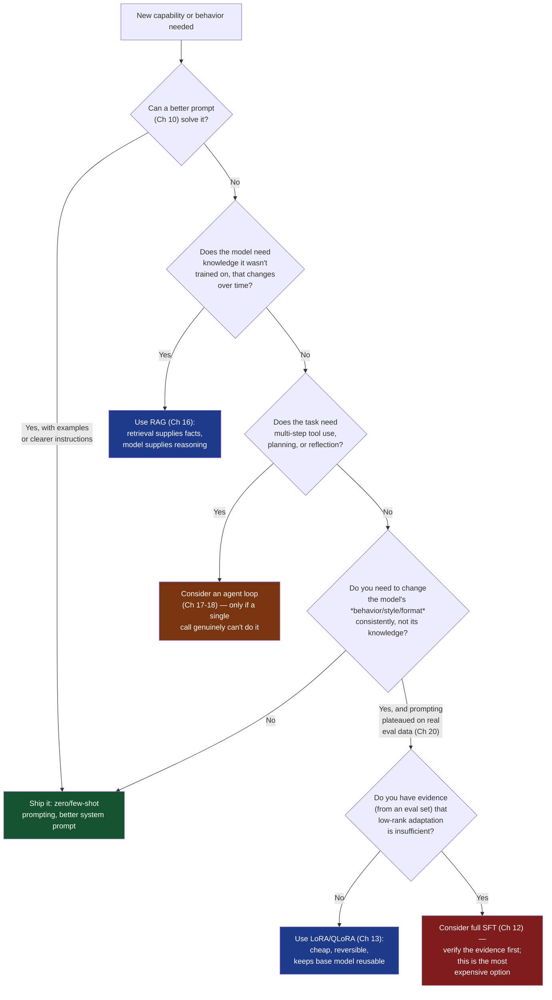

# Chapter 21: Best Practices

*You've traced a prompt from tokenizer to logits, fine-tuned a model with LoRA, quantized it for deployment, and wired up a RAG pipeline behind a monitored API. This chapter is the view from the top of that mountain — one consolidated checklist that pulls the single most load-bearing recommendation out of every chapter you've read so far.*

## Learning Objectives

- Recite a defensible, chapter-linked checklist of professional judgment calls across the entire LLM systems stack — from architecture fundamentals to production observability
- Explain the "why" behind each practice well enough to adapt it when your situation doesn't match the textbook case
- Use a decision framework to choose between prompting, RAG, fine-tuning, and PEFT for a given problem, instead of defaulting to whichever technique is currently fashionable
- Apply the idea of versioning a "model configuration" (base model + adapter + quantization + prompt template + sampling params) as one reproducible unit, instead of treating each as an independent, unversioned variable
- Recognize the latency/cost/quality trade-off explicitly, and state which two dimensions a given system is optimizing for
- Audit an existing or hypothetical LLM system against a consolidated checklist and prioritize the gaps that matter most

## Prerequisites for This Chapter

This is a **synthesis** chapter — it assumes you've read Chapters 1 through 20 and does not re-teach any of them. It distills and cross-links what you've already learned into one operational reference you can scan in five minutes before a design review, a production incident, or an architecture decision. If any of the following feel unfamiliar, a quick re-read before continuing will make this chapter far more useful:

- **[Chapter 2: Machine Learning Fundamentals](./02-machine-learning-fundamentals.md)** and **[Chapter 3: Deep Learning Fundamentals](./03-deep-learning-fundamentals.md)** — bias-variance, overfitting, optimizers, the substrate every later judgment call rests on
- **[Chapter 4: NLP Fundamentals](./04-nlp-fundamentals.md)** — why Transformers were needed at all, the source of the "don't reach for a bigger hammer than the problem needs" instinct
- **[Chapter 5: Attention & Self-Attention](./05-attention-and-self-attention.md)** and **[Chapter 6: The Transformer Architecture](./06-transformer-architecture.md)** — the Q/K/V mechanics and full block structure this chapter's architectural judgment calls assume you can draw from memory
- **[Chapter 7: LLM Architecture & Decoding](./07-llm-architecture-and-decoding.md)** — context windows, RoPE, KV cache, logits — the basis for the context-management and latency practices below
- **[Chapter 8: Tokenization Deep Dive](./08-tokenization-deep-dive.md)** and **[Chapter 9: Sampling & Generation Strategies](./09-sampling-and-generation-strategies.md)** — vocabulary design, temperature, top-k/top-p, the source of the sampling recommendations
- **[Chapter 10: Prompt Engineering](./10-prompt-engineering.md)** and **[Chapter 11: Tool Calling & Structured Output](./11-tool-calling-and-structured-output.md)** — the application layer this chapter assumes you can design fluently
- **[Chapter 12: Pretraining, SFT, RLHF & DPO](./12-pretraining-and-fine-tuning.md)** and **[Chapter 13: LoRA, QLoRA & PEFT](./13-parameter-efficient-fine-tuning.md)** — the full training pipeline and the "when to fine-tune at all" question
- **[Chapter 14: Inference Optimization](./14-inference-optimization.md)** and **[Chapter 15: Quantization & Speculative Decoding](./15-quantization-and-speculative-decoding.md)** — vLLM, PagedAttention, and quantization trade-offs
- **[Chapter 16: RAG & Vector Databases](./16-rag-and-vector-databases.md)**, **[Chapter 17: Agents & Multi-Agent Systems](./17-agents-and-multi-agent-systems.md)**, and **[Chapter 18: MCP, LangGraph & Agent Frameworks](./18-mcp-and-agent-frameworks.md)** — the application patterns most production LLM systems are built from
- **[Chapter 19: Production LLM Systems](./19-production-llm-systems.md)** and **[Chapter 20: Observability, Evaluation & Security](./20-observability-evaluation-and-security.md)** — the operational layer that catches everything above when it fails

Think of this chapter as the senior engineer's checklist you'd hand a new hire before they touch a production LLM system — every line has a full chapter behind it if you need the underlying explanation.

---

## 1. Foundations — ML/DL/NLP Judgment Calls (Ch 2-4)

*(Builds on Chapter 2: Machine Learning Fundamentals, Chapter 3: Deep Learning Fundamentals, Chapter 4: NLP Fundamentals)*

- **Diagnose bias vs. variance before reaching for more data or a bigger model.** Chapter 2 showed that a high-bias (underfitting) system needs more capacity or better features, while a high-variance (overfitting) system needs regularization, more data, or a simpler model — throwing compute at the wrong diagnosis wastes weeks. This same instinct transfers directly to "should I fine-tune" decisions in Section 9: a model that's confidently wrong in a consistent way often has a bias problem (wrong training distribution), while one that's inconsistent across similar inputs often has a variance/prompt-sensitivity problem.
- **Never trust a single accuracy number without knowing the class/task distribution behind it.** Chapter 2's evaluation-metrics discussion (precision, recall, F1) generalizes to LLM evaluation in Chapter 20 — a chatbot that's 95% "helpful" on easy queries and silent on the 5% of hard ones can look great on an aggregate dashboard while failing exactly the users who needed it most.
- **Remember that a Transformer is doing supervised next-token prediction at pretraining scale, not magic.** Keeping Chapter 3's mental model of gradient descent, loss functions, and backpropagation intact prevents treating an LLM's failures as mysterious — a bad completion is usually explainable as "the training distribution didn't cover this," "the loss function didn't penalize this failure mode," or "sampling introduced this variance," and each of those maps to a fixable lever elsewhere in this chapter.
- **Respect the reason Transformers replaced RNNs: parallelizable long-range dependency modeling.** Chapter 4 showed why sequential RNN/LSTM processing collapsed under long-range dependencies and couldn't parallelize during training. This history matters operationally: it's why context length, not just parameter count, is a first-class lever you'll tune throughout this course, and why "just make the model bigger" was never the whole story.
- **Treat word/token embeddings as geometry, not lookup tables, when debugging weird model behavior.** The distributional hypothesis from Chapter 4 (words with similar contexts get similar vectors) is the same geometric intuition behind embedding-based retrieval in Section 7 — if retrieval or a fine-tune behaves oddly on a specific term, checking whether that term is well-represented in the embedding/training geometry is a productive first move.

---

## 2. Transformers & LLM Architecture (Ch 5-7)

*(Builds on Chapter 5: Attention & Self-Attention, Chapter 6: The Transformer Architecture, Chapter 7: LLM Architecture & Decoding)*

- **Know the `O(n²)` cost of self-attention well enough to predict when context length will bite you.** Chapter 5 derived why doubling sequence length quadruples attention compute — this is the root cause behind every long-context latency complaint in Section 6, and it's why techniques like FlashAttention (Chapter 14) and KV cache management exist at all, not optional add-ons.
- **Be able to draw the full Transformer block from memory before debugging anything architecture-adjacent.** Chapter 6's residual connections and LayerNorm placement aren't academic trivia — a model fine-tuned with a learning rate too high enough to destabilize residual paths, or a custom architecture that drops a normalization layer, fails in ways that only make sense once you can mentally trace the block's shape.
- **Understand why the encoder disappeared in decoder-only LLMs before assuming any encoder-only technique transfers.** Chapter 7 traced the shift from encoder-decoder to decoder-only architectures — this explains why techniques you might know from BERT-style bidirectional models (masked-token objectives, bidirectional attention) don't directly translate to GPT/Llama/Claude-style causal generation, a confusion that wastes real debugging time when engineers assume otherwise.
- **Treat context window size as a hard architectural constraint you design around, not a knob you max out by default.** Chapter 7 covered why context windows exist (`O(n²)` attention cost, KV cache memory) — requesting the maximum context window "just in case" inflates both latency and cost for the common case where most of that window goes unused. Size your context budget to your actual task, not your ceiling.
- **Understand the KV cache well enough to reason about why time-to-first-token and per-token latency behave differently.** Chapter 7's KV cache section is the reason prefill (processing the prompt) and decode (generating tokens one at a time) have such different cost profiles — this directly informs prefix-caching and continuous-batching decisions in Section 6 of this chapter.
- **Know that RoPE (or whichever positional scheme your model uses) has a trained context length, and extrapolating past it degrades quality even if the API technically accepts more tokens.** Silently truncating or accepting arbitrarily long input without checking against a model's actual trained context length produces subtly worse completions long before you hit a hard token-limit error.

---

## 3. Tokenization & Sampling (Ch 8-9)

*(Builds on Chapter 8: Tokenization Deep Dive, Chapter 9: Sampling & Generation Strategies)*

- **Count tokens with the actual tokenizer you're billed and constrained by — never estimate with a rough words-to-tokens ratio in production code.** Chapter 8 showed how BPE/tiktoken vocabulary boundaries split words unpredictably (especially non-English text, code, and rare proper nouns); a rough heuristic that's "close enough" in English badly under- or over-estimates cost and context usage for other content types.
- **Audit tokenization behavior on your actual domain data, not just prose.** Chapter 8's vocabulary-design discussion matters concretely here: code, JSON, non-Latin scripts, and domain jargon can tokenize far less efficiently than the benchmark text a tokenizer was designed around, silently inflating your cost-per-request and eating into your effective context budget.
- **Pick temperature and top-p deliberately, per task — never leave both at provider defaults for every use case.** Chapter 9 established that low temperature (near-deterministic) suits extraction, classification, and code generation, while higher temperature suits creative or brainstorming tasks — using one setting everywhere means either brittle creative output or unnecessarily random factual output.
- **Default to combining a modest temperature with top-p (nucleus sampling), not top-k alone, for general chat use cases.** Chapter 9 showed top-p adapts to the shape of the probability distribution per-token, which handles the "sometimes there's one obvious next token, sometimes there are twenty plausible ones" reality of natural language better than a fixed top-k cutoff.
- **Use greedy decoding (temperature 0) for anything that must be reproducible or auditable** — structured extraction, classification, code generation with tests. Chapter 9's greedy-vs-sampling comparison matters here: sampling variance is a feature for creative tasks and a liability for anything you need to be able to re-run and get the same answer for debugging or compliance.
- **Add a repetition or frequency penalty only when you observe looping, not preemptively.** Chapter 9 covered these as targeted fixes for a specific failure mode (degenerate repetition); applying them by default without observing the problem can subtly and unpredictably distort word choice in outputs that weren't repeating in the first place.

---

## 4. Prompt Engineering & Tool Calling (Ch 10-11)

*(Builds on Chapter 10: Prompt Engineering, Chapter 11: Tool Calling & Structured Output)*

- **Reach for few-shot examples before reaching for a fine-tune.** Chapter 10 showed that 2-5 well-chosen examples in-context often close most of the gap that a team assumes requires fine-tuning — this ordering (prompt engineering first, fine-tuning last) is formalized as a decision tree in Section 9 of this chapter.
- **Use chain-of-thought prompting for multi-step reasoning tasks, but verify it actually helps on your task before paying its latency and token cost every time.** Chapter 10 was explicit that CoT is not free — it multiplies output tokens and latency, and on simple lookup-style tasks it can add noise without improving accuracy. Measure it on your own eval set (Chapter 20) rather than assuming it always helps.
- **Put stable instructions in the system prompt and keep it consistent across a session** — role, tone, output format, and hard constraints belong there, not scattered across every user turn. Chapter 10's role-prompting section showed this reduces prompt-injection surface area (Chapter 20) as a side benefit, since the system boundary is where most guardrail logic anchors.
- **Use delimiters (XML tags or clearly fenced JSON) to separate instructions, user input, and retrieved/tool content.** Chapter 10 showed this isn't cosmetic — clear delimiters are what let the model (and any downstream parser) reliably distinguish "text to follow as an instruction" from "text to treat as data," which is also your first line of defense against prompt injection (Chapter 20).
- **Validate every tool call's arguments against the JSON schema before executing it — never trust model output as pre-validated input.** Chapter 11 was explicit that structured output guarantees from the provider reduce malformed JSON, but they do not guarantee the *values* are safe or sensible; the trust boundary Chapter 11 described means your application code, not the model, is accountable for what a tool call actually does.
- **Design the multi-turn tool-calling loop with an explicit maximum iteration count and a fallback path.** Chapter 11's tool-calling loop can, without a cap, retry a failing tool call indefinitely or spiral into an unproductive loop — the same failure mode Section 7 revisits for full agent loops, just with a smaller blast radius.

---

## 5. Training & Fine-Tuning (Ch 12-13)

*(Builds on Chapter 12: Pretraining, SFT, RLHF & DPO, Chapter 13: LoRA, QLoRA & PEFT)*

- **Exhaust prompting and RAG before fine-tuning — fine-tuning is for teaching behavior and style, not for injecting facts.** Chapter 12 and 13 both stressed this distinction: fine-tuning bakes in *how* a model responds (format, tone, task-specific behavior patterns), while RAG (Chapter 16) supplies *what* it knows at query time. Fine-tuning to "teach" a model a fact that changes monthly guarantees you'll be re-training monthly.
- **Know which stage of the pipeline you actually need before choosing a technique.** Chapter 12 laid out pretraining (general capability, not something you'll ever do from scratch), SFT (teaching instruction-following on a target task), RLHF (aligning to human preference at scale, expensive), and DPO (a lighter-weight preference-alignment alternative to full RLHF). Most teams only ever need SFT — reaching for RLHF/DPO without a clear preference-alignment problem to solve is solving a problem you don't have.
- **Default to LoRA/QLoRA over full fine-tuning unless you have a specific reason to update every parameter.** Chapter 13 showed LoRA's low-rank adapters reach competitive quality on most task-adaptation problems at a small fraction of the memory and compute cost, and keep the base model reusable across multiple adapters — full fine-tuning is justified only when you have evidence (from an eval set) that low-rank adaptation isn't sufficient for your task.
- **Build your fine-tuning dataset with the same rigor you'd apply to a production training set — deduplicated, representative of real usage, and split into train/validation/test.** Chapter 12's SFT data-quality discussion applies directly: a fine-tune trained on a handful of hand-picked "nice" examples will not generalize to the messy distribution of real user inputs, and without a held-out validation split you can't detect overfitting to your own fine-tuning examples.
- **Evaluate a fine-tune against the same eval harness you'd use for a prompted baseline before declaring it better.** It's tempting to eyeball a handful of fine-tuned outputs and conclude "this looks great" — Chapter 13's PEFT workflow and Chapter 20's evaluation practices both assume a quantitative before/after comparison on held-out data, because subjective spot-checks systematically overrate a model you've just spent effort training.
- **Track which base model version, dataset version, and hyperparameters produced every adapter checkpoint.** An untracked LoRA adapter that "seems to work" is a liability the moment the base model is upgraded or a bug report needs root-causing — this is the training-specific instance of the configuration-versioning practice formalized in Section 10.

---

## 6. Inference & Quantization (Ch 14-15)

*(Builds on Chapter 14: Inference Optimization, Chapter 15: Quantization & Speculative Decoding)*

- **Use continuous batching and PagedAttention (via vLLM or an equivalent serving engine) instead of naive one-request-at-a-time serving for any real traffic.** Chapter 14 showed static batching wastes GPU capacity waiting for the slowest sequence in a batch to finish, while continuous batching and PagedAttention's non-contiguous KV-cache memory management dramatically improve throughput under real, variable-length traffic — this is close to a default requirement for production serving, not an optimization to consider "later."
- **Turn on prefix caching when your traffic has a shared prompt prefix (a system prompt, a RAG template, a few-shot block).** Chapter 14's prefix-caching section showed this avoids recomputing the KV cache for identical prefixes across requests — for high-volume systems with a stable system prompt, this alone can meaningfully cut both latency and cost with no quality trade-off.
- **Choose a quantization format based on your deployment target, not the newest-sounding acronym.** Chapter 15 walked through INT8, GPTQ, AWQ, and GGUF, each suited to different hardware and serving stacks — GGUF for CPU/edge/llama.cpp-style deployment, GPTQ/AWQ for GPU-served weight-only quantization. Picking one because it's trending without checking your serving engine's support is a common source of "it doesn't load" incidents.
- **Always re-run your evaluation suite after quantizing — never assume a quantization format's reported average benchmark degradation applies uniformly to your task.** Chapter 15 was explicit that quantization degrades quality unevenly across tasks; a format that loses "only 1% on average" can lose far more on tasks that lean on precise numeric or long-tail token reasoning, and you won't know without measuring your own case.
- **Use speculative decoding only when you have a genuinely fast, well-aligned draft model — otherwise the verification overhead can net you nothing.** Chapter 15's draft-and-verify mechanics only pay off when the small draft model agrees with the target model often enough that verification is cheaper than generation; a poorly matched draft model adds latency instead of removing it.
- **Size GPU memory budget around KV cache growth, not just model weights.** Chapter 14 and 15 both touch this: as context length and concurrent request count grow, KV cache memory can dwarf the static weight footprint, especially for long-context or high-concurrency workloads — a capacity plan based on weights alone will run out of memory under real load.

---

## 7. RAG & Agents (Ch 16-18)

*(Builds on Chapter 16: RAG & Vector Databases, Chapter 17: Agents & Multi-Agent Systems, Chapter 18: MCP, LangGraph & Agent Frameworks)*

- **Default to hybrid search (dense + sparse/BM25) over pure vector search, and add re-ranking for high-stakes retrieval.** Chapter 16 covered this directly — dense embeddings miss exact keyword matches (IDs, codes, proper nouns) that sparse retrieval catches reliably, and a cross-encoder re-ranker over your candidate set meaningfully improves precision at the top of the list, which is exactly where your context budget (Chapter 7) is spent.
- **Ground every RAG prompt with an explicit "answer only from context, say you don't know otherwise" instruction, and require citations for factual claims.** Chapter 16's prompting guidance ties directly back to Chapter 10 — this single instruction does more to reduce hallucination than almost any other change, and citations double as both a user-trust feature and an automatable hallucination-detection signal for the evaluation practices in Chapter 20.
- **Reach for an agent loop only when the task genuinely requires multi-step planning, tool use, or reflection — not as a default architecture.** Chapter 17's ReAct loop and multi-agent patterns add real complexity: more latency, more failure modes (infinite loops, tool-call errors, compounding hallucination across steps), and a much harder debugging surface. A single retrieval-and-generate call that would have worked is strictly cheaper and more reliable than an agent loop wrapped around the same task.
- **Cap every agent loop with a maximum step count, a timeout, and an explicit termination condition.** Chapter 17 was direct about the loop-runaway failure mode — an agent that can plan its own next action can also plan itself into an unproductive cycle, and without a hard ceiling this becomes an availability and cost incident, not just a quality one.
- **Use MCP (Model Context Protocol) or an equivalent standard when you need tools/context sources shared across multiple agents or applications — don't build a bespoke integration per agent per tool.** Chapter 18 showed MCP's value is specifically in decoupling tool/context providers from any one agent framework; skipping this for a one-off internal script is fine, but a growing multi-agent system without a shared protocol accumulates N×M bespoke integrations that become a maintenance burden.
- **Pick an agent framework (LangGraph or otherwise) based on the control-flow shape your task actually needs — a strict DAG, a loop with conditional branches, or genuinely dynamic planning — not based on framework popularity.** Chapter 18's framework comparison exists because the frameworks differ meaningfully in how explicit vs. implicit their control flow is, and a mismatch between task shape and framework model shows up later as fighting the framework's abstractions.
- **Give agent memory (short-term conversational and any long-term/persistent store) an explicit eviction and retrieval strategy — don't let context grow unbounded.** Chapter 17 covered agent memory patterns; without a bound, a long-running agent's context grows past the point where the model can attend to all of it effectively (Section 2's `O(n²)` reality), degrading quality quietly long before it hits a hard token limit.

---

## 8. Production Engineering (Ch 19-20)

*(Builds on Chapter 19: Production LLM Systems, Chapter 20: Observability, Evaluation & Security)*

- **Stream responses by default for anything user-facing.** Chapter 19 showed that server-sent events or WebSocket streaming dramatically improves perceived latency even when total generation time is unchanged — for a chat-style interface, time-to-first-token matters more to perceived responsiveness than total completion time.
- **Rate-limit and cache from the initial design, sized to your actual traffic patterns — not bolted on after the first cost spike.** Chapter 19's caching guidance (exact-match response caching, semantic caching, prefix caching from Section 6) and rate limiting are far cheaper to design in from day one than to retrofit onto a system already serving production traffic with unpredictable usage patterns.
- **Instrument cost-per-request, latency percentiles (especially p95/p99, not just averages), and token usage before launch, not after the first billing surprise.** Chapter 20's observability guidance is explicit that average latency hides the tail-latency experiences that actually drive user complaints, and un-monitored token usage is how a routine feature launch turns into an unexpected five-figure monthly bill.
- **Build an automated evaluation harness (LLM-as-judge plus targeted regression tests) and re-run it on every prompt, model, or configuration change.** Chapter 20 was explicit that manual spot-checking doesn't scale and isn't reproducible across a team — an eval suite is what turns "does this change make things better or worse" from a vibe into a number you can gate a deploy on.
- **Treat guardrails and prompt-injection defense as part of the initial architecture, not a post-launch patch.** Chapter 20 covered defenses like input/output filtering, privilege separation between instructions and untrusted content, and delimiter discipline (Section 4) — retrofitting these onto a system already processing untrusted user or retrieved content means auditing every existing code path that touches the model, which is dramatically more expensive than designing for it up front.
- **Plan for graceful degradation** — cached fallback answers, a smaller backup model, or a clear error message — when the primary model API or vector database is unavailable. Chapter 19's production-resilience guidance treats this as a first-class requirement for anything with real users depending on availability, not an edge case to handle "later."
- **Log enough to reconstruct any given response's full context (prompt, retrieved context, tool calls, model/version, sampling params) without logging secrets or unnecessary PII.** Chapter 20's observability and security guidance both converge here — you cannot debug a bad production response after the fact without this trail, and you cannot pass most compliance/security reviews if that trail contains raw sensitive data.

---

## 9. Decision Framework: Prompt, RAG, Fine-Tune, or PEFT?

The single most common design mistake this course's later chapters warn about is reaching for the most sophisticated (and expensive) technique before ruling out simpler ones. Use this decision tree before committing to an approach:

The order of this tree is deliberate and mirrors the increasing cost and irreversibility of each option: prompting is free to iterate on and reversible in seconds; RAG adds infrastructure (Chapter 16) but no training cost; agent loops add orchestration complexity (Chapters 17-18); LoRA/QLoRA is cheap and reversible (Chapter 13); full fine-tuning (Chapter 12) is the most expensive and hardest to reverse. Skipping straight to the bottom of the tree because it "sounds more rigorous" is the single most common source of wasted engineering effort this course's chapters warn about repeatedly.

---

## 10. Cross-Cutting & Holistic Practices

These practices don't belong to any single earlier chapter — they only make sense once you can see the entire stack at once, from tokenizer to production dashboard.

### Version a "model configuration" as one reproducible unit

A base model version, a LoRA adapter checkpoint, a quantization format, a system prompt template, and a sampling-parameter set (temperature, top-p, penalties) are not independent variables — they interact, and changing one without tracking the others makes results impossible to reproduce or roll back. Treat the tuple **(base model + version, adapter checkpoint, quantization format, prompt template version, sampling params)** as a single versioned unit, the same way you'd version a container image. Tag every evaluation run (Chapter 20) with the exact configuration that produced it, so that when someone asks "why did quality drop last Tuesday," the answer is a diff between two tagged configurations, not an archaeology project through commit history and Slack threads. This is the direct generalization of the checkpoint-tracking practice from Section 5.

### State explicitly which two of cost, latency, and quality you're optimizing for

You can generally have any two of the three at the expense of the third:

- **Quality + low latency** (a real-time coding assistant or customer-facing chat widget) costs more — bigger models, more aggressive caching and prefix-reuse (Chapter 14) to hide latency, possibly speculative decoding (Chapter 15) tuned specifically for this workload.
- **Quality + low cost** (an internal research or analytics tool used a handful of times a day) can tolerate higher latency — smaller batches, cheaper quantized models (Chapter 15), more retrieval/re-ranking passes (Chapter 16) that take longer but cost less per call.
- **Low latency + low cost** (high-volume autocomplete-style suggestions or spam classification) means accepting lower quality — smaller or more aggressively quantized models, shallower retrieval, skipping chain-of-thought (Chapter 10) entirely.

The mistake isn't making this trade-off — every system makes it, whether consciously or not — the mistake is not being explicit about which two you're targeting. Teams that never say this out loud end up arguing past each other in design reviews: one engineer optimizes a RAG pipeline for recall (more retrieved chunks, better quality) while another optimizes the same pipeline for p95 latency (fewer chunks, tighter context), and both are "right" against an unstated goal that was never agreed on. Write it in the design doc: "this system optimizes for quality and cost; we accept higher latency to achieve both."

### Start simple, add complexity only when evaluation data demands it

This theme recurs across every section of this chapter — prompting before fine-tuning (Section 4, formalized as a decision tree in Section 9), a single retrieve-and-generate call before an agent loop (Section 7), LoRA before full SFT (Section 5) — because it's the single most common failure of engineering judgment in LLM system design: adding sophistication because it's available, not because the evaluation data (Chapter 20) says it's needed. Every additional component — an agent loop, a second fine-tuning pass, a query-rewriting step, a multi-agent handoff — is a new thing that can break, a new thing to monitor, and a new source of latency and cost. Earn each one with evidence from your own eval set, not from a blog post about someone else's system.

### Debug by isolating the failing stage, not by guessing

When an LLM system produces a bad output, resist the reflex to "just try a different prompt" or "just try a different model." Instead, work backward through the pipeline stages this course taught in order: was the right information even retrieved (Chapter 16)? If yes, was it ranked/placed where the model's attention budget (Chapter 5, Chapter 7) could use it? If yes, did the prompt present it clearly (Chapter 10)? If yes, did sampling (Chapter 9) introduce the error, or did the model itself fail to reason over correct information? This decomposition, directly analogous to the RAG-specific debugging tree from the companion RAG course, turns "the answer was wrong, let's guess" into a structured diagnosis that finds the actual broken stage in minutes instead of hours.

### Diagram: Full-Stack Readiness Checklist

```mermaid
flowchart LR
    subgraph Model["Model & Architecture Layer"]
        A1[Context window sized\nto actual task]
        A2[Sampling params tuned\nper task, not left default]
        A3[Tokenizer behavior audited\non real domain data]
    end

    subgraph Capability["Capability Layer"]
        B1[Prompting/RAG tried\nbefore fine-tuning]
        B2[Tool calls validated\nbefore execution]
        B3[Agent loops step-capped\nwith timeouts]
    end

    subgraph Serving["Serving Layer"]
        C1[Continuous batching +\nPagedAttention enabled]
        C2[Quantization re-evaluated\non own eval set]
        C3[Prefix caching for\nshared prompt content]
    end

    subgraph Ops["Operations Layer"]
        D1[Cost/latency/quality\ntrade-off stated explicitly]
        D2[Guardrails + injection\ndefense built in, not bolted on]
        D3[Monitoring dashboards\nlive before launch]
    end

    subgraph Eval["Evaluation Layer"]
        E1[Automated eval harness\nre-run on every change]
        E2[Model configuration\nversioned as one unit]
    end

    Model --> Capability --> Serving --> Ops
    Eval -.validates.-> Model
    Eval -.validates.-> Capability
    Eval -.validates.-> Serving
    Eval -.validates.-> Ops
```

---

## Consolidated Checklist

A single scannable checklist, pulling together every recommendation from Sections 1-10:

**Foundations**
- [ ] Bias vs. variance diagnosed before scaling data or model size
- [ ] Evaluation metrics checked against task/class distribution, not trusted as a single aggregate number
- [ ] Embedding geometry considered when debugging odd term-specific behavior

**Architecture & context**
- [ ] Context window sized to actual task needs, not maxed out by default
- [ ] KV cache and prefill/decode cost profile understood when diagnosing latency
- [ ] Input length checked against a model's *trained* context length, not just its advertised limit

**Tokenization & sampling**
- [ ] Token counts computed with the real tokenizer, not a words-to-tokens heuristic
- [ ] Domain data (code, JSON, non-English text) tokenization-audited before launch
- [ ] Temperature/top-p chosen deliberately per task; greedy decoding used where reproducibility matters

**Prompting & tool calling**
- [ ] Few-shot prompting exhausted before proposing a fine-tune
- [ ] Chain-of-thought measured on an eval set before being adopted by default
- [ ] Tool-call arguments validated against schema before execution
- [ ] Tool-calling and agent loops capped with a maximum iteration count

**Training & fine-tuning**
- [ ] Fine-tuning reserved for behavior/style/format, not fact injection
- [ ] LoRA/QLoRA tried before full fine-tuning
- [ ] Fine-tune evaluated against the same harness as its prompted baseline
- [ ] Base model, dataset, and hyperparameters tracked per checkpoint

**Inference & quantization**
- [ ] Continuous batching / PagedAttention-based serving in place for real traffic
- [ ] Prefix caching enabled for shared prompt content
- [ ] Quantization format matched to deployment target and re-evaluated on own eval set
- [ ] GPU memory capacity planned around KV cache growth, not weights alone

**RAG & agents**
- [ ] Hybrid search + re-ranking used for high-stakes retrieval
- [ ] Grounding instructions and citations required in RAG prompts
- [ ] Agent loops justified by genuine multi-step/tool-use need, not used as a default
- [ ] Agent memory given an explicit eviction/retrieval strategy

**Production**
- [ ] Streaming enabled for user-facing responses
- [ ] Rate limiting and caching sized to real traffic from initial design
- [ ] Cost, latency percentiles, and token usage instrumented before launch
- [ ] Guardrails and prompt-injection defenses built into the initial architecture
- [ ] Graceful degradation path defined for model/vector-DB outages

**Cross-cutting**
- [ ] Model configuration (base model + adapter + quantization + prompt + sampling params) versioned as one unit
- [ ] Cost/latency/quality trade-off stated explicitly in the design doc
- [ ] Complexity added only on evaluation evidence, not by default
- [ ] Bad outputs debugged by isolating the failing pipeline stage

---

## Real-World Scenario

Two teams, six months apart, both build an internal engineering-support assistant meant to answer questions about internal APIs, deployment procedures, and incident runbooks.

**Team A** wanted to look sophisticated fast. Without measuring whether prompting or RAG alone was insufficient, they jumped straight to fine-tuning a 7B open model on a scraped set of old Slack threads and wiki pages (skipping the data-quality and held-out-validation practices from Section 5), wrapped it in a multi-agent LangGraph pipeline with three agents (a planner, a retriever, and a "verifier") without first confirming a single retrieve-and-generate call couldn't do the job (skipping Section 7's "agent only when genuinely needed" guidance), and served it with naive one-request-at-a-time inference because "we'll optimize later" (skipping Section 6's continuous-batching guidance). They shipped no evaluation harness beyond a handful of manually spot-checked demo queries.

Three weeks after launch: the fine-tune had memorized outdated deployment steps from the scraped Slack history and confidently repeated them even after the underlying process changed, because there was no RAG layer supplying current information and no eval harness (Chapter 20) tracking answer freshness. The three-agent loop, under real concurrent usage, occasionally entered a planner-verifier back-and-forth that never terminated, because no maximum step count had been set (Section 7) — this showed up first as a mysterious cost spike, then as a support ticket about the bot "hanging." And because inference wasn't batched, p95 latency under even modest concurrent load (a dozen engineers at standup time) crossed 40 seconds, well past what anyone would wait for a support answer, with no dashboard (Chapter 20) surfacing the trend until engineers started complaining in a public Slack channel.

The retrofit took six weeks: replacing the stale fine-tuned knowledge with a proper RAG pipeline over live documentation (re-doing work the fine-tune was never suited for), adding a step cap and timeout to the agent loop, switching to vLLM-based continuous-batched serving, and building the evaluation harness that should have existed before launch.

**Team B**, building a similar assistant later, started with the decision tree above: they confirmed with a two-day prompting-and-RAG prototype that a single retrieve-and-generate call, grounded against live documentation with citations, answered the large majority of real support questions correctly — no fine-tune and no agent loop were needed at all. They served it behind vLLM with continuous batching and prefix caching for the shared system prompt from day one, built a 60-question eval set with input from the on-call engineers who'd actually be accountable for wrong answers, and shipped a step-capped fallback path for when the vector database was slow. Total build time before launch was comparable to Team A's initial (broken) launch, and there was no six-week retrofit afterward.

The lesson isn't "never fine-tune, never use agents" — it's that the decision tree's ordering exists for a reason, and skipping straight to the most complex, most expensive tool without evidence that simpler ones fail is expensive twice: once in the unnecessary engineering effort, and again when the unaddressed simpler failure modes (stale knowledge, unbounded loops, unbatched serving) surface in production anyway.

---

## Summary

This chapter consolidated the single most important professional judgment call from each of the previous twenty chapters into one operational reference. From the foundations (Chapters 2-4): diagnose bias vs. variance before scaling, and remember Transformers are trained by ordinary gradient descent, not magic. From architecture (Chapters 5-7): respect `O(n²)` attention cost, size context windows to actual need, and understand the KV cache well enough to reason about latency. From tokenization and sampling (Chapters 8-9): count tokens with the real tokenizer, and tune temperature/top-p per task rather than leaving defaults everywhere. From prompting and tool calling (Chapters 10-11): exhaust few-shot prompting before fine-tuning, and never trust a tool call's arguments as pre-validated. From training (Chapters 12-13): default to LoRA/QLoRA over full fine-tuning, and evaluate a fine-tune against the same harness as its prompted baseline. From inference (Chapters 14-15): use continuous batching and PagedAttention for real traffic, and re-run evaluation after quantizing rather than trusting reported averages. From RAG and agents (Chapters 16-18): default to hybrid search with grounding instructions, and cap every agent loop with a hard step limit. From production (Chapters 19-20): stream by default, instrument cost and latency percentiles before launch, and bake guardrails in from the start.

Beyond the per-area practices, Section 9's decision framework formalized choosing between prompting, RAG, agents, and fine-tuning based on increasing cost and irreversibility, and Section 10 added the cross-cutting practices that only make sense seeing the whole stack at once: versioning a model configuration as one reproducible unit, stating explicitly which two of cost/latency/quality a system optimizes for, adding complexity only on evaluation evidence, and debugging by isolating the failing pipeline stage rather than guessing. The Real-World Scenario contrasted a team that skipped this ordering with one that followed it — the same lesson as every practice in this chapter: these checks are cheap when designed in from the start and expensive in direct proportion to how much has already been built on top of their absence.

---

## Knowledge Check

1. A teammate proposes fine-tuning a model to "know" the company's current pricing, which changes monthly. Using Sections 5 and the Decision Framework, explain why this is the wrong tool and what you'd recommend instead.
2. Walk through the Decision Framework diagram for a task that needs multi-step API calls with conditional branching based on intermediate results. Which branch does it land on, and what safeguard does Section 7 say must accompany that choice?
3. Why does this chapter recommend evaluating a fine-tuned model against the same eval harness as its prompted baseline, rather than relying on a handful of spot-checked outputs (Section 5)?
4. Explain the connection between Chapter 5's `O(n²)` attention cost and Chapter 7's KV-cache/context-window guidance in Section 2 — why does "just request the max context window" have a real cost even when you don't use most of it?
5. A production incident report shows p95 latency spiking under moderate concurrent load, but average latency looks fine. What does Section 8 say you should have been monitoring, and what architectural fix from Section 6 most directly addresses the root cause?
6. What does it mean to version a "model configuration" as one unit, and why is versioning the prompt template alone insufficient?
7. Using Section 10's cost/latency/quality framework, describe a system that would explicitly optimize for quality and low cost while accepting higher latency, and explain what concrete engineering choices (model size, batching, retrieval depth) follow from that choice.

## Hands-On Exercise

Pick an LLM system you have access to — your own project from an earlier chapter, one at work, or a hypothetical one modeled on this course's capstone ideas (Chapter 24). Using the section checklists above:

1. **Audit it section by section** — foundations judgment calls, architecture/context management, tokenization/sampling, prompting/tool calling, training/fine-tuning, inference/quantization, RAG/agents, and production engineering. For each checklist item, mark it done, partially done, or missing.
2. **Run it through the Decision Framework.** For whichever technique(s) the system currently uses (prompting, RAG, agents, fine-tuning), write one sentence justifying why that was the right choice given the tree — or, if you can't justify it, flag it as a candidate for simplification.
3. **Identify your top 3 gaps.** Don't just list every unchecked box — prioritize the three that would cause the most damage if left unaddressed, using the Real-World Scenario above as a model for thinking about severity (an unbounded agent loop and a missing eval harness are both "unchecked boxes," but they don't carry equal risk).
4. **For each of your top 3 gaps, write one sentence on the *why*** — which specific bad outcome does closing this gap prevent?
5. **Propose a next action for each gap** small enough to start this week — not "build a full evaluation platform," but "write 20 golden Q&A pairs and wire them into a CI check this week."

Treat this exactly like a production-readiness review a senior engineer would run before a launch — it's practice for that exact conversation.

## Further Reading

- Revisit [Chapter 20: Observability, Evaluation & Security](./20-observability-evaluation-and-security.md) for the full mechanics of building and running an evaluation harness referenced throughout this chapter
- Revisit [Chapter 13: LoRA, QLoRA & PEFT](./13-parameter-efficient-fine-tuning.md) and [Chapter 12: Pretraining, SFT, RLHF & DPO](./12-pretraining-and-fine-tuning.md) for the full training-pipeline detail behind Section 5's practices and Section 9's decision framework
- Anthropic and OpenAI's published prompting and production guidelines — practical operational advice that complements Sections 4 and 8
- The vLLM documentation and the PagedAttention paper — the detailed mechanics behind Section 6's serving recommendations
- [Chapter 22: Common Mistakes & Pitfalls](./22-common-mistakes-and-pitfalls.md) — the natural next chapter, cataloging the failure modes that result from skipping these practices, in depth
- [Chapter 23: Tools, Papers & Ecosystem Landscape](./23-tools-and-ecosystem-landscape.md) — for a comparison of the frameworks, serving engines, and evaluation tools referenced throughout this chapter

  <a href="./20-observability-evaluation-and-security.md">← Previous: Observability, Evaluation & Security</a>
  <a href="./00-index.md">🏠 Index</a>
  <a href="./22-common-mistakes-and-pitfalls.md">Next: Common Mistakes & Pitfalls →</a>

