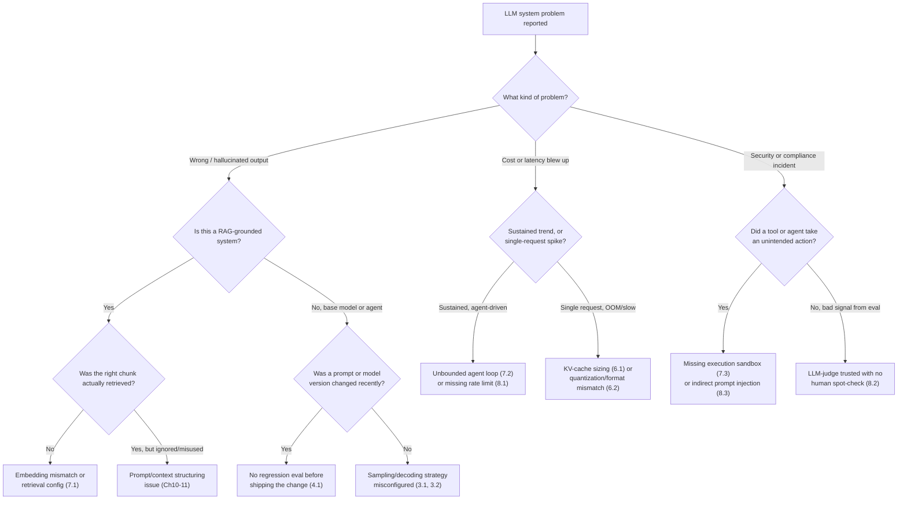

# Chapter 22: Common Mistakes & Pitfalls

*Every mistake in this chapter was, at some point, someone's reasonable-looking decision — this is the catalog of how those decisions failed.*

## Learning Objectives

By the end of this chapter, you will be able to:

- Diagnose production LLM failures by tracing a symptom back to a specific misunderstanding from Chapters 1–20, not a vague "the model is bad"
- Recognize the capacity-planning mistakes that come from ignoring KV-cache growth, context-window limits, and quantization/deployment-target mismatches
- Identify sampling and prompting mistakes that silently degrade output quality without ever throwing an error
- Distinguish "fine-tuning problems" from "retrieval problems" and pick the right tool instead of defaulting to the one you know best
- Explain why agentic systems need explicit iteration bounds, cost ceilings, and execution sandboxes that a single-call LLM system never needed
- Spot evaluation and production mistakes — unvalidated LLM-as-judge scores, no regression testing, no rate limiting — before they become incidents
- Use a stack-wide debugging decision tree to localize a problem to foundations, architecture, training, inference, application, or production
- Given a symptom description, name the specific mistake(s) and the earlier chapter that explains why it happens

## Prerequisites for This Chapter

This chapter assumes you have completed the entire course, Chapters 1–21, and is best read immediately after **[Chapter 21: Best Practices](./21-best-practices.md)** — that chapter is the checklist of what to do; this one is the catalog of what happens when a step on that checklist gets skipped under deadline pressure. Specifically, you should be able to recall:

- **Chapters 2–4 (Foundations)** — bias-variance trade-off, gradient-based training, and why static word embeddings were replaced by contextual, attention-based representations.
- **Chapters 5–7 (Transformers & Architecture)** — what self-attention actually computes, and how KV cache and RoPE positional encoding work well enough to reason about their memory and length-generalization limits.
- **Chapters 8–9 (Tokenization & Sampling)** — how a tokenizer maps text to IDs, and how temperature, top-k/top-p, and beam search each shape the sampled distribution differently.
- **Chapters 10–11 (Prompting & Tool Calling)** — structured prompting, instruction hierarchies, and the mechanics of function/tool calling.
- **Chapters 12–13 (Training & Fine-Tuning)** — the difference between pretraining, SFT, RLHF/DPO, and parameter-efficient fine-tuning (LoRA/QLoRA), and what each is and isn't good for.
- **Chapters 14–15 (Inference & Quantization)** — continuous batching, PagedAttention, and the trade-offs between INT8/GPTQ/AWQ/GGUF quantization formats and speculative decoding.
- **Chapters 16–18 (RAG & Agents)** — embeddings and vector search, the ReAct loop, multi-agent orchestration, and MCP/tool execution.
- **Chapters 19–20 (Production)** — streaming APIs, rate limiting, caching, observability, evaluation (including LLM-as-judge), and prompt-injection defense.
- **[Chapter 21](./21-best-practices.md)** — the positive-framing checklist for all of the above; every mistake below maps to a best practice stated there.

---

### Why This Catalog Spans the Whole Stack

Chapter 21 gave you a checklist because best practices compose: a good tokenizer choice doesn't help if your KV-cache math is wrong, and a well-tuned prompt doesn't help if the RAG index it's grounded on was built with the wrong embedding model. Failures compose the same way, which is why this chapter is organized by the same eight areas as Chapter 21 rather than as a flat list. Most of the mistakes below share one property that makes them dangerous in a way a crash or a stack trace never is: **the system keeps running.** A mismatched quantization format doesn't refuse to load — it just serves slightly wrong logits at a throughput you didn't expect. An unbounded agent loop doesn't error out — it just keeps calling tools until someone notices the bill. Read each entry as a pattern to recognize in your own systems, not a mistake you'd only make once you already know better.

---

## 1. Foundations

### 1.1 Misreading Loss Curves as a Verdict on the Model Instead of a Diagnostic Signal

**Symptom:** A team fine-tunes a model, sees training loss drop smoothly to near zero, and ships it — only to find real-world quality is worse than the base model on held-out queries the fine-tuning set didn't cover.

**Root Cause:** This is the bias-variance trade-off from **Chapter 2**, unrecognized in the wild. A training loss that keeps falling while validation loss stalls or rises is classic overfitting/high-variance behavior — the model has started memorizing the fine-tuning set's specific phrasing rather than learning the general task. Teams that only watch training loss (because it's the number the training script prints most prominently) never see the divergence.

**Fix:** Always track train *and* held-out validation loss side by side, and treat a widening gap as a stop signal, not a footnote. Use early stopping, more regularization (dropout, weight decay), or simply less training data overfitting risk (fewer epochs, LoRA instead of full fine-tuning) — the same toolbox from Chapter 2, applied to an LLM instead of a toy classifier.

### 1.2 Treating Static Word Embeddings and Contextual LLM Embeddings as Interchangeable

**Symptom:** An engineer builds a keyword-expansion or similarity feature using a pretrained Word2Vec/GloVe vector table, then can't explain why it treats "Apple" (the company) and "apple" (the fruit) as the same point in space, or why synonym expansion produces nonsensical results in context.

**Root Cause:** **Chapter 4** covers exactly why static embeddings were a dead end for anything context-sensitive: one vector per surface word form, no way to represent polysemy, and no mechanism for a word's representation to shift based on its sentence. The team applied intuitions and tooling from the pre-Transformer NLP era to a problem that needs contextual representations.

**Fix:** Use contextual embeddings — either the hidden states of a Transformer encoder or a dedicated sentence-embedding model (the same models discussed in **Chapter 16**'s RAG coverage) — for anything where meaning depends on context. Reserve static embeddings for legacy systems or genuinely context-free use cases (e.g., a fixed controlled vocabulary), and know the difference well enough to explain it in a design review.

---

## 2. Transformers & Architecture

### 2.1 Treating Raw Attention Weights as a Faithful Explanation of Model Reasoning

**Symptom:** A team builds an "explainability" feature that highlights the tokens with the highest attention weight from the final layer and presents that as "why the model gave this answer." Stakeholders start making decisions (including compliance-sensitive ones) based on these highlighted tokens, and the explanations occasionally contradict the model's actual stated reasoning in a chain-of-thought trace.

**Root Cause:** **Chapters 5–6** teach what self-attention actually computes — a weighted aggregation of value vectors used as one input among many (residual streams, MLP layers, many stacked layers) to the next representation. It is not a causal trace of "why" the model produced a token, and multi-head, multi-layer attention patterns don't collapse into one clean explanation. Treating raw attention maps as ground-truth reasoning is a category error, not just an imprecise approximation.

**Fix:** For genuine interpretability needs, use methods designed for it — ablation studies, probing classifiers, or mechanistic interpretability techniques — or fall back to asking the model to produce an explicit chain-of-thought and validating *that* against ground truth, understanding it's a post-hoc rationalization, not a certified causal trace either. Don't ship attention-weight visualizations as "explanations" in any context where the stakes justify the word.

### 2.2 Sizing Context Windows Off the Advertised Maximum, Not the Model's Effective Length

**Symptom:** A model is documented as supporting a 128K-token context window, so the team routinely fills prompts to 100K+ tokens. Quality on tasks that depend on information in the middle of that context (not just the start or end) degrades sharply well before the advertised limit, and needle-in-a-haystack-style retrieval within the prompt becomes unreliable.

**Root Cause:** **Chapter 7** covers RoPE and how positional encodings generalize (or don't) beyond the lengths seen during training. A model's *advertised* maximum context length and its *effective* length — the length at which it can actually attend reliably — are different numbers, and the gap is often large. Extending context via RoPE scaling tricks (linear scaling, NTK-aware scaling, YaRN) recovers some but not all of the lost fidelity, and the "lost in the middle" effect compounds the problem independent of RoPE.

**Fix:** Never assume the documented maximum context length equals the reliable operating length. Run your own needle-in-a-haystack-style evaluation against the specific model and prompt-length regime you plan to use in production, and design around the *effective* length — put critical information near the start or end of the prompt, and prefer retrieval/summarization over simply appending everything.

---

## 3. Tokenization & Sampling

### 3.1 Using Beam Search for Open-Ended Chat Generation

**Symptom:** A team switches a chat or creative-writing endpoint from sampling to beam search, expecting "the best possible answer," and instead gets output that is bland, repetitive, and strangely generic — often looping on safe, high-frequency phrasing regardless of the prompt.

**Root Cause:** **Chapter 9** explains why beam search optimizes for the highest-probability *sequence* under the model's distribution, which is exactly the wrong objective for open-ended generation. The most probable sequence overall tends to be the most generic, least surprising one — great for machine translation or short factual completions where there's a single "correct" answer, actively harmful for chat, story generation, or brainstorming where diversity and specificity are the actual goal.

**Fix:** Use temperature + top-p (nucleus) or top-k sampling for open-ended generation, reserving beam search (or greedy decoding) for tasks with a genuinely correct target sequence, like translation, code completion with a strict spec, or structured extraction. If output feels repetitive under sampling instead, the fix is a repetition penalty or higher temperature — not beam search.

### 3.2 Assuming `temperature=0` Means Fully Deterministic Output

**Symptom:** A team sets `temperature=0` expecting bit-for-bit reproducible outputs for a regression-testing or audit use case, then discovers the same prompt occasionally returns a different completion across runs.

**Root Cause:** **Chapter 9** covers what temperature actually does to the softmax distribution — at `temperature=0` it should collapse to pure greedy (argmax) decoding, but that guarantee only holds if nothing else in the serving stack introduces nondeterminism. In practice, continuous batching (**Chapter 14**) can change floating-point accumulation order depending on what else is in the batch, GPU kernel nondeterminism exists at the hardware level, and some providers apply a small amount of sampling noise even at "zero" temperature for load-balancing across replicas.

**Fix:** Don't treat `temperature=0` as a reproducibility guarantee for anything audit-critical. If you need reproducibility, pin the model version, request seeded generation where the API supports it, and validate empirically with repeated calls rather than assuming the parameter name implies determinism.

---

## 4. Prompting & Tool Calling

### 4.1 Shipping a Prompt Change With No Regression Evaluation

**Symptom:** A "small" prompt tweak — rewording an instruction, adding a new example, adjusting the system message — ships straight to production because it "read better" in a handful of manual tests. Two days later, a different, previously reliable task type starts failing in ways no one connects to the prompt change until someone finally diffs the prompt history.

**Root Cause:** This is the single most common way **Chapter 20**'s evaluation practices get skipped, and it happens because a prompt change *feels* like copy editing rather than a code change — it doesn't go through the same review or testing discipline as a function signature change would, even though it changes the model's behavior just as much. Prompts are load-bearing production logic that happens to be written in English.

**Fix:** Treat every prompt change like any other production change: run it against a regression eval set (the same golden-dataset discipline from **Chapters 16 and 20**) covering the range of task types the prompt serves, not just the one you were trying to improve, before shipping. Version prompts in source control with the same review process as code, and diff behavior on the eval set, not just "does this one example look better now."

### 4.2 Overloading a Single Prompt With Conflicting Responsibilities

**Symptom:** One system prompt tries to set a persona, enforce an output format, apply safety constraints, and provide task instructions all at once. As the conversation or input grows longer, the model starts dropping the format instructions in favor of the persona, or vice versa — inconsistently, and worse under longer inputs.

**Root Cause:** **Chapter 10** covers prompt structuring and instruction hierarchy, and the practical reality it teaches is that models weight and attend to instructions unevenly, especially as competing instructions pile up and the "lost in the middle" effect (also relevant to **Chapter 7**) pushes earlier instructions further from the generation point.

**Fix:** Decompose responsibilities instead of cramming them into one prompt — use prompt chaining or a structured template that separates persona/system framing, task instructions, and output-format constraints into distinct, clearly delimited sections (as covered in **Chapter 10**), and use structured output / tool-calling schemas (**Chapter 11**) to enforce format mechanically rather than through instruction alone.

---

## 5. Training & Fine-Tuning

### 5.1 Fine-Tuning to Inject Knowledge When RAG Was the Right Tool

**Symptom:** A team wants the model to "know about" their internal product documentation, which changes weekly, so they fine-tune on it. Within a month, the fine-tuned model is confidently answering questions using stale information from the training snapshot, and every documentation update requires a full retraining cycle to take effect.

**Root Cause:** **Chapters 12–13** are explicit that fine-tuning changes *how* a model behaves (style, format, task adherence) far more reliably than it injects *durable, updatable factual knowledge* — gradient updates on a modest dataset nudge weights, they don't reliably overwrite or append specific facts the way a database write does, and whatever facts do get absorbed are frozen at training time. **Chapter 16** covers the tool actually built for this: retrieval, which fetches current facts at query time.

**Fix:** Use fine-tuning for behavior — tone, output format, domain-specific instruction-following, tool-use patterns — and use RAG for facts, especially facts that change. If you truly need both (specialized behavior *and* current facts), combine them: fine-tune for behavior, retrieve for knowledge. Don't reach for retraining as your update mechanism for anything that changes on a timescale shorter than your retraining cadence.

### 5.2 Catastrophic Forgetting From Naive Supervised Fine-Tuning

**Symptom:** After SFT on a narrow task (say, a specific customer-support format), the model gets noticeably better at that task but also starts failing at general instruction-following, refusing benign requests it used to handle fine, or losing multi-turn coherence it had before — capabilities nobody intentionally trained away.

**Root Cause:** **Chapter 12** covers why this happens: fine-tuning on a narrow, homogeneous dataset with too high a learning rate or too many epochs pulls the model's weights away from the broad distribution it was aligned on during pretraining/RLHF, degrading capabilities the new dataset never exercised. This is especially easy to trigger with full fine-tuning and less likely (but not impossible) with a modest-rank LoRA adapter (**Chapter 13**), which constrains how far weights can move.

**Fix:** Mix general instruction-following examples into the fine-tuning set alongside the narrow task data, use a conservative learning rate and few epochs, prefer LoRA/QLoRA over full fine-tuning unless you have strong evidence you need the extra capacity, and evaluate on *general* benchmarks after fine-tuning, not just the target task, to catch forgetting before it ships.

---

## 6. Inference & Quantization

### 6.1 Ignoring KV-Cache Memory Growth When Sizing Context Windows and Batch Sizes

**Symptom:** A service handles a handful of concurrent long-context requests fine in staging, then hits GPU out-of-memory errors or falls back to aggressive request queuing/rejection in production the moment concurrency and context length both grow — well before the GPU's raw compute would suggest it should struggle.

**Root Cause:** **Chapter 7** establishes that the KV cache grows linearly with sequence length, number of layers, and number of attention heads, *per request* — and **Chapter 14** shows that in a continuously-batched server, every concurrent request holds its own KV cache in GPU memory simultaneously. Teams that size batch capacity off compute (FLOPs) or off a single-request memory test miss that memory, not compute, is usually the binding constraint, and that constraint scales with the product of concurrency and context length, not either alone.

**Fix:** Capacity-plan explicitly around KV-cache memory: compute expected cache size per request (`2 × layers × heads × head_dim × seq_len × batch × bytes_per_element`, doubled for K and V), and use PagedAttention-style memory management (**Chapter 14**) to avoid fragmentation. Set explicit maximum context length and maximum concurrent-sequence limits per GPU based on that math, not on a compute estimate, and monitor GPU memory utilization as a first-class production metric alongside latency.

### 6.2 Picking a Quantization Format Mismatched to the Deployment Target

**Symptom:** A model quantized with GPTQ runs great on the engineer's development GPU but throughput or compatibility is poor on the actual production inference server; or a GGUF-quantized model chosen for CPU/edge deployment gets deployed onto a GPU-serving stack and underperforms a GPU-native format badly.

**Root Cause:** **Chapter 15** covers that GPTQ, AWQ, and GGUF are not interchangeable "just pick the smallest file" choices — they target different hardware and serving stacks (GPTQ/AWQ are GPU-kernel-optimized formats designed for frameworks like vLLM/TGI; GGUF is designed for CPU and mixed CPU/GPU inference via llama.cpp-family runtimes) and have different accuracy/throughput trade-offs depending on batch size and hardware. Choosing based on "smallest download" or "what the tutorial used" ignores the actual serving target.

**Fix:** Choose the quantization format based on where and how the model will actually be served — GPU-serving stacks with batching (vLLM, TGI) generally want AWQ or GPTQ; CPU or edge/local deployment wants GGUF; and either way, benchmark throughput and accuracy on the *target* hardware, not the development machine, before committing to a format across a fleet.

### 6.3 Trusting Speculative Decoding to Speed Up Every Generation Task

**Symptom:** A team enables speculative decoding fleet-wide expecting a uniform latency win, then finds some workloads (especially creative/high-temperature generation) get *slower*, not faster, and GPU utilization actually rises for the same throughput.

**Root Cause:** **Chapter 15** explains that speculative decoding's speedup depends entirely on the draft model's acceptance rate against the target model — how often the small draft model's guesses match what the large target model would have produced. High-entropy, creative, high-temperature generation has an inherently lower acceptance rate (there's no single "obviously correct" next token to predict), so the overhead of running the draft model and verifying/rejecting its guesses can exceed the savings.

**Fix:** Measure acceptance rate per workload before enabling speculative decoding broadly, use a draft model genuinely distilled from or aligned with the target model's distribution, and reserve it for lower-entropy workloads (code completion, structured extraction, low-temperature factual generation) where acceptance rates are high — don't treat it as a free, universal toggle.

---

## 7. RAG & Agents

### 7.1 Embedding-Model Mismatch Between Index-Time and Query-Time

**Symptom:** Retrieval quality that used to be solid degrades to near-random almost overnight — similarity scores stop correlating with actual relevance, and nobody changed the retrieval code.

**Root Cause:** **Chapter 16** covers embeddings and vector databases, and the failure here is almost always a silent one: the corpus was embedded with one model version, and a config change, library upgrade, or provider migration switched the *query-time* embedding call to a different model without re-embedding the existing index. Different embedding models produce vector spaces that aren't compatible with each other, even at the same dimensionality — cosine similarity between vectors from two different models is close to meaningless.

**Fix:** Treat the embedding model identifier as part of the index's schema, not a runtime parameter — store it as index metadata, assert it matches at query time (fail loudly on mismatch rather than silently returning garbage results), and re-embed the *entire* corpus any time the embedding model changes. There is no safe partial migration.

### 7.2 Treating a Multi-Agent System as Deterministic and Not Bounding Iteration or Cost

**Symptom:** An agentic workflow (planner/executor, ReAct loop, or multi-agent handoff) that works fine in demos occasionally runs for far longer than expected in production — sometimes minutes, sometimes until someone notices an anomalous bill — retrying, re-planning, or bouncing between agents without ever reaching a terminal state.

**Root Cause:** **Chapters 17–18** teach the ReAct loop and multi-agent orchestration as a *loop* — think, act, observe, repeat — and a loop without an explicit exit condition is exactly as risky as an unbounded `while True` in traditional software, except each iteration costs real money and real latency instead of just CPU cycles. Because LLM outputs are non-deterministic, a plan that terminates cleanly in testing can loop indefinitely in production if the model hits an edge case, a tool returns an unexpected error, or two agents talk past each other.

**Fix:** Bound every agent loop with an explicit maximum iteration count, a wall-clock timeout, and a hard cost/token budget per task, and design an explicit failure/escalation path for when those bounds are hit (return partial results, ask a human, or fail cleanly) rather than assuming the loop will always self-terminate. Log iteration count and cost per task as a first-class metric, not just final success/failure.

### 7.3 Not Sandboxing Agent Tool Execution

**Symptom:** An agent with shell, code-execution, or file-system tool access does something destructive or unexpected — deletes files it shouldn't, makes an outbound network call to an unintended host, or executes a command derived from untrusted input (a tool result, a retrieved document, a user message) — and it happens on a machine with real production access.

**Root Cause:** **Chapters 17–18** cover tool calling and MCP as the mechanism that lets an LLM trigger real-world side effects, but the mechanism itself carries no safety guarantee — the model decides *what* to call based on probabilistic generation, not a verified plan, and any content the agent has seen (including tool outputs and retrieved documents, not just the original user prompt) can influence what it decides to call next. Running that execution directly against production infrastructure means a bad or manipulated decision has real consequences.

**Fix:** Execute agent tool calls inside a sandbox — a container or VM with least-privilege permissions, restricted network egress, and no access to credentials or systems beyond what the specific task requires — and add a confirmation or policy-check gate for any irreversible or high-impact action (deletions, payments, outbound writes). Never grant an agent the same ambient privileges as the engineer who built it.

---

## 8. Production

### 8.1 No Rate Limiting, Leading to a Cost Blowup

**Symptom:** A cloud bill spikes 10–50x overnight with no corresponding spike in legitimate user traffic — sometimes traced to a single misbehaving client, a retry loop in a downstream service, or a scraped/abused public endpoint.

**Root Cause:** **Chapter 19** covers rate limiting as a production-readiness requirement precisely because LLM API calls have a cost structure unlike most web endpoints — a single request can cost cents to dollars depending on context length and output length, and a client-side bug that retries aggressively or an agent stuck in the loop from Mistake 7.2 can multiply that cost with no natural ceiling unless the server enforces one.

**Fix:** Implement per-user/per-API-key rate limiting and token-based quotas (not just requests-per-second) as covered in **Chapter 19**, set hard budget alerts and circuit breakers that degrade or halt service rather than let spend run unbounded, and treat "cost per hour" as a monitored production metric with an alert threshold, exactly like latency or error rate.

### 8.2 Trusting an LLM-as-Judge Eval Without Any Human Spot-Check

**Symptom:** An automated evaluation pipeline reports steadily high scores from an LLM-as-judge, the team ships confidently on the strength of those scores, and then a customer or internal user surfaces a batch of clearly bad outputs that the judge had scored well.

**Root Cause:** **Chapter 20** covers LLM-as-judge as a scalable but imperfect proxy for human judgment — judges have their own biases (they tend to favor longer, more confident-sounding, or more verbosely-formatted answers regardless of correctness), can be fooled by the same class of subtly-wrong content a generation model produces, and can drift when the underlying judge model is silently upgraded by its provider. Treating a judge score as ground truth rather than a proxy removes the one check that catches judge blind spots.

**Fix:** Periodically sample judge-scored outputs for human review (a small, consistent percentage, not a one-time calibration) as covered in **Chapter 20**, track agreement between human and judge scores over time as its own metric, and re-validate the judge's calibration whenever the judge model, the judged model, or the task changes — an eval pipeline with no human in the loop anywhere is not actually validated, just automated.

### 8.3 Treating Prompt-Injection Defense as a One-Time Input Filter

**Symptom:** A team adds input sanitization/filtering on the user's initial message to block obvious prompt-injection attempts, considers the defense complete, and is later surprised when an agent with tool access is manipulated into an unintended action by content embedded in a retrieved document, a scraped web page, or a tool's return value — content the original filter never saw.

**Root Cause:** **Chapter 20** covers prompt injection as a threat that doesn't only arrive through the user-facing input box — any content the model reads becomes part of its effective instruction stream, including retrieved RAG context (**Chapter 16**) and tool/function call results (**Chapters 17–18**). Filtering only the literal user message defends against the least sophisticated version of the attack and leaves every indirect channel wide open.

**Fix:** Apply injection defense in depth: sanitize and clearly delimit *all* untrusted content the model will read (user input, retrieved documents, tool outputs) as distinct from system instructions, apply least-privilege scoping to what any given tool call is allowed to do (compounding with the sandboxing fix in 7.3), and add output-side monitoring for anomalous tool-call patterns rather than assuming input filtering alone is sufficient.

---

## 9. Debugging Decision Tree: From Symptom to Root Cause

Use this tree to localize a reported problem to the right layer of the stack before diving into any one chapter's fixes — the same "diagnose before you redesign" discipline as any complex distributed system.

Work top-down: rule out data/retrieval problems before blaming the model, rule out configuration and recent changes before reaching for an architectural rewrite, and always check whether the "bug" is actually a missing bound (iteration count, cost, context length) rather than a logic error.

---

## Real-World Scenario

**Company:** A mid-size SaaS company builds an internal "on-call agent" — a LangGraph-based multi-agent system with a planner agent and an executor agent that has real `kubectl` and shell access to triage and, where confident, auto-remediate infrastructure alerts overnight.

**The setup:** Under a tight deadline, the team shipped three things they intended to "harden later": the executor agent's ReAct loop had no maximum iteration count or timeout, because in every test run it terminated cleanly within 3–4 steps (Mistake 7.2). The executor ran with the same production Kubernetes service-account credentials as the on-call engineer it was meant to assist, with no sandbox or scoped-down permissions, because building a properly scoped execution environment felt like it could wait until after the pilot proved useful (Mistake 7.3). And the LLM API calls behind both agents had no per-session token budget or cost circuit breaker — just the provider's default account-level quota, which was generously high (Mistake 8.1).

**The incident:** Over a holiday weekend, a genuinely flaky health-check endpoint started returning inconsistent status codes — not down, just intermittently slow. The planner agent kept re-diagnosing the same alert as newly urgent each time the flaky check flipped, dispatching the executor to "remediate" it again. Because the executor agent had unrestricted `kubectl` access and no confirmation gate for destructive actions, one of its remediation attempts — a pod restart that cascaded into a StatefulSet rollout it wasn't actually confident about, but generated with high confidence anyway — took down a dependent service that had been healthy the whole time. The planner then treated *that* outage as a new, higher-priority alert, and the loop accelerated: more planning calls, more executor actions, more collateral remediation attempts, all weekend, with no iteration cap to stop it and no cost alert to flag the anomalous API spend climbing in the background.

**Diagnosis:** Following a debugging tree much like the one in Section 9, the on-call engineer who eventually noticed the outage on Monday first asked whether this was a single bad decision or a sustained pattern — logs showed a sustained, agent-driven pattern of dozens of planning/execution cycles over 36 hours, pointing straight at Mistake 7.2 (no iteration bound). Digging into *why* one bad remediation attempt turned into a cascading outage pointed at Mistake 7.3 — the executor had no scoped-down permissions and no gate on irreversible actions, so a low-confidence decision executed with the same blast radius as a high-confidence one. And the fact that nobody was paged by cost or usage anomalies before the outage itself surfaced pointed at Mistake 8.1 — there was no budget alert that would have flagged the unusual overnight API volume hours before the infrastructure impact became visible.

**The fix:** Three changes, mapped directly to the mistakes above:
1. Added a hard maximum iteration count and wall-clock timeout to the planner/executor loop, with an explicit "escalate to a human, take no further action" terminal state (fix for 7.2).
2. Moved the executor to a scoped-down service account with permissions limited to read-only diagnostics and a narrow allowlist of pre-approved, reversible remediation actions, with any destructive action requiring human confirmation (fix for 7.3).
3. Added a per-session and per-hour token/cost budget with an automatic circuit breaker and a paging alert on anomalous spend, independent of whether any infrastructure metric had yet been affected (fix for 8.1).

The team also added the flaky health-check's exact failure pattern to their agent evaluation set, ensuring a future version of the loop-bounding logic would be tested against it before shipping — a small instance of the regression-eval discipline from Mistake 4.1.

---

## Common Mistakes — Quick Reference

| # | Mistake | Symptom | Fix | Chapter |
|---|---|---|---|---|
| 1.1 | Misreading loss curves | Training loss near zero, real-world quality worse than baseline | Track train + validation loss, early stop on divergence | Ch 2 |
| 1.2 | Static vs. contextual embeddings confused | Polysemous words treated as identical; nonsensical synonym expansion | Use contextual/sentence embeddings for context-sensitive tasks | Ch 4 |
| 2.1 | Attention weights treated as explanations | Highlighted tokens contradict the model's own stated reasoning | Use probing/ablation for interpretability, not raw attention maps | Ch 5-6 |
| 2.2 | Context sized off advertised, not effective, length | Quality collapses on mid-context info well before advertised limit | Test effective length with needle-in-haystack evals; place critical info at edges | Ch 7 |
| 3.1 | Beam search for open-ended chat | Bland, repetitive, generic output | Use temperature/top-p/top-k sampling instead | Ch 9 |
| 3.2 | `temperature=0` assumed deterministic | Same prompt returns different completions across runs | Pin model version, use seeded generation, verify empirically | Ch 9 |
| 4.1 | Prompt change shipped with no regression eval | Unrelated task type breaks after an unrelated prompt tweak | Version prompts, run full regression eval set before shipping | Ch 20 |
| 4.2 | One prompt with conflicting responsibilities | Format/persona instructions dropped inconsistently on longer inputs | Decompose via chaining and structured output schemas | Ch 10-11 |
| 5.1 | Fine-tuning used for durable/updatable facts | Model confidently answers with stale training-time information | Use RAG for facts, fine-tuning for behavior | Ch 12, 16 |
| 5.2 | Catastrophic forgetting from narrow SFT | General instruction-following degrades after narrow-task fine-tuning | Mix general data in, conservative LR/epochs, prefer LoRA | Ch 12-13 |
| 6.1 | KV-cache growth ignored in capacity planning | OOM or throttling at high concurrency + long context, compute looks fine | Capacity-plan on KV-cache memory math, not FLOPs | Ch 7, 14 |
| 6.2 | Quantization format mismatched to deployment target | Poor throughput/compatibility after moving off the dev machine | Match GPTQ/AWQ to GPU serving, GGUF to CPU/edge; benchmark on target hardware | Ch 15 |
| 6.3 | Speculative decoding trusted universally | High-entropy/creative generation gets slower, not faster | Measure acceptance rate per workload before enabling broadly | Ch 15 |
| 7.1 | Embedding model mismatch, index vs. query | Retrieval quality collapses overnight with no code change | Version index by embedding model; re-embed fully on any change | Ch 16 |
| 7.2 | Multi-agent loop with no iteration/cost bound | Agent runs far longer than expected; anomalous spend | Hard iteration cap, timeout, and cost budget with escalation path | Ch 17-18 |
| 7.3 | Agent tool execution not sandboxed | Destructive/unexpected action from manipulated or low-confidence tool call | Least-privilege sandbox, confirmation gate on irreversible actions | Ch 17-18 |
| 8.1 | No rate limiting | Cloud bill spikes 10-50x with no matching traffic spike | Per-user/key rate limits, token quotas, budget alerts and circuit breakers | Ch 19 |
| 8.2 | LLM-as-judge trusted with no human spot-check | High eval scores despite a batch of clearly bad real outputs | Sample judge outputs for human review continuously, track agreement | Ch 20 |
| 8.3 | Prompt-injection defense limited to user input | Agent manipulated via retrieved/tool-output content, not the user message | Defense in depth across all untrusted content channels, least-privilege tools | Ch 16-20 |

---

## Summary

Nearly every mistake in this chapter shares the same shape as the ones in the RAG-specific catalog you may have already studied: each is a reasonable-looking shortcut that is invisible in a demo and silent in production until it isn't. Foundational misunderstandings (misreading loss curves, conflating static and contextual embeddings) produce confusion that looks like a training or a data problem but is really a conceptual gap from Chapters 2–4. Architecture mistakes (over-trusting attention as explanation, sizing context off the advertised rather than effective limit) come from treating Chapter 5–7 internals as black boxes instead of mechanisms with real limits. Tokenization and sampling mistakes (beam search for chat, assuming temperature-zero determinism) come from picking a decoding strategy without understanding what objective it actually optimizes. Prompting mistakes (no regression eval, overloaded instructions) treat natural-language production logic with less rigor than code, despite it having just as much behavioral surface area. Training mistakes (fine-tuning for facts instead of RAG, catastrophic forgetting) come from reaching for the tool you know instead of the tool that matches the problem. Inference mistakes (ignoring KV-cache growth, quantization/deployment mismatch, blind trust in speculative decoding) come from capacity-planning off the wrong resource or benchmarking on the wrong hardware. RAG and agent mistakes (embedding drift, unbounded loops, unsandboxed tools) come from applying single-call-system assumptions to systems that retrieve, iterate, and act in the real world. And production mistakes (no rate limiting, unvalidated LLM-judge trust, shallow injection defense) come from treating operational rigor as optional polish rather than the thing standing between a working demo and an incident. The fix for essentially every mistake here was already taught earlier in this course — this chapter's job was to make each failure mode recognizable *before* you're the one debugging it at 2 a.m.

## Knowledge Check

1. A fine-tuned model's training loss dropped smoothly to near zero, but production quality is worse than the base model on queries outside the fine-tuning set. Which chapter's concept explains the root cause, and what single additional metric would have caught it earlier?
2. A production service starts hitting GPU out-of-memory errors only when concurrency *and* context length are both high, even though raw compute utilization looks fine. Which earlier chapter's mechanism is the actual bottleneck, and why doesn't a compute-based capacity estimate catch it?
3. A team enables beam search on their customer-facing chatbot expecting better answers and gets blander, more repetitive ones instead. Explain what beam search is actually optimizing for, and why that objective is wrong for this use case.
4. An agent-based on-call system runs for 36 hours unattended before anyone notices something is wrong. Name two distinct missing safeguards that each independently should have caught this sooner, and explain how you'd tell from the logs which one(s) were actually absent.
5. A team's automated eval scores stay high for months, then a customer reports a batch of clearly bad outputs the eval never flagged. What does this suggest was missing from their evaluation setup, and why does a consistently high score not rule out this gap?
6. Retrieval quality collapses overnight with no code changes to the retrieval logic itself. What's the most likely root cause, and what specific piece of index metadata would have caught it before it reached production?

## Hands-On Exercise

A platform team reports the following symptoms about their internal "research assistant" system, which combines a RAG pipeline over internal wikis with a multi-step agent that can also call a web-search tool and a code-execution tool:

- Roughly once a week, a single user's session runs up an unusually large API bill — sometimes 20-30x a typical session — with no clear pattern in what they asked.
- When engineers manually inspect vector search results for questions they know the wiki can answer, the right page is often retrieved, but the answer the assistant gives frequently ignores it and answers from general knowledge instead, sometimes incorrectly.
- The code-execution tool was added last month to let the assistant verify calculations. It runs with the same permissions as the backend service account, because "it's just doing quick math, it should be fine."
- Six months ago the team switched their embedding provider to cut costs, updating only the query-time embedding call in the retrieval service; the wiki index itself was never re-embedded because "the dimensions still matched, so it should still work."

**Your task:**

1. Identify at least four distinct mistakes from this chapter that these symptoms point to, citing the specific subsection for each.
2. For each mistake, state exactly which sentence in the description is your evidence — don't just assert the mistake, connect it to the observed behavior.
3. Two of these mistakes compound to make the "ignores the wiki page it retrieved" symptom worse than either alone would explain. Identify which two, and explain the compounding mechanism.
4. Propose an order of operations for fixing all four — which one would you fix first, and why, given that fixing it makes verifying the others easier or safer?

## Further Reading

- Anthropic — "Building Effective Agents" (on bounding agent complexity, iteration, and cost — directly relevant to Section 7.2)
- OWASP Top 10 for Large Language Model Applications — especially "Excessive Agency" and "Prompt Injection," relevant to Sections 7.3 and 8.3
- Kwon et al. — "Efficient Memory Management for Large Language Model Serving with PagedAttention" (the vLLM paper, the definitive reference for Section 6.1's KV-cache math)
- Hugging Face — "Overview of natively supported quantization schemes" (comparing GPTQ, AWQ, and GGUF trade-offs by deployment target, relevant to Section 6.2)
- Simon Willison — writings on prompt injection in LLM applications (ongoing series documenting real indirect-injection incidents, relevant to Section 8.3)
- Chip Huyen — "Building LLM Applications for Production" (on evaluation pitfalls, including the limits of LLM-as-judge, relevant to Section 8.2)

  <a href="./21-best-practices.md">← Previous: Best Practices</a>
  <a href="./00-index.md">🏠 Index</a>
  <a href="./23-tools-and-ecosystem-landscape.md">Next: Tools, Papers & Ecosystem Landscape →</a>

