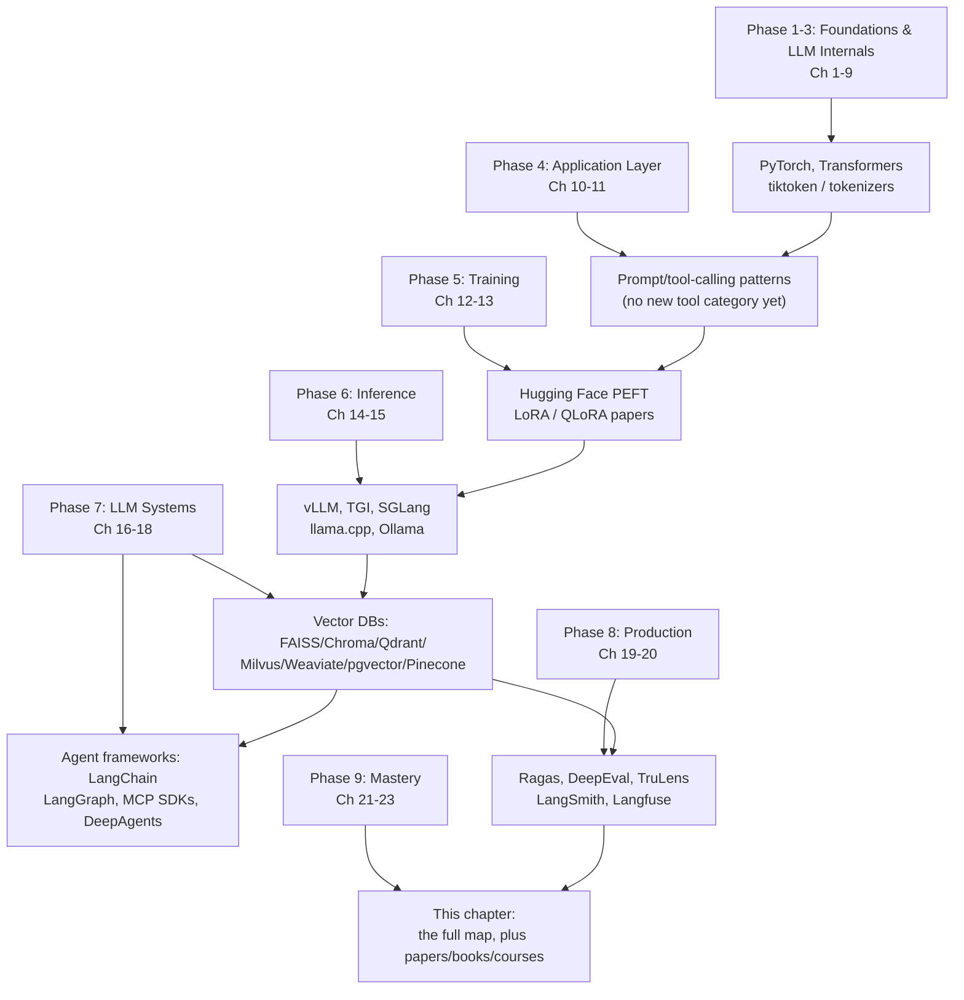

# Chapter 23: Tools, Papers & Ecosystem Landscape

*You now understand attention math, KV caches, LoRA ranks, and PagedAttention well enough to have opinions about them. This chapter is the map of the territory you've earned the right to read — every tool, book, and paper placed next to the concept it implements.*

## Learning Objectives

By the end of this chapter, you will be able to:

- Place every major LLM tool — training library, inference engine, agent framework, vector database, evaluation platform — into the category of problem it solves, and explain that problem in your own words
- Compare inference/serving engines (vLLM, TGI, SGLang, llama.cpp, Ollama) on target hardware, defining feature, and when each is the right default
- Compare agent/orchestration frameworks and vector databases on the axes that actually drive a production choice: scale, ops overhead, and team expertise
- Recite the thirteen foundational papers of the modern LLM era in reading order, and explain in one or two sentences what each one introduced
- Identify which book or course to reach for depending on whether you need engineering intuition, a from-scratch implementation, or deep theoretical grounding
- Build a habit of tracking the fast-moving parts of this landscape (papers, model releases, framework versions) without needing to re-learn the fundamentals each time
- Apply a structured decision process to pick a concrete stack for a hypothetical project, given constraints on team size, budget, latency, and data residency

## Prerequisites for This Chapter

This chapter assumes you've been through the whole course — it doesn't teach anything new, it organizes what you already know. Use this as a checklist of the mental models each tool category will hang on:

- **Chapters 2–3 (ML/DL fundamentals)** — you know what a training loop, loss function, and optimizer are, so "PyTorch is the tensor/autograd substrate everything else sits on" is not just a name to memorize.
- **Chapters 5–7 (Attention, Transformer, LLM architecture)** — you know what a KV cache and attention computation actually are, so vLLM's PagedAttention and FlashAttention's tiling tricks in Section 2 will read as concrete engineering solutions to a memory problem you can name, not magic.
- **Chapter 8 (Tokenization)** — tiktoken and Hugging Face `tokenizers` in Section 1 are the production implementations of the BPE/SentencePiece algorithms you already traced by hand.
- **Chapters 12–13 (Training, SFT, RLHF/DPO, LoRA/QLoRA)** — Hugging Face PEFT and the LoRA/QLoRA papers in this chapter are the tools and sources behind the fine-tuning math you derived.
- **Chapters 14–15 (Inference optimization, quantization)** — vLLM, TGI, SGLang, and llama.cpp are competing production answers to the continuous-batching and quantization trade-offs you reasoned through there.
- **Chapters 16–18 (RAG, agents, MCP/LangGraph)** — the vector database and agent-framework comparisons in this chapter are the ecosystem view of the individual tools you already used hands-on.
- **Chapter 20 (Observability, evaluation, security)** — Ragas, DeepEval, TruLens, LangSmith, and Langfuse are the concrete products behind the evaluation and monitoring concepts introduced there.
- **Chapters 21–22 (Best practices, pitfalls)** — this chapter is the reference you come back to *after* internalizing those lessons, when you're choosing which tool to apply them with.

If any of the names above are unfamiliar rather than "oh right, that's the tool for X" — that's a signal to skim back to the referenced chapter before treating this one as a lookup table.

---

## 1. Core Libraries

**The problem they solve**: every LLM system, no matter how many frameworks sit on top of it, ultimately bottoms out in a small set of libraries that define tensors, load model weights, tokenize text, and produce embeddings. These are the load-bearing layer — you may rarely call them directly once you're working through higher-level frameworks, but everything else is built on top of them.

### PyTorch

The dominant deep learning framework for research and production LLM work — tensors, autograd, and `nn.Module` are the substrate every architecture in Chapters 3–7 was described in terms of. Almost every open-weight model (Llama, Mistral, Qwen, etc.) ships PyTorch weights first, and virtually every training and inference library in this chapter (Transformers, PEFT, vLLM, TGI) is built on top of it. TensorFlow and JAX remain relevant in specific research and Google-ecosystem contexts, but for the LLM application/systems-engineer path this course targets, PyTorch is the default assumption.

### Hugging Face Transformers

The single most important library for *using* pretrained models: a unified `AutoModel`/`AutoTokenizer` API that loads thousands of architectures (BERT, GPT-2, Llama, Mistral, Qwen, and more) with a few lines of code, plus a `Trainer` class for fine-tuning. It is the reference implementation most papers' official code releases are compared against, and the Hugging Face Hub (Section 11) is where the weights, configs, and tokenizers it loads actually live. If you've called `from_transformers import AutoModelForCausalLM` anywhere in this course's exercises, this is the library.

### Hugging Face PEFT (Parameter-Efficient Fine-Tuning)

The library that implements LoRA, QLoRA, prefix tuning, and other parameter-efficient methods from Chapter 13 as a thin wrapper around any Transformers model — `get_peft_model(model, lora_config)` and you're fine-tuning a fraction of a percent of the parameters. It's the practical answer to "I understand the LoRA math, how do I actually run it" without hand-writing low-rank adapter injection yourself.

### tiktoken / Hugging Face `tokenizers`

`tiktoken` is OpenAI's fast BPE tokenizer implementation (Rust core, Python bindings) used by the GPT model family — the concrete tool behind the BPE mechanics from Chapter 8. Hugging Face's `tokenizers` library is the equivalent for the open-model ecosystem, implementing BPE, WordPiece, and Unigram/SentencePiece-style tokenizers with the same fast Rust core, and is what every `AutoTokenizer.from_pretrained(...)` call in the Transformers library actually runs under the hood.

### sentence-transformers

The standard library for producing sentence/passage-level embeddings (the vectors that feed vector databases in Section 4 and RAG pipelines in Chapter 16) — it wraps encoder models with pooling and similarity utilities so you get a usable embedding with `model.encode(text)` instead of hand-rolling mean-pooling over token embeddings. Many of the open embedding models on the MTEB leaderboard ship a `sentence-transformers`-compatible checkpoint specifically so they plug into this library with zero extra code.

---

## 2. Inference & Serving Engines

**The problem they solve**: a model checkpoint loaded with `transformers` and run token-by-token in a naive Python loop is *correct* but far too slow and memory-hungry to serve real traffic. Serving engines add continuous batching, KV-cache management (PagedAttention and friends from Chapter 14), quantization support, and an OpenAI-compatible API layer, turning a checkpoint into a production endpoint.

### vLLM

The engine most associated with the PagedAttention breakthrough (Chapter 14): it manages the KV cache as non-contiguous, fixed-size blocks (like OS virtual memory pages) instead of one large contiguous buffer per request, which eliminates fragmentation and lets continuous batching pack far more concurrent requests onto the same GPU memory. It's the closest thing to a default choice for GPU-based, high-throughput serving of open-weight models, with broad model support and an OpenAI-compatible server built in.

### Text Generation Inference (TGI)

Hugging Face's production serving engine, tightly integrated with the Transformers/Hub ecosystem (a model card on the Hub often includes a one-command TGI deploy path). It supports continuous batching, tensor parallelism, and quantization similarly to vLLM, and is a natural choice if your team is already standardized on Hugging Face tooling end to end.

### SGLang

A newer serving engine built around a structured generation language and runtime — it adds first-class support for complex generation patterns (constrained/structured output, multi-call agent-style programs, prefix sharing across calls) with a RadixAttention scheme for KV-cache reuse across requests that share a prefix. It tends to win specifically on workloads with heavy prompt-prefix reuse (few-shot templates, agent loops calling the same system prompt repeatedly) or complex structured-output constraints.

### llama.cpp

A C/C++ inference engine originally built to run Llama models on a MacBook CPU with no GPU at all — it popularized the GGUF quantization format (Chapter 15) and remains the reference implementation for running quantized LLMs efficiently on CPUs, Apple Silicon (via Metal), and consumer GPUs. It's the engine underneath most "run an LLM on your laptop" tooling, including Ollama below.

### Ollama

A thin, extremely developer-friendly wrapper around llama.cpp-style inference: `ollama run llama3` downloads, quantizes-if-needed, and serves a model with one command and a simple local REST API. It trades raw throughput and multi-GPU scaling (vLLM's strengths) for near-zero setup friction, making it the default choice for local development, prototyping, and single-user desktop applications rather than production multi-tenant serving.

### Comparison Table

| Engine | Target Hardware | Key Feature | When to Choose |
|---|---|---|---|
| **vLLM** | GPU (single or multi-node) | PagedAttention + continuous batching for max throughput | Production serving of open-weight models at meaningful concurrent load |
| **TGI** | GPU | Deep Hugging Face Hub/ecosystem integration | Teams already standardized on the Hugging Face stack end to end |
| **SGLang** | GPU | RadixAttention (prefix-sharing KV cache) + structured generation | Agentic workloads with repeated prefixes, or heavy structured-output constraints |
| **llama.cpp** | CPU / Apple Silicon / consumer GPU | GGUF quantization, minimal dependencies | Running quantized models with no dedicated GPU/data-center hardware |
| **Ollama** | Laptop / desktop (CPU or consumer GPU) | One-command local model serving | Local development, prototyping, single-user desktop apps |

---

## 3. Agent & Orchestration Frameworks

**The problem they solve**: once an LLM call needs to loop, call tools, maintain state across turns, or coordinate multiple specialized agents — the patterns from Chapters 17–18 — a bare API call isn't enough. These frameworks provide the plumbing for prompt assembly, tool-calling loops, state/memory management, and (for MCP) a standardized protocol for exposing tools to any compliant client.

### LangChain

The broadest orchestration framework by ecosystem size, with hundreds of integrations for document loaders, vector stores, and model providers behind common interfaces (`Runnable`, `Chain`). Its strength is breadth and the sheer volume of examples for almost any use case; its main cost is a large, fast-evolving API surface that can make older tutorials subtly wrong.

### LangGraph

Built by the LangChain team specifically for the agentic, stateful patterns that a linear chain can't express: agents are modeled as an explicit graph of nodes and edges with persisted state, conditional branching, and first-class support for human-in-the-loop checkpoints. It's the tool referenced throughout Chapter 18 for building ReAct-style loops and multi-agent graphs with fine-grained control over exactly when the agent pauses, branches, or hands off.

### MCP SDKs (Model Context Protocol)

Not a framework in the LangChain/LangGraph sense but a standardized protocol (with official SDKs in Python, TypeScript, and other languages) for exposing tools, resources, and prompts from a server to any compliant LLM client — the point covered in Chapter 18 is that MCP decouples *who wrote the tool* from *who calls it*, so a tool server built once can be used by Claude Desktop, an IDE agent, or a custom LangGraph node without rewriting the integration each time.

### DeepAgents-style frameworks

A newer, lighter category of agent scaffold (DeepAgents and similar minimal libraries) that implements the core planning-and-tool-use loop — write a plan, execute a step, observe, revise — with a much smaller dependency footprint and less abstraction than LangGraph or AutoGen. These are the right reach when you want the *pattern* (explicit planning file, sub-agent delegation) without adopting a full framework's object model.

### Comparison Table

| Framework | Model | Strength | Best Fit |
|---|---|---|---|
| **LangChain** | Chains / `Runnable` composition | Largest integration ecosystem | Broad integration needs, rapid prototyping across many providers |
| **LangGraph** | Explicit state graph (nodes + edges) | Fine-grained control, branching, human-in-the-loop | Production agent loops needing precise control and persisted state |
| **MCP SDKs** | Client–server protocol, not an app framework | Tool/resource portability across any compliant client | Exposing internal tools once, to many different agent clients |
| **DeepAgents-style** | Minimal planning-and-tool-use loop | Low dependency footprint | Lightweight agents where a full framework is overkill |
| **CrewAI / AutoGen** *(context)* | Role-based / multi-agent conversation | Fast multi-agent prototyping | Problems that decompose naturally into cooperating agent "roles" |

---

## 4. Vector Databases

**The problem they solve**: RAG (Chapter 16) needs to store millions of embeddings and retrieve the nearest ones to a query vector in milliseconds — a workload ordinary relational indexes (B-trees) aren't built for. This section is the same landscape from Chapter 16, laid out here for quick reference.

| Database | Type | Open Source? | Best For | Scale Ceiling |
|---|---|---|---|---|
| **FAISS** | In-process library | Yes | Prototyping, custom pipelines, research | Millions (single machine) |
| **Chroma** | Embedded / lightweight server | Yes | Beginners, small apps, fast prototyping | Low millions |
| **Qdrant** | Self-hosted or managed server | Yes | Production apps needing rich metadata filtering | Hundreds of millions |
| **Milvus** | Distributed server | Yes | Enterprise, billion-scale, distributed deployments | Billions |
| **Weaviate** | Self-hosted or managed server | Yes | Hybrid (BM25 + vector) search, schema-driven use cases | Hundreds of millions |
| **pgvector** | Postgres extension | Yes | Teams already operating Postgres who want one fewer system | Low–mid millions |
| **Pinecone** | Fully managed cloud | No | Fastest time-to-production, no ops team available | Billions (managed) |

**How to choose**: start with FAISS or Chroma for anything you're still validating; move to Qdrant, Milvus, or Weaviate once you need production filtering, scale past low millions, or want to self-host for compliance reasons; reach for pgvector specifically to avoid adding a new operational system when Postgres is already in your stack; choose Pinecone when time-to-production matters more than infrastructure control and a per-call managed-service bill is acceptable.

---

## 5. Evaluation & Observability Tools

**The problem they solve**: Chapter 20 introduced the concepts — LLM-as-judge evaluation, guardrails, tracing, monitoring. These are the concrete products. Evaluation frameworks answer "is quality good against a test set?"; observability tools answer "what actually happened on this specific production request?" Mature systems need both.

### Ragas

A RAG-specific evaluation library implementing the faithfulness, answer-relevance, and context-precision/recall metrics from Chapter 16 and Chapter 20 — the lowest-friction way to get a first set of automated quality numbers on a retrieval-augmented pipeline without hand-rolling the scoring prompts yourself.

### DeepEval

A broader LLM evaluation framework styled as "pytest for LLM outputs" — you write assertions about model behavior (correctness, bias, toxicity, custom criteria) and run them as part of a normal test suite and CI pipeline. It's the natural fit for teams that already think in terms of automated test suites and want LLM quality gates enforced the same way as any other test.

### TruLens

Combines tracing and evaluation into one tool via "feedback functions" attached directly to live application traces, rather than only to an offline dataset — useful when you want to continuously score production traffic, not just a curated held-out test set, closing the loop between the evaluation and observability categories.

### LangSmith

LangChain's own tracing, dataset-management, and evaluation platform, tightly integrated with LangChain/LangGraph — every chain or graph run can be inspected step by step, replayed, and scored against a stored dataset. The natural default if your orchestration layer is already LangChain-based, less compelling if it isn't.

### Langfuse

An open-source, framework-agnostic tracing, prompt-management, and cost/latency analytics platform — it works the same whether your app is built on LangChain, a custom orchestration layer, or raw API calls, which makes it a common choice specifically *because* it doesn't lock you into one framework's traces.

### Comparison Table

| Tool | Category | Framework Coupling | Best Fit |
|---|---|---|---|
| **Ragas** | Offline evaluation | None (framework-agnostic) | First RAG-specific quality metrics, fast to adopt |
| **DeepEval** | Offline evaluation | None | CI-integrated, "pytest-style" LLM testing |
| **TruLens** | Evaluation + tracing | None | Continuously scoring live production traffic |
| **LangSmith** | Tracing + evaluation | Tight (LangChain/LangGraph) | Teams standardized on the LangChain ecosystem |
| **Langfuse** | Tracing + observability | None (framework-agnostic) | Cost/latency/prompt-version tracking across any stack |

---

## 6. Books

Three books cover this course's territory at three different altitudes — engineering intuition, from-scratch implementation, and deep theory. None replaces this course; each is a good next step depending on what you want more of.

**Hands-On Large Language Models** (Jay Alammar & Maarten Grootendorst) — the best next step if you want more visual intuition and runnable code, without heavier math. Alammar's illustrated-explanation style (the same style behind "The Illustrated Transformer," a resource worth searching out on its own) makes it an excellent companion for solidifying Chapters 5–9 of this course.

**Natural Language Processing with Transformers** (Lewis Tunstall, Leandro von Werra, Thomas Wolf) — written by Hugging Face engineers, this is the best next step if you want to go deeper on actually *building* with the Transformers library — fine-tuning, tokenization edge cases, and deployment — matching the practical register of Chapters 8, 12, and 13.

**Deep Learning** (Ian Goodfellow, Yoshua Bengio, Aaron Courville) — the deep-theory reference for everything under the hood of Chapter 3: optimization theory, regularization, and the mathematical foundations of neural networks generally, useful when you want rigor beyond what a systems-engineering course needs day to day.

---

## 7. Courses

**DeepLearning.AI Generative AI / LLM Specializations** (Andrew Ng and collaborators) — structured, video-based courses covering prompt engineering, fine-tuning, and generative AI system design; a good complement if you learn better from short guided video lessons alongside reading.

**Hugging Face NLP Course** (free, hosted on the Hugging Face Hub) — a hands-on, code-first course built directly around the Transformers/Datasets/Tokenizers libraries; the most direct way to turn Chapters 8 and 12–13 of this course into muscle memory with the actual library APIs.

**Stanford CS224N (Natural Language Processing with Deep Learning)** — the university course this field's modern pedagogy largely traces back to; more academically rigorous and slower-paced than this course, valuable if you want the classic NLP grounding (Chapter 4's territory) taught with full lecture depth and problem sets.

**Stanford CS25 (Transformers United)** — a guest-lecture series featuring researchers who authored many of the papers in Section 8 below, walking through their own work; a good way to hear the reasoning behind BERT, GPT, and later architectures directly from the people who built them, once you already have the Chapter 5–7 foundations to follow along.

---

## 8. Must-Read Papers, In Reading Order

Every technique in this course is a direct, traceable implementation of one of the papers below. Reading them in this order retraces the field's actual history — attention, to pretrained encoders, to decoder-only scaling, to alignment, to the efficiency tricks that make serving them practical.

**"Attention Is All You Need"** (Vaswani et al., 2017)
Introduced the Transformer architecture — multi-head self-attention and position-wise feed-forward blocks, with no recurrence or convolution at all. **Why it matters**: this is the architecture diagram you drew from memory in Chapter 6; every model in this course descends from it.

**BERT: "Pre-training of Deep Bidirectional Transformers for Language Understanding"** (Devlin et al., 2018)
Showed that pretraining a bidirectional Transformer encoder on masked-language-modeling, then fine-tuning it on downstream tasks, beat task-specific architectures across the board. **Why it matters**: established the pretrain-then-fine-tune paradigm that every later LLM inherits, even though modern LLMs use decoder-only rather than encoder architectures.

**GPT: "Improving Language Understanding by Generative Pre-Training"** (Radford et al., 2018)
Showed the *reverse* pretraining objective — a decoder-only, left-to-right, next-token-prediction Transformer — also transfers well to downstream tasks via fine-tuning. **Why it matters**: this is the direct architectural ancestor of every model covered in Chapter 7; decoder-only, causal, next-token-prediction is still the dominant LLM recipe today.

**GPT-2: "Language Models are Unsupervised Multitask Learners"** (Radford et al., 2019)
Scaled the GPT recipe up (1.5B parameters, larger and cleaner web-scraped data) and showed a single model could perform many tasks *zero-shot*, purely from next-token prediction, with no task-specific fine-tuning at all. **Why it matters**: the first strong empirical evidence that scale alone unlocks emergent task generality — the intuition behind Chapter 12's "why does predicting the next token produce so much capability" discussion.

**GPT-3: "Language Models are Few-Shot Learners"** (Brown et al., 2020)
Scaled to 175B parameters and demonstrated strong few-shot, in-context learning — the model could perform new tasks from a handful of examples in the prompt, with no gradient updates at all. **Why it matters**: this paper is the direct origin of modern prompt engineering (Chapter 10) — in-context learning without fine-tuning is the entire premise behind writing a good prompt instead of training a new model.

**InstructGPT: "Training Language Models to Follow Instructions with Human Feedback"** (Ouyang et al., 2022)
Introduced the full RLHF pipeline at scale — supervised fine-tuning, then a learned reward model trained on human preference comparisons, then PPO optimization against that reward model — to align a base model with what humans actually want. **Why it matters**: this is the paper behind the entire RLHF pipeline traced in Chapter 12, and the direct ancestor of every "instruction-tuned" or "chat" model you've ever called through an API.

**LLaMA: "Open and Efficient Foundation Language Models"** (Touvron et al., 2023)
Showed a smaller, carefully-trained model on more tokens could match or beat much larger models, and released weights openly to researchers. **Why it matters**: kicked off the modern open-weight ecosystem this course repeatedly relies on for self-hosted inference and fine-tuning examples.

**Llama 2: "Open Foundation and Fine-Tuned Chat Models"** (Touvron et al., 2023)
Extended LLaMA with a fully open commercial license, larger training scale, and RLHF-tuned chat variants released alongside the base models. **Why it matters**: made open-weight models commercially viable for production use, not just research — the point at which self-hosting an LLM became a mainstream production decision covered in Chapters 14–15.

**Llama 3** (Meta, 2024)
Further scaled training data and context length, with a stronger emphasis on data quality and a more rigorous post-training (SFT + preference optimization) pipeline than its predecessors. **Why it matters**: represents the current state of the open-weight frontier and the model family most commonly used as the default "self-hosted" example throughout this course's inference and fine-tuning chapters.

**LoRA: "Low-Rank Adaptation of Large Language Models"** (Hu et al., 2021)
Showed that fine-tuning could be approximated by injecting small, trainable low-rank matrices into a frozen model's weight updates, instead of updating every parameter. **Why it matters**: this is the paper behind every line of Chapter 13's LoRA/PEFT math — the reason fine-tuning a 70B model no longer requires 70B-parameters worth of optimizer state.

**QLoRA: "Efficient Finetuning of Quantized LLMs"** (Dettmers et al., 2023)
Combined LoRA with 4-bit quantization of the frozen base model, plus techniques (double quantization, paged optimizers) to keep training stable, enabling fine-tuning of very large models on a single consumer GPU. **Why it matters**: the direct source of Chapter 13's QLoRA discussion, and the reason fine-tuning at home on one GPU became realistic at all.

**FlashAttention: "Fast and Memory-Efficient Exact Attention with IO-Awareness"** (Dao et al., 2022)
Reformulated the attention computation to minimize slow GPU high-bandwidth-memory reads/writes via tiling and fused kernels, computing exact (not approximate) attention several times faster with far less memory. **Why it matters**: this is the kernel-level optimization underneath nearly every modern training and inference stack referenced in Chapter 14 — it's why long-context training and inference are affordable at all.

**vLLM: "Efficient Memory Management for Large Language Model Serving with PagedAttention"** (Kwon et al., 2023)
Introduced PagedAttention — managing the KV cache in fixed-size, non-contiguous blocks the way an OS manages virtual memory pages — eliminating memory fragmentation and enabling much higher-throughput continuous batching. **Why it matters**: this is the paper behind vLLM itself (Section 2) and the specific mechanism Chapter 14 asked you to be able to explain in an interview.

---

## 9. Communities & Staying Current

Papers and books cover the stable core; the fast-moving surface — which quantization format is fastest this month, which framework just shipped a breaking change — lives in these communities instead.

- **r/LocalLLaMA** — the most active community for open-weight model releases, quantization formats, and running models on consumer hardware; often the fastest place to learn a new model's real-world quirks before official benchmarks catch up.
- **Hugging Face forums and Discord** — the right venue for questions specific to Transformers, PEFT, or a specific model card; maintainers and the community both respond there.
- **Framework-specific Discords** (vLLM, LangChain, Qdrant, and similar) — most major tools in this chapter run an active Discord where breaking changes, migration guides, and workarounds surface before they make it into documentation.
- **arXiv cs.CL (Computation and Linguistics)** — where nearly every paper in Section 8, and every paper that will supersede them, gets posted first, often months before formal conference publication.
- **Model release blog posts** (Meta AI, Mistral, Alibaba's Qwen team, Anthropic, OpenAI, Google DeepMind) — the primary source for a new model's actual training and evaluation details; treat third-party summaries as secondary until you've skimmed the primary post.
- **Papers With Code** and the **Hugging Face Hub's Trending/Papers pages** — useful for tracing a paper directly to a runnable implementation, closing the loop between "I read the paper" and "I can run the code."

---

## Diagram: Tool Categories Mapped to Course Phases

---

## Real-World Scenario

**The constraint**: you're the first LLM systems engineer at a 15-person startup building an internal knowledge assistant. You have one GPU server (a single A100), a three-month runway before you need something in production, and no dedicated infrastructure team yet.

**Working through it layer by layer**:

- **Core libraries**: Hugging Face Transformers for loading whichever open-weight model you settle on — no reason to write custom model-loading code at this stage.
- **Serving**: with only one GPU and moderate concurrency, **vLLM** is still the right default over Ollama — you want the continuous-batching throughput once real users show up, and vLLM's OpenAI-compatible server means your application code doesn't need to know which engine is behind it. If the model needs to also run on developer laptops for offline testing, Ollama is a fine *secondary* option purely for that use case.
- **Fine-tuning**: rather than full fine-tuning (out of budget and GPU-hours), **PEFT with QLoRA** lets you adapt a 7B–13B open model to your company's internal tone and terminology on the one A100 you already have.
- **RAG layer**: **Chroma** to start — zero server to operate, good enough to low millions of chunks, with a clear, well-documented upgrade path to **Qdrant** once you outgrow it or need production-grade metadata filtering.
- **Agent/orchestration**: if the assistant just answers questions from retrieved context, you may not need an agent framework at all — a thin custom orchestration layer is often less risk than adopting LangGraph for a single linear flow. If it later needs to call tools conditionally (search internal APIs, escalate to a ticketing system), LangGraph is the natural next step, reusing the ReAct patterns from Chapter 17.
- **Evaluation/observability**: **Ragas** for an offline faithfulness/relevance baseline before launch, plus **Langfuse** (framework-agnostic, so it doesn't lock you into whatever orchestration decision comes later) for production tracing from day one — retrofitting observability after an incident is far more expensive than instrumenting up front.

**The lesson**: none of these choices are the objectively "best" tool in isolation — they're the tools that fit *this* team's GPU budget, headcount, and timeline. A 200-person company with a dedicated platform team evaluating the same problem would legitimately land on Milvus, a custom multi-agent LangGraph pipeline, and a fully self-hosted evaluation stack in CI — and be just as correct for their constraints.

---

## Summary

- **Core libraries** (PyTorch, Transformers, PEFT, tiktoken/tokenizers, sentence-transformers) are the substrate every higher-level tool in this chapter is built on top of.
- **Inference engines** (vLLM, TGI, SGLang, llama.cpp, Ollama) trade off throughput, hardware target, and setup friction — vLLM/TGI/SGLang for GPU production serving, llama.cpp/Ollama for CPU/local/no-ops deployment.
- **Agent frameworks** (LangChain, LangGraph, MCP SDKs, DeepAgents-style scaffolds) range from broad-integration chaining to explicit stateful graphs to a portable tool-exposure protocol — pick based on how much control and portability the use case actually needs.
- **Vector databases** span in-process libraries (FAISS) to fully managed cloud services (Pinecone), with self-hosted production options (Qdrant, Milvus, Weaviate, pgvector) in between.
- **Evaluation tools** (Ragas, DeepEval) answer "is quality good on a test set?"; **observability tools** (TruLens, LangSmith, Langfuse) answer "what happened on this production request?" — mature systems need both.
- Three books, four courses, and thirteen papers form the durable core of this field's literature — tools and frameworks will keep changing; the ideas in those thirteen papers will not.
- Staying current is a habit (r/LocalLLaMA, HF forums/Discord, arXiv cs.CL, model release blogs), not a one-time chapter to finish.

---

## Knowledge Check

1. A team needs to serve an open-weight 13B model to hundreds of concurrent users on a bank of GPUs. Which inference engine would you default to, and which specific mechanism from Chapter 14 explains why it outperforms a naive Transformers generation loop?
2. Explain the practical difference between what LangChain gives you and what LangGraph gives you — why does an agent loop with conditional branching push you toward the latter?
3. Why would a compliance-constrained enterprise reject Pinecone as a vector database option even if it's the fastest to integrate, and what would they choose instead?
4. Put these five papers in the correct chronological/logical order and state what each added on top of the one before it: GPT-3, Attention Is All You Need, InstructGPT, GPT, BERT.
5. What specific problem does QLoRA solve that plain LoRA does not, and what technique does it add to make that possible?
6. An evaluation framework and an observability tool can both claim to "measure quality." What is the actual division of labor between the two categories, and why do mature teams run both instead of picking one?

---

## Hands-On Exercise: Tool-Selection Worksheet

You've been asked to design the initial stack for a new project: **a customer-support copilot for a mid-sized SaaS company** — it must answer questions from a knowledge base of product docs and past support tickets, escalate to a human when uncertain, and go live in eight weeks. The company has two backend engineers assigned part-time, no dedicated ML infrastructure team, moderate but growing query volume, and no hard data-residency requirement.

Fill in the worksheet below with a concrete choice **and** a 2–3 sentence justification tied to this project's actual constraints (not just "it's popular"):

| Layer | Your Choice | Justification |
|---|---|---|
| Core model-loading library | | |
| Inference/serving engine | | |
| Fine-tuning approach (if any) | | |
| Vector database | | |
| Agent/orchestration framework (or "none needed") | | |
| Evaluation tool | | |
| Observability tool | | |

**Stretch challenge**: Six months later, the same company signs an enterprise healthcare customer requiring that no data ever leave their private cloud, and query volume grows 20x. Revisit every row of your worksheet — which choices survive unchanged, which must change, and why? Write one sentence per row explaining whether it's a breaking change or a graceful upgrade path.

---

## Further Reading

- Hugging Face Hub — [huggingface.co/models](https://huggingface.co/models) — the primary registry for open-weight models, datasets, and Spaces demos referenced throughout this chapter
- arXiv cs.CL — [arxiv.org/list/cs.CL/recent](https://arxiv.org/list/cs.CL/recent) — where new papers superseding Section 8's list will appear first
- Papers With Code — [paperswithcode.com](https://paperswithcode.com) — links papers directly to runnable reference implementations and leaderboards
- MTEB Leaderboard — [huggingface.co/spaces/mteb/leaderboard](https://huggingface.co/spaces/mteb/leaderboard) — for comparing embedding models referenced in Section 4's vector database discussion
- The Illustrated Transformer (Jay Alammar) — the visual companion piece most readers of Chapter 6 wish they'd had while first drawing the architecture
- This repository's [`../rag-course`](../rag-course/00-index.md), specifically [Chapter 18: Tools & Libraries Landscape](../rag-course/18-tools-and-libraries-landscape.md) — a RAG-specific deep dive on the same ecosystem-mapping exercise, one layer more detailed on the retrieval side than Section 4 above

---

  <a href="./22-common-mistakes-and-pitfalls.md">← Previous: Common Mistakes & Pitfalls</a>
  <a href="./00-index.md">🏠 Index</a>
  <a href="./24-capstone-projects.md">Next: Capstone Projects →</a>

