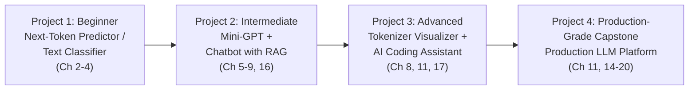
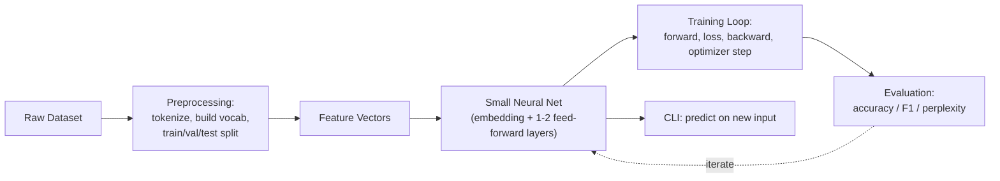
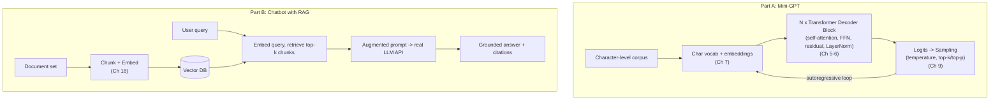
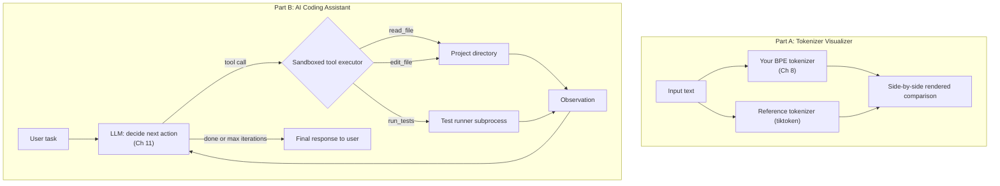
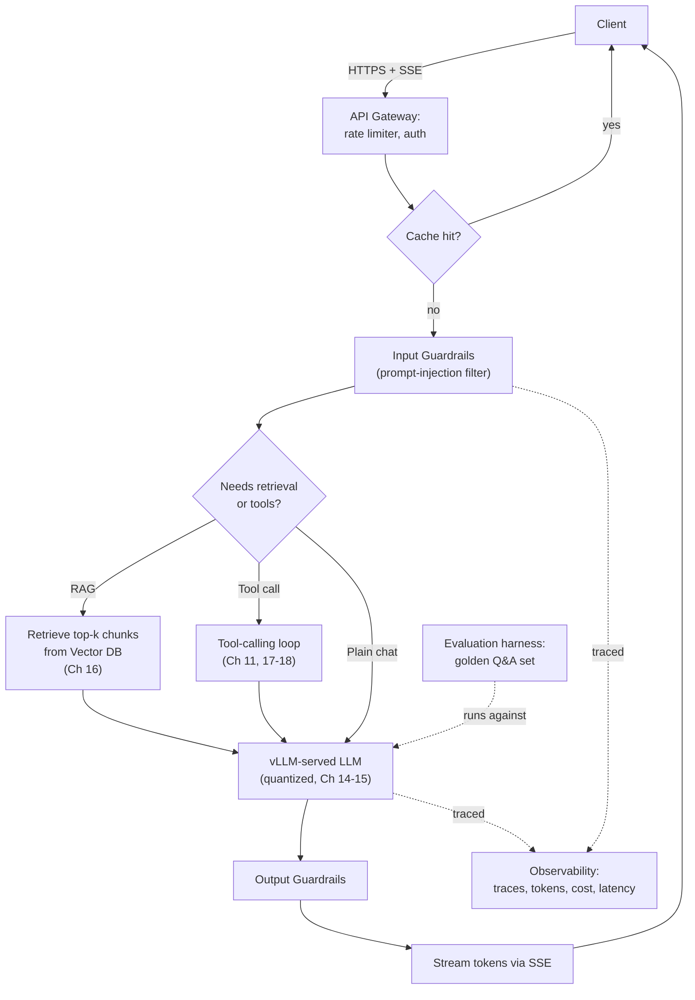

# Chapter 24: Capstone Projects

*Reading twenty-three chapters builds understanding; building four projects builds proof — to yourself, to a hiring manager, to a teammate reviewing your design. These specs are meant to be built, not skimmed.*

## Learning Objectives

By the end of this chapter, you will be able to:

- Select the right project scope to demonstrate a specific tier of LLM systems competency
- Translate the concepts from Chapters 1–23 into a concrete architecture, folder structure, and phased build plan
- Identify which earlier chapter teaches each component of a non-trivial LLM system, so you can look up depth on demand instead of guessing
- Assemble internals-level understanding (tokenizers, attention, sampling) and systems-level understanding (RAG, agents, production serving) into one working system
- Evaluate your own (or someone else's) LLM project against a production-readiness bar, not just a "does it run" bar

## Prerequisites for This Chapter

This chapter assumes the entire course, Chapters 1–23. Each project below explicitly cites which earlier chapter teaches each component — if a step feels unfamiliar, that citation tells you exactly where to go back and refresh.

---

## How the Four Projects Map to the Course

The projects escalate in exactly the same order the course did: fundamentals → internals → systems → production.



| Project | Tier | Core Question It Answers | Chapters Exercised |
|---|---|---|---|
| 1 | Beginner | Can you build and evaluate a working neural net from scratch? | 2, 3, 4 |
| 2 | Intermediate | Can you build a transformer's internals AND use retrieval to ground a real LLM? | 5–9, 16 |
| 3 | Advanced | Can you build developer tooling around tokenization, and an agent that safely uses tools? | 8, 11, 17 |
| 4 | Production-Grade Capstone | Can you ship all of it together, safely, at scale? | 11, 14–20 |

You do not need to build all four to get value from this chapter — but Project 4 assumes the skills built in 1–3, so build in order if you're starting from scratch.

---

## Project 1: Next-Token Predictor / Text Classifier (Beginner)

### Requirements

**Functional**
- Train a small neural network on a real, modest-sized dataset (e.g. a public sentiment dataset, or a small plain-text corpus for next-token prediction)
- Support two modes: (a) **text classification** — predict a label (e.g. positive/negative sentiment) for an input string, or (b) **next-token prediction** — given a short prefix, predict a probability distribution over the next word/character
- Report standard evaluation metrics: accuracy, precision, recall, F1 for classification (Chapter 2); cross-entropy loss and perplexity for next-token prediction (Chapter 3)
- Provide a simple CLI or notebook interface to run inference on new input

**Non-functional**
- Must run end-to-end on a CPU in under a few minutes for the chosen dataset size
- Training curves (loss over epochs) must be visualized, not just printed as a final number

### Architecture



### Folder Structure

```
next-token-predictor/
├── data/
│   ├── raw/
│   └── processed/
├── src/
│   ├── preprocessing.py      # tokenize, build vocab, train/val/test split
│   ├── model.py               # embedding layer + feed-forward net
│   ├── train.py                # training loop
│   ├── evaluate.py             # metrics computation
│   └── predict_cli.py          # simple inference CLI
├── notebooks/
│   └── exploration.ipynb
├── requirements.txt
└── README.md
```

### Implementation Plan

1. **Pick and load a dataset** — a small labeled sentiment dataset for classification, or a plain-text corpus (a public-domain book, a code repository's comments) for next-token prediction.
2. **Preprocess** — build a vocabulary and convert text to token IDs (Chapter 4's classical preprocessing: stop words, basic normalization; a simplified whitespace/regex tokenizer is fine here — full subword tokenization is Chapter 8's concern, not required for this project).
3. **Split** into train/validation/test sets, and understand *why* three splits exist, not just implement it (Chapter 2, Section 4).
4. **Build the model** — an embedding layer followed by 1–2 feed-forward layers with a nonlinearity (ReLU or GELU) and a final output layer sized to the vocabulary (next-token) or number of classes (classification) (Chapter 3).
5. **Implement the training loop** by hand — forward pass, loss computation (cross-entropy), backward pass, optimizer step (start with plain SGD, then upgrade to Adam and compare convergence speed) (Chapter 3, Sections 7–10).
6. **Evaluate** — compute accuracy/precision/recall/F1 for classification, or loss/perplexity for next-token prediction, and plot training vs. validation loss to check for overfitting (Chapter 2, Sections 5–6).
7. **Build a small CLI** that loads the trained model and produces a prediction for user-provided input.

### Best Practices

- Always hold out a test set you touch only once, at the very end — resist the urge to peek at test performance while tuning.
- Plot the loss curve; a model that looks "done" by final-epoch loss alone can still be badly overfit.
- Start with the simplest possible architecture that could plausibly work before adding layers — this project is about the training loop, not model sophistication.

### Extensions & Improvements

- Swap the plain feed-forward layer for a tiny self-attention block (a 1-layer, 1-head implementation) and compare performance — a natural bridge into Project 2.
- Add a proper subword tokenizer (Chapter 8) instead of whitespace splitting, and measure the effect on vocabulary size and model quality.
- Try a classical algorithm from Chapter 2 (e.g. logistic regression on bag-of-words features) as a baseline, and quantify how much the neural approach actually improves over it — a good habit for any real project.

---

## Project 2: Mini-GPT (Character-Level Transformer) + Chatbot with RAG (Intermediate)

### Requirements

**Functional — Part A (Mini-GPT)**
- Implement a decoder-only, causal-masked Transformer from scratch (embedding, positional encoding, multi-head self-attention, feed-forward sublayer, residual connections, LayerNorm) trained at the **character level** on a text corpus of your choice
- Generate new text autoregressively from a seed prompt, with configurable temperature and top-k/top-p sampling
- Visualize training loss and produce qualitatively coherent (not necessarily fully sensible) generated text as a sanity check

**Functional — Part B (Chatbot with RAG)**
- Separately, build a RAG-augmented chatbot on top of a real, pretrained LLM (via an API, or a small locally-hosted open-weight model) — this does *not* need to reuse your Mini-GPT; it demonstrates a different, complementary skill (retrieval-augmentation of an already-capable model)
- Ingest a small document set (e.g. a handful of PDFs or markdown files), chunk and embed them, store in a vector database, and retrieve relevant chunks per query
- Answer user questions grounded in the retrieved context, with citations back to source chunks

**Non-functional**
- Mini-GPT training must run on CPU (a small model, small dataset, and modest number of training steps are expected and fine — the point is understanding the mechanism, not achieving state-of-the-art quality)
- The RAG chatbot must handle at least basic multi-turn conversation, not just single-shot Q&A

### Architecture



### Folder Structure

```
minigpt-and-rag-chatbot/
├── minigpt/
│   ├── data/corpus.txt
│   ├── model.py                # attention, transformer block, full stack
│   ├── train.py
│   ├── generate.py             # sampling: temperature, top-k, top-p
│   └── checkpoints/
├── rag_chatbot/
│   ├── documents/
│   ├── ingest.py                # chunk + embed + store
│   ├── retrieve.py              # query embedding + top-k retrieval
│   ├── chat.py                  # conversation loop, prompt construction
│   └── vector_store/
├── requirements.txt
└── README.md
```

### Implementation Plan

1. **Implement self-attention and multi-head attention from scratch** in plain PyTorch (or NumPy, for maximum understanding) — Query/Key/Value projections, scaled dot-product, causal masking (Chapter 5).
2. **Assemble a full Transformer decoder block** — attention sublayer, feed-forward sublayer, residual connections, LayerNorm — and stack a small number of them (2–6 layers is plenty for a character-level toy model) (Chapter 6).
3. **Add positional encoding** and a character-level embedding/output layer sized to your corpus's character vocabulary (Chapter 7).
4. **Train** with the standard loop (cross-entropy loss on next-character prediction, Adam/AdamW optimizer) and track loss (Chapter 3, Chapter 12's pretraining objective — same mechanism, tiny scale).
5. **Implement sampling** — greedy, temperature-scaled, top-k, and top-p — and generate sample text at each, comparing qualitative output diversity (Chapter 9).
6. **Separately, build the RAG ingestion pipeline** — chunk your chosen documents, embed them, and store vectors in a local vector database (FAISS or Chroma) (Chapter 16).
7. **Build the retrieval + generation loop** — embed the user's query, retrieve the top-k most similar chunks, construct an augmented prompt with retrieved context and clear instructions to cite sources, and call a real LLM (Chapter 16, drawing on prompting practices from Chapter 10).
8. **Add multi-turn conversation handling** — maintain conversation history within the context window, re-retrieving per new user turn.

### Best Practices

- For Mini-GPT, verify your causal mask is correct with a unit test (feed a short sequence, confirm position `i`'s attention weights are zero for all positions `> i`) before trusting any training results.
- For the RAG chatbot, use the *same* embedding model for both ingestion (Part B's document chunks) and querying — revisit the model-mismatch pitfall from Chapter 16/22 before you hit it yourself.
- Log retrieved chunks alongside generated answers during development — most RAG bugs are retrieval bugs wearing a "wrong answer" disguise.

### Extensions & Improvements

- Scale Mini-GPT from character-level to a small subword vocabulary using your Chapter 8 BPE implementation, and compare training dynamics and generated-text quality.
- Add hybrid search (dense + keyword) to the RAG chatbot (Chapter 16, Section on hybrid search) and measure retrieval quality improvement on queries with exact-match terms (IDs, names).
- Combine the two halves: fine-tune your Mini-GPT (once scaled up) with a LoRA adapter (Chapter 13) on a narrow domain, and compare to prompting a larger model with RAG on the same domain — a hands-on version of the "fine-tune vs. RAG" decision framework.

---

## Project 3: Tokenizer Visualizer + AI Coding Assistant (Advanced)

### Requirements

**Functional — Part A (Tokenizer Visualizer)**
- Train a BPE tokenizer from scratch on a corpus of your choice (reuse/extend your Chapter 8 hands-on exercise)
- Build a visual interface (CLI with colored/bracketed output, or a simple web UI) that takes arbitrary input text and renders each resulting token distinctly, along with token IDs and total token count
- Support comparing your custom tokenizer's output against a real tokenizer (e.g. `tiktoken`) side by side

**Functional — Part B (AI Coding Assistant)**
- Build an agent that can converse about a codebase and make changes to it via tool calls: at minimum, `read_file`, `edit_file`, and `run_tests` tools
- The agent must run a proper multi-turn tool-calling loop (Chapter 11): receive a task, decide which tool to call, execute it, observe the result, and continue until the task is done or a maximum iteration count is reached
- Sandbox tool execution to a specific project directory — the agent must not be able to read or write files outside an explicitly allowed root path

**Non-functional**
- The coding assistant must have a hard iteration/step limit and a clear "I'm not making progress, stopping" fallback (Chapter 17's agent failure modes)
- All tool executions must be logged (what was called, with what arguments, and what result came back) for debugging

### Architecture



### Folder Structure

```
tokenizer-viz-and-coding-agent/
├── tokenizer_viz/
│   ├── bpe.py                  # from Chapter 8's exercise
│   ├── visualize_cli.py
│   └── compare_tiktoken.py
├── coding_agent/
│   ├── tools/
│   │   ├── read_file.py
│   │   ├── edit_file.py
│   │   └── run_tests.py
│   ├── sandbox.py              # path allowlisting / execution boundary
│   ├── agent_loop.py           # the tool-calling loop
│   └── logs/
├── requirements.txt
└── README.md
```

### Implementation Plan

1. **Reuse/extend your Chapter 8 BPE tokenizer** and wrap it with a small CLI or web UI (e.g. Flask/Streamlit for a quick visual) that colors/brackets each token in a rendered string (Chapter 8).
2. **Add the `tiktoken` comparison view** side by side, so users can see where a from-scratch toy tokenizer diverges from a production one.
3. **Define your tool schemas** (`read_file(path)`, `edit_file(path, new_content)`, `run_tests(test_path)`) as JSON-schema-like definitions the model can call (Chapter 11, Section 2).
4. **Build the sandbox boundary first, before wiring up the model** — a strict allowlist of one project root directory, with path-traversal checks (reject `../` escapes) — this is a security-critical piece, not an afterthought (Chapter 20's insecure-tool-execution risk).
5. **Implement the multi-turn tool-calling loop**: send the user's task plus tool definitions to the model, execute whatever tool call comes back inside the sandbox, append the result, call the model again, and repeat until it returns a final answer or you hit a hard iteration cap (Chapter 11, Section 3; Chapter 17's failure-mode mitigations).
6. **Add logging** of every tool call (name, arguments, result, timestamp) to a log file for debugging agent behavior after the fact.
7. **Test on a real small project**: give the agent a genuine small bug or a request to add a simple feature with a test, and observe its full tool-call trace end to end.

### Best Practices

- Build and test the sandbox in isolation, with intentional adversarial inputs (e.g. a path like `../../etc/passwd`), *before* connecting it to a live model — don't rely on the model "behaving" as your only safety layer.
- Cap iterations explicitly (e.g. 10–15 steps) and make the "giving up" path visible to the user, rather than a silent infinite loop or an opaque crash.
- Show the tokenizer visualizer's token *count*, not just the colored breakdown — it makes the cost/context implications of tokenization (Chapter 8, Section 8) tangible rather than abstract.

### Extensions & Improvements

- Extend the coding assistant with a `git_diff` or `git_commit` tool, and require human approval before any commit — a small taste of the human-in-the-loop pattern from Chapter 17's failure-mode mitigations.
- Add a "plan" step before the agent starts calling tools (Plan-and-Execute from Chapter 17) and compare task success rate/step count against the pure ReAct loop.
- Publish the tokenizer visualizer as a small public web tool — it's a genuinely useful, portfolio-friendly artifact on its own.

---

## Project 4: Production LLM Platform (Production-Grade Capstone)

This is the "everything together" project. It is deliberately the most detailed spec in this chapter, because it's meant to be the centerpiece of your portfolio — a system a hiring manager or teammate could plausibly run.

### Requirements

**Functional**
- A FastAPI backend exposing a streaming chat endpoint (Server-Sent Events) backed by an LLM (Chapter 19)
- An LLM inference backend served via vLLM (or, if GPU access is unavailable, a well-justified equivalent such as a quantized local model via `llama.cpp`/Ollama, or a hosted API used behind the same architecture) with an explicitly chosen and justified quantization format for your target hardware (Chapters 14–15)
- A RAG knowledge base: document ingestion, chunking, embedding, vector storage, and retrieval-augmented responses with citations (Chapter 16)
- An agent/tool-calling layer: at least one real tool (e.g. a calculator, a web search stub, or an internal "lookup order status" style mock tool) invoked through a proper multi-turn tool-calling loop (Chapters 11, 17–18)
- Rate limiting (both requests-per-minute and tokens-per-minute) and at least one caching layer (exact-match or semantic) (Chapter 19)
- Observability: structured request tracing (prompt, response, latency, token counts, cost) and at least a minimal evaluation harness (a golden Q&A set run on every change) (Chapter 20)
- Guardrails: basic input filtering for obvious prompt-injection patterns and output filtering for a defined disallowed-content policy (Chapter 20)

**Non-functional**
- Must run in Docker, with GPU resource requests/limits declared if applicable (Chapter 20)
- Must survive a basic load test (a scripted burst of concurrent requests) without crashing, and rate limiting must visibly kick in under that load
- All configuration (model choice, quantization format, rate limits, cache TTLs) must be externalized to environment variables or a config file — no hardcoded values

### Architecture



### Folder Structure

```
production-llm-platform/
├── api/
│   ├── main.py                 # FastAPI app, SSE streaming endpoint
│   ├── rate_limiter.py          # token-bucket, per-key RPM/TPM
│   ├── cache.py                  # exact-match + semantic cache
│   ├── guardrails/
│   │   ├── input_filters.py
│   │   └── output_filters.py
│   └── router.py                 # plain chat vs. RAG vs. tool-call routing
├── inference/
│   ├── vllm_config.yaml           # served model, quantization format
│   └── client.py                    # thin client to the inference server
├── rag/
│   ├── ingest.py
│   ├── retrieve.py
│   └── vector_store/
├── agent/
│   ├── tools/
│   └── agent_loop.py
├── observability/
│   ├── tracing.py
│   └── eval/
│       ├── golden_qa.jsonl
│       └── run_eval.py
├── docker/
│   ├── Dockerfile.api
│   ├── Dockerfile.inference
│   └── docker-compose.yaml
├── load_test/
│   └── burst_test.py
└── README.md
```

### Implementation Plan

1. **Stand up the inference backend first, in isolation.** Choose and justify a quantization format for your actual hardware (GPU cluster → GPTQ/AWQ via vLLM; single consumer GPU or CPU-only → GGUF via llama.cpp/Ollama), and confirm you can get a completion out of it before building anything on top (Chapters 14–15).
2. **Build the FastAPI streaming endpoint** against that backend — a minimal `/chat` route that streams tokens via SSE as they're generated, with no RAG/agent/guardrails yet (Chapter 19, Section 2–3).
3. **Add the RAG layer**: ingest a real document set, embed and store in a vector database, and wire retrieval into the prompt construction for a `/chat/rag` mode, with citations in the response (Chapter 16).
4. **Add the tool-calling agent layer**: define at least one real tool, implement the multi-turn tool-calling loop, and route requests that need it through the agent instead of a single completion call (Chapters 11, 17–18).
5. **Add rate limiting** (token-bucket, tracking both request count and token count per API key/user) in front of all routes (Chapter 19, Section 4).
6. **Add caching**: start with exact-match prompt caching (simplest), then add a semantic cache layer if time allows, being explicit in your README about the staleness risk you're accepting (Chapter 19, Section 5).
7. **Add observability**: wrap every LLM call and tool call in a trace capturing prompt, response, latency, tokens, and estimated cost; log these traces somewhere queryable (even a structured log file is fine for a portfolio project) (Chapter 20, Section 2).
8. **Build a minimal evaluation harness**: a golden set of 15–30 representative Q&A pairs with expected answers/rubrics, and a script that runs them against the current system and reports pass/fail or a scored result — run this before and after any prompt or model change (Chapter 20, Section 3).
9. **Add guardrails**: a basic input filter for obvious prompt-injection patterns, and an output filter enforcing your defined content policy (Chapter 20, Section 4).
10. **Containerize everything** with Docker, declare GPU resource requests if applicable, and write a `docker-compose.yaml` that brings up the full stack with one command (Chapter 20, Section 5).
11. **Load-test it**: script a burst of concurrent requests and confirm the rate limiter engages correctly and the system degrades gracefully (clear error responses) rather than crashing.

### Best Practices

- Build and validate each layer (inference → API → RAG → agent → rate limiting → caching → observability → guardrails) independently before wiring them all together — debugging a fully-integrated system with no isolated layer tests is far harder.
- Treat your golden evaluation set as a first-class artifact, versioned alongside your code — run it on every meaningful change, not just once at the end.
- Externalize every tunable value (model name, quantization format, rate limits, cache TTL) to config — you will change these more than once, and hardcoding them makes every change a code deploy instead of a config change.
- Write down, in your README, the specific trade-offs you made and why (e.g. "chose exact-match caching only, semantic caching deferred due to staleness risk for this use case") — this demonstrates judgment, which is what this capstone is actually meant to prove.

### Extensions & Improvements

- Add a second, cheaper model and implement model routing (Chapter 19, Section 6) — route simple queries to the cheap model, escalate to the larger model only when needed, and measure the cost savings.
- Add prefix caching awareness in your prompt construction (Chapter 14) by keeping a stable system-prompt prefix across requests, and measure the latency difference.
- Deploy to a real (even low-traffic) cloud environment with basic autoscaling, and document the cold-start behavior you observe when scaling up from zero (Chapter 20, Section 5).
- Add a second, independent LLM-as-judge evaluation pass on top of your golden-set harness (Chapter 20, Section 3), and note where the two evaluation methods agree and disagree.

---

## Summary

- The four capstone projects escalate exactly along the course's own arc: fundamentals (Project 1) → transformer/sampling internals plus retrieval (Project 2) → tokenization tooling and safe tool-using agents (Project 3) → a full production system (Project 4).
- Every implementation step in every project cites the specific earlier chapter that teaches it — use those citations as your lookup table when you get stuck, rather than re-deriving from memory.
- The Production LLM Platform (Project 4) is deliberately the most detailed spec: it is the project most worth finishing and polishing for a portfolio, since it demonstrates the full stack — inference, RAG, agents, rate limiting, caching, observability, and guardrails — working together.
- Building beats reading for retention and for proof of skill — treat these specs as a checklist to work through, not a description to admire.

---

## Knowledge Check

1. Project 2 explicitly does *not* require reusing your Mini-GPT inside the RAG chatbot. Why is that a reasonable design choice, and what would you lose by artificially forcing them together?
2. In Project 3, why does the implementation plan insist on building and testing the sandbox *before* connecting it to a live model, rather than after?
3. For Project 4, if you only had GPU access to a single consumer-grade card (not a cluster), which specific implementation decisions from Chapters 14–15 would change, and why?
4. A reviewer looks at your Project 4 submission and asks, "What would break first under 100x more traffic?" Walk through your architecture diagram and identify the most likely bottleneck, and which chapter's concepts you'd reach for to fix it.
5. Project 1 requires holding out a test set touched only once. Explain, using the bias-variance framing from Chapter 2, what specifically goes wrong if you tune hyperparameters against test-set performance instead.
6. Why does the Production LLM Platform's implementation plan explicitly separate "build the evaluation harness" (step 8) from "add guardrails" (step 9), rather than treating them as one generic "safety" step?

---

## Further Reading

- [FastAPI documentation](https://fastapi.tiangolo.com/) — quickstart for Project 4's API layer
- [vLLM documentation](https://docs.vllm.ai/) — quickstart for serving the inference backend in Projects 2 and 4
- [Hugging Face PEFT documentation](https://huggingface.co/docs/peft) — for the LoRA extension suggested in Project 2
- [Chroma](https://docs.trychroma.com/) and [Qdrant](https://qdrant.tech/documentation/) documentation — quickstarts for the RAG vector store used in Projects 2 and 4
- ["How to Write a Great README"](https://github.com/matiassingers/awesome-readme) — a curated list of strong open-source README examples, relevant to presenting these projects as portfolio pieces
- This repository's [`../rag-course`](../rag-course/00-index.md) — for going deeper on Project 2 and Project 4's RAG components than Chapter 16 covers

---

<div style="display:flex;justify-content:space-between;align-items:center;">
  <a href="./23-tools-and-ecosystem-landscape.md">← Previous: Tools, Papers & Ecosystem Landscape</a>
  <a href="./00-index.md">🏠 Index</a>
  <a href="./25-interview-preparation.md">Next: Interview Preparation →</a>
</div>
