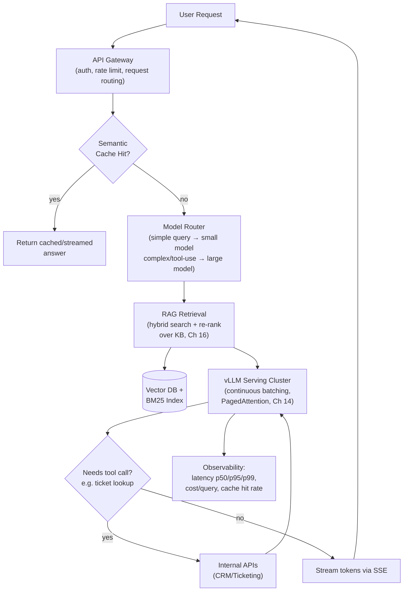
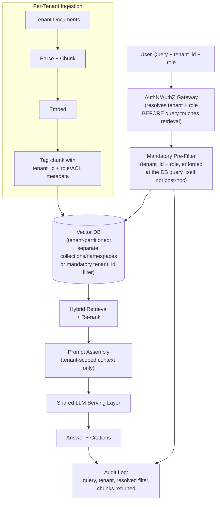

# Chapter 25: Interview Preparation

*You've built the mental model from artificial neurons to production LLM platforms. This chapter is not new material — it's the rehearsal room where you prove you can retrieve and articulate all of it, under time pressure, in the shape an interviewer actually expects.*

---

## Learning Objectives

By the end of this chapter, you will be able to:

- Answer the most common conceptual questions across ML/DL fundamentals, Transformers, LLM architecture, tokenization/sampling, training/fine-tuning, inference optimization, RAG/agents, and production engineering — crisply, in 3-6 sentences, without rambling
- Narrate a structured diagnostic process for realistic production scenarios, not just blurt out a final guess
- Deliver a complete, interview-shaped system design answer for a high-throughput LLM service and a multi-tenant RAG platform, including a Mermaid architecture diagram and an explicit 10x-scale story
- Recognize the difference between a troubleshooting checklist you'd run alone in production (Chapter 22) and the compressed, narrated version an interviewer expects you to talk through live
- Recall three illustrative production incident patterns and state the generalizable lesson behind each
- Walk into an LLM/AI engineering interview able to state assumptions, name trade-offs, and always say how you'd measure success — the three habits that separate senior answers from memorized ones

---

## Prerequisites for This Chapter

This is the final chapter of the course and assumes you have completed, or are comfortable rapidly re-skimming, **all of Chapters 1-24**:

- **Ch 1-4**: course orientation, ML fundamentals (bias-variance, classic algorithms), DL fundamentals (backprop, optimizers, loss functions), NLP fundamentals (tokenization basics, embeddings, why RNNs weren't enough)
- **Ch 5-6**: attention and self-attention math, the full Transformer architecture (encoder-decoder, multi-head attention, LayerNorm, residuals)
- **Ch 7-9**: decoder-only LLM architecture (context window, RoPE, KV cache, logits), tokenization deep dive (BPE/WordPiece/SentencePiece/tiktoken), sampling and generation strategies (temperature, top-k/top-p, beam search, speculative decoding)
- **Ch 10-11**: prompt engineering, tool calling and structured output
- **Ch 12-13**: pretraining/SFT/RLHF/DPO, LoRA/QLoRA/PEFT
- **Ch 14-15**: inference optimization (vLLM, FlashAttention, PagedAttention, continuous batching), quantization and speculative decoding
- **Ch 16-18**: RAG and vector databases, agents and multi-agent systems, MCP and agent frameworks (LangGraph)
- **Ch 19-20**: production LLM systems (FastAPI, streaming, scaling, caching), observability/evaluation/security
- **Ch 21-23**: best practices, common mistakes and pitfalls, the tools/papers/ecosystem landscape
- **Ch 24**: the capstone project you built or designed end to end

If any answer in this chapter feels unfamiliar rather than "oh right, I know this," treat that as a direct pointer back to the relevant chapter — tonight, not the morning of the interview.

---

## Quick-Reference: Whole-Course Cheat Sheet

Use this table for a fast review immediately before an interview. If any "Interview Soundbite" doesn't ring a bell, open that chapter tonight, not tomorrow morning.

| Ch | Topic | Interview Soundbite |
|---|---|---|
| 1 | Introduction & prerequisites | You're closing the gap between using LLMs and understanding why they behave the way they do |
| 2 | ML fundamentals | Bias-variance trade-off governs every model-capacity decision; pick the algorithm that matches your data, not the trendiest one |
| 3 | DL fundamentals | Backprop is the chain rule applied efficiently; Adam adapts per-parameter learning rates via momentum and second-moment estimates |
| 4 | NLP fundamentals | Word2Vec/GloVe gave static embeddings; RNNs' sequential bottleneck and vanishing gradients are exactly what attention was built to fix |
| 5 | Attention & self-attention | `softmax(QKᵀ/√d_k)V` — dot product for relevance, scale for stability, softmax for a weighted blend of Values |
| 6 | Transformer architecture | Multi-head attention lets different heads specialize; residuals + LayerNorm are what make 96-layer networks trainable at all |
| 7 | LLM architecture & decoding | Decoder-only unifies prompt and generation in one causal stream; KV cache trades memory for not recomputing the unchanged past |
| 8 | Tokenization deep dive | BPE never hits a true OOV token — worst case it falls back to bytes; vocabulary size is a latency/cost/quality trade-off, not a constant |
| 9 | Sampling & generation | Temperature reshapes the distribution before softmax; top-p adapts pool size to model confidence, top-k doesn't |
| 10 | Prompt engineering | The prompt is where you enforce format, grounding, and refusal behavior — it's an interface contract, not just words |
| 11 | Tool calling & structured output | Function calling constrains generation to a schema; validate and retry, never trust a raw LLM JSON output blindly |
| 12 | Pretraining, SFT, RLHF & DPO | Pretraining gives knowledge, SFT gives assistant behavior, RLHF/DPO gives preference alignment — three different objectives, three different failure modes |
| 13 | LoRA, QLoRA & PEFT | Fine-tuning updates have low intrinsic rank; freeze the giant, train a small `BA` correction on top |
| 14 | Inference optimization | Decoding is memory-bandwidth-bound, not compute-bound; PagedAttention and continuous batching are what turn that idle compute into throughput |
| 15 | Quantization & speculative decoding | Quantization trades bits for memory/speed at a quality cost that must be measured per-task, not just in aggregate; speculative decoding never changes the output distribution |
| 16 | RAG & vector databases | Retrieval and generation are separate stages with separate failure modes — always isolate before you fix |
| 17 | Agents & multi-agent systems | ReAct interleaves reasoning and tool calls; multi-agent systems trade simplicity for specialization, and most tasks don't need the trade |
| 18 | MCP & agent frameworks | MCP turns an N×M tool-integration problem into an N+M problem via a shared protocol |
| 19 | Production LLM systems | Streaming (SSE) fixes perceived latency; caching (exact, semantic, prefix) is the highest-leverage cost lever at scale |
| 20 | Observability, evaluation & security | LLM-as-judge needs its own calibration check; prompt injection defenses are layered, never a single control |
| 21 | Best practices | A checklist beats a memorized architecture when the interviewer changes the constraints |
| 22 | Common mistakes & pitfalls | Most production LLM failures wear a different failure's costume — isolate the stage before proposing a fix |
| 23 | Tools & ecosystem landscape | Know why a tool exists (the problem it solves), not just its name or its GitHub star count |
| 24 | Capstone projects | You should be able to defend every architectural decision in your own project out loud, unscripted |
| 25 | Interview preparation | State assumptions, name trade-offs, always say how you'd measure success |

---

## Answer Structure Templates

Before drilling questions, it helps to have a reusable shape for each question type, so you're never improvising structure under pressure — only content.

**Conceptual question template** (aim for 30-60 seconds spoken):

```
1. One-sentence definition.
2. Why it exists / what problem it solves.
3. The concrete mechanism (formula, algorithm step, or worked example).
4. One trade-off or limitation, stated unprompted.
```

**Scenario/debugging question template** (aim for 60-120 seconds spoken):

```
1. Restate the symptom in your own words to confirm understanding.
2. Name the two or three most likely failure categories.
3. State the single most information-dense diagnostic check —
   the one that most cheaply distinguishes between those categories.
4. Only then propose a fix, tied to the specific category that check would confirm.
```

**System design question template** (aim for 10-15 minutes spoken; Section 4 works two full examples):

```
1. Clarifying questions (scale, latency, compliance, update frequency).
2. High-level architecture, ideally sketched as a diagram.
3. Justify each major component choice against the stated requirements.
4. Name the trade-off in each choice, not just the choice.
5. Evaluation and monitoring plan (what you'd measure, what you'd alert on).
6. How the design changes at 10x scale — what breaks first, and the fix.
```

Every worked answer in this chapter follows one of these three shapes — internalize the shape, and you'll never freeze on organization, even for a question you've never seen before.

---

## 1. How LLM/AI Engineering Interviews Are Structured

Loops vary by company size and role seniority, but a typical LLM/AI Engineer, Applied ML Engineer, or "AI Engineer" loop converges on some subset of four stages. Knowing the shape in advance lets you calibrate depth and pacing instead of guessing mid-interview.

**Stage 1 — Conceptual/theory screen (30-45 min, often a phone screen).** A rapid sequence of the kind of questions in Section 2 below: fundamentals, Transformer internals, tokenization/sampling, training methods, inference optimization. The interviewer is checking for *fluency*, not depth on any single topic — can you explain KV cache, RoPE, or why attention scales by `√d_k` without notes, in under a minute each. Weak candidates recite definitions; strong candidates volunteer the trade-off or the "why" unprompted.

**Stage 2 — Coding/implementation round (45-60 min).** Less "LeetCode," more "can you actually build the thing you've been talking about." Common formats: implement scaled dot-product attention or a mini BPE tokenizer from scratch in NumPy/Python (Ch 5, 8); write a function that streams tokens from an OpenAI-compatible API over SSE (Ch 19); debug a broken prompt-to-JSON-schema parser (Ch 11); or extend a small RAG retrieval function to add hybrid search or metadata filtering (Ch 16). The bar is usually "correct and reasonably clean," not "production-hardened," but you should narrate trade-offs as you code.

**Stage 3 — System design round (45-60 min, usually onsite/virtual-onsite).** One open-ended prompt — "design a customer support chatbot," "design a multi-tenant RAG platform," "design a code-review agent" — where you drive the entire conversation: clarify requirements, sketch architecture, defend component choices, and discuss what breaks at scale. Section 4 below gives two fully worked examples. This round weighs *structure* and *trade-off articulation* far more than any single "correct" answer.

**Stage 4 — Take-home or practical/pairing round.** Either a self-contained take-home (build a small RAG pipeline, a tool-calling agent, or a fine-tuning script against a provided dataset, with a short write-up of decisions) or a live pairing session extending an existing small codebase. This round checks whether your Stage 1-3 answers translate into working code with sane defaults (temperature, chunk size, retry/backoff, error handling) rather than hand-wavy architecture talk.

A senior-level loop often adds a **behavioral/production-judgment round** that overlaps with Sections 5-6 below — "tell me about an LLM system you've operated or would operate, and a failure you'd expect or have seen." Have at least one concrete story ready; Section 6's case studies are illustrative templates for the shape such a story should take, not stories to claim as your own history.

---

## 2. Frequently Asked Conceptual Questions with Model Answers

Read each question, form your own answer before reading the model answer, and compare. The gap is your revision list.

### 2.1 ML/DL Fundamentals (Ch 2-3)

**Q1. Explain the bias-variance trade-off.**

Bias is the error introduced by a model's simplifying assumptions — a high-bias model (e.g., linear regression on a nonlinear relationship) systematically underfits, missing real structure in the data regardless of how much training data you give it. Variance is the error introduced by a model's sensitivity to the specific training sample — a high-variance model (e.g., a deep, unregularized decision tree) overfits, memorizing noise so that its predictions swing wildly across different training sets drawn from the same distribution. Total generalization error decomposes roughly into `bias² + variance + irreducible noise`, so you can't independently drive both to zero; adding model capacity, more layers, or more parameters typically trades bias down and variance up, while regularization, more data, or simpler architectures trade the other way. In practice you diagnose which regime you're in by comparing training loss to validation loss: a large train-val gap signals high variance (overfitting), while a high train loss on its own signals high bias (underfitting).

**Q2. How do you detect and fix overfitting?**

You detect it primarily by tracking training loss against a held-out validation loss over training steps or epochs — overfitting shows up as validation loss flattening or rising while training loss keeps falling, and the earlier and larger that divergence, the worse the overfitting. Fixes span several levers: get more or more diverse training data; add explicit regularization (L2 weight decay, dropout, label smoothing); reduce model capacity if it's grossly oversized for the task; use early stopping keyed to validation loss; and, specifically in the LLM fine-tuning context (Ch 12-13), reduce the number of training epochs on a small SFT dataset or lower the LoRA rank, since large pretrained models can overfit a small fine-tuning set within a single epoch. Data leakage — validation examples that are near-duplicates of training examples, or a shuffle that leaks temporal information — is a common false negative that makes overfitting invisible until production, so it's always worth ruling out separately.

**Q3. Walk me through backpropagation in your own words.**

Backpropagation computes the gradient of the loss with respect to every parameter in the network by applying the chain rule backwards through the computation graph built during the forward pass. The forward pass computes and caches intermediate activations at every layer; the backward pass starts from the loss's gradient with respect to the output (usually trivial, e.g., `1` for a scalar loss) and, layer by layer moving backward, multiplies the incoming gradient by that layer's local derivative (its Jacobian with respect to its own inputs and parameters) to produce the gradient with respect to the next layer back. Each parameter's gradient tells the optimizer the direction that *increases* the loss fastest, so gradient descent steps in the opposite direction, scaled by the learning rate. The reason this is tractable for networks with billions of parameters is that the chain rule lets you compute every parameter's gradient in roughly the same cost as one extra forward pass, rather than needing a separate finite-difference computation per parameter.

**Q4. What does Adam do differently from plain SGD, and why does it matter for training LLMs?**

Plain SGD updates every parameter by the same learning rate times its raw gradient, which means parameters with sparse or noisy gradients (common in large, high-dimensional models) get noisy, slow, or badly-scaled updates. Adam maintains two running estimates per parameter: a momentum term (an exponential moving average of past gradients, which smooths out noise and helps escape shallow local structure) and a second-moment term (an exponential moving average of squared gradients, which adapts the effective learning rate per-parameter — parameters with historically large gradients get smaller effective steps, and vice versa). This adaptive, per-parameter scaling is why Adam (and AdamW, which decouples weight decay from the gradient-based update) converges faster and more reliably than SGD on the highly non-convex, high-dimensional loss surfaces of Transformers, and it's essentially the universal default optimizer for pretraining and fine-tuning LLMs (Ch 3, 12-13). The trade-off is memory: Adam needs to store two extra state tensors per parameter (momentum and variance), roughly tripling optimizer memory versus SGD, which is a real constraint at LLM parameter counts.

**Q5. Why is cross-entropy the standard loss function for language modeling?**

Language modeling is fundamentally a classification problem at every position — predict a probability distribution over the entire vocabulary for the next token — and cross-entropy is the loss that directly measures the divergence between the model's predicted distribution and the one-hot "true" distribution (the actual next token). Minimizing cross-entropy is mathematically equivalent to maximum likelihood estimation: it's exactly the loss that makes the model assign the highest possible probability to the tokens that actually occurred in the training data. It also has clean, well-behaved gradients when paired with a softmax output layer — the gradient of softmax-cross-entropy with respect to the logits is simply `(predicted probability − target)`, which is numerically stable and doesn't require special-casing, unlike a loss like squared error applied naively to probabilities.

### 2.2 Transformers & Attention (Ch 5-6)

**Q1. Why did attention displace RNNs/LSTMs for sequence modeling?**

RNNs and LSTMs process a sequence strictly one token at a time, threading all prior context through a fixed-size hidden state — this creates two hard problems: training can't parallelize across the time dimension (each step depends on the previous step's output), so training throughput is capped regardless of how much hardware you have, and long-range dependencies degrade because information from many steps back has to survive repeated compression into that same fixed-size hidden state, causing vanishing/exploding gradients in practice. Self-attention instead lets every token directly compute a relevance score against every other token in the sequence in a single parallel operation, so a dependency between token 1 and token 500 costs exactly the same to represent as a dependency between adjacent tokens — no information bottleneck, and the whole layer parallelizes across the sequence dimension during training. The trade-off, covered in Ch 7, is that this direct all-pairs comparison makes attention's compute and memory cost scale quadratically with sequence length, which RNNs didn't suffer from — you've traded one bottleneck (sequential processing, poor long-range recall) for a different, more tractable one (quadratic cost, addressed by later systems-level techniques).

**Q2. Write out the self-attention formula and explain each term.**

The formula is `Attention(Q, K, V) = softmax(QKᵀ / √d_k) V`. `Q`, `K`, and `V` are learned linear projections of the input embeddings — Query, Key, and Value — each produced by its own weight matrix. `QKᵀ` computes a raw relevance score between every pair of tokens as a dot product between one token's query and another token's key; dividing by `√d_k` rescales those scores so their variance stays roughly constant regardless of the dimensionality `d_k`, preventing the softmax from saturating. `softmax(...)` turns each row of scaled scores into a probability distribution that sums to 1 across all tokens being attended to. Multiplying that distribution by `V` produces, for each token, a weighted average of every token's Value vector, weighted exactly by how relevant the model judged each other token to be — the mechanism by which a token's representation gets updated with context from the rest of the sequence.

**Q3. Why scale by `√d_k` specifically, rather than some other normalization?**

As `d_k` grows, a dot product between two random `d_k`-dimensional vectors (each component roughly unit variance) grows in expectation proportionally to `d_k`, because it's a sum of `d_k` independent product terms — so without correction, raw attention scores get systematically larger as head dimension increases, purely as an artifact of dimensionality, not because the tokens are more relevant. Large raw scores push softmax into a very peaked regime where one score dominates with probability near 1 and all others get gradients near 0, which stalls learning. Dividing by `√d_k` exactly cancels this dimensionality-driven growth in expectation (since variance of a sum of `d_k` independent terms scales with `d_k`, and its square root scales with `√d_k`), keeping the score distribution's scale stable regardless of head dimension, so the softmax stays in a well-conditioned, trainable regime across model sizes.

**Q4. Why multi-head attention instead of one large attention operation?**

A single attention head is forced to learn one fixed way of relating tokens to each other, but useful relationships in language are heterogeneous — one signal might be syntactic (subject-verb agreement), another positional (adjacent words), another coreference (a pronoun to its antecedent) — and a single softmax distribution can't cleanly represent multiple, structurally different relevance patterns at once. Multi-head attention splits `d_model` into `h` smaller subspaces of size `d_k = d_model / h`, runs the identical attention computation independently in each subspace with its own learned `Q/K/V` projections, and concatenates the results through a final learned output projection — letting different heads specialize in different relationship types at roughly the same total compute cost as one full-size head, because each head does proportionally less work on a smaller dimension. Empirically, visualized attention heads do specialize (some attend locally, some attend to syntactic dependents, some to rare/salient tokens), which is the practical justification behind the "let many small experts vote" intuition.

**Q5. Why is positional information injected explicitly at all — doesn't attention already know sequence order?**

The core attention computation is permutation-invariant by construction — `softmax(QKᵀ/√d_k)V` produces the same result regardless of what order the tokens are fed in, because it's built entirely from pairwise dot products with no notion of "before" or "after." Language is fundamentally order-dependent ("dog bites man" vs. "man bites dog"), so without an explicit signal, the model has no way to distinguish these. Positional encodings inject that missing signal — either additively at the input (sinusoidal, or a learned absolute position table, as in early Transformers/GPT-2) or, in modern LLMs, by rotating Query and Key vectors inside every attention layer as a function of position (RoPE, Ch 7), which encodes *relative* position directly into the attention score rather than absolute position added once at the bottom of the network.

### 2.3 LLM Architecture (Ch 7)

**Q1. Why do modern general-purpose LLMs use a decoder-only architecture instead of the original encoder-decoder Transformer?**

The original Transformer's encoder-decoder split makes sense for a fixed, distinct source and target (translation: encode the source sentence fully, bidirectionally, then decode the target autoregressively). General-purpose LLMs need one uniform mechanism that handles arbitrary mixes of instructions, context, and generation in a single continuous stream, and a decoder-only stack — every layer is masked (causal) self-attention, so a token can only attend to itself and earlier tokens — handles this naturally: the "prompt" and the "generation" are just earlier and later positions in the same sequence, with no architectural distinction between them. This also simplifies training at scale: a decoder-only model trains with one self-supervised objective (predict the next token, everywhere, in parallel across the whole sequence via the causal mask) rather than needing paired source-target data and a more complex two-tower architecture.

**Q2. Explain the KV cache and why it matters for latency.**

Autoregressive generation produces tokens one at a time, and naively, generating token `n+1` would require recomputing Key and Value projections for every one of tokens `1` through `n` from scratch, even though tokens `1` through `n-1`'s K/V vectors are a pure function of already-fixed inputs and haven't changed. The KV cache stores each token's Key and Value tensors, at every layer, the first time they're computed, so generating the next token only requires computing K/V for the *single new token* and attending its Query against the cached K/V of everything before it, plus its own. This turns each generation step's attention cost from re-processing the whole prefix into processing exactly one new token, which is the difference between production-viable latency and unusable latency for any non-trivial output length — the cost is that the cache itself grows linearly with sequence length and batch size, consuming GPU memory that competes directly with the model weights (a 7B model at 4K context can need roughly 2 GiB of cache per request in bf16), which is exactly the problem PagedAttention (Ch 14) addresses at the systems level.

**Q3. What is RoPE and why do most modern open-weight LLMs use it over learned absolute position embeddings?**

RoPE (Rotary Position Embeddings) encodes position by rotating each Query and Key vector by an angle proportional to its position in the sequence, applied fresh inside every attention layer, rather than adding a fixed or learned position vector once at the input embedding. Because rotation is angle-preserving, the dot product between a rotated Query at position `m` and a rotated Key at position `n` depends only on the *relative offset* `m - n`, not on the absolute positions themselves — so the model learns a relationship that's mathematically guaranteed to behave consistently regardless of how far into the sequence a token pair sits. This gives RoPE-based models (Llama, Qwen, Mistral, and most modern decoder-only LLMs) noticeably better extrapolation behavior toward sequence lengths beyond what they were trained on, compared to a learned absolute-position table that simply has no representation at all past its trained length — though going far beyond the trained context still typically needs an explicit extrapolation technique like position interpolation or NTK-aware scaling on top.

**Q4. Why can't you just make the context window arbitrarily large?**

Self-attention's core computation, `QKᵀ`, produces an `n × n` score matrix for a sequence of length `n`, so both the compute and memory cost of a single attention layer scale quadratically with sequence length — doubling context length roughly quadruples attention cost, not doubles it. On top of that, the KV cache (Q2 above) grows linearly with sequence length and with concurrent batch size, so long-context serving is often memory-bound before it's compute-bound. Beyond the pure systems cost, very long contexts also suffer a real quality problem independent of hardware — "lost in the middle" effects, where models attend less reliably to information buried deep in a long context versus information near the start or end — so simply extending the context window doesn't fully substitute for good retrieval (Ch 16) even once the systems cost is paid for.

**Q5. What's the practical difference between Multi-Head Attention (MHA), Multi-Query Attention (MQA), and Grouped-Query Attention (GQA)?**

MHA gives every attention head its own independent Key and Value projections, which is expressive but means the KV cache scales with the full number of heads. MQA takes the opposite extreme: all Query heads share a single Key/Value head, drastically shrinking the KV cache (by roughly the head count) at some cost to model quality, since all heads are now forced to attend using the same K/V representation. GQA is the practical middle ground adopted by Llama 2 70B, Llama 3, and Mistral: Query heads are grouped, and each group shares one K/V head — recovering most of MQA's cache savings while preserving noticeably more of MHA's representational flexibility, because different groups of heads still get distinct K/V projections. This is a direct, deliberate lever on the KV-cache-size formula from Q2, traded off against quality, and it's exactly the kind of choice you'd expect an LLM architecture team to justify with ablations rather than assume by default.

### 2.4 Tokenization & Sampling (Ch 8-9)

**Q1. Explain how Byte-Pair Encoding (BPE) builds a vocabulary.**

BPE starts with a base vocabulary of individual bytes or characters and iteratively merges the *most frequent adjacent pair* of tokens in the training corpus into a single new token, adding that merged token to the vocabulary — repeating this process a fixed number of times until the vocabulary reaches a target size (e.g., 32K, 50K, 100K+ tokens). Early merges tend to capture very common pairs (frequent letter combinations, then common subwords), and later merges capture whole common words, so the resulting vocabulary is a mix of full common words, frequent subword fragments, and, for rare or unseen words, individual characters/bytes as a fallback — meaning BPE can represent *any* input string, never hitting a true out-of-vocabulary token, just at the cost of more tokens for rare or unusual text. At inference/tokenization time, the same learned merge sequence is applied greedily to new text to segment it into vocabulary tokens.

**Q2. Why subword tokenization instead of whole-word or character-level tokenization?**

Whole-word tokenization has an unbounded vocabulary problem — new words, misspellings, or morphological variants (plurals, tenses, made-up product names) are either unrepresentable or need a large, ever-growing vocabulary, and rare words get poorly-trained embeddings from too few training examples. Character-level tokenization solves the vocabulary problem completely but produces very long sequences for any given piece of text, which directly multiplies compute cost given attention's quadratic scaling and makes it harder for the model to capture whole-word-level meaning without many more layers of composition. Subword tokenization (BPE, WordPiece, Unigram/SentencePiece) is the practical middle ground: common words stay as single efficient tokens, rare or unseen words decompose gracefully into meaningful subword pieces (or, worst case, characters/bytes), keeping both vocabulary size and sequence length within a reasonable, tunable range.

**Q3. What does temperature actually do, mathematically, and what's the intuition?**

Temperature `T` rescales the logits before the softmax: `softmax(logits / T)`. Lower `T` (e.g., 0.3) divides logits by a number less than 1, effectively multiplying them larger, which makes the softmax output sharper/peakier — the highest-probability token dominates more, so generation becomes more deterministic and repetitive-safe. Higher `T` (e.g., 1.3) flattens the distribution, giving lower-probability tokens more of a chance, increasing diversity and creativity at the cost of more incoherence and factual risk. `T = 1.0` leaves the model's raw learned distribution untouched; `T → 0` approaches greedy/argmax decoding. In production, temperature is chosen per task: near-zero for extraction/classification/code-generation tasks where you want the single best answer, moderate (0.6-0.9) for general chat, higher for creative writing or brainstorming.

**Q4. Compare top-k and top-p (nucleus) sampling — why is top-p generally preferred?**

Top-k truncates the sampling pool to the `k` highest-probability tokens, regardless of how the probability mass is actually distributed among them — the problem is that a fixed `k` is either too permissive when the model is very confident (letting in low-probability junk tokens it shouldn't) or too restrictive when the model is genuinely uncertain across many plausible continuations (excluding reasonable options). Top-p instead includes the smallest set of tokens whose *cumulative probability* reaches a threshold `p` (e.g., 0.9) — so the pool size adapts automatically to the shape of the distribution at each step: a very confident distribution yields a small pool even at high `p`, and a flat, uncertain distribution yields a larger pool. This adaptivity is why most production APIs default to top-p (often combined with a moderate temperature and a high top-k as a safety net) rather than a fixed top-k alone.

**Q5. Why do essentially no chat-completion APIs expose beam search, even though it's a well-established decoding method?**

Beam search maximizes overall sequence probability by tracking the top-`B` highest cumulative-probability partial sequences at each step, which works well for tasks with a narrow band of "correct" outputs — translation, transcription, extractive summarization — where the highest-probability sequence really is close to the best answer. For open-ended chat, human-written text is not the highest-probability continuation at every point; people make surprising, varied word choices, and a method that explicitly maximizes probability gravitates toward safe, generic, repetitive phrasing — the same degeneration failure as greedy decoding, just explored more thoroughly. Sampling-based decoding (temperature + top-p) deliberately introduces controlled randomness that better matches the variety of real human text, which is why it — not beam search — is the standard for every major chat-oriented LLM API.

### 2.5 Training & Fine-Tuning (Ch 12-13)

**Q1. Walk through the full training pipeline: pretraining → SFT → RLHF/DPO.**

Pretraining trains a base model on a next-token-prediction objective over a massive, mostly unlabeled text corpus — this is where nearly all of the model's raw knowledge, grammar, and reasoning ability come from, but the resulting base model is not a good assistant: it completes text patterns, not instructions, and will happily continue a harmful or nonsensical prompt because it has no notion of "being helpful." Supervised Fine-Tuning (SFT) trains on a smaller, curated dataset of (instruction, ideal response) pairs, teaching the model the *format and behavior* of being a helpful assistant, but doesn't fully capture nuanced human preferences about which of several plausible responses is *better*. RLHF or DPO (Q2 below) then aligns the SFT model further using human preference comparisons, pushing it to prefer response styles humans actually rate more highly — more helpful, less harmful, better calibrated — a signal that's hard to express as a single "ideal" training example the way SFT data is.

**Q2. Compare RLHF and DPO — why did the field largely shift toward DPO?**

RLHF trains a separate reward model on human preference comparisons, then uses that reward model inside a PPO reinforcement learning loop (with a KL penalty against a frozen reference model) to update the policy — three moving, interacting stages, each with real failure modes: reward model miscalibration/reward hacking, PPO's well-known hyperparameter sensitivity and training instability, and a KL coefficient that needs careful tuning. DPO shows that the same RLHF objective (maximize reward, subject to staying close to a reference model) has a closed-form optimal policy, letting you substitute the reward model out entirely and write a loss that operates directly on the *policy's own* token log-probabilities for chosen versus rejected responses, using the exact same preference data RLHF already needs. The field shifted toward DPO because it reaches comparable alignment quality with a supervised-style, ordinary-gradient-descent loss — no reward model to train and keep calibrated, no RL rollout infrastructure, no PPO instability — trading a small amount of theoretical flexibility for a large reduction in engineering complexity; the largest labs still use PPO-based pipelines in places, but DPO and its relatives (IPO, KTO) are now the pragmatic default for most teams.

**Q3. Give the intuition behind LoRA's math — why does a low-rank update work at all?**

LoRA freezes the pretrained weight matrix `W` entirely and instead learns a low-rank update `ΔW ≈ BA`, where `A` is `(r × k)` and `B` is `(d × r)` for a small rank `r` (e.g., 8-64) — so the forward pass becomes `h = Wx + BAx`, and only `A`/`B` receive gradients, which is a tiny fraction of `W`'s parameter count. This works because of the empirically observed "low intrinsic rank" of fine-tuning updates: adapting a large pretrained model to a new task doesn't require repainting its whole learned representation, it requires a comparatively simple correction concentrated in a small number of directions — pretraining has already built a rich general-purpose representation, and fine-tuning mostly needs to rotate and reweight it slightly, which turns out empirically to be a low-rank operation. `B` is initialized to zero so training starts exactly at the pretrained model's behavior, and the LoRA paper shows ranks as small as 4-16 recover most of full fine-tuning's quality on many tasks, at a small fraction of the trainable parameters and optimizer memory.

**Q4. What does QLoRA add on top of LoRA?**

QLoRA quantizes the frozen base model down to 4-bit precision (using a specialized NF4 data type designed to match the distribution of pretrained neural network weights well) so the base model's memory footprint shrinks dramatically, while keeping the LoRA adapter matrices themselves in higher precision (bf16/fp32) so gradient updates stay numerically stable. This combination — a quantized frozen giant plus a small full-precision trainable adapter — is what makes it possible to fine-tune models with tens of billions of parameters on a single consumer or prosumer GPU, since the dominant memory cost (the frozen weights) is compressed roughly 4x while the actually-trained parameters remain tiny and precise. The headline result from the QLoRA paper is that this combination recovers performance close to full 16-bit fine-tuning despite the aggressive base-model quantization, which was a genuinely surprising empirical finding at the time.

**Q5. When should you fine-tune versus use RAG versus just improve the prompt?**

Start with prompt engineering — it's the cheapest lever, requires no training infrastructure, and solves a large fraction of behavior and formatting problems; reach for it first for anything expressible as instructions, examples, or output-format constraints. Reach for RAG when the problem is a *knowledge* gap — the model needs access to information it wasn't trained on, that's private, that changes frequently, or that needs to be cited — because RAG updates what the model can reference by re-indexing, not by retraining, and gives you traceable sources. Reach for fine-tuning (typically LoRA/QLoRA, not full fine-tuning, unless you have a very strong reason) when the gap is *behavioral or stylistic* rather than purely factual — a consistent output format, a domain-specific tone, a specialized task the base model handles unreliably even with good prompting and retrieved context — since fine-tuning is comparatively expensive to iterate on and doesn't solve a knowledge-freshness problem the way RAG does. In practice, production systems frequently combine all three: a well-engineered prompt, RAG for current/private knowledge, and light fine-tuning for domain vocabulary or output consistency.

### 2.6 Inference Optimization (Ch 14-15)

**Q1. Why is LLM inference typically memory-bound rather than compute-bound?**

During autoregressive decoding, the model processes exactly one new token per forward pass, which means the amount of actual arithmetic per pass is small relative to the sheer volume of weights and KV-cache data that must be *read from GPU memory* to perform that arithmetic — modern GPUs can perform far more floating-point operations per second than they can move bytes from memory to compute units per second, so for the low-arithmetic-intensity operations typical of one-token-at-a-time decoding, the GPU spends most of its time waiting on memory bandwidth, not computing. This is precisely the idle-compute gap that speculative decoding (Ch 9, 15) exploits — verifying several draft tokens in one parallel forward pass raises arithmetic intensity per memory read, using compute that would otherwise sit idle. It's also why batching multiple requests together (continuous batching) is such a large throughput win: it amortizes the same memory read (loading the model's weights) across many more tokens of useful work per pass.

**Q2. Explain PagedAttention and the problem it solves.**

Before PagedAttention, most serving systems allocated each request's KV cache as one large, contiguous block of GPU memory sized for the maximum possible sequence length, which wastes enormous amounts of memory on requests that end up much shorter than the worst case, and causes fragmentation that limits how many concurrent requests can be batched together. PagedAttention (introduced by vLLM) borrows the idea of virtual memory paging from operating systems: the KV cache is split into small, fixed-size blocks ("pages") that can be allocated non-contiguously and mapped on demand as a sequence grows, so memory is only actually used for tokens that have been generated so far, not reserved upfront for a worst case. This dramatically increases achievable batch size (and thus throughput) for the same GPU memory budget, and as a side benefit makes memory-efficient prefix sharing straightforward — multiple requests with a common prefix (e.g., the same system prompt) can share the same physical pages instead of duplicating them.

**Q3. What does FlashAttention optimize, and why doesn't it change the model's output?**

FlashAttention is an IO-aware algorithm for computing exact attention that restructures the computation to minimize how much data moves between GPU high-bandwidth memory (HBM) and the much faster on-chip SRAM — it fuses the `QKᵀ`, softmax, and weighted-sum-with-`V` steps into a single kernel operating on small tiled blocks that fit in fast memory, using an online/running softmax so it never materializes the full `n × n` attention score matrix in slow memory at once. Standard implementations write that full `n × n` matrix to HBM and read it back multiple times, which becomes the dominant cost as sequence length grows (recall attention's quadratic memory footprint); FlashAttention avoids ever writing it in full, cutting memory reads/writes by a large factor and directly reducing both latency and the memory needed for long-context attention. It computes mathematically *exact* attention (unlike a sparse or low-rank attention approximation) — it's purely a systems-level reordering of the same computation, so the numerical outputs match standard attention up to floating-point rounding, with no approximation trade-off in output quality.

**Q4. Compare INT8, GPTQ, AWQ, and GGUF quantization — what trade-off does each make?**

INT8 quantization (post-training, often per-channel) is the most conservative option — it roughly halves memory versus fp16/bf16 with a comparatively small quality hit, and is well-supported across many serving stacks, but doesn't push compression as aggressively as 4-bit methods. GPTQ is a one-shot, layer-by-layer weight-only quantization method (typically to 4-bit) that minimizes reconstruction error using a calibration dataset and second-order (Hessian-based) information, giving strong quality retention at aggressive compression for GPU inference. AWQ (Activation-aware Weight Quantization) improves on that by identifying and protecting the specific weight channels most sensitive to activation outliers, generally preserving quality slightly better than GPTQ at the same bit-width, at some added calibration complexity. GGUF is less a quantization *method* and more a file format (used by llama.cpp and the broader CPU/edge-inference ecosystem) that bundles a model with a chosen quantization scheme (various bit-widths, including mixed-precision schemes) optimized for CPU and consumer-GPU inference rather than datacenter GPU serving — the choice between GPTQ/AWQ versus GGUF is really a choice of deployment target (GPU datacenter serving vs. local/edge/CPU inference) as much as a quality trade-off.

**Q5. What is continuous batching and why is it a bigger throughput win than naive static batching?**

Static batching groups a fixed set of requests together and runs them through the model in lockstep, but different requests finish generating at different lengths — once the shortest request in the batch is done, static batching either pads it (wasting compute) or waits for the whole batch to finish before admitting new requests, leaving GPU capacity idle between batches. Continuous batching (used by vLLM and similar serving engines) instead treats the batch dimension as dynamic at every single decoding step: as soon as any request finishes, a new waiting request is immediately slotted into its place in the batch, so the GPU is kept maximally utilized across a continuous stream of arrivals rather than idling between discrete batch boundaries. Combined with PagedAttention's efficient, non-contiguous KV cache allocation, this is the core mechanism behind vLLM-class serving systems achieving several-times-higher throughput than naive batched serving under real, variable-length, continuously-arriving production traffic.

### 2.7 RAG & Agents (Ch 16-18)

**Q1. What are the most common RAG failure modes, and how do you distinguish them?**

RAG failures split cleanly into retrieval failures and generation failures, and conflating them wastes debugging effort. Retrieval failures mean the correct passage never reached the LLM at all — caused by poor chunking (an answer split across a boundary), a vocabulary mismatch a pure vector search misses (fixed by hybrid search), an overly aggressive metadata pre-filter, or an embedding-model mismatch between indexing and query time. Generation failures mean the correct passage *was* retrieved and passed to the model, but the model still answered incorrectly — caused by a weak grounding instruction in the prompt, "lost in the middle" effects burying the right chunk in a long context, or the model contradicting the source despite having it available. The diagnostic that separates them is always the same first move: inspect the retriever's raw top-K output for the failing query, in isolation from the LLM — if the right chunk isn't there, it's retrieval; if it is there and the answer is still wrong, it's generation/faithfulness.

**Q2. Explain the ReAct loop.**

ReAct (Reason + Act) interleaves explicit natural-language reasoning steps with tool-invocation steps in a repeating loop: the model first produces a "Thought" (reasoning about what it knows and what it still needs), then an "Action" (a tool call — search, calculator, code execution, an API), the system executes that action and returns an "Observation" (the tool's result), and the model incorporates that observation into its next Thought — repeating until it has enough information to produce a final answer. This interleaving is what lets an agent handle multi-step, multi-hop tasks that a single retrieve-then-generate pass can't: the model can decide *mid-task*, based on what it's learned so far, that it needs another piece of information or a different tool, rather than committing to one fixed retrieval plan upfront. The trade-off is cost and latency — every loop iteration is at least one additional LLM call — so ReAct-style agents need an explicit maximum-iteration cap and a fallback behavior for when the loop doesn't converge.

**Q3. What are the trade-offs of multi-agent systems versus a single, well-prompted agent?**

A single agent with a well-designed prompt and tool access is simpler to build, debug, and monitor — there's one reasoning trace, one place failures can occur, and no coordination overhead. Multi-agent systems (e.g., a planner agent delegating to specialist sub-agents, or a supervisor routing between them) can outperform a single agent on tasks that genuinely benefit from separation of concerns — different specialist system prompts/tools per sub-task, or parallelizing independent sub-tasks — but they multiply the surfaces where things go wrong: coordination failures (agents talking past each other or duplicating work), higher aggregate latency and cost (multiple LLM calls per sub-task, often sequential), and much harder debugging, since a wrong final answer could originate in any sub-agent's reasoning or in the hand-off between them. The practical guidance is to default to a single agent and only introduce multiple agents when you have concrete evidence — from real traffic, not intuition — that task complexity or the need for specialized behavior justifies the added coordination cost; this is the same over-engineering trap as reaching for agentic RAG when simple hybrid-search RAG would have sufficed.

**Q4. What is MCP (Model Context Protocol) and what problem does it solve?**

Before MCP, every LLM application that wanted to expose tools, data sources, or resources to a model had to implement its own bespoke integration per tool per framework, producing an N×M explosion of custom glue code as the number of tools and the number of agent frameworks both grew. MCP standardizes the interface between an LLM application (the "host"/client) and external tools or data sources (MCP "servers") — a server exposes its tools, resources, and prompts through a common protocol, and any MCP-compatible client can discover and call them without custom per-integration code, the same way a USB standard lets any compliant peripheral work with any compliant host. This turns tool integration from an N×M problem into an N+M problem: a tool provider writes one MCP server, and it becomes usable from any MCP-compatible agent framework, without either side needing to know the other's internals in advance.

**Q5. How would you design agent memory for a multi-turn assistant?**

Distinguish short-term/working memory from long-term memory, since they solve different problems. Short-term memory is simply the current conversation's message history, kept in-context up to a token budget, with a strategy (sliding window, summarization of older turns, or a hybrid) for what happens once the conversation exceeds the context window. Long-term memory persists information *across* sessions — user preferences, past decisions, facts learned in earlier conversations — typically stored in a vector database (semantic recall, similar to RAG) and/or a structured key-value or graph store (for facts that need exact, not fuzzy, recall), retrieved selectively into context only when relevant to the current turn rather than always included wholesale. The main design risk is treating memory as free: naively injecting all historical context grows prompt size and cost without bound and reintroduces "lost in the middle" risk, so a production memory system needs the same retrieval discipline (relevance filtering, summarization, explicit forgetting/expiry) as any other RAG-style component.

### 2.8 Production (Ch 19-20)

**Q1. How does token streaming work over HTTP, and why use SSE instead of a single blocking response?**

A blocking response waits for the entire generation to complete before sending anything back, so perceived latency equals the *full* generation time — for a long response, that can be many seconds of a blank loading state. Streaming instead sends each generated token (or small batch of tokens) to the client incrementally as it's produced, typically over Server-Sent Events (SSE) — a simple, unidirectional, HTTP-native protocol where the server keeps a connection open and pushes a sequence of small `data:` events, which the browser's native `EventSource` API (or an equivalent client library) consumes as a stream. SSE is preferred over WebSockets for this use case specifically because it's simpler (plain HTTP, no separate handshake protocol, works through most proxies/load balancers without special configuration) and the communication is inherently one-directional (server to client) for a single generation request, which is exactly SSE's design target; WebSockets earn their complexity when you need bidirectional, low-latency communication, which a single completion stream doesn't.

**Q2. What caching strategies apply to an LLM API, and what's the invalidation risk with each?**

Exact-match response caching stores the full output for an identical prompt (hashed), which is cheap and safe but only helps for genuinely repeated queries. Semantic caching matches new queries against previously answered queries by embedding similarity rather than exact string match, catching paraphrases at the cost of needing a similarity threshold tuned to avoid returning a cached answer for a query that's similar but meaningfully different. Prefix/prompt caching (supported natively by several LLM APIs and by vLLM's automatic prefix caching) reuses the KV cache computation for a shared prompt prefix (e.g., a long, repeated system prompt or few-shot examples) across many requests, saving compute without caching the *output* at all — this is the safest form, since it never risks serving stale content, only saves redundant computation. Every caching layer that stores an output (exact-match or semantic) needs an explicit invalidation hook tied to whatever makes the cached answer stale — updated retrieved documents, a changed system prompt, a model version bump — otherwise you serve confidently wrong answers indefinitely.

**Q3. What are the main prompt injection attack vectors, and how do you defend against them?**

Direct prompt injection is a user typing an instruction meant to override the system prompt directly in their message ("ignore previous instructions and..."). Indirect prompt injection is more dangerous in RAG/agentic systems specifically — malicious instructions embedded in *retrieved* content (a poisoned document, a webpage, an email the agent reads) that the model treats as part of its context and potentially obeys, without the end user ever typing anything malicious themselves. Defenses are layered, not singular: clearly delimit untrusted content (retrieved documents, tool outputs) from trusted instructions in the prompt structure, so the model has a structural signal about what's data versus what's command; use an instruction-hierarchy-aware model and system prompt that explicitly tells the model to treat retrieved/tool content as data, never as instructions to follow; run output-side guardrails (a smaller classifier or a second LLM call checking for policy violations before returning a response) as a backstop; and, for agentic systems with tool access, apply least-privilege scoping to what any given tool call is allowed to do, so that even a successful injection has bounded blast radius rather than unrestricted system access.

**Q4. How do you evaluate LLM outputs in production when there's no single "correct" answer to compare against?**

Reference-free evaluation typically uses LLM-as-judge: a separate (often stronger, or specifically calibrated) model scores a production output against a rubric — faithfulness/groundedness against retrieved context, helpfulness, tone/format compliance, harmlessness — producing a score or pass/fail label at scale without needing a human-labeled reference for every single query. This needs its own validation: periodically checking the judge's scores against human ratings on a sample, since an uncalibrated or biased judge (e.g., one that systematically prefers longer answers) silently corrupts the whole evaluation signal. Complementary reference-based methods remain valuable where you *do* have ground truth — a curated regression test set with known correct answers or known-relevant source chunks, re-run on every prompt/model/pipeline change, functions like a unit-test suite for the pipeline. Production systems typically combine both: continuous LLM-as-judge scoring on a sample of live traffic for ongoing quality monitoring, plus a fixed regression suite gating any deliberate change before it ships.

**Q5. How would you rate-limit and control cost for a public-facing LLM API?**

Rate limiting needs at least two dimensions: request-count limits (per user/API key, preventing abuse and runaway loops) and token-based limits (since a single request's cost varies enormously with input/output length, a pure request-count limit doesn't actually bound spend) — typically enforced with a token-bucket or sliding-window algorithm at the API gateway, before a request ever reaches the LLM. Cost control layers on top: caching (Q2 above) to avoid paying for repeated work; routing simple/common queries to a smaller, cheaper model and reserving the largest model for queries that need it (a cascade/router pattern); setting hard `max_tokens` ceilings appropriate to the use case, since an unbounded generation length is an unbounded cost risk; and per-user or per-tenant budget caps with alerting, so a single misbehaving client (or a bug causing an agent loop, Ch 17-18) triggers an alert and a circuit breaker rather than an unbounded bill. Cost and latency dashboards should be broken down by these same dimensions (per model, per user tier, cache hit vs. miss) so a spend spike is immediately attributable rather than requiring after-the-fact forensic log analysis.

### Rapid-Fire Round

Some interviewers run a fast, one-line-answer round before or after the deeper questions above. Practice answering each of these in a single breath — if you hesitate, that's a pointer back to the relevant chapter.

| Prompt | One-line answer |
|---|---|
| Encoder-decoder vs. decoder-only? | Encoder-decoder splits a fixed source/target (translation); decoder-only unifies prompt and generation in one causal stream (Ch 7) |
| RoPE vs. learned absolute position embeddings? | RoPE rotates Q/K by relative position inside every layer; absolute embeddings add a fixed/learned vector once, and fail past trained length (Ch 7) |
| GPTQ/AWQ vs. GGUF? | GPTQ/AWQ are GPU-oriented weight-quantization methods; GGUF is a file format for CPU/edge inference via llama.cpp (Ch 15) |
| RLHF vs. DPO? | RLHF trains a reward model then runs PPO; DPO skips the reward model and optimizes the policy's own log-probabilities directly on preference pairs (Ch 12) |
| LoRA rank `r`? | The bottleneck dimension of the low-rank update `BA`; higher `r` means more capacity and more trainable parameters, not usually more than a few dozen (Ch 13) |
| PagedAttention in one line? | Pages the KV cache like OS virtual memory so allocation matches actual sequence length instead of a worst-case reservation (Ch 14) |
| FlashAttention in one line? | Tiles attention to minimize HBM reads/writes, computing exact (not approximate) attention faster and with less memory (Ch 14) |
| Top-p vs. top-k? | Top-p adapts pool size to cumulative probability mass; top-k is a fixed pool size regardless of distribution shape (Ch 9) |
| Bi-encoder vs. cross-encoder (reranking)? | Bi-encoder embeds query/doc independently and is pre-computable; cross-encoder scores them jointly and is accurate but can't be pre-indexed (Ch 16) |
| SSE vs. WebSockets for streaming? | SSE is simpler, HTTP-native, one-directional — exactly what a single completion stream needs; WebSockets earn their complexity for bidirectional use cases (Ch 19) |

---

## 3. Scenario-Based Questions

Narrate your reasoning process the way a strong candidate would — restate the symptom, name likely failure categories, identify the single most information-dense diagnostic check, then propose a fix tied to what that check would confirm.

### Scenario 1: "Your RAG system returns irrelevant results in 30% of production queries — walk me through your debugging process."

**Model answer:** First, I'd confirm the shape of "irrelevant" — is this 30% of *all* queries, or concentrated in a specific query type (a topic, a phrasing pattern, a document category)? That segmentation alone often halves the investigation, because a uniform 30% failure rate across all query types suggests a systemic pipeline issue, while a concentrated failure rate suggests a specific corpus or query-type gap. Next, I'd isolate retrieval from generation exactly as in Section 2.7 Q1: pull the raw top-K retriever output for a sample of the failing queries, bypassing the LLM entirely, and check whether a genuinely relevant chunk is even present in that list. If it isn't, this is a retrieval problem — I'd then check chunking boundaries (is the relevant content getting split across chunks), whether a pure vector search is missing exact-term matches that hybrid search would catch, and whether the embedding model used at query time matches what was used at indexing time (a surprisingly common silent regression, covered in Section 6's first case study). If the relevant chunk *is* present in the top-K but still isn't surfaced as the top result, I'd suspect a ranking/re-ranking problem rather than a coverage problem, and check whether a re-ranking stage exists at all — many "irrelevant results" complaints are actually "relevant results ranked too low" complaints. Only after that isolation would I propose a specific fix, and I'd want a labeled evaluation set (even a small, quickly-bootstrapped one) to measure Recall@K before and after any change, since "it feels better" isn't a fix I'd ship without a number behind it.

### Scenario 2: "A user reports that the same prompt gives noticeably different quality answers depending on time of day — how do you investigate?"

**Model answer:** I'd restate the symptom precisely first, because "different quality" and "different output" are different claims — LLM sampling is inherently stochastic at nonzero temperature, so some output variation for the *same* prompt is expected and not itself a bug; the question is whether *quality* (not just wording) is systematically worse at certain times. Assuming quality genuinely degrades at specific times, my leading hypotheses, in order of how cheap they are to check: (1) **load-based degradation** — at peak traffic, is a load balancer or router falling back to a smaller/faster model, a more aggressive `max_tokens` truncation, or a shorter timeout that cuts generation short under load, and does the "bad" window line up with known traffic peaks; (2) **a scheduled job interfering** — does anything run on a schedule near the bad window (a batch re-indexing job that temporarily serves a partially-rebuilt or inconsistent index, a cache flush, a model redeploy or canary rollout) — this is directly analogous to the "slow Tuesday" pattern from a scheduled-job interference bug, just manifesting as quality instead of latency; (3) **retrieval index staleness or partial updates**, if this is a RAG system, where an in-progress re-index at a particular time of day serves a mixed-quality index momentarily. The single check that discriminates fastest between "infrastructure/load" and "data/index" causes is comparing per-stage latency and per-stage output (retrieval output specifically, if RAG) during a bad window versus a good window — if retrieval output looks identical but generation degrades, that points at model/routing; if retrieval output itself looks different, that points at the index or a scheduled data job.

### Scenario 3: "Your fine-tuned model performs great in evaluation but users report it 'feels worse' in production — what's your diagnostic process?"

**Model answer:** This is a classic eval-production gap, and the first move is to question whether the evaluation set actually represents production traffic — I'd pull a sample of real production queries and check how well they overlap, in topic and phrasing distribution, with whatever the eval set was built from; a very common root cause is an eval set built from clean, in-distribution examples that doesn't capture the messiness (typos, ambiguous phrasing, edge-case topics, adversarial or unusual requests) of real user input. Second, I'd check whether the *serving configuration* in production matches what was used during evaluation — a different `temperature`, `max_tokens`, system prompt, or quantization level applied at serving time than at eval time is an extremely common and easy-to-miss discrepancy, and quantifying it is cheap: re-run the eval harness through the exact production serving path and configuration, not the training/eval notebook's path. Third, if this is a LoRA fine-tune, I'd check whether the adapter was merged or is being served correctly (a mismatched base model version between fine-tuning and serving, or an incorrectly scaled `alpha/r` merge, can silently degrade quality without erroring). Fourth, I'd distinguish "feels worse" as reported by users from a *measured* regression — sometimes "feels worse" is really "feels different" (a stylistic shift from fine-tuning that users interpret negatively even though it's not objectively lower quality), which changes the fix from "debug a regression" to "reconsider whether this fine-tune matches user expectations at all." I would not accept "feels worse" as actionable without first getting either a concrete failure example from a user or building a production-representative eval sample to quantify it.

### Scenario 4: "Your agent occasionally gets stuck calling the same tool repeatedly without making progress — how do you fix this in a way that generalizes?"

**Model answer:** I'd first distinguish two different failure shapes that look similar from the outside: the agent calling the *same* tool with the *same* arguments repeatedly (a true loop, usually meaning the agent isn't updating its reasoning state based on the tool's observation), versus the agent calling the same tool with *slightly different* arguments repeatedly (often meaning the tool's results aren't satisfying whatever condition the agent is checking for, so it keeps retrying variations). For the first case, I'd check whether the tool's observation is actually being fed back into context correctly — a surprisingly common bug is the observation being truncated, malformed, or simply not appended to the message history the model sees on its next turn, so the model has no way to know it already tried this. For the second case, I'd check whether the tool itself is returning a genuinely unhelpful or ambiguous result that doesn't give the model enough signal to know it should try a different approach, and whether the system prompt gives the model an explicit "if this isn't working after N attempts, escalate/give up/ask for clarification" instruction — most base agent loops don't have this unless you write it in deliberately. Regardless of root cause, I'd add a hard, non-negotiable safety net independent of the diagnosis: a maximum iteration count and/or a repeated-identical-call detector at the orchestration layer (not relying on the model's own judgment) that forcibly terminates the loop and returns a graceful "couldn't complete this" response, because in production you need a guaranteed bound on cost and latency regardless of whether you've found and fixed the underlying reasoning bug yet.

### Scenario 5: "You discover that a prompt injection attempt succeeded in production and leaked part of your system prompt to a user — how do you respond?"

**Model answer:** I'd separate immediate incident response from the follow-up engineering fix, since an interviewer is checking both your calm-under-pressure process and your systems thinking. Immediately: confirm the actual blast radius by checking logs for how the injection was delivered (direct user input, or indirect via a retrieved document/tool output) and whether it's an isolated incident or part of a pattern (checking for similar attempts across recent logs, since a successful attack is often preceded by probing attempts); assess what was actually leaked — a generic system prompt fragment is a low-severity disclosure, but if the system prompt contains anything sensitive (internal tool names, other tenants' data, credentials, or business logic that shouldn't be public), this escalates to a security incident with corresponding disclosure obligations. Short-term mitigation: if the vector is indirect (a poisoned document), remove or quarantine that document from the index immediately; if it's a prompt-structure weakness, add stronger delimiting between trusted instructions and untrusted content as an immediate patch, even before a full redesign. Root-cause fix: treat this as evidence the injection defenses in Section 2.8 Q3 were insufficient specifically at whichever layer failed, add the successful injection pattern to a regression test set so it's checked on every future prompt/model change, and — critically — audit whether the system prompt contains anything that shouldn't be considered disclosable in principle, since the more resilient long-term fix is often "don't put anything in the system prompt you can't afford to leak" rather than assuming injection defenses will always hold.

---

## 4. System Design Discussion

### Design 1: "Design a customer support LLM system handling 10,000 requests/minute with sub-second p50 latency."

**1. Clarify requirements.** Before designing, I'd ask: is this text-only or multimodal (screenshots, attachments)? Is 10,000 req/min sustained or peak (affects whether we design for average load or burst)? Sub-second p50 for the *full* response or time-to-first-token (streaming changes what "latency" means considerably — the latter is a much easier bar)? Does this need RAG over a knowledge base, or is it closer to pure conversational support with tool calls into existing ticketing/CRM systems? For this walkthrough, I'll assume: text-primarily, 10,000 req/min sustained average with burst headroom, sub-second p50 to *first token* (streaming), and RAG-backed against a support knowledge base with tool-calling into a ticketing system.

**2. High-level architecture.** At this request volume, the design centers on three things: a fast routing/gateway layer, a serving layer built for high-throughput low-latency inference (not a single naive API-call-per-request pattern), and aggressive caching given that support queries cluster heavily around common topics.



**3. Key component trade-offs.**

- **Model routing/cascade.** Not every support query needs the largest available model — a lightweight classifier (or even the router LLM call itself, kept small) sends simple, common queries (password resets, order status) to a smaller, faster model, and reserves a larger model for complex, ambiguous, or escalation-worthy queries. This directly controls both p50 latency (small model = faster) and aggregate cost at this volume, at the cost of added routing complexity and a new failure mode (misrouting a complex query to a model too weak to handle it).
- **Serving infrastructure.** At 10,000 req/min, a naive one-request-per-model-call pattern doesn't scale economically or in latency — this needs a serving engine with continuous batching and PagedAttention (Ch 14) so GPU utilization stays high across many concurrent, variable-length requests, rather than idling between static batches.
- **Caching.** Support queries are highly repetitive in aggregate (a large fraction of "how do I reset my password" phrased ten different ways), so a semantic cache in front of the full pipeline is usually the single highest-leverage latency and cost lever at this volume — it should be checked before the RAG/generation path is ever invoked, not after.
- **Streaming vs. blocking.** Given the sub-second p50 requirement, this virtually mandates streaming (SSE) so users see the first token quickly even if full generation takes longer — full-response blocking latency at this scale, with RAG and possible tool calls in the path, would struggle to hit a sub-second *full-response* bar honestly, so I'd push back if that were the literal requirement and clarify it's time-to-first-token.
- **RAG retrieval latency budget.** Hybrid search plus re-ranking (Ch 16) adds real latency on top of generation — at this request volume I'd keep the re-ranking candidate set small (top 20-30 down to top 3-5) and monitor retrieval-stage latency separately from generation-stage latency, so a regression is localizable to one stage rather than showing up as an undifferentiated "it's slow" signal.

**4. Evolving to 10x scale (100,000 req/min).** The bottlenecks shift from "can a single serving cluster keep up" to "does every stateful or shared component become the constraint." Concretely: (a) the semantic cache's importance grows further — at 10x traffic with the same underlying support-topic distribution, an even larger fraction of queries are likely cache-hits, so cache infrastructure (and its own scaling/sharding) becomes as operationally important as the model-serving layer itself; (b) the vector database needs to be benchmarked and likely re-sharded for read QPS, not just corpus size — a knowledge base that doesn't grow 10x still needs to serve 10x the query rate; (c) the model-routing cascade's economics matter much more — the cost difference between "always use the large model" and "route intelligently" multiplies 10x, making the router's accuracy a first-class metric to monitor, not an afterthought; (d) I'd expect to need multi-region serving to keep latency low as traffic grows geographically, which introduces cache-consistency and index-freshness questions across regions that didn't exist at 1x scale; (e) rate limiting and circuit breakers (Section 2.8 Q5) go from "good practice" to "load-bearing," since a single misbehaving client or an agent-style tool-call loop at 10x baseline traffic can consume disproportionate capacity fast enough to affect other tenants before a human notices.

### Design 2: "Design a multi-tenant RAG platform for enterprise customers with strict data isolation requirements."

**1. Clarify requirements.** I'd ask: is isolation a *compliance* requirement (data must never cross tenant boundaries, auditable) or purely a UX concern (tenants just shouldn't see each other's data by default)? Does each tenant bring their own document corpus, and does corpus size vary wildly across tenants (a few hundred documents vs. millions)? Do tenants need per-tenant model/embedding choices, or is a shared model with tenant-scoped data acceptable? Is there a requirement for tenants to bring their own encryption keys or run fully isolated infrastructure (common in regulated industries)? For this walkthrough, I'll assume: compliance-grade isolation with audit requirements, wide variance in tenant corpus size, a shared underlying model/embedding stack (acceptable per the hypothetical contract terms) but strict logical data isolation, and a need for per-tenant access control down to the document/role level within a tenant.

**2. High-level architecture.** The central design principle is that isolation must be enforced at the data layer, structurally, not as an application-level convention that a bug could bypass — this echoes the exact lesson from a permission-leak-style incident (Section 6) where filtering was applied too late in the pipeline.



**3. Key component trade-offs.**

- **Tenant partitioning strategy in the vector DB.** Separate physical collections/indexes per tenant give the strongest isolation guarantee (a bug in query construction can't cross a collection boundary at all) but add operational overhead — provisioning, scaling, and monitoring N indexes instead of one — and can be wasteful for many small tenants. A single shared index with a *mandatory, non-optional* `tenant_id` pre-filter enforced at the database query level (never as an application-layer post-filter, per Section 2.7 Q1's retrieval-vs-generation lesson extended to security) is more operationally efficient but requires absolute confidence in the filter enforcement path, since it's now a shared blast radius if that enforcement ever has a gap. For compliance-grade requirements, I'd lean toward per-tenant physical partitioning for at least the largest/most sensitive tenants, with shared infrastructure acceptable for smaller tenants under a tiered isolation model — and I'd say so explicitly as a trade-off, not a default.
- **Where authorization is resolved.** Role/tenant resolution must happen *before* the query reaches the retrieval layer, in a dedicated AuthZ step that the retrieval query is constructed *from* (not layered on top of afterward) — this is the direct fix for the classic post-filter permission-leak failure mode.
- **Embedding/model sharing.** A shared embedding model and LLM across tenants is operationally efficient and keeps quality consistent, but means no tenant's queries or documents should ever be usable to influence another tenant's results — this needs to be verified specifically for any shared caching layer (Section 2.8 Q2), since a semantic cache keyed only on query text without tenant scoping is a subtle but real cross-tenant leak vector.
- **Audit logging.** Every retrieval must log the resolved tenant/role filter and exactly which chunks were returned, not just that "a query happened" — this is what makes the isolation guarantee provable after the fact (for a compliance audit) rather than merely assumed from the code's intent.

**4. Evolving to 10x scale.** At 10x tenant count or 10x per-tenant data volume, several things that were manageable choices become forcing functions: (a) fully shared single-index architecture becomes harder to justify as tenant count grows, since the blast radius of any filter-enforcement bug grows with it — I'd expect to move more tenants onto physically partitioned indexes over time, likely automated via a provisioning pipeline rather than manual setup; (b) noisy-neighbor problems emerge — one tenant with a very large corpus or very high query volume can degrade latency for others sharing infrastructure, which argues for per-tenant resource quotas and potentially dedicated serving capacity for the largest tenants; (c) incremental indexing (adding/updating one tenant's documents without touching others') becomes essential rather than optional, since full-corpus reprocessing at 10x scale is both slow and touches far more tenants' data per rebuild than is operationally acceptable; (d) audit log volume itself becomes a scaling problem worth designing for explicitly (retention, queryability, cost), since compliance audits become harder to serve efficiently as log volume grows 10x; (e) I'd expect increasing pressure toward per-tenant model or fine-tune customization requests at this scale, which reopens the shared-infrastructure assumption from requirement-gathering and would need to be renegotiated as a real architectural fork, not bolted on.

---

## 5. Practical Troubleshooting Exercises

Treat these as an interviewer would present them: a one-line symptom, and you drive the diagnostic conversation. The columns below show what a strong candidate would ask or check first, and where that typically leads — narrate the "diagnostic question" column out loud before you'd ever reach the "fix" column in a real interview.

| Symptom | What would you ask/check first? | Likely root cause | Fix |
|---|---|---|---|
| p99 latency spikes intermittently, p50 looks fine | Is the spike correlated with request length, batch composition, or a specific model/route? Break down latency by pipeline stage (retrieval vs. generation vs. tool call) | A small fraction of requests hit unusually long contexts or trigger a cold-start (e.g., a rarely-used model/adapter not yet warmed) | Pre-warm rarely-used paths; set stage-level timeouts; investigate whether long-context requests should route to a separate pool |
| Responses are truncated mid-sentence | What is `max_tokens` set to, and does the finish reason say "length" vs. "stop"? | `max_tokens` set too low for the task, or context window exhausted by a long retrieved context leaving little budget for generation | Raise `max_tokens` appropriately per task; if context-window-limited, trim retrieved context or compress it (Ch 16) before generation |
| Hallucination rate rose after a routine deploy | What actually changed in that deploy — model version, temperature, prompt template, retrieval config? Diff the deploy, don't guess | An unreviewed default change (e.g., a dependency bump silently changing the embedding model, Section 6) or a temperature/prompt change shipped without evaluation | Re-run the regression eval suite against the new deploy before it's promoted; add embedding/model version pinning |
| GPU out-of-memory errors under moderate load | Is this happening at a specific batch size or context length? Is KV cache growth the suspect, or model-loading overhead? | KV cache memory growing faster than expected at higher concurrency or longer contexts (Ch 7, 14) | Adopt PagedAttention-based serving; cap max concurrent context length; add admission control before OOM, not after |
| Streaming responses arrive in large chunks/stutter instead of smoothly token-by-token | Is there a reverse proxy or load balancer in the path that buffers responses by default? | Proxy-level response buffering (common nginx/CDN default) defeating SSE's incremental delivery | Disable buffering for the streaming route (`proxy_buffering off` or equivalent); confirm with a raw curl trace, not just the browser |
| Overnight cost spike with no corresponding traffic spike | Are individual request costs (tokens per request) elevated, or is request count actually elevated but mislabeled as "no spike" in the wrong dashboard? | An agent loop retrying/looping without a hard iteration cap (Section 3, Scenario 4), or a cache outage silently increasing cache-miss rate | Add hard iteration caps and per-tenant cost alerting; verify cache hit-rate dashboards are actually monitored, not just present |
| A LoRA fine-tune scores well in isolated eval but degrades after merging into the base model for deployment | Was the merge done with the exact same base model version and precision used during training? Compare merged-model outputs to adapter-attached (unmerged) outputs on the same eval set | Base model version mismatch between training and merge, or a precision/rounding issue introduced during the merge step (Ch 13) | Re-verify merge against the exact training-time base checkpoint; if unresolved, serve the adapter unmerged (adapter-attached inference) instead of merging |
| An agent repeatedly calls the same tool without making progress | Is the tool's observation actually being appended to the model's next-turn context? Is there an explicit "give up after N attempts" instruction? | Observation not correctly fed back into context, or no termination condition given to the model (Section 3, Scenario 4) | Verify observation plumbing end-to-end; add both a model-level "stop and escalate" instruction and an orchestration-level hard iteration cap |

---

## 6. Real-World Production Case Studies

*The following are composite, illustrative scenarios constructed to teach recognizable failure patterns — not disclosures of any specific real company's incidents. Treat them as templates for the kind of concrete story you should have ready when an interviewer asks "tell me about a production issue you've seen or can imagine."*

**Case Study 1 — The silent embedding drift.** A team running a production RAG-backed support assistant upgraded their embedding provider's SDK as part of a routine dependency refresh. The SDK upgrade quietly changed the *default* embedding model version — nobody on the team deliberately decided to change embeddings, it happened as a side effect of a version bump buried in a changelog nobody read closely. Because the new embedding model produced vectors in a subtly different distribution than the one the existing vector index had been built with, retrieval quality degraded specifically for a hard-to-notice subset of query phrasings, while aggregate traffic, error rates, and latency all looked completely normal on standard dashboards — nothing crashed, nothing timed out, nothing threw an exception. The regression was only caught roughly two weeks later, when a scheduled offline evaluation run — comparing current Recall@10 against a fixed historical baseline — flagged a statistically significant drop, at which point the team traced it back to the version mismatch and re-indexed the entire corpus with the new model applied consistently end-to-end. **Lesson learned:** without continuous, automated retrieval evaluation running independently of user complaints, a silent embedding-model change can degrade a production system for weeks before anyone notices — dependency version pinning for embedding models, and treating any embedding-model change as a deliberate, evaluated migration rather than an incidental side effect, is a load-bearing operational practice, not a nice-to-have.

**Case Study 2 — The over-eager quantization rollout.** A team serving a mid-size open-weight model under tight GPU budget constraints moved from bf16 serving to a 4-bit quantized deployment to fit more concurrent users per GPU, based on published benchmark numbers showing the quantized model's aggregate quality metrics were within a fraction of a percent of the full-precision model. Aggregate metrics held up in production too — but a specific, business-critical subset of queries (structured data extraction requiring precise numeric output) saw a meaningfully higher error rate post-quantization, an effect that averaged out and disappeared in the aggregate quality dashboard because that query type was a small fraction of total traffic. The gap was only caught when a downstream team consuming the extracted structured output noticed a spike in malformed records and traced it back through the pipeline to the model layer, well after the quantized model had been fully rolled out. **Lesson learned:** aggregate quality benchmarks (including standard quantization benchmarks) can hide task-specific regressions that matter disproportionately for specific, high-stakes query types — any quantization or model-swap decision needs evaluation broken down by task/query segment, not just an aggregate pass/fail number, especially for tasks with low tolerance for numeric or structural error.

**Case Study 3 — The agentic over-reach.** A team building an internal engineering-documentation assistant implemented a fully agentic architecture from the start — a planning loop that could choose among several tools (doc search, code search, a ticket-lookup API, a general web search), iterate up to several rounds, and self-critique its draft answer — reasoning that a more capable architecture would future-proof the system. In production, the large majority of real queries were simple, single-hop lookups ("where's the config for X service") that a plain hybrid-search-plus-re-ranking pipeline would have answered correctly in one pass, but every query still paid the latency and token cost of the full planning loop, pushing median response time well past what engineers tolerated for a quick documentation lookup, and multiplying per-query cost several times over for no measurable quality improvement on the common case. Worse, the added complexity meant that when answers *were* wrong, debugging required tracing through several tool-call rounds instead of a single retrieval-and-generation step, slowing down the team's own ability to fix regressions. The eventual fix was a lightweight query-complexity router: simple lookups took the cheap single-pass path, and the full agentic loop was reserved for genuinely multi-hop or tool-requiring questions, identified either by simple heuristics or a small classifier. **Lesson learned:** architectural sophistication should be matched to the observed query distribution, not to the most capable architecture available — and this exact trade-off (simple RAG vs. agentic RAG) is precisely the kind of judgment call a strong candidate should raise proactively in a system design interview, not one they should assume "more agentic" always wins.

---

## Summary

This course started with a single question in Chapter 1 — what does it take for a software engineer to become someone who genuinely understands how LLMs work, not just how to call them — and built outward, one load-bearing layer at a time: ML and DL fundamentals, the motivation for attention, the full Transformer architecture, decoder-only LLM internals (context window, RoPE, KV cache), tokenization and sampling, prompting and tool calling, the full training pipeline from pretraining through RLHF/DPO, parameter-efficient fine-tuning, inference optimization at the systems level, RAG and agentic applications, and finally production engineering — streaming, observability, evaluation, and security. This chapter did not add a new layer; it rehearsed all of them under interview conditions, because knowing a concept and being able to retrieve and articulate it fluently, under time pressure, in front of a stranger evaluating you, are genuinely different skills that require separate practice.

You are now equipped to:

- **Answer conceptual questions fluently** across every phase of the course, in the depth and format a strong candidate is expected to deliver, not just recognize the right answer when you see it
- **Narrate a structured diagnostic process** for realistic production scenarios, separating failure categories before proposing fixes
- **Drive a complete system design conversation** — clarify, architect, defend trade-offs, and describe how a design evolves under 10x scale — for both a high-throughput serving system and a multi-tenant RAG platform
- **Recognize classic production failure patterns** (silent embedding/model drift, aggregate metrics hiding segment-specific regressions, architectural over-engineering relative to real traffic) and generalize the lesson behind each to a system you haven't seen before
- **Walk into an LLM/AI engineering interview** — conceptual screen, coding round, system design round, or take-home — with a rehearsed sense of structure, so all your effort in the room goes toward content, not improvised organization

None of this was ever about memorizing a fixed set of answers. The engineers who do best in these interviews are the ones who can look at an unfamiliar scenario and apply the same handful of habits every time: state your assumptions, isolate the failure category before proposing a fix, name the trade-off you're making and not just the choice, and always say how you'd measure whether it worked. That is the real substance behind every model answer in this chapter — the specific facts (KV cache formulas, DPO's loss function, PagedAttention's mechanism) matter, but the habits are what make a strong LLM systems engineer, in an interview and in the job that follows it.

---

## Knowledge Check

Can you answer each of these in an interview, out loud, without notes?

1. Derive, from memory, why attention scores are divided by `√d_k`, and connect it to what would go wrong numerically if that scaling were omitted.
2. Explain the KV cache's memory-cost formula well enough to estimate, roughly, how much GPU memory a 13B-parameter model's KV cache would need for a 8,192-token context at a batch size of 8 — and name the two systems-level techniques (Ch 7, 14) that most directly address that cost growing unmanageable.
3. Give the RLHF-vs-DPO comparison in under ninety seconds, including *why* the field shifted, not just *that* it did.
4. Walk through Section 3's Scenario 1 (irrelevant RAG results) as if an interviewer just asked it live — can you narrate the retrieval-vs-generation isolation step before proposing any fix, the way the model answer does?
5. Deliver the first three minutes of Section 4's Design 1 (customer support LLM system) — clarifying questions plus your first architectural decision — as if you were speaking to an interviewer right now.
6. Name one production failure pattern from Section 6 and explain, in your own words (not the case study's exact wording), why the failure was hard to detect using standard dashboards — and what specific monitoring or process change would have caught it earlier.

---

## Further Reading

- Chip Huyen, *Designing Machine Learning Systems* and her published ML/AI interview guide — the broader ML-systems interview patterns that LLM-specific questions sit inside of.
- Alex Xu, *System Design Interview* (Volumes 1-2) — for the general clarify-design-justify-scale muscle that Section 4's structure is built on, independent of LLM-specific content.
- The paper reading list in [Chapter 23 — Tools, Papers & Ecosystem Landscape](./23-tools-and-ecosystem-landscape.md) — interviewers at research-adjacent companies sometimes probe whether you know a technique's origin (Attention Is All You Need, LoRA, FlashAttention, vLLM/PagedAttention), not just how to use it.
- The vLLM and FlashAttention project documentation and papers directly — re-reading the original PagedAttention and FlashAttention papers immediately before a systems-focused interview keeps the mechanism (not just the marketing description) fresh.
- Practice explaining your own [Chapter 24 capstone project](./24-capstone-projects.md) as if it were a take-home assignment you're presenting live — nearly every LLM/AI engineering interview eventually asks "walk me through something you've actually built," and your capstone should be that answer, rehearsed and ready.
- Revisit the [Course Index](./00-index.md) milestones checklist in full, out loud, without opening any chapter — if any single milestone gives you pause, that is your last-mile study list before an interview, not a gap to discover mid-interview.

---

<div style="display:flex;justify-content:space-between;align-items:center;">
  <a href="./24-capstone-projects.md">← Previous: Capstone Projects</a>
  <a href="./00-index.md">🏠 Index</a>
  <span></span>
</div>
