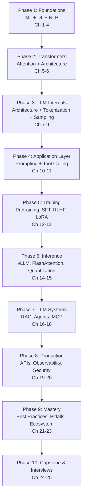

# LLM Fundamentals — From Software Engineer to LLM Systems Engineer

> From artificial neurons to production-grade LLM platforms — a structured, professional learning path for engineers who already *use* LLMs and now want to understand how they work internally.

---

## Course Overview

You already build applications on top of Large Language Models — calling APIs, writing prompts, wiring up RAG pipelines, maybe deploying with vLLM. This course exists to close the gap between **using** LLMs and **understanding** them well enough to design better systems, debug production incidents at the architecture level, optimize latency and cost, and make informed trade-offs instead of cargo-culting defaults.

This course takes you from the foundations of machine learning all the way to deploying and operating production LLM systems, covering:

- Machine learning and deep learning fundamentals (the substrate everything else is built on)
- NLP fundamentals and why they motivated the Transformer
- Attention, self-attention, and the full Transformer architecture — drawn from memory
- Modern decoder-only LLM architecture: context windows, RoPE, KV cache, logits
- Tokenization (BPE, WordPiece, SentencePiece, tiktoken) and sampling strategies
- Prompt engineering, tool calling, and structured output
- Training and fine-tuning: pretraining, SFT, RLHF, DPO, LoRA, QLoRA
- Inference optimization: vLLM, FlashAttention, PagedAttention, quantization, speculative decoding
- LLM applications: RAG, agents, multi-agent systems, MCP, LangGraph
- Production engineering: FastAPI, streaming, caching, observability, evaluation, security
- Capstone projects and interview preparation

Every chapter builds on the previous one. Concepts are introduced in plain language first, then formalized mathematically, then connected to production practice and to tools you likely already use (vLLM, LangChain/LangGraph, FastAPI).

---

## Who This Course Is For

You should already be comfortable with:

- **Software engineering fundamentals** — Python, APIs, Docker, basic system design
- **Using LLMs as a consumer** — calling chat completion APIs, writing prompts, maybe basic RAG or agent frameworks

You do **not** need prior experience with machine learning, neural networks, or the math behind them — those are taught from scratch starting in [Chapter 2](./02-machine-learning-fundamentals.md). A full self-assessment is in [Chapter 1](./01-introduction-and-prerequisites.md).

---

## Learning Roadmap

| Phase | Milestone | Chapters |
|---|---|---|
| 1. Foundations | Explain ML/DL fundamentals and classic NLP well enough to know why Transformers were needed | 1–4 |
| 2. Transformers | Draw the Transformer architecture from memory and explain every block | 5–6 |
| 3. LLM Internals | Trace a prompt through tokenizer → embeddings → layers → logits → sampled token | 7–9 |
| 4. Application Layer | Design robust prompts, tool-calling flows, and structured outputs | 10–11 |
| 5. Training | Explain pretraining vs SFT vs RLHF vs DPO, and fine-tune a model with LoRA/QLoRA | 12–13 |
| 6. Inference | Reason about vLLM, FlashAttention, PagedAttention, and quantization trade-offs | 14–15 |
| 7. LLM Systems | Build RAG pipelines, agents, and multi-agent systems with MCP/LangGraph | 16–18 |
| 8. Production | Ship a monitored, secured, cost-optimized LLM API | 19–20 |
| 9. Mastery | Apply best practices and avoid known failure modes fluently | 21–23 |
| 10. Capstone & Interviews | Ship a production-grade capstone and pass an LLM systems interview | 24–25 |

---

## Estimated Learning Timeline (8–10 Weeks)

**Weeks 1–2 — Foundations** (Ch 1–4): ML basics, deep learning basics, NLP basics. *No project yet — this is the substrate.*

**Weeks 3–4 — Transformers & LLM Internals** (Ch 5–9): attention, full Transformer architecture, decoder-only LLM architecture, tokenization, sampling. *Project: Tokenizer visualizer, Next Token Predictor.*

**Week 5 — Application Layer** (Ch 10–11): prompt engineering, tool calling, structured output. *Projects: SQL Generator, JSON Extractor.*

**Week 6 — Training & Fine-Tuning** (Ch 12–13): pretraining, SFT, RLHF, DPO, LoRA, QLoRA. *Project: Fine-tune a small model with LoRA.*

**Week 7 — Inference Optimization** (Ch 14–15): vLLM, FlashAttention, PagedAttention, quantization, speculative decoding.

**Week 8 — LLM Applications** (Ch 16–18): RAG, agents, multi-agent systems, MCP, LangGraph. *Projects: Chatbot with RAG, Research Agent.*

**Weeks 9–10 — Production & Mastery** (Ch 19–25): production engineering, observability, security, best practices, pitfalls, capstone, interview prep. *Capstone: Production LLM Platform.*

If you can commit ~1.5–2 hours/day, 8–10 weeks is realistic given your existing software engineering and LLM-usage background. Compress to ~5–6 weeks at 3–4 hours/day.

---

## Prerequisites

See [Chapter 1](./01-introduction-and-prerequisites.md) for a full self-assessment, covering:

- **Programming**: Python (functions, classes, NumPy basics), REST APIs, Docker, basic async/await
- **Math** (taught from scratch, refreshed in Ch 2): linear algebra (vectors, matrices, dot products), probability, basic calculus/gradients
- **LLM usage basics**: you should already know what a prompt, token, and API call are — this course explains *why* they behave the way they do

You do **not** need prior experience training neural networks, implementing a Transformer, or using GPU clusters — all of that is taught from first principles.

---

## Complete Chapter Index

| # | Chapter | What You'll Learn |
|---|---|---|
| 01 | [Introduction & Prerequisites](./01-introduction-and-prerequisites.md) | Course goals, self-assessment, environment setup, how to use this course |
| 02 | [Machine Learning Fundamentals](./02-machine-learning-fundamentals.md) | AI vs ML vs DL, supervised/unsupervised/RL, bias-variance, classic algorithms, math primer |
| 03 | [Deep Learning Fundamentals](./03-deep-learning-fundamentals.md) | Neurons, activation functions, backpropagation, optimizers, loss functions |
| 04 | [NLP Fundamentals](./04-nlp-fundamentals.md) | Tokenization basics, POS/NER, word embeddings, Word2Vec/GloVe, why RNNs weren't enough |
| 05 | [Attention Mechanisms & Self-Attention](./05-attention-and-self-attention.md) | Why RNNs/LSTMs struggle with long-range dependencies; Q/K/V math; scaled dot-product attention |
| 06 | [The Transformer Architecture](./06-transformer-architecture.md) | Full encoder-decoder architecture; multi-head attention, LayerNorm, residuals — from memory |
| 07 | [LLM Architecture: Decoder-Only Models, KV Cache & RoPE](./07-llm-architecture-and-decoding.md) | GPT/Llama/Claude/Qwen architecture, context window, RoPE, KV cache, logits |
| 08 | [Tokenization Deep Dive](./08-tokenization-deep-dive.md) | BPE, WordPiece, SentencePiece, Unigram, tiktoken, vocabulary design, token economics |
| 09 | [Sampling & Generation Strategies](./09-sampling-and-generation-strategies.md) | Softmax, temperature, top-k/top-p, beam search, speculative decoding |
| 10 | [Prompt Engineering](./10-prompt-engineering.md) | Zero/one/few-shot, CoT, role prompting, XML/JSON prompting, structured output |
| 11 | [Tool Calling & Structured Output](./11-tool-calling-and-structured-output.md) | Function calling mechanics, JSON schema constraints, prompt chaining |
| 12 | [Pretraining, SFT, RLHF & DPO](./12-pretraining-and-fine-tuning.md) | Full training pipeline, instruction tuning, RLHF vs DPO |
| 13 | [LoRA, QLoRA & PEFT](./13-parameter-efficient-fine-tuning.md) | Low-rank adaptation math, PEFT, quantized fine-tuning, when to fine-tune vs prompt |
| 14 | [Inference Optimization: vLLM, FlashAttention & PagedAttention](./14-inference-optimization.md) | Continuous batching, prefix caching, tensor/pipeline parallelism |
| 15 | [Quantization & Speculative Decoding](./15-quantization-and-speculative-decoding.md) | INT8/GPTQ/AWQ/GGUF, draft-and-verify decoding |
| 16 | [RAG & Vector Databases](./16-rag-and-vector-databases.md) | Retrieval-augmented generation, embeddings, vector DBs, hybrid search, rerankers |
| 17 | [Agents & Multi-Agent Systems](./17-agents-and-multi-agent-systems.md) | ReAct loop, agent memory, multi-agent orchestration patterns |
| 18 | [MCP, LangGraph & Agent Frameworks](./18-mcp-and-agent-frameworks.md) | Model Context Protocol, LangGraph, framework comparison |
| 19 | [Production LLM Systems: FastAPI, Streaming & Scaling](./19-production-llm-systems.md) | Streaming, SSE/WebSockets, rate limiting, caching, cost optimization |
| 20 | [Observability, Evaluation & Security](./20-observability-evaluation-and-security.md) | Guardrails, monitoring, LLM-as-judge evaluation, prompt injection defense |
| 21 | [Best Practices](./21-best-practices.md) | Consolidated professional checklist across the whole stack |
| 22 | [Common Mistakes & Pitfalls](./22-common-mistakes-and-pitfalls.md) | Failure modes and how to avoid them |
| 23 | [Tools, Papers & Ecosystem Landscape](./23-tools-and-ecosystem-landscape.md) | Framework/library comparison, must-read papers in order, books, courses |
| 24 | [Capstone Projects](./24-capstone-projects.md) | Beginner → production-grade project specs, architecture, folder structure |
| 25 | [Interview Preparation](./25-interview-preparation.md) | Q&A, system design, troubleshooting, real production case studies |

---

## Milestones Checklist

- [ ] Explain bias-variance trade-off and pick the right classical algorithm for a given problem
- [ ] Implement backpropagation intuition and explain what Adam does differently from SGD
- [ ] Draw the full Transformer architecture from memory, labeling every block
- [ ] Trace a prompt through tokenizer → embeddings → transformer layers → logits → sampled token
- [ ] Explain RoPE and KV cache well enough to reason about context-length and latency trade-offs
- [ ] Implement a BPE tokenizer from scratch
- [ ] Tune temperature/top-k/top-p deliberately for a given generation task
- [ ] Design a prompt with structured output and a tool-calling flow
- [ ] Explain the difference between pretraining, SFT, RLHF, and DPO
- [ ] Fine-tune a model with LoRA/QLoRA
- [ ] Explain how vLLM's PagedAttention and continuous batching improve throughput
- [ ] Choose a quantization format (GPTQ/AWQ/GGUF) for a given deployment target
- [ ] Build a RAG pipeline and a ReAct-style agent
- [ ] Deploy a streaming LLM API with rate limiting, caching, and monitoring
- [ ] Complete a production-grade capstone project
- [ ] Answer all interview questions in Chapter 25 confidently

---

## Recommended Resources

**Books**: *Hands-On Large Language Models* (Jay Alammar & Maarten Grootendorst), *Natural Language Processing with Transformers* (Lewis Tunstall, Leandro von Werra, Thomas Wolf), *Deep Learning* (Ian Goodfellow, Yoshua Bengio, Aaron Courville).

**Courses**: DeepLearning.AI Generative AI/LLM Specializations, Hugging Face NLP Course, Stanford CS224N (NLP), Stanford CS25 (Transformers United).

**Papers, in reading order** (full context in [Chapter 23](./23-tools-and-ecosystem-landscape.md)): Attention Is All You Need → BERT → GPT → GPT-2 → GPT-3 → InstructGPT → LLaMA → LLaMA 2 → LLaMA 3 → LoRA → QLoRA → FlashAttention → vLLM (PagedAttention).

**Frameworks & Tools**: Hugging Face Transformers/PEFT, vLLM, LangChain/LangGraph, FastAPI, tiktoken.

**Related course in this repo**: [`../rag-course`](../rag-course/00-index.md) — a full 20-chapter deep dive on Retrieval-Augmented Generation, if you want to go deeper than [Chapter 16](./16-rag-and-vector-databases.md) here.

---

  
  <a href="./00-index.md">🏠 Index</a>
  <a href="./01-introduction-and-prerequisites.md">Next: Introduction & Prerequisites →</a>

