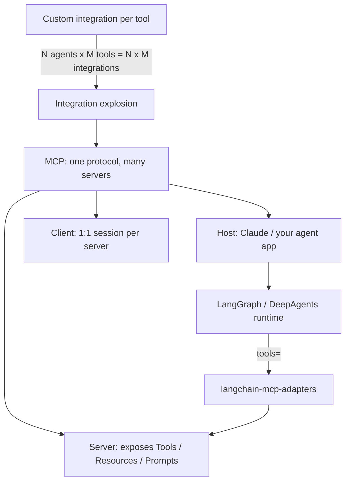

# MCP Mastery — From Protocol Fundamentals to Production Agent Infrastructure

## Course Overview

The Model Context Protocol (MCP) is the standard that lets AI applications discover and use external tools, data, and prompts through one consistent interface instead of a custom integration per service. If you already build agents with LangGraph and DeepAgents, MCP is the layer that turns your agent's tool belt from "a pile of hand-written Python functions" into "a pluggable ecosystem of interoperable servers."

This course teaches MCP from **both sides of the wire**: as an **MCP server developer** (exposing tools, resources, and prompts to any MCP-compatible client) and as an **MCP client/host developer** (connecting an agent runtime to one or many MCP servers). It assumes you are already comfortable with Python, async/await, REST APIs, and building agents with LangGraph and DeepAgents — so it does not re-teach what a tool call is or what an LLM agent loop does. It starts at "why does a new protocol need to exist" and ends at production MCP gateways with authentication, observability, and multi-agent orchestration.

### A note on timing

This course is being written just after MCP's largest spec revision to date. **2025-06-18** is the "classic," handshake-based revision that essentially all production tooling you'll touch today — `langchain-mcp-adapters`, `deepagents`, the `mcp` Python SDK's v1.x line, and nearly every existing MCP server — implements. On **2026-07-28**, the protocol moved to a stateless, handshake-free design (SDK v2.0.0). This course teaches the classic model hands-on, because that's what you'll actually build with right now, and gives the stateless redesign its own dedicated chapter (Chapter 21) so you understand where the protocol is headed and aren't blindsided mid-project. Every chapter that touches the wire format flags the difference explicitly.

## Why MCP, and Why Now

MCP standardizes the same three things every agent framework eventually reinvents on its own: how to describe an action the model can take (**tools**), how to hand the model read-only context (**resources**), and how to package a reusable instruction template (**prompts**). Once a capability is behind an MCP server, any MCP-aware host — Claude, your own LangGraph agent, DeepAgents, an IDE — can use it without bespoke glue code.

## Who This Course Is For

You should already know:

- Python at a professional level (async/await, type hints, packaging)
- REST API design and HTTP fundamentals
- LangGraph fundamentals (graphs, state, nodes/edges) and ideally DeepAgents
- What "tool calling" / "function calling" means for an LLM
- Basic OAuth 2.0 concepts (you'll go deeper on this in Chapters 13 and this course's security material)

You do **not** need prior MCP experience, prior JSON-RPC experience, or deep protocol-design background — those are taught from first principles in Chapters 2–3.

## Quick Self-Assessment

| Question | If "no," start at |
|---|---|
| Can you explain the difference between a tool call and a REST endpoint? | Chapter 1 |
| Do you know what JSON-RPC 2.0 is? | Chapter 3 |
| Have you written a LangGraph tool node before? | Review LangGraph course first |
| Have you used `create_deep_agent()`? | Review DeepAgents course first, or read Chapter 19 with that gap in mind |
| Do you know what OAuth 2.1 / PKCE are? | Chapter 13 covers this from scratch |

## Estimated Timeline

| Pace | Duration |
|---|---|
| Intensive (learning full-time) | 2–3 weeks |
| Steady (evenings/weekends) | 6–8 weeks |
| Reference-only (dip in as needed) | Ongoing |

## Complete Chapter Index

| # | Chapter | Focus |
|---|---|---|
| 00 | [Index](./00-index.md) | You are here |
| 01 | [Introduction & Why MCP Exists](./01-introduction-and-why-mcp-exists.md) | The integration-explosion problem, MCP vs. REST vs. plain tool calling |
| 02 | [MCP Architecture: Host, Client, Server](./02-mcp-architecture-host-client-server.md) | The core mental model — don't skip this |
| 03 | [Protocol Fundamentals & Lifecycle](./03-protocol-fundamentals-and-lifecycle.md) | JSON-RPC 2.0, initialize/initialized, capability negotiation |
| 04 | [MCP Tools](./04-mcp-tools.md) | Tool definitions, schemas, results, your first server |
| 05 | [MCP Resources](./05-mcp-resources.md) | Exposing context/data, URIs, subscriptions |
| 06 | [MCP Prompts](./06-mcp-prompts.md) | Reusable prompt templates as a first-class primitive |
| 07 | [Building MCP Servers](./07-building-mcp-servers.md) | Project structure, FastMCP, separating protocol from business logic |
| 08 | [Transport Mechanisms](./08-transport-mechanisms.md) | stdio vs. Streamable HTTP vs. legacy HTTP+SSE |
| 09 | [Building MCP Clients](./09-building-mcp-clients.md) | `ClientSession`, connecting, discovery, calling tools |
| 10 | [Tool Schema Design](./10-tool-schema-design.md) | Writing schemas the LLM can actually use correctly |
| 11 | [Error Handling](./11-error-handling.md) | Protocol vs. tool errors, debugging the whole chain |
| 12 | [MCP Inspector & Debugging](./12-mcp-inspector-and-debugging.md) | Testing servers independently of any LLM |
| 13 | [Authentication & Authorization](./13-authentication-and-authorization.md) | OAuth 2.1, PKCE, Protected Resource Metadata, tokens |
| 14 | [MCP Security](./14-mcp-security.md) | Tool poisoning, rug pulls, confused deputy, sandboxing |
| 15 | [MCP + Databases](./15-mcp-and-databases.md) | Generic vs. domain-specific database tools |
| 16 | [MCP + REST APIs](./16-mcp-and-rest-apis.md) | Wrapping an existing API as an MCP adapter |
| 17 | [MCP + LangChain](./17-mcp-with-langchain.md) | `langchain-mcp-adapters`, `MultiServerMCPClient` |
| 18 | [MCP + LangGraph](./18-mcp-with-langgraph.md) | MCP tools inside a graph, routing, validation |
| 19 | [MCP + DeepAgents](./19-mcp-with-deepagents.md) | Wiring MCP tools into `create_deep_agent()` |
| 20 | [Production MCP Architecture](./20-production-mcp-architecture.md) | Async I/O, retries, rate limiting, observability, scaling |
| 21 | [The Stateless Redesign — MCP 2026-07-28](./21-the-stateless-redesign-2026-07-28.md) | What changed, why, and what to do about it today |
| 22 | [Best Practices](./22-best-practices.md) | Synthesis across every prior chapter |
| 23 | [Common Mistakes & Pitfalls](./23-common-mistakes-and-pitfalls.md) | A pitfall catalog from real MCP incidents and misuse |
| 24 | [Capstone Projects](./24-capstone-projects.md) | Beginner → production-grade enterprise MCP platform |
| 25 | [Interview Preparation](./25-interview-preparation.md) | FAQs, scenario questions, system design, troubleshooting |

## Milestones

- **Milestone 1 (Ch. 1–6)**: You can explain MCP's architecture and primitives well enough to whiteboard it in a design review.
- **Milestone 2 (Ch. 7–12)**: You can build and debug a working MCP server and a working MCP client from scratch.
- **Milestone 3 (Ch. 13–16)**: You can secure a server and connect it to a real database or REST backend.
- **Milestone 4 (Ch. 17–20)**: You can wire MCP into LangChain, LangGraph, and DeepAgents, and reason about production concerns.
- **Milestone 5 (Ch. 21–25)**: You understand the protocol's trajectory, avoid the well-documented pitfalls, and can defend your design choices in an interview or architecture review.

## Recommended Resources

- Official spec: `modelcontextprotocol.io/specification` (always check which revision a page describes)
- `github.com/modelcontextprotocol/python-sdk` — official Python SDK
- `github.com/modelcontextprotocol/inspector` — MCP Inspector
- `github.com/langchain-ai/langchain-mcp-adapters` — LangChain/LangGraph integration
- `github.com/PrefectHQ/fastmcp` — the actively-maintained standalone FastMCP project (ahead of the SDK's bundled version)
- This repo's [DeepAgents course](../deepagents-course/00-index.md) and [LangGraph course](../langgraph-course/00-index.md) for the agent-runtime side of the integrations in Chapters 18–19

## Learning Priority (80/20)

If you only have time for a fraction of this course, prioritize: **Chapter 2 (architecture)**, **Chapter 4 (tools)**, **Chapter 7 (building servers)**, **Chapter 10 (schema design)**, **Chapter 12 (debugging)**, and **Chapter 14 (security)**. Resources and prompts (Ch. 5–6) matter less in day-to-day work than getting tool design and debugging habits right.

  
  <a href="./00-index.md">🏠 Index</a>
  <a href="./01-introduction-and-why-mcp-exists.md">Next: Introduction & Why MCP Exists →</a>

