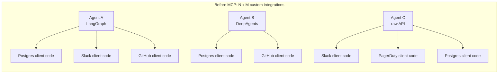
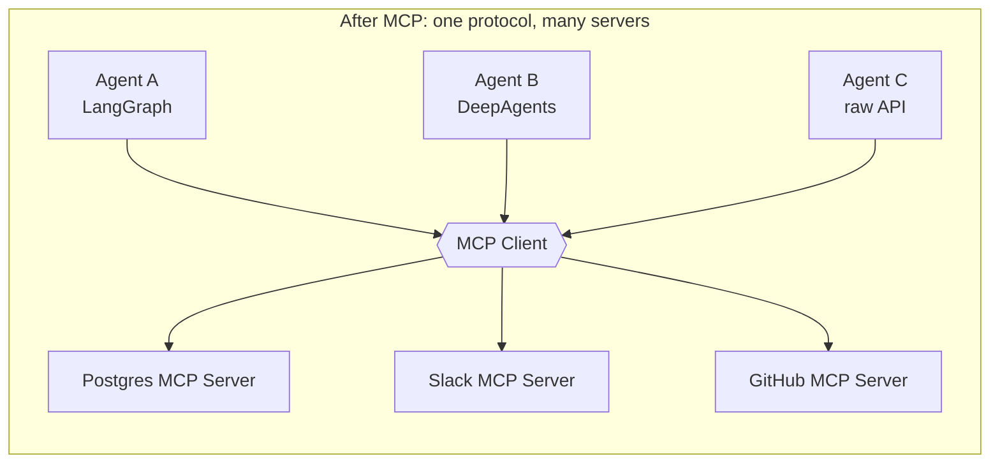
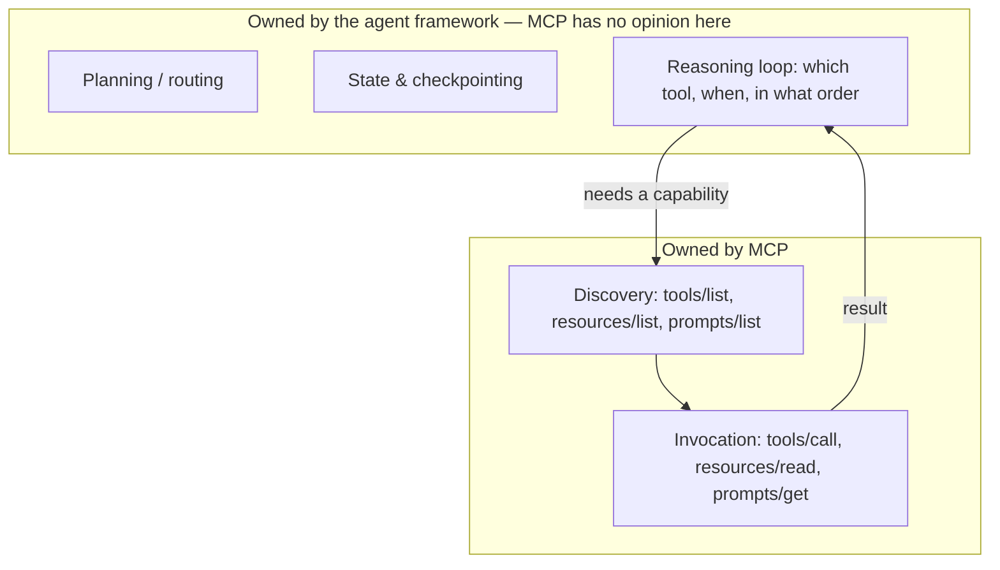
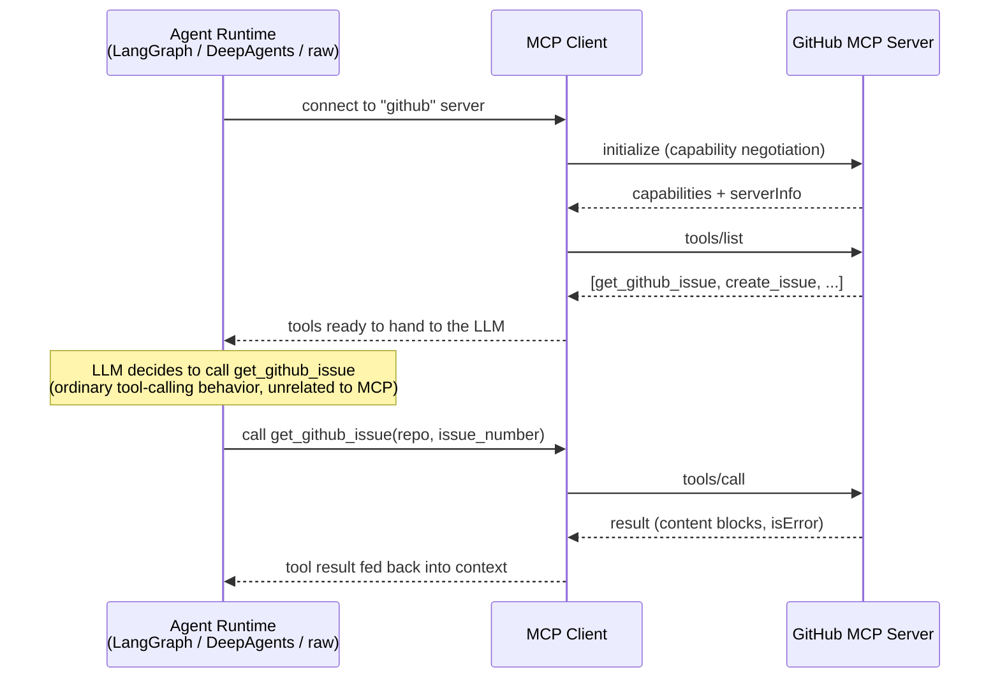

# Introduction & Why MCP Exists

## Learning Objectives

By the end of this chapter, you will be able to:

- Explain the "N agents × M tools" integration-explosion problem that MCP was built to solve
- Distinguish MCP from a plain REST API, from ordinary LLM tool/function calling, and from an agent framework like LangGraph or DeepAgents
- State precisely what MCP standardizes (discovery and invocation of external capabilities) and what it deliberately does **not** do (the agent's reasoning loop)
- Explain why MCP emerged when it did, given the parallel explosion of agent frameworks
- Place the 2026-07-28 stateless spec revision in context without needing its technical details yet
- Describe how the rest of this course is organized, from both a server-developer and a client-developer perspective

## Prerequisites

This chapter assumes you already have:

- Professional-level Python (async/await, type hints, packaging)
- Working knowledge of REST API design and HTTP
- Familiarity with LLM tool/function calling (JSON schemas, the model choosing to call a function, the result being fed back into context)
- Basic LangGraph fluency, and ideally some exposure to DeepAgents
- No prior MCP or JSON-RPC knowledge — that starts fresh in Chapters 2–3

If any of those are shaky, this course is not the place to build them — see this repo's LangGraph and DeepAgents courses first.

---

## 1. The Problem: Integration Explosion

Every agent needs to *do* things in the world beyond generating text: query a database, open a GitHub issue, post to Slack, read a file, hit an internal API. In the LLM tool-calling model, "doing things" means writing a Python function, describing it with a JSON schema, and handing that schema to the model so it can decide when to call it.

That part scales fine for one agent talking to one system. It stops scaling the moment you have more than one of either.

Picture a mid-size engineering org building agent products in 2025, before MCP existed:

- **Agent A** (a support bot, built on LangGraph) needs to read Postgres, search Slack, and read GitHub issues.
- **Agent B** (a coding assistant, built on DeepAgents) needs to read GitHub, write GitHub, and query Postgres.
- **Agent C** (an ops assistant, built directly on the Anthropic API) needs Slack, PagerDuty, and Postgres.

Nobody sat down and designed this from a clean sheet — it just grew, one integration at a time. Naively, this is **N agents × M external systems** hand-written integrations: N×M functions, N×M JSON schemas, N×M sets of auth handling, N×M sets of retry/error-handling logic, N×M places that go stale when the Postgres schema or the GitHub API changes.



Six boxes on the right, each hand-rolled, each with its own auth, its own retry policy, its own idea of what a "tool schema" looks like, and — critically — each one only usable by the one agent that wrote it. If Agent C also wanted GitHub access, that's a seventh box, written from scratch, by someone who has to relearn the GitHub API's quirks that whoever wrote `G1` already learned and threw away.

Concretely, this duplication shows up as recurring, avoidable pain:

- **Drift**: `P1` and `P2` both query Postgres, but were written six months apart by different people, so one filters soft-deleted rows and the other doesn't — an inconsistency nobody notices until a support ticket asks why Agent A and Agent B disagree about the same customer.
- **Auth sprawl**: three different credentials-handling patterns for "talk to Slack" (`S1`, `S3`) means three places a leaked token can hide, and three places a token rotation has to be applied.
- **No shared audit trail**: if you want to answer "which agents can write to GitHub, and what have they done," you have to go read three separate codebases, because there's no single boundary where that access is defined.
- **Onboarding tax**: a new engineer joining Agent C's team has to learn Agent C's bespoke Postgres client, which teaches them nothing transferable to Agent A's or Agent B's, even though all three are ultimately doing "query Postgres."

This is not a hypothetical. It is precisely the pattern that pushed both Anthropic (building Claude integrations) and the broader agent-tooling ecosystem toward a shared answer in late 2024: standardize the *wire format* for "here are my capabilities" and "invoke one of them," once, so that the Postgres integration, the GitHub integration, and the Slack integration each get written **once** — as a server — and every agent, in every framework, talks to them the same way.



Three servers, written once each, maintained once each, reused by every agent that speaks MCP — regardless of which framework built that agent. That's the entire pitch. Everything else in this course is detail on top of that one idea.

## 2. What MCP Actually Standardizes

It's worth being precise, because "standardized tool access" is easy to hand-wave. MCP defines:

1. **A wire protocol** — JSON-RPC 2.0 messages over a small number of transports (stdio, Streamable HTTP — covered in depth in Chapter 8).
2. **A discovery contract** — methods like `tools/list`, `resources/list`, and `prompts/list` that let any client ask any server "what can you do?" and get back a structured, machine-readable answer (Chapters 4–6).
3. **An invocation contract** — `tools/call`, `resources/read`, `prompts/get` — a single, consistent shape for actually using a capability, and a single consistent shape for the result coming back (Chapter 4, Chapter 11 on errors).
4. **A capability-negotiation lifecycle** — how a client and server agree on protocol version and optional features like sampling, elicitation, and subscriptions before doing anything else (Chapter 3).
5. **A security model** — how servers should treat tokens, how OAuth fits in, how to avoid a list of well-known MCP-specific attack patterns (Chapters 13–14).

What it explicitly does **not** standardize: how the model decides *which* tool to call, *when* to call it, how to plan across multiple tool calls, how to retry a failed plan, or how to maintain multi-step reasoning state. That is — and remains — the job of the host application's agent loop, whether that loop is LangGraph, DeepAgents, or something you wrote by hand. MCP hands the model's runtime a uniform list of capabilities and a uniform way to invoke them; the runtime still has to decide what to do with them.

This division of labor is the single most important mental model in this course. Get it wrong and you'll either expect MCP to do reasoning it was never designed to do, or you'll under-use it by writing custom reasoning glue you didn't need.

## 3. MCP vs. a Normal REST API

A REST API and an MCP server can both, in principle, be "an HTTP service that does things." The difference is *who* the interface is designed for and what it promises about self-description.

| | REST API | MCP Server |
|---|---|---|
| Primary consumer | Application developers who read docs and write client code by hand | An LLM-driven agent runtime that discovers capabilities at connection time |
| Discovery | Out-of-band (Swagger/OpenAPI docs, a wiki page, tribal knowledge) | In-band, part of the protocol itself (`tools/list`, `resources/list`, `prompts/list`) |
| Schema/description purpose | Documents the contract for a human writing code | Doubles as the **prompt content** the LLM reads to decide whether/how to call it |
| Invocation shape | Varies per endpoint — different verbs, different URL structures, different pagination and error conventions per API | One consistent invocation envelope (`tools/call`) regardless of which server or which tool |
| Versioning story | Usually per-API, inconsistent across services | A protocol-level `protocolVersion` negotiated once per connection |
| Auth model | Whatever the API designer chose (API keys, custom headers, OAuth variants) | Standardized around OAuth 2.1 with spec-defined roles for the MCP server as a Resource Server (Chapter 13) |

You can absolutely wrap an existing REST API as an MCP server (Chapter 16 does exactly this). MCP does not replace REST as a transport-and-resource-model idea — it sits *in front of* whatever backend already exists, and its job is to describe that backend's capabilities in a way an LLM runtime can consume without a human first reading documentation and hand-writing a client.

## 4. MCP vs. Plain LLM Tool/Function Calling

This is the distinction people most often get wrong, so slow down here.

"Tool calling" is a *model capability*: given a list of function schemas in the request, the model can emit a structured call to one of them instead of (or alongside) natural-language text. That capability is provider-defined — it exists independent of MCP, and you've already used it if you've built any tool-using agent.

MCP does not add a new model capability. It does not change how the model decides to call a tool, and it does not change the shape of a tool call as far as the model is concerned. What MCP changes is **where the tool definitions and the tool implementations come from**.

Without MCP, "tool calling" means:

```python
# Before MCP: hand-written, hand-maintained, single-process tool
def get_github_issue(repo: str, issue_number: int) -> dict:
    """Fetch a GitHub issue by number."""
    resp = httpx.get(f"https://api.github.com/repos/{repo}/issues/{issue_number}",
                      headers={"Authorization": f"Bearer {GITHUB_TOKEN}"})
    resp.raise_for_status()
    return resp.json()

# You hand-write the JSON schema too, and keep it in sync by hand
tools = [{
    "name": "get_github_issue",
    "description": "Fetch a GitHub issue by number.",
    "input_schema": {
        "type": "object",
        "properties": {"repo": {"type": "string"}, "issue_number": {"type": "integer"}},
        "required": ["repo", "issue_number"],
    },
}]
```

This works, and for a single agent talking to a system nobody else needs, it's often the *right* choice — MCP has connection, process-management, and protocol overhead that a single in-process function doesn't. But the schema, the implementation, the auth handling, and the error handling all live inside this one agent's codebase. Another team's agent that also needs GitHub issues writes its own version of the same function, independently, and the two drift.

With MCP, the same capability lives behind a server, once:

```python
# mcp v1.x (classic) — the GitHub capability, written once, as a server
from mcp.server.fastmcp import FastMCP

mcp = FastMCP("GitHub")

@mcp.tool()
def get_github_issue(repo: str, issue_number: int) -> dict:
    """Fetch a GitHub issue by number."""
    resp = httpx.get(f"https://api.github.com/repos/{repo}/issues/{issue_number}",
                      headers={"Authorization": f"Bearer {GITHUB_TOKEN}"})
    resp.raise_for_status()
    return resp.json()
```

Any MCP-aware client — LangGraph, DeepAgents, a raw script — discovers this tool over the wire (its schema is derived automatically from the function signature and docstring; you never hand-write JSON Schema) and calls it through the same `tools/call` envelope used for every other MCP tool, from every other server:

```python
# langchain-mcp-adapters — any agent, any framework, same client shape
from langchain_mcp_adapters.client import MultiServerMCPClient

client = MultiServerMCPClient({
    "github": {"command": "python", "args": ["/path/to/github_server.py"], "transport": "stdio"},
})
tools = await client.get_tools()   # ordinary LangChain tools, ready to hand to any agent
```

Net effect: tool calling as a *model behavior* is unchanged. What changed is that the tool's definition and implementation moved from "duplicated inside every agent that needs it" to "hosted once, discovered by any client, over a standard protocol." MCP is a distribution mechanism for tools (and resources, and prompts) — not a new kind of tool call.

## 5. MCP vs. Full Agent Frameworks (LangGraph / DeepAgents)

This is the second distinction worth nailing down precisely, because MCP and an agent framework sound like they might compete. They don't — they compose.

LangGraph gives you a graph of nodes and edges, state management, checkpointing, human-in-the-loop interrupts, and control over exactly how the agent's reasoning loop runs. DeepAgents builds on top of that to give you planning, sub-agents, a filesystem-like memory backend, and skills. Neither one has anything to say about *how a Postgres query gets executed* or *how a GitHub issue gets fetched* — they consume tools as opaque callables and reason about when to invoke them.

MCP fits at exactly the boundary those frameworks leave open: it's the standardized way those opaque callables get **discovered and invoked** when the actual capability lives outside your process, potentially maintained by someone else, potentially reused by other agents you don't control.



Concretely, in a LangGraph or DeepAgents application, MCP tools obtained via `MultiServerMCPClient(...).get_tools()` are passed straight into the ordinary `tools=` parameter — `create_deep_agent(model=..., tools=tools)` — sitting alongside any hand-written LangChain tools you also have. The framework doesn't know or care that some of its tools happen to be backed by an MCP server instead of an in-process function; that's the whole point. Chapters 17–19 build this integration in depth.

So: MCP is not a competitor to LangGraph or DeepAgents, and it's not a replacement for either. It's a lower layer — a standardized way to *populate* the tool list those frameworks already know how to consume, so that populating it doesn't mean hand-writing and hand-maintaining every integration yourself.

## 6. Why Now? The Parallel Explosion of Agent Frameworks

MCP was announced by Anthropic in November 2024, and adoption accelerated through 2025 — roughly the same window in which LangGraph, DeepAgents-style planning agents, and a wave of competing agent frameworks all matured and shipped to production. That timing is not a coincidence.

Every one of those frameworks independently arrived at the same need: a growing library of external capabilities (databases, SaaS APIs, internal services, file systems) that agents should be able to reach without every framework author, and every application team using those frameworks, re-implementing the same GitHub client, the same Postgres client, the same Slack client. Before a shared protocol existed, that duplication was happening *inside* every framework's ecosystem separately — LangChain had its own tool-integration marketplace conventions, other frameworks had theirs, none of them interoperable.

MCP's bet is that "discover capabilities, invoke capabilities" is a generic enough contract that it can sit underneath *all* of these frameworks rather than being reinvented once per framework. The evidence that the bet paid off: by the time this course is being written, `langchain-mcp-adapters` is a first-class, actively maintained integration; DeepAgents consumes MCP tools through its ordinary `tools=` parameter with no special-casing; and thousands of community and vendor MCP servers exist for databases, SaaS products, and internal tooling, usable from any of them.

The practical upshot for you as an engineer: learning MCP is not a framework-specific skill. It transfers across whichever agent runtime your team uses today, and whichever one it migrates to next.

## 7. A Short Note on Where the Protocol Is Headed

> **2026-07-28 spec note:** Two days before this course was written, MCP underwent its largest revision to date, moving from a stateful, handshake-based protocol (the `initialize` / `initialized` exchange you'll learn hands-on starting in Chapter 3) to a **stateless** design where every request carries its own version and capability information, with no connection-level session to negotiate first. This is a real, confirmed change (covered by the official MCP blog, AWS, and independent press) — not a rumor or a preview feature.
>
> It matters for how you read the rest of this course, not for what you build today: virtually every tool you'll actually touch — `langchain-mcp-adapters`, `deepagents`, the existing universe of MCP servers, and the `mcp` Python SDK's actively maintained v1.x line — still implements the classic, handshake-based model described in the sections above. That is what this course teaches hands-on, because that's what makes you productive right now. A new SDK major version (v2.0.0) implements the stateless redesign, and the ecosystem has not migrated to it yet. Chapter 21 is dedicated entirely to the stateless redesign — what changed, why, and what to actually do about it. Every other chapter that touches the wire format gives you a short callout like this one so you recognize the difference when you see version numbers in the wild, without mixing the two generations together in one example.

Put simply: you're learning the version of MCP that ships in production today, with a clear map to where the protocol is going, delivered at the one point in the course (Chapter 21) where the distinction actually needs deep treatment.

## 8. Side-by-Side: MCP, REST, Tool Calling, and Agent Frameworks

It helps to see all four concepts in one table, because the confusion in Sections 3–5 usually comes from treating them as competing choices when they actually answer four different questions.

| Concept | Question it answers | Who/what owns it | Example from this course |
|---|---|---|---|
| REST API | "How do I expose a backend over HTTP?" | Whoever built the backend service | The GitHub REST API itself, Chapter 16 |
| LLM tool/function calling | "How does a model express 'call this function' as structured output?" | The model provider (Anthropic, etc.) | The `tool_use` content block your agent already parses today |
| MCP | "How does a tool/resource/prompt get **discovered** and **invoked** in a standard way, independent of who wrote it or who's consuming it?" | The MCP spec + SDKs | `tools/list`, `tools/call` — Chapters 3–6 |
| Agent framework (LangGraph/DeepAgents) | "How does the agent **decide** what to do, in what order, with what state, and how does a human intervene?" | Your application, using the framework | The graph/state/planning layer that *consumes* MCP tools — Chapters 17–19 |

Read the table top to bottom and the layering becomes obvious: a REST API is one possible thing an MCP server wraps; tool calling is the model behavior an MCP-discovered tool ultimately triggers; MCP is the discovery/invocation contract in between; and the agent framework is the outermost layer deciding when any of this happens at all. None of the four rows is a substitute for another — each occupies a slot the others don't.

## 9. A Brief Timeline: Why the Timing Wasn't a Coincidence

It's worth seeing the rough sequence of events, because "why now" lands better as a timeline than as an abstract argument.

| Period | What was happening |
|---|---|
| 2023–early 2024 | LLM tool/function calling becomes standard practice; every team hand-writes its own tool integrations; agent frameworks are early and fragmented |
| Mid–late 2024 | Agent frameworks mature rapidly (LangGraph reaches production maturity); teams' integration code duplicates across projects faster than anyone can consolidate it by hand |
| November 2024 | Anthropic publishes the Model Context Protocol specification and open-sources the Python/TypeScript SDKs |
| 2025 (throughout) | `langchain-mcp-adapters` matures to a stable, widely adopted integration; DeepAgents-style planning agents ship consuming MCP tools through their ordinary tool interface; the spec itself iterates three times (`2025-03-26`, `2025-06-18`, `2025-11-25`) adding OAuth, structured output, and refined discovery — each revision covered later in this course; thousands of community and vendor MCP servers appear for databases, SaaS products, and internal tooling |
| 2026-07-28 | The stateless redesign ships as the current spec revision (Chapter 21); the classic model remains what production tooling actually runs |

The pattern to notice: MCP didn't create the demand for shared tool infrastructure — the demand already existed, growing faster than any single framework's ecosystem could organize on its own. MCP is the point at which that demand got a protocol instead of N incompatible, framework-specific answers.

## 10. A One-Paragraph Preview of the Three Primitives

You'll get the full treatment of each in Chapters 4–6, but it helps to have names for these before Chapter 2 dives into architecture. MCP standardizes exactly three kinds of capability a server can expose. **Tools** are actions with side effects or computation — "run this query," "open this issue" — invoked via `tools/call`, and they're what most people picture when they hear "MCP." **Resources** are read-only context — a file, a database row, a config value — fetched via `resources/read`, conceptually closer to a GET request than a function call, and they can optionally be subscribed to for change notifications. **Prompts** are reusable, parameterized instruction templates a server can offer — "summarize this ticket in our team's format" — fetched via `prompts/get` and inserted into the conversation, so that prompt engineering for a given task can also be centralized and shared instead of copy-pasted across every agent that needs it. All three share the same content-block format for their actual payloads (text, image, audio, embedded resource), which is why learning that shape once (Chapter 4) pays off across all three primitives.

## 11. What to Expect From the Rest of This Course

This course is deliberately organized to serve two overlapping audiences at once — you'll likely be both at different points in your career, sometimes on the same project.

**If you're approaching MCP primarily as a server developer** — you're the one exposing a database, an internal API, or a SaaS integration as tools/resources/prompts for other people's agents to consume — your spine through the course is: architecture and primitives (Chapters 2–6) to get the mental model right, then Chapters 7–8 and 10 for the actual craft of building a server and designing schemas an LLM can use well, then Chapters 11–12 for making your server debuggable, then Chapters 13–16 for securing it and connecting it to a real backend, and Chapter 20 for running it reliably at scale. Chapter 24's capstone projects include a full production-grade server build.

**If you're approaching MCP primarily as a client/host developer** — you're building an agent (in LangGraph, DeepAgents, or otherwise) that needs to consume tools other people's servers expose — your spine is: architecture and primitives (Chapters 2–6) for the same foundational reason, then Chapter 9 for building clients directly against the SDK, Chapter 11 for handling the errors that will inevitably come back from servers you don't control, and then Chapters 17–19, which are the payoff chapters showing exactly how MCP tools slot into `langchain-mcp-adapters`, a LangGraph graph, and `create_deep_agent()`'s `tools=` parameter.

Most engineers end up needing both perspectives — you'll build a server for your team's internal system, and separately wire a dozen third-party MCP servers into an agent you own — so the course doesn't force you to pick a track. Chapters 13–14 (security) and 20 (production concerns) matter to both perspectives equally, and the closing chapters (21–25) are perspective-agnostic: the stateless redesign, a cross-cutting best-practices synthesis, a pitfall catalog, capstones spanning both roles, and interview preparation that tests whether you can reason about the whole system, not just one side of the wire.

If you only remember one thing from this section: don't skip Chapters 2–6 no matter which side you think you care about more. Every later chapter assumes you have the host/client/server architecture and the three primitives cold.

## Examples

### Example 1: The integration-explosion math, made concrete

Suppose your org has 4 agents and needs each to reach 5 external systems. Hand-written integrations, in the worst case, is 4 × 5 = 20 separate pieces of client code, each with its own auth handling and its own drift risk as the underlying APIs change. With MCP, it's 5 servers (one per system, regardless of how many agents use it) and N clients that all speak the identical `tools/list` / `tools/call` contract to reach any of them. Adding a 5th agent costs zero new server-side work. Adding a 6th external system costs one new server, immediately usable by all 4 existing agents.

### Example 2: Same capability, framework-agnostic

The `get_github_issue` MCP server shown in Section 4 is retrievable and callable identically whether the calling code is:

```python
# Raw MCP client (no framework) — v1.x classic
from mcp import ClientSession, StdioServerParameters
from mcp.client.stdio import stdio_client

async with stdio_client(server_params) as (read, write):
    async with ClientSession(read, write) as session:
        await session.initialize()
        result = await session.call_tool(
            "get_github_issue", arguments={"repo": "anthropics/claude-code", "issue_number": 42}
        )
```

```python
# LangGraph / DeepAgents, via langchain-mcp-adapters
from langchain_mcp_adapters.client import MultiServerMCPClient

client = MultiServerMCPClient({
    "github": {"command": "python", "args": ["/path/to/github_server.py"], "transport": "stdio"},
})
tools = await client.get_tools()
agent = create_deep_agent(model=model, tools=tools)
```

Same server, zero changes, two entirely different consuming frameworks. That portability is the point.

### Example 3: What discovery-then-invocation looks like end to end

The sequence below is intentionally protocol-level and framework-agnostic — it's the same shape whether the caller is a raw MCP client, LangGraph, or DeepAgents, because that shape is exactly what MCP standardizes. You'll see the concrete `initialize`/`initialized` messages behind step 1 in Chapter 3.



Notice where the LLM's own tool-calling behavior sits: entirely inside the "Agent Runtime" box, after discovery has already happened. MCP's job ends the moment the tool result is handed back — what the agent does with that result next is, again, the framework's job, not the protocol's.

## Real-World Scenario

A platform team at a mid-size SaaS company supports three internal agent products: a customer-support triage bot (LangGraph), an internal DevOps assistant (DeepAgents), and a sales-ops assistant built directly on the Anthropic API for a lightweight Slack bot. All three need to look up customer account data in Postgres. All three need to check deployment status in an internal service. Before MCP, three teams each wrote — and each maintained — their own Postgres query layer and their own internal-service client, using three different retry policies and three different sets of credentials management, with no shared audit trail.

The platform team's actual fix: stand up one **Postgres MCP server** and one **internal-deploy-status MCP server**, each written once, each enforcing the org's own data-access policy (e.g., read-only views, row-level filters) at the server boundary rather than trusting every agent team to reimplement that policy correctly. All three agent products connect to both servers through their own framework's MCP client integration — `langchain-mcp-adapters` for the LangGraph and DeepAgents products, a direct MCP client for the lightweight Slack bot. When the internal-deploy-status API changes its response shape six months later, exactly one server gets updated. All three agents pick up the fix the next time they reconnect — nobody has to touch the triage bot's or the sales-ops bot's codebase at all.

This is the pattern this entire course builds toward: you'll learn to build servers like these (Chapters 4–12), secure them properly (Chapters 13–14), connect them to real backends (Chapters 15–16), wire them into LangChain/LangGraph/DeepAgents (Chapters 17–19), and run them in production (Chapter 20).

The measurable outcome six months later was not "we saved some lines of code." It was: one incident (a Postgres connection-pool exhaustion under load) got fixed once, at the server, and every agent product benefited immediately without a deploy on their side; one security review (are we filtering rows by tenant correctly?) had exactly two places to audit instead of three independently-written query layers; and onboarding a *fourth* agent product six months later to the same two systems took an afternoon of wiring instead of another few weeks of writing and testing a new client from scratch. None of that required inventing anything new in the agent frameworks themselves — it came entirely from moving the capability behind a standard protocol boundary.

### Counter-Scenario: When *Not* to Reach for MCP Yet

Balance the story above against a solo developer prototyping a single agent for a single internal use case, with no plan for anyone else to reuse the integration. Standing up an MCP server here — a separate process, its own transport, its own connection lifecycle — is real overhead for zero reuse benefit. A plain Python function passed straight into the agent framework's tool list is not a lesser choice in that situation; it's the *correct* one. Nothing about this course's enthusiasm for MCP should be read as "always wrap everything in MCP" — the decision criterion from the Best Practices section below (reused by more than one agent, team, or framework; needs centralized policy enforcement; benefits from being independently deployable and versionable) is what should drive the call, not protocol novelty.

## Best Practices

- **Reach for MCP when a capability will be reused** — by more than one agent, more than one team, or more than one framework. For a single, throwaway, in-process tool that nothing else will ever touch, a plain function is simpler and has less overhead; don't add a protocol boundary you don't need yet.
- **Think in capabilities, not endpoints.** When deciding what an MCP server should expose, ask "what does an agent need to *do* or *know*," not "what does our REST API already have." The best MCP tools are often a thin, purpose-built layer over an existing API — not a 1:1 mirror of every endpoint (Chapter 16 covers this trade-off directly).
- **Keep the reasoning loop out of the server.** An MCP server should expose atomic capabilities (fetch this issue, run this read-only query) — it should not try to plan multi-step work on the agent's behalf. Planning belongs in the host/agent framework.
- **Treat tool descriptions as prompt content, not just documentation**, from day one — the LLM reads them to decide whether and how to call your tool. Chapter 10 goes deep on this; keep it in the back of your mind starting now.
- **Design for framework-agnosticism.** If you write an MCP server assuming only LangGraph will ever call it, you've thrown away MCP's biggest advantage. Test it with the MCP Inspector (Chapter 12) independent of any particular agent framework.
- **Push authorization and data-access policy to the server boundary, not the agent.** In the real-world scenario above, the Postgres MCP server enforces row-level filtering itself, so no agent team can accidentally bypass it by writing a slightly different client. Chapters 13–14 formalize this.
- **Version your servers deliberately.** Because multiple, independently-deployed agents may depend on the same server, a breaking change to a tool's schema or behavior is now a multi-consumer event, not a single-codebase refactor. Treat MCP server changes with the same discipline you'd apply to a public API.
- **Start hands-on early.** Reading about MCP's architecture (this chapter, Chapter 2) matters, but the concepts land fastest once you've run the MCP Inspector against a real server (Chapter 12) and watched the raw JSON-RPC traffic — don't skip the hands-on chapters waiting to feel "ready."

## Common Mistakes

- **Assuming MCP replaces the agent's reasoning loop.** It doesn't decide which tool to call or in what order — that's still entirely LangGraph's, DeepAgents', or your own agent loop's job. MCP only standardizes discovery and invocation.
- **Assuming MCP is "just REST with extra steps."** The in-band discovery contract (a client can ask "what can you do?" and get a machine-actionable answer) and the fact that tool descriptions double as LLM-facing prompt content are both genuinely different from typical REST API design, not cosmetic differences.
- **Building an MCP server as a 1:1 wrapper around every REST endpoint you have**, instead of designing tools around what an agent actually needs to accomplish. This produces technically-correct servers that are painful for an LLM to use well — covered in depth in Chapter 10.
- **Confusing "tool calling" (a model capability, provider-defined) with MCP (a distribution protocol for where tools come from).** You can have tool calling with zero MCP involved, and you'll keep doing so for anything that genuinely only needs to live inside one agent's process.
- **Panicking about the 2026-07-28 stateless revision as if it invalidates everything you're about to learn.** It doesn't — the classic model is what you'll build with for the foreseeable future, and the course flags every place it matters.
- **Under-using MCP by treating every internal function as worth wrapping.** Not everything needs a protocol boundary; a small helper only ever called by one agent, that no one else will reuse, is often better left as a plain function. Reach for MCP when reuse, multi-framework access, or centralized policy enforcement is actually in play.
- **Skipping the discovery step mentally and assuming a client "just knows" a server's tools ahead of time.** Discovery (`tools/list` and friends) happens over the wire, at connection time — it's not a static config file the client trusts blindly. This matters later for both debugging (Chapter 11–12) and security (a malicious server can describe tools dishonestly, Chapter 14).

## Summary

- Before MCP, every agent needed a custom, hand-maintained integration per external system it used — an N-agents × M-systems explosion of duplicated client code, schemas, auth handling, and drift risk.
- MCP standardizes exactly two things: **discovery** ("what can you do?" via `tools/list`, `resources/list`, `prompts/list`) and **invocation** ("do it" via `tools/call`, `resources/read`, `prompts/get`) of external capabilities, over a small set of standard transports.
- MCP is not a new kind of tool call — the model's tool-calling behavior is provider-defined and unchanged. What MCP changes is where tool definitions and implementations live: hosted once, behind a server, reusable by any MCP-aware client instead of duplicated per agent.
- MCP does not replace or compete with LangGraph or DeepAgents. It fills the layer those frameworks deliberately leave open: standardized access to external capabilities that the framework's reasoning loop then decides how and when to use.
- MCP emerged alongside the broader explosion of agent frameworks in 2024–2025 precisely because every framework was independently reinventing the same tool-integration problem; a shared protocol lets that work happen once.
- On 2026-07-28, MCP moved to a stateless redesign (SDK v2.0.0), but the ecosystem you'll actually use today — `langchain-mcp-adapters`, `deepagents`, most existing servers, and the maintained `mcp` v1.x SDK line — still runs the classic, handshake-based model this course teaches hands-on. Chapter 21 covers the redesign in depth.
- The rest of this course builds outward from here: primitives and architecture (Ch. 2–6), building both servers and clients (Ch. 7–12), securing and connecting them to real backends (Ch. 13–16), integrating with LangChain/LangGraph/DeepAgents (Ch. 17–19), running in production (Ch. 20), and understanding the protocol's trajectory and pitfalls (Ch. 21–25).

## Knowledge Check

1. In your own words, what is the "N agents × M tools" problem, and what specifically does MCP change about it?
2. A colleague says "MCP is just a fancy REST client." What's the most important thing that statement gets wrong?
3. True or false: adopting MCP changes how the LLM decides which tool to call. Explain your answer.
4. Where, precisely, does the boundary sit between "what MCP standardizes" and "what LangGraph/DeepAgents are responsible for"?
5. Why did MCP and the current wave of agent frameworks (LangGraph, DeepAgents, and others) emerge in roughly the same period? What shared problem were they both responding to?
6. Should you rewrite an existing REST API as an MCP server just because MCP exists? What consideration should drive that decision?
7. What, at a high level, changed in the 2026-07-28 spec revision, and why does this course still teach the pre-2026-07-28 model hands-on?
8. Name MCP's three primitives and, in one sentence each, what distinguishes them from one another.
9. A junior engineer proposes wrapping every internal helper function in your codebase as an MCP tool "for consistency." What's the counter-argument from this chapter?

<details>
<summary>Answers</summary>

1. Without a shared protocol, every agent needs its own hand-written client, schema, and auth handling for every external system it uses, so total integration work scales with the product of agents and systems, and none of that work is reusable across agents or frameworks. MCP moves the client, schema, and auth handling behind a server built once per system, exposed via a standard discovery/invocation protocol so any agent, in any framework, can reuse it without rewriting it.
2. It misses that discovery is in-band and protocol-level (a client can ask "what can you do?" and get a structured answer as part of the same protocol, not a separate docs site), and that the tool/resource descriptions double as content the LLM itself reads to decide how to use them — not just documentation for a human developer.
3. False. Tool-calling as a model behavior — the model choosing to emit a structured call instead of text — is a capability of the model/provider and is unchanged by MCP. MCP only changes where the tool's definition and implementation come from (a discoverable server, potentially shared across agents) rather than how the model uses tools once it has them.
4. MCP owns discovery and invocation of external capabilities — the wire protocol, the schemas, the request/response envelopes. LangGraph/DeepAgents own the reasoning loop — deciding which capability to invoke, when, in what order, how to handle a failed multi-step plan, and how to maintain state across steps.
5. Every agent framework independently needed a growing library of external capabilities reachable by its agents, and each was on track to reinvent its own bespoke integration conventions to get there. MCP is a bet that "discover capabilities, invoke capabilities" is generic enough to sit underneath all of them, avoiding duplicated integration work per framework rather than just per agent.
6. Not automatically. The right trigger is reuse and the shape of what agents actually need: if more than one agent/team/framework will use the capability, and the useful unit of work is better expressed as a small number of task-oriented tools rather than a 1:1 mirror of every REST endpoint, MCP earns its overhead. A single-use, in-process tool doesn't need it.
7. The protocol moved from a stateful, handshake-based design (`initialize`/`initialized`, a negotiated session) to a stateless one where every request is self-contained. The course still teaches the pre-2026-07-28 (classic) model hands-on because that's what the entire ecosystem you'll actually use today — `langchain-mcp-adapters`, `deepagents`, existing servers, and the maintained `mcp` v1.x SDK — implements; the stateless redesign gets its own dedicated chapter (21) once you have the foundation to appreciate the change.
8. **Tools** are invocable actions with side effects or computation (`tools/call`). **Resources** are read-only context, closer to a GET request, optionally subscribable for updates (`resources/read`). **Prompts** are reusable, parameterized instruction templates a server can offer the client (`prompts/get`). All three share the same underlying content-block format for their payloads.
9. Wrapping something as an MCP tool is worth the protocol/process overhead only when there is real reuse across agents, teams, or frameworks, or a need for centralized policy enforcement or independent versioning/deployment. A helper function used by exactly one codebase, with no plan for anyone else to call it, gets none of those benefits and just adds a connection and lifecycle to manage — "for consistency" isn't, by itself, a reason to pay that cost.

</details>

## Hands-On Exercise

You won't write MCP code until Chapter 4 — this exercise is about sharpening the mental model from this chapter before you touch the SDK.

1. Pick three tools/integrations you (or your team) have hand-built for an agent in the last year — for example, a database query function, a Slack-posting function, an internal-API wrapper.
2. For each one, write down:
   - Every place in your codebase (or your team's codebases) that has independently implemented something equivalent, even partially.
   - What auth mechanism each implementation used, and whether they're consistent with each other.
   - What would need to change if the underlying system's API shape changed tomorrow — how many places would you have to update?
3. For each of the three, decide: would this be a good candidate for an MCP server (reused by multiple agents/teams/frameworks), or is a plain in-process function still the right call (single consumer, no reuse in sight)? Write one sentence of justification per tool.
4. Sketch (on paper or in a text file — no code yet) what the *tool* boundary would look like as an MCP tool: one or two atomic capabilities, not a 1:1 mirror of every endpoint the underlying system exposes. You'll build one of these for real in Chapter 7.

Keep your notes — you'll come back to this exact system in Chapter 7's hands-on server-building exercise.

5. Optional but recommended: install Node.js if you don't already have it, and run `npx @modelcontextprotocol/inspector` once, just to see the UI come up (Chapter 12 will show you what to do with it). You don't need a server to connect to yet — the goal here is purely to remove any friction around "I've never even seen an MCP tool run" before Chapter 4 asks you to build one.
6. Write one paragraph (for yourself, not for submission) answering: if your team adopted MCP servers for the three integrations you picked in step 1, what would change about who owns bug fixes, who owns the auth credentials, and how a new team member would be onboarded to use them? This is the question Chapters 13, 20, and 22 will keep coming back to from different angles.

## Quick-Reference Glossary

A handful of terms from this chapter you'll see constantly for the rest of the course — full definitions arrive in Chapter 2 (host/client/server) and Chapters 3–6 (protocol terms), but here's the short version so nothing here reads as unexplained jargon:

| Term | Short definition |
|---|---|
| Host | The application coordinating one or more MCP clients and the LLM itself (e.g., your agent application) |
| Client | The 1:1 connection object between a host and one specific MCP server |
| Server | The process/service exposing tools, resources, and/or prompts |
| Tool | An invocable capability with side effects or computation (`tools/call`) |
| Resource | Read-only context exposed by a server (`resources/read`) |
| Prompt | A reusable, parameterized instruction template exposed by a server (`prompts/get`) |
| JSON-RPC 2.0 | The message format every MCP request/response/notification uses, regardless of transport |
| Transport | How the JSON-RPC messages physically move — stdio or Streamable HTTP today |
| Classic model | This course's shorthand for the handshake-based protocol (2024-11-05 through 2025-11-25), what you'll build with hands-on |
| Stateless redesign | The 2026-07-28 spec revision removing the handshake/session model — full treatment in Chapter 21 |

## Further Reading

- Official MCP specification and architecture overview: `modelcontextprotocol.io/specification` (check the revision selector — this course primarily targets 2025-06-18)
- MCP announcement and rationale: Anthropic's original MCP announcement post (November 2024)
- `github.com/modelcontextprotocol/python-sdk` — the official Python SDK this course builds on starting in Chapter 4
- `github.com/langchain-ai/langchain-mcp-adapters` — the LangChain/LangGraph integration used throughout Chapters 17–19
- `github.com/PrefectHQ/fastmcp` — the actively maintained standalone FastMCP project referenced throughout the server-building chapters
- `github.com/modelcontextprotocol/servers` — the reference collection of official and community MCP servers, useful for seeing real tool/resource/prompt design once you've read Chapters 4–6
- This repo's [DeepAgents course](../deepagents-course/00-index.md) and [LangGraph course](../langgraph-course/00-index.md), if you need to shore up the agent-framework side before Chapters 17–19
- Chapter 21 of this course, for the full technical treatment of the 2026-07-28 stateless redesign referenced in Section 7 above
- Chapter 25 (Interview Preparation), if you want to see how the concepts from this chapter — the boundary between MCP and the agent framework especially — get tested in a system-design or troubleshooting interview context

<div style="display:flex;justify-content:space-between;align-items:center;">
  <a href="./00-index.md">← Previous: Index</a>
  <a href="./00-index.md">🏠 Index</a>
  <a href="./02-mcp-architecture-host-client-server.md">Next: MCP Architecture: Host, Client, Server →</a>
</div>
