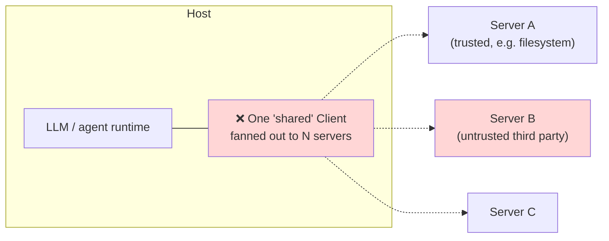
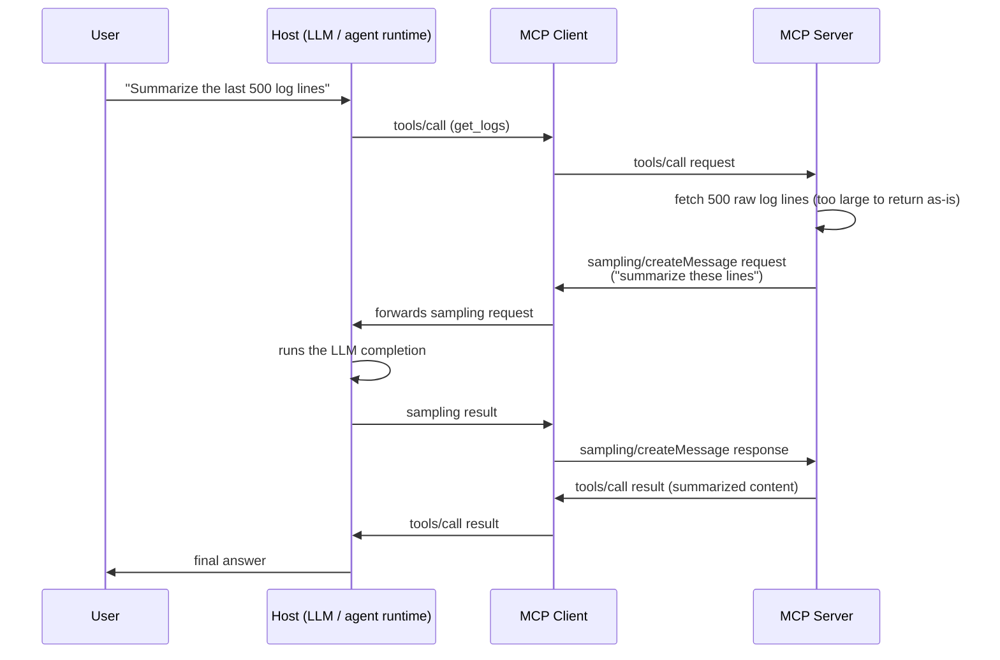
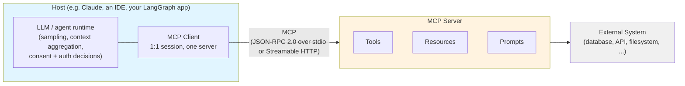
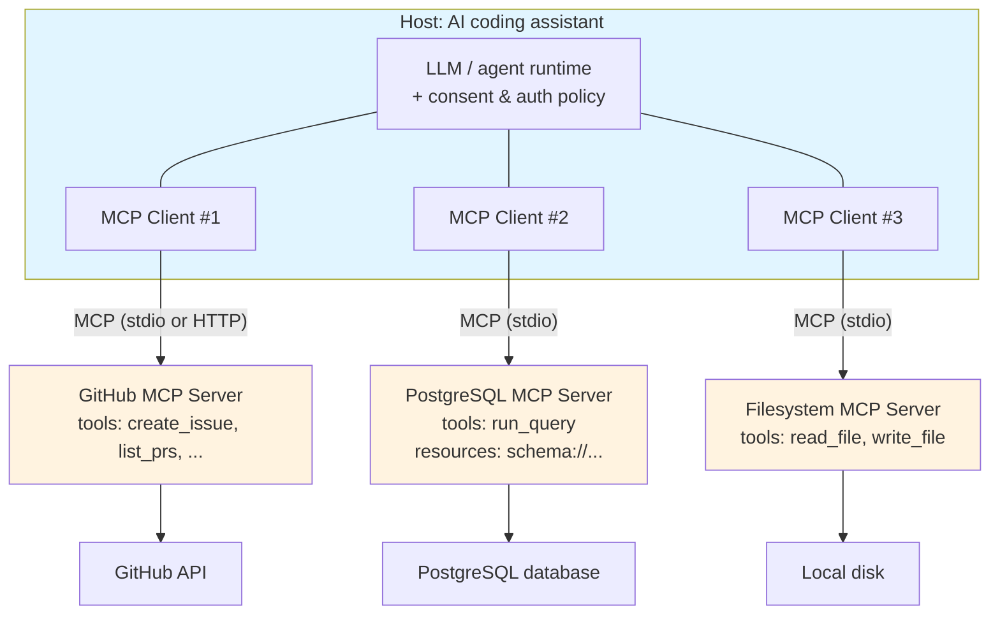

# MCP Architecture: Host, Client, Server

> "A Client establishes one stateful session per server." One sentence, and almost every architectural question you'll have about MCP for the rest of this course traces back to it — including why your Host process ends up holding a fistful of Client objects instead of one, and why a compromised server can't quietly read another server's traffic.

## Learning Objectives

By the end of this chapter, you will be able to:

- Recite, precisely, the spec's stated responsibilities for the Host, Client, and Server roles — not a paraphrase, the actual wording — and map each responsibility to a concrete design decision it forces
- Explain why a single MCP Client instance maintains a session with exactly one Server, never more, and what would break if that constraint were relaxed
- Explain why the Host — not the Client — owns user consent and authorization decisions, and why pushing that responsibility down to the Client would create a security hole
- Draw, from memory, the canonical Host → Client → Server → external-system diagram, and label which box owns which responsibility
- Trace a concrete multi-server scenario (an AI application talking to GitHub, PostgreSQL, and filesystem MCP servers) down to the exact number of Client instances the Host must create and why
- Distinguish a local (stdio subprocess) server from a remote (HTTP) server at the architecture level, and state which security assumptions change between the two
- Recognize "stateful session" as classic-era (2025-06-18) framing that the 2026-07-28 stateless redesign explicitly discards, without yet needing the redesign's mechanics (that's Chapters 3 and 21)

---

## Prerequisites

Before this chapter, you should have read **[Chapter 1: Introduction & Why MCP Exists](./01-introduction-and-why-mcp-exists.md)**, where the integration-explosion problem and the high-level "MCP is one protocol instead of N×M custom integrations" pitch were established. This chapter assumes you already accept *why* a standard protocol is worth having and moves straight to *how the protocol is structured* — the roles, the boxes, and the connections between them.

You should also already be comfortable with, from your existing background:

- What a "tool call" / "function call" is for an LLM (not re-taught here)
- The general shape of a client-server relationship and why process isolation matters for security
- Running a subprocess vs. making an HTTP request, at a conceptual level (Chapter 8 covers MCP transports in full technical depth; this chapter only needs the distinction, not the wire mechanics)

No new installation or code execution is required for this chapter — it is the conceptual chapter the index explicitly calls "the most important conceptual phase" and "don't skip this." Everything downstream (tools, resources, prompts, transports, servers, clients) is a refinement of the mental model built here. If this chapter doesn't fully click, stop and re-read it before Chapter 3 rather than pushing through — every later chapter assumes you can place any new detail into one of the three boxes below without hesitation.

---

## 1. The Three Roles, Exact Spec Wording

MCP's architecture doc (2025-06-18 revision) defines three roles. Get used to reading these definitions literally — every clause is doing work, and loose paraphrases are exactly where engineers' mental models drift from the actual spec.

### 1.1 Host

> "Creates and manages multiple client instances. Controls client connection permissions and lifecycle. Enforces security policies and consent requirements. Handles user authorization decisions. Coordinates AI/LLM integration and sampling. Manages context aggregation across clients."

The Host is the application the user actually launches — Claude Desktop, an IDE like a VS Code extension, or, for the purposes of this course, an application you build with LangGraph or DeepAgents that happens to talk to MCP servers. Read the six clauses again as six distinct jobs:

1. **Creates and manages multiple client instances** — plural, always. A Host that only ever needs one Client is a degenerate special case, not the design center.
2. **Controls client connection permissions and lifecycle** — the Host decides *whether* a given Client is even allowed to connect to a given server, and when that connection starts/stops.
3. **Enforces security policies and consent requirements** — this is the clause that answers "who shows the user the 'allow this tool call?' dialog." It's the Host, not any Client, and not the Server.
4. **Handles user authorization decisions** — distinct from (3): this is the actual OAuth/authorization flow orchestration when a server requires it (Chapter 13).
5. **Coordinates AI/LLM integration and sampling** — the Host is where the LLM lives (or where the call to the LLM provider is made). When a Server requests a `sampling` completion from the client side, it's ultimately the Host's LLM integration that services it.
6. **Manages context aggregation across clients** — when three different Clients each return tool results from three different Servers, something has to merge that into one coherent context for the LLM. That's the Host.

### 1.2 Client

> "Establishes one stateful session per server. Handles protocol negotiation and capability exchange. Routes protocol messages bidirectionally. Manages subscriptions and notifications. Maintains security boundaries between servers." 1:1 with a particular server.

The Client is a piece of Host-owned plumbing — not a separate application, not something the user directly perceives. It exists inside the Host's process (or address space) purely to own the wire-level relationship with one specific Server:

- **Establishes one stateful session per server** — the load-bearing clause for this entire chapter. One Client, one session, one Server. Never a shared session across servers.
- **Handles protocol negotiation and capability exchange** — this is the `initialize`/`initialized` handshake you'll build by hand in Chapter 3.
- **Routes protocol messages bidirectionally** — JSON-RPC requests flow Client→Server (`tools/call`, `resources/read`, ...) and Server→Client (`sampling/createMessage` requests, notifications) over the same connection.
- **Manages subscriptions and notifications** — `resources/subscribe` and the `notifications/resources/updated` push that follows it (Chapter 5) are Client-side bookkeeping.
- **Maintains security boundaries between servers** — the phrase to underline twice. A Client's job description explicitly includes *keeping servers apart from each other*, which only makes sense if there's more than one Client instance to begin with, each one a firewall around exactly one Server relationship.

### 1.3 Server

> "Expose resources, tools and prompts via MCP primitives. Operate independently with focused responsibilities. Request sampling through client interfaces. Must respect security constraints. Can be local processes or remote services."

The Server is where the actual capability lives — the code that talks to GitHub's API, runs a SQL query, or reads a file off disk:

- **Expose resources, tools and prompts via MCP primitives** — the three primitives this course spends Chapters 4–6 on.
- **Operate independently with focused responsibilities** — a well-designed MCP server does one thing (talks to Postgres, or GitHub, or the filesystem) rather than becoming a monolith. This is a direct echo of the Unix-philosophy "do one thing well" — and it's precisely what makes composing several servers under one Host tractable.
- **Request sampling through client interfaces** — a Server can ask its Client "have your LLM generate a completion for me," inverting the usual direction of a tool call. It never talks to an LLM provider directly; it asks its one Client to do so on its behalf.
- **Must respect security constraints** — the Server doesn't get to unilaterally decide it's trustworthy; both the client-side security boundary and (for HTTP servers) the Protected-Resource-Metadata /OAuth machinery in Chapter 13 constrain what it can extract.
- **Can be local processes or remote services** — the transport-independence covered in Section 4 below.

### 1.4 Quick Reference: All Three Roles Side by Side

| | Host | Client | Server |
|---|---|---|---|
| **What it is** | The application (Claude, an IDE, your LangGraph/DeepAgents app) | Host-owned protocol plumbing, one instance per Server | Independent process/service exposing capabilities |
| **Cardinality** | One per running application | Many per Host — one per connected Server | Many per Host, via many Clients |
| **Owns the LLM?** | Yes — "coordinates AI/LLM integration and sampling" | No | No — but can *request* sampling through its Client |
| **Owns consent/auth decisions?** | Yes — explicitly stated | No | No |
| **Negotiates protocol version/capabilities?** | No (delegates to its Clients) | Yes — one negotiation per Server | Yes — responds to its one Client's negotiation |
| **Exposes Tools/Resources/Prompts?** | No | No | Yes — this is its entire purpose |
| **Can be local or remote?** | N/A (it's the local application) | N/A (it's in-process plumbing) | Yes — stdio subprocess or Streamable HTTP service |
| **Aggregates results across servers?** | Yes | No — scoped to its one Server | No — has no visibility into other servers |

Use this table as a sanity check whenever you're unsure which layer owns a given piece of behavior: if the behavior requires seeing *across* multiple servers (consent policy, context aggregation, "has the user already approved this class of action"), it's Host work. If it's scoped to exactly one Server's wire relationship (negotiation, routing, subscriptions), it's Client work. If it's the actual capability being exposed, it's Server work.

> **2026-07-28 spec note:** the "stateful session" framing in the Client's definition above is explicitly reversed by the current spec. The redesign states directly: "all the information needed to process a request is contained in the request itself... an open connection, such as a STDIO process, is not a conversation or session." The classic model you're learning in this chapter — and building hands-on for the rest of the course — treats the Client↔Server relationship as a negotiated, stateful session with a lifecycle (`initialize` → active → shutdown). That framing is real, it's what every production server and the entire LangChain/DeepAgents ecosystem implements today, and it's also exactly the piece of vocabulary the 2026-07-28 spec throws out. Chapter 3 covers the classic lifecycle in full; Chapter 21 covers the stateless redesign and what "no session" actually means in practice.

---

## 2. The 1:1 Rule: One Client, One Server, No Exceptions

The Client's spec wording says it plainly: "Establishes one stateful session per server," and separately, "1:1 with a particular server." Put a fence around this rule, because it's the one new engineers most often try to relax the first time they build something with multiple servers.

**A single Client instance never talks to more than one Server.** If your Host needs to reach three servers, your Host builds three Client instances. There is no "multiplexing client" that fans a single session out across several servers in the classic model — that would violate the Client's own job description on two counts simultaneously:

- **Capability negotiation is per-relationship.** The `initialize` handshake (Chapter 3) negotiates a specific `protocolVersion` and capability set with *one* server. A GitHub server and a Postgres server may support different capabilities (one might support `resources.subscribe`, the other might not) — there's no single negotiated state that could represent both at once.
- **Security boundaries are per-relationship.** "Maintains security boundaries between servers" only means something if each boundary is a distinct Client. If one Client object held simultaneous sessions with a trusted filesystem server and an untrusted third-party server, a bug (or a malicious server) in that shared session state could leak one server's context, credentials, or tool results into the other's.

The practical consequence you'll see in every multi-server example in this course, starting with Section 5 below: **N servers means N Client instances**, full stop, even though there is exactly one Host process and, typically, one LLM.

### 2.1 The Anti-Pattern, Drawn Explicitly

It's worth drawing the shape engineers reach for by instinct — and seeing exactly where it breaks — before moving on:



This shape has no negotiated `protocolVersion`/capability set that unambiguously belongs to any one server, and no boundary preventing a compromised Server B from riding along in the same session object that Server A's results pass through. It is not merely discouraged by convention — it contradicts "establishes one stateful session per server" and "maintains security boundaries between servers" directly. Every multi-server diagram in this chapter (Section 5 onward) instead draws N distinct Client boxes precisely to rule this shape out structurally, not just by policy.

---

## 3. Why the Separation Exists

It's tempting to read Host/Client/Server as bureaucratic layering for its own sake. It isn't — each seam exists to answer a specific question that a flatter design (say, "the LLM app just talks directly to N servers") can't answer safely.

### 3.1 Security boundaries between servers

Imagine a single, undifferentiated "connection manager" object that talked to every server your Host uses. A vulnerability, a bug, or a malicious response from Server A now has a plausible path to Server B's session state, tokens, or in-flight requests — they're all sitting in the same object. Splitting the plumbing so that **each Server relationship gets its own Client instance, with no shared mutable state between Clients**, means a compromised or malicious server is contained to the blast radius of its own Client. This is the direct payoff of "maintains security boundaries between servers" from Section 1.2 — it is not a side effect of the design, it's a stated job of the Client role.

This containment matters concretely for MCP because Servers are often third-party code you didn't write and can't fully audit — exactly the "Local MCP Server Compromise" and "Tool Poisoning" concerns Chapter 14 covers in depth. The architecture in this chapter is the first line of defense, before any of that chapter's specific mitigations come into play.

### 3.2 Why a Client doesn't talk to multiple servers

Restating Section 2 from the "why," not just the "what": if a Client could aggregate multiple servers behind one session, you'd lose the ability to reason about *which server produced which capability, tool, or piece of context* without re-deriving it from scratch every time — and you'd reintroduce exactly the security coupling Section 3.1 exists to avoid. A 1:1 Client:Server ratio makes "which server is this tool actually calling out to" a structural fact you can read off the object graph, not a runtime inference.

### 3.3 Why the Host — not the Client — owns consent

This is worth sitting with, because it's a common point of confusion: the Client is the thing physically closest to the wire, so it's tempting to assume it should also decide whether a given request is allowed. The spec puts that decision one layer up, at the Host, for a reason that becomes obvious once you consider what a consent decision actually needs:

- **Cross-cutting visibility.** A Host managing three Clients (GitHub, Postgres, filesystem) is the only layer that can answer "has the user already approved destructive database writes broadly, or only for this one call?" A single Client only knows about its one Server — it has no visibility into policy decisions made for the other two.
- **The user relationship lives at the Host.** The Host is the application the user is actually looking at (Claude's UI, your IDE, your own agent's approval prompt). Consent is fundamentally a UI/policy concern tied to the user's relationship with the *application*, not with any individual downstream server — the Client has no user-facing surface at all.
- **Consistency of policy enforcement.** If each Client enforced its own ad hoc consent policy, you'd get inconsistent behavior per server (one Client remembers a decision, another re-asks every time) with no central point to audit or change the policy. Centralizing "enforces security policies and consent requirements" and "handles user authorization decisions" at the Host (Section 1.1, clauses 3–4) gives you one place to implement, audit, and change consent behavior for the whole application, regardless of how many servers it's connected to.

The Client's own responsibility list has no mention of consent or authorization decisions at all — by design. It negotiates protocol, routes messages, manages subscriptions, and keeps its one Server's boundary intact. Deciding *whether a request should even happen* is explicitly out of scope for it.

### 3.4 Sampling: The Direction the Naming Convention Doesn't Suggest

One detail trips up nearly everyone the first time they meet it: the Server role's definition includes "Request sampling through client interfaces" — meaning a **Server can ask its Client to have the LLM generate a completion**, inverting the direction you'd naively expect from "client" and "server." A Server might, mid-tool-call, need the LLM's judgment on something (summarize this large result before returning it, decide between two ambiguous interpretations) without having any LLM access of its own. Rather than bundling its own model integration, it asks the one thing it does have a relationship with — its Client — to request a completion on its behalf.



Notice every arrow still respects the roles from Section 1: the Server never talks to an LLM provider directly ("Request sampling *through* client interfaces"), the Client is a pure router in both directions ("Routes protocol messages bidirectionally"), and the Host is the only box that actually "coordinates AI/LLM integration and sampling." This is also the clearest illustration of why the Client↔Server relationship being 1:1 matters even for *this* traffic direction: the Server's sampling request has exactly one Client to route through, and that Client has exactly one Host-level LLM integration to forward it to — there's no ambiguity about whose model gets asked.

---

## 4. Local vs. Remote Servers

The Server role definition ends with a clause that's easy to skim past: "Can be local processes or remote services." This is a real architectural fork, not a footnote — it changes the transport, the trust assumptions, and (in Chapter 13) the authorization model.

**Local servers (stdio):** the Host spawns the Server as a **subprocess** it directly controls, and the Client talks to it over the subprocess's stdin/stdout using newline-delimited JSON-RPC. There is no network hop — the "connection" is a pipe to a process the Host itself launched, using a launch command the Host chose. Trust here is bootstrapped from "you (or your Host's configuration) chose to run this exact binary/script" — which is precisely why the spec's local-server mitigation (Chapter 14) is showing the user the *exact launch command* before running it, not a network-security control.

**Remote servers (Streamable HTTP):** the Server is a service running somewhere else entirely — its own process, its own host, possibly its own organization. The Client talks to it over HTTP. Trust can no longer be bootstrapped from "I chose to launch this" — it has to come from network-level TLS, from the OAuth 2.1 authorization framework (Chapter 13), and from the Protected Resource Metadata the server publishes about itself.

Both shapes expose the exact same primitives — `tools/list`, `resources/read`, `prompts/get` behave identically regardless of which transport carries them (Chapter 8 covers the wire-level mechanics of both). What changes is *only* how the Client reaches the Server and what has to be verified before trusting it. Architecturally, this is why "Server" is defined by its *role* (expose capabilities via MCP primitives) rather than by its *deployment shape* — a GitHub MCP server you run locally today could become a remote, hosted service tomorrow without the Host or Client code needing to understand a single new concept about *what a Server is*, only *how to reach it*.

| | Local (stdio) | Remote (Streamable HTTP) |
|---|---|---|
| **How the Host reaches it** | Spawns it as a subprocess it directly controls | Connects over HTTP to a service it does not control |
| **Trust bootstrap** | "I (or my configuration) chose to launch this exact binary/script" | TLS + OAuth 2.1 authorization framework + Protected Resource Metadata (Chapter 13) |
| **Privilege level** | Inherits the Host's own OS-level privileges directly | Bounded by whatever the network and the server's own deployment allow — no shared OS privilege with the Host |
| **Primary spec-named risk** | Local MCP Server Compromise — a malicious launch command runs with full client privilege (Chapter 14) | Token Passthrough, Confused Deputy, SSRF during OAuth metadata discovery (Chapter 14) |
| **Key mitigation** | Sandboxing; showing the exact launch command in a consent dialog before running it | RFC 9728 Protected Resource Metadata, RFC 8707 Resource Indicators, PKCE (Chapter 13) |
| **Session/identity binding** | Implicit — it's the same process tree the Host started | Explicit — non-deterministic session identifiers, never used *as* authentication (Chapter 14's Session Hijacking guidance) |

Keep this table's second row in mind especially: it's the single biggest reason "local" and "remote" aren't just a transport choice — they imply two entirely different trust models that the rest of this course (Chapters 13–14) builds real mitigations around.

---

## 5. Putting It Together: The Architecture Diagram



Read this diagram left to right as a chain of increasingly narrow responsibility:

- The **Host** box is the whole application — it owns the LLM/agent runtime, decides what the user is allowed to do, and holds one or more Client instances (only one is drawn here; Section 6 draws three).
- The **MCP** connection between Client and Server is the one standardized part of this entire picture — JSON-RPC 2.0 messages over either stdio or Streamable HTTP (Chapter 3 and Chapter 8, respectively). This is the seam that lets any Host talk to any Server without custom glue code, which is the entire value proposition from Chapter 1.
- The **Server** box exposes exactly three kinds of primitives — Tools, Resources, Prompts — and nothing else. Every capability an MCP server has to offer is shaped into one of those three buckets.
- The **External System** is whatever the Server actually wraps — a GitHub API, a Postgres instance, a local filesystem. MCP standardizes the interface *up* to the Host, not the implementation *down* to the external system — the Server can talk to its backend however it wants.

Notice what's deliberately absent from the diagram: there is no line connecting the Host directly to the External System, and no line connecting one Server to another. Every capability the Host uses has to flow through exactly one Client→Server pair. That's not an oversight — it's the architecture doing its job.

---

## Examples

### Worked Example: One Host, Three Servers, Three Clients

Consider a concrete, realistic setup: an AI coding assistant (the Host) that needs to read and write GitHub issues/PRs, query a PostgreSQL database for application data, and read/write files on the local filesystem — three completely unrelated capabilities, each naturally suited to its own MCP server.



Walk through why this is *three* Clients rather than one:

- **Client #1** negotiates capabilities with, and maintains the security boundary around, the GitHub server. If the GitHub server's session is somehow compromised (a malicious tool description, a token leak), that compromise is contained to Client #1's boundary.
- **Client #2** does the same for Postgres — and note that a database server is a plausible target for a "destructive write" consent gate (Chapter 14 covers `destructiveHint` tool annotations); that policy decision is made by the Host, informed by which Client's tool call it is, not decided inside Client #2 itself.
- **Client #3** does the same for the filesystem server, which is often the *most* sensitive of the three (arbitrary local file read/write) despite looking the most mundane.

The Host is the layer aggregating all three: when the LLM decides it needs to "look up the PR that touches the `users` table, check the current schema, and then read the migration file," that single reasoning step fans out into three separate tool calls, each routed through a different Client to a different Server, and the *results* are reassembled by the Host into one coherent context for the next LLM turn. That reassembly — "Manages context aggregation across clients" — is Host work, not Client work, and it's the reason the Host, not any one Client, is what an engineer building this system actually designs and configures.

### Tracing One Compound Request Across All Three Clients

Make the fan-out from the paragraph above concrete by tracing it step by step, the way you'll want to reason about any multi-server request when debugging one later in this course:

1. **User asks**: "Look up the open PR that touches the `users` table, check the current schema, and read the migration file it references."
2. **Host** (the LLM, having decided on a plan) issues its first tool call: `list_prs` with a filter, routed to **Client #1**.
3. **Client #1** sends `tools/call` over its already-negotiated session to the **GitHub Server**, which hits the GitHub API and returns a PR description mentioning `migrations/0042_add_email_index.py`.
4. **Client #1** returns that result to the Host. Nothing about this step touches Client #2 or Client #3 — the GitHub boundary is fully self-contained.
5. **Host** now issues a second tool call, `run_query` (or a `resources/read` against a schema resource), routed to **Client #2**.
6. **Client #2** sends the request over its *own*, separately-negotiated session to the **PostgreSQL Server**, which queries the live schema and returns the current `users` table definition.
7. **Host** issues a third call, `read_file("migrations/0042_add_email_index.py")`, routed to **Client #3**.
8. **Client #3** sends the request to the **Filesystem Server**, which reads the file off local disk and returns its contents.
9. **Host** now holds three separate results — a PR description, a schema, and a file's contents — each obtained through a differently-scoped, independently-negotiated Client relationship. **Context aggregation** (Section 1.1) is the Host assembling these three into one prompt for the LLM's next turn, which produces the final answer for the user.

Notice what never happened anywhere in that trace: Client #1 never saw Client #2's traffic, no single session carried more than one server's messages, and the only box that ever held all three results simultaneously was the Host. That's the 1:1 rule (Section 2) and the consent/aggregation split (Section 3.3) operating exactly as designed, on an entirely ordinary request.

If you've used `langchain-mcp-adapters`' `MultiServerMCPClient` (the full mechanics are Chapter 17's job, not this chapter's), this is exactly the shape it's built to represent — a single Python object *named* like one client, configured with a dict of servers, that internally holds one session per server entry:

```python
# Illustrative only — full treatment in Chapter 17.
# The *name* MultiServerMCPClient is a convenience wrapper; underneath,
# it still holds one MCP session per configured server, one-to-one.
from langchain_mcp_adapters.client import MultiServerMCPClient

client = MultiServerMCPClient(
    {
        "github": {"command": "github-mcp-server", "args": [], "transport": "stdio"},
        "postgres": {"command": "postgres-mcp-server", "args": [], "transport": "stdio"},
        "filesystem": {"command": "filesystem-mcp-server", "args": [], "transport": "stdio"},
    }
)
```

Don't let the single Python object mislead you: at the protocol level, this is still three independent Client↔Server relationships, each with its own negotiated capabilities and its own security boundary. `MultiServerMCPClient` is a Host-side convenience for *managing* several Clients, not evidence that the 1:1 rule from Section 2 has an exception.

---

## Real-World Scenario

A team is building an internal support-ticket triage agent on LangGraph. Early in the design, an engineer proposes a shortcut: since the agent needs both a Zendesk-like ticketing server and an internal customer database server, why not write one MCP server that wraps both APIs and exposes tools for each, so the Host only needs a single Client?

The proposal gets rejected in review, for reasons that map directly onto this chapter's material:

- **Blast radius.** The combined server would need credentials for both the ticketing system and the customer database in one process. A vulnerability in the tool-argument handling for one of them (say, a poorly validated ticket-search query) now has a plausible path to the other system's credentials too — exactly the coupling that "maintains security boundaries between servers" is designed to prevent by keeping them as separate Server processes behind separate Clients in the first place.
- **Independent lifecycle and failure isolation.** If the ticketing API has an outage, a single combined server means *both* capabilities go down together, even though the customer database is fine. Two servers behind two Clients means the Host can degrade gracefully — disable ticketing tools, keep database tools available — because the Host already tracks per-Client connection state as part of its "controls client connection permissions and lifecycle" responsibility.
- **Consent granularity.** The team's compliance requirement is that any write to a customer's ticket needs an explicit approval step, but read-only database queries don't. With two servers behind two Clients, the Host can apply that policy per-Client-connection (per-server) using tool annotations (`destructiveHint`, Chapter 10) without needing the servers themselves to agree on a shared consent model. A combined server blurs exactly that line — the Host would need bespoke logic to tell "this tool call is the ticketing half" from "this tool call is the database half" instead of getting that distinction for free from which Client routed the call.

The team ships two servers — `ticketing-mcp-server` and `customer-db-mcp-server` — each behind its own Client, exactly matching Section 5's worked example. The design review is, in effect, this chapter's architecture being defended in production terms rather than abstract ones.

---

## Best Practices

- **Default to one MCP server per external system**, not one server per Host application. A server wrapping GitHub, another wrapping Postgres, another wrapping your filesystem — mirrors "operate independently with focused responsibilities" directly and keeps blast radius, failure isolation, and consent granularity clean.
- **Never design a "shared session" shortcut across servers**, even if a specific SDK or framework makes it *technically* possible to reuse a transport or connection object. The 1:1 Client:Server relationship is a security property, not an implementation convenience — treat it as load-bearing.
- **Put consent and authorization logic at the Host layer**, even in a small, single-developer project. If you're writing your own Host on top of LangGraph/DeepAgents, resist the urge to let individual tool-calling code (Client-adjacent glue) make its own ad hoc "is this OK?" decisions — centralize that in one policy layer that has visibility across every Client the Host manages.
- **Treat "local vs. remote" as a decision with security consequences, not just a deployment detail.** A local stdio server inherits the Host's own privilege level entirely; a remote HTTP server is bounded by network and OAuth controls instead. Choose deliberately, and re-evaluate if a server moves from one shape to the other.
- **When you see "the agent talks to N servers," count Clients, not connections.** If your mental model or your architecture diagram doesn't show N distinct Client instances for N servers, it's wrong — go back and fix the model before writing code.
- **Use the exact spec wording (Section 1) when writing design docs or onboarding new engineers**, rather than an informal paraphrase. "The Client keeps servers separate" is a weaker, vaguer claim than "maintains security boundaries between servers" — precision here pays off the first time someone asks "separate in what sense?"

---

## Common Mistakes

- **Assuming the Client decides whether a tool call is allowed.** It doesn't — the Client's job is protocol negotiation, message routing, subscriptions, and boundary-keeping. Consent and authorization are explicitly Host responsibilities (Section 1.1, clauses 3–4).
- **Building (or reaching for) a "multiplexing client" that talks to several servers over one session.** This directly violates "one stateful session per server" and "1:1 with a particular server," and quietly reintroduces the cross-server coupling the architecture exists to prevent.
- **Conflating "Host" with "the LLM" and "Client" with "the whole application."** The Host is the application; the LLM/agent runtime is a component *inside* the Host that the Host coordinates ("Coordinates AI/LLM integration and sampling"). The Client is not the application either — it's connection-scoped plumbing the Host creates and manages, one per server.
- **Treating a combined, multi-backend MCP server as a reasonable optimization to "reduce the number of moving parts."** As the Real-World Scenario shows, this trades a small implementation convenience for blast-radius, failure-isolation, and consent-granularity regressions that are usually not worth it.
- **Assuming "local" automatically means "safe."** A local stdio server runs with the Host's own privileges and has no network boundary to hide behind — Chapter 14's "Local MCP Server Compromise" concern is specifically about this class of server, not remote ones.
- **Reading "stateful session" in the Client's definition and assuming that's a permanent, uncontroversial fact about MCP.** It's the classic (through 2025-11-25) framing this course teaches hands-on because that's the ecosystem you'll build against today — but the 2026-07-28 spec explicitly redefines MCP as stateless. Don't let that vocabulary calcify into "how MCP fundamentally works, forever."

---

## Summary

- MCP defines exactly **three roles**: **Host** (the application — creates/manages Clients, owns consent/authorization decisions, coordinates the LLM, aggregates context across Clients), **Client** (Host-owned plumbing — one stateful session per Server, protocol negotiation, bidirectional message routing, subscriptions, and the security boundary around that one Server), and **Server** (exposes Tools/Resources/Prompts, operates independently, can request sampling through its Client, can be local or remote).
- The **1:1 Client:Server rule** is absolute in the classic model: a single Client instance never spans more than one Server. N servers means N Client instances inside one Host.
- This separation exists for concrete reasons, not bureaucratic layering: **security boundaries** contain a compromised or malicious server to its own Client; the **Host, not the Client**, owns consent and authorization because only the Host has cross-cutting visibility into the user relationship and policy across every connected server.
- Servers can be **local processes (stdio subprocess, inheriting the Host's privilege level)** or **remote services (Streamable HTTP, bounded by network/OAuth controls)** — the same primitives, different trust bootstrapping.
- A realistic multi-server Host (GitHub + PostgreSQL + filesystem) requires **three separate Client instances**, each independently negotiated and boundary-isolated, with the Host responsible for aggregating their combined results into one coherent context for the LLM.
- The "stateful session" language throughout the classic spec (and this chapter) is exactly what the **2026-07-28 stateless redesign removes** — flagged here, taught in full in Chapters 3 and 21.

---

## Knowledge Check

1. Quote, as precisely as you can from memory, the Host's six stated responsibilities. For each one, name a concrete design decision in a real application that depends on it.
2. A colleague argues that a single MCP Client *could* safely hold sessions with two servers as long as the code is careful to keep their data separate in memory. Using the spec wording from Section 1.2, explain exactly which clause this violates and why "being careful" doesn't substitute for the architectural guarantee.
3. Why does the spec place "enforces security policies and consent requirements" and "handles user authorization decisions" at the Host level rather than the Client level? Give the cross-cutting-visibility argument from Section 3.3 in your own words.
4. Your Host connects to four MCP servers. How many Client instances exist inside that Host, and what does each one own?
5. Explain the difference between a local (stdio) and a remote (Streamable HTTP) MCP server in terms of *what has to be trusted and how*, not just "one uses a subprocess and one uses HTTP."
6. What does the phrase "1:1 with a particular server" rule out, concretely, for how you'd implement a Host that needs to talk to many servers?
7. What does the 2026-07-28 spec note in Section 1.3 say changes about the word "session" specifically, and why does that not yet affect the code you'll write in Chapters 4–20 of this course?

---

## Hands-On Exercise

No code execution is required for this exercise — it's a design/tracing exercise meant to cement the mental model before you touch any SDK code in later chapters.

1. **Draw it yourself.** On paper or in a text file, redraw the Section 5 architecture diagram from memory — Host, one Client, one Server with its three primitive boxes, one External System — without looking back at this chapter. Label each arrow with what actually flows across it (JSON-RPC messages; the Server's own backend protocol).
2. **Extend to your own scenario.** Pick three real external systems you personally interact with often (e.g., your team's issue tracker, a cloud provider's API, your local git repository) and sketch the Host/Client/Server diagram for a Host that uses all three as MCP servers, matching Section 5's worked example. Explicitly count and label the Client instances.
3. **Write the responsibility split.** For your scenario from step 2, write one sentence per box (Host, and each of your three Clients/Servers) stating what it is responsible for deciding or doing — and one sentence identifying a security or failure-isolation benefit you get specifically from having kept these as separate servers rather than one combined server.
4. **Consent placement.** For your scenario, identify one tool call across your three servers that should require explicit user consent before executing (e.g., a destructive write) and one that shouldn't (e.g., a read-only lookup). Explain, referencing Section 3.3, why that consent decision belongs at the Host layer rather than inside whichever Client happens to route that particular call.

---

## Further Reading

- Official spec: `modelcontextprotocol.io/specification/2025-06-18/architecture` — the primary source for the exact Host/Client/Server wording quoted in this chapter
- Official spec: `modelcontextprotocol.io` current (2026-07-28) architecture page — the stateless redesign that reframes "session" (full treatment in Chapter 21)
- Related chapter in this course: **[Chapter 1: Introduction & Why MCP Exists](./01-introduction-and-why-mcp-exists.md)** — the integration-explosion problem this architecture solves
- Related chapter in this course: **[Chapter 3: Protocol Fundamentals & Lifecycle](./03-protocol-fundamentals-and-lifecycle.md)** — the `initialize`/`initialized` handshake that makes "capability negotiation" from the Client's definition concrete
- Related chapter in this course: **[Chapter 8: Transport Mechanisms](./08-transport-mechanisms.md)** — stdio vs. Streamable HTTP mechanics referenced in Section 4
- Related chapter in this course: **[Chapter 13: Authentication & Authorization](./13-authentication-and-authorization.md)** — how the Host's "handles user authorization decisions" responsibility is implemented for remote servers
- Related chapter in this course: **[Chapter 14: MCP Security](./14-mcp-security.md)** — Local MCP Server Compromise, tool poisoning, and the other threats this chapter's security boundaries are your first defense against
- Related chapter in this course: **[Chapter 17: MCP + LangChain](./17-mcp-with-langchain.md)** — the full `MultiServerMCPClient` mechanics only previewed in Section 5

<div style="display:flex;justify-content:space-between;align-items:center;">
  <a href="./01-introduction-and-why-mcp-exists.md">← Previous: Introduction & Why MCP Exists</a>
  <a href="./00-index.md">🏠 Index</a>
  <a href="./03-protocol-fundamentals-and-lifecycle.md">Next: Protocol Fundamentals & Lifecycle →</a>
</div>
