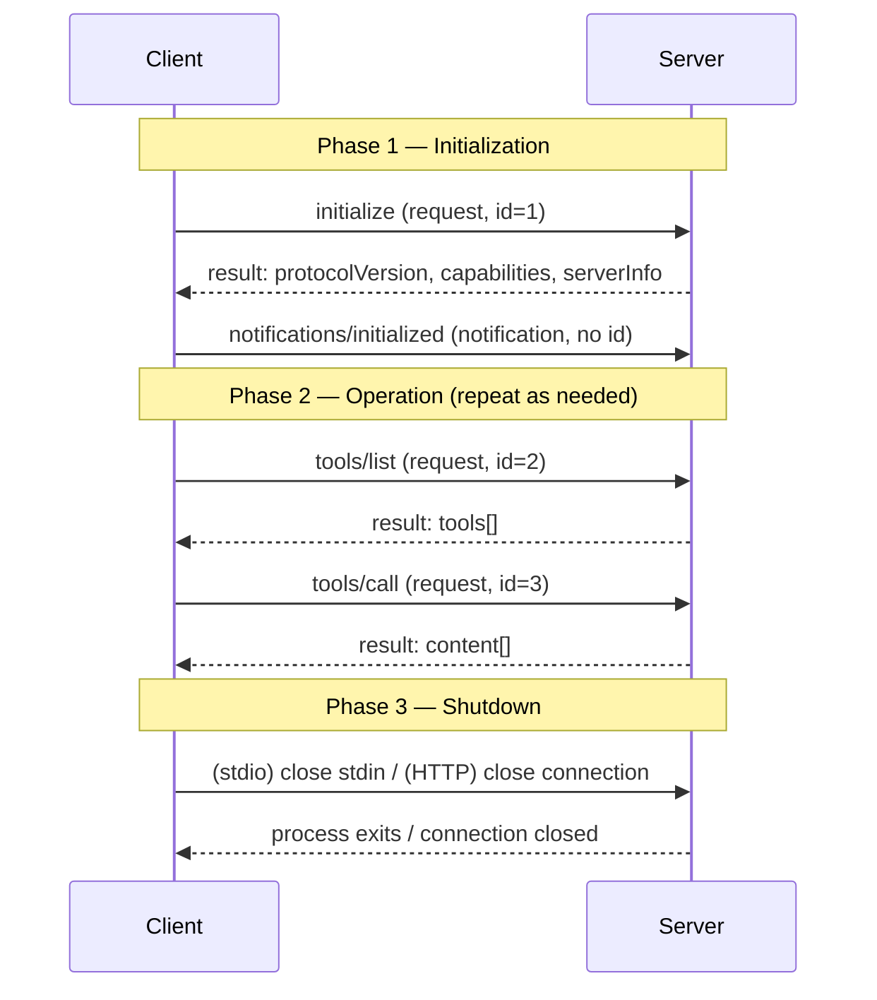
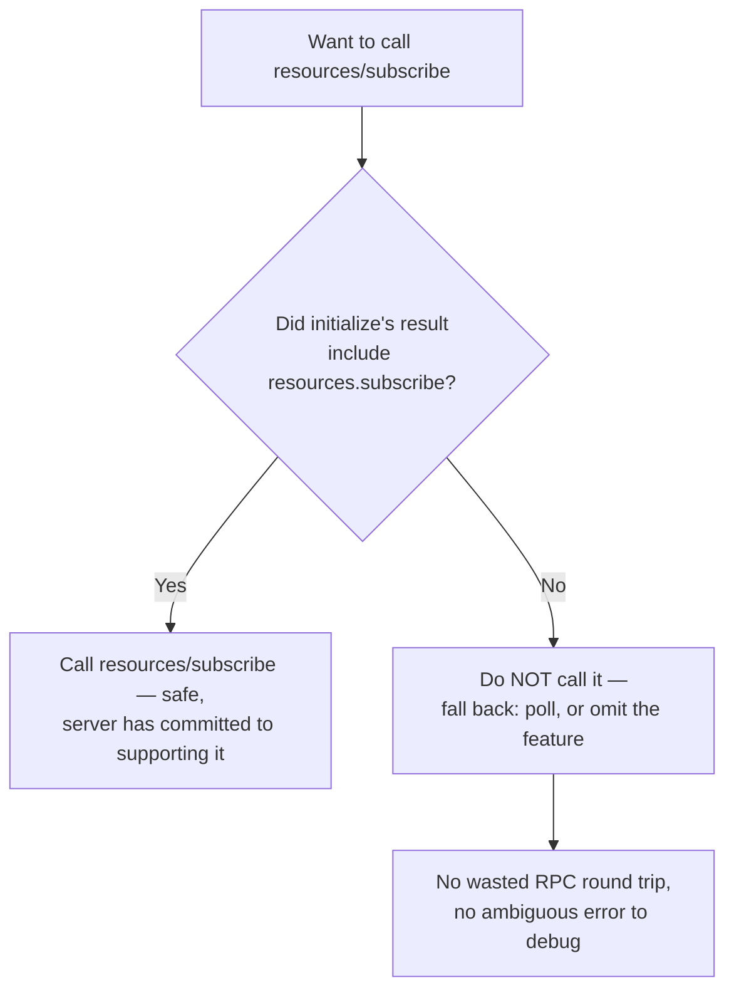
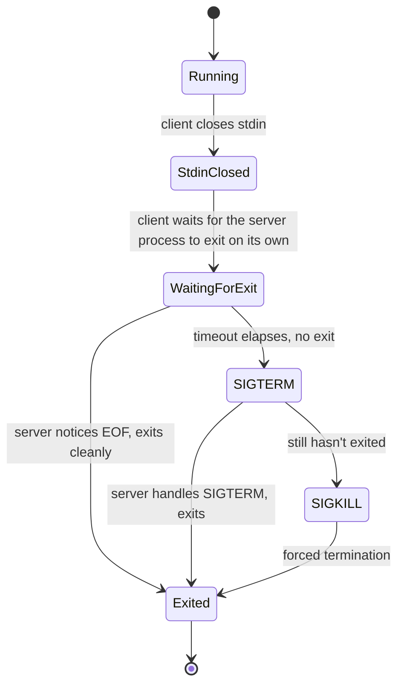

# Protocol Fundamentals & Lifecycle

> Every `@mcp.tool()` decorator, every `session.initialize()` call, every `MultiServerMCPClient` config dict you'll write in this course compiles down to plain JSON-RPC 2.0 messages crossing stdin/stdout or an HTTP connection. This chapter is the one where you stop trusting the SDK by faith and start being able to read the wire.

## Learning Objectives

By the end of this chapter, you will be able to:

- Explain JSON-RPC 2.0's three message shapes (request, response, notification) and state MCP's specific rule about request `id` values
- Reproduce, from memory, the three messages that make up the classic MCP handshake: `initialize` request, `initialize` response, `notifications/initialized`
- Name every client and server capability key (`roots`, `sampling`, `elicitation` / `prompts`, `resources`, `tools`, `logging`, `completions`) and explain what each `listChanged`/`subscribe` sub-flag actually gates
- Justify, in one sentence a reviewer would accept, *why* capability negotiation exists instead of every client just calling every method and seeing what happens
- Describe how a session ends cleanly over stdio (stdin close → wait → SIGTERM → SIGKILL) versus over Streamable HTTP (connection close)
- Read a JSON-RPC error object (`code`/`message`/`data`) and distinguish it from a tool execution error reported via `isError: true`
- Trace what `ClientSession.initialize()` in the Python SDK actually sends and receives on your behalf
- Describe, at a conceptual level, how the 2026-07-28 stateless spec revision removes this entire handshake — and know where the full migration story lives (Chapter 21)

---

## Prerequisites for This Chapter

This chapter builds on **[Chapter 2: MCP Architecture — Host, Client, Server](./02-mcp-architecture-host-client-server.md)**, where you learned the three-role model (Host / Client / Server) and that a Client maintains one connection per Server. This chapter answers the next question that model raises: *what, exactly, travels over that connection, in what order, and why?*

You should already be comfortable with:

- Basic HTTP request/response semantics (you don't need protocol-design background beyond that)
- Reading JSON structures and Python type hints
- The general idea of "a client calls a remote procedure and gets a result back" — this chapter formalizes that into JSON-RPC 2.0 specifically

You do **not** need prior exposure to JSON-RPC — it's taught from scratch below — and you do not need to have written any MCP code yet; that starts in earnest at Chapter 4 (Tools) and Chapter 7 (Building MCP Servers).

---

## 1. JSON-RPC 2.0 in Three Message Shapes

MCP does not invent its own wire format. Every message — whether it's `initialize`, `tools/call`, or a server-pushed log line — is a JSON-RPC 2.0 message. JSON-RPC 2.0 defines exactly three shapes, and once you can recognize them on sight, every MCP trace becomes readable.

**Quick reference — how to classify any message you see on the wire:**

| Shape | Has `id`? | Has `method`? | Has `result`/`error`? | Expects a reply? |
|---|---|---|---|---|
| Request | Yes (non-null, unique while pending) | Yes | No | Yes — exactly one |
| Response (success) | Yes (matches the request) | No | `result` only | N/A — this *is* the reply |
| Response (error) | Yes (matches the request) | No | `error` only | N/A — this *is* the reply |
| Notification | No | Yes | No | Never |

Keep this table in your head while reading a raw trace and you'll never have to guess which of the three shapes you're looking at — the presence or absence of `id` and `method` fully determines it, before you even look at what the message *means*.

### 1.1 Request — expects a response

```json
{"jsonrpc": "2.0", "id": 1, "method": "tools/list", "params": {}}
```

A request has all four fields: `jsonrpc` (always the literal string `"2.0"`), an `id`, a `method` name, and optional `params`. Sending a request obligates the other side to send back exactly one response carrying the same `id`.

### 1.2 Response — matches a request by `id`

A response is either a **success**:

```json
{"jsonrpc": "2.0", "id": 1, "result": {"tools": []}}
```

or an **error** (never both `result` and `error` in the same message):

```json
{"jsonrpc": "2.0", "id": 1, "error": {"code": -32601, "message": "Method not found"}}
```

The `id` in the response is how the caller matches this response back to the request it sent — this matters because both stdio and Streamable HTTP allow messages to arrive out of send order, and a client may have several requests in flight at once.

### 1.3 Notification — no `id`, no response, ever

```json
{"jsonrpc": "2.0", "method": "notifications/initialized"}
```

A notification has no `id` field at all. That absence is the signal: the receiver is not supposed to reply. If you send a notification and wait for a response, you'll wait forever — there isn't one coming, by design. MCP uses notifications for exactly the things that don't need an acknowledgment: "I've finished initializing," "my tool list changed, go re-fetch it," "here's a progress update on a long-running call."

That's the entire vocabulary. Everything in MCP — tools, resources, prompts, logging, the lifecycle itself — is built from these three shapes layered with MCP-specific `method` names and `params`/`result` schemas.

### 1.4 MCP's rule on top of JSON-RPC: `id` discipline

Plain JSON-RPC 2.0 allows an `id` to be a string, number, or `null`. MCP tightens this: **a request `id` MUST NOT be `null`, and MUST NOT be reused while a response to that `id` is still outstanding.** In practice, SDKs implement this with a simple monotonically increasing counter (or a UUID) per session — you'll rarely construct an `id` by hand, but you now know why: reusing an `id` while a call is in flight would make it ambiguous which request a response belongs to, which breaks the exact matching guarantee Section 1.2 depends on.

---

## 2. The Classic Lifecycle, End to End

> **Scope note:** everything in this section describes the **classic, handshake-based lifecycle** — spec revisions `2024-11-05` through `2025-11-25`, most commonly `2025-06-18`. This is what `mcp` SDK v1.x, `langchain-mcp-adapters`, `deepagents`, and essentially every MCP server in production today implements, and it's the primary hands-on curriculum for this course. Section 6 below previews how the `2026-07-28` stateless spec removes this entire handshake; the full migration story is Chapter 21.

Every classic MCP connection — stdio or Streamable HTTP — goes through the same three phases, in the same order, no exceptions:



A server that receives any request other than `initialize` before the handshake completes is within its rights to reject it — the handshake isn't optional ceremony, it's the mechanism that establishes what both sides are allowed to do with each other during Phase 2. Let's walk through each message.

### 2.1 The `initialize` request

The client always speaks first. It sends a request with method `initialize`:

```json
{"jsonrpc":"2.0","id":1,"method":"initialize",
 "params":{"protocolVersion":"2025-06-18",
   "capabilities":{"roots":{"listChanged":true},"sampling":{},"elicitation":{}},
   "clientInfo":{"name":"ExampleClient","version":"1.0.0"}}}
```

Three things are happening in `params`:

- **`protocolVersion`** — the spec revision string the client speaks, e.g. `"2025-06-18"`. This is the client's opening offer, not a demand — the server responds with the version it will actually use (Section 2.3).
- **`capabilities`** — which optional client-side features this client supports (Section 3.1).
- **`clientInfo`** — a free-form `name`/`version` identifying the client implementation, useful for logging and debugging, not for protocol logic.

### 2.2 The `initialize` response

The server replies with a matching `id` and its own manifest:

```json
{"jsonrpc":"2.0","id":1,
 "result":{"protocolVersion":"2025-06-18",
   "capabilities":{"logging":{},"prompts":{"listChanged":true},
     "resources":{"subscribe":true,"listChanged":true},"tools":{"listChanged":true}},
   "serverInfo":{"name":"ExampleServer","version":"1.0.0"},
   "instructions":"Optional instructions for the client"}}
```

- **`protocolVersion`** — the version the server has decided to use for this connection. This is the negotiation step: the server checks the client's offered version and either accepts it or responds with a different version it *does* support. A conformant client that doesn't recognize the returned version should treat that as a hard failure rather than guessing at compatibility.
- **`capabilities`** — which optional server-side features this server supports (Section 3.2).
- **`serverInfo`** — the server's own `name`/`version`, symmetric with `clientInfo`.
- **`instructions`** *(optional)* — free-text guidance the server wants surfaced to the model or the human operator (e.g., "call `search` before `fetch_page`"). This is prose for the LLM/host, not a machine-parsed field.

### 2.3 What "protocolVersion negotiation" actually means

This is worth stating plainly because it's easy to skim past: negotiation here is not a multi-round back-and-forth. It's exactly two messages — client proposes, server confirms or counters — and after that, both sides commit to one version for the life of the connection. There's no renegotiation mid-session in the classic model. If a version mismatch is truly incompatible, the practical failure mode in the classic spec is the client deciding it cannot proceed and closing the connection; there's no dedicated protocol-level error code for this in the classic revisions (contrast this with the stateless spec's explicit `UnsupportedProtocolVersionError`, Section 6).

One detail worth flagging so it doesn't surprise you later: for the Streamable HTTP transport (Chapter 8), the negotiated `protocolVersion` doesn't just live in the `initialize` exchange and then disappear — starting with `2025-06-18`, every subsequent HTTP request on that connection is required to also carry an `MCP-Protocol-Version` header restating the version that was negotiated. Think of it as the HTTP transport re-asserting the negotiated version on every request rather than trusting an implicit "we already agreed on this once" state — a small, transport-specific echo of the much bigger self-contained-request philosophy the 2026-07-28 spec adopts wholesale (Section 6). You won't need to set this header by hand — the SDK's HTTP client does it — but if you're ever staring at a raw HTTP trace wondering where the negotiated version shows up outside of `initialize`, that's where.

### 2.4 The `initialized` notification

Once the client has the `initialize` result and is satisfied with the negotiated version, it sends one more message — a **notification**, not a request — to signal that normal operation may begin:

```json
{"jsonrpc":"2.0","method":"notifications/initialized"}
```

Method name: `notifications/initialized`. No `params`. No `id`. No response is sent or expected — per Section 1.3, that's what makes it a notification rather than a request. This is the client's "ready" signal: until the server sees this, per the spec it should not expect or process ordinary operational requests like `tools/list`.

Put the three messages together and that's the entire handshake: **request → response → notification**. Nothing else happens during initialization. Everything else in MCP — tools, resources, prompts — is Phase 2, ordinary request/response traffic that only begins after this three-message exchange completes.

### 2.5 A note on the `instructions` field in practice

It's easy to skip past `instructions` in the `initialize` response as a throwaway field, but it earns its place in production servers more often than you'd expect. A well-designed server uses it to say the kind of thing that doesn't fit cleanly into a tool's `description` field — cross-tool sequencing hints, rate-limit etiquette, or scope reminders:

```json
"instructions": "Call `search` before `fetch_document` — fetch_document requires a document ID that only search returns. This server enforces a 10 req/min rate limit per session; batch related searches where possible."
```

Most host applications (Claude Desktop, your own LangGraph host) fold this text into the system context surrounding the model, so the LLM effectively "reads the manual" once per session without you having to hand-write that guidance into your own system prompt for every server you connect to. If you're writing a server (Chapter 7), treat `instructions` as free real estate for exactly the operational nuance that's awkward to express per-tool.

### 2.6 Phase 2 isn't strictly one-request-at-a-time

Nothing in the lifecycle requires the client to wait for a `tools/call` response before sending the next request — a client is free to have several requests outstanding simultaneously (a `resources/list` and a `tools/call` in flight together, say), as long as each keeps its own unique, non-null `id` per Section 1.4. This is precisely why the `id`-matching rule from Section 1.2 exists in the first place: without it, a client that pipelines requests would have no way to tell which of several pending responses answers which question. In practice, most SDK client implementations serialize calls one at a time for you at the application level (`await session.call_tool(...)` blocks until that specific response arrives) even though the underlying protocol permits concurrency — so you get correctness by default without having to reason about interleaved `id`s yourself, but it's worth knowing the protocol allows more concurrency than the convenience wrapper typically exposes.

---

## 3. Capability Negotiation, Key by Key

The `capabilities` objects exchanged during `initialize` are the actual point of the handshake — they're a structured answer to "what am I allowed to ask you, and what should I expect you to ask me?" Each key is either present (the feature is supported, possibly with sub-flags) or absent (it isn't) — an absent key is a hard "no," not "maybe."

### 3.1 Client capabilities

| Key | Meaning | Sub-flags |
|---|---|---|
| `roots` | Client can expose a set of filesystem "roots" (directories) the server is allowed to operate within | `listChanged` — client will notify the server if the root set changes |
| `sampling` | Client can service a server-initiated request asking the *client's* LLM to generate a completion — this is how a server borrows the host's model without holding its own API key | *(none — presence alone signals support)* |
| `elicitation` | Client can handle a server asking, mid-tool-call, for additional structured input from the human user | *(none — presence alone signals support)* |
| `experimental` | Namespace for non-standard, implementation-specific extensions both sides have privately agreed on | *(implementation-defined)* |

`sampling` and `elicitation` are easy to underestimate on first read because they run *backwards* relative to the tool-calling flow you're used to: instead of the client asking the server to do something, the **server** sends a request back to the **client** asking it to do something (run a completion, or prompt the user). A server should never assume either capability is present — it must check the negotiated client capabilities before attempting either, and degrade gracefully (e.g., fall back to a hardcoded default, or fail the tool call with a clear error) if the client didn't advertise it.

### 3.2 Server capabilities

| Key | Meaning | Sub-flags |
|---|---|---|
| `tools` | Server exposes callable tools (`tools/list`, `tools/call`) | `listChanged` — server will send `notifications/tools/list_changed` if its tool set changes at runtime |
| `resources` | Server exposes readable resources (`resources/list`, `resources/read`) | `listChanged` — resource set can change at runtime; `subscribe` — client may `resources/subscribe` to a specific URI and receive `notifications/resources/updated` when it changes |
| `prompts` | Server exposes reusable prompt templates (`prompts/list`, `prompts/get`) | `listChanged` — same pattern as tools/resources |
| `logging` | Server can emit structured log messages to the client during operation | *(none — presence alone signals support)* |
| `completions` | Server supports argument-autocompletion requests (e.g., suggesting valid values for a prompt argument as the user types) | *(none — presence alone signals support)* |
| `experimental` | Same escape hatch as the client side | *(implementation-defined)* |

Notice the pattern: every primitive that can *change after initialization* (tools, resources, prompts) gets a `listChanged` flag, and only `resources` additionally gets `subscribe`, because resources are the one primitive where subscribing to a *specific item's* updates (not just "the list changed") makes sense — a config file resource, say, that changes on disk after you've already read it once.

### 3.3 Why negotiate at all?

It's tempting to think capability negotiation is bureaucratic overhead — why not just let the client call whatever it wants and have the server 404 if it doesn't support it? Two concrete reasons this course keeps coming back to:

1. **It lets both sides skip work they'd otherwise have to do speculatively.** Without negotiation, a client that wants to support resource subscriptions would have to call `resources/subscribe` on every server and interpret an error as "not supported" — turning a capability check into a failed RPC round-trip, every time, for every server. With negotiation, the client reads `capabilities.resources.subscribe` once from the `initialize` result and knows, for the entire connection's lifetime, whether that call path is even worth attempting.
2. **It lets the *server* make requests of the client safely.** This is the more important one and the one engineers new to MCP usually miss. `sampling` and `elicitation` are server-initiated requests *into* the client. A server that fires a `sampling/createMessage` request at a client that never advertised `sampling` support isn't just going to get an error — it's making an assumption about the host environment that may not hold at all (there may be no LLM available to the client, or no UI to show an elicitation prompt to). Capability negotiation is what lets a server confidently use these bidirectional features only when it has been explicitly told, up front, that the other side can handle them.

The general principle, worth internalizing beyond MCP specifically: **negotiate once, upfront, when the alternative is "attempt an operation and interpret failure as absence."** The latter works but wastes a round trip per check and conflates "not supported" with "supported but broken" in your error handling. The former makes the distinction explicit and free after the one-time handshake cost.

### 3.4 Checking capabilities in code, not just in your head

The `mcp` Python SDK v1.x stores the negotiated capabilities on the `ClientSession` object after `initialize()` returns, so the check from Section 3.3 is a plain attribute read, not a fresh RPC:

```python
# mcp Python SDK v1.x
await session.initialize()

server_caps = session.server_capabilities  # populated by initialize()

if server_caps.resources and server_caps.resources.subscribe:
    await session.subscribe_resource("config://app/settings")
else:
    # Fall back — poll on a timer, or simply don't offer "live updates" in the UI.
    pass
```

The decision this snippet encodes is exactly the flowchart below — check first, branch, and never let an unsupported call reach the wire:



This same pattern — read the negotiated capability, branch, never speculatively call — applies identically to `prompts.listChanged`, `tools.listChanged`, and every other sub-flag in Section 3.1–3.2's tables.

---

## 4. Shutdown

Ending a session cleanly differs by transport, and the difference matters if you've ever wondered why a `python server.py` MCP process doesn't just linger after your client disconnects.

### 4.1 stdio shutdown



Because a stdio server is a child process the client spawned, shutdown is process-lifecycle management, not a protocol message: the client closes its end of the server's stdin, giving the server a clean EOF signal to notice and exit voluntarily. If the process doesn't exit within a reasonable window, the client escalates to `SIGTERM` (ask nicely, allow cleanup handlers to run), and if that still doesn't work, `SIGKILL` (no negotiation left — the OS terminates the process unconditionally). This is precisely why a well-behaved MCP server should treat stdin EOF as its shutdown signal and exit promptly, rather than relying on the escalation path to end things for it.

### 4.2 Streamable HTTP shutdown

There's no equivalent multi-step escalation for HTTP — ending a session is simply closing the connection(s). Either side dropping the connection ends the session; there's no separate "goodbye" RPC in the classic model. This is one reason session state for HTTP-transported servers is typically tracked via a session identifier (see Chapter 8) rather than tied to a single long-lived process the way stdio is tied to the spawned child.

---

## 5. Error Responses

A JSON-RPC error response always carries the same three-field shape inside `error`:

```json
{"jsonrpc": "2.0", "id": 4, "error": {"code": -32601, "message": "Method not found", "data": {"method": "tools/cal"}}}
```

- **`code`** — an integer identifying the error category. JSON-RPC reserves a specific block for its own envelope-level failures:

  | Code | Meaning |
  |---|---|
  | `-32700` | Parse error — the message wasn't valid JSON at all |
  | `-32600` | Invalid Request — valid JSON, but not a well-formed JSON-RPC message |
  | `-32601` | Method not found |
  | `-32602` | Invalid params |
  | `-32603` | Internal error |
  | `-32000` to `-32099` | Reserved for implementation-defined server errors (this is the range a server picks a custom code from, rather than inventing something inside the standard block above) |

  MCP-specific codes (like the stateless spec's `-32022`/`-32021` from Section 6) live outside this reserved range entirely. When you see a negative code in the low `-32000`s, assume it's one of the six standard JSON-RPC categories above unless you have a spec reference saying otherwise.
- **`message`** — a short, human-readable one-liner. Don't parse it programmatically; branch on `code`.
- **`data`** *(optional)* — arbitrary structured detail the server wants to attach (a stack trace fragment, the offending field name, a retry hint). Not guaranteed to be present or to have any particular shape beyond "valid JSON" — treat it as a debugging aid, not a field your application logic should depend on being present.

### 5.1 The distinction that trips almost everyone up at least once

MCP has **two different failure channels**, and conflating them is a very common production-debugging dead end:

1. **Protocol-level errors** — the JSON-RPC `error` object above, at the envelope level. Example: the client asks for a tool name the server has never heard of → the server can respond with a standard JSON-RPC error, often `-32602` (invalid params) because "unknown tool name" is a malformed argument to `tools/call` from the protocol's point of view.
2. **Tool execution errors** — the tool ran, but the *work it was asked to do* failed (an API it called timed out, a file didn't exist, a database constraint was violated). These are reported inside a **successful** JSON-RPC response, with `isError: true` set on the result:

```json
{"jsonrpc":"2.0","id":5,
 "result":{"content":[{"type":"text","text":"Error: upstream API returned 503"}],"isError":true}}
```

Why does this distinction matter in practice? Because it changes where you look when something breaks. A protocol error means the *call itself* was malformed or unsupported — check method names, params shapes, capability negotiation. A tool execution error (`isError: true` inside an otherwise-successful envelope) means the RPC mechanics worked fine and the failure is *inside your tool's business logic* — check the tool implementation, not the transport. Code that only checks the JSON-RPC `error` field and ignores `isError` will silently treat failed tool executions as successes, because structurally, they are a success at the protocol level — the tool call machinery worked exactly as designed; it's the payload that says "this didn't go well." Chapter 11 (Error Handling) goes much deeper on designing for this split; for now, just make sure the distinction is filed away.

---

## 6. Looking Ahead: The 2026-07-28 Stateless Redesign (Preview)

> **2026-07-28 spec note:** this is a conceptual preview, not a how-to. The full migration story — code, timelines, what to actually do about it today — is **Chapter 21: The Stateless Redesign — MCP 2026-07-28**. Everything hands-on in *this* course targets the classic model above, because that's what `mcp` SDK v1.x, `langchain-mcp-adapters`, `deepagents`, and essentially the entire existing MCP server ecosystem implement as of this writing.

Everything in Sections 1–5 describes a **stateful** protocol: `initialize` establishes a session, `initialized` confirms it, and every subsequent message is interpreted in the context of "the session we already negotiated." The 2026-07-28 revision reverses that framing at the root. The new spec is explicit about it: *"all the information needed to process a request is contained in the request itself... an open connection, such as a STDIO process, is not a conversation or session."*

Concretely, at a conceptual level, three things you just learned disappear or change shape:

- **No handshake.** There is no `initialize` request, no `initialize` response, no `notifications/initialized`. A client simply sends the request it wants to make.
- **Self-contained requests.** Instead of negotiating `protocolVersion` and `capabilities` once up front and relying on the connection to remember them, *every single request* carries its own `protocolVersion` and `clientCapabilities`, packaged inside an `_meta` field. There is no session-level "state" the server is trusting to still be valid — each request re-asserts everything the server needs to know to process it correctly, standalone.
- **New discovery and error paths.** A new mandatory `server/discover` RPC lets a client fetch supported versions, capabilities, and identity in a single call — but calling it is optional; a client may simply send a request and handle a version mismatch reactively. That reactive path now has dedicated error codes instead of the ambiguous "connection just failed" outcome the classic model left you with: `UnsupportedProtocolVersionError` (`-32022`) for a version the server doesn't speak, and `MissingRequiredClientCapabilityError` (`-32021`) when a request needs a capability the client didn't declare in that request's `_meta`.

Why bring this up now, in a chapter otherwise devoted to the handshake you're about to build against for the rest of this course? Because the shape of the change is the useful thing to internalize early: MCP is moving from "negotiate once, trust the connection to remember it" to "prove what you need on every single request." That's a genuinely different mental model for session state, and understanding *why* it changed (statelessness plays much better with serverless/multi-instance HTTP deployments, where there's no guarantee two requests in the same "session" even land on the same backend process) will make Chapter 21 click much faster when you get there. You do not need to memorize the new error codes or the `_meta` shape today — just recognize, later, that this is the same territory as this chapter, redrawn.

---

## Examples

### Example 1 — the full classic handshake, raw JSON, both directions

This is what actually crosses stdin/stdout (or the HTTP request/response bodies) for a fresh connection, before your code has called a single tool. Read it top to bottom once; it's short.

```jsonc
// 1. Client → Server (request)
{"jsonrpc":"2.0","id":1,"method":"initialize",
 "params":{"protocolVersion":"2025-06-18",
   "capabilities":{"roots":{"listChanged":true},"sampling":{},"elicitation":{}},
   "clientInfo":{"name":"ExampleClient","version":"1.0.0"}}}

// 2. Server → Client (response, same id)
{"jsonrpc":"2.0","id":1,
 "result":{"protocolVersion":"2025-06-18",
   "capabilities":{"logging":{},"prompts":{"listChanged":true},
     "resources":{"subscribe":true,"listChanged":true},"tools":{"listChanged":true}},
   "serverInfo":{"name":"ExampleServer","version":"1.0.0"},
   "instructions":"Optional instructions for the client"}}

// 3. Client → Server (notification — no id, no response follows)
{"jsonrpc":"2.0","method":"notifications/initialized"}

// --- handshake complete; ordinary operation begins ---

// 4. Client → Server (request)
{"jsonrpc":"2.0","id":2,"method":"tools/list","params":{}}

// 5. Server → Client (response)
{"jsonrpc":"2.0","id":2,"result":{"tools":[
  {"name":"add","description":"Add two numbers",
   "inputSchema":{"type":"object","properties":{"a":{"type":"integer"},"b":{"type":"integer"}},"required":["a","b"]}}
]}}
```

### Example 2 — what `ClientSession.initialize()` does for you (SDK v1.x)

This is the payoff of the whole chapter: you now know exactly what's hiding under one line of SDK code.

```python
# mcp Python SDK v1.x — install: pip install "mcp[cli]<2"
from mcp import ClientSession, StdioServerParameters
from mcp.client.stdio import stdio_client

server_params = StdioServerParameters(command="python", args=["server.py"])

async with stdio_client(server_params) as (read, write):
    async with ClientSession(read, write) as session:
        # This single await performs the ENTIRE 3-message handshake from
        # Example 1: it sends `initialize`, waits for the matching response,
        # validates protocolVersion, stores the negotiated capabilities on
        # the session object, and sends `notifications/initialized` —
        # all before this line returns.
        await session.initialize()

        # Only now — after the handshake — are ordinary operational calls
        # (tools/list, tools/call, resources/read, ...) safe to make.
        tools = await session.list_tools()          # -> tools/list
        result = await session.call_tool(            # -> tools/call
            "add", arguments={"a": 5, "b": 3}
        )
```

The point of reading Sections 1–3 wasn't to memorize these three JSON payloads forever — it's so that when `await session.initialize()` fails, hangs, or behaves unexpectedly, you know precisely which of the three messages to suspect and how to go read the raw traffic (Chapter 12 covers the MCP Inspector, the tool you'll actually reach for to watch this exchange happen live).

### Example 3 — an unknown-tool protocol error vs. a failed-tool execution error, side by side

```json
// Client asks for a tool the server has never registered:
{"jsonrpc":"2.0","id":6,"method":"tools/call","params":{"name":"nonexistent_tool","arguments":{}}}

// Protocol-level error — malformed/unsupported call, standard JSON-RPC error code:
{"jsonrpc":"2.0","id":6,"error":{"code":-32602,"message":"Unknown tool: nonexistent_tool"}}
```

```json
// Client calls a real, registered tool:
{"jsonrpc":"2.0","id":7,"method":"tools/call","params":{"name":"fetch_url","arguments":{"url":"https://example.invalid"}}}

// Tool execution error — the RPC succeeded; the WORK failed. Note: no "error" key at all.
{"jsonrpc":"2.0","id":7,"result":{"content":[{"type":"text","text":"Error: could not resolve host"}],"isError":true}}
```

### Example 4 — a version mismatch, classic model vs. what the 2026-07-28 spec would return instead

This side-by-side is purely illustrative (Section 6 is a preview, not a spec you'll implement against yet), but it makes the "before vs. after" concrete in one glance:

```jsonc
// Classic (2025-06-18) — client offers a version the server doesn't support.
// There's no dedicated error code for this; the server either counters with
// a version it DOES support in the initialize result, or the client simply
// decides post-hoc that the returned version is unusable and closes the connection.
{"jsonrpc":"2.0","id":1,
 "result":{"protocolVersion":"2024-11-05", "capabilities":{...}, "serverInfo":{...}}}
// -> client compares "2024-11-05" to what it can speak and decides, itself, whether to proceed.
```

```jsonc
// 2026-07-28 (conceptual preview only — see Chapter 21) — every request carries its
// own protocolVersion in _meta, so a mismatch is caught per-request, with a dedicated code:
{"jsonrpc":"2.0","id":1,
 "error":{"code":-32022,"message":"Unsupported protocol version","data":{"requested":"2025-06-18"}}}
```

The difference in one sentence: classic MCP leaves "what do I do about a version I don't like" as a client-side judgment call with no standard error shape; the stateless spec makes it an explicit, catchable, per-request error.

---

## Real-World Scenario

**Scenario:** Your team ships a LangGraph agent that connects to three MCP servers through `MultiServerMCPClient` — an internal search server, a database server, and a third-party weather server your team doesn't control. In staging, everything works. In production, the weather server intermittently hangs on startup for about eight seconds before responding, and your agent's first tool call to it times out and the whole graph run fails.

**How this chapter's material actually diagnoses it:** Before you touch any LangChain/LangGraph code, the first question is a lifecycle question, not an agent-framework question: *is the timeout happening during the handshake, or after it?* Turning on raw JSON-RPC logging (or pointing MCP Inspector at the same server standalone, Chapter 12) shows you exactly where the eight seconds goes:

- If the `initialize` **request** goes out and the **response** doesn't arrive for eight seconds, the server itself is slow to come up — maybe it's doing a blocking network call (DNS warm-up, a credentials fetch) before it can even answer `initialize`. That's a server-side startup problem, unrelated to LangGraph at all; the fix is either speeding up server startup or increasing the client's handshake timeout specifically.
- If `initialize` returns promptly but the **first operational call** (`tools/list` or `tools/call`) is what hangs, the problem is downstream of the handshake — maybe the tool's `listChanged` subscription setup is doing something slow, or the tool implementation itself is the slow part, not the protocol layer.
- If the response to `initialize` never arrives with a *matching* `id`, and you notice the server responded to a *different* `id` than it was sent — a genuinely rare but real bug class — that's a violation of the `id`-matching rule from Section 1.4, and the fix belongs in the server's request-handling code, full stop.

Without knowing that `initialize`/`initialized` is a distinct, inspectable phase that happens *before* any tool call is even attempted, this bug looks like "LangGraph is flaky" or "the weather API is slow," and engineers waste time adding retries to the wrong layer — retrying a `tools/call` does nothing if the actual delay is upstream of it, in a handshake that hasn't even completed yet. Knowing the lifecycle precisely is what lets you bisect the failure to the exact message, and therefore to the exact fix, in minutes instead of hours.

**The resolution, concretely:** the on-call engineer added a five-second timeout scoped specifically to the `initialize` exchange (separate from the overall tool-call timeout LangGraph already had), instrumented the `MultiServerMCPClient` config for that one server with a longer startup grace period, and — because the actual root cause turned out to be the weather server doing a synchronous DNS lookup against a flaky upstream resolver before it could even respond to `initialize` — filed that as a bug against the third-party server rather than trying to work around it entirely on the client side. None of that triage was possible without first knowing that `initialize`/`initialized` is a distinct, independently-timeable phase, separate from any tool call that comes after it.

---

## Best Practices

- **Treat `id` matching as sacred, even though the SDK handles it for you.** If you ever hand-roll a client (rare, but it happens for debugging tools), never reuse an `id` while a response is outstanding, and never use `null`.
- **Check `capabilities` before attempting an optional operation**, don't attempt it and catch the failure. If a server's `initialize` result doesn't include `resources.subscribe`, don't call `resources/subscribe` and handle the error — branch on the capability up front, per Section 3.3.
- **Log the raw `initialize` exchange during development**, at least once per new server you integrate. Five minutes reading the actual `protocolVersion` and `capabilities` a server returns catches version-mismatch and missing-feature bugs long before they surface as a confusing runtime error three layers into your agent code.
- **Distinguish protocol errors from `isError: true` results in your error-handling code, explicitly, in two separate code paths.** Section 5.1's split isn't academic — conflating them means silently swallowing tool failures as if the call itself succeeded with no error.
- **Let stdio servers exit on stdin EOF rather than relying on `SIGTERM`/`SIGKILL` escalation to end them.** A server that only exits under `SIGKILL` is a server that never got the chance to flush logs or close connections cleanly.
- **Read `instructions` from the `initialize` result if a server sends one.** It's an underused field, but a well-written server uses it to tell you (or the LLM) something operationally important — call order constraints, rate limits, deprecation notices — that isn't captured anywhere else in the handshake.
- **Keep a raw-JSON reference trace (like Example 1) somewhere your team can find it.** When a new engineer's first MCP bug is "the client hangs," the fastest unblock is handing them the three-message handshake shape and asking "which of these three have you actually seen arrive?" — that question is unanswerable without a reference trace to compare against.
- **Scope timeouts to the specific phase they protect**, as the Real-World Scenario's resolution did — a single blanket "request timeout" for both the handshake and every tool call afterward makes it harder to tell, after the fact, which phase actually timed out.

---

## Common Mistakes

- **Assuming a notification will get a response and blocking on it.** `notifications/initialized` (and any other notification) has no `id` and gets no reply by design — code that `await`s a response to a notification will hang forever.
- **Calling operational methods (`tools/list`, `resources/read`, ...) before the handshake completes.** Some servers are lenient about this in practice, but relying on that leniency is relying on undefined behavior across the ecosystem — always let `initialize` → `initialized` finish first.
- **Attempting an operation without checking whether the negotiated capabilities actually support it**, then treating the resulting error as a mystery. If `resources.subscribe` was absent from the server's `initialize` result, a subscribe call failing isn't a bug in the server — it's the negotiation working as designed.
- **Conflating a protocol-level JSON-RPC `error` with a tool result carrying `isError: true`.** These indicate different failure layers (Section 5.1) and debugging the wrong one wastes time.
- **Assuming `protocolVersion` negotiation means "any version works."** If the server returns a version your client genuinely can't speak, the correct move is to fail loudly and clearly, not to silently proceed and hope the wire format is close enough.
- **Forgetting stdio shutdown is process-lifecycle, not a protocol message**, and being surprised that closing your side of the connection doesn't necessarily terminate the child process instantly — it has to notice EOF, and if it doesn't, escalation (SIGTERM → SIGKILL) is what actually ends it.
- **Reading about the 2026-07-28 stateless spec and assuming it already applies to the server you're integrating today.** As of this writing, essentially every server you'll touch in this course still speaks the classic handshake from Sections 1–5 — don't mix the two message shapes in one mental model of "how MCP works right now."
- **Treating `data` on an error object as a stable, parseable contract.** It's an optional, unstandardized debugging aid — code that does `error["data"]["retry_after_seconds"]` and crashes with a `KeyError` the first time a server omits `data` entirely has confused "helpful extra detail" with "guaranteed field."

---

## Summary

- MCP rides on **JSON-RPC 2.0**: requests (`id`+`method`+`params`, expects a response), responses (matching `id`, `result` XOR `error`), and notifications (no `id`, no response, ever).
- MCP adds one hard rule on top: request `id` **MUST NOT be `null`** and **MUST NOT be reused** while a response is outstanding.
- The classic lifecycle is exactly three messages: **`initialize` request** (client offers `protocolVersion`+`capabilities`+`clientInfo`) → **`initialize` response** (server confirms/negotiates `protocolVersion`, returns its own `capabilities`+`serverInfo`+optional `instructions`) → **`notifications/initialized`** (client's "ready" signal, a notification, not a request).
- Client capability keys: **`roots`**, **`sampling`**, **`elicitation`**, **`experimental`**. Server capability keys: **`prompts`**, **`resources`**, **`tools`**, **`logging`**, **`completions`**, **`experimental`** — with `listChanged` on the primitives that can change at runtime and `subscribe` uniquely on `resources`.
- Capability negotiation exists so neither side has to speculatively attempt operations the other can't support — and critically, so a server can safely make *server-initiated* requests (`sampling`, `elicitation`) into the client only when the client has explicitly declared it can handle them.
- Shutdown differs by transport: **stdio** escalates stdin-close → wait → `SIGTERM` → `SIGKILL`; **Streamable HTTP** is simply connection close, no escalation ladder.
- JSON-RPC errors are `{code, message, data}` objects at the protocol/envelope level; **tool execution failures** are a completely different channel — a successful envelope with `isError: true` inside `result` — and conflating the two is a very common debugging mistake.
- The **2026-07-28 stateless spec** removes the handshake entirely: no `initialize`/`initialized`, every request self-contained with `protocolVersion`+`clientCapabilities` in `_meta`, a new optional `server/discover` RPC, and dedicated error codes (`-32022`, `-32021`) for version/capability mismatches — conceptual preview only here; Chapter 21 owns the full migration story.
- The entire point of this chapter: you don't need to memorize every message shape, but you do need to know **what the SDK is doing underneath `session.initialize()`** so that when it fails, you know exactly which message to go inspect.

---

## Knowledge Check

1. A client sends a request with `id: 5`, and before receiving a response, sends a second request also with `id: 5`. Why is this a violation of MCP's rules, and what ambiguity does it create when both responses eventually arrive?
2. Your teammate writes code that does `response = await send_and_wait_for_reply(initialized_notification)`. What's wrong with this line, and what will actually happen when it runs?
3. A server's `initialize` result includes `"resources": {"listChanged": true}` but no `subscribe` key. What does that tell you the client should — and should not — attempt, and what should happen if the client tries anyway?
4. Explain in one or two sentences why `sampling` and `elicitation` capabilities matter more for safety than, say, `tools.listChanged` — specifically, what direction do these two requests travel, and why does that make negotiating them upfront more important than negotiating an ordinary tool call?
5. A `tools/call` request comes back with `{"result": {"content": [...], "isError": true}}` — no `error` key anywhere in the response. Is this a JSON-RPC-level failure or a JSON-RPC-level success? What actually failed, and where should you look to fix it?
6. Describe, from memory, what happens if a stdio MCP server ignores stdin closing entirely and never installs a `SIGTERM` handler. How does the client eventually end the process, and what does the server lose the opportunity to do?
7. In one paragraph, explain to a colleague who's about to build against the classic handshake why the 2026-07-28 spec removed it — what property does "every request is self-contained" give you that "negotiate once per connection" doesn't?

---

## Hands-On Exercise

You will not write an MCP server for this exercise — that starts in Chapter 4. Instead, you'll **hand-simulate the classic lifecycle as raw JSON-RPC**, using nothing but a Python script and `json`, so the message shapes in this chapter stop being something you read and become something you've actually produced yourself, byte for byte.

**Requirements:**

1. Write a Python script that constructs, as Python dicts, the exact three-message handshake from Example 1: the `initialize` request, the `initialize` response, and the `notifications/initialized` notification. Use `json.dumps(..., indent=2)` to print each one and visually confirm your version matches this chapter's JSON exactly (field names, nesting, no extra/missing keys).
2. Write a small validator function, `validate_message(msg: dict) -> str`, that inspects a dict and returns one of `"request"`, `"response"`, or `"notification"`, using only the presence/absence of `id`, `method`, `result`, and `error` — no hardcoded method-name checks. Run it against all three of your handshake messages and against both error-shape examples from Example 3, and confirm it classifies every one correctly.
3. Extend your script to simulate the **`id` misuse rule** from Section 1.4: construct two request dicts that share the same `id` value, and write a function `check_id_reuse(pending_ids: set, new_request: dict) -> bool` that returns `False` (reject) if the new request's `id` is already in `pending_ids`, or if the `id` is `None`. Demonstrate it correctly rejecting both a `null` id and a reused id, and accepting a fresh one.
4. Build a small capability-gate function, `can_subscribe(server_capabilities: dict) -> bool`, that returns whether a `resources/subscribe` call would be safe to attempt, based purely on the `capabilities` dict from an `initialize` response (Section 3.2's `resources.subscribe` sub-flag) — no network calls, just reading the dict. Test it against the `capabilities` object from Example 1 (should return `True`) and against a `capabilities` object with `resources` present but no `subscribe` key (should return `False`).
5. **Bonus:** Extend your `validate_message` function to also flag protocol errors vs. tool-execution errors, by checking for a top-level `error` key vs. a `result.isError` key — reproducing the Section 5.1 distinction as a small, testable piece of code rather than just a rule you remember.

**What you should notice while doing this:** how little actual "protocol" there is once you've built it by hand — the entire lifecycle is a handful of small, mechanically checkable rules (is `id` present? does it match? is this key absent, meaning "not supported"?) that the SDK automates for you, but that you can now verify and debug yourself when something goes wrong.

---

## Further Reading

- [MCP Specification — Lifecycle](https://modelcontextprotocol.io/specification) — the authoritative source for `initialize`/`initialized`; check which revision the page you're reading describes
- [JSON-RPC 2.0 Specification](https://www.jsonrpc.org/specification) — the underlying wire format in full, independent of MCP
- [MCP Specification — Architecture: Capability Negotiation](https://modelcontextprotocol.io/specification) — the formal capability-negotiation section this chapter's Section 3 summarizes
- `github.com/modelcontextprotocol/python-sdk` — read `ClientSession.initialize()`'s source directly once you're comfortable; it's a very literal implementation of Sections 2.1–2.4
- **[Chapter 21: The Stateless Redesign — MCP 2026-07-28](./21-the-stateless-redesign-2026-07-28.md)** — the full migration story previewed in Section 6
- **[Chapter 11: Error Handling](./11-error-handling.md)** — the deep-dive companion to Section 5's protocol-vs-tool-error split
- **[Chapter 12: MCP Inspector & Debugging](./12-mcp-inspector-and-debugging.md)** — the tool you'll actually use to watch the raw handshake happen live, rather than reading it in a fact sheet

---

<div style="display:flex;justify-content:space-between;align-items:center;">
  <a href="./02-mcp-architecture-host-client-server.md">← Previous: MCP Architecture: Host, Client, Server</a>
  <a href="./00-index.md">🏠 Index</a>
  <a href="./04-mcp-tools.md">Next: MCP Tools →</a>
</div>
