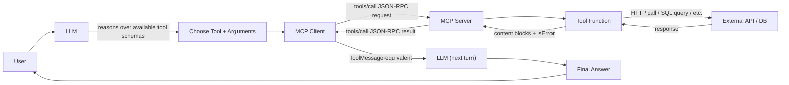
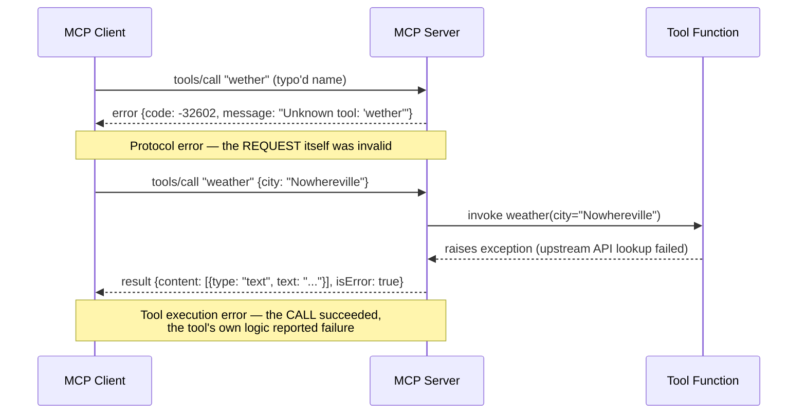

# MCP Tools

## Learning Objectives

By the end of this chapter, you will be able to:

- Describe the exact wire-level shape of an MCP tool object (`name`, `title`, `description`, `inputSchema`,
  `outputSchema`, `annotations`) and explain what each field controls
- Distinguish `tools/list` (discovery) from `tools/call` (invocation) and describe the `content`/`isError` shape
  of a `tools/call` result
- Explain the **two structurally different error mechanisms** in MCP tool calling — a JSON-RPC protocol error
  versus a successful result with `isError: true` — and why conflating them breaks client error handling
- Build a real, runnable MCP server with `mcp.server.fastmcp.FastMCP` (SDK v1.x) exposing three tools:
  `calculator`, `get_current_time`, and `weather`
- Explain *why* FastMCP derives a tool's `description` and `inputSchema` automatically from the function's
  docstring and type hints, instead of you writing JSON Schema by hand
- Justify validating an arithmetic operator against an enum rather than evaluating a raw expression string, as a
  concrete instance of "narrow the schema, don't sanitize free text"
- Run an MCP server over stdio transport and call it from a minimal `ClientSession`-based client
- Explain what `outputSchema`/`structuredContent` add on top of plain `content` blocks, and why a tool
  returning structured data should still include a `text` block for backward compatibility

---

## Prerequisites for This Chapter

This chapter assumes you've read **Chapter 2 (Architecture: Host, Client, Server)** and **Chapter 3 (Protocol
Fundamentals & Lifecycle)**. Specifically, you should already know:

- The Host/Client/Server split, and that a Client holds one 1:1 session with a Server (Ch. 2)
- That MCP runs JSON-RPC 2.0 over a transport, and that a session starts with an `initialize` /
  `notifications/initialized` handshake before any other method is legal to call (Ch. 3)
- What a JSON-RPC request/response/error object looks like structurally (Ch. 3)

This chapter does **not** re-teach what "tool calling" or "function calling" means for an LLM in general — that
is assumed background per the course prerequisites (you already know this from LangChain/LangGraph). What's new
here is MCP's specific wire shape for tools and your first hands-on server.

---

## 1. Tools vs. Resources, in One Sentence

MCP has three primitives that a server can expose: **tools**, **resources**, and **prompts**. This chapter is
about the first. The distinction that matters most between tools and resources (Chapter 5) is:

> **Tools let the model *do* something. Resources let the host *attach context* for the model to read.**

A tool is expected to potentially have side effects — call an API, write a row, send an email — and its
result is something the model reasons over as part of the conversation. A resource is read-only data the host
decides to include (or the user picks from a menu); the model doesn't "invoke" a resource the way it invokes a
tool. If you're ever unsure which primitive fits a capability you're building, ask: *"does the model choose to
call this as an action, or does something outside the model's control simply attach this as context?"* Action →
tool. Context → resource.

---

## 2. The Tool Definition Shape

Every tool a server exposes is described by a JSON object with this shape (fields accumulated across spec
revisions — see the callout below):

| Field | Required? | Description |
|---|---|---|
| `name` | Yes | Unique, machine-readable identifier. This is what appears in `tools/call` requests and what the model actually invokes by. |
| `title` | No | Optional human/display-facing name, distinct from `name` (added `2025-06-18`) — useful when `name` is a terse machine identifier like `get_wx` but you want a UI to show "Get Weather." |
| `description` | No (but effectively mandatory) | Free text explaining what the tool does and when to use it — this is the single most important field for correct model behavior (Chapter 10 goes deep on writing these well). |
| `inputSchema` | Yes | A JSON Schema object describing the tool's arguments — types, required fields, enums, descriptions per field. |
| `outputSchema` | No | A JSON Schema describing the shape of `structuredContent` in the result (added `2025-06-18`) — see Section 7. |
| `annotations` | No | Behavior hints for the client/host — e.g. `readOnlyHint`, `destructiveHint` (added `2025-03-26`). |
| `icons` | No | Icon references for display (added `2025-11-25`). |

A concrete tool object, as it would appear in a `tools/list` response, for the `calculator` tool we'll build in
Section 6:

```json
{
  "name": "calculator",
  "title": "Calculator",
  "description": "Perform basic arithmetic between two numbers.",
  "inputSchema": {
    "type": "object",
    "properties": {
      "a": { "type": "number", "description": "The first operand." },
      "b": { "type": "number", "description": "The second operand." },
      "operator": {
        "type": "string",
        "enum": ["add", "subtract", "multiply", "divide"],
        "description": "Which operation to perform."
      }
    },
    "required": ["a", "b", "operator"]
  },
  "annotations": {
    "readOnlyHint": true,
    "destructiveHint": false
  }
}
```

Notice `inputSchema` is *ordinary JSON Schema* — nothing MCP-specific about the schema language itself. What's
MCP-specific is the envelope: which fields sit alongside the schema (`name`, `title`, `description`,
`annotations`), and the two RPC methods that operate on tool objects, covered next.

> **2026-07-28 spec note:** the `tools/list` and `tools/call` methods themselves are confirmed **stable across
> every spec revision**, including the stateless `2026-07-28` redesign — this is one of the few surfaces that
> hasn't changed shape. What *has* changed is how each request identifies itself: instead of an `initialize`
> handshake establishing a session-wide protocol version once, every individual request (including
> `tools/call`) now carries `io.modelcontextprotocol/protocolVersion` and `clientCapabilities` in its `_meta`
> field. Chapter 21 covers this in full; for the classic model taught in this chapter, the handshake from
> Chapter 3 covers negotiation once per session.

---

## 3. Discovery and Invocation: `tools/list` and `tools/call`

Two JSON-RPC methods govern the entire tools lifecycle — no more, no fewer.

### 3.1 `tools/list` — discovery

The client asks the server what tools exist. No arguments are required (pagination cursors exist in the full
spec but aren't needed to understand the shape):

```json
{"jsonrpc": "2.0", "id": 3, "method": "tools/list", "params": {}}
```

```json
{
  "jsonrpc": "2.0",
  "id": 3,
  "result": {
    "tools": [
      { "name": "calculator", "description": "...", "inputSchema": { "...": "..." } },
      { "name": "get_current_time", "description": "...", "inputSchema": { "...": "..." } },
      { "name": "weather", "description": "...", "inputSchema": { "...": "..." } }
    ]
  }
}
```

This is the response your MCP client (Chapter 9) parses to build the list of tool definitions it hands to the
LLM — structurally, this is exactly the list you'd otherwise have hand-assembled as `@tool`-decorated Python
functions bound to a model, except here it arrived over the wire from a process (or service) your code never
imported.

### 3.2 `tools/call` — invocation

The client calls a specific tool by `name`, with an `arguments` object matching (a subset consistent with)
`inputSchema`:

```json
{
  "jsonrpc": "2.0",
  "id": 4,
  "method": "tools/call",
  "params": {
    "name": "calculator",
    "arguments": { "a": 12, "b": 4, "operator": "multiply" }
  }
}
```

The result:

```json
{
  "jsonrpc": "2.0",
  "id": 4,
  "result": {
    "content": [
      { "type": "text", "text": "48" }
    ],
    "isError": false
  }
}
```

`content` is always an **array** of content blocks — a tool can return multiple blocks (e.g. a text summary
plus an image). The block types you'll encounter:

| Type | Shape | Notes |
|---|---|---|
| `text` | `{"type": "text", "text": "..."}` | The overwhelming majority of tool results. |
| `image` | `{"type": "image", "data": "<base64>", "mimeType": "image/png"}` | Base64-encoded binary. |
| `audio` | `{"type": "audio", "data": "<base64>", "mimeType": "audio/wav"}` | Base64-encoded binary. |
| `resource_link` | `{"type": "resource_link", "uri": "...", "name": "...", "description": "...", "mimeType": "..."}` | A *reference* to a resource rather than embedded content — added `2025-06-18`. Lets a tool point at something large (a file, a report) without inlining it. |
| `resource` | `{"type": "resource", "resource": {"uri": "...", "mimeType": "...", "text": "..." \| "blob": "..."}}` | A resource *embedded* directly in the tool result — same content union Chapter 5 uses for `resources/read`. |

---

## 4. Two Distinct Error Mechanisms — Do Not Conflate Them

This is the single most important wire-level fact in this chapter, and it resurfaces as a recurring theme in
**Chapter 11 (Error Handling)**: MCP has **two structurally different ways a `tools/call` can fail**, and they
mean different things.

### 4.1 Protocol errors — the call itself was invalid

A **protocol error** means the JSON-RPC request could not be serviced at all — wrong method name, unknown tool
name, malformed arguments that don't even parse against the schema, and so on. It's reported as a standard
JSON-RPC error object, and critically, **there is no `result` field at all**:

```json
{
  "jsonrpc": "2.0",
  "id": 5,
  "error": {
    "code": -32602,
    "message": "Unknown tool: 'wether'"
  }
}
```

`-32602` (Invalid params) is the standard JSON-RPC code you'll see for an unknown tool name or a malformed
arguments object — this is a client-side mistake or a stale tool list, not the tool failing to do its job.

### 4.2 Tool execution errors — the call succeeded, the *tool* failed

A **tool execution error** means the JSON-RPC call itself succeeded — the server found the tool, invoked it, got
a response — but the tool's own logic failed (an API timed out, an invalid city name, a divide-by-zero). This is
reported *inside a normal `result`*, by setting `isError: true`:

```json
{
  "jsonrpc": "2.0",
  "id": 6,
  "result": {
    "content": [
      { "type": "text", "text": "Division by zero is not allowed." }
    ],
    "isError": true
  }
}
```

### 4.3 Why the distinction matters

| | Protocol error | Tool execution error (`isError: true`) |
|---|---|---|
| Where it lives | `error` field, no `result` | Inside `result.content`, `isError: true` |
| What it means | The *request* was invalid | The *tool* ran and reported failure |
| Who should see the message | Your client code / logs | Usually **the model** — it's meant to read the error text and decide what to do next (retry with different args, tell the user, try another tool) |
| Client-code implication | Must be caught at the JSON-RPC transport/client layer (e.g. an exception from `session.call_tool()`) | Must be checked as a *field on a successful response* — a naive client that only checks for exceptions will silently treat this as a normal answer |

The practical trap: if your client code only branches on "did the RPC call raise," it will completely miss
`isError: true` results, because from the transport's point of view nothing went wrong — you got a
well-formed `result`. You must explicitly check `result.isError` (or the SDK's equivalent field on the returned
object) every time, in addition to handling transport-level exceptions. Chapter 11 builds a complete error
taxonomy and client-side handling pattern around exactly this split.

---

## 5. The Full Request Flow

Here's the complete path a single tool call takes, end to end, tying together the LLM's decision, MCP's wire
protocol, and whatever real system the tool ultimately touches:



Two things worth internalizing from this diagram:

1. **The LLM never talks to the MCP server directly.** It only ever sees a tool schema (from `tools/list`,
   surfaced by the host as ordinary tool-calling schemas) and produces a tool-call request; your MCP **Client**
   is the thing that actually speaks JSON-RPC to the **Server**.
2. **The "External API / DB" box is entirely the tool author's business.** MCP has no opinion about what a tool
   does internally — from the protocol's perspective, a tool is just something that receives validated
   arguments and returns `content` blocks. Section 6 builds three tools that exercise this differently: one with
   no external call at all (`calculator`), one with a local computation (`get_current_time`), and one that calls
   out to another service (`weather`).

Here's the same flow's error path as a sequence diagram, making the Section 4 distinction concrete:



---

## 6. Building Your First MCP Server (FastMCP, SDK v1.x)

Everything from here targets **`mcp` Python SDK v1.x** (`pip install "mcp[cli]<2"`) — the classic,
handshake-based line that essentially all production tooling (`langchain-mcp-adapters`, `deepagents`, most
existing servers) is built against. `mcp.server.fastmcp.FastMCP` is the class you'll use.

```bash
pip install "mcp[cli]<2" httpx
```

### 6.1 Why FastMCP derives the schema for you

Before writing any tool, it's worth being explicit about *why* FastMCP works the way it does. Recall from
Section 2 that a tool object needs a `description` and a JSON Schema `inputSchema`. You could write both by
hand as raw dicts — but FastMCP instead **derives them automatically from your function's type hints and
docstring**:

- The function's **parameter names, type hints, and default values** become `inputSchema`'s `properties` and
  `required` list (a parameter with a default is optional; one without is required).
- The function's **docstring** becomes `description` (and, in the SDK's parameter-doc conventions, individual
  parameter descriptions).
- The function's **return type hint** informs how the result is packaged.

This matters for the same reason type-hint-derived schemas matter in LangChain tool authoring (which you
already know): the schema and the description can never silently drift out of sync with the actual function
signature, because they're generated from the same source of truth every time the server starts. You write one
Python function; the wire-level contract is a projection of it, not a hand-maintained duplicate.

> **Gotcha:** the official SDK's `FastMCP` (what this chapter teaches) uses `@mcp.tool()` — **with
> parentheses**. The separately-maintained, more feature-rich standalone `fastmcp` project (PrefectHQ,
> `github.com/PrefectHQ/fastmcp` — the actively-developed superset that inspired the SDK's bundled version)
> uses bare `@mcp.tool` in its own quickstart. Copying a snippet from the wrong project's docs is a common
> source of a confusing `TypeError` — decorator syntax that looks almost identical between the two but isn't
> interchangeable.

### 6.2 Tool 1 — `calculator`: validate the operator, don't `eval()` the expression

A tempting first design for a calculator tool is to accept a single string like `"12 * (3 + 4)"` and hand it to
Python's `eval()`. **Don't do this.** Two independent problems:

1. **Security**: `eval()` executes arbitrary Python. If a malicious actor can influence what string reaches the
   tool — directly, or indirectly via a prompt-injection attack that gets the model to construct an unexpected
   expression — you have a code-execution vulnerability sitting behind an MCP tool call.
2. **Schema quality**: a free-form expression string gives the model an unbounded surface to get subtly wrong
   (unbalanced parens, unsupported operators, locale-specific decimal separators) with no schema-level
   validation catching the mistake before your function even runs.

The fix: **narrow the input schema itself**, not the string you'd otherwise sanitize. Take two numeric operands
and an operator constrained to a small `Enum`:

```python
# mcp SDK v1.x — mcp.server.fastmcp.FastMCP
from enum import Enum


class Operator(str, Enum):
    ADD = "add"
    SUBTRACT = "subtract"
    MULTIPLY = "multiply"
    DIVIDE = "divide"


@mcp.tool()
def calculator(a: float, b: float, operator: Operator) -> float:
    """Perform basic arithmetic between two numbers.

    Args:
        a: The first operand.
        b: The second operand.
        operator: Which operation to perform — add, subtract, multiply, or divide.
    """
    if operator is Operator.ADD:
        return a + b
    if operator is Operator.SUBTRACT:
        return a - b
    if operator is Operator.MULTIPLY:
        return a * b
    if operator is Operator.DIVIDE:
        if b == 0:
            raise ValueError("Division by zero is not allowed.")
        return a / b
    raise ValueError(f"Unsupported operator: {operator}")
```

Because `operator` is typed as `Operator` (a `str` subclass `Enum`), FastMCP's schema generation renders it as
`{"type": "string", "enum": ["add", "subtract", "multiply", "divide"]}` in `inputSchema` — exactly what Section
2's example showed. This means an invalid operator value can be rejected by **schema validation before your
function body ever executes**, rather than your code having to defensively parse and reject a malformed
expression string at runtime. The enum *is* the validation — you get it for free from the type system rather
than writing it.

Note the `raise ValueError(...)` for the divide-by-zero case, rather than returning an error string. This
matters — see Section 6.5.

### 6.3 Tool 2 — `get_current_time`: an optional parameter

```python
# mcp SDK v1.x — mcp.server.fastmcp.FastMCP
from datetime import datetime
from zoneinfo import ZoneInfo


@mcp.tool()
def get_current_time(timezone: str | None = None) -> str:
    """Get the current date and time, optionally in a specific timezone.

    Args:
        timezone: An IANA timezone name, e.g. "America/New_York" or "Asia/Tokyo".
            Defaults to UTC if omitted.
    """
    tz = ZoneInfo(timezone) if timezone else ZoneInfo("UTC")
    return datetime.now(tz).isoformat()
```

Because `timezone` has a default value of `None`, FastMCP marks it **optional** in `inputSchema` (absent from
`required`) — the model can call `get_current_time` with no arguments at all and get UTC, or pass
`{"timezone": "Asia/Tokyo"}` for a specific zone. An invalid IANA name (e.g. `"Mars/Colony_One"`) raises
`ZoneInfoNotFoundError` from the standard library — which, as covered next, becomes a tool execution error, not
a crashed server.

### 6.4 Tool 3 — `weather`: calling an external API, and where error handling goes

```python
# mcp SDK v1.x — mcp.server.fastmcp.FastMCP
import httpx

WEATHER_API_URL = "https://api.example-weather.test/v1/current"


@mcp.tool()
async def weather(city: str) -> str:
    """Get current weather conditions for a named city.

    Args:
        city: The city name to look up, e.g. "Tokyo" or "London".
    """
    async with httpx.AsyncClient(timeout=5.0) as client:
        response = await client.get(WEATHER_API_URL, params={"q": city})
        response.raise_for_status()
        data = response.json()
    return f"{city}: {data['condition']}, {data['temp_c']}°C"
```

Two things to note:

- The tool function is `async def` — FastMCP supports async tool functions natively (the SDK is built on
  `asyncio`/`anyio` throughout), which is exactly what you want for an I/O-bound external call like this rather
  than blocking the server's event loop with a synchronous HTTP client.
- **Error handling is deliberately *not* done with a `try`/`except` that swallows the failure into a plain
  string return.** If `WEATHER_API_URL` is unreachable, `response.raise_for_status()` raises an
  `httpx.HTTPStatusError`, or the request itself raises `httpx.ConnectError` / `httpx.TimeoutException`. Left
  unhandled inside the function, FastMCP catches the exception **at the tool-execution boundary** and reports it
  back as a `tools/call` result with `isError: true` and the exception text as a `text` content block — exactly
  the mechanism from Section 4.2. This is usually the *right* default: the model receives a legible error
  message ("Could not reach weather API: ...") and can decide whether to retry, ask the user for a different
  city, or give up gracefully — rather than your Python code guessing at recovery logic the model was better
  positioned to make.

Where you'd add more deliberate error handling in production: catching specific exception types to return a
**more model-actionable message** than a raw stack trace (e.g. "city not found" vs. "upstream service
unavailable, try again" are different situations the model should act on differently), adding retries with
backoff for transient failures, and setting sane timeouts (already done above via `timeout=5.0`) so a single
slow upstream call doesn't stall the whole agent turn. Chapter 20 (Production MCP Architecture) covers retry
policy and observability for exactly this kind of outbound call in depth.

### 6.5 Why `calculator` raises but doesn't catch, either

Notice both `calculator`'s `ValueError` and `weather`'s uncaught `httpx` exceptions follow the same pattern:
**let the exception propagate out of the tool function.** This is the idiomatic way to produce an
`isError: true` result in FastMCP — you don't need to manually construct a content block with an error message
and set a flag yourself for the common case; raising is sufficient, and FastMCP handles turning it into the
correct wire-level shape. You'd only hand-construct the result yourself if you needed to return a *specific*,
carefully worded multi-block error payload rather than letting the exception's string representation be the
message.

### 6.6 Assembling and running the server

```python
# tools_server.py — mcp SDK v1.x, stdio transport
from enum import Enum
from datetime import datetime
from zoneinfo import ZoneInfo

import httpx
from mcp.server.fastmcp import FastMCP

mcp = FastMCP("tools-demo")


class Operator(str, Enum):
    ADD = "add"
    SUBTRACT = "subtract"
    MULTIPLY = "multiply"
    DIVIDE = "divide"


@mcp.tool()
def calculator(a: float, b: float, operator: Operator) -> float:
    """Perform basic arithmetic between two numbers.

    Args:
        a: The first operand.
        b: The second operand.
        operator: Which operation to perform — add, subtract, multiply, or divide.
    """
    if operator is Operator.ADD:
        return a + b
    if operator is Operator.SUBTRACT:
        return a - b
    if operator is Operator.MULTIPLY:
        return a * b
    if operator is Operator.DIVIDE:
        if b == 0:
            raise ValueError("Division by zero is not allowed.")
        return a / b
    raise ValueError(f"Unsupported operator: {operator}")


@mcp.tool()
def get_current_time(timezone: str | None = None) -> str:
    """Get the current date and time, optionally in a specific timezone.

    Args:
        timezone: An IANA timezone name, e.g. "America/New_York" or "Asia/Tokyo".
            Defaults to UTC if omitted.
    """
    tz = ZoneInfo(timezone) if timezone else ZoneInfo("UTC")
    return datetime.now(tz).isoformat()


WEATHER_API_URL = "https://api.example-weather.test/v1/current"


@mcp.tool()
async def weather(city: str) -> str:
    """Get current weather conditions for a named city.

    Args:
        city: The city name to look up, e.g. "Tokyo" or "London".
    """
    async with httpx.AsyncClient(timeout=5.0) as client:
        response = await client.get(WEATHER_API_URL, params={"q": city})
        response.raise_for_status()
        data = response.json()
    return f"{city}: {data['condition']}, {data['temp_c']}°C"


if __name__ == "__main__":
    mcp.run()  # defaults to stdio transport
```

Run it directly — `mcp.run()` defaults to stdio, which is the right transport for a locally-spawned server
process (Chapter 8 covers Streamable HTTP and passing `transport=` explicitly for a networked deployment):

```bash
python tools_server.py
```

Nothing prints to your terminal because stdio is now carrying newline-delimited JSON-RPC — this is expected
(recall from Chapter 3: an MCP stdio server MUST NOT write non-protocol data to stdout). To actually see it
work, either use the MCP Inspector (Chapter 12: `npx @modelcontextprotocol/inspector` or
`uv run mcp dev tools_server.py`) or write a minimal client, next.

---

## 7. Structured Output: `outputSchema` and `structuredContent`

Every result shown so far returned a single `text` content block. Starting with spec revision **`2025-06-18`**,
a tool can *additionally* declare an `outputSchema` and return `structuredContent` — JSON conforming to that
schema, alongside (not instead of) the usual `content` array.

> **Spec note (2025-06-18+):** `structuredContent` is JSON that conforms to the tool's declared `outputSchema`.
> The spec explicitly recommends that a tool returning `structuredContent` **should also return the same data
> serialized as a `text` block**, so older clients that don't know about `structuredContent` still get a usable
> answer. A conceptual (not literal-wire) example of what a `weather` result looks like once it returns
> structured data:
>
> ```json
> {
>   "content": [
>     { "type": "text", "text": "{\"city\": \"Tokyo\", \"condition\": \"clear\", \"temp_c\": 18}" }
>   ],
>   "structuredContent": { "city": "Tokyo", "condition": "clear", "temp_c": 18 },
>   "isError": false
> }
> ```

Why this matters in practice: a plain `text` block is great for a model to *read*, but painful for downstream
code (your own client, a UI, another service) to *parse reliably* — you'd be back to regex-scraping a string.
`structuredContent` gives you a typed, schema-validated payload a program can consume directly, while the
`text` block keeps the tool usable by the model and by any client that predates this feature. The exact
mechanism your installed SDK version exposes for *opting into* structured output (e.g. annotating a tool
function's return type with a `TypedDict`/Pydantic model so `outputSchema` is derived the same way `inputSchema`
already is) varies across SDK releases faster than the wire contract itself does — check your installed
version's documentation for the precise opt-in API before depending on it in production code. The wire-level
contract above (`outputSchema` on the tool definition, `structuredContent` alongside `content` in the result) is
what's spec-guaranteed and safe to design around regardless of SDK version.

---

## Examples

### A minimal client that exercises `tools/list` and `tools/call`

```python
# mcp SDK v1.x client — ClientSession over stdio
import asyncio

from mcp import ClientSession, StdioServerParameters
from mcp.client.stdio import stdio_client

server_params = StdioServerParameters(
    command="python",
    args=["tools_server.py"],
)


async def main() -> None:
    async with stdio_client(server_params) as (read, write):
        async with ClientSession(read, write) as session:
            await session.initialize()

            # tools/list — discovery
            listed = await session.list_tools()
            print("Available tools:", [t.name for t in listed.tools])

            # tools/call — a normal, successful call
            result = await session.call_tool(
                "calculator",
                arguments={"a": 12, "b": 4, "operator": "multiply"},
            )
            print("calculator result:", result.content[0].text, "isError:", result.isError)

            # tools/call — deliberately trigger a tool execution error
            error_result = await session.call_tool(
                "calculator",
                arguments={"a": 1, "b": 0, "operator": "divide"},
            )
            print("divide-by-zero result:", error_result.content[0].text)
            print("isError flag:", error_result.isError)  # True

            # tools/call — optional-argument tool with no args
            now = await session.call_tool("get_current_time", arguments={})
            print("current time (UTC):", now.content[0].text)


asyncio.run(main())
```

Running this against `tools_server.py` prints something like:

```text
Available tools: ['calculator', 'get_current_time', 'weather']
calculator result: 48.0 isError: False
divide-by-zero result: Division by zero is not allowed.
isError flag: True
current time (UTC): 2026-07-30T09:41:12.331442+00:00
```

Note `error_result.isError` is `True` even though no Python exception was raised in the *client* — this is the
SDK-side surfacing of exactly the Section 4.2 mechanism: the RPC succeeded, the tool reported failure inside
the result.

### Calling the `weather` tool

```python
weather_result = await session.call_tool("weather", arguments={"city": "Tokyo"})
if weather_result.isError:
    print("Weather lookup failed:", weather_result.content[0].text)
else:
    print("Weather:", weather_result.content[0].text)
```

This is the pattern every MCP client integration should follow: check `isError` explicitly on every
`call_tool` result, regardless of whether the call itself raised — Section 4.3's table, made concrete.

---

## Real-World Scenario

A team building an internal ops assistant ships a first version of a `run_query` MCP tool that accepts a raw
SQL string and executes it against a reporting database, on the theory that "the model is smart enough to write
correct, safe SQL." Within a week, two problems surface:

1. **Prompt injection via a support ticket.** A ticket body (fed into the agent's context as ordinary text)
   contains a hidden instruction telling the model to run `DROP TABLE`-style SQL "to clean up test data." The
   model, having no schema-level constraint stopping it, constructs exactly that string and the tool executes
   it — this is the SQL-tool analogue of the `calculator`/`eval()` problem from Section 6.2, just with much
   higher stakes.
2. **Silent failures the model never saw.** When a query fails (bad column name, permission error), the
   original implementation caught the exception inside the tool and returned an empty string on failure — no
   `isError`, no explanatory text. The model interpreted "empty result" as "zero rows matched" and confidently
   told users "no data found" for queries that had actually errored out.

The fix mirrors this chapter directly:

```python
from enum import Enum


class ReportName(str, Enum):
    DAILY_SIGNUPS = "daily_signups"
    WEEKLY_CHURN = "weekly_churn"
    OPEN_TICKETS = "open_tickets"


@mcp.tool()
def run_report(report: ReportName, days: int = 7) -> str:
    """Run a predefined, parameterized reporting query and return the results as text.

    Args:
        report: Which predefined report to run.
        days: Number of trailing days to include. Must be between 1 and 90.
    """
    if not 1 <= days <= 90:
        raise ValueError("days must be between 1 and 90.")
    query, params = REPORT_DEFINITIONS[report]  # parameterized, not string-built
    rows = execute_query(query, params={"days": days, **params})
    return format_rows_as_text(rows)
```

The rewrite replaces "any SQL string" with an **enum of predefined report names** — precisely Section 6.2's
lesson applied to a higher-stakes domain — and lets query failures raise naturally so they surface as
`isError: true` results the model actually sees and can relay honestly to the user, instead of a swallowed
exception masquerading as "no data."

---

## Best Practices

- **Constrain `inputSchema` as tightly as the domain allows** — enums for closed sets of choices (operators,
  report names, unit types), not free-form strings you'd otherwise have to sanitize or `eval()`.
- **Write docstrings for the model, not for a future human maintainer** — the docstring becomes `description`,
  which is what the model actually reads when deciding whether and how to call your tool (Chapter 10 goes deep
  on this).
- **Let exceptions propagate from tool functions** rather than swallowing them into a plain string return —
  this is what produces a correct `isError: true` result the model can act on, instead of a misleadingly
  "successful" response.
- **Always check `isError` explicitly on every `tools/call` result** in client code, in addition to handling
  transport-level exceptions — Section 4.3's table is the reason.
- **Use `async def` tool functions for any I/O-bound work** (HTTP calls, database queries) so a slow external
  dependency doesn't block the server's event loop.
- **Set explicit timeouts on outbound calls** (as `weather` does with `timeout=5.0`) — an unbounded upstream
  call can stall an entire agent turn.
- **Return `structuredContent` alongside a `text` block, never instead of it**, once you adopt `outputSchema` —
  backward compatibility with clients that don't parse structured content depends on this.

---

## Common Mistakes

- **Accepting a raw expression/SQL/shell string and evaluating it directly** (`eval()`, string-concatenated SQL,
  `shell=True`) instead of validating against a narrow schema — the single most common way an MCP tool becomes
  an injection vector. Section 6.2 and the Real-World Scenario are both this mistake in different domains.
- **Catching every exception inside a tool function and returning an empty or generic string** — this silently
  destroys the `isError` signal the model depends on to know something went wrong, and produces confidently
  wrong answers (Real-World Scenario, problem 2).
- **Checking only for a raised exception in client code and never inspecting `isError`** — misses every tool
  execution error entirely, since a `tools/call` with `isError: true` is, from the transport's perspective, a
  perfectly successful RPC (Section 4.3).
- **Confusing a protocol error (`-32602`, wrong tool name/malformed args) with a tool execution error
  (`isError: true`, the tool ran and failed)** — these require different handling: a protocol error usually
  means your client's tool list is stale or you have a bug in argument construction; a tool execution error is
  information the *model* should see and reason about.
- **Writing `inputSchema` by hand instead of trusting FastMCP's derivation** — manually duplicating what the
  type hints and docstring already express is extra maintenance surface that can drift from the actual function
  signature.
- **Copying `@mcp.tool` (no parens) from the standalone `fastmcp` project's docs** into code using the official
  SDK's `mcp.server.fastmcp.FastMCP`, which requires `@mcp.tool()` — a decorator-syntax mismatch that produces a
  confusing error (Section 6.1's gotcha).
- **Blocking the event loop with a synchronous HTTP client inside an `async def` tool** (or, conversely, writing
  a synchronous tool for what's actually a slow I/O operation) — degrades every other concurrent request the
  server is handling.

---

## Summary

- Tools are the MCP primitive for actions with potential side effects, in contrast to Resources (Chapter 5),
  which expose read-only context.
- A tool object on the wire is `name`, optional `title`/`description`/`icons`, required `inputSchema` (JSON
  Schema), optional `outputSchema` and `annotations`.
- Two methods govern the whole lifecycle: `tools/list` for discovery, `tools/call` for invocation — stable
  across every spec revision to date, including the `2026-07-28` stateless redesign.
- A `tools/call` result is `{"content": [...], "isError": bool}`; `content` blocks can be `text`, `image`,
  `audio`, `resource_link`, or `resource`.
- There are **two distinct error mechanisms**: a JSON-RPC **protocol error** (malformed request, unknown tool,
  `error` field, no `result`) versus a **tool execution error** reported as `isError: true` inside an otherwise
  successful `result` — conflating these breaks client error handling and this distinction recurs directly in
  Chapter 11.
- FastMCP (`mcp.server.fastmcp.FastMCP`, SDK v1.x) derives `description` and `inputSchema` automatically from a
  Python function's docstring and type hints via `@mcp.tool()` — you write one function, not a function plus a
  hand-maintained schema.
- Validate closed-choice parameters (like an arithmetic operator) with an `Enum`, not a free-form string you'd
  otherwise `eval()` or string-concatenate — this pushes validation into the schema layer instead of your
  runtime code.
- Letting exceptions propagate out of a tool function is the idiomatic way to produce a correct
  `isError: true` result — don't swallow them into a plain string return.
- `outputSchema`/`structuredContent` (spec `2025-06-18+`) let a tool return typed, program-parseable JSON
  alongside its usual `text` block, without breaking older clients.
- `mcp.run()` defaults to stdio transport, the right choice for a locally-spawned server process; Chapter 8
  covers Streamable HTTP for networked deployments.

---

## Knowledge Check

1. Name every field a tool definition can carry, and state which spec revision introduced `title`,
   `outputSchema`, and `icons` respectively.
2. Walk through, precisely, the difference between a JSON-RPC protocol error and a tool execution error for
   `tools/call` — which one has a `result` field, which one has an `error` field, and who is the intended
   "reader" of each (your client code vs. the model)?
3. Why does validating the `calculator` tool's `operator` parameter against an `Enum` prevent an entire class
   of bug/vulnerability that a raw `eval()`-based expression parser cannot rule out at the schema level?
4. What specifically does FastMCP derive from a `@mcp.tool()`-decorated function's signature and docstring, and
   why does that matter for keeping a tool's wire-level contract in sync with its implementation?
5. If a tool function raises an unhandled exception, what does the client actually receive back from
   `tools/call` — a JSON-RPC error, or a successful result? Justify your answer using Section 4 and Section 6.5.
6. What problem does `structuredContent` solve that a plain `text` block doesn't, and why should a tool
   returning `structuredContent` still include a `text` block too?

---

## Hands-On Exercise

Extend `tools_server.py` from Section 6.6 with a **fourth tool** and verify both success and error paths.

1. **Write a `unit_converter` tool** — `unit_converter(value: float, from_unit: str, to_unit: str) -> float` —
   but instead of accepting `from_unit`/`to_unit` as free strings, define a `Unit` enum covering a small, closed
   set (e.g. `"km"`, `"miles"`, `"celsius"`, `"fahrenheit"`) and change the signature to
   `unit_converter(value: float, from_unit: Unit, to_unit: Unit) -> float`, applying Section 6.2's enum lesson
   to a new tool.
2. **Raise a `ValueError`** (not a caught/returned string) when `from_unit` and `to_unit` are incompatible
   categories (e.g. converting `"km"` to `"celsius"`), and confirm — using the client pattern from the
   Examples section — that this produces `isError: True` with your message as the `text` content.
3. **Add `unit_converter` to the server** alongside `calculator`, `get_current_time`, and `weather`, and
   confirm it appears in `tools/list` via `session.list_tools()`.
4. **Call it successfully** (e.g. converting `100` `"km"` to `"miles"`) and print the result.
5. **Bonus:** give `unit_converter` an `outputSchema`-eligible return by defining a small `TypedDict` (e.g.
   `{"value": float, "unit": str}`) as the return annotation, consult your installed SDK version's docs for how
   it surfaces `outputSchema`/`structuredContent` for that shape, and confirm (via the Inspector from Chapter 12,
   or a raw client call) whether `structuredContent` appears in the result alongside `content`.

---

## Further Reading

- [MCP Specification — Tools](https://modelcontextprotocol.io/specification/2025-06-18/server/tools) — the
  authoritative wire-format reference for everything in Sections 2–4
- `github.com/modelcontextprotocol/python-sdk` — official Python SDK; read
  `src/mcp/server/fastmcp/server.py` directly for the current `@mcp.tool()` implementation and exactly how
  schema derivation works in your installed version
- `github.com/PrefectHQ/fastmcp` — the actively-maintained standalone FastMCP project (ahead of the SDK's
  bundled version); useful once you outgrow the basics, but mind the `@mcp.tool` vs. `@mcp.tool()` gotcha from
  Section 6.1
- Related chapter in this course: [Chapter 5 — MCP Resources](./05-mcp-resources.md) — the read-only counterpart
  to everything covered here
- Related chapter in this course: [Chapter 10 — Tool Schema Design](./10-tool-schema-design.md) — writing
  `description` and `inputSchema` well enough that a model reliably picks the right tool and arguments
- Related chapter in this course: [Chapter 11 — Error Handling](./11-error-handling.md) — the full error
  taxonomy building directly on Section 4's protocol-error/tool-execution-error split
- Related chapter in this course: [Chapter 12 — MCP Inspector & Debugging](./12-mcp-inspector-and-debugging.md)
  — testing `tools_server.py` interactively without writing a client at all

---

<div style="display:flex;justify-content:space-between;align-items:center;">
  <a href="./03-protocol-fundamentals-and-lifecycle.md">← Previous: Protocol Fundamentals & Lifecycle</a>
  <a href="./00-index.md">🏠 Index</a>
  <a href="./05-mcp-resources.md">Next: MCP Resources →</a>
</div>
