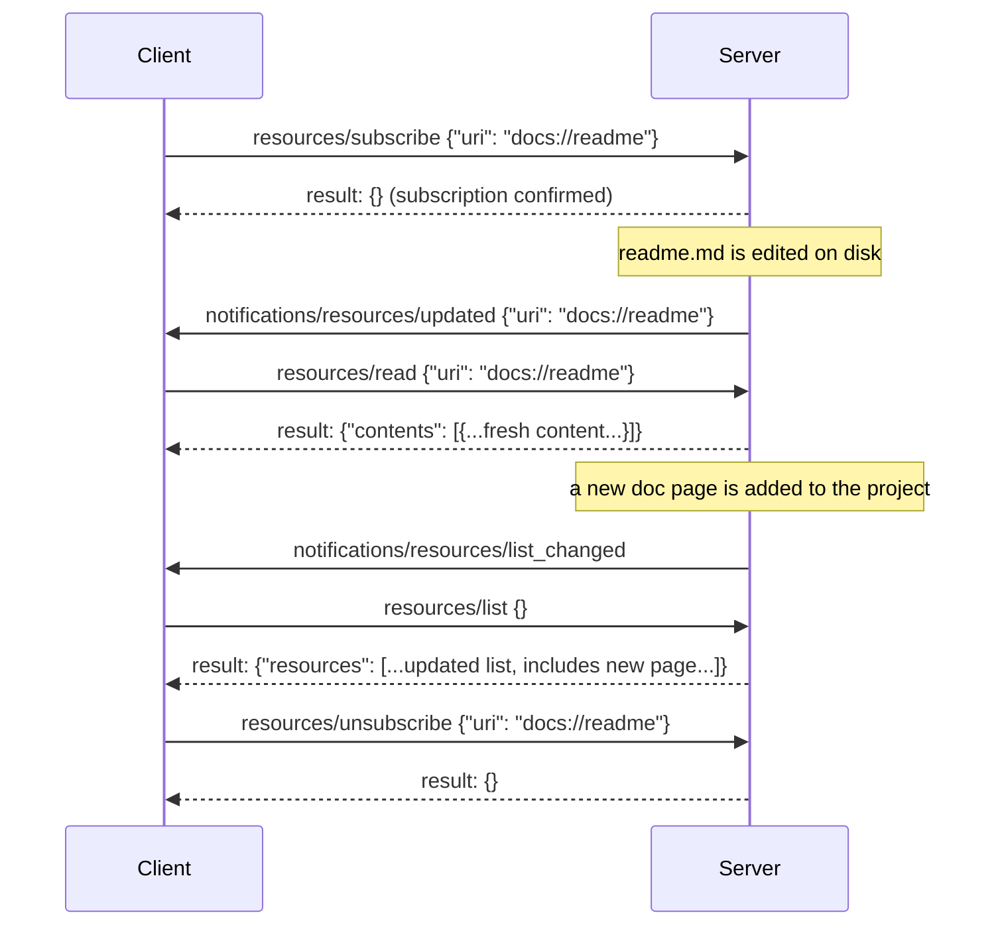
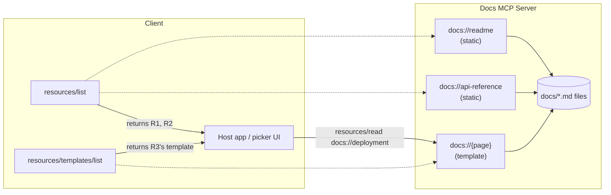

# MCP Resources

## Learning Objectives

By the end of this chapter, you will be able to:

- Explain the Resources/Tools distinction precisely — "what should the system **read**?" versus "what should the
  system **do**?" — and use it as a design test when a new capability doesn't obviously belong to either
- Name every field in the resource object shape (`uri`, `name`, `title`, `description`, `mimeType`, `size`) and
  state which are optional
- Call `resources/list`, `resources/read`, and `resources/templates/list` and predict the exact shape of each
  response
- Recognize that resource content (`text`/`blob`) is the **same union** used inside tool results, not a parallel
  format you need to learn separately
- Build parameterized, dynamic resources with `@mcp.resource("scheme://{param}")` and explain why a templated
  resource shows up in `resources/templates/list` instead of `resources/list`
- Wire up the classic subscription flow (`resources/subscribe`/`unsubscribe`,
  `notifications/resources/updated`, `notifications/resources/list_changed`) and state precisely how the
  2026-07-28 spec replaces it
- Build a working documentation server that exposes Markdown files as both static and templated resources using
  FastMCP v1.x
- Apply a concrete judgment test for "should this be a resource or a tool?" to a capability that could plausibly
  be either

## Prerequisites for This Chapter

This chapter assumes you've read:

- **Chapter 2** (Architecture: Host, Client, Server) — the three-role model, and specifically that a **client**
  "manages subscriptions and notifications" as part of its spec-defined job
- **Chapter 3** (Protocol Fundamentals & Lifecycle) — JSON-RPC 2.0 request/response/notification shapes, the
  `initialize` handshake, and capability negotiation (the `resources: {subscribe, listChanged}` capability key you
  saw in the server's `initialize` response is this chapter's subject)
- **Chapter 4** (MCP Tools) — the tool object shape, the `tools/call` result's `content` array (`text`/`image`/
  `resource_link`/`resource` blocks), and the `@mcp.tool()` decorator on `FastMCP`. This chapter reuses that same
  `FastMCP` server object and the same content-block vocabulary, applied to a different primitive.

If you can't recall what a `resource` content block (as opposed to a `text` or `image` block) looked like inside a
`tools/call` result in Chapter 4, it's worth a quick re-read — this chapter is largely about that same shape,
promoted to being the thing a request returns directly, rather than something embedded inside a tool result.

## Resources vs. Tools: What Should the System Read?

Chapter 4 built tools around one governing question: **what should the system be able to *do*?** A tool is an
action — it takes structured input, it (usually) has a side effect or performs a computation, and the model
decides when to invoke it based on its `description` and `inputSchema`.

Resources answer a different question: **what should the system be able to *read*?** A resource is context — a
piece of data the host can hand to the model (or show to the user, or let the user attach to a message) without
the model having to construct arguments or trigger any computation to get it. Where a tool call is "the model
asks the server to do a thing and hands back a result," a resource read is closer to "the client already knows
this piece of context exists and fetches its current content."

This distinction shows up immediately in who's expected to initiate the read. In most client implementations, tool
calls are model-initiated (the LLM decides to call `search_papers`), while resources are commonly **client- or
user-initiated** — a chat UI might list available resources in a picker so a user can attach `docs://api-reference`
to their message, or a host application might pull a fixed set of resources into every conversation's context
automatically. Nothing in the spec forbids a model from triggering a resource read too, but the *typical* shape is
different: tools are "the model decided," resources are "the application (or user) decided what context is
relevant, and the resource primitive is how it's fetched over the wire."

| | Tools (Chapter 4) | Resources (this chapter) |
|---|---|---|
| Governing question | What should the system **do**? | What should the system **read**? |
| Typical initiator | The model, via `tools/call` | The client/host/user, via `resources/read` |
| Input | Structured arguments (`inputSchema`) | An identifier only — a URI |
| Effect | May have side effects, may be expensive | Should be a read; no side effects expected |
| Discovery method | `tools/list` | `resources/list` + `resources/templates/list` |
| Result shape | `content` array (text/image/audio/resource/resource_link blocks) | `contents` array (text/blob union — see below) |

Keep that last row in mind — the two methods even use differently-named wrapper keys (`content` singular for
`tools/call`, `contents` plural for `resources/read`), which is exactly the kind of small inconsistency that trips
people up when they're implementing both sides from memory instead of checking the wire format.

## Resource URIs and the Resource Object Shape

Every resource is identified by a **URI**. The scheme is not standardized by MCP itself — a server author chooses
whatever scheme makes sense for the domain, the same way you'd choose a namespace for internal identifiers:

```
file://config.yaml            — a real filesystem path exposed as a resource
database://users/123          — a row (or row-shaped view) from a database
docs://company-policy         — a logical document, no filesystem or DB behind it necessarily
logs://application/latest     — a "latest" pointer into a rotating log stream
greeting://{name}             — a URI *template*, not a concrete resource (see below)
```

None of these need to correspond to anything that physically exists at that path — `docs://company-policy` is
just as valid a URI if the server generates that Markdown from a CMS call as it is if it's reading a literal
file. The URI is an opaque identifier from the protocol's point of view; only your server code decides what it
means to "read" one.

The resource object itself — what comes back from `resources/list` — has an exact, small shape:

```json
{
  "uri": "docs://api-reference",
  "name": "api-reference",
  "title": "API Reference",
  "description": "The full REST API reference for this project, including auth and error codes.",
  "mimeType": "text/markdown",
  "size": 4821
}
```

| Field | Required | Notes |
|---|---|---|
| `uri` | yes | The identifier used in `resources/read` |
| `name` | yes | A short, stable, machine-oriented identifier |
| `title` | no | Optional human-facing display name, distinct from `name` — same pattern as the tool object's optional `title` from Chapter 4 |
| `description` | no | Prose explaining what this resource contains — this is what a host/user sees when deciding whether to attach it |
| `mimeType` | no | Lets the client render or route the content correctly (`text/markdown`, `application/json`, `image/png`, ...) |
| `size` | no | Byte size, when known in advance — useful for a host deciding whether to fetch automatically or warn about size |

Only `uri` and `name` are required. Everything else is present when the server has something meaningful to say,
and every optional field exists to help a *host* make a UI or budgeting decision — `title`/`description` for
"should I show this to the user or attach it automatically," `mimeType` for "how do I render this," `size` for
"is this cheap enough to just fetch."

## Listing and Reading Resources: `resources/list` and `resources/read`

Two methods do the actual work, mirroring the `tools/list` / `tools/call` split from Chapter 4 almost exactly.

**`resources/list`** — discovery, no arguments needed beyond the standard envelope:

```json
{"jsonrpc": "2.0", "id": 10, "method": "resources/list", "params": {}}
```

```json
{
  "jsonrpc": "2.0",
  "id": 10,
  "result": {
    "resources": [
      {"uri": "docs://readme", "name": "readme", "title": "Project README",
       "description": "Top-level project overview.", "mimeType": "text/markdown", "size": 1204},
      {"uri": "docs://api-reference", "name": "api-reference", "title": "API Reference",
       "description": "Full REST API reference.", "mimeType": "text/markdown", "size": 4821}
    ]
  }
}
```

**`resources/read`** — fetch the current content of one specific URI:

```json
{"jsonrpc": "2.0", "id": 11, "method": "resources/read", "params": {"uri": "docs://readme"}}
```

```json
{
  "jsonrpc": "2.0",
  "id": 11,
  "result": {
    "contents": [
      {"uri": "docs://readme", "mimeType": "text/markdown", "text": "# My Project\n\nThis is the README...\n"}
    ]
  }
}
```

Notice `resources/read`'s result is `contents` (an **array**, even for a single logical resource) — a server can
legitimately return more than one content block for one URI (for example, a resource that expands into several
related fragments). Don't assume `contents` always has exactly one element just because you requested one URI.

If a client asks for a URI the server doesn't recognize, that's a protocol error, not a "not found" result buried
inside a success response — the same protocol-error-vs-execution-error distinction Chapter 4 flagged for tools
applies here too.

> **2026-07-28 spec note:** the resource-not-found error code changes from `-32002` (classic) to `-32602`
> (current) in the stateless spec revision. Write clients defensively: a client built against the new spec
> **SHOULD** still accept `-32002` from an older server it happens to talk to, since the ecosystem will run mixed
> versions for a long time.

## Resource Content: The Same Union Tools Use — Not a New Format

This is worth stating explicitly because it's easy to assume resources have their own bespoke content format: they
don't. The `text`/`blob` union inside `contents` is **exactly** the same union used for the embedded `resource`
content block inside a `tools/call` result in Chapter 4. There is one content-shape vocabulary in MCP, reused in
both places:

```json
// Text content — same shape whether it arrived via resources/read or embedded in a tool result
{"uri": "docs://readme", "mimeType": "text/markdown", "text": "# My Project\n..."}

// Binary content — base64-encoded, same shape both places
{"uri": "images://logo.png", "mimeType": "image/png", "blob": "iVBORw0KGgoAAAANSUhEUgA..."}
```

A resource's content is either `text` (a string, used for anything textual — Markdown, JSON, source code, CSV) or
`blob` (base64-encoded bytes, used for anything binary — images, PDFs, audio). Exactly one of the two is present
per content object, keyed off `mimeType`. If you already internalized the tool-result content union in Chapter 4,
you've already learned this shape — there's nothing new to memorize here beyond the wrapper key name (`contents`
vs. `content`).

This unification matters practically: a tool that returns "here's a reference to some data" (a `resource_link` or
embedded `resource` block in a `tools/call` result) and a direct `resources/read` call both bottom out in the same
text-or-blob representation on the wire, which means client-side code that already knows how to render one knows
how to render the other.

## Dynamic Resources: URI Templates and `resources/templates/list`

So far every example has been a **static** resource — a fixed URI the server knows about in advance and can list
directly in `resources/list`. But plenty of useful resources are parameterized: "the greeting for *this* name,"
"documentation page *this* slug," "user row *this* ID." MCP models this with **URI templates** (RFC 6570 style),
discovered through a third method:

**`resources/templates/list`**:

```json
{"jsonrpc": "2.0", "id": 12, "method": "resources/templates/list", "params": {}}
```

```json
{
  "jsonrpc": "2.0",
  "id": 12,
  "result": {
    "resourceTemplates": [
      {"uriTemplate": "greeting://{name}", "name": "greeting", "title": "Personalized Greeting",
       "description": "A greeting for the given name.", "mimeType": "text/plain"}
    ]
  }
}
```

A template resource does **not** appear in `resources/list` — you can't enumerate every possible `name`, so there
is no fixed list to return. What the server *can* enumerate is the shape of the URI itself: `greeting://{name}`
tells a client "substitute any string for `{name}` and call `resources/read` with the result." The client fills
in `{name}` (from a user input, from model-provided context, from wherever the host decides), then reads the
concrete URI exactly as it would a static resource — `resources/read` doesn't know or care whether the URI it
was handed came from a static listing or a filled-in template.

Recall the exact FastMCP v1.x code from Chapter 4's fact sheet — this is the same decorator, just used for a
resource rather than a tool:

```python
# v1.x — mcp.server.fastmcp.FastMCP
from mcp.server.fastmcp import FastMCP

mcp = FastMCP("Demo")

@mcp.resource("greeting://{name}")
def get_greeting(name: str) -> str:
    """Get a personalized greeting"""
    return f"Hello, {name}!"
```

The `{name}` in the URI string and the `name: str` parameter are matched by position/name — FastMCP infers the
template's variables directly from the decorated function's signature, the same way it infers a tool's
`inputSchema` from a tool function's signature in Chapter 4. Register this function, and:

- It shows up in `resources/templates/list` as `greeting://{name}`, **not** in `resources/list`.
- A client reads a concrete instance — say `greeting://alice` — via ordinary `resources/read`, and FastMCP calls
  `get_greeting(name="alice")` under the hood, wrapping the return value in a `text` content block automatically.

A single `FastMCP` server can freely mix static resources (decorated with a fixed, parameter-free URI string) and
templated resources (decorated with a URI containing `{placeholders}`) — the decorator's job is to notice whether
the URI string contains template variables and route the registration to `resources/list` or
`resources/templates/list` accordingly.

## Subscriptions: Keeping Resources Fresh

A resource's content can change after a client has read it — a config file gets edited, a log's "latest" pointer
advances, a database row gets updated by another process. The classic protocol gives clients a way to stay
current without polling.



Four pieces make up the classic flow:

- **`resources/subscribe`** — `{"uri": "..."}`. The client asks to be told when a specific resource's content
  changes. This is a per-URI subscription, not a global one.
- **`resources/unsubscribe`** — same shape, cancels a prior subscription.
- **`notifications/resources/updated`** — a server-to-client **notification** (no `id`, no response expected)
  carrying the URI whose content changed. The client decides what to do — typically, re-read it if it's currently
  displayed or attached to an active conversation.
- **`notifications/resources/list_changed`** — a broader notification meaning "the *set* of available resources
  changed" (one was added, removed, or its metadata changed) — this is the resource-level analog of the
  `listChanged` capability flag you saw for tools and prompts in Chapter 3's capability negotiation.

Whether a server supports subscriptions at all is advertised during `initialize` — recall from Chapter 3 that the
server's capabilities object includes `"resources": {"subscribe": true, "listChanged": true}`. A client should
check for `subscribe: true` before attempting `resources/subscribe`; a server that omits it doesn't support
per-resource change notifications, only (at most) the coarser `list_changed` signal.

> **2026-07-28 spec note:** the classic subscribe/unsubscribe/notify trio is replaced by a single, long-lived
> `subscriptions/listen` request with filter flags — one request expresses what used to take a subscribe call
> plus ongoing notification handling. This is a direct consequence of the protocol becoming stateless: a
> subscribe-then-wait-for-push model implies a standing session to push *into*, which the 2026-07-28 redesign
> removes. If you're building against the classic model today (which is what this course teaches hands-on), the
> subscribe/unsubscribe/notify shapes above are what you'll actually implement and consume; treat
> `subscriptions/listen` as the direction the protocol is heading, covered in depth in Chapter 21.

## Examples

The client side of resources, using the classic `ClientSession` (v1.x). This builds on the `stdio_client` +
`ClientSession` pattern from Chapter 4 — only the methods called are new:

```python
# v1.x — mcp.ClientSession over stdio
from mcp import ClientSession, StdioServerParameters
from mcp.client.stdio import stdio_client

server_params = StdioServerParameters(command="python", args=["docs_server.py"])

async with stdio_client(server_params) as (read, write):
    async with ClientSession(read, write) as session:
        await session.initialize()

        # Static resources
        listing = await session.list_resources()
        for r in listing.resources:
            print(r.uri, r.name, r.mimeType)

        # Dynamic/templated resources
        templates = await session.list_resource_templates()
        for t in templates.resourceTemplates:
            print(t.uriTemplate)

        # Read one resource's current content
        result = await session.read_resource("docs://readme")
        for block in result.contents:
            if block.text is not None:
                print(block.text)

        # Subscribe to change notifications for one resource
        await session.subscribe_resource("docs://readme")
        # ... handle notifications/resources/updated via the session's
        # notification handler, then eventually ...
        await session.unsubscribe_resource("docs://readme")
```

`session.list_resources()`, `session.read_resource(uri)`, `session.list_resource_templates()`,
`session.subscribe_resource(uri)`, and `session.unsubscribe_resource(uri)` are the `ClientSession` counterparts to
the five wire methods this chapter covers, exactly the way `session.list_tools()`/`session.call_tool()` wrapped
`tools/list`/`tools/call` in Chapter 4.

If you're pulling resources into a LangChain/LangGraph pipeline rather than driving `ClientSession` directly,
`langchain-mcp-adapters` exposes resource access as two module-level async functions rather than a "resources
tool" — worth knowing about now even though the LangChain integration chapter (17) covers it properly:

```python
# langchain_mcp_adapters.resources (langchain-mcp-adapters 0.3.1)
from langchain_mcp_adapters.resources import load_mcp_resources, get_mcp_resource

# Fetch a specific set of URIs (or omit uris= to fetch everything the server lists)
blobs = await load_mcp_resources(session, uris=["docs://readme", "docs://api-reference"])

# Fetch exactly one
blobs = await get_mcp_resource(session, "docs://readme")
```

Both functions return a list of LangChain `Blob` objects — resources are genuinely first-class in the LangChain
integration, not bolted on, correcting the common assumption that `langchain-mcp-adapters` only surfaces tools.

## Project: A Documentation Server

Let's build the running example for this chapter: an MCP server that exposes a project's own Markdown
documentation as resources — a small, realistic stand-in for "let the agent read our docs without giving it raw
filesystem access to the whole repo."

### Directory layout

```
docs_server/
├── server.py
└── docs/
    ├── readme.md
    ├── api-reference.md
    └── deployment.md
```

### The server (v1.x FastMCP)

```python
# v1.x — mcp.server.fastmcp.FastMCP
from pathlib import Path
from mcp.server.fastmcp import FastMCP

mcp = FastMCP("Docs Server")

DOCS_DIR = Path(__file__).parent / "docs"


@mcp.resource("docs://readme")
def get_readme() -> str:
    """The project's top-level README — start here for orientation."""
    return (DOCS_DIR / "readme.md").read_text()


@mcp.resource("docs://api-reference")
def get_api_reference() -> str:
    """The full REST API reference: endpoints, auth, error codes."""
    return (DOCS_DIR / "api-reference.md").read_text()


@mcp.resource("docs://{page}")
def get_doc_page(page: str) -> str:
    """Fetch any documentation page by its slug (matches a file under docs/)."""
    path = DOCS_DIR / f"{page}.md"
    if not path.exists():
        raise FileNotFoundError(f"No such documentation page: {page!r}")
    return path.read_text()


if __name__ == "__main__":
    mcp.run()
```

Three things worth noticing about this server:

1. **`docs://readme` and `docs://api-reference` are static resources.** Each has a fixed URI and its own docstring
   (which FastMCP uses as the resource's `description`), so both show up individually in `resources/list` with
   distinct, specific descriptions — a client or host can tell them apart without reading either one.
2. **`docs://{page}` is a template resource.** It shows up in `resources/templates/list` as
   `docs://{page}`, not as an entry in `resources/list`. A client that wants "the deployment doc" reads
   `docs://deployment` — a concrete URI matching the template — and FastMCP dispatches it to `get_doc_page(page="deployment")`.
3. **The template overlaps in *capability* with the two static resources**, and that's fine. `docs://readme` could
   in principle be served by `docs://{page}` with `page="readme"` too. Keeping dedicated static entries for the
   most important, most-referenced pages is a usability choice: it gives them their own name, title, and
   description in `resources/list` for a host UI to show directly, rather than requiring every client to already
   know to try `docs://readme` against the generic template.

### Testing it with the Inspector

Before wiring this into any agent, point the MCP Inspector at it directly — this is the same tool from Chapter
12's dedicated coverage, useful here as a sanity check while building:

```bash
uv run mcp dev server.py
```

From the Inspector's Resources tab you can call `resources/list` and see `docs://readme` and `docs://api-reference`
with their descriptions, call `resources/templates/list` and see `docs://{page}`, and manually read
`docs://deployment` to confirm the template resolves against `docs/deployment.md` correctly — all without needing
an LLM in the loop at all.

### What a client sees



## Resource or Tool? The Judgment Call

Some capabilities are obviously one or the other. "Return the current content of `config.yaml`" is unambiguously
a resource — no meaningful input beyond an identifier, a pure read, no computation to speak of. "Restart the
payment service" is unambiguously a tool — an action with a side effect, no sense in which it's "read-only
context."

The interesting cases sit in between, and the canonical one is **search**. Consider "search the project's docs for
a keyword." You could expose this as a resource — say, `docs://search?q={query}` — or as a tool,
`search_docs(query: str) -> list[Match]`. Both are technically expressible. Which is the better fit?

Lean toward **tool** when the capability:

- Takes **structured input with more than a bare identifier** — a query string, filters, pagination parameters —
  the kind of thing `inputSchema` exists to describe precisely, with types and validation, rather than encoding
  awkwardly into a URI's query-string-like tail.
- **Computes** a result rather than returning something that already exists in a stable form — a search returns a
  *derived* answer (ranked matches, snippets) that didn't exist as a standalone artifact before the call; a
  resource read returns something that was already "there."
- Is naturally something **the model decides to invoke** based on the conversation — "the user asked about
  deployment, so I should search the docs for 'deployment'" is exactly the kind of judgment call tool-calling
  exists for, whereas resources are more often pre-selected by the host or user, independent of what the model
  is currently reasoning about.

Lean toward **resource** when the capability:

- Is **identified, not parameterized** — you're fetching *this specific thing* (a file, a row, a page), not
  computing a novel answer from open-ended input.
- Should be **listable** — if it makes sense for a host UI to show the user "here's what's available to attach,"
  that's the `resources/list` use case tools don't serve (tool availability isn't normally a user-facing picker in
  the same way).
- Benefits from **subscriptions** — "notify me when this changes" is a resource-shaped concept; it doesn't map
  onto a tool at all, since a tool call is a one-shot request/response with no notion of an ongoing subscription
  to its "result."

`get_doc_page(page: str)` in this chapter's project sits right at the boundary and is worth examining as the
edge case it is: it *does* take a parameter (`page`), which looks tool-like. But the parameter is a plain
**identifier** picking out one pre-existing document, not a query being computed over — the same reason
`database://users/{id}` is a resource template and not a tool called `get_user(id: str)`. The test that
resolves the ambiguity: could you meaningfully list every valid input in advance and hand the user a picker? For
`docs://{page}`, yes — the set of valid pages is small and enumerable (even if `resources/templates/list` itself
doesn't enumerate the *instances*, the server knows the finite set of files under `docs/`). For `search_docs(query:
str)`, no — the space of queries is unbounded and the result is a new computation each time, not a fixed thing
being fetched. That's the resource/tool line: **fetch-by-identifier is a resource; compute-from-open-ended-input
is a tool**, even when both technically compile down to "a function that returns a string."

## Real-World Scenario

You're building an internal engineering-assistant agent that should be able to answer questions about your
company's architecture using a mix of static reference material (a living architecture doc, a runbook, a
glossary) and per-incident data (whatever log or config file is relevant to what's currently being debugged).

Model the stable, curated reference material as resources on a docs MCP server, exactly like this chapter's
project: `docs://architecture-overview`, `docs://runbook-database-failover`, `docs://glossary`, each with a
specific `description` so a host UI (or a system prompt that lists available resources to the model) can present
them meaningfully. A user working an incident can attach `docs://runbook-database-failover` to the conversation
directly — no tool call, no query construction, just "give me the current content of this known thing." Because
these docs are edited outside of any single conversation (an SRE updates the runbook after every incident
retro), wire up `resources/subscribe` on the ones most likely to be open in a long-lived session, so the host can
silently re-fetch and re-attach the freshest version rather than working off a stale copy read at the start of
the conversation.

Contrast that with "check what's currently deployed in production for service X" or "search the last hour of logs
for this error code" — both are tools, not resources, because both take structured, model-decided input
(`service_name`, `error_code`, a time window) and compute a fresh, non-enumerable answer on each call. A single
agent legitimately has both: a small, curated set of resources for "things that should just be available," and a
tool surface for "things the model needs to compute or query for, based on what's actually happening in this
conversation."

## Best Practices

- **Reach for a resource first when the capability is "give me the current content of X."** Only reach for a tool
  once you notice the input is open-ended (a query, filters) or the output is a fresh computation rather than an
  existing artifact.
- **Give every static resource a specific `description`, not a generic one.** The description is the only signal a
  host/user has for deciding whether to attach a resource — "the API reference" is far more useful than "a
  document."
- **Use a URI template for anything with a bounded, enumerable identifier space** (page slugs, user IDs, file
  paths under a known root) rather than hand-rolling a `list_pages` tool plus a `get_page(slug)` tool pair — the
  template collapses both into the resource primitive that already has first-class discovery
  (`resources/templates/list`) and reading (`resources/read`) support.
- **Set `mimeType` accurately.** A host deciding how to render or attach a resource relies on it — `text/markdown`
  versus `application/json` versus `image/png` changes what a client should do with the content, and guessing
  from content alone is strictly worse than the server just saying so.
- **Advertise `subscribe: true` in server capabilities only if you actually implement `resources/subscribe`/
  `unsubscribe` and emit the notifications** — a client that checks the capability flag and then gets no
  notifications from a resource it subscribed to is a debugging session waiting to happen.
- **Don't build a resource whose "read" has side effects.** If reading a resource twice in a row could produce
  different externally-visible effects beyond returning fresh content (e.g., it decrements a counter, marks
  something as seen), that's a signal it should be a tool, or at minimum that you should document the
  side effect loudly — resources are supposed to be safe to read repeatedly and speculatively.

## Common Mistakes

1. **Assuming `resources/read`'s result uses the same `content` key as `tools/call`.** It's `contents` (plural),
   wrapping the same text/blob union — a common copy-paste bug when client code is written by adapting
   `tools/call` handling without checking the actual field name.
2. **Expecting a templated resource to appear in `resources/list`.** It won't — only static resources are listed
   there. Template resources are discovered exclusively through `resources/templates/list`, and clients that only
   ever call `resources/list` will never learn the template exists.
3. **Modeling an open-ended query as a resource URI** (`docs://search?q=deployment&limit=10`) instead of a tool.
   It technically works (URIs can carry query strings), but it forgoes `inputSchema` validation, doesn't compose
   with the resource discovery methods meaningfully (you can't enumerate "every possible search"), and confuses
   anyone reading the server's capability surface later. If it computes an answer from open-ended input, make it
   a tool.
4. **Subscribing without checking the `resources.subscribe` capability flag from `initialize`.** Calling
   `resources/subscribe` against a server that never advertised `subscribe: true` may simply be ignored or
   error out — check the flag from Chapter 3's capability negotiation before relying on push notifications.
5. **Forgetting that `contents` is an array even for a single URI.** Code that does `result.contents[0]` and
   assumes that's the whole answer will silently drop additional content blocks a server legitimately returns for
   one resource read.
6. **Building the whole classic subscription flow and being surprised it doesn't exist in a 2026-07-28-spec
   server.** If you're integrating against a server built on SDK v2.0.0, `resources/subscribe`/`unsubscribe` and
   the two notification methods aren't there — that generation uses `subscriptions/listen` instead (Chapter 21).
7. **Reading a large binary resource without checking `mimeType`/`size` first.** A client that blindly
   `resources/read`s every resource in a list, regardless of declared size or MIME type, risks pulling a large
   image or PDF's base64 `blob` straight into the same context window Chapter 4 warned you not to blow with an
   oversized tool result — resources aren't exempt from that budget.

## Summary

Resources answer "what should the system read?", the counterpart to Chapter 4's tools answering "what should the
system do?" A resource is identified by a server-defined URI (`file://`, `database://`, or any custom scheme like
`docs://`) and described by a small object shape — `uri` and `name` required; `title`, `description`, `mimeType`,
and `size` optional, each existing to help a host make a UI or budgeting decision. `resources/list` discovers
static resources; `resources/templates/list` discovers parameterized ones (URI templates like `greeting://{name}`
or `docs://{page}`, built with the same `@mcp.resource("uri://...")` decorator you saw for a static URI in Chapter
4's fact sheet); `resources/read` fetches content for a concrete URI either way. That content is the exact same
`text`/`blob` union used inside tool results — resources introduce no new content format, only a differently-named
wrapper key (`contents`, not `content`). The classic protocol lets clients stay current via
`resources/subscribe`/`unsubscribe` plus `notifications/resources/updated` and `notifications/resources/list_changed`;
the 2026-07-28 spec collapses this into a single `subscriptions/listen` request as part of going fully stateless,
and also moves the resource-not-found error code from `-32002` to `-32602`. The judgment call between resource and
tool comes down to one test: fetch-by-identifier from a bounded, enumerable space is a resource; compute-a-result
from open-ended structured input is a tool — even when both could technically be implemented as "a function that
returns a string."

## Knowledge Check

1. A client calls `resources/read` on a URI the server has never heard of. Is this reported as a normal JSON-RPC
   error, or as a successful result with an error flag set inside it? How does this compare to how tool
   *execution* errors are reported (Chapter 4)?
2. You need to expose "the current value of any environment variable by name" as MCP context. Would you model
   this as a static resource, a templated resource, or a tool? Justify your choice using this chapter's fetch-by-
   identifier-vs-compute-from-input test.
3. Why does `docs://{page}` appear in `resources/templates/list` but never in `resources/list`, even though the
   set of valid `page` values is finite and known to the server?
4. What is the exact key name wrapping content in a `resources/read` result, and how does it differ from the key
   name wrapping content in a `tools/call` result? Why is this an easy bug to introduce when writing client code?
5. A server's `initialize` response includes `"resources": {"listChanged": true}` but omits `subscribe`
   entirely. What can a client conclude about calling `resources/subscribe` against this server, and what could
   it still expect to receive?
6. Name the single request that replaces `resources/subscribe`, `resources/unsubscribe`,
   `notifications/resources/updated`, and `notifications/resources/list_changed` in the 2026-07-28 spec, and
   explain in one sentence why the stateless redesign forces this collapse.

## Hands-On Exercise

Extend this chapter's `docs_server.py`:

1. Add a fourth Markdown file, `docs/troubleshooting.md`, and confirm — without adding a new static
   `@mcp.resource` decorator for it — that it's already reachable via the existing `docs://{page}` template as
   `docs://troubleshooting`. Verify this with `uv run mcp dev server.py`, reading `docs://troubleshooting` from
   the Inspector's Resources tab.
2. Add a new static resource, `docs://changelog`, backed by a `docs/changelog.md` file, with a `description`
   that's genuinely specific (not just "a document"). Confirm it shows up as its own entry in `resources/list`,
   distinct from the `docs://{page}` template entry in `resources/templates/list`.
3. Using a `ClientSession` (stdio, as shown in this chapter's Examples section), write a small script that: lists
   all static resources, lists all templates, reads `docs://readme`, and reads `docs://changelog` — printing each
   result's `mimeType` and the first 100 characters of its `text`.
4. As a stretch goal, add basic subscription support: track subscribed URIs in a set inside your server process,
   and when a file's mtime changes (poll it, or use a filesystem-watch library of your choice), emit
   `notifications/resources/updated` for that URI. Confirm in the Inspector (or your own client script) that a
   subsequent `resources/read` reflects the new content.

## Further Reading

- Official spec: `modelcontextprotocol.io/specification` — the Resources page (check which revision you're
  reading; this chapter teaches the classic 2025-06-18 shape with 2026-07-28 callouts)
- `github.com/modelcontextprotocol/python-sdk` — `mcp/server/fastmcp/resources/` in the SDK source is the ground
  truth for exactly how `@mcp.resource(...)` dispatches static versus templated URIs
- `github.com/langchain-ai/langchain-mcp-adapters` — `resources.py` for `load_mcp_resources`/`get_mcp_resource`
- Chapter 4 (MCP Tools) — the content-block union this chapter reuses
- Chapter 12 (MCP Inspector & Debugging) — full coverage of `uv run mcp dev` and the Inspector's Resources tab
- Chapter 21 (The Stateless Redesign — MCP 2026-07-28) — the full `subscriptions/listen` replacement for this
  chapter's subscription model

<div style="display:flex;justify-content:space-between;align-items:center;">
  <a href="./04-mcp-tools.md">← Previous: MCP Tools</a>
  <a href="./00-index.md">🏠 Index</a>
  <a href="./06-mcp-prompts.md">Next: MCP Prompts →</a>
</div>
