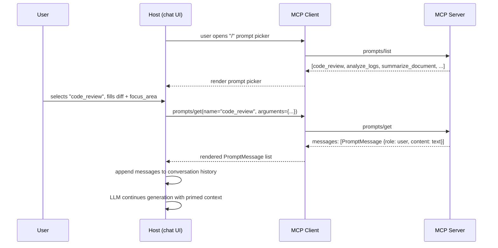

# MCP Prompts

## Learning Objectives

By the end of this chapter you will be able to:

- Explain what a **prompt** is in MCP terms, and why it is a distinct primitive from tools and resources rather than just "a resource containing text"
- Enumerate a prompt over `prompts/list` and retrieve rendered messages over `prompts/get`, including how arguments are declared and passed
- State the exact `PromptMessage` shape (`role` + `content`) and recognize that it reuses the same content union as tools and resources
- Implement server-side prompts with the `@mcp.prompt()` decorator in the `mcp` Python SDK (v1.x), including typed, defaulted arguments
- Build multi-message prompts that prime both the `user` and `assistant` roles, not just a single instruction string
- Judge when a prompt template belongs in MCP at all versus staying as an application-level system prompt or LangChain `ChatPromptTemplate`
- Explain, from experience with real hosts, why prompts are the least-adopted of the three MCP primitives today — and why that is a host-side maturity gap, not a flaw in the primitive itself

## Prerequisites

This chapter assumes you've completed:

- **Chapter 2** (Host/Client/Server architecture) — you should know that a prompt is something a *server* exposes and a *host* surfaces, not something the LLM invents
- **Chapter 3** (Protocol fundamentals) — JSON-RPC request/response shapes, and the classic `initialize` handshake, since the code here assumes an already-initialized `ClientSession`
- **Chapter 4** (MCP Tools) — this chapter deliberately reuses the tool chapter's content-block union (`text`/`image`/`resource`) rather than re-deriving it
- **Chapter 5** (MCP Resources) — useful for contrast: resources hand the model *data*, prompts hand the model (or the human) a *ready-made conversation starter*

You do not need any new background beyond the base course prerequisites (async Python, FastAPI-level comfort with typed function signatures, and general LLM tool-calling familiarity).

## Why a Third Primitive at All?

Tools let the model *do* things. Resources let the model (or the host) *read* things. Prompts solve a narrower, more human-facing problem: **standardizing the exact wording of a recurring interaction** so that every user of a server — and every host that connects to it — gets the same well-crafted starting point instead of everyone reinventing their own ad hoc phrasing.

Concretely, a prompt is a **named, parameterized template that a server owns and a host can offer to a human as a shortcut** — think "slash command" in a chat UI, "saved prompt" in an IDE command palette, or "template" in an internal tools menu. The server declares the prompt's name, its arguments, and (indirectly) the exact sequence of chat messages it produces. The host is responsible for surfacing that template to the user — usually via some kind of picker UI — and, once the user fills in the arguments, injecting the resulting messages into the live conversation.

This is a meaningfully different contract from a tool:

| | Tool | Prompt |
|---|---|---|
| Who decides to invoke it | The **model**, during its reasoning loop | The **user** (or host), before or during a conversation |
| What it returns | Tool-result content fed back to the model as an observation | A list of ready-made chat **messages** to inject directly into the conversation |
| Typical trigger | Model emits a tool call | User picks "/code_review" from a menu, or a host pre-populates a form |
| Analogy | A function call | A saved snippet / slash command / prompt-library entry |

Because a prompt result becomes conversation history rather than a tool observation, it can include `assistant`-role messages too — you can prime not just what the human/model says, but what the assistant is presumed to have already said, priming the model with a stance before it even starts generating.

## The Prompt Object and `prompts/list`

A server advertises its prompts through the `prompts/list` method, which returns an array of prompt objects. Each prompt object has:

- `name` (required) — the stable identifier a client uses to fetch the prompt, e.g. `"code_review"`
- `title` (optional) — a human-friendly display name distinct from `name`, e.g. `"Code Review"`
- `description` (optional) — what the prompt does and when to use it, shown to the user in a picker UI
- `arguments` (optional) — a list of argument descriptors the prompt accepts, each with `name`, `description`, and `required` (boolean)

```json
{"jsonrpc":"2.0","id":10,"method":"prompts/list"}
```

```json
{
  "jsonrpc":"2.0","id":10,
  "result":{
    "prompts":[
      {
        "name":"code_review",
        "title":"Code Review",
        "description":"Produce a focused code-review prompt for a unified diff.",
        "arguments":[
          {"name":"diff","description":"Unified diff text to review","required":true},
          {"name":"focus_area","description":"general | security | performance","required":false}
        ]
      },
      {
        "name":"analyze_logs",
        "title":"Analyze Logs",
        "description":"Triage an error-log excerpt from a named service.",
        "arguments":[
          {"name":"log_excerpt","description":"Raw log lines to analyze","required":true},
          {"name":"service_name","description":"Name of the service that produced the logs","required":false}
        ]
      }
    ]
  }
}
```

Notice how closely this mirrors `tools/list` from Chapter 4: a stable `name`, an optional `title`, a `description`, and a structured way to declare parameters. The server capability that advertises this support is `prompts` (with an optional `listChanged` flag), exchanged during `initialize` — see Chapter 3 if you need a refresher on capability negotiation.

## `prompts/get` and the `PromptMessage` Shape

Once a client (and the human behind it) has picked a prompt and supplied argument values, the client calls `prompts/get`:

```json
{
  "jsonrpc":"2.0","id":11,"method":"prompts/get",
  "params":{
    "name":"code_review",
    "arguments":{"diff":"--- a/app.py\n+++ b/app.py\n@@ ...","focus_area":"security"}
  }
}
```

The server renders the template and returns a list of `PromptMessage` objects:

```json
{
  "jsonrpc":"2.0","id":11,
  "result":{
    "description":"Security-focused review of the supplied diff",
    "messages":[
      {
        "role":"user",
        "content":{
          "type":"text",
          "text":"Review this diff specifically for security vulnerabilities (injection, auth bypass, secrets in code, unsafe deserialization).\n\nDiff:\n```diff\n--- a/app.py\n+++ b/app.py\n@@ ...\n```"
        }
      }
    ]
  }
}
```

Two things to internalize about `PromptMessage`:

1. **`role` is either `"user"` or `"assistant"`** — the same two roles you'd expect in any chat-completions API. There is no `system` role at this layer; if a prompt needs to establish a persona or ground rules, that goes into the text of a `user` message, or the host maps it onto its own system-prompt mechanism when it injects the messages.
2. **`content` reuses the exact same content union as tool results and resource contents** — `{"type": "text", "text": "..."}` today, with `image` and embedded `resource` content blocks equally valid where a prompt needs to hand over a screenshot or a file alongside the instruction text. If you've internalized the content union from Chapters 4–5, there is nothing new to learn here — it's the same shape, reused for a third purpose.

The practical effect: a `prompts/get` call doesn't return "a string to interpolate into a system prompt." It returns **turns of conversation, ready to append to message history as-is.**

## The `@mcp.prompt()` Decorator (FastMCP v1.x)

> **SDK generation:** this section targets the `mcp` Python SDK v1.x line (`pip install "mcp[cli]<2"`), the version essentially every production MCP server and every `langchain-mcp-adapters` integration uses today. The decorator name (`@mcp.prompt()`) is unchanged in SDK v2.0.0, but v2 targets the stateless 2026-07-28 spec — don't mix v1 and v2 imports in the same server.

`FastMCP` turns a plain Python function into a prompt the same way it turns a function into a tool or a resource: decorate it, type-annotate the parameters, and return either a plain string (implicitly wrapped as a single `user`-role message) or a list of message-shaped dicts when you need more control — multiple turns, an `assistant`-role message, or non-text content.

```python
from mcp.server.fastmcp import FastMCP

mcp = FastMCP("Demo")

@mcp.prompt()
def greet_user(name: str, style: str = "friendly") -> str:
    """Generate a greeting prompt in the requested style."""
    styles = {
        "friendly": f"Write a warm, informal greeting for {name}.",
        "formal": f"Write a formal, professional greeting for {name}.",
    }
    return styles.get(style, styles["friendly"])
```

That's the minimal shape: typed parameters, a default value, a docstring FastMCP uses to populate `description`, and a return value FastMCP wraps into the `PromptMessage` list for you. For anything beyond a single instruction line, return the list explicitly — the two worked examples below do exactly that.

> **2026-07-28 spec note:** the fact sheet's confirmed spec deltas call out explicit changes to lifecycle (no more `initialize` handshake), resources (`subscriptions/listen` replaces `resources/subscribe`), and transports (Streamable HTTP loses session IDs). Nothing in the current record indicates the `prompts/list` / `prompts/get` methods or the `PromptMessage` shape themselves changed shape in the stateless redesign — the visible difference for this chapter's examples is that a client would call these methods without ever having called `initialize` first. Treat that as the honest state of things rather than a confirmed guarantee; Chapter 21 owns the full stateless-redesign treatment and is where you should double-check before shipping against SDK v2.

## Examples

### Example 1: `code_review` — full implementation

This is the prompt sketched in `prompts/list` and `prompts/get` above. It takes a required `diff` and an optional `focus_area`, and produces a single, richly-instructed `user` message:

```python
from mcp.server.fastmcp import FastMCP

mcp = FastMCP("Demo")

@mcp.prompt()
def code_review(diff: str, focus_area: str = "general") -> list[dict]:
    """Produce a focused code-review prompt for a unified diff."""
    focus_instructions = {
        "general": (
            "Review this diff for correctness, readability, and "
            "maintainability. Call out anything you'd block on in a real PR review."
        ),
        "security": (
            "Review this diff specifically for security vulnerabilities: "
            "injection, auth bypass, secrets committed in code, unsafe "
            "deserialization, and missing input validation."
        ),
        "performance": (
            "Review this diff specifically for performance regressions: "
            "unnecessary N+1 queries, unbounded loops over large collections, "
            "and missing indexes implied by new query patterns."
        ),
    }
    instruction = focus_instructions.get(focus_area, focus_instructions["general"])

    return [
        {
            "role": "user",
            "content": {
                "type": "text",
                "text": f"{instruction}\n\nDiff:\n```diff\n{diff}\n```",
            },
        }
    ]
```

Note the pattern: `focus_area` doesn't change *what* the model is asked to look at structurally — it changes *which pre-written instruction paragraph* gets prepended. This is the essence of a good prompt template: the server owns and version-controls the wording; callers only supply the variable parts.

### Example 2: `analyze_logs` — full implementation, multi-message

This example demonstrates the less-obvious capability of prompts: returning **more than one message**, including an `assistant`-role message that primes the model's stance before it produces its own first turn.

```python
@mcp.prompt()
def analyze_logs(log_excerpt: str, service_name: str = "unknown-service") -> list[dict]:
    """Generate a triage prompt for an error-log excerpt from a named service."""
    return [
        {
            "role": "user",
            "content": {
                "type": "text",
                "text": (
                    f"You are debugging {service_name}. Analyze the following "
                    "log excerpt, identify the most likely root cause, and "
                    f"propose a concrete fix.\n\nLogs:\n{log_excerpt}"
                ),
            },
        },
        {
            "role": "assistant",
            "content": {
                "type": "text",
                "text": (
                    "Understood. I'll walk through the log excerpt in order, "
                    "identify the first anomalous entry, trace the probable "
                    "root cause, and finish with a concrete remediation step."
                ),
            },
        },
    ]
```

The pre-seeded `assistant` message costs the caller nothing extra, but it constrains *how* the model responds next — it commits the model to a structured "first anomaly → root cause → fix" shape before generation even starts, which is a cheap and effective way to reduce variance across repeated uses of the same prompt across a team.

### Two more prompts, briefly

You won't always need the full multi-message treatment. `summarize_document` and `explain_error` are good examples of prompts that are valuable purely because they standardize wording, not because they need structural complexity:

```python
@mcp.prompt()
def summarize_document(document_text: str, max_bullets: int = 5) -> str:
    """Summarize a document into a fixed number of bullet points."""
    return (
        f"Summarize the following document in at most {max_bullets} bullet "
        f"points, ordered by importance:\n\n{document_text}"
    )


@mcp.prompt()
def explain_error(stack_trace: str, audience: str = "engineer") -> str:
    """Explain a stack trace for the given audience level."""
    audiences = {
        "engineer": "Explain the root cause and the exact line/frame responsible.",
        "junior": "Explain in plain language what went wrong and why, avoiding jargon.",
        "non_technical": "Explain, without any code or jargon, what this means for the user.",
    }
    instruction = audiences.get(audience, audiences["engineer"])
    return f"{instruction}\n\nStack trace:\n{stack_trace}"
```

Both return a plain `str`, which FastMCP wraps as a single `user`-role `PromptMessage` automatically — the same implicit behavior shown in the `greet_user` example above. Reach for the explicit list-of-dicts form only when you need multiple turns, an `assistant`-role message, or non-text content blocks.

### Prompts can carry more than text

Because `content` is the same union used by tools and resources, a prompt is free to hand back an embedded resource or an image alongside its instruction text — useful when the template's job is "review this artifact" rather than "review this string." For example, a `review_screenshot` prompt might embed a resource block pointing at a UI mockup:

```python
@mcp.prompt()
def review_screenshot(resource_uri: str, checklist: str = "accessibility") -> list[dict]:
    """Ask for a UI review of an already-registered resource, against a named checklist."""
    return [
        {
            "role": "user",
            "content": {
                "type": "text",
                "text": f"Review the attached screenshot against the {checklist} checklist.",
            },
        },
        {
            "role": "user",
            "content": {
                "type": "resource",
                "resource": {"uri": resource_uri},
            },
        },
    ]
```

This mirrors Chapter 5's embedded-resource content block exactly — a prompt is simply another place that same union shows up, this time as one turn among several rather than as a tool result.

## Argument Validation and Error Behavior

`arguments` in the prompt object is advisory metadata for humans and host UIs — it tells a picker which fields to render and which are required — but the server function itself is still an ordinary typed Python function. Two consequences follow:

- If a required argument is omitted, the call fails as a protocol-level error (the same category of error Chapter 11 covers for malformed tool calls) rather than silently proceeding with a missing value.
- If you want defaults, declare them the normal Python way (`focus_area: str = "general"`), and mark the corresponding entry in your understanding of `arguments` as `required: false` — FastMCP derives this from your function signature, so keep the two in sync by construction rather than hand-maintaining a separate list.

As with tool schemas (Chapter 10), the discipline that pays off here is keeping the argument list small, giving every optional argument a sensible default, and writing `description` text that would make sense to a person filling out a form — because, unlike a tool call, a human is often the one filling it in.

## Prompts and LangChain: A Preview

Full LangChain/LangGraph integration is Chapter 17's job, but it's worth previewing one thing now so you're not surprised later: `langchain-mcp-adapters` treats prompts as a first-class citizen, not just tools.

```python
from langchain_mcp_adapters.prompts import load_mcp_prompt

# session: an existing ClientSession, as built in Chapter 9
messages = await load_mcp_prompt(
    session,
    "code_review",
    arguments={"diff": diff_text, "focus_area": "security"},
)
```

`load_mcp_prompt` calls `prompts/get` under the hood and maps the returned `PromptMessage` list directly onto LangChain's own message types: `role: "user"` becomes a `HumanMessage`, `role: "assistant"` becomes an `AIMessage`. That mapping is exactly why the role vocabulary matters — it's designed to drop straight into any chat-message-based framework without a translation layer. Once you have a `list[HumanMessage | AIMessage]`, you can splice it directly into a LangGraph state's message list alongside whatever the graph has already accumulated.

## Prompt List Changes

A server that expects its prompt library to change at runtime — for example, one that loads templates from a database or a shared config repo — advertises this with the `listChanged` flag under its `prompts` capability during `initialize` (see Chapter 3's capability table). When the underlying set of prompts changes, the server sends a `notifications/prompts/list_changed` notification, and a well-behaved client re-issues `prompts/list` to refresh whatever picker UI it's showing the user. This follows the identical pattern used for `notifications/resources/list_changed` in Chapter 5 — the same "declare the capability, then notify on change" convention shows up for all three primitives.

In practice this matters most for the "internal prompt library" use case described below: a platform team can push a wording fix to `analyze_logs` and have every connected host's picker refresh without anyone restarting their client.

## Tools, Resources, and Prompts, Side by Side

Now that you've seen all three primitives across Chapters 4–6, it's worth fixing the distinctions in one place:

| | Tools (Ch. 4) | Resources (Ch. 5) | Prompts (this chapter) |
|---|---|---|---|
| List method | `tools/list` | `resources/list` (+ `resources/templates/list`) | `prompts/list` |
| Fetch/invoke method | `tools/call` | `resources/read` | `prompts/get` |
| Who triggers it | The model | The model or the host | The user, via the host |
| Result shape | `content` blocks + `isError` | `contents` (text/blob) | `messages` (list of `PromptMessage`) |
| Becomes... | A tool observation fed back to the model | Context attached to the conversation | Conversation turns, injected directly |
| Change notification | `notifications/tools/list_changed` | `notifications/resources/list_changed` | `notifications/prompts/list_changed` |

If you remember one thing from this table, make it the "who triggers it" row — it's the cleanest way to decide which primitive a new capability belongs in before you write a line of code.

## Conceptual Flow: From Discovery to Injected Context



The important detail this diagram makes visible: **the messages don't go to the model as a tool result.** They're spliced directly into conversation history, exactly as if the user (or, for `assistant`-role messages, the model itself) had typed them. By the time the model's next turn runs, it has no way to distinguish a prompt-injected message from one a human typed by hand — which is precisely the point.

## Real-World Scenario

A platform team at a mid-size company runs a dozen internal services, each with its own quirky error-log format. Every on-call engineer has their own personal collection of "paste the stack trace, ask Claude to explain it" prompts saved in scratch files, Slack snippets, or their own head. The wording drifts, the quality is inconsistent, and new hires start from zero.

The team stands up one internal MCP server — `internal-prompts` — that exposes `analyze_logs`, `explain_error`, `code_review`, and a handful of others as MCP prompts, each tuned with the team's actual conventions (their log format, their severity taxonomy, their PR review checklist). Any engineer using an MCP-compatible IDE assistant, chat host, or CLI tool now gets the *same* vetted prompt, versioned in the server's source code like any other artifact, instead of everyone's ad hoc phrasing. When the on-call runbook improves, one edit to `analyze_logs` propagates to every host and every engineer the next time they call `prompts/get` — no need to hunt down and update a dozen personal snippet files.

This is the pattern prompts are actually good for: **standardizing a team or organization's prompt library across every MCP-compatible tool**, the same way a shared tools/resources server standardizes access to internal data and internal actions.

## Best Practices

- **Keep prompt arguments minimal and typed.** Every argument you add is a decision the human (or host UI) has to make before they can use the shortcut. Prefer a small number of well-chosen defaults (`focus_area: str = "general"`) over forcing the caller to fill in everything.
- **Write `description` for the picker UI, not for the model.** A prompt's `description` is shown to a human choosing between prompts — write it like a menu label ("Security-focused diff review"), not like an instruction to an LLM.
- **Use `assistant`-role messages deliberately, not by default.** Priming the assistant's first turn is powerful for enforcing a response structure, but it also removes a degree of freedom from the model. Reserve it for prompts where consistency of output shape genuinely matters (triage reports, structured reviews) rather than using it everywhere out of habit.
- **Version prompts like code.** Because a prompt's wording is what standardizes a team's practice, treat edits to it with the same review rigor as a change to a shared library function — a silent wording change can silently change what your team's on-call reports look like.
- **Don't put secrets or dynamic system state in prompt templates.** A prompt's job is to shape the conversation's *wording*, not to smuggle in live data — that's what resources and tool results are for. If `analyze_logs` needs the actual, current log lines, take them as an argument (as shown above) rather than having the prompt function reach out and fetch them itself; keep the boundary between "render a template" and "fetch live data" clean.
- **Test prompts with MCP Inspector before wiring them into a host.** Because prompts are user/host-facing rather than model-facing, it's easy to only discover awkward phrasing or a missing argument once a real user hits it. Chapter 12 covers using MCP Inspector's prompt panel for exactly this.

## Common Mistakes

- **Treating a prompt as a resource with a template string.** A resource hands back data (`resources/read`); a prompt hands back conversation turns (`prompts/get` → `messages`). If what you're building is "fetch this document's content," that's a resource, not a prompt — even if the content happens to be text.
- **Forgetting that `content` uses the same union as tools/resources.** A common bug is returning a bare string where a `content` object is expected (`{"role": "user", "content": "some text"}` instead of `{"role": "user", "content": {"type": "text", "text": "some text"}}`). FastMCP's string-return shorthand handles this for you at the top level, but if you're hand-building message dicts (as in the multi-message examples above), the inner `content` field still needs the full `{"type": "text", "text": "..."}` shape.
- **Assuming every host has a prompt picker UI.** As of this writing, most MCP hosts have solid tool-calling and reasonable resource browsing, but prompt discovery UI is inconsistent or absent — see the discussion below. Don't design a feature that's *only* reachable via a prompt if your target hosts don't support prompt discovery yet; expose the same capability as a tool too if it needs to be reliably reachable.
- **Overloading one prompt with too many optional arguments.** A prompt with eight optional knobs stops being a "quick shortcut" and becomes a form to fill out — at that point, plain tool-calling with a well-designed schema (Chapter 10) is usually the better fit.
- **Baking host-specific formatting into the prompt's text.** A prompt server doesn't know if the host renders Markdown, plain text, or something else. Keep the returned text portable (plain prose, fenced code blocks for code) rather than assuming a specific rendering surface.

## Why Prompts Are the Least-Used Primitive

If you've spent time with Claude's MCP integrations, VS Code's MCP support, or LangChain's `MultiServerMCPClient`, you've likely built and consumed far more tools and resources than prompts. That's not an accident of this course's ordering — it reflects where the ecosystem actually is:

- **Tool-calling is universal in every LLM API**, so every host already has the plumbing to expose "the model can call functions." Prompts require a *separate* piece of host UI — a picker, a slash-command menu, a saved-prompt list — that many hosts simply haven't built yet, or have built inconsistently.
- **Resources map cleanly onto "attach a file" or "give the model this context,"** a UX pattern hosts already had before MCP existed. Prompts map onto "let the user pick from a library of saved instructions," a rarer UX pattern outside of IDEs and specialized chat tools.
- **The value of prompts is organizational, not individual.** A single developer working alone gets less obvious benefit from a `prompts/get` round-trip than from just typing their instruction directly — the payoff shows up at the *team* level, once dozens of people are meant to reuse the exact same vetted wording (as in the on-call scenario above), and that payoff only materializes once host tooling catches up.

None of this makes prompts a wasted primitive to learn — it means their value is currently more visible in **internal, org-standardizing MCP servers** than in the flashier tool/resource integrations you'll see demoed most often. As host-side prompt-picker UIs mature, expect this primitive's real-world usage to grow closer to parity with tools and resources.

## Summary

- Prompts are MCP's third primitive: **server-owned, human/host-facing templates** that render into ready-to-inject chat messages, distinct from tools (model-invoked actions) and resources (read-only context data).
- Discovery and retrieval use two methods: `prompts/list` (returns prompt objects with `name`, `title`, `description`, `arguments`) and `prompts/get` (takes `name` + `arguments`, returns rendered `messages`).
- Every message returned by `prompts/get` is a `PromptMessage`: `{"role": "user"|"assistant", "content": {...}}`, reusing the exact same content union as tools and resources.
- In the `mcp` Python SDK v1.x, `@mcp.prompt()` turns a typed function into a prompt; return a plain `str` for a single implicit `user` message, or a list of role/content dicts for multi-message, multi-role prompts.
- Prompts are the least-adopted primitive today mainly because host-side prompt-discovery UI lags behind tool-calling and resource-attachment UX — not because the primitive itself is weak.
- The clearest win for prompts is standardizing a team or organization's prompt library so every MCP-compatible host gets identical, versioned wording instead of scattered personal snippets.

## Knowledge Check

1. A colleague says "I'll just make my prompt a resource that returns the instruction text as a string." What's wrong with that plan, and what does using an actual prompt gain them that a resource wouldn't?
2. What are the three required/optional fields on a prompt object returned by `prompts/list`, and what does each `arguments` entry contain?
3. Write out, from memory, the exact shape of a single `PromptMessage` with `role: "assistant"` and a text body. Which field's type is shared with tool results and resource contents?
4. Why might a prompt want to include an `assistant`-role message in its returned list, and what's the risk of overusing this technique?
5. Name two concrete reasons prompts see less real-world adoption than tools or resources, independent of the primitive's own design.
6. Under the classic (2025-06-18) lifecycle, what capability key does a server advertise during `initialize` to signal prompt support, and what optional flag can accompany it?

## Hands-On Exercise

Extend a `FastMCP` server (reuse the one from Chapters 4–5, or start a fresh `FastMCP("PromptsDemo")`) with three prompts:

1. `code_review(diff: str, focus_area: str = "general")` — implement it as shown in this chapter, then add a third `focus_area` option of your own (e.g. `"testing"`, asking the reviewer to specifically flag missing test coverage).
2. `analyze_logs(log_excerpt: str, service_name: str = "unknown-service")` — implement the multi-message version from this chapter, then modify it to accept a fourth argument, `severity_hint: str = "unknown"`, and fold it into the `user` message's instructions.
3. One prompt of your own design (not covered in this chapter) for a workflow you actually use — e.g. `write_commit_message(diff: str, ticket_id: str = "")` or `draft_incident_summary(timeline: str, service_name: str)`.

Then:

- Launch MCP Inspector (`npx @modelcontextprotocol/inspector` or `uv run mcp dev server.py`) and use its prompt panel to call `prompts/list`, confirm all three prompts appear with the arguments you declared, then call `prompts/get` on each with sample arguments and inspect the raw `messages` array in the JSON pane.
- Verify that omitting a required argument produces a clear error, and that omitting an optional argument falls back to your declared default.
- Write down, in one or two sentences per prompt, who on a real team would actually use this prompt and why a standardized version (versus everyone writing their own) is worth having.

## Further Reading

- Official spec — Prompts: `modelcontextprotocol.io/specification` (check the revision selector; this chapter follows 2025-06-18)
- `github.com/modelcontextprotocol/python-sdk` — source for `FastMCP` and the `@mcp.prompt()` decorator
- `github.com/modelcontextprotocol/inspector` — for interactively testing `prompts/list` / `prompts/get` outside any LLM host
- Chapter 4 (MCP Tools) — for the shared content-block union this chapter reuses
- Chapter 5 (MCP Resources) — for contrast between "data the model reads" and "conversation the model continues"
- Chapter 21 (The Stateless Redesign) — to confirm the current state of prompt-related methods under the 2026-07-28 spec before shipping against SDK v2

<div style="display:flex;justify-content:space-between;align-items:center;">
  <a href="./05-mcp-resources.md">← Previous: MCP Resources</a>
  <a href="./00-index.md">🏠 Index</a>
  <a href="./07-building-mcp-servers.md">Next: Building MCP Servers →</a>
</div>
