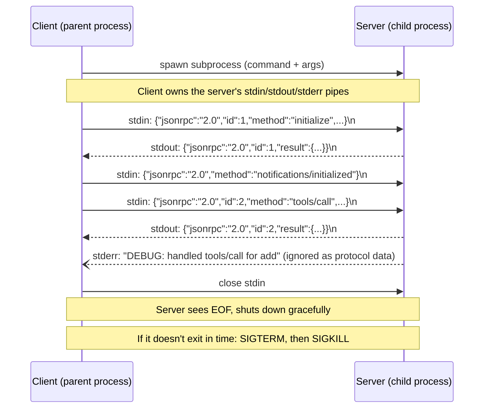
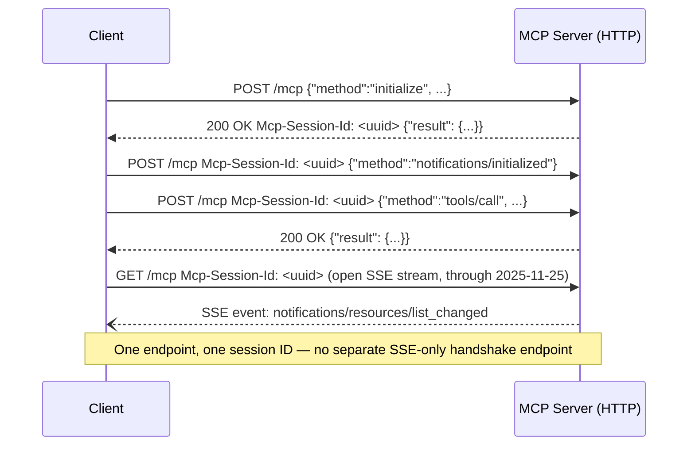

# Transport Mechanisms

## Learning Objectives

By the end of this chapter, you will be able to:

- Explain precisely what "transport" means in MCP's layering — the boundary between the wire-level JSON-RPC 2.0
  message format (fixed, Chapter 3) and how those messages physically travel between client and server
- Describe the **stdio** transport mechanically: subprocess spawning, newline-delimited JSON-RPC framing over
  stdin/stdout, and why stderr — not stdout — is the only safe channel for a server's own logging
- Diagnose, from first principles, why a stray `print()` statement inside a stdio server silently corrupts the
  protocol stream, and why this is one of the most common "why did my MCP server just stop working" bugs
- Trace the history of MCP's HTTP-based transports: legacy **HTTP+SSE** (2024-11-05) → **Streamable HTTP**
  (2025-03-26, current classic) → the further-stripped Streamable HTTP of the 2026-07-28 stateless redesign
- State exactly what changed and why at each of those three points, instead of treating "MCP over HTTP" as one
  undifferentiated thing
- Choose the correct transport for a given deployment shape — local dev tool vs. single-user desktop integration
  vs. multi-tenant production service — and justify the choice
- Configure both a stdio-launched server and a Streamable HTTP server from the client side, using
  `MultiServerMCPClient`'s `transport` field

---

## Prerequisites for This Chapter

This chapter builds directly on:

- **Chapter 3 (Protocol Fundamentals & Lifecycle)** — you should already know that MCP's message format is
  JSON-RPC 2.0 regardless of transport, and that `initialize`/`initialized` is the classic handshake that rides
  on top of whichever transport is in use. This chapter does not re-explain JSON-RPC framing rules; it explains
  how the bytes carrying those JSON-RPC messages actually move.
- **Chapter 7 (Building MCP Servers)** — you should be comfortable with `FastMCP`, `@mcp.tool()`, and the general
  shape of a v1.x server project. This chapter reuses that server without re-deriving its structure.
- The fact-sheet convention this course uses throughout: **classic protocol** (2024-11-05 through 2025-11-25,
  taught hands-on) versus the **2026-07-28 stateless redesign** (Chapter 21, mentioned here only where the
  transport layer itself changed).

This chapter does **not** cover authentication over HTTP transports (Chapter 13 owns OAuth 2.1, PKCE, and
Protected Resource Metadata) or production concerns like load balancing and connection pooling across many
Streamable HTTP clients (Chapter 20). Its job is narrower: understand exactly how bytes move between a client and
a server, for each of the transports MCP defines.

---

## 1. What "Transport" Means Here

Chapter 3 established that every MCP message — request, response, or notification — is a JSON-RPC 2.0 object.
That much never changes across transports. What *does* change is the physical channel those JSON-RPC objects
travel over, and the framing rules for telling where one message ends and the next begins.

MCP defines exactly two standard transports today, plus one deprecated legacy transport you'll still encounter in
older servers:

| Transport | Introduced | Status | Physical channel |
|---|---|---|---|
| **stdio** | 2024-11-05 | Current, primary for local use | Subprocess stdin/stdout |
| **HTTP+SSE** | 2024-11-05 | **Deprecated** (formally, SEP-2596, 2026-07-28) | HTTP POST + a separate SSE GET stream |
| **Streamable HTTP** | 2025-03-26 | Current, primary for remote/production use | Single HTTP endpoint, POST (+ optional GET through 2025-11-25) |

Do not go looking for a "WebSocket transport" or a "gRPC transport" in the standard — they don't exist in the
spec. (`langchain-mcp-adapters`' config accepts a `"websocket"` value as a convenience/experimental option on the
client side, but it is not one of the two standard transports the MCP specification itself defines — treat it as
outside this chapter's scope.)

Every transport's job is the same three things: (1) deliver JSON-RPC messages from client to server, (2) deliver
JSON-RPC messages (responses and server-initiated notifications) from server to client, and (3) do so without
corrupting or interleaving message boundaries. How each transport satisfies those three requirements is where the
real differences — and the real bugs — live.

---

## 2. The stdio Transport

### 2.1 The mental model: your server is a subprocess

With stdio, there is no network involved at all. The **client spawns the server as a child process** — the same
way you'd launch any other command-line program — and communicates with it purely through that process's
standard streams:

- **stdin** — the client writes JSON-RPC requests/notifications here; the server reads them.
- **stdout** — the server writes JSON-RPC responses/notifications here; the client reads them.
- **stderr** — free for the server's own logging; the client does not treat anything written here as protocol
  traffic.

Framing is simple: each JSON-RPC message is written as one line of JSON, terminated by a newline
(`\n`). The reader on the other end reads a line at a time and parses it as one complete JSON-RPC object.
There is no length prefix, no delimiter byte sequence beyond the newline — the entire framing contract rests on
"exactly one JSON object per line, and nothing else touches this stream."



### 2.2 The rule that trips everyone up: stdout is sacred

The single most important operational rule for a stdio server, stated exactly as the spec requires it:

> **The server MUST NOT write anything to stdout that is not a valid MCP message.**

This sounds obvious in the abstract and then bites almost everyone the first time they debug a stdio server the
way they'd debug any other Python script — by adding a `print()`.

Here's the failure mode concretely. A tool implementation misbehaves, so you add a diagnostic line:

```python
from mcp.server.fastmcp import FastMCP

mcp = FastMCP("Demo")

@mcp.tool()
def add(a: int, b: int) -> int:
    """Add two numbers"""
    print(f"DEBUG: add called with a={a}, b={b}")   # looks harmless — it is not
    return a + b
```

That `print()` writes to **stdout** by default — the exact same stream the server uses to send JSON-RPC
responses back to the client. The moment this tool runs, the client's stdio reader receives a line that is not
valid JSON-RPC. Depending on the client implementation, this manifests as anything from a parse error killing the
connection to a subtly corrupted message boundary where the *next* legitimate JSON-RPC line gets concatenated
with the debug text and fails to parse. Either way, the symptom the developer sees is confusing and detached from
the actual cause: "my server randomly disconnects" or "tool calls started timing out" — not an obvious `print()`
statement three files away.

The fix is equally simple once you know the rule: **route all logging to stderr**, never stdout.

```python
import sys
from mcp.server.fastmcp import FastMCP

mcp = FastMCP("Demo")

@mcp.tool()
def add(a: int, b: int) -> int:
    """Add two numbers"""
    print(f"DEBUG: add called with a={a}, b={b}", file=sys.stderr)  # safe
    return a + b
```

Or, better, use Python's `logging` module configured with a `StreamHandler(sys.stderr)` (the standard library's
default for unconfigured loggers already goes to stderr, but don't rely on that implicitly in a codebase where
someone might reconfigure logging globally later — be explicit).

This is why the fact sheet's framing of the constraint matters as a rule to *internalize*, not just memorize:
**any output library, print statement, warning, or accidentally-unsilenced third-party dependency that writes to
stdout inside a stdio server's process is a protocol-breaking bug**, full stop, regardless of whether the write
"looks harmless." A library that prints a deprecation warning to stdout on import, invoked from inside your
server process, is exactly as dangerous as your own debug `print()`.

### 2.3 Shutdown sequence

Chapter 3 covered lifecycle events at the message level; here's the stdio-specific mechanical sequence:

1. The client closes the server's **stdin**.
2. The server, seeing EOF on stdin, is expected to finish any in-flight work and exit cleanly.
3. If the server doesn't exit within a reasonable window, the client escalates to **SIGTERM**.
4. If that still doesn't work, the client escalates to **SIGKILL**.

This graceful-then-forceful escalation is why a well-behaved stdio server should treat EOF on stdin as its
primary shutdown signal, rather than relying on the client sending SIGTERM as the *first* thing it tries.

### 2.4 Launching a stdio server

From the server side, a v1.x FastMCP server typically ends its script with a call that starts the server loop
listening on stdio:

```python
# server.py — v1.x SDK (mcp>=1.28,<2)
from mcp.server.fastmcp import FastMCP

mcp = FastMCP("Demo")

@mcp.tool()
def add(a: int, b: int) -> int:
    """Add two numbers"""
    return a + b

if __name__ == "__main__":
    mcp.run(transport="stdio")  # illustrative — check your installed SDK version's
                                 # exact run()/transport-argument surface before relying on this literally
```

> **Illustrative code note:** the fact sheet this course is built from confirms `FastMCP`'s decorator API
> (`@mcp.tool()`, `@mcp.resource()`, `@mcp.prompt()`) precisely, but does not pin down the exact keyword surface
> of a `run()`/serve entry point. The pattern above — a `run(transport=...)`-style call — matches the
> conventional shape used across the FastMCP ecosystem (both the SDK-bundled version and the standalone
> `PrefectHQ/fastmcp` project), but treat it as illustrative and confirm the exact signature against your
> installed SDK version's own documentation rather than copying it as gospel.

From the **client** side, this is exactly the shape you build a `ClientSession` over: spawn the subprocess, then
speak JSON-RPC over its pipes.

```python
# client.py — v1.x SDK
from mcp import ClientSession, StdioServerParameters
from mcp.client.stdio import stdio_client

server_params = StdioServerParameters(
    command="python",
    args=["server.py"],
)

async with stdio_client(server_params) as (read, write):
    async with ClientSession(read, write) as session:
        await session.initialize()
        tools = await session.list_tools()
        result = await session.call_tool("add", arguments={"a": 5, "b": 3})
```

And the same thing expressed through `langchain-mcp-adapters`' `MultiServerMCPClient`, which is the form you'll
use in almost every LangGraph/DeepAgents integration in this course:

```python
from langchain_mcp_adapters.client import MultiServerMCPClient

client = MultiServerMCPClient(
    {
        "math": {
            "command": "python",
            "args": ["/path/to/math_server.py"],
            "transport": "stdio",
        },
    }
)
tools = await client.get_tools()
```

Notice there is no URL, no port, no host anywhere in this configuration — `command`/`args` (plus optional `env`
and `cwd`) are the entirety of what's needed, because the "connection" is just "spawn this program."

---

## 2.5. Spec-note callout: stdio and statelessness

> **2026-07-28 spec note:** the stateless redesign explicitly calls out stdio as an example of why "connection" and
> "session" are being decoupled from the protocol's semantics: *"an open connection, such as a STDIO process, is
> not a conversation or session."* Mechanically, nothing about stdio's framing (newline-delimited JSON-RPC over
> stdin/stdout, stderr for logs) changes — what changes is that the protocol no longer treats the lifetime of that
> subprocess connection as implying any stateful handshake or session identity riding on top of it. Every request
> is meant to be self-describing regardless of which transport carries it.

---

## 3. Streamable HTTP

### 3.1 Why it exists, and what it replaced

Streamable HTTP was introduced in the **2025-03-26** spec revision, specifically to replace the original
**HTTP+SSE** transport from 2024-11-05 (covered in Section 4). The core idea: a **single HTTP endpoint** handles
both directions of MCP traffic, rather than splitting the conversation across a POST endpoint and a separate
long-lived SSE GET stream.

Mechanically, through the **2025-11-25** revision (the latest "classic" state before the 2026-07-28 redesign):

- The client sends JSON-RPC requests as **HTTP POST** bodies to the single MCP endpoint.
- The client MAY also open an **HTTP GET** request to that same endpoint to receive a server-initiated SSE stream
  — this is how the server pushes notifications (like `notifications/tools/list_changed`) to the client without
  the client having to poll.
- An optional **`Mcp-Session-Id`** header, set by the server on the `initialize` response and echoed by the
  client on subsequent requests, correlates a sequence of HTTP requests with one logical MCP session.



This single-endpoint design is the whole point of the name: instead of one endpoint for the client-to-server
direction and a structurally different one for server-to-client push, Streamable HTTP treats both directions as
variations on talking to the same URL.

### 3.2 Spec-note callout: the 2026-07-28 strip-down

> **2026-07-28 spec note:** in step with the broader statelessness push, Streamable HTTP itself gets
> significantly leaner in the current spec revision. Specifically removed: the **GET stream endpoint** entirely
> (no more opening a long-lived SSE GET for server push), **`Mcp-Session-Id`** and the notion of an HTTP-level
> session altogether, and **`Last-Event-ID`**-based resumability (which existed to let a client reconnect an SSE
> stream and resume from where it left off). In exchange, every POST request must now carry an
> **`MCP-Protocol-Version`** header, since there's no `initialize` handshake left to negotiate a version once at
> the start of a session. This is a deliberate trade: the classic transport optimized for a long-lived,
> session-correlated conversation; the 2026-07-28 transport optimizes for every request being independently
> self-describing, at the cost of the server-push-over-GET convenience.

Because the ecosystem you'll actually build against today (`langchain-mcp-adapters`, `deepagents`, the `mcp` SDK
v1.x line) implements the classic model, the session-ID-bearing, GET-stream-capable version above is what you
should expect to build and debug against in practice — but don't be surprised when you eventually meet a v2.0.0
server that has none of that session machinery.

### 3.3 Launching a Streamable HTTP server

```python
# server.py — v1.x SDK (mcp>=1.28,<2)
from mcp.server.fastmcp import FastMCP

mcp = FastMCP("Weather")

@mcp.tool()
def get_forecast(city: str) -> str:
    """Get a weather forecast for a city"""
    return f"Sunny in {city}"

if __name__ == "__main__":
    mcp.run(transport="streamable-http")  # illustrative — see the same caveat as Section 2.4;
                                            # confirm the exact transport-string and host/port
                                            # keyword arguments against your installed SDK version
```

Client-side import for the classic transport, confirmed at the fact-sheet level: `from mcp.client.streamable_http
import streamable_http_client`. And the same server, wired up through `MultiServerMCPClient`:

```python
from langchain_mcp_adapters.client import MultiServerMCPClient

client = MultiServerMCPClient(
    {
        "weather": {
            "url": "http://localhost:8000/mcp",
            "transport": "streamable_http",
        },
    }
)
tools = await client.get_tools()
```

Notice the shape difference from the stdio config in Section 2.4: `url` instead of `command`/`args`. This isn't
a cosmetic detail — it reflects that a Streamable HTTP server is a **long-running, independently-deployed
service** the client connects to over the network, not a program the client spawns and owns the lifetime of. The
HTTP-side config also accepts `headers` (e.g. `Authorization: Bearer ...` — Chapter 13's territory),
`timeout`, `sse_read_timeout`, and an `auth`/`httpx_client_factory` pair for advanced HTTP-client customization.

---

## 4. Legacy HTTP+SSE Transport

### 4.1 Where it came from

HTTP+SSE was MCP's **original** remote transport, part of the initial **2024-11-05** spec. Before Streamable
HTTP consolidated everything into one endpoint, HTTP+SSE split the conversation across two structurally different
pieces: a request/response endpoint for client-to-server traffic, and a separate Server-Sent Events stream for
server-to-client push — SSE being a natural fit at the time because it's a simple, standard, long-lived
one-directional stream over plain HTTP, without needing a full WebSocket upgrade.

### 4.2 Why you should not build on it today

The practical deprecation of HTTP+SSE happened well before it became official policy:

- **2025-03-26** — Streamable HTTP replaces it as the recommended remote transport. From this point on, HTTP+SSE
  was deprecated *in practice*, even though the spec hadn't yet used that exact word.
- **2026-07-28** — HTTP+SSE formally enters the **Deprecated** feature-lifecycle state under **SEP-2596**, with
  spec language stating plainly: *"New implementations SHOULD NOT adopt it... eligible for removal in a future
  revision."*

The practical guidance for this chapter, stated as directly as the fact sheet states it: **do not build new
servers on HTTP+SSE.** If you inherit an existing server that still speaks it, understand that it's a
maintenance-mode transport, not a foundation to extend. The v1.x SDK's own client import naming makes the
intent explicit — `from mcp.client.sse import sse_client` ships labeled internally as "legacy; prefer Streamable
HTTP for new servers." If you see `sse_client` show up in a codebase you're reading, treat it as a signal the
server predates 2025-03-26, or was written by someone who hadn't yet migrated off the old transport.

The `langchain-mcp-adapters` config format still accepts `"transport": "sse"` as a valid value for exactly this
reason — plenty of currently-running servers still speak it — but choosing it for a *new* server you're building
today is choosing to start already behind the deprecation curve.

---

## 5. Local vs. Remote Architecture

Pulling stdio and Streamable HTTP together, the shape of "local" vs. "remote" MCP deployments looks structurally
different — not just in transport choice, but in where the server actually lives relative to the host process.

```mermaid
flowchart TB
    subgraph Local["Local deployment — stdio"]
        H1[Host process<br/>e.g. Claude Desktop, your CLI agent]
        C1[Client]
        P1[["Process transport<br/>(stdin/stdout pipes)"]]
        S1[MCP Server<br/>child process on same machine]
        H1 --> C1
        C1 <-->|spawns + pipes| P1
        P1 <--> S1
        S1 -.->|reads/writes locally| FS[(Local filesystem,<br/>local DB, local tools)]
    end

    subgraph Remote["Remote deployment — Streamable HTTP"]
        H2[Host process<br/>e.g. your agent backend]
        C2[Client]
        HTTP[["HTTP<br/>(POST to one endpoint)"]]
        S2[MCP Server<br/>independently deployed service]
        Cloud[(Cloud services:<br/>databases, SaaS APIs,<br/>internal microservices)]
        H2 --> C2
        C2 <-->|network request/response| HTTP
        HTTP <--> S2
        S2 --> Cloud
    end
```



The distinction to internalize: with stdio, the client **owns the server's process lifetime** — it spawned it,
it can kill it, and there's no meaningful sense in which the server exists independently of this one client
connection. With Streamable HTTP, the server is an **independently running service** that may already be serving
other clients, sitting behind whatever infrastructure (load balancer, auth gateway, container orchestration) a
normal HTTP service sits behind, and reaching further out to cloud services and shared data stores the local-only
stdio model has no equivalent for.

---

## 6. Choosing a Transport in Practice

| Scenario | Transport | Why |
|---|---|---|
| Local dev tool you're building/debugging on your own machine | **stdio** | Zero network config, zero auth to stand up, the client already trusts a process it spawned itself |
| Single-user desktop integration (e.g. an IDE plugin, a personal Claude Desktop config) | **stdio** | The server only ever needs to serve the one user running the host application; no multi-tenancy concern exists |
| A server multiple teammates or multiple agent instances need to share | **Streamable HTTP** | stdio has no notion of "many clients talking to one running server" — every client gets its own spawned process; a shared server needs to actually be a persistent, independently reachable service |
| Production / multi-tenant deployment | **Streamable HTTP** | Only an HTTP-reachable service can sit behind the auth, rate limiting, and observability infrastructure Chapters 13, 14, and 20 build on top of |
| A server that must reach cloud databases, internal microservices, or SaaS APIs on behalf of many callers | **Streamable HTTP** | This is exactly the "Remote" shape from Section 5's diagram — the server needs to run as its own persistent service with its own network access and credentials, not as an ephemeral subprocess of each caller |

The rule of thumb worth internalizing: **stdio answers "how does my host talk to a helper program running
alongside it"; Streamable HTTP answers "how does my host talk to a service."** If you find yourself trying to
make a stdio server serve more than one user or client at a time, that's a strong signal you've picked the wrong
transport for the deployment shape you actually have — not a problem to solve with more process-management
cleverness on top of stdio.

---

## Examples

### Example 1 — the print() bug, reproduced and fixed

A minimal reproduction of Section 2.2's failure mode, worth running yourself once so the failure mode is
concrete rather than theoretical.

```python
# broken_server.py — DO NOT deploy this; illustrates the bug
from mcp.server.fastmcp import FastMCP

mcp = FastMCP("Broken")

@mcp.tool()
def echo(text: str) -> str:
    """Echo the input text back"""
    print(f"echo called with: {text}")  # writes to stdout — corrupts the JSON-RPC stream
    return text

if __name__ == "__main__":
    mcp.run(transport="stdio")
```

Connect to this with the MCP Inspector (`npx @modelcontextprotocol/inspector`, covered fully in Chapter 12) or
any `ClientSession`-based client, call `echo`, and watch the client-side parser choke on the interleaved debug
line — or, worse, silently misparse a subsequent message boundary depending on timing. The fix is exactly one
line:

```python
# fixed_server.py
import sys
from mcp.server.fastmcp import FastMCP

mcp = FastMCP("Fixed")

@mcp.tool()
def echo(text: str) -> str:
    """Echo the input text back"""
    print(f"echo called with: {text}", file=sys.stderr)  # stderr — safe
    return text

if __name__ == "__main__":
    mcp.run(transport="stdio")
```

### Example 2 — one `MultiServerMCPClient` config mixing both transports

A realistic agent setup: a local math tool over stdio, alongside a shared weather service over Streamable HTTP.

```python
from langchain_mcp_adapters.client import MultiServerMCPClient

client = MultiServerMCPClient(
    {
        "math": {
            "command": "python",
            "args": ["/path/to/math_server.py"],
            "transport": "stdio",
        },
        "weather": {
            "url": "http://localhost:8000/mcp",
            "transport": "streamable_http",
        },
    }
)

tools = await client.get_tools()  # confirmed async — merges tools from both servers
```

Nothing about the LangGraph/DeepAgents side of this needs to know or care which transport backs a given tool —
`get_tools()` returns an ordinary flat list of LangChain `StructuredTool` objects regardless of transport. The
transport distinction matters entirely at the connection-configuration layer shown above, not at the point where
your agent actually calls a tool.

---

## Real-World Scenario

A team ships an internal MCP server that wraps their ticketing system's API — creating tickets, querying status,
attaching comments. Early on, one engineer prototypes it as a stdio server, since that's what every tutorial and
the SDK's quickstart demonstrates first: a `FastMCP` instance, a handful of `@mcp.tool()` functions, launched via
`mcp.run(transport="stdio")`, wired into their own local LangGraph agent for testing.

The prototype works well enough that other teams want it too — but two different teams trying to use the exact
same stdio config each end up spawning their **own separate instance** of the server process, each one opening
its own connection to the ticketing system's API with its own credentials, and neither instance aware the other
exists. There's no shared cache, no shared rate-limit budget against the upstream API, and every new consumer
means another checked-out copy of the server's launch command distributed to another machine. Worse, the
ticketing system's API credentials end up living in each consumer's local environment rather than in one place
that can be rotated or audited centrally.

The fix is exactly the migration this chapter sets up conceptually: move the server from **stdio** to
**Streamable HTTP**, deploy it once as an actual running service (behind the auth and observability
infrastructure Chapters 13/14/20 cover), and have every consuming team point their `MultiServerMCPClient` config
at a `url` instead of a `command`. The tool definitions and business logic inside the `FastMCP` instance don't
change at all — only the transport the server is launched with, and the shape of the client-side config pointing
at it. This is precisely the local-to-remote transition Section 5's diagram draws: the same tools, but the server
moves from "spawned helper process" to "independently running service," because the deployment shape (many
teams, shared credentials, centralized rate limiting) demanded it.

---

## Best Practices

- **Never write anything to stdout inside a stdio server except MCP protocol messages.** Route all logging,
  debug output, and any noisy third-party library output to stderr — configure `logging` explicitly with a
  `StreamHandler(sys.stderr)` rather than trusting an unconfigured default.
- **Default new local tools and single-user integrations to stdio.** It needs no network configuration, no auth
  scaffolding, and the client already inherently trusts a process it spawned itself.
- **Default new shared/production servers to Streamable HTTP, not HTTP+SSE.** HTTP+SSE has been deprecated in
  practice since 2025-03-26 and is formally Deprecated as of 2026-07-28 — building on it today means building on
  a transport the spec explicitly says is "eligible for removal in a future revision."
- **Treat `Mcp-Session-Id` (when present, through 2025-11-25) as an opaque correlation token, not an
  authentication credential.** The spec is explicit that session IDs MUST NOT be used for authentication — that's
  a distinct, named failure mode (Session Hijacking, Chapter 14) with its own mitigation.
- **When you inherit a server still using `sse_client`/HTTP+SSE, plan a migration to Streamable HTTP rather than
  extending it.** Treat it as maintenance-mode, not a foundation for new features.
- **Recheck an SDK's exact `run()`/transport-argument signature against its own docs before shipping.** This
  chapter's launch examples are illustrative of the conventional shape; SDK versions and the standalone
  `fastmcp` project have historically diverged on exact keyword names (recall the `@mcp.tool` vs. `@mcp.tool()`
  gotcha from Chapter 7) — don't copy a signature from a course chapter into production without confirming it
  against your installed version.

---

## Common Mistakes

- **Adding a stray `print()` (or an unsilenced third-party library's stdout output) inside a stdio server for
  debugging.** This is the single most common stdio-specific bug in this chapter — it corrupts the JSON-RPC
  stream on stdout and manifests as confusing, seemingly unrelated symptoms (disconnects, parse errors, hangs)
  rather than an obvious crash pointing at the actual cause.
- **Building a new server on HTTP+SSE in 2026** because an older tutorial or blog post demonstrated it. HTTP+SSE
  is formally Deprecated (SEP-2596) as of the current spec revision — Streamable HTTP is the transport to build
  on for anything remote.
- **Treating a stdio server as if it could serve multiple independent clients like a running service.** Each
  client that wants to talk to a stdio server spawns its own subprocess — there is no built-in notion of "many
  clients sharing one running stdio server instance." If you need that, you need Streamable HTTP.
- **Confusing `Mcp-Session-Id` with an authentication token.** It's a correlation identifier for classic
  Streamable HTTP (removed entirely in 2026-07-28), not a credential — conflating the two is exactly the Session
  Hijacking anti-pattern Chapter 14 names explicitly.
- **Assuming the 2026-07-28 Streamable HTTP transport still supports a GET stream, session IDs, or
  `Last-Event-ID` resumability.** All three are removed in the current spec revision — code or documentation
  written against the classic transport's server-push-over-GET model does not carry over unmodified.
- **Copying `mcp.run(transport=...)`-style launch code verbatim from a course or blog post without checking it
  against your installed SDK version.** The decorator API (`@mcp.tool()`, etc.) is stable and well-documented;
  exact run/serve entry-point signatures have shifted across SDK generations and between the bundled vs.
  standalone FastMCP projects.

---

## Summary

- A **transport** is how JSON-RPC 2.0 messages physically move between client and server — the message format
  itself (Chapter 3) never changes across transports; only the delivery mechanism and framing rules do.
- **stdio**: the client spawns the server as a subprocess and exchanges newline-delimited JSON-RPC over
  stdin/stdout. The server MUST NOT write non-MCP data to stdout — stderr is the only safe channel for logging.
  A stray `print()` is the classic bug this rule exists to prevent. Shutdown escalates from stdin-close, to
  SIGTERM, to SIGKILL.
- **Streamable HTTP** (introduced 2025-03-26, replacing HTTP+SSE): a single HTTP endpoint handles POST requests
  from the client and, through 2025-11-25, an optional GET for server-push SSE, correlated by an optional
  `Mcp-Session-Id` header.
- **HTTP+SSE** (2024-11-05, legacy): the original remote transport, split across a request endpoint and a
  separate SSE stream. Deprecated in practice since 2025-03-26; formally **Deprecated** under SEP-2596 as of
  2026-07-28. Do not build new servers on it.
- The **2026-07-28** stateless redesign strips Streamable HTTP further: no GET stream endpoint, no
  `Mcp-Session-Id`/sessions, no `Last-Event-ID` resumability — every POST instead carries an
  `MCP-Protocol-Version` header, since there's no handshake left to negotiate a version once up front.
- Choose **stdio** for local dev tools and single-user desktop integrations; choose **Streamable HTTP** for
  anything shared across users/teams, anything production-facing, or anything that needs to sit behind auth,
  rate limiting, or observability infrastructure.
- `MultiServerMCPClient` configs make the transport choice explicit and structurally different:
  `command`/`args`/`transport: "stdio"` for a spawned process, versus `url`/`transport: "streamable_http"` for a
  network-reachable service.

---

## Knowledge Check

1. A stdio MCP server starts intermittently disconnecting clients after a recent code change added a third-party
   logging library. What's the first thing you'd check, and why is stdout specifically the suspect, rather than
   stderr?
2. Explain, in your own words, why Streamable HTTP is described as a "single endpoint" transport, and what
   specifically it consolidated relative to the older HTTP+SSE transport it replaced.
3. What three things does the 2026-07-28 spec revision remove from Streamable HTTP, and what does it add in
   their place to compensate for the loss of a handshake-time version negotiation?
4. Why is `Mcp-Session-Id` explicitly *not* supposed to double as an authentication mechanism? Which named
   security concern from Chapter 14 does conflating the two correspond to?
5. A team wants one MCP server shared across three different internal applications, each with its own team and
   its own deployment cadence. Would you recommend stdio or Streamable HTTP, and what specifically about the
   stdio model makes it a poor fit for this scenario?
6. Given a codebase importing `from mcp.client.sse import sse_client`, what does that import tell you about the
   age or migration status of the server it's talking to, and what would you recommend the team do about it?

---

## Hands-On Exercise

Build and deliberately break, then fix, a stdio transport issue — and separately stand up the same server over
Streamable HTTP — to make the transport distinctions in this chapter concrete rather than theoretical.

1. **Start from a working stdio server.** Take the `add`/`echo`-style `FastMCP` server from Chapter 7 (or
   Example 1 above) and confirm it works end to end via `ClientSession` or the MCP Inspector
   (`npx @modelcontextprotocol/inspector`, `--cli` mode is fastest for a quick call-and-check loop).

2. **Deliberately break it.** Add a bare `print(...)` call (no `file=sys.stderr`) inside one of the tool
   functions, restart the server, and call that tool again. Observe exactly what breaks on the client side — a
   parse error, a hang, a disconnect — and note that the *reported* symptom rarely mentions the actual cause.

3. **Fix it** by routing the same debug line to stderr (`file=sys.stderr`, or a properly configured `logging`
   logger), and confirm the tool call succeeds again.

4. **Stand up the same server over Streamable HTTP.** Change only the transport argument (Section 3.3's
   illustrative pattern, checked against your installed SDK's actual signature), and connect to it with a
   `streamable_http_client`-based `ClientSession` instead of `stdio_client`. Confirm the exact same tool
   definitions work unmodified — only the connection layer changed.

5. **Bonus — inspect the wire traffic directly.** Use the MCP Inspector's web UI (default `npx
   @modelcontextprotocol/inspector`, no `--cli`) against the Streamable HTTP version and watch the raw JSON-RPC
   traffic, including whatever session-correlation header your SDK version emits. Compare it side by side with
   what you'd see instrumenting the stdio version's stdin/stdout pipes directly (e.g. via a small wrapper script
   that tees the pipes to a log file) — same JSON-RPC payloads, structurally different delivery mechanism.

---

## Further Reading

- Official spec: `modelcontextprotocol.io/specification` — check the transports section for whichever revision
  you're targeting; the transport page's revision history is the authoritative source for exactly what changed
  between 2024-11-05, 2025-03-26, 2025-11-25, and 2026-07-28
- SEP-2596 (HTTP+SSE formal deprecation) — search the modelcontextprotocol GitHub organization's SEP (spec
  enhancement proposal) records for the exact deprecation language quoted in Section 4.2
- `github.com/modelcontextprotocol/python-sdk` — read `mcp/client/stdio.py`, `mcp/client/streamable_http.py`,
  and the legacy `mcp/client/sse.py` directly to see the exact framing and connection-handling code for each
  transport
- `github.com/modelcontextprotocol/inspector` — the fastest way to watch raw transport-level traffic for both
  stdio and HTTP-based servers without writing a client yourself (full treatment in Chapter 12)
- Related chapter in this course: [Chapter 3 — Protocol Fundamentals & Lifecycle](./03-protocol-fundamentals-and-lifecycle.md)
  — the JSON-RPC 2.0 message format and classic `initialize`/`initialized` handshake that ride on top of every
  transport this chapter covers
- Related chapter in this course: [Chapter 9 — Building MCP Clients](./09-building-mcp-clients.md) — `ClientSession`
  construction over both `stdio_client` and `streamable_http_client` in full
- Related chapter in this course: [Chapter 13 — Authentication & Authorization](./13-authentication-and-authorization.md)
  — OAuth 2.1 and Protected Resource Metadata, which apply specifically to Streamable HTTP deployments, not stdio
- Related chapter in this course: [Chapter 20 — Production MCP Architecture](./20-production-mcp-architecture.md)
  — deploying Streamable HTTP servers behind real infrastructure: load balancing, rate limiting, observability
- Related chapter in this course: [Chapter 21 — The Stateless Redesign — MCP 2026-07-28](./21-the-stateless-redesign-2026-07-28.md)
  — the full treatment of what "stateless" means for MCP, beyond this chapter's transport-level callouts

---

<div style="display:flex;justify-content:space-between;align-items:center;">
  <a href="./07-building-mcp-servers.md">← Previous: Building MCP Servers</a>
  <a href="./00-index.md">🏠 Index</a>
  <a href="./09-building-mcp-clients.md">Next: Building MCP Clients →</a>
</div>
