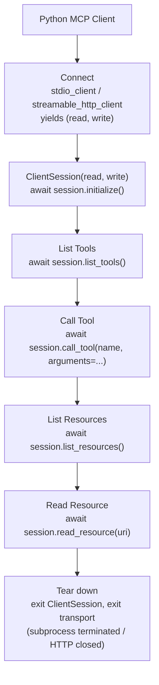

# Building MCP Clients

## Learning Objectives

By the end of this chapter, you will be able to:

- Name the exact v1.x Python SDK client-side building blocks — `ClientSession`, `stdio_client`,
  `streamable_http_client`, legacy `sse_client` — and explain what each one is responsible for
- Walk through the full client lifecycle in code: open a transport, wrap it in a `ClientSession`,
  `initialize()`, discover primitives, invoke them, and tear the connection down cleanly
- Distinguish a **protocol-level error** (a JSON-RPC error object, raised in the SDK as an exception)
  from a **tool-execution error** (`isError: true` inside an otherwise successful result) — and write
  client code that handles both correctly
- Explain why an `mcp` client maintains **one `ClientSession` per server**, and what that means for how
  a host that talks to several servers is structured
- Build a complete, working Python MCP client that connects to a server, lists and calls a tool, lists
  and reads a resource, retrieves a prompt, survives a deliberately broken tool call, and shuts down
  without leaking the subprocess or connection it opened
- Articulate why understanding this raw client matters even if your production code will mostly go
  through `langchain-mcp-adapters` (Chapter 17) — and what debugging looks like when you *don't* know
  what's underneath

---

## Prerequisites for This Chapter

This chapter assumes you've read:

- **Chapter 2** (MCP Architecture: Host, Client, Server) — in particular, the client's spec-defined
  role: "establishes one stateful session per server... 1:1 with a particular server." This chapter is
  where that sentence stops being an abstract architecture note and becomes code you write.
- **Chapter 3** (Protocol Fundamentals & Lifecycle) — the `initialize`/`initialized` handshake, JSON-RPC
  2.0 request/response shape, and capability negotiation. This chapter drives that handshake from the
  client side instead of describing it on the wire.
- **Chapter 4** (MCP Tools) — specifically the two-kinds-of-error distinction (protocol error vs.
  `isError: true`). Section 5 of this chapter is the client-side payoff of that distinction.
- **Chapter 7** (Building MCP Servers) and **Chapter 8** (Transport Mechanisms) — you should already be
  comfortable with `FastMCP`, and with stdio vs. Streamable HTTP vs. legacy HTTP+SSE at the transport
  level. This chapter is the client half of Chapter 7's server half, over the transports Chapter 8
  described.

This course does not re-teach what a tool call is, what `async`/`await` does, or how an LLM decides to
invoke a function — you're assumed fluent in all of that already.

> **2026-07-28 spec note:** everything in this chapter targets the classic, handshake-based v1.x SDK
> (`mcp>=1.28,<2`), which is what `langchain-mcp-adapters`, `deepagents`, and essentially every MCP
> server in production today actually speaks. SDK v2.0.0 replaces `ClientSession` + `stdio_client` with
> a single unified `Client` context manager (`from mcp import Client`) over a stateless protocol with no
> `initialize` handshake at all. Don't mix the two generations' code — Chapter 21 covers v2.0.0 in
> depth. Everything below is v1.x.

---

## 1. Why the Client Side Deserves Its Own Chapter

Almost every piece of MCP content on the internet teaches you to build a server. That makes sense —
servers are what you publish, what you version, what shows up in a marketplace. But if you build agents
with LangGraph or DeepAgents, the code *you* actually write and own is almost never a server. It's a
**host application** that creates **clients** to talk to other people's (or your own) servers. Your
LangGraph app is the host. `langchain-mcp-adapters`' `MultiServerMCPClient` is a convenience wrapper
around exactly the client machinery this chapter teaches. When that wrapper misbehaves — a tool call
hangs, a resource read returns nothing, a server refuses your handshake — the fix is understanding what
`MultiServerMCPClient` is doing underneath, which is precisely the `ClientSession`/`stdio_client` dance
below. Skipping this chapter and going straight to Chapter 17 means debugging a black box; reading it
first means debugging a wrapper around code you already understand.

Put differently: this phase is the one that makes the whole protocol click. Chapters 3–6 described
messages going *somewhere*. This chapter is where you become the thing sending them.

---

## 2. The Client-Side API Surface (v1.x)

The v1.x SDK splits the client into two independent layers that you always compose together:

1. **A transport layer** — opens the actual wire connection (a subprocess's stdin/stdout, or an HTTP
   connection) and exposes it as a pair of async streams: `(read, write)`.
2. **`ClientSession`** — sits on top of those streams and speaks MCP: it frames JSON-RPC messages,
   drives the `initialize`/`initialized` handshake, and gives you one method per MCP operation
   (`list_tools()`, `call_tool()`, and so on).

You always use both together. `ClientSession` doesn't know or care whether its `(read, write)` pair came
from a subprocess's pipes or an HTTP connection — that's the whole point of separating them. This
mirrors the transport-independence Chapter 8 described from the server side.

### 2.1 stdio transport: `stdio_client` + `ClientSession`

This is the transport you'll use for almost every local server you write yourself, and it's the one the
rest of this chapter builds its running example on.

```python
# v1.x SDK
from mcp import ClientSession, StdioServerParameters
from mcp.client.stdio import stdio_client

server_params = StdioServerParameters(
    command="python",
    args=["demo_server.py"],
)

async with stdio_client(server_params) as (read, write):
    async with ClientSession(read, write) as session:
        await session.initialize()
        tools = await session.list_tools()
        result = await session.call_tool("add", arguments={"a": 5, "b": 3})
```

Two context managers, nested:

- `stdio_client(server_params)` **spawns the server as a subprocess** (`command` + `args`, exactly the
  fields `langchain-mcp-adapters`' stdio config uses — Chapter 17 will look identical) and yields a
  `(read, write)` stream pair wired to that subprocess's stdout/stdin. Exiting this context manager
  terminates the subprocess.
- `ClientSession(read, write)` wraps those streams and gives you the actual MCP method calls. Exiting
  this context manager closes the session cleanly (sends whatever shutdown signaling the transport
  requires).

`StdioServerParameters` also accepts an optional `env` (environment variables for the subprocess) and
`cwd` (working directory) — the same optional fields `langchain-mcp-adapters`' stdio server config
exposes, for exactly the same reason: launching a subprocess sometimes needs a specific environment or
directory, not just a command line.

### 2.2 Streamable HTTP transport

For a server running as a long-lived HTTP service — the transport Chapter 8 recommended for anything
remote or shared — the transport-layer import changes, and the rest of the pattern stays identical:

```python
# v1.x SDK
from mcp import ClientSession
from mcp.client.streamable_http import streamable_http_client

async with streamable_http_client("http://localhost:8000/mcp") as (read, write):
    async with ClientSession(read, write) as session:
        await session.initialize()
        tools = await session.list_tools()
```

This is the single biggest thing to internalize about the client API: **`ClientSession` never changes.**
Every method you call on it — `initialize()`, `list_tools()`, `call_tool()`, `list_resources()`,
`read_resource()`, `list_prompts()`, `get_prompt()` — is transport-agnostic. Swapping `stdio_client` for
`streamable_http_client` changes exactly one line; nothing below the `async with ClientSession(...)` line
needs to know or care which transport it's running over. This is the same transport/session separation
that lets `langchain-mcp-adapters`' config dict switch between `"transport": "stdio"` and
`"transport": "streamable_http"` by changing a handful of dict keys instead of rewriting integration
code.

### 2.3 Legacy SSE transport

```python
# v1.x SDK — legacy transport
from mcp.client.sse import sse_client
```

`sse_client` talks to the older HTTP+SSE transport from the `2024-11-05` spec revision. Chapter 8
already flagged this transport as deprecated in practice since `2025-03-26` and formally
**Deprecated** as of the `2026-07-28` spec revision (SEP-2596) — "eligible for removal in a future
revision." Treat `sse_client` the way you'd treat any deprecated compatibility shim: use it only if
you're stuck talking to an old server you don't control, and prefer `streamable_http_client` for
anything new. Every other detail — `ClientSession`, `initialize()`, the rest of the method surface — is
identical regardless of which of the three transports you picked.

---

## 3. Anatomy of a Client Session — the Five-Step Lifecycle

Every MCP client interaction, regardless of transport, follows the same five-step shape:

1. **Connect** — open the transport (`stdio_client(...)` or `streamable_http_client(...)`), obtaining
   `(read, write)`.
2. **Wrap in a session** — `ClientSession(read, write)`.
3. **Initialize** — `await session.initialize()`. This is the client-driven half of Chapter 3's
   handshake: it sends the `initialize` request (your protocol version + capabilities +
   `clientInfo`), receives the server's response (its protocol version, capabilities, `serverInfo`, and
   optional `instructions`), and sends the `notifications/initialized` notification to complete the
   handshake. Nothing else on the session works until this completes.
4. **Discover and invoke** — `list_tools()` / `call_tool()`, `list_resources()` / `read_resource()`,
   `list_prompts()` / `get_prompt()`, in whatever combination your host logic needs.
5. **Tear down** — exit the `ClientSession` context manager, then exit the transport context manager.
   For stdio this terminates the subprocess; for Streamable HTTP this closes the connection.



Steps 4's individual calls are always **`list_X()` then act on one of the results it returned** — you
never guess a tool name, resource URI, or prompt name; you discover it first. This "list, then act" habit
is worth internalizing now: it's exactly what `langchain-mcp-adapters`' `get_tools()` does for you
automatically in Chapter 17 — call `list_tools()` once, and wrap every entry it returns as a callable
LangChain tool.

---

## 4. Connection Lifetime: One Session Per Server

Chapter 2 stated the client's spec-defined role in one sentence: it "establishes **one** stateful
session per server... 1:1 with a particular server." This isn't incidental phrasing — it's the reason a
host that talks to *N* servers creates *N* separate `ClientSession` instances, not one session juggling
N connections.

Concretely, this means:

- **A `ClientSession` is scoped to exactly one transport connection to exactly one server.** If your
  host needs a `math` server and a `weather` server, that's two independent
  `stdio_client()`/`streamable_http_client()` + `ClientSession()` pairs, each with its own `initialize()`
  call, its own capability negotiation, its own tool/resource/prompt namespace.
- **Sessions are not meant to be long-abandoned and silently reused.** The context-manager shape
  (`async with stdio_client(...) as ..., async with ClientSession(...) as ...`) is deliberate: it ties
  the session's lifetime to a `with`-block, so you can't accidentally hold a session open past the point
  where you're actually using it, and cleanup happens even if an exception is raised inside the block.
- **A subprocess-backed stdio session is exactly as expensive as the subprocess it launched.** Opening
  and closing a `stdio_client` repeatedly for a handful of calls each time is wasteful — spawn once, do
  your batch of work inside the `async with` block, then close. This is the same reasoning behind
  connection pooling for a database client, applied to a subprocess instead of a socket.
- **This is exactly what `MultiServerMCPClient` in Chapter 17 manages for you** — one session per
  configured server, kept alive for the shape of work you're doing with it. Knowing this now means the
  moment you look at `MultiServerMCPClient`'s config dict (one entry per server name), the "why one entry
  per server, not one client for everything" question answers itself.

---

## 5. Errors: Protocol Exceptions vs. `isError: true`

Chapter 4 introduced the two categories of tool-call error that MCP distinguishes on the wire. This is
where that distinction stops being a JSON diagram and becomes something your client code must branch on
correctly, because the two require completely different handling:

**1. Protocol-level errors** — the request itself couldn't be serviced: an unknown tool name, malformed
arguments that fail JSON-RPC-level validation, a transport failure. These come back as a standard
JSON-RPC error object (e.g. unknown tool → `-32602`), and the v1.x SDK surfaces them by **raising an
exception** out of the `await session.call_tool(...)` call — your code never sees a normal
`CallToolResult` at all for this case. You must wrap the call in `try`/`except` to handle it.

**2. Tool-execution errors** — the request was perfectly valid, the tool *ran*, and the tool itself
failed (bad input for the tool's own logic, a downstream API timeout, a validation failure inside the
tool body). MCP represents this as an ordinary, successful JSON-RPC response whose result carries
`"isError": true`. Your `await session.call_tool(...)` call **returns normally** — no exception — and
you must inspect `result.isError` yourself to notice anything went wrong.

The failure mode this distinction exists to prevent: code that only wraps `call_tool()` in a
`try`/`except` and treats "no exception raised" as "the tool call succeeded." That code will happily
report a tool's own reported failure — `isError: true`, with the actual error message sitting in
`result.content` — as a success, because from the exception-handling machinery's point of view, nothing
went wrong. Correct client code checks **both**:

```python
try:
    result = await session.call_tool("divide", arguments={"a": 10, "b": 0})
except Exception as exc:
    # Protocol-level failure: unknown tool, bad arguments shape, transport error.
    # No CallToolResult exists at all — there's nothing in `exc` that looks like tool output.
    print(f"Protocol-level error calling the tool: {exc}")
else:
    if result.isError:
        # Tool-execution failure: the call reached the tool, and the tool reported
        # its own failure. This is NOT a protocol problem — treat it as domain data.
        error_text = result.content[0].text if result.content else "(no error detail)"
        print(f"Tool reported an error: {error_text}")
    else:
        print(f"Tool succeeded: {result.content}")
```

Section 6's worked project exercises this exact branch with a real, deliberately-failing tool call —
seeing both paths fire in one run does more for internalizing this distinction than the diagram in
Chapter 4 alone.

> **2026-07-28 spec note:** the protocol-error side of this picture gains two new named error codes in
> the stateless redesign: `UnsupportedProtocolVersionError` (`-32022`) and
> `MissingRequiredClientCapabilityError` (`-32021`), replacing the classic model's implicit
> handshake-failure behavior. The `isError: true` tool-result convention itself is untouched — that part
> of the picture is stable across both protocol generations.

---

## 6. Project: A Complete MCP Client

This section builds one client script that performs every operation this chapter promised: connect,
initialize, list tools, call a tool, list resources, read a resource, get a prompt, survive a broken
tool call, and shut down cleanly. It talks to a small companion server built with the same `FastMCP`
pattern from Chapter 7.

### 6.1 The companion server

```python
# demo_server.py — v1.x SDK, FastMCP
from mcp.server.fastmcp import FastMCP

mcp = FastMCP("Demo")


@mcp.tool()
def add(a: int, b: int) -> int:
    """Add two numbers"""
    return a + b


@mcp.tool()
def divide(a: float, b: float) -> float:
    """Divide a by b. Raises if b is zero — used to demonstrate isError: true."""
    if b == 0:
        raise ValueError("Cannot divide by zero")
    return a / b


@mcp.resource("greeting://{name}")
def get_greeting(name: str) -> str:
    """Get a personalized greeting"""
    return f"Hello, {name}!"


@mcp.prompt()
def greet_user(name: str, style: str = "friendly") -> str:
    """Build a greeting prompt in the requested style."""
    return f"Write a {style} greeting for {name}."


if __name__ == "__main__":
    mcp.run(transport="stdio")
```

`FastMCP` translates an uncaught exception raised inside a `@mcp.tool()` function (like `divide`'s
`ValueError` on a zero denominator) into a result with `isError: true` and the exception message as the
content — this is the mechanism Section 5's `isError` branch is going to observe from the client side.

### 6.2 The client

```python
# client.py — v1.x SDK
import asyncio

from mcp import ClientSession, StdioServerParameters
from mcp.client.stdio import stdio_client

server_params = StdioServerParameters(
    command="python",
    args=["demo_server.py"],
)


async def main() -> None:
    async with stdio_client(server_params) as (read, write):
        async with ClientSession(read, write) as session:
            # Step 1 — handshake
            init_result = await session.initialize()
            print(f"Connected to: {init_result.serverInfo.name} "
                  f"(protocol {init_result.protocolVersion})")

            # Step 2 — list tools
            tools_result = await session.list_tools()
            print("Available tools:")
            for tool in tools_result.tools:
                print(f"  - {tool.name}: {tool.description}")

            # Step 3 — call a tool (success path)
            add_result = await session.call_tool("add", arguments={"a": 5, "b": 3})
            print(f"add(5, 3) -> {add_result.content[0].text} "
                  f"(isError={add_result.isError})")

            # Step 4 — call a tool that fails inside its own logic (isError: true path)
            divide_result = await session.call_tool(
                "divide", arguments={"a": 10, "b": 0}
            )
            if divide_result.isError:
                print(f"divide(10, 0) reported a tool-execution error: "
                      f"{divide_result.content[0].text}")

            # Step 5 — call a tool that doesn't exist (protocol-level error path)
            try:
                await session.call_tool("no_such_tool", arguments={})
            except Exception as exc:
                print(f"Protocol-level error calling an unknown tool: {exc}")

            # Step 6 — list resources
            resources_result = await session.list_resources()
            print(f"Static resources: {[r.uri for r in resources_result.resources]}")
            # (get_greeting is a templated resource — greeting://{name} — so it won't
            #  appear in list_resources() as a concrete entry; read it by URI directly.)

            # Step 7 — read a resource
            greeting_result = await session.read_resource("greeting://Ada")
            print(f"Resource content: {greeting_result.contents[0].text}")

            # Step 8 — list and get a prompt
            prompts_result = await session.list_prompts()
            print(f"Available prompts: {[p.name for p in prompts_result.prompts]}")

            prompt_result = await session.get_prompt(
                "greet_user", arguments={"name": "Ada", "style": "formal"}
            )
            for message in prompt_result.messages:
                print(f"Prompt message ({message.role}): {message.content.text}")

    # Both `async with` blocks have exited here: the ClientSession is closed and
    # the demo_server.py subprocess has been terminated. Nothing is left running.
    print("Session closed, subprocess terminated.")


if __name__ == "__main__":
    asyncio.run(main())
```

Running `python client.py` against `demo_server.py` in the same directory produces, in order: the
server's name and negotiated protocol version, the tool list, a successful `add` call, a `divide`
call whose `isError` is `True` with the `ValueError` message as its content, a caught exception for the
nonexistent tool, the resource list, the read greeting, the prompt list, and the rendered prompt
message — every operation this chapter set out to demonstrate, in one run.

### 6.3 What to notice about the teardown

The `async with stdio_client(...) as (read, write): async with ClientSession(...) as session:` nesting
means **exiting either `with` block cleans up its own layer** — you never manually call a `.close()` or
`.disconnect()` method anywhere in this script. If an exception propagates out of the inner block (say,
`call_tool` raising unexpectedly, and you didn't catch it), both context managers still unwind correctly:
the session closes, then the subprocess is terminated. This is why every stdio and Streamable HTTP
example across the course uses nested `async with` rather than manual `connect()`/`disconnect()` calls —
it's not stylistic preference, it's what guarantees the subprocess doesn't leak if something in the
middle throws.

---

## Examples

**Minimal read-only client** (list tools and exit — the smallest useful client):

```python
# v1.x SDK
async with stdio_client(server_params) as (read, write):
    async with ClientSession(read, write) as session:
        await session.initialize()
        result = await session.list_tools()
        for tool in result.tools:
            print(tool.name)
```

**Calling a tool with structured arguments:**

```python
# v1.x SDK
result = await session.call_tool(
    "search_flights",
    arguments={"origin": "SFO", "destination": "JFK", "date": "2026-08-15"},
)
```

**Streamable HTTP client against a remote server, with the same discovery pattern:**

```python
# v1.x SDK
from mcp import ClientSession
from mcp.client.streamable_http import streamable_http_client

async with streamable_http_client("https://mcp.example.com/mcp") as (read, write):
    async with ClientSession(read, write) as session:
        await session.initialize()
        tools = await session.list_tools()
        result = await session.call_tool(
            "get_weather", arguments={"city": "Bengaluru"}
        )
```

**Guarding every tool call with the two-path error handling from Section 5**, as a small reusable
helper rather than repeating the `try`/`isError` shape inline everywhere:

```python
# v1.x SDK
async def call_tool_safely(session: ClientSession, name: str, arguments: dict):
    try:
        result = await session.call_tool(name, arguments=arguments)
    except Exception as exc:
        return {"ok": False, "kind": "protocol_error", "detail": str(exc)}

    if result.isError:
        detail = result.content[0].text if result.content else ""
        return {"ok": False, "kind": "tool_error", "detail": detail}

    return {"ok": True, "content": result.content}
```

A helper like this is exactly the shape you want at the boundary between "raw MCP client" and "whatever
your host does with the result" — it converts both failure paths into one uniform shape your host logic
can branch on without repeating the `try`/`isError` dance at every call site.

---

## Real-World Scenario

A team is building a LangGraph-based support agent and, before wiring in `langchain-mcp-adapters`,
wants to validate a newly built internal MCP server ("ticketing") in isolation — is it actually
returning what they think it returns, independent of anything LangChain-specific? They write exactly the
Section 6 client shape against `ticketing`: `stdio_client` in dev, `streamable_http_client` once it's
deployed, `initialize()`, `list_tools()` to confirm the tool names and schemas match what the server
author claims, then a handful of `call_tool()` invocations with real ticket IDs. During this exercise
they discover a bug: a `close_ticket` call with an invalid ticket ID doesn't raise an exception — the
call *succeeds* at the protocol level, but their code was only wrapping `call_tool()` in `try`/`except`
and never checking `result.isError`, so a failed close was being silently reported as a success further
up the call stack. Because they tested the raw client directly, this surfaces immediately as an isolated,
obviously reproducible failure — one `isError` check away from being fixed — rather than showing up
three layers later as "the agent claims tickets are closed, but they aren't," debugged blind through
`MultiServerMCPClient` with no idea whether the bug is in the server, the adapter, or the agent's own
logic. They add the `call_tool_safely`-style helper from the Examples section directly in front of the
`MultiServerMCPClient` integration, and the same bug class can no longer sneak past silently.

---

## Best Practices

- **Always pair a transport context manager with a `ClientSession` context manager, nested, and never
  manage either lifecycle manually.** This is what guarantees cleanup — subprocess termination,
  connection closure — happens even when something in the middle raises.
- **Call `initialize()` before anything else, every time, with no exceptions.** Every other method on
  `ClientSession` depends on the handshake having completed; skipping it (or calling other methods
  concurrently before it resolves) isn't a shortcut, it's a bug.
- **Treat `list_X()` as mandatory before `call_tool()`/`read_resource()`/`get_prompt()`, not optional.**
  Don't hardcode a tool name or resource URI your host has never actually confirmed the server exposes —
  discover first, act second, exactly like the five-step lifecycle in Section 3.
- **Always check both failure paths on a tool call** — the `try`/`except` for protocol errors, *and*
  `result.isError` for tool-execution errors. Code that only does one of these silently mishandles the
  other, and it's rarely obvious from a quick read that anything is missing.
- **Keep one `ClientSession` per server, and reuse it across a batch of calls** rather than reconnecting
  per call. Especially over stdio, where reconnecting means respawning a subprocess, this is a real
  performance cost, not just an aesthetic one.
- **Read this chapter's raw client fluently before leaning on `langchain-mcp-adapters` in Chapter 17.**
  When the adapter misbehaves, you'll be debugging exactly the machinery covered here, just one layer
  down — and that's much easier when it isn't the first time you've seen it.

---

## Common Mistakes

- **Only catching exceptions and never checking `result.isError`.** This is the single most common bug
  this chapter warns about: a tool call that fails inside its own logic returns normally, with no
  exception, and `isError: true` sitting unread in the result. Code that treats "no exception" as
  "success" will report tool failures as successes.
- **Forgetting `await session.initialize()`.** Every other `ClientSession` method depends on the
  handshake having completed; forgetting this call (easy to do when copy-pasting a snippet that omits
  it) produces confusing failures on the very first real operation.
- **Reconnecting per tool call instead of reusing one session for a batch of work.** Over stdio this
  means spawning and killing a subprocess for every single call — wasteful, slow, and unnecessary when
  the whole point of `async with ClientSession(...)` is to scope the connection to the actual unit of
  work.
- **Guessing a tool name, resource URI, or prompt name instead of discovering it via the corresponding
  `list_X()` call first.** Servers evolve; a name your host hardcoded from documentation or a demo can
  silently stop existing, and the failure you get (a protocol-level error, per Section 5) is much
  clearer to diagnose if you'd already listed what the server actually exposes.
- **Using the legacy `sse_client` for a brand-new server.** It only exists for talking to servers stuck
  on the deprecated HTTP+SSE transport; a new server should be reachable over Streamable HTTP, and
  reaching for `sse_client` out of habit or an outdated tutorial adds a maintenance liability for no
  benefit.
- **Mixing v1.x and v2.0.0 client code in the same script.** `ClientSession` + `stdio_client` (v1.x) and
  `Client` (v2.0.0) are two different generations of the API speaking two different protocol models —
  they are not interchangeable, and there's no partial-mixing that works.

---

## Summary

- The v1.x client-side API has two independently swappable layers: a **transport** (`stdio_client`,
  `streamable_http_client`, or legacy `sse_client`) yielding `(read, write)` streams, and
  `ClientSession(read, write)`, which speaks MCP over whichever transport you handed it.
- The lifecycle is always the same five steps: **connect → wrap in a session → `initialize()` → discover
  and invoke → tear down** — regardless of which transport is underneath.
- A client maintains **one `ClientSession` per server**, per Chapter 2's architecture — a host talking to
  several servers creates several independent sessions, not one session multiplexing many servers.
- Tool-call errors come in two shapes that require different handling: a **protocol-level error** raises
  an exception out of `call_tool()`; a **tool-execution error** returns normally with `isError: true` —
  correct client code checks for both, every time.
- `list_tools()`/`call_tool()`, `list_resources()`/`read_resource()`, and `list_prompts()`/`get_prompt()`
  are all transport-agnostic methods on the same `ClientSession` — swapping stdio for Streamable HTTP
  changes only the transport context manager, nothing below it.
- Nested `async with` context managers (transport, then session) are what guarantee cleanup — subprocess
  termination, connection closure — even when an exception propagates, which is why the course never
  shows manual `connect()`/`disconnect()` calls instead.
- Understanding this raw client pays off directly in Chapter 17: `langchain-mcp-adapters`'
  `MultiServerMCPClient` is a convenience layer built on exactly this machinery, one `ClientSession` per
  configured server.

---

## Knowledge Check

1. What are the two independent layers every v1.x MCP client is built from, and why does swapping stdio
   for Streamable HTTP only require changing one of them?
2. Write, from memory, the five-step lifecycle every MCP client interaction follows.
3. A client calls `session.call_tool("refund", arguments={"order_id": "abc123"})` and the call returns
   normally with no exception raised. Is that sufficient evidence the refund succeeded? Justify your
   answer precisely, referencing both failure paths from Section 5.
4. Why does the spec define the client as maintaining "one stateful session per server" rather than one
   session shared across every server a host talks to? What would break if a host tried to multiplex
   several servers through a single `ClientSession`?
5. What specifically goes wrong if you call `session.list_tools()` before `await session.initialize()`
   has completed?
6. Name one concrete reason to prefer `streamable_http_client` over legacy `sse_client` for a brand-new
   remote server, beyond "it's newer."
7. In the Section 6 project, `demo_server.py`'s `divide` tool raises a plain `ValueError` on division by
   zero. Trace exactly what happens to that exception between the server's `@mcp.tool()` function and
   the client's `divide_result.isError` check.

---

## Hands-On Exercise

Extend the Section 6 project to exercise every remaining corner of the client API and confirm your
understanding of the error-handling split with your own eyes, not just by reading the example.

1. **Add a second failing tool call** to `demo_server.py`: a tool `lookup_user(user_id: str) -> str` that
   raises `KeyError` for any `user_id` not in a small hardcoded dict. Call it from your client with a
   missing ID and confirm `isError` is `True` with the `KeyError` message visible in `result.content`.

2. **Add a second resource** to the server — a static (non-templated) resource this time, e.g.
   `@mcp.resource("config://app")` returning a small JSON string. Confirm it *does* show up in
   `list_resources()`'s output (unlike the templated `greeting://{name}` resource in Section 6.2), then
   read it directly by its exact URI.

3. **Convert your client's tool calls to use the `call_tool_safely` helper** from the Examples section
   instead of hand-rolled `try`/`isError` blocks at each call site, and confirm the three cases (success,
   tool-execution error, protocol error) all produce the correct `{"ok": ..., "kind": ...}` shape.

4. **Switch the transport.** Serve `demo_server.py` over Streamable HTTP instead of stdio (Chapter 7/8
   cover running a `FastMCP` server this way), change only the transport-layer import and connection
   line in your client to `streamable_http_client`, and confirm every other line of client code — the
   `ClientSession` calls, the error handling, the resource/prompt calls — needed **zero** changes.

5. **Deliberately break the handshake**: comment out `await session.initialize()` and call
   `session.list_tools()` immediately after opening the session. Observe what happens, and write one
   sentence explaining why in terms of what `initialize()` is actually responsible for setting up.

6. **Bonus — connection reuse vs. reconnect cost:** time how long it takes to call `add` ten times (a)
   inside one `async with stdio_client(...)` block reusing the same session, versus (b) opening and
   closing a fresh `stdio_client`/`ClientSession` pair for each of the ten calls. Confirm for yourself
   that (b) is measurably slower, and explain why in terms of what `stdio_client` actually does on
   entry/exit.

---

## Further Reading

- Official spec: `modelcontextprotocol.io/specification` — the architecture page's client role
  definition this chapter builds on throughout
- `github.com/modelcontextprotocol/python-sdk` — official Python SDK; the source of truth for
  `ClientSession`, `stdio_client`, `streamable_http_client`, and `sse_client`
- Related chapter in this course: [Chapter 2 — MCP Architecture: Host, Client, Server](./02-mcp-architecture-host-client-server.md)
  — the one-session-per-server rule this chapter's Section 4 builds on directly
- Related chapter in this course: [Chapter 3 — Protocol Fundamentals & Lifecycle](./03-protocol-fundamentals-and-lifecycle.md)
  — the `initialize`/`initialized` handshake this chapter's `session.initialize()` performs from the
  client side
- Related chapter in this course: [Chapter 4 — MCP Tools](./04-mcp-tools.md) — the protocol-error vs.
  `isError: true` distinction this chapter's Section 5 applies in real client code
- Related chapter in this course: [Chapter 7 — Building MCP Servers](./07-building-mcp-servers.md) and
  [Chapter 8 — Transport Mechanisms](./08-transport-mechanisms.md) — the server and transport halves of
  everything this chapter connects to
- Related chapter in this course: [Chapter 17 — MCP + LangChain](./17-mcp-with-langchain.md) — where
  `MultiServerMCPClient` wraps exactly this chapter's `ClientSession`/transport machinery, one session
  per configured server
- Related chapter in this course: [Chapter 21 — The Stateless Redesign — MCP 2026-07-28](./21-the-stateless-redesign-2026-07-28.md)
  — the v2.0.0 unified `Client` context manager this chapter's callouts forward-reference

---

<div style="display:flex;justify-content:space-between;align-items:center;">
  <a href="./08-transport-mechanisms.md">← Previous: Transport Mechanisms</a>
  <a href="./00-index.md">🏠 Index</a>
  <a href="./10-tool-schema-design.md">Next: Tool Schema Design →</a>
</div>
