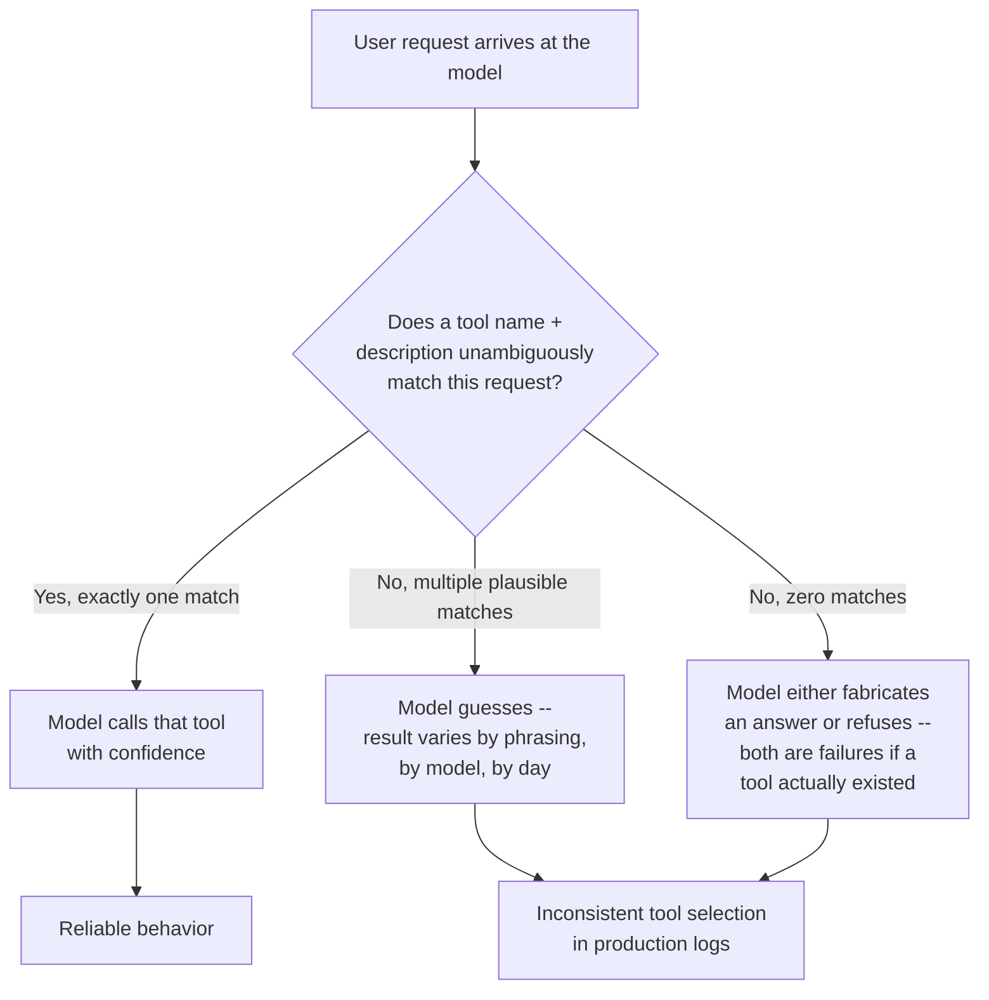

# Tool Schema Design

> A tool can be perfectly correct — valid JSON Schema, no bugs, a working handler — and still fail in production, because the thing that decides whether and how to call it isn't a type checker. It's a language model reading a name, a description, and a schema, with no ability to ask a clarifying question first.

## Learning Objectives

By the end of this chapter, you will be able to:

- Explain precisely why tool schema design is a **model-facing UX problem**, not merely a validation problem, and connect that claim to concrete tool-selection failures you can reproduce
- Diagnose what makes a tool like `execute_query(data)` dangerous and hard for a model to use correctly, and contrast it point-by-point against a structured alternative like `get_vehicle_entries(start_time, end_time, gate_id, vehicle_type)`
- Apply a `verb_noun` naming convention that disambiguates tools for a model choosing among many, and recognize the specific failure mode of ambiguous, overlapping tool names
- Write tool descriptions addressed to the model as their primary reader — stating when to use a tool, when *not* to, and every unit/format/constraint the model needs to avoid guessing
- Build strong JSON Schema `inputSchema`s using required/optional fields, `enum`/`Literal` constraints instead of freeform strings, sensible defaults, and `minimum`/`maximum`/`pattern` validation
- Return `structuredContent` conforming to a declared `outputSchema` (2025-06-18+) so calling code can consume structured JSON instead of parsing free text
- Refactor a naive `search(q: str)` tool into a fully specified `search_support_tickets(...)` tool end to end, including the Pydantic-backed schema and the model-facing docstring
- Reason about the domain-specific vs. generic tool trade-off, and explain why this chapter's verdict foreshadows Chapter 15's database-tools discussion
- Design an empirical test for schema quality — paraphrased prompts against a live agent — rather than treating a passing JSON Schema validator as proof the schema works

---

## Prerequisites for This Chapter

This chapter assumes you're comfortable with everything in **Chapter 4 (MCP Tools)** — the wire shape of a tool object (`name`, `description`, `inputSchema`, `outputSchema`, `annotations`), the `tools/list`/`tools/call` methods, and the `content`/`isError` shape of a call result — and with **Chapter 7 (Building MCP Servers)**, where you first wrote a `FastMCP` server with the `@mcp.tool()` decorator. It also assumes you already know what a JSON Schema is and what Pydantic does with Python type hints; this chapter does not re-teach either from scratch, it applies them specifically to the problem of making a tool legible to an LLM.

If you haven't yet internalized that `inputSchema` is ordinary JSON Schema and that FastMCP derives it from your function's parameter type hints, a quick pass back through Chapter 4 will make Section 6 below land faster.

---

## 1. The Central Thesis

Put the claim as plainly as possible: **a technically correct MCP tool can still perform poorly in production, because "technically correct" and "usable by a model" are different properties.** A tool is technically correct if its `inputSchema` is valid JSON Schema, its handler doesn't crash, and it returns a well-formed result. None of that guarantees the model calling it:

- picks this tool over some other tool that superficially seems just as plausible for the request,
- fills in the arguments with values that actually match what the tool expects,
- avoids calling the tool at all when it clearly doesn't apply,
- or reliably arrives at the *intended* behavior across the many different phrasings a real user will use to ask for the same thing.

Every other primitive you've studied in this course — resources, prompts, transport, auth — is judged by whether it's spec-compliant. Tools are judged by spec compliance *and* by something closer to product design: does the interface communicate itself clearly enough that an LLM, given only the tool's name, description, and schema, consistently does the right thing? That second bar is empirical, not something a schema validator can confirm, and it's the organizing idea for this whole chapter.

This is exactly why the course's own 80/20 priority list (Chapter 0's index) puts this chapter in the same tier as architecture, building servers, debugging, and security. A subtly wrong schema doesn't throw an exception — it silently degrades the reliability of every agent that depends on the tool, which is a much harder failure to notice and root-cause than a crash.

---

## 2. Anatomy of a Tool Definition, Revisited for Design

Recall from Chapter 4 the exact wire shape of a tool object:

| Field | Purpose | Who reads it |
|---|---|---|
| `name` | Stable identifier the model emits in a tool call | Model (selection) + your dispatcher (routing) |
| `title` | Optional human-friendly display name (2025-06-18+), distinct from `name` | Host UI, not the model's reasoning |
| `description` | Free text explaining what the tool does | **Model** (selection + argument-filling) |
| `inputSchema` | JSON Schema for arguments | **Model** (argument-filling) + your server (validation) |
| `outputSchema` | Optional JSON Schema for the result (2025-06-18+) | Calling code (parsing), and the model on subsequent turns |
| `annotations` | Behavior hints — `readOnlyHint`, `destructiveHint`, etc. (2025-03-26+) | Host (confirmation UX) + model (risk assessment) |

Every field in that table other than `name` and `inputSchema`'s raw validation logic exists **to communicate to the model**, not to the wire protocol. `description` has no runtime effect on whether a call succeeds — a tool with an empty description still validates and executes identically to one with a precise, well-written one. The only thing a bad description changes is whether the model chooses correctly and fills arguments correctly. That's the whole argument of this chapter compressed into one table.

> **2026-07-28 spec note:** none of this changes under the stateless redesign. `tools/list` and `tools/call` are explicitly called out in the fact sheet as stable across every revision to date, and the tool object's shape (`name`/`description`/`inputSchema`/`outputSchema`/`annotations`) is a payload concern, not a session concern. The stateless rewrite removes the `initialize` handshake and protocol-level sessions (Chapter 3, Chapter 21) — it says nothing about how you should name or describe a tool. Everything in this chapter applies unchanged whether you're on the classic handshake-based SDK or the stateless 2026-07-28 line.

---

## 3. Case Study: A Bad Tool vs. A Good Tool

This is the running example for the whole chapter. Both tools below could plausibly sit behind the same underlying database and answer the same class of question — "which vehicles passed through gate 3 yesterday afternoon?" — but they present wildly different interfaces to the model calling them.

### 3.1 The bad tool: `execute_query`

```json
{
  "name": "execute_query",
  "description": "Executes a query against the database.",
  "inputSchema": {
    "type": "object",
    "properties": {
      "data": { "type": "string" }
    },
    "required": ["data"]
  }
}
```

Walk through what this actually asks of the model:

1. **The model has to invent a query language it was never shown.** Is `data` raw SQL? A JSON filter DSL? A natural-language string the server will parse? Nothing in the schema says. The model will guess based on the tool's name (`execute_query` reads like "SQL"), and different models — or the same model on different days — will guess differently.
2. **It invites the exact failure class SQL injection defenses exist to prevent.** If the server's handler does anything remotely like `cursor.execute(data)`, the model is now the thing constructing raw SQL from user intent, with no schema-level constraint stopping it from emitting `DROP TABLE entries; --` if a user's phrasing is adversarial or just clumsy, or from writing an unbounded scan (`SELECT * FROM entries`) that returns megabytes of unrelated rows into the model's context window.
3. **There's no structure for the server to validate against.** `data` is a string — any string satisfies the schema. All of the "did the model supply a sane request" work that JSON Schema could be doing for free (types, ranges, enums) has been pushed entirely into runtime parsing logic the server author has to write and the model has to somehow intuit the shape of.
4. **The description tells the model nothing about *when* to reach for this over some other tool.** "Executes a query against the database" is true of almost any data-access tool a server might expose. If there are five tools like this on the same server, tool selection degenerates into a coin flip.

This is the "opaque, unstructured" tool the prompt for this chapter warns about, and it's a pattern seen often in early, naive MCP servers that are really just a thin wrapper around "let the model write SQL."

### 3.2 The good tool: `get_vehicle_entries`

```json
{
  "name": "get_vehicle_entries",
  "title": "Get Vehicle Gate Entries",
  "description": "Retrieve vehicle entry records for a specific gate within a time window. Use this tool when the user asks about vehicles that passed through a particular gate — e.g. 'how many trucks entered gate 3 yesterday'. Do NOT use this tool for exit records (see get_vehicle_exits) or for aggregate counts across all gates (see get_gate_traffic_summary). Timestamps must be ISO 8601 in UTC (e.g. 2026-07-29T14:00:00Z).",
  "inputSchema": {
    "type": "object",
    "properties": {
      "start_time": {
        "type": "string",
        "format": "date-time",
        "description": "Start of the time window, ISO 8601 UTC, e.g. 2026-07-29T00:00:00Z."
      },
      "end_time": {
        "type": "string",
        "format": "date-time",
        "description": "End of the time window, ISO 8601 UTC. Must be after start_time."
      },
      "gate_id": {
        "type": "string",
        "pattern": "^gate-[0-9]{1,3}$",
        "description": "Gate identifier, e.g. 'gate-3'."
      },
      "vehicle_type": {
        "type": "string",
        "enum": ["car", "truck", "motorcycle", "bus", "any"],
        "default": "any",
        "description": "Filter by vehicle type. 'any' returns all types."
      }
    },
    "required": ["start_time", "end_time", "gate_id"]
  },
  "outputSchema": {
    "type": "object",
    "properties": {
      "entries": {
        "type": "array",
        "items": {
          "type": "object",
          "properties": {
            "vehicle_id": { "type": "string" },
            "vehicle_type": { "type": "string" },
            "entered_at": { "type": "string", "format": "date-time" },
            "gate_id": { "type": "string" }
          },
          "required": ["vehicle_id", "vehicle_type", "entered_at", "gate_id"]
        }
      },
      "total_count": { "type": "integer" }
    },
    "required": ["entries", "total_count"]
  }
}
```

Every problem from Section 3.1 has a concrete fix here:

- **No query language to invent.** The model supplies four scalar-ish values it can read directly off the user's request — a time range, a gate ID, and an optional type filter. There's no DSL to hallucinate.
- **No injection surface.** `gate_id` is constrained by a `pattern`, `vehicle_type` is constrained by an `enum`. The server's handler builds the actual database query itself, as a parameterized query against known columns — the model never touches SQL syntax at all.
- **The description states scope explicitly**, including the negative case ("do NOT use this for exit records") and points to the correct sibling tools by name, which directly prevents the ambiguous-overlapping-tools failure mode covered in Section 4.
- **`outputSchema` plus `structuredContent`** (Section 7) means the caller — your LangGraph node, your application code — gets a typed JSON array back, not a paragraph of prose it has to regex apart.

This is the difference the whole chapter is about: two tools that could sit in front of the *same data*, where one invites misuse and the other makes misuse structurally difficult.

---

## 4. Naming Tools the Model Can't Misread

A model choosing among tools sees only `name` and `description` before it decides which to call — the full argument-level reasoning happens *after* selection. Names carry more selection weight than people initially assume, precisely because they're the cheapest signal available before the model has read anything else.

### 4.1 Use a `verb_noun` convention, consistently

Pick a small, fixed vocabulary of verbs and apply it uniformly across every tool on a server:

| Verb | Meaning | Example |
|---|---|---|
| `get_` | Fetch a specific, identifiable resource | `get_vehicle_entries`, `get_ticket` |
| `list_` | Fetch a collection, typically paginated/filtered | `list_open_tickets` |
| `search_` | Fuzzy/ranked lookup over free text | `search_support_tickets` |
| `create_` | Create a new record | `create_support_ticket` |
| `update_` | Modify an existing record | `update_ticket_status` |
| `delete_` | Remove a record (usually gated behind confirmation) | `delete_ticket` |

Consistency here is what makes the convention pay off. If one tool is `get_vehicle_entries` and its sibling is named `vehicleExitData` instead of `get_vehicle_exits`, the model can no longer pattern-match "this server uses `get_` for point lookups" — every tool has to be evaluated independently, which is strictly more expensive at inference time and strictly more error-prone.

### 4.2 Avoid ambiguous, overlapping tools

The single most common naming failure in practice isn't a bad name in isolation — it's **two tools whose names and descriptions both plausibly answer the same request.** If a server exposes both `get_data(source, filter)` and `query_records(table, condition)`, and a user asks "show me today's entries at gate 3," nothing distinguishes which tool is "the" right one from the model's point of view; you've built an ambiguity the model has to resolve by guessing, and different phrasings of the same request may resolve the guess differently.

The fix is the same discipline as the good example in Section 3.2: each tool's description states not just what it does, but what it *doesn't* do and which sibling tool to reach for instead. When you're designing a set of tools together, explicitly draw the boundary between them before you ship any of them — if you can't articulate a one-sentence rule for "use tool A instead of tool B when...", the model won't be able to infer that rule either.

This also matters across servers, not just within one. If your agent connects to multiple MCP servers (Chapter 9's `MultiServerMCPClient`) and two different servers each expose a `search` tool, you now have a **tool name collision** the host has to resolve somehow — and a malicious or careless server registering a lookalike name is exactly the "Tool Name Shadowing" risk covered in Chapter 14's security material. Naming discipline is a security concern as well as a UX one; keep that cross-reference in mind as you design multi-server tool surfaces.



---

## 5. Writing Descriptions for the Model, Not the Reader

It's tempting to write a tool description the way you'd write a docstring for a human teammate — a short, polite one-liner. That habit under-serves the model. The model cannot ask a clarifying question before deciding whether to call your tool; the description is the *entire* briefing it gets. Treat it like a terse, complete API contract aimed at a reader who gets exactly one shot and no follow-up.

A description that pulls its weight typically covers:

1. **What the tool does**, in concrete domain terms, not abstract ones ("retrieve vehicle entry records for a gate," not "queries the database").
2. **When to use it** — the specific class of user request that should trigger this tool.
3. **When *not* to use it**, especially naming the sibling tool that should be used instead (Section 4.2). This is the single highest-leverage sentence you can add to a description with more than one similar sibling.
4. **Units, formats, and constraints** the model must respect but which the JSON Schema type system alone can't fully express in a self-explanatory way — e.g. "timestamps are UTC," "distances are in meters, not miles," "`gate_id` follows the pattern `gate-N`."
5. **Side effects**, if any — whether the call is read-only or mutates state, which is also formally expressible via the `readOnlyHint`/`destructiveHint` `annotations` (Chapter 4) but is worth restating in prose since not every host surfaces annotations to the user, and the model itself benefits from the explicit statement when reasoning about whether to ask for confirmation.

One more thing worth naming plainly here, even though it belongs primarily to Chapter 14: the `description` field is plain text the model reads and, in effect, obeys. That's exactly the mechanism behind **Tool Poisoning** — a third-party security term (not official spec vocabulary) for hidden instructions embedded in a description that a user never sees but the model does. Writing precise, honest descriptions is good schema design; it's worth remembering that the same field is also an attack surface on servers you don't control, which Chapter 14 covers in depth.

---

## 6. Strong Input Schemas With JSON Schema

`inputSchema` is ordinary JSON Schema — nothing MCP-specific about the schema language itself — but a handful of JSON Schema features matter disproportionately for model-facing tools.

### 6.1 Required vs. optional, explicitly

Every parameter the tool truly cannot function without belongs in `required`. Everything else should be optional with a sensible `default`. This isn't just a validation nicety — an argument marked required signals to the model "you must supply this even if the user didn't state it explicitly," which shapes whether the model asks a clarifying question or guesses. Over-marking parameters as required forces the model to fabricate values for things the user never mentioned; under-marking them means your handler has to defensively handle every field being absent.

### 6.2 `enum` (and Python `Literal`) instead of freeform strings

This is the single highest-leverage JSON Schema feature for tool design. Compare:

```json
{ "vehicle_type": { "type": "string" } }
```

against

```json
{ "vehicle_type": { "type": "string", "enum": ["car", "truck", "motorcycle", "bus", "any"] } }
```

The freeform version lets the model emit `"Truck"`, `"trucks"`, `"lorry"`, or `"HGV"` for the same underlying concept — and your handler now has to normalize, fuzzy-match, or reject each variant. The `enum` version removes the ambiguity at the schema level: the model sees the exact closed set of valid values *before* it commits to a call, and most tool-calling implementations will reject or auto-correct a value outside that set before your handler ever runs. In FastMCP, this maps directly onto a Python `Literal` type hint:

```python
from typing import Literal

def get_vehicle_entries(
    start_time: str,
    end_time: str,
    gate_id: str,
    vehicle_type: Literal["car", "truck", "motorcycle", "bus", "any"] = "any",
) -> dict:
    ...
```

Anywhere a parameter has a small, known, closed set of valid values — status, category, unit, mode — prefer `Literal`/`enum` over `str`. Reserve freeform strings for things that are genuinely open-ended, like a search query or free-text note.

### 6.3 Sensible defaults

A default value (`vehicle_type: Literal[...] = "any"` above) does two things simultaneously: it makes the parameter optional (Section 6.1), and it tells the model what happens if it says nothing about that dimension of the request. Choose defaults that match the *most common* real request, not merely the most permissive value — `"any"` for a type filter is usually right, but a default `max_results=1000` on a search tool is usually wrong (Section 8 revisits this directly).

### 6.4 `minimum`/`maximum`/`pattern` — constrain the space, don't just document it

JSON Schema's numeric and string constraints let you enforce, at the schema level, facts that would otherwise live only in prose the model might not fully honor:

```json
{
  "max_results": { "type": "integer", "minimum": 1, "maximum": 100, "default": 10 },
  "gate_id": { "type": "string", "pattern": "^gate-[0-9]{1,3}$" }
}
```

A `pattern` on `gate_id` rejects `"Gate Three"` or `"gate_3"` before your handler ever sees it; a `maximum` on `max_results` prevents a model from requesting an unbounded result set that blows out the context window downstream. Every constraint you can express declaratively in the schema is one fewer thing your handler has to defensively check, and — just as important — one fewer way the model can silently misuse the tool while technically "following" a prose description.

### 6.5 Prefer flat, primitive-typed arguments over deep nesting

A tool with five flat scalar parameters (`start_time`, `end_time`, `gate_id`, `vehicle_type`, `max_results`) is easier for a model to fill in correctly than the same information packed into a single nested object argument (`filter: {time_range: {start, end}, gate: {id}, vehicle: {type}}`). Deep nesting isn't invalid JSON Schema and FastMCP/Pydantic will happily model it, but every extra level of nesting is another place the model can misplace a value, wrap it in the wrong key, or omit an intermediate object entirely. Reserve nested objects for cases where the nesting reflects a genuine one-to-many relationship (e.g. a list of line items), not for grouping otherwise-independent scalar filters.

---

## 7. Structured Responses: `outputSchema` and `structuredContent`

Everything up to this point has been about the *request* side of a tool call — helping the model construct a correct call. The response side matters just as much, for a different consumer: whatever code runs *after* the tool call, whether that's the model on its next turn or your own application logic.

Recall the exact wire fact from Chapter 4: `outputSchema` is an optional JSON Schema field on the tool definition (2025-06-18+); `structuredContent` is the JSON payload in a `tools/call` result that's expected to conform to it. A tool that declares `outputSchema` and returns matching `structuredContent` lets any downstream consumer — a LangGraph node, a FastAPI handler, your own eval harness — read a typed JSON value directly, instead of parsing a natural-language sentence the tool happened to phrase a particular way.

A `tools/call` result using structured output looks like this on the wire:

```json
{
  "jsonrpc": "2.0",
  "id": 7,
  "result": {
    "content": [
      { "type": "text", "text": "{\"entries\": [...], \"total_count\": 42}" }
    ],
    "structuredContent": {
      "entries": [
        { "vehicle_id": "V-9021", "vehicle_type": "truck", "entered_at": "2026-07-29T14:03:00Z", "gate_id": "gate-3" }
      ],
      "total_count": 42
    },
    "isError": false
  }
}
```

Note the `content` block is *not* dropped even though `structuredContent` is present — per the spec, a tool returning structured content SHOULD also return the serialized JSON as a `text` block, for clients that predate structured output support. Design your handler to populate both from the same underlying object, so the two never drift apart.

The practical payoff mirrors everything else in this chapter: a `total_count` your application code can read as `result["total_count"]` is strictly more reliable than one it has to extract from "There are 42 vehicles matching your query" with a regex that breaks the moment the wording changes.

---

## 8. Domain-Specific vs. Generic Tools — a Foreshadowing

Section 3 already made the core comparison, but it's worth naming the underlying trade-off explicitly, because you'll meet it again with much higher stakes in **Chapter 15 (MCP + Databases)**.

| | Generic tool (`execute_query`) | Domain-specific tool (`get_vehicle_entries`) |
|---|---|---|
| Coverage | One tool answers almost any question about the data | One tool answers exactly one class of question |
| Model reliability | Low — model must invent a query language and get it right every time | High — model fills in scalars it can read directly off the request |
| Security surface | Large — model output can become part of a query executed against real data | Small — arguments are typed/constrained; the query itself is fixed server-side code |
| Tool count on the server | Stays small | Grows with the number of question-shapes you support |
| Maintenance | One handler to maintain, but its internal parsing logic absorbs all the complexity the schema didn't | Many handlers, each simple, but you keep adding new ones as new question-shapes appear |

There's no universal winner here — it's a genuine trade-off, not a rule with no exceptions. A handful of narrow, well-named tools reliably outperforms one broad tool for model accuracy and security, but a server that ends up with sixty near-duplicate narrow tools reintroduces the ambiguity problem from Section 4.2 at a larger scale, and becomes its own maintenance burden. The practical rule of thumb most production MCP servers converge on: **expose the smallest set of tools that covers your real, observed usage patterns** — start narrow and specific for the top handful of things users actually ask for, and only generalize a tool (adding an optional filter, say) when you have concrete evidence multiple domain-specific tools are really the same shape wearing different names. Chapter 15 picks this back up with database-specific detail — read-only query builders, parameterized "report" tools, and where a genuinely generic query tool is defensible (e.g. behind a strict allowlist and a read-only database role) versus where it's a standing security liability.

---

## 9. Testing Schema Quality Empirically

A schema that passes `jsonschema.validate()` tells you the schema is well-formed JSON Schema. It tells you nothing about whether a model reliably picks the right tool and fills in the right arguments when a real user phrases their request in one of the dozen ways they actually will. That gap is why schema quality has to be tested empirically, not just statically.

### 9.1 What to actually measure

For a given tool (or a set of tools with overlap risk, per Section 4.2), build a small battery of paraphrased prompts that a real user might issue for the *same* underlying intent, and for at least one intent that should trigger a *different* tool or no tool at all. For each prompt, record three things after running it against a live agent with the tools attached:

1. **Tool selection** — did the model call the intended tool, a sibling tool, or no tool?
2. **Argument correctness** — for the tool it did call, do the argument values actually match what the prompt implied (not just "did it pass schema validation")?
3. **Result usability** — did whatever the tool returned let the model produce a correct final answer, or did a subtly wrong argument (e.g. an off-by-one-day time window) propagate into a wrong-but-plausible-looking response?

### 9.2 A minimal eval harness sketch

```python
import asyncio
from langchain_mcp_adapters.client import MultiServerMCPClient
from langgraph.prebuilt import create_react_agent

PARAPHRASES = [
    "How many trucks came through gate 3 yesterday afternoon?",
    "Show me vehicle entries at gate-3 for 2026-07-29, trucks only.",
    "Any trucks enter through the third gate yesterday?",
    "List cars that exited gate 3 yesterday.",  # should NOT call get_vehicle_entries
]

EXPECTED_TOOL = {
    0: "get_vehicle_entries",
    1: "get_vehicle_entries",
    2: "get_vehicle_entries",
    3: "get_vehicle_exits",  # deliberately the sibling tool, not this one
}

async def run_eval():
    client = MultiServerMCPClient({
        "gate": {"command": "python", "args": ["/path/to/gate_server.py"], "transport": "stdio"},
    })
    tools = await client.get_tools()
    agent = create_react_agent(model="anthropic:claude-sonnet-4-6", tools=tools)

    results = []
    for i, prompt in enumerate(PARAPHRASES):
        response = await agent.ainvoke({"messages": [{"role": "user", "content": prompt}]})
        called_tools = [
            call["name"]
            for msg in response["messages"]
            for call in getattr(msg, "tool_calls", []) or []
        ]
        correct = EXPECTED_TOOL[i] in called_tools
        results.append({"prompt": prompt, "called": called_tools, "correct": correct})
    return results

asyncio.run(run_eval())
```

This is deliberately minimal — a real harness would also assert on the actual argument values passed (e.g. that the resolved date matches "yesterday" relative to a fixed test clock), and would run each prompt multiple times to check for selection variance across samples, since LLM tool calling is not perfectly deterministic even at low temperature. The point isn't the specific harness code; it's the discipline of treating tool-selection accuracy as a metric you track and regression-test, the same way you'd track accuracy for any other model-in-the-loop system, rather than a one-time manual check you do while writing the schema and never revisit.

### 9.3 Iterate on the description and schema, not just the handler

When an eval like the one above turns up a wrong tool call or a wrong argument, the fix is very rarely in the handler code — the handler already does the right thing once it receives correct arguments. The fix is almost always in the **description** (add the missing "when NOT to use" sentence, per Section 4.2/5) or the **schema** (tighten a freeform string into an `enum`, per Section 6.2, or clarify a `pattern`/`format`). Treat failing eval prompts as schema bugs, and re-run the same battery after each change — this is the direct empirical analog of the "does the model reliably pick the right tool" thesis from Section 1.

---

## Examples

### Example 1 — the full bad-to-good refactor: `search` → `search_support_tickets`

**Before** — a naive, generic search tool:

```python
# --- v1.x FastMCP, classic handshake-based SDK ---
from mcp.server.fastmcp import FastMCP

mcp = FastMCP("Support Desk")

@mcp.tool()
def search(q: str) -> str:
    """Search tickets."""
    results = ticket_db.search(q)
    return str(results)
```

Everything wrong with this mirrors Section 3.1: `q` could be anything, there's no way to filter by status, no cap on result count, no indication of what "search tickets" even searches over (title? body? both?), and the return value is `str(results)` — a Python list rendered as a string, which the model now has to parse out of a `repr()`-flavored blob.

**After** — precise, structured, self-documenting:

```python
# --- v1.x FastMCP, classic handshake-based SDK ---
from typing import Literal, Optional
from pydantic import BaseModel, Field
from mcp.server.fastmcp import FastMCP

mcp = FastMCP("Support Desk")


class TicketSummary(BaseModel):
    ticket_id: str
    title: str
    status: Literal["open", "closed"]
    created_at: str


class SearchTicketsResult(BaseModel):
    tickets: list[TicketSummary]
    total_matched: int


@mcp.tool()
def search_support_tickets(
    query: str = Field(
        description="Free-text search over ticket title and body, e.g. 'login timeout on mobile'."
    ),
    status: Literal["open", "closed", "all"] = Field(
        default="open",
        description="Filter by ticket status. Defaults to 'open' since that's the common triage case.",
    ),
    max_results: int = Field(
        default=10,
        ge=1,
        le=100,
        description="Maximum number of tickets to return, 1-100. Defaults to 10.",
    ),
    created_after: Optional[str] = Field(
        default=None,
        description="ISO 8601 date (YYYY-MM-DD). If set, only tickets created on or after this date are returned.",
    ),
) -> SearchTicketsResult:
    """Search support tickets by free-text query, optionally filtered by status and creation date.

    Use this tool when a user asks to find, look up, or list existing support tickets
    matching a topic or keyword — e.g. "find open tickets about login failures."
    Do NOT use this tool to create a new ticket (see create_support_ticket) or to
    fetch a single ticket by its known ID (see get_support_ticket, which is faster
    and doesn't rank results).
    """
    matches = ticket_db.search(query=query, status=status, created_after=created_after)
    matches = matches[:max_results]
    return SearchTicketsResult(
        tickets=[TicketSummary(**m) for m in matches],
        total_matched=len(matches),
    )
```

What changed, mapped back to the chapter's sections: the name became `search_` + noun (Section 4.1); the docstring states when to use it, when not to, and points to two named sibling tools (Sections 4.2 and 5); `status` became a closed `Literal` instead of an implicit, undocumented filter (Section 6.2); `max_results` got a sensible default and a hard `le=100` ceiling so the model can't request an unbounded, context-blowing result set (Sections 6.3-6.4); and the return type is a Pydantic model, giving FastMCP enough information to build a structured `outputSchema` and return typed `structuredContent` instead of a stringified Python list (Section 7).

### Example 2 — the `outputSchema`/`structuredContent` contract on the wire

Continuing the `search_support_tickets` example, a `tools/call` request and result look like this at the JSON-RPC level:

```json
{"jsonrpc": "2.0", "id": 12, "method": "tools/call",
 "params": {"name": "search_support_tickets",
   "arguments": {"query": "login timeout", "status": "open", "max_results": 5}}}
```

```json
{"jsonrpc": "2.0", "id": 12,
 "result": {
   "content": [
     {"type": "text", "text": "{\"tickets\": [{\"ticket_id\": \"T-4821\", \"title\": \"Login times out on mobile\", \"status\": \"open\", \"created_at\": \"2026-07-20\"}], \"total_matched\": 1}"}
   ],
   "structuredContent": {
     "tickets": [
       {"ticket_id": "T-4821", "title": "Login times out on mobile", "status": "open", "created_at": "2026-07-20"}
     ],
     "total_matched": 1
   },
   "isError": false
 }}
```

A LangGraph node consuming this result reads `result.structuredContent["tickets"]` as ordinary JSON — no parsing of the `text` block required, though it's still present for backward compatibility with clients that don't yet read `structuredContent`.

---

## Real-World Scenario

**Setup:** An operations team runs an access-control platform for a corporate campus — badge readers, license-plate cameras at vehicle gates, and a Postgres database recording every entry/exit event. They stand up an MCP server so their internal LangGraph-based ops assistant can answer questions like "who badged into Building C after hours last week" or "which trucks entered gate 3 yesterday."

**First attempt:** the team's first MCP server exposes exactly one tool, `execute_query(data: str)`, whose handler runs `data` more or less directly against the database (with only the barest sanitization). Their reasoning at the time seemed sound — one flexible tool covers every question they can imagine, and it saves them from writing a dozen narrow handlers.

**What went wrong, discovered over the following two weeks:**

- The assistant's answers to identical-intent questions were inconsistent. "Trucks at gate 3 yesterday" and "vehicles that entered through gate three yesterday, trucks only" produced different result counts on different runs, because the model was generating slightly different ad hoc query text each time — sometimes filtering on a `vehicle_type` column, sometimes on a free-text `notes` field that happened to contain the word "truck," with no schema-level guarantee it picked the right one.
- One incident report showed the model constructing a query with an unbounded time range because a user's phrasing ("show me truck entries at gate 3") never specified a window, and nothing in the tool's single opaque `data` string prompted the model to ask a clarifying question or default to a sane recent window — it just queried all history, returning thousands of rows that blew past the assistant's context budget and got silently truncated mid-result.
- A junior engineer, testing edge cases, found that a deliberately adversarial prompt could get the model to include a `; DELETE FROM entries WHERE ...` fragment in the generated query text. Their sanitization layer caught that specific case, but the team realized they were now permanently in the business of anticipating every SQL-injection variant a *model*, not just a human attacker, might generate — an open-ended and unwinnable arms race as long as the tool's argument was unstructured text destined for a query engine.

**The fix:** the team retired `execute_query` entirely and replaced it with a small set of domain-specific tools mirroring Section 3.2's `get_vehicle_entries` — plus `get_vehicle_exits`, `get_badge_events`, and `get_gate_traffic_summary`, each with a `Literal`-constrained type filter, a `pattern`-constrained gate/building ID, a `maximum`-capped result count, and a description stating explicitly which sibling tool to use instead for adjacent questions. The underlying handler for each tool now builds one fixed, parameterized SQL query server-side — the model never touches SQL syntax, and the injection surface collapsed to zero because there's no path from model output to raw query text at all.

**The measurable result:** the team re-ran their own version of the Section 9 eval battery — the same twenty paraphrased questions, before and after the refactor. Tool-selection and argument accuracy went from inconsistent (correct on roughly six or seven of ten semantically-identical paraphrasings, by their own manual count) to consistent across effectively all of them, because the model was no longer inventing a query dialect on every call — it was filling in four or five typed, constrained fields it could read directly off the user's words.

**Lesson:** the generic tool wasn't wrong because it was technically broken — it validated, it ran, it answered questions. It was wrong because "one flexible tool" pushed all of the disambiguation work that a good schema should be doing onto the model's ability to invent structure from nothing, every single call, forever. This is precisely Chapter 15's domain-specific-vs-generic discussion arriving early, with real stakes attached.

---

## Best Practices

- **Write the description for the model, as its only briefing.** State what the tool does, when to use it, when *not* to (naming the correct sibling tool), and every unit/format/constraint the model needs — assume it gets no follow-up question.
- **Use a consistent `verb_noun` naming convention across an entire server**, and extend that discipline across servers in a multi-server deployment, since tool name collisions between servers are both a UX and a security concern (Chapter 14).
- **Prefer `enum`/`Literal` over freeform `str` for any parameter with a small, known set of valid values.** This is the single highest-leverage JSON Schema change you can make to a tool's reliability.
- **Constrain what you can constrain declaratively** — `minimum`/`maximum`/`pattern`/`format` — rather than relying on prose alone to communicate limits the model might not honor.
- **Prefer flat, scalar arguments over deeply nested objects** unless the nesting reflects a genuine one-to-many relationship in the data.
- **Return `structuredContent` conforming to a declared `outputSchema`** for any tool whose result downstream code needs to consume programmatically — don't make application code regex-parse a sentence.
- **Start with narrow, domain-specific tools** for your top real usage patterns; only generalize a tool once you have concrete evidence that several narrow tools are really the same shape in disguise (Section 8, and Chapter 15 in depth).
- **Test schema quality empirically**, with a battery of paraphrased prompts against a live agent, and re-run that battery whenever you touch a tool's name, description, or schema — a passing JSON Schema validator is not evidence the model uses the tool correctly.

---

## Common Mistakes

- **Treating "the schema validates" as proof the tool design is good.** Validation only confirms the shape is well-formed JSON Schema — it says nothing about whether a model reliably selects the tool or fills in correct arguments (Section 9).
- **Writing descriptions for a human reader instead of the model.** A one-line description that would satisfy a code reviewer ("Executes a query") often gives the model almost nothing to disambiguate this tool from its siblings.
- **Using freeform strings for constrained choices "to keep things flexible."** This nearly always backfires — flexibility on the model's input side becomes inconsistency you have to normalize or reject on the server side, every single call.
- **Shipping two or more tools whose descriptions could both plausibly answer the same request**, without stating in each description which one to prefer and why. This is the single most common cause of inconsistent tool-selection behavior in multi-tool servers.
- **Letting a generic tool (like `execute_query`) become the default answer to "we need to support more question types."** Each new question type is exactly the signal to add a new narrow tool, not to widen an already-ambiguous one further.
- **Returning results as stringified Python objects or ad hoc prose** instead of declaring an `outputSchema` and returning matching `structuredContent`, forcing every downstream consumer to write brittle parsing logic against a format that isn't actually guaranteed to stay stable.
- **Never re-testing a tool's schema after the initial rollout.** Model behavior on the exact same schema can shift across model versions; a schema that tested well six months ago is worth periodically re-running through the same paraphrase battery.
- **Confusing "annotations exist" with "the model will never be shown a destructive action."** `readOnlyHint`/`destructiveHint` (Chapter 4) are hints the host *may* use for confirmation UX — they don't substitute for a precise description stating side effects in prose.

---

## Summary

- Tool schema design is fundamentally a **UX problem for the model**, not just a JSON Schema validation exercise — a tool can be technically correct and still perform unreliably if the model can't tell when or how to use it.
- The contrast between `execute_query(data)` and `get_vehicle_entries(start_time, end_time, gate_id, vehicle_type)` is the chapter's core worked example: opaque, unstructured, injection-prone versus precise, structured, and self-documenting.
- Every field on a tool object other than raw validation logic — `name`, `description`, `outputSchema`, `annotations` — exists to communicate to the model; this is unaffected by the 2026-07-28 stateless redesign, since `tools/list`/`tools/call` are stable across every spec revision.
- Names should follow a consistent `verb_noun` convention; the most common naming failure is two tools whose names and descriptions both plausibly match the same request.
- Descriptions should be written as a complete briefing for a reader who gets no follow-up question: what the tool does, when to use it, when *not* to (naming the correct sibling), and every unit/format/constraint.
- Strong input schemas use required/optional deliberately, `enum`/`Literal` instead of freeform strings for closed choices, sensible defaults, and `minimum`/`maximum`/`pattern` constraints — and prefer flat scalar arguments over deep nesting.
- `outputSchema` + `structuredContent` (2025-06-18+) let downstream code consume typed JSON directly, while still returning the serialized `text` block for backward compatibility.
- The refactor from naive `search(q: str)` to `search_support_tickets(query, status, max_results, created_after)` demonstrates every principle in this chapter applied to one tool end to end.
- Domain-specific tools beat one generic tool for model reliability and security, but proliferate; the rule of thumb is to expose the smallest tool set that covers real, observed usage — a trade-off Chapter 15 revisits in depth for databases specifically.
- Schema quality is ultimately an empirical property: test it with paraphrased prompts against a live agent, and treat a wrong tool call or wrong argument as a schema bug to fix in the description/schema, not the handler.

---

## Knowledge Check

1. Explain, without using the word "validation," why a tool with a perfectly valid `inputSchema` can still be a bad tool. What does "bad" mean in that sentence if not "fails to validate"?
2. Walk through `execute_query(data: str)` and name at least three distinct problems it creates for the model calling it, and one problem it creates for the server operator.
3. Two tools on the same server, `get_data` and `fetch_records`, both plausibly answer "show me today's entries." What's wrong with this pair, and what's the minimum change to each tool's `description` that would fix it?
4. A parameter `status` currently accepts any string. Give the JSON Schema (or Python `Literal`) change that constrains it to `"open"`, `"closed"`, or `"all"`, and explain the specific failure mode this prevents that a prose description alone would not.
5. What's the difference between `content` and `structuredContent` in a `tools/call` result, and why does the spec still want a serialized `text` block present even when `structuredContent` is returned?
6. A generic `execute_query` tool and five domain-specific tools that together cover the same underlying questions both "work" in the sense that they don't crash. Name two concrete respects (not "it's more secure" in the abstract — name mechanisms) in which the domain-specific set is actually more reliable.
7. Your team ships a new tool, runs it manually a few times, and it looks fine. Explain why that isn't sufficient evidence the schema is well-designed, and describe the minimum empirical test you'd want before trusting it in production.

---

## Hands-On Exercise

Take the naive `execute_query`-style tool below and refactor it fully, applying every section of this chapter.

```python
# --- starting point: deliberately bad ---
from mcp.server.fastmcp import FastMCP

mcp = FastMCP("Inventory")

@mcp.tool()
def execute_query(data: str) -> str:
    """Runs a query against inventory."""
    return str(inventory_db.run(data))
```

Assume the underlying data is a warehouse inventory system with fields: `sku` (string, pattern like `SKU-000123`), `category` (one of `"electronics"`, `"apparel"`, `"grocery"`, `"other"`), `quantity_on_hand` (integer), `warehouse_id` (string, pattern like `wh-01`), and `last_restocked_at` (ISO 8601 timestamp).

1. **Design at least two domain-specific replacement tools** — for example `get_inventory_by_sku(sku)` and `list_low_stock_items(warehouse_id, category, threshold)` — following the `verb_noun` convention from Section 4.1. Write each tool's full docstring/description, explicitly stating when to use it and which sibling tool to use instead for an adjacent question.
2. **Write each tool's `inputSchema`** (either as raw JSON Schema or as a Python function signature with `Literal`/`Field` constraints, FastMCP style) using `enum`/`Literal` for `category`, a `pattern` for `sku` and `warehouse_id`, and a sensible `default` + `maximum` for any result-count parameter you introduce.
3. **Declare an `outputSchema`** for at least one of your tools (a Pydantic return-type model works for this in FastMCP) and sketch the exact `tools/call` JSON result it would produce, including both the `content` text block and `structuredContent`, following Example 2's format.
4. **Build a five-prompt paraphrase battery** (Section 9) for one of your new tools — five different phrasings a warehouse manager might realistically use for the same underlying request — and, for each, write down which tool you expect to be called and with what argument values, *before* running anything. Then, if you have a live agent + these tools wired up, run the battery and compare actual behavior against your predictions; if you don't have a live setup available, write out your best reasoning for where a real model would most likely diverge from your predictions and why (e.g., a paraphrase that's genuinely ambiguous between two of your tools).
5. **Bonus:** deliberately design one more tool so that its description overlaps ambiguously with an existing one (recreate Section 4.2's failure on purpose), run the same battery against it, and observe the selection inconsistency directly — then fix the overlap and re-run to confirm it resolves.

---

## Further Reading

- Official MCP specification, Tools primitive: `modelcontextprotocol.io/specification` (check the revision — `outputSchema`/`structuredContent` are 2025-06-18+, `annotations` are 2025-03-26+)
- `github.com/modelcontextprotocol/python-sdk` — official Python SDK; read the FastMCP tool-registration code to see exactly how Python type hints and Pydantic models become `inputSchema`/`outputSchema`
- JSON Schema specification (`json-schema.org`) — the full grammar for `enum`, `pattern`, `minimum`/`maximum`, and `format`, all directly usable in `inputSchema`
- This course's **Chapter 4 (MCP Tools)** for the full wire-level tool object shape this chapter builds on
- This course's **Chapter 14 (MCP Security)** for Tool Poisoning, Rug Pulls, and Tool Name Shadowing — the security-facing mirror of this chapter's naming and description guidance
- This course's **Chapter 15 (MCP + Databases)** for the domain-specific-vs-generic trade-off applied specifically to database-backed tools

---

<div style="display:flex;justify-content:space-between;align-items:center;">
  <a href="./09-building-mcp-clients.md">← Previous: Building MCP Clients</a>
  <a href="./00-index.md">🏠 Index</a>
  <a href="./11-error-handling.md">Next: Error Handling →</a>
</div>
