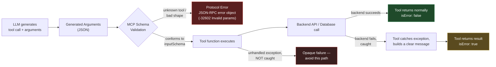
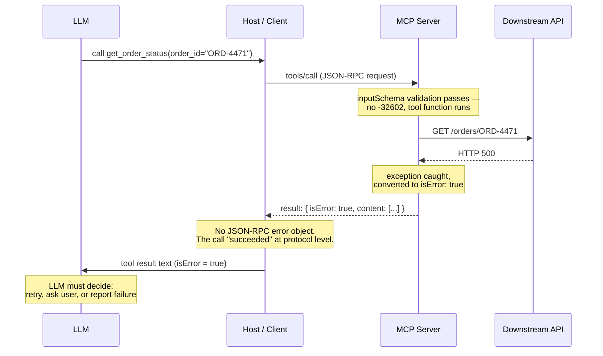

# Error Handling

## Learning Objectives

By the end of this chapter you will be able to:

- Distinguish **protocol errors**, **tool errors**, **validation errors**, **API/database errors**, **timeouts**, and **authentication errors** by where in the request chain they originate and how they surface on the wire.
- Explain precisely why an unknown tool name or a malformed argument is a JSON-RPC error object (`-32602`), while a tool that runs and fails logically returns a normal, successful result with `isError: true`.
- Read a `tools/call` failure and correctly localize the fault to the LLM, the transport, the MCP server's validation layer, the tool's own code, or a downstream backend — without guessing.
- Write a tool implementation that catches downstream exceptions and turns them into useful, LLM-actionable error messages instead of opaque stack traces or transport crashes.
- Tell the difference between a client giving up waiting on a slow tool and a tool's own call to a downstream service timing out — and why the distinction changes what you should do about it.
- Apply a retry-safety decision (retry with backoff, retry once, or never retry) to each error category, setting up the production retry policy built in Chapter 20.

## Prerequisites

- Chapter 3 (Protocol Fundamentals & Lifecycle) — JSON-RPC 2.0 request/response/error shapes, `initialize` handshake.
- Chapter 4 (MCP Tools) — the `tools/call` result shape, `content` blocks, and the `isError` flag.
- Chapter 9 (Building MCP Clients) — `ClientSession`, how a client issues `call_tool` and receives a result.
- Chapter 10 (Tool Schema Design) — `inputSchema`, and how the LLM's generated arguments get checked against it.
- Comfort with Python exception handling and `httpx` (or an equivalent async HTTP client).

## Why MCP Error Handling Deserves Its Own Chapter

In a REST API, "error handling" usually means picking the right HTTP status code. MCP has an extra wrinkle that trips up almost everyone the first time they debug a failing tool call: **there are two completely independent error channels, and mixing them up sends you looking in the wrong place.**

1. **The JSON-RPC envelope can fail.** This happens when something is wrong with the *request itself* — malformed JSON, an unknown method, an unknown tool name, or arguments that don't conform to the tool's `inputSchema`. The server never runs your tool's business logic. It returns a standard JSON-RPC **error object**, and the `tools/call` never "succeeds" at all.
2. **The JSON-RPC envelope can succeed, but the tool can still fail.** Your tool function ran. It called a database, hit a REST API, or did some computation — and that failed. This is reported *inside a successful JSON-RPC result*, via `isError: true` in the `tools/call` response's `result` object.

These two are structurally different, not just semantically different: one is a JSON-RPC-level exception/error path in your client code, the other is a perfectly normal response that you have to inspect to notice something went wrong. Confusing them is the single most common cause of "the LLM says the tool succeeded but it clearly didn't" bugs in production MCP integrations, and it's exactly the kind of thing interviewers probe for.

## The Six Error Categories

| Category | What actually failed | Where it's caught | Wire shape |
|---|---|---|---|
| **Protocol Error** | Malformed JSON-RPC, unknown method, unknown tool name, arguments that don't match `inputSchema` | Client library / MCP server's dispatch layer, *before* your tool code runs | JSON-RPC `error` object (`code`, `message`, optional `data`) — the `tools/call` request itself fails |
| **Validation Error** | Arguments look like JSON but violate the tool's `inputSchema` (wrong type, missing required field, out-of-range value) | Usually folded into Protocol Error (`-32602 Invalid params`) — see below for the nuance | JSON-RPC `error` object |
| **Tool Error** | The tool executed but concluded it failed (business-logic failure, downstream failure, bad state) | Inside your tool function; you (or the framework's safety net) convert it to a result | Successful JSON-RPC `result`, `isError: true` |
| **API / Database Error** | The tool's own call to *its* backend (a REST API, a database, a message queue) failed | Inside your tool function, wrapping the client call to that backend | Normally surfaces as a Tool Error, *if* you catch it |
| **Timeout** | Either the client gave up waiting on a slow tool, or the tool's own call to a downstream service timed out | Two entirely different layers — client-side vs. tool-internal | Client-side: no MCP response at all, client-local exception. Tool-internal: Tool Error (if caught) |
| **Authentication Error** | 401/403 from the MCP server itself (client isn't authorized to call it — Chapter 13), *or* 401/403 the tool receives from a downstream API it calls with its own credentials | MCP-server-level auth is enforced by the transport/middleware before the tool runs; downstream auth is caught inside the tool | Server-level: HTTP 401/403 on the transport, not even a JSON-RPC response. Downstream: Tool Error |

The rest of this chapter walks through each of these in order, then ties them together with a diagnosis workflow and a retry policy.

## Protocol Errors: Failing Before the Tool Ever Runs

MCP transport is JSON-RPC 2.0, so protocol-level failures use the standard JSON-RPC error object:

```json
{
  "jsonrpc": "2.0",
  "id": 7,
  "error": {
    "code": -32602,
    "message": "Invalid params",
    "data": { "details": "Unknown tool: 'get_orderstatus'" }
  }
}
```

The standard JSON-RPC 2.0 codes you'll actually see in MCP:

| Code | Meaning | Example MCP trigger |
|---|---|---|
| `-32700` | Parse error | The request body isn't valid JSON at all |
| `-32600` | Invalid Request | Valid JSON, but not a valid JSON-RPC envelope (missing `jsonrpc`, malformed `id`) |
| `-32601` | Method not found | The top-level RPC method doesn't exist — e.g. calling `tools/frbonicate` instead of `tools/call` |
| `-32602` | Invalid params | The RPC method exists (`tools/call` is real), but something about the *parameters* is wrong |
| `-32603` | Internal error | The server itself threw an unhandled exception in its own dispatch code (not your tool's business logic) |
| `-32000` to `-32099` | Server error (reserved range) | Implementation-defined server errors |

Here's the detail that surprises people: **an unknown tool name is `-32602`, not `-32601`.** That feels backwards until you remember that `tools/call` itself is a perfectly valid, well-known method. The problem isn't the method — it's that one of its *parameters* (the `name` field identifying which tool to invoke) doesn't refer to anything real. The same code, `-32602`, is what you get when the `arguments` object doesn't conform to the tool's declared `inputSchema`: wrong type for a field, a missing required property, a string where the schema demands an enum value, and so on.

This means **Validation Error, as a category, is not a separate wire-level error type** — in the classic protocol it's folded into `-32602 Invalid params`, the same code used for an unknown tool. What differs is *when in the chain* it's caught:

- **Unknown tool name**: caught the moment the server looks up `name` in its tool registry, before any schema is even consulted.
- **Schema-violating arguments**: caught after the tool is found, when the server (or the SDK layer wrapping your tool function) validates `arguments` against that tool's `inputSchema`.

In both cases, your tool function's body never executes. This is the load-bearing fact for debugging: **if you see a JSON-RPC `error` object, your tool's code did not run.** Whatever's wrong is upstream of your business logic — a bad tool name, bad arguments, a malformed request, or a bug in the MCP server's own dispatch code.

> **Where exactly does schema validation happen, precisely?** Most SDK implementations, including `FastMCP` (v1.x), validate the incoming `arguments` object against the `inputSchema` derived from your tool function's type hints *before* invoking your function — rejecting non-conforming calls at the framework layer with `-32602`. This is the common case and the one to design around. That said, exactly how strict and how early this validation runs is implementation-specific, and the fact sheet for this course does not guarantee identical behavior across every SDK version. If you're unsure whether your framework validates before or after entering your function body, the fastest way to find out is to call your tool from MCP Inspector (Chapter 12) with deliberately malformed arguments and watch whether you get a JSON-RPC `error` object or an `isError: true` result — don't assume, verify.

> **2026-07-28 spec note:** the stateless redesign adds two new protocol-level error codes you should recognize even though you'll mostly work against the classic (2025-06-18) model: `-32021 MissingRequiredClientCapabilityError` (a request needs a capability the client never declared — capabilities now travel with every request instead of being negotiated once at `initialize`) and `-32022 UnsupportedProtocolVersionError` (protocol version mismatch, since there's no handshake to negotiate it up front). Also worth flagging: the classic resource-not-found code `-32002` is folded into the generic `-32602 Invalid params` in the new spec, though clients are expected to still accept `-32002` from servers that haven't migrated.

## Tool Errors: The Tool Ran, and It Failed

A Tool Error means the JSON-RPC call *succeeded* — the server accepted the request, found the tool, validated the arguments, and ran your function. Your function just concluded that the operation itself didn't work. This is reported inside a normal, successful result:

```json
{
  "jsonrpc": "2.0",
  "id": 8,
  "result": {
    "content": [
      { "type": "text", "text": "No order found with ID 'ORD-9999'." }
    ],
    "isError": true
  }
}
```

Nothing about this response looks like a failure at the transport level — there's no `error` field, the HTTP status (if you're on Streamable HTTP) is a normal 200, and a client that only checks for JSON-RPC errors will think the call worked. **You must explicitly check `isError` on every successful `tools/call` result.** This is by design: it lets the LLM see the failure as part of the conversation (as `content`, the same union of text/image/resource blocks used everywhere else in MCP) so it can react — retry with different arguments, ask the user a clarifying question, or explain the failure — rather than the failure being invisible plumbing the LLM never gets to reason about.

## API and Database Errors: The Tool's Own Backend Failed

"API Error" and "Database Error" aren't separate MCP wire concepts — they're the most common *cause* of a Tool Error. Your tool function is a bridge between the MCP protocol and some real backend (a REST API, Postgres, a message queue, another microservice), and that backend can fail in all the ordinary ways backends fail: connection refused, 500 Internal Server Error, constraint violation, query timeout, deadlock.

The MCP protocol doesn't know or care what's on the other side of your tool function. **It is entirely your responsibility, as the tool author, to catch these failures and translate them into either a good `isError: true` result or a legitimate successful result** — never an unhandled exception that crashes out of your function uncontrolled. The worked example later in this chapter shows exactly how to do this.

## Timeouts: Two Completely Different Problems

"The tool timed out" is ambiguous, and conflating the two things it can mean will cost you real debugging time.

### Client-side timeout (the host gave up waiting)

Your MCP client (or the host application built on top of it) sets its own patience threshold for how long it will wait on a `tools/call` response — a few seconds, thirty seconds, whatever's configured. If the server hasn't responded by then, the *client* raises its own local exception. This happens entirely outside the MCP protocol: there is no JSON-RPC response at all (successful or error), because from the client's perspective, nothing came back in time. The server might still be working — it might even finish successfully a moment later — but the client has already moved on.

This matters enormously for **retry safety** and **idempotency**: if you retry after a client-side timeout, you might be firing off a *second* copy of an operation whose first copy is still in flight or already completed (think: "create an order" called twice because the first response arrived one second too late).

### Tool-internal timeout (the tool's call to a downstream service timed out)

This is completely different: *your tool function* set a timeout on *its own* HTTP client or database driver when calling a backend, and that backend didn't respond in time. Your code is still very much alive and in control — you catch this exactly like any other API error (it's a specific exception type, e.g. `httpx.TimeoutException`), and you get to decide how to report it. Handled correctly, this becomes a normal Tool Error with `isError: true` and a message like "timed out waiting for the orders service" — the MCP call to *your* server succeeded just fine; it's your tool's downstream dependency that was slow.

| | Client-side timeout | Tool-internal timeout |
|---|---|---|
| Who gives up | The MCP client/host, waiting on `tools/call` | Your tool's own HTTP/DB client, waiting on the downstream service |
| What the LLM/host sees | No MCP response at all — a local client exception | A normal `tools/call` result with `isError: true` |
| Is the tool still running server-side? | Possibly yes — unknown to the client | No — your function already returned |
| Idempotency concern | High — the operation may or may not have completed | Lower — you know for certain it didn't complete, because your own call failed |

## Authentication Errors: Two Different "Who's Not Authorized"

Just like timeouts, "auth error" collapses two unrelated failures if you're not careful:

1. **The MCP server rejects the client itself.** This is a 401/403 at the *transport* level (HTTP, for Streamable HTTP servers), enforced before any JSON-RPC message is even processed — the client isn't authorized to talk to this MCP server at all. This is the OAuth 2.1 / Protected Resource Metadata flow covered in depth in Chapter 13; from this chapter's perspective, the key point is that it happens *outside* the JSON-RPC layer entirely, on the raw HTTP response.
2. **The tool's own downstream call gets rejected.** The MCP server itself authenticated the client just fine, ran the tool, and *the tool's own credentials* (an API key, a service account, a database user) were rejected by whatever backend it called. This is an ordinary API error from the tool's perspective — caught inside your function, reported as a Tool Error.

The practical distinction: server-level auth failures mean **the client/user can't talk to this MCP server at all** (a configuration problem for whoever is deploying the client). Downstream auth failures mean **this specific tool's backend credentials are broken or expired** (a configuration problem for whoever is operating that one integration) — every *other* tool on the same server might work fine.

## The Debugging Chain

Every tool call passes through the same four stages, and a failure at each stage looks different from the outside. Internalizing this diagram is the fastest way to stop guessing where a bug lives.



Read this diagram right to left when you're debugging: which box did the failure land in? A JSON-RPC `error` object means you never got past the `C1` box — the problem is upstream of your tool's logic (bad arguments, wrong tool name, malformed request). A successful result with `isError: true` means you reached `G`/`H` — your tool ran and something downstream (or in your own logic) failed, and it was handled. If you're staring at a generic, unhelpful "Internal Server Error"-style message with no business context, you've likely fallen into the `I` box — an exception escaped your tool function uncaught, and either the framework's safety net stringified a raw exception for you, or worse, the whole request failed at the protocol level with `-32603`.

## Worked Example: Catching a Downstream Failure Correctly

Here's a tool (v1.x SDK, `mcp.server.fastmcp.FastMCP`) that calls a downstream REST API and needs to handle everything that can go wrong with that call.

**The wrong way** — this looks reasonable at a glance, but it does no error handling at all:

```python
# v1.x SDK — DO NOT DO THIS
import httpx
from mcp.server.fastmcp import FastMCP

mcp = FastMCP("Orders")

@mcp.tool()
async def get_order_status(order_id: str) -> str:
    """Look up the current status of an order by ID."""
    async with httpx.AsyncClient(timeout=5.0) as client:
        resp = await client.get(f"https://orders.internal/api/orders/{order_id}")
        resp.raise_for_status()
        data = resp.json()
        return f"Order {order_id} is currently '{data['status']}'."
```

If the downstream API returns a 500, times out, or is unreachable, an exception propagates straight out of the tool function. Depending on your SDK version, this either crashes into a generic `-32603 Internal error` protocol failure (which the LLM can't act on — it looks identical whether the *server itself* has a bug or the *downstream API* had a bad day), or gets caught by a framework-level safety net and turned into `isError: true` with nothing more useful than the raw Python exception string (`ConnectionError: [Errno 111] Connection refused`) — technically true, but not something an LLM (or a human reading the LLM's explanation) can act on.

**The right way** — catch each failure mode explicitly and write a message aimed at whoever reads it next (the LLM, and through it, the user):

```python
# v1.x SDK (mcp.server.fastmcp.FastMCP)
import httpx
from mcp.server.fastmcp import FastMCP

mcp = FastMCP("Orders")

@mcp.tool()
async def get_order_status(order_id: str) -> str:
    """Look up the current status of an order by ID."""
    try:
        async with httpx.AsyncClient(timeout=5.0) as client:
            resp = await client.get(f"https://orders.internal/api/orders/{order_id}")
            resp.raise_for_status()
            data = resp.json()
            return f"Order {order_id} is currently '{data['status']}'."

    except httpx.TimeoutException:
        # Tool-internal timeout: OUR call to the downstream service didn't
        # come back in time. The MCP call to us is fine; the fault is downstream.
        raise ValueError(
            f"Timed out after 5s waiting for the orders service "
            f"(order_id={order_id}). The backend may be degraded; "
            "this is safe to retry."
        )

    except httpx.HTTPStatusError as exc:
        status = exc.response.status_code
        if status == 404:
            # Not found is never fixed by retrying with the same arguments.
            raise ValueError(f"No order found with ID '{order_id}'.")
        if status in (401, 403):
            # Downstream auth failure: OUR credentials to the orders
            # service are broken/expired. Config problem, not a blip.
            raise ValueError(
                f"Orders service rejected this server's credentials "
                f"({status}). This is a configuration issue, not something "
                "a retry will fix — contact the service operator."
            )
        # Anything else in the 5xx range: treat as transient.
        raise ValueError(
            f"Orders service returned HTTP {status} for order '{order_id}'. "
            "Treat as a transient backend fault; retrying once is reasonable."
        )

    except httpx.RequestError as exc:
        # DNS failure, connection refused, TLS error, etc.
        raise ValueError(f"Could not reach the orders service: {exc!r}")
```

> **Verify, don't assume, how your SDK converts a raised exception.** In practice, `FastMCP`-style frameworks commonly catch exceptions raised inside a `@mcp.tool()`-decorated function and convert them into a result with `isError: true`, using the exception's message as the text content — which is exactly why the example above raises `ValueError` with a carefully written message rather than trying to construct a result object by hand. Treat this conversion as a safety net you don't fully control, not a documented contract: the message you put in the exception *is* what the LLM (and, through it, the user) will see, so write it as user-facing text, never as a debug log line. If you need to be certain of the exact behavior for your installed SDK version, call the tool from MCP Inspector (Chapter 12) and look at the raw result.

What the client actually receives on the downstream-500 branch, at the wire level (using the confirmed `content`/`isError` result shape from Chapter 4):

```json
{
  "jsonrpc": "2.0",
  "id": 12,
  "result": {
    "content": [
      {
        "type": "text",
        "text": "Orders service returned HTTP 500 for order 'ORD-4471'. Treat as a transient backend fault; retrying once is reasonable."
      }
    ],
    "isError": true
  }
}
```

No JSON-RPC `error` field anywhere. This request "succeeded" as far as the protocol is concerned — the fault, and the information about the fault, lives entirely in `content` + `isError`.

## Client-Side: Checking for Both Failure Channels

A client that only handles one of the two channels will silently swallow the other. Handle protocol errors as exceptions from your client call, and check `isError` on every successful result:

```python
# v1.x SDK — client side
from mcp import ClientSession, StdioServerParameters
from mcp.client.stdio import stdio_client

async with stdio_client(server_params) as (read, write):
    async with ClientSession(read, write) as session:
        await session.initialize()

        try:
            result = await session.call_tool(
                "get_order_status", arguments={"order_id": "ORD-4471"}
            )
        except Exception as exc:
            # Protocol-level failure: bad tool name, bad arguments, malformed
            # request, or a server-side dispatch bug. Your tool code never ran.
            # The exact exception type/attributes carrying the JSON-RPC error
            # code/message/data vary by SDK version — inspect `exc` directly
            # during development rather than assuming a specific shape.
            print(f"Protocol error — tool never executed: {exc!r}")
        else:
            # The JSON-RPC call succeeded. That does NOT mean the tool
            # succeeded — check isError explicitly.
            if getattr(result, "isError", False) or getattr(result, "is_error", False):
                print(f"Tool ran but reported failure: {result.content}")
            else:
                print(f"Tool succeeded: {result.content}")
```

The `getattr` fallback above is deliberate: exact attribute naming (`isError` vs. a snake_cased `is_error`) can differ across SDK minor versions. Print the raw result object once during development to confirm which your installed version uses — don't guess and ship it.

## Diagnosis Scenario: Schema Validation Passed, Downstream Returned 500

Here's the scenario named at the top of this chapter: a tool call reaches your server, the arguments conform perfectly to `inputSchema` (no `-32602`), and the tool executes — but its call to the backend API comes back with a 500. From the client/host side, with no access to the server's internals, how do you actually tell what happened?



Step by step, from the client/host side only:

1. **Did `call_tool` raise, or did it return normally?** If it raised, this is a Protocol Error — the fault is upstream of the tool (bad arguments, unknown tool, transport/dispatch bug), and nothing you're describing (a downstream 500) is even possible yet, because the tool never ran.
2. **Given it returned normally, check `isError`.** `isError: true` here confirms the tool executed and its own logic decided to report a failure. This immediately rules out "the LLM sent bad arguments" (that would have been caught at validation) and rules in "something inside the tool's execution — most likely its call to a backend — failed."
3. **Read the `content` text.** If the tool author followed the pattern above, the message itself tells you which backend failed and with what status — "Orders service returned HTTP 500." If the message is generic ("Internal Server Error", a raw stack trace), that's a sign the tool isn't catching its own downstream failures properly — a bug in the tool, not evidence about whether the downstream call actually is transient.
4. **Correlate against server-side observability.** From the client alone you can *infer* a downstream 500 from the message text, but you can't independently *verify* it — that requires the MCP server's own logs, the downstream API's logs, or a tracing system correlating a request ID (Chapter 20 covers wiring this up in production). MCP Inspector (Chapter 12) lets you replay the exact same tool call outside the LLM loop, which isolates "did the LLM send weird arguments that happen to still validate but confuse the backend" from "the backend is genuinely down right now" — call the tool manually with identical arguments and see if you get the same 500.
5. **Never conflate "isError: true" with "protocol failure."** This is the crux of the whole diagnosis: because there's no JSON-RPC `error` object anywhere in this scenario, any client code that only watches for exceptions on `call_tool` will report this call as a success. Downstream 500s handled this way are the classic case of "the LLM thinks it succeeded" bugs — the fix isn't in the client, it's making sure whatever surfaces the result to the LLM actually branches on `isError`.

## Retry Semantics: What's Safe to Retry, and What Isn't

This table is the seed of Chapter 20's production retry policy — get comfortable with it now, because the categories don't change, only the implementation (backoff schedules, circuit breakers, idempotency keys) gets more sophisticated later.

| Error category | Safely retryable? | Why |
|---|---|---|
| Protocol Error — Parse/Invalid Request (`-32700`/`-32600`) | **No** | The request your client built is malformed. Retrying the identical malformed request reproduces the identical failure — fix the client bug first. |
| Protocol Error — Method not found (`-32601`) | **No** | You're calling something that doesn't exist on this server (wrong method name, version mismatch). Retrying doesn't change that. |
| Protocol Error / Validation Error — Invalid params, unknown tool, schema violation (`-32602`) | **No** | The LLM generated arguments (or a tool name) that don't work. An identical retry reproduces the identical rejection — what actually helps is surfacing the validation failure back to the LLM so it can regenerate different arguments, not blindly resending the same ones. |
| Protocol Error — Internal error (`-32603`) | **Maybe, with backoff, low confidence** | Could be a transient bug in the server's own dispatch code, or could be permanent. Cap attempts low. |
| Tool Error — downstream 5xx / transient API fault | **Yes, with backoff and a cap** | The classic transient-failure case; the backend is plausibly fine a moment later. |
| Tool Error — downstream 4xx (400/404/422) | **No** | The request is fundamentally invalid for that resource (wrong ID, malformed payload the API rejects). Retrying unchanged arguments reproduces the same 4xx. |
| Authentication Error — server-level (401/403 on the MCP connection itself) | **No** | Client isn't authorized to use this MCP server at all; retrying without fixing credentials/config accomplishes nothing. |
| Authentication Error — downstream (tool's own credentials rejected) | **No** | Same reasoning, one layer down: the tool's service-account/API key is broken or expired. This needs an operator to fix, not a retry loop. |
| Timeout — client-side (host gave up waiting) | **Maybe, cautiously** | The tool might have kept running server-side and even completed. Retrying a non-idempotent operation (e.g., "create an order") risks doing it twice. Check idempotency before retrying. |
| Timeout — tool-internal (downstream call timed out) | **Yes, with backoff, if the operation is idempotent** | You know for certain your own call didn't complete, so it's safer than a client-side timeout — but still confirm the underlying operation is safe to repeat. |

The load-bearing rule underneath this whole table: **never retry a category whose root cause is "the request itself is wrong."** Validation errors, auth errors, and 4xx downstream errors will fail exactly the same way every time you resend them — retrying just burns latency and, in a loop with an LLM deciding when to retry, can spiral into repeated identical failed calls. Reserve retries for categories whose root cause is "the world was briefly unavailable" — timeouts and 5xx/transient errors — and always pair them with a backoff schedule and a hard cap, which Chapter 20 builds out in full.

## Real-World Scenario: The Silent Retry Storm

A production support team wires an MCP server in front of an internal "inventory" REST API so an ordering agent can check stock levels before confirming a customer order. The inventory API is generally reliable, but during a deploy window it starts returning HTTP 503 for about ninety seconds.

The tool implementation looks reasonable at first glance:

```python
@mcp.tool()
async def check_stock(sku: str) -> str:
    """Check current stock level for a SKU."""
    async with httpx.AsyncClient(timeout=3.0) as client:
        resp = await client.get(f"https://inventory.internal/stock/{sku}")
        resp.raise_for_status()
        return f"{resp.json()['available']} units available for {sku}."
```

No `try`/`except` at all. During the 503 window, every call to `check_stock` raises an `httpx.HTTPStatusError` straight out of the tool function. Depending on the framework's exception-to-result conversion behavior, this becomes either a generic `-32603` protocol error or an `isError: true` result whose text is just the raw exception repr — either way, the message carries no signal about *whether this is worth retrying*.

The host application, wired for resilience, sees "an error happened" and retries automatically up to three times per tool call. The LLM, seeing repeated vague failures with no useful text to reason from, also decides on its own to try the tool again with the same SKU "just in case." The result: what should have been a single, clearly-labeled transient 503 (safe to retry once, with backoff) turns into an uncoordinated retry storm — the host retrying, the LLM independently retrying on top of that — hammering an already-degraded inventory service with several times its normal request volume, right when it can least handle it.

The fix follows directly from this chapter: catch `httpx.HTTPStatusError` explicitly, distinguish 503 (transient, safe to retry with backoff) from 404 (not retryable — the SKU doesn't exist) from 401/403 (not retryable — a credentials problem), and put that verdict *in the message text* so both the host's retry logic and the LLM's own judgment are working from the same signal instead of guessing independently:

```python
@mcp.tool()
async def check_stock(sku: str) -> str:
    """Check current stock level for a SKU."""
    try:
        async with httpx.AsyncClient(timeout=3.0) as client:
            resp = await client.get(f"https://inventory.internal/stock/{sku}")
            resp.raise_for_status()
            return f"{resp.json()['available']} units available for {sku}."
    except httpx.HTTPStatusError as exc:
        status = exc.response.status_code
        if status == 404:
            raise ValueError(f"No inventory record found for SKU '{sku}'.")
        if status in (401, 403):
            raise ValueError(
                f"Inventory service rejected this server's credentials ({status})."
            )
        raise ValueError(
            f"Inventory service returned HTTP {status} for SKU '{sku}' — "
            "transient, safe to retry once after a short delay."
        )
    except httpx.TimeoutException:
        raise ValueError(
            f"Inventory service timed out checking SKU '{sku}' — transient, "
            "safe to retry once."
        )
```

Chapter 20 takes this same idea and formalizes it: a shared retry policy keyed off error category, applied consistently at the host/client layer instead of left to ad hoc, uncoordinated retries at every layer that happens to touch the call.

## Best Practices

- **Always distinguish protocol failures from tool failures explicitly in client code.** Wrap `call_tool` to catch exceptions *and* check `isError` on the successful path — never assume one implies the absence of the other.
- **Catch specific exceptions, not a bare `except Exception`.** Different downstream failure modes (404, timeout, 5xx, connection refused) call for different messages and different retry advice; a blanket catch-all collapses that distinction and produces a generic, unhelpful message.
- **Write tool error messages for the reader, not for a log file.** The text in `content` is what the LLM sees and potentially repeats to a user — include what failed, why, and (when you know) whether retrying makes sense.
- **Never let an unhandled exception be your error-handling strategy.** Even if your SDK happens to convert uncaught exceptions into `isError: true` today, that's a safety net, not a design — the message quality (and sometimes whether it becomes a protocol error at all) is out of your control if you rely on it.
- **Treat 4xx-family downstream errors and auth errors as terminal, not transient.** Don't build retry logic that treats every downstream failure the same way.
- **Consider idempotency before retrying anything, especially after a client-side timeout.** If you don't know whether the first attempt completed, retrying a non-idempotent operation is a correctness bug waiting to happen, not a resilience feature.
- **Verify your SDK's actual behavior empirically with MCP Inspector** (Chapter 12) rather than assuming — exception-to-result conversion and exact attribute names have varied across SDK versions and aren't something this course can promise will match your exact installed version.
- **Log the technical detail server-side; keep the LLM-facing message actionable and concise.** A full stack trace belongs in your server's stderr/logs, not in the `content` block the LLM has to parse.

## Common Mistakes

- **Only checking for exceptions on `call_tool` and never inspecting `isError`.** This silently treats every Tool Error as a success — the single most common bug this chapter exists to prevent.
- **Assuming a downstream 500 always means "-32603 Internal error."** It doesn't, and usually shouldn't — if your tool catches it properly, it's an ordinary `isError: true` Tool Error, not a protocol failure.
- **Retrying `-32602 Invalid params` failures unchanged.** If the LLM's arguments didn't validate, resending the exact same arguments produces the exact same rejection every time; nothing improves without different arguments.
- **Treating "the tool timed out" as one problem.** Conflating a client-side timeout (host gave up) with a tool-internal timeout (downstream call was slow) leads to wrong retry decisions, especially around idempotency.
- **Letting exceptions propagate out of tool functions uncaught** and relying on whatever the framework happens to do with them, rather than deliberately catching and shaping the message.
- **Putting raw exception text or a stack trace directly into the `isError: true` message** instead of a clear, business-relevant explanation.
- **Blindly retrying auth errors.** A 401/403 — server-level or downstream — is a configuration problem; retrying without fixing credentials just repeats the failure (and can trigger account lockouts on the downstream side).
- **Assuming resource-not-found is always `-32002`.** That's the classic-protocol code; the 2026-07-28 spec folds it into `-32602`, and clients need to tolerate both depending on which server they're talking to.

## Summary

MCP splits failures into two independent channels: protocol errors (a standard JSON-RPC error object, meaning your tool's code never ran) and tool errors (a normal, successful result with `isError: true`, meaning your tool ran and reported its own failure). Validation errors are, in the classic protocol, a flavor of protocol error (`-32602 Invalid params`) caught before your function body executes — though exactly how early depends on your SDK. API, database, and downstream-auth errors are your responsibility as the tool author to catch and translate into a clear Tool Error rather than an unhandled exception. Timeouts and auth errors each split into two unrelated sub-cases (client-side vs. tool-internal timeout; server-level vs. downstream auth) that look identical in casual conversation but demand different diagnosis and different retry decisions. The debugging discipline that ties all of this together: check for a JSON-RPC error first (nothing ran), then check `isError` (something ran and failed), then read the message (does it tell you *why*, and whether it's worth retrying) — and only retry categories whose failure is genuinely transient, never ones caused by a bad request, bad arguments, or bad credentials.

## Knowledge Check

1. A client calls a tool with an argument that's a string where the schema requires an integer. What does the client see: a JSON-RPC error object, or a successful result with `isError: true`? Why?
2. Why is an unknown tool name reported as `-32602 Invalid params` rather than `-32601 Method not found`?
3. Your tool's call to a downstream API returns HTTP 500. You catch the exception and return a message via `isError: true`. At the JSON-RPC level, did this `tools/call` "succeed" or "fail"? What field(s) would a naive client miss if it only checked for exceptions?
4. Explain, in your own words, the difference between a client-side timeout and a tool-internal timeout. Which one leaves you more certain that the underlying operation didn't complete?
5. A tool receives a 403 from the downstream API it calls. Is this safely retryable? Would your answer change if the 403 came from the MCP server itself rejecting the client's connection instead?
6. Why shouldn't you rely on "the framework converts uncaught exceptions to `isError: true`" as your error-handling strategy, even where it happens to be true?
7. Given the diagnosis scenario in this chapter (schema validation passes, downstream returns 500), list the concrete steps you'd take, from the client/host side alone, to confirm the fault is downstream rather than in the MCP server's own code.
8. Which of the six error categories in this chapter are, as a rule, never safe to retry unchanged? Why do they all share that property?

## Hands-On Exercise

Using the `mcp[cli]<2` SDK (v1.x, `FastMCP`), build a small tool server with one tool, `lookup_user(user_id: str) -> str`, that calls a fake downstream API (you can stub this with a local function that randomly raises `httpx`-style conditions, or point it at any public HTTP endpoint you control, such as `https://httpbin.org/status/500`).

1. First, implement the tool with **no error handling at all** — let any exception propagate. Connect with MCP Inspector (a preview of Chapter 12: `npx @modelcontextprotocol/inspector`, or `uv run mcp dev server.py`) and trigger the failure. Record exactly what you see in the raw JSON-RPC traffic: is it a JSON-RPC `error` object, or a successful result with `isError: true` and a raw exception string? This tells you your installed SDK's default exception-conversion behavior.
2. Now add explicit `try`/`except` blocks that distinguish at least three failure modes (e.g., not-found, auth-rejected, and generic-server-error) and raise clear, differentiated messages for each, following the pattern in this chapter's worked example.
3. Deliberately call the tool with an argument that violates the schema (e.g., pass an integer where `user_id: str` is expected, if your test harness lets you bypass client-side coercion) and confirm you get a JSON-RPC error object, not an `isError: true` result — verifying the protocol-error-vs-tool-error boundary for yourself.
4. Write a small client script (using `ClientSession`) that calls the tool three times — once triggering the not-found case, once the auth case, and once the transient-error case — and prints, for each, whether it caught a client-side exception or received `isError: true`, plus your own retry recommendation for that call based on the table in this chapter.

## Further Reading

- Official spec, base protocol / error handling: `modelcontextprotocol.io/specification` (check which revision the page you're reading describes — this chapter targets 2025-06-18 as the "classic" baseline)
- JSON-RPC 2.0 specification (standard error codes `-32700` through `-32603`): `www.jsonrpc.org/specification`
- Chapter 4 (MCP Tools) — the `tools/call` result shape and `content` block union this chapter builds on
- Chapter 10 (Tool Schema Design) — how `inputSchema` is constructed and why well-designed schemas reduce validation-error volume in the first place
- Chapter 12 (MCP Inspector & Debugging) — the practical tool for verifying exactly how your SDK converts exceptions and reports errors
- Chapter 13 (Authentication & Authorization) — the full treatment of server-level 401/403, Protected Resource Metadata, and OAuth 2.1
- Chapter 20 (Production MCP Architecture) — retries, backoff, circuit breakers, and idempotency built on top of the error taxonomy from this chapter

<div style="display:flex;justify-content:space-between;align-items:center;">
  <a href="./10-tool-schema-design.md">← Previous: Tool Schema Design</a>
  <a href="./00-index.md">🏠 Index</a>
  <a href="./12-mcp-inspector-and-debugging.md">Next: MCP Inspector & Debugging →</a>
</div>
