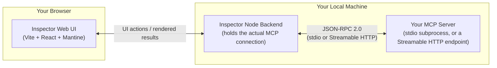
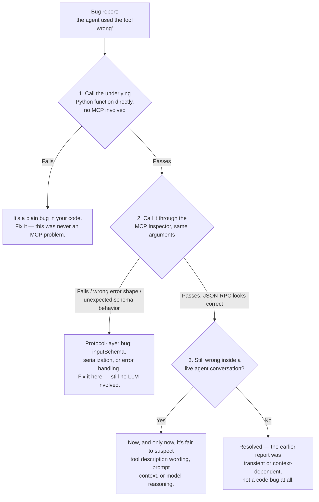

# MCP Inspector & Debugging

## Learning Objectives

By the end of this chapter, you will be able to:

- State the core debugging discipline this chapter exists to instill: **isolate the server from the agent
  before you debug either one** — a bug that looks like "the LLM keeps calling the tool wrong" is, more often
  than not, a schema, serialization, or transport bug you can find in seconds without an LLM in the loop at all
- Launch the MCP Inspector (`@modelcontextprotocol/inspector`) against a server over both stdio and Streamable
  HTTP, in its default web-UI mode, its scriptable `--cli` mode, and its terminal `--tui` mode
- Launch the Inspector directly from an SDK project with `uv run mcp dev server.py` without installing anything
  from npm yourself
- Read the raw JSON-RPC traffic the Inspector shows you — the exact `initialize` negotiation, the exact
  `tools/call` request and response — and use it to tell a protocol-level error apart from a tool-level one
- Reproduce, with a real calculator/analytics server, both classes of MCP error from Chapter 11 (a JSON-RPC
  protocol error from bad arguments, and an `isError: true` tool result from a valid-but-unsafe call) and
  recognize each on the wire
- Log diagnostic information from a stdio server correctly (stderr, never stdout) and explain, precisely, why
  writing anything else to stdout silently corrupts every message after it
- Apply a four-step debugging checklist — direct Python call, Inspector call, then and only then suspect the
  agent/LLM — and explain why skipping straight to "debug it through a live agent conversation" is one of the
  most expensive habits an MCP developer can have

## Prerequisites

- **Chapter 3** (Protocol Fundamentals & Lifecycle) — you need to already recognize `initialize`, `initialized`,
  and the `tools/call` request/response shapes on sight; this chapter reads them off the wire rather than
  re-deriving them
- **Chapter 7** (Building MCP Servers) — this chapter debugs the calculator/analytics server you built there;
  if you built a different server, the techniques transfer directly, only the tool names change
- **Chapter 8** (Transport Mechanisms) — specifically its warning that a stdio server's stdout is reserved
  exclusively for JSON-RPC messages; this chapter is where that warning becomes a debugging technique
  (structured stderr logging) rather than just a rule
- **Chapter 9** (Building MCP Clients) — `ClientSession`, `stdio_client`, `streamable_http_client`; you should
  know what a client does before you watch the Inspector do it for you in a UI
- **Chapter 11** (Error Handling) — the distinction between a JSON-RPC protocol error and a tool execution
  error reported via `isError: true` inside a successful result. This chapter is the practical payoff of that
  distinction: you're about to see both kinds of error on the wire and learn to tell them apart at a glance
- Node.js and `npx` available on your machine (the Inspector is an npm package); `uv` if you want the SDK-native
  launch path

---

## Why Test Outside the Agent Loop First

Here is the failure mode this entire chapter is designed to prevent: a tool call goes wrong somewhere in a
multi-turn agent conversation, and the instinct is to debug it *there* — rerun the agent, tweak the system
prompt, rerun the agent again, add a sentence to the tool description, rerun the agent a third time, watch the
model's reasoning trace to guess what it was "thinking." Every iteration costs a full LLM round trip, is subject
to sampling noise (the same prompt can produce a different tool call on the next run), and — critically —
assumes the bug is in the model's reasoning before you've ruled out every layer underneath it: your tool
function's own logic, your `inputSchema`, your serialization of the result, your transport.

MCP gives you a way to rule out all of those layers **without an LLM anywhere in the loop**. A tool exposed
through MCP is, underneath the protocol envelope, still an ordinary Python function with a JSON Schema attached.
You can call the function directly. You can call it through the protocol with a purpose-built client that isn't
an LLM at all. Only once both of those come back clean is it reasonable to suspect the model's tool-calling
decision itself. Skipping straight to the agent conversation for every bug is like debugging a REST API by only
ever testing it through a web app's UI — technically possible, but you're paying an enormous tax in iteration
speed and reproducibility for no better information than `curl` (or, here, the Inspector) would have given you
directly.

The MCP Inspector is the `curl`/Postman-equivalent for this protocol: a dedicated client whose entire job is
letting a human drive tools, resources, and prompts by hand and see exactly what went over the wire.

## The MCP Inspector

### What it is

`@modelcontextprotocol/inspector` is an npm package maintained alongside the protocol itself: an interactive
client built specifically for exercising an MCP server without writing any client code. The default experience
is a **web UI** — a Vite + React + Mantine frontend talking to a small Node backend that actually holds the MCP
connection (spawning your stdio subprocess, or opening the HTTP connection, on your behalf) and relays messages
to the browser tab you interact with.



That split matters for one practical reason: the Inspector's backend, not your browser, is the actual MCP
client. It is the thing that spawns your stdio process or opens the HTTP connection, sends `initialize`, and
forwards every request/response pair up to the UI for you to read. Nothing about your server needs to know or
care that a human, rather than an LLM-driven agent, is on the other end of the session — from the server's point
of view, the Inspector is just another spec-compliant client.

### Launch modes

| Command | Mode | When to reach for it |
|---|---|---|
| `npx @modelcontextprotocol/inspector <command> [args...]` | Web UI (default) | Interactive, exploratory debugging — the mode you'll use most while developing |
| `npx @modelcontextprotocol/inspector --cli <command> [args...] ...` | Scriptable CLI | CI pipelines, shell scripts, one-shot smoke tests — no browser involved |
| `npx @modelcontextprotocol/inspector --tui <command> [args...]` | Terminal UI | Interactive debugging over SSH / in a terminal-only environment, without a browser |
| `uv run mcp dev server.py` | Web UI, launched from your SDK project | You're already inside an `mcp[cli]`-based project and don't want to hand-construct an `npx` invocation |

For a stdio server, `<command> [args...]` is however you'd normally launch it — `python calculator_server.py`,
`uv run calculator_server.py`, and so on; the Inspector spawns exactly that command as a subprocess and speaks
JSON-RPC to it over stdin/stdout, the same way any MCP client would (Chapter 8). For a server you've deployed
over Streamable HTTP, you point the Inspector at the URL instead of a launch command — the UI has an explicit
mode/field for choosing stdio-by-command vs. HTTP-by-URL, so the same tool covers both transports without
separate installs.

`npx @modelcontextprotocol/inspector` with no arguments opens the web UI to a connection screen where you fill
in the command (or URL) interactively, which is the fastest way to get oriented the first time you run it —
prefer passing the command as an argument once you're doing this repeatedly, so you're not re-typing the launch
command in the browser every time.

> **A note on exact flags:** the fact base for this course confirms `--cli` and `--tui` exist as documented
> launch modes, and that `uv run mcp dev server.py` is the SDK-native equivalent. The exact flag names for
> *what* to call once connected in `--cli` mode (which method, which tool, which arguments) are best confirmed
> with `npx @modelcontextprotocol/inspector --cli --help` against the version you have installed — Inspector
> releases have added and renamed CLI flags over time, and this chapter would rather point you at `--help` than
> risk teaching you a flag name that's since changed.

### What you can actually inspect

Once connected, the Inspector gives you a working surface for every primitive this course has covered:

- **Tools** — the full `tools/list` result: every tool's `name`, `title`, `description`, `inputSchema`, and
  (if present) `outputSchema` and `annotations`. You can fill in arguments by hand against the rendered schema
  and issue `tools/call`, then read the result — `content` blocks, `structuredContent` if the tool declares an
  `outputSchema`, and the `isError` flag.
- **Resources** — `resources/list` and `resources/templates/list`, plus the ability to `resources/read` a
  specific URI (including filling in a templated URI's variables) and see the returned content (text or base64
  blob) directly.
- **Prompts** — `prompts/list`, and `prompts/get` with arguments filled in, showing you the exact
  `PromptMessage` list a client would receive — useful for confirming a prompt template renders the way you
  intended before any model ever sees it.
- **Schemas** — every `inputSchema`/`outputSchema` rendered as an actual form and as raw JSON, so you can catch
  a schema that's technically valid JSON Schema but produces a confusing or unusable form (a strong signal it'll
  also confuse an LLM — this ties directly back to Chapter 10's tool schema design principles).
- **Errors** — both classes from Chapter 11, and this is the detail that makes the Inspector indispensable
  rather than merely convenient: a malformed request surfaces as a JSON-RPC error object at the protocol level,
  while a tool that runs but reports failure surfaces as a normal, successful `tools/call` result with
  `isError: true` — and the Inspector shows you which one happened, instead of collapsing both into "the tool
  call failed" the way an agent transcript often does.
- **The raw JSON-RPC traffic itself** — this is the single most valuable thing the Inspector gives you that a
  hand-rolled test script doesn't hand you for free: a view of the literal messages exchanged, for both stdio
  and HTTP-connected servers. You can see exactly what `protocolVersion` and `capabilities` your server
  negotiated during `initialize`, exactly what params shape a `tools/call` request carried, and exactly what
  came back — byte-for-byte, not a client library's parsed/summarized version of it.

> **2026-07-28 spec note:** everything above describes the Inspector talking to a **classic**
> (2025-06-18-style) server — an `initialize`/`initialized` handshake followed by stateful `tools/list` and
> `tools/call` requests over one long-lived session. That's what you'll see in the traffic log against every
> server built in this course. Under the 2026-07-28 stateless redesign, there is no handshake to watch for —
> each request carries its own `protocolVersion` and `clientCapabilities` in `_meta`, and an Inspector built
> against that generation of the spec would show you a flat sequence of self-contained requests (plus, if it
> calls it, the new mandatory `server/discover` RPC) rather than an `initialize` exchange followed by a
> session. The reading skill — "look at the actual bytes, don't trust your assumption of what negotiation
> happened" — carries over unchanged; only the shape of what you'll see does not.

## Worked Debugging Session: The Calculator Server

Connect the Inspector to the calculator server from Chapter 7 (tools: `add`, `subtract`, `multiply`, `divide`,
each taking two numeric arguments) to see the two error classes from Chapter 11 on the actual wire, not just in
prose.

### Step 1 — connect and list tools

```
npx @modelcontextprotocol/inspector uv run calculator_server.py
```

The Inspector spawns the server, performs `initialize`/`initialized`, and calls `tools/list`. In the traffic
log you'll see the exact negotiated `protocolVersion` and the server's declared `capabilities` — a fast way to
confirm your `FastMCP` server actually advertises what you think it does before you've called a single tool.
Selecting the **Tools** tab shows all four tools with their `inputSchema`s rendered as forms: two required
number fields, `a` and `b`, for `divide`.

### Step 2 — a valid call

Fill in `a=10`, `b=2` for `divide` and issue the call. The request/response pair in the traffic log looks like:

```json
{"jsonrpc":"2.0","id":7,"method":"tools/call",
 "params":{"name":"divide","arguments":{"a":10,"b":2}}}
```
```json
{"jsonrpc":"2.0","id":7,
 "result":{"content":[{"type":"text","text":"5.0"}],"isError":false}}
```

Unremarkable, and that's the point — this confirms the happy path end-to-end over the actual protocol before
you go looking for a problem anywhere near it.

### Step 3 — an invalid-type call (protocol error)

Now call `divide` with `b` set to the string `"two"` instead of a number. Because `inputSchema` declares `b` as
`number`, this fails schema validation before your Python function body ever runs, and the Inspector's traffic
log shows a **JSON-RPC error object**, not a successful result:

```json
{"jsonrpc":"2.0","id":8,
 "error":{"code":-32602,"message":"Invalid params: 'b' must be a number"}}
```

This is Chapter 11's *protocol error* category. It happened before your tool's business logic — nothing in
`divide()`'s Python body executed. If a bug report says "the agent sent a string where a number belonged and
the tool call just failed," this is the exact shape you should expect to find, and finding it here — in one
Inspector call — took thirty seconds instead of a multi-turn agent transcript.

### Step 4 — a valid-schema, runtime-invalid call (tool error)

Now call `divide` with `a=10`, `b=0`. Both arguments satisfy the schema — `0` is a perfectly good `number` — so
the request passes validation and your Python function actually runs, hits a division by zero, and (per Chapter
11's guidance) the server catches that and reports it as a **tool execution error**, not a protocol error:

```json
{"jsonrpc":"2.0","id":9,"method":"tools/call",
 "params":{"name":"divide","arguments":{"a":10,"b":0}}}
```
```json
{"jsonrpc":"2.0","id":9,
 "result":{"content":[{"type":"text","text":"Error: cannot divide by zero"}],"isError":true}}
```

Notice the shape: this is still a **successful JSON-RPC response** (a `result`, not an `error` key) — it's just
a result whose `isError` flag is `true`. This is the distinction Chapter 11 called "a very common
interview/production-debugging question," and now you've seen both members of the pair on the wire, produced
by two calls that differ by exactly one argument value. Being able to tell these apart at a glance — protocol
error vs. `isError: true` result — is precisely the skill that lets you route a bug report to the right fix
(a schema problem vs. a business-logic problem) without guessing.

## Structured stderr Logging for stdio Servers

Chapter 8 told you a stdio server must never write anything but JSON-RPC messages to stdout — a stray
`print()` statement corrupts the stream, because the client is reading stdout line-by-line expecting each line
to parse as a JSON-RPC message, and a debug string breaks that parsing for every message after it. This
chapter is where that constraint becomes something you actively use rather than merely avoid violating: stderr
is unrestricted, so it's exactly where your server's own diagnostic logging belongs.

```python
import logging
import sys

# Never use print() in a stdio server. Log to stderr explicitly instead.
logging.basicConfig(
    stream=sys.stderr,
    level=logging.INFO,
    format="%(asctime)s %(levelname)s %(name)s: %(message)s",
)
logger = logging.getLogger("calculator_server")

@mcp.tool()
def divide(a: float, b: float) -> float:
    """Divide a by b."""
    logger.info("divide called with a=%r b=%r", a, b)
    if b == 0:
        logger.warning("division by zero attempted (a=%r)", a)
        raise ValueError("cannot divide by zero")
    return a / b
```

Two ways to read this log in practice:

- **Directly in the terminal** — when you launch your server as a plain subprocess (or through
  `uv run mcp dev server.py`), stderr shows up right there, interleaved with the Inspector's own console output.
- **Through the Inspector** — because the Inspector's backend is the process that actually spawns your stdio
  server, it has direct access to that subprocess's stderr stream and can surface it alongside the JSON-RPC
  traffic, letting you correlate a specific `tools/call` in the log with the log lines your own code emitted
  while handling it.

This is the difference between guessing what your tool did internally and reading exactly what it did — with
zero risk of corrupting the protocol stream, because stderr was never part of it.

## Reading Streamable HTTP Traffic Outside the Inspector

The Inspector is the primary tool for this, but a server exposed over Streamable HTTP is also, underneath, an
ordinary HTTP endpoint — which means every general-purpose HTTP debugging tool you already own applies to it
directly:

- **Browser devtools** — if your client is a browser-based app (or you're driving the server through a tool
  that runs in one), the Network tab shows the raw POST bodies and response bodies for the MCP endpoint like
  any other XHR/fetch traffic — request headers (including `MCP-Protocol-Version`), the JSON-RPC payload, and
  the response.
- **A local debugging proxy** (e.g., `mitmproxy`, or your HTTP client library's own verbose/debug logging mode)
  — point it between your client and the server's URL and you get the same raw request/response visibility the
  Inspector's traffic log gives you, useful when you're debugging a client integration (Chapter 9's
  `streamable_http_client`) rather than the server itself.
- **`curl`**, for the simplest possible sanity check — hand-construct a single `tools/call` JSON-RPC body and
  POST it directly to the server's endpoint to confirm the HTTP layer itself (headers, status codes, content
  type) is behaving before suspecting anything MCP-specific at all.

The common thread: none of these require an LLM, and all of them show you the same class of ground truth the
Inspector shows for stdio — the actual bytes on the wire, not a summary of them.

## Diagram: The Debugging Escalation Heuristic

The single habit this chapter most wants you to leave with is an ordering. When something looks wrong with a
tool call, resist debugging it live through an agent conversation first — work outward from the simplest,
fastest, most deterministic layer instead:



Steps 1 and 2 are both fast, deterministic, and repeatable — you get the same answer every time you run them.
Step 3 is none of those things: LLM sampling means the same prompt can produce a different tool call on
successive runs, so any conclusion drawn there is inherently noisier evidence than what steps 1–2 already gave
you. Doing steps 1 and 2 first isn't just tidier — it changes what step 3's failure *means*. If a bug survives
clean direct-Python and clean Inspector calls, you've already ruled out the two most common causes, and
whatever's left over is far more likely to genuinely be a prompt/reasoning issue worth spending expensive
agent-loop iterations on.

## Examples

### Scriptable smoke test with `--cli`

For a CI pipeline or a pre-deploy sanity check, you don't want a browser at all — you want a command that exits
non-zero if the server is broken. The Inspector's `--cli` mode is built for exactly this: point it at your
server, tell it what to call, and it prints the result instead of opening a UI.

```bash
# Conceptual shape — confirm exact flag names for your installed version with
# `npx @modelcontextprotocol/inspector --cli --help`
npx @modelcontextprotocol/inspector --cli \
  uv run calculator_server.py \
  --method tools/call \
  --tool-name divide \
  --tool-arg a=10 --tool-arg b=2
```

Wiring this into a CI job as a smoke test — "does `tools/list` return the tools we expect, does a known-good
`tools/call` still return the expected result" — catches a broken deploy (wrong schema shipped, a dependency
bump that changed a tool's behavior) before an agent ever touches production, and it does so without spinning
up any LLM at all.

### Terminal-only debugging with `--tui`

When you're on a remote box over SSH with no browser to forward, `--tui` gives you the same interactive
connect/list/call/inspect workflow as the web UI, rendered in the terminal instead:

```bash
npx @modelcontextprotocol/inspector --tui uv run calculator_server.py
```

This is the mode to reach for when the web UI genuinely isn't reachable — a container, a remote dev box, a CI
debugging session where you've SSH'd in to investigate a failure live — not a wholesale replacement for the web
UI's richer schema-rendering during day-to-day development.

### Launching from inside an SDK project

If you're already working inside an `mcp[cli]`-based project (`pip install "mcp[cli]<2"`, per this course's
SDK conventions), you don't need to hand-construct an `npx` command at all:

```bash
uv run mcp dev calculator_server.py
```

This launches the same Inspector web UI, pre-wired to your `server.py`'s stdio entry point — the fastest path
from "I just changed a tool" to "let me see it on the wire" while you're iterating on the server itself.

## Real-World Scenario

A teammate files a bug: "the agent keeps failing to compute a ratio — it looks like it's dividing by zero
sometimes and the whole conversation falls apart confusingly." Before touching the system prompt or the model,
apply the checklist from this chapter:

1. **Direct Python call.** Import `divide` from the server module and call `divide(10, 0)` in a plain Python
   REPL. It raises `ValueError("cannot divide by zero")` — expected, and confirms the business logic itself is
   correct; the question is what happens to that error on its way to the model.
2. **Inspector call.** Connect the Inspector to the running server and call `divide` with `a=10, b=0`. The
   traffic log shows a successful `tools/call` result with `isError: true` and a text block reading
   `"Error: cannot divide by zero"` — exactly the shape from Step 4 of the worked session above. This confirms
   the *server* is behaving correctly: it's reporting a tool-level error, not crashing or returning a malformed
   protocol error.
3. **Only now, look at the agent transcript.** With both lower layers confirmed clean, the actual bug turns out
   to be in the *system prompt*: it never told the model that a zero denominator is a legitimate outcome it
   should surface to the user rather than silently retry with different arguments, so the model was calling
   `divide` repeatedly with slightly different guessed values, burning turns, instead of stopping and reporting
   the error. The fix is a one-line addition to the system prompt ("if a tool reports an error, explain it to
   the user rather than retrying with guessed arguments") — a prompt-engineering fix, correctly scoped, arrived
   at in minutes because two clean, deterministic checks came before the noisy one.

Without this discipline, the natural next move would have been rerunning the full agent conversation
repeatedly, tweaking the tool's docstring, and guessing — and there's a real chance that path lands on the
*same* correct fix eventually, just after many more, slower, noisier iterations, and quite possibly with an
false detour through "let me change the tool's error message" first, since that's the layer visible in an
agent transcript and the system prompt is not.

## Best Practices

- **Isolate before you escalate.** Direct Python call, then Inspector call, then — and only then — a live agent
  conversation. Treat any earlier escalation as a decision that needs a reason.
- **Read the traffic log, don't just read the rendered result.** The Inspector's rendered "here's the tool's
  response" view is convenient, but the raw JSON-RPC log is what tells you *which* error category you're
  looking at — protocol error vs. `isError: true` — and that distinction usually points straight at the fix.
- **Log to stderr, structured, from day one.** Don't wait for a bug to add logging to a stdio server; a
  `logging.basicConfig(stream=sys.stderr, ...)` call costs nothing and turns "let me add prints and reproduce
  again" into "let me read the log that's already there."
- **Keep a smoke-test script in `--cli` form for your important tools.** A one-line `--cli` invocation per
  critical tool, run in CI, catches a broken schema or a regressed default before an agent — or a human — ever
  hits it in production.
- **Test both a valid and a deliberately invalid call for every tool you write.** The valid call proves the
  happy path; the invalid call proves your error handling actually produces the error shape you intend (Chapter
  11), rather than an unhandled exception the SDK turns into something less informative.
- **Confirm the `initialize` negotiation before debugging anything downstream of it.** If capabilities or the
  protocol version don't look like what you expect in the traffic log, nothing built on top of that session is
  going to behave the way you expect either.

## Common Mistakes

- **Debugging exclusively through the agent.** Rerunning a full LLM conversation to test a one-line tool-logic
  change is slow, sampling-noisy, and non-reproducible — exactly the properties you don't want while isolating
  a bug. Use the Inspector or a direct Python call first.
- **`print()`-debugging a stdio server.** Any stray write to stdout in a stdio server corrupts the JSON-RPC
  stream for every message after it — the client starts trying to parse your debug string as a protocol
  message. Log to stderr, always.
- **Treating every failed tool call as "the same kind of failure."** A JSON-RPC protocol error (bad
  arguments, wrong types, unknown tool) and an `isError: true` tool result (valid arguments, business-logic
  failure) call for different fixes — a schema fix vs. a logic fix. Conflating them wastes time looking in the
  wrong file.
- **Assuming the Inspector's rendered UI is the whole story.** The rendered "tool result" panel is a summary;
  the raw JSON-RPC traffic log underneath it is the ground truth, especially for telling the two error classes
  apart.
- **Never testing invalid arguments at all.** A tool that's only ever been called with well-formed arguments in
  development will meet its first malformed call in production, from either a confused model or a buggy client
  — verify the failure mode yourself, in the Inspector, before that happens.
- **Reaching for the web UI when a fast, scriptable, deterministic `--cli` smoke test would do**, particularly
  in CI, where a browser-driven check is both slower and harder to automate than a one-line CLI invocation.

## Summary

The MCP Inspector (`@modelcontextprotocol/inspector`) is a dedicated, non-LLM client for exercising an MCP
server directly — over `npx @modelcontextprotocol/inspector` for its default Vite/React/Mantine web UI, `--cli`
for scriptable one-shot calls suited to CI, `--tui` for terminal-only interactive debugging, or
`uv run mcp dev server.py` when you're already inside an SDK project. It lets you list and call tools,
resources, and prompts by hand, and — most importantly — read the raw JSON-RPC traffic itself, which is what
lets you tell a protocol-level error (bad arguments, caught by schema validation, surfaced as a JSON-RPC
`error` object) apart from a tool-level error (valid arguments, business-logic failure, surfaced as a
successful result with `isError: true`) — the exact distinction Chapter 11 introduced and this chapter showed
you on the wire. Combined with structured stderr logging (never stdout, per Chapter 8) for stdio servers, and
ordinary HTTP tooling (devtools, a proxy, `curl`) for Streamable HTTP servers, you have a complete toolkit for
finding a bug's actual layer before you ever involve an LLM. The governing discipline is a simple escalation
order: call the Python function directly, then call it through the Inspector, and only once both of those come
back clean is it reasonable to suspect the agent's tool-calling decision or your prompt — an order that trades
almost nothing for a large, compounding savings in iteration speed and reproducibility over debugging through a
live agent conversation from the start.

## Knowledge Check

1. You launch `npx @modelcontextprotocol/inspector uv run calculator_server.py` and call `divide` with
   `a=10, b="two"`. Will you see a JSON-RPC `error` object or a successful result with `isError: true`? Why?
2. Now call `divide` with `a=10, b=0`. Which of the two shapes from question 1 do you see this time, and what
   in the tool's own implementation determines that?
3. Why must a stdio MCP server never write anything but JSON-RPC messages to stdout, and what's the correct
   destination for the server's own diagnostic logging?
4. Name the three launch modes for the MCP Inspector covered in this chapter, and give one scenario where each
   is the right choice over the other two.
5. A colleague wants to debug a suspected tool-calling bug by rerunning the full agent conversation five times
   with slightly different system prompts. What two faster, more deterministic steps should they try first, and
   why is skipping them costly specifically because LLM sampling is non-deterministic?
6. For a server exposed over Streamable HTTP rather than stdio, name two ways to inspect the raw request/response
   traffic besides the MCP Inspector itself.

## Hands-On Exercise

Using the calculator/analytics server from Chapter 7:

1. Launch the MCP Inspector against it with `npx @modelcontextprotocol/inspector uv run calculator_server.py`
   (or the equivalent `uv run mcp dev` command) and confirm, from the traffic log, the exact `protocolVersion`
   and `capabilities` your server negotiated during `initialize`.
2. Call every tool your server exposes once with valid arguments, and once with arguments that violate the
   `inputSchema` (wrong type, missing required field). Confirm you get a JSON-RPC `error` object for the
   schema violations.
3. Pick one tool and deliberately trigger a business-logic failure that *passes* schema validation (division by
   zero, a lookup for an ID that doesn't exist, whatever fits your server) and confirm the result is a
   successful response with `isError: true`, not a protocol error.
4. Add structured stderr logging to at least one tool (following the pattern in this chapter) and confirm you
   can see your log lines while driving calls through the Inspector.
5. Write a `--cli`-mode smoke-test command for your single most important tool, and run it from a plain shell
   with no browser involved, confirming it prints the expected result and would give you a nonzero-exit signal
   if the tool were broken.
6. As a stretch, if you have access to a Streamable-HTTP-hosted MCP server, connect the Inspector to it by URL
   instead of by launch command, and compare what the traffic log shows against the stdio session from step 1 —
   confirm the JSON-RPC message shapes are identical and only the transport framing differs.

## Further Reading

- [MCP Inspector GitHub repository](https://github.com/modelcontextprotocol/inspector) — source of truth for
  exact CLI flags, which change between releases; run `--help` against your installed version rather than
  trusting a flag name memorized from a tutorial
- [Model Context Protocol specification — Debugging](https://modelcontextprotocol.io/) (check which revision
  the page you land on describes, per this course's running theme)
- Chapter 8 (Transport Mechanisms) — the stdout/stderr rule this chapter builds a debugging technique on top of
- Chapter 11 (Error Handling) — the protocol-error vs. tool-error distinction this chapter showed you on the
  actual wire

<div style="display:flex;justify-content:space-between;align-items:center;">
  <a href="./11-error-handling.md">← Previous: Error Handling</a>
  <a href="./00-index.md">🏠 Index</a>
  <a href="./13-authentication-and-authorization.md">Next: Authentication & Authorization →</a>
</div>
