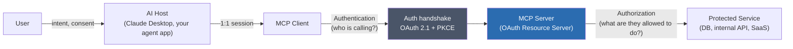
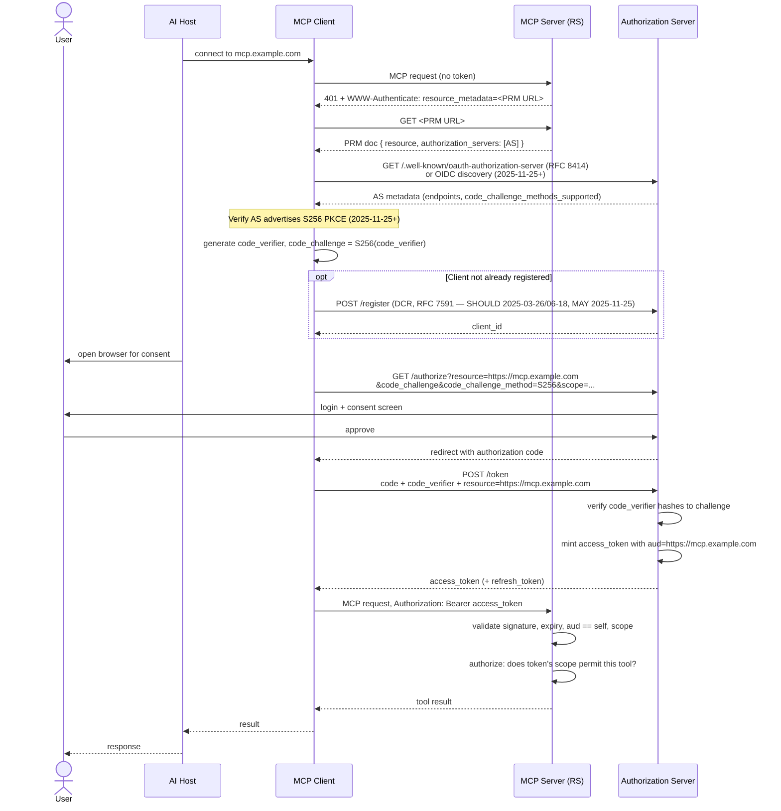

# Authentication & Authorization

## Learning Objectives

By the end of this chapter you will be able to:

- Draw and explain the full trust chain a request travels through: **User → AI Host → MCP Client → Authentication → MCP Server → Authorization → Protected Service** — and say precisely which hop each security control lives at.
- Explain why MCP builds on **OAuth 2.1** rather than inventing a bespoke auth scheme, and what "MCP servers are classified as OAuth Resource Servers" means in practice.
- Implement (or evaluate an implementation of) **Protected Resource Metadata (RFC 9728)**, including the `401` + `WWW-Authenticate` handshake that points a client at it.
- Explain Authorization Server discovery (**RFC 8414**), and what changed when **OIDC Discovery** was added as an alternative.
- State the *exact* requirement level of **Dynamic Client Registration (RFC 7591)** in each spec revision — and correct the common misconception that it is mandatory.
- Explain **Resource Indicators (RFC 8707)** and why the `resource` parameter is the specific mechanism that defends against confused-deputy and token-replay attacks across multiple MCP servers.
- Implement **PKCE** correctly, including the 2025-11-25 tightening (S256-only, AS-advertisement verification).
- Reason about token audience, scope design, user identity vs. server identity, and credential storage/rotation in a production MCP deployment.
- Apply a concrete checklist for hardening a production MCP server's authentication and authorization before it goes live.

## Prerequisites

- Chapters 1–3 (architecture and protocol lifecycle) and Chapter 9 (building MCP clients) — this chapter assumes you know what a Host, Client, and Server are, and how a client connects to a server.
- Working knowledge of OAuth 2.0 concepts: authorization code grant, access tokens, redirect URIs, scopes. If any of that is shaky, skim the OAuth 2.1 draft (linked in Further Reading) before continuing — this chapter builds on that vocabulary rather than re-teaching it.
- Comfort reading HTTP headers and JSON Schema-like metadata documents.
- Chapter 14 (MCP Security) is the natural next stop — it covers tool poisoning, rug pulls, and sandboxing, which are deliberately **out of scope here**. This chapter is scoped to identity, tokens, and the OAuth handshake only.

---

## 1. The Trust Chain

Every authenticated MCP tool call passes through six links. Losing sight of any one of them is how "secure" deployments end up leaking credentials or letting an LLM call APIs it was never supposed to touch.



Two questions get answered at two different hops, and conflating them is the single most common design mistake in this space:

- **Authentication** (between Client and Server): *who* is making this request? This is where OAuth 2.1, PKCE, and bearer tokens live.
- **Authorization** (between Server and the Protected Service, and inside the Server's own tool-dispatch logic): *what* is this authenticated identity allowed to do? A valid token proves identity — it does not by itself imply that every tool the server exposes should be reachable, or that the server should forward that identity's privileges unfiltered to the backend.

> **Core principle:** never blindly expose powerful internal APIs through MCP. An MCP server is a translation and policy layer, not a transparent pipe. Wrapping `DELETE /admin/users/{id}` as an MCP tool because "the REST API already has auth" skips the step where you decide whether an LLM acting on a user's behalf should ever be able to invoke that action unattended, with what scope, and with what confirmation step. Authentication answers "is this a legitimate call," not "should this call be allowed to happen."

## 2. Why OAuth 2.1, Not a Bespoke Scheme

MCP does not define its own authentication protocol. It defines a **profile of OAuth 2.1** — a specific, opinionated set of OAuth mechanisms, requirement levels, and MCP-specific extensions (like Resource Indicators) layered on top of the existing OAuth ecosystem. This matters for two reasons:

1. **You can reuse existing infrastructure.** Any OAuth 2.1-compliant Authorization Server (Auth0, Okta, Keycloak, AWS Cognito, your own IdP) can serve as the AS for an MCP deployment. You are not building a new identity system.
2. **The security properties are well-understood.** OAuth 2.1 folds in over a decade of lessons from OAuth 2.0's implicit-grant and non-PKCE mistakes — it *requires* PKCE for all clients (not just public ones), drops the implicit grant, and tightens redirect URI matching. MCP inherits all of that by reference instead of re-deriving it.

OAuth 2.1 itself is not a single RFC — it's a consolidating draft that folds together the authorization code grant (RFC 6749), PKCE (RFC 7636), and a stricter security posture, dropping legacy grant types the MCP spec never wanted anyway (implicit grant, resource owner password credentials). What MCP adds on top are the pieces that make OAuth work for *dynamically discovered servers* rather than a single hardcoded API: Protected Resource Metadata, Resource Indicators, and (optionally) Dynamic Client Registration.

### OAuth roles mapped onto MCP roles

OAuth 2.1 defines four roles. Mapping them onto MCP's own Host/Client/Server vocabulary up front avoids a lot of confusion later, because the two vocabularies use overlapping words ("client") for different things:

| OAuth 2.1 role | MCP equivalent | Notes |
|---|---|---|
| Resource Owner | **User** | The human who owns the data/actions being protected and who grants consent. |
| Client | **MCP Client** (embedded in the Host) | The party that obtained the access token and presents it to the Resource Server. In MCP, the Host typically drives the user-facing consent UI, but the OAuth "client" role — the thing that holds the token and makes the token request — is the Client. |
| Authorization Server (AS) | A separate identity provider | Not an MCP concept at all — this is ordinary OAuth infrastructure (Okta, Auth0, Keycloak, your own IdP) that the MCP ecosystem plugs into rather than reimplements. |
| Resource Server (RS) | **MCP Server** | Holds the protected resources (tools/resources/prompts) and validates tokens presented to it. |

Notice that the **Host**, in the strict OAuth sense, isn't a distinct role — it's the surrounding application that hosts the Client and mediates the User-facing consent screen (recall from Chapter 2 that the Host "handles user authorization decisions"). In a browser-based flow this is where the redirect to the AS's login/consent page actually gets displayed to the user.

### MCP servers are OAuth Resource Servers

As of **2025-06-18**, the spec formally classifies an MCP server in OAuth terms as a **Resource Server (RS)** — the party that holds protected resources (tools, resources, prompts) and validates access tokens presented to it. It is explicitly *not* the Authorization Server. This separation is deliberate:

- The MCP server's job is to validate tokens and enforce authorization policy on its own tool surface.
- The MCP server should not need to know how users authenticated, store passwords, or manage user accounts — that's the AS's job.
- Because a Host may talk to many MCP servers, each server independently being "just" an RS (not an AS) means the client has one authentication protocol to implement regardless of how many servers it connects to.

## 3. Protected Resource Metadata (RFC 9728)

This is the piece that lets a client discover, without any prior configuration, *which* Authorization Server(s) a given MCP server trusts.

**Requirement level: MUST as of 2025-06-18** (it did not exist in 2025-03-26; the 2025-03-26 spec had auth but no formal resource-metadata discovery step).

### The 401 handshake

When an MCP Client makes a request to a Server without a valid access token (or with an expired/invalid one), the Server responds with:

```http
HTTP/1.1 401 Unauthorized
WWW-Authenticate: Bearer resource_metadata="https://mcp.example.com/.well-known/oauth-protected-resource"
```

The `WWW-Authenticate` header is the pointer. The client fetches the URL it names and gets back a **Protected Resource Metadata document** — a JSON document (per RFC 9728) whose most important field for MCP purposes is `authorization_servers`:

```json
{
  "resource": "https://mcp.example.com",
  "authorization_servers": [
    "https://auth.example.com"
  ],
  "bearer_methods_supported": ["header"],
  "resource_documentation": "https://mcp.example.com/docs"
}
```

- `resource` — the canonical URI identifying *this* MCP server. This is the value that later gets echoed back as the `resource` parameter in the RFC 8707 flow (Section 5) — it is how the eventual access token gets bound to this specific server.
- `authorization_servers` — the list of AS(es) this resource trusts. The client picks one (or is constrained to one, in the common single-AS case) and proceeds to AS discovery.

> **Why this exists:** without PRM, a client would need out-of-band configuration to know which AS issues tokens for a given MCP server. PRM makes that discoverable at connection time, the same way the server's own capabilities are discoverable via `initialize`. It's the auth analog of capability negotiation.

## 4. Authorization Server Discovery

Once the client has an AS URL from the PRM document's `authorization_servers` field, it needs the AS's own endpoints (authorization endpoint, token endpoint, supported PKCE methods, etc.).

| Revision | AS discovery mechanism | Requirement |
|---|---|---|
| 2025-03-26 | RFC 8414 (OAuth Authorization Server Metadata) only | MUST |
| 2025-06-18 | RFC 8414 only | MUST |
| 2025-11-25 | RFC 8414 **or** OIDC Discovery | MUST support **both** |

**RFC 8414** defines a well-known document at `/.well-known/oauth-authorization-server` on the AS:

```json
{
  "issuer": "https://auth.example.com",
  "authorization_endpoint": "https://auth.example.com/oauth2/authorize",
  "token_endpoint": "https://auth.example.com/oauth2/token",
  "registration_endpoint": "https://auth.example.com/oauth2/register",
  "code_challenge_methods_supported": ["S256"],
  "scopes_supported": ["mcp:tools:read", "mcp:tools:call"]
}
```

As of **2025-11-25**, a client MUST also be able to discover the same information via **OIDC Discovery** (`/.well-known/openid-configuration`) if that's what the AS exposes instead. This was added because many production identity providers (anything OIDC-native, like Okta or Auth0's OIDC-flavored endpoints) publish OIDC discovery documents but may not separately expose an RFC 8414 document — requiring clients to support both closes that gap rather than forcing every AS operator to publish two near-duplicate documents.

> **2025-11-25 spec note:** this is additive, not a replacement — RFC 8414 support is still required. A conformant 2025-11-25 client tries whichever discovery mechanism the AS advertises; it does not get to assume RFC 8414 alone is sufficient anymore.

## 5. Dynamic Client Registration (RFC 7591) — Correcting a Common Misconception

This is the single most over-simplified part of MCP auth in blog posts and internal wikis. Engineers frequently say "MCP requires Dynamic Client Registration" as if it were a hard protocol requirement. **It has never been a MUST in any spec revision.**

| Revision | DCR requirement level |
|---|---|
| 2025-03-26 | SHOULD |
| 2025-06-18 | SHOULD |
| 2025-11-25 | **MAY** (downgraded; superseded by OAuth Client ID Metadata Documents) |

What DCR (RFC 7591) actually does: it lets an MCP Client register itself as an OAuth client with an AS at runtime, by POSTing to the AS's `registration_endpoint`, instead of a human pre-registering a `client_id`/`client_secret` pair out of band. This matters for MCP specifically because a general-purpose Host might connect to dozens of MCP servers backed by dozens of different Authorization Servers it has never seen before — pre-registering with each one manually doesn't scale.

But "SHOULD" always meant: *support it if you can, but a conformant AS or Client is allowed not to.* Many production deployments never implement DCR — they use a small, fixed set of pre-registered clients instead, which is entirely spec-compliant. In **2025-11-25**, the spec authors went further and downgraded it to **MAY**, because a newer mechanism — **OAuth Client ID Metadata Documents** — is emerging as the preferred way to solve the same "clients I've never seen before" problem: instead of a stateful registration call, the client's identity metadata is published at a URL the AS can fetch and validate, which sidesteps a class of DCR-related confused-deputy issues (see Chapter 14, and the note in Section 8 of this chapter).

**Practical takeaway:** don't build a production MCP deployment that hard-requires DCR support from every AS you might integrate with. Design your client to work with pre-registered credentials first, and treat DCR (or Client ID Metadata Documents, once that lands in tooling) as an optional convenience for onboarding new servers dynamically.

## 6. Resource Indicators (RFC 8707) — Audience-Binding a Token

**Requirement level: absent in 2025-03-26; MUST as of 2025-06-18; carried forward as MUST in 2025-11-25.**

This is the mechanism that closes the specific hole a "one AS, many MCP servers" architecture opens up.

### The problem it solves

Imagine one Authorization Server issues tokens for a whole fleet of MCP servers behind it (a common enterprise pattern — one IdP, many internal tools). Without any audience restriction, a token issued after a user authorizes *Server A* would, if the AS doesn't scope it, also be a valid bearer credential against *Server B* — because nothing in the token says "this is only good for Server A." A malicious or compromised Server B could then replay that token, present it upstream, or a confused-deputy chain could trick the client into sending a token to the wrong server, which then reuses it.

### The mechanism

RFC 8707 defines a `resource` parameter that the client includes in **both** the authorization request and the token request, set to the canonical URI of the specific MCP server it is trying to reach — the exact same value that appeared as `resource` in that server's Protected Resource Metadata document (Section 3):

```
GET https://auth.example.com/oauth2/authorize
  ?response_type=code
  &client_id=abc123
  &redirect_uri=https://host.example.com/callback
  &resource=https://mcp.example.com
  &code_challenge=E9Melhoa2OwvFrEMTJguCHaoeK1t8URWbuGJSstw-cM
  &code_challenge_method=S256
  &scope=mcp:tools:call
```

The AS is expected to mint an access token whose `aud` (audience) claim is bound to that `resource` value. When the token later arrives at an MCP server, that server can (and per the token-passthrough rule in Section 10, MUST) verify the audience claim matches its own canonical URI before accepting the token. A token minted for `https://mcp.example.com` is worthless if presented to `https://other-mcp.example.com` — the audience check fails and the request is rejected, even if the token is otherwise valid and unexpired.

**This is why `resource` is the specific defense against confused-deputy/token-replay across multiple servers:** it isn't scope, it isn't expiry, it isn't the redirect URI — it's the audience binding, checked at token-validation time. Scopes tell the server *what* the token permits; the `resource`/audience binding tells the server *whether the token was even meant for it at all*. A server that skips audience validation and only checks scopes is still vulnerable to a token minted for a sibling server with overlapping scope names.

## 7. PKCE

**Requirement level: MUST since 2025-03-26** (this is the one auth control that was already mandatory from MCP's first OAuth-carrying revision — MCP never had a PKCE-optional era).

PKCE (Proof Key for Code Exchange, RFC 7636) prevents an authorization code intercepted in transit (e.g., a malicious app on the same device intercepting a redirect) from being exchanged for a token by anyone other than the client that initiated the flow. The client generates a random `code_verifier`, derives a `code_challenge` from it, sends the challenge at the start of the flow, and must present the original verifier at token-exchange time — the AS checks that the verifier hashes to the challenge it was given.

**2025-11-25 tightened PKCE in two specific ways:**

| Aspect | 2025-03-26 / 2025-06-18 | 2025-11-25 |
|---|---|---|
| Challenge method | MUST use PKCE, method not pinned | MUST use **S256** specifically (`plain` not acceptable) |
| AS advertisement | not required to check | Client MUST verify the AS **advertises** PKCE support (via its discovery metadata's `code_challenge_methods_supported`) before proceeding |

The second change closes a downgrade-attack surface: without checking that the AS actually advertises PKCE, a client can't be sure the AS will actually enforce the verifier check server-side — an AS that silently ignores an unexpected parameter would let an attacker skip PKCE's protection entirely while the client believes it's protected.

### Generating a PKCE pair

This is ordinary OAuth utility code — no MCP-specific or SDK-specific API involved, just `hashlib`/`secrets`/`base64` from the standard library:

```python
import base64
import hashlib
import secrets


def generate_pkce_pair() -> tuple[str, str]:
    """Returns (code_verifier, code_challenge) using S256, per RFC 7636."""
    code_verifier = base64.urlsafe_b64encode(secrets.token_bytes(32)).rstrip(b"=").decode("ascii")
    digest = hashlib.sha256(code_verifier.encode("ascii")).digest()
    code_challenge = base64.urlsafe_b64encode(digest).rstrip(b"=").decode("ascii")
    return code_verifier, code_challenge


verifier, challenge = generate_pkce_pair()
# `challenge` (with code_challenge_method=S256) goes in the /authorize request.
# `verifier` is held by the client and only sent at the final /token exchange.
```

## 8. The Full Version Table

Keep this table nearby — it is the single most commonly-misquoted part of the MCP spec, and every cell has been verified against the spec text for its revision.

| Feature | 2025-03-26 | 2025-06-18 | 2025-11-25 |
|---|---|---|---|
| Protected Resource Metadata (RFC 9728) | absent | **MUST** (new) | MUST |
| AS discovery | RFC 8414 only, MUST | RFC 8414 only, MUST | RFC 8414 **or** OIDC Discovery, MUST support both |
| Dynamic Client Registration (RFC 7591) | SHOULD | SHOULD | **MAY** (downgraded; superseded by OAuth Client ID Metadata Documents) |
| Resource Indicators (RFC 8707) `resource` param | absent | **MUST** (new) | MUST |
| PKCE | MUST | MUST | MUST + verify AS advertises it + **MUST use S256** |
| Token passthrough forbidden | not stated | explicit **MUST NOT** | carried forward |

Treat **2025-06-18** as the revision to build against today — it's the first revision where the full auth picture (PRM + discovery + Resource Indicators + PKCE + explicit anti-passthrough language) is in place, and it's what the current generation of production MCP servers and SDKs target.

## 9. Tokens, Scopes, and Identity — General Concepts

A few cross-cutting concepts underpin everything above, and they matter regardless of which spec revision you're targeting:

- **User identity vs. server identity.** The access token the MCP Client holds represents the *end user's* delegated authority (or a service account's, in machine-to-machine setups) — not the MCP server's own identity. The MCP server, in turn, may need its *own* credential (an API key, a service-account token, a database connection string) to talk to the Protected Service downstream. These are two different credentials with two different lifetimes and two different failure modes — do not conflate "the token that got the request into the server" with "the credential the server uses to act on the backend."
- **Scope design.** Define scopes at the granularity of the *action*, not the tool implementation detail — e.g., `mcp:invoices:read` and `mcp:invoices:write` rather than one blanket `mcp:full-access`. A server that only ever checks "is this token valid" and never inspects scope is one incident away from every authenticated user being able to call every tool, including the destructive ones.
- **Token lifetime and refresh.** Access tokens should be short-lived; use refresh tokens (held only by the Client, never forwarded to the Server) to mint new access tokens without re-prompting the user. A server that accepts long-lived, non-expiring tokens has effectively removed its own ability to revoke access short of rotating signing keys.
- **Credential management on the server side.** The MCP server's own credentials to the Protected Service (Section 1's rightmost hop) should be stored in a secrets manager, never in source, never logged, and rotated on a schedule independent of user token lifetimes. If the server performs a **token exchange** (swapping the user's MCP-scoped token for a narrower, backend-specific credential) rather than forwarding anything raw, you get an extra layer of containment: a compromised MCP server leaks only what it was provisioned with, not a reusable end-user credential.
- **Never trust session IDs as authentication.** This is covered in depth in Chapter 14's Session Hijacking section, but it's worth flagging here too: a transport-level session identifier (e.g., an HTTP `Mcp-Session-Id` header, where still present) is not a substitute for a validated access token. Treat it purely as a connection-correlation mechanism.

## 10. Token Passthrough — the One Explicit MUST NOT

Formalized as an explicit **MUST NOT** starting in 2025-06-18 and carried forward in 2025-11-25: **an MCP server MUST NOT accept a token that was not explicitly issued for it.**

Concretely, this rules out a lazy shortcut that's tempting to reach for: if the Client already has a bearer token from the AS (say, one originally minted with a different `resource`/audience, or one obtained for some *other* API), the Server must not simply accept it at face value because "it's a valid-looking JWT from an AS I trust." The Resource Indicators mechanism from Section 6 is precisely what makes this checkable — the server validates the token's audience (`aud`) claim against its own canonical resource URI and rejects anything not addressed to it, even if the token is cryptographically valid and unexpired.

---

## Examples

### Example 1 — Server-side: responding to an unauthenticated request with PRM discovery

This is transport/framework-level code (FastAPI, fronting a Streamable HTTP MCP endpoint) — it shows the 401 + `WWW-Authenticate` + PRM document mechanics from Section 3. This is standard FastAPI/HTTP code, not an MCP SDK-specific auth API (the fact sheet for this course does not confirm a built-in OAuth helper in the `mcp` Python SDK, so treat token validation as your own middleware layer in front of the MCP transport).

```python
# server_auth.py — illustrative FastAPI middleware in front of a Streamable HTTP MCP server
from fastapi import FastAPI, Request
from fastapi.responses import JSONResponse

RESOURCE_URI = "https://mcp.example.com"
PRM_URL = "https://mcp.example.com/.well-known/oauth-protected-resource"

app = FastAPI()

PROTECTED_RESOURCE_METADATA = {
    "resource": RESOURCE_URI,
    "authorization_servers": ["https://auth.example.com"],
    "bearer_methods_supported": ["header"],
}


@app.get("/.well-known/oauth-protected-resource")
async def protected_resource_metadata():
    return PROTECTED_RESOURCE_METADATA


def extract_bearer_token(request: Request) -> str | None:
    auth_header = request.headers.get("authorization", "")
    if auth_header.startswith("Bearer "):
        return auth_header.removeprefix("Bearer ")
    return None


async def validate_token(token: str) -> dict:
    """
    Validate signature, expiry, issuer, and — critically — the audience
    (`aud`) claim against RESOURCE_URI. Raises if invalid.
    Real validation uses the AS's JWKS endpoint; omitted here for brevity.
    """
    claims = decode_and_verify_jwt(token)  # your JWT library of choice
    if RESOURCE_URI not in claims.get("aud", []):
        raise ValueError("token audience does not match this MCP server")
    return claims


@app.middleware("http")
async def require_auth(request: Request, call_next):
    if request.url.path == "/.well-known/oauth-protected-resource":
        return await call_next(request)

    token = extract_bearer_token(request)
    if token is None:
        return JSONResponse(
            status_code=401,
            content={"error": "unauthorized"},
            headers={
                "WWW-Authenticate": f'Bearer resource_metadata="{PRM_URL}"'
            },
        )

    try:
        claims = await validate_token(token)
    except ValueError:
        return JSONResponse(
            status_code=401,
            content={"error": "invalid_token"},
            headers={"WWW-Authenticate": f'Bearer resource_metadata="{PRM_URL}"'},
        )

    request.state.user_claims = claims
    return await call_next(request)
```

### Example 2 — Client-side: attaching a bearer token via `langchain-mcp-adapters`

Once the Client has completed the OAuth 2.1 + PKCE dance (Section 11's sequence diagram) and holds a valid access token, attaching it to outbound MCP requests is just an HTTP header — `MultiServerMCPClient`'s HTTP transport config accepts a `headers` field for exactly this.

```python
# v1.x-generation client code — classic handshake model
from langchain_mcp_adapters.client import MultiServerMCPClient

access_token = get_valid_access_token()  # from your OAuth 2.1 + PKCE flow

client = MultiServerMCPClient(
    {
        "billing": {
            "url": "https://mcp.example.com/mcp",
            "transport": "streamable_http",
            "headers": {"Authorization": f"Bearer {access_token}"},
        },
    }
)

tools = await client.get_tools()
```

Nothing about this is MCP-specific magic — it's the same bearer-token-over-HTTP pattern you'd use against any OAuth-protected REST API. The MCP-specific parts are entirely upstream of this snippet: how the token was minted (with the `resource` parameter bound to `https://mcp.example.com`), and how the server validates it (Example 1).

### Example 3 — Scope-gated tool dispatch inside the server

Authorization (as opposed to authentication) happens here — inside the server, per tool, using the claims already validated by Example 1's middleware.

```python
from mcp.server.fastmcp import FastMCP
from fastapi import Request

mcp = FastMCP("Billing")

REQUIRED_SCOPES = {
    "list_invoices": {"mcp:invoices:read"},
    "void_invoice": {"mcp:invoices:write"},  # destructive — tighter scope
}


def has_required_scope(user_scopes: set[str], tool_name: str) -> bool:
    required = REQUIRED_SCOPES.get(tool_name, set())
    return required.issubset(user_scopes)


@mcp.tool()
def void_invoice(invoice_id: str, ctx) -> str:
    """Void an invoice. Requires mcp:invoices:write scope."""
    user_scopes = set(ctx.request_context.get("scopes", []))
    if not has_required_scope(user_scopes, "void_invoice"):
        raise PermissionError("insufficient scope: mcp:invoices:write required")
    return billing_service.void(invoice_id)
```

> This snippet illustrates the *pattern* (scope check before executing a destructive action) rather than a confirmed `ctx.request_context` API shape from a specific SDK version — wire the actual claim-passing mechanism to whatever your HTTP framework and SDK version expose in your transport layer.

### Example 4 — Client-side discovery walk (PRM → AS metadata → PKCE-support check)

This ties Sections 3, 4, and 7 together into the sequence a well-behaved client actually runs *before* it ever redirects the user anywhere. It's plain `httpx`, not an MCP SDK call — discovery is ordinary HTTP against well-known URLs.

```python
import httpx

MCP_SERVER_URL = "https://mcp.example.com"


async def discover_auth_chain(mcp_server_url: str) -> dict:
    async with httpx.AsyncClient() as http:
        # Step 1: hit the server unauthenticated to read WWW-Authenticate,
        # or go straight to the well-known PRM path if you already expect one.
        resp = await http.get(f"{mcp_server_url}/.well-known/oauth-protected-resource")
        resp.raise_for_status()
        prm = resp.json()

        as_url = prm["authorization_servers"][0]  # pick/validate as appropriate

        # Step 2: AS discovery — try RFC 8414 first, then OIDC Discovery
        # (2025-11-25+ clients must support both).
        as_metadata = None
        for well_known_path in (
            "/.well-known/oauth-authorization-server",
            "/.well-known/openid-configuration",
        ):
            candidate = await http.get(f"{as_url}{well_known_path}")
            if candidate.status_code == 200:
                as_metadata = candidate.json()
                break

        if as_metadata is None:
            raise RuntimeError(f"no discovery document found at {as_url}")

        # Step 3: verify the AS actually advertises S256 PKCE before trusting it.
        supported_methods = as_metadata.get("code_challenge_methods_supported", [])
        if "S256" not in supported_methods:
            raise RuntimeError(
                f"AS {as_url} does not advertise S256 PKCE support — refusing to proceed"
            )

        return {
            "resource": prm["resource"],
            "authorization_endpoint": as_metadata["authorization_endpoint"],
            "token_endpoint": as_metadata["token_endpoint"],
        }
```

Notice the deliberate hard failure when `S256` isn't advertised — that's the 2025-11-25 PKCE tightening from Section 7 expressed as code: the client refuses to proceed rather than silently falling back to an unverified assumption that PKCE will be enforced.

### Testing the handshake with MCP Inspector

Chapter 12 covered the MCP Inspector for tool/resource/prompt debugging without an LLM in the loop — the same tool is useful here. Since the Inspector lets you set custom request headers, you can:

1. Connect to your server with no `Authorization` header set and confirm you get a `401` with a well-formed `WWW-Authenticate` header in the Inspector's raw traffic view.
2. Manually paste a bearer token (minted however you like for testing — even a hand-signed JWT against a local test AS) into the Inspector's header configuration and confirm authenticated calls succeed.
3. Deliberately paste a token with the wrong `aud` claim and confirm your server rejects it — this is the fastest way to catch an audience-validation bug (Section 10) before it ships, since it's a one-field edit between a passing and failing request.

This keeps your auth testing independent of a full Host/LLM round-trip, the same debugging discipline Chapter 12 established for tools generally.

---

## Sequence Diagram — Full OAuth 2.1 + PKCE Authorization Flow



Two things to notice in this diagram that are easy to lose track of when reading prose alone: the `resource` parameter appears **twice** — once in the `/authorize` request and again implicitly baked into the minted token's `aud` claim — and the PKCE `code_verifier` never leaves the Client until the final token exchange, so an intercepted authorization code alone is useless without it.

---

## Real-World Scenario

**Setup:** Your team runs an internal "DevOps Copilot" — a LangGraph agent, exposed through a Host, that uses MCP tools to query deployment status, restart services, and (for a small on-call group) roll back a bad release. The MCP server sits in front of your internal deployment API. Three engineering teams each authenticate through the company's central Okta tenant.

**What goes wrong without this chapter's controls:** An engineer on Team A discovers that the bearer token their Host obtained for the "Deploy Status" MCP server also happens to work against the separate "Release Rollback" MCP server, because both servers trust the same Okta tenant and neither one checks the token's audience — only that it's a validly-signed Okta token with *some* recognized scope string. Team A's read-only on-call rotation member, who was never granted rollback privileges, discovers they can trigger a production rollback simply by pointing their Host's HTTP client at the other server's URL with the token they already have.

**How the controls in this chapter prevent it:**

1. Each MCP server publishes its own **Protected Resource Metadata** with a distinct `resource` value (`https://mcp-deploy-status.internal`, `https://mcp-rollback.internal`).
2. Every authorization request carries the **RFC 8707 `resource` parameter** matching the specific server the Client is targeting, so Okta mints tokens with an `aud` claim scoped to exactly one server.
3. Both servers **validate the `aud` claim** on every request (Example 1) — a token minted for Deploy Status is cryptographically valid but audience-rejected at Rollback.
4. The Rollback server additionally enforces a **scope check** (`mcp:rollback:execute`) that most engineers' tokens simply never carry, because Okta's consent/grant configuration only issues that scope to the on-call group's role.
5. Because **token passthrough is a MUST NOT**, the Rollback server never forwards the user's Okta token straight to the underlying deployment API — it performs its own token exchange for a narrowly-scoped service credential, so even a successfully authorized rollback call can't be replayed against the raw deployment API directly by extracting the token from server logs.

The layered result: an audience mismatch stops the wrong-server replay before authorization is even considered, and a scope check stops the right-server-wrong-privilege case even for engineers who do have a validly-audienced token.

---

## Best Practices

1. **Validate audience (`aud`), not just signature and expiry.** A validly signed, unexpired token minted for a different resource is still an invalid token for you. This is the single highest-leverage check from this whole chapter.
2. **Target 2025-06-18 as your baseline** unless you have a specific reason to support 2025-03-26 (no PRM, no Resource Indicators) — those two additions are load-bearing for multi-server security.
3. **Support both RFC 8414 and OIDC Discovery on the client side** if you're building for 2025-11-25 compatibility — don't assume every AS you'll encounter exposes both discovery documents identically.
4. **Don't build a hard dependency on DCR.** Design for pre-registered clients as the default path; treat DCR (or, going forward, OAuth Client ID Metadata Documents) as an optional onboarding convenience, matching its actual SHOULD/MAY status.
5. **Always use PKCE with S256**, even against an AS you believe doesn't require it, and check the AS's discovery metadata actually advertises PKCE support before trusting that it will be enforced server-side.
6. **Design scopes around actions, not tools.** `mcp:invoices:read` vs. `mcp:invoices:void` beats one blanket `mcp:access` scope that can't distinguish "look things up" from "take destructive action."
7. **Never forward a client's token to a downstream service unmodified.** Perform a token exchange for a narrower, server-managed credential wherever the downstream system supports it.
8. **Keep access tokens short-lived; keep refresh tokens client-side only.** The server should never see or store a refresh token.
9. **Log token validation failures (audience mismatch, expired, bad signature) distinctly** — an audience-mismatch spike is a strong signal of exactly the cross-server replay scenario in the Real-World Scenario above, and you want it to show up in monitoring before an incident, not during the postmortem.
10. **Treat the `WWW-Authenticate` + PRM handshake as public, unauthenticated infrastructure** — it's meant to be fetchable without credentials. Don't accidentally put it behind the same auth middleware that protects your tool endpoints.

## Common Mistakes

- **Treating DCR as mandatory.** It has never been a MUST; conflating "commonly implemented" with "required" leads to brittle integrations that fail against any AS operator who chose not to expose a `registration_endpoint`.
- **Rounding "SHOULD" up to "MUST" in design docs.** This chapter's whole Section 8 table exists because this rounding error is endemic — always cite the actual requirement level for the revision you're targeting.
- **Checking scope but skipping audience validation.** Scope answers "what can this identity do"; audience answers "was this token even meant for me." Skipping the second check is precisely what makes cross-server token replay possible.
- **Assuming PKCE alone stops token replay across servers.** PKCE protects the authorization-code exchange from interception; it says nothing about whether a resulting *access token* is safe to accept at a different resource server. Those are two separate protections (PKCE vs. Resource Indicators) solving two separate problems.
- **Forwarding the user's raw MCP token to a backend API** because "it's already authenticated" — this is exactly the token-passthrough anti-pattern the spec calls out as a MUST NOT.
- **Building custom, ad hoc auth instead of standard OAuth 2.1** because "MCP is simple, we don't need all this OAuth machinery" — this discards a decade of hardening for a bespoke scheme nobody has attacked yet, which is not the same as a scheme that's actually secure.
- **Confusing a transport-level session ID with an authentication credential.** A session identifier correlates a connection; it does not prove who the user is.
- **Publishing a Protected Resource Metadata document with the wrong `resource` value**, or one that doesn't match what's later checked in the `aud` claim — this silently breaks the entire audience-binding chain even though every individual step "looks" implemented.

---

## Summary

MCP does not invent authentication — it profiles OAuth 2.1 and adds the specific extensions needed for a world where a single Host may talk to many independently-discovered servers: **Protected Resource Metadata (RFC 9728)** so a client can find the right Authorization Server, **Resource Indicators (RFC 8707)** so tokens are cryptographically bound to exactly one MCP server, and **PKCE** so the authorization-code exchange itself can't be hijacked. Dynamic Client Registration is a convenience (SHOULD, then downgraded to MAY), never a hard requirement — that's the most commonly over-stated fact in this space. The chain **User → AI Host → MCP Client → Authentication → MCP Server → Authorization → Protected Service** has two distinct decision points that must not be conflated: authentication proves identity between Client and Server; authorization decides what that identity may do, both at the Server's tool-dispatch layer and again at the boundary to whatever Protected Service sits behind it. The single MUST NOT that ties it together — never accept a token not explicitly issued for you — is enforceable only because audience binding (Resource Indicators) exists to check against.

---

## Knowledge Check

1. In the trust chain User → AI Host → MCP Client → Authentication → MCP Server → Authorization → Protected Service, which hop does OAuth 2.1 + PKCE primarily secure, and which hop is *authorization* (as distinct from authentication) primarily concerned with?
2. A colleague says "MCP requires Dynamic Client Registration, it's in the spec." What is the precise, revision-by-revision correction?
3. What HTTP status code and header does an MCP server return when a client makes a request without a valid token, and what does that header point to?
4. What does the `authorization_servers` field inside a Protected Resource Metadata document contain, and where did the client get the URL to fetch that document from in the first place?
5. Explain, in your own words, why the RFC 8707 `resource` parameter is what stops a token issued for Server A from being replayed against Server B — what specifically would break in that replay attempt?
6. What two things did the 2025-11-25 revision tighten about PKCE, beyond just "PKCE is required"?
7. Why is "the token is validly signed and unexpired" an insufficient check for an MCP server to perform before honoring a request?
8. Give an example of a scope design that distinguishes a read-only tool from a destructive one, and explain why a single blanket scope defeats the purpose of scope checking at all.
9. What is "token passthrough," and why is forwarding a user's raw MCP access token to a downstream Protected Service specifically disallowed?
10. A new AS your team wants to integrate with exposes an OIDC discovery document but not an RFC 8414 document. Under which spec revision(s) is your client still able to complete discovery, and why?

<details>
<summary>Answers</summary>

1. OAuth 2.1 + PKCE secures the **Authentication** hop (Client ↔ Server: proving who is calling). **Authorization** is concerned with the Server's own tool-dispatch decision (does this identity's scope permit this tool?) and the Server ↔ Protected Service hop (what credential/privilege does the server itself present downstream).
2. DCR was **SHOULD** in 2025-03-26 and 2025-06-18, and downgraded to **MAY** in 2025-11-25 (superseded by OAuth Client ID Metadata Documents). It has never been a MUST in any revision.
3. **401 Unauthorized**, with a `WWW-Authenticate: Bearer resource_metadata="<URL>"` header pointing at the server's Protected Resource Metadata document.
4. It contains the list of Authorization Server(s) that this specific MCP server (Resource Server) trusts. The client got the PRM document's URL from the `resource_metadata` parameter inside the `WWW-Authenticate` header on the initial 401 response.
5. The access token's `aud` (audience) claim is bound to the `resource` value sent during the authorization/token requests. When that token is presented to Server B, Server B checks the `aud` claim against its own canonical resource URI; since the token's audience names Server A, the check fails and the request is rejected — even though the token is otherwise valid.
6. It requires PKCE to use **S256 specifically** (no `plain` method), and requires the client to **verify the AS's discovery metadata actually advertises PKCE support** before relying on it.
7. Because signature and expiry only prove the token is authentic and not stale — they say nothing about *which resource server* the token was minted for. Without an audience check, a valid token minted for a different MCP server would be wrongly accepted (the cross-server replay scenario).
8. E.g., `mcp:invoices:read` (read-only tool) vs. `mcp:invoices:void` (destructive tool). A single blanket `mcp:access` scope can't express that distinction — any token good enough to call one tool is automatically good enough to call the destructive one, which removes the server's ability to gate dangerous actions independently of general access.
9. Token passthrough is a server accepting/forwarding a token that was not explicitly issued for it. It's disallowed (explicit MUST NOT since 2025-06-18) because it breaks audience-binding guarantees and lets a token intended for one purpose/server be reused somewhere it was never validated against.
10. Under **2025-11-25**, since that revision requires clients to support OIDC Discovery as an alternative to RFC 8414 — a client built only against 2025-03-26 or 2025-06-18 (RFC 8414-only) would not be able to complete discovery against an AS that only exposes an OIDC discovery document.

</details>

---

## Hands-On Exercise

Build a minimal, spec-aligned demonstration of the 2025-06-18 auth handshake — no real Authorization Server required; you'll simulate it.

**Part 1 — Protected Resource Metadata.**
Stand up a small FastAPI app (adapt Example 1) that exposes `/.well-known/oauth-protected-resource` returning a PRM document with a `resource` field set to some URL you choose (e.g. `http://localhost:8000`), and an `authorization_servers` list containing a fake AS URL. Confirm with `curl` that an unauthenticated request to any other route on the app returns `401` with a correctly-formed `WWW-Authenticate` header.

**Part 2 — Audience validation.**
Write two JWTs by hand (use `pyjwt` with a shared HMAC secret for simplicity — this is a learning exercise, not production key management): one with `"aud": "http://localhost:8000"` and one with `"aud": "http://localhost:9999"`. Extend your FastAPI app's token validation to check the `aud` claim against its own resource URI. Verify: the first token is accepted, the second is rejected with a 401, even though both are validly signed and unexpired.

**Part 3 — Scope-gated tools.**
Add two fake MCP tools to a `FastMCP` server: `read_report` (requires scope `reports:read`) and `delete_report` (requires scope `reports:delete`). Mint a token with only `reports:read` in its scope claim and confirm calling `delete_report` is rejected at the server's dispatch layer (Example 3's pattern), not silently allowed because the token was otherwise valid.

**Part 4 — Trace the chain.**
Write out, as comments in your test script, which of the six links in Section 1's trust-chain diagram each of your checks (Parts 1–3) actually exercises. If you can't map a check to a specific link, that's a sign the check doesn't have a clear job in the architecture — reconsider whether it belongs.

**Stretch goal:** swap your hand-signed HMAC tokens for a real local OAuth 2.1 AS (e.g., a Docker Keycloak instance) and run the actual authorization-code + PKCE exchange from Section 11's sequence diagram end to end, inspecting the real `resource` parameter and resulting `aud` claim at each step.

---

## Further Reading

- MCP specification, Authorization page: `modelcontextprotocol.io/specification/2025-06-18/basic/authorization` (check the revision selector for 2025-03-26 vs. 2025-11-25 differences)
- MCP specification, Security Best Practices page (covered in depth in Chapter 14): `modelcontextprotocol.io/specification/2025-06-18/basic/security_best_practices`
- OAuth 2.1 (consolidating draft): `datatracker.ietf.org/doc/html/draft-ietf-oauth-v2-1`
- RFC 9728 — OAuth 2.0 Protected Resource Metadata: `datatracker.ietf.org/doc/html/rfc9728`
- RFC 8414 — OAuth 2.0 Authorization Server Metadata: `datatracker.ietf.org/doc/html/rfc8414`
- RFC 7591 — OAuth 2.0 Dynamic Client Registration Protocol: `datatracker.ietf.org/doc/html/rfc7591`
- RFC 8707 — Resource Indicators for OAuth 2.0: `datatracker.ietf.org/doc/html/rfc8707`
- RFC 7636 — Proof Key for Code Exchange (PKCE): `datatracker.ietf.org/doc/html/rfc7636`
- OpenID Connect Discovery 1.0 (the OIDC Discovery alternative referenced in the 2025-11-25 table): `openid.net/specs/openid-connect-discovery-1_0.html`
- Chapter 14 (MCP Security) — tool poisoning, rug pulls, confused deputy, sandboxing; the broader threat model this chapter's identity/token layer feeds into.

<div style="display:flex;justify-content:space-between;align-items:center;">
  <a href="./12-mcp-inspector-and-debugging.md">← Previous: MCP Inspector & Debugging</a>
  <a href="./00-index.md">🏠 Index</a>
  <a href="./14-mcp-security.md">Next: MCP Security →</a>
</div>
