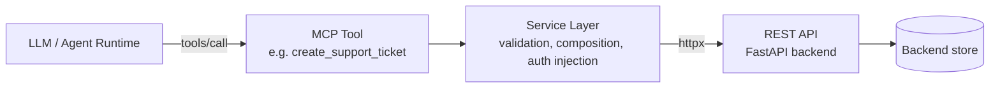
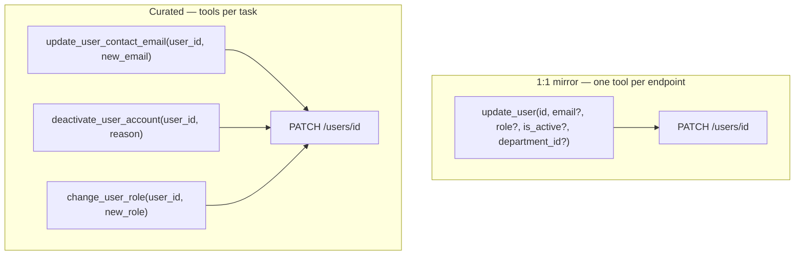
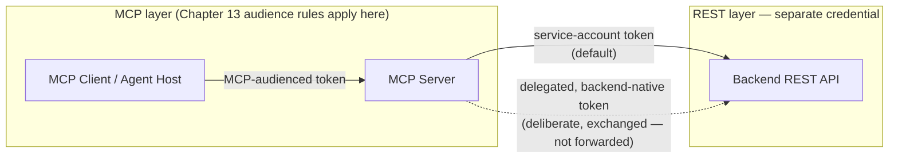

# MCP + REST APIs

## Learning Objectives

By the end of this chapter, you will be able to:

- Explain the "existing API → MCP adapter → agent" pattern and why it's the dominant way MCP servers actually get built in industry, rather than servers built from scratch around a new capability
- Draw and defend the layered flow: LLM → MCP Tool → Service Layer → REST API → Backend
- Apply Chapter 10's tool-schema-design lessons specifically to a REST-wrapping adapter: why a 1:1 endpoint-to-tool mirror reproduces the "bad tool design" problem, using a raw `PATCH /users/{id}` endpoint as the canonical bad example
- Design a small, curated set of purpose-built MCP tools on top of a REST API's OpenAPI surface, backed by `httpx` calls in a service layer
- Choose and justify a REST-side auth strategy for an MCP adapter — service-account bearer token vs. deliberate delegation — tying it back to Chapter 13's token-audience concepts
- Translate REST HTTP error semantics (4xx/5xx) into the MCP tool-error model (`isError` vs. protocol-level JSON-RPC errors) from Chapter 11

## Prerequisites

This chapter assumes you already have:

- A working MCP server built with `FastMCP` (Chapter 7) and a solid grasp of tool schema design (Chapter 10)
- The protocol-error vs. tool-error distinction from Chapter 11 (`isError: true` inside a successful `tools/call` result vs. a JSON-RPC error object)
- The token-audience and "MCP servers MUST NOT accept tokens not explicitly issued for them" material from Chapter 13
- Professional-level `httpx` usage (sync or async clients, timeouts, raising on non-2xx) and general REST API design
- No new MCP primitives are introduced here — this chapter is entirely about applying Chapters 4, 10, 11, and 13 to a specific, extremely common integration shape

---

## 1. Why This Pattern Dominates

Most MCP servers you will ever build in a real job are not novel capabilities invented from nothing. They are **adapters**: your organization already has a REST API — often FastAPI, often already OpenAPI-documented, often already backing a web frontend and a mobile app — and the task is to make that existing system usable by an AI agent without rewriting it, without duplicating its business logic, and without bypassing whatever access control it already enforces.

This is worth stating plainly because it reframes the job: you are not designing a ticketing system, a CRM, or an inventory service. Those already exist, they already work, and they already have owners who will not thank you for reimplementing their validation rules inside an MCP server. Your job is narrower and more disciplined — decide which of that system's existing capabilities an agent actually needs, and expose *those*, well, through MCP.



Four layers, four distinct jobs:

1. **LLM** decides *whether* and *when* to call a tool, based on the tool's name, description, and schema — this is the part MCP deliberately does not standardize (Chapter 1).
2. **MCP Tool** is the contract the LLM sees: a name, a description, an `inputSchema`, and a result shape. It is a *curated* interface, not a mirror of anything.
3. **Service layer** is ordinary Python living inside your MCP server process: it validates arguments beyond what JSON Schema can express, decides which REST endpoint(s) to call and in what order, injects auth, and translates REST responses and REST errors into MCP results and MCP errors.
4. **REST API** is the existing backend — unchanged. It keeps enforcing whatever validation, authorization, and business rules it already enforces. The MCP server is a new *consumer* of it, not a replacement for it.

The service layer is the load-bearing piece of this chapter. Without it, "wrapping a REST API in MCP" collapses into "put an `@mcp.tool()` decorator directly on top of an HTTP call for every endpoint" — which brings us to the core design decision.

## 2. The Core Design Decision: Don't Mirror Endpoints 1:1

Chapter 10 covers tool schema design in depth; the single most important idea to carry forward here is this: **a tool's schema is prompt content the LLM reads to decide how to act, not an API contract for a human developer.** A REST endpoint and an MCP tool are built for two different audiences, and treating them as interchangeable is the most common mistake in this entire integration pattern (Chapter 1, Chapter 10, and the common-mistakes catalog in Chapter 23 all return to this).

Consider a completely ordinary, well-designed REST endpoint:

```
PATCH /users/{id}
Content-Type: application/json

{
  "email": "new@example.com",
  "role": "admin",
  "is_active": false,
  "department_id": 42
}
```

Nothing is wrong with this endpoint. It's a standard partial-update pattern: any subset of fields can be sent, the backend applies exactly the changes provided, and a human developer reading the OpenAPI spec understands immediately what it does and doesn't validate beyond field-level constraints.

Now imagine exposing it to an LLM as a 1:1 mirrored tool:

```python
# ANTI-PATTERN — do not build tools this way
@mcp.tool()
def update_user(
    id: int,
    email: str | None = None,
    role: str | None = None,
    is_active: bool | None = None,
    department_id: int | None = None,
) -> dict:
    """Update a user. Any field may be omitted to leave it unchanged."""
    ...
```

This is exactly the "bad generic tool" problem from Chapter 10, transplanted into the REST-adapter context. Walk through why:

- **The tool can silently do several unrelated, high-blast-radius things at once.** An agent asked to "fix the typo in Priya's email" has, in the same call, the ability to also demote her role, deactivate her account, and move her to a different department — because the schema doesn't distinguish "editing contact info" from "changing security-relevant state." Nothing in the tool's shape tells the LLM (or a reviewer watching tool calls) which of those four fields is routine and which is dangerous.
- **The description can't carry enough nuance for four unrelated concerns at once.** A tool description good enough to guide "when should I change someone's email" is not the same description that should guide "when should I revoke admin access" — cramming both into one `update_user` docstring means the LLM gets mediocre guidance for all four fields instead of good guidance for any one of them.
- **Annotations (Chapter 10, `readOnlyHint`/`destructiveHint`) can't be set meaningfully.** Is `update_user` destructive? Sometimes — if `is_active` or `role` is present. Annotations are per-tool, not per-argument, so a mirrored PATCH endpoint forces you into either always flagging it destructive (over-cautious for the common email-typo case) or never flagging it (dangerously permissive for the role/deactivation case).
- **Error handling degrades to generic HTTP semantics** instead of task-specific guidance (Section 5 below) — a 422 on this endpoint could mean a dozen different things, and the LLM gets no help distinguishing them.

The fix is not "add more validation to the generic tool." It's to not build the generic tool at all. Instead, design task-specific tools that mirror what an agent is actually asked to *do*, each backed by a narrower, safer call into the same REST endpoint(s):

```python
@mcp.tool()
def update_user_contact_email(user_id: int, new_email: str) -> dict:
    """Update a user's contact email address. Does not affect role, active
    status, or department. Use this for routine contact-info corrections."""
    ...

@mcp.tool()
def deactivate_user_account(user_id: int, reason: str) -> dict:
    """Deactivate a user's account, revoking their access immediately.
    This is a security-sensitive, hard-to-reverse action — confirm with
    the requester before calling. Requires a reason for the audit log."""
    ...
```

Both tools might call the exact same `PATCH /users/{id}` endpoint underneath, just with a different, narrower payload each — `{"email": new_email}` for the first, `{"is_active": False}` plus an audit-log side call for the second. The REST API doesn't change at all. What changed is that the *tool* boundary now matches the *task* boundary, each tool gets an annotation and description that's actually true of everything it can do, and an agent (or a human reviewing an audit trail of tool calls) can tell at a glance which action happened — "email corrected" vs. "account deactivated" — instead of decoding a generic `update_user` call after the fact.



This is the general rule for this whole chapter: **the REST API's endpoint boundary and the MCP server's tool boundary are two independent design decisions.** The REST API's shape is driven by whatever made sense for its own consumers (web app, mobile app, other services) at the time it was built. The MCP tool's shape should be driven entirely by "what does an agent need to accomplish," using Chapter 10's schema-design rules — and very often that means *one* tool composes *several* REST calls, or several tools reuse the *same* endpoint with different, narrower argument sets.

## 3. Worked Example: A Ticketing Service

Assume an existing, already-deployed FastAPI ticketing backend with this OpenAPI surface (nothing here is new — it's the kind of internal service every mid-size org already has):

| Method | Path | Purpose |
|---|---|---|
| `GET` | `/tickets` | List/search tickets, filterable by `status`, `assignee`, `priority` |
| `POST` | `/tickets` | Create a new ticket |
| `GET` | `/tickets/{id}` | Fetch one ticket by ID |
| `PATCH` | `/tickets/{id}` | Partially update a ticket (status, assignee, priority, etc.) |
| `POST` | `/tickets/{id}/comments` | Add a comment to a ticket |

Following Section 2, the goal is *not* five mirrored tools. Walking through what an agent plausibly needs to do — file a bug report on a user's behalf, check on existing tickets, and follow up on one — three tools cover the realistic task surface well:

1. `create_support_ticket(title, description, priority)` — file a new ticket
2. `search_tickets(status=None, assignee=None)` — find existing tickets matching simple, safe filters
3. `add_ticket_comment(ticket_id, comment)` — follow up on a specific ticket

Notice what's deliberately **not** exposed as a tool: raw `PATCH /tickets/{id}` (which could silently reassign, reprioritize, or close a ticket in one generic call — the same problem as `update_user` in Section 2), and arbitrary ticket deletion (not in the API surface at all here, but if it existed, it's exactly the kind of destructive, rarely-needed action that should stay out of the agent's tool list entirely unless there's a specific, narrow, well-annotated reason to include it — see Chapter 14 on least-privilege tool design).

### 3.1 Project layout

Following the protocol/business-logic separation from Chapter 7, the service layer lives in its own module, entirely independent of MCP:

```
ticketing_mcp_server/
├── server.py          # FastMCP instance + @mcp.tool() definitions (thin)
├── ticketing_client.py  # httpx-based service layer — no MCP imports at all
└── config.py          # base URL, service-account token, timeouts
```

### 3.2 The service layer (`ticketing_client.py`)

This module knows nothing about MCP. It is ordinary async Python that could be unit-tested, reused by a CLI, or called from a completely different interface tomorrow.

```python
# ticketing_client.py
import httpx

class TicketingAPIError(Exception):
    """Raised for any non-2xx response from the ticketing backend."""
    def __init__(self, status_code: int, detail: str):
        self.status_code = status_code
        self.detail = detail
        super().__init__(f"Ticketing API error {status_code}: {detail}")


class TicketingClient:
    def __init__(self, base_url: str, service_token: str, timeout: float = 10.0):
        self._client = httpx.AsyncClient(
            base_url=base_url,
            headers={"Authorization": f"Bearer {service_token}"},
            timeout=timeout,
        )

    async def create_ticket(self, title: str, description: str, priority: str) -> dict:
        resp = await self._client.post(
            "/tickets",
            json={"title": title, "description": description, "priority": priority},
        )
        self._raise_for_status(resp)
        return resp.json()

    async def search_tickets(self, status: str | None, assignee: str | None) -> list[dict]:
        params = {k: v for k, v in {"status": status, "assignee": assignee}.items() if v is not None}
        resp = await self._client.get("/tickets", params=params)
        self._raise_for_status(resp)
        return resp.json()

    async def add_comment(self, ticket_id: str, comment: str) -> dict:
        resp = await self._client.post(f"/tickets/{ticket_id}/comments", json={"body": comment})
        self._raise_for_status(resp)
        return resp.json()

    @staticmethod
    def _raise_for_status(resp: httpx.Response) -> None:
        if resp.is_success:
            return
        try:
            detail = resp.json().get("detail", resp.text)
        except ValueError:
            detail = resp.text
        raise TicketingAPIError(resp.status_code, detail)
```

Two things worth calling out, both revisited in Sections 4 and 5:

- The `Authorization` header is set once, at client construction, from `service_token` — not per call, and not derived from anything the end user supplied at the MCP layer. That's the auth strategy in Section 4.
- Non-2xx responses become a typed Python exception (`TicketingAPIError`) carrying the original HTTP status and detail, rather than raising generic `httpx.HTTPStatusError` or swallowing the error — that's what makes clean translation possible in Section 5.

### 3.3 The MCP layer (`server.py`)

```python
# server.py — mcp v1.x (classic)
from mcp.server.fastmcp import FastMCP
from ticketing_client import TicketingClient, TicketingAPIError
import config

mcp = FastMCP("Ticketing")
client = TicketingClient(base_url=config.TICKETING_BASE_URL, service_token=config.SERVICE_ACCOUNT_TOKEN)

@mcp.tool()
async def create_support_ticket(title: str, description: str, priority: str) -> dict:
    """Create a new support ticket. Priority must be one of: low, normal,
    high, urgent. Use 'urgent' only for active production incidents."""
    try:
        return await client.create_ticket(title, description, priority)
    except TicketingAPIError as e:
        return _translate_error(e)

@mcp.tool()
async def search_tickets(status: str | None = None, assignee: str | None = None) -> list[dict]:
    """Search existing tickets. Both filters are optional; omit both to
    list the most recent tickets across all statuses. status must be one
    of: open, in_progress, resolved, closed."""
    try:
        return await client.search_tickets(status, assignee)
    except TicketingAPIError as e:
        return _translate_error(e)

@mcp.tool()
async def add_ticket_comment(ticket_id: str, comment: str) -> dict:
    """Add a follow-up comment to an existing ticket by its ID. Does not
    change the ticket's status, priority, or assignee."""
    try:
        return await client.add_comment(ticket_id, comment)
    except TicketingAPIError as e:
        return _translate_error(e)
```

Each tool's `inputSchema` is derived automatically from its signature and type hints, exactly as in Chapter 4 — the priority/status enums are documented in the docstring here because plain Python type hints can't express "one of these four strings" as cleanly as `Literal["low", "normal", "high", "urgent"]` would; using `Literal` types is worth doing in real code and is a direct application of Chapter 10's schema-design guidance. `_translate_error` is defined in Section 5.

Notice the shape of the win: three tools, roughly forty lines of MCP-facing code, sitting on top of a REST API that a completely separate team owns, tests, and deploys independently. When that team adds a `POST /tickets/{id}/escalate` endpoint next quarter, you decide — deliberately, the same way you decided the first three — whether that's a capability an agent should get, and if so, design one narrow tool for it. You do not get an `escalate_ticket` tool for free just because the endpoint exists, and that's exactly the discipline this chapter is arguing for.

## 4. Auth: Whose Token Talks to the Backend?

Chapter 13 establishes that MCP servers acting as OAuth Resource Servers must not accept tokens that were not explicitly issued for them — the audience-binding defense against confused-deputy and token-replay attacks. That's about the **MCP-layer** token: the credential the MCP *client* (the agent host) presents to authenticate *to the MCP server*.

The REST-adapter pattern introduces a second, separate credential: whatever the MCP server's service layer presents to authenticate *to the backend REST API*. These are not the same token, and conflating them is a design mistake with real security consequences.

**Default, and by far the more common choice: a service-account bearer token.** The MCP server authenticates to the ticketing backend as itself — a service identity with its own scoped permissions — completely independent of which end user's session is driving the agent conversation on the MCP-client side. This is what `TicketingClient.__init__` does in Section 3.2: `service_token` is read from configuration (an environment variable or secrets manager, never end-user-supplied), and every request the MCP server makes to the backend carries that same token, regardless of who's talking to the agent.

This mirrors ordinary backend-to-backend service authentication that predates MCP entirely, and for good reason: the REST API was almost certainly never designed to accept a token minted for a completely different audience (the MCP server), and Chapter 13's audience-binding rule exists precisely so tokens don't get silently reused across service boundaries they weren't issued for. A service account with its own tightly scoped permissions (e.g., "can create and read tickets, cannot delete tickets, cannot access other services' data") is the direct backend-side analogue of least-privilege tool design (Chapter 14) — scope the *credential*, not just the *tool schema*.

**The alternative — deliberate delegation** — passes some form of the end user's identity through to the backend, so the REST API can apply *its own* per-user authorization (e.g., "this user can only see tickets in their own department"). This is a legitimate pattern, but it must be built deliberately, not fallen into by accident:

- The token presented to the backend must be one the backend's own auth system actually recognizes and was issued for — never simply forward the raw MCP-layer bearer token to a REST API that never issued it and has no way to validate its audience. That is the Token Passthrough anti-pattern from Chapter 13's security material, just relocated to the REST boundary instead of the MCP-to-MCP boundary.
- A correct delegation implementation typically means the MCP server performs its own token exchange or impersonation call (backend-specific — e.g., an internal token-exchange endpoint, or a signed on-behalf-of assertion) to obtain a backend-native, backend-audienced token for the specific end user, then uses *that* token for the `httpx` call — not the token the end user or agent host presented to the MCP server itself.
- Delegation is worth the complexity when the backend's row-level or per-user authorization is the actual security boundary you need enforced (e.g., "users can only see their own tickets," enforced by the backend, not reimplemented in the MCP service layer). If a service account with broad-but-scoped permissions is sufficient — the MCP tools themselves are narrow enough that over-broad backend access doesn't matter — the service-account approach is simpler, has fewer moving parts, and is the right default.



The rule to internalize: the token that authenticates the agent *to the MCP server* and the token that authenticates the MCP server *to the REST backend* are two separate trust boundaries. Never let one silently stand in for the other — pick service-account or deliberate-delegation explicitly, and if you pick delegation, exchange the token rather than forward it verbatim.

## 5. Error Translation: HTTP Status Codes → MCP Tool Errors

Chapter 11 draws a hard line between two kinds of failure in MCP: **protocol errors** (a standard JSON-RPC error object — the request itself was malformed or the method/tool doesn't exist) and **tool execution errors** (the tool was found and called correctly, but the *action* failed — reported inside an otherwise-successful `tools/call` result via `isError: true`). Getting this distinction right at the REST boundary is what makes an adapter's failures legible to the LLM instead of just crashing the conversation.

The mapping is straightforward once you see it as "did the tool call itself succeed as a protocol operation" versus "did the underlying business action succeed":

| REST outcome | What actually failed | MCP representation |
|---|---|---|
| `400 Bad Request`, `422 Unprocessable Entity` | The backend rejected the *data* the tool sent (e.g., invalid priority value the schema didn't catch) | Tool error: `isError: true`, `content` explains what was wrong — this is business-logic feedback the LLM can act on (retry with corrected arguments) |
| `401 Unauthorized`, `403 Forbidden` | The *service account itself* is misconfigured or lacks permission — not something the agent's arguments can fix | Tool error: `isError: true`, generic message ("ticketing service unavailable" or similar) — do not leak credential details into LLM-visible content; log the specifics server-side instead |
| `404 Not Found` | The referenced resource (e.g., `ticket_id`) doesn't exist | Tool error: `isError: true`, clear message — the LLM can often self-correct (re-search, ask the user to confirm the ID) |
| `409 Conflict` | A legitimate business-state conflict (e.g., ticket already closed) | Tool error: `isError: true`, message states the conflict — genuinely useful for the LLM to reason about next steps |
| `5xx Server Error` | The backend itself is down or broken | Tool error: `isError: true`, message indicates transient failure — the LLM (or the surrounding agent framework's retry logic) can decide whether to retry |
| Malformed tool call itself (unknown tool name, schema violation caught before your code even runs) | The MCP layer, not the REST layer | Protocol error — standard JSON-RPC error object, handled entirely by the MCP SDK before your function body executes; you generally don't produce this by hand |

The key insight: **almost every REST-side failure — 4xx and 5xx alike — becomes a tool error (`isError: true`), not a protocol error.** The tool *was* found and *was* called correctly as far as MCP is concerned; it's the underlying REST action that didn't succeed. Protocol errors are reserved for failures in the MCP layer itself (bad tool name, schema-invalid arguments caught before your function runs) — those are handled by the SDK, not something you hand-translate from REST responses.

Here's `_translate_error`, referenced from Section 3.3, applying that table:

```python
from mcp.types import TextContent

def _translate_error(e: "TicketingAPIError") -> dict:
    """Map a REST-layer failure onto the MCP tool-error shape (Chapter 11):
    isError: true, with LLM-actionable detail — never a raw stack trace,
    never leaked credential detail for 401/403."""
    if e.status_code in (401, 403):
        message = "The ticketing service is currently unavailable. Please try again later."
    elif e.status_code == 404:
        message = f"No matching ticket was found. Detail: {e.detail}"
    elif e.status_code == 409:
        message = f"This action conflicts with the ticket's current state. Detail: {e.detail}"
    elif e.status_code in (400, 422):
        message = f"The request was rejected by the ticketing service. Detail: {e.detail}"
    else:
        message = f"The ticketing service returned an unexpected error ({e.status_code})."
    return {
        "content": [TextContent(type="text", text=message)],
        "isError": True,
    }
```

> **2026-07-28 spec note:** This chapter's error-translation guidance is unaffected by the stateless redesign — the `isError`-inside-a-successful-result convention for tool execution failures is unchanged across every revision covered in this course, and remains unchanged in the 2026-07-28 spec. What *did* change in that revision is unrelated to REST adapters specifically: a handful of protocol-level error codes were renumbered (e.g., resource-not-found moved from `-32002` to `-32602`), which only matters if you're hand-authoring protocol-level errors rather than tool-execution errors — something a REST adapter built with `FastMCP` essentially never needs to do, since the SDK owns that layer for you.

Two failure modes to avoid explicitly, both direct consequences of skipping this translation step:

- **Letting an unhandled `httpx.HTTPStatusError` or `TicketingAPIError` propagate out of the tool function.** Depending on your SDK version and transport, this can surface as an ugly internal-error protocol fault or an opaque crash instead of a clean, LLM-readable tool error — the agent gets no actionable signal and the conversation stalls.
- **Returning REST error bodies verbatim as tool output without setting `isError: true`.** If the tool returns `{"detail": "ticket not found"}` as ordinary successful content, the LLM may read `"detail"` as if it were real ticket data and hallucinate onward from it, instead of recognizing the call failed and adjusting its next step.

## Examples

### Example 1: One tool, one endpoint, curated arguments

The simplest correct case — a tool that maps to a single REST call, but with a narrower, safer argument set than the raw endpoint would allow:

```python
@mcp.tool()
async def reassign_ticket(ticket_id: str, new_assignee_email: str) -> dict:
    """Reassign a ticket to a different team member by email. Does not
    change the ticket's status or priority — use the appropriate tool
    for those if also needed."""
    try:
        result = await client.reassign(ticket_id, new_assignee_email)
        return result
    except TicketingAPIError as e:
        return _translate_error(e)
```

Underneath, `client.reassign` still calls `PATCH /tickets/{id}` with `{"assignee": new_assignee_email}` — but the tool's schema only ever admits an assignee change, never a silent status or priority change riding along in the same call.

### Example 2: One tool, multiple REST calls composed

A single well-scoped tool can legitimately call more than one endpoint if that composition matches one coherent task from the agent's point of view:

```python
@mcp.tool()
async def escalate_and_notify(ticket_id: str, reason: str) -> dict:
    """Escalate a ticket to 'urgent' priority and post an explanatory
    comment in one step. Use when a routine ticket needs immediate
    attention — this changes both priority and adds a visible comment."""
    try:
        await client.set_priority(ticket_id, "urgent")
        comment_result = await client.add_comment(
            ticket_id, f"Escalated to urgent: {reason}"
        )
        return comment_result
    except TicketingAPIError as e:
        return _translate_error(e)
```

This is a good composition, not a violation of the "curate, don't mirror" rule from Section 2, because both underlying calls serve one clearly-named agent-facing action (`escalate_and_notify`) — the tool's description tells the LLM exactly what combination of effects to expect, which a raw two-call sequence hidden behind a generic `update_ticket` tool would not.

### Example 3: Read-only search with safe, bounded filters

```python
@mcp.tool()
async def search_tickets(status: str | None = None, assignee: str | None = None) -> list[dict]:
    """Search tickets by status and/or assignee. Read-only — makes no
    changes. Returns at most 50 most-recent matches."""
    try:
        return await client.search_tickets(status, assignee)
    except TicketingAPIError as e:
        return _translate_error(e)
```

Worth annotating this one with `readOnlyHint=True` (Chapter 10) once you're setting tool annotations — a search tool backed entirely by `GET` requests is exactly the case that hint exists for, and it's a case a raw endpoint mirror would get right almost by accident rather than by design.

## Real-World Scenario

A mid-size logistics company has a mature, internal FastAPI service — call it the Shipments API — that's been in production for three years, backs both a web dashboard and a mobile app for warehouse staff, and has its own dedicated team, its own test suite, and its own deployment pipeline. The product org wants a customer-support agent (built on LangGraph) to be able to answer "where's my order" and "can you flag this shipment as damaged" questions without waiting on a human.

The team responsible for the agent does **not** ask the Shipments API team to redesign their API around AI use cases, and does not attempt to reimplement shipment-lookup logic inside the agent. Instead, they own a small, separate MCP server: `shipments-mcp`. It exposes exactly three tools — `track_shipment(order_id)` (read-only, wraps `GET /shipments/{id}`), `report_shipment_issue(order_id, issue_type, description)` (wraps `POST /shipments/{id}/issues`, with `issue_type` constrained to a fixed enum so the agent can't invent arbitrary issue categories the backend doesn't understand), and `search_shipments_by_customer(customer_email)` (wraps `GET /shipments?customer_email=...`, capped server-side at 20 results to avoid dumping a customer's entire multi-year order history into the LLM's context).

The MCP server authenticates to the Shipments API with a scoped service account that can read all shipments and file issues, but cannot cancel shipments, issue refunds, or modify addresses — capabilities the support agent was never meant to have, enforced at the credential level, not just left out of the tool list as a matter of convention. When the Shipments API occasionally returns a `409 Conflict` (a shipment already has an open issue of the same type), the MCP server's error-translation layer turns that into a tool error with a message the agent can act on directly — "there's already an open issue for this — want me to add to it instead of filing a duplicate?" — rather than the conversation silently stalling on an unhandled exception. Six months later, the Shipments API team ships a breaking change to their issue-category enum; exactly one file in `shipments-mcp`'s service layer needs updating, and the support agent, the internal ops dashboard, and any other MCP client using that server all pick up the fix without any of their own code changing.

## Best Practices

- **Curate tools around tasks, not around endpoints.** Walk the OpenAPI spec, but design the tool list around "what does an agent need to accomplish," per Chapter 10 — never let `tools/list` become a 1:1 mirror of `paths` in the OpenAPI document.
- **Keep the service layer MCP-agnostic.** `ticketing_client.py` in Section 3.2 has zero MCP imports. That makes it independently unit-testable, reusable outside MCP, and keeps the `@mcp.tool()` functions themselves thin — a direct application of the protocol/business-logic separation from Chapter 7.
- **Default to a service-account token; only delegate deliberately.** Forwarding the MCP-layer bearer token straight into the `Authorization` header of a REST call to a backend that never issued it is the Token Passthrough anti-pattern (Chapter 13), just relocated to a new boundary.
- **Never leak raw backend error detail from 401/403 responses into LLM-visible tool content.** Log the specifics server-side; return a generic, safe message to the tool caller.
- **Always set `isError: true` on translated REST failures — never return an error body as if it were successful content.** An LLM that receives unmarked failure data as "success" will reason from bad premises.
- **Use `Literal` types (or enum-documented docstrings, minimum) for any argument the backend validates against a fixed set of values** (status, priority, issue type) — catching an invalid value at the schema layer is strictly better than a round trip to the REST API just to get a 422 back.
- **Compose multiple REST calls inside one tool only when they represent one coherent agent-facing action** (Example 2) — don't use composition as a backdoor way to sneak a multi-effect, poorly-scoped tool past the "curate, don't mirror" rule.

## Common Mistakes

- **Building one MCP tool per REST endpoint as a mechanical exercise**, especially by codegen'ing directly off an OpenAPI spec without a human curation pass — this reproduces Chapter 10's "bad generic tool" problem at scale, endpoint by endpoint, and is the single most common failure mode this chapter addresses.
- **Forwarding the end user's or agent host's MCP-layer bearer token directly to the REST backend** instead of using a service account or a genuinely-exchanged delegated token — this is Token Passthrough (Chapter 13) applied to a new boundary, and most REST backends have no way to validate a token that was never issued for them anyway.
- **Letting REST exceptions propagate unhandled out of a tool function** instead of catching them and returning a proper `isError: true` result — this produces confusing crashes instead of actionable, LLM-readable failures.
- **Treating every REST failure as a protocol-level error** instead of a tool execution error — nearly all 4xx/5xx responses belong inside `isError: true` content, not as JSON-RPC error objects; protocol errors are for the MCP layer misbehaving (unknown tool, malformed request), not for the downstream REST call failing.
- **Scoping the service-account credential as broadly as "whatever the API allows"** instead of matching it to exactly what the curated tool set needs — over-broad backend permissions defeat the purpose of narrowly-scoped tools if the credential behind them can do anything anyway.
- **Reimplementing backend business logic inside the MCP service layer** (e.g., duplicating the ticketing system's own priority-escalation rules) instead of calling the existing endpoint that already enforces them — the adapter's job is to curate and translate, not to re-derive logic the backend already owns.

## Summary

- The dominant real-world MCP server is an **adapter**: existing REST API → MCP server → agent, not a brand-new capability built from scratch. The layered flow is LLM → MCP Tool → Service Layer → REST API → Backend.
- The core design decision is **not** to mirror every REST endpoint 1:1 as a tool. A raw `PATCH /users/{id}`-style endpoint, exposed directly, becomes a dangerously generic tool for the same reasons Chapter 10 warns against — indistinguishable effects, muddled descriptions, and annotations that can't be set meaningfully.
- Instead, curate a small number of purpose-built, task-scoped tools (`create_support_ticket`, `search_tickets`, `add_ticket_comment`) that call one or more REST endpoints internally through an MCP-agnostic service layer built with `httpx`.
- Auth at the REST boundary is a separate trust decision from auth at the MCP boundary (Chapter 13). Default to a service-account bearer token scoped to exactly what the tool set needs; only pass through end-user identity via deliberate, backend-native token exchange — never by forwarding the raw MCP-layer token.
- REST HTTP errors (4xx and 5xx alike) almost always translate into MCP **tool errors** (`isError: true` with actionable detail), not protocol-level JSON-RPC errors — that distinction, from Chapter 11, is what keeps agent failures legible instead of causing silent stalls or hallucinated successes.
- This pattern lets an existing, independently-owned backend stay exactly as it is — the MCP server is a new, curated consumer sitting in front of it, not a rewrite of it.

## Knowledge Check

1. Why does a REST-endpoint-to-MCP-tool mirror reproduce the "bad tool design" problem from Chapter 10? Use `PATCH /users/{id}` as your example.
2. In the layered flow LLM → MCP Tool → Service Layer → REST API → Backend, which layer is responsible for deciding *which* REST endpoint(s) to call, and which layer decides *whether* to call a tool at all?
3. What's wrong with forwarding the MCP client's bearer token directly into the `Authorization` header of a call to the backend REST API?
4. A REST call returns `404 Not Found`. Should this become a JSON-RPC protocol error or a tool execution error? Why?
5. Design two well-scoped MCP tools on top of a hypothetical `PATCH /invoices/{id}` endpoint that can change `status`, `amount`, and `due_date`. What should each tool be allowed to change, and why split it that way?
6. When is it acceptable for one MCP tool to call more than one REST endpoint internally? Give the test you'd apply.
7. Why should a 401/403 from the backend generally not have its raw detail message shown to the LLM?

<details>
<summary>Answers</summary>

1. A mirrored `update_user` tool exposing `email`, `role`, `is_active`, and `department_id` as independent optional fields lets one call silently touch four unrelated concerns — routine contact-info edits and security-sensitive role/deactivation changes — in a single, indistinguishable action. The tool description can't give good guidance for all four at once, and annotations like `destructiveHint` can't be set correctly for a tool that's sometimes harmless and sometimes highly sensitive depending on which optional fields happen to be present.
2. The service layer decides which REST endpoint(s) to call and in what order (and handles auth injection and error translation). Whether to call a tool at all — and which one — is decided by the LLM, reasoning over the tool's name/description/schema; that decision is explicitly outside what MCP or the service layer standardizes (Chapter 1).
3. The backend REST API almost certainly never issued that token and has no way to validate its audience — this is the Token Passthrough anti-pattern from Chapter 13, relocated to the REST boundary. The correct approaches are a dedicated service-account token scoped to the MCP server's own needs, or, for deliberate delegation, a genuinely exchanged backend-native token — never the raw MCP-layer token forwarded as-is.
4. Tool execution error (`isError: true`), not a protocol error. The tool was correctly identified and called — the underlying REST *action* failed because the referenced resource doesn't exist. Protocol errors are reserved for failures in the MCP layer itself, like an unknown tool name or a schema-invalid call, which the SDK handles before your function body even runs.
5. For example: `update_invoice_amount(invoice_id, new_amount)` for correcting a billing figure, and `reschedule_invoice_due_date(invoice_id, new_due_date)` for payment-term changes — kept separate because a billing correction and a payment-term change are different tasks with different risk profiles and different appropriate confirmation behavior; `status` changes (e.g., marking paid/void) are sensitive enough to warrant their own narrowly-scoped tool (e.g., `mark_invoice_paid`) rather than being foldable into either.
6. When the multiple REST calls together represent one coherent, single agent-facing action with one clear name and one clear combined effect the tool's description fully accounts for (Example 2's `escalate_and_notify`) — not as a way to bundle several independently-meaningful effects behind one generically-named tool, which just relocates the 1:1-mirror problem one level up.
7. Because it can leak internal credential, configuration, or infrastructure detail to the LLM (and potentially onward to an end user reading the agent's response), and because a misconfigured service account is not something the agent's arguments can fix — the actionable fix belongs to whoever operates the MCP server, not to the conversation. The specifics should be logged server-side; the LLM only needs a safe, generic signal that the action failed.

</details>

## Hands-On Exercise

Using the ticketing example from Section 3 as your starting point:

1. Stand up (or stub with a simple FastAPI app) a REST backend implementing at least `GET /tickets`, `POST /tickets`, `PATCH /tickets/{id}`, and `POST /tickets/{id}/comments`.
2. Write an MCP-agnostic service layer module (`ticketing_client.py`-style) using `httpx.AsyncClient`, including a typed exception carrying the HTTP status code and detail on any non-2xx response.
3. Design and implement exactly three `FastMCP` tools on top of it — reuse `create_support_ticket`, `search_tickets`, and `add_ticket_comment`, or design your own three if you'd rather work with a different hypothetical domain. For each tool, write one sentence justifying why it's scoped the way it is (what it deliberately does *not* let the caller change).
4. Implement `_translate_error`, mapping at least 400/422, 401/403, 404, 409, and 5xx to distinct, LLM-actionable `isError: true` messages — verify with MCP Inspector (Chapter 12) that a deliberately-triggered 404 (e.g., searching for a nonexistent ticket ID) comes back as a tool error, not a crash or an unmarked success.
5. Configure your service layer to authenticate to the REST backend with a hardcoded "service account" bearer token read from an environment variable — confirm via a log statement or breakpoint that this token is constant across calls, regardless of any identity information available at the MCP-client layer.
6. Deliberately design and reject a fourth tool that would mirror `PATCH /tickets/{id}` directly (all fields optional). Write two or three sentences explaining specifically what could go wrong if you shipped it instead of your three curated tools.

## Further Reading

- Chapter 10 (Tool Schema Design) — the full treatment of writing schemas an LLM can use correctly; everything in Section 2 of this chapter is that material applied specifically to REST adapters
- Chapter 11 (Error Handling) — the complete protocol-error vs. tool-error model this chapter's Section 5 builds on
- Chapter 13 (Authentication & Authorization) — token audience, Protected Resource Metadata, and the Token Passthrough anti-pattern referenced in Section 4
- Chapter 14 (MCP Security) — least-privilege tool design and the broader security-pattern catalog this chapter's credential-scoping advice fits into
- Chapter 7 (Building MCP Servers) — the protocol/business-logic separation this chapter's service-layer structure follows
- `httpx` documentation (`www.python-httpx.org`) — `AsyncClient`, timeouts, and error handling used throughout Section 3
- Official MCP specification, tool results section (`modelcontextprotocol.io/specification`) — the authoritative `isError` and content-block shapes referenced in Section 5

<div style="display:flex;justify-content:space-between;align-items:center;">
  <a href="./15-mcp-and-databases.md">← Previous: MCP + Databases</a>
  <a href="./00-index.md">🏠 Index</a>
  <a href="./17-mcp-with-langchain.md">Next: MCP + LangChain →</a>
</div>
