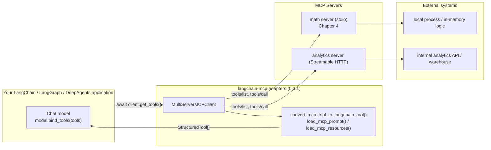
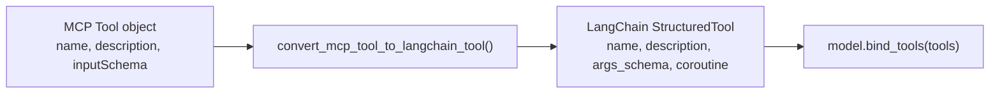
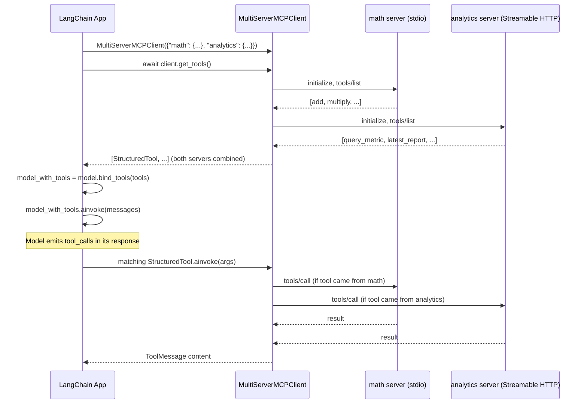

# MCP + LangChain

## Learning Objectives

By the end of this chapter, you will be able to:

- Explain the architecture that sits between a LangChain application and an MCP server: **LangChain → MCP Client (`langchain-mcp-adapters`) → MCP Server → external system**
- Configure `MultiServerMCPClient` to connect to multiple MCP servers at once, using the exact config shape for both stdio and Streamable HTTP transports
- Call `await client.get_tools()` correctly (it is async — a common bug is calling it synchronously) and explain how the returned LangChain `StructuredTool` objects get their `args_schema`
- Explain why the schema-design discipline from Chapter 10 pays off automatically the moment a tool is loaded through `langchain-mcp-adapters` — good `inputSchema`, good LangChain tool, zero extra work
- Load MCP resources and prompts into LangChain-native shapes (`Blob`, message lists) using the less-documented but fully public `load_mcp_resources`, `get_mcp_resource`, and `load_mcp_prompt` functions
- Choose between `MultiServerMCPClient.get_tools()` (multi-server, connection-managed) and the lower-level `load_mcp_tools(session, ...)` (single `ClientSession` you already manage yourself)
- Wire the combined tool list from two different MCP servers into a single LangChain chat model and run a basic tool-calling loop

## Prerequisites

This chapter assumes you already have:

- Chapter 4 (MCP Tools) — you know what an `inputSchema` is and have built a simple tool server
- Chapter 8 (Transport Mechanisms) — stdio vs. Streamable HTTP, so the config shape in this chapter isn't new vocabulary
- Chapter 9 (Building MCP Clients) — `ClientSession`, `stdio_client`, `streamable_http_client`, and what "initialize, then list, then call" looks like from raw Python
- Chapter 10 (Tool Schema Design) — this chapter is the payoff of that one
- Working LangChain fluency: `BaseTool`/`StructuredTool`, `bind_tools()`, `AIMessage.tool_calls`, `ToolMessage`
- `pip install langchain-mcp-adapters` (this chapter targets the latest release, **0.3.1**) alongside `mcp>=1.28,<2` and a LangChain chat model integration of your choice

This chapter does not re-teach LangChain tool calling itself, LangGraph, or DeepAgents — Chapters 18 and 19 build directly on what you learn here.

---

## 1. Where This Layer Sits

Every MCP server you've built so far (Chapters 4–7) speaks JSON-RPC over stdio or Streamable HTTP. Nothing about that wire format is LangChain-shaped — a raw MCP client, as you built in Chapter 9, gets back `Tool` objects with a `name`, a `description`, and a JSON Schema `inputSchema`. LangChain, meanwhile, expects `BaseTool` subclasses with a Pydantic `args_schema`, a `.invoke()`/`.ainvoke()` method, and a shape that `bind_tools()` on a chat model already knows how to serialize into that provider's function-calling format.

`langchain-mcp-adapters` is the translation layer between those two worlds. It does not change the MCP protocol, it does not change how your server works, and it does not add any new MCP primitives — it is purely an adapter that:

1. Manages MCP client connections (stdio subprocess, Streamable HTTP, and a couple of others) on your behalf, so you don't hand-write `stdio_client`/`ClientSession` boilerplate for every server in an application that talks to several.
2. Converts MCP `Tool`, `Resource`, and `Prompt` objects into their nearest LangChain-native equivalents — `StructuredTool`, `Blob`, and chat message lists, respectively.



Read this diagram left to right and the whole chapter falls into place: your application never talks JSON-RPC directly. It asks `MultiServerMCPClient` for tools, gets back ordinary LangChain objects, and everything downstream — `bind_tools()`, the reasoning loop, LangGraph nodes, DeepAgents' `tools=` parameter — behaves exactly as if you'd hand-written those tools yourself. The MCP layer is invisible from the model's perspective; it only matters to you, the integrator, and only at the point where tools get loaded.

> **2026-07-28 spec note:** `langchain-mcp-adapters` 0.3.1, like virtually all production MCP tooling as of this writing, implements the **classic**, handshake-based protocol (`initialize`/`initialized`, session-oriented `ClientSession`) described in Chapters 3 and 9 — not the stateless 2026-07-28 redesign. Everything in this chapter, including the `MultiServerMCPClient` config shape and the Streamable HTTP fields (`timeout`, `sse_read_timeout`), assumes a stateful connection per server. If and when the ecosystem migrates to the stateless model, expect the underlying transport plumbing inside this library to change; the LangChain-facing surface (`get_tools()` returning `StructuredTool` objects) is far more likely to stay stable, since that's the contract application code actually depends on.

## 2. Installing and Importing

```bash
pip install langchain-mcp-adapters
```

This pulls in `mcp` (the official SDK, classic v1.x line) as a dependency, so you do not install it separately unless you're pinning a version explicitly. The two imports you'll use in almost every file:

```python
from langchain_mcp_adapters.client import MultiServerMCPClient
```

Lower-level, single-session helpers (covered in Sections 6–7) live in two other modules:

```python
from langchain_mcp_adapters.tools import load_mcp_tools
from langchain_mcp_adapters.prompts import load_mcp_prompt
from langchain_mcp_adapters.resources import load_mcp_resources, get_mcp_resource
```

## 3. `MultiServerMCPClient`: Configuring Multiple Servers at Once

The whole point of `MultiServerMCPClient` is that a real application rarely talks to exactly one MCP server. You might have a math/calculator tool server running as a local subprocess, an analytics server exposed over HTTP inside your company's network, and a third-party server your team doesn't control at all. `MultiServerMCPClient` takes a single dict, keyed by a name **you** choose for each server, and manages all the connections behind one object.

```python
from langchain_mcp_adapters.client import MultiServerMCPClient

client = MultiServerMCPClient(
    {
        "math": {
            "command": "python",
            "args": ["/opt/mcp-servers/math_server.py"],
            "transport": "stdio",
        },
        "weather": {
            "url": "http://localhost:8000/mcp",
            "transport": "streamable_http",
        },
    }
)
```

The server name (`"math"`, `"weather"`) is purely a local label — it does not need to match anything the server calls itself in its own `serverInfo`. You'll see it again in error messages and in the single-session helpers from Section 6.

### 3.1 stdio server configuration

| Field | Required | Meaning |
|---|---|---|
| `command` | yes | The executable to launch (`"python"`, `"node"`, `"uv"`, ...) |
| `args` | yes | Argument list passed to `command` — typically the path to your server script |
| `env` | no | Extra environment variables for the subprocess (e.g., API keys the server needs) |
| `cwd` | no | Working directory to launch the subprocess in |
| `transport` | yes | Must be `"stdio"` |

This is a direct config-dict equivalent of the `StdioServerParameters` object you built by hand in Chapter 9 — `MultiServerMCPClient` constructs and manages that plumbing internally so you don't call `stdio_client(...)` yourself for every server.

### 3.2 Streamable HTTP server configuration

| Field | Required | Meaning |
|---|---|---|
| `url` | yes | The server's single HTTP endpoint (Chapter 8) |
| `headers` | no | Extra HTTP headers — most commonly `{"Authorization": "Bearer ..."}` |
| `timeout` | no | Request timeout |
| `sse_read_timeout` | no | Read timeout specifically for the server-push stream side of Streamable HTTP |
| `auth` | no | An `httpx.Auth` instance, for auth schemes more elaborate than a static bearer header (e.g., a token that refreshes itself) |
| `httpx_client_factory` | no | A callable that builds the underlying `httpx.AsyncClient`, for full control — custom TLS config, connection pooling, proxies |
| `transport` | yes | Must be `"streamable_http"` |

```python
"analytics": {
    "url": "https://analytics.internal.example.com/mcp",
    "headers": {"Authorization": f"Bearer {ANALYTICS_TOKEN}"},
    "timeout": 30,
    "sse_read_timeout": 60 * 5,
    "transport": "streamable_http",
},
```

### 3.3 Valid `transport` values

Four transport literals are valid in the config dict: `"stdio"`, `"sse"`, `"streamable_http"`, and `"websocket"`. In practice:

- Use `"stdio"` for local-process servers (the overwhelming majority of what you build yourself, per Chapter 4–7).
- Use `"streamable_http"` for any remote server built against the modern spec (2025-03-26 onward) — this is the one you should default to for new HTTP-based servers.
- `"sse"` exists for legacy HTTP+SSE servers (pre-2025-03-26, or third-party servers that haven't migrated) — treat it the same way Chapter 8 treats HTTP+SSE: works, but don't design new servers around it.
- `"websocket"` exists for servers built on a WebSocket transport; you'll encounter this far less often than the other three in the current MCP ecosystem.

Mixing transports across servers in one `MultiServerMCPClient` is entirely normal and, in fact, the whole reason the class exists — the worked example in Section 8 does exactly that.

## 4. `get_tools()`: Loading Tools as LangChain Objects

```python
tools = await client.get_tools()
```

Two things about this line are load-bearing:

**It is `async`.** `get_tools()` opens a connection to every configured server, performs the `initialize`/`initialized` handshake (Chapter 3), calls `tools/list` on each, and tears the connections back down — all of that is I/O, so the method is a coroutine. Calling it as `client.get_tools()` without `await` gives you a coroutine object, not a tool list, and it will fail (or silently do nothing useful) the moment you try to iterate over it or pass it to `bind_tools()`. This is, in practice, the single most common mistake engineers make the first time they use this library — it looks like it should be a plain method because "listing tools" doesn't feel like it should need `await`, but every step behind it is a network or subprocess round trip.

**Every tool from every configured server comes back in one flat list.** `get_tools()` doesn't namespace by server name in the tool's `.name` — if two servers happen to expose a tool called `search`, you'll get two `StructuredTool` objects both named `search` in the same list, and downstream code (including the model itself, when deciding what to call) has no server-qualified way to distinguish them. Keep tool names unique across the servers you combine, or fetch tools from a subset of servers deliberately if a name collision is unavoidable.

### 4.1 What comes back, concretely

Each element of the returned list is a LangChain `StructuredTool`:

```python
tools = await client.get_tools()
for t in tools:
    print(t.name, t.description)
    print(t.args_schema.model_json_schema())
```

- `t.name` — copied directly from the MCP tool's `name`
- `t.description` — copied directly from the MCP tool's `description`
- `t.args_schema` — a Pydantic model **built automatically from the MCP tool's `inputSchema`** — you never hand-write this
- Calling `t.ainvoke({...})` (or the model calling it through the normal tool-calling loop) issues a `tools/call` request against the correct server and returns the tool's result content

### 4.2 How the conversion actually happens

Internally, `get_tools()` calls `convert_mcp_tool_to_langchain_tool()` (in `langchain_mcp_adapters.tools`) once per discovered MCP tool. That function is the actual translator: it reads the MCP `Tool` object's `inputSchema` — plain JSON Schema, exactly as defined in Chapter 4 — and builds a Pydantic model from it to serve as `args_schema`, then wraps the tool's invocation (a `tools/call` request against the right session) as the `StructuredTool`'s coroutine.



This is the direct payoff of Chapter 10. There is no separate "write a LangChain-facing schema" step — the `inputSchema` you designed on the server *is* the schema the model will see through LangChain's tool-calling interface, with the same field names, types, descriptions, and required/optional structure. A tool with a vague `inputSchema` (untyped `"type": "object"` blobs, missing `description` fields, ambiguous optional parameters) produces an equally vague, equally hard-to-use LangChain tool — the adapter faithfully carries the problem forward rather than fixing it. Conversely, every trick from Chapter 10 — precise types, `enum` constraints, per-field descriptions the model can read, sensible defaults — shows up automatically as a better `args_schema`, with zero LangChain-side work.

## 5. Resources and Prompts Are Also Exposed — Not Just Tools

It's easy to come away from `langchain-mcp-adapters`' top-level README believing the library only bridges tools, since `MultiServerMCPClient.get_tools()` is the headline API. That's an incomplete picture. Resources (Chapter 5) and prompts (Chapter 6) are both MCP primitives too, and the library exposes public — if less prominently documented — functions for loading each into LangChain-native shapes. They just aren't methods on `MultiServerMCPClient` itself; they're standalone functions that take a `ClientSession` directly.

### 5.1 Prompts: `load_mcp_prompt`

```python
from langchain_mcp_adapters.prompts import load_mcp_prompt
```

Signature: `load_mcp_prompt(session, name, *, arguments=None) -> list[HumanMessage | AIMessage]`.

Given an open `ClientSession`, the name of a prompt the server exposes (`prompts/list` from Chapter 6), and optional arguments to fill the prompt's template placeholders, this calls `prompts/get` under the hood and converts the returned `PromptMessage` list (each one a `role` + content block, per Chapter 6's exact shape) into ordinary LangChain messages — `HumanMessage` for `role: "user"`, `AIMessage` for `role: "assistant"`. You get back something you can drop straight into a message list you're about to send to a chat model, instead of hand-mapping MCP's prompt message shape yourself.

### 5.2 Resources: `load_mcp_resources` and `get_mcp_resource`

```python
from langchain_mcp_adapters.resources import load_mcp_resources, get_mcp_resource
```

- `load_mcp_resources(session, *, uris=None) -> list[Blob]` — loads either every resource the server exposes (`uris=None`) or a specific list of URIs, returning LangChain `Blob` objects (LangChain's document-loader-adjacent primitive for raw content plus metadata — the same type LangChain's own document loaders produce).
- `get_mcp_resource(session, uri) -> list[Blob]` — loads exactly one resource by URI.

Both hide the same content-union handling you saw in Chapter 5 — text resources (`text`) and binary resources (`blob`, base64) — behind one consistent `Blob` return type, so your application code doesn't need an `if/else` on the resource's `mimeType` to decide how to read it.

### 5.3 Getting a `ClientSession` to pass to these functions

Both functions above take a `session`, not a `MultiServerMCPClient`. If you're already managing a `ClientSession` by hand — exactly the pattern from Chapter 9 — pass that session directly:

```python
from mcp import ClientSession, StdioServerParameters
from mcp.client.stdio import stdio_client
from langchain_mcp_adapters.prompts import load_mcp_prompt
from langchain_mcp_adapters.resources import load_mcp_resources

server_params = StdioServerParameters(command="python", args=["/opt/mcp-servers/docs_server.py"])

async with stdio_client(server_params) as (read, write):
    async with ClientSession(read, write) as session:
        await session.initialize()

        messages = await load_mcp_prompt(session, "summarize_ticket", arguments={"ticket_id": "PROJ-42"})
        blobs = await load_mcp_resources(session, uris=["file:///reports/2026-q2.csv"])
```

This is the same raw connect-then-initialize dance from Chapter 9, just followed by the adapter functions instead of raw `session.get_prompt(...)`/`session.read_resource(...)` calls. Keep this pattern in your back pocket for any code path where you specifically need a prompt or a resource — it's a lighter-weight alternative to standing up a full `MultiServerMCPClient` just to reach one server for one prompt.

## 6. The Single-Session Alternative: `load_mcp_tools(session, ...)`

`MultiServerMCPClient.get_tools()` is the right call almost all of the time — it manages connections to every configured server for you. But sometimes you're already inside a `ClientSession` you opened yourself, for reasons unrelated to LangChain (perhaps you're also calling `session.list_resources()` directly, or you're inside code shared with a non-LangChain caller). For that case, `langchain_mcp_adapters.tools` exposes the lower-level building block `get_tools()` itself is built from:

```python
from langchain_mcp_adapters.tools import load_mcp_tools

async with stdio_client(server_params) as (read, write):
    async with ClientSession(read, write) as session:
        await session.initialize()
        tools = await load_mcp_tools(session)
```

`load_mcp_tools(session, ...)` does exactly what `convert_mcp_tool_to_langchain_tool()` does, applied to every tool from a single already-open session's `tools/list` call — no connection management, no multi-server dict, just "give me this one session's tools as LangChain tools." Reach for `MultiServerMCPClient` when you want the library to own connection lifecycle across several servers; reach for `load_mcp_tools(session, ...)` when you already own a `ClientSession` and just need the conversion step.

## 7. Architecture Recap



## Examples

### Example 1: Minimal single-server connection and a plain tool call

```python
import asyncio
from langchain_mcp_adapters.client import MultiServerMCPClient

async def main():
    client = MultiServerMCPClient(
        {
            "math": {
                "command": "python",
                "args": ["/opt/mcp-servers/math_server.py"],
                "transport": "stdio",
            }
        }
    )
    tools = await client.get_tools()
    add_tool = next(t for t in tools if t.name == "add")
    result = await add_tool.ainvoke({"a": 5, "b": 3})
    print(result)  # "8"

asyncio.run(main())
```

Note that `add_tool.ainvoke(...)` is called directly here, bypassing a chat model entirely — useful for sanity-checking that the adapter layer works before you involve an LLM at all, and a good first step whenever a new server misbehaves (it isolates "is the tool reachable and correct" from "is the model calling it correctly").

### Example 2: The common mistake — forgetting `await`

```python
# WRONG — get_tools() returns a coroutine, not a list
tools = client.get_tools()
model.bind_tools(tools)   # fails: bind_tools() can't iterate a coroutine

# RIGHT
tools = await client.get_tools()
model.bind_tools(tools)
```

If you see an error complaining that a coroutine object isn't iterable, or that `tools` has no `len()`, this is almost always the cause. It's an easy mistake because every other line around it (constructing the client, calling `bind_tools`) looks synchronous.

### Example 3: Server name collision — a debugging scenario

```python
client = MultiServerMCPClient(
    {
        "internal_search": {"command": "python", "args": ["internal_search_server.py"], "transport": "stdio"},
        "web_search":      {"url": "https://search.example.com/mcp", "transport": "streamable_http"},
    }
)
tools = await client.get_tools()
print([t.name for t in tools])
# ['search', 'search']  <-- both servers happen to expose a tool literally named "search"
```

The model now has two indistinguishable `search` tools in its bound tool list — it has no reliable way to pick the right one, and neither does your code if you try to look one up by `t.name`. Fix this at the server-naming level (rename one tool, e.g. `internal_search` / `web_search`) rather than trying to disambiguate after the fact — MCP tool names are meant to be globally distinctive within whatever set of servers you combine, not just distinctive within their own server.

## Real-World Scenario

A fintech engineering team is building an internal "Ops Copilot" LangChain application. It needs two capabilities: quick numeric utilities (unit conversion, interest calculations — cheap, local, no network) and analytics queries against the company's metrics warehouse (aggregate transaction counts, latency percentiles — network-bound, authenticated, potentially slow). Rather than writing both as hand-rolled LangChain `@tool` functions inside the copilot's own codebase, the team already has a small calculator MCP server (built following Chapter 4, run as a subprocess) and a company-wide analytics MCP server (built by the data platform team, exposed over Streamable HTTP with bearer-token auth, used by several other internal tools besides this copilot).

The Ops Copilot's own code stays almost entirely free of MCP plumbing:

```python
client = MultiServerMCPClient(
    {
        "calculator": {
            "command": "python",
            "args": ["/opt/mcp-servers/calculator_server.py"],
            "transport": "stdio",
        },
        "analytics": {
            "url": "https://analytics.internal.fintech-co.com/mcp",
            "headers": {"Authorization": f"Bearer {os.environ['ANALYTICS_MCP_TOKEN']}"},
            "timeout": 20,
            "transport": "streamable_http",
        },
    }
)
tools = await client.get_tools()
model_with_tools = model.bind_tools(tools)
```

When the data platform team adds a new analytics tool (say, `refund_rate_by_region`) to their server, the Ops Copilot picks it up automatically the next time it calls `get_tools()` — no code change, no redeploy of the copilot itself, because tool discovery happens over the wire rather than being hard-coded in the copilot's source. When the calculator server's `add` tool gets a stricter `inputSchema` after a Chapter 10-style schema-design review (adding bounds validation, clearer field descriptions), the copilot's LangChain tool description improves the very next time it reconnects — again, with no changes on the copilot's side. The team measures this concretely six weeks later: three other internal tools (a Slack bot, a nightly reporting job, a separate LangGraph-based fraud-review agent) all connect to the same analytics MCP server through their own `MultiServerMCPClient` instances, and a schema fix the data platform team ships once is felt by all four consumers simultaneously — exactly the reuse story Chapter 1 promised, now concretely realized through this adapter layer.

## 8. Full Worked Example: Two Servers, One Tool-Calling Loop

This example connects to a stdio-based math server (the kind you built in Chapter 4) and an HTTP-based analytics server, combines their tools, binds them to a chat model, and runs one turn of a manual tool-calling loop — the same shape LangGraph automates for you starting in Chapter 18.

```python
import asyncio
import os

from langchain.chat_models import init_chat_model
from langchain_core.messages import HumanMessage, ToolMessage
from langchain_mcp_adapters.client import MultiServerMCPClient


async def main() -> None:
    client = MultiServerMCPClient(
        {
            "math": {
                "command": "python",
                "args": ["/opt/mcp-servers/math_server.py"],
                "transport": "stdio",
            },
            "analytics": {
                "url": "https://analytics.internal.example.com/mcp",
                "headers": {"Authorization": f"Bearer {os.environ['ANALYTICS_TOKEN']}"},
                "timeout": 30,
                "transport": "streamable_http",
            },
        }
    )

    # get_tools() is async: it opens both connections, runs initialize/initialized,
    # calls tools/list on each server, and tears the connections back down.
    tools = await client.get_tools()
    print(f"Loaded {len(tools)} tools:", [t.name for t in tools])

    model = init_chat_model("anthropic:claude-sonnet-4-5", temperature=0)
    model_with_tools = model.bind_tools(tools)

    messages = [
        HumanMessage(
            content="What's 17 times 23, and what was our average request latency last week?"
        )
    ]

    ai_message = await model_with_tools.ainvoke(messages)
    messages.append(ai_message)

    # The model will typically emit two tool_calls here: one routed to the math
    # server's "multiply" tool, one routed to the analytics server's
    # "average_latency" tool. Neither the model nor this loop needs to know or
    # care which physical server backs which tool — that's exactly the point.
    tools_by_name = {t.name: t for t in tools}
    for call in ai_message.tool_calls:
        tool = tools_by_name[call["name"]]
        result = await tool.ainvoke(call["args"])
        messages.append(ToolMessage(content=str(result), tool_call_id=call["id"]))

    final = await model_with_tools.ainvoke(messages)
    print(final.content)


asyncio.run(main())
```

Walk through what each layer contributed:

- `MultiServerMCPClient` handled two entirely different transports (subprocess stdio, authenticated Streamable HTTP) behind one uniform config dict.
- `get_tools()` did the `initialize`/`tools/list`/schema-conversion work for both servers in one `await`.
- `model.bind_tools(tools)` needed zero knowledge that some of these tools are MCP-backed — from LangChain's perspective they're indistinguishable from hand-written `@tool` functions.
- The manual loop (`ai_message.tool_calls` → look up by name → `ainvoke` → wrap in `ToolMessage`) is the same loop you'd write for any LangChain tool-calling application; nothing MCP-specific leaks into it. Chapter 18 replaces this hand-rolled loop with a LangGraph `ToolNode`/prebuilt agent so you stop writing it by hand.

## Best Practices

- **Always `await client.get_tools()`.** Make this a code-review checklist item on any PR touching MCP integration — the failure mode (a coroutine silently not iterating) is easy to miss in a quick glance.
- **Keep tool names unique across every server you combine in one `MultiServerMCPClient`.** Treat a name collision as a server-design bug to fix at the source (Chapter 10), not something to patch around in application code.
- **Invest in `inputSchema` quality on the server, not in post-processing on the client.** Everything Chapter 10 teaches about precise types, `enum` constraints, and field-level descriptions flows straight through `convert_mcp_tool_to_langchain_tool()` into what the model sees — there is no LangChain-side schema-fixing step, so fix it once, upstream.
- **Reach for `load_mcp_prompt`/`load_mcp_resources`/`get_mcp_resource` deliberately when you need prompts or resources**, rather than assuming `MultiServerMCPClient` only does tools. They require a `ClientSession`, so budget for the extra connection-management code (or the `client.session(server_name)` pattern) when you plan to use them.
- **Prefer `"streamable_http"` over `"sse"` for any HTTP server you control.** Only reach for `"sse"` when talking to a third-party server that genuinely hasn't migrated off legacy HTTP+SSE (Chapter 8).
- **Use `load_mcp_tools(session, ...)` instead of standing up a whole `MultiServerMCPClient` when you already have a single open `ClientSession` for unrelated reasons** — don't pay for connection-management machinery you don't need.
- **Store credentials (bearer tokens, API keys) via `headers`/`auth`/`env`, never hard-coded in the config dict** — treat the `MultiServerMCPClient` config exactly like any other place secrets flow through your application.

## Common Mistakes

- **Calling `client.get_tools()` without `await`.** Covered above in detail because it's the single most common first-time error with this library.
- **Assuming resources and prompts aren't supported because the top-level README emphasizes tools.** `load_mcp_prompt`, `load_mcp_resources`, and `get_mcp_resource` are fully public, documented functions in `langchain_mcp_adapters.prompts`/`.resources` — they're just less prominent than `get_tools()`.
- **Forgetting that `get_tools()` returns one flat, unnamespaced list.** Two servers with a same-named tool silently collide; the failure looks like "the model picked the wrong tool" rather than an obvious configuration error.
- **Mismatching config fields to transport.** Putting `command`/`args` on a server meant to use `transport: "streamable_http"`, or `url` on one meant to use `transport: "stdio"`, produces a configuration that either fails to connect or silently does the wrong thing — always cross-check the field table in Section 3 against the `transport` value you set.
- **Treating a poor `inputSchema` as a LangChain problem to fix after loading the tool.** There is no supported way to "improve" a `StructuredTool`'s `args_schema` after the fact that doesn't drift out of sync with the actual MCP tool — fix the schema on the server (Chapter 10) instead.
- **Not passing `headers`/`auth` for an authenticated HTTP server and being surprised by 401s that look like connection failures** rather than the auth issue they actually are.

## Summary

- `langchain-mcp-adapters` (0.3.1) is the adapter layer between LangChain-shaped code and MCP-shaped servers: **LangChain → MCP Client → MCP Server → external system**. It changes nothing about the MCP protocol itself.
- `MultiServerMCPClient({...})` takes a dict keyed by server name: stdio servers use `command`/`args`/`env`/`cwd` with `transport: "stdio"`; HTTP servers use `url`/`headers`/`timeout`/`sse_read_timeout`/`auth`/`httpx_client_factory` with `transport: "streamable_http"`. Valid transport literals: `"stdio"`, `"sse"`, `"streamable_http"`, `"websocket"`.
- `tools = await client.get_tools()` is **async** — forgetting `await` is the most common mistake with this library. It returns one flat list of LangChain `StructuredTool` objects across every configured server.
- Internally, `convert_mcp_tool_to_langchain_tool()` builds each `StructuredTool`'s `args_schema` directly from the MCP tool's `inputSchema` — this is why Chapter 10's schema-design discipline pays off automatically, with no LangChain-side translation step to get right or wrong.
- Resources and prompts are also exposed, via public but less-documented functions that take a `ClientSession`: `load_mcp_prompt(session, name, *, arguments=None)` returns LangChain messages; `load_mcp_resources(session, *, uris=None)` and `get_mcp_resource(session, uri)` return `Blob` objects.
- `load_mcp_tools(session, ...)` is the single-session building block `get_tools()` is built on — reach for it when you already manage a `ClientSession` yourself (Chapter 9), rather than standing up a full `MultiServerMCPClient` for one server.
- Chapter 18 wires this same `get_tools()` output into a LangGraph agent (replacing the hand-rolled tool-calling loop from Section 8 with a prebuilt graph); Chapter 19 passes it straight through `create_deep_agent()`'s ordinary `tools=` parameter.

## Knowledge Check

1. Draw (in words) the four-box architecture this chapter is built around, from the LangChain application down to the external system.
2. Why is `client.get_tools()` a coroutine rather than a plain method? What symptom do you see if you forget the `await`?
3. A colleague says "langchain-mcp-adapters only gives you tools — resources and prompts aren't supported." What's wrong with that claim, and what would you point them to instead?
4. What config fields distinguish a stdio server entry from a Streamable HTTP server entry in a `MultiServerMCPClient` dict? Name at least three fields unique to each.
5. Where, precisely, does a `StructuredTool`'s `args_schema` come from, and why does that mean Chapter 10's schema-design advice has a direct, automatic payoff here?
6. When would you reach for `load_mcp_tools(session, ...)` instead of `MultiServerMCPClient.get_tools()`?
7. Two servers in the same `MultiServerMCPClient` both expose a tool named `search`. What actually happens when you call `get_tools()`, and how should you fix it?

<details>
<summary>Answers</summary>

1. LangChain application (chat model, `bind_tools()`, the reasoning loop) → MCP Client (`MultiServerMCPClient`/`langchain-mcp-adapters`, which manages connections and converts MCP objects to LangChain objects) → MCP Server (exposes tools/resources/prompts, speaks JSON-RPC) → external system (database, API, filesystem, whatever the server actually wraps).
2. Every step behind `get_tools()` — opening a connection, running `initialize`/`initialized`, calling `tools/list` on each configured server — is network or subprocess I/O, so it has to be awaited like any other async operation. Forgetting `await` gives you a coroutine object instead of a tool list; the visible symptom is usually an error from `bind_tools()` or a `for` loop complaining that a coroutine isn't iterable, or has no length.
3. It's incomplete: resources and prompts are MCP primitives just like tools, and `langchain-mcp-adapters` exposes public functions for both — `load_mcp_prompt(session, name, arguments=None)` for prompts, and `load_mcp_resources(session, uris=None)`/`get_mcp_resource(session, uri)` for resources, returning LangChain messages and `Blob` objects respectively. They're simply less prominent in the top-level README than `get_tools()`, not unsupported.
4. Stdio-unique fields: `command`, `args`, `cwd` (also `env`, though that's arguably shared conceptually). HTTP-unique fields: `url`, `headers`, `timeout`, `sse_read_timeout`, `auth`, `httpx_client_factory`. Both require a `transport` field, but the value differs (`"stdio"` vs. `"streamable_http"`).
5. It comes from `convert_mcp_tool_to_langchain_tool()`, which builds the Pydantic `args_schema` directly from the MCP tool's `inputSchema` — the exact JSON Schema the server author wrote (or generated from a typed function signature, per Chapter 4). Because there's no separate hand-written LangChain-facing schema, whatever quality (or lack of it) you put into the `inputSchema` on the server — precise types, `enum` constraints, per-field descriptions — shows up unchanged in what the model sees through LangChain, with no additional client-side work required or possible.
6. When you already have an open `ClientSession` for a single server for reasons unrelated to LangChain — for example, you're also calling other session methods directly, or the session is shared with non-LangChain code — `load_mcp_tools(session, ...)` gives you just the tool-conversion step without the multi-server connection-management overhead that `MultiServerMCPClient` provides.
7. `get_tools()` returns one flat, unnamespaced list, so both tools appear with the identical name `"search"` — there is no server-qualification baked into `.name`. This is a name collision that neither the model nor simple by-name lookup code can reliably resolve. The fix is at the server-design level: rename one (or both) tools to something distinctive (e.g. `internal_search`/`web_search`) so names stay unique across every server you combine in one client, rather than trying to disambiguate identically-named tools after loading.

</details>

## Hands-On Exercise

Using the math/calculator MCP server you built in Chapter 4 (or a minimal stand-in with two or three tools, if you skipped ahead):

1. Write a script that constructs a `MultiServerMCPClient` with just that one stdio server configured, calls `await client.get_tools()`, and prints each tool's `name`, `description`, and `args_schema.model_json_schema()`. Confirm the schema matches what you'd expect from the tool's `inputSchema`.
2. Deliberately comment out the `await` (call `client.get_tools()` without it) and observe the failure. Write down, in your own words, exactly what error you get and why it happens — this is the mistake Section 4 and the Knowledge Check both call out as the most common one.
3. Add a second, fake "server" entry to the same `MultiServerMCPClient` config that points at a Streamable HTTP `url` you don't actually have running (any local port with nothing listening is fine). Call `get_tools()` again and observe what happens — does it fail entirely, or does it still return tools from the working stdio server? Write down the actual behavior you observe (don't assume — verify it against your own installed version).
4. Pick one tool from your server and deliberately weaken its `inputSchema` on the server side (Chapter 4/10 style — e.g., change a typed, described parameter to an untyped, undescribed one). Reload tools through `get_tools()` and diff the resulting `args_schema` before and after. This should make the "schema quality passes straight through" claim from Section 4.2 concrete rather than theoretical.
5. If you have access to any HTTP-based MCP server (your own, or a Chapter 16-style REST wrapper), extend your script into the two-server shape from Section 8: combine tools from your stdio server and the HTTP server, bind them to a chat model, and run one full tool-calling turn end to end.

## Further Reading

- `github.com/langchain-ai/langchain-mcp-adapters` — the official repository for this chapter's library; check the version you have installed against 0.3.1
- Chapter 4 (MCP Tools) and Chapter 10 (Tool Schema Design) — the server-side half of everything this chapter's `inputSchema` → `args_schema` conversion depends on
- Chapter 8 (Transport Mechanisms) and Chapter 9 (Building MCP Clients) — the raw `ClientSession`/`stdio_client`/`streamable_http_client` plumbing that `MultiServerMCPClient` manages on your behalf
- Chapter 18 (MCP + LangGraph) — replaces this chapter's hand-rolled tool-calling loop with a LangGraph-managed one
- Chapter 19 (MCP + DeepAgents) — passes this chapter's `get_tools()` output straight into `create_deep_agent()`'s `tools=` parameter

<div style="display:flex;justify-content:space-between;align-items:center;">
  <a href="./16-mcp-and-rest-apis.md">← Previous: MCP + REST APIs</a>
  <a href="./00-index.md">🏠 Index</a>
  <a href="./18-mcp-with-langgraph.md">Next: MCP + LangGraph →</a>
</div>
