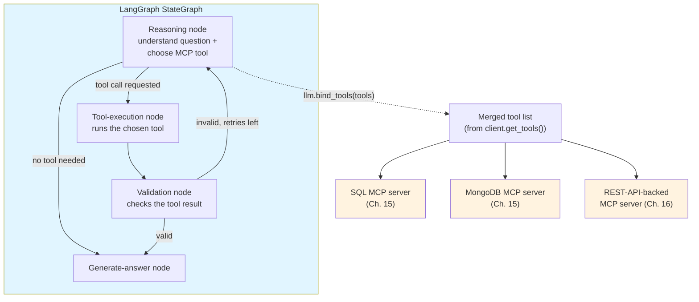
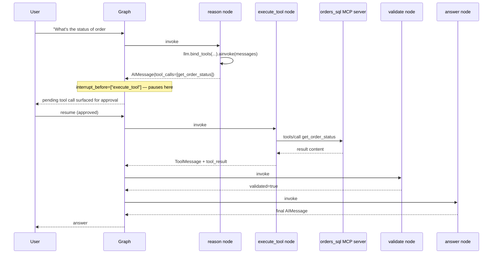

# MCP + LangGraph

> Chapter 17 got you a flat list of LangChain tools out of `MultiServerMCPClient.get_tools()` and bound them to a model. That's enough for a single-turn "model picks a tool, tool runs, model answers" loop. It is not enough once you need to *pause* before a destructive call, *retry* a flaky MCP server without re-running the whole reasoning step, or *reject* a tool result that came back malformed and route back for another attempt. Those are graph-shaped problems — explicit state, explicit control flow, explicit edges you can interrupt — which is exactly what LangGraph gives you and plain LangChain tool-binding doesn't.

## Learning Objectives

By the end of this chapter, you will be able to:

- Explain concretely why MCP's tool surface benefits from LangGraph's explicit state and control flow in a way it doesn't from LangChain's bind-and-invoke pattern
- Build a `StateGraph` that reasons about a question, chooses an MCP-backed tool, executes it, validates the result, and either loops back to reasoning or produces a final answer
- Wire conditional edges that route on "did the model request a tool call" and "did the result pass validation," including a loop back to the reasoning node
- Instantiate a `MultiServerMCPClient` exactly once, at graph-build time, and explain the connection-reuse cost of getting this wrong
- Add a human-in-the-loop approval gate before a specific MCP tool executes, using `interrupt_before`
- Add retry logic scoped to a single MCP tool call, not the whole graph turn
- Route reasoning across multiple MCP servers (SQL, Mongo, API-backed) inside one graph and explain what "routing" actually means once tools are merged into one list
- Describe what per-node tracing on an MCP-backed graph gives you that a flat LangChain chain doesn't (foreshadowing Chapter 20's observability chapter)

---

## Prerequisites

Before this chapter, you need **[Chapter 17: MCP + LangChain](./17-mcp-with-langchain.md)**, which covers `langchain-mcp-adapters`, the `MultiServerMCPClient` configuration dict, the stdio/HTTP transport fields, and the `await client.get_tools()` call that turns MCP tools into LangChain `StructuredTool` objects with auto-derived `args_schema`. Everything in this chapter starts from "I already have a list of LangChain tools backed by one or more MCP servers" — if that sentence doesn't make sense yet, go back to Chapter 17 first.

You should also already be comfortable with, from your existing background:

- LangGraph fundamentals: `StateGraph`, state schemas, nodes, edges, conditional edges, `START`/`END` (**not re-taught here** — see the index's note to review the LangGraph course first if any of that is shaky)
- `add_messages` / `MessagesState`-style message-list state accumulation
- Checkpointers and the general shape of LangGraph's `interrupt_before` / human-in-the-loop mechanism
- What a LangChain `StructuredTool` is and how `bind_tools()` exposes tools to a chat model

This chapter does not re-explain what a graph node or a conditional edge *is* — it explains what changes about your graph design when some of your tools happen to be MCP-backed instead of hand-written Python functions.

---

## 1. Why MCP Fits LangGraph Specifically

Chapter 17 built the plain-LangChain version of this: `llm.bind_tools(tools)`, call the model, if it emits a tool call run it, feed the result back, ask the model to answer. That pattern works, and it's genuinely simpler when it's all you need. It also has a structural limit — the entire lifecycle of "decide → execute → respond" lives inside one implicit loop that a chain or a bare `AgentExecutor`-style construct doesn't expose as addressable state. You can't cleanly say "pause right here, before this specific tool executes" or "if this result fails validation, go back to the reasoning step with that failure in context" without reaching for callbacks and controller code bolted onto the outside of the loop.

LangGraph turns that implicit loop into an explicit graph: every step is a named node, every transition is a named edge, and the state that flows between them is a schema you define. That matters for MCP specifically because MCP tool calls have three properties plain in-process Python function calls usually don't:

- **They cross a process or network boundary.** A stdio MCP server is a subprocess; a Streamable HTTP server is a remote service. Both can fail transiently in ways a local function call rarely does — worth an explicit retry *node*, not a `try/except` buried inside a tool wrapper.
- **Some of them are genuinely dangerous.** A `run_query` tool against a production database or a `create_issue` tool against a real tracker is not something you want firing unattended just because the model decided to call it. LangGraph's `interrupt_before` gives you a first-class pause point *before* the tool-execution node runs — not a hack layered on top of a chain.
- **Their results need validation you can't fully push into the schema.** `outputSchema`/`structuredContent` (Chapter 4) validates *shape*; it says nothing about whether a query returned zero rows because the filter was wrong, or whether a resource link points at something the agent should not have been handed. That's a semantic check, and a semantic check needs a place to live — a validation *node*, with its own edge back to reasoning on failure.

None of this is unique to MCP in principle — you could build the same graph around hand-written tools. What's specific to MCP is that once your tools come from `MultiServerMCPClient.get_tools()`, you already have a merged, uniform `list[StructuredTool]` spanning however many servers you configured, so the "which specific tool implementation is this" question disappears from your graph code entirely — the graph only ever reasons about *tool names*, never about which server, transport, or session backs them. That uniformity is what makes it practical to add real control flow (pause, retry, validate, loop) around a many-server tool surface without the graph itself needing to know MCP exists underneath.

---

## 2. Architecture: Reasoning Fans Out to MCP Tools Across Servers



Read the dotted line deliberately: the reasoning node never talks to "the SQL server" or "the API server" by name. It talks to the model, the model is bound to one merged list of tools, and the model picks a *tool name*. Whichever `MultiServerMCPClient`-managed session backs that tool is an implementation detail the graph never has to reason about — Section 6 comes back to exactly what "routing to the right server" means once you accept that.

---

## 3. State Schema

The state needs to carry more than a message list, because the validation node has to communicate a pass/fail signal (and a retry budget) back to the routing logic:

```python
# Targets: langgraph (any current release), langchain-mcp-adapters 0.3.1
from typing import Annotated, Any
from typing_extensions import TypedDict
from langgraph.graph.message import add_messages
from langchain_core.messages import BaseMessage

class AgentState(TypedDict):
    messages: Annotated[list[BaseMessage], add_messages]
    tool_result: Any            # raw result from the last MCP tool call
    validated: bool             # did the validation node accept the result?
    validation_reason: str      # why it passed or failed, fed back to reasoning
    retries: int                # how many times we've looped back
```

`messages` is the familiar accumulating list every LangGraph agent state has. The other four fields are what turn this from a bare tool-calling loop into something that can validate and retry: `tool_result` holds the last MCP call's output so the validation node can inspect it without re-deriving it from `messages`; `validated` and `validation_reason` are the conditional-edge signal and the human-readable explanation that gets appended back into the conversation if a retry is needed; `retries` bounds the loop so a persistently malformed tool result can't spin forever.

---

## 4. The Six-Step Flow

The roadmap for this chapter's graph is:

```
START → Understand Question → Choose MCP Tool → Execute → Validate Result → Generate Answer → END
```

In the diagram these read as two separate responsibilities — understanding the question and choosing which MCP tool answers it. In code they collapse into **one** reasoning node, because with `bind_tools()`, a single chat-model call already does both: the model reads the question *and* decides, in the same completion, whether a tool call is warranted and which one. Splitting that into two separate LLM calls would just be two API round-trips paying for something one call already gives you. Keep the two responsibilities distinct in your head — a node can still do two conceptual jobs — but don't manufacture a redundant graph node to force a 1:1 match with a six-box diagram.

So the graph you'll actually build has four nodes and one loop-back edge:

| Node | Roadmap step(s) it covers | Job |
|---|---|---|
| `reason` | Understand Question + Choose MCP Tool | Call the tool-bound model; either emits a tool call or a direct answer |
| `execute_tool` | Execute | Run the chosen MCP-backed tool, with retry-on-transient-failure |
| `validate` | Validate Result | Inspect the tool result; set `validated`/`validation_reason` |
| `answer` | Generate Answer | Final model call, informed by validated tool output |

---

## 5. Building the Graph

### 5.1 The client and the tools — built once

```python
# Targets: langchain-mcp-adapters 0.3.1, langgraph (current), classic MCP (2025-06-18)
from langchain_mcp_adapters.client import MultiServerMCPClient

def build_mcp_client() -> MultiServerMCPClient:
    return MultiServerMCPClient(
        {
            "orders_sql": {
                "command": "python",
                "args": ["/srv/mcp/orders_sql_server.py"],
                "transport": "stdio",
            },
            "catalog_mongo": {
                "command": "python",
                "args": ["/srv/mcp/catalog_mongo_server.py"],
                "transport": "stdio",
            },
            "shipping_api": {
                "url": "https://internal.example.com/mcp",
                "transport": "streamable_http",
                "headers": {"Authorization": "Bearer $SHIPPING_MCP_TOKEN"},
            },
        }
    )
```

Section 7 below explains, in detail, why this function is called exactly once per process — not once per graph invocation — but hold onto the shape for now: one client, three named servers, each transport-appropriate.

### 5.2 The reasoning node

```python
from langchain_core.messages import AIMessage, SystemMessage
from langchain_openai import ChatOpenAI  # any tool-calling chat model works

REASONING_SYSTEM_PROMPT = (
    "You are a customer-operations assistant. You have tools backed by an "
    "orders database, a product catalog, and a shipping API. Call at most "
    "one tool per turn. If the question needs no tool, answer directly."
)

async def reason(state: AgentState, *, model_with_tools) -> dict:
    messages = state["messages"]
    if not any(isinstance(m, SystemMessage) for m in messages):
        messages = [SystemMessage(content=REASONING_SYSTEM_PROMPT)] + messages
    response: AIMessage = await model_with_tools.ainvoke(messages)
    return {"messages": [response]}
```

`model_with_tools` is `llm.bind_tools(tools)` where `tools` is the merged list from `await client.get_tools()` — built once, at graph-build time, and closed over here via a partial application (Section 5.5 wires that up).

### 5.3 The tool-execution node

`langgraph.prebuilt.ToolNode` handles the common case — read `AIMessage.tool_calls`, dispatch each one, append `ToolMessage`s — and is a completely reasonable default if you don't need retry-with-backoff or per-call result capture for the validation node. Here, we build a small custom node instead, precisely because we want the raw tool result captured into `state["tool_result"]` for validation, and we want retries scoped to one MCP call:

```python
import asyncio
from langchain_core.messages import ToolMessage

MAX_TOOL_RETRIES = 2

async def execute_tool(state: AgentState, *, tools_by_name: dict) -> dict:
    last_message = state["messages"][-1]
    tool_call = last_message.tool_calls[0]  # one tool call per turn, per the system prompt
    tool = tools_by_name[tool_call["name"]]

    last_exc: Exception | None = None
    for attempt in range(MAX_TOOL_RETRIES + 1):
        try:
            result = await tool.ainvoke(tool_call["args"])
            return {
                "tool_result": result,
                "messages": [
                    ToolMessage(content=str(result), tool_call_id=tool_call["id"])
                ],
            }
        except Exception as exc:  # transient MCP transport/server errors
            last_exc = exc
            if attempt < MAX_TOOL_RETRIES:
                await asyncio.sleep(0.5 * (attempt + 1))  # simple backoff
    # Exhausted retries — surface the failure as a tool result, not a crash,
    # so validation (and, if needed, reasoning) can react to it.
    return {
        "tool_result": None,
        "messages": [
            ToolMessage(
                content=f"Tool '{tool_call['name']}' failed after retries: {last_exc}",
                tool_call_id=tool_call["id"],
            )
        ],
    }
```

Two things worth calling out. First, the retry loop is scoped to *this one MCP call* — a flaky `shipping_api` request gets three attempts without re-running the reasoning step or re-spending a model call each time, which is exactly the granularity you want and exactly what you'd lose if "retry" only existed as "re-run the whole graph." Second, a tool that fails all its retries doesn't raise out of the node — it returns a `ToolMessage` describing the failure, which flows into `validate` like any other result and can trigger the loop-back-to-reasoning path in Section 5.4, letting the model try a different tool or ask a clarifying question instead of the whole turn crashing.

### 5.4 The validation node

```python
def validate(state: AgentState) -> dict:
    result = state["tool_result"]
    if result is None:
        return {"validated": False, "validation_reason": "tool call failed after retries"}
    if isinstance(result, str) and result.strip() == "":
        return {"validated": False, "validation_reason": "tool returned an empty result"}
    if isinstance(result, dict) and result.get("error"):
        return {"validated": False, "validation_reason": f"tool reported an error: {result['error']}"}
    return {"validated": True, "validation_reason": "result looks well-formed"}
```

This is deliberately simple — an empty result, a `None` (the retry-exhausted case from 5.3), or a structured error field are the most common ways an MCP tool call "succeeds" at the protocol level (`isError: false`) but still isn't something you should hand to the model as ground truth. Real validation logic is domain-specific: for `orders_sql` you might check the row count is non-negative and the columns match what the caller expected; for `shipping_api` you might check a tracking number matches an expected format. The node's job is to *own that check as an explicit, addressable step* — not to be exhaustive here.

### 5.5 Wiring the graph

```python
from langgraph.graph import StateGraph, START, END
from functools import partial

def route_after_reasoning(state: AgentState) -> str:
    last = state["messages"][-1]
    if isinstance(last, AIMessage) and last.tool_calls:
        return "execute_tool"
    return "answer"

def route_after_validation(state: AgentState) -> str:
    if state["validated"]:
        return "answer"
    if state["retries"] < MAX_GRAPH_RETRIES:
        return "reason"
    return "answer"  # give up gracefully rather than looping forever

MAX_GRAPH_RETRIES = 2

async def build_graph():
    client = build_mcp_client()          # instantiated ONCE — see Section 7
    tools = await client.get_tools()     # one merged list across all three servers
    tools_by_name = {t.name: t for t in tools}
    model_with_tools = ChatOpenAI(model="gpt-4o", temperature=0).bind_tools(tools)

    async def bump_retries(state: AgentState) -> dict:
        return {"retries": state.get("retries", 0) + 1}

    graph = StateGraph(AgentState)
    graph.add_node("reason", partial(reason, model_with_tools=model_with_tools))
    graph.add_node("execute_tool", partial(execute_tool, tools_by_name=tools_by_name))
    graph.add_node("validate", validate)
    graph.add_node("bump_retries", bump_retries)
    graph.add_node("answer", generate_answer)  # defined below

    graph.add_edge(START, "reason")
    graph.add_conditional_edges("reason", route_after_reasoning, {
        "execute_tool": "execute_tool",
        "answer": "answer",
    })
    graph.add_edge("execute_tool", "validate")
    graph.add_conditional_edges("validate", route_after_validation, {
        "reason": "bump_retries",
        "answer": "answer",
    })
    graph.add_edge("bump_retries", "reason")
    graph.add_edge("answer", END)

    return graph.compile(interrupt_before=["execute_tool"])
```

```python
async def generate_answer(state: AgentState) -> dict:
    # A plain, non-tool-bound call — we just want prose now.
    final_model = ChatOpenAI(model="gpt-4o", temperature=0)
    response = await final_model.ainvoke(state["messages"])
    return {"messages": [response]}
```

The retry-counter increment lives in its own tiny `bump_retries` node rather than inside `validate` itself, so that `validate`'s only job stays "did this result pass or fail" — a pattern worth keeping in mind generally: a conditional edge's routing function should read state, not have side effects, and a node that mutates a counter is easier to reason about in isolation than one that both judges a result *and* tracks how many times it's been wrong.

---

## 6. Multi-Server Routing: What "Routing" Actually Means Here

It's tempting to imagine the reasoning node picking a *server* — "this looks like a database question, route to `orders_sql`" — the way an API gateway routes a request to a backend. That's not what happens, and it's worth being precise about why. `client.get_tools()` returns one flat `list[StructuredTool]` merged across every server in the config dict; by the time `bind_tools()` sees them, there is no server-level grouping left in the data the model reasons over — only individual tool names, descriptions, and schemas. The model doesn't choose `orders_sql`; it chooses `get_order_status` (or whatever the tool is named), and the fact that `get_order_status` happens to be implemented by the `orders_sql` server is invisible at the point of choice.

So "routing to the right server" is really two things you get almost for free, plus one thing you have to build yourself if you want it:

- **Tool-name resolution to the right session is the adapter's job**, not your graph's. Each `StructuredTool` returned by `get_tools()` closes over the MCP session it came from; calling `tool.ainvoke(...)` dispatches to that session automatically. Your `execute_tool` node (Section 5.3) never asks "which server does this belong to" — `tools_by_name[tool_call["name"]]` is all the routing logic that exists in the graph.
- **Tool-name design does the actual disambiguation.** If two servers both expose a tool literally named `search`, the model has no way to tell them apart, and neither does your `tools_by_name` dict — this is a naming-collision bug, not a routing bug, and Chapter 10's schema-design guidance (unique, descriptive tool names) is the fix.
- **A name-to-server map is something *you* build, and it's for observability, not dispatch.** If you want to log or trace which underlying server serviced a call — which you will want, per Section 9 — keep your own dict from the same config keys you passed into `MultiServerMCPClient`, e.g. `{"get_order_status": "orders_sql", "search_catalog": "catalog_mongo", "get_tracking_number": "shipping_api"}`. This is bookkeeping on top of the adapter, not a documented method on `MultiServerMCPClient` — don't go looking for a `get_tools(server="...")` call that isn't part of the fact sheet's confirmed API surface.

---

## 7. Lifecycle: Build the Client Once, at Graph-Build Time

The single most consequential architectural decision in this chapter is *when* `MultiServerMCPClient(...)` gets constructed. Get this wrong and everything else in the chapter — retries, validation, tracing — still runs, just slower and more fragile than it needs to be.

**Build it once, when the graph is built — not inside a node, not per invocation.** In `build_graph()` above, `client = build_mcp_client()` and `tools = await client.get_tools()` run exactly once, and the resulting `tools`/`tools_by_name`/`model_with_tools` are closed over by every node via `partial(...)`. Every subsequent graph invocation — every user turn, every `graph.ainvoke(...)` call — reuses that same client and the same underlying sessions.

Why this matters concretely:

- **Stdio servers are subprocesses.** `orders_sql` and `catalog_mongo` above are spawned as child processes when the client establishes its sessions. Rebuilding the client per invocation means spawning a fresh subprocess per user turn — process-startup latency on the hot path, and a slow leak of zombie/orphaned processes if shutdown isn't handled perfectly every single time.
- **HTTP sessions and any connection pooling behind them get thrown away and rebuilt.** `shipping_api` is a Streamable HTTP server; whatever connection reuse `httpx` (or a custom `httpx_client_factory`) is doing underneath gets reset every time you tear down and recreate the client. This is the same cost Chapter 15 flagged when discussing why a database-backed MCP *server* keeps its own connection pool open to the database rather than opening a fresh connection per tool call — the client side of the wire has the identical incentive to keep its transport-level connections warm, and rebuilding `MultiServerMCPClient` per request defeats that the same way reconnecting to Postgres per query would.
- **`get_tools()` re-does capability negotiation every time it's called against a fresh client**, which is unnecessary latency for information (the tool list, schemas) that doesn't change turn-to-turn in the common case.

The practical rule: `build_graph()` (or an equivalent factory) is a **startup-time** function you call once per process — when your FastAPI app boots, when your worker starts, when your script begins — and the compiled graph it returns is what you invoke repeatedly. If your deployment needs to pick up new/changed tools without a restart, that's a deliberate refresh policy (re-run `get_tools()` on a timer or on a `notifications/tools/list_changed` signal — Chapter 5's notification pattern, applied to tools) — not something you get by accident from rebuilding the client per request.

---

## 8. Human-in-the-Loop: Pausing Before a Dangerous Tool

`graph.compile(interrupt_before=["execute_tool"])` in Section 5.5 is the entire mechanism — LangGraph's ordinary interrupt support, pointed at the node right before an MCP tool actually runs. This is precisely the kind of control-flow hook that a flat LangChain tool-binding loop makes awkward and a graph makes structural:

```python
import uuid
from langgraph.checkpoint.memory import MemorySaver

checkpointer = MemorySaver()
graph = (await build_graph_uncompiled()).compile(
    checkpointer=checkpointer,
    interrupt_before=["execute_tool"],
)

config = {"configurable": {"thread_id": str(uuid.uuid4())}}
result = await graph.ainvoke({"messages": [("user", "Cancel order #48213")]}, config)
# Graph pauses before execute_tool. Inspect the pending call:
pending_call = result["messages"][-1].tool_calls[0]
print(pending_call["name"], pending_call["args"])  # e.g. cancel_order, {"order_id": "48213"}

# Show this to a human. If approved, resume with no new input:
final = await graph.ainvoke(None, config)
```

Two refinements worth having in a real system rather than pausing on *every* tool call:

- **Gate on tool annotations, not blanket node interruption**, if your MCP servers set `destructiveHint`/`readOnlyHint` (Chapter 4, Chapter 10). A read-only `search_catalog` call doesn't need a human in the loop; `cancel_order` does. `interrupt_before` pauses unconditionally at the named node, so to make this selective you check the pending tool call's annotations *before* deciding whether to auto-resume or actually wait for a human — e.g., in your calling code, immediately call `graph.ainvoke(None, config)` to resume without prompting when the pending call's tool has `readOnlyHint: true`, and only surface a real approval prompt when it doesn't.
- **Show the resolved arguments, not just the tool name**, in whatever UI presents the approval — `pending_call["args"]` above. The consent question that matters is "cancel *which* order," not just "is this agent allowed to cancel orders in general" — the same principle Chapter 14 covers for showing a stdio server's exact launch command before running it applies here to showing the exact call arguments before executing it.

---

## 9. Retry Logic, Scoped Correctly

Section 5.3 already put retry logic where it belongs — inside `execute_tool`, around one `tool.ainvoke(...)` call, with a small backoff. Restating why the scope matters: a graph-level retry (re-running from `reason`) re-spends a model call and re-does the reasoning step for a failure that had nothing to do with reasoning — the model chose correctly, the `shipping_api` server just timed out. A tool-level retry fixes the actual failure mode without touching anything upstream of it.

The two retry mechanisms in this chapter's graph are deliberately different and address different failures:

| Mechanism | Scope | Handles |
|---|---|---|
| `MAX_TOOL_RETRIES` loop inside `execute_tool` | One MCP call | Transient transport/server failures (timeout, connection reset) |
| `MAX_GRAPH_RETRIES` via `validate` → `reason` loop | One full reasoning→tool→validate cycle | The call *succeeded* but the result was wrong, empty, or semantically invalid — the model may need to pick a different tool or different arguments |

Don't collapse these into one mechanism. A transient network blip doesn't need the model to reconsider its tool choice; a semantically bad result doesn't get fixed by retrying the exact same call with the exact same arguments.

---

## 10. Per-Node Tracing (Foreshadowing Chapter 20)

Because every MCP call in this graph happens inside a specifically named node (`execute_tool`), and because LangGraph's tracing integrations (LangSmith or an OpenTelemetry-based setup) instrument nodes and their inputs/outputs by default, you get something a flat chain doesn't hand you automatically: a trace where you can see, for a specific run, exactly which node executed, which tool name and arguments went into `execute_tool`, what came back, whether `validate` accepted or rejected it, and — if it looped — how many times. Add the name-to-server map from Section 6 as node metadata or a logged field and that trace also tells you which physical MCP server handled the call, without needing to instrument the servers themselves. Chapter 20 covers structured logging, span-per-tool-call conventions, and production observability in full; the point to take now is that this level of per-call visibility is a direct consequence of having modeled "execute an MCP tool" as its own graph node rather than a step buried inside an opaque agent loop.

---

## Examples

### Full worked script

```python
# Targets: langgraph (current), langchain-mcp-adapters 0.3.1, classic MCP (2025-06-18)
import asyncio
import uuid
from functools import partial
from typing import Annotated, Any

from typing_extensions import TypedDict
from langchain_core.messages import AIMessage, BaseMessage, SystemMessage, ToolMessage
from langchain_openai import ChatOpenAI
from langchain_mcp_adapters.client import MultiServerMCPClient
from langgraph.graph import StateGraph, START, END
from langgraph.graph.message import add_messages
from langgraph.checkpoint.memory import MemorySaver

MAX_TOOL_RETRIES = 2
MAX_GRAPH_RETRIES = 2


class AgentState(TypedDict):
    messages: Annotated[list[BaseMessage], add_messages]
    tool_result: Any
    validated: bool
    validation_reason: str
    retries: int


def build_mcp_client() -> MultiServerMCPClient:
    return MultiServerMCPClient(
        {
            "orders_sql": {
                "command": "python",
                "args": ["/srv/mcp/orders_sql_server.py"],
                "transport": "stdio",
            },
            "catalog_mongo": {
                "command": "python",
                "args": ["/srv/mcp/catalog_mongo_server.py"],
                "transport": "stdio",
            },
        }
    )


async def build_graph():
    client = build_mcp_client()
    tools = await client.get_tools()
    tools_by_name = {t.name: t for t in tools}
    model_with_tools = ChatOpenAI(model="gpt-4o", temperature=0).bind_tools(tools)
    plain_model = ChatOpenAI(model="gpt-4o", temperature=0)

    async def reason(state: AgentState) -> dict:
        messages = state["messages"]
        if not any(isinstance(m, SystemMessage) for m in messages):
            messages = [SystemMessage(content=(
                "You have tools backed by an orders database and a product "
                "catalog. Call at most one tool per turn."
            ))] + messages
        response = await model_with_tools.ainvoke(messages)
        return {"messages": [response]}

    async def execute_tool(state: AgentState) -> dict:
        tool_call = state["messages"][-1].tool_calls[0]
        tool = tools_by_name[tool_call["name"]]
        last_exc = None
        for attempt in range(MAX_TOOL_RETRIES + 1):
            try:
                result = await tool.ainvoke(tool_call["args"])
                return {
                    "tool_result": result,
                    "messages": [ToolMessage(content=str(result), tool_call_id=tool_call["id"])],
                }
            except Exception as exc:
                last_exc = exc
                if attempt < MAX_TOOL_RETRIES:
                    await asyncio.sleep(0.5 * (attempt + 1))
        return {
            "tool_result": None,
            "messages": [ToolMessage(
                content=f"Tool '{tool_call['name']}' failed: {last_exc}",
                tool_call_id=tool_call["id"],
            )],
        }

    def validate(state: AgentState) -> dict:
        result = state["tool_result"]
        if result is None or (isinstance(result, str) and not result.strip()):
            return {"validated": False, "validation_reason": "empty or failed tool result"}
        return {"validated": True, "validation_reason": "ok"}

    async def bump_retries(state: AgentState) -> dict:
        return {"retries": state.get("retries", 0) + 1}

    async def answer(state: AgentState) -> dict:
        response = await plain_model.ainvoke(state["messages"])
        return {"messages": [response]}

    def route_after_reasoning(state: AgentState) -> str:
        last = state["messages"][-1]
        return "execute_tool" if isinstance(last, AIMessage) and last.tool_calls else "answer"

    def route_after_validation(state: AgentState) -> str:
        if state["validated"]:
            return "answer"
        return "reason" if state.get("retries", 0) < MAX_GRAPH_RETRIES else "answer"

    graph = StateGraph(AgentState)
    graph.add_node("reason", reason)
    graph.add_node("execute_tool", execute_tool)
    graph.add_node("validate", validate)
    graph.add_node("bump_retries", bump_retries)
    graph.add_node("answer", answer)

    graph.add_edge(START, "reason")
    graph.add_conditional_edges("reason", route_after_reasoning,
                                 {"execute_tool": "execute_tool", "answer": "answer"})
    graph.add_edge("execute_tool", "validate")
    graph.add_conditional_edges("validate", route_after_validation,
                                 {"reason": "bump_retries", "answer": "answer"})
    graph.add_edge("bump_retries", "reason")
    graph.add_edge("answer", END)

    return graph.compile(checkpointer=MemorySaver(), interrupt_before=["execute_tool"])


async def main() -> None:
    graph = await build_graph()  # built once
    config = {"configurable": {"thread_id": str(uuid.uuid4())}}
    result = await graph.ainvoke(
        {"messages": [("user", "What's the status of order #48213?")], "retries": 0},
        config,
    )
    # Paused before execute_tool — inspect, then resume:
    print("About to call:", result["messages"][-1].tool_calls)
    final = await graph.ainvoke(None, config)
    print(final["messages"][-1].content)


if __name__ == "__main__":
    asyncio.run(main())
```

### Diagram: one invocation's path through the graph



---

## Real-World Scenario

A logistics company builds an internal support-desk agent on LangGraph, backed by three MCP servers: an `orders_sql` server wrapping the orders database, a `catalog_mongo` server wrapping a MongoDB product catalog (Chapter 15 covers why these are two separate, domain-specific servers rather than one "database" server), and a `shipping_api` server wrapping the carrier's tracking API (Chapter 16's REST-wrapping pattern). Support agents ask the bot things like "where's order 48213" (read-only, `orders_sql`), "is the wireless mouse back in stock" (read-only, `catalog_mongo`), and, occasionally, "cancel order 48213 and refund it" (destructive, `orders_sql`).

Early versions of the bot used a plain LangChain tool-binding loop from Chapter 17, and it worked fine for the read-only questions. The refund case is what forced the move to this chapter's graph. Three requirements couldn't be satisfied without explicit state and control flow: (1) cancellations needed a supervisor's sign-off before they executed, not after — exactly `interrupt_before=["execute_tool"]`; (2) the shipping API had a habit of timing out under load, and re-running the whole reasoning step on every timeout was burning model-call budget for a problem that had nothing to do with reasoning — exactly the scoped retry in `execute_tool`; (3) `orders_sql` occasionally returned an empty result set for a valid order ID because of a replication lag issue, and naively handing an empty result to the model produced confident, wrong answers ("that order does not exist") — exactly what the `validate` node exists to catch, looping back to `reason` so the model could try again (or ask the user to double check the order ID) instead of hallucinating past a bad result.

The team also reused the exact lifecycle rule from Section 7: `MultiServerMCPClient` and `get_tools()` run once at process startup inside their FastAPI app's lifespan handler, and the compiled graph is what every incoming support request invokes — not a fresh client per HTTP request, which an earlier prototype had gotten wrong and which was traced back (via the per-node logging from Section 10) to being the actual source of the shipping API's apparent flakiness: it wasn't the carrier's API, it was the bot reconnecting for every single message.

---

## Best Practices

- **Model "choose a tool" and "understand the question" as one LLM-driven reasoning node**, not two separate model calls — `bind_tools()` already gives you both in one completion; don't manufacture round-trips to match a conceptual diagram literally.
- **Scope retries to the smallest failure that actually occurred.** Transient MCP transport errors get retried inside the tool-execution node, around one call; semantically bad results get retried by looping back to reasoning. Don't collapse these into a single "just retry the graph" mechanism.
- **Put `interrupt_before` on the tool-execution node, and gate which calls actually need a human** using tool annotations (`destructiveHint`/`readOnlyHint`) in your resume logic — pausing on every single tool call, including read-only lookups, trains users to rubber-stamp approvals, which defeats the point of having them.
- **Build the `MultiServerMCPClient` and call `get_tools()` exactly once, at startup**, and close over the resulting tools/model in your node closures. Never construct the client inside a node or inside your request handler.
- **Keep a local tool-name-to-server-name map for observability**, built from the same config dict keys you gave `MultiServerMCPClient` — don't assume the adapter exposes this mapping as a public API, and don't skip it, because it's what makes your traces (Section 10, Chapter 20) actually actionable.
- **Bound every loop-back edge with a retry counter checked in the routing function**, not inside the node that might loop. An unbounded `validate → reason` cycle on a persistently broken tool is a silent hang or a silent cost explosion, not a resilience feature.
- **Give the validation node a real, tool-specific check**, not just "is this non-empty." An empty result, a wrong-shape result, and a stale result are three different failure modes; a validation node that only catches the first is a false sense of safety.

---

## Common Mistakes

- **Rebuilding `MultiServerMCPClient` (and re-calling `get_tools()`) inside a node or per request.** This is the single most common and most expensive mistake in this chapter — it spawns fresh stdio subprocesses and rebuilds HTTP connection state on every invocation, and it's easy to miss because the graph still *works*, just slower and leakier than it should be.
- **Retrying at the wrong granularity.** Looping the entire graph back to `reason` on a transient network timeout wastes a model call solving a problem the model had no part in causing; conversely, only retrying inside `execute_tool` and never looping back to `reason` means a semantically bad-but-technically-successful result never gets a second, better-informed attempt.
- **Interrupting before every tool call regardless of risk.** If `search_catalog` and `cancel_order` both stop for human approval, users stop reading the prompts — reserve `interrupt_before` scrutiny for calls that actually warrant it, driven by tool annotations, not blanket node placement.
- **Assuming the reasoning node "routes to a server."** As Section 6 covers, the model only ever sees tool names after `get_tools()` merges everything — if two servers expose colliding tool names, there is no routing logic anywhere in this graph that disambiguates them; that has to be fixed at the tool-naming level (Chapter 10), not the graph level.
- **Letting the validation node silently swallow a failed tool call as "validated": true.** A `None`/empty `tool_result` from an exhausted retry (Section 5.3) has to fail validation explicitly — treating "the tool didn't crash" as "the tool succeeded" is exactly how a graph ends up confidently answering from a result that was actually a failure message.
- **Forgetting the retry counter lives in state, not in a closure variable.** A `retries = 0` Python variable captured in a node closure resets — or worse, persists incorrectly across concurrent invocations sharing the same compiled graph — because state has to flow through the `AgentState` schema to survive across node calls and stay isolated per thread/config.

---

## Summary

- Plain LangChain tool-binding (Chapter 17) is enough for a single-turn "decide, execute, respond" loop; LangGraph earns its keep for MCP specifically once you need a pause point before a dangerous call, a retry scoped to one flaky server, or a loop back to reasoning when a result fails validation — all of which need addressable state and explicit edges.
- The chapter's graph implements the roadmap's `Understand Question → Choose MCP Tool → Execute → Validate Result → Generate Answer` flow as four nodes (`reason`, `execute_tool`, `validate`, `answer`), because choosing a tool and understanding the question collapse into one model call under `bind_tools()`.
- Conditional edges route on two signals: whether the last `AIMessage` has `tool_calls` (after `reason`), and whether `validate` set `validated: True` (after `validate`, with a bounded loop back to `reason` on failure).
- The MCP tool surface is a merged `list[StructuredTool]` from `client.get_tools()` — the graph reasons about tool names only; which underlying server (SQL, Mongo, API-backed) implements a given tool is invisible past the point of choice, so uniqueness of tool names (Chapter 10) is what actually prevents cross-server ambiguity.
- `MultiServerMCPClient` and `get_tools()` must be built **once, at graph-build/startup time** — rebuilding per invocation throws away subprocess and connection reuse for stdio and HTTP servers alike, echoing the connection-pooling discussion from Chapter 15's database-backed servers.
- `interrupt_before=["execute_tool"]` gives MCP tool calls a first-class human-approval gate; scope it to actually-dangerous calls using tool annotations rather than pausing on every call.
- Retry logic belongs at two distinct scopes — one MCP call (transient failures, inside `execute_tool`) and one full reasoning cycle (semantically bad results, via the `validate → reason` loop) — and conflating them either wastes model calls or fails to recover from bad data.
- Because every MCP call sits inside its own named node, per-node tracing gives you tool name, arguments, and result visibility for free — the foundation Chapter 20 builds full production observability on top of.

---

## Knowledge Check

1. Why does this chapter implement "Understand Question" and "Choose MCP Tool" as one graph node instead of two, and under what circumstance would splitting them into two actually be justified?
2. Trace what happens, node by node, when `execute_tool` exhausts its retries on a `shipping_api` call: what does `tool_result` end up holding, what does `validate` do with it, and where does control flow go next?
3. Explain, precisely, why "the reasoning node routes to the SQL server" is not an accurate description of what happens after `client.get_tools()` merges tools from multiple servers. What *would* cause two tools from different servers to become genuinely ambiguous to the model?
4. What specifically goes wrong, mechanically, if `MultiServerMCPClient(...)` is constructed inside the `reason` node instead of once at graph-build time? Name the two different costs for a stdio server versus an HTTP server.
5. Why is `interrupt_before=["execute_tool"]` placed on the tool-execution node rather than the reasoning node, and what would you lose by placing it on `reason` instead?
6. Give an example of a tool-call failure that should be retried inside `execute_tool` and one that should instead loop back through `validate` to `reason`. Why would swapping which mechanism handles which case make things worse?
7. Where does the retry counter (`state["retries"]`) have to live for the loop-back edge to be safely bounded across concurrent graph invocations, and why would a plain Python variable in a closure be unsafe here?

---

## Hands-On Exercise

Using the full worked script in the Examples section as a starting point:

1. **Add a second dangerous tool.** Introduce a `refund_order` tool on the `orders_sql` server (or simulate one) and confirm it also pauses at `interrupt_before=["execute_tool"]`. Then add annotation-aware auto-resume logic in your calling code so that a `readOnlyHint: true` tool (like `get_order_status`) resumes automatically while `refund_order` still waits for explicit approval.
2. **Inject a transient failure.** Wrap one MCP tool's underlying call (or the server itself) so it fails on its first invocation and succeeds on retry. Confirm `execute_tool`'s retry loop recovers without the graph ever visiting `reason` a second time.
3. **Inject a semantic failure.** Make `orders_sql` return an empty result for a specific order ID on purpose. Confirm `validate` marks it invalid, the graph loops back to `reason` via `bump_retries`, and after `MAX_GRAPH_RETRIES` is exhausted, the graph still reaches `answer` rather than looping forever.
4. **Measure the lifecycle cost.** Time `build_mcp_client()` + `get_tools()` once at startup versus rebuilding both inside a loop that simulates ten sequential requests. Report the wall-clock difference and explain, in your own words, which part of Section 7's argument that difference demonstrates.
5. **Add a name-to-server trace field.** Build the tool-name-to-server-name map described in Section 6, attach it as metadata (or a log line) inside `execute_tool`, and confirm you can answer "which physical server served this call" from your logs alone for a run that touches all three servers.

---

## Further Reading

- Related chapter in this course: **[Chapter 17: MCP + LangChain](./17-mcp-with-langchain.md)** — `MultiServerMCPClient`, transport config, and `get_tools()`, the foundation this chapter builds on
- Related chapter in this course: **[Chapter 15: MCP + Databases](./15-mcp-and-databases.md)** — why SQL and MongoDB get separate, domain-specific servers, and the connection-reuse reasoning Section 7 extends to the client side
- Related chapter in this course: **[Chapter 16: MCP + REST APIs](./16-mcp-and-rest-apis.md)** — the `shipping_api` server pattern used throughout this chapter's examples
- Related chapter in this course: **[Chapter 10: Tool Schema Design](./10-tool-schema-design.md)** — unique, descriptive tool names, and why that's what actually prevents cross-server ambiguity (Section 6)
- Related chapter in this course: **[Chapter 14: MCP Security](./14-mcp-security.md)** — `destructiveHint`/`readOnlyHint` annotations and the "show the exact call before running it" consent principle applied to `interrupt_before` in Section 8
- Related chapter in this course: **[Chapter 19: MCP + DeepAgents](./19-mcp-with-deepagents.md)** — the same `MultiServerMCPClient.get_tools()` pattern wired into `create_deep_agent()`'s `tools=` parameter instead of a hand-built graph
- Related chapter in this course: **[Chapter 20: Production MCP Architecture](./20-production-mcp-architecture.md)** — full observability, retries, and rate limiting built on top of the per-node visibility introduced in Section 10
- LangGraph documentation on `interrupt_before`/human-in-the-loop and `StateGraph` conditional edges (check against your installed LangGraph version — API surface here evolves faster than the MCP spec itself)
- `github.com/langchain-ai/langchain-mcp-adapters` — source for `MultiServerMCPClient`, `get_tools()`, and the underlying `StructuredTool` conversion

<div style="display:flex;justify-content:space-between;align-items:center;">
  <a href="./17-mcp-with-langchain.md">← Previous: MCP + LangChain</a>
  <a href="./00-index.md">🏠 Index</a>
  <a href="./19-mcp-with-deepagents.md">Next: MCP + DeepAgents →</a>
</div>
