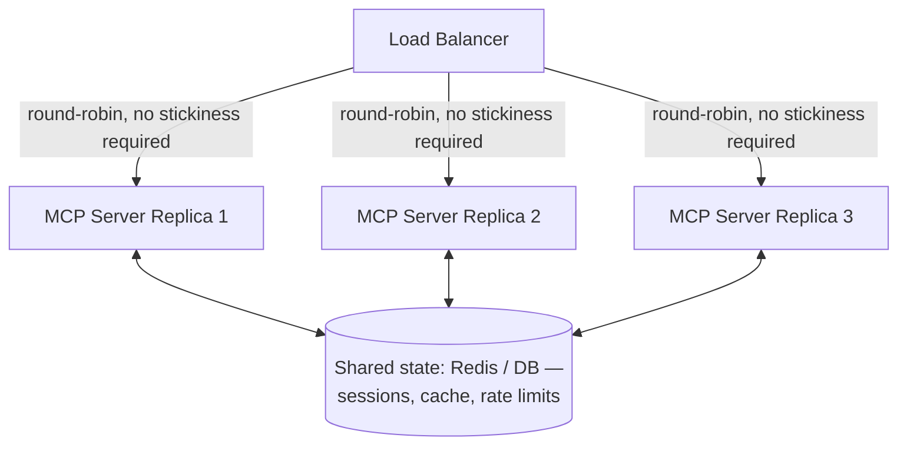
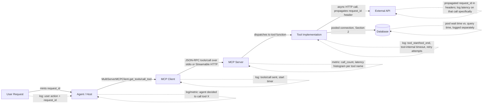

# Production MCP Architecture

> Chapters 7–19 got you a working server, a working client, and integrations into LangChain, LangGraph, and DeepAgents. None of that survives first contact with production traffic unmodified. This chapter is about the difference between "the demo works" and "this runs unattended at 2 a.m. while a misbehaving agent hammers it 40 times a second, a downstream API starts throttling you, and someone needs to figure out which of five hops added 4 seconds of latency." Every concern below is a standard distributed-systems concern — async I/O, timeouts, retries, rate limits, caching, observability, horizontal scaling — applied specifically to the shape an MCP deployment takes.

## Learning Objectives

By the end of this chapter, you will be able to:

- Explain why an MCP server's entire call stack — transport, tool bodies, downstream I/O — should be async, and what happens when a single blocking call sneaks into an otherwise-async server
- Design connection/session management for MCP clients and for the downstream resources (databases, HTTP APIs) a server's tools wrap, including where pooling belongs and where it doesn't
- Distinguish a **client-side call timeout** from a **tool-internal timeout** and explain why conflating them produces either premature cancellations or silent hangs
- Categorize MCP failure modes into retryable (transient) and non-retryable (permanent) buckets, and implement exponential backoff correctly for only the former
- Apply rate limiting at two distinct points — protecting the MCP server itself from an abusive or buggy caller, and protecting the downstream API/database a tool wraps from being overwhelmed by the agent's own concurrency
- Identify which tools and resources are safe caching candidates, design a cache key that won't silently return wrong data, and reason explicitly about staleness risk
- Design structured logging that correlates a single logical request across Host → Client → Server → downstream API, given that the JSON-RPC `id` alone does not do this for you
- Propagate a request/trace identifier through a multi-hop MCP call so a latency spike or error is attributable to one specific hop, not "somewhere in the system"
- Instrument per-tool call counts, latencies, and error rates as the primary signal for detecting a misbehaving, abused, or silently-failing tool
- Apply Chapter 13's authentication material to production specifically: never bake credentials into a stdio server's source, and inject secrets via environment variables or a secrets manager
- Explain why Streamable HTTP's statelessness-leaning design matters for running multiple server replicas behind a load balancer, and name the specific tension `Mcp-Session-Id` affinity creates in the classic (pre-2026-07-28) spec
- Write a minimal, production-appropriate Dockerfile and Kubernetes Deployment/Service for a Streamable HTTP MCP server
- Wire the MCP Inspector's `--cli` mode into a CI pipeline as an automated smoke test, catching a broken server before it reaches production

---

## Prerequisites for This Chapter

This chapter assumes you've built and debugged a working MCP server and client already:

- **Chapter 7** (Building MCP Servers) and **Chapter 9** (Building MCP Clients) — you should be comfortable with `FastMCP`, `ClientSession`, and the basic server/client shape this chapter hardens
- **Chapter 8** (Transport Mechanisms) — stdio vs. Streamable HTTP, since several sections here (connection management, horizontal scaling, containerization) are transport-specific
- **Chapter 11** (Error Handling) — the protocol-error-vs-tool-error split and basic timeout/retry vocabulary this chapter builds directly on
- **Chapter 12** (MCP Inspector & Debugging) — Section 14 below assumes you already know what `--cli` mode is and how to point it at a server
- **Chapter 13** (Authentication & Authorization) — Section 10 assumes you know what OAuth 2.1, bearer tokens, and Protected Resource Metadata are; this chapter only adds "and here's how you keep the secrets themselves safe in a deployed environment"
- **Chapter 15** (MCP + Databases) — Section 2's connection-pooling discussion extends what that chapter covers about wrapping a database behind tool calls
- Standard production-engineering background: you should already know, at a conceptual level, what a reverse proxy, a load balancer, a Docker image, and a Kubernetes Deployment are — this chapter does not re-teach containers or Kubernetes from scratch, only how an MCP server fits into them

You do **not** need prior exposure to a specific observability stack (Prometheus, OpenTelemetry, etc.) — the patterns here are described generically enough to port to whatever your organization already runs.

---

## 1. Why the Whole Stack Must Be Async

> **Fact check:** the `mcp` Python SDK is natively built on `asyncio`, with `anyio` as a hard dependency used internally for transport streams. Every example in the official SDK — server and client, v1.x and v2.0.0 — is `async def` and driven by `asyncio.run()`. This is not a stylistic choice you can opt out of; it's the concurrency model the transport layer is written against.

An MCP server is, structurally, a long-lived process handling many logically independent operations concurrently: multiple tool calls in flight from one client, or (over Streamable HTTP) requests from multiple clients hitting the same process. The SDK's transport read/write loops are `async` coroutines cooperating on a single event loop. That has one uncompromising consequence: **if any tool body blocks the event loop, every other in-flight operation on that process stalls until the blocking call returns** — not just the caller's own request, but every other tool call the server is currently servicing, including unrelated ones from unrelated clients.

This is the single most common way a demo-quality MCP server falls over under real load. It happens when a tool does something like:

```python
# WRONG — this is a synchronous, blocking call inside an async tool body.
@mcp.tool()
async def fetch_report(report_id: str) -> str:
    """Fetch a report from the internal reporting API."""
    response = requests.get(f"https://internal-api/reports/{report_id}")  # blocks the event loop
    return response.text
```

`requests` is a synchronous library; calling it inside an `async def` tool does not make the underlying socket I/O asynchronous — it blocks the thread the event loop is running on, for the entire duration of that HTTP call. One slow downstream API call now stalls the entire server, for every tenant, every tool, every in-flight request, until it returns.

The fix is either of two well-known asyncio patterns, and both matter for MCP specifically:

1. **Use an async-native client for every downstream I/O call.** `httpx.AsyncClient` instead of `requests`, an async database driver (`asyncpg`, `motor`, an async SQLAlchemy engine) instead of a synchronous one — this is Chapter 15's connection-management material applied at the async layer.
2. **If a genuinely synchronous, CPU-bound, or legacy-blocking call is unavoidable, run it in a thread pool** (`asyncio.to_thread(...)` or an explicit executor) so it doesn't occupy the event loop thread. This isn't free — it costs a thread and a context switch — but it's strictly better than blocking the loop outright.

```python
# RIGHT — async-native downstream call, doesn't block other in-flight work
import httpx

@mcp.tool()
async def fetch_report(report_id: str) -> str:
    """Fetch a report from the internal reporting API."""
    async with httpx.AsyncClient(timeout=10.0) as client:
        response = await client.get(f"https://internal-api/reports/{report_id}")
        response.raise_for_status()
        return response.text
```

```python
# RIGHT (fallback) — a genuinely synchronous legacy call, offloaded to a thread
@mcp.tool()
async def run_legacy_export(export_id: str) -> str:
    """Run a legacy, synchronous export routine."""
    return await asyncio.to_thread(legacy_blocking_export, export_id)
```

The practical rule for a production MCP server: **audit every tool body for a synchronous network, disk, or subprocess call**, because each one is a latent single point of contention for the entire server process, not just that one tool call.

---

## 2. Connection and Session Management

There are two entirely different "connections" in play in an MCP deployment, and conflating them is a common source of confusion:

1. **The MCP transport connection** — the stdio pipe or Streamable HTTP connection between a Client and a Server. This is managed by the SDK (`stdio_client`, `streamable_http_client`) and, per Chapter 9, is typically opened once per server and held for the life of the agent process.
2. **The downstream connections a tool's implementation opens** — a database connection, an HTTP keep-alive connection to a REST API, a connection to a message queue. This is the one you actually have to engineer for production, and it's where Chapter 15's database material and standard connection-pooling practice come in.

### 2.1 Pool downstream connections; don't pool the MCP transport itself

The MCP transport connection is 1:1 between a Client and a Server (Chapter 2) — there is nothing to "pool" at that layer beyond deciding whether to keep one long-lived connection per server (the normal case) or reconnect per call (rarely justified, and expensive: for stdio it means re-spawning a process, for HTTP it means re-establishing a connection and, in the classic spec, re-running the `initialize` handshake per Chapter 3).

What genuinely needs pooling is what's *behind* the tool call:

```python
# A tool-side connection pool, created once at server startup and reused
# across every tool invocation — this is the actual production pattern.
import asyncpg

_db_pool: asyncpg.Pool | None = None

async def get_pool() -> asyncpg.Pool:
    global _db_pool
    if _db_pool is None:
        _db_pool = await asyncpg.create_pool(
            dsn=os.environ["DATABASE_URL"],
            min_size=2,
            max_size=20,
            command_timeout=5.0,
        )
    return _db_pool

@mcp.tool()
async def get_order_status(order_id: str) -> str:
    """Look up an order's current status by ID."""
    pool = await get_pool()
    async with pool.acquire() as conn:
        row = await conn.fetchrow(
            "SELECT status FROM orders WHERE id = $1", order_id
        )
        return row["status"] if row else "not found"
```

Opening a fresh database connection per tool call is the single most common performance mistake in a production MCP server that wraps a database (Chapter 15) — connection setup (TCP handshake, auth, TLS negotiation) routinely costs more wall-clock time than the query itself. Pool size should be sized against the server's expected concurrent tool-call volume and the downstream database's own connection limit, not against the number of MCP clients — a single Streamable HTTP server process may be servicing many clients concurrently, all sharing one pool.

### 2.2 stdio: one process per client, no pooling question at all

Over stdio, each MCP client spawns its own dedicated server subprocess (Chapter 2's Host/Client/Server model — one Client, one Server, 1:1). There's no "pool of stdio servers" to manage; the pooling question only applies to what that one process does internally (its own downstream connections, per 2.1). Where stdio does need capacity planning is at the **Host** level: an agent host that spawns one stdio server subprocess per tool integration, multiplied across many concurrent agent sessions, needs to budget process count and memory per session — this is an operational constraint on the Host, not the MCP protocol.

### 2.3 Streamable HTTP: connection reuse and keep-alive

Over Streamable HTTP, the client-side HTTP library (whatever the SDK's `streamable_http_client` uses under the hood, or `httpx` if you're driving requests yourself for testing) should reuse a persistent HTTP connection rather than opening a new TCP+TLS connection per request — this is ordinary HTTP keep-alive practice, not something MCP invents, but it's easy to defeat accidentally by re-instantiating a client per call inside a loop instead of holding one client instance for the life of the session.

---

## 3. Timeouts: Client-Side Call Timeouts vs. Tool-Internal Timeouts

Chapter 11 introduced the protocol-error-vs-tool-error split; production timeout design is the sharpest place that split matters, because there are genuinely **two different timeouts stacked on top of each other**, and they fail differently.

### 3.1 The client-side call timeout

This is the timeout the **MCP client** enforces on the whole `tools/call` round trip — "if I don't get a response within N seconds, give up on this call entirely." In `langchain-mcp-adapters`, this is the confirmed `timeout` field on an HTTP server's config entry (and `sse_read_timeout` for the streaming-read side specifically):

```python
# langchain-mcp-adapters — client-side timeout, confirmed field names
client = MultiServerMCPClient(
    {
        "reporting": {
            "url": "https://mcp.internal/reports/mcp",
            "transport": "streamable_http",
            "timeout": 30,            # overall call timeout, seconds
            "sse_read_timeout": 300,  # timeout on the streaming-read side
        }
    }
)
```

When this timeout fires, the client's perspective is simple: the call never completed, full stop. It has no idea whether the server never received the request, received it and is still working, or completed the work and the response was lost in transit. That ambiguity is exactly why Section 4 (retries) has to reason carefully about idempotency before retrying a call that timed out at this layer.

### 3.2 The tool-internal timeout

This is a timeout the **tool implementation itself** enforces on its own downstream work — "if the database query or the downstream API call I'm making doesn't come back within M seconds, fail *this specific tool execution* and report it cleanly," rather than letting the client-side timeout be the only thing that eventually notices something's wrong.

```python
@mcp.tool()
async def fetch_weather(city: str) -> str:
    """Fetch current weather for a city from the upstream weather API."""
    try:
        async with httpx.AsyncClient() as client:
            response = await client.get(
                f"https://weather.example/api/{city}",
                timeout=5.0,  # tool-internal timeout — much shorter than the client's overall call timeout
            )
            response.raise_for_status()
            return response.text
    except httpx.TimeoutException:
        # Reported as a tool execution error (isError: true), not a hang —
        # see Chapter 11's protocol-vs-tool-error split.
        return "Error: weather API did not respond in time"
```

### 3.3 Why both, and why the tool-internal one should always be shorter

If you only set the client-side timeout (3.1), a slow downstream dependency inside the tool hangs silently until the client gives up — and when it does, the failure looks like "the MCP call timed out," with no information about *which* internal step was slow. If you only set a tool-internal timeout (3.2) and never bound the client-side call, a tool that hangs for reasons outside its own instrumented downstream calls (a bug in the tool's own logic, a deadlock, an unbounded retry loop) has no outer backstop at all.

The rule: **the tool-internal timeout should always be strictly shorter than the client-side call timeout**, with enough margin for the tool to catch its own timeout, format a clean `isError: true` result, and return it before the client's outer clock expires. A tool-internal timeout of 5 seconds nested inside a client-side call timeout of 30 seconds gives you a tool that fails informatively; a tool-internal timeout of 25 seconds nested inside a 30-second client timeout leaves almost no margin for the response to actually get back before the client also gives up — you'd get the worst of both: a clean internal error message that never arrives in time to be useful.

---

## 4. Retries: What's Safely Retryable

Retrying blindly is worse than not retrying at all — it can turn one failed request into an amplified burst against an already-struggling downstream dependency (this is the classic retry-storm failure mode), and it can duplicate a side effect if the underlying operation wasn't idempotent. Retry logic has to start from Chapter 11's error-category split and go one level deeper: **within each category, which specific failures are safe to retry?**

### 4.1 The retryable category: transient failures

| Failure | Where it surfaces | Why it's retryable |
|---|---|---|
| Network timeout / connection reset to a downstream API or DB | Tool-internal exception, reported via `isError: true` | Almost always a momentary condition — packet loss, a downstream instance restarting, a brief network partition |
| Downstream HTTP 502/503/504 | Tool-internal, `isError: true` | The downstream service's own signal that it's temporarily overloaded or restarting, not that the request itself was invalid |
| Client-side MCP call timeout (Section 3.1) with **no confirmed side effect** | Client-observed, no MCP response at all | Ambiguous by nature (Section 3.1), but safe to retry *if and only if* the underlying tool operation is idempotent (Section 4.3) |
| JSON-RPC `-32603` Internal error, when the server's own logging shows a transient cause (e.g., a momentary resource exhaustion) | Protocol-level error | Case-by-case — only if you've confirmed the specific internal error is transient, not a persistent bug |

### 4.2 The non-retryable category: permanent failures

| Failure | Where it surfaces | Why retrying is wrong |
|---|---|---|
| `-32602` Invalid params / unknown tool name | Protocol-level error | The request itself is malformed; retrying the identical request produces the identical error every time |
| Authentication/authorization failure (expired or invalid token, per Chapter 13) | Protocol-level error, or a tool-level `isError: true` if the tool itself checks auth | Retrying without first refreshing credentials just repeats the failure; the fix is a token refresh, not a retry loop |
| A tool execution error reflecting genuine business-logic failure (`isError: true`, e.g. "order not found," "insufficient balance") | Tool execution error | The operation was correctly attempted and correctly failed — there's nothing transient to wait out |
| Malformed/invalid tool arguments caught by the tool's own input validation | Tool execution error | Same request, same invalid input, same failure — retrying wastes a call and doesn't fix the argument |

### 4.3 Exponential backoff, and the idempotency question you can't skip

For the retryable category, standard exponential backoff with jitter is the correct pattern — retry after a short delay, double it (up to a cap) on each subsequent failure, and add random jitter so many concurrent callers retrying the same downstream dependency don't all retry in lockstep and re-create the exact overload condition that caused the failure:

```python
import asyncio
import random

async def call_with_backoff(coro_factory, *, max_attempts: int = 4, base_delay: float = 0.5):
    """Retry a transient failure with exponential backoff + jitter.
    Only call this around operations already confirmed to be idempotent
    or safely retryable — see Section 4.3."""
    for attempt in range(max_attempts):
        try:
            return await coro_factory()
        except (httpx.TimeoutException, httpx.ConnectError) as exc:
            if attempt == max_attempts - 1:
                raise
            delay = base_delay * (2 ** attempt) + random.uniform(0, 0.25)
            await asyncio.sleep(delay)
```

But backoff logic alone doesn't answer the question that actually decides safety: **is the operation idempotent — does calling it twice have the same effect as calling it once?** A read-only tool (`get_order_status`) is trivially safe to retry any number of times. A tool with a side effect (`create_order`, `send_email`, `charge_card`) is not safe to retry blindly on an ambiguous client-side timeout (Section 3.1), because you genuinely don't know if the first attempt already succeeded server-side before the response was lost. Tool annotations (`readOnlyHint`, `destructiveHint`, added 2025-03-26 per Chapter 4) are the right place to encode this: a tool's own metadata should tell your retry layer whether blind retry is even a defensible default, and a non-idempotent tool should either expose an idempotency key argument the caller supplies, or the caller should surface the ambiguous-timeout case to a human/agent decision rather than silently retrying a side-effecting call.

---

## 5. Rate Limiting: Protecting the Server and What It Wraps

Rate limiting for an MCP server has two distinct targets, and a production deployment needs both — they fail differently and protect different things.

### 5.1 Protecting the MCP server itself

An agent loop is, by construction, capable of calling a tool far faster than a human ever would — a buggy planning step, a runaway retry loop in a badly-behaved client, or a genuinely malicious caller can turn into dozens or hundreds of `tools/call` requests per second against your server. Rate limiting at the server's ingress protects the server process's own resources (CPU, memory, its downstream connection pool from Section 2) from being exhausted by call *volume*, independent of what any individual tool does downstream.

```python
# A simple in-process token-bucket limiter applied per client identity
# (e.g., an authenticated subject from Chapter 13, or a connection-level key).
import time

class TokenBucket:
    def __init__(self, rate: float, capacity: float):
        self.rate = rate          # tokens added per second
        self.capacity = capacity
        self.tokens = capacity
        self.last_check = time.monotonic()

    def allow(self) -> bool:
        now = time.monotonic()
        elapsed = now - self.last_check
        self.last_check = now
        self.tokens = min(self.capacity, self.tokens + elapsed * self.rate)
        if self.tokens >= 1:
            self.tokens -= 1
            return True
        return False
```

For a single-process deployment, an in-process limiter like this is sufficient. Once you're running multiple replicas behind a load balancer (Section 11), rate-limiting state has to move to a shared store (Redis is the standard choice) so that a caller can't simply defeat the limit by having successive requests land on different replicas, each with its own independent, empty bucket.

### 5.2 Protecting downstream APIs and databases

The second target is the resource a tool *wraps* — a third-party API with its own published rate limit, or a database that can only sustain a certain query rate before latency degrades for every other consumer. This limit belongs at the tool-call boundary, scoped to the specific downstream dependency, independent of how many MCP clients or agents are calling through to it:

```python
# A per-downstream-dependency limiter, shared across all tool calls that
# hit the same external API — not per-MCP-client.
weather_api_limiter = TokenBucket(rate=5, capacity=10)  # this API allows ~5 req/s

@mcp.tool()
async def fetch_weather(city: str) -> str:
    """Fetch current weather for a city."""
    if not weather_api_limiter.allow():
        return "Error: weather API rate limit reached, try again shortly"
    # ... proceed with the actual call ...
```

The two limits are independent on purpose: your server might comfortably handle 200 tool calls/second in aggregate (Section 5.1's limit), while a specific tool that wraps a rate-limited third-party API needs its own much stricter cap (Section 5.2) regardless of how much server-level headroom exists. Conflating the two — a single global limiter for everything — either throttles unrelated tools unnecessarily or fails to protect the one downstream dependency that actually needs protecting.

---

## 6. Caching: Idempotent Reads, Cache Keys, and Staleness

### 6.1 What's a good caching candidate

The tool annotations introduced in Chapter 4 (`readOnlyHint`, 2025-03-26+) are the right signal here: a tool or resource that is read-only and has no side effects is a caching candidate; a tool that mutates state (`destructiveHint`) is not — caching a write is a correctness bug, not a performance optimization. Resources are natural caching candidates almost by definition (`resources/read` is inherently a read), while tools require checking the annotation (or, absent reliable annotations from a third-party server, treating the tool as non-cacheable by default until you've verified its actual behavior).

### 6.2 Cache key design

The naive approach — cache by tool name alone — is wrong the moment a tool takes arguments, because two calls to the same tool with different arguments are different questions with (usually) different correct answers. The cache key has to incorporate the full, normalized input:

```python
import hashlib
import json

def cache_key(tool_name: str, arguments: dict) -> str:
    # Sort keys so argument-order differences don't produce different keys
    # for what is semantically the same call.
    normalized = json.dumps(arguments, sort_keys=True, separators=(",", ":"))
    digest = hashlib.sha256(normalized.encode()).hexdigest()
    return f"{tool_name}:{digest}"
```

Two subtleties that are easy to get wrong here: first, arguments must be **normalized** (sorted keys, consistent number/string formatting) before hashing, or semantically identical calls produce different cache keys and you silently get a 0% cache hit rate while believing caching is working. Second, if the tool's result depends on anything *not* present in its arguments — an authenticated caller's identity, a time-of-day cutoff, a feature flag — that context has to be folded into the key too, or you risk serving one user's cached result to another user who was never entitled to see it. This is a correctness bug, not just a staleness one, and it's the reason a per-tenant or per-user prefix on the cache key is often mandatory rather than optional.

### 6.3 Staleness risk and invalidation

Every cache trades correctness for latency, and the question is always "how stale is acceptable, and how do you bound it?" Two practical strategies, and when each applies:

- **TTL-based expiry** — the default, and the only option for a resource or tool with no change-notification mechanism. Set the TTL to whatever staleness window is actually acceptable for that specific data (an exchange rate might tolerate 60 seconds of staleness; an inventory count might not tolerate more than 5).
- **Notification-driven invalidation** — for a resource the server supports `subscribe` on (Chapter 5), a `notifications/resources/updated` push (classic spec) is a much sharper invalidation signal than a blind TTL: invalidate the specific cached entry for that URI the moment the server tells you it changed, rather than waiting out a TTL that has to be conservative precisely because it has no better information. This only works for resources with subscription support — most tool results have no equivalent push signal and fall back to TTL-based expiry.

Whichever strategy you pick, **the risk you're accepting should be explicit, not accidental** — a cached "is this order shipped yet" answer that's 30 seconds stale is a reasonable tradeoff for reduced database load; the same 30-second staleness on a "is this payment authorized" check might not be, even though both look like the same kind of read-only lookup at the code level.

---

## 7. Structured Logging: Correlating a Request Across Every Hop

Here is a fact worth being precise about, because it trips people up: **the JSON-RPC `id` (Chapter 3) is scoped to a single Client↔Server connection.** It is not a globally unique identifier, it does not propagate to a downstream API call a tool makes, and a different hop in the chain (the Host, a different MCP server, the downstream REST API) has no visibility into it at all. If you rely on the JSON-RPC `id` alone to correlate a request end-to-end, you will find it useless the moment you need to trace a single logical user action across the Host → Client → Server → downstream API chain, because each of those hops either doesn't see it or assigns its own independent counter.

The fix is the same one distributed systems have used for this problem for years: **mint your own correlation ID at the point the logical request begins (the Host, receiving a user's action), and thread it through every hop explicitly** — as an HTTP header over Streamable HTTP, or as an explicit tool argument you define yourself if you're on stdio and have no header channel available.

```python
import logging
import uuid
import contextvars

request_id_var: contextvars.ContextVar[str] = contextvars.ContextVar("request_id", default="-")

class RequestIdFilter(logging.Filter):
    def filter(self, record: logging.LogRecord) -> bool:
        record.request_id = request_id_var.get()
        return True

logging.basicConfig(
    format="%(asctime)s level=%(levelname)s request_id=%(request_id)s msg=%(message)s"
)
logger = logging.getLogger("mcp_server")
logger.addFilter(RequestIdFilter())

# At the Host layer: mint the ID once, when a user's action begins.
request_id_var.set(str(uuid.uuid4()))
```

On the wire, for Streamable HTTP, the natural place to carry this is a request header (`MultiServerMCPClient`'s confirmed `headers` field on an HTTP server config is exactly the mechanism — the same field already used to pass `Authorization: Bearer ...`, per Chapter 13):

```python
client = MultiServerMCPClient(
    {
        "reporting": {
            "url": "https://mcp.internal/reports/mcp",
            "transport": "streamable_http",
            "headers": {
                "Authorization": "Bearer <token>",
                "X-Request-Id": request_id_var.get(),  # your own convention, not part of MCP itself
            },
        }
    }
)
```

Be precise about what this is and isn't: `X-Request-Id` here is **an application-level convention you define and thread through yourself** — it is not a field defined by the MCP specification. The server reads it back out of the incoming request headers, sets it in its own `request_id_var` for the duration of handling that call, and — critically — includes the *same* ID when it makes its own downstream HTTP call to whatever API or database the tool wraps. That's what turns a pile of independent per-process log lines into one correlatable trail: every hop logs the same identifier, even though no single component in the chain has end-to-end visibility on its own.

For stdio servers, there's no HTTP header channel at all, so the equivalent pattern is to add an explicit correlation argument to your own tool schemas (a convention your Host/Client and Server both agree on) rather than relying on any transport-level field — this is a design decision you make, not something the SDK provides for you.

---

## 8. Tracing: Propagating a Request ID for Latency Attribution

Structured logging (Section 7) tells you *what* happened at each hop; tracing is about answering *where the time went* when a call is slow, without having to manually reconcile timestamps across five separate log streams. The mechanism is the same correlation ID from Section 7, but the discipline is different: every hop records not just the ID but its own **start and end timestamp** for the portion of work it owns, so you can reconstruct a timeline after the fact.

```python
import time

async def call_tool_traced(session, tool_name: str, arguments: dict, request_id: str):
    logger.info(f"tool_call_start tool={tool_name}")
    start = time.monotonic()
    try:
        result = await session.call_tool(tool_name, arguments=arguments)
        return result
    finally:
        elapsed = time.monotonic() - start
        logger.info(f"tool_call_end tool={tool_name} duration_ms={elapsed * 1000:.1f}")
```

If your organization already runs an OpenTelemetry collector, the more scalable version of this pattern is a proper span per hop (Agent span → MCP Client span → MCP Server span → downstream-API span), each carrying the same trace ID, rather than hand-rolled duration logging — the principle is identical either way: **the thing that lets you attribute a latency spike to one hop is a shared identifier plus a per-hop start/end timestamp, propagated consistently across every process boundary in the chain.** Without it, a 4-second slow tool call is indistinguishable from a 4-second slow network hop or a 4-second slow downstream database query — you can see that *something* took 4 seconds, but not *which* 4 seconds.

---

## 9. Metrics: Per-Tool Call Counts, Latencies, and Error Rates

Logging and tracing answer "what happened on this one request." Metrics answer the aggregate question that actually matters for operating a server day to day: **which tool, if any, is behaving badly right now** — being called abnormally often (a sign of an abusive caller or a runaway agent loop), taking abnormally long (a sign of a struggling downstream dependency), or failing abnormally often (a sign of a bug, an expired credential, or a downstream outage).

The three metrics worth instrumenting on every tool, at minimum:

- **Call count**, labeled by tool name — a sudden spike in calls to one specific tool, disproportionate to the others, is very often the first visible sign of a misbehaving agent loop calling the same tool repeatedly instead of progressing.
- **Latency**, labeled by tool name, as a histogram (not just an average — an average hides the P99 tail that's actually causing user-visible slowness).
- **Error rate**, labeled by tool name **and** by failure category (protocol error vs. `isError: true` tool execution error, per Chapter 11) — a rising error rate on one tool, isolated from the others, points you directly at that tool's own downstream dependency rather than a general server problem.

```python
import functools
import time
from collections import defaultdict

_call_counts: dict[str, int] = defaultdict(int)
_error_counts: dict[str, int] = defaultdict(int)
_latencies: dict[str, list[float]] = defaultdict(list)

def instrumented_tool(fn):
    @functools.wraps(fn)
    async def wrapper(*args, **kwargs):
        name = fn.__name__
        _call_counts[name] += 1
        start = time.monotonic()
        try:
            result = await fn(*args, **kwargs)
            return result
        except Exception:
            _error_counts[name] += 1
            raise
        finally:
            _latencies[name].append(time.monotonic() - start)
    return wrapper

@mcp.tool()
@instrumented_tool
async def get_order_status(order_id: str) -> str:
    """Look up an order's current status by ID."""
    ...
```

This toy in-memory version is enough to illustrate the shape; a real deployment exports these as Prometheus counters/histograms (or your organization's equivalent) scraped by whatever dashboard and alerting stack you already run, with alert thresholds set per-tool rather than server-wide — a 5% error rate might be entirely normal for a tool that calls a flaky third-party API and unacceptable for a tool that only touches your own database.

---

## 10. Authentication, Authorization, and Secrets in Production

Chapter 13 covered OAuth 2.1, PKCE, and Protected Resource Metadata as the *protocol-level* authorization story. Production adds one more concern on top: **how the credentials themselves are stored and injected**, which is an operational concern independent of which auth flow the protocol uses.

The single most common mistake — common enough to call out explicitly — is baking an API key or token directly into a stdio server's source code or its launch command:

```python
# WRONG — the credential is now in source control, in shell history,
# in process listings (visible via `ps` to anyone on the host), and in
# every log line that happens to print sys.argv.
server_params = StdioServerParameters(
    command="python",
    args=["server.py", "--api-key=sk-abc123..."],
)
```

The fix is to inject the credential via environment variables (which `StdioServerParameters`' confirmed `env` field supports directly) or, better, via a secrets manager the environment variable itself only references indirectly:

```python
# RIGHT — the credential lives outside source control, is not visible
# in `ps` output, and can be rotated without touching a launch command.
server_params = StdioServerParameters(
    command="python",
    args=["server.py"],
    env={"API_KEY": os.environ["REPORTING_API_KEY"]},  # sourced from the environment
)
```

```python
# Inside server.py — read the credential from the environment, never
# hardcode it, and never log it.
import os
api_key = os.environ["API_KEY"]
```

In a containerized deployment (Section 12), the same principle extends one layer further: don't bake secrets into the Docker image itself (they'd be readable by anyone who can pull the image or inspect its layers) — inject them at container-start time via Kubernetes Secrets, Docker secrets, or a dedicated secrets manager (Vault, AWS Secrets Manager, GCP Secret Manager) mounted or fetched at runtime, and rotate them without requiring an image rebuild. The `Authorization` header on an HTTP-transported MCP server config (Chapter 13's bearer-token pattern) follows the same rule: the token value itself should come from a secrets-backed source at the point the client is constructed, never a literal string checked into a config file.

---

## 11. Horizontal Scaling: Statelessness vs. Session Affinity

> **2026-07-28 spec note:** the classic Streamable HTTP transport (Chapter 8) carries an optional `Mcp-Session-Id` header through the `2025-11-25` revision — a server may use it to bind a sequence of HTTP requests back to shared, in-process state. The `2026-07-28` spec removes session IDs from Streamable HTTP entirely, in service of the same reversal Chapter 3 described at the protocol level: "an open connection... is not a conversation or session," and every request is meant to be self-contained. The tension described in this section — session affinity fighting horizontal scaling — is precisely the problem the stateless redesign is trying to eliminate at the protocol level. Chapter 21 covers the full migration story; what follows is how to manage that tension *today*, under the classic spec.

Running one MCP server replica is easy to reason about and impossible to make highly available: one process crash or deploy takes the whole integration down. Running multiple replicas behind a load balancer is the obvious fix, and it's exactly where the classic spec's optional session affinity becomes a real design decision, not an abstract footnote.

If your server implementation stores any per-session state in the server process's own memory — keyed by the `Mcp-Session-Id` a Streamable HTTP client presents — then that session's *subsequent* requests must be routed back to the *same* replica, or the state simply isn't there. That requires **sticky sessions** at the load balancer (routing by `Mcp-Session-Id` to a consistent backend), which directly undermines the reason you wanted multiple replicas in the first place: if one replica goes down, every session pinned to it is broken, not gracefully failed over, and your load balancer's job just got considerably harder — routing decisions now depend on request content, not just "any healthy backend."

The alternative, and the one worth designing toward even before the 2026-07-28 spec forces the issue, is to **treat each Streamable HTTP request as independently servable by any replica** — externalize whatever state you were tempted to keep in-process (a database, Redis, or a cache with the design from Section 6, not a Python dict living in one server's memory) so that `Mcp-Session-Id`, if you use it at all, becomes a lookup key into shared state rather than a routing requirement. Under that design, a plain round-robin or least-connections load balancer works, any replica can serve any request, and losing a replica to a crash or a rolling deploy costs you nothing more than that replica's in-flight requests retrying against a different backend.



Practically: design for the diagram above from day one, even while you're still speaking the classic spec's session-ID-bearing Streamable HTTP. It costs you a small amount of extra design work now (externalizing state you might have been tempted to keep in-process) and saves you both an operational headache today (sticky-session load balancing is genuinely harder to run well than stateless round-robin) and a migration headache later, when the 2026-07-28 spec's removal of `Mcp-Session-Id` makes the stateless design mandatory rather than optional.

---

## 12. Containerizing an MCP Server (Docker)

A Streamable HTTP MCP server is, from Docker's perspective, an ordinary long-running network service — the same container practices you'd apply to any Python HTTP service apply here, with no MCP-specific magic:

```dockerfile
# Minimal Dockerfile for a Streamable HTTP MCP server (mcp SDK v1.x)
FROM python:3.12-slim AS base

# Don't run as root in the container.
RUN useradd --create-home --uid 1000 mcpuser
WORKDIR /app

# Install dependencies first, separately from application code,
# so dependency layers cache independently of code changes.
COPY requirements.txt .
RUN pip install --no-cache-dir -r requirements.txt

COPY server.py .

USER mcpuser
EXPOSE 8000

# server.py is responsible for choosing the Streamable HTTP transport
# and binding to 0.0.0.0:8000 internally (Chapter 8 covers the exact
# transport setup) — this Dockerfile just runs it.
CMD ["python", "server.py"]
```

A few production-relevant details worth calling out, all standard container practice rather than anything MCP-specific:

- **Non-root user.** Running the server process as `mcpuser` rather than root limits the blast radius if the process is ever compromised — this matters more than usual for an MCP server specifically, given the "Local MCP Server Compromise" risk Chapter 14 covers (a malicious or compromised server should not also have root inside its own container).
- **Layer caching order.** Copying `requirements.txt` and installing dependencies before copying application code means a code-only change doesn't force a full dependency reinstall on every rebuild.
- **`EXPOSE 8000` documents intent** but doesn't itself publish the port — publishing happens at `docker run -p` or in the Kubernetes Service (Section 13).
- **Secrets are never `COPY`'d or `ENV`'d with literal values in the Dockerfile** (Section 10) — they're injected at container-start time by the orchestrator.
- **stdio servers are not containerized the same way** — a stdio server is meant to be spawned as a subprocess of its client, not run as a standalone always-on service; if you need to containerize one anyway (e.g., to distribute it as a portable package a Host can spawn via `docker run` per invocation), the container's `CMD` is the exact command the Host's `StdioServerParameters` would otherwise run directly, and there's no port to expose at all.

---

## 13. Kubernetes: A Minimal Deployment Sketch

Once containerized, a Streamable HTTP MCP server runs on Kubernetes exactly like any other stateless HTTP service — which is precisely why Section 11's push toward statelessness pays off here: a Deployment with multiple replicas and an ordinary `ClusterIP`/`LoadBalancer` Service is all you need, with no session-affinity configuration required if you've externalized state per Section 11.

```yaml
apiVersion: apps/v1
kind: Deployment
metadata:
  name: reporting-mcp-server
  labels:
    app: reporting-mcp-server
spec:
  replicas: 3
  selector:
    matchLabels:
      app: reporting-mcp-server
  template:
    metadata:
      labels:
        app: reporting-mcp-server
    spec:
      containers:
        - name: mcp-server
          image: registry.internal/reporting-mcp-server:1.4.0
          ports:
            - containerPort: 8000
          env:
            - name: DATABASE_URL
              valueFrom:
                secretKeyRef:
                  name: reporting-mcp-secrets
                  key: database-url
            - name: API_KEY
              valueFrom:
                secretKeyRef:
                  name: reporting-mcp-secrets
                  key: api-key
          resources:
            requests:
              cpu: "250m"
              memory: "256Mi"
            limits:
              cpu: "1"
              memory: "512Mi"
          readinessProbe:
            httpGet:
              path: /healthz
              port: 8000
            initialDelaySeconds: 3
            periodSeconds: 5
          livenessProbe:
            httpGet:
              path: /healthz
              port: 8000
            initialDelaySeconds: 10
            periodSeconds: 15
---
apiVersion: v1
kind: Service
metadata:
  name: reporting-mcp-server
spec:
  selector:
    app: reporting-mcp-server
  ports:
    - port: 80
      targetPort: 8000
  type: ClusterIP
```

Notes on the choices here, none of them MCP-specific — this is standard Kubernetes practice applied to an MCP server as just another HTTP workload:

- **Secrets via `secretKeyRef`**, never inlined in the manifest — the Kubernetes Secret object itself is populated out-of-band (by a secrets manager integration, a sealed-secrets controller, or at minimum `kubectl create secret`), directly continuing Section 10's rule.
- **`readinessProbe`/`livenessProbe` against a `/healthz` endpoint** your server implements alongside its MCP endpoint — this is an ordinary HTTP health check, not part of the MCP protocol itself; it should return healthy only once the server has finished startup work (e.g., warming the connection pool from Section 2).
- **Resource `requests`/`limits`** matter more than usual for an MCP server whose tools spin up their own connection pools (Section 2) and possibly thread-pool offloaded work (Section 1) — undersized memory limits under real tool-call concurrency are a common source of container OOM-kills that look, from the outside, like a mysterious server crash.
- **No session affinity configured on the Service** — deliberately, because Section 11's design goal is that any replica can serve any request.

---

## 14. CI/CD: The Inspector as an Automated Smoke Test

Chapter 12 introduced the MCP Inspector's `--cli` mode for interactive, scriptable testing of a server independent of any LLM. The production extension of that is straightforward and high-value: **run it in CI, against a freshly built server, as a smoke test before anything ships** — catching a broken `tools/list`, a server that fails to start, or a regressed tool schema before it reaches a single real agent.

```yaml
# .github/workflows/mcp-smoke-test.yml — conceptual sketch
name: MCP Server Smoke Test

on: [pull_request]

jobs:
  smoke-test:
    runs-on: ubuntu-latest
    steps:
      - uses: actions/checkout@v4

      - name: Set up Python
        uses: actions/setup-python@v5
        with:
          python-version: "3.12"

      - name: Install dependencies
        run: pip install -r requirements.txt

      - name: Set up Node (for the Inspector CLI)
        uses: actions/setup-node@v4
        with:
          node-version: "20"

      - name: Smoke-test the server with MCP Inspector --cli
        run: |
          npx @modelcontextprotocol/inspector --cli python server.py \
            --method tools/list
        # A non-zero exit code here fails the pipeline — the server
        # failed to start, failed the handshake, or failed to answer
        # tools/list, all before any real agent ever touches it.
```

The value of this specific smoke test is what it catches early and cheaply: a server that fails to boot, a dependency version bump that broke the `initialize` handshake, or a tool schema change that silently made a tool uncallable — all failure modes that, without this check, would only surface the first time a real agent tried to use the server, likely in front of a user. Extend the same pattern to actually invoke a known-good tool call (not just list tools) and assert on its result shape, giving you a true end-to-end smoke test rather than just a "the server process starts" check — Chapter 12 covers the exact `--cli` argument shapes for driving a specific `tools/call` this way.

---

## Examples

### Example 1 — A production-hardened tool wrapper, combining Sections 1, 3, 4, 7, 9

This ties together async I/O, tool-internal timeout, retry-on-transient-only, correlation-ID logging, and per-tool metrics into a single reusable decorator — the shape a real production tool body actually takes, versus the bare `@mcp.tool()` examples earlier chapters used to teach the primitive in isolation.

```python
import asyncio
import functools
import logging
import time

import httpx

logger = logging.getLogger("mcp_server")

def production_tool(*, timeout: float, max_attempts: int = 3):
    """Wrap a tool body with: a tool-internal timeout (Section 3.2),
    exponential backoff retried only on transient exceptions (Section 4),
    structured start/end logging carrying the ambient request ID
    (Section 7), and call-count/latency/error metrics (Section 9)."""
    def decorator(fn):
        @functools.wraps(fn)
        async def wrapper(*args, **kwargs):
            name = fn.__name__
            req_id = request_id_var.get()
            start = time.monotonic()
            _call_counts[name] += 1
            logger.info(f"tool_start tool={name} request_id={req_id}")

            for attempt in range(max_attempts):
                try:
                    result = await asyncio.wait_for(fn(*args, **kwargs), timeout=timeout)
                    elapsed = time.monotonic() - start
                    _latencies[name].append(elapsed)
                    logger.info(
                        f"tool_end tool={name} request_id={req_id} "
                        f"duration_ms={elapsed * 1000:.1f} attempt={attempt}"
                    )
                    return result
                except (httpx.TimeoutException, httpx.ConnectError, asyncio.TimeoutError) as exc:
                    # Transient category only (Section 4.1) — anything else
                    # propagates immediately without a retry.
                    if attempt == max_attempts - 1:
                        _error_counts[name] += 1
                        logger.error(
                            f"tool_failed tool={name} request_id={req_id} error={exc!r}"
                        )
                        raise
                    await asyncio.sleep(0.5 * (2 ** attempt))
                except Exception as exc:
                    # Non-retryable category (Section 4.2) — fail immediately.
                    _error_counts[name] += 1
                    logger.error(
                        f"tool_failed tool={name} request_id={req_id} error={exc!r} (non-retryable)"
                    )
                    raise
        return wrapper
    return decorator

@mcp.tool()
@production_tool(timeout=5.0, max_attempts=3)
async def fetch_weather(city: str) -> str:
    """Fetch current weather for a city from the upstream weather API."""
    async with httpx.AsyncClient() as client:
        response = await client.get(f"https://weather.example/api/{city}")
        response.raise_for_status()
        return response.text
```

### Example 2 — A cache-aside wrapper for a read-only tool (Section 6)

```python
_cache: dict[str, tuple[float, str]] = {}  # key -> (expires_at, value)
_CACHE_TTL_SECONDS = 60

async def get_cached_or_fetch(tool_name: str, arguments: dict, fetch_fn) -> str:
    key = cache_key(tool_name, arguments)  # from Section 6.2
    now = time.monotonic()

    cached = _cache.get(key)
    if cached and cached[0] > now:
        return cached[1]  # cache hit — still fresh

    value = await fetch_fn()
    _cache[key] = (now + _CACHE_TTL_SECONDS, value)
    return value

@mcp.tool()
async def get_exchange_rate(base: str, quote: str) -> str:
    """Get the current exchange rate between two currencies (cached, ~60s staleness)."""
    async def fetch():
        async with httpx.AsyncClient() as client:
            resp = await client.get(f"https://fx.example/rate/{base}/{quote}")
            resp.raise_for_status()
            return resp.text
    return await get_cached_or_fetch("get_exchange_rate", {"base": base, "quote": quote}, fetch)
```

Note that this tool is a good candidate precisely because it's read-only and its staleness tolerance is explicit and defensible (a 60-second-old exchange rate is a reasonable tradeoff) — contrast with Section 6.3's payment-authorization counterexample, which would not be an acceptable candidate for the same caching pattern despite looking structurally identical.

---

## The Full Observability Chain

Every section above instruments one link in the same underlying chain. Drawn end to end, with what you'd actually instrument at each hop:



Reading this left to right is exactly how you'd diagnose a latency spike in practice: if the Agent-to-Client hop is slow, that's an agent-framework/planning problem, not an MCP problem. If Client-to-Server is slow but the server's own tool_start/tool_end logging (Section 7) shows the tool executed quickly, the delay is in the transport or network between them. If the tool's own logging shows most of its time was spent waiting for a pool connection (Section 2) rather than executing the query, that's a pool-sizing problem, not a slow database. And if the External API hop's propagated-request-ID logging shows *that specific call* took 4 seconds while every other hop was sub-100ms, you've isolated the problem to a downstream dependency outside your own code entirely — which is a completely different fix (talk to the API owner, add caching per Section 6, or add a circuit breaker) than anything you'd do to your own server or client code. None of this attribution is possible without the same request ID and per-hop timing existing at every link in the chain simultaneously — a chain instrumented at only three of its six hops still leaves you guessing about the other three.

---

## Real-World Scenario

**Scenario:** Your team runs a LangGraph agent, via `MultiServerMCPClient`, against three MCP servers: an internal search server (stdio, low traffic), a reporting server (Streamable HTTP, 3 replicas behind a load balancer), and a third-party analytics server your team doesn't control. One Tuesday afternoon, users start reporting that agent responses "feel slow" — no errors, no timeouts firing, just noticeably higher latency than the usual few hundred milliseconds. On-call has fifteen minutes before this becomes a customer-facing incident, and three independent teams (yours, the reporting-server owners, and the third-party vendor) are all pointing at each other.

**How this chapter's material actually resolves it, in order:**

1. **Check per-tool metrics first (Section 9), not logs.** The latency histograms, broken out by tool name, immediately show whether the slowdown is isolated to one tool or spread evenly across all of them. In this scenario, it's isolated: `get_analytics_report` (the third-party server) has a P99 latency 6x its normal baseline; every other tool is unchanged. This alone rules out "the agent framework got slow" and "our own infrastructure degraded" — if either were true, the slowdown would show up across every tool, not one.
2. **Follow the request-ID-correlated logs for one slow request (Sections 7–8) through the chain.** Picking one recent slow `request_id` and grepping for it across the Agent, Client, Server, and downstream-API log lines shows exactly where the 4 extra seconds landed: the Server's own `tool_start`/`tool_end` timing (Section 8's per-hop duration logging) shows the tool function itself took 4.2 seconds, and the propagated-request-ID logging on the *outbound* call to the third-party analytics API shows that specific HTTP call alone accounted for 4.0 of those seconds — not the tool's own logic, not the MCP transport, not connection-pool contention (Section 2's pool-wait-time logging is normal).
3. **This isolates the problem to one specific external dependency, which changes the entire response.** Instead of three teams debugging three different systems in parallel, only one conversation is needed — with the third-party vendor, about their API's degraded performance — and it's backed by hard evidence (a specific timestamp, a specific latency number, isolated to a specific hop) rather than "things feel slow."
4. **The short-term mitigation is exactly the toolkit this chapter built**: since `get_analytics_report` is read-only and its data doesn't need to be second-fresh (Section 6.1's caching-candidate criteria), a short TTL cache (Section 6, Example 2) absorbs repeated identical requests during the vendor's degraded period without waiting on a code change or a vendor fix, and Section 5.2's downstream rate limiter prevents the agent's own retry behavior (Section 4) from adding load to an already-struggling third-party API while it recovers.

Without per-tool metrics and end-to-end request correlation, this incident plays out very differently: "the agent feels slow" gets investigated by checking the agent framework first (because that's the most visible layer), then the reporting server (because it's the most complex piece your team owns), and only reaches the actual third-party dependency last — by which point the fifteen-minute window is long gone. The chain in this chapter's diagram, instrumented at every hop simultaneously, is what turns "somewhere in the system" into "this exact hop, this exact dependency" in minutes.

---

## Best Practices

- **Audit every tool body for a synchronous blocking call before it ships**, not after a load test reveals it — one `requests.get()` inside an `async def` tool stalls the entire server process, not just that call (Section 1).
- **Pool downstream connections (database, HTTP keep-alive), never the MCP transport connection itself** — the transport is 1:1 per Client/Server (Chapter 2) and isn't the thing that needs pooling; what's behind the tool call is (Section 2).
- **Always make the tool-internal timeout strictly shorter than the client-side call timeout**, with real margin, so a tool can fail informatively before the client gives up on it uninformatively (Section 3.3).
- **Never retry blindly — categorize the failure first** (Section 4.1 vs. 4.2), and for anything with a side effect, confirm idempotency (or an idempotency key) before wrapping it in backoff logic.
- **Rate-limit the server's ingress and each downstream dependency separately** — they protect different things and need independently tuned limits (Section 5).
- **Only cache tool/resource results you can positively confirm are read-only**, key the cache on fully normalized arguments plus any relevant caller/context identity, and pick an explicit, defensible staleness window rather than an arbitrary one (Section 6).
- **Mint a correlation ID at the point a logical request begins (the Host) and thread it through every hop explicitly** — the JSON-RPC `id` alone will not do this for you across process/hop boundaries (Section 7).
- **Instrument call count, latency, and error rate per tool name from day one**, not after the first production incident makes you wish you had (Section 9).
- **Inject secrets via environment variables or a secrets manager, never via source code, launch-command arguments, or a baked-in image layer** (Section 10).
- **Design for statelessness before the 2026-07-28 spec makes it mandatory** — externalize any per-session state you're tempted to keep in a server process's memory, so a load balancer never needs session affinity to serve your traffic correctly (Section 11).
- **Run the MCP Inspector's `--cli` mode as a CI smoke test on every change**, catching a broken handshake or a regressed tool schema before a real agent ever touches the broken build (Section 14).

---

## Common Mistakes

- **Using a synchronous HTTP or database client inside an `async def` tool.** This is the single most common way a "working" MCP server degrades badly under concurrent load — it doesn't error, it just silently stalls every other in-flight request while the blocking call runs (Section 1).
- **Opening a fresh database connection per tool call instead of pooling.** Connection setup cost routinely dwarfs the actual query cost, and this mistake is invisible in a single-user demo and painful under real concurrency (Section 2.1).
- **Setting only a client-side call timeout, with no tool-internal timeout**, leaving you unable to tell whether a hang came from the tool's own logic or from something upstream of it when the outer timeout eventually fires (Section 3.3).
- **Retrying every failure uniformly, including validation errors and authorization failures** that will fail identically on every attempt — this wastes calls, adds latency, and can turn a single permanent failure into an unnecessary retry storm against an already-degraded dependency (Section 4.2).
- **Applying one global rate limit instead of separate limits for server ingress and each downstream dependency** — either throttles unrelated tools too aggressively or fails to protect the one dependency that actually needs it (Section 5).
- **Caching a tool's result without normalizing its arguments first**, silently producing a near-zero cache hit rate while believing caching is active — or caching without keying on caller identity, silently leaking one user's cached result to another (Section 6.2).
- **Assuming the JSON-RPC `id` correlates a request across the whole system.** It's scoped to a single Client↔Server connection and invisible to the Host and any downstream API — relying on it for cross-hop correlation leaves you unable to trace a slow request end-to-end (Section 7).
- **Logging call volume and errors server-wide instead of broken out per tool name**, which hides exactly the signal — one specific tool spiking in call count, latency, or error rate — that tells you where the actual problem is (Section 9).
- **Hardcoding an API key into a stdio server's launch arguments or source file**, leaving it visible in source control, shell history, and process listings to anyone with access to the host (Section 10).
- **Relying on `Mcp-Session-Id`-based sticky sessions as the default scaling strategy** instead of externalizing state, then discovering that a rolling deploy or a single replica crash breaks every session pinned to it (Section 11).
- **Treating "the container starts" as sufficient CI validation** instead of actually exercising `tools/list` (or a real `tools/call`) via the Inspector's `--cli` mode — a server that starts cleanly but fails its handshake or has a broken tool schema will pass a naive health check and fail the moment a real agent connects (Section 14).

---

## Summary

- The MCP Python SDK is natively async, built on `anyio` internally — every tool body that performs synchronous, blocking I/O stalls the entire server process, not just its own caller.
- Connection pooling belongs on the downstream resources a tool wraps (databases, HTTP APIs, per Chapter 15), not on the 1:1 MCP transport connection itself, which is managed by the SDK.
- A **client-side call timeout** (the whole `tools/call` round trip) and a **tool-internal timeout** (a specific downstream call inside the tool) are different mechanisms that fail differently — the tool-internal one should always be shorter, with margin.
- Retries are only safe for **transient** failures (timeouts, 5xx, connection resets) and only with exponential backoff plus jitter; **permanent** failures (invalid params, auth failures, business-logic errors reported via `isError: true`) should never be retried, and side-effecting operations need an idempotency guarantee before any retry logic touches them.
- Rate limiting has two independent targets: the MCP server's own ingress (protecting it from call volume) and each downstream API/database a tool wraps (protecting it from being overwhelmed, independent of server-level headroom).
- Good caching candidates are read-only tools/resources (`readOnlyHint`, Chapter 4); cache keys must be built from normalized arguments (plus caller/context identity where relevant), and staleness tolerance should be an explicit, defensible choice — TTL-based by default, notification-driven where `resources/subscribe` support exists.
- The JSON-RPC `id` does not correlate a request across hops — mint your own request ID at the Host layer and thread it through HTTP headers (Streamable HTTP) or explicit tool arguments (stdio) so logs and traces can be reconciled end to end.
- Per-tool metrics (call count, latency histogram, error rate) are the primary signal for spotting a misbehaving, abused, or silently failing tool — instrument every tool this way, not just the server as a whole.
- Secrets belong in environment variables or a secrets manager, never in source code, launch arguments, or a Docker image layer — this applies identically to stdio servers, containerized servers, and Kubernetes Deployments.
- Streamable HTTP's session-ID mechanism, if used for in-process server state, forces sticky-session load balancing that fights horizontal scaling; externalizing state avoids that tension now and matches where the **2026-07-28 stateless spec** forces every deployment eventually (Chapter 21).
- Docker and Kubernetes patterns for an MCP server are almost entirely ordinary containerized-HTTP-service practice — non-root users, layer caching, health probes, resource limits, secrets via `secretKeyRef` — with no MCP-specific magic beyond what's inside the container.
- The MCP Inspector's `--cli` mode (Chapter 12), run as a CI smoke test, catches a broken handshake or a regressed tool schema before it reaches a real agent in production.

---

## Knowledge Check

1. A tool body calls `requests.get(...)` (the synchronous library) inside an `async def` function decorated with `@mcp.tool()`. Explain precisely what happens to *other* in-flight tool calls on that same server process while that request is in progress, and why declaring the function `async def` did not prevent it.
2. Your server pools database connections at startup with `min_size=2, max_size=20`. A teammate proposes instead opening a fresh `asyncpg` connection at the top of every tool call "to keep things simple." What specifically goes wrong under production load, and why doesn't this show up in a single-user local test?
3. You set a client-side call timeout of 10 seconds and a tool-internal timeout of 8 seconds for the same tool call. Explain why the 2-second margin matters, and describe what user-visible symptom you'd expect if the tool-internal timeout were instead set to 9.5 seconds.
4. A tool call to `create_order` times out at the client-side call layer with no response ever received. Is it safe to retry this call automatically? Explain what specific piece of information you'd need about the tool before answering either way.
5. Explain why a single global rate limiter, sized for your MCP server's own aggregate capacity, is insufficient to protect a specific tool that wraps a third-party API with its own much stricter published rate limit.
6. A cache is keyed only on tool name, ignoring arguments entirely. Describe the specific bug this produces, and separately, describe the specific bug that results if the cache key omits caller identity for a tool whose result differs per authenticated user.
7. Trace a single logical user request through Host → Client → Server → downstream API. At which of those four hops does the JSON-RPC `id` from Chapter 3 have any meaning at all, and what mechanism does this chapter propose to correlate the request across all four hops regardless?
8. Explain the specific tension between `Mcp-Session-Id`-based session affinity and running multiple MCP server replicas behind a load balancer, and describe the architectural change that removes the need for that affinity entirely.

---

## Hands-On Exercise

Harden a toy MCP server end-to-end using the patterns from this chapter, and prove each one works rather than just writing it.

**Requirements:**

1. Start from a minimal `FastMCP` server (Chapter 7) exposing one tool, `fetch_number(delay: float) -> int`, that `await asyncio.sleep(delay)` before returning a fixed integer — this stands in for a slow downstream call. Confirm, by calling it twice concurrently with `delay=3` from a test client, that both calls return in roughly 3 seconds total, not 6 — proving the tool is genuinely non-blocking (Section 1). Then deliberately replace the `asyncio.sleep` with `time.sleep` (a synchronous, blocking call) and re-run the same concurrent test; observe and explain the roughly 6-second result.
2. Add a tool-internal timeout of 2 seconds around the `asyncio.sleep(delay)` call using `asyncio.wait_for`, and a separate client-side call timeout of 5 seconds on however your test client invokes the tool. Call the tool with `delay=4` and confirm you get a clean tool-execution error (`isError: true`, per Section 3.2) well before the client-side timeout would have fired — then set `delay=1` and confirm it succeeds normally.
3. Wrap the tool with a retry decorator (Section 4) that retries only on a specific injected transient exception (e.g., raise a custom `TransientError` on the first two calls, succeed on the third, using a module-level counter to simulate this) with exponential backoff, and confirm via logging that exactly two retries occur before success. Then repeat with a non-retryable exception type and confirm the decorator does **not** retry it — it should propagate on the first failure.
4. Add request-ID-correlated structured logging (Section 7) so that a single call to your tool produces log lines at "call start," "call end," and (if you added retries in step 3) each retry attempt, all carrying the same request ID — mint the ID at the top of your test client's call, not inside the tool.
5. Add per-tool metrics (Section 9): call count, a list of observed latencies, and an error count, all keyed by tool name. After running a mix of successful and failing calls, print a small summary table and confirm the numbers match what you actually ran.
6. **Bonus:** write a minimal Dockerfile (Section 12) for this server, build it, and run it locally with `docker run -p 8000:8000`, confirming the Inspector's `--cli` mode (Section 14) can successfully call `fetch_number` against the running container.

**What you should notice while doing this:** almost none of the code you wrote is MCP-specific — the timeout, retry, logging, and metrics logic is ordinary async Python and would look nearly identical wrapping a REST endpoint instead of an MCP tool. That's the point of this chapter: MCP gives you the primitive (tools, resources, prompts) and the transport; production-hardening it is the same distributed-systems discipline you'd apply to any other network service, applied consistently at every hop from Host to downstream API.

---

## Further Reading

- [MCP Specification — Transports](https://modelcontextprotocol.io/specification) — the authoritative source on Streamable HTTP's `Mcp-Session-Id` behavior across revisions, referenced in Section 11
- `github.com/modelcontextprotocol/inspector` — the Inspector's `--cli` mode used as the CI smoke test in Section 14
- **[Chapter 11: Error Handling](./11-error-handling.md)** — the protocol-error-vs-tool-error split this chapter's retry and timeout sections build directly on
- **[Chapter 12: MCP Inspector & Debugging](./12-mcp-inspector-and-debugging.md)** — full `--cli` argument shapes for driving specific tool calls in CI
- **[Chapter 13: Authentication & Authorization](./13-authentication-and-authorization.md)** — the OAuth 2.1/PKCE/Protected Resource Metadata material Section 10 assumes and extends operationally
- **[Chapter 14: MCP Security](./14-mcp-security.md)** — sandboxing and Local MCP Server Compromise mitigations relevant to the non-root container practice in Section 12
- **[Chapter 15: MCP + Databases](./15-mcp-and-databases.md)** — the database-wrapping patterns Section 2's connection-pooling material extends
- **[Chapter 21: The Stateless Redesign — MCP 2026-07-28](./21-the-stateless-redesign-2026-07-28.md)** — the full protocol-level story behind Section 11's statelessness push
- Standard references, not MCP-specific: the [twelve-factor app](https://12factor.net/) methodology (Section III/config, on environment-based secrets) and any general treatment of exponential backoff with jitter (e.g., AWS's "Exponential Backoff and Jitter" architecture blog post) for the retry mechanics in Section 4

---

<div style="display:flex;justify-content:space-between;align-items:center;">
  <a href="./19-mcp-with-deepagents.md">← Previous: MCP + DeepAgents</a>
  <a href="./00-index.md">🏠 Index</a>
  <a href="./21-the-stateless-redesign-2026-07-28.md">Next: The Stateless Redesign — MCP 2026-07-28 →</a>
</div>
