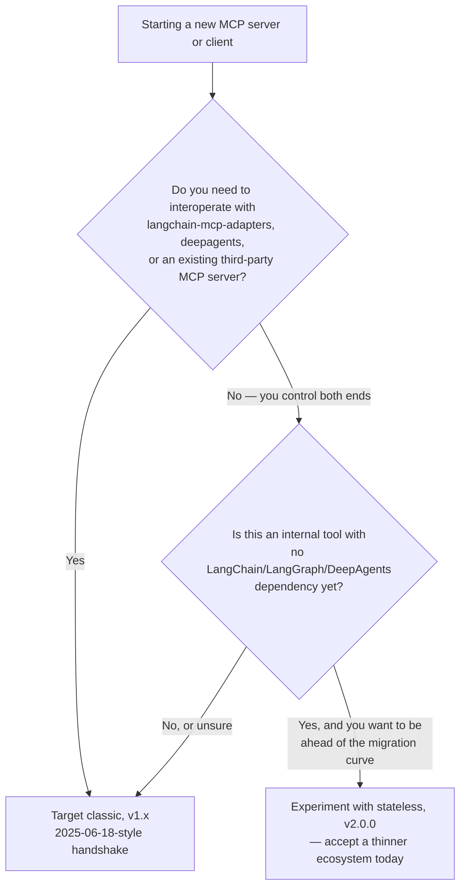

# The Stateless Redesign — MCP 2026-07-28

> On 2026-07-28 — two days before this course was written — MCP shipped its largest breaking spec revision to date, and it isn't a minor point release: the protocol's foundational assumption, "a client establishes one stateful session per server," is gone. This chapter is the deep, authoritative treatment of that revision. Every other chapter in this course only flagged it in passing with a `> **2026-07-28 spec note:**` callout; this is where those callouts get their full payoff.

This is a real, independently verified event, confirmed across modelcontextprotocol.io, the official MCP blog, AWS, Anthropic, and The Register. Treat everything in Sections 1–7 below as settled fact about what the spec now says, not speculation about what it might say. Where this chapter genuinely doesn't know something — because the fact sheet this course was written from doesn't confirm it — it will say so explicitly rather than guess.

## Learning Objectives

By the end of this chapter, you will be able to:

- State, precisely and from memory, the six concrete changes the 2026-07-28 revision made to the wire protocol: removal of the handshake, self-contained requests via `_meta`, the new `server/discover` RPC, `subscriptions/listen` replacing the subscribe/unsubscribe pair, HTTP+SSE's move to Deprecated status under SEP-2596, and the Streamable HTTP transport losing session IDs, the GET stream, and `Last-Event-ID` resumability
- Explain *why* the working group made this change — the scaling argument for statelessness on ordinary HTTP infrastructure — and connect it directly to the horizontal-scaling tension raised in Chapter 20
- Read and construct a self-contained 2026-07-28 request, including where `protocolVersion`, `clientCapabilities`, and `clientInfo` live inside `_meta`, and which of those three fields are required versus recommended
- Name both new JSON-RPC error codes (`UnsupportedProtocolVersionError` / `-32022`, `MissingRequiredClientCapabilityError` / `-32021`) and explain the resource-not-found code migration from `-32002` to `-32602`, including the backward-compatibility rule for older servers
- Compare the v1.x Python SDK surface (`FastMCP`, `ClientSession`) against the v2.0.0 surface (`MCPServer`, `Client`) at a "know what you'd migrate to" level, without having built anything against v2.0.0 yet
- Apply a concrete decision framework for choosing classic (v1.x) versus stateless (v2.0.0) when starting a new MCP project today, and justify that choice to a reviewer
- Explain why the LangGraph and DeepAgents integrations taught in Chapters 17–19 still target the classic model as of this writing, and what would have to change in the ecosystem before that recommendation flips

---

## Prerequisites for This Chapter

This chapter is the direct sequel to three earlier chapters, and it assumes you can recall each one without re-reading it in full:

- **[Chapter 3: Protocol Fundamentals & Lifecycle](./03-protocol-fundamentals-and-lifecycle.md)** — the classic `initialize` → `initialize` response → `notifications/initialized` handshake, JSON-RPC 2.0's request/response/notification shapes, and capability negotiation. Chapter 3's Section 6 previewed this chapter conceptually; this chapter is where that preview becomes the full, precise story — the exact `_meta` shape, the new error codes, and the SDK surface Chapter 3 only gestured at.
- **[Chapter 5: MCP Resources](./05-mcp-resources.md)** — specifically the classic subscription flow: `resources/subscribe`/`resources/unsubscribe`, and the two notifications they produce (`notifications/resources/updated`, `notifications/resources/list_changed`). You need that flow fresh in mind to appreciate what `subscriptions/listen` collapses it into.
- **[Chapter 6: MCP Prompts](./06-mcp-prompts.md)** — not because prompts change in this revision (they largely don't; `prompts/list` and `prompts/get` are untouched), but because prompts are this chapter's useful control case. Holding "tools and resources changed their session assumptions, prompts didn't have session assumptions to lose" in mind will help you see precisely which parts of MCP the stateless redesign actually touches, and which parts — the primitive shapes themselves — it leaves completely alone.

You should also be generally comfortable with the material in **Chapter 4 (MCP Tools)** and **Chapter 9 (Building MCP Clients)** — this chapter puts v1.x code from both of those chapters side by side with new v2.0.0 code, and the comparison only lands if the v1.x half is already familiar rather than something you're learning for the first time here.

> **A framing note before we start:** this chapter does not teach you to build a production v2.0.0 server or client hands-on. As you'll see in Section 9's decision framework, the practical recommendation for essentially everyone reading this course today is still the classic model from Chapters 3–13. This chapter's job is to make sure you understand the new spec precisely enough to (a) read about it without being confused, (b) recognize it if you encounter a v2.0.0 server or client in the wild, and (c) make an informed call about when, if ever, to target it yourself.

---

## 1. What Changed on 2026-07-28 — The Six-Point Summary

Before going deep on any single change, get the whole shape of the revision in view. Six things changed, and every one of them is downstream of a single decision: **MCP is no longer a stateful protocol.**

| # | What changed | Classic (through `2025-11-25`) | Stateless (`2026-07-28`) |
|---|---|---|---|
| 1 | Handshake | `initialize` request → `initialize` response → `notifications/initialized`, then the connection remembers the negotiated state | No handshake at all. There is no `initialize` method. A client simply sends the request it wants to make. |
| 2 | Per-request identity | Negotiated once, trusted for the life of the connection | Every request is self-contained: `protocolVersion` and `clientCapabilities` (required) plus `clientInfo` (recommended) travel inside `_meta` on *every single request* |
| 3 | Discovery | Implicit in the `initialize` response | New mandatory `server/discover` RPC returns supported versions, capabilities, and identity in one call — calling it is optional up front |
| 4 | Resource subscriptions | `resources/subscribe` + `resources/unsubscribe`, two separate calls, pushing `notifications/resources/updated` | Collapsed into a single `subscriptions/listen` request carrying filter flags |
| 5 | HTTP+SSE transport | Deprecated *in practice* since `2025-03-26`, but not formally | Formally moved to the **Deprecated** feature-lifecycle state under **SEP-2596** |
| 6 | Streamable HTTP transport | `Mcp-Session-Id` header, optional GET stream endpoint, `Last-Event-ID` resumability | Session ID, GET stream endpoint, and `Last-Event-ID` resumability all removed |

Two new error codes and one error-code migration ride along with these six changes (Section 6 covers them in full): `UnsupportedProtocolVersionError` (`-32022`), `MissingRequiredClientCapabilityError` (`-32021`), and resource-not-found moving from `-32002` to `-32602`.

If you remember nothing else from this chapter, remember this sentence, because it is the thread that ties all six rows of that table together: **the new spec's own words are that "all the information needed to process a request is contained in the request itself... an open connection, such as a STDIO process, is not a conversation or session."** Every one of the six changes above is that sentence, applied to a specific piece of the protocol you already know from Chapters 3–9.

---

## 2. Why This Happened — The Scaling Argument

It's worth pausing on *why* the working group made a change this disruptive, rather than treating it as an arbitrary redesign to memorize. The motivation is architectural, and it's one you've already brushed up against if you've read Chapter 20's material on production MCP scaling.

A stateful protocol — the classic model — ties meaning to a *connection*. Once `initialize` negotiates a `protocolVersion` and a set of capabilities, every subsequent message on that connection is interpreted in light of what was agreed earlier. For stdio, that's free: the connection *is* a subprocess, and the subprocess's memory holds the state. But for Streamable HTTP, "the connection" is a much fuzzier concept once you're running more than one server instance behind a load balancer. A stateful HTTP-transported MCP server has to make sure that request #2 in a session lands on the *same backend process* that handled request #1 — because that's the process holding the negotiated state in memory. That requirement has a name in ordinary web infrastructure: **session affinity**, or **sticky routing**. It's a well-understood technique, but it's also a well-understood *tax*: it complicates load balancer configuration, makes horizontal autoscaling less elastic (you can't freely kill and spin up backend instances without worrying about who's holding whose session), and is outright incompatible with some deployment shapes — serverless functions and edge workers, in particular, where there's no guarantee that "the same backend" is even a coherent concept between two requests a few hundred milliseconds apart.

A stateless protocol sidesteps all of that by design. If every request carries everything the server needs to process it — its own `protocolVersion`, its own `clientCapabilities` — then *any* backend instance can handle *any* request, in any order, with no shared memory and no sticky routing required. That's the entire argument in one sentence: **a stateless protocol scales far more naturally on ordinary HTTP infrastructure** — no session affinity, trivial horizontal scaling, and it works cleanly on serverless and edge deployments where a "long-lived session" was always an awkward fit to begin with.

This is not an abstract concern for anyone who has actually operated an MCP gateway at scale. If you've worked through Chapter 20's treatment of production MCP architecture — retries, rate limiting, observability, and especially horizontal scaling — you've already seen the shape of the problem this revision solves: a stateful HTTP-transported server is a server you have to think carefully about scaling out, because scaling out a stateful thing means either sticky routing or some form of externalized session storage (a shared cache holding negotiated capabilities per session ID, keyed and looked up on every request). The 2026-07-28 revision's bet is that this operational cost isn't worth paying — that it's simpler, cheaper, and more robust at scale to make every request pay a small, fixed cost (repeating `protocolVersion` and `clientCapabilities`) than to pay the ongoing operational cost of keeping distributed session state consistent and available. Whether that trade-off is *right* for every deployment is a fair question to have opinions about — but understanding that this is the trade-off being made is what lets you have an informed opinion at all, rather than experiencing this revision as protocol churn for its own sake.

---

## 3. The New Request Shape: Self-Contained, via `_meta`

Here is the mechanical heart of the redesign. In the classic model, a `tools/call` request looks like this (you saw this exact shape in Chapters 3 and 4):

```jsonc
// Classic (2025-06-18) — mcp SDK v1.x. Assumes initialize/initialized already happened
// on this connection; protocolVersion and capabilities are NOT repeated here.
{"jsonrpc":"2.0","id":2,"method":"tools/call",
 "params":{"name":"add","arguments":{"a":5,"b":3}}}
```

Nothing in that message says which protocol version is in play, or what the client can do. That information lives entirely in the connection's memory, established once during `initialize` and never repeated. Under the 2026-07-28 spec, there is no connection memory to rely on, so every request restates what it needs:

```jsonc
// 2026-07-28 (stateless) — the SAME logical request, self-contained.
// No prior handshake exists on this connection; this could be the very first
// message ever sent, and the server has everything it needs to process it.
{"jsonrpc":"2.0","id":2,"method":"tools/call",
 "params":{"name":"add","arguments":{"a":5,"b":3}},
 "_meta":{
   "io.modelcontextprotocol/protocolVersion":"2026-07-28",
   "clientCapabilities":{"roots":{"listChanged":true},"sampling":{}},
   "clientInfo":{"name":"ExampleClient","version":"2.0.0"}
 }}
```

Three fields, all living inside `_meta`, and worth being precise about which are mandatory:

- **`io.modelcontextprotocol/protocolVersion`** — **required**. The spec revision this specific request is being made under. Note the reversed-namespace key (`io.modelcontextprotocol/...`), which is a different convention than the plain `protocolVersion` key you saw in the classic `initialize` params — a small but real detail to get right if you're ever constructing one of these by hand.
- **`clientCapabilities`** — **required**. The same conceptual payload as the classic `capabilities` object from the `initialize` request (Chapter 3, Section 3.1) — `roots`, `sampling`, `elicitation`, `experimental` — but now attached to every request instead of negotiated once. A server processing this request checks `clientCapabilities` right here, on this message, rather than consulting a capability set it cached from an earlier handshake.
- **`clientInfo`** — **recommended**, not required. The same free-form `name`/`version` identifying pair from the classic model, useful for logging and debugging, but the spec doesn't mandate it on every request the way it does `protocolVersion` and `clientCapabilities`.

The practical consequence: **every request is independently interpretable.** A server receiving this message doesn't need to have seen any prior message from this client to process it correctly — it doesn't need to remember anything, because nothing about the interpretation depends on connection history. That is the literal meaning of "stateless" here, and it's why an open stdio process is, in the new spec's own words, "not a conversation or session" — even though the process itself is still there, holding open pipes, the *protocol* built on top of it no longer treats that openness as meaningful shared state.

### 3.1 What happens on a version or capability mismatch

Because there's no handshake to reject a bad `protocolVersion` up front, the reactive failure path needed dedicated error codes — this is exactly the gap Chapter 3, Section 2.3 flagged as unresolved in the classic model ("there's no dedicated protocol-level error code for this in the classic revisions"). The 2026-07-28 spec closes it:

```jsonc
// Server doesn't support the protocolVersion the request declared:
{"jsonrpc":"2.0","id":2,
 "error":{"code":-32022,"message":"Unsupported protocol version",
   "data":{"requested":"2026-07-28"}}}
```

```jsonc
// Request needs a capability the client didn't declare in THIS request's _meta:
{"jsonrpc":"2.0","id":2,
 "error":{"code":-32021,"message":"Missing required client capability",
   "data":{"required":"sampling"}}}
```

Section 6 below covers both codes, plus the resource-not-found migration, in full.

---

## 4. `server/discover` — One Call, Everything You Need

The classic model got version and capability information as a side effect of `initialize` — you couldn't ask "what does this server support?" without also *starting a session*. The stateless spec separates those concerns with a new, mandatory RPC: **`server/discover`**. A single call returns the server's supported protocol versions, its capabilities, and its identity, in one round trip.

```jsonc
// 2026-07-28 — conceptual sketch only. The fact sheet this chapter was written from
// confirms server/discover exists, is mandatory, and returns "supported versions,
// capabilities, and identity in one call" — it does not specify the exact result
// field names, so treat the shape below as illustrative rather than verbatim spec text.
{"jsonrpc":"2.0","id":1,"method":"server/discover","params":{}}

// -> result conceptually bundles: which protocolVersions this server supports,
//    its capabilities (the same conceptual payload as the classic initialize
//    response's capabilities object), and its identity (name/version, the
//    conceptual successor to serverInfo).
```

The important operational detail is that **calling `server/discover` is optional**, not a mandatory first step the way `initialize` was mandatory in the classic model. A client is free to just send the request it actually wants (`tools/call`, `resources/read`, whatever) with its best guess at `_meta`, and handle an `UnsupportedProtocolVersionError` or `MissingRequiredClientCapabilityError` reactively if that guess was wrong. `server/discover` exists for clients that would rather know up front — talking to a brand-new server for the first time, say — than find out via an error response. That's a genuinely different posture than the classic model, where skipping `initialize` wasn't a choice at all; it was a protocol violation.

---

## 5. Subscriptions: `subscriptions/listen` Replaces the Pair

Chapter 5 taught you the classic subscription flow in full: a client calls `resources/subscribe` on a specific URI, the server later pushes `notifications/resources/updated` when that resource changes, and the client eventually calls `resources/unsubscribe` to stop listening. Two distinct request methods, plus a push notification, all scoped per-URI.

```jsonc
// Classic (2025-06-18) — mcp SDK v1.x, from Chapter 5
{"jsonrpc":"2.0","id":8,"method":"resources/subscribe",
 "params":{"uri":"config://app/settings"}}
// ... later, pushed by the server whenever the resource changes:
{"jsonrpc":"2.0","method":"notifications/resources/updated",
 "params":{"uri":"config://app/settings"}}
// ... eventually:
{"jsonrpc":"2.0","id":9,"method":"resources/unsubscribe",
 "params":{"uri":"config://app/settings"}}
```

The 2026-07-28 spec collapses `subscribe` and `unsubscribe` into a **single long-lived request**, `subscriptions/listen`, that carries filter flags describing what to listen for:

```jsonc
// 2026-07-28 — conceptual sketch. The fact sheet confirms subscriptions/listen
// replaces subscribe/unsubscribe as "a single long-lived request with filter
// flags" — the exact filter-flag field names are not given, so this is
// illustrative of the shape, not a verbatim spec example.
{"jsonrpc":"2.0","id":8,"method":"subscriptions/listen",
 "params":{"filters":{"uri":"config://app/settings"}}}
```

Notice what this mirrors architecturally: the same "collapse two round trips into one self-describing call" instinct you saw in Section 4's `server/discover`, and the same "stop relying on a separate teardown message" instinct behind removing `initialized` entirely. A single `subscriptions/listen` request, described by its filter flags, replaces the subscribe-then-later-unsubscribe *pair* — one long-lived request stands in for what used to be two separate lifecycle events. This is consistent with the broader theme: fewer distinct protocol messages, each one doing more, so that there's less connection-scoped bookkeeping (which subscriptions are currently active on this specific connection?) for either side to maintain.

---

## 6. Error Codes: New, Changed, and Backward-Compatible

Three error-code facts to hold precisely, because this is exactly the kind of detail that's easy to get subtly wrong in an interview or a design review.

| Code | Name | Meaning | Status |
|---|---|---|---|
| `-32022` | `UnsupportedProtocolVersionError` | The `protocolVersion` a request declared in `_meta` isn't one this server speaks | New in 2026-07-28 |
| `-32021` | `MissingRequiredClientCapabilityError` | The request needs a capability the client didn't declare in that request's `_meta.clientCapabilities` | New in 2026-07-28 |
| `-32602` | (reused) resource-not-found | A `resources/read` (or equivalent) targeting a URI the server doesn't have | Changed *from* `-32002` in 2026-07-28 |

On that last row: recall from Chapter 3, Section 5 that `-32602` is one of JSON-RPC's own reserved envelope-level codes, meaning **"Invalid params."** The 2026-07-28 spec's choice to route resource-not-found through the same code is worth flagging explicitly, because it means `-32602` now does double duty — "the params you sent were structurally invalid" *and* "the params were structurally fine, but the resource they pointed at doesn't exist." That's a real nuance to be aware of if you're writing error-handling code against a 2026-07-28 server: a `-32602` response no longer tells you, on its own, which of those two situations you're in — you'll need `error.data` or the request context to disambiguate. Compare this to the classic model, where `-32002` (an implementation-defined code from the `-32000`–`-32099` reserved block, per Chapter 3's table) had exactly one meaning: this specific resource wasn't found.

Critically, this migration is **backward-compatible by spec requirement in one direction only**: clients talking to a 2026-07-28 server should expect `-32602` for resource-not-found, but clients SHOULD still accept the *old* `-32002` code from servers that haven't migrated yet. In other words, write your client's error-handling to treat both codes as "resource not found" during the transition period — a client that only recognizes `-32602` will misclassify a not-found error from any still-classic server as some generic invalid-params failure.

---

## 7. Transport: Streamable HTTP Loses Its State, HTTP+SSE Is Now Deprecated

Chapter 8 taught you Streamable HTTP as the modern transport (introduced `2025-03-26`, replacing HTTP+SSE) and HTTP+SSE as the legacy one, deprecated *in practice* since then but never formally retired. The 2026-07-28 revision changes both of those facts.

**HTTP+SSE moves to the formal Deprecated feature-lifecycle state, under SEP-2596.** This isn't a change in behavior — HTTP+SSE servers still work exactly as before — it's a change in the spec's official stance toward the transport. The spec's own language, quoted directly: *"New implementations SHOULD NOT adopt it... eligible for removal in a future revision."* If you're still running an HTTP+SSE server in 2026, this doesn't break it today, but it is the clearest signal the working group has given yet that the transport's days are numbered — treat any remaining HTTP+SSE deployment as migration debt, not a stable long-term choice.

**Streamable HTTP itself loses three things that only made sense under a stateful model:**

- **The `Mcp-Session-Id` header disappears entirely.** In the classic model, this header (optional through `2025-11-25`) was how a client and server agreed which session a given HTTP request belonged to — exactly the mechanism that made sticky routing necessary in the first place (Section 2). With no sessions, there's nothing for this header to identify.
- **The GET stream endpoint disappears.** Classic Streamable HTTP allowed an optional GET request to open a server-push SSE stream alongside the primary POST endpoint. That stream was inherently a long-lived, stateful channel — precisely the kind of thing a stateless redesign removes.
- **`Last-Event-ID` resumability disappears.** This classic mechanism let a client that lost its SSE connection reconnect and say "resume from event X" — which only makes sense if the server remembers a sequence of prior events tied to that specific client's session. No session, no sequence to resume.

What's *left* of Streamable HTTP under 2026-07-28 is closer to what the name always suggested at face value: a single POST endpoint, each request self-contained, each one carrying its own `MCP-Protocol-Version` header (a requirement that already existed starting `2025-06-18`, per Chapter 3, Section 2.3 — but which now carries much more weight, since it's no longer redundantly confirming a version that was also negotiated once at the start; it's the *only* place the version travels, alongside the `_meta.protocolVersion` field in the JSON-RPC body itself).

---

## 8. Python SDK v2.0.0: The Surface You'd Migrate To

The `mcp` Python package now has two live generations. This section is deliberately "know what you'd migrate to," not a hands-on tutorial — you won't build a full v2.0.0 project in this chapter, in keeping with the decision framework in Section 9.

### 8.1 Server: `FastMCP` → `MCPServer`

```python
# mcp Python SDK v1.x (classic, 2025-06-18 protocol) — install: pip install "mcp[cli]<2"
# This is the exact pattern from Chapters 4, 7, and 9.
from mcp.server.fastmcp import FastMCP

mcp = FastMCP("Demo")

@mcp.tool()
def add(a: int, b: int) -> int:
    """Add two numbers"""
    return a + b

@mcp.resource("greeting://{name}")
def get_greeting(name: str) -> str:
    """Get a personalized greeting"""
    return f"Hello, {name}!"

@mcp.prompt()
def greet_user(name: str, style: str = "friendly") -> str:
    ...
```

```python
# mcp Python SDK v2.0.0 (stateless, 2026-07-28 protocol) — install: pip install "mcp[cli]"
from mcp.server import MCPServer

mcp = MCPServer("Demo")

@mcp.tool()
def add(a: int, b: int) -> int:
    """Add two numbers."""
    return a + b
```

Read those two side by side and notice what's identical: the decorator names (`@mcp.tool()`, `@mcp.resource()`, `@mcp.prompt()`) carry over unchanged. What changed is the server class itself — `mcp.server.fastmcp.FastMCP` becomes `mcp.server.MCPServer`, imported from `mcp.server` directly rather than the `fastmcp` submodule. If you already know the v1.x decorator-based authoring style from Chapters 4 and 7, the v2.0.0 server-authoring experience is designed to feel familiar rather than foreign — the protocol underneath changed far more than the authoring surface on top of it did.

### 8.2 Client: `ClientSession` + transport functions → unified `Client`

This is where the bigger surface change lives, because the classic client API was built entirely around the handshake this spec removed.

```python
# mcp Python SDK v1.x (classic) — the exact pattern from Chapter 9
from mcp import ClientSession, StdioServerParameters
from mcp.client.stdio import stdio_client

async with stdio_client(server_params) as (read, write):
    async with ClientSession(read, write) as session:
        await session.initialize()
        tools = await session.list_tools()
        result = await session.call_tool("add", arguments={"a": 5, "b": 3})
```

```python
# mcp Python SDK v2.0.0 (stateless) — a unified Client, no session/handshake step at all
import asyncio
from mcp import Client
from server import mcp

async def main() -> None:
    async with Client(mcp) as client:
        result = await client.call_tool("add", {"a": 1, "b": 2})
        print(result.structured_content)  # {'result': 3}

asyncio.run(main())
```

The shape of the change tells the same story as everything in Sections 3–7: there's no `session.initialize()` line in the v2.0.0 example because there's no handshake left to perform. The v1.x pattern requires you to separately open a transport (`stdio_client`) and wrap it in a `ClientSession` — two layers, because the session was the thing doing stateful work on top of a raw transport (Chapter 9, Section 2). The v2.0.0 pattern collapses this into one `Client` context manager, because there's no session-layer bookkeeping left for a separate object to own. Note also that the illustrative v2.0.0 example connects `Client` directly to a `server` object in-process (`from server import mcp`) rather than spawning a subprocess or opening an HTTP connection the way the v1.x `stdio_client` example does — consistent with a stateless design where the mechanics of "how the bytes get from client to server" matter less to the API shape than they used to.

> **What's genuinely unconfirmed:** the fact sheet this chapter is written from describes the unified `Client` as "replacing `ClientSession` + transport-specific client functions" but does not confirm whether `ClientSession` survives in the v2.0.0 package as a deprecated compatibility shim (the way many libraries keep an old class around, functioning but discouraged, during a major-version transition) or whether it's removed outright. Do not assume either answer — verify directly against the `mcp` v2.0.0 changelog or source before writing migration code that depends on `ClientSession` still existing (or not existing) in that release.

### 8.3 Side-by-side surface comparison

| | v1.x (classic; `pip install "mcp[cli]<2"`) | v2.0.0 (stateless; `pip install "mcp[cli]"`) |
|---|---|---|
| Server class | `mcp.server.fastmcp.FastMCP` | `mcp.server.MCPServer` (`from mcp.server import MCPServer`) |
| Decorators | `@mcp.tool()`, `@mcp.resource("uri://…")`, `@mcp.prompt()` | Same decorator names — unchanged |
| Client | `ClientSession` + `stdio_client` / `streamable_http_client` / legacy `sse_client` | Unified `Client` context manager (`from mcp import Client`) |
| Handshake step in code | `await session.initialize()`, explicit and required | None — no equivalent call exists |
| Async model | `asyncio`/`anyio`-based, as today | Same — no change confirmed here |

---

## 9. Decision Framework: Classic (v1.x) or Stateless (v2.0.0), Today

Given everything above, here is the practical question a competent engineer actually needs answered: **which one do you target for a new MCP server or client you're starting right now?**

**Target classic (v1.x, `2025-06-18`-style) when:**

- You need to interoperate with `langchain-mcp-adapters` (Chapter 17), `deepagents` (Chapter 19), or virtually any existing MCP server, because as of this writing that is what the entire installed base speaks
- You're building the LangGraph or DeepAgents integrations this course teaches in Chapters 17–19 — those chapters, and the libraries underneath them, are written against the classic handshake-based model, full stop
- You don't have a specific, concrete reason to do otherwise

**Consider experimenting with stateless (v2.0.0) when:**

- You control **both** the client and the server end-to-end — an internal tool with no external consumers, say — so there's no interoperability requirement forcing your hand
- That internal tool has **no LangChain/LangGraph/DeepAgents dependency yet**, so you're not choosing between "stay compatible with an ecosystem I already depend on" and "go stateless" — there's nothing pulling you back toward classic
- You specifically want to be ahead of the eventual migration curve, and you're comfortable being an early adopter of a two-day-old spec revision with a correspondingly thin surrounding ecosystem (fewer examples, fewer battle-tested servers, a smaller community that's hit the same bugs you will)

**The blunt statement worth saying plainly, because it's the single most decision-relevant fact in this chapter:** as of this course's writing, mainstream agent-framework tooling has not migrated to the 2026-07-28 spec. `langchain-mcp-adapters` (latest `0.3.1` as of this writing), `deepagents`, and the practical entirety of the existing MCP server ecosystem implement the classic model. That means the classic model remains the practical, load-bearing choice for the LangGraph and DeepAgents integrations taught in Chapters 17–19 — not because the stateless redesign is wrong or unimportant, but because interoperability with the tools you'll actually reach for in production doesn't exist yet on the new spec. Revisit this decision the next time you touch this course's material, because "hasn't migrated yet" is a statement about a specific point in time, not a permanent condition.



---

## 10. Classic vs. Stateless: The Full Comparison Table

Use this as the single reference table for this entire chapter — every row traces back to a section above.

| Dimension | Classic (`2024-11-05` – `2025-11-25`) | Stateless (`2026-07-28`) |
|---|---|---|
| **Handshake** | `initialize` request → `initialize` response → `notifications/initialized`, three messages, mandatory before any operational call | None. No `initialize` method exists. A client sends the request it wants directly. |
| **Sessions** | A client "establishes one stateful session per server" (Chapter 2); connection state is trusted for the connection's lifetime | No protocol-level sessions. "An open connection... is not a conversation or session." Every request is self-contained. |
| **Per-request identity** | `protocolVersion`/`capabilities` negotiated once, not repeated | `_meta.io.modelcontextprotocol/protocolVersion` + `_meta.clientCapabilities` (required) + `_meta.clientInfo` (recommended) on every request |
| **Discovery** | Implicit side effect of `initialize` | Dedicated, mandatory `server/discover` RPC — versions, capabilities, identity in one call; optional to call up front |
| **Resource subscriptions** | `resources/subscribe` + `resources/unsubscribe`, per-URI, plus `notifications/resources/updated` | Single long-lived `subscriptions/listen` request with filter flags |
| **Version-mismatch error** | No dedicated code — client judgment call, may close the connection | `UnsupportedProtocolVersionError`, `-32022` |
| **Missing-capability error** | No dedicated code | `MissingRequiredClientCapabilityError`, `-32021` |
| **Resource-not-found error** | `-32002` | `-32602` (servers SHOULD accept `-32002` from older clients/servers during transition) |
| **HTTP+SSE transport** | Deprecated in practice since `2025-03-26`, not formal | Formally **Deprecated** feature-lifecycle state, SEP-2596 |
| **Streamable HTTP: session ID** | Optional `Mcp-Session-Id` header | Removed entirely |
| **Streamable HTTP: GET stream** | Optional GET endpoint for server-push SSE | Removed entirely |
| **Streamable HTTP: resumability** | `Last-Event-ID` header lets a client resume a dropped SSE stream | Removed entirely |
| **Python SDK server class** | `mcp.server.fastmcp.FastMCP` | `mcp.server.MCPServer` |
| **Python SDK client** | `ClientSession` + `stdio_client`/`streamable_http_client`/`sse_client` | Unified `Client` context manager |
| **Ecosystem support today** | `langchain-mcp-adapters`, `deepagents`, virtually all existing servers | Exists, but the ecosystem has not migrated as of this writing |

---

## Examples

### Example 1 — A complete classic vs. stateless request, byte for byte

The single clearest way to internalize this revision is to look at the *same logical operation* — calling a tool named `add` with `a=5, b=3` — expressed both ways, with nothing else different.

```jsonc
// ============ Classic (2025-06-18) — requires prior handshake on this connection ============
// (handshake already happened; connection already knows protocolVersion + capabilities)
{"jsonrpc":"2.0","id":2,"method":"tools/call",
 "params":{"name":"add","arguments":{"a":5,"b":3}}}
```

```jsonc
// ============ Stateless (2026-07-28) — no handshake exists; this could be message #1 ============
{"jsonrpc":"2.0","id":2,"method":"tools/call",
 "params":{"name":"add","arguments":{"a":5,"b":3}},
 "_meta":{
   "io.modelcontextprotocol/protocolVersion":"2026-07-28",
   "clientCapabilities":{"roots":{"listChanged":true}},
   "clientInfo":{"name":"ExampleClient","version":"2.0.0"}
 }}
```

The `params` block — the part carrying the actual tool call — is identical in both. Everything that differs lives in what surrounds it: three prior messages and zero extra fields per request (classic), versus zero prior messages and one extra `_meta` block on every request (stateless).

### Example 2 — The two new error codes in context

```jsonc
// Client declares a protocolVersion this server has never heard of:
{"jsonrpc":"2.0","id":3,"method":"tools/list","params":{},
 "_meta":{"io.modelcontextprotocol/protocolVersion":"2099-01-01",
   "clientCapabilities":{}}}

// Server rejects it with the new dedicated code:
{"jsonrpc":"2.0","id":3,
 "error":{"code":-32022,"message":"Unsupported protocol version",
   "data":{"requested":"2099-01-01"}}}
```

```jsonc
// Client's request needs sampling but didn't declare it in THIS request's _meta:
{"jsonrpc":"2.0","id":4,"method":"tools/call",
 "params":{"name":"summarize_with_client_llm","arguments":{}},
 "_meta":{"io.modelcontextprotocol/protocolVersion":"2026-07-28",
   "clientCapabilities":{}}}

// Server rejects it — the capability check happens per-request, not once at handshake time:
{"jsonrpc":"2.0","id":4,
 "error":{"code":-32021,"message":"Missing required client capability",
   "data":{"required":"sampling"}}}
```

Notice the second example especially: because there's no handshake, there's no single moment where "does this client support sampling?" gets answered once and cached. A server enforcing a capability requirement under the stateless spec has to check it fresh on every incoming request's `_meta`, because — architecturally — this could be the first request that server has ever seen from this particular client.

### Example 3 — Resource-not-found, before and after

```jsonc
// Classic (2025-06-18) — from Chapter 5's error-handling material
{"jsonrpc":"2.0","id":10,"method":"resources/read",
 "params":{"uri":"config://app/nonexistent"}}
{"jsonrpc":"2.0","id":10,
 "error":{"code":-32002,"message":"Resource not found",
   "data":{"uri":"config://app/nonexistent"}}}
```

```jsonc
// 2026-07-28 — same failure, migrated error code
{"jsonrpc":"2.0","id":10,"method":"resources/read",
 "params":{"uri":"config://app/nonexistent"},
 "_meta":{"io.modelcontextprotocol/protocolVersion":"2026-07-28",
   "clientCapabilities":{}}}
{"jsonrpc":"2.0","id":10,
 "error":{"code":-32602,"message":"Resource not found",
   "data":{"uri":"config://app/nonexistent"}}}
```

A client written defensively during this transition period should treat **both** `-32002` and `-32602` as "resource not found" when the method was `resources/read` — not just the new code — precisely because of the spec's own backward-compatibility guidance.

### Example 4 — v1.x and v2.0.0 client code, immediately adjacent

```python
# mcp Python SDK v1.x (classic) — pip install "mcp[cli]<2"
from mcp import ClientSession, StdioServerParameters
from mcp.client.stdio import stdio_client

async with stdio_client(server_params) as (read, write):
    async with ClientSession(read, write) as session:
        await session.initialize()                 # <- the handshake, gone in v2.0.0
        tools = await session.list_tools()
        result = await session.call_tool("add", arguments={"a": 5, "b": 3})
```

```python
# mcp Python SDK v2.0.0 (stateless) — pip install "mcp[cli]"
import asyncio
from mcp import Client
from server import mcp

async def main() -> None:
    async with Client(mcp) as client:               # <- no .initialize() call anywhere
        result = await client.call_tool("add", {"a": 1, "b": 2})
        print(result.structured_content)            # {'result': 3}

asyncio.run(main())
```

---

## Real-World Scenario

**Scenario:** It's several months after this course was written. Your platform team is designing a brand-new internal MCP server — a small tool that lets an internal agent query an inventory system. There is no external consumer: your own LangGraph agent (Chapter 18) will be the only client that ever talks to it. Someone on the team read about the 2026-07-28 stateless redesign and asks, in the design review: "should we just build this on v2.0.0 from day one, since we control both ends anyway?"

**Working through it with this chapter's material:** Run the decision framework from Section 9 explicitly, out loud, in the review, rather than defaulting to whichever option feels more exciting.

First question: do you need to interoperate with `langchain-mcp-adapters`, `deepagents`, or any third-party MCP server? Here's the catch even in a "we control both ends" scenario — your LangGraph agent almost certainly reaches this new inventory server *through* `MultiServerMCPClient` (Chapter 17), because that's how your team wires every MCP server into your LangGraph graphs today, and rewriting that integration path just for one new internal server is a real cost, not a free choice. If `langchain-mcp-adapters` hasn't migrated to speak the stateless protocol yet — and as of this chapter's writing, it hasn't — then "we control both ends" is true of the *server and the raw MCP client*, but not true of the *entire path your agent actually uses*, because `MultiServerMCPClient` sits in the middle and it still expects a classic handshake-based server underneath it.

That reframes the question usefully: the real choice isn't "classic vs. stateless" in the abstract, it's "classic vs. stateless, given that `MultiServerMCPClient` is a hard dependency for how this server actually gets used." Under that reframing, building this new server against v2.0.0 today means either (a) not using `MultiServerMCPClient` at all and hand-rolling a v2.0.0 `Client` connection inside a custom LangGraph tool node — extra engineering work, and now your team maintains a bespoke MCP integration path alongside the standard one every other server uses — or (b) waiting until `langchain-mcp-adapters` supports the stateless spec, at which point building against v1.x today and migrating later costs less total engineering time than building against v2.0.0 today and either living with the bespoke integration or migrating it away later anyway.

**The resolution:** the team builds the inventory server against the classic model (`FastMCP`, v1.x), wires it in through `MultiServerMCPClient` exactly like every other internal MCP server they've built, and files a tracked follow-up item: "revisit stateless migration once `langchain-mcp-adapters` supports it." That's not a rejection of the stateless redesign — it's Section 9's framework applied honestly to the actual dependency graph the team has, rather than to an idealized "we control both ends" scenario that turns out, on inspection, to have a third dependency (the LangGraph integration layer) neither end of the "both ends" framing accounted for.

---

## Best Practices

- **Treat this chapter's Section 9 decision framework as a checklist, not a vibe.** "We control both ends" is frequently *not* actually true once you count every library sitting between your server and your agent runtime — as the Real-World Scenario shows, `langchain-mcp-adapters` is itself a dependency your "both ends" framing needs to account for.
- **Label every code sample you write or review with which SDK generation it targets**, exactly as this course's convention has been throughout. Mixing a v1.x `FastMCP` server with v2.0.0 `Client` code (or vice versa) in the same example is not just confusing — it doesn't work, because the two speak fundamentally different protocols.
- **If you write client error-handling code today, accept both the old and new resource-not-found codes** (`-32002` and `-32602`) rather than hardcoding just one, since you may be talking to servers on either side of this transition for a long time to come.
- **Don't assume `ClientSession` is either fully gone or fully preserved in v2.0.0** until you've checked the actual SDK release directly — this chapter flagged that specific detail as unconfirmed, and building migration code on an unverified assumption about a class's continued existence is a fast way to ship code that breaks on the next SDK patch release.
- **Revisit the "has the ecosystem migrated yet?" question periodically, not just once.** The blunt statement in Section 9 — that `langchain-mcp-adapters` and `deepagents` haven't migrated — is true as of this writing and will not stay true forever. Build a habit of checking `langchain-mcp-adapters`' changelog before assuming the classic-model recommendation from this chapter still holds.
- **When you do experiment with v2.0.0, do it in a project with no other dependency on the classic model**, exactly as Section 9 recommends — an internal tool with no LangChain/LangGraph/DeepAgents entanglement is a genuinely low-risk place to get ahead of the migration curve; a production LangGraph agent is not.
- **Read `server/discover`'s result before assuming a server's exact behavior**, once you are working against v2.0.0 servers — since calling it is optional but available, use it the same way this chapter used the classic `initialize` response in Chapter 3: as your first, cheapest source of ground truth about what the other side actually supports, rather than guessing.

---

## Common Mistakes

- **Treating the 2026-07-28 revision as speculative or "coming eventually."** It already happened, is independently verified across multiple sources, and is the current spec revision as of this writing. The open question for your project is *whether to adopt it*, not *whether it's real*.
- **Assuming your production LangGraph/DeepAgents stack is already affected.** As Section 9 states plainly, `langchain-mcp-adapters`, `deepagents`, and virtually every existing MCP server still speak the classic model. Nothing in Chapters 17–19's code changes because of this revision, today.
- **Building a new internal MCP server against v2.0.0 without checking whether your agent-framework integration layer (`langchain-mcp-adapters`, in particular) has migrated too.** As the Real-World Scenario shows, "we control both ends" is a claim worth verifying against your actual dependency graph, not assuming from the outside.
- **Mixing v1.x and v2.0.0 code in one example or one codebase without a very clear boundary.** A `FastMCP` server has no `server/discover` method; a `Client` context manager has no `.initialize()` to call. These are two different protocols wearing similarly-named decorators — don't reach for one generation's mental model while writing the other's code.
- **Hardcoding acceptance of only the new `-32602` resource-not-found code** and silently mishandling `-32002` responses from any still-classic server you talk to — the spec's own backward-compatibility guidance exists precisely because both codes will be in circulation for a long transition period.
- **Assuming `ClientSession` definitely still exists in v2.0.0 (or definitely doesn't) without checking.** This chapter flagged this specific detail as unconfirmed; treating an unconfirmed detail as settled fact in either direction is exactly the kind of error this course's fact-checking discipline exists to prevent.
- **Confusing "HTTP+SSE is formally Deprecated" with "HTTP+SSE stopped working."** SEP-2596 changes the transport's official *lifecycle status* — new implementations shouldn't adopt it, and it's eligible for removal in some future revision — it does not mean any existing HTTP+SSE deployment breaks today.

---

## Summary

- On **2026-07-28**, MCP underwent its largest-ever breaking spec revision, moving from a stateful, handshake-based design to a **stateless** one. This is a real, independently verified event, not speculation.
- The handshake (`initialize`/`initialized`) and protocol-level sessions are **removed entirely**. The spec's own framing: *"all the information needed to process a request is contained in the request itself... an open connection, such as a STDIO process, is not a conversation or session."*
- Every request is now self-contained: **`_meta`** carries `io.modelcontextprotocol/protocolVersion` (required), `clientCapabilities` (required), and `clientInfo` (recommended).
- A new mandatory **`server/discover`** RPC returns supported versions, capabilities, and identity in one call — but calling it up front is optional, not mandatory the way `initialize` was.
- **`resources/subscribe`/`resources/unsubscribe`** are replaced by a single long-lived **`subscriptions/listen`** request carrying filter flags.
- **HTTP+SSE** formally entered the **Deprecated** feature-lifecycle state under **SEP-2596**. **Streamable HTTP** lost its session ID header, its GET stream endpoint, and `Last-Event-ID` resumability — all because those features only made sense under a stateful model.
- Two new error codes: **`UnsupportedProtocolVersionError`** (`-32022`) and **`MissingRequiredClientCapabilityError`** (`-32021`). Resource-not-found migrated from **`-32002`** to **`-32602`**, with backward-compatible acceptance of the old code expected of clients.
- **Why:** statelessness scales far more naturally on ordinary HTTP infrastructure — no session affinity/sticky routing, trivial horizontal scaling, clean fit for serverless/edge — directly addressing the scaling tension Chapter 20 raised about stateful HTTP-transported servers.
- The Python SDK now has two generations: **v1.x** (`FastMCP`, `ClientSession` + transport functions, classic protocol) and **v2.0.0** (`MCPServer`, unified `Client`, stateless protocol). Decorator names (`@mcp.tool()`, etc.) carry over unchanged; the client-side API changed the most, because it's where the handshake used to live.
- **Practically, today:** target classic v1.x for anything touching `langchain-mcp-adapters`, `deepagents`, or the existing server ecosystem — which is to say, the LangGraph/DeepAgents integrations in Chapters 17–19. Consider v2.0.0 only for internal tools where you control both ends *and* have no LangChain entanglement, and you're deliberately choosing to be ahead of the migration curve.
- **Left genuinely unconfirmed:** whether `ClientSession` survives as a deprecated compatibility shim in the v2.0.0 package or is removed outright. Verify directly against the SDK before depending on either answer.

---

## Knowledge Check

1. In one sentence, state the single architectural change that all six of Section 1's protocol changes are downstream of.
2. A colleague says, "the 2026-07-28 spec still has sessions, it just moved where the session ID lives." Where specifically is this wrong, and what does the spec's own language say instead?
3. Which two fields are **required** inside a 2026-07-28 request's `_meta` block, and which one is only **recommended**? What happens if a request is missing a required one?
4. Explain, using Section 2's scaling argument, why a stateful HTTP-transported MCP server historically needed session affinity (sticky routing), and why a stateless one doesn't.
5. A server responds to a `resources/read` request with error code `-32602`. Name the two genuinely different failures this code could now mean under the 2026-07-28 spec, and explain why a well-written client can't distinguish them from the code alone.
6. You're asked to build a brand-new internal MCP tool that only your own LangGraph agent will ever call. Walk through Section 9's decision framework as it applies here, being explicit about why `langchain-mcp-adapters`' migration status matters even though you "control both ends."
7. What specific detail about the Python SDK v2.0.0's client-side API does this chapter explicitly decline to state as settled fact, and why?

---

## Hands-On Exercise

You will not build a working v2.0.0 server or client for this exercise — as Section 9 explains, that's not the practical recommendation for production work today, and the ecosystem support to make it worthwhile (an updated `langchain-mcp-adapters`, for instance) doesn't yet exist. Instead, this exercise is about **precisely translating between the two protocol generations on paper**, so the differences in Sections 1–7 become something you can produce yourself, not just recognize when you see it.

**Requirements:**

1. Take the classic `initialize` request/response/`notifications/initialized` triple from Chapter 3, Example 1, and write out, as JSON, what a 2026-07-28-style `tools/list` request would look like carrying the equivalent information in `_meta` — i.e., translate the classic handshake's `protocolVersion`, `capabilities`, and `clientInfo` fields into the stateless request's `_meta.io.modelcontextprotocol/protocolVersion`, `_meta.clientCapabilities`, and `_meta.clientInfo`. Confirm you've kept the `capabilities`/`clientCapabilities` payload itself unchanged in shape — only its location and required/recommended status changed.
2. Write a small Python function, `build_stateless_meta(protocol_version: str, capabilities: dict, client_info: dict | None = None) -> dict`, that returns a correctly-shaped `_meta` dict per Section 3 — raising a `ValueError` if `protocol_version` or `capabilities` is missing (since those two are required), but allowing `client_info` to be omitted (since it's only recommended). Test it against at least one valid and one invalid call.
3. Take Chapter 5's classic `resources/subscribe` example for `config://app/settings` and write the conceptual `subscriptions/listen` equivalent from Section 5, clearly labeling it (as this chapter did) as an illustrative sketch rather than verified spec text, since the exact filter-flag field names aren't confirmed in the source material this course was written from.
4. Write out, side by side, the four error-code facts from Section 6 as a table you construct yourself (code, name, meaning, classic-vs-2026-07-28 status) without looking back at Section 6 while you do it — then check your table against the chapter's.
5. **Bonus:** Using the decision framework in Section 9, write two or three sentences arguing for *each* side (classic vs. stateless) for a genuinely ambiguous hypothetical: a new internal MCP server, no third-party consumers, but the team already has a large existing investment in DeepAgents and doesn't want two different integration patterns in the codebase. There isn't a single "correct" answer here — the exercise is in articulating the trade-off precisely, the way Section 9's Real-World Scenario did.

**What you should notice while doing this:** how much of the stateless redesign is a small number of repeated architectural moves — collapse a multi-message lifecycle into one self-describing call, move information from "negotiated once" to "restated every time," give a previously-ambiguous failure mode a dedicated error code — applied consistently across the handshake, discovery, and subscriptions. Once you can produce that pattern yourself instead of only recognizing it, the rest of the 2026-07-28 spec (any part this chapter didn't cover in detail) becomes much easier to reason about from first principles.

---

## Further Reading

- [MCP Specification](https://modelcontextprotocol.io/specification) — the authoritative source; check the revision date on any page you read, since `2026-07-28` and everything before it now coexist in the published spec history
- Official MCP blog — the announcement and rationale for the 2026-07-28 stateless redesign
- **SEP-2596** — the proposal formally moving HTTP+SSE to the Deprecated feature-lifecycle state
- `github.com/modelcontextprotocol/python-sdk` — read the v2.0.0 branch/release directly to resolve this chapter's flagged-unconfirmed question about `ClientSession`'s fate, and to see `MCPServer`/`Client` in full
- **[Chapter 3: Protocol Fundamentals & Lifecycle](./03-protocol-fundamentals-and-lifecycle.md)** — the classic handshake this chapter's Sections 1–3 directly contrast against
- **[Chapter 5: MCP Resources](./05-mcp-resources.md)** — the classic subscription flow Section 5 replaces with `subscriptions/listen`
- **[Chapter 6: MCP Prompts](./06-mcp-prompts.md)** — the primitive whose method surface this revision leaves essentially untouched, useful as a control case
- **[Chapter 9: Building MCP Clients](./09-building-mcp-clients.md)** — the v1.x `ClientSession`/transport-function code this chapter's Section 8 puts side by side with v2.0.0
- **[Chapter 17: MCP + LangChain](./17-mcp-with-langchain.md)**, **[Chapter 18: MCP + LangGraph](./18-mcp-with-langgraph.md)**, **[Chapter 19: MCP + DeepAgents](./19-mcp-with-deepagents.md)** — the integrations this chapter's Section 9 concludes should stay on the classic model for now
- **[Chapter 20: Production MCP Architecture](./20-production-mcp-architecture.md)** — the horizontal-scaling and session-affinity material Section 2's "why" argument builds directly on

---

<div style="display:flex;justify-content:space-between;align-items:center;">
  <a href="./20-production-mcp-architecture.md">← Previous: Production MCP Architecture</a>
  <a href="./00-index.md">🏠 Index</a>
  <a href="./22-best-practices.md">Next: Best Practices →</a>
</div>
