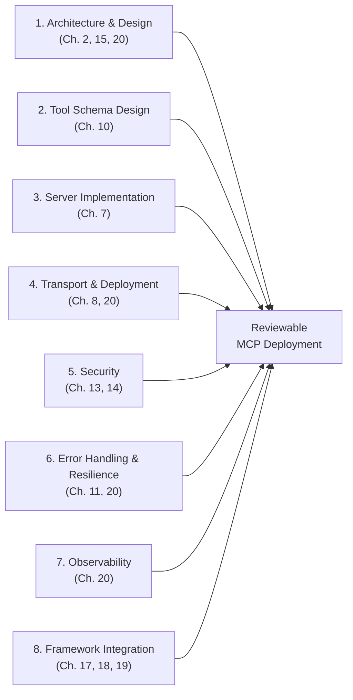
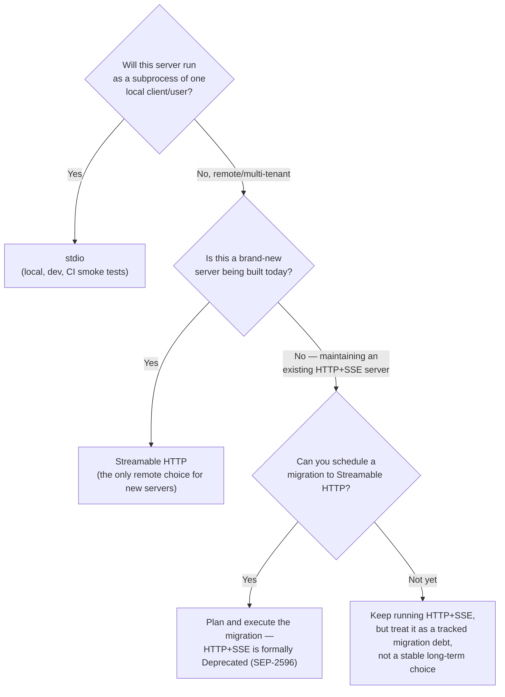
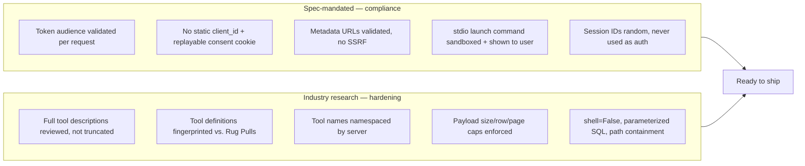
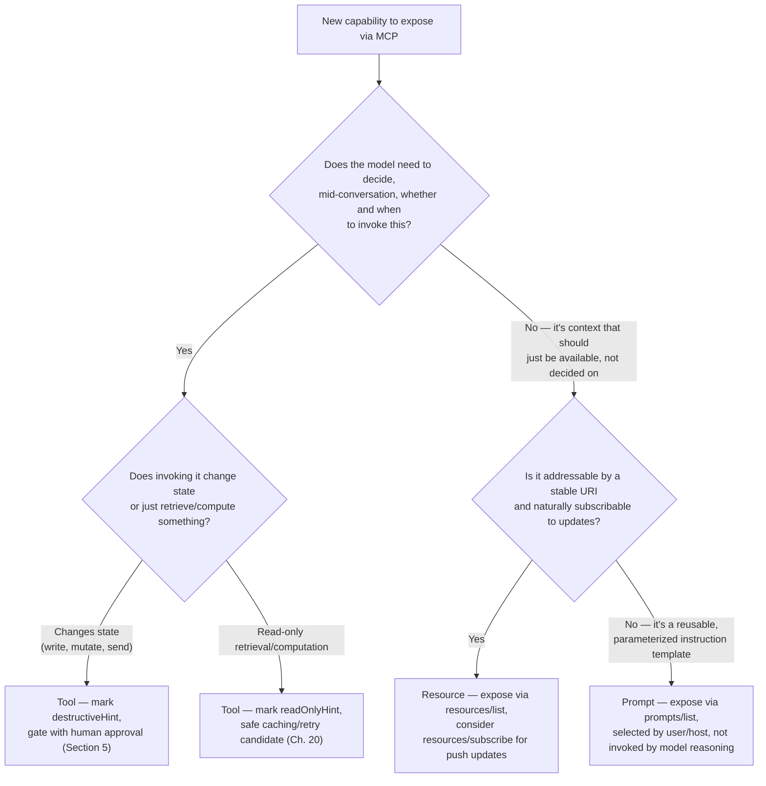

# Best Practices

> Chapters 1–21 built the pieces one at a time — architecture in isolation, then tools, then security, then production hardening. This chapter does the opposite: it collapses all of that into one referenceable checklist, organized the way a senior engineer actually thinks when reviewing an MCP design or a pull request, not the way the course taught it. If you pin one chapter of this course to your wall, it should be this one. Nothing here is new; everything here is a pointer back to where the full argument lives.

## Learning Objectives

By the end of this chapter, you will be able to:

- Recite, from memory, the eight best-practice categories that cover an MCP deployment end to end — architecture, schema design, server implementation, transport, security, error handling, observability, and framework integration — and place any given design question into the correct category
- Apply a decision framework for choosing between a **Tool**, a **Resource**, and a **Prompt** for a new piece of MCP-exposed functionality, without re-deriving the primitive definitions from Chapters 4–6
- Apply a decision framework for choosing a **transport** (stdio vs. Streamable HTTP vs. legacy HTTP+SSE) for a new server, tied directly to Chapter 8's and Chapter 20's arguments
- Recognize when a design violates the one-Client-per-Server rule (Chapter 2), overloads a server with unrelated capabilities, or reaches for a generic tool where a domain-specific one belongs (Chapters 10, 15)
- Audit a server's `services/` boundary (Chapter 7), its input validation and credential scoping (Chapter 14), and its retry/timeout discipline (Chapters 11, 20) against a single consolidated checklist
- Explain why `MultiServerMCPClient` should be instantiated once per process lifetime and why subagent tool lists must be scoped deliberately rather than inherited by default (Chapters 17–19)
- Use this chapter as a **pre-merge review checklist** for any MCP server or client change, independent of which earlier chapter originally taught the underlying rule

---

## Prerequisites for This Chapter

This chapter assumes the **entire course so far** — there is no new primitive, no new wire detail, and no new API introduced here. Specifically, it assumes you've internalized:

- The Host/Client/Server model and the 1:1 Client:Server rule (**Chapter 2**)
- The exact shape of tools, resources, and prompts, and the tool-annotation vocabulary (`readOnlyHint`, `destructiveHint`) (**Chapters 4–6**)
- The `services/` separation pattern for server implementation (**Chapter 7**)
- stdio vs. Streamable HTTP vs. legacy HTTP+SSE (**Chapter 8**)
- Model-facing tool schema design — naming, descriptions, `enum`/`Literal`, `outputSchema` (**Chapter 10**)
- The protocol-error/tool-error/timeout/retry taxonomy (**Chapter 11**)
- OAuth 2.1, PKCE, Protected Resource Metadata, and Resource Indicators (**Chapter 13**)
- The Section A (spec-mandated) / Section B (industry-research) security split (**Chapter 14**)
- The domain-specific-vs-generic tool trade-off for databases (**Chapter 15**)
- `MultiServerMCPClient`, LangGraph tool nodes, and `create_deep_agent()` wiring (**Chapters 17–19**)
- Async I/O, connection pooling, timeouts, retries, rate limiting, caching, logging/tracing/metrics, and horizontal scaling (**Chapter 20**)
- The 2026-07-28 stateless redesign, taught in depth in **Chapter 21** — this chapter references it only where a "classic vs. stateless" distinction changes a best practice

If any of those feels shaky, this is not the chapter to relearn it in — follow the cross-reference back to the chapter that owns the full treatment. What follows assumes you already have the argument; it only asks you to apply it.

---

## How to Read This Chapter

Every section below follows the same shape: **the rule, in one sentence; why it matters, in two or three; and which earlier chapter owns the full argument.** Nowhere in this chapter will you find a wire-format detail, a new code pattern, or a security attack explained from scratch — those already exist, in depth, elsewhere in this course. What you will find is the *synthesis*: the same eight-category structure applied consistently, so that "is this tool safe to ship" and "is this architecture sound" and "will this scale" all reduce to walking the same checklist rather than remembering which of twenty chapters covered the relevant point.



### Quick Reference Table

Use this as the fast index into the rest of the chapter — one row per category, the one-sentence rule, and where the full argument lives if you need it again.

| # | Category | One-line rule | Owning chapter(s) |
|---|---|---|---|
| 1 | Architecture & Design | One Client per Server; one domain per server; narrow tools before generic ones | Ch. 2, 10, 15 |
| 2 | Tool Schema Design | Write names and descriptions for the model, constrain everything you can declaratively | Ch. 10 |
| 3 | Server Implementation | `services/` holds all business logic; `tools/` is a thin, protocol-aware adapter | Ch. 7 |
| 4 | Transport & Deployment | stdio for local, Streamable HTTP for remote, never new work on HTTP+SSE | Ch. 8, 20 |
| 5 | Security | Least privilege, boundary validation, no blind trust, human approval for destructive calls | Ch. 13, 14 |
| 6 | Error Handling & Resilience | Categorize the failure before deciding whether to retry; retry only idempotent, transient work | Ch. 11, 20 |
| 7 | Observability | Mint and thread your own correlation ID; the JSON-RPC `id` doesn't do this for you | Ch. 20 |
| 8 | Framework Integration | One `MultiServerMCPClient` per process; every subagent's tool list is explicit | Ch. 17, 18, 19 |

---

## 1. Architecture & Design

### 1.1 One Client per Server, no exceptions

Chapter 2's load-bearing sentence: **"Establishes one stateful session per server."** A Host talking to N servers holds N Client instances — never one Client multiplexing several servers behind a shared session. This isn't a style preference; it's the mechanism that keeps a compromised or misbehaving Server from touching another Server's traffic, credentials, or context. `MultiServerMCPClient` (Chapter 17) looks like one Python object, but internally it still holds one Client-equivalent session per server entry — it's a Host-side convenience over the 1:1 rule, not an exception to it.

```python
# WRONG — reusing one ClientSession's read/write streams for a second server
# "to save a connection." This is the Section 1.1 violation Real-World Scenario
# describes teams actually shipping.
async with stdio_client(server_a_params) as (read, write):
    async with ClientSession(read, write) as shared_session:
        await shared_session.initialize()
        # ... later, someone reuses `shared_session` against server B's
        # tool names, because "it's already open" — no such thing exists
        # in the spec; this either fails outright or silently corrupts
        # which server a given tool call is actually routed to.

# RIGHT — one Client (one ClientSession) per Server, always, even if that
# means holding two of them open side by side in the same Host process.
async with stdio_client(server_a_params) as (read_a, write_a), \
           stdio_client(server_b_params) as (read_b, write_b):
    async with ClientSession(read_a, write_a) as session_a, \
               ClientSession(read_b, write_b) as session_b:
        await session_a.initialize()
        await session_b.initialize()
        # Two sessions, two servers, two security boundaries — exactly
        # what MultiServerMCPClient does for you under the hood (Ch. 17).
```

**Review question:** does anything in this design share one transport/session object across more than one logical MCP server? If yes, that's a Chapter 2 violation regardless of how convenient it looked in the moment.

### 1.2 Don't overload a single server with unrelated capabilities

A server should have one coherent domain of responsibility — "the billing system," "the vehicle-gate database," "the GitHub integration" — not an ever-growing junk drawer of tools from unrelated systems bolted on because it was the server already running. Overloading a server has three concrete costs:

- **Blast radius.** A bug or compromise in one tool's handler runs inside the same process, with the same credentials and network access, as every other tool on that server — even ones from a completely unrelated domain (Chapter 14's least-privilege argument, applied at the process level, not just the credential level).
- **Ambiguity at scale.** A server with sixty tools spanning five unrelated domains reintroduces the tool-naming-ambiguity problem from Chapter 10 at a much larger scale — the model now has to disambiguate across domains, not just within one.
- **Independent deployability.** Unrelated capabilities on one server means you can't scale, redeploy, or roll back one domain without touching the others — an ordinary microservice-boundary argument, applied to MCP servers.

**Review question:** if you described this server's tool list in one sentence, would that sentence name one domain or several? Several domains is the signal to split.

### 1.3 Prefer domain-specific tools over one generic tool

This is Chapter 10's central case study (`execute_query` vs. `get_vehicle_entries`) and Chapter 15's deep-dive for databases, restated as a design-time default: **start narrow.** A handful of well-named, schema-constrained tools that each answer exactly one class of question outperforms one flexible tool that makes the model invent a query language on every call — both for reliability (the model fills in scalars it can read off the request, instead of hallucinating syntax) and for security (there's no path from model output to a raw query string). The exception, covered in Chapter 15, is a genuinely generic query tool deliberately built behind a strict allowlist and a read-only database role — a defensible design, not the default one.

**Review question:** does this tool's argument shape let the model avoid inventing any syntax, DSL, or free-text convention you haven't explicitly documented in an `enum`?

---

## 2. Tool Schema Design

Chapter 10 owns the full argument that tool schema design is a **model-facing UX problem**, not a validation exercise. The condensed version, as a checklist:

- **Naming**: consistent `verb_noun` convention (`get_`, `list_`, `search_`, `create_`, `update_`, `delete_`) across an entire server, and across servers in a multi-server deployment where tool-name collisions are both a UX and a security concern (Chapter 14's Tool Name Shadowing).
- **Descriptions written for the model, not a human reviewer**: what the tool does, when to use it, when *not* to (naming the correct sibling tool), and every unit/format/constraint the model needs — the model gets no follow-up question.
- **`enum`/`Literal` over freeform `str`** for any parameter with a small, known set of valid values — the single highest-leverage JSON Schema change available.
- **Declarative constraints** (`minimum`/`maximum`/`pattern`/`format`) wherever the space can be constrained, rather than relying on prose the model might not honor.
- **Flat, scalar arguments** over deep nesting unless the nesting reflects a genuine one-to-many relationship.
- **`outputSchema` + `structuredContent`** (2025-06-18+) for any tool whose result downstream code needs to consume programmatically.
- **Empirical testing**: a passing JSON Schema validator is not evidence a model uses the tool correctly — run a paraphrase battery (Chapter 10, Section 9) and re-run it whenever a name, description, or schema changes.

**Review question:** could you hand this tool's `description` to someone who has never seen the rest of the server and have them correctly predict when to call it, and when not to?

---

## 3. Server Implementation

Chapter 7's structural rule: **separate the thin protocol adapter from the business logic it calls.**

```
server.py       — constructs FastMCP, imports registration modules, starts the server
tools/           — translates MCP shape (typed signatures, docstrings) into a services/ call
resources/       — same translation role, for resources
prompts/         — same translation role, for prompts
services/        — the actual work: DB queries, HTTP calls, aggregation — no mcp import, ever
```

The test for whether the boundary is holding, restated from Chapter 7: **if a `services/` file needs anything from the MCP SDK, logic has leaked.** Two concrete payoffs that make this worth enforcing, not just aesthetically preferring:

- **Testability independent of the protocol.** `services/` is plain Python — test it with ordinary unit tests, no `ClientSession`, no live server process, no JSON-RPC round trip. Chapter 7's real-world scenario is exactly this: a one-file server where "does `get_top_events` correctly aggregate" required standing up a live database and a live MCP session just to answer a question that should have been a two-line `pytest` test.
- **Reuse beyond MCP.** The same `services/` object that backs an MCP tool can back a REST endpoint or a CLI command unmodified — because it was never coupled to MCP's shape in the first place.

**Review question:** if you deleted every `@mcp.tool()`/`@mcp.resource()`/`@mcp.prompt()` decorator in this codebase, would `services/` still compile and pass its own tests? If not, the boundary isn't real.

```python
# services/ticket_service.py — the boundary test, made concrete.
# No "from mcp..." import anywhere in this file. Testable with plain pytest,
# no ClientSession, no running server process.
class TicketService:
    def __init__(self, db_pool):
        self._db_pool = db_pool

    async def search(self, query: str, status: str, max_results: int) -> list[dict]:
        async with self._db_pool.acquire() as conn:
            rows = await conn.fetch(
                "SELECT id, title, status FROM tickets "
                "WHERE status = $1 AND title ILIKE $2 LIMIT $3",
                status, f"%{query}%", max_results,
            )
            return [dict(r) for r in rows]

# tools/tickets.py — the thin adapter. Its only job: translate MCP shape
# into a services/ call and back. Nothing here is business logic.
@mcp.tool()
async def search_support_tickets(query: str, status: str = "open", max_results: int = 10) -> dict:
    """Search support tickets by free-text query, filtered by status."""
    results = await ticket_service.search(query, status, max_results)
    return {"tickets": results, "total_matched": len(results)}

# test_ticket_service.py — tests services/ directly, no MCP involved at all.
async def test_search_filters_by_status(db_pool):
    service = TicketService(db_pool)
    results = await service.search("login", "open", 10)
    assert all(r["status"] == "open" for r in results)
```

---

## 4. Transport & Deployment

Chapter 8's decision, restated as a default: **stdio for local/dev, Streamable HTTP for production/multi-tenant, and do not build new servers on legacy HTTP+SSE.**

- **stdio** — the client spawns the server as a subprocess; no network exposure, no auth handshake overhead, ideal for a single local user or a CI smoke test (Chapter 20, Section 14). Its cost is Chapter 14's Local MCP Server Compromise risk: the subprocess runs with full client privilege, so sandbox it and show the exact launch command in any consent UI, and never run an unpinned `npx ...@latest` launch command in anything you'd call production.
- **Streamable HTTP** — the only standard remote transport (since 2025-03-26); needed the moment more than one user, tenant, or long-lived deployment is in play. Design for statelessness even under the classic spec's optional `Mcp-Session-Id` (Chapter 20, Section 11) — externalize any state you were tempted to keep in one replica's memory, so a plain round-robin load balancer works and losing a replica costs you nothing but in-flight requests.
- **Legacy HTTP+SSE (2024-11-05)** — formally Deprecated as of the 2026-07-28 spec revision (SEP-2596). Do not choose it for a new server under any circumstance; if you're maintaining one, plan the migration to Streamable HTTP rather than treating it as a stable long-term choice.

> **2026-07-28 spec note:** Streamable HTTP's classic optional `Mcp-Session-Id`/GET-stream/`Last-Event-ID` machinery is removed entirely under the stateless redesign — every request becomes self-contained. Chapter 20's push toward "design for statelessness even before the spec forces it" is exactly the practice that makes that future migration a non-event instead of a rearchitecture. See Chapter 21 for the full treatment.



**Review question:** if this is a new server, is there any reason it isn't either stdio (local) or Streamable HTTP (remote)? If the answer names HTTP+SSE, that reason needs to be a migration plan, not a design decision.

---

## 5. Security

Chapter 14's two-threat-model split still governs how you talk about this category: **Section A** (spec-mandated: Token Passthrough, Confused Deputy, SSRF in metadata discovery, Local Server Compromise, Session Hijacking) is a compliance question; **Section B** (industry research: Tool Poisoning, Rug Pulls, Tool Name Shadowing, Unbounded Resource Reads, Command Injection) is a hardening question. Don't cite one as the other. The condensed cross-cutting checklist:

- **Least privilege.** Every tool's backing credential is scoped to exactly what that tool needs — a read-only DB role for a read tool, a channel-scoped bot token, not a workspace-wide one. Split credentials across tools on the same server; don't share one "god credential."
- **Input validation at the tool boundary.** `inputSchema` constrains shape for the model's benefit; it does not substitute for a runtime check of business-rule bounds, authorization relative to the caller's identity, or anything context-dependent (Chapter 14, Section 13).
- **Never trust a third-party server's tool descriptions blindly.** The `description` field is plain text the model reads and, in effect, obeys — treat every description from an unaudited or third-party server as untrusted input to the model, render it in full in any consent UI (no truncation), and fingerprint tool definitions so a Rug Pull (a silent post-approval change) re-triggers approval instead of executing invisibly.
- **Human approval for destructive operations.** Gate on `destructiveHint` annotations as the default trigger, not an ad hoc list you have to remember to update; show the *exact arguments* in the approval prompt, scoped to that one call, not a standing grant for the rest of the session. LangGraph's and DeepAgents' interrupt mechanisms (Chapters 18–19) are the natural place to implement this when either framework is your host.
- **The auth patterns from Chapter 13, applied per request, not per connection.** Validate a bearer token's `aud` claim against your own server's identity on *every* request that carries one — Token Passthrough is a per-request discipline. If you're building a proxy toward a third-party AS, never reuse one static `client_id` across all users combined with a replayable consent cookie (the Confused Deputy setup). Always send the RFC 8707 `resource` parameter to bind a token to this specific server's audience.
- **Generic secure-coding discipline, applied to every tool argument as adversarial input**: `subprocess` argument lists with `shell=False` (never string-built shell commands), parameterized SQL (never f-string-built queries), and `Path.resolve()` + `is_relative_to()` containment checks for any file-path argument.

**Review question:** run Chapter 14's Section C.18 pre-production checklist in full against this server before it ships; treat any unchecked item as a tracked residual risk, not a silent gap.



---

## 6. Error Handling & Resilience

Chapter 11's category split is the foundation everything else in this section builds on: **protocol errors** (malformed request, unknown tool — a JSON-RPC error object), **tool execution errors** (`isError: true` inside a successful result), **downstream API/database errors** (the tool's own backend failed), and **two distinct timeouts** (client-side call timeout vs. tool-internal timeout). Production discipline, from Chapter 20, layers safe-retry rules on top:

- **Retry only the transient category**: network timeouts/resets, downstream 502/503/504, and an ambiguous client-side timeout *if and only if* the underlying operation is idempotent. Never retry a permanent failure — invalid params, an auth failure (refresh the credential instead), or a genuine business-logic failure like "insufficient balance."
- **The tool-internal timeout must always be strictly shorter than the client-side call timeout**, with margin for the tool to catch its own timeout and return a clean `isError: true` before the outer clock expires.
- **Exponential backoff with jitter**, never fixed-interval retry, to avoid many concurrent callers retrying a struggling dependency in lockstep and re-creating the exact overload that caused the failure.
- **Idempotency is the real gate, not "did it look like a network blip."** A read-only tool is trivially safe to retry; a tool with a side effect (`create_order`, `charge_card`) needs an idempotency key or a human/agent decision on an ambiguous timeout — never a blind retry.

**Review question:** for every retry loop in this codebase, can you name the specific idempotency argument for why retrying is safe? "It looked transient" is not that argument.

```python
# The categorization step Section 6 asks you to make explicit, before
# any backoff logic runs at all — Chapter 11's taxonomy, as a gate function.
def is_safely_retryable(exc: Exception, *, tool_is_idempotent: bool) -> bool:
    if isinstance(exc, (httpx.TimeoutException, httpx.ConnectError)):
        return True  # transient network condition — always safe
    if isinstance(exc, httpx.HTTPStatusError) and exc.response.status_code in (502, 503, 504):
        return True  # downstream signaling its own temporary overload
    if isinstance(exc, ClientCallTimeout):
        # Ambiguous by nature (Ch. 20, Section 3.1) — only safe if the
        # underlying operation is a no-op to repeat.
        return tool_is_idempotent
    # -32602 invalid params, auth failures, and business-logic errors
    # (isError: true for a reason unrelated to a downstream hiccup) all
    # fall through to False — retrying reproduces the identical failure.
    return False
```

---

## 7. Observability

Chapter 20's per-hop discipline, condensed: the JSON-RPC `id` is scoped to one Client↔Server connection and does not correlate a request across Host → Client → Server → downstream API. You need your own correlation ID, minted once at the point the logical request begins and threaded through every hop explicitly — as an HTTP header (`X-Request-Id` or equivalent, via `MultiServerMCPClient`'s `headers` field) over Streamable HTTP, or as an explicit tool argument convention over stdio.

- **Structured logging**: every log line at every hop carries the same correlation ID, so a pile of independent per-process log lines becomes one correlatable trail even though no single component has end-to-end visibility on its own.
- **Tracing**: the same ID plus a per-hop start/end timestamp (or a proper OpenTelemetry span per hop) is what lets you attribute a 4-second latency spike to one specific hop instead of "somewhere in the system."
- **Metrics, per tool**: call count (spikes flag a runaway agent loop), latency as a histogram (not just an average — the P99 tail is what users feel), and error rate split by failure category (protocol vs. tool-execution) so a rising error rate isolates to the one struggling tool, not the whole server.

**Review question:** if a user reports "that request took 8 seconds," can you, from logs alone, attribute those 8 seconds to a specific hop — or does your instrumentation stop at "the MCP call took 8 seconds" with no further breakdown?

```python
# The minimal shape of Section 7's rule — mint once at the Host, thread
# everywhere. Not an MCP-defined field; your own application convention.
request_id = str(uuid.uuid4())  # minted once, at the Host, per logical request

client = MultiServerMCPClient({
    "reporting": {
        "url": "https://mcp.internal/reports/mcp",
        "transport": "streamable_http",
        "headers": {
            "Authorization": "Bearer <token>",
            "X-Request-Id": request_id,  # threaded to the Server hop
        },
    }
})
# Inside the server's tool body, the SAME request_id is read back out of the
# incoming request headers and re-attached to any downstream HTTP call the
# tool makes — that's what turns independent log lines into one trail.
```

---

## 8. Integration Hygiene — LangChain / LangGraph / DeepAgents

Chapters 17–19's wiring patterns, restated as hygiene rules rather than tutorial steps:

- **Instantiate `MultiServerMCPClient` once, at graph-build/agent-build time — not per request.** It holds the underlying Client↔Server sessions (Section 1.1's 1:1 rule, materialized through this one convenience object); re-instantiating it per invocation throws away connection reuse and re-runs discovery/handshake overhead on every call, exactly the mistake Chapter 20's connection-management section warns against for downstream connections in general.
- **`await client.get_tools()` is genuinely async — don't forget the `await`.** A common mistake (Chapter 17) is treating the coroutine itself as the tool list, which silently produces a broken agent rather than a clear error.
- **Namespace or disambiguate tool names across servers** before handing the aggregate list to an agent — two servers each exposing a `search` tool is a real, observed collision (Chapter 17's worked example), not a hypothetical.
- **Scope subagent tool lists deliberately, never by default inheritance.** In DeepAgents, a `SubAgent` that omits `tools` inherits the *entire* parent tool list, including MCP tools from servers it has no business touching — an omitted `tools` key is an opt-in to *more* access, not less. Build each subagent's tool list explicitly (e.g., filtering by tool-name prefix per server) so a triage subagent can't accidentally reach a database-migration tool.
- **Gate destructive MCP tools the same way you'd gate any other tool.** An MCP tool arrives as an ordinary named `BaseTool` — `interrupt_on` (DeepAgents) or a LangGraph pre-execution interrupt keys off that name exactly like a hand-written tool; there is no separate MCP-specific gating mechanism to learn.
- **Resources and prompts are available too, not just tools** (`load_mcp_resources`, `load_mcp_prompt`) — don't default to re-implementing resource/prompt access as bespoke tool calls when the adapter already exposes the primitive directly.

**Review question:** for every subagent in this DeepAgents deployment, can you point to the explicit `tools=` list that scopes it — or is it silently inheriting the coordinator's full MCP surface?

```python
# WRONG — client rebuilt on every request handler invocation; discards
# connection reuse and re-runs discovery overhead per call (Section 8, bullet 1).
async def handle_request(user_message: str):
    client = MultiServerMCPClient({...})   # rebuilt every time — don't do this
    tools = await client.get_tools()
    agent = create_react_agent(model="anthropic:claude-sonnet-4-6", tools=tools)
    return await agent.ainvoke({"messages": [{"role": "user", "content": user_message}]})

# RIGHT — built once, at process/module scope, reused across every request.
_client = MultiServerMCPClient({
    "github": {"url": "https://mcp.internal/github/mcp", "transport": "streamable_http"},
    "db":     {"command": "python", "args": ["/srv/db_server.py"], "transport": "stdio"},
})
_tools_cache: list | None = None

async def get_shared_tools() -> list:
    global _tools_cache
    if _tools_cache is None:
        _tools_cache = await _client.get_tools()   # fetched once, reused thereafter
    return _tools_cache

# Explicit, deliberate subagent scoping — never rely on an omitted `tools` key.
github_tools = [t for t in await get_shared_tools() if t.name.startswith("github_")]
triage_subagent = {
    "name": "issue-triage",
    "description": "Triages open GitHub issues and flags likely duplicates.",
    "tools": [t for t in github_tools if not t.name.endswith(("_merge_pr", "_close_issue"))],
}
```

---

## Decision Framework: Tool, Resource, or Prompt?

Chapters 4–6 defined these primitives individually; the question that actually comes up in design review is "which one does *this* capability belong to?" The rule of thumb: **Tools are actions the model decides to invoke; Resources are context the host/user attaches; Prompts are reusable instruction templates a user or host selects.** If the model needs to *decide, based on the conversation, whether and when* to fetch or act — that's a Tool. If the data should simply *be available as context*, often without the model even choosing to fetch it explicitly — that's a Resource. If you're packaging a reusable, parameterized instruction template that a user or host picks from a menu — that's a Prompt.



This maps directly onto examples you've already built across the course: `get_vehicle_entries` (Chapter 10) is a read-only Tool because the model decides, per user question, whether to call it; a live dashboard dataset exposed at `greeting://{name}`-style URIs (Chapter 5) is a Resource because it's context, not a decision; a `greet_user(name, style)` template (Chapter 6) is a Prompt because a user or host selects it, rather than the model reasoning its way into calling it.

---

## Examples

### Example 1 — A cross-cutting review pass on a small server

Take a hypothetical `support-ops` MCP server: it exposes `search_support_tickets`, `create_support_ticket`, `delete_support_ticket`, and — added later by a different engineer, quickly — a raw `run_sql(query: str)` escape hatch "for anything the other tools don't cover yet."

Walking the eight categories:

1. **Architecture (Section 1)**: `run_sql` is exactly the generic-tool anti-pattern Chapter 10/15 warn about, added to a server that otherwise did the right thing — flag it for removal or, at minimum, a strict read-only allowlisted role behind it.
2. **Schema design (Section 2)**: `delete_support_ticket` should carry `destructiveHint`; check whether its description states the sibling ("use `update_ticket_status` to close instead of delete, when the ticket isn't truly erroneous").
3. **Server implementation (Section 3)**: confirm each tool delegates to a `services/ticket_service.py` with no `mcp` import — if `run_sql` bypasses `services/` entirely and talks to the DB inline, that's a second red flag, independent of the first.
4. **Transport (Section 4)**: if this is deployed for multiple internal teams, it should be Streamable HTTP, not stdio-per-user — check the deployment config, not just the code.
5. **Security (Section 5)**: `run_sql`'s credential must not be the same one `search_support_tickets` uses if it's kept at all; `delete_support_ticket` needs a human-approval gate keyed on its `destructiveHint`.
6. **Error handling (Section 6)**: does `create_support_ticket` distinguish a transient downstream 503 (retryable) from a validation failure like a malformed email (not retryable, don't loop on it)?
7. **Observability (Section 7)**: is there a per-tool error-rate metric that would have caught `run_sql` being called disproportionately often as a workaround for missing narrow tools?
8. **Integration hygiene (Section 8)**: if a DeepAgents coordinator delegates to a "read-only support" subagent, does that subagent's `tools=` list explicitly exclude `delete_support_ticket` and `run_sql`, or is it inheriting the full list?

That one server surfaces a finding in six of the eight categories — which is the point of reviewing cross-cuttingly instead of chapter-by-chapter: a single design mistake (the `run_sql` escape hatch) has architecture, security, and observability consequences simultaneously, and a review that only checked "is the JSON Schema valid" would have missed all of them.

### Example 2 — Applying the transport decision framework

A team is building an MCP server that wraps an internal analytics warehouse, to be used by (a) individual engineers running a local DeepAgents CLI tool, and (b) a shared, always-on ops-assistant deployment serving the whole support team. Following the Section 4 flowchart: case (a) is one subprocess per local user — stdio. Case (b) is multi-tenant and remote — Streamable HTTP, deployed per Chapter 20's containerization/Kubernetes pattern, with no session affinity configured on the Service (state externalized to the shared analytics DB itself, not held in server-process memory). These are legitimately two different deployments of what might be the same `services/` layer (Section 3's reuse payoff) — not a single either/or choice.

### Example 3 — A pre-merge review checklist as a runnable sketch

Teams that internalize this chapter tend to eventually encode a version of it as an actual CI check, not just a mental checklist. This is intentionally a sketch, not a production linter — the point is the *shape* of automating the cheapest parts of the review, so a human reviewer's attention goes to the judgment calls (Sections 1, 5) rather than the mechanical ones (Sections 2, 3):

```python
"""ci_mcp_review.py — a deliberately minimal pre-merge sketch.
Automates the parts of this chapter's checklist that are mechanically
checkable; everything else (architecture judgment, security review)
still needs a human, and this script says so explicitly rather than
pretending to replace that step."""

import ast
import json
from pathlib import Path

def check_services_boundary(services_dir: Path) -> list[str]:
    """Section 3: no `mcp` import anywhere under services/."""
    findings = []
    for py_file in services_dir.rglob("*.py"):
        tree = ast.parse(py_file.read_text())
        for node in ast.walk(tree):
            if isinstance(node, (ast.Import, ast.ImportFrom)):
                module = getattr(node, "module", "") or ""
                if "mcp" in (module, *[a.name for a in node.names]):
                    findings.append(f"{py_file}: imports MCP SDK inside services/ (Section 3)")
    return findings

def check_tool_naming(tool_definitions: list[dict]) -> list[str]:
    """Section 2: verb_noun convention, non-empty descriptions."""
    verbs = ("get_", "list_", "search_", "create_", "update_", "delete_")
    findings = []
    for tool in tool_definitions:
        name = tool["name"]
        if not name.startswith(verbs):
            findings.append(f"{name}: doesn't follow the verb_noun convention (Section 2)")
        if len(tool.get("description", "")) < 40:
            findings.append(f"{name}: description too short to brief a model (Section 2)")
    return findings

def check_destructive_tools_gated(tool_definitions: list[dict], gated_names: set[str]) -> list[str]:
    """Section 5: every destructiveHint tool must appear in the host's approval gate list."""
    findings = []
    for tool in tool_definitions:
        if tool.get("annotations", {}).get("destructiveHint") and tool["name"] not in gated_names:
            findings.append(f"{tool['name']}: destructiveHint set but not in the approval gate (Section 5)")
    return findings

def main() -> int:
    findings = []
    findings += check_services_boundary(Path("services"))
    tool_defs = json.loads(Path("build/tools_list.json").read_text())  # from an Inspector --cli run
    findings += check_tool_naming(tool_defs)
    gated = set(json.loads(Path("host_config/approval_gate.json").read_text()))
    findings += check_destructive_tools_gated(tool_defs, gated)

    if findings:
        print("MCP pre-merge review found issues:")
        for f in findings:
            print(f"  - {f}")
        print("\nNote: this script only covers Sections 2, 3, and part of 5.")
        print("Sections 1, 4, 6, 7, 8 still require a human walkthrough of this chapter.")
        return 1
    return 0

if __name__ == "__main__":
    raise SystemExit(main())
```

The honest caveat baked into the script's own output is the point: automating "does every tool follow the naming convention" and "is `services/` free of MCP imports" is cheap and catches real regressions cheaply (wire it into the same CI step as Chapter 20's Inspector `--cli` smoke test), but it cannot automate "is this server's domain boundary coherent" (Section 1.2) or "did we actually validate this token's audience correctly" (Section 5) — those still require a human working through this chapter's questions directly.

---

## Real-World Scenario

A mid-size SaaS company's platform team inherits an MCP deployment built eighteen months earlier by a team that has since moved on. It has grown to eleven servers, some stdio, some Streamable HTTP, feeding a mix of internal LangGraph agents and one DeepAgents-based support assistant. Leadership asks for a "health check" before connecting a twelfth server (a newly-acquired company's ticketing system) and before opening the assistant up to a larger internal audience.

The team runs this chapter's eight categories as their review structure, rather than starting from scratch:

- **Architecture**: two of the eleven servers turn out to share one `MultiServerMCPClient`-adjacent session object a previous engineer wired together "to save a connection" — a direct Section 1.1 violation. It's split back into two proper sessions once discovered; the fix takes an afternoon, but finding it took walking the checklist, since nothing in the code *looked* wrong until someone asked "how many Client sessions does this Host actually hold, and does that match the number of servers."
- **Schema design**: three servers still expose a `query(input: str)`-shaped tool from the original build-fast phase. Two get replaced with narrow, `Literal`-constrained equivalents in a week; the third (a genuinely ad hoc reporting need) is kept, but rewired behind a strict read-only database role and a row cap, matching Chapter 15's defensible-exception case rather than being left as an unexamined liability.
- **Server implementation**: five of eleven servers have no `services/` separation at all — business logic lives inline in `@mcp.tool()` bodies. This becomes a backlog item rather than a blocker, since it's a maintainability risk, not an active vulnerability; it's prioritized by which of those five servers touches the most sensitive data.
- **Transport**: one server still speaks legacy HTTP+SSE. It's scheduled for migration to Streamable HTTP rather than patched in place, per Section 4's rule that HTTP+SSE is Deprecated, not merely discouraged.
- **Security**: the Section C.18 checklist from Chapter 14, run against all eleven servers, turns up the same token-passthrough gap the Chapter 14 real-world scenario described almost verbatim — a gateway forwarding bearer tokens without an audience check, never exercised in testing because every test client happened to request correctly-scoped tokens. It's fixed before the twelfth server (an *external* vendor's system, raising the stakes considerably) is ever connected.
- **Error handling**: the ticketing system's own MCP server (once connected) is audited for retry safety before anything calls it in a loop — its `create_ticket` tool gets an idempotency key added before any retry logic is allowed to wrap it, closing off exactly the "duplicate ticket from a retried timeout" failure Chapter 11's scenario describes.
- **Observability**: none of the eleven servers currently propagate a shared correlation ID — each hop logs independently. This is flagged as the single highest-leverage fix given the imminent audience expansion, since a support-facing incident with no cross-hop correlation is, in the team's own words, "undebuggable at 2 a.m." It's implemented before the wider rollout, not after.
- **Integration hygiene**: the DeepAgents support assistant's three subagents are all found to inherit the full MCP tool list — no subagent had ever had an explicit `tools=` scoping list written for it. Before opening the assistant to a larger audience, each subagent gets an explicit, minimal tool list matching its actual job, closing off exactly the "least privilege" gap Section 8 and Chapter 14 both warn about.

**Lesson:** none of these findings required new knowledge — every single one is a direct instance of a rule this course already taught, chapter by chapter. What the eight-category checklist provided was a way to *systematically re-derive* the full list of open findings on an eighteen-month-old system nobody currently understood end to end, rather than relying on whoever happened to remember which chapter covered which risk.

---

## Best Practices

A dedicated recap, phrased as a pin-to-the-wall checklist — one line per category, each traceable back to a chapter if you need the full argument again.

- **Architecture**: one Client per Server, always (Ch. 2); one coherent domain per server, not a junk drawer of unrelated tools; start with narrow, domain-specific tools and only generalize with evidence (Ch. 10, 15).
- **Tool schema design**: `verb_noun` naming, descriptions written for the model with explicit "when not to" clauses, `enum`/`Literal` over freeform strings, declarative constraints, flat arguments, `outputSchema`/`structuredContent`, and empirical paraphrase testing (Ch. 10).
- **Server implementation**: `services/` holds all business logic with zero `mcp` import; `tools/`/`resources/`/`prompts/` are thin adapters; test the service layer directly, without a live MCP session (Ch. 7).
- **Transport & deployment**: stdio for local/single-user, Streamable HTTP for remote/multi-tenant, no new servers on legacy HTTP+SSE; design for statelessness even under the classic spec's optional session ID (Ch. 8, 20).
- **Security**: keep spec-mandated (Section A) and industry-research (Section B) vocabulary straight; least privilege per tool credential; validate inputs semantically at the tool boundary, not just via `inputSchema`; never trust third-party tool descriptions or one-time approvals indefinitely; gate destructive tools on `destructiveHint` with a per-call human approval showing exact arguments; validate token audience on every request (Ch. 13, 14).
- **Error handling & resilience**: know which category a failure falls into (protocol / tool / downstream / timeout) before deciding whether to retry; retry only transient, idempotent operations, with exponential backoff and jitter; keep tool-internal timeouts strictly shorter than client-side call timeouts (Ch. 11, 20).
- **Observability**: mint your own correlation ID and thread it through every hop; log, trace, and instrument per-tool metrics (call count, latency histogram, error rate by category) — the JSON-RPC `id` alone never correlates a request end to end (Ch. 20).
- **Framework integration**: instantiate `MultiServerMCPClient` once per process lifetime; namespace tool names across servers; scope every subagent's `tools=` list explicitly rather than relying on inheritance; gate destructive MCP tools the same way as any hand-written tool (Ch. 17, 18, 19).
- **Cross-cutting**: review new designs against all eight categories together, not one chapter's lens at a time — a single design flaw (a generic escape-hatch tool, an unscoped subagent, a shared session) routinely shows up as a finding in three or four categories simultaneously.

---

## Common Mistakes

- **Treating this chapter as a substitute for the chapters it summarizes.** If a review question here surfaces a "no," the fix is to go read the full argument in the cited chapter — this checklist tells you *where* to look, not the complete reasoning for *why*.
- **Optimizing one category while violating another.** A beautifully schema-designed tool (Section 2) that lives inline in `server.py` with no `services/` boundary (Section 3) and no credential scoping (Section 5) is still a liability — the categories are complementary, not substitutes for each other.
- **Sharing one Client/session across servers "to save a connection."** This is the single most common architecture-level violation found during real reviews (see this chapter's Real-World Scenario) — it rarely looks wrong in the code until someone explicitly counts sessions against servers.
- **Letting a generic escape-hatch tool survive past its "temporary" justification.** `execute_query`/`run_sql`-style tools added under time pressure have a strong tendency to become permanent, precisely because they "already work" for whatever the next request turns out to be.
- **Assuming `MultiServerMCPClient`'s convenience means the 1:1 Client:Server rule doesn't apply.** It's one Python object managing several underlying sessions, not a multiplexed session — treat it exactly as strictly as N separate Clients, because that's what it is underneath.
- **Leaving subagents on inherited tool lists "for now."** An omitted `tools=` key is an opt-in to *more* access, not less — this is the opposite of what most engineers assume the default does, and it's worth double-checking explicitly on every subagent, every time.
- **Citing an industry-research security term (Tool Poisoning, Rug Pull) as if it were a spec requirement**, or conversely dismissing it as "not in the spec, so not our problem" — both misread Chapter 14's Section A/B split.
- **Retrying blindly because a failure "looked transient."** Idempotency, not vibes, is the gate for whether a retry is safe (Section 6).
- **Treating observability as something to add after an incident, rather than before the audience/traffic that will produce one.** Correlation IDs and per-tool metrics are cheap to add early and expensive to reconstruct retroactively from uncorrelated logs.

---

## Summary

- This chapter organizes the entire course into eight review categories — architecture, tool schema design, server implementation, transport, security, error handling, observability, and framework integration — meant to be walked together during any design or code review, not read once and filed away.
- Architecture and design (Section 1) centers on three rules: one Client per Server (Chapter 2), no unrelated capabilities crammed onto one server, and domain-specific tools by default over one generic tool (Chapters 10, 15).
- Tool schema design (Section 2) condenses Chapter 10 into a checklist: naming, model-facing descriptions, `enum`/`Literal`, declarative constraints, flat arguments, structured output, and empirical testing.
- Server implementation (Section 3) is Chapter 7's `services/` boundary, testable as if the tool decorator were removed entirely.
- Transport and deployment (Section 4) is a simple decision: stdio for local, Streamable HTTP for remote/multi-tenant, no new servers on Deprecated HTTP+SSE — captured in this chapter's transport decision-flow diagram.
- Security (Section 5) keeps Chapter 14's spec-mandated/industry-research split explicit while applying least privilege, boundary-level input validation, no blind trust in third-party descriptions, and human approval for destructive calls.
- Error handling and resilience (Section 6) applies Chapter 11's failure taxonomy through Chapter 20's safe-retry rule: retry only transient, idempotent failures, with backoff and jitter, and keep tool-internal timeouts shorter than client-side ones.
- Observability (Section 7) is Chapter 20's per-hop correlation-ID discipline — the JSON-RPC `id` alone never correlates a request end to end.
- Framework integration hygiene (Section 8) covers instantiating `MultiServerMCPClient` once, namespacing tool names, and scoping every DeepAgents subagent's tool list explicitly rather than relying on default inheritance.
- The Tool-vs-Resource-vs-Prompt and transport decision-flow diagrams in this chapter are meant as quick, repeatable answers to the two design questions that recur most often once you're past the tutorial stage of this course.
- A single design mistake routinely surfaces findings in three or four of these categories at once — that's the actual argument for reviewing cross-cuttingly instead of chapter-by-chapter, as this chapter's Real-World Scenario demonstrates on an inherited, eighteen-month-old deployment.

---

## Knowledge Check

1. A colleague proposes wiring one `ClientSession` to talk to two different MCP servers "to save a connection." Using Section 1.1 and Chapter 2, explain precisely what security property this breaks, not just that it's "against convention."
2. You're reviewing a server with fifteen tools spanning three unrelated business domains (billing, inventory, and HR). Using Section 1.2, name two concrete costs of this design beyond "it feels messy."
3. A tool named `process_request(data: str)` shows up in a PR. Walk through Sections 1.3 and 2 and list at least four specific problems with this tool as designed.
4. Explain, using Section 3's test, how you would determine — without reading every line — whether a given MCP server's business logic has leaked out of its `services/` layer.
5. A team wants to add a new remote, multi-tenant analytics server. Using the Section 4 decision flowchart, what transport should they choose, and what's the one design habit (from Chapter 20) they should adopt now to avoid a harder migration later?
6. Differentiate, using Section 5, a finding that would appear in a spec-compliance audit from one that would appear only in a defense-in-depth hardening review. Give one concrete example of each.
7. A tool call times out on the client side with no confirmed side effect. Using Section 6, what is the one question you must answer before deciding whether to retry it — and why is "it looked like a network blip" not sufficient?
8. Why does the JSON-RPC `id` fail to solve the cross-hop correlation problem described in Section 7, and what's the minimal fix?
9. A DeepAgents subagent's dict omits the `tools` key. Using Section 8, state exactly what MCP tools that subagent can call, and why this is very often not what the engineer who wrote it intended.
10. Using the Tool/Resource/Prompt decision flowchart, classify each of the following and justify your answer in one sentence: (a) a live, subscribable feed of current server load metrics; (b) a `refund_order(order_id, amount)` action; (c) a canned "summarize this incident for a postmortem" instruction template with fillable fields.

<details>
<summary>Answers</summary>

1. Sharing one `ClientSession` across two servers breaks "maintains security boundaries between servers" (Chapter 2) — a single shared session has no per-server boundary, so a bug or a malicious response from Server B could leak into context that's supposed to belong exclusively to Server A's relationship with the Host. It's not merely against convention; the spec's own Client role description assumes exactly one session per server, and every downstream guarantee (which server produced which tool result, consent scoped per server) depends on that being true.
2. Two concrete costs: (a) blast radius — a bug or compromise in one HR-domain tool's handler runs inside the same process, with the same credentials and network access, as the billing and inventory tools, even though those domains have nothing to do with each other; (b) tool-selection ambiguity at scale — fifteen tools spanning three domains reintroduces Chapter 10's naming-ambiguity problem across domains, not just within one, making the model's disambiguation job strictly harder than three separate five-tool servers would.
3. Four problems: (a) `process_request` gives the model no signal about what kind of request it processes — the name carries no `verb_noun` information; (b) `data: str` is exactly the opaque-string anti-pattern from Chapter 10's `execute_query` case study — no schema-level structure to constrain what the model sends; (c) there's no description telling the model when to use this versus any sibling tool; (d) a single generic handler taking a raw string is a strong signal that whatever's behind it will need to parse or interpret that string at runtime — exactly the security surface Chapter 10/15 warn about for database-backed tools.
4. Delete (in a scratch copy) every `@mcp.tool()`/`@mcp.resource()`/`@mcp.prompt()` decorator and every `from mcp...` import, then try to run the project's own service-layer test suite with no live MCP session. If it still compiles and the tests still pass, the boundary is real; if anything breaks, business logic depended on something MCP-specific, meaning it leaked out of `services/`.
5. Streamable HTTP — it's remote and multi-tenant, and Streamable HTTP is the only standard remote transport for a brand-new server (legacy HTTP+SSE is Deprecated). The design habit to adopt now: externalize any state you were tempted to keep in one replica's in-process memory (to a shared DB/Redis) so no session-affinity/sticky-routing requirement ever gets baked in — this is the exact practice Chapter 20 recommends adopting before the 2026-07-28 stateless redesign makes it mandatory, avoiding a rearchitecture later.
6. A spec-compliance finding is testable directly against MUST/MUST NOT language in the official spec — e.g., a server accepting a bearer token without validating its `aud` claim (Token Passthrough) is a Section A violation, citable against the spec text itself. A defense-in-depth hardening finding has no spec clause to cite — e.g., a host that doesn't fingerprint tool definitions to catch a Rug Pull is a real gap, but "the spec requires this" would be an incorrect claim; it's industry-documented best practice, not a MUST-level requirement.
7. The one question: is the underlying tool operation idempotent — would calling it twice have the same effect as calling it once? "It looked like a network blip" describes the failure's *symptom*, not the operation's *safety to repeat* — a non-idempotent operation (e.g., `charge_card`) can have already succeeded server-side before the response was lost, and retrying blindly risks a duplicate side effect regardless of how transient the failure looked from the client's vantage point.
8. The JSON-RPC `id` is scoped to a single Client↔Server connection — it isn't visible to the Host that initiated the logical request, doesn't propagate to whatever downstream HTTP/DB call a tool makes, and a different hop in the chain has no way to see it at all. The minimal fix: mint your own correlation ID once, at the Host, when the logical request begins, and thread it explicitly through every hop — as a header (e.g., `X-Request-Id`) over Streamable HTTP, or as an explicit tool argument convention over stdio where there's no header channel.
9. It can call every MCP tool the parent/coordinator has access to, across every connected server — an omitted `tools` key means the subagent *inherits* the parent's full tool list rather than getting none. This is very often not what the engineer intended, because the natural (and wrong) assumption is that omitting a `tools=` argument means "no tools" or "minimal tools," when the actual DeepAgents behavior is the opposite: omission is an opt-in to *more* access, not less.
10. (a) Resource — it's context that should simply be available/subscribable, not something the model has to decide, mid-conversation, whether to invoke. (b) Tool, specifically one carrying `destructiveHint` and requiring a human-approval gate — it changes state (issues a refund) and the model must decide, based on the conversation, whether and when to call it. (c) Prompt — it's a reusable, parameterized instruction template a user or host selects from a menu, not an action the model reasons its way into invoking.

</details>

---

## Hands-On Exercise

Pick an MCP server you've built earlier in this course (or, if you skipped the hands-on exercises, use the Chapter 10 `get_vehicle_entries`/`search_support_tickets` example or the Chapter 14 file-reading/database server) and run it through this chapter's full eight-category review, end to end:

1. **Architecture.** Draw the Host/Client/Server diagram for your actual deployment (not the idealized one from Chapter 2). Count Client instances against Server instances — do they match 1:1? List every tool your server(s) expose and group them by domain; flag anything that doesn't obviously belong.
2. **Tool schema design.** For every tool, check off: consistent verb prefix, an explicit "when not to use this" clause in the description if a sibling tool exists, `enum`/`Literal` used wherever a closed set of values exists, and an `outputSchema` declared if downstream code consumes the result programmatically.
3. **Server implementation.** Attempt to delete every `mcp`-related decorator and import from your `services/` (or equivalent) layer, in a scratch copy. Does it still compile? Write one test against `services/` directly, with no live MCP session involved.
4. **Transport & deployment.** State, in one sentence, why your server uses the transport it currently uses, using the Section 4 decision flowchart. If it's stdio, confirm the launch command would be fully visible in a consent UI; if it's Streamable HTTP, confirm no server-process-local state would break under multiple replicas.
5. **Security.** Run Chapter 14's Section C.18 checklist against this server in full, and record which items are checked, which don't apply, and which are open findings.
6. **Error handling & resilience.** Find every retry loop in your tool implementations (or note there are none). For each, write one sentence justifying why the retried operation is idempotent, or add an idempotency key/remove the retry if you can't justify it.
7. **Observability.** Check whether a single correlation ID would currently survive from an initial request through to any downstream API call your tools make. If not, sketch (pseudocode is fine) where you'd mint and thread it.
8. **Framework integration.** If this server is wired into a LangGraph graph or a DeepAgents agent, confirm the client is built once at graph/agent-build time, and — if there are subagents — write out each one's explicit `tools=` list rather than relying on inheritance.

Write up your findings as a short punch list (done / not applicable / open finding), the same shape the Real-World Scenario's team used — that format is itself worth practicing, since it's what you'll actually produce in a real pre-production review.

---

## Further Reading

- This course's **Chapter 2** (Host/Client/Server architecture) — the full argument behind the 1:1 Client:Server rule in Section 1.1
- This course's **Chapter 7** (Building MCP Servers) — the complete `services/` separation pattern behind Section 3
- This course's **Chapter 8** (Transport Mechanisms) and **Chapter 20** (Production MCP Architecture) — the full transport trade-off and horizontal-scaling argument behind Section 4
- This course's **Chapter 10** (Tool Schema Design) and **Chapter 15** (MCP + Databases) — the complete model-facing schema argument and the domain-specific-vs-generic trade-off behind Sections 1.3 and 2
- This course's **Chapter 11** (Error Handling) and **Chapter 20** — the full failure taxonomy and safe-retry rules behind Section 6
- This course's **Chapter 13** (Authentication & Authorization) and **Chapter 14** (MCP Security) — the complete Section A/B security treatment behind Section 5
- This course's **Chapter 17** (MCP + LangChain), **Chapter 18** (MCP + LangGraph), and **Chapter 19** (MCP + DeepAgents) — the full wiring and subagent-scoping patterns behind Section 8
- This course's **Chapter 21** (The Stateless Redesign — MCP 2026-07-28) — how the transport and lifecycle guidance in Section 4 shifts under the new spec
- Official MCP specification, `modelcontextprotocol.io/specification` — always check the revision a given page describes, per this course's recurring convention
- OWASP MCP Top 10 project and Invariant Labs' April 2025 tool-poisoning disclosure — the Section B research vocabulary referenced throughout Section 5

---

<div style="display:flex;justify-content:space-between;align-items:center;">
  <a href="./21-the-stateless-redesign-2026-07-28.md">← Previous: The Stateless Redesign — MCP 2026-07-28</a>
  <a href="./00-index.md">🏠 Index</a>
  <a href="./23-common-mistakes-and-pitfalls.md">Next: Common Mistakes & Pitfalls →</a>
</div>
