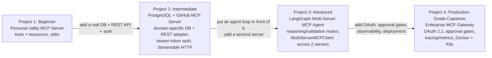
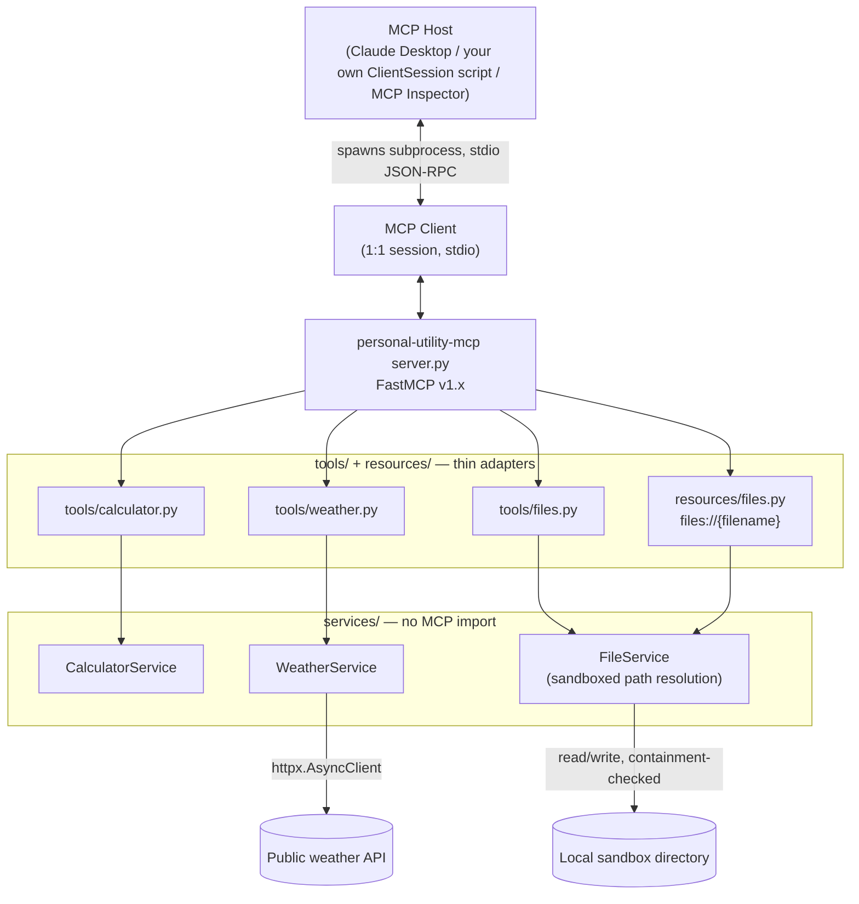
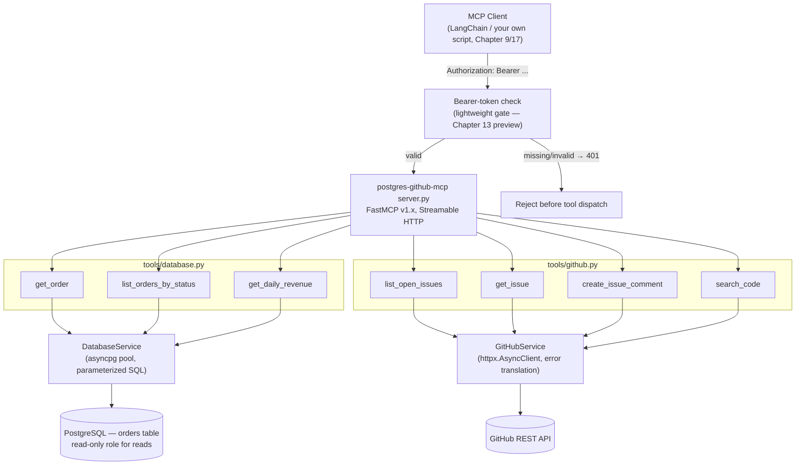
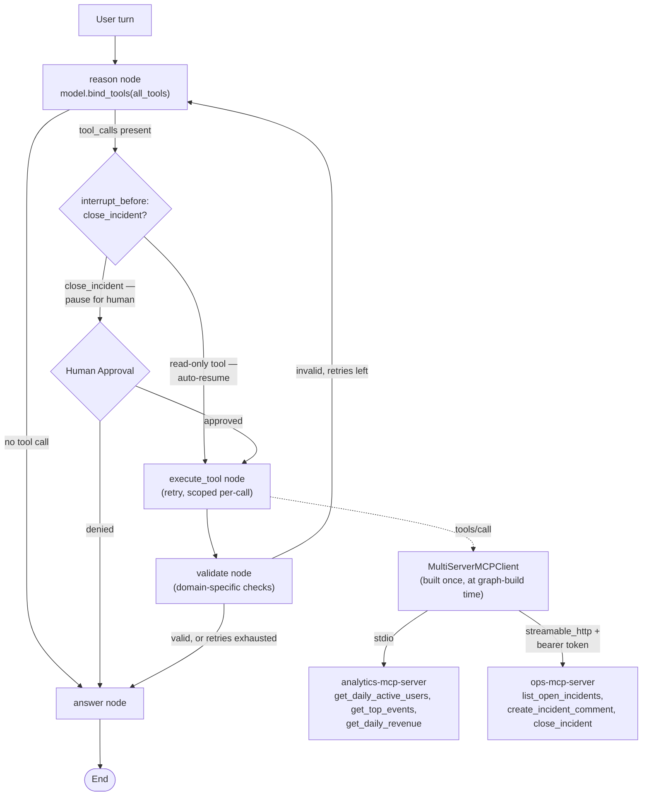
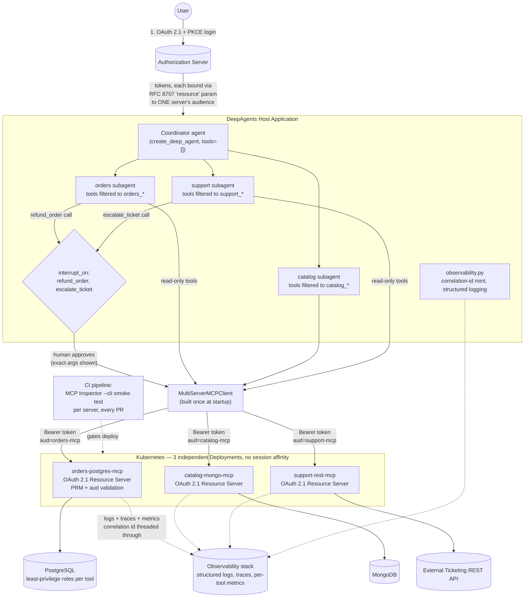

# Capstone Projects

## Learning Objectives

By the end of this chapter, you will be able to:

- Design and build a complete MCP server from a blank directory, choosing the right primitives (tools,
  resources, prompts), the right transport, and the right project layout for the problem at hand
- Combine domain-specific database tools (Chapter 15) and a curated REST-API adapter (Chapter 16) behind a
  single MCP server, protected by a lightweight bearer-token gate as a deliberate stepping stone toward full
  OAuth 2.1
- Wire two or more MCP servers into one LangGraph agent via `MultiServerMCPClient`, with explicit
  reasoning/execution/validation nodes, tool-level and graph-level retries kept separate, and a human-approval
  interrupt gating only the destructive tools
- Architect a production-grade, multi-server "MCP gateway" consumed by a DeepAgents (or LangGraph) application,
  with OAuth 2.1 authentication, human approval gates, structured error handling, tracing/metrics, and
  containerized deployment — the full synthesis of Chapters 1–23 in one system
- Read an unfamiliar MCP codebase and immediately recognize the layered shape (thin protocol adapters over a
  services layer) this course has used since Chapter 7, because you will have built it four times by different
  levels of difficulty in this chapter alone
- Judge your own MCP project against the same rubric used here: correct primitive choice, correct transport,
  tested services layer, honest security posture, and observability that would actually help you at 2 a.m.

---

## Prerequisites for This Chapter

This chapter assumes the **entire course** up to this point. It does not introduce new protocol concepts,
new SDK surface, or new integration patterns — it is a synthesis chapter, and every design decision made below
is a direct application of something a previous chapter already taught in depth:

- **Chapters 1–3** — architecture (Host/Client/Server), the classic handshake lifecycle, JSON-RPC 2.0
- **Chapters 4–6** — tools, resources, and prompts as first-class primitives, including tool annotations
  (`readOnlyHint`, `destructiveHint`) used throughout this chapter's approval-gating decisions
- **Chapter 7** — the `tools/` + `services/` + `config/` project layout every project in this chapter follows
  without exception
- **Chapter 8** — stdio vs. Streamable HTTP transport selection
- **Chapter 9** — building MCP clients, `ClientSession`, and manual sanity-checking outside a full agent
- **Chapter 10** — tool schema and naming quality (`verb_noun`, disambiguated names across servers)
- **Chapter 11** — the protocol-error vs. tool-error split and retry-safety categorization
- **Chapter 12** — MCP Inspector as the debugging and CI smoke-testing tool used in every project below
- **Chapter 13** — OAuth 2.1, PKCE, Protected Resource Metadata — the full auth story the production capstone
  implements end to end
- **Chapter 14** — tool poisoning, least-privilege credentials, path traversal, SQL injection, and
  human-approval gates for destructive operations
- **Chapters 15–16** — domain-specific database tools and the REST-API adapter pattern that anchor Projects
  2–4
- **Chapters 17–19** — `langchain-mcp-adapters`, `MultiServerMCPClient`, LangGraph nodes/routing, and
  DeepAgents' `interrupt_on`/subagent-scoping mechanics that anchor Projects 3–4
- **Chapter 20** — async correctness, timeouts, retries, rate limiting, caching, structured logging, tracing,
  metrics, containerization, and Kubernetes deployment — the production hardening every project (especially the
  capstone) leans on
- **Chapter 21** — the 2026-07-28 stateless redesign, referenced here only where it changes how you'd design a
  system today for tomorrow's migration

If any of these feel shaky, this is the wrong chapter to start with — go back to the specific chapter named
above rather than trying to piece it together from context here.

---

## Why Four Tiers, and How to Use Them

The four projects below are graded in difficulty and each **absorbs and extends** the one before it —
they are not four unrelated exercises. The **Personal Utility MCP Server** teaches the primitives and the
services-layer discipline with no auth and no network dependencies to worry about. The **PostgreSQL + GitHub
MCP Server** adds a real database, a real external API, and a first taste of access control. The **LangGraph
Multi-Server MCP Agent** takes servers like the ones you just built and puts an actual reasoning loop in front
of them, across more than one server at once. The **Enterprise MCP Gateway** is the capstone proper: every
concern from every earlier chapter, wired into one coherent system that could plausibly run in production.

You do not have to build all four to get value from this chapter — reading each Implementation Plan closely,
even without typing the code, will surface gaps in how you'd approach your own MCP project. But if you have the
time, build them in order: each project's `services/` layer, error-handling posture, and testing discipline is
the direct rehearsal for the next one's.



---

## Project 1 (Beginner): Personal Utility MCP Server

### Requirements

A single, local, stdio-transported MCP server that any MCP-aware host (Claude Desktop, your own
`ClientSession`-based script from Chapter 9, or MCP Inspector) can launch as a subprocess. It exposes three
small utility domains behind one server, deliberately chosen to exercise both primitives this early project
should cover:

- **Calculator tools** — `add`, `subtract`, `multiply`, `divide`, `power` — pure functions, no I/O, the
  simplest possible tool bodies (this is close to the fact sheet's own `add(a, b)` example, extended slightly).
- **Weather tool** — `get_current_weather(city: str)` — a single tool that calls a public weather API over
  `httpx.AsyncClient` (an API that doesn't require a key, e.g. Open-Meteo, keeps this project free of secrets
  management until Project 2).
- **File tools + a resource** — `read_text_file(filename: str)` and `list_files()` as tools, plus a
  `files://{filename}` resource template (Chapter 5) so a host can read file content as *context* rather than
  through an explicit tool call — the point of this pairing is to make the tools-vs-resources distinction
  concrete rather than abstract. Both are scoped to one sandbox directory only.
- **No authentication** — this server runs locally, spawned by a trusted host over stdio; Chapter 13's auth
  material doesn't apply until a server is reachable over the network (Project 2 onward).
- **stdio transport only** (Chapter 8) — this is a local, single-user tool, and stdio is the right default:
  no port to expose, no TLS to configure, the host manages the subprocess lifecycle for you.

### Architecture



> **2026-07-28 spec note:** nothing about this project's stdio lifecycle changes shape under the classic
> spec you're building against (`initialize`/`initialized`, shutdown via stdin close → SIGTERM → SIGKILL
> escalation, per Chapter 3). Under the 2026-07-28 stateless redesign, the handshake disappears entirely and
> "an open stdio process is not a conversation" — but that's a wire-level detail entirely absorbed by whichever
> SDK generation you install; this project's tool/resource code is identical either way. Build against `mcp[cli]<2`
> as the fact sheet specifies, and don't worry about the 2026-07-28 line until Chapter 21's dedicated treatment.

### Folder Structure

```
personal-utility-mcp/
├── server.py                    # Composition root — FastMCP instance, imports every module
├── tools/
│   ├── __init__.py
│   ├── calculator.py             # @mcp.tool() adapters: add, subtract, multiply, divide, power
│   ├── weather.py                 # @mcp.tool() adapter: get_current_weather
│   └── files.py                    # @mcp.tool() adapters: read_text_file, list_files
├── resources/
│   ├── __init__.py
│   └── files.py                      # @mcp.resource("files://{filename}")
├── services/
│   ├── __init__.py
│   ├── calculator_service.py           # pure functions, fully synchronous
│   ├── weather_service.py               # httpx.AsyncClient wrapper, tool-internal timeout
│   └── file_service.py                   # sandbox root + path containment check
├── config/
│   ├── __init__.py
│   └── settings.py                         # SANDBOX_ROOT, WEATHER_API_BASE_URL
├── tests/
│   ├── test_calculator_service.py
│   ├── test_weather_service.py
│   └── test_file_service.py
├── .env
└── pyproject.toml
```

### Implementation Plan

1. **Scaffold the project** with `pyproject.toml` and install `mcp[cli]<2` plus `httpx` and `pytest-asyncio`,
   following Chapter 7's project layout exactly — `tools/`, `resources/`, `services/`, `config/`, `tests/`.
2. **Write `config/settings.py`** as a `pydantic-settings` `BaseSettings` class holding `sandbox_root: str` and
   `weather_api_base_url: str` — even for a project this small, route every path and URL through one `Settings`
   object rather than scattering literals (Chapter 7 §4).
3. **Write `services/calculator_service.py`** as five pure functions (`add`, `subtract`, `multiply`, `divide`,
   `power`) with `divide` explicitly raising `ValueError` on a zero divisor rather than letting a `ZeroDivisionError`
   escape uncaught — this is the seed of the tool-error-vs-crash distinction Chapter 11 covers in full.
4. **Write `services/file_service.py`** with a `FileService(sandbox_root: Path)` class whose every method
   resolves the requested filename against `sandbox_root` and confirms containment with
   `resolved_path.is_relative_to(sandbox_root)` **before** touching the filesystem — this is Chapter 14 §15's
   path-traversal fix, applied here from the start rather than patched in after an incident.
5. **Write `services/weather_service.py`** using `httpx.AsyncClient` with an explicit tool-internal timeout
   (Chapter 20 §3.2) and a caught `httpx.TimeoutException`/`httpx.HTTPStatusError` translated into a clear
   string result rather than an unhandled exception — never `requests` inside an `async def` tool body
   (Chapter 20 §1's blocking-call anti-pattern).
6. **Register thin tool adapters** in `tools/calculator.py`, `tools/weather.py`, `tools/files.py` — each one
   validates/reshapes arguments only and delegates immediately to the matching service, following Chapter 7 §6.
   Name every tool with the `verb_noun` convention (`get_current_weather`, not `weather`) per Chapter 10 §4.1,
   and write docstrings for the model, not for a human reader, per Chapter 10 §5.
7. **Register the `files://{filename}` resource** in `resources/files.py`, delegating to the same
   `FileService` the `read_text_file` tool uses — resources and tools sharing one service is exactly Chapter 7
   §6's point that the thin-adapter rule applies to every primitive, not just tools.
8. **Wire `server.py`** as the composition root: create the one `FastMCP("personal-utility")` instance first,
   then import every `tools.*`/`resources.*` module for its registration side effect, respecting the import-order
   rule from Chapter 7 §3, then call `mcp.run()` under `if __name__ == "__main__":` to start over stdio
   (Chapter 8).
9. **Test with MCP Inspector** (`uv run mcp dev server.py`, Chapter 12): confirm `tools/list` shows all seven
   tools with sensible schemas, `resources/list`/`resources/read` work against a sample file, and a deliberately
   malformed filename (`../../etc/passwd`) is rejected by `FileService`, not by luck.
10. **Write `tests/`** covering `CalculatorService.divide`'s zero-divisor case, `FileService`'s path-containment
    rejection, and `WeatherService`'s timeout handling — all with plain `pytest`, no MCP client, no running
    server process (Chapter 7 §8).

### Best Practices

- **Thin tool adapters, real logic in `services/`** — even for a project this small, resist the temptation to
  inline the calculator's arithmetic or the file-reading logic directly inside `@mcp.tool()` functions
  (Chapter 7 §1–§2). It costs nothing here and it's the habit that pays off in every later project.
- **Path containment before any filesystem access, every time** — `FileService` must resolve and check
  containment on every call, not just the ones you remember to test (Chapter 14 §15).
- **Async-native HTTP client for the weather tool** — `httpx.AsyncClient`, never `requests`, inside an `async
  def` tool body (Chapter 20 §1).
- **`verb_noun` tool names, consistently** — `get_current_weather`, `read_text_file`, `list_files` — not
  `weather`, `read`, `list` (Chapter 10 §4.1); a model choosing between ambiguous names is a design bug, not a
  model limitation.
- **One `Settings` object, even here** — a project this small is exactly where it's tempting to skip
  centralized configuration "just this once"; don't (Chapter 7 §4).
- **Test the services layer directly** — no MCP client needed to verify `divide(1, 0)` raises correctly or that
  `FileService` rejects a traversal attempt (Chapter 7 §8).

### Extensions and Improvements

- **Add a prompt** (Chapter 6) — e.g. `trip_planner(city: str)` that instructs the model to call
  `get_current_weather` and then draft packing advice, exercising the prompts primitive this project otherwise
  skips.
- **Add resource subscriptions** (Chapter 5) — have the server emit `notifications/resources/updated` when a
  watched file in the sandbox changes on disk, and confirm a subscribed client actually receives the push via
  Inspector.
- **Swap stdio for Streamable HTTP** (Chapter 8) as a deliberate exercise, then notice everything from Project 2
  onward (auth, rate limiting) suddenly becomes relevant the moment the server is reachable over a network.
- **Containerize it anyway** (Chapter 20 §12), even though it's a "personal" server — a good exercise in
  distinguishing what's genuinely production-specific from what's just good container hygiene.
- **Add a unit-conversion tool** that composes with the weather tool (Celsius/Fahrenheit), as a small
  multi-tool composition exercise before Project 3's actual multi-server composition.

---

## Project 2 (Intermediate): PostgreSQL + GitHub MCP Server

### Requirements

One MCP server exposing two unrelated domains side by side: **domain-specific tools over a PostgreSQL
database** (Chapter 15's Pattern B, not a generic `execute_sql` tool) and **a curated REST adapter over the
GitHub API** (Chapter 16's "don't mirror endpoints 1:1" discipline). The server runs over Streamable HTTP
(Chapter 8) and sits behind a **lightweight bearer-token gate** — deliberately *not* full OAuth 2.1 yet. Treat
this as an honest stepping stone: a single static API key checked against every incoming request's
`Authorization` header, upgraded to the real OAuth 2.1 Resource Server story (Chapter 13) in Project 4. Calling
this "basic auth" in the roadmap sense means "the simplest thing that actually keeps an unauthenticated caller
out," not the HTTP Basic Authentication scheme specifically.

Concrete tool surface:

- **Database tools** (backed by a small `orders` table): `get_order(order_id: str)`,
  `list_orders_by_status(status: str, limit: int = 20)`, `get_daily_revenue(day: str)` — three purpose-built
  tools, not one generic query tool (Chapter 15 §3–§4).
- **GitHub tools** (backed by the GitHub REST API via a personal access token): `list_open_issues(repo: str)`,
  `get_issue(repo: str, number: int)`, `create_issue_comment(repo: str, number: int, body: str)`,
  `search_code(repo: str, query: str)` — a curated set of four tools, not a 1:1 mirror of GitHub's dozens of
  issue-related endpoints (Chapter 16 §2).
- **Auth**: every request must carry `Authorization: Bearer <MCP_API_KEY>`; requests without it are rejected
  before any tool executes.

### Architecture



### Folder Structure

```
postgres-github-mcp/
├── server.py
├── tools/
│   ├── __init__.py
│   ├── database.py            # get_order, list_orders_by_status, get_daily_revenue
│   └── github.py                # list_open_issues, get_issue, create_issue_comment, search_code
├── services/
│   ├── __init__.py
│   ├── database_service.py        # asyncpg pool owned by the service, parameterized queries only
│   └── github_service.py            # httpx.AsyncClient wrapper, HTTP status -> tool-error translation
├── auth/
│   ├── __init__.py
│   └── bearer_gate.py                   # rejects requests missing/mismatching Authorization header
├── config/
│   ├── __init__.py
│   └── settings.py                        # DATABASE_URL, GITHUB_TOKEN, MCP_API_KEY
├── tests/
│   ├── test_database_service.py
│   └── test_github_service.py
├── .env
└── pyproject.toml
```

### Implementation Plan

1. **Provision a test Postgres schema** (a small `orders` table) and mint a GitHub personal access token scoped
   to only the one repository this server will touch — least-privilege credentials from the start (Chapter 14
   §12), not retrofitted later.
2. **Write `config/settings.py`** centralizing `database_url`, `github_token`, and `mcp_api_key` — one place a
   missing environment variable fails loudly at import time (Chapter 7 §4).
3. **Write `services/database_service.py`**: one `asyncpg` pool created once and reused (Chapter 15 §7–§8), and
   every query parameterized — zero string-formatted SQL, ever (Chapter 15 §6). This is the same discipline
   Chapter 14 §16 frames as the SQL-injection fix, applied here as the *only* way queries get written, not a
   patch.
4. **Write `services/github_service.py`** wrapping `httpx.AsyncClient` against the GitHub REST API, translating
   HTTP status codes into the correct tool-error category: a `404` becomes a clean "issue not found" result, a
   `403`/rate-limit response becomes a distinguishable "GitHub API rate-limited, retry later" result, and a
   genuine network failure is retryable while a `404` is not (Chapter 16 §5, Chapter 20 §4.1–§4.2).
5. **Register thin tool adapters** for both domains in `tools/database.py` and `tools/github.py`, using
   `verb_noun` names and marking `create_issue_comment` with `annotations={"destructiveHint": True}` (Chapter 4,
   Chapter 10) — even though this project doesn't yet gate on that annotation with a human-approval flow, tag it
   now so Project 4 can pick the tag up unmodified.
6. **Write `auth/bearer_gate.py`** as HTTP middleware in front of the Streamable HTTP endpoint: extract
   `Authorization: Bearer <token>`, compare against `settings.mcp_api_key`, return `401` on mismatch or absence
   — explicitly note in this module's docstring that this is a placeholder for Chapter 13's full OAuth 2.1
   Resource Server behavior (Protected Resource Metadata, `aud` validation), scheduled for Project 4.
7. **Wire `server.py`** as the composition root, selecting Streamable HTTP (Chapter 8) since this server is
   meant to be reachable over a network, unlike Project 1's stdio-only scope.
8. **Smoke-test with MCP Inspector** against the running HTTP server, supplying the bearer token as a custom
   header (Chapter 12, mirroring the header-testing technique Chapter 13 §"Testing the handshake" uses for
   OAuth) — confirm a request without the header is rejected and one with it succeeds.
9. **Unit test both services independent of MCP** — `DatabaseService` against a fake pool/connection (Chapter
   15 Example 2's pattern) and `GitHubService` against a mocked `httpx` transport, asserting the 404→"not
   found" and 403→"rate limited" translations specifically.
10. **Confirm least privilege**: verify the Postgres role backing `DatabaseService` cannot write, and the
    GitHub PAT cannot touch any repository beyond the one this server is scoped to.

### Best Practices

- **Domain-specific tools, not `execute_sql`** — three purpose-built database tools beat one generic query tool
  for every reason Chapter 15 §4 gives: narrower attack surface, a schema the model can actually reason about,
  and no ad hoc SQL construction to audit (Chapter 15 §1–§4).
- **Curate the GitHub surface, don't mirror it** — four tools covering the actual questions this server needs
  to answer, not a 1:1 wrapper around GitHub's full issues API (Chapter 16 §2).
- **Parameterized queries, no exceptions** — this is non-negotiable baseline, not a style preference (Chapter
  15 §6, Chapter 14 §16).
- **Translate HTTP status codes into the right MCP error category** — a `404` is a normal tool-execution result
  (`isError: true`, "not found"), not a protocol error and not something to retry (Chapter 16 §5, Chapter 11).
- **Least-privilege credentials per domain** — the database role is read-mostly, the GitHub PAT is
  repo-scoped; neither credential could reach further than its one tool domain even if compromised (Chapter 14
  §12).
- **Be honest about the auth gate's limits** — a static bearer token is a real improvement over nothing, but it
  is not audience-bound, has no token-issuance flow, and doesn't defend against a leaked key the way OAuth 2.1's
  Resource Indicators do (Chapter 13 §6) — say so in the code, don't let it read as more secure than it is.

### Extensions and Improvements

- **Migrate the bearer gate to full OAuth 2.1** (Chapter 13): add Protected Resource Metadata, validate the
  `aud` claim, and require PKCE on the client side — this is exactly Project 4's auth story, and doing it here
  first as a focused exercise makes Project 4 easier.
- **Add resources** (Chapter 5) exposing the `orders` table schema and a repo's README, so a host can pull
  either as context without an explicit tool call.
- **Add rate limiting on the GitHub-wrapping tools specifically** (Chapter 20 §5.2) — GitHub's own API rate
  limit is a real constraint independent of how many MCP clients call through this server.
- **Add caching for `search_code`** (Chapter 20 §6) — a read-only, side-effect-free tool and a strong caching
  candidate, with a cache key that incorporates the full normalized argument set.
- **Add a prompt** (Chapter 6) templating a standard "triage this issue" instruction that references both the
  GitHub tools and, if relevant, a database lookup correlating an issue with order data.

---

## Project 3 (Advanced): LangGraph Multi-Server MCP Agent

### Requirements

Two independent MCP servers — an **analytics server** (domain-specific tools over an analytics warehouse,
following Chapter 15's pattern, similar in shape to Chapter 7's worked example) and an **operations server**
(a curated REST adapter over a ticketing/incident API, following Chapter 16's pattern) — consumed **together**
by a single LangGraph agent through one `MultiServerMCPClient` (Chapters 17–18). The agent is not a flat
tool-calling loop: it has explicit **reasoning**, **tool-execution**, and **validation** nodes, tool-level and
graph-level retries kept deliberately separate, and a human-approval interrupt gating the operations server's
one destructive tool.

- **Analytics server tools**: `get_daily_active_users(day: str)`, `get_top_events(day: str, limit: int = 10)`,
  `get_daily_revenue(day: str)` — stdio transport, local to the agent process's deployment.
- **Ops server tools**: `list_open_incidents()`, `create_incident_comment(incident_id: str, body: str)`,
  `close_incident(incident_id: str)` (destructive) — Streamable HTTP, bearer-token authenticated (Project 2's
  pattern, reused).
- **Agent**: a `StateGraph` with `reason → execute_tool → validate → (loop back to reason, or) → answer`,
  built once at process startup, gating `close_incident` specifically rather than every tool call.

### Architecture



### Folder Structure

```
multiserver-langgraph-agent/
├── servers/
│   ├── analytics_server/
│   │   ├── server.py
│   │   ├── tools/analytics.py
│   │   ├── services/analytics_service.py
│   │   ├── config/settings.py
│   │   └── tests/test_analytics_service.py
│   └── ops_server/
│       ├── server.py
│       ├── tools/incidents.py
│       ├── services/ticketing_client.py
│       ├── auth/bearer_gate.py
│       ├── config/settings.py
│       └── tests/test_ticketing_client.py
├── agent/
│   ├── __init__.py
│   ├── client.py               # build_mcp_client() — one MultiServerMCPClient, two servers
│   ├── state.py                # AgentState TypedDict: messages, tool_result, validated, retries
│   ├── nodes.py                 # reason / execute_tool / validate / answer
│   ├── graph.py                   # build_graph(), route_after_reasoning, route_after_validation
│   └── main.py                      # entrypoint: checkpointer, thread_id, resume-on-approval
├── tests/
│   └── test_graph_routing.py
├── .env
└── pyproject.toml
```

### Implementation Plan

1. **Build `analytics_server`** exactly as Chapter 7's worked example and Chapter 15's Postgres example do:
   `services/analytics_service.py` with no MCP import, thin tool adapters in `tools/analytics.py`, stdio
   transport (it runs local to the agent process, spawned as a subprocess — Chapter 18 §7's stdio-subprocess
   note applies directly here).
2. **Build `ops_server`** following Project 2's REST-adapter pattern: `TicketingClient` in
   `services/ticketing_client.py`, a curated three-tool surface, Streamable HTTP transport, and the bearer-token
   gate from Project 2 reused as-is — annotate `close_incident` with `destructiveHint` (Chapter 4, Chapter 10).
3. **Define `agent/state.py`**'s `AgentState` TypedDict with `messages`, `tool_result`, `validated`,
   `validation_reason`, and `retries` — the exact shape Chapter 18 §3 introduces.
4. **Write `agent/client.py`**'s `build_mcp_client()` returning one `MultiServerMCPClient` keyed
   `"analytics"` (stdio, `command`/`args`) and `"ops"` (`streamable_http`, `url` + `headers` carrying the bearer
   token) — Chapter 18 §5.1's exact config shape.
5. **Write the `reason` node** in `agent/nodes.py` with a system prompt naming both tool domains and enforcing
   "call at most one tool per turn" (Chapter 18 §5.2).
6. **Write the `execute_tool` node** with a small retry loop (2–3 attempts, exponential backoff) scoped to
   *one* MCP call, retrying only `httpx.TimeoutException`/`ConnectError`-style transient failures — never a
   `close_incident` call whose side effect might already have landed server-side without confirmation (Chapter
   18 §5.3, Chapter 20 §4.3's idempotency caveat).
7. **Write the `validate` node** with domain-specific checks per tool: for analytics tools, confirm a
   non-negative count or a non-empty event list; for ops tools, confirm the returned incident object has the
   expected fields (Chapter 18 §5.4).
8. **Wire `agent/graph.py`**: `route_after_reasoning`, `route_after_validation`, and
   `graph.compile(interrupt_before=["execute_tool"])` — then, in the calling code around
   `graph.ainvoke(...)`, auto-resume immediately (no human prompt) whenever the pending tool call's name isn't
   `close_incident`, and only surface a real approval prompt for that one tool (Chapter 18 §8's
   annotation-gated refinement, not a blanket pause on every tool).
9. **Build the `MultiServerMCPClient` once, at `build_graph()` time — not per invocation.** This is Chapter 18
   §7's single most consequential rule: rebuilding it per turn re-spawns the `analytics_server` stdio subprocess
   and re-negotiates the `ops_server` HTTP session on every single user message.
10. **Add per-node tracing**: log tool name, arguments, and elapsed time inside `execute_tool`, and keep a
    name-to-server map (`{"get_daily_active_users": "analytics", "close_incident": "ops"}`) purely for that
    logging — not for dispatch, which `tools_by_name` already handles (Chapter 18 §6, §10).
11. **Test**: verify both servers independently with MCP Inspector first (Chapter 12), then integration-test the
    compiled graph end to end, specifically confirming `close_incident` actually pauses at the interrupt while
    `list_open_incidents` and every analytics tool resume automatically.

### Best Practices

- **Build the client once, at graph-build time.** Restated because it's the rule most likely to be silently
  violated under deadline pressure — Chapter 18 §7 spells out exactly what breaks when you don't (subprocess
  churn, thrown-away HTTP connection reuse, repeated capability negotiation).
- **Keep tool-level and graph-level retries structurally separate.** A transient `ops_server` timeout doesn't
  need the model to re-reason from scratch; a semantically wrong or empty result does. Collapsing these into one
  mechanism fixes neither failure mode well (Chapter 18 §9, Chapter 20 §4).
- **Gate by tool annotation, not by blanket node interruption.** `interrupt_before=["execute_tool"]` pauses
  unconditionally at that node; the selective behavior — auto-resume for read-only tools, real pause for
  `close_incident` — is application logic layered on top, keyed off `destructiveHint` (Chapter 18 §8).
- **Disambiguate tool names across servers before anything else.** Two servers exposing a tool literally named
  `get_status` is a naming bug your `tools_by_name` dict cannot route around — verify uniqueness once, up front
  (Chapter 10 §4.2, Chapter 18 §6, Chapter 19 §3's dedup assertion).
- **Show the resolved arguments in the approval prompt**, not just "approve `close_incident`?" — "approve
  `close_incident(incident_id='INC-4821')`?" is the version that actually lets a human review what they're
  authorizing (Chapter 14 §17, Chapter 18 §8).

### Extensions and Improvements

- **Add a third MCP server** (a lightweight vector-search server) and extend routing/validation to a genuinely
  three-way tool surface, testing whether the naming-uniqueness discipline holds under more load.
- **Swap `MemorySaver` for a persistent, database-backed checkpointer** so a paused `close_incident` approval
  survives a process restart, not just an in-memory pause.
- **Add per-tool rate limiting on the ops server** specifically (Chapter 20 §5.2), independent of the
  analytics server's own limits.
- **Wire LangSmith or an OpenTelemetry exporter** onto the per-node tracing from step 10, turning hand-rolled
  duration logs into real spans (Chapter 20 §8, foreshadowed in Chapter 18 §10).
- **Rebuild the same agent on top of DeepAgents** (Chapter 19) instead of a hand-wired `StateGraph`, using
  `interrupt_on={"close_incident": True}` in place of the manual annotation check in step 8 — a good way to feel
  directly what DeepAgents' built-in mechanism buys you over rolling it yourself.

---

## Project 4 (Production-Grade Capstone): Enterprise MCP Gateway

This is the project the roadmap explicitly names as the recommended capstone, and it deserves the most depth
in this chapter: it is the synthesis of essentially every chapter in this course into one system. Nothing here
introduces a new concept — every decision below is a direct, named application of a specific earlier chapter,
now all operating together under one architecture.

### Requirements

Three domain-specific MCP servers, each an independent deployable unit, each an **OAuth 2.1 Resource Server**
(Chapter 13) in its own right — no shared static credential across them:

- **`orders-postgres-mcp`** — domain-specific tools over PostgreSQL (Chapter 15): `get_order(order_id)`,
  `list_orders_by_status(status, limit)`, `refund_order(order_id, amount)` (**destructive**).
- **`catalog-mongo-mcp`** — aggregation-pipeline-backed tools over MongoDB (Chapter 15 §9):
  `search_products(query, limit)`, `get_inventory_level(sku)`.
- **`support-rest-mcp`** — a curated adapter over an external ticketing REST API (Chapter 16):
  `list_tickets(status)`, `create_ticket(subject, body)`, `escalate_ticket(ticket_id)` (**destructive**).

A single **DeepAgents application** (Chapter 19) is the Host. It:

- Acquires a separate, audience-bound OAuth 2.1 access token per MCP server (Chapter 13's PKCE flow, Resource
  Indicators/RFC 8707 binding each token to exactly the server it's for).
- Builds one `MultiServerMCPClient` across all three servers (Chapters 17–18), constructed once at process
  startup, never per request (Chapter 18 §7).
- Wires the merged tool list into `create_deep_agent(...)` with one **subagent per domain** (Chapter 19 §4),
  each scoped to only its own server's tools.
- Gates every destructive tool — `refund_order`, `escalate_ticket` — behind `interrupt_on` (Chapter 19 §5,
  Chapter 14 §17), with the exact resolved arguments shown to the approving human.
- Translates every downstream failure (Postgres, MongoDB, the ticketing API) into the correct Chapter 11 error
  category, retrying only the transient bucket, scoped per-call (Chapter 20 §4).
- Threads one correlation ID through every hop — DeepAgents app → MCP Client → each MCP Server → each downstream
  system — for structured logging (Chapter 20 §7), per-hop tracing (Chapter 20 §8), and per-tool call
  count/latency/error-rate metrics (Chapter 20 §9).
- Ships as three independently deployable, containerized services (Chapter 20 §12), each behind a Kubernetes
  Deployment/Service designed for horizontal scaling with no session affinity requirement (Chapter 20 §11, §13),
  secrets injected via Kubernetes Secrets, never baked into an image (Chapter 20 §10).
- Runs an MCP Inspector `--cli` smoke test per server in CI before any deploy (Chapter 20 §14).

### Architecture



> **2026-07-28 spec note:** every server above runs the classic Streamable HTTP transport (through the
> `2025-11-25` revision), which carries an optional `Mcp-Session-Id` header a naive implementation might be
> tempted to use for in-process session state. This architecture deliberately avoids that temptation from the
> start (Chapter 20 §11) — no server keeps per-session state in its own process memory, so any replica can serve
> any request and the Kubernetes Services above need no sticky-session configuration. That design choice is not
> just good practice today; it is exactly the direction the `2026-07-28` stateless redesign forces everyone
> toward once `Mcp-Session-Id` and Streamable HTTP sessions are removed entirely. Building statelessly now means
> this gateway's horizontal-scaling story does not need to change when that migration eventually happens
> (Chapter 21).

### Folder Structure

```
enterprise-mcp-gateway/
├── servers/
│   ├── orders_postgres_mcp/
│   │   ├── server.py
│   │   ├── tools/orders.py                    # get_order, list_orders_by_status, refund_order
│   │   ├── services/orders_service.py           # asyncpg pool, parameterized queries
│   │   ├── auth/resource_server.py                # PRM endpoint, 401+WWW-Authenticate, aud check
│   │   ├── config/settings.py
│   │   ├── Dockerfile
│   │   └── tests/
│   ├── catalog_mongo_mcp/
│   │   ├── server.py
│   │   ├── tools/catalog.py                     # search_products, get_inventory_level
│   │   ├── services/catalog_service.py            # Motor client, aggregation pipelines
│   │   ├── auth/resource_server.py
│   │   ├── config/settings.py
│   │   ├── Dockerfile
│   │   └── tests/
│   └── support_rest_mcp/
│       ├── server.py
│       ├── tools/support.py                       # list_tickets, create_ticket, escalate_ticket
│       ├── services/ticketing_client.py             # httpx.AsyncClient, error translation
│       ├── auth/resource_server.py
│       ├── config/settings.py
│       ├── Dockerfile
│       └── tests/
├── gateway_app/
│   ├── __init__.py
│   ├── client.py                # per-server token acquisition, one MultiServerMCPClient
│   ├── subagents.py               # orders/catalog/support SubAgent configs, tool filtering
│   ├── agent.py                     # create_deep_agent(...), interrupt_on wiring
│   ├── observability.py               # correlation-id mint/propagate, logging, metrics
│   └── main.py                          # FastAPI app, lifespan hook builds the agent once
├── deploy/
│   ├── docker-compose.yml         # local dev: 3 servers + Postgres + MongoDB
│   ├── k8s/
│   │   ├── orders-deployment.yaml
│   │   ├── catalog-deployment.yaml
│   │   ├── support-deployment.yaml
│   │   └── secrets.yaml           # secretKeyRef targets — populated out-of-band
│   └── ci/
│       └── mcp-smoke-test.yml     # Inspector --cli against all three servers, every PR
├── tests/
│   └── integration/
├── .env.example
└── pyproject.toml
```

### Implementation Plan

1. **Stand up all three MCP servers with no auth first**, purely as domain-specific tool surfaces following
   Chapter 7's layout and Chapters 15–16's tool-design patterns — get `orders-postgres-mcp`,
   `catalog-mongo-mcp`, and `support-rest-mcp` each passing MCP Inspector's `tools/list`/`tools/call` before auth
   enters the picture at all.
2. **Add OAuth 2.1 Resource Server behavior to each server independently** (Chapter 13 §3, §6): a Protected
   Resource Metadata endpoint, a `401` + `WWW-Authenticate` response pointing to it on an unauthenticated
   request, and — critically — validation that the token's `aud` claim matches *this specific server's* resource
   URI before any tool executes. This is the direct fix for the token-passthrough risk Chapter 14 §2 names: a
   token minted for `catalog-mongo-mcp` must be rejected by `orders-postgres-mcp`, even if it's otherwise valid.
3. **Annotate every destructive tool** (`refund_order`, `escalate_ticket`) with `destructiveHint` (Chapter 4,
   Chapter 10), and split backing credentials so each tool's downstream access matches only what it needs —
   `refund_order`'s Postgres role is not the same role `get_order`/`list_orders_by_status` use (Chapter 14 §12's
   least-privilege split, applied per-tool, not per-server).
4. **Containerize each server** (Chapter 20 §12): one Dockerfile per server, non-root user, dependency layer
   cached ahead of application code, no secret ever `COPY`'d or `ENV`'d with a literal value. Write a
   `docker-compose.yml` spinning up all three servers plus a local Postgres and MongoDB for development.
5. **Build `gateway_app/client.py`**: acquire an access token per server audience via the OAuth 2.1 + PKCE flow
   (Chapter 13's sequence diagram), then construct exactly one `MultiServerMCPClient` keyed by server name, each
   entry's `transport: "streamable_http"` and `headers: {"Authorization": f"Bearer {token}"}` carrying that
   server's own audience-bound token — built once, at application startup (inside a FastAPI `lifespan` hook,
   Chapter 19 §3's async/sync-boundary pattern), never rebuilt per request.
6. **Build `gateway_app/subagents.py`**: filter the merged tool list by name prefix into three `SubAgent`
   configs — `orders`, `catalog`, `support` — and a coordinator via `create_deep_agent(tools=[],
   subagents=[...])` holding no MCP tools directly itself (Chapter 19 §4), keeping each subagent's context free
   of tool schemas it will never call.
7. **Configure `interrupt_on`** for `refund_order` and `escalate_ticket` across all three servers' merged tool
   list (Chapter 19 §5), first asserting no name collisions exist between servers (`len(names) ==
   len(set(names))`, Chapter 19 §3) — a silent collision here would mean an approval gate believed to cover
   `refund_order` is actually keyed to an unrelated, same-named tool from a different server.
8. **Add structured error handling**: translate each server's downstream failures (a Postgres connection error,
   a MongoDB timeout, a ticketing-API `5xx`) into the correct Chapter 11 category, and retry only the transient
   bucket with backoff, scoped to one tool call rather than a full agent turn (Chapter 20 §4, Chapter 18 §9) —
   never retry `refund_order` or `escalate_ticket` blindly on an ambiguous client-side timeout without an
   idempotency key, since a retried refund is a correctness bug, not a performance one (Chapter 20 §4.3).
9. **Build `gateway_app/observability.py`**: mint a correlation ID at the point a user's request begins, thread
   it through every MCP call as an `X-Request-Id`-style header (an application convention, not part of MCP
   itself — Chapter 20 §7), log per-hop start/end timestamps for tracing (Chapter 20 §8), and instrument
   per-tool call counts, latency histograms, and error rates, labeled by both tool name and failure category
   (Chapter 20 §9).
10. **Deploy and gate with CI**: push each server's image, apply the three Kubernetes Deployments/Services with
    secrets wired via `secretKeyRef` (never inlined), confirm no session-affinity configuration is needed
    because state is fully externalized (Chapter 20 §11, §13), and add an MCP Inspector `--cli` smoke test per
    server to the CI pipeline (Chapter 20 §14) so a broken `tools/list` or a regressed schema fails the build
    before it ever reaches the DeepAgents Host.

### Best Practices

- **Every server validates its own `aud`, independently.** No server should ever accept a token minted for a
  different server just because it happens to be structurally valid — this is Chapter 13 §6 and Chapter 14 §2's
  token-passthrough fix, and it is the single most important auth property this whole capstone rests on.
- **Least privilege at the tool level, not just the server level.** `refund_order`'s database role should not be
  the same role a read-only `get_order` uses, even though both tools live in the same server (Chapter 14 §12).
- **Destructive tools are gated by annotation, with exact arguments shown, scoped to that one call.** Not a
  standing grant, not a blanket approval for "any future `refund_order` call" (Chapter 14 §17, Chapter 19 §5).
- **Build the `MultiServerMCPClient` once, at startup, in the lifespan hook** — never inside a request handler
  (Chapter 18 §7, Chapter 19 §3).
- **Correlate every hop with one ID, minted at the true entry point** — the JSON-RPC `id` alone cannot do this
  (it's scoped to one Client↔Server connection), so the application layer has to mint and propagate its own
  (Chapter 20 §7).
- **Externalize all state before scaling horizontally** — no in-process session dict on any of the three
  servers, so a Kubernetes rolling deploy or a crashed pod costs only its own in-flight requests, not a broken
  session (Chapter 20 §11).
- **Never bake a secret into an image, a launch command, or a config file** — every credential (database DSNs,
  the ticketing API key, OAuth client secrets) is injected at container-start time (Chapter 20 §10, §12).
- **Smoke-test with MCP Inspector in CI, per server, on every change** — the cheapest possible check that
  catches a broken handshake or a regressed tool schema before a real agent ever touches it (Chapter 20 §14).

### Extensions and Improvements

- **Add a fourth MCP server behind an internal vector database** for retrieval-augmented support answers,
  extending the subagent-per-domain pattern to a fourth domain without changing the gateway's core shape.
- **Move from Dynamic Client Registration to OAuth Client ID Metadata Documents**, following the `2025-11-25`
  tightening (Chapter 13 §5) that downgrades DCR from SHOULD to MAY.
- **Build a live dashboard** consuming the per-tool metrics stream from `observability.py`, turning Chapter 20
  §9's raw counters into the kind of "which tool is misbehaving right now" view an on-call engineer actually
  wants at 2 a.m.
- **Add canary or blue-green rollout** for one server at a time, using the already-stateless design from step 10
  to make a partial rollout safe — half the replicas on the new image, half on the old, no session affinity to
  break.
- **Prototype the migration to the 2026-07-28 stateless spec** (Chapter 21) for one server first — since this
  gateway was already built without relying on `Mcp-Session-Id`, this is a genuinely low-risk exercise rather
  than a rewrite.

---

## Summary

- The four projects in this chapter are graded and cumulative: **Personal Utility MCP Server** establishes
  primitives and the services-layer discipline; **PostgreSQL + GitHub MCP Server** adds a real database, a real
  external API, and a first, honestly-scoped auth gate; **LangGraph Multi-Server MCP Agent** puts an actual
  reasoning/validation loop in front of two servers at once; **Enterprise MCP Gateway** synthesizes every
  concern from every earlier chapter into one production-shaped system.
- Every project follows the same non-negotiable shape from Chapter 7: thin `@mcp.tool()`/`@mcp.resource()`
  adapters, a `services/` layer with zero MCP awareness, and centralized configuration — this doesn't change as
  projects get harder, it just gets applied to more domains at once.
- Domain-specific tools (Chapter 15) and curated REST adapters (Chapter 16) beat generic, endpoint-mirroring
  designs at every tier, from the beginner project's file tools to the capstone's three production servers.
- Security escalates deliberately across the tiers: no auth (Project 1, purely local) → a lightweight bearer
  token, honestly labeled as a placeholder (Project 2) → full OAuth 2.1 with audience-bound tokens per server
  (Project 4) — never presenting a weaker mechanism as stronger than it is.
- Multi-server orchestration (Projects 3–4) hinges on one rule above all others: build the
  `MultiServerMCPClient` once, at startup, never per request or per graph invocation (Chapter 18 §7).
- Human-approval gates key off tool annotations (`destructiveHint`) and show exact resolved arguments, scoped to
  one call — never a blanket, standing grant (Chapter 14 §17, Chapter 18 §8, Chapter 19 §5).
- Production readiness (Project 4) is the sum of many previously-isolated chapters operating together:
  structured error categorization and correctly-scoped retries (Chapter 11, Chapter 20 §4), correlation-ID
  logging and tracing (Chapter 20 §7–§8), per-tool metrics (Chapter 20 §9), and a stateless, horizontally
  scalable deployment (Chapter 20 §11–§13) that also happens to be the right shape for the 2026-07-28 stateless
  redesign (Chapter 21).

---

## Knowledge Check

1. Why does Project 1's `FileService` need to resolve and containment-check every path *before* touching the
   filesystem, rather than trusting the `filename` argument as given? Which earlier chapter's vulnerability
   pattern does this defend against?
2. Project 2 uses a static bearer-token check instead of full OAuth 2.1. What specific security property does
   that lightweight gate lack that Chapter 13's Resource Indicators (RFC 8707) provide, and why does that
   property matter once a token could plausibly be replayed against more than one server?
3. In Project 3's graph, why are tool-level retries (inside `execute_tool`) and graph-level retries (via
   `validate` → `reason`) kept as two separate mechanisms instead of one? Give a concrete failure each one is
   suited to and the other isn't.
4. Project 3's `interrupt_before=["execute_tool"]` pauses at that node for *every* tool call by default. What
   additional logic makes the pause selective — auto-resuming for read-only tools and only truly pausing for
   `close_incident` — and where does that logic live?
5. In the Enterprise MCP Gateway, why must each of the three MCP servers validate a token's `aud` claim
   independently, rather than trusting that "the DeepAgents Host already authenticated the user once"? What
   specific attack does skipping this check enable?
6. Why is `MultiServerMCPClient` constructed inside a FastAPI `lifespan` hook in the capstone project instead of
   inside the request handler that serves a user's message? Name two concrete costs of getting this wrong.
7. The capstone's Kubernetes Deployments run with no session-affinity configuration. What design decision made
   earlier in the project (Section 9 of Chapter 20, referenced in the capstone's Best Practices) is what makes
   that safe? What would break if a server instead kept per-session state in its own process memory?
8. A teammate proposes gating every MCP tool call behind human approval in the capstone, "just to be safe."
   Using Chapter 14 §17's and Chapter 19 §5's guidance, explain why this is worse than annotation-scoped gating,
   not just less convenient.

---

## Further Reading

- Related chapter in this course: [Chapter 7 — Building MCP Servers](./07-building-mcp-servers.md) — the
  services-layer project structure every project in this chapter is built on
- Related chapter in this course: [Chapter 13 — Authentication & Authorization](./13-authentication-and-authorization.md)
  — the full OAuth 2.1 + PKCE + Protected Resource Metadata story the Enterprise MCP Gateway implements
- Related chapter in this course: [Chapter 14 — MCP Security](./14-mcp-security.md) — least-privilege
  credentials, path traversal, SQL injection, and human-approval gates referenced throughout every project
- Related chapter in this course: [Chapter 15 — MCP + Databases](./15-mcp-and-databases.md) and
  [Chapter 16 — MCP + REST APIs](./16-mcp-and-rest-apis.md) — the domain-specific tool and curated-adapter
  patterns anchoring Projects 2 and 4
- Related chapter in this course: [Chapter 18 — MCP + LangGraph](./18-mcp-with-langgraph.md) — the
  reasoning/execution/validation node pattern and the "build the client once" rule Project 3 is built on
- Related chapter in this course: [Chapter 19 — MCP + DeepAgents](./19-mcp-with-deepagents.md) — subagent
  scoping and `interrupt_on` gating, the mechanism the Enterprise MCP Gateway uses for approval
- Related chapter in this course: [Chapter 20 — Production MCP Architecture](./20-production-mcp-architecture.md)
  — async correctness, retries, observability, and deployment, the backbone of Project 4's production posture
- Related chapter in this course: [Chapter 21 — The Stateless Redesign — MCP 2026-07-28](./21-the-stateless-redesign-2026-07-28.md)
  — why the capstone's stateless-by-design deployment choices pay off ahead of that migration
- `github.com/modelcontextprotocol/python-sdk` — official Python SDK; the source of truth for `FastMCP`,
  `ClientSession`, and transport implementations used throughout every project in this chapter
- `github.com/modelcontextprotocol/inspector` — MCP Inspector; the tool used for smoke-testing every server
  built in this chapter, interactively and in CI
- `github.com/langchain-ai/langchain-mcp-adapters` — `MultiServerMCPClient`, used in Projects 3 and 4
- `github.com/PrefectHQ/fastmcp` — the actively maintained standalone FastMCP project; worth comparing its
  example repositories against this chapter's hand-rolled project layouts once you've built one yourself
- `modelcontextprotocol.io/specification` — always confirm which spec revision a given page describes before
  relying on a specific wire-level detail for a server you're deploying today

---

<div style="display:flex;justify-content:space-between;align-items:center;">
  <a href="./23-common-mistakes-and-pitfalls.md">← Previous: Common Mistakes & Pitfalls</a>
  <a href="./00-index.md">🏠 Index</a>
  <a href="./25-interview-preparation.md">Next: Interview Preparation →</a>
</div>
