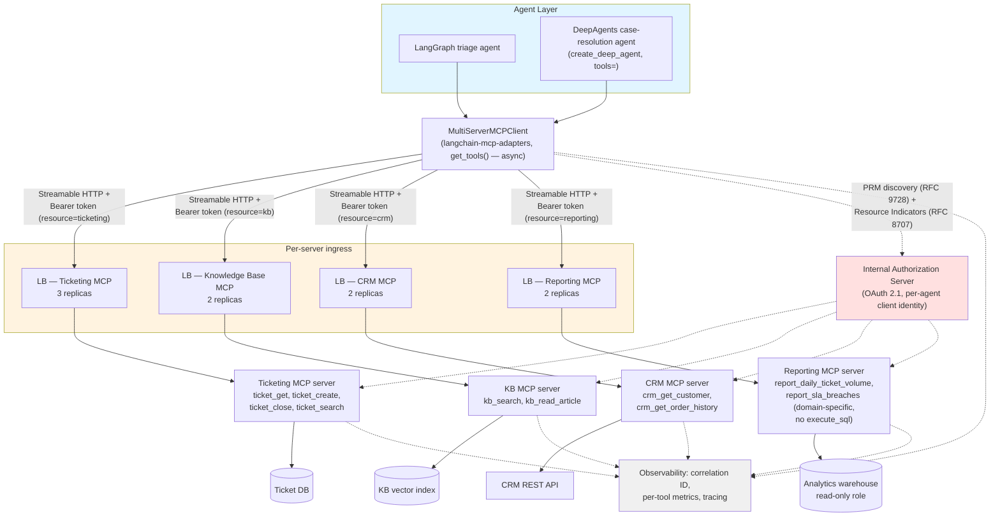
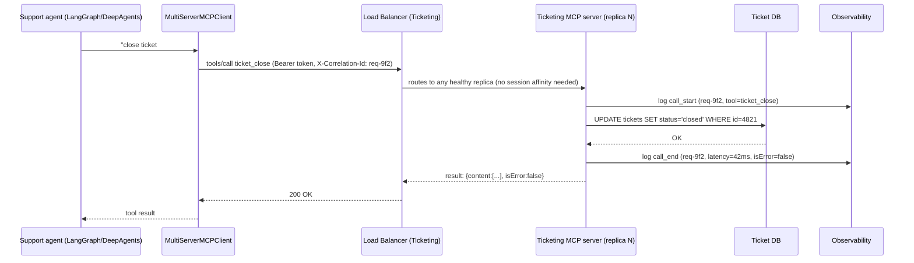

# Interview Preparation

Every prior chapter in this course taught you to build, secure, debug, and operate MCP infrastructure. This chapter has a different job: it rehearses that knowledge in the exact shapes an interviewer, a design-review panel, or an incident retro will actually demand it — a rapid-fire question, an ambiguous "what would you do if," a whiteboard system design, or a broken server someone hands you and says "figure out why." None of the material below is new. Every answer here is a compressed pointer back to a chapter you've already worked through, and every model answer is deliberately written the way you should say it out loud: precise about what the spec requires versus what your team chose, honest about trade-offs, and quick to cite the specific mechanism — an error code, an RFC, a parameter name — rather than a vague gesture at "best practices." If you can defend every answer in this chapter without opening another tab, you're ready for the conversation this course has been preparing you for.

## Learning Objectives

By the end of this chapter, you will be able to:

- Answer the core questions interviewers ask most often about MCP fundamentals, architecture, protocol lifecycle, primitives, schema design, security, authorization, and framework integration — each with a precise, defensible model answer
- Recite the exact error-code and OAuth-version reference tables this course has built up, on demand, without needing to look them up
- Reason through realistic "what would you do if" scenarios involving production incidents, security-questionable requests from teammates, and scaling decisions, and explain your reasoning the way a senior engineer would in a design review
- Whiteboard a complete system design for a multi-server, multi-agent MCP platform — architecture, authentication, observability, tool inventory, and rollout plan — starting from a one-sentence prompt, and defend it against an interviewer's follow-up probes
- Diagnose five realistic categories of broken MCP deployments using the debugging escalation discipline from Chapters 11–12, rather than guessing
- Recognize the shape of real production MCP incidents and articulate the specific chapter-grounded fix each one implies
- Correct, on sight, the handful of MCP misconceptions that come up most often in real conversations: that the classic handshake is a permanent fixture, that `create_deep_agent()` has a dedicated MCP integration parameter, that Dynamic Client Registration was ever mandatory, and that tool poisoning is spec vocabulary

---

## Prerequisites

This is a synthesis chapter — it introduces no new mechanism, class, or RPC method that wasn't already covered. It assumes you have completed the entire course, Chapters 1 through 24, and treats every one of them as background:

- **Chapters 1–3** — why MCP exists, the Host/Client/Server architecture, JSON-RPC 2.0, and the classic `initialize`/`initialized` lifecycle
- **Chapters 4–6** — the Tools, Resources, and Prompts primitives, their exact method names and result shapes
- **Chapters 7–9** — building a server with `FastMCP`, choosing a transport, building a client with `ClientSession`
- **Chapters 10–12** — tool schema design, the protocol-error-vs-tool-error split, and debugging with MCP Inspector
- **Chapters 13–14** — OAuth 2.1, Protected Resource Metadata, Resource Indicators, and the spec-vs-industry security taxonomy
- **Chapters 15–16** — domain-specific vs. generic database tools, wrapping REST APIs
- **Chapters 17–19** — `langchain-mcp-adapters`, MCP tools inside a LangGraph node, and MCP tools inside `create_deep_agent()`
- **Chapters 20–21** — production architecture (retries, rate limiting, observability, horizontal scaling) and the 2026-07-28 stateless redesign
- **Chapters 22–24** — synthesized best practices, the pitfall catalog, and the capstone projects

If any bullet above feels shaky, this chapter will expose it — that's the point of an interview-prep chapter — but it will not re-teach the underlying material. Go back to the cited chapter, not to this one, to close a real gap.

---

## Frequently Asked Interview Questions

Each question below is written the way it actually gets asked — often less precisely than the chapter that answers it — followed by a model answer you could say almost verbatim.

### 1. "What problem does MCP solve that plain function calling doesn't?"

**Model answer:** Plain function/tool calling is a per-application concept — you hand an LLM a JSON schema and a callback, and that wiring lives entirely inside your one application. It doesn't compose: if ten teams each build a "connect to our ticketing system" tool, you get ten bespoke integrations, each with its own auth handling, its own schema conventions, its own bugs. MCP standardizes the *wire format* and the *primitive shapes* (tools, resources, prompts) so that a capability, once exposed behind an MCP server, is usable by any MCP-aware host — Claude, a LangGraph agent, DeepAgents, an IDE — without new integration code per consumer.

The honest framing, and the one that survives a follow-up question: MCP doesn't make tool calling smarter or add new LLM capability; it turns an **N×M integration problem** (N agents, M tools) into an **N+M** one, by putting a standard protocol between the two sides. This is Chapter 1's core argument, and it's worth being able to draw the "integration explosion vs. one protocol" diagram from memory.

**Likely follow-up: "So is MCP just an abstraction layer, then?"** Yes, precisely — and that's not a weakness. Every durable protocol (HTTP, SQL's wire protocols, LSP for editors) is "just an abstraction layer" over something that used to be bespoke per pair of systems. The value is entirely in standardization enabling composition, not in any new model capability.

### 2. "Explain the Host/Client/Server architecture."

**Model answer:** Three distinct roles, and the distinction matters because they have different responsibilities and different security boundaries.

- The **Host** is the application the user actually interacts with — Claude Desktop, your own agent app. It creates and manages multiple Client instances, enforces security policy, and handles user consent decisions.
- The **Client** establishes exactly **one stateful session per server** — it's 1:1 with a particular server, handles protocol negotiation and capability exchange for that one connection, and maintains the security boundary between that server and every other server the Host is also talking to.
- The **Server** exposes tools, resources, and prompts, operates independently with a focused responsibility, and can request sampling back through the client interface if it needs the LLM to do something on its behalf.

The detail that trips people up: a single Host commonly manages *many* Client instances simultaneously — one per connected server — each maintaining an isolated session. That isolation is precisely what stops one compromised or misbehaving server from reading another server's traffic or state. Chapter 2 is the canonical reference for the exact spec wording of each role.

### 3. "Walk me through the MCP handshake."

**Model answer:** In the classic model (2024-11-05 through 2025-11-25, most commonly the 2025-06-18 revision — what essentially all production tooling implements today), three messages establish a session:

```json
// 1. Client -> Server: initialize request
{"jsonrpc":"2.0","id":1,"method":"initialize",
 "params":{"protocolVersion":"2025-06-18",
   "capabilities":{"roots":{"listChanged":true},"sampling":{},"elicitation":{}},
   "clientInfo":{"name":"ExampleClient","version":"1.0.0"}}}

// 2. Server -> Client: initialize response
{"jsonrpc":"2.0","id":1,
 "result":{"protocolVersion":"2025-06-18",
   "capabilities":{"logging":{},"prompts":{"listChanged":true},
     "resources":{"subscribe":true,"listChanged":true},"tools":{"listChanged":true}},
   "serverInfo":{"name":"ExampleServer","version":"1.0.0"}}}

// 3. Client -> Server: initialized notification (one-way, no response)
{"jsonrpc":"2.0","method":"notifications/initialized"}
```

Only after step 3 does either side send ordinary requests like `tools/list`. Shutdown, over stdio, is the client closing stdin and escalating through SIGTERM/SIGKILL if the process doesn't exit; over HTTP it's just closing the connection.

> **Important framing to volunteer unprompted:** this handshake is not a permanent fixture. On 2026-07-28, MCP underwent its largest-ever breaking spec revision, removing `initialize`/`initialized` and protocol-level sessions entirely — the protocol is now stateless, and every request carries its own `protocolVersion` and `clientCapabilities` in a `_meta` field instead of negotiating them once. Chapter 3 teaches the classic handshake as the hands-on curriculum because that's what `langchain-mcp-adapters`, `deepagents`, and nearly the entire existing server ecosystem still speak; Chapter 21 is the dedicated deep-dive on where the protocol is headed. Saying this unprompted in an interview signals you know the material is moving, not just memorized — it's also simply the accurate, current state of the world as of this course's writing.

### 4. "What's the difference between a Tool, a Resource, and a Prompt?"

**Model answer:** All three are exposed by a Server and share the same underlying content-block union (`text`, `image`, `audio`, `resource`/`resource_link`) in their results, but they answer three different questions.

| Primitive | Methods | Answers | Model-invoked? |
|---|---|---|---|
| **Tool** | `tools/list`, `tools/call` | "What action can I take?" | Yes — the model decides to call it, described by `inputSchema` (and, since 2025-06-18, optional `outputSchema`/`structuredContent`) |
| **Resource** | `resources/list`, `resources/read`, `resources/templates/list` | "What context/data exists?" | No — the host decides to include it; classic servers support `resources/subscribe` for server-pushed `notifications/resources/updated` |
| **Prompt** | `prompts/list`, `prompts/get` | "What reusable instruction template exists?" | No — a user explicitly selects it; returns a list of `PromptMessage` objects |

The crisp one-line distinction, if pressed: tools are actions the model decides to take, resources are data the host decides to include, prompts are templates a user decides to invoke.

### 5. "How do you design a good tool schema?"

**Model answer:** Start from the principle that the model only ever sees the tool's `name`, `description`, and `inputSchema` — it has no access to your implementation, so every piece of disambiguation the model needs has to live in those three fields. Concretely:

- Use a `verb_noun` naming convention (`get_ticket_history`, not `query` or `handle_request`) so the name alone carries intent.
- Constrain every parameter as tightly as the domain allows — enums/`Literal` types over free-text where the valid values are known, explicit formats (an ISO date string, not "a date") over an unconstrained `string`.
- Write descriptions that state not just what the tool does but *when* to use it and which sibling tool to use instead for an adjacent question, because an LLM disambiguates between similarly-named tools using exactly that text.
- Cap anything that returns a variable-size result (a `limit`/`max_results` parameter) so a single call can't return an unbounded, context-exhausting payload.

The single most consequential design decision, and one worth raising even if not asked directly: prefer a small set of narrow, domain-specific tools over one flexible, generic tool. A generic `execute_query`-style tool pushes all of the disambiguation work the schema should be doing onto the model's ability to invent structure from nothing, every call, and widens the injection surface to the entire underlying query grammar. Only generalize a tool once you have concrete evidence that several narrow tools are really the same shape wearing different names (Chapter 10, revisited in depth for databases in Chapter 15).

### 6. "What are the security risks specific to MCP, and how do official-spec mitigations differ from industry-coined terms like tool poisoning?"

**Model answer:** This is worth answering by explicitly splitting it into two bodies of knowledge, because conflating them is the single most common credibility error in this area.

| Category | Pattern | Spec-mandated mitigation |
|---|---|---|
| **A — Named in the official spec** | Token Passthrough | Validate the token's audience (`aud`) claim on every request; never forward or trust a token minted for someone else |
| | Confused Deputy Problem | Per-transaction consent verification, strict `redirect_uri` validation — never a static shared `client_id` plus a replayable consent cookie |
| | SSRF during OAuth metadata discovery | Treat discovery URLs as untrusted input; block internal/cloud-metadata address ranges |
| | Local MCP Server Compromise | Sandbox stdio launch commands; show the exact launch command in a consent dialog |
| | Session Hijacking | Never use session IDs as authentication; use secure, non-deterministic (UUID) IDs |
| **B — Industry security research, not spec vocabulary** | Tool Poisoning | (No spec mitigation — industry pattern) Invariant Labs, April 2025; OWASP MCP Top 10 MCP03:2025 |
| | Rug Pull | A tool's description/behavior silently changes post-approval; most hosts trust-bind by name only |
| | Tool Name Shadowing | A rogue server registers a same-/similar-named tool to hijack calls |
| | Unbounded Resource Reads | Uncapped reads become a DoS or exfiltration channel; mitigate with quotas and default-deny egress |
| | Command Injection / RCE | Unsanitized input reaching a shell; never build shell commands via string concatenation |

The correct framing to give a reviewer: "the spec requires X, Y, Z, and here's how we comply; in addition, industry research has documented these other patterns, and here's what we do about them even though no spec clause forces our hand." Presenting Tool Poisoning as a spec requirement gets you correctly challenged in any serious security review.

### 7. "How does OAuth 2.1 apply to MCP, and what's the purpose of Resource Indicators (RFC 8707)?"

**Model answer:** MCP doesn't invent its own auth scheme — it defines a profile of OAuth 2.1 with MCP-specific extensions layered on top, and it classifies MCP servers as OAuth **Resource Servers**. The version table is precise and worth reciting exactly, because this area is commonly over-simplified:

| Feature | 2025-03-26 | 2025-06-18 | 2025-11-25 |
|---|---|---|---|
| Protected Resource Metadata (RFC 9728) | absent | **MUST** (new) | MUST |
| AS discovery | RFC 8414 only, MUST | RFC 8414 only, MUST | RFC 8414 OR OIDC Discovery, MUST support both |
| Dynamic Client Registration (RFC 7591) | SHOULD | SHOULD | **MAY** (downgraded) |
| Resource Indicators (RFC 8707) | absent | **MUST** (new) | MUST |
| PKCE | MUST | MUST | MUST + verify AS advertises it + must use S256 |
| Token passthrough forbidden | not stated | explicit MUST NOT | carried forward |

Treat **2025-06-18** as the practical baseline — the first revision where Protected Resource Metadata, Resource Indicators, and explicit anti-passthrough language are all in place together. Under it: a server MUST implement **Protected Resource Metadata (RFC 9728)** — returning a `WWW-Authenticate` header on a 401 that points the client at a metadata document listing its `authorization_servers` — and the client MUST use **Resource Indicators (RFC 8707)**, sending a `resource` parameter (the canonical URI of the specific MCP server being targeted) in both the authorization and token requests.

That `resource` parameter is the audience-binding mechanism: it forces the authorization server to mint a token scoped to exactly one MCP server, so the server can validate the token's `aud` claim against its own identity and reject anything not addressed to it. This is precisely what closes the confused-deputy and cross-server token-replay problem — a token minted for Server A cryptographically cannot be replayed against Server B even if both trust the same authorization server. PKCE is a genuinely separate protection from this, worth distinguishing explicitly if asked: PKCE secures the authorization-code exchange from interception; Resource Indicators secure the resulting token's audience.

**A commonly over-stated fact worth correcting proactively:** Dynamic Client Registration was never a MUST in any revision — SHOULD in 2025-03-26 and 2025-06-18, downgraded to MAY in 2025-11-25 once OAuth Client ID Metadata Documents offered an alternative.

### 8. "How do you wire MCP tools into a LangGraph agent or a DeepAgent — does `create_deep_agent()` have a dedicated MCP parameter?"

**Model answer:** No, and that "no" is the answer worth leading with, because it corrects a very reasonable but wrong assumption.

```python
from langchain_mcp_adapters.client import MultiServerMCPClient
from deepagents import create_deep_agent

mcp_client = MultiServerMCPClient({
    "github": {"transport": "stdio", "command": "github-mcp-server", "args": [],
               "env": {"GITHUB_PERSONAL_ACCESS_TOKEN": GITHUB_TOKEN}},
    "database": {"transport": "streamable_http", "url": "https://mcp.internal.example.com/postgres/mcp",
                 "headers": {"Authorization": f"Bearer {DB_MCP_TOKEN}"}},
})

mcp_tools = await mcp_client.get_tools()   # list[BaseTool] — confirmed async

agent = create_deep_agent(
    model=model,
    tools=mcp_tools,        # <- the entire integration surface: ordinary tools=
)
```

`langchain-mcp-adapters` provides `MultiServerMCPClient`, configured with a dict keyed by server name (stdio servers get `command`/`args`/`env`/`cwd`; HTTP servers get `url`/`headers`/`transport: "streamable_http"`), and its `get_tools()` method — confirmed **async** — returns a flat `list[BaseTool]`, one per tool across every configured server, each already bound to the correct transport.

For a bare LangGraph agent, that list is passed to whatever tool-binding mechanism your graph uses, exactly like any hand-written `@tool`-decorated function. For DeepAgents, checking the actual `create_deep_agent()` signature in `langchain-ai/deepagents`'s `graph.py` shows `tools: Sequence[BaseTool | Callable | dict[str, Any]] | None` — and nothing else that mentions MCP by any spelling. There is no `mcp_servers=`, no `mcp=`, no `mcp_client=`. The integration is, in full: build a `MultiServerMCPClient`, `await client.get_tools()`, and pass the resulting list through the ordinary `tools=` argument, typically resolved once in a FastAPI lifespan hook (since `get_tools()` is async and `create_deep_agent()` is not) rather than per-request.

Everything else DeepAgents-specific — scoping a subset of those tools to a `SubAgent` via its own `tools=` key, gating a destructive MCP tool with `interrupt_on` keyed by the tool's name — works on MCP-derived tools with zero new mechanism, because a `BaseTool` doesn't carry a marker saying where it came from.

### 9. "A tool call's arguments fail schema validation — what actually happens on the wire?"

**Model answer:** This is a protocol error, not a tool error, and the distinction is worth being crisp about because it's one of the most common practical-debugging questions. Most SDK implementations — `FastMCP` (v1.x) included — validate the incoming `arguments` object against `inputSchema` *before* your tool function ever runs, rejecting the call at the framework layer with a standard JSON-RPC error object:

```json
{"jsonrpc":"2.0","id":7,
 "error":{"code":-32602,"message":"Invalid params: 'a' must be an integer"}}
```

No `content`, no `isError` field anywhere — this response never entered your function body at all. Contrast that with a tool that runs, calls a downstream API, and the API returns a 500: that's caught inside your code and reported as a **successful** result with `isError: true`. Confusing these two is the single most common source of "the LLM thinks it succeeded" bugs in production, because a client that only watches for JSON-RPC exceptions and never checks `isError` will silently misreport the second category.

### 10. "What error codes should you actually recognize?"

**Model answer:** The core JSON-RPC 2.0 codes plus a couple of MCP-specific additions from the 2026-07-28 spec:

| Code | Meaning | Where it shows up |
|---|---|---|
| `-32600` to `-32700` | Standard JSON-RPC parse/request errors | Malformed JSON-RPC envelope |
| `-32602` | Invalid params | Unknown tool name, or arguments failing `inputSchema` validation (classic); also the folded-in resource-not-found code under 2026-07-28 |
| `-32603` | Internal error | An uncaught exception escaping a tool's implementation — the generic, unhelpful failure mode you should never rely on as your error-handling strategy |
| `-32002` | Resource not found (classic, through 2025-11-25) | `resources/read` on a nonexistent URI |
| `-32021` | `MissingRequiredClientCapabilityError` (2026-07-28+) | A stateless-spec request needs a capability the client never declared in that request's `_meta` |
| `-32022` | `UnsupportedProtocolVersionError` (2026-07-28+) | Protocol version mismatch with no handshake to negotiate it |

`isError: true` inside an otherwise-normal `tools/call` result is *not* one of these — it's a successful JSON-RPC response, by design, so the failure content is visible to the model as ordinary conversation context it can reason about.

### A few more that come up almost as often

- **"When would you choose stdio over Streamable HTTP, or vice versa?"** stdio for local, single-user, same-machine servers where the client can spawn the server as a subprocess it fully controls — simplest possible setup, no network exposure. Streamable HTTP for anything remote, multi-client, or requiring authentication — it's the transport that scales horizontally and is the one OAuth 2.1 profiles apply to. Legacy HTTP+SSE should not be built on for anything new — deprecated in practice since 2025-03-26, formally entered the spec's Deprecated lifecycle state in 2026-07-28.
- **"What is MCP Inspector for, and why not just test through an agent?"** It's the `curl`/Postman-equivalent for MCP — a dedicated client (`npx @modelcontextprotocol/inspector`, web UI/`--cli`/`--tui`) that lets you call tools, read resources, and get prompts directly, and shows you the raw JSON-RPC traffic. The reason to reach for it before ever testing through a live agent: an LLM's tool selection is non-deterministic, so a bug reproduced through an agent conversation could be a schema bug, a prompt-wording issue, or genuine model variance — Inspector isolates "is the server itself correct" as a separate, deterministic question you can answer in seconds.
- **"What's `structuredContent`, and why include a text block too?"** Since 2025-06-18, a tool can declare an `outputSchema` and return matching `structuredContent` (real JSON, not a string) alongside the usual `content` array — useful when a downstream consumer wants to parse the result programmatically rather than read prose. The spec's guidance: tools returning `structuredContent` SHOULD also return the same information serialized as a `text` block, purely for backward compatibility with clients that only understand the older `content` union.
- **"Is `FastMCP` the official SDK's class, or a separate project?"** Both, and knowing the history avoids a real gotcha. FastMCP 1.0 was incorporated into the official MCP Python SDK in 2024 — `from mcp.server.fastmcp import FastMCP` is what this course teaches as the primary v1.x server class. The standalone `fastmcp` project (`github.com/PrefectHQ/fastmcp`) continues to be actively developed independently, ahead of the SDK's bundled version — some version of FastMCP is estimated to power around 70% of MCP servers across all languages. The practical gotcha: the standalone project's quickstart commonly shows a bare `@mcp.tool` decorator (no parentheses), while the official SDK uses `@mcp.tool()`. If a tutorial's example doesn't run, check which package it's actually importing from before assuming your own code is broken.
- **"Why does `tools/call` still use JSON-RPC even after the 2026-07-28 redesign?"** Because the stateless redesign changed *what information travels with each request and when*, not the underlying wire format — JSON-RPC 2.0 is confirmed unchanged across every revision, classic and current. What changed is that a `2026-07-28` request now carries its own `protocolVersion` and `clientCapabilities` inside a `_meta` block on every call instead of negotiating them once via `initialize`; the request/response/notification envelope itself, and the `id`-must-not-be-null rule, are untouched.

---

## Scenario-Based Questions

These are posed the way a panel actually poses them — open-ended, with room to ask clarifying questions before committing to an answer. Each model answer below shows the reasoning, not just a conclusion.

### Scenario 1: "A tool call is failing intermittently in production. How do you debug it?"

**Model answer:** Resist the temptation to start reading agent conversation logs first — that's the noisiest, least deterministic layer, and Chapter 12's debugging escalation heuristic exists precisely to stop you from burning time there. Work outward from the simplest layer:

1. Call the underlying Python function directly, with the exact arguments from a failing case, no MCP involved. If it fails here, it was never an MCP problem — fix the business logic.
2. If that passes, call the same tool through MCP Inspector with identical arguments. If the JSON-RPC shape is wrong, or the error appears here but not in step 1, it's a protocol-layer bug — schema serialization, or an uncaught exception being converted to a generic `-32603` instead of a clean `isError: true`.
3. Only once both of those pass clean do you look at the live agent conversation, because now you know the server itself is correct and the remaining variable is genuinely prompt wording, ambiguous schema disambiguation, or true model-sampling variance.

In parallel, since this is production and "intermittent" strongly suggests a transient dependency rather than a deterministic bug: pull per-tool metrics and structured logs correlated by a request ID minted at the Host (Chapter 20, Sections 7–9) — intermittent failures that correlate with a specific downstream API's latency spikes point at a retry/timeout tuning problem, not a code bug at all. I'd also immediately check whether the failure is showing up as a JSON-RPC error or as `isError: true` — that single check tells you whether the problem is upstream of the tool (bad arguments reaching it) or inside it (a downstream call failing), and changes where I look next entirely.

### Scenario 2: "A junior engineer wants to expose a raw `execute_sql` tool for flexibility. How do you respond?"

**Model answer:** I'd acknowledge the instinct is reasonable — a generic query tool genuinely does cover more question types with less code — and then walk through why it's the wrong default anyway, using concrete mechanisms rather than "it's less secure" as a slogan.

- **The entire SQL grammar becomes the attack surface.** `query: str` accepts anything, including a `DROP TABLE` or a `UNION`-based exfiltration, and any text the model has seen — a user's message, a poisoned resource, a malicious tool description from an unrelated server — can influence what gets generated (this connects Chapter 10's schema-design argument straight to Chapter 14's tool-poisoning material).
- **You cannot express least privilege at the tool boundary.** `execute_sql` can't be scoped tighter than "whatever the underlying DB credential can do," so the credential becomes the only enforcement point instead of the tool schema.
- **Meaningful rate-limiting and auditing require knowing *what happened*, not just a call count.** "37 calls to `execute_sql`" tells you nothing about blast radius, while domain-specific tools give you a call count per business operation that billing, anomaly detection, and incident response can actually use.

My recommendation: replace it with a small set of narrow tools that name the business question (`get_daily_sales(start_date, end_date, region=None)`) and build one fixed, parameterized query server-side per tool — the model never touches SQL syntax at all, and the injection surface collapses to zero. If there's a genuine, recurring need for ad-hoc querying (an analyst workflow, not an autonomous agent), I'd keep `execute_sql` as a tightly-gated, human-in-the-loop "break-glass" capability — behind a read-only DB role, with mandatory approval — never as something a general-purpose agent calls unattended.

### Scenario 3: "How would you roll out an MCP server behind a load balancer with multiple replicas?"

**Model answer:** The first question I'd ask myself before touching infrastructure: does this server keep any per-session state in the process's own memory, keyed by the classic Streamable HTTP `Mcp-Session-Id` header? If it does, multiple replicas behind a plain round-robin load balancer will break — a session's second request can land on a replica that never saw its first request, and the fix people reach for instinctively, sticky routing (pinning a session ID to one backend), directly undermines the reason you wanted multiple replicas in the first place: lose that one replica to a crash or a rolling deploy, and every session pinned to it breaks instead of gracefully failing over.

My actual recommendation is to externalize that state — a shared cache or database keyed by session ID, not a Python dict living in one process — so that any replica can serve any request, and an ordinary round-robin or least-connections load balancer just works, with no session-affinity configuration at all. I'd containerize the server, deploy it as a Kubernetes Deployment with several replicas and a plain `ClusterIP`/`LoadBalancer` Service, and treat the absence of session-affinity config as a design goal I can point to in the manifest, not an oversight.

I'd also flag, unprompted, that this design choice isn't just about today's operational convenience — it's directly forward-compatible with the 2026-07-28 stateless spec, which removes `Mcp-Session-Id` and protocol-level sessions from Streamable HTTP entirely; a server built to be stateless under the classic spec migrates to the new one with far less rework than one that leaned on sticky sessions as its scaling strategy.

### Scenario 4: "A third-party MCP server's tool description looks suspicious. What do you do?"

**Model answer:** Treat this the way I'd treat a suspicious dependency in a security review, not as a UX annoyance to work around.

First, read the description literally for anything that looks like an instruction directed at the model rather than at a human reader — a real example from Chapter 14 is a "cache-warming" description that actually instructs the model to POST document content to an external URL. That's a textbook Tool Poisoning pattern (industry terminology, not spec vocabulary, but a real and well-documented one — Invariant Labs, April 2025; OWASP MCP Top 10 MCP03:2025): hidden instructions embedded in a free-text field the LLM reads as trusted context and the user never sees.

My response is not "try to make the tool safer to call" — it's to refuse to connect to that server, or at minimum strip/flag the instructional text before it ever reaches the model, and report it to the vendor. I'd also check whether this is the *first* time I've seen this tool's description, or whether it changed after initial approval — if the latter, that's a Rug Pull, and it means whatever host we're using trust-bound the approval to the tool's name rather than its full definition, which is a gap worth fixing on our side (tool-definition fingerprinting that re-triggers approval on any change to a previously-approved tool's description) regardless of how this specific incident resolves.

I'd close by noting this is exactly why a destructive or sensitive MCP-derived tool should sit behind a human-approval gate (`interrupt_on` in DeepAgents/LangGraph terms) scoped to the specific call, not a standing grant — a poisoned description trying to get the model to silently exfiltrate data is far less dangerous if every consequential action still requires a human to see the actual arguments before it executes.

### Scenario 5: "Your company wants to expose an internal MCP server to an external partner. Walk through the auth chain you'd design."

**Model answer:** I'd design this as a straightforward application of Chapter 13's OAuth 2.1 profile, being deliberate about a couple of details that are easy to get wrong at exactly this boundary.

The server publishes **Protected Resource Metadata (RFC 9728)** with a `resource` value that's the server's own canonical URI, and returns a 401 with a `WWW-Authenticate` header pointing at that metadata document for any unauthenticated request. The partner's client discovers our authorization server from that metadata, and every authorization and token request it makes must carry the **RFC 8707 `resource` parameter** set to our exact canonical URI — that's what lets our authorization server mint a token whose `aud` claim is scoped to us specifically, and it's the mechanism I'd point to if anyone asks "how do we stop a token meant for this partner's access to us from being replayed against some other internal service they also happen to have a relationship with."

I would not build a bespoke proxy with one shared, static `client_id` for every partner request — that's precisely the Confused Deputy shape Chapter 14 warns about, especially once a consent-cookie mechanism gets added later for convenience. Each partner (or, better, each of the partner's calling identities) should get its own registered client. PKCE is non-negotiable throughout, and I would not treat Dynamic Client Registration as required — it's a SHOULD-at-best convenience, not something to block the integration on. Finally, I'd validate the token's audience on every single request that carries a bearer token, not just at initial connection — Token Passthrough is a per-request discipline, and it's the one explicit MUST NOT the spec gives you.

### Scenario 6: "Two MCP servers your agent talks to both expose a tool literally named `search`. What do you do?"

**Model answer:** First, recognize why this matters beyond cosmetics: `MultiServerMCPClient.get_tools()` returns one flat `list[BaseTool]`, and anything downstream that selects a tool by name — an `interrupt_on` gate keyed by tool name, a `SubAgent.tools=` filter — only sees one addressable entry per colliding name. That means a gate you believe covers one server's `search` tool may silently be keyed to the other server's same-named, unrelated tool instead, and neither the model nor most tests will surface that as an obvious bug.

My immediate fix is a standing CI check: `assert len(names) == len(set(t.name for t in mcp_tools))` run against the aggregated tool list before every deploy, so a collision is caught mechanically rather than discovered in an incident. The durable fix is a naming convention enforced at server-review time — a per-server prefix (`tickets_search`, `kb_search`) — so collisions become structurally unlikely rather than something you're perpetually checking for by hand. I would not silently let `get_tools()`'s later-registered entry win and hope nobody notices; that's exactly the kind of quiet failure mode that turns into a confusing incident months later.

### Scenario 7: "A teammate wants to build a brand-new internal MCP server on the 2026-07-28 stateless spec (SDK v2.0.0) instead of the classic model, since you 'control both ends anyway.' How do you respond?"

**Model answer:** I'd push back gently but concretely, using the same decision framework Chapter 21 lays out. The real question isn't "classic vs. stateless" in the abstract — it's "classic vs. stateless, given that `MultiServerMCPClient` is almost certainly a hard dependency for how this server actually gets consumed." Even if we own the new server and the calling agent, the agent almost certainly reaches the server *through* `langchain-mcp-adapters`, because that's how every other MCP server in our stack gets wired into LangGraph/DeepAgents today — and as of this course's writing, `langchain-mcp-adapters` (latest `0.3.1`) still speaks the classic, handshake-based protocol. Building the new server on v2.0.0 today means either hand-rolling a bespoke v2.0.0 `Client` connection inside a custom tool node (extra engineering work, and a second integration pattern to maintain alongside the standard one) or waiting for `langchain-mcp-adapters` to catch up anyway. My recommendation: build it on the classic model (`FastMCP`, v1.x) exactly like every other internal server, wire it in through `MultiServerMCPClient`, and file a tracked follow-up to revisit stateless migration once the ecosystem supports it. That's not a rejection of the stateless redesign — it's applying the framework honestly to the dependency graph we actually have, rather than to an idealized "we control both ends" scenario that turns out to have a third dependency neither end accounted for.

---

## System Design Discussion

### Prompt: "Design an MCP-based tool platform for an enterprise support organization, serving multiple internal AI agents built on both LangGraph and DeepAgents."

Treat this the way you would any system-design interview: state assumptions, then build up from requirements to architecture to rollout, narrating trade-offs as you go rather than presenting a finished diagram with no reasoning behind it.

#### 1. Clarify requirements

Functional requirements I'd confirm before designing anything:

- Multiple agent consumers (a LangGraph-based triage agent, a DeepAgents-based case-resolution agent, possibly more later) need to call into the same set of backend capabilities — a ticketing system, a knowledge base, a CRM, and an internal analytics database.
- Some tool calls are read-only (searching tickets, reading KB articles); some are destructive or high-consequence (closing a ticket, issuing a refund, escalating to a human team) and need a human approval step.
- The platform will grow — new domains (billing, shipping) will get their own MCP servers over time, built by different sub-teams.

Non-functional requirements: multiple replicas per server for availability, centralized observability so a slow or failing call is attributable to a specific hop, and an auth model that doesn't require re-architecting when a new internal team or a new agent framework shows up.

#### 2. High-level architecture



#### 3. One request, traced end to end



This is the concrete payoff of Chapter 20's correlation-ID discipline: `req-9f2` shows up in every hop's logs, so a slow or failing call is attributable to exactly one box in the diagram, not "somewhere in the system."

#### 4. Tool inventory and gating decisions

A worked-out inventory, decided by hand per Chapter 14's rule that read/write classification for non-filesystem tools has no auto-generated equivalent to `FilesystemPermission` — every row below is a deliberate decision, not a default:

| Server | Tool | Effect | Gate with `interrupt_on`? |
|---|---|---|---|
| Ticketing | `ticket_search` | Read-only | No |
| Ticketing | `ticket_get` | Read-only | No |
| Ticketing | `ticket_create` | Creates a new ticket | Team's call — often left ungated |
| Ticketing | `ticket_close` | Closes a real ticket | Yes |
| KB | `kb_search` | Read-only | No |
| KB | `kb_read_article` | Read-only | No |
| CRM | `crm_get_customer` | Read-only | No |
| CRM | `crm_get_order_history` | Read-only | No |
| Reporting | `report_daily_ticket_volume` | Read-only, bounded query | No |
| Reporting | `report_sla_breaches` | Read-only, bounded query | No |

Notice there is deliberately no `execute_sql` anywhere on the Reporting server — every reporting question the support org actually asks is covered by a small number of named, parameterized tools (Chapter 15's argument, applied here rather than only discussed in the abstract).

#### 5. Why one server per domain, not one monolith

Four domain-specific servers rather than a single "support-tools" server, for the same reason Chapters 10 and 15 argue against a generic `execute_sql` tool at the schema level, applied one layer up at the architecture level: independent ownership (the CRM team can deploy their server without coordinating with the ticketing team), independent scaling (the KB server, hit on nearly every request, needs more replicas than the reporting server, hit rarely), and independent blast radius (a bug or an incident in one domain's server doesn't take down the others). The cost is real and worth naming: `MultiServerMCPClient` returns a single flat `list[BaseTool]`, so a tool name collision across servers silently breaks name-based logic downstream (Scenario 6, above) — the mitigation is procedural (a naming-prefix convention enforced at review time, plus a CI uniqueness assertion), not automatic.

#### 6. Authentication and authorization

Each domain server is its own OAuth 2.1 Resource Server, publishing its own **Protected Resource Metadata (RFC 9728)** with a distinct `resource` value. A single internal Authorization Server issues tokens, but critically, **agents get distinct client identities, not one shared static `client_id`** — this is the direct lesson from the Confused Deputy pattern (Chapter 14): a shared identity plus any form of consent-caching is the exact shape that pattern exploits, and distinct per-agent identities make every call individually attributable in an audit log, which support and compliance both want anyway. Every request carries the **RFC 8707 `resource` parameter** matching the specific server being targeted, so a token minted for the Ticketing server's audience is cryptographically rejected if somehow presented to the Reporting server. PKCE is mandatory throughout. Destructive tools (`ticket_close`, `issue_refund` on a hypothetical billing server added later) are gated with `interrupt_on` in both the LangGraph and DeepAgents integrations — the same tool-name-keyed mechanism, no framework-specific translation needed, per Chapter 19's finding that `interrupt_on` covers MCP-derived tools with zero new mechanism.

#### 7. Observability

A correlation ID is minted once, at the point a support agent's request enters either agent framework, and threaded as an HTTP header across every Streamable HTTP hop to every domain server — the JSON-RPC `id` alone cannot do this, since it's scoped to a single Client↔Server connection and invisible to every other hop (Chapter 20, Section 7). Each server logs per-tool call counts, latencies, and — critically — counts `isError: true` results as errors in its metrics, not only JSON-RPC-level exceptions, since that's precisely the gap Troubleshooting Exercise 4 below is built around. If a support agent's response is slow, the same correlation ID reconstructs the timeline across MSC → load balancer → server → backend, attributing the delay to one specific hop instead of "somewhere in the system."

#### 8. Capacity planning, stated out loud

An interviewer will often want to hear you reason about scale even with made-up numbers, as long as the reasoning is sound. A plausible estimate for this platform: a few hundred concurrent support conversations at peak, each issuing on the order of 3–5 tool calls per turn, translating to roughly 50–150 tool calls per second in aggregate — heavily skewed toward the KB server (nearly every conversation searches it) and lightly toward Reporting (occasional, human-triggered summary questions). That skew is exactly why replica counts differ per server (3 for Ticketing, 2 each for the others in the diagram above) rather than provisioning identically — a domain-specific-servers architecture lets replica count track actual load per domain instead of over- or under-provisioning a single shared pool. I'd size each replica's resource limits from the tool-internal timeout budget (Chapter 20, Section 3) — a server whose slowest tool has a 5-second timeout needs enough concurrent request headroom per replica that one slow downstream call doesn't exhaust the process's connection pool and start queuing unrelated fast calls behind it.

#### 9. Rollout plan

1. **Local development.** Each new domain server is built and tested over stdio, exercised with MCP Inspector (`npx @modelcontextprotocol/inspector`) before any network exposure — this is where schema bugs and naive exception-to-`isError` conversion get caught cheaply.
2. **Staging, single replica, Streamable HTTP.** Deploy behind a load balancer with exactly one replica first, specifically so a session-affinity bug (Troubleshooting Exercise 3) can't hide behind "it happened to work because there was only one backend anyway."
3. **CI smoke tests.** Wire `npx @modelcontextprotocol/inspector --cli` calls into the deploy pipeline — does `tools/list` return the expected tool set, does a known-good `tools/call` succeed — as a pre-deploy gate (Chapter 20, Section 14).
4. **Canary with one read-only tool subset.** Point the LangGraph triage agent at the new server with only its read-only tools wired in (`ticket_search`, not `ticket_close`), monitoring per-tool error rates before granting write access.
5. **Scale to multiple replicas.** Only after confirming state is fully externalized (no in-process session state) do replicas go to three, with a plain round-robin/least-connections load balancer and no sticky-session configuration.
6. **Onboard the second agent framework.** Wire the DeepAgents case-resolution agent against the exact same `MultiServerMCPClient` config the LangGraph agent already validated — this is the direct payoff of MCP standardization: the second framework's integration work is "reuse `get_tools()`," not "rebuild the wiring."
7. **Gate destructive tools last.** `ticket_close`, and anything added later that mutates a real system, ships behind `interrupt_on` from day one — never as a fast-follow.
8. **Track the 2026-07-28 migration.** No server is rebuilt on the stateless spec until `langchain-mcp-adapters` supports it — building against it today would mean either abandoning `MultiServerMCPClient` for a hand-rolled client or maintaining two integration paths, which is Chapter 21's decision framework applied honestly rather than aspirationally.

#### 10. Follow-up probes an interviewer might raise

- **"Why not one gateway in front of all four servers, instead of `MultiServerMCPClient` talking to each directly?"** A gateway centralizes cross-cutting concerns (a single TLS termination point, a single place to enforce rate limits across all four domains) at the cost of a single additional hop and a single additional point of failure for every request. `MultiServerMCPClient` calling each server directly avoids that extra hop and keeps each domain server independently reachable and independently deployable; I'd introduce a gateway only once cross-cutting policy (org-wide rate limiting, centralized audit logging) becomes painful to enforce four separate times, not as a default.
- **"What happens when a fifth domain (billing) shows up in six months?"** It's a new MCP server, config added to `MultiServerMCPClient`, its own Protected Resource Metadata and `resource` value, its own tool-inventory table decided by hand, and it goes through the same eight-step rollout plan — nothing about the architecture needs to change to accommodate it, which is exactly the property this design was built for.
- **"What if the KB server needs 10x the traffic the others do?"** Scale its replica count independently — this is precisely why domain-specific servers were chosen over a monolith; the KB server's Kubernetes Deployment scales without touching the other three.

---

## Practical Troubleshooting Exercises

Each exercise gives you a symptom the way a bug report would state it. Diagnose it using Chapter 12's escalation discipline — direct function call, then Inspector, then (and only then) the live agent — before reading the resolution.

### Exercise 1: The agent calls the right tool but with malformed arguments

**Symptom:** Your `get_ticket_history(customer_id: str, start_date: str, end_date: str)` tool is selected correctly by the agent every time, but roughly one call in five fails schema validation because `start_date` arrives as `"last 30 days"` instead of an ISO date string.

**Diagnosis steps:**
1. Call the Python function directly with a proper ISO string (`"2026-06-01"`) — it works.
2. Call the same tool through MCP Inspector with the same ISO string — it works, and the JSON-RPC traffic is exactly what you'd expect.

Both deterministic layers pass clean, which — per Chapter 12's heuristic — rules out a server or protocol bug entirely and rules in a schema/prompt-level ambiguity problem (Chapter 10's territory).

**Root cause:** The `inputSchema` declares `start_date` as a bare `"type": "string"` with no `format`, no `pattern`, and a description that just says "the start date" — nothing in the schema tells the model what shape a valid value takes, so it reasonably (from its perspective) passes through the user's natural-language phrasing unchanged.

**Fix:** Tighten the schema — add `"format": "date"`, and rewrite the description to state the exact expected shape with an example: `"Start of the date range, as an ISO 8601 date (YYYY-MM-DD), e.g. '2026-06-01'."` If you want to accept relative phrases like "last 30 days" as a genuine feature rather than an accident, that's a deliberate design decision requiring server-side natural-language date parsing with an explicit, tested fallback — not something to leave to chance by under-constraining the schema.

### Exercise 2: The tool works in Inspector but fails in the production handler

**Symptom:** `npx @modelcontextprotocol/inspector` against your stdio server, run from your own terminal, succeeds on every call. The same tool, wired into the production FastAPI service via `MultiServerMCPClient`, fails immediately with what looks like an authentication error from the downstream API the tool calls.

**Diagnosis steps:**
1. Direct Python call succeeds — but only when you export the required API key in your shell first. The tool's logic is fine.
2. Inspector also succeeds — but notice *why*: Inspector was launched from a shell where you'd already `export`ed the credential, so the subprocess it spawns inherits it via normal environment inheritance.
3. The production service spawns the same stdio server via `MultiServerMCPClient`'s config dict — and that config's `env` field was left empty, meaning the subprocess it spawns gets only the container's own (credential-less) environment, not anything from a developer's shell.

**Root cause:** The stdio server config never explicitly set `"env": {"API_KEY": ...}` — it silently relied on ambient environment inheritance that exists in a developer's terminal but not in the deployment environment.

**Fix:** Always pass required secrets explicitly through the config's `env` field, sourced from your secret manager rather than assumed from the host process's environment:

```python
{"command": "python", "args": ["server.py"],
 "env": {"API_KEY": secret_manager.get("api_key")}}
```

Add a CI smoke test (Chapter 20's Inspector-as-CI-gate pattern) that exercises a real, credential-requiring call before deploy — this class of bug is exactly what such a gate is for, and it would have caught this before it ever reached production.

### Exercise 3: Works locally over stdio, fails once moved behind Streamable HTTP behind a load balancer

**Symptom:** The server passes every local test over stdio. Once containerized, deployed as a Streamable HTTP service, and put behind a load balancer with three replicas, users intermittently see errors that look like "unknown session" or get subtly wrong data that seems to depend on which request landed where.

**Diagnosis steps:** This symptom — intermittent, and correlated with "which replica handled it" rather than any particular input — is the signature of state that lives in one process's memory but is being addressed as if it were shared. Check whether the server keeps anything (negotiated capabilities, subscription state, a per-session cache) in an in-process dict keyed by the classic Streamable HTTP `Mcp-Session-Id` header. If it does: a plain round-robin load balancer has no reason to route a session's second request back to the same replica that handled its first, so that replica's in-memory state simply isn't there for the second request.

**Root cause:** Per-session state kept in-process, combined with a load balancer that has no session-affinity ("sticky session") configuration — the two together mean any multi-request session can silently land on a replica that never saw its earlier requests.

**Fix:** There are two paths, and only one is the recommended one.

- **Quick fix:** configure sticky routing by `Mcp-Session-Id` at the load balancer — but this reintroduces the exact tension Chapter 20 warns about: losing that one replica to a crash or a rolling deploy breaks every session pinned to it, and your load balancer's routing decisions now depend on request content instead of "any healthy backend."
- **Recommended fix:** externalize the state entirely — move it to Redis or a database keyed by session ID — so that any replica can serve any request and a plain round-robin/least-connections balancer works with zero special configuration. This is also the fix that ages best: the 2026-07-28 stateless spec removes `Mcp-Session-Id` from Streamable HTTP entirely, so a server already designed to treat every request as independently servable needs no rework when that migration eventually happens.

### Exercise 4: Monitoring shows zero tool errors, but users report wrong answers

**Symptom:** Your dashboards show a 0% error rate on `tools/call` for the past week. During that same week, support tickets spike with complaints that the agent gave confidently wrong answers, especially clustered around a known two-hour window when a downstream API had an outage.

**Diagnosis steps:** Zero reported errors during a *known* outage window is itself the anomaly worth chasing — not a clean bill of health. Reconnect via MCP Inspector and manually trigger the failure condition (point the tool at the same downstream endpoint during a simulated outage, or replay a request from the incident window if you have the arguments logged): the raw JSON-RPC traffic shows a perfectly normal, successful `tools/call` response — HTTP 200, no JSON-RPC `error` field — with `isError: true` inside the result and a message describing the downstream failure.

**Root cause:** Your metrics/alerting pipeline was written to catch client-side exceptions from `call_tool` (genuine JSON-RPC protocol errors) but never inspects `isError` on the successful path — so a tool that catches its own downstream failures correctly and reports them as `isError: true` (exactly as Chapter 11 recommends doing) becomes invisible to any monitoring that only watches for exceptions. The agent, in turn, may not be surfacing the failure content clearly enough for the user to recognize it as a failure rather than an answer.

**Fix:** Update per-tool metrics to explicitly count `isError: true` results as errors, not just JSON-RPC exceptions (Chapter 20, Section 9) — this is a one-line but easy-to-miss instrumentation gap. Add alerting keyed on the `isError` rate specifically. Separately, audit how the Host surfaces `isError: true` content to the user — a failure the model receives as ordinary `content` should still read, in the final response, as "I couldn't get that information" rather than being smoothed over into something that sounds like a confident answer.

### Exercise 5: A resource read returns stale data after the underlying record changed

**Symptom:** A `ticket://4821` resource is read by an agent, cached, and reused across a multi-turn conversation. The underlying ticket is updated by a human agent mid-conversation, but the AI agent keeps acting on the stale version it read several turns earlier.

**Diagnosis steps:**
1. Confirm via Inspector that `resources/read` on `ticket://4821` returns the current data when called fresh — the server itself is correct, ruling out a data-layer bug.
2. Check whether the server implements `resources/subscribe`/`resources/unsubscribe` and pushes `notifications/resources/updated` when the ticket changes (Chapter 5) — if it doesn't, no amount of client-side logic will learn about the change without a fresh read.
3. Separately, check whether a caching layer (Chapter 20, Section 6) sits between the client and the resource read, and if so, what its staleness window is.

**Root cause:** Two independent possibilities, and it's worth distinguishing them out loud rather than guessing which applies: either (a) the server never implemented resource subscriptions, so the client has no push-based way to learn about updates and is relying on a read from several turns ago, or (b) a cache-aside layer is honoring a staleness window that's too generous for data this volatile (a ticket's status is not a good caching candidate at the same TTL as, say, a KB article that rarely changes).

**Fix:** If subscriptions aren't implemented, add them for genuinely volatile resources, and have the client re-`read` on `notifications/resources/updated` rather than trusting a value read earlier in the conversation. If a cache is the culprit, shorten the TTL for this specific resource class or make ticket-state reads bypass the cache entirely — Chapter 20's caching guidance is explicit that not everything read-only is automatically a good caching candidate, and volatility should drive the TTL decision, not convenience.

---

## Real-World Production Cases

### Case 1: A fintech platform closes a confused-deputy gap before a partner integration ships

- **Context:** A payments company's internal MCP gateway used one shared `client_id` toward its authorization server for years — simple, and never a problem while every consumer was fully trusted internal tooling.
- **Incident:** A security review ahead of an external partner integration flagged the shared identity, combined with a consent-cookie mechanism added later for smoother internal UX, as the exact Confused Deputy shape Chapter 14 documents — an attacker could craft an authorization link targeting the known static `client_id` and rely on a victim's silently-replayed consent cookie to skip the consent screen entirely.
- **Fix:** Distinct client identities per consuming agent, plus RFC 8707 Resource Indicators binding every issued token to the specific MCP server it targeted — done before the partner integration shipped, not as an incident response.
- **Lesson:** A design that's safe under "every consumer is fully trusted" can become unsafe the moment a less-trusted consumer is added; audit the auth model at exactly that transition point, not after.

### Case 2: An e-commerce team catches a poisoned third-party tool description via fingerprinting

- **Context:** A retail company connected a general-purpose agent to several third-party MCP servers, including a shipping-carrier integration maintained outside their organization.
- **Incident:** An automated audit — comparing each connected server's current tool definitions against a fingerprint recorded at approval time — flagged that the carrier's `create_shipping_label` tool description had silently gained a clause instructing the model to include a customer's full order history "for carrier verification purposes" in every label request. Nothing about the change was a protocol violation; `description` is free text by design.
- **Fix:** Disconnect the server pending vendor clarification; treat "re-diff tool definitions on every `tools/list`, not just at first connection" as a standing requirement for every third-party server going forward.
- **Lesson:** The host had, until the fingerprinting check existed, trusted the tool by name indefinitely after one approval — exactly the Rug Pull gap Chapter 14 warns about, and it only surfaced because the team had built detection for it proactively.

### Case 3: A SaaS analytics team retires `execute_sql` after a near-incident

- **Context:** An internal dashboard team had, over time, built an `execute_sql(query: str)` MCP tool as the path of least resistance for supporting an ever-growing variety of ad-hoc questions.
- **Incident:** A near-incident — a user's ambiguous phrasing led the model to generate a query joining across far more tables than intended, returning an unbounded result set that nearly saturated the connection pool — prompted a review straight out of Chapter 15's argument.
- **Fix:** The team grouped a month of query logs by shape, ignoring literal values, and found actual usage collapsed into about a dozen recurring patterns. They replaced `execute_sql` with a dozen domain-specific tools, each backed by one fixed, parameterized query with a hard result-size cap, and kept a heavily gated `execute_sql` variant behind human-in-the-loop approval as a genuine break-glass capability.
- **Lesson:** The team's own retrospective language: "we spent a month building tools we should have built from day one, but at least we found the gap before it became an incident instead of after."

### Case 4: A media company migrates off legacy HTTP+SSE ahead of a scale-out

- **Context:** A media company's oldest MCP server, built before Streamable HTTP existed, still ran the original HTTP+SSE transport in production — functional, but formally in the spec's Deprecated lifecycle state as of 2026-07-28.
- **Incident:** Increasingly awkward to scale as traffic grew, the team scoped a migration to Streamable HTTP as two separate pieces of work: swapping the transport itself, and — while already touching the deployment — auditing whether any per-session state had crept into the server's process memory over its years of operation. It had: a caching layer keyed by the old transport's connection identity.
- **Fix:** Externalize that cache to Redis in the same pass, specifically so the upcoming multi-replica load-balanced deployment wouldn't need sticky sessions at all.
- **Lesson:** Turning what could have been "we migrated the transport, then hit a scaling wall six months later" into a single migration that was also, without extra scope, already positioned for the eventual 2026-07-28 stateless spec transition.

### Case 5: A platform team almost blocks a partner integration over a Dynamic Client Registration misconception

- **Context:** A B2B software company's platform team, preparing to onboard its first external partner against an MCP server, read an outdated blog post claiming DCR (RFC 7591) was a hard requirement of the OAuth 2.1 profile MCP uses, and began scoping a multi-week project to stand up a DCR endpoint before the integration could proceed.
- **Incident:** A design review cross-checked the claim against the actual spec-revision table (Chapter 13): DCR was SHOULD in 2025-03-26 and 2025-06-18, and downgraded further to MAY in 2025-11-25 — never a MUST in any revision.
- **Fix:** The team dropped the DCR project entirely and manually registered the partner's client instead — a same-day task — unblocking the integration by weeks.
- **Lesson:** A single misread requirement level (MUST vs. SHOULD vs. MAY) can cost real engineering time; when a spec-compliance claim gates a project timeline, check the actual version table before scoping the work, not after.

---

## Summary

- The FAQ section's core questions — MCP's value proposition over plain tool calling, the Host/Client/Server split, the classic handshake (and its 2026-07-28 replacement), the Tool/Resource/Prompt distinction, schema design, the spec-vs-industry security split, OAuth 2.1 with Resource Indicators, and the DeepAgents/LangGraph `tools=` integration pattern — are the questions most likely to open any serious MCP conversation; be able to answer each without notes, including the error-code and OAuth-version reference tables.
- **`create_deep_agent()` has no dedicated MCP parameter.** This is the single most valuable "gotcha" correction in this course, and it's confirmed directly against the source signature: MCP tools enter through the ordinary `tools=` argument, exactly like any hand-written tool.
- **Dynamic Client Registration was never a MUST in any spec revision** — SHOULD, then downgraded to MAY — a correction worth volunteering proactively, since it's one of the most commonly over-stated facts in this space (Case 5).
- Scenario questions reward the same discipline every time: state what you'd check first, cite the specific mechanism (an error code, an RFC, a chapter's diagnostic heuristic) rather than a vague principle, and be explicit about trade-offs rather than presenting one option as costless.
- The system design walkthrough's load-bearing decisions — one MCP server per domain, distinct per-agent OAuth identities with Resource Indicators, a hand-classified tool-gating table, correlation-ID-based observability across every hop, and a rollout plan that gates destructive tools and multi-replica scaling on externalized state — are the same decisions Chapters 13, 14, 17–19, and 20 each argue for individually; a good system-design answer is mostly the skill of assembling chapters you already know into one coherent architecture under time pressure.
- Every troubleshooting exercise resolves with the same discipline: reproduce with a direct function call, then Inspector, then (only if both pass clean) suspect the agent/prompt layer — and check both the JSON-RPC error channel and `isError` explicitly, because monitoring that only watches one of the two will miss real production failures.
- The real-world cases share a pattern worth internalizing: none of them were caused by an exotic bug — each was a well-documented risk (Confused Deputy, Rug Pull, generic-tool injection surface, session-affinity/scaling tension, a misread spec requirement level) that a team caught either proactively or through a near-miss, never as a total surprise, because each risk had already been named and explained in this course.

---

## Knowledge Check

1. In one sentence, state the core problem MCP solves that plain per-application tool calling does not.
2. What specific responsibility does the Client role hold that the Host does not, and why does that separation matter for security isolation between multiple connected servers?
3. Why is it inaccurate, as of this course's writing, to describe the classic `initialize`/`initialized` handshake as a permanent feature of MCP? What replaces it, and in which chapter is that redesign covered in depth?
4. Give one concrete reason a Resource is not simply "a tool with no side effects."
5. A tool's `inputSchema` declares a parameter as a bare `"type": "string"` with no format and a one-word description. What specific failure mode does this invite, and how would you fix the schema?
6. Name the five attack patterns the official MCP specification documents by name, and name two industry-coined patterns (not spec vocabulary) that are commonly confused with spec requirements.
7. Explain, mechanically, why the RFC 8707 `resource` parameter stops a token minted for one MCP server from being replayed against a different one.
8. Quote (or closely paraphrase) the actual `tools=` parameter type in `create_deep_agent()`'s signature, and explain why that type is sufficient to accept MCP-derived tools with no dedicated MCP parameter.
9. What requirement level was Dynamic Client Registration given in each of the 2025-03-26, 2025-06-18, and 2025-11-25 revisions, and why is "MCP requires DCR" a factually wrong statement in every one of them?
10. In the system design walkthrough, why does each domain get its own MCP server instead of one consolidated server, and what specific operational cost does that choice introduce that has to be actively managed?
11. A production dashboard reports 0% tool-call errors during a known downstream outage. Name the specific instrumentation gap most likely responsible.
12. A server works over stdio in every local test but produces intermittent "unknown session"-style errors once deployed behind a load-balanced, multi-replica Streamable HTTP deployment. What's the most likely root cause, and what's the forward-compatible fix (as opposed to the quick one)?
13. Distinguish a JSON-RPC protocol error from a tool error reported via `isError: true` — which one means your tool's code never ran, and what specific client-side bug results from only handling one of the two?
14. A colleague proposes gating every "risky" MCP tool by checking whether its name contains the substring `"delete"`. What's wrong with this approach, and what should replace it?
15. Two MCP servers in one `MultiServerMCPClient` config both expose a tool literally named `search`. What specifically breaks if you rely on name-based `interrupt_on` or `SubAgent.tools=` filtering without checking for this first?

<details>
<summary>Answers</summary>

1. MCP replaces an N×M problem (N agent applications, each needing a bespoke integration to M external capabilities) with an N+M one — a standard protocol that any MCP-aware host can speak to any MCP-compliant server, without new integration code per pairing.
2. The Client establishes and maintains exactly one stateful session per server, and is the component responsible for keeping the security boundary between that server and every other server the same Host is simultaneously connected to. Because each Client instance is isolated 1:1 with one server, a compromised or misbehaving server can't read another server's session traffic or state through the Host — that isolation lives at the Client layer, not the Host layer.
3. On 2026-07-28, MCP underwent its largest-ever breaking spec revision, removing `initialize`/`initialized` and protocol-level sessions entirely in favor of a stateless design where every request carries its own `protocolVersion` and `clientCapabilities`. Chapter 21 ("The Stateless Redesign — MCP 2026-07-28") covers it in depth; Chapter 3 teaches the classic handshake as the hands-on curriculum because it's what production tooling (`langchain-mcp-adapters`, `deepagents`, nearly the entire server ecosystem) still speaks as of this course's writing.
4. A Resource is read-only, URI-addressable context the host can pull in without the model deciding to invoke anything — it supports `resources/subscribe` for server-pushed update notifications, a subscription model tools have no equivalent of; a tool, by contrast, is an action the model explicitly and autonomously decides to call mid-reasoning, with its own `inputSchema` describing arguments a resource read doesn't take.
5. It invites the model to pass through ambiguous, unconstrained input (e.g., natural-language phrasing like "last 30 days" where an ISO date was expected), since nothing in the schema communicates the expected shape. Fix: add an explicit `format` (e.g., `"format": "date"`) and rewrite the description to state the exact expected shape with a concrete example value.
6. Official spec: Token Passthrough, Confused Deputy Problem, SSRF during OAuth metadata discovery, Local MCP Server Compromise, Session Hijacking. Industry-coined (commonly confused with spec requirements): Tool Poisoning and Rug Pull (also acceptable: Tool Name Shadowing, Unbounded Resource Reads, Command Injection/RCE).
7. The `resource` parameter, sent in both the authorization and token requests, identifies the canonical URI of the specific MCP server being targeted. The authorization server mints the resulting access token with an `aud` (audience) claim bound to that specific value. A compliant server validates the token's `aud` claim against its own canonical resource URI before accepting it — a token minted with a different server's `resource` value fails that check even if it's a valid, unexpired, cryptographically-signed token from a trusted authorization server.
8. `tools: Sequence[BaseTool | Callable | dict[str, Any]] | None` — an MCP-derived tool produced by `langchain-mcp-adapters`' `convert_mcp_tool_to_langchain_tool()` is a `StructuredTool`, which satisfies `BaseTool`. Since `create_deep_agent()` only asks whether a tools-list entry satisfies that type, it never needs to know or care that a given tool originated from an MCP server rather than a hand-written `@tool` function.
9. SHOULD in 2025-03-26, SHOULD in 2025-06-18, downgraded to MAY in 2025-11-25 (superseded by OAuth Client ID Metadata Documents). It was never a MUST in any revision, so "MCP requires DCR" is factually wrong at every point in the spec's history — the strongest it was ever stated is a recommendation, not a requirement.
10. Independent ownership, independent scaling, and independent blast radius per domain team — a bug or incident in one domain's server doesn't take down the others, and teams can deploy independently. The cost: `MultiServerMCPClient` flattens tool names from all configured servers into one list, so a name collision across two independently-built servers silently breaks any name-based logic downstream (`interrupt_on` keys, `SubAgent.tools=` filters) — this has to be actively checked (e.g., asserting name uniqueness in CI), not assumed away.
11. The metrics/alerting pipeline is almost certainly only instrumenting the JSON-RPC exception path from `call_tool` and never explicitly counting `isError: true` results as errors — a tool that correctly catches a downstream failure and reports it as a successful result with `isError: true` (the intended MCP pattern) becomes invisible to monitoring that only watches for protocol-level exceptions.
12. Most likely root cause: the server keeps per-session state (negotiated capabilities, a cache, subscription state) in one process's memory, keyed by the classic `Mcp-Session-Id` header, and the load balancer has no session-affinity configuration — so a session's later requests can land on a replica that never saw its earlier ones. The quick fix is sticky routing by `Mcp-Session-Id`, but it reintroduces a scaling/availability tension (a lost replica breaks every session pinned to it). The forward-compatible fix is externalizing that state to a shared store (Redis/a database) so any replica can serve any request — which also requires no rework when the 2026-07-28 spec removes `Mcp-Session-Id` from Streamable HTTP entirely.
13. A protocol error is a standard JSON-RPC error object (e.g., `-32602`) — the call never reached the tool's own logic. A tool error is a *successful* JSON-RPC result carrying `isError: true` — the tool ran and its own logic (or a caught downstream failure) reported the failure. Client code that only catches exceptions from `call_tool` and never checks `isError` will silently treat every tool-level failure as a success — the single most common "the LLM thinks it succeeded" bug class this course covers.
14. Substring matching on a tool's name is not a reliable safety boundary — MCP server authors are under no obligation to name destructive tools predictably (`github_close_issue` and `github_merge_pr`, for example, contain neither "delete" nor any other common substring convention, yet are highly consequential). The correct approach is to enumerate every tool name a server actually exposes and classify each one by hand as read or write/destructive, then gate the classified set explicitly (e.g., via `interrupt_on` keyed by exact tool name) — a one-time, per-server manual audit, not a pattern-matching shortcut.
15. `get_tools()`'s flat list preserves only one addressable `.name` per collision, so an `interrupt_on={"search": True}` entry or a `SubAgent.tools=` filter keyed on `"search"` may silently apply to the wrong server's tool — a gate believed to cover one server's destructive-adjacent `search` behavior could actually be keyed to an unrelated, harmless `search` tool from the other server, leaving the intended tool ungated. The fix is checking for name collisions (`assert len(names) == len(set(names))`) before relying on any name-based logic downstream.

</details>

---

## Further Reading

- Official MCP specification: `modelcontextprotocol.io/specification` — always check which revision a given page documents; the source of truth for every FAQ answer above
- Official MCP specification, security best-practices page — the canonical source for Section A's five officially-named attack patterns, referenced throughout the FAQ and scenario sections
- RFC 9728 (OAuth 2.0 Protected Resource Metadata) and RFC 8707 (Resource Indicators for OAuth 2.0) — the two IETF mechanisms underlying nearly every auth-related answer in this chapter
- Invariant Labs' original "tool poisoning" disclosure (April 2025), and the OWASP MCP Top 10 project — the source and catalog for this chapter's industry-terminology security answers
- JSON-RPC 2.0 specification (`www.jsonrpc.org/specification`) — the standard error codes (`-32700` through `-32603`) behind FAQ questions 9–10
- This course, **Chapters 1–3** — architecture and lifecycle fundamentals behind FAQ questions 1–3
- This course, **Chapters 4–6, 10** — primitive shapes and schema design behind FAQ questions 4–5 and Scenario 2
- This course, **Chapters 11–12** — the protocol-error/tool-error split and the debugging escalation heuristic behind Scenario 1 and every Troubleshooting Exercise
- This course, **Chapters 13–14** — OAuth 2.1, Resource Indicators, and the spec-vs-industry security taxonomy behind FAQ questions 6–7 and Scenarios 4–5
- This course, **Chapters 17–19** — `MultiServerMCPClient`, LangGraph integration, and the corrected DeepAgents misconception behind FAQ question 8
- This course, **Chapters 20–21** — production architecture and the stateless redesign behind Scenario 3 and Troubleshooting Exercise 3
- This course, **Chapters 22–24** — the best-practices synthesis, pitfall catalog, and capstone projects this entire chapter draws its scenarios from

---

## Where to Go From Here

If you've worked through this chapter and can defend every model answer above in your own words, you've completed a genuinely thorough treatment of MCP — from "why does this protocol need to exist" all the way through production architecture, security, and the framework integrations that make it useful in a real LangGraph or DeepAgents system. That's worth pausing on: this is not a small course, and finishing it puts you ahead of most engineers currently shipping MCP integrations, many of whom learned the classic handshake from a blog post and have never worked through the Resource Indicators mechanism or the domain-specific-tools argument in the depth this course did.

From here, the highest-leverage next step is practice, not more reading. Return to the **[Index](./00-index.md)** and revisit any chapter this chapter's questions exposed as shakier than you'd like — that's a far better use of time than re-reading the whole course front to back. If you want to keep building on the agent-framework side specifically, this repository's **[DeepAgents course](../deepagents-course/00-index.md)** and **[LangGraph course](../langgraph-course/00-index.md)** are the natural next stops — both assume the MCP fluency you now have, and both will give you more real systems to point what you've learned here at. Congratulations on finishing the course — now go build something with it.

<div style="display:flex;justify-content:space-between;align-items:center;">
  <a href="./24-capstone-projects.md">← Previous: Capstone Projects</a>
  <a href="./00-index.md">🏠 Index</a>
  <span></span>
</div>
