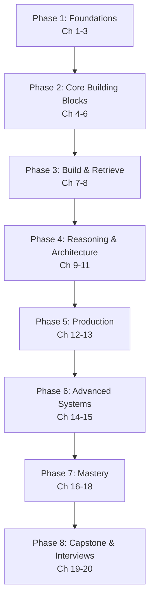

# Retrieval-Augmented Generation (RAG) — Complete Course

> From "what is a vector?" to designing production-grade, agentic, enterprise RAG systems — a structured, professional learning path.

---

## Course Overview

Retrieval-Augmented Generation (RAG) is the architecture that lets Large Language Models (LLMs) answer questions using knowledge they were never trained on — your company's documents, last week's news, a private codebase — by **retrieving** relevant information at query time and **feeding it into the prompt** before generation.

This course takes you from absolute beginner to professional, covering:

- The theory of information retrieval that predates and underpins RAG
- Embeddings, chunking, and vector databases
- Building a working RAG pipeline end-to-end
- Advanced retrieval (hybrid search, re-ranking, query transformation)
- RAG architectures (Naive → Advanced → Corrective → Graph → Agentic → RAPTOR)
- Production concerns: caching, monitoring, scaling, security
- Evaluation methodology and tooling
- Agentic and enterprise RAG
- Multimodal retrieval
- Capstone projects and interview preparation

Every chapter builds on the previous one. Concepts are introduced in plain language first, then formalized, then connected to production practice.

---

## Who This Course Is For

You should be comfortable with:

- **Python** — functions, classes, basic async/await, working with JSON and REST APIs
- **Basic ML/NLP intuition** — you don't need to have trained a neural network, but you should know what a "model" is
- **Command line basics** — running scripts, installing packages with pip

You do **not** need prior experience with LangChain, vector databases, or LLM APIs — those are taught from scratch in [Chapter 1](./01-introduction-and-prerequisites.md).

---

## Learning Roadmap

| Phase | Milestone | Chapters |
|---|---|---|
| 1. Foundations | Explain RAG's motivation and internal architecture from memory | 1–3 |
| 2. Core Building Blocks | Choose embeddings, chunking, and a vector DB for a given use case | 4–6 |
| 3. Build & Retrieve | Ship a working "Chat with PDF" RAG app | 7–8 |
| 4. Reasoning & Architecture | Pick the right RAG architecture and query strategy for a problem | 9–11 |
| 5. Production | Deploy a RAG system with caching, monitoring, and security | 12–13 |
| 6. Advanced Systems | Build agentic, enterprise, and multimodal RAG | 14–15 |
| 7. Mastery | Apply best practices and avoid known failure modes fluently | 16–18 |
| 8. Capstone & Interviews | Ship a production-grade capstone and pass a RAG system-design interview | 19–20 |

---

## Estimated Learning Timeline (90 Days)

**Month 1 — Foundations & First Build** (Ch 1–7): Python/NLP refresh, embeddings, chunking, vector databases, your first working RAG pipeline.
*Project: Chat with a PDF.*

**Month 2 — Retrieval Mastery & Production** (Ch 8–13): hybrid search, re-ranking, query transformation, RAG architectures, production concerns, evaluation.
*Projects: Multi-document RAG, Website Chatbot, GitHub Repo Chat.*

**Month 3 — Advanced Systems & Capstone** (Ch 14–20): agentic RAG, enterprise/multimodal RAG, best practices, capstone, interview prep.
*Projects: Agentic Research Assistant, Enterprise Knowledge Assistant (production-grade capstone).*

If you can commit ~1–1.5 hours/day, 90 days is realistic for professional proficiency. Compress to ~30 days at 3–4 hours/day if you already know Python and basic ML.

---

## Prerequisites

See [Chapter 1](./01-introduction-and-prerequisites.md) for a full self-assessment, covering:

- **Programming**: Python, OOP, REST APIs, async programming, JSON, HTTP
- **Math/ML**: linear algebra basics, probability, cosine similarity, neural networks, transformers (conceptual)
- **NLP**: tokens, tokenization, attention, context windows, embeddings
- **LLM basics**: prompt engineering, temperature, top-k/top-p, function calling, structured output

---

## Complete Chapter Index

| # | Chapter | What You'll Learn |
|---|---|---|
| 01 | [Introduction & Prerequisites](./01-introduction-and-prerequisites.md) | What RAG is, why it exists, self-assessment, environment setup |
| 02 | [Core Concepts of RAG](./02-core-concepts.md) | Retrieval vs. generation, grounding, hallucination, key terminology |
| 03 | [Architecture & Internals](./03-architecture-and-internals.md) | Full pipeline internals, classic IR (BM25, TF-IDF), document processing |
| 04 | [Embeddings Fundamentals](./04-embeddings-fundamentals.md) | Vector spaces, similarity metrics, embedding model landscape |
| 05 | [Chunking Strategies](./05-chunking-strategies.md) | Fixed, recursive, semantic, parent-child chunking, best practices |
| 06 | [Vector Databases](./06-vector-databases.md) | FAISS, Chroma, Qdrant, Milvus, Pinecone, Weaviate, pgvector, ANN/HNSW |
| 07 | [Building Your First RAG Pipeline](./07-building-your-first-rag.md) | End-to-end hands-on build with LangChain/LlamaIndex |
| 08 | [Advanced Retrieval Techniques](./08-advanced-retrieval-techniques.md) | MMR, hybrid search, multi-query, self-query, re-ranking |
| 09 | [Prompt Engineering for RAG](./09-prompt-engineering-for-rag.md) | Context formatting, citations, structured outputs |
| 10 | [RAG Architectures](./10-rag-architectures.md) | Naive → Advanced → CRAG → Adaptive → Graph → RAPTOR |
| 11 | [Query Transformation](./11-query-transformation.md) | Rewriting, decomposition, HyDE, step-back prompting |
| 12 | [Production RAG Systems](./12-production-rag-systems.md) | Pipelines, caching, streaming, monitoring, scaling, security |
| 13 | [Evaluation & Testing](./13-evaluation-and-testing.md) | Recall@K, faithfulness, Ragas, DeepEval, TruLens, LangSmith |
| 14 | [Agentic RAG](./14-agentic-rag.md) | Planning, tool calling, reflection, memory, LangGraph, MCP |
| 15 | [Enterprise & Multimodal RAG](./15-enterprise-and-multimodal-rag.md) | Multi-tenancy, compliance, image/table/audio retrieval |
| 16 | [Best Practices](./16-best-practices.md) | Consolidated professional checklist across the whole stack |
| 17 | [Common Mistakes & Pitfalls](./17-common-mistakes-and-pitfalls.md) | Failure modes and how to avoid them |
| 18 | [Tools & Libraries Landscape](./18-tools-and-libraries-landscape.md) | Framework/DB/model comparison, must-read papers |
| 19 | [Capstone Projects](./19-capstone-projects.md) | Beginner → production-grade project specs and architecture |
| 20 | [Interview Preparation](./20-interview-preparation.md) | Q&A, system design, troubleshooting, production case studies |

---

## Milestones Checklist

- [ ] Explain the RAG pipeline end-to-end without notes
- [ ] Compare 3 embedding models on quality/speed/cost trade-offs
- [ ] Implement 3 chunking strategies and explain when to use each
- [ ] Stand up a vector database and run a hybrid search query
- [ ] Ship a working "Chat with PDF" application
- [ ] Add re-ranking and query transformation to improve retrieval quality
- [ ] Deploy a RAG system with caching, monitoring, and PII masking
- [ ] Build an evaluation harness with Ragas or DeepEval
- [ ] Build an agentic RAG system with LangGraph
- [ ] Complete a production-grade capstone project
- [ ] Answer all interview questions in Chapter 20 confidently

---

## Recommended Resources

**Papers** (full list with context in [Chapter 18](./18-tools-and-libraries-landscape.md)): Original RAG (Lewis et al., 2020), DPR, ColBERT, SPLADE, RAPTOR, CRAG, Self-RAG, HyDE, GraphRAG.

**Frameworks**: LangChain, LlamaIndex, Haystack, LangGraph.

**Vector Databases**: FAISS (local/learning), Chroma (beginner-friendly), Qdrant/Milvus/Pinecone/Weaviate (production).

**Evaluation**: Ragas, DeepEval, TruLens, LangSmith.

**Communities**: r/LocalLLaMA, LangChain Discord, Hugging Face forums, MTEB leaderboard (for embedding model comparisons).

---

  
  <a href="./00-index.md">🏠 Index</a>
  <a href="./01-introduction-and-prerequisites.md">Next: Introduction & Prerequisites →</a>

